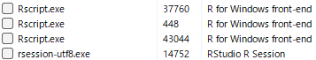

# 並列演算（Parallel Computing）

Code

我々が算数のテストを解くとき、普通は一番初めの問題から一つづつ、順番に解いていきます。Rも同じで、スクリプトとして書いたコードを上から1行ずつ評価し、演算します。`for`文などの繰り返し演算でも同じで、繰り返し回数分だけ順番に演算を行います。しかし、繰り返し演算に時間のかかる処理が含まれると、演算にはとても時間がかかります。

1人で計算せずに2人で計算すればテストは速く解けます。同様に、Rでも1つのRで演算せずに、2つ以上のRで演算すれば速く演算が終わります。`for`文であれば、以下のように2つに分けて、2つのRで計算すれば演算時間を半分ぐらいにできます。

``` downlit
# 通常のfor文
for(i in 1:10){sqrt(i)}

# 上記のfor文を2つに分ける
for(i in 1:5){sqrt(i)}
for(i in 6:10){sqrt(i)}
```

時間のかかる演算を少しでも速くするため、繰り返しのある演算を分割し、分割した演算を複数立ち上げたR（セッション）で演算することで計算速度を速める手法のことを**並列演算（Parallel Computing）**と呼びます。

## セッション

Rの**セッション**とは、Rが起動して演算できる状態であることを示す言葉です。Rを起動するとRのセッションが1つ立ち上がります。同時にRをもう一つ開くこともでき、1つ目のRと2つ目のRで別の演算を行うことができます。

並列演算では、Rをたくさん立ち上げる、つまりセッションをたくさん準備して、そのそれぞれのセッションに演算を分割することで演算速度を速めます。この立ち上げたセッションのまとまりのことをクラスターとも呼びます。

重い演算を用いる統計のパッケージでは、パッケージの機能自体に並列演算が組み込まれている場合があります。一方で、自分で書いたスクリプトで並列演算を行いたい場合、自分で演算を分割して複数のセッションに投げる、というのは大変ですので、パッケージを利用してRに並列演算を任せることになります。

## 並列演算の手法

並列演算には大きく分けて、**Socket**と**Fork**と呼ばれる2つの方法があります。

- Socket：Rのセッションを新規に立ち上げ、それぞれのセッションで演算を行う手法
- Fork：Rの現在のセッションをコピーし、複数のセッションでそれぞれ演算を行う手法

あまり変わらないように見えますが、Socketでは現在のセッションの情報を別のセッションでは持ち越せない、つまりパッケージの読み込みの状態や変数は別のセッションには持ち込まれないのに対し、Forkではパッケージの読み込みの状態や変数も（メモリを共有する形で）持ち込めます。

Socketでは各セッションでパッケージの読み込みや変数の設定を行う必要があり、時間が取られます。一方でForkはパッケージの読み込みや変数の設定を行うことなく演算ができます。

何より違うのは、**Windowsでは基本的にForkを使えない**、ということです。ですので、LinuxやMacOSではSocketもForkも使えるのに対し、WindowsではSocketしか使えません。また、RStudioはForkと相性があまりよくありません。自分のPCでForkが利用可能かどうかは、以下の[`parallelly::supportsMulticore`](https://parallelly.futureverse.org/reference/supportsMulticore.html)関数で確認することができます([Bengtsson 2026b](#ref-parallelly_bib))。Forkが利用可能であれば`TRUE`が、利用できなければ`FALSE`が返ってきます。

``` downlit
pacman::p_load(parallelly)
supportsMulticore()
```

    [1] FALSE

## 並列演算のパッケージ

[CRAN: Task Views](https://CRAN.R-project.org/view=HighPerformanceComputing)には`Rmpi`([Yu 2002](#ref-rmpi_bib))と`snow`([Tierney et al. 2021](#ref-snow_bib))がRの並列演算のコアパッケージであるとされています。これらは基本のパッケージで、他のパッケージの開発などに用いることが想定されており、Rのユーザーが自分のスクリプトで利用するのは難しいです。

ユーザー向けの並列演算のパッケージとして、現在では主に以下の3つが利用されています。

- `parallel`パッケージ([R Core Team 2025](#ref-parallel_bib))
- `foreach` + `doParallel`パッケージ([Microsoft and Weston 2022](#ref-foreach_bib); [Corporation and Weston 2022](#ref-doParallel_bib))
- `future`パッケージ([Bengtsson 2021](#ref-RJ-2021-048))

`parallel`が最も昔から用いられているパッケージで、長年よく利用されていたのが`foreach`と`doParallel`パッケージです。`future`は2017年頃から開発が始まり、2021年にver.1.0となった新しいパッケージです。`future`には[futureverse](https://www.futureverse.org/)というパッケージ群があり、`parallel`・`foreach`よりも簡単で安全に並列演算ができるパッケージとなっています。また、2026年には`futurize`([Bengtsson 2026a](#ref-futurize_bib))という`future`をより簡単に利用できるパッケージが発表されています。

ここではまず`parallel`、`foreach`から説明しますが、とりあえず並列演算を試してみたい、という場合には右のメニューから`future`パッケージの記事を選んで読んでいただければと思います。

## parallelパッケージ

まずは`parallel`パッケージから説明します。`parallel`はSocket・Forkの両方に対応し、[19章](chapter19.llms.md)で説明した`apply`関数に相当する演算を並列化することができるパッケージです。

まずは`parallel`パッケージをインストールし、読み込みます。[21章](chapter21.llms.md#演算時間の計測)で紹介した演算時間計測のためのパッケージである`tictoc`([Izrailev 2023](#ref-tictoc_bib))も同時に読み込んでおきます。

``` downlit
pacman::p_load(parallel, tictoc)
```

次に、自分のPCの**CPUのコア**の数を`detectCores`関数で調べます。現代のPCに搭載されているCPUは、通常6個以上のコアを持ちます。このコアはPCでマルチタスクを行うために用いられているCPUの演算の基本単位で、並列演算の場合には複数のコアを利用して演算を行います。私の使っているPCではコアは20個ですので、並列演算は最大で20まで設定できます。

ただし、すべてのコアをRに捧げてしまうと他のことがPCでできなくなったり、演算が遅くなってしまいますので、利用するコアは最大でも`detectCores`の返り値から1を引いた数、私のPCであれば19、で設定するのがよいでしょう。

``` downlit
detectCores()
```

    [1] 20

まずは通常の演算（上から順番に計算するので**sequential**と呼ばれます）で重めの計算をしてみます。以下の関数は2秒待った後で引数`x`をそのまま返す関数です。

``` downlit
f <- function(x = 1){
  Sys.sleep(2)
  x
}
```

次に、[19章](chapter19.llms.md)で説明した`lapply`関数で`f`関数の演算を3回行います。この演算にかかる時間を`system.time`関数で調べると、6秒程度かかっていることがわかります。2秒かかる関数の演算を3回繰り返しているので当然の結果です。

``` downlit
lapply(1:3, f) |> system.time()
```

       user  system elapsed 
       0.00    0.00    6.13 

次に、`parallel`パッケージでForkを利用した`lapply`の計算を行う`mclappply`関数を使ってみます。`mc.cores`は利用するコアの数を指定するための引数です。ForkはWindows PCでは利用できないため、エラーが出て演算が行われません。

``` downlit
mclapply(1:3, f, mc.cores = 3) |> system.time()
```

    Error in `mclapply()`:
    ! 'mc.cores' > 1 is not supported on Windows

    Timing stopped at: 0 0 0

`mclapply`をDockerの[rocker/rstudio](https://hub.docker.com/r/rocker/rstudio)（Linuxの環境）で実行すると2秒で計算が終わります。2秒かかる`f`関数を3回行う演算が`f`関数1回分で終わっていることになります。ですので、LinuxやMacOSでは`mclapply`を用いることでForkでの並列演算を行うことができています。

[](./image/mclapply.png "Linuxでのmclapplyの実行")

Linuxでのmclapplyの実行

WindowsではSocketを用いる関数である`parLapply`関数を用いて並列演算を行います。ただし、`parLapply`関数はそのままでは並列演算を行うことができず、エラーが出ます。

``` downlit
parLapply(1:3, f) |> system.time()
```

    Error in `checkCluster()`:
    ! not a valid cluster

    Timing stopped at: 0 0 0

エラーメッセージに示された通り、`parLapply`関数を用いる場合にはまずクラスターを設定する必要があります。クラスターは`makeCluster`関数で設定できます。`makeCluster`関数の引数は数値で、`detectCores`関数で調べたコアの数より小さい数値を入力します。以下の例では3つのクラスターを設定しています。

`makeCluster`関数は`cl`という変数に代入しておき、後ほど`parLapply`関数の引数として用います。

``` downlit
cl <- makeCluster(3)
```

`makeCluster`関数を実行後、リソースモニターで確認すると、RstudioのRセッション（rsession-utf8.exe）以外に3つのRセッション（Rscript.exe）が実行されていることがわかります。

[](./image/rsessions.png "makeCluster関数で起動したRのセッション")

makeCluster関数で起動したRのセッション

この状態で`parLapply`関数に`cl`を引数として設定し実行すると、エラーが出ずに演算が2秒程度で完了します。`parLapply`関数でも並列演算によって、2秒かかる`f`関数を3回実行した時、1回分の演算時間で計算が完了していることが分かります。

``` downlit
parLapply(cl, 1:3, f) |> system.time()
```

       user  system elapsed 
       0.00    0.00    2.03 

`makeCluster`関数で起動したRのセッションはRを閉じても起動したままになってしまいます。並列演算が終わった後には、`stopCluster`関数で起動したRのセッションを閉じます。

``` downlit
stopCluster(cl)
```

ここまでが`parallel`パッケージの基本的な使い方です。以下に`mclapply`、`parLapply`以外の並列演算用の関数を示します。

| 関数名     | 対応するapply関数 | 演算の方法 |
|:-----------|:------------------|:-----------|
| mclapply   | lapply            | Fork       |
| mcmapply   | mapply            | Fork       |
| parLapply  | lapply            | Socket     |
| parSapply  | sapply            | Socket     |
| parApply   | apply             | Socket     |
| parRapply  | apply(MARGIN = 1) | Socket     |
| parCapply  | apply(MARGIN = 2) | Socket     |
| clusterMap | mapply            | Socket     |

parallelパッケージの関数群 {.caption-top .table .table-sm .table-striped .small}

### パッケージの利用と変数の設定

次に、パッケージを利用する関数について、Socketで利用する場合を見ていきます。以下の関数`f2`は`stringr`を読み込んだ後で定義されており、`stringr`で提供されている関数`str_c`を用いています。

``` downlit
library(stringr)
f2 <- function(x){
  str_c(x, ", ", Sys.time())
}
```

`lapply`関数で`f2`関数を利用した場合には、特に問題なく演算できます。また、Forkを用いる`mclapply`でも問題なく並列演算を行うことができます。

``` downlit
lapply(1:3, f2)
```

    [[1]]
    [1] "1, 2026-05-15 05:12:30.705529"

    [[2]]
    [1] "2, 2026-05-15 05:12:30.707201"

    [[3]]
    [1] "3, 2026-05-15 05:12:30.707585"

一方で、Socketの並列演算を行う`parLapply`関数で`f2`関数を呼び出すと、エラーが出ます。これは、Socketでは現在のセッションで呼び出したパッケージや定義した変数は別のセッションにはコピーされないため、パッケージで設定されている関数（`str_c`）が利用できないためです。

``` downlit
cl <- makeCluster(3)
parLapply(cl, 1:3, f2)
```

    Error in `checkForRemoteErrors()`:
    ! 3 nodes produced errors; first error: could not find function "str_c"

各セッションでパッケージをロードする場合には、`clusterEvalQ`関数を用います。`clusterEvalQ`関数は第一引数に`makeCluster`で作成したクラスター（`cl`）、第2引数に各セッションで読み込むコードを表記します。あらかじめ`clusterEvalQ`でパッケージを読み込んでおくことで、各セッションでパッケージを読み込み、パッケージを用いた演算を行うことができます。

``` downlit
clusterEvalQ(cl, library(stringr))
```

    [[1]]
    [1] "stringr"   "stats"     "graphics"  "grDevices" "utils"     "datasets" 
    [7] "methods"   "base"     

    [[2]]
    [1] "stringr"   "stats"     "graphics"  "grDevices" "utils"     "datasets" 
    [7] "methods"   "base"     

    [[3]]
    [1] "stringr"   "stats"     "graphics"  "grDevices" "utils"     "datasets" 
    [7] "methods"   "base"     

``` downlit
parLapply(cl, 1:3, f2)
```

    [[1]]
    [1] "1, 2026-05-15 05:12:31.042082"

    [[2]]
    [1] "2, 2026-05-15 05:12:31.041935"

    [[3]]
    [1] "3, 2026-05-15 05:12:31.041983"

同様に、現在のセッションで変数yを定義し、この`y`を用いた関数を並列演算で使ってみます。

``` downlit
y <- 2

f3 <- function(x){
  x + y
}
```

この場合もやはり`parLapply`関数では`y`を読みだせず、エラーとなります。Socketではパッケージだけでなく、変数の設定も別途指示する必要があります。

``` downlit
parLapply(cl, 1:3, f3)
```

    Error in `checkForRemoteErrors()`:
    ! 3 nodes produced errors; first error: object 'y' not found

上記のパッケージの設定の場合と同じく、`clusterEvalQ`関数で変数`y`を設定しておくと、`parLapply`の演算が実行されます。

``` downlit
clusterEvalQ(cl, y <- 2)
```

    [[1]]
    [1] 2

    [[2]]
    [1] 2

    [[3]]
    [1] 2

``` downlit
parLapply(cl, 1:3, f3)
```

    [[1]]
    [1] 3

    [[2]]
    [1] 4

    [[3]]
    [1] 5

現在のセッションからSocketのセッションへと変数を持ち出す場合、`clusterExport`関数を利用することもできます。`clusterExport`関数はクラスターの変数`cl`と文字列の変数名を引数に取ることで、現在のセッションで設定されている変数を各セッションに持ち出すことができます。

``` downlit
clusterExport(cl, "y")
parLapply(cl, 1:3, f3)
```

    [[1]]
    [1] 3

    [[2]]
    [1] 4

    [[3]]
    [1] 5

とは言え、たくさんの変数やパッケージをSocketのセッションに持ち込むのは大変です。利用するパッケージや変数は関数内で指定する方がよいでしょう。

## foreach + doParallelパッケージ

`foreach`は`apply`関数群に近い演算を行う`foreach`関数を提供しているパッケージです。`foreach`は`for`文っぽい構文で利用します。ただし、[`foreach`は`for`文というわけではない](https://henrikbengtsson.github.io/futureverse-tutorial-raukr2025/#/foreach-is-not-a-for-loop)ので、やや分かりにくいところのある関数ではあります。

`foreach`はそれだけでは並列演算に用いることはできませんが、`doParallel`と組み合わせることで並列演算を行うことができます。`doParallel`は`foreach`に並列演算を持ち込むためだけのパッケージで、`foreach`と`doParallel`はほぼ常にセットで利用されます。

``` downlit
pacman::p_load(foreach, doParallel)
```

### foreach関数の構文

`foreach`関数は以下のような式で利用します。`for`文と同じように、`foreach`の後ろのカッコにはイテレーターのベクターを設定します。`for`文でのカッコと中カッコ（[`{}`](https://rdrr.io/r/base/Paren.html)）の間には`%do%`という演算子を用います。

``` downlit
# for(i in vec){eval}と同じ
foreach(i = vec) %do% {eval}
```

`for`と`foreach`の違いは式の形だけでなく、返り値にもあります。`for`文はそれ自体は何も返しませんが、`foreach`は返り値があります。返り値のデフォルトはリストで、`{eval}`で演算したものをリストの要素として返します。

``` downlit
foreach(i = 1:3) %do% {f(i)}
```

    [[1]]
    [1] 1

    [[2]]
    [1] 2

    [[3]]
    [1] 3

ですので、上記の`foreach`関数は下の`lapply`と同じ演算になります。

``` downlit
lapply(1:3, f)
```

    [[1]]
    [1] 1

    [[2]]
    [1] 2

    [[3]]
    [1] 3

また、`for`文をネストする場合と同じく、`foreach`もネストすることができます。以下の`foreach`文では`i`と`j`を繰り返す演算を行っています。この`foreach`と`foreach`を繋いでネストする場合には、`%:%`という演算子を用います。

``` downlit
# for(i in 1:2) for(j in 1:2){paste("i=", i, "j=", j, "i+J=", i + j)}とほぼ同じだが、
# 返り値があり、リストを返すところが異なる
foreach(i = 1:2) %:% foreach(j = 1:2) %do% {paste("i=", i, "j=", j, "i+J=", i + j)}
```

    [[1]]
    [[1]][[1]]
    [1] "i= 1 j= 1 i+J= 2"

    [[1]][[2]]
    [1] "i= 1 j= 2 i+J= 3"


    [[2]]
    [[2]][[1]]
    [1] "i= 2 j= 1 i+J= 3"

    [[2]][[2]]
    [1] "i= 2 j= 2 i+J= 4"

`foreach`文はそのままでは並列演算ではないため、2秒かかる関数である`f`関数を用いると、繰り返した分だけ時間がかかります。

``` downlit
tic()
a <- foreach(i = 1:3) %do% {f(i)}
toc()
```

    6.16 sec elapsed

`foreach`の引数`.combine`には演算結果を結合する方法を指定することもできます。`.combine=c`を指定すると返り値はベクター、`.combine=cbind`を指定すると返り値は行列になります。

``` downlit
foreach(i = 1:3, .combine = c) %do% {f(i)} # 返り値はベクター
```

    [1] 1 2 3

``` downlit
foreach(i = 1:3, .combine = cbind) %do% {f(i)} # 返り値は行列
```

         result.1 result.2 result.3
    [1,]        1        2        3

### 並列演算：%dopar%

`foreach`関数のカッコの間の演算子である`%do%`を`%dopar%`に変更すると、並列演算型の`foreach`の記法になります。ただし、`%do%`を`%dopar%`に変更するだけでは並列演算を行うことはできません。`parallel`の場合と同様に、`foreach`でもあらかじめクラスターを設定する必要があります。

``` downlit
tic()
a <- foreach(i = 1:3) %dopar% {f(i)}
```

    Warning: executing %dopar% sequentially: no parallel backend registered

``` downlit
toc()
```

    6.14 sec elapsed

### クラスターの設定

クラスターの設定は`parallel`パッケージとほぼ同じで、`makeCluster`関数で設定します。`makeCluster`関数の返り値は`registerDoParallel`関数の引数とします。

``` downlit
cores <- detectCores() - 1

cl <- makeCluster(cores)

registerDoParallel(cl)
```

クラスターを設定した上で`foreach`関数を`%dopar%`演算子で実行すると、並列演算を行うことができます。

``` downlit
tic()
a <- foreach(i=1:19) %dopar% {f(i)}
toc()
```

    2.09 sec elapsed

`%dopar%`を用いた演算はSocketですので、演算にパッケージを用いる場合にはエラーが出ます。

``` downlit
a <- foreach(i=1:19) %dopar% {f2(1)}
```

    Error in `{
        f2(1)
      }`:
    ! task 1 failed - "could not find function "str_c""

`foreach`では`.packages`引数にパッケージ名を文字列で指定することで、Rの各セッションでパッケージを読み込ませることができます。`parallel`と同様に、関数の中でパッケージの呼び出しや変数の定義を行った方が演算しやすいでしょう。

``` downlit
a <- foreach(i=1:7, .packages = "stringr") %dopar% {f2(1)}
```

`parallel`の場合と同様に、並列演算のためのRのセッションを閉じる時には`stopCluster`関数を用います。

``` downlit
stopCluster(cl)
```

### Forkの演算：doMCパッケージ（unavailable）

`foreach`でForkを用いた並列演算を行う場合には[`doMC`パッケージ](https://cran.r-project.org/web/packages/doMC/index.html)を用います。この`doMC`はUNIX用のファイルしか準備されておらず、Windowsではインストールすることはできません。`doMC`の使い方は`doParallel`とほぼ同様です。

``` downlit
pacman::p_load(doMC) # Windowsではインストール・演算できない
resisterDoMC(4)
foreach(i = 1:3) %dopar% {f(i)}
```

## futureパッケージ

`future`パッケージは最後発の、よりモダンな並列演算のためのパッケージです。`future`は基礎的な並列演算の関数を提供するためのパッケージで、この`future`を使ったパッケージ群（`future.apply`、`furrr`、`doFuture`、`futurize`）と共に[futureverse](https://www.futureverse.org/)というパッケージ群が整備されています。ただし、futureverseには`tidyverse`のように一度にパッケージをインストール・ロードできるような仕組みはありません。

``` downlit
pacman::p_load(future)
```

### 並列演算方法の指定

`future`では、並列演算の方法を`plan`関数で指定します。`plan(sequential)`は通常のRと同じ演算、`plan(multisession)`はSocketでの並列演算、`plan(multicore)`はForkでの並列演算をそれぞれ指定します。

``` downlit
plan(sequential)
```

この他にも`plan`関数の引数があり、それぞれ異なる設定で並列演算を組むことができます。`plan`関数の引数の一覧を以下の表に示します。

| 引数の設定 | 演算の方法 |
|:---|:---|
| sequential | 通常の演算（上から順に演算） |
| multisession | Socketによる並列演算 |
| cluster | 複数のPC（リモートを含む）を利用したSocketによる並列演算 |
| multicore | Forkによる並列演算 |
| callr | callrパッケージを用いた並列演算。メモリがすぐに解放される |
| mirai_multisession | miraiパッケージを用いた並列演算。遅延が小さい |
| mirai_cluster | miraiパッケージを用いた並列演算。miraiデーモンというセッションを用いる。複数PCを利用可能 |

future：plan関数の引数と並列演算のモード {.caption-top .table .table-sm .table-striped .small}

`future`では、並列演算を行う部分を`future`関数で表現します。ただし、この`future`関数の返り値はそのまま呼び出すことはできません。`future`関数の返り値は`value`関数の引数に取り、`value`関数の返り値として`future`関数での演算結果が返ってきます。

以下の例では`plan(sequential)`を指定しているため、`future`関数の部分は並列ではなく、順番に評価されています。

``` downlit
tic()

# 以下の3つが並列演算される部分
a <- future(f(1))
b <- future(f(2))
d <- future(f(3))

value(a)
```

    [1] 1

``` downlit
value(b)
```

    [1] 2

``` downlit
value(d)
```

    [1] 3

``` downlit
toc()
```

    6.17 sec elapsed

`plan(multisession)`を指定すると並列演算となり、全体の演算が2秒程度で完了します。

``` downlit
plan(multisession)

tic()

a <- future(f(1))
b <- future(f(2))
d <- future(f(3))

x <- value(a)
y <- value(b)
z <- value(d)

toc()
```

    2.09 sec elapsed

ただし、`plan(multisession)`を指定すると利用できる最大数のセッションが準備されてしまいます。`plan`関数では`workers`引数を指定することで準備するセッションの数を指定することができます。

``` downlit
plan(multisession, workers = 3)
```

`future`関数は`()`の中に中カッコ（[`{}`](https://rdrr.io/r/base/Paren.html)）を設定し、複数行のスクリプトを記述することもできます。

``` downlit
a <- future({x <- 1; x * 10})
```

`future`と`value`で呼び出す方法はやや迂遠です。`future`では、`%<-%`という形の演算子で`future`と`value`関数を合わせた演算を行うことができます。

``` downlit
a %<-% {f(1)}
b %<-% {f(2)}
d %<-% {f(3)}
```

`future`では現在のセッションで読み込んでいるパッケージを自動的にクラスターで読み込んだ上で演算してくれる場合もあります。以下の例では`stringr`の関数を用いていますが、問題なく演算が行われています。また、読み込むパッケージを指定する場合には`future`関数の`packages`引数として文字列で指定することもできます。

``` downlit
# パッケージを明示するときは a <- future({f2(1)}, packages="stringr") とする
a %<-% {f2(1)}
b %<-% {f2(2)}
d %<-% {f2(3)}

c(a, b, d)
```

    [1] "1, 2026-05-15 05:13:20.893587" "2, 2026-05-15 05:13:20.886623"
    [3] "3, 2026-05-15 05:13:20.905144"

ただし、変数を指定する場合にはクラスターで変数を指定してくれない場合もあります。

``` downlit
reset <- FALSE
x <- 1
y %<-% {if (reset) x <- 0; x + 1 }
y
```

    Error:
    ! object 'x' not found

このような場合には、`future`に与える式の中で一度変数を宣言してやるとうまくいくようになります。

``` downlit
reset <- FALSE
x <- 1
y %<-% { x; if (reset) x <- 0; x + 1 }
y
```

    [1] 2

`future`では`parallel`や`foreach` + `doParallel`のようにクラスターを止める関数はありません。Rが閉じればクラスターも止まりますが、明示的にクラスターを止める場合には`plan(sequential)`を実行するとよいでしょう。

## futureverse

上記の通り`future`では簡単に並列演算を実装することができます。しかし、並列演算するそれぞれのコードはいちいち記述しないといけませんし、`apply`関数などで利用するにはやや不便です。

この問題に対応するため、futureverseでは`apply`関数、`purrr`の関数（[44章](chapter44.llms.md)参照）([Wickham and Henry 2023](#ref-purrr_bib))、`foreach`での並列演算を行うための以下の3つのパッケージ群を備えています。

- `future.apply`：`apply`関数の並列化([Bengtsson 2021](#ref-RJ-2021-048))
- `furrr`：`purrr`の並列化([Vaughan and Dancho 2022](#ref-furrr_bib))
- `doFuture`：`foreach`の並列化([Bengtsson 2021](#ref-RJ-2021-048))

3つのパッケージをロードすることで、簡単に`future`を用いた並列化の演算を行うことができます。`future.apply`では`future_apply`などの関数（`apply`関数の並列化）、`furrr`では`future_map`などの関数（[`purrr::map`](https://purrr.tidyverse.org/reference/map.html)の並列化）、`doFuture`では`%dofuture%`演算子を使うことでそれぞれ`future`での並列演算を行うことができます。

``` downlit
pacman::p_load(future.apply, furrr, doFuture)

future_apply(iris[, 1:4], 2, mean)
```

    Sepal.Length  Sepal.Width Petal.Length  Petal.Width 
        5.843333     3.057333     3.758000     1.199333 

``` downlit
future_map(1:5, sqrt)
```

    [[1]]
    [1] 1

    [[2]]
    [1] 1.414214

    [[3]]
    [1] 1.732051

    [[4]]
    [1] 2

    [[5]]
    [1] 2.236068

``` downlit
foreach(i = 1:3) %dofuture% {f(1)}
```

    [[1]]
    [1] 1

    [[2]]
    [1] 1

    [[3]]
    [1] 1

> **TIP:**
>
> `futureverse`では、プログレスバーを表示するために`progressr`パッケージ([Bengtsson 2025](#ref-progressr_bib))を用いています。
>
> ``` downlit
> pacman::p_load(progressr)
> ```
>
> `progressr`でプログレスバーを表示する場合には、演算の途中で`progressor`関数を変数`p`に代入し、この`p`を繰り返し演算の内で関数として実行する必要があります。
>
> 以下の例では、[`progressor`の例](https://progressr.futureverse.org/)に記載されている通り、0.5秒ごとに足し算を行う関数である`slow_sum`関数を定義しています。
>
> `progressor`関数では、イテレータで評価する値を`along`引数に指定します。イテレータ内では`p`関数を実行します。準備はこれだけです。
>
> ``` downlit
> slow_sum <- function(x){
>   # プログレスバーの進み具合を評価するため、progressor関数を準備
>   p <- progressor(along = x)
>   v <- 0
>   for(i in 1:length(x)){
>     Sys.sleep(0.5)
>     v <- v + x[i]
>     # この関数を評価してプログレスバーが進む
>     p()
>   }
>   v
> }
> ```
>
> 次に、プログレスバーを表示させる必要があります。しかし、単に`slow_sum`関数を実行してもプログレスバーは表示されません。
>
> ``` downlit
> slow_sum(1:10)
> ```
>
>     [1] 55
>
> プログレスバーを表示させるには、`handlers`関数に`global=TRUE`を指定して実行しておく必要があります。また、プログレスバーの表示を終える場合には`global=FALSE`を指定します。
>
> ただし、この`handlers(global = TRUE)`をQuartoで実行するとエラーが出ます。理由は分からないのですが、qmdの実行時に`handlers`がすでに呼び出されているようです。
>
> ``` downlit
> handlers(global = TRUE)
> slow_sum(1:10)
> handlers(global = FALSE)
> ```
>
> `with_progress`関数を用いるとQuartoを用いている場合でもプログレスバーを表示させることができます。
>
> ``` downlit
> slow_sum(1:10) |> with_progress()
> ```
>
>     [1] 55
>
> この他にも、プログレスバーの表示方法や完了時の音の設定など、プログレスバーの細かな調整を行うことができます。

## futurizeパッケージ

とは言っても、それぞれのパッケージにはたくさんの関数が設定されており、覚えるのも大変です。昔から用いていた`apply`や`purrr`、`foreach`の関数をそのまま並列化できたほうが便利です。

そこで、futureverseでは今まで用いていた関数をそのまま`future`の手法で並列化するためのパッケージである`futurize`パッケージを提供しています。

この`futurize`パッケージの`futurize`関数を用いるだけで、今まで使っていた関数を並列化することができます。

`futurize`を利用する際には`future.apply`、`furrr`、`doFuture`も読み込む必要があります。

``` downlit
pacman::p_load(futurize, future.apply, furrr, doFuture)
```

`futurize`関数の使い方は簡単で、`plan`で並列化の方法を指定した後、`apply`や`map`、`foreach`関数の後に`futurize`関数をパイプで繋ぐだけです。`futurize`関数をパイプで繋ぐだけでそれぞれの関数を`future`式の並列演算に変換（`futurize`）することができます。

``` downlit
apply(iris[, 1:4], 2, mean) |> futurize() # future_applyと同じ
```

    Sepal.Length  Sepal.Width Petal.Length  Petal.Width 
        5.843333     3.057333     3.758000     1.199333 

``` downlit
map(1:5, f) |> futurize() # future_mapと同じ
```

    [[1]]
    [1] 1

    [[2]]
    [1] 2

    [[3]]
    [1] 3

    [[4]]
    [1] 4

    [[5]]
    [1] 5

``` downlit
foreach(i = 1:3) %do% {f(1)} |> futurize() # %doFuture%を用いるのと同じ
```

    [[1]]
    [1] 1

    [[2]]
    [1] 1

    [[3]]
    [1] 1

Bengtsson, Henrik. 2021. “A Unifying Framework for Parallel and Distributed Processing in r Using Futures.” *The R Journal* 13 (2): 208–27. <https://doi.org/10.32614/RJ-2021-048>.

Bengtsson, Henrik. 2025. *Progressr: An Inclusive, Unifying API for Progress Updates*. <https://doi.org/10.32614/CRAN.package.progressr>.

Bengtsson, Henrik. 2026a. *Futurize: Parallelize Common Functions via One Magic Function*. <https://doi.org/10.32614/CRAN.package.futurize>.

Bengtsson, Henrik. 2026b. *Parallelly: Enhancing the ’Parallel’ Package*. <https://doi.org/10.32614/CRAN.package.parallelly>.

Corporation, Microsoft, and Steve Weston. 2022. *doParallel: Foreach Parallel Adaptor for the ’Parallel’ Package*. <https://doi.org/10.32614/CRAN.package.doParallel>.

Izrailev, Sergei. 2023. *Tictoc: Functions for Timing r Scripts, as Well as Implementations of "Stack" and "StackList" Structures*. <https://CRAN.R-project.org/package=tictoc>.

Microsoft, and Steve Weston. 2022. *Foreach: Provides Foreach Looping Construct*. <https://doi.org/10.32614/CRAN.package.foreach>.

R Core Team. 2025. *R: A Language and Environment for Statistical Computing*. R Foundation for Statistical Computing. <https://www.R-project.org/>.

Tierney, Luke, A. J. Rossini, Na Li, and H. Sevcikova. 2021. *Snow: Simple Network of Workstations*. <https://doi.org/10.32614/CRAN.package.snow>.

Vaughan, Davis, and Matt Dancho. 2022. *Furrr: Apply Mapping Functions in Parallel Using Futures*. <https://doi.org/10.32614/CRAN.package.furrr>.

Wickham, Hadley, and Lionel Henry. 2023. *Purrr: Functional Programming Tools*. <https://CRAN.R-project.org/package=purrr>.

Yu, Hao. 2002. “Rmpi: Parallel Statistical Computing in r.” *R News* 2 (2): 10–14. <https://cran.r-project.org/doc/Rnews/Rnews_2002-2.pdf>.

Back to top
