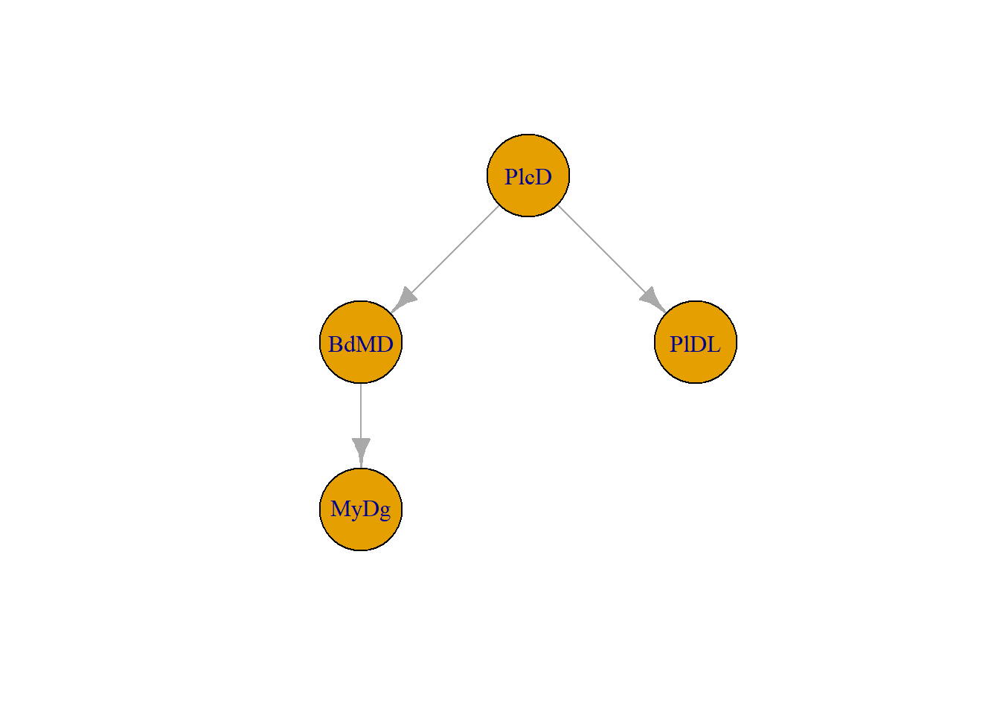

# S4クラス

Code

**S4**はS3と同じくR言語のオブジェクト指向プログラミングのためのクラスです。S3がS言語のver.3を意味するのと同様に、S4はS言語のver.4（1998年）で実装されたため、S4と呼ばれています。

S4はS3よりはオブジェクト指向っぽいクラスで、クラスの定義においてクラスの要素（**Slots**）のデータ型を固定することができます。ただし、メソッド（Rでは関数）はクラスの定義とは別に定義しないといけないのが他のオブジェクト指向言語（RubyやPython）とは異なります。

RでS4が最も用いられているのは[Bioconductor](https://www.bioconductor.org/)のパッケージ群です。Bioconductorではパッケージの開発時にS4を使うよう定められているため、Bioconductorで用いられるクラスほぼS4です。したがって、Bioconductorのパッケージ群を利用する生物学者、生物情報学者の方はS4の知識を持っているほうがよいでしょう。

Bioconductorのように非常に大規模なパッケージ群を作成する場合、S4を用いることでより統一感のあるクラス群を比較的簡単に実装することができます。

一方でS4は使いかたが複雑で、S3より学ぶのが難しいです。規模が小さいプロジェクトやパッケージではS3クラスで十分である場合もあります。

## S4クラスの基礎

以下では、S4について書かれたテキスト([Genolini 2008](#ref-Genolini_2008))と[AppsilonのS4についてのポスト](https://www.appsilon.com/post/object-oriented-programming-in-r-part-3)、[Advanced RのS4の章](https://adv-r.hadley.nz/s4.html)([Wickham 2019](#ref-Wickham_Hadley2019-05-24))を参考にS4について説明していきます。

とは言え、S4もS3と同じくオブジェクト指向プログラミングのためのクラスです。S3でのクラス定義の基本的な概念はS4にも通じます。

S4でも、S3と同じく以下の要素をクラスの定義として記載していくことになります。

- Constructor：そのクラスのオブジェクト（インスタンス）を作成する関数
- Validator：そのクラスの要素の値が正しいことを検証するための関数
- Helper：そのクラスの取扱いを簡単にするための関数
- method：クラスに適用する関数の設計
- ジェネリック関数
- getter：クラスの要素（Slot）を取り出すための関数
- setter：クラスの要素（Slot）を設定するための関数
- inheritance：クラスの継承

S4は`methods`パッケージで設定されているクラスです。`methods`パッケージはRを起動すると自動的に読み込まれるようになっていますが、並列演算を行う場合などには読み込まれない場合もあります。必要に応じてパッケージを読み込むようにするとよいでしょう。

``` downlit
library(methods)
```

## クラスの定義

S4では専用の関数でクラスを定義します。クラスの定義に用いる関数は`setClass`関数です。

`setClass`関数はたくさんの引数を取れるのですが、最低限必要な引数は`Class`です。`Class`にはクラス名を文字列で指定します。

S4では`Class`名には単語の頭を大文字にする[アッパーキャメルケース](https://ja.wikipedia.org/wiki/%E3%82%AD%E3%83%A3%E3%83%A1%E3%83%AB%E3%82%B1%E3%83%BC%E3%82%B9)（`MyClassDefinition`など）を用いるのが一般的です。

``` downlit
setClass(Class = "MyDog")
```

S4では、そのクラスの要素のことを**Slots**と呼びます。Slotsには名前と値が設定できます。Slotsにはlistのような数値でのインデックスはなく、名前のインデックスだけが設定されており、呼び出しや書き込みにはSlotsの名前を用います。

S3とS4で大きく異なるのは、S3がその要素のデータ型を固定していないのに対し、S4では`slots`のデータ型が常に固定されている点です。このため、S3のように野放図に要素のデータ型を変えることはできず、S3より堅牢なクラスを作成することができます。

Slotsは`setClass`関数の`slots`引数に指定します。`slots`引数には、名前付きの文字列ベクターで、そのSlotsの名前とデータ型を指定します。

``` downlit
setClass(
  Class = "MyDog", 
  slots = c(
    name = "character",
    trick = "character",
    age = "numeric"
  )
)
```

### basicクラス

データ型には、basicクラス（Rで設定されているクラス）やS4クラスなどを指定することができます。設定可能なクラスは以下の表の通りです。

| 設定する値    | データ型・クラス         |
|:--------------|:-------------------------|
| “character”   | 文字列                   |
| “complex”     | 複素数                   |
| “double”      | 数値（倍精度浮動小数点） |
| “expression”  | 演算                     |
| “integer”     | 整数                     |
| “list”        | リスト                   |
| “logical”     | 論理型                   |
| “numeric”     | 数値                     |
| “single”      | 数値（浮動小数点）       |
| “raw”         | バイトデータ             |
| “vector”      | ベクター（virtual）      |
| “S4”          | S4（virtual）            |
| “NULL”        | NULL（空オブジェクト）   |
| “function”    | 関数                     |
| “externalptr” | Cのポインタ              |
| “ANY”         | どれでもよい（virtual）  |
| “VIRTUAL”     | VIRTUALクラス            |
| “missing”     | 値が無い                 |
| “namedList”   | 名前付きリスト           |

Slotsに指定可能なデータ型 {.caption-top .table .table-sm .table-striped .small}

## コンストラクタ

この`setClass`で設定したクラスのオブジェクト（インスタンス）は、`new`関数で作成することができます。ですので、S4でコンストラクタに当たるのはこの`new`関数です。しかし、`new`関数でオブジェクトを作成することは推奨されておらず、別途ヘルパー関数を作成してオブジェクトを作成する方がよいとされています。

上記の`MyDog`クラスのオブジェクトを`new`関数で作成すると、Slotsに何も登録されていないオブジェクトが作成されます。

``` downlit
Pochi <- new("MyDog")

Pochi
```

    An object of class "MyDog"
    Slot "name":
    character(0)

    Slot "trick":
    character(0)

    Slot "age":
    numeric(0)

`new`関数内でSlotsの要素を引数として指定すると、Slotsに指定した値が登録されます。

``` downlit
Shiro <- new("MyDog", name="Shiro", trick = "hand", age = 15)

Shiro
```

    An object of class "MyDog"
    Slot "name":
    [1] "Shiro"

    Slot "trick":
    [1] "hand"

    Slot "age":
    [1] 15

設定したSlotsは`@`を用いて呼び出すことができます。ただし、S4ではクラスのユーザーが`@`でSlotsを呼び出すことは推奨されておらず、アクセサ（ゲッターとセッター）を準備すべきであるとされています。

``` downlit
Pochi@name
```

    character(0)

``` downlit
Pochi@trick
```

    character(0)

``` downlit
Pochi@age
```

    numeric(0)

Slotsへの値の設定も`@`を用いて行うことができます。このSlotsへの値の設定では、値の型がクラスの設計時に指定したデータ型と一致する必要があり、データ型が一致しない場合には値を設定することはできません。

``` downlit
Pochi@name <- "Pochi"

# ageにはnumericを指定しているため、文字列は設定できない
Pochi@age <- "10"
```

    Error:
    ! assignment of an object of class "character" is not valid for @'age' in an object of class "MyDog"; is(value, "numeric") is not TRUE

``` downlit
# 年齢として不自然な値は設定できる
Pochi@age <- 150
```

上記の`MyDog`クラスの定義ではSlotsの要素の長さを指定していません。ですので、`age`に2つの値を指定するようなこともできます。

``` downlit
Pochi@age <- c(15, 150)
Pochi@age
```

    [1]  15 150

### デフォルト値の設定

`setClass`関数では、Slotsに指定するデフォルトの値を`prototype`引数で設定することができます。

``` downlit
setClass(
  Class = "MyDog", 
  slots = c(
    name = "character",
    trick = "character",
    age = "numeric"
  ),
# デフォルト値を設定する場合には、すべてのSlotsにデフォルト値を指定する必要がある。
  prototype = prototype(
    name = "Kuro",
    trick = "sit",
    age = 5
  )
)
```

デフォルト値を指定しておくと、`new`関数でオブジェクトを作成した際にSlotsにデフォルトとして指定した値が設定されます。

``` downlit
Kuro <- new("MyDog")

Kuro
```

    An object of class "MyDog"
    Slot "name":
    [1] "Kuro"

    Slot "trick":
    [1] "sit"

    Slot "age":
    [1] 5

上の例では初期値に具体的な値を指定しましたが、多くの犬の名前がKuroで、お座りが得意で、5歳、というわけではないので、クラスの設計時に初期値を設定する意味はありません。初期値は設定しないか、もしくは以下のように`NA`を指定しておくとよいとされています。

`NA`の指定時には`NA`のデータ型が`slots`に指定した型と同じである必要があるため、単に`NA`を用いるのではなく、`NA_character_`や`NA_real_`、`NA_integer_`などのデータ型付の`NA`を指定します。

``` downlit
setClass(
  Class = "MyDog", 
  slots = c(
    name = "character",
    trick = "character",
    age = "numeric"
  ),
  prototype = prototype(
    name = NA_character_,
    trick = NA_character_,
    age = NA_real_
  )
)
```

> **TIP:**
>
> クラスの情報を取得するための関数はいくつかあります。`className`はクラス名と定義されているenvironmentを返す関数、`slotNames`はSlotsの名前を返す関数、`getSlots`はSlotsのデータ型を名前付きベクターで返す関数、`getClass`関数は`className`と`getSlots`を合わせた情報を表示する関数です。いまいち使いどころが難しい関数ですが、後ほど説明する継承でスーパークラスの情報を得るような場合に用いるとよいでしょう。
>
> ``` downlit
> # クラス名を返す
> className("MyDog")
> ```
>
>     An object of class "className"
>     [1] "MyDog"
>     Slot "package":
>     [1] ".GlobalEnv"
>
> ``` downlit
> # Slots名を返す
> slotNames("MyDog")
> ```
>
>     [1] "name"  "trick" "age"  
>
> ``` downlit
> # Slotsの情報を返す
> getSlots("MyDog")
> ```
>
>            name       trick         age 
>     "character" "character"   "numeric" 
>
> ``` downlit
> # クラスとSlotsの情報を返す
> getClass("MyDog")
> ```
>
>     Class "MyDog" [in ".GlobalEnv"]
>
>     Slots:
>                                         
>     Name:       name     trick       age
>     Class: character character   numeric

### クラスの削除

S4クラスはクラス自体の定義を`removeClass`関数で削除することができます。

``` downlit
removeClass("MyDog")
```

    [1] TRUE

## バリデータ

上記の通り、S4ではSlotsのデータ型を指定できます。その他のSlotsの値の制限、例えばSlotsに設定可能な値の長さや範囲などは、別途`validity`引数に指定します。この`validity`引数は[S3で説明したバリデータ](Tips_S3class.llms.md#バリデータvalidator)に当たるものです。

`validity`引数は関数で指定します。この関数で指定した返り値が`FALSE`になった時には、オブジェクト作成時にエラーが出ます。

``` downlit
setClass(
  Class = "MyDog", 
  slots = c(
    name = "character",
    trick = "character",
    age = "numeric"
  ),
  # 引数にはobjectを指定する
  validity = function(object){
    length(object@name) == 1
  }
)
```

以下のように`name`の要素が2つだと`validity`の条件が`FALSE`になるため、エラーが出ます。

``` downlit
new("MyDog", name = c("Pochi", "Shiro"), trick = c("sit", "hand"), age = 10)
```

    Error in `validObject()`:
    ! invalid class "MyDog" object: FALSE

2つ以上の条件を`validity`に指定することもできますが、単に条件だけを表記すると、返り値が最後の条件（以下の例では`length(object@name) == 1`）だけに従ってしまいます。

``` downlit
setClass(
  Class = "MyDog", 
  slots = c(
    name = "character",
    trick = "character",
    age = "numeric"
  ),
  
  validity = function(object){
    object@age < 25
    length(object@name) == 1
  }
)
```

ですので、以下のように`name`の要素の長さが1であれば、`object@age<25`が成り立っていなくてもオブジェクトが作成できてしまいます。

``` downlit
new("MyDog", name = "Pochi", trick = c("sit", "hand"), age = 30)
```

    An object of class "MyDog"
    Slot "name":
    [1] "Pochi"

    Slot "trick":
    [1] "sit"  "hand"

    Slot "age":
    [1] 30

ですので、`validity`は`stop`や`stopifnot`関数のようなエラーを出す関数で指定したほうが良いでしょう。

``` downlit
setClass(
  Class = "MyDog", 
  slots = c(
    name = "character",
    trick = "character",
    age = "numeric"
  ),
  
  validity = function(object){
    stopifnot(object@age < 25)
    stopifnot(length(object@name) == 1)
  }
)
```

バリデータを設定しておくと、`validObject`関数でオブジェクトに設定したSlotsに問題がないかを確認することができます。

``` downlit
Pochi <- new("MyDog", name = "Pochi", trick = c("sit", "hand"), age = 15)

# バリデータの条件に合致しているとTRUEが返ってくる
validObject(Pochi)
```

    [1] TRUE

> **TIP:**
>
> バリデータは`setClass`内だけではなく、`setValidity`関数で設定することもできます。
>
> ``` downlit
> setValidity(
>   Class = "MyDog", 
>   function(object){stopifnot(length(object@name) == length(object@age))}
> )
> ```
>
>     Class "MyDog" [in ".GlobalEnv"]
>
>     Slots:
>                                         
>     Name:       name     trick       age
>     Class: character character   numeric
>
> この`setValidity`でバリデータを設定すると、`setClass`でクラスを定義した時のバリデータが上書きされます。エラーの原因となりますので、`setValidity`は使わず、バリデータは`setClass`内できちんと定義したほうがよいでしょう。
>
> ``` downlit
> # object@age < 25 が成立していなくてもオブジェクトが作成できる
> pochishiro <- new("MyDog", name = "Pochi", trick = c("sit", "hand"), age = 150)
>
> pochishiro
> ```
>
>     An object of class "MyDog"
>     Slot "name":
>     [1] "Pochi"
>
>     Slot "trick":
>     [1] "sit"  "hand"
>
>     Slot "age":
>     [1] 150

> **TIP:**
>
> 同じ名前のクラスを`setClass`で作成し直してみましょう。`MyDog`クラスを作り直し、`slots`の名前が変わると、元の`MyDog`クラスで作成したオブジェクトはエラーを吐き出すようになります。クラスを途中で作り直すとエラーの原因となりますので、できればクラスはそのクラスを用いるスクリプトとは別ファイルで定義し、`source`関数で読み込んで使いましょう。また、スクリプト内ではクラスの設定を変えない方がよいでしょう。
>
> ``` downlit
> setClass(
>   Class = "MyDog", 
>   slots = c(
>     namae = "character",
>     gei = "character"
>   )
> )
>
> pochishiro
> ```
>
>     An object of class "MyDog"
>     Slot "namae":
>
>     Error in `slot()`:
>     ! no slot of name "namae" for this object of class "MyDog"

## ヘルパー

クラスに適切にバリデータが設定できたら、次にヘルパーを作成していきます。ヘルパーはクラスのオブジェクトを作成するときの関数です。S4では、`setMethod`関数を用いてクラスオブジェクトを引数とする関数を作成していきます。

### initializer

まずは`setMethod`関数でクラス作成時に実行される関数（**initializer**）を作成します。initializerはその関数の名前である`initialize`で呼び出すのではなく、`new`関数が呼び出されたときに実行される関数です。クラスオブジェクトを作成したときに表示される文字列やSlotsに設定するattributes（ベクターの名前や行列・データフレームのdim、列名など）の設定を定義しておくと良いでしょう。

initializerを設定するには、`setMethod`関数の関数名を指定する`f`引数に`f="initialize"`を指定します。`setMethod`関数では`signature`引数にクラス名、`definition`引数に関数の内容を記載します。`definition`引数には関数を指定します。

また，initializer内でオブジェクトの構造を変更するような場合には，`definition`内で`validObject`関数を呼び出し，変更後のオブジェクトが適切な構造を持つか評価することもできます．

``` downlit
# setMethod関数でinitializeを定義する
setMethod(
  f = "initialize",
  signature = "MyDog",
  definition = function(.Object, name, trick, age){
    cat("--- MyDog: Initialized --- \n")
    .Object@name <- name
    .Object@trick <- trick
    .Object@age <- age
    cat("name: ", .Object@name, "\n")
    cat("trick: ", .Object@trick, "\n")
    cat("age: ", .Object@age, "\n")
#    validObject(.Object) # バリデータを持ち込む場合（オブジェクトが変更されないなら不要）
    return(.Object)
  }
)

# newでオブジェクトを作成すると、initializeで定義した関数が実行される
Pochi <- new("MyDog", "Pochi", "sit", 10)
```

    --- MyDog: Initialized --- 
    name:  Pochi 
    trick:  sit 
    age:  10 

### ユーザー向けのコンストラクタ

S4ではクラスオブジェクトを`new`関数で作成できますが、この`new`関数はクラス名と結びついておらず、クラスの作成するにはちょっと使いにくい関数です。

[S3の章](Tips_S3class.llms.md#ヘルパーhelper)で説明した通り、Rでは関数名と作成するオブジェクトのクラスが一致する場合が多いです。例えば、`factor`を作成するときには`factor`関数、`data.frame`を作成するときには`data.frame`関数を用いています。

S4でも同じく、クラス名と同じ名前の関数でオブジェクトを作成するほうが良いでしょう。このオブジェクト作成のための関数の名前には、はじめの単語以外の頭を大文字にする[ロウワーキャメルケース](https://ja.wikipedia.org/wiki/%E3%82%AD%E3%83%A3%E3%83%A1%E3%83%AB%E3%82%B1%E3%83%BC%E3%82%B9)（`myClassDefinition`など）を用います。

``` downlit
# 通常のfunctionで作成できる
myDog <- function(name, trick, age){
  new("MyDog", name, trick, age)
}

Pochi <- myDog("Pochi", "sit", 10)
```

    --- MyDog: Initialized --- 
    name:  Pochi 
    trick:  sit 
    age:  10 

また、同様のコンストラクタは`setClass`関数の返り値を変数に代入することでも設定できます。

``` downlit
myCat  <- setClass("MyCat", slots = c(name = "character"))

myCat()
```

    An object of class "MyCat"
    Slot "name":
    character(0)

> **TIP:**
>
> S4では、RubyやPythonのようなメソッドはなく、関数だけが設定できます。このS4クラスの関数を作成するための関数が`setMethod`関数です。
>
> 一方、上記のようにS4を引数に用いる場合にも`function`で関数を作成することもできます。
>
> `setMethod`でも`function`でも関数は作成できますが、`setMethod`関数では引数のデータ型などを指定でき、より堅牢な関数を作成できます。その代わり、ジェネリック関数としての指定が必要となるなど、関数の設計が複雑になります。
>
> しっかりとしたS4クラス用の関数が必要な場合には`setMethod`、その他の場合には`function`を用いるとよいでしょう。

### ジェネリック関数の設定：setGeneric・setMethod関数

#### setMethod関数

上記のinitializerですでに説明しましたが、S4でジェネリック関数を設定する場合には、`setMethod`関数を用います。まずは既存の関数である`show`関数のジェネリックを設定していきます。

まず`show`関数の引数を調べます。`args`関数を用いると関数の引数名を調べることができます。`show`関数は`object`を引数に取っています。

``` downlit
args("show")
```

    function (object) 
    NULL

次に、`setMethod`関数でクラスに対応したジェネリック関数を作成します。`f`引数は関数名を文字列で指定します。`show`関数のジェネリックを作成する場合には、`f="show"`を指定します。

`signature`引数には引数のクラスを指定します。この`signature`にはクラス名の文字列、名前付きベクターを取ることができます。また、やや複雑なのですが、同名の関数があり、`signature`引数に`signature`関数を取ることもできます。

`signature`関数は`ジェネリック関数の引数=クラス名`という引数を取る関数で、ジェネリック関数の引数に特定のクラスを指定するために用います。ベクターで`signature`を設定する場合も同様の名前付きベクターとして設定します。以下の例では`show`関数の引数`object`に`MyDog`クラスが指定された場合の`show`関数を設定するため、`signature`関数の引数は`object="MyDog"`としています。

この`signature`の指定時に、ジェネリック関数の引数名が元の関数と異なるとエラーが出ます。`show`関数であれば元の引数名である`object`を用いる必要があります。

関数の定義は`definition`に関数として記載します。initializerと同様に、関数内でクラスの要素を変更する場合には、`validObject`関数を呼びだして引数をチェックすることもできます。

``` downlit
setMethod(
  f = "show",
  signature(object = "MyDog"), # signature = c(object = "MyDog")でも可
  definition = function(object){
    cat("--- MyDog: print --- \n")
    cat("The name of my dog is ", object@name, ".\n", sep = "")
    cat("He is good at ", object@trick, "ing. \n", sep = "")
    cat("His age is ", object@age, ".\n", sep = "")
  }
)
```

上記のように`setMethod`関数で定義したジェネリック関数を用いると、定義の通りに関数の返り値が得られます。

``` downlit
show(Pochi)
```

    --- MyDog: print --- 
    The name of my dog is Pochi.
    He is good at siting. 
    His age is 10.

> **TIP:**
>
> S4では、`print`関数ではなく`show`関数を設定し、オブジェクトを表示するのが一般的です。`show`関数は`methods`パッケージの関数で、S4の表示には`showDefault`という関数が用いられています。
>
> ``` downlit
> Pochi
> ```
>
>     --- MyDog: print --- 
>     The name of my dog is Pochi.
>     He is good at siting. 
>     His age is 10.
>
> ``` downlit
> # Slotsは通常通り呼び出せる
> Pochi@age
> ```
>
>     [1] 10
>
> S4ではこの`show`関数のジェネリックを作成し、オブジェクトの表示に用いるのが一般的です。単にオブジェクト名を宣言した場合には、Rの通常のオブジェクトでは`print`関数が呼ばれますが、S4では`show`関数が呼ばれます。
>
> S4では`print`ではなく、`show`関数のジェネリックを設定しておくのが有益でしょう。

> **TIP:**
>
> S3のジェネリック関数とは異なり、S4では`setMethods`関数は`show.MyDog`関数を作成・呼び出しているわけではありません。S4のジェネリック関数は`methods`関数では表示されず、`showMethods`関数を用いて調べる必要があります。
>
> ``` downlit
> showMethods("show")
> ```
>
>     Function: show (package methods)
>     object="ANY"
>     object="classGeneratorFunction"
>     object="classRepresentation"
>     object="envRefClass"
>     object="externalRefMethod"
>     object="genericFunction"
>     object="genericFunctionWithTrace"
>     object="MethodDefinition"
>     object="MethodDefinitionWithTrace"
>     object="MethodSelectionReport"
>     object="MethodWithNext"
>     object="MethodWithNextWithTrace"
>     object="MyDog"
>     object="namedList"
>     object="ObjectsWithPackage"
>     object="oldClass"
>     object="refClassRepresentation"
>     object="refMethodDef"
>     object="refObjectGenerator"
>     object="signature"
>     object="sourceEnvironment"
>     object="traceable"
>
> 返り値を見ると、`show`関数として、一番上に引数`object`が`"ANY"`の場合、途中に`"MyDog"`の場合が設定されていることがわかります。この`"ANY"`は最も親のスーパークラスのようなもので、`show`関数を設定していないS4クラスのオブジェクトを引数にした場合には、オブジェクトのクラスが`"ANY"`であるとして関数が呼び出されます。
>
> この`"ANY"`については継承を説明する際にもう一度解説します。

### setGeneric関数

上記の`setMethod`関数では`show`関数という、すでに存在する`methods`の関数のジェネリック関数を作成しました。

同様に、S4に対して新しい名前のジェネリック関数を設定したい場合もあります。しかし、`setMethod`関数でいきなり新しい名前の関数を設定しようとするとエラーが出ます。

``` downlit
setMethod(
  f = "ageDays",
  signature = (x = "MyDog"),
  definition = function(x){
    paste(365 * x@age, "days")
  }
)
```

    Error in `setMethod()`:
    ! no existing definition for function 'ageDays'

S4では，新しい名前の関数を`setMethod`関数でいきなり定義することはできません。S4クラスのオブジェクトに対応する関数を新しい名前で作成する場合、まずは`setGeneric`関数でジェネリック関数名を設定する必要があります。

この`setGeneric`関数は関数名と関数の内容を引数に取りますが、関数の内容としては必ず`standardGeneric`関数を呼び出す関数を指定することになっています。[S3における`UseMethod`](Tips_S3class.llms.md#新規のジェネリック関数を作成する)のようなものだと思っておくとよいかと思います。

この`setGeneric`関数で宣言した関数名はRの`methods`関数で探索できるようになります．

``` downlit
setGeneric("ageDays", function(x, ...) standardGeneric("ageDays"))
```

    [1] "ageDays"

> **TIP:**
>
> `setGeneric`関数で宣言した後、`setGeneric`関数で同じ関数名をもう一度宣言するとジェネリック関数の設定が更新されてしまいます。更新されると前に宣言したジェネリック関数の設定は破棄されます。
>
> S4ではクラスやメソッドを簡単に破壊できる設計になっています。簡単にジェネリック関数を再設定できると困るため、`lockBinding`を用いて関数名を環境（グローバル環境）にロックしてしまう方がよいとされている場合もあります。
>
> ``` downlit
> lockBinding("ageDays",.GlobalEnv)
> ```
>
> 実際にS4を用いるのはパッケージを作成する時で、パッケージのクラスや関数の定義はパッケージの環境（environment）で展開されています。
>
> パッケージの環境では関数の定義内のようにローカル変数として変数や関数が設定されています。関数内で定義した変数を関数外（グローバル環境）から変更できないように、パッケージ内でのクラスの定義もグローバル環境からは通常は変更できません。
>
> ですので、「パッケージを作成せずにグローバル環境でS4を定義する」といった特殊な場合を除けば、クラスを破壊的に変更してしまうことはあまりないでしょう。

`setGeneric`関数で指定した関数名を用いて、`setMethod`関数でクラスの関数（クラスメソッド）を作成します。以下の例の`ageDate`関数は`MyDog`オブジェクトの`age`に365をかけて文字列を返すだけの関数です。

``` downlit
# setMethod関数でヘルパーを定義する
setMethod(
  f = "ageDays",
  signature = (x = "MyDog"),
  definition = function(x){
    paste(365 * x@age, "days")
  }
)
```

`MyDog`クラスのオブジェクトを引数に取ると、関数の定義の通り実行されていることがわかります。

``` downlit
ageDays(Pochi)
```

    [1] "3650 days"

> **TIP:**
>
> S4の`setGenelic`・`setMethod`で作成した関数は通常のRの関数とは少し取り扱いが異なります。`methods`パッケージではS4の関数専用の情報取得用の関数が設定されています。
>
> `showMethods`関数はそのクラスに定義された関数の情報を、`getMethod`関数は特定の関数の定義について返す関数です。`existsMethod`はその関数があるかどうかを論理型で返す関数です。
>
> ``` downlit
> # クラスに紐づいたS4の関数の一覧を返す
> showMethods(class = "MyDog")
> ```
>
>     Function: ageDays (package .GlobalEnv)
>     x="MyDog"
>
>
>     Function "asJSON":
>      <not an S4 generic function>
>     Function: initialize (package methods)
>     .Object="MyDog"
>
>     Function: show (package methods)
>     object="MyDog"
>
> ``` downlit
> # あるクラス（signature）の関数（f）の定義を返す
> getMethod(f = "ageDays", signature = "MyDog")
> ```
>
>     Method Definition:
>
>     function (x, ...) 
>     {
>         .local <- function (x) 
>         {
>             paste(365 * x@age, "days")
>         }
>         .local(x, ...)
>     }
>
>     Signatures:
>             x      
>     target  "MyDog"
>     defined "MyDog"
>
> ``` downlit
> # 関数が存在するかどうかを論理型で返す
> existsMethod(f = "ageDays", signature = "MyDog")
> ```
>
>     [1] TRUE

## ゲッターとセッター

ジェネリック関数が設定できるようになったので、Slotsの値を取得するための関数（ゲッター）とSlotsに値を設定するための関数（セッター）を設計していきます。上で説明した通り、S4では`@`を用いればSlotsの値を取得したり設定したりできるのですが、クラスの利用者には`@`からSlotsにアクセスできないようにした方がよいとされています。

ゲッターとセッターはRの通常の関数（`function`）で定義することもできるのですが、引数の型を固定するためにS4のジェネリック関数として設定したほうがよいでしょう。S4のジェネリック関数として設定するため、`setGenelic`と`setMethod`関数を用いて関数を定義していきます。

### ゲッター

ゲッターとしては、`getXXX`関数（`XXX`はSlotsの名前）をまずは定義します。Rでは四角カッコ（`[ ]`）を用いて要素を取り出す、つまり`[ ]`をゲッターとして利用する習慣がありますので、必要に応じて四角カッコをゲッターとして設定してもよいでしょう。

#### getXXX関数を定義する

`getXXX`関数の定義は上のジェネリック関数の定義の手順と同じです。まずは`setGenelic`関数でジェネリック関数名を定めます。

``` downlit
setGeneric("getName", function(x, ...) standardGeneric("getName"))
```

    [1] "getName"

次に、`setMethod`関数でSlotsの要素を返す関数を定義します。ゲッターではSlotsの値を変更することはないため、バリデータを設定する必要はないでしょう。

``` downlit
setMethod(
  f = "getName",
  # 上のsetGelelicのfunctionの引数がxなのでsignatureではxを指定する
  signature = c(x = "MyDog"), 
  definition = function(x){
    x@name
  }
)

getName(Pochi)
```

    [1] "Pochi"

#### 四角カッコ（\[ \]）をゲッターとして設定する

四角カッコ（`[ ]`）はRでは`[`という関数で定義されています。ですので、`[`をジェネリック関数として設定すれば四角カッコでSlotsを呼び出すことができるゲッターを作成することができます。

``` downlit
v <- 1:3

# ベクターvの2番目の要素を返す
`[`(v, 2)
```

    [1] 2

`[`はbaseの関数なので`setGenelic`関数での設定は必要ありません。

`[`の引数は`x`、`i`、`j`、`drop`の4つです。ココでは`x`と`i`を設定します。`[`の定義では、`x[i]`という形、つまり`x`がオブジェクトで`i`がインデックスになっています。

`x`に`MyDog`クラスのオブジェクト、`i`に文字列のインデックスを指定するように関数を作成します。

``` downlit
setMethod(
  f = "[",
  signature = c(x = "MyDog", i = "character"), # インデックスは文字列（character）で定義
  definition = function(x,i){
    if(i == "name"){return(x@name)}
    else if(i == "trick"){return(x@trick)}
    else if(i == "age"){return(x@age)}
    else{stop("\"name\", \"trick\", \"age\"のいずれかを指定してください")}
  }
)
```

上記のように関数を定義すると、四角カッコの中に文字列でSlots名を指定することで、そのSlotsの要素を取り出せるようになります。しかし、`i`に数値が入ることは想定していないため、数値が入るとエラーが出ます。

``` downlit
Pochi["name"]
```

    [1] "Pochi"

``` downlit
Pochi["age"]
```

    [1] 10

``` downlit
Pochi["birthday"]
```

    Error in `.local()`:
    ! "name", "trick", "age"のいずれかを指定してください

``` downlit
# iは文字列を指定しているので、数値だとエラーが出る
Pochi[1]
```

    Error in `Pochi[1]`:
    ! object of type 'S4' is not subsettable

`i`に数値が入った場合のジェネリック関数は別途`setMethod`関数で定義できます。

``` downlit
setMethod(
  f = "[",
  signature = c(x = "MyDog", i = "numeric"),
  definition = function(x,i){
    vec_slots <- list(x@name, x@trick, x@age)
    if(length(i) == 1){
      return(vec_slots[[i]])
    } else {
      return(vec_slots[i] |> unlist())
    }
    
  }
)
```

同じ関数を2回定義しているのでやや不思議な感じはしますが、数値のインデックスでもSlotsの要素が取り出せます。

``` downlit
Pochi[1]
```

    [1] "Pochi"

``` downlit
Pochi[2:3]
```

    [1] "sit" "10" 

``` downlit
# 文字列でも取り出せる
Pochi["trick"]
```

    [1] "sit"

このように、`signature`に引数のクラスを複数指定して定義すると、引数のクラスに応じて異なる関数を呼び出し、応答させることができます。この同名の関数が引数の型によって応答を変える仕組みのことを**multiple dispatch（多重ディスパッチ）**と呼びます。Rの標準のジェネリック関数もこの多重ディスパッチの仲間のようなものです。

> **TIP:**
>
> 上記の例では数値のインデックスでSlotsにアクセスする方法を定義していますが、S4では意図があってSlotsへの数値でのインデックス指定ができないようにされています。
>
> 数値は名前とリンクしていないので、番号を間違えるとエラーの素になります。文字列でインデックスを指定するほうが間違いは少なくなります。
>
> `signature`のデータ型と同名の関数の働き（multiple dispatch）について説明するために数値でのゲッターを作成しましたが、通常はこのような数値インデックスでアクセスするようなゲッターは設定しないほうがよいでしょう。

### セッター

値をSlotsに代入し変更する、セッターも同様に`setGeneric`、`setMethod`関数を用いて作成します。まずは`setGeneric`でジェネリック関数の名前を付けます。以下では`setName`という関数名を設定しています。`setName`関数の引数は`x`と、関数内で別の関数を用いる場合にその関数の任意の引数を用いることができるよう、`...`を指定しておきます。

``` downlit
# 関数名はsetName、引数はxと...として指定
setGeneric("setName", function(x, ...) standardGeneric("setName"))
```

    [1] "setName"

次に、上記で設定した`setName`関数の定義を`setMethod`関数で記載しておきます。`setName`関数はシンプルで、`name`のSlotsに第2引数である`y`を代入して返すものです。

Slotsを変更するので、`setClass`関数で定義したバリデータの条件を満たさない値を代入できると困ります。バリデータの条件を満たすかどうかチェックするため、関数内で`validObject`関数を呼び出し、バリデータを持ち込みます。

関数の返り値がないと何も返ってこないため、最後にオブジェクトである`x`を返しています。

``` downlit
setMethod(
  f = "setName",
  signature = c(x = "MyDog"), 
  definition = function(x, y){
    x@name <- y
    validObject(x)
    return(x)
  }
)
```

`setName`関数を用いると、名前が`"Pochi"`から`"Kuro"`に変更できています。

``` downlit
setName(Pochi, "Kuro")
```

    --- MyDog: print --- 
    The name of my dog is Kuro.
    He is good at siting. 
    His age is 10.

#### 代入型のセッターを設定する

Rでは、セッターとして値を代入する関数（例えば、`v[1] <- 2`など）を用いることがあります。このような関数は`関数名<-`という名前の関数として設定されています。ベクターのインデックスへの代入では、`[<-`という名前の関数を用いています。

セッターにこのような代入の関数を設定する場合、上記の通り`関数名<-`という関数を設定します。上記の`setName`関数を代入可能とする場合には、`setGenelic`関数に`setName<-`という関数名を指定します。オブジェクトを指定する`x`と、`value`という代入する数値を指定する2つの引数を設定します。

``` downlit
# 第2引数はvalueとする必要がある
setGeneric("setName<-", function(x, value) standardGeneric("setName<-"))
```

    [1] "setName<-"

次に、関数の定義を指定するのですが、この関数の定義には`setMethod`関数ではなく、`setReplaceMethod`関数を用います。関数名は`<-`のない名前とします。関数の定義は上記の`setName`と同じものとなります。

``` downlit
setReplaceMethod(
  f = "setName",
  signature = c(x = "MyDog", value = "character"), 
  definition = function(x, value){
    x@name <- value
    validObject(x)
    return(x)
  }
)
```

上記のように関数を定義すると、`<-`でSlotsの値を変更することができるようになります。

``` downlit
setName(Pochi) <- "Shiro"

Pochi
```

    --- MyDog: print --- 
    The name of my dog is Shiro.
    He is good at siting. 
    His age is 10.

## 継承（inheritance）

S4では定義や利用の方法がS3とは異なりますが、特に大きく異なる特徴は**継承（inheritance）**の仕組みです。

### S3の継承

S3の継承はattributeに設定した「クラス名のベクター」を用いたジェネリック関数利用の仕組みです。

``` downlit
v <- 1:3

# クラスをベクターで設定する
class(v) <- c("seq_vec", "vec")

# クラスのベクターとして継承が設定される
# seq_vecが子クラス、vecが親クラス
class(v)
```

    [1] "seq_vec" "vec"    

ジェネリック関数はこのクラス名のベクターの左側から、`関数名.クラス名`という名前を持つ関数を探し、マッチングした関数を実行するという形で機能しています。

S3では継承はクラス名のベクターとして設定されていますので、継承したクラス間でクラスの要素やバリデータが異なっていても問題ありません。とは言っても、クラスの要素やバリデータが異なるとジェネリック関数をうまく利用できないため、サブクラス（子クラス）にもスーパークラス（親クラス）と同じような要素やバリデータを設定する必要があります。

### S4での継承

S4での継承はS3のような単なるクラス名のベクターではなく、「スーパークラスの設計をサブクラスに持ちこむ」ためのシステムです。普通のオブジェクト指向プログラミング言語における継承に近いものになっています。

スーパークラスを継承したサブクラスでは、スーパークラスと同じSlotsの要素、バリデータを持つことになります。サブクラスではスーパークラスから継承を行うことで、スーパークラスだけでは実装が難しい機能やデータを追加的に実装しつつ、スーパークラスの要素をうまく利用することができます。

S4でのサブクラスの定義では、通常のS4クラスの定義と同じく`setClass`関数を用います。`setClass`関数の`contains`引数にスーパークラス名をベクターで設定することでサブクラスを定義することができます。

``` downlit
setClass(
  "BdMyDog",
  slots = c(birthday = "Date"),
  contains = "MyDog"
)
```

ただし、このサブクラスを`new`関数で作成しようとすると、エラーが出ます。

``` downlit
new("BdMyDog", name = "Pochi", trick = "sit", age = 10, birthday = as.Date("2016/5/5"))
```

    Error in `.local()`:
    ! unused argument (birthday = 16926)

エラーが出るのは、すでに設定していた`MyDog`クラスのinitializerに`birthday`という引数が無いためです。`new`関数では`BdMyDog`クラスのinitializerがないため、`MyDog`クラスの`initializer`を呼び出してしまいます。

`BdMyDog`クラスのinitializerを設定すると、`new`関数でサブクラスを作成することができます。initializerの設計時に、`definition`引数に`...`を設定しておいてもよいでしょう。

``` downlit
setMethod(
  f = "initialize",
  signature = "BdMyDog",
  definition = function(.Object, name, trick, age, birthday){
    cat("--- BdMyDog: Initialized --- \n")
    .Object@name <- name
    .Object@trick <- trick
    .Object@age <- age
    .Object@birthday <- birthday
    cat("name: ", .Object@name, "\n")
    cat("trick: ", .Object@trick, "\n")
    cat("age: ", .Object@age, "\n")
    cat("birthday: ", as.Date(.Object@birthday) |> as.character(), "\n")
    return(.Object)
  }
)

new("BdMyDog", name = "Pochi", trick = "sit", age = 10, birthday = as.Date("2016/5/5"))
```

    --- BdMyDog: Initialized --- 
    name:  Pochi 
    trick:  sit 
    age:  10 
    birthday:  2016-05-05 

    --- MyDog: print --- 
    The name of my dog is Pochi.
    He is good at siting. 
    His age is 10.

### 多重継承

S3ではクラスはベクターの要素でしかないため、継承は1次元的、つまりサブクラスからスーパークラスまでは分岐がありません。S4では、1つのサブクラスが2つのスーパークラスから継承する、**多重継承**の仕組みを持ちます。この多重継承はサブクラスに複数の機能を持ち込むことができる便利な仕組みであると同時に、サブクラスの構造やジェネリック関数の適用を複雑にする仕組みでもあります。

多重継承のサブクラスを作成するのはそれほど難しくありません。まずはスーパークラスとするクラスを一つ作成します。

Code

``` downlit
setClass(
  "PoliceDogLicense",
  slots = c(licensed_date = "Date", expiration_date = "Date", valid_for = "numeric")
)

setMethod(
  f = "initialize",
  signature = "PoliceDogLicense",
  definition = function(.Object, licensed_date, valid_for){
    library(lubridate)
    cat("--- PoliceDogLicense: Initialized --- \n")
    .Object@licensed_date <- ymd(licensed_date)
    .Object@expiration_date <- 
      (ymd(licensed_date) + years(valid_for)) |> 
      suppressWarnings()
    .Object@valid_for <- valid_for
    cat("licensed on: ", .Object@licensed_date |> ymd() |> as.character(), "\n")
    cat("effective until: ", .Object@expiration_date |> ymd() |> as.character(), "\n")
    if(.Object@valid_for == 1){
      cat("valid for: ", .Object@valid_for, "year","\n")
    } else {
      cat("valid for: ", .Object@valid_for, "years","\n")
    }
    return(.Object)
  }
)
```

``` downlit
temp <- new("PoliceDogLicense", licensed_date = as.Date("2025/12/10"), valid_for = 1)
```

    --- PoliceDogLicense: Initialized --- 
    licensed on:  2025-12-10 
    effective until:  2026-12-10 
    valid for:  1 year 

次に、`BdMyDog`クラスと`PoliceDogLicense`クラスを継承した、`PoliceDog`クラスを作成してみます。2つのスーパークラスを承継する場合には、`contains`引数にベクターでスーパークラス名を指定します。

``` downlit
setClass(
  "PoliceDog",
  contains = c("BdMyDog", "PoliceDogLicense")
)
```

このクラスにもinitializerを定義します。

Code

``` downlit
setMethod(
  f = "initialize",
  signature = "PoliceDog",
  definition = function(.Object, name, trick, age, birthday, licensed_date, valid_for){
    library(lubridate)
    cat("--- PoliceDog: Initialized --- \n")
    .Object@name <- name
    .Object@trick <- trick
    .Object@age <- age
    .Object@birthday <- birthday
    .Object@licensed_date <- ymd(licensed_date)
    .Object@expiration_date <- 
      (ymd(licensed_date) + years(valid_for)) |> 
      suppressWarnings()
    .Object@valid_for <- valid_for
    
    cat("name: ", .Object@name, "\n")
    cat("trick: ", .Object@trick, "\n")
    cat("age: ", .Object@age, "\n")
    cat("birthday: ", as.Date(.Object@birthday) |> as.character(), "\n")
    cat("licensed on: ", .Object@licensed_date |> ymd() |> as.character(), "\n")
    cat("effective until: ", .Object@expiration_date |> ymd() |> as.character(), "\n")
    if(.Object@valid_for == 1){
      cat("valid for: ", .Object@valid_for, "year","\n")
    } else {
      cat("valid for: ", .Object@valid_for, "years","\n")
    }
    return(.Object)
  }
)
```

initializerを設定すれば、多重継承したクラス（`PoliceDog`）のオブジェクトを作成することができます。

``` downlit
temp <- 
  new(
    "PoliceDog", 
    name = "Pochi", 
    trick = "sit", 
    age = 10, 
    birthday = as.Date("2016/5/6"), 
    licensed_date = as.Date("2025/5/6"),
    valid_for = 1)
```

    --- PoliceDog: Initialized --- 
    name:  Pochi 
    trick:  sit 
    age:  10 
    birthday:  2016-05-06 
    licensed on:  2025-05-06 
    effective until:  2026-05-06 
    valid for:  1 year 

`PoliceDog`は`MyDog`クラス、`BdMyDog`クラス、`PoliceDogLicense`クラスを継承したクラスになります。ですので、Slotsには3つのクラスで設定したもの（`name`、`trick`、`age`、`birthday`、`licensed_date`、`expiration_date`、`valid_for`）がすべて含まれます。

``` downlit
str(temp)
```

    Formal class 'PoliceDog' [package ".GlobalEnv"] with 7 slots
      ..@ birthday       : Date[1:1], format: "2016-05-06"
      ..@ name           : chr "Pochi"
      ..@ trick          : chr "sit"
      ..@ age            : num 10
      ..@ licensed_date  : Date[1:1], format: "2025-05-06"
      ..@ expiration_date: Date[1:1], format: "2026-05-06"
      ..@ valid_for      : num 1

また、スーパークラスで設定したジェネリック関数である`getName`を適用することができます。

``` downlit
getName(temp)
```

    [1] "Pochi"

> **TIP:**
>
> [46章](chapter46.llms.md#adjacency-matrixからグラフを作成する)で説明した`igraph`([Csardi and Nepusz 2006](#ref-igraph_bib1))とクラスの継承をadjacency matrixで評価してくれる`classesToAM`を用いると、クラスの継承をグラフで示すことができます。
>
> ``` downlit
> library(igraph)
>
> # adjacency matrixで継承を示す
> classesToAM(c("MyDog", "BdMyDog", "PoliceDogLicense", "PoliceDog"))
> ```
>
>                      MyDg BdMD PlDL PlcD
>     MyDog               0    0    0    0
>     BdMyDog             1    0    0    0
>     PoliceDogLicense    0    0    0    0
>     PoliceDog           0    1    1    0
>
> ``` downlit
> # igraphの関数に渡すと、継承をグラフに表示できる
> classesToAM(c("MyDog", "BdMyDog", "PoliceDogLicense", "PoliceDog")) |>
>   graph_from_adjacency_matrix() |> 
>   plot(vertex.size=50)
> ```
>
> [](Tips_S4class_files/figure-html/unnamed-chunk-63-1.png)

ここまでは特に問題はありません。問題が生じるのは、同名のジェネリック関数が多重継承したクラスの両方に存在する場合です。

例えば`getName`関数のジェネリック関数を`PoliceDogLicense`に設定した場合、`PoliceDog`クラスのオブジェクトには`MyDog`クラスの`getName`か、`PoliceDogLicense`クラスの`getName`のどちらが適用されるのか、という問題が起こります。

S4では、このような場合には`PoliceDogLicense`クラスの`getName`が適用されます。これは、`MyDog`クラスからの継承が`MyDog`-\>`BdMyDog`-\>`PoliceDog`という形で「2つ前」のスーパークラスであるのに対し、`PoliceDogLicense`クラスは`PoliceDogLicense`-\>`PoliceDog`と「1つ前」のスーパークラスであるためです。この「2つ前」や「1つ前」を「継承の距離」、とすると、S4では継承の距離が近いスーパークラスのジェネリック関数を利用するようになっています。

距離が同じ場合には、クラス名のアルファベット順にジェネリック関数が選ばれます。ですので、`BdMyDog`と`PoliceDogLicense`クラスの同名のジェネリック関数がある場合、`PoliceDog`には`BdMyDog`のジェネリック関数が適用されます。

このジェネリック関数の問題では同名のジェネリック関数を設定しなければ問題はありません。しかし、ジェネリック関数の引数のデータ型にS4クラスを用いる場合には、なおややこしいことが起こります（詳しくは[Advanced Rのmultiple dispatchに関する記載](https://adv-r.hadley.nz/s4.html#multiple-dispatch)を参考にして下さい）。

ですので、多重継承する場合にはクラスの設計、クラスの関数名、引数に使うクラスの性質、実際に適用される巻数に気を配る必要があります。

### isとas

S4には、`is`と`as`という関数があります。`is`は引数のクラスを確認するための関数、`as`は引数のクラスを変更するための関数です。`is.numeric`や`as.numeric`などと同じような関数だと考えるとわかりやすいでしょう。

まずは`is`関数から説明します。`is`関数は第一引数にオブジェクト、第二引数にクラス名を指定し、オブジェクトがそのクラスに属しているかを評価する関数です。オブジェクトがそのクラスに属していれば`TRUE`を、そうでなければ`FALSE`を返します。

クラスの継承を行っている場合には、オブジェクトがサブクラスであればスーパークラスに対しても`TRUE`が返ってくるのに対し、オブジェクトがスーパークラスでの場合にはサブクラスに対しては`FALSE`が返ってきます。

``` downlit
# PochiはMyDogクラスのオブジェクトなのでTRUE
is(Pochi, "MyDog")
```

    [1] TRUE

``` downlit
# tempはPoliceDogクラスのオブジェクトで、MyDogのサブクラスなのでTRUE
is(temp, "MyDog")
```

    [1] TRUE

``` downlit
# PochiはMyDogクラスのオブジェクトで、PoliceDogのスーパークラスなのでFALSE
is(Pochi, "PoliceDog")
```

    [1] FALSE

``` downlit
is(temp, "PoliceDog")
```

    [1] TRUE

次に`as`関数について説明します。`as`関数はオブジェクトのクラスを変更する関数です。`as`関数は第一引数にオブジェクト、第二引数にクラス名を取り、オブジェクトを第二引数で指定したクラスに変換します。この変換はスーパークラス→サブクラス、サブクラス→スーパークラスの両方で行うことができます。

``` downlit
setClass("ClassA", slots = c(foo = "character")) # ClassAはスーパークラス
setClass("ClassB", slots = c(bar = "character"), contains = "ClassA") # ClassBはサブクラス
tempB <- new("ClassB")
tempB
```

    An object of class "ClassB"
    Slot "bar":
    character(0)

    Slot "foo":
    character(0)

``` downlit
as(tempB, "ClassA") # ClassBのオブジェクトをClassAのオブジェクトにする
```

    An object of class "ClassA"
    Slot "foo":
    character(0)

``` downlit
tempA <- new("ClassA")
as(tempA, "ClassB") # ClassAのオブジェクトをClassBのオブジェクトにする
```

    An object of class "ClassB"
    Slot "bar":
    character(0)

    Slot "foo":
    character(0)

しかし、`as`関数でデータ構造の違うクラスに変換することはできません。

``` downlit
as(Pochi, "character")
```

    Error in `as.character.default()`:
    ! no method for coercing this S4 class to a vector

このような場合、データの変換の方法をあらかじめ`setAs`関数で指定しておくと変換することができます。

``` downlit
setAs(from = "MyDog", to = "character", def = function(from) from@name)

# setAs関数に従い変換される
as(Pochi, "character")
```

    [1] "Shiro"

上記のシンプルな`ClassA`、`ClassB`の場合には`as`関数でクラスをサブクラス・スーパークラスの相互に変換することができました。一方で、すでに作成した`MyDog`クラスのオブジェクトである`Pochi`をサブクラスである`BdMyDog`クラスに変換しようとすると、こちらはエラーが出ます。

initializerをあらかじめ設定していると、変換時にinitializerの演算が行われるため、変換時に実行されるinitializerでエラーが出てしまうためです。このような場合にはinitializerの設計を見直すか、あらかじめ`setAs`関数で変換の方法を指定したほうがよいでしょう。

``` downlit
as(Pochi, "BdMyDog")
```

    --- BdMyDog: Initialized --- 

    Error in `.local()`:
    ! argument "name" is missing, with no default

また、この`setAs`関数によく似た名前の`setIs`関数というものもあるのですが、`setIs`関数は`is`関数の方法を指定するのではなく、スーパークラスを設定するための関数です。用途が違う関数ですので間違って用いることがないようにしましょう。

> **TIP:**
>
> `setIs`関数は`setClass`関数の`contains`引数に当たるもの、つまりスーパークラスを`setClass`関数外からそのクラスに設定するための関数です。
>
> `setIs`関数は現在のクラスのスーパークラスを設定するため、そのクラスのオブジェクトに`is`関数を適用してスーパークラスへの所属を評価すると、`TRUE`が返ってくるようになります。確かに`is`関数の方法を指定していると言えなくはなく、`setIs`と言っていい関数ではあります。
>
> しかし、`setIs`関数でスーパークラスを設定した場合、そのクラスがスーパークラスのSlotsを持たないとエラーが出ます。
>
> 引用するパッケージで定義されているクラスにスーパークラスを特別に設定したい、というような場合以外にはなかなか使い道がない上に、スーパークラスのSlotsをすべて持っていないと設定ができないため、利用するときには気を使う必要があります。
>
> ``` downlit
> setClass("ClassA", slots = c(foo = "character"))
> setClass("ClassB", slots = c(bar = "character"))
>
> # ClassBにClassAを設定しようとすると、slotsが異なるためエラーとなる
> setIs("ClassB", "ClassA")
> ```
>
>     Error in `setIs()`:
>     ! class "ClassB" cannot extend class "ClassA": class "ClassB" is missing slot from class "ClassA" (foo), and no coerce method was supplied
>
> ``` downlit
> setClass("ClassB", slots = c(foo = "character", bar = "character"))
>
> # スーパークラスのSlotsをすべて備えている時はエラーが出ない（すでに方法があるとwarningがでる）
> setIs("ClassB", "ClassA")
> ```
>
>     Warning in .removePreviousCoerce(class1, class2, where, prevIs): methods
>     currently exist for coercing from "ClassB" to "ClassA"; they will be replaced.
>
> ``` downlit
> getClass("ClassB")
> ```
>
>     Class "ClassB" [in ".GlobalEnv"]
>
>     Slots:
>                               
>     Name:        foo       bar
>     Class: character character
>
>     Extends: "ClassA"

### Class Union

`setClass`関数のSlotsにデータ型・クラスを指定する場合や、`setMethods`関数の`signature`引数にデータ型・クラスを登録する場合に、一つの型やクラスではない値を取りたい、という場合もあります。

例えば、以下のクラスのSlotsである`value_or_character`には数値か文字列を設定できるようにしたいとします。シンプルに数値も文字列も設定したいのであれば、すべてのクラスのスーパークラスである`"ANY"`を設定してしまうのもよいでしょう。

``` downlit
setClass("ClassC", slots = c(value_or_character = "ANY"))

new("ClassC", value_or_character = 1)
```

    An object of class "ClassC"
    Slot "value_or_character":
    [1] 1

``` downlit
new("ClassC", value_or_character = "Hello World")
```

    An object of class "ClassC"
    Slot "value_or_character":
    [1] "Hello World"

確かにこの方法だと`value_or_character`は数値でも文字列でも設定できるのですが、その他のデータ型（リストやデータフレーム）も設定できてしまいます。

``` downlit
new("ClassC", value_or_character = list(x = "a", y = "b"))
```

    An object of class "ClassC"
    Slot "value_or_character":
    $x
    [1] "a"

    $y
    [1] "b"

そこで、Slotsのデータ型を数値と文字列だけに限定する際に用いるのが、**Class Union**です。Class Unionは『複合クラス』のようなもので、『数値と文字列』のようなクラスを別途作成できるようにするものです。

Class Unionは`setClassUnion`関数で作成することができます。`setClassUnion`関数の引数は複合クラス名を示す`name`と、複合クラスに含まれるデータ型・クラスを指定する`member`の2つです。

``` downlit
setClassUnion(
  name = "ValorChar",
  members = c("numeric", "character")
)
```

``` downlit
setClass("ClassD", slots = c(value_or_character = "ValorChar"))

new("ClassD", value_or_character = 1)
```

    An object of class "ClassD"
    Slot "value_or_character":
    [1] 1

``` downlit
new("ClassD", value_or_character = "Hello World")
```

    An object of class "ClassD"
    Slot "value_or_character":
    [1] "Hello World"

``` downlit
# 数値と文字列でなければエラー
new("ClassD", value_or_character = list(x = "a", y = "b"))
```

    Error in `validObject()`:
    ! invalid class "ClassD" object: invalid object for slot "value_or_character" in class "ClassD": got class "list", should be or extend class "ValorChar"

このClass Unionもなかなか使いどころが難しいですが、知っておくと利用できる場合もあるでしょう。例えば、上記の四角カッコ（`[]`）に文字列と数値で引数を指定したい場合に、`setMethods`関数の`signature`に上記の`"ValorChar"`というClass Unionを用いれば、文字列も数値もインデックスに取ることができる関数を作成することができます。

## VIRTUALクラス

最後にVIRTUALクラスについて説明します。すでに [sec-basic](#sec-basic) に示していた通り、basicクラスのいくつかはVIRTUALクラスとして設定されています。

`setClass`関数でSlotsを設定しない時と、`contains = "VIRTUAL"`を指定した場合には、そのクラスはVIRTUALクラスとなります。

``` downlit
# Slotsを設定しないとVIRTUALクラスとなる
setClass("ClassE")

# containsに”VIRTUAL"を指定してもVIRTUALクラスとなる
setClass("ClassF", slots = c(foo = "character"), contains = "VIRTUAL")

getClass("ClassE")
```

    Virtual Class "ClassE" [in ".GlobalEnv"]

    No Slots, prototype of class "NULL"

``` downlit
getClass("ClassF")
```

    Virtual Class "ClassF" [in ".GlobalEnv"]

    Slots:
                    
    Name:        foo
    Class: character

VIRTUALクラスのオブジェクト（インスタンス）を作成しようとすると、エラーが出ます。VIRTUALクラスのオブジェクトを作成することはできません。

``` downlit
new("ClassE")
```

    Error in `new()`:
    ! trying to generate an object from a virtual class ("ClassE")

``` downlit
new("ClassF")
```

    Error in `new()`:
    ! trying to generate an object from a virtual class ("ClassF")

これだけではVIRTUALクラスの意味がよくわかりませんが、以下のような[AppsilonのS4についてのポスト](https://www.appsilon.com/post/object-oriented-programming-in-r-part-3)に示されている例を考えると比較的わかりやすいです。

まずはAnimalというクラスをVIRTUALクラスとして作成します。Animalには名前と年齢、脚の数をSlotsに設定します。

``` downlit
setClass(
  Class = "Animal", 
  slots = c(name = "character", age = "numeric", legs = "numeric"),
  contains = "VIRTUAL")
```

AnimalクラスはVIRTUALクラスなので、オブジェクトは作成できません。

``` downlit
new("Animal")
```

    Error in `new()`:
    ! trying to generate an object from a virtual class ("Animal")

しかし、このAnimalクラスを継承したクラスでは、Animalクラスと同じSlotsを持つオブジェクトを作成することができます。

``` downlit
setClass("Human", contains = "Animal")
setClass("Octopus", contains = "Animal")

new("Human", name = "Mitsuo", age = 67, legs = 2)
```

    An object of class "Human"
    Slot "name":
    [1] "Mitsuo"

    Slot "age":
    [1] 67

    Slot "legs":
    [1] 2

``` downlit
new("Octopus", name = "Takoyaki", age = 10, legs = 8)
```

    An object of class "Octopus"
    Slot "name":
    [1] "Takoyaki"

    Slot "age":
    [1] 10

    Slot "legs":
    [1] 8

このAnimalクラスに関数を設定しておけば、HumanクラスでもOctopusクラスでも、その関数を利用することができます。

したがって、VIRTUALクラスは同じ構造をした様々なクラスを作成する際にスーパークラスとして利用することができるクラスです。VIRTUALクラスでバリデータや関数をきちんと作成しておくことで、同じ構造を持つサブクラスを作成した際にもバリデータや関数を利用できます。

Csardi, Gabor, and Tamas Nepusz. 2006. “The Igraph Software Package for Complex Network Research.” *InterJournal* Complex Systems: 1695. <https://igraph.org>.

Genolini, Christophe. 2008. *A (Not so) Short Introduction to S4*. 66. <https://ftp.sun.ac.za/ftp/pub/mirrors/cran.za.r/doc/contrib/Genolini-S4tutorialV0-5en.pdf>.

Wickham, Hadley. 2019. *Advanced r, Second Edition (Chapman & Hall/CRC the r Series) (English Edition)*. Kindle版. Chapman; Hall/CRC.

Back to top
