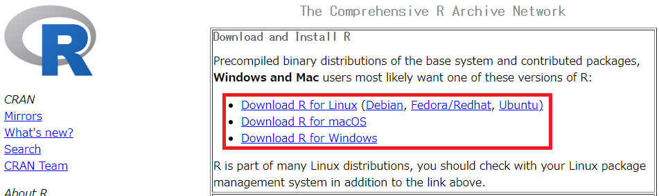
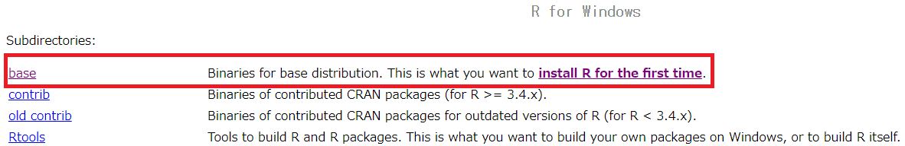
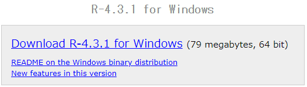
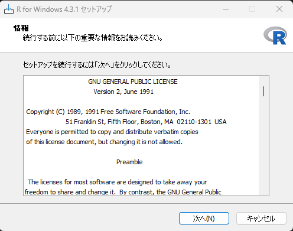
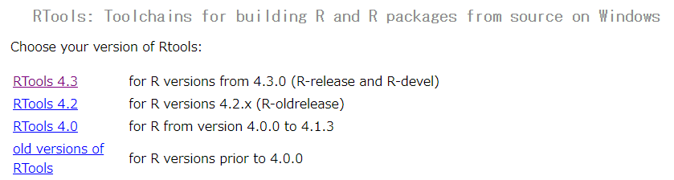
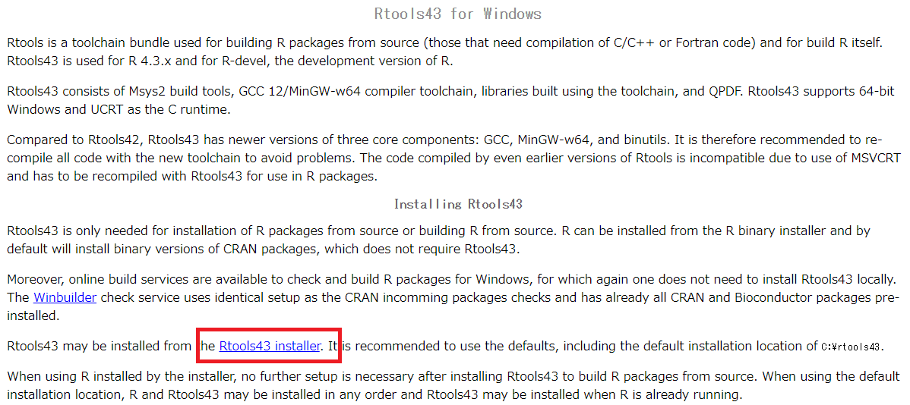
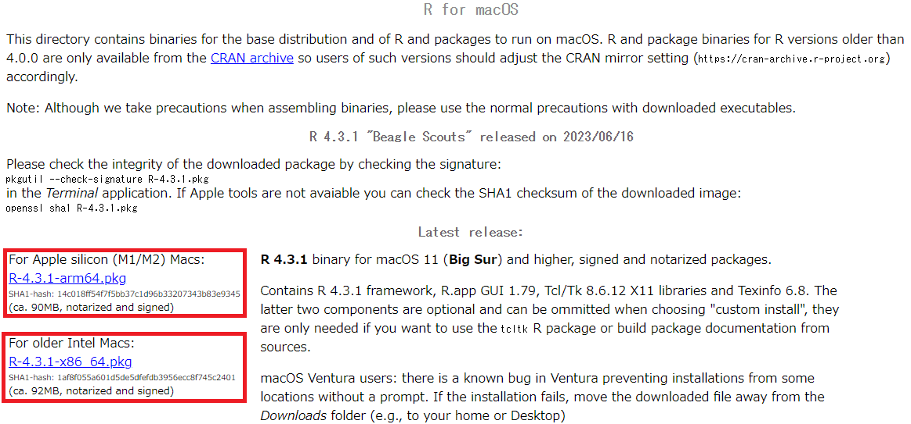
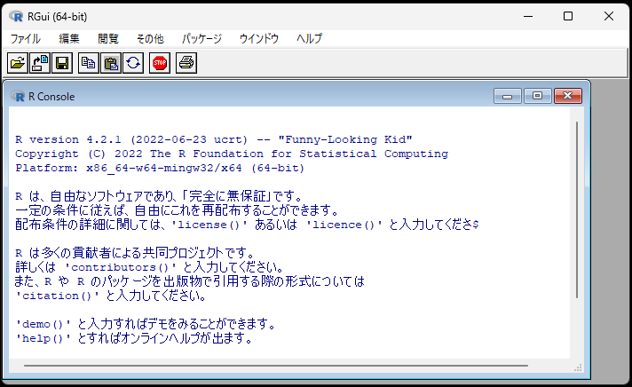
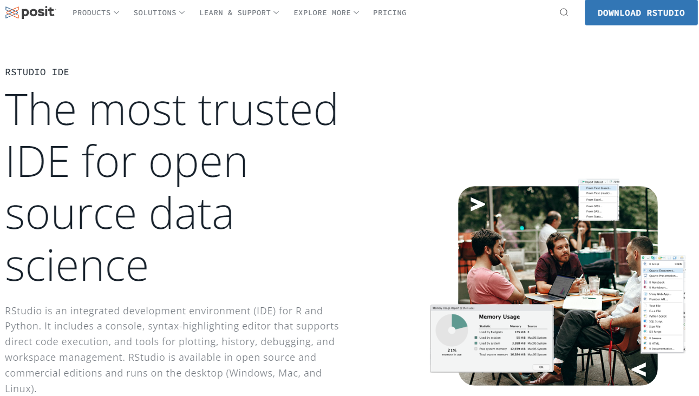
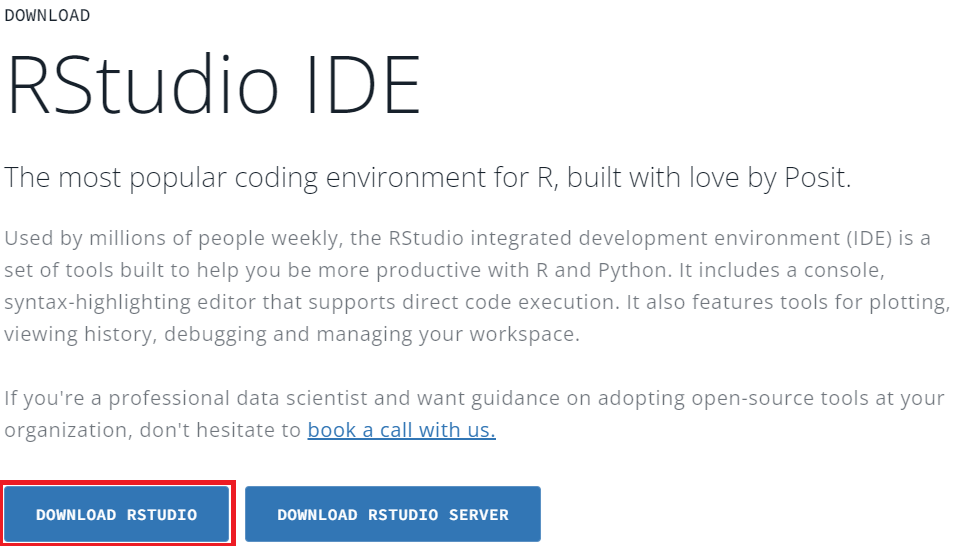

# 1  Rのインストール

Code

## 1.1 Rのインストール

Rを使い始める前に、まずはRをインストールする必要があります。[**CRAN**](https://cran.r-project.org/)（The Comprehensive R Archive Network）のホームページからRのインストーラーをダウンロードし、Rをインストールします。ホームページの「Download and Install R」の部分から、ご自身のPC環境（Windows、MacOS、Linux）を選択します。

[](./image/CRAN_install1.png "図1：CRANのページ:Rのインストール")

図1：CRANのページ:Rのインストール

### 1.1.1 windowsでのインストール

Windowsであれば、上の図に示したリンクから次のページに移動し、さらに「base」を選択します。

[](./image/CRAN_install2_win.png "図2：CRANのページ:Windowsでのインストール")

図2：CRANのページ:Windowsでのインストール

移動すると、Rのダウンロードリンクが表示されますので、リンクをクリックしてRのインストーラーをダウンロードします。

[](./image/CRAN_install3_win.png "図3：CRANのページ:Windowsのインストールファイルのダウンロード")

図3：CRANのページ:Windowsのインストールファイルのダウンロード

ダウンロードされたインストーラーを開き、「次へ」を押していけばインストールが完了します。

[](./image/CRAN_install4_win.png "図4：CRANのページ:インストーラーを起動した画面")

図4：CRANのページ:インストーラーを起動した画面

#### 1.1.1.1 Rtoolsのインストール

Rを使うときには、時にC言語のコードをコンパイル（機械語に変換）する必要があります。このような場合に用いられるのが**Rtools**です（Windowsの場合のみ必要）。図2で示したページに、「[Rtools](https://cran.r-project.org/bin/windows/Rtools/)」というリンクがありますので、ココからRtoolsのページに移動します。移動するとRのバージョンに合わせたRtoolsへのリンクが表示されます。最新のRをインストールした場合には、Rtoolsも最新のRに対応したものになりますので、一番上のRtoolsのリンクを開きます。Rのバージョンが最新ではない場合には、Rのバージョンを確認した上で対応したRtoolsを選択します。

[](./image/CRAN_install5_Rtools.png "図5：CRANのページ:Rtools")

図5：CRANのページ:Rtools

Rのバージョンに対応したRtoolsのリンクに移動すると、下のように表示されます。「Rtools installer」のリンクを開くと、Rtoolsのインストーラーがダウンロードされます。インストーラーを開いてRtoolsをインストールしましょう。

[](./image/CRAN_install6_Rtools.png "図6：CRANのページ:Rtoolsのインストーラーのダウンロード")

図6：CRANのページ:Rtoolsのインストーラーのダウンロード

### 1.1.2 MacOSでのインストール

MacOSの場合もWindowsと同じように、図1でMacOSのリンクを選択してインストーラーをダウンロードします。MacOSの場合はCPUによってインストーラーが異なります。Apple Silicon（M1/M2）で動いているMacOS11以降のMacでは、上のリンクを選択してダウンロードし、IntelのCPUで動いているMacの場合は下のリンクを選択してダウンロードします。インストーラーを起動すると、Windowsと同じようにRをインストールすることができます。

[](./image/CRAN_install7_mac.png "図7：CRANのページ:R for Macのダウンロード")

図7：CRANのページ:R for Macのダウンロード

### 1.1.3 Linuxでのインストール

Linuxでのインストールでは、特にCRANのホームページに移動してダウンロードを行う必要はありません。apt install(Ubuntuの場合)でRをインストールするだけです。

``` bash
sudo apt update
sudo apt install r-base
```

## 1.2 Rstudioのインストール

Windows版のRには、**RGui**と呼ばれるグラフィカルユーザーインターフェース（GUI）が始めから登録されています。Rを起動するとまず表示されるのはこのRGuiです。

[](./image/RGUI.png "図8：RGui")

図8：RGui

このRGuiを用いて、Rのスクリプト（プログラム）を書いて、実行することができます。ただし、このRGuiはRが利用され始めてすぐに開発されたものであり、最近のプログラミング環境では標準的に備わっている、**シンタックスハイライト**（プログラムの要素によって色やフォントを変化させる機能）や**入力補助**（関数の一部を入力すると入力候補を提案してくれる機能）、**コードのバージョン管理**（[git](https://git-scm.com/)などのバージョン管理ソフト）との連携などの機能が備わっていません。このような機能を持つ、プログラミングを快適に行うための環境のことを、**統合開発環境（IDE、Integrated Development Environment）**と呼びます。

統合開発環境として有名なのは、[Visual Studio Code（VScode）](https://azure.microsoft.com/ja-jp/products/visual-studio-code)などです。VSCodeはRだけでなく、他の言語もサポートしています。Rでは、ほぼR専用の統合開発環境として、[**RStudio**](https://posit.co/products/open-source/rstudio/)というものがあります。

Rを使う時には、もちろんRGuiやVSCodeなどを用いても問題はありませんし、R言語だけでなく、他の言語（Pythonなど）を同時に利用するのであれば、むしろVSCodeなどを利用する方が良いこともあります。ただし、Rを学び、Rで統計を行うのが主な目的であれば、RStudioを使うのが最もよいでしょう。

Rstudioは[**Posit**](https://posit.co/products/open-source/rstudio/)のホームページからダウンロードすることができます。まず、Rを上記の手順でインストールし、その後、Rstudioのインストーラーを以下の図の手順でダウンロードしましょう。

[](./image/Posit_Rstudio.png "図9：Rstudioのダウンロード（右上からリンクへ移動）")

図9：Rstudioのダウンロード（右上からリンクへ移動）

[](./image/Posit_Rstudio2.png "図9：Rstudioのダウンロード（左のリンクからダウンロード）")

図9：Rstudioのダウンロード（左のリンクからダウンロード）

Rstudioのインストーラーを起動し、Rstudioがインストール出来たら準備は完了です。Rstudioを起動し、Rを使ってみましょう。

> **TIP:**
>
> PositはRstudioだけでなく、Visual Studio CodeベースのIDEである[Positron](https://positron.posit.co/)を開発しています。このPositronはRだけでなく、Pythonにも対応しており、データサイエンスにおいて汎用的に利用できるIDEとなっています。Visual Studio Codeの利用に慣れている方であればRstudioの代わりにPositronを利用することを検討してもよいかもしれません。

Back to top
