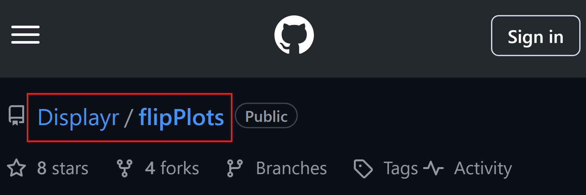

# 10  パッケージとライブラリ

Code

## 10.1 ライブラリとは？

Rは統計のプログラミング言語であり、インストールしてすぐに統計の計算を行うことができるよう設計されています。例えば、代表的な統計処理である、平均値や標準偏差の計算、t検定や分散分析、グラフの作図等は、Rをインストールし、起動した次の瞬間から実行することができます。

しかし、この素の（nativeな）Rでは、近年開発された現代的な統計手法や、優れたデザインやインタラクティブ性を持つグラフの作成、複雑なデータの効率的な整理、Webページの作成など、現代のプログラミング言語に備わる機能のすべてを用いることはできません。

Rを含めた多くのプログラミング言語では、nativeな言語にはない機能を後から追加することができます。この追加する機能のセットのことを、**パッケージ**と呼びます。また、この追加したパッケージのリストやファイルを保存している場所のことを**ライブラリ**と呼びます。

Rのパッケージは（基本的には）[**CRAN**](https://cran.r-project.org/)で管理されており、審査が行われた上で登録されています。パッケージはCRANのリポジトリ（データを格納する場所のこと）に保存されており、RのユーザーはこのCRANのリポジトリから、必要なパッケージを**インストール**して用いることになります。インストールしたパッケージはライブラリ、自分のPCのフォルダに保存されます。

パッケージは、インストールしただけでは用いることができません。パッケージを**読み込み（ロード、load）**、メモリ上に展開しておくことでパッケージの機能を用いることができるようになります。この読み込みはRを起動するたびに行います。パッケージの機能は関連する関数群として実装されていますので、ロードすることでパッケージに登録されている関数を用いることができるようになります。

> **TIP:**
>
> パッケージをいちいち読み込むのは面倒ではありますが、必要ないパッケージを読み込んでしまうと、その分メモリを食うことになります。必要ないパッケージは読み込まないことで、メモリを節約し、プログラムの動作を軽くすることができます。他の言語にも同様の機能が備わっており、必要なパッケージのみを読み込んで用いるのが一般的です。
>
> Rでは、デフォルトのワーキングディレクトリに.Rprofileというファイルを保存しておけば、この中身のプログラムをR起動時に実行してくれるという仕組みがあります。.Rprofileにいつも使うパッケージをロードするように、スクリプトを準備しておいてもよいかもしれません。

## 10.2 パッケージのインストール

### 10.2.1 CRANからのインストール

上記のように、パッケージはまず**インストール**しないと用いることはできません。Rでパッケージをインストールする時には、`install.packages`関数を用います。`install.packages`関数の引数は**文字列のパッケージ名**です。ですので、パッケージ名をダブルクオーテーションで囲う必要があります。パッケージは自動的にダウンロードされ、`.libPaths`関数で表示されるフォルダ、つまりライブラリにインストールされます。

``` downlit
install.packages("tidyverse") # tidyverseというパッケージをインストールする
install.packages(c("tidyverse", "pacman")) # 複数のパッケージ名をベクターで与えることもできる

install.packages(tidyverse) # エラーが出る。パッケージ名は文字列でないとダメ

.libPaths() # パッケージのインストール先（ライブラリ）を表示
```

## 10.3 パッケージをロードする

パッケージをロードするときには、`library`関数を用います。`library`関数の引数は、**文字列ではない**パッケージ名です。文字列のパッケージ名でも読み込みはできますが、ダブルクオーテーションで囲う必要はありません。

同様に`require`関数でもパッケージを読み込むことができます。`require`関数では、パッケージの読み込みに成功すると`TRUE`が、失敗すると`FALSE`が返り値として返ってくるという特徴があります。

`library`関数を引数なしで実行すると、インストールされているパッケージの一覧（ライブラリ）が表示されます。

``` downlit
library(tidyverse) # tidyverseパッケージを読み込む
library("pacman") # pacmanパッケージを読み込む（文字列）

require(pacman) # requireによる読み込み（読み込みができたらTRUEが返ってくる）

library() # ライブラリの一覧を表示する
```

> **TIP:**
>
> パッケージには、読み込み時にメッセージを表示するものがあります。例えば上記の`tidyverse`パッケージは読み込み時にメッセージが表示されます。
>
> パッケージ読み込み時のメッセージを表示させたくない場合には、`suppressPackageStartupMessages`という関数を用います。
>
> ``` downlit
> suppressPackageStartupMessages(library(tidyverse))
> ```

### 10.3.1 パッケージをロードせずに使用する

パッケージに登録されている関数を用いるには、通常ロードする必要がありますが、パッケージをロードしなくても個別の機能（関数）を用いることはできます。パッケージをロードせずにそのパッケージの関数を用いるときには、**「パッケージ名::関数名」**という形で関数を呼び出します。

``` downlit
# install.packages("lubridate") であらかじめパッケージのインストールが必要

ymd("2023-10-10") # lubridateパッケージの関数はパッケージをロードしないと使えない
## Error in `ymd()`:
## ! could not find function "ymd"

lubridate::ymd("2023-10-10") # パッケージ名::関数名でロードしなくても関数が使える
## [1] "2023-10-10"
```

### 10.3.2 githubからのインストール

最近では、最新のパッケージはCRANだけでなく、[**GitHub**](https://github.co.jp/)というプログラム開発プラットフォームからインストールすることもあります。ただし、**GitHub上のパッケージはCRANによるチェックを受けていない**ものですので、インストールする際には注意が必要です。GitHubからのパッケージのインストールには、`pak` ([Csárdi and Hester 2024](#ref-pak_bib))パッケージの`pak`関数を用います。引数には、パッケージの**リポジトリ**というものを文字列で取ります。

例えば、[Displayr](https://www.displayr.com/)という会社が開発している`flipPlots`というパッケージをGitHubからインストールする場合には、GitHubの対象のページのアドレス（<https://github.com/Displayr/flipPlots>）のうち、後ろの2つの項目（`Displayr/flipPlots`）をリポジトリとして取り扱います。GitHubのページにはリポジトリ名が記載されています。

[](./image/github_reponame.png "図1：GitHubのリポジトリ名")

図1：GitHubのリポジトリ名

``` downlit
# flipPlotsというパッケージをGitHubからインストールする(インストールは自己責任で)
# pak::pak("Displayr/flipPlots") 
```

> **TIP:**
>
> GitHubは、[Git](https://git-scm.com/)（バージョン管理システム）というものと連携して用いる、リモートリポジトリと呼ばれるものです。RstudioからGit及びGitHubを利用することもできます。

### 10.3.3 Bioconductorからのインストール

生物系の統計手法（DNAのアライメントやシーケンサーデータの処理、系統樹の計算等）のパッケージを専門的に取り扱っているのが、[**Bioconductor**](https://www.bioconductor.org/)です。Bioconductorに設定されているパッケージはCRANやgithubのものとは取り扱いが少し異なります。

Bioconductorのパッケージを利用するには、`BiocManager` ([Morgan and Ramos 2023](#ref-BiocManager_bib))というパッケージをあらかじめインストールする必要があります。Bioconductorのライブラリのインストールにはこの`BiocManeger`パッケージの`install`関数を用います。`install`関数を引数なしで用いると、Bioconductorのコアライブラリをすべてインストールすることができます。特定のパッケージをインストールするときには、引数に文字列のパッケージ名を入力します。

インストールしたBioconductorのパッケージのロードは通常のパッケージと同様に`library`関数で行うことができます。

``` downlit
install.packages("BiocManager") # BioManagerパッケージのインストール
BiocManager::install() # Bioconductorのコアライブラリをインストールする
BiocManager::install(c("GenomicFeatures", "AnnotationDbi"))
```

## 10.4 パッケージを簡単に取り扱う：pacman

パッケージはインストールしないとロードすることができません。ですので、インストールしていないパッケージをロードしようとするととエラーが出ます。`if`文を用いると、パッケージがインストールされていないときにはインストールしてロード、インストールされているときにはロードが実行されるようにすることもできます。

``` downlit
# climetricsパッケージ（気候変化に関するパッケージ）は
# インストールされていないので、エラーが出る
library(climetrics) 

require(climetrics) # インストールしないと読み込めないので、FALSEが返ってくる

# require関数でFALSEが返ってきたら、パッケージをインストールする
if(!require(climetrics)) install.packages("climetrics")
```

この`if`文と`require`関数を用いる書き方は長い間使用されてきましたが、やや複雑で覚えにくいものです。このようなパッケージの取り扱いを簡単にしてくれるのが`pacman` ([Rinker and Kurkiewicz 2018](#ref-pacman_bib))パッケージです。近年では、この`pacman`パッケージの`p_load`関数を用いてパッケージをロードすることも増えてきています。`p_load`関数を用いるには、`pacman`パッケージをロードする必要があります。パッケージのロードのために別途`pacman`だけロードするのは面倒ですので、[`pacman::p_load`](https://rdrr.io/pkg/pacman/man/p_load.html)という形で、パッケージをロードすることなく関数だけ用いるのが一般的です。この他に、[`pak`](https://pak.r-lib.org/index.html)([Csárdi and Hester 2024](#ref-pak_bib))と呼ばれるパッケージ管理のパッケージも最近ではよく用いられています。

``` downlit
# パッケージをロードする（インストールされてなければインストールしてからロードする）
pacman::p_load(tidyverse, lubridate)
```

## 10.5 tidyverse

近年のRでは、[**Posit**](https://posit.co/)（旧Rstudio、IDEであるRstudioの開発元）およびPositのチーフサイエンティストである**Hadley Wickham**が中心となって作成された複数のパッケージのセットである、[`tidyverse`](https://www.tidyverse.org/) ([Wickham et al. 2019](#ref-tidyverse_bib))を用いるのがほぼ常識となっています。`tidyverse`のパッケージ群を用いなくてもRを使うことはできますが、このパッケージ群を用いることでデータの整理・グラフ作成・文字列の処理等を簡単に行うことができるようになります。`tidyverse`のパッケージ群は以下のように一度にインストール・ロードすることができます。

``` downlit
pacman::p_load(tidyverse) # tideverseのインストール・ロード(install.packages・library関数でも可)
```

`tidyverse`に含まれているパッケージを以下に示します。個別の、重要なパッケージに関しては別章で説明します。

| パッケージ名 | パッケージの主な機能               |
|:-------------|:-----------------------------------|
| dpylr        | データフレームの編集               |
| tidyr        | データフレームの変形（縦・横持ち） |
| ggplot2      | 現代的なデザインのグラフ作成       |
| tibble       | 使いやすいデータフレームの提供     |
| stringr      | 文字列の処理                       |
| purrr        | リストへの関数の適用               |
| readr        | データ読み込み                     |
| forcats      | 因子（factor）の処理               |

表1：tidyverseに含まれるパッケージ群 {.caption-top .table .table-sm .table-striped .small}

## 10.6 その他の便利なパッケージ

`tidyverse`の他にも、データ処理を簡単にしたり、インタラクティブなグラフを作成したり、Rで文書を作成したりするためのパッケージをRは備えています。以下によく用いられるパッケージを示します。統計に関するパッケージも無数に存在します。統計に関するパッケージについては、統計手法の説明の際に紹介します。

| パッケージ名 | パッケージの主な機能             |
|:-------------|:---------------------------------|
| magrittr     | パイプ演算子を提供               |
| readxl       | Excelファイルの読み込み          |
| googlesheet4 | Googleスプレッドシートの読み込み |
| lubridate    | 日時データの処理                 |
| broom        | 統計結果の変形                   |
| DT           | 美しい表の作成                   |
| plotly       | インタラクティブなグラフの作成   |
| Rmarkdown    | 文書の作成                       |
| shiny        | Webアプリケーションの作成        |
| pacman       | ライブラリのインストール・ロード |

表2：Rで用いられている便利なパッケージ {.caption-top .table .table-sm .table-striped .small}

Csárdi, Gábor, and Jim Hester. 2024. *Pak: Another Approach to Package Installation*. <https://CRAN.R-project.org/package=pak>.

Morgan, Martin, and Marcel Ramos. 2023. *BiocManager: Access the Bioconductor Project Package Repository*. <https://CRAN.R-project.org/package=BiocManager>.

Rinker, Tyler W., and Dason Kurkiewicz. 2018. *pacman: Package Management for R*. Buffalo, New York. <http://github.com/trinker/pacman>.

Wickham, Hadley, Mara Averick, Jennifer Bryan, et al. 2019. “Welcome to the tidyverse.” *Journal of Open Source Software* 4 (43): 1686. <https://doi.org/10.21105/joss.01686>.

Back to top
