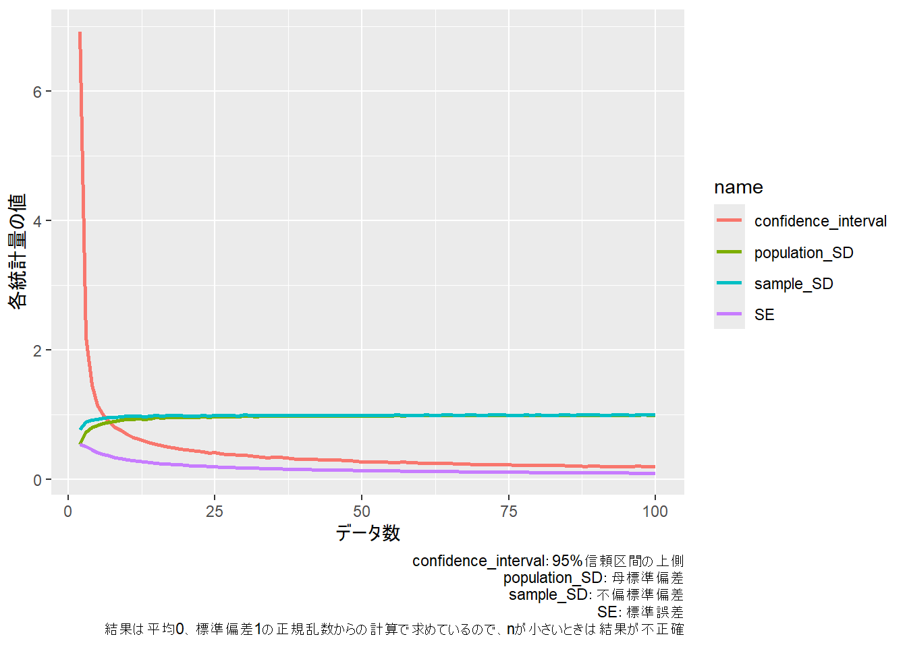
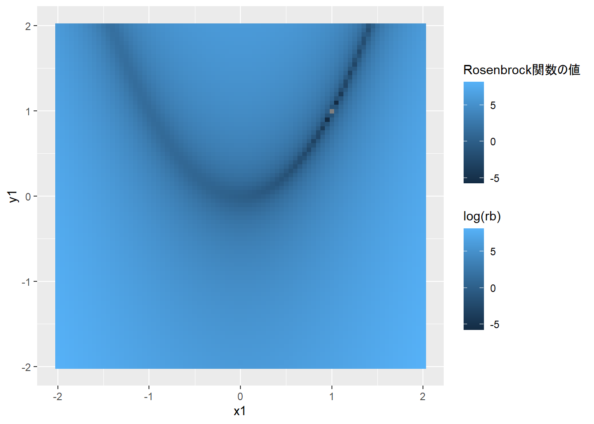

# 12  数値

Code

Rの型で最もよく利用するものが**数値（numeric）**です。以下では、数値を取り扱う際に用いる関数や手法を紹介します。

## 12.1 数値を引数とする関数

まずは、数値を演算するときに用いる関数を紹介します。よく用いられる関数は以下の表1の通りです（`x`、`y`は引数）。関数は演算子より優先的に計算されます。引数である数値はベクターで与えることもできます。

| 関数名              | xに適用される計算手法              |
|:--------------------|:-----------------------------------|
| sqrt(x)             | 平方根                             |
| exp(x)              | e（ネイピア数、自然対数の底）のx乗 |
| log(x, base=y)      | yを底にした対数                    |
| log(x)              | 自然対数                           |
| log10(x)            | 常用対数                           |
| log2(x)             | 底が2の対数                        |
| sin(x)              | サイン（xはラジアン）              |
| cos(x)              | コサイン                           |
| tan(x)              | タンジェント                       |
| acos(x)             | アークサイン（サインの逆関数）     |
| asin(x)             | アークコサイン                     |
| atan(x)             | アークタンジェント                 |
| round(x, digits=y)  | 小数点以下y桁で四捨五入            |
| ceiling(x)          | 切り上げ                           |
| floor(x)            | 切り下げ                           |
| trunc(x)            | 切り捨て                           |
| signif(x, digits=y) | y桁を残して四捨五入                |
| abs(x)              | xの絶対値                          |

表1：数値の演算に用いる関数 {.caption-top .table .table-sm .table-striped .small}

``` downlit
sqrt(9) # 平方根
## [1] 3

exp(1) # 指数変換
## [1] 2.718282

log(8, base = 2) # 底が2の対数
## [1] 3

log(10) # 底がeの対数
## [1] 2.302585

log10(10) # 底が10の対数
## [1] 1

log2(10) # 底が2の対数
## [1] 3.321928

sin(0.5*pi) # サイン
## [1] 1

cos(pi) # コサイン
## [1] -1

tan(0.25*pi) # タンジェント
## [1] 1

asin(0.5) # アークサイン（サインの逆関数）
## [1] 0.5235988

acos(0.5) # アークコサイン
## [1] 1.047198

atan(0.5) # アークタンジェント
## [1] 0.4636476

round(pi, digits=2) # 四捨五入
## [1] 3.14

ceiling(pi) # 切り上げ
## [1] 4

floor(pi) # 切り下げ
## [1] 3

trunc(pi) # 切り捨て
## [1] 3

signif(pi*100, digits=2) # 2桁以下を四捨五入
## [1] 310

abs(-5) # 絶対値
## [1] 5

log2(c(2, 4, 8, 16, 32, 64)) # ベクターを引数にする時
## [1] 1 2 3 4 5 6
```

> **TIP:**
>
> Rの`round`関数は概ね四捨五入の結果を返しますが、正確には四捨五入にはなっていない場合があるので、注意が必要です。`0.5`を四捨五入すると`1`ですが、`round(0.5)`は`0`を返します。詳しくは[`?round`](https://rdrr.io/r/base/Round.html)で表示されるヘルプのDetailsをご参照下さい。
>
> ``` downlit
> round(0.49)
> ## [1] 0
> round(0.5) # 0になる
> ## [1] 0
> round(0.51)
> ## [1] 1
> ```

## 12.2 組み合わせ・階乗・順列

統計と確率には密接な関係があります。高校数学の確率で習ったように、確率の計算では順列・組合せの数が重要となります。Rには組み合わせを計算する関数として、`choose`関数があります。また、階乗を計算する関数は`factorial`関数です。順列を計算する関数はないため、階乗を用いて順列を計算する必要があります。

また、階乗を整数だけでなく、正の実数に一般化したガンマ関数は、`gamma`関数で計算することができます。

``` downlit
choose(5, 2) # 5個から2個を選ぶ組み合わせ（5C2）
## [1] 10

factorial(3) # 3の階乗（1 * 2 * 3）
## [1] 6

factorial(5)/factorial(2) # 5個の要素から3つを並べる順列(5P3)
## [1] 60

gamma(4) # 3の階乗と同じ (4-1)!の演算となる
## [1] 6

gamma(1.5) # 整数でない値を引数に取ることができる
## [1] 0.8862269
```

また、組み合わせをすべて表示したい場合には`combn`関数を用います。

``` downlit
combn(c("A", "B", "C"), 2) # A, B, Cから2つ選ぶ組み合わせ
##      [,1] [,2] [,3]
## [1,] "A"  "A"  "B" 
## [2,] "B"  "C"  "C"

combn(c(1, 1, 1, 2, 2, 3), 3) # 1, 1, 1, 2, 2, 3から3つ選ぶ組み合わせ
##      [,1] [,2] [,3] [,4] [,5] [,6] [,7] [,8] [,9] [,10] [,11] [,12] [,13] [,14]
## [1,]    1    1    1    1    1    1    1    1    1     1     1     1     1     1
## [2,]    1    1    1    1    1    1    1    2    2     2     1     1     1     2
## [3,]    1    2    2    3    2    2    3    2    3     3     2     2     3     2
##      [,15] [,16] [,17] [,18] [,19] [,20]
## [1,]     1     1     1     1     1     2
## [2,]     2     2     2     2     2     2
## [3,]     3     3     2     3     3     3
```

## 12.3 数列の作成

Rでは、ベクターは`c`関数を用いて作成します。しかし、長いベクターを`c`関数で自作するのは大変ですし、等差数列や等比数列を作るのに`for`文を用いるのも面倒です。Rでは、数列を作る関数を用いて、等差数列などを作成することができます。また、繰り返しのあるベクターも、関数により作成することができます。

等差数列の作成には、`for`文の説明時に用いた `:`（コロン）や`seq`関数を用います。等比数列は、簡単なものであれば`seq`関数と累乗を用いて作成できます。

| 関数名            | xに適用される計算手法      |
|:------------------|:---------------------------|
| x:y               | xからyまで連続する整数     |
| seq(x, y, by = z) | xからyまでz間隔での数列    |
| rep(x, y)         | xをy回繰り返す             |
| cumsum(x)         | xの累積和                  |
| cumprod(x)        | xの累積積                  |
| choose(x, y)      | x個からy個を選ぶ組み合わせ |
| factorial(x)      | xの階乗                    |
| prod(x)           | xの総乗                    |

表2：数値のベクター作成・組み合わせなどの関数 {.caption-top .table .table-sm .table-striped .small}

``` downlit
1:10 # 1から10まで公差1の数列
##  [1]  1  2  3  4  5  6  7  8  9 10

seq(from = 1, to = 10, by=3) # 1から10まで公差3の等差数列
## [1]  1  4  7 10

seq(1, 10, length.out=3) # 1から10まで等間隔で、3つの長さの数列
## [1]  1.0  5.5 10.0

3 ^ (0:10) # 公比3の等比数列
##  [1]     1     3     9    27    81   243   729  2187  6561 19683 59049

3 ^ seq(0, 10, by=2) # 公比9の等比数列
## [1]     1     9    81   729  6561 59049
```

### 12.3.1 rep関数

繰り返しのあるベクターは`rep`関数を用いて作成できます。rep関数は1つ目の引数に数値やベクターを取り、2つ目の引数に繰り返しの回数を指定します。繰り返しの回数は1つの数値、もしくは1つ目の引数のベクターと同じ長さのベクターで指定します。繰り返しの回数に1つの数値を指定した場合には1つ目の引数をその数値の回数繰り返します。また、繰り返しの回数をベクターで指定した場合には、同じインデックスの数値をその回数だけ繰り返すベクターを返します。

また、rep関数には繰り返しの回数の代わりにlength.outという引数を指定することもできます。length.outは数値で指定し、その数値の長さのベクターになるまで1つ目の引数を繰り返します。

``` downlit
rep(1:3, 5) # 1, 2, 3を5回繰り返す
##  [1] 1 2 3 1 2 3 1 2 3 1 2 3 1 2 3

rep(1:3, c(3, 3, 3)) # 1, 2, 3をそれぞれ3回繰り返す
## [1] 1 1 1 2 2 2 3 3 3

rep(1:3, c(3, 2, 1)) # 1を3回、2を2回、3を1回繰り返す
## [1] 1 1 1 2 2 3

rep(1:3, length.out=10) # 1, 2, 3を長さ10まで繰り返す
##  [1] 1 2 3 1 2 3 1 2 3 1

rep(c("apple", "orange", "banana"), 2) # どの型でも繰り返しができる
## [1] "apple"  "orange" "banana" "apple"  "orange" "banana"
```

## 12.4 総乗・累積和・累積積

Rで総乗（数列をすべて掛け算したもの）を計算する場合には、`prod`関数を用います。また、累積和（ベクターの前から順番に足し算したもの）と累積積（前から順番に掛け算したもの）の数列を作る時には、`cumsum`関数と`cumprod`関数を用います。等比数列は`cumprod`関数を利用すれば作成することができます。

``` downlit
prod(1:4) # 総乗
## [1] 24

cumsum(1:5) # 累積和
## [1]  1  3  6 10 15

cumprod(1:5) # 累積積
## [1]   1   2   6  24 120

cumprod(rep(2, 10)) # 初項2、公比2の等比数列
##  [1]    2    4    8   16   32   64  128  256  512 1024

# 使い道が分かりにくいcummax・cumminという関数もある
cummax(1:5); cummax(5:1)
## [1] 1 2 3 4 5
## [1] 5 5 5 5 5
cummin(1:5); cummin(5:1)
## [1] 1 1 1 1 1
## [1] 5 4 3 2 1
```

## 12.5 ベクターの基礎演算と基礎統計量

数値のベクターに対して、平均値や標準偏差などを計算する関数も、Rは備えています。代表的な関数を以下に示します。

| 関数名             | x、yに適用される計算手法    |
|:-------------------|:----------------------------|
| sum(x)             | 合計値                      |
| length(x)          | ベクターの長さ              |
| mean(x)            | 平均値                      |
| var(x)             | （不偏）分散                |
| sd(x)              | （不偏）標準偏差            |
| median(x)          | 中央値                      |
| max(x)             | 最大値                      |
| min(x)             | 最小値                      |
| quantile(x, probs) | 分位値（probsは分位の位値） |
| IQR(x)             | 25%分位値と75%分位値の差    |
| cov(x, y)          | 共分散                      |
| cov(data.frame)    | 分散・共分散行列            |
| cor(x, y)          | 相関係数                    |
| cor(data.frame)    | 相関行列                    |

表3：数値ベクターの演算に用いる関数 {.caption-top .table .table-sm .table-striped .small}

``` downlit
x <- seq(0, 10, by=0.5); x # 0から10まで公差0.5の数列
##  [1]  0.0  0.5  1.0  1.5  2.0  2.5  3.0  3.5  4.0  4.5  5.0  5.5  6.0  6.5  7.0
## [16]  7.5  8.0  8.5  9.0  9.5 10.0
y <- rnorm(21, 5, 3); y # 長さ21の正規乱数
##  [1]  8.7888629  4.0212999  8.9893978  8.8172880  6.2439243  0.3801499
##  [7]  2.2142989  4.1158387  4.9826985 12.2139602  7.2907804  2.6029723
## [13]  1.5570290  4.1316153  4.1023546  3.7654675  5.7566703  2.3242366
## [19]  6.3070499  1.2873847  4.3271963

sum(x) # xの合計
## [1] 105

length(x) # xの長さ
## [1] 21

mean(x) # xの平均値
## [1] 5

var(x) # xの分散
## [1] 9.625

sd(x) # xの標準偏差
## [1] 3.102418

sd(x)/length(x)^0.5 # xの標準誤差
## [1] 0.6770032

median(x) # xの中央値
## [1] 5

max(x) # xの最大値
## [1] 10

min(x) # xの最小値
## [1] 0

quantile(x, probs=c(0.25, 0.75)) # xの25%、75%分位値
## 25% 75% 
## 2.5 7.5

IQR(x) # xの75%分位値 - xの25%分位値
## [1] 5

cov(x, y) # xとyの共分散
## [1] -3.274794

cov(data.frame(x, y)) # xとyの分散・共分散行列
##           x         y
## x  9.625000 -3.274794
## y -3.274794  8.942667

cor(x, y) # xとyの相関係数
## [1] -0.35298

cor(data.frame(x, y)) # xとyの相関行列
##          x        y
## x  1.00000 -0.35298
## y -0.35298  1.00000
```

> **TIP:**
>
> 以下に、上記の基礎統計量の計算式を示します。
>
> `sum(x)`：合計値、x₁～x_(n)の和は以下の式で表されます。
>
> \\sum(x)=\sum\_{i=1}^{n}x\_{i}\\
>
> `mean(x)`：平均値（\\\bar{x}\\）、x₁～x_(n)の平均値は以下の式で表されます。
>
> \\mean(x)=\frac{\sum\_{i=1}^{n}x\_{i}}{n}\\
>
> `var(x)`：不偏分散、x₁～x_(n)の分散は以下の式で表されます。
>
> \\var(x)=\frac{\sum\_{i=1}^{n}(x\_{i}-\bar{x})^2}{n-1}\\
>
> `sd(x)`：不偏標準偏差、x₁～x_(n)の不偏標準偏差は以下の式で表されます。
>
> \\sd(x)=\sqrt{\frac{\sum\_{i=1}^{n}(x\_{i}-\bar{x})^2}{n-1}}\\
>
> 標準誤差（standard error）、x₁～x_(n)の標準誤差は以下の式で表されます。標準偏差はばらつきの指標であり、標準誤差は平均値の推定範囲を表す指標となります。
>
> \\se(x)=\frac{1}{\sqrt{n}} \cdot sd(x)=\frac{1}{\sqrt{n}}\sqrt{\frac{\sum\_{i=1}^{n}(x\_{i}-\bar{x})^2}{n-1}}\\
>
> `cov(x, y)`：共分散、x₁～x_(n)とy₁～y_(n)の共分散は平均値（\\\bar{x}\\、\\\bar{y}\\）を用いて以下の式で表されます。
>
> \\cov(x, y)=\frac{1}{n}\sum\_{i=1}^{n}(x\_{i}-\bar{x})(y\_{i}-\bar{y})\\
>
> `cor(x, y)`：相関係数、x₁～x_(n)とy₁～y_(n)の相関係数は平均値（\\\bar{x}\\、\\\bar{y}\\）を用いて以下の式で表されます。
>
> \\cor(x,y)=\frac{cov(x,y)}{var(x) \cdot var(y)}=\frac{\sum\_{i=1}^{n}(x\_{i}-\bar{x})(y\_{i}-\bar{y})}{\sqrt{\sum\_{i=1}^{n}(x\_{i}-\bar{x})^2 \cdot \sum\_{i=1}^{n}(y\_{i}-\bar{y})^2}}\\

> **TIP:**
>
> 標準誤差（standard error）は（不偏）標準偏差（sample standard deviation）をデータ数（n）の平方根で割った統計量です。標準偏差と標準誤差は共にばらつきに関与しており、よく似ている指標に見えますが、意味が異なります。標準偏差、標準誤差は互いに間違えて利用されやすい指標ですので、簡単に意味を説明しております。
>
> 標準偏差はデータのばらつきを反映する指標です。データのばらつきはデータ数が増えても、集団が同じであれば一定であるはずです。ですので、標準偏差はデータ数nが増えても変化しません（正確にはnが大きくなると標準偏差自体の信頼性は高くなることから、ほんの少しだけ変化します）。
>
> 標準誤差はデータ数nが増えるとどんどん小さくなっていきます。上記の通り、データのばらつきはnが増えても変化しませんので、標準誤差はばらつきの指標ではない、ということになります。では標準誤差は何かというと、平均値の信頼区間に関わるパラメータ、つまり、平均値の推定範囲を反映するパラメータとなります。平均値の信頼区間には通常95%信頼区間が用いられますが、標準誤差は約68.3%信頼区間に当たります。
>
> データ数nが増えると、ばらつきは減りませんが、平均値の信頼性が高まっていきます。日本人の身長の平均値を知りたいとき、2人の身長の平均値と2万人の身長の平均値のどちらが信用できるか、ということを考えると標準誤差の意味を直感的に理解できると思います。
>
> したがって、データのばらつきを示したいときには標準偏差、平均値に興味がある場合には標準誤差を用いるのがよいでしょう。以下にデータ数と母標準偏差（population standard deviation）、不偏標準偏差、標準誤差及び平均値の95%信頼区間（上側）の関係を示します。データ数が少ないときには母標準偏差よりも標本標準偏差の方が、乱数を生成したときの標準偏差（平均0、標準偏差1）に近いことがわかります。
>
> [](chapter12_files/figure-html/unnamed-chunk-13-1.png)

### 12.5.1 度数分布の計算

Rでは数値のベクターからヒストグラムを書くことが多いのですが、別途**度数分布表**を描きたいという場合もあります。度数分布を調べる時には、`cut`関数を用います。

`cut`関数は第一引数に数値のベクター、第二引数に度数分布の切断点（1~10、11~20などの10と11の境目のこと）を取ります。結果として、数値を「(数値, 数値\]」という形の因子（factor）に変換したものが返ってきます。この時、カッコ（“(”）は大なり、四角カッコ（“\]”）は小なりイコールを表しています。ですので、例えば「(40,60\]」と示されている場合には、その値が40より大きく（\\x\>40\\）、60以下(\\x \leq 60\\)であることを表しています。

因子型を引数とする関数には`table`関数というものがあります。この`cut`関数と`table`関数を組み合わせることで、度数分布表を簡単に作成することができます。

``` downlit
z <- runif(150, min = 0, max = 100)
# データの存在する範囲を返す関数（因子が返ってくる）
cut(z, breaks=c(-1, 20, 40, 60, 80, 101)) 
##   [1] (40,60]  (-1,20]  (60,80]  (-1,20]  (20,40]  (20,40]  (40,60]  (40,60] 
##   [9] (20,40]  (60,80]  (-1,20]  (-1,20]  (20,40]  (-1,20]  (-1,20]  (40,60] 
##  [17] (20,40]  (-1,20]  (-1,20]  (-1,20]  (40,60]  (-1,20]  (-1,20]  (60,80] 
##  [25] (-1,20]  (80,101] (80,101] (40,60]  (20,40]  (60,80]  (80,101] (60,80] 
##  [33] (40,60]  (-1,20]  (-1,20]  (20,40]  (60,80]  (40,60]  (40,60]  (80,101]
##  [41] (-1,20]  (80,101] (20,40]  (40,60]  (80,101] (-1,20]  (20,40]  (20,40] 
##  [49] (60,80]  (80,101] (60,80]  (-1,20]  (-1,20]  (80,101] (-1,20]  (40,60] 
##  [57] (-1,20]  (40,60]  (60,80]  (20,40]  (40,60]  (20,40]  (-1,20]  (40,60] 
##  [65] (60,80]  (20,40]  (20,40]  (80,101] (40,60]  (20,40]  (80,101] (60,80] 
##  [73] (20,40]  (-1,20]  (80,101] (80,101] (60,80]  (-1,20]  (20,40]  (20,40] 
##  [81] (20,40]  (40,60]  (20,40]  (60,80]  (20,40]  (-1,20]  (80,101] (40,60] 
##  [89] (60,80]  (40,60]  (20,40]  (80,101] (40,60]  (40,60]  (-1,20]  (40,60] 
##  [97] (40,60]  (-1,20]  (-1,20]  (20,40]  (40,60]  (80,101] (20,40]  (40,60] 
## [105] (80,101] (80,101] (60,80]  (80,101] (20,40]  (60,80]  (80,101] (80,101]
## [113] (60,80]  (80,101] (40,60]  (20,40]  (40,60]  (60,80]  (80,101] (-1,20] 
## [121] (40,60]  (20,40]  (80,101] (60,80]  (20,40]  (80,101] (80,101] (40,60] 
## [129] (60,80]  (-1,20]  (20,40]  (80,101] (60,80]  (80,101] (-1,20]  (60,80] 
## [137] (40,60]  (60,80]  (80,101] (20,40]  (40,60]  (-1,20]  (20,40]  (20,40] 
## [145] (40,60]  (80,101] (80,101] (-1,20]  (40,60]  (-1,20] 
## Levels: (-1,20] (20,40] (40,60] (60,80] (80,101]

z_cut <- cut(z, breaks=c(-1, 20, 40, 60, 80, 101)) 
table(z_cut) # 度数分布表を返すtable関数
## z_cut
##  (-1,20]  (20,40]  (40,60]  (60,80] (80,101] 
##       33       32       32       23       30
```

## 12.6 summary関数

Rでは、基礎統計量を計算するときには`summary`関数を用いることができます。`summary`関数はベクターを引数に取り、ベクターの最小値、25%四分位、中央値、平均値、75%四分位値、最大値を一度に計算してくれる関数です。`summary`関数の引数にはベクターだけでなく、リストやデータフレームを用いることもできます。`summary`関数は引数の型・クラスによって演算を変え、データの要約を示してくれます。

``` downlit
summary(x) # ベクターを引数にするとき
##    Min. 1st Qu.  Median    Mean 3rd Qu.    Max. 
##     0.0     2.5     5.0     5.0     7.5    10.0

summary(list(x, y)) # リストを引数にするとき
##      Length Class  Mode   
## [1,] 21     -none- numeric
## [2,] 21     -none- numeric

summary(data.frame(x, y)) # データフレームを引数にするとき
##        x              y          
##  Min.   : 0.0   Min.   : 0.3801  
##  1st Qu.: 2.5   1st Qu.: 2.6030  
##  Median : 5.0   Median : 4.1316  
##  Mean   : 5.0   Mean   : 4.9629  
##  3rd Qu.: 7.5   3rd Qu.: 6.3070  
##  Max.   :10.0   Max.   :12.2140
```

> **TIP:**
>
> `summary`関数のように、色々な型・クラスを引数にとり、引数の型・クラスに応じて出力を変える関数のことを、**ジェネリック関数（generic function）**と呼びます。ジェネリック関数は引数によって呼び出す関数（`summary.data.frame`や`summary.matrix`など）を変えることで、違う型・クラスの引数に対応しています。ジェネリック関数の詳細を調べる場合には、`methods`関数を用います。例えば、`methods(summary)`を実行すると、`summary`関数に属しているジェネリック関数の一覧を確認することができます。

## 12.7 微分と積分

### 12.7.1 微分：deriv関数

Rで微分を計算する関数が`deriv`関数です。`deriv`関数は`~`の後の引数に変数を用いた計算式、第二引数に微分する変数を文字列で指定する関数です。

`deriv`関数の返り値はexpressionという型のオブジェクトです。このオブジェクトには、`.value`と`.grad`という2つの値が含まれており、`.value`は関数、`.grad`は関数を微分したものを示します。

ある値における微分値を計算する場合には、`deriv`関数で文字列で指定した変数名に数値を代入し、`eval`関数の引数に`deriv`関数の返り値を取ります。

また、`function.arg=TRUE`を引数に取ると、`deriv`関数の返り値が関数型になります。この場合には、第二引数で指定した文字列がそのまま引数のリストとなります。

もう少し単純に微分の式を求める関数が`D`関数です。`D`関数では第一引数にexpressionを取り、第二引数に微分する変数を文字列で指定します。

``` downlit
dx2x <- deriv(~ x^2, "x") # 微分はf'(x) ~ 2xになる
dx2x # .grad[, "x"]が微分の式
## expression({
##     .value <- x^2
##     .grad <- array(0, c(length(.value), 1L), list(NULL, c("x")))
##     .grad[, "x"] <- 2 * x
##     attr(.value, "gradient") <- .grad
##     .value
## })

class(dx2x) # 型・クラスはexpression
## [1] "expression"

x <- 5 # xは変数で後から指定できる
eval(dx2x) # evalで微分値の計算(gradientに表示)
## [1] 25
## attr(,"gradient")
##       x
## [1,] 10

x <- 1:10
eval(dx2x) # 数列でも計算できる
##  [1]   1   4   9  16  25  36  49  64  81 100
## attr(,"gradient")
##        x
##  [1,]  2
##  [2,]  4
##  [3,]  6
##  [4,]  8
##  [5,] 10
##  [6,] 12
##  [7,] 14
##  [8,] 16
##  [9,] 18
## [10,] 20

# 関数として微分を設定する
dx2x_f <- deriv(y~x^2, c("x", "y"), function.arg=TRUE)
class(dx2x_f) # 関数になっている
## [1] "function"

# xとyを与えると微分値を計算する
dx2x_f(10, 10^2)
## [1] 100
## attr(,"gradient")
##       x y
## [1,] 20 0

# D関数：関数を与えると微分の式を表示する
D(expression(x^2), "x")
## 2 * x
```

### 12.7.2 関数の最小値を求める：optim関数

関数の最小値（微分が0となる値）を求めるための関数が`optim`関数です。`optim`関数は変数の初期値と関数を引数に取り、その関数が最小となる変数の組（[最適化問題](https://ja.wikipedia.org/wiki/%E6%9C%80%E9%81%A9%E5%8C%96%E5%95%8F%E9%A1%8C)の解）を返します。

> **TIP:**
>
> 以下は、`optim`のヘルプ（[`?optim`](https://rdrr.io/r/stats/optim.html)）で表示される`optim`の使用例に示されている、Rosenbrock関数（\\y=a\*(x\_{2}-x\_{1}^2)^2+(1-x\_{1})^2\\）の定義とその関数の形をグラフで示したものです。
>
> ``` downlit
> # 関数の式
> fr <- function(x) { 
>   x1 <- x[1]
>   x2 <- x[2]
>   100 * (x2 - x1 * x1)^2 + (1 - x1)^2
> }
>
> fr2 <- function(x, y){100 * (y - x * x)^2 + (1 - x)^2}
>
> pacman::p_load(plotly, tidyverse)
> d <- expand.grid(
>   x1 = seq(-2, 2, by = 0.05),
>   x2 = seq(-2, 2, by = 0.05)
>   )
>
> d$rb <- mapply(fr2, d$x1, d$x2)
>
> mrb <- matrix(d$rb, nrow=81, ncol=81)
>
> d |> 
>   ggplot(aes(x=x1, y=x2, color=log(rb), fill=log(rb)))+
>   geom_bin2d(stat="identity")+
>   labs(x="x1", y="y1", color="Rosenbrock関数の値")
> ```
>
> [](chapter12_files/figure-html/unnamed-chunk-17-1.png)
>
> ``` downlit
>
> fr(c(1, 1)) # 0になる
> ## [1] 0
>
> plot_ly(z=~mrb) |> add_surface()
> ```

``` downlit
fr <- function(x) { ## Rosenbrock関数
  x1 <- x[1]
  x2 <- x[2]
  100 * (x2 - x1 * x1)^2 + (1 - x1)^2
}

# x1の初期値は-1.2、x2の初期値は1で最小値を求める
optim(c(-1.2,1), fr) # 最小となるのはc(1,1)のとき
## $par
## [1] 1.000260 1.000506
## 
## $value
## [1] 8.825241e-08
## 
## $counts
## function gradient 
##      195       NA 
## 
## $convergence
## [1] 0
## 
## $message
## NULL
```

### 12.7.3 積分：integrate関数

Rでは、`integrate`関数を用いて積分値を計算することができます。`integrate`関数は第一引数に関数を取り、その後に積分する範囲を指定する関数です。`Inf`を用いることで無限大までの範囲の積分を計算することもできます。

``` downlit
f <- \(x){x^2}
integrate(f, 0, 2) # fを0から2まで積分する
## 2.666667 with absolute error < 3e-14

integrate(dnorm, 0, Inf) # 正規分布を0から+無限大まで積分する
## 0.5 with absolute error < 4.7e-05
```

## 12.8 多項の方程式の解を求める

多項の方程式（\\ax^3+bx^2+cx+d=0\\のような方程式）を解くための関数が`polyroot`関数です。`polyroot`関数は上記のa、b、c、dをベクターで引数に指定し、方程式の解を返します。また、`polyroot`関数の返り値を`Mod`関数に渡すことで、解に虚数が含まれている場合の解の原点からの距離に変換することができます。

また、関数の演算結果が0になる引数の値を計算するための関数が`uniroot`関数です。`uniroot`関数は関数と各引数が取る範囲を引数に取り、その引数の範囲で関数が0と交わるかを評価します。1点で交わる場合にはその時の引数の値を返し、そうでない場合（範囲の両端で符号が同じ場合）にはエラーを返します。

``` downlit
polyroot(c(1,1)) # x + 1 = 0の解
## [1] -1+0i

polyroot(c(1, 2, 1)) # x^2 + 2x + 1 = 0の解
## [1] -1-1.110223e-16i -1+1.110223e-16i

polyroot(c(1, 3, 3, 1)) # x^3 + 3x^2 + 3x + 1 = 0の解
## [1] -1+1.942890e-16i -1+1.665335e-16i -1-3.608225e-16i

polyroot(c(1, -3, -3, -1)) # 虚数解があるとき
## [1]  0.259921+5.492479e-22i -1.629961+1.091124e+00i -1.629961-1.091124e+00i

Mod(polyroot(c(1, -3, -3, -1)) ) # 原点からの距離に変換
## [1] 0.259921 1.961459 1.961459

f <- function(x){x + 1} # f(x) = x + 1の関数

uniroot(f, c(-2, 2)) # -2 ~ 2の間で1点で0と交わる場合
## $root
## [1] -1
## 
## $f.root
## [1] 0
## 
## $iter
## [1] 1
## 
## $init.it
## [1] NA
## 
## $estim.prec
## [1] 3

uniroot(f, c(2, 4)) # 2 ~ 4の間では0と交わらないのでエラー
## Error in `uniroot()`:
## ! f() values at end points not of opposite sign

f2 <- function(x){x ^ 2 + 2 * x - 1} # f(x) = x^2 + 2x + 1の関数

polyroot(c(-1, 2, 1)) # f2 = 0は0.41、-2.41に解をもつ
## [1]  0.4142136+3.806354e-19i -2.4142136-3.806354e-19i

uniroot(f2, c(0, 1)) # 0 ~ 1の間には解を持つ
## $root
## [1] 0.4142133
## 
## $f.root
## [1] -6.855473e-07
## 
## $iter
## [1] 5
## 
## $init.it
## [1] NA
## 
## $estim.prec
## [1] 6.103516e-05

uniroot(f2, c(-2.5, 1)) # 2つ解を持つ（端点の符号が同じ）だとエラー
## Error in `uniroot()`:
## ! f() values at end points not of opposite sign
```

Back to top
