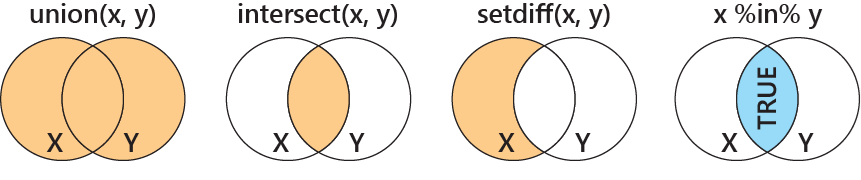

# 15  ベクター

Code

**ベクター（vector）**はRのクラスのうち、最も基本的なものです。R以外の言語では、要素が1つのクラスと、複数の要素を持つクラスは明確に区別されることが多いですが、Rでは、**要素が1つでも複数でも全てベクター**として取り扱います。ベクターでは繰り返し処理を用いることなく、すべての要素に対して演算を行うことができます。

ベクターには、

- **データ型が1つ**だけ
- データ型が異なる要素が入ると、**ベクター全体の型が変化**する
- 演算には**反復（recycling）**が用いられる

という特徴があります。

## 15.1 ベクターの作成と結合：cとappend

要素が一つのベクターは関数などを特に用いることなく作成することができます。要素が複数のベクターは`c`関数（`c`はconbineの略）で作成することができます。`c`関数はベクター同士をつなぐのにも使えます。

`append`関数もベクター同士を結合するのに使います。`append`関数では、ベクターを追加する位置を`after`引数で指定することができます。

``` downlit
1 # 一つの数値はベクター
## [1] 1

"moji" # 一つの文字列もベクター
## [1] "moji"

x <- c(1, 2, 3) # c関数で複数の要素のベクターを作る
c(x, 4) # c関数はベクター同士をつなぐのにも使える
## [1] 1 2 3 4

append(x, 4) # append関数もベクターをつなぐのに使える
## [1] 1 2 3 4

# append関数では、ベクターの挿入場所を指定できる
append(c(1, 2, 3), "added", after=1) 
## [1] "1"     "added" "2"     "3"
```

## 15.2 連続する数値ベクターを作成する：コロン（:）、sep、seq

連続する整数や、一定間隔の数列、繰り返しのあるベクターを作成する場合には、`:`（コロン）、`seq`関数、`rep`関数を用います。

`:`（コロン）は連続する数値のベクターを作成する演算子で、コロンの前に置いた数値から、後に置いた数値まで公差1の、連続する数値のベクターを作成します。コロンの前後には、マイナスの数値を設定することもできます（例えば、`-1:-3`とすると、-1, -2, -3のベクターとなります）。この**コロンの演算は、他の演算子より前に実行**されます。

`seq`関数は、第一引数（`from`）から第二引数（`to`）まで、`by`引数で指定した間隔で連続する数値のベクターを作成する関数です。また、`by`引数の代わりに、`length.out`引数を設定すると、`from`から`to`まで、`length.out`で指定した長さのベクターを作成することができます。

`rep`関数は、第一引数にベクターを取り、第二引数に繰り返しの回数を取る関数です。`rep`関数の出力は、第一引数のベクターを第二引数の回数だけ繰り返したものになります。第二引数にはベクターを取ることもでき、ベクターで指定した回数だけ、要素を繰り返したベクターを作成することができます。

``` downlit
1:3 # 1から3までの整数のベクター
## [1] 1 2 3

-5:5 # -5から5までの整数のベクター
##  [1] -5 -4 -3 -2 -1  0  1  2  3  4  5

-1:-10 # -1から-10までの整数のベクター
##  [1]  -1  -2  -3  -4  -5  -6  -7  -8  -9 -10

-1:-10 * 5 # コロンの演算は掛け算より先に行われる
##  [1]  -5 -10 -15 -20 -25 -30 -35 -40 -45 -50

seq(1, 5, by=0.5) # 1から5まで、0.5間隔のベクター
## [1] 1.0 1.5 2.0 2.5 3.0 3.5 4.0 4.5 5.0

seq(1, 5, length.out=11) # 1から5まで、等間隔の長さ11のベクター
##  [1] 1.0 1.4 1.8 2.2 2.6 3.0 3.4 3.8 4.2 4.6 5.0

x # xは1、2、3のベクター
## [1] 1 2 3

rep(x, 5) # xを5回繰り返す
##  [1] 1 2 3 1 2 3 1 2 3 1 2 3 1 2 3

rep(x, c(1, 2, 3)) # xの要素を1、2、3回繰り返す
## [1] 1 2 2 3 3 3
```

## 15.3 ベクターの型

ベクターの型は、ベクターに含まれる要素によって変化します。数値のベクターはnumeric、文字列が含まれるベクターはcharacter、因子であればfactor（factorはクラスで、型はnumeric）、論理型であればlogicalとなります。ベクターは1つの型からなる要素の集合ですので、別の型の要素が付け加えられると、元のベクター、もしくは付け加えられた要素の型が変化します。型の優先順位は**character \> numeric \> logical = factor**という順で、型が混じったベクターはより優先される型に自動的に変換されます。

ベクターは**atomic vector**と呼ばれることもあります。ベクターであることの確認には、`is.atomic`関数を用います。この関数は、引数がベクターであれば`TRUE`、ベクター以外であれば`FALSE`を返します。

``` downlit
class(c(x, 4)) # 数値ベクター（numeric）
## [1] "numeric"

class(c(x, "added")) # 文字列ベクター（character）
## [1] "character"

class(factor(x)) # 因子ベクター（factor）
## [1] "factor"

class(c(T, F, T)) # 論理型ベクター（logical）
## [1] "logical"

class(c(T, 1)) # logicalとnumericのベクターはnumeric
## [1] "numeric"

class(c(factor("dog"), 1)) # factorとnumericのベクターはnumeric
## [1] "numeric"

class(c(T, factor("dog"))) # logicalとfactorのベクターはnumeric（integer）
## [1] "integer"

class(c(1, "dog")) # numericとcharacterのベクターはcharacter
## [1] "character"


mode(c(x, 4)) 
## [1] "numeric"

mode(c(x, "added"))
## [1] "character"

mode(factor(x)) # 因子はクラスで、型は数値型
## [1] "numeric"

mode(c(T, F, T))
## [1] "logical"

is.atomic(1) # 長さ1のベクター
## [1] TRUE

is.atomic(c(1, 2)) # 長さ2以上のベクター
## [1] TRUE

is.atomic(list(1)) # リストはベクターではない
## [1] FALSE
```

## 15.4 演算と反復（recycling）

Rのベクターでは、`for`文などの繰り返し文を用いることなく、すべての要素に対して演算を行うことができます。

``` downlit
x <- c(1, 2, 3)
x + 1
## [1] 2 3 4
x - 1
## [1] 0 1 2
x * 3
## [1] 3 6 9
x / 2
## [1] 0.5 1.0 1.5
x %% 3
## [1] 1 2 0
```

ベクターの演算時には、**反復（recycling）**のルールが適用されます。長いベクターと短いベクターの演算で、反復のルールを確認してみましょう。

``` downlit
y <- c(2, 3, 4) # 長さ3のベクター
x # 長さ3のベクター
## [1] 1 2 3
y
## [1] 2 3 4
x + y 
## [1] 3 5 7
x - y
## [1] -1 -1 -1
x * y
## [1]  2  6 12
x / y
## [1] 0.5000000 0.6666667 0.7500000
z <- c(2, 2, 2, 2, 2, 2) # 長さ6のベクター
x
## [1] 1 2 3
z
## [1] 2 2 2 2 2 2
x + z
## [1] 3 4 5 3 4 5
x - z
## [1] -1  0  1 -1  0  1
x * z
## [1] 2 4 6 2 4 6
x / z
## [1] 0.5 1.0 1.5 0.5 1.0 1.5
```

長さが同じベクターでは、ベクターのインデックスが一致するもの同士が演算されていることがわかります。例えば、`x`（`c(1, 2, 3)`）と`y`（`c(2, 3, 4)`）の足し算は、1+2、2+3、3+4の結果となります。

一方で、長さが違うベクターを演算した場合には、短いベクターが**反復（recycling）**されます。`x`（`c(1, 2, 3)`）と`z`（`c(2, 2, 2, 2, 2, 2)`）の足し算では、前の3つのインデックスだけでなく、後ろの3つにも`x`の要素が足し算された結果が返ってきます（1+2, 2+2, 3+2, 1+2, 2+2, 3+2の結果が出力）。このように、短いベクターを繰り返して、長いベクターと同じ長さとし、結果を返すのが**反復（recycling）**のルールです。ベクターに数値を足し算するような場合にも、この反復と同じルールが適用されています。数値は長さ1のベクターですので、この長さ1のベクターを反復し、長さをあわせて計算した結果が返ってきていることになります。

``` downlit
c(1, 2, 3) + 1 # このような書き方は
## [1] 2 3 4
c(1, 2, 3) + c(1, 1, 1) # 自動的にこのような計算とされる
## [1] 2 3 4
```

このルールでは、**短いベクターの長さがもう一方のベクターの長さの約数でない場合、中途半端に反復される**ことになります。下の場合では、`c(1, 2)`が反復されて、`c(1, 2, 1)`として取り扱われています。このような場合には、Rは警告（warning）を出します。

``` downlit
c(1, 2) + c(1, 2, 3)
## Warning in c(1, 2) + c(1, 2, 3): longer object length is not a multiple of
## shorter object length
## [1] 2 4 4
```

## 15.5 インデックス

ベクターの要素は**インデックス**を用いて取り出すことができます。インデックスはベクターの1つ目の要素が1、2つ目の要素が2、という形で設定されており、`[ ]`（角カッコ）の中にインデックスを指定することで要素を取り出すことができます。

インデックスは整数のベクターの形でも指定できます。連続したインデックスを指定する際には、コロン（`:`）を用いて指定します。

``` downlit
x <- 2:11
x
##  [1]  2  3  4  5  6  7  8  9 10 11

x[3] # 3つ目の要素を取り出す
## [1] 4

x[12] # 要素が無いとNAが返ってくる
## [1] NA

x[c(10, 5, 2)] # 10番目、5番目、2番目の要素を取り出す
## [1] 11  6  3

x[4:6] # 4番目から6番目までの要素を取り出す
## [1] 5 6 7
```

**インデックスをマイナスで指定すると、そのインデックスが指定する要素を削除**することができます。インデックスをマイナスのベクターで指定すると、そのマイナスで指定した位置の要素が削除されます。

``` downlit
x[-4] # 4番目の要素を削除する
## [1]  2  3  4  6  7  8  9 10 11

x[-(5:8)] # 5番目から8番目までの要素を削除する
## [1]  2  3  4  5 10 11

x[-5:-8] # 上と同じ
## [1]  2  3  4  5 10 11
```

インデックスは数値だけでなく、**論理型（`TRUE`と`FALSE`）で指定**することもできます。`[ ]`の中に、`TRUE`（`T`）と`FALSE`（`F`）のベクターを与えると、`TRUE`のインデックスにある要素だけを取り出すことができます。この指定では、反復（recycling）が適用されるので、ベクターの長さより論理型ベクターの長さが短ければ、論理型ベクターが反復されて使用されます。論理型ベクターの方が長い場合には反復は行われず、論理型ベクターが余分に長い分だけ`NA`が返ってきます。

``` downlit
x[c(T, T, T, T, F, T, T, T, T, F)] # インデックスは論理型でもよい
## [1]  2  3  4  5  7  8  9 10

x[c(T, F)] # 反復（recycling）が適用され、2つ置きに要素を取り出すことになる
## [1]  2  4  6  8 10

x[c(T, T, T, T, F, T, T, T, T, F, T)] # 論理型の方が長いと、NAが返ってくる
## [1]  2  3  4  5  7  8  9 10 NA
```

インデックスを論理型ベクターで指定できるため、比較演算子を用いてベクターの要素を取り出すこともできます。例えば、`x[x > 5]`という形で比較演算子を用いてインデックスを指定すると、`x`のベクターのうち、5より大きい要素のみを取り出すことができます。

``` downlit
x == 5 # 論理型を比較演算子で作る
##  [1] FALSE FALSE FALSE  TRUE FALSE FALSE FALSE FALSE FALSE FALSE

x[x == 5] # 比較演算子を含む演算もインデックスに取れる
## [1] 5

x[x > 5]
## [1]  6  7  8  9 10 11

x[x > 3 & x < 6] # 3より大きく、かつ6より小さいものを選ぶ
## [1] 4 5

x %in% c(2, 7) # %in%は後ろの要素と一致する場合にTRUEを返す
##  [1]  TRUE FALSE FALSE FALSE FALSE  TRUE FALSE FALSE FALSE FALSE

x[x %in% c(2, 7)] # 2と7である要素を取り出す
## [1] 2 7
```

ベクターの一部を確認したいときには、`head`関数と`tail`関数を用います。`head`関数はベクターの始めから6つ目までを、`tail`関数はベクターの後ろから6つ目までを表示する関数です。どちらも第二引数に数値を入れると、その長さのベクターを取り出すことができます。

``` downlit
head(x) # 始めの6つを表示
## [1] 2 3 4 5 6 7

tail(x) # 最後の6つを表示
## [1]  6  7  8  9 10 11
```

## 15.6 インデックスの位置を特定する

インデックスの位置を特定する場合には、`which`関数を用います。`which`関数は引数に論理型（もしくは比較・論理演算子）を取り、`TRUE`になる位置のインデックスを返す関数です。

``` downlit
x <- c("cat", "fat", "dog", "rat", "mat")
which(x == "cat") # catはインデックス1
## [1] 1

which(x == "rat") # ratはインデックス4
## [1] 4
```

## 15.7 ベクターの要素に名前を付ける

ベクターには**名前（`names`）**というアトリビュートがあります。`names`はベクターの要素に名前をつけるものです。`names`の要素が重複していても問題はないのですが、後に述べる呼び出しの際に間違いの原因となるため、あまりオススメはできません。

ベクターの要素は上記の通り、**インデックス**を用いて呼び出すことができます。しかし、**ベクターの要素はその名前からでも呼び出す**ことができます。呼び出すときには、角カッコ（`[ ]`）の中に、文字列で名前を示します。インデックスの代わりに名前の文字列を用いることで、名前に対応した要素を取り出すことができます。

ベクターの名前は、`c`関数を用いてベクターを作成するときに設定することができます。ベクターがすでに変数として準備されている場合には、`names`関数を用いて名前を設定することができます。この`names`関数の引数にベクターを取り、**`names`関数に名前を記載したベクターを代入する**形で名前を設定することができます。

ベクターの名前も`names`関数で確認することができます。ベクターでは、ドルマーク（`$`）を用いて名前から要素を取り出すことはできません。

ベクターの複数の要素に同じ名前を付けた場合には、インデックスが最も前の要素だけを名前で呼び出すことができます。同じ名前を付けた2つ目、3つ目の要素を名前を用いて呼び出すことはできません。

``` downlit
c(dog = 1, cat = 2, pig = 3) # 名前付きべクターをc関数で作る
## dog cat pig 
##   1   2   3

x <- c(1, 2, 3)
names(x) <- c("dog", "cat", "pig") # ベクターに名前を設定する
names(x) # 名前が返ってくる
## [1] "dog" "cat" "pig"

x["cat"] # 名前の文字列をインデックスにすることができる
## cat 
##   2

x$cat # 呼び出せない
## Error in `x$cat`:
## ! $ operator is invalid for atomic vectors
```

> **TIP:**
>
> プログラミング言語には、**連想配列**（ハッシュやディクショナリなどとも呼ばれる）というデータ型を持つものがあります。連想配列は文字列（記号）と値を結びつけておき、文字列をインデックスとして値を呼び出すものです（例えば、banana=1、apple=2としておいて、bananaで呼び出すと1が返ってくる）。Rでは、ベクターにnamesが設定でき、名前を用いて要素を呼び出すことができるため、ベクターが連想配列の役割をこなすことができます。

## 15.8 ベクターの長さを調べる

ベクターは、名前以外に、**長さ（length）**を特性として持っています。ベクターの長さは、そのベクターの要素の数のことです。ベクターの長さは`length`関数で調べることができます。ベクターは1次元の構造を持つデータですので、dimension（次元）を持ちません。

``` downlit
length(x) # 要素が3つなので長さは3
## [1] 3

dim(x) # ベクターは次元（dimension）を持たない
## NULL
```

## 15.9 ベクターの並べ替えと要素の順番

ベクターの要素を順番に並べ替える場合には、`sort`関数を用います。`sort`関数はベクターを昇順に並べ替える関数ですが、`decreasing=TRUE`を指定すると降順に並べ替えることができます。ベクターを逆順に並べ替える場合には、`rev`関数を用います。

また、`order`関数と`rank`関数は要素の順番を返す関数です。`order`関数と`rank`関数ではタイデータの取り扱いが異なります。`order`関数はデータフレームの順番の並べ替えに使われます。

``` downlit
x <- c(5, 3, 4, 2, 1)

# 昇順に並べ替え
sort(x)
## [1] 1 2 3 4 5

# 降順に並べ替え
sort(x, decreasing=TRUE)
## [1] 5 4 3 2 1

rev(x) # 逆順
## [1] 1 2 4 3 5

# 要素の順番を評価する
order(c(4, 2, 5, 3, 1, 2)) # タイデータに順番を付ける
## [1] 5 2 6 4 1 3
rank(c(4, 2, 5, 3, 1, 2)) # タイデータを真ん中の順番にする
## [1] 5.0 2.5 6.0 4.0 1.0 2.5
```

## 15.10 重複する要素を取り除く

ベクター内の重複する要素を取り除く場合には、`unique`関数を用います。

``` downlit
x <- c("cat", "dog", "cat", "cat")
unique(x)
## [1] "cat" "dog"
```

#### 15.10.0.1 アトリビュート（attribute）を付ける

Rでは、ベクターに名前以外のアトリビュートをつけることもできます。アトリビュートをつけるとき、アトリビュートを呼び出すときには`attr`関数を用います。ただし、`names`以外のアトリビュートをベクターの要素の呼び出しに用いることはできません。

ベクターのアトリビュートを調べるときには、`str`関数を用いることもできます。`str`は「structure」の略で、様々なオブジェクトの構造を調べることができる便利な関数です。

``` downlit
attr(x, "hoge") <- c("rat", "hat", "mat")
x$hoge # 呼び出せない
## Error in `x$hoge`:
## ! $ operator is invalid for atomic vectors

attr(x, "hoge") # 呼び出せる
## [1] "rat" "hat" "mat"

str(x) # アトリビュートにhogeがあることを確認
##  chr [1:4] "cat" "dog" "cat" "cat"
##  - attr(*, "hoge")= chr [1:3] "rat" "hat" "mat"
```

> **TIP:**
>
> ベクターに`names`以外の`attribute`を設定しても特に利点はないため、アトリビュートの設定を行うことはほぼありません。`attribute`には、`names`の他にクラス名などが登録されます。

## 15.11 ランダムサンプリング

Rは統計の言語です。統計と確率は密接に関係しているため、統計の取り扱いにおいては、時に確率論的な現象を再現したい、という場合があります。確率論的な現象ではランダムなものを取り扱うため、Rではベクターからランダムに要素を取り出す関数、`sample`関数が備わっています。

この`sample`関数では、第一引数にベクター、第二引数にベクターから要素を取り出す回数を指定します。このランダムな取り出しには、**復元抽出**（1つの要素を何度も取り出すことができる）と**非復元抽出**（1つの要素を一度取り出すと、再度取り出されることがない）があります。復元抽出と非復元抽出の指定には、`sample`関数の`replace`引数を用います。`replace`引数のデフォルトは`FALSE`で、`replace`を指定しない場合には非復元抽出が行われます。復元抽出を行う場合には、`replace`に`TRUE`を指定します。

``` downlit
sample(1:10, 5) # 1~10の整数から5つをランダムに取り出す
## [1]  6  7  9 10  4

sample(1:10, 5) # ランダムに取り出すので、上とは異なる結果となる
## [1] 4 2 9 8 7

sample(1:10, 5, replace=FALSE) # 非復元抽出
## [1] 2 4 7 9 8

sample(1:10, 15, replace=FALSE) # エラー（1度しか取り出せない）
## Error in `sample.int()`:
## ! cannot take a sample larger than the population when 'replace = FALSE'

sample(1:10, 15, replace=TRUE) # 復元抽出ではエラーとならない
##  [1]  5  4  4  5  3  8  4  5  5  6  5  1  2 10  6
```

## 15.12 ベクターを切り分ける：split

ベクターを同じ長さの因子で切り分けるのが、`split`関数です。`split`関数は2つの引数を取り、第一引数にはベクター、第二引数にはベクターと同じ長さの因子を取ります。因子の`levels`に従い、第一引数で指定したベクターを2つ以上のグループに切り分けます。`split`関数では、グループで切り分けたベクターがリストで返ってきます。

``` downlit
x <- rep(1:5, 5) # xは1~5を5回繰り返すベクター
y <- factor(c(rep(1, 10), rep(2, 15))) # xを切り分けるための因子

x
##  [1] 1 2 3 4 5 1 2 3 4 5 1 2 3 4 5 1 2 3 4 5 1 2 3 4 5
y
##  [1] 1 1 1 1 1 1 1 1 1 1 2 2 2 2 2 2 2 2 2 2 2 2 2 2 2
## Levels: 1 2

split(x, y) # リストが返ってくる
## $`1`
##  [1] 1 2 3 4 5 1 2 3 4 5
## 
## $`2`
##  [1] 1 2 3 4 5 1 2 3 4 5 1 2 3 4 5
```

| 関数名                   | ベクターに適用される演算                  |
|:-------------------------|:------------------------------------------|
| head(x)                  | 始めの6つの要素を返す                     |
| tail(x)                  | 最後の6つの要素を返す                     |
| names(x)                 | 名前を表示する                            |
| names(x) \<- y           | yを名前に設定する                         |
| length(x)                | 要素の数を返す                            |
| attr(x, which)           | attribute(which)を返す                    |
| attr(x, which) \<- y     | attribute(which)をyに設定する             |
| str(x)                   | 詳細な情報（構造、structure）を表示する   |
| sample(x, size, replace) | xからsizeの個数の要素をランダムに取り出す |
| split(x, f)              | 因子fに従ってベクターを分割する           |
| sort(x)                  | 昇順に並べ替える                          |
| sort(x, decreasing=TRUE) | 降順に並べ替える                          |
| rev(x)                   | 逆順に並べ替える                          |
| unique(x)                | 重複を取り除く                            |

表1：ベクターに関する関数 {.caption-top .table .table-sm .table-striped .small}

## 15.13 集合としてのベクター

統計では、集合を取り扱う場合があります。集合としてベクターを取り扱い、積集合や和集合を取り扱う関数がRには備わっています。

ベクターの要素のうち、重複したものを取り除く関数が`unique`関数です。`unique`関数はベクターを引数に取り、引数に含まれる重複した要素を1つだけ残して取り除きます。

和集合と積集合を求める関数が`union`関数と`intersect`関数です。`union`関数も`intersect`関数も共に2つのベクターを引数に取り、`union`関数は和集合（ベクターが`x`と`y`の時、\\x \cup y\\）、`intersect`関数は積集合（ベクターが`x`と`y`の時、\\x \cap y\\）を返します。

集合の差を示す関数が`setdiff`関数です。`setdiff`関数も2つのベクターを引数に取り、第一引数にあって第二引数に無い要素を返します。

集合が同一とみなせるかどうか判断する関数が`setequal`関数です。2つのベクターを引数に取り、2つのベクターの要素が同一であれば`TRUE`、異なっていれば`FALSE`を返します。

最後に、集合に関与する演算子である、`%in%`について説明します。`%in%`は前と後ろにベクターを取る演算子で、前のベクターにも後ろのベクターにもある要素（積集合の要素）には`TRUE`、前のベクターにはあり、後ろのベクターには無い要素には`FALSE`を返す関数です。

[](./image/set.png)

| 関数名          | 集合に適用する演算                             |
|:----------------|:-----------------------------------------------|
| union(x, y)     | xとyの和集合                                   |
| intersect(x, y) | xとyの積集合                                   |
| setdiff(x, y)   | xにあってyに無い集合                           |
| setequal(x, y)  | xとyが同一かどうかを評価                       |
| x %in% y        | xのうち、yにある要素はTRUEを返す               |
| duplicated      | 重複した要素はTRUEを返す                       |
| anyDulricated   | 重複した要素が出現する最小のインデックスを返す |

表2：集合に関する関数 {.caption-top .table .table-sm .table-striped .small}

``` downlit
x <- rep(1:5, 5)

x
##  [1] 1 2 3 4 5 1 2 3 4 5 1 2 3 4 5 1 2 3 4 5 1 2 3 4 5

unique(x)
## [1] 1 2 3 4 5

x <- 1:10
y <- 7:16

union(x, y) # xとyの和集合
##  [1]  1  2  3  4  5  6  7  8  9 10 11 12 13 14 15 16

intersect(x, y) # xとyの積集合
## [1]  7  8  9 10

setdiff(x, y) # xにあってyに無いもの
## [1] 1 2 3 4 5 6

setdiff(y, x) # yにあってxに無いもの
## [1] 11 12 13 14 15 16

setequal(x, y) # xとyが同一かどうかを評価
## [1] FALSE

setequal(x, 10:1) # 要素が同一なのでTRUE
## [1] TRUE

x %in% y # xのうち、yにあるものはTRUE
##  [1] FALSE FALSE FALSE FALSE FALSE FALSE  TRUE  TRUE  TRUE  TRUE

duplicated(c(1, 2, 3, 4, 4, 4)) # 4が5番目から重複しているのでTRUE、それ以外はFALSE
## [1] FALSE FALSE FALSE FALSE  TRUE  TRUE

anyDuplicated(c(1, 2, 3, 4, 4, 4)) # 5番目の要素で重複があるので5を返す
## [1] 5

anyDuplicated(c(1, 2, 3, 4)) # 重複がないので0が返ってくる
## [1] 0
```

Back to top
