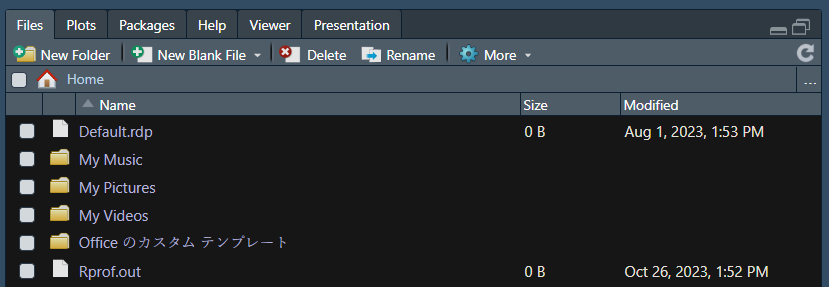
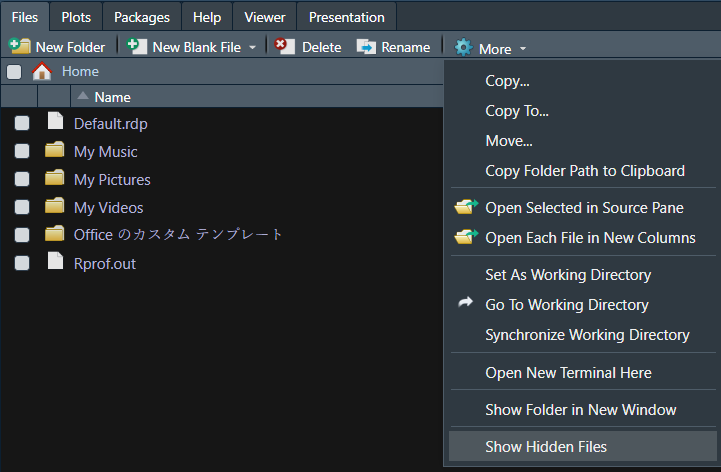
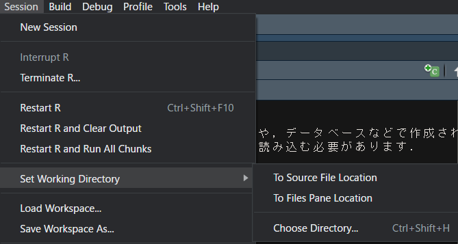
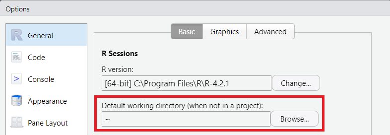
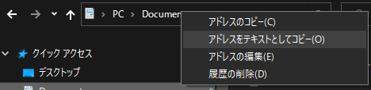
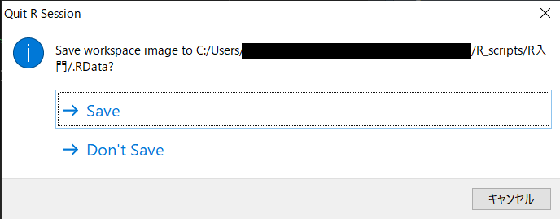
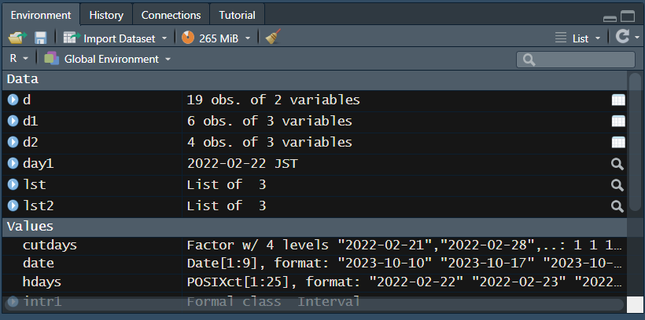
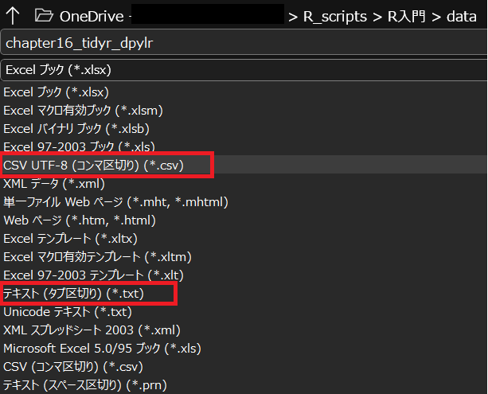
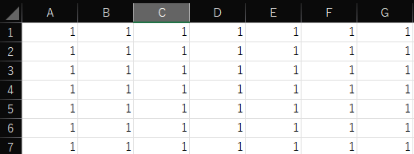
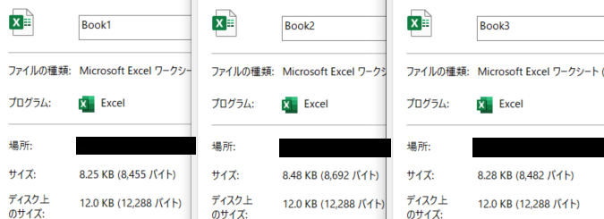

# 17  データの読み込みと書き出し（I/O）

Code

統計に用いるデータは、通常Excelのような表計算ソフトやデータベースからの抽出などで作成されます。Rを用いてデータ解析・統計解析を行うためには、まずRに表計算ソフトやデータベースからデータを読み込む必要があります。

データ解析・統計解析が終われば、Rでの解析結果を書き出し、Excelなどで取り扱う必要があります。

このように、Rで解析を行うためには、データの読み込み・書き出しが必須となります。Rはこのような、データの読み込み・書き出し（Input/Output、**I/O**）のための関数を多数備えています。

## 17.1 ディレクトリの操作

データを読み込み、書き出すためには、まず読み込む・書き出すためのフォルダが必要となります。フォルダのことを**ディレクトリ**とも呼びます。Rでは、**ワーキングディレクトリ（working directory）**というものが設定されています。Rからはこのワーキングディレクトリの中のファイルを確認することができます。

ワーキングディレクトリは通常、RStudioを起動した時に、右下のカラムのFilesタブに表示されています。

[](./image/filestab.png "図1：ワーキングディレクトリをfilesタブで確認する")

図1：ワーキングディレクトリをfilesタブで確認する

このfilesタブでは、任意のフォルダに移動することができます。上図の右上、…と記載されている部分をクリックするとウインドウが開きます。このウインドウ上で任意のフォルダに移動すれば、filesタブに示されるフォルダが変わります。ただし、表示するフォルダを変えるだけではワーキングディレクトリを変更することはできません。

filesタブに表示されたフォルダをワーキングディレクトリに設定するには、filesタブの右上、「More」から「Set As Working Directory」を選択します。

[](./image/filestab_options.png "図2：MoreのリストからSet As Working Directoryを選ぶ")

図2：MoreのリストからSet As Working Directoryを選ぶ

Fileに表示されているディレクトリをワーキングディレクトリに変更する場合には、同じ「More」から「Go To Working Directory」を選択します。

ワーキングディレクトリの変更は、上の「Session」から「Set Working Directory」を選択することでも変更できます。

[](./image/Session_SetWD.png "図3：「Session」からワーキングディレクトリを変更する")

図3：「Session」からワーキングディレクトリを変更する

デフォルトのワーキングディレクトリ（Rstudioを開いた時に設定されているワーキングディレクトリ）を変更する場合には、「Tools」→「Option」を選択し、「Default working directory」に任意のフォルダを指定します。

[](./image/DefaultWD.png "図4：デフォルトのワーキングディレクトリを変更する")

図4：デフォルトのワーキングディレクトリを変更する

### 17.1.1 getwd関数とsetwd関数

上記のように、RStudioの機能を使えばワーキングディレクトリを簡単に変更することができます。ただし、データのフォルダ構造によっては、Rでの演算中にワーキングディレクトリを変更したい、といった場合もあります。

ワーキングディレクトリの確認と設定は、`getwd`関数と`setwd`関数を用いて行うことができます。

`getwd`関数は現在のワーキングディレクトリを確認するための関数です。`getwd`関数は引数を取らず、実行すると現在のワーキングディレクトリのアドレスを文字列で返します。

`setwd`関数はワーキングディレクトリを変更するための関数です。`setwd`関数は**文字列のディレクトリのアドレス**を引数に取ります。`setwd`関数を実行すると、アドレスで指定したフォルダにワーキングディレクトリが変更されます。

``` downlit
getwd() # ワーキングディレクトリを確認
setwd("directory/name/as/character") # ワーキングディレクトリを変更
```

### 17.1.2 絶対パスと相対パス

ディレクトリを指定する際には、**ディレクトリのアドレス**を用います。Windowsでは、フォルダを開き、上のアドレスバーを右クリックすると、アドレスをテキストとしてコピーすることができます。この方法でコピーできるアドレスのことを**絶対パス**と呼びます。絶対パスには、ルートディレクトリ（大元のフォルダ）からそのフォルダまでのアドレスが全て記載されています。

[](./image/directory_address.png "図5：ディレクトリのアドレス（Windowsの場合）")

図5：ディレクトリのアドレス（Windowsの場合）

ディレクトリのアドレスには、**相対パス**と呼ばれるものもあります。相対パスは、現在のディレクトリの上位や下位といった、現在のディレクトリからの位置を相対的に表すものです。

`setwd`関数は、この絶対パス、相対パスのいずれも使用することができます。絶対パスの場合には、ルートからのすべてのアドレスを文字列で指定します。一方、相対パスの場合は、.（ピリオド）を用いて、現在のディレクトリからの位置を以下のように指定します。

- **「./」**は今のディレクトリのアドレスを示す記号
- **「../」**は今のディレクトリの一つ上位のディレクトリを示す記号

上の記号を用いて、一つ下位にあるディレクトリは以下のように示すことができます。

**“./一つ下のフォルダ名”**

また、`setwd`関数は、下位のフォルダであれば、そのフォルダまでのパスを記載するだけでもディレクトリを指定することができます。ただし、Windowsではフォルダのつなぎ文字がバックスラッシュ（\\になっています。Rでのつなぎ文字はスラッシュ（/）ですので、Windowsではアドレスの記法が異なることに注意が必要です。

``` downlit
setwd("../") # 一つ上のフォルダにワーキングディレクトリを移動
setwd("./NameF") # 一つ下の「NameF」というフォルダにワーキングディレクトリを移動
setwd("NameF") # 上と同じ
setwd("NameF/NameF2") # NameFフォルダ内のNameF2というフォルダに移動
```

## 17.2 ディレクトリ内のファイルの確認

ワーキングディレクトリ内のファイルやフォルダは、Rで開いたり、確認したりすることができます。`dir`関数と`list.files`関数はワーキングディレクトリ内のファイル・フォルダの一覧を表示するための関数です。いずれもファイル・フォルダ名の一覧を文字列のベクターとして返します。`list.dirs`関数はワーキングディレクトリ内にあるフォルダのアドレスの一覧を文字列のベクターとして返します。

``` downlit
dir() # ディレクトリ名とファイル名が返ってくる
list.files() # dir関数と同じ
list.dirs() # ディレクトリ名のみ返ってくる

list.files(recursive = TRUE) # サブフォルダ内のファイル名も取得する
```

## 17.3 フォルダとファイルの作成

現在のワーキングディレクトリにフォルダを作成する際には、`dir.create`関数を用います。`dir.create`関数は作成するフォルダ名の文字列を引数に取ります。ワーキングディレクトリ内にファイルを作成する関数はいくつもあります。単にファイルを作るのであれば`file.create`関数を、文字列をテキストで保存する場合には`cat`関数を用います。

``` downlit
dir.create("tmp") # 現在のワーキングディレクトリに「tmp」というフォルダを作成
setwd("tmp") # 作成したフォルダにワーキングディレクトリを移動
file.create("filename.txt") # 空のテキストファイルを作成
cat("Hello world", file="helloworld.txt") # Hello worldと書き込まれたテキストファイルを作成
```

## 17.4 ワークスペースイメージ（.Rdata）の保存

**ワークスペース**とは、Rを実行している時に取り扱っているオブジェクトなどの環境のことです。RGUIやRStudioを閉じるときには、下の図のようなウインドウが表示され、ワークスペースのイメージを保存するかどうか尋ねられます。ワークスペースを保存すると、現在のワーキングディレクトリに「**.RData**」というファイルが作成されます。この.RDataがワークスペースのイメージです。

[](./image/save_workspace.png "図6：Rstudio終了時のワークスペース保存")

図6：Rstudio終了時のワークスペース保存

.RDataファイルはRStudioを閉じるときだけでなく、RStudioのメニューから「Session → Save Workspace As…」を選ぶことでも保存できます。また、`save.image`関数を用いても、.RDataファイルを作成することができます。

現在のワークスペースの情報は、RStudio右上のパネルの「Environment」で確認できます。このパネルでは、現在Rで取り扱っている変数（オブジェクト）の一覧を確認することができます。

[](./image/environment_pane.png "図7：Environmentパネル")

図7：Environmentパネル

このパネルに表示されているのと同じ、オブジェクトのリストをR上で取得する場合には、`ls`関数を用います。

Rを閉じると、オブジェクトはメモリから削除されます。次にRStudioを起動したときには、デフォルトのワーキングディレクトリに存在する.RDataから自動的にワークスペースのイメージが読み込まれます。別途、.RDataファイルを指定してワークスペースを読み込む場合には、`load`関数を用います。`load`関数で.RDataファイルを読み込むことで、.RDataファイルを保存した際に使用していたオブジェクトがメモリ上に展開されます。

このように、ワークスペースを保存・読み込むことで、以前のデータ分析環境を読み込み、データ分析の続きを行うことができます。

``` downlit
ls() # 現在メモリ上にある全てのオブジェクトを表示
save.image() # ワークスペースのイメージを保存する
load(".Rdata") # ワークスペースのイメージを読み込む
```

## 17.5 オブジェクトの保存と読み込み

ワークスペース全体ではなく、個別のオブジェクトも、一時的に保存し、読み込むことができます。オブジェクトの保存と読み込みには、`save`関数と`load`関数を用います。

`save`関数はオブジェクトと文字列のファイル名の2つを引数に取り、オブジェクトを引数で指定したファイル名で保存する関数です。ファイル名は何でもよく、ファイルの拡張子にも特に指定はないのですが、**「.rda」**を拡張子としたファイル名とするのが一般的です。

保存したオブジェクトを読み込む関数が、`load`関数です。`load`関数はファイル名の文字列を引数に取り、`save`関数で保存した.rdaファイルを読み込みます。`load`関数で読み込むと、Rのワークスペースには保存したオブジェクトが現れます。

`save`・`load`関数と同様の関数として、`dput`関数と`dget`関数というものもあります。`dput`関数で保存したファイルは`load`関数で読み込めず、`save`関数で保存したファイルは`dget`関数で読み込めないため、`dput`関数でオブジェクトを保存した場合には、`dget`関数で読み込む必要があります。`dget`関数はオブジェクトを返す関数ですので、ワークスペースにオブジェクトが再現されるわけではありません。

``` downlit
x <- c(1, 2, 3)
save(x, file = "Robject.rda") # オブジェクトを保存
rm(x) # xを削除する
load("Robject.rda") # オブジェクトの読み込み
x # xが読み込まれている

dput(x, "Robject_dput.rda") # オブジェクトを保存
dget("Robject_dput.rda") # オブジェクトが返ってくる

dget("Robject.rda") # エラー。saveで保存するとdgetで読み込めない
load("Robject_dput.rda") # エラー。dputで保存するとloadで読み込めない
```

### 17.5.1 プログラムを呼び出す

保存したプログラムを他のプログラムで呼び出すときには、`source`関数を用います。`source`関数の引数はファイル名の文字列です。[2章](chapter2.llms.md#エディタを使う)で説明した通り、Rのプログラムは通常「.R」の拡張子を付けて取り扱いますので、拡張子を含めたファイル名を指定します。現在のワーキングディレクトリに保存されているファイルを呼び出す場合はそのファイル名を、他のディレクトリに保存されているファイルを呼び出す場合はそのファイルのパスを含む文字列を`source`関数の引数に取ります。`source`関数でプログラムを呼び出すと、そのプログラムが実行されます。複雑なプログラムでは、関数などを別ファイルで定義しておいて、そのファイルを呼び出して用いることもあります。

``` downlit
source("code_hello_world.R")
```

## 17.6 データの読み込み

### 17.6.1 Excelからデータを読み込む（古典的な方法）

統計を行うデータは、通常Excelのような表計算ソフトか、データベースで準備するのが一般的です。このようなデータをRで取り込む際には、一昔前までは**「テキストファイルに変換」**してから読み込むのが一般的でした。

最近ではパッケージを使用することでExcelやデータベースのファイルから直接データを読み込むことができますが、パッケージなしのRではこのような読み込みはできません。パッケージが使用できないときには、以下のような方法でExcelファイルをテキストとして保存し、Rで読み込むことになります。

また、Web上に保存されているデータがテキストである場合も少なくありません。このような、Web上のテキストファイルの読み込みにも、以下に示すテキスト読み込みの方法を用いることができます。

#### 17.6.1.1 Excel：csv・タブ切りテキストへの変換

まずは、Excelでのテキストファイルの変換について説明します。Rで読み込むことができるテキストは、大きく分けると以下の4種類です。

- **コンマ切りテキスト**（comma-separated values, **csv**）
- **タブ切りテキスト**（tab-separated values, **tsv**）
- スペース切りテキスト
- 固定幅テキスト

これらのうち、スペース切りテキストについてはデータにスペースが入っていると読み込みが難しくなるため、通常は避けられます。固定幅テキストはやや取り扱いにくいため、Excelからの変換には用いません。したがって、Excelファイルは主にコンマ切りテキストかタブ切りテキストに変換して、Rで読み込むことになります。

Excelファイルからコンマ切り・タブ切りテキストへの変換はExcel上で行います。Excelの「ファイル」メニューから「名前を付けて保存」を選択し、ファイル名の下のドロップダウンリストから「CSV UTF-8 (コンマ区切り)(\*.csv)」もしくは「テキスト (タブ区切り)(\*.txt)」を選択します。拡張子である「.csv」や「.txt」は自動的に付与されます。

> **TIP:**
>
> テキストには**エンコーディング**というものがあり、日本語テキストは**UTF-8、Shift-JIS（CP932）、EUC-JP**のいずれかのエンコーディングを持ちます。エンコーディングが異なると文字化けを起こします。RのデフォルトのエンコーディングはUTF-8です。WindowsではShift-JISが用いられている場合があるため、エンコーディングに注意が必要となります。

[](./image/excel_changeformats.png "図8：Excelでコンマ切り・タブ切りテキストを作成する")

図8：Excelでコンマ切り・タブ切りテキストを作成する

> **TIP:**
>
> Excelには「データをセルから消したのに何らかのデータが残る」という謎仕様があります。 空のExcelファイルを作成し（Book1）、G7までを1で埋めます（Book2、下図9）。数値をバックスペースで消して保存すると（Book3）、何故かBook1よりBook3の方がファイルサイズが大きくなります（下図10）。Rからテキスト変換したファイルを読み込むと、この「無いけど残っているデータ」を読み込んでしまうので、エラーが生じることがあります。データをDeleteで削除、もしくは右クリックから削除を選ぶと、この残ったデータを削除することができます。
>
> 長い歴史を持つ、代々受け継がれたExcelファイルではこのような謎データがファイルサイズを大きくし、動作を遅くしている場合もありますので、データ数に比べてファイルサイズが大きいExcelファイルがあれば空欄をDeleteしてみることをおすすめします。
>
> [](./image/book2_excel.png "図9：Excelのセルに1を入力し、バックスペースで削除する")
>
> 図9：Excelのセルに1を入力し、バックスペースで削除する
>
> [](./image/filesize_excel.png "図10：バックスペースで削除すると、ファイルサイズが増える")
>
> 図10：バックスペースで削除すると、ファイルサイズが増える

### 17.6.2 scan関数

まずは、1行のデータを読み込む場合について説明します。1行のデータであれば、`scan`関数を用いて読み込むことができます。`scan`関数の第一引数は文字列のファイル名です。ファイル名を指定するときには、必ず**拡張子を含めて記載します**。`scan`関数には、「`sep`」という引数を指定することができます。`sep`はデータ間の区切り文字を指定するものです。コンマ切りテキスト、CSVであれば「`sep = ","`」、タブ切りテキストであれば「`sep = "\t"`」を指定します。`scan`関数の返り値はベクターとなります。

ただし、`what`という引数を設定すると、返り値をリストにすることができます。`what`は空のリストを指定する引数で、リストの要素の個数に従い、`scan`で読み取った結果が代入されます。代入の順番は、1つ目がリストの1要素目、2つ目がリストの2要素目…となります。リストの長さより多い要素は再びリストの1要素目に代入されます。

``` downlit
scan("./data/scansample.txt", sep = ",") # コンマ切りテキストを読み込む
## [1] 1 2 3 4 5 6 7 8

scan("./data/scansample.txt", sep = ",", what = list("", "")) # 出力をリストにする
## [[1]]
## [1] "1" "3" "5" "7"
## 
## [[2]]
## [1] "2" "4" "6" "8"
```

### 17.6.3 read.table関数

Excelから読み込む表は、通常行と列を持つ、テーブルの形をしていますので、データフレームにできると便利です。テキストに変換したExcelの表をデータフレームとして読み込む関数が`read.table`関数です。`read.table`関数は第一引数にテキストファイルのファイル名を取ります。`scan`関数と同様に、ファイル名には拡張子を含める必要があります。

`read.table`関数は`scan`関数と同じく、「`sep`」引数を取ります。`sep`引数には、コンマ切りテキスト、CSVであれば「`sep = ","`」、タブ切りテキストであれば「`sep = "\t"`」を指定します。

`read.table`関数はさらに、「`header`」という引数を取ります。この引数に`TRUE`を指定すると（「`header = T`」）、読み込むテキストの1行目を列名として、データを読み込みます。

`read.table`関数でよく用いられる引数はファイル名、`sep`、`header`の3つですが、その他たくさんの引数を取ることができます。`read.table`関数の引数の一覧を以下の表1に示します。

| 引数 | データ型 | 意味 | デフォルト値 |
|:---|:---|:---|:---|
| file | 文字列 | ファイル名 | ー |
| header | 論理型 | 1行目を列名とするか | FALSE |
| sep | 文字列 | 区切り文字（コンマやタブ) | ー |
| quote | 文字列 | 文字列が囲まれている文字（“など） | “"’” |
| dec | 文字列 | 小数点の文字 | “.” |
| numerals | 文字列 | 文字列を数値に変換するときの正確性 | ー |
| row.names | 文字列ベクター | 行名 | ー |
| col.names | 文字列ベクター | 列名 | ー |
| as.is | 文字列 | 文字列を因子に変えるときのルール | !stringAsFactors |
| tryLogical | 論理型 | TRUEなどを論理型に変換するか | TRUE |
| na.strings | 文字列 | NAとして取り扱う文字列 | “NA” |
| colClasses | 文字列 | 列のクラスを指定 | NA |
| nrows | 数値 | 読み込む行数 | -1 |
| skip | 数値 | 読み込まない行数 | 0 |
| check.names | 論理型 | 列名をチェックするか | TRUE |
| fill | 論理型 | 空きになっている要素をスペースで埋めるか | !blank.lines.skip |
| strip.white | 論理型 | スペースを取り除くか | FALSE |
| blank.lines.skip | 論理型 | 空行をスキップするか | TRUE |
| comment.char | 文字列 | コメントの開始文字 | “#” |
| allowEscapes | 論理型 | エスケープ記号を変換するか | FALSE |
| flush | 論理型 | 1行1データかどうか | FALSE |
| stringAsFactors | 論理型 | 文字列を因子に自動変換するか | FALSE |
| fileEncoding | 文字列 | エンコーディングの指定 | “” |
| encoding | 文字列 | エンコーディング（変更はしない） | “unknown” |
| text | 文字列 | fileから読み込まず，直接データを入力 | ー |
| skipNul | 論理型 | 空データをスキップするか | FALSE |

表1：read.table関数の引数 {.caption-top .table .table-sm .table-striped .small}

### 17.6.4 read.csv関数、read.delim関数

`read.table`関数の仲間として、csvの読み込み用の`read.csv`関数、タブ切りテキスト読み込み用の`read.delim`関数、固定幅テキストの読み込み用の`read.fwf`関数がRには準備されています。`read.csv`関数は`sep`引数にコンマ、`read.delim`関数は`sep`引数にタブがデフォルト値として設定されており、`sep`引数を入力することなくデータを読み込むことができます。

``` downlit
read.table("filename.txt", sep="\t", header=T)
read.table("filename.txt", sep="\t", header=T, stringAsFactors = T)
read.csv("filename.csv")
read.csv2("filename.csv") # ヨーロッパ仕様
read.delim("filename.tsv")
read.delim2("filename.tsv") # ヨーロッパ仕様
read.fwf("filename.txt") # 固定幅テキスト
```

> **TIP:**
>
> ヨーロッパではコンマ（,）をセミコロン（;）、小数点（ピリオド .）をコンマ（,）で記載するため、通常の`read.csv`関数、`read.delim`関数ではテキストファイルをまともに読み込むことができません。ヨーロッパで生成されるテキストファイルの読み込みには、専用の関数（`read.csv2`、`read.delim2`）が設けられています。

#### 17.6.4.1 stringAsFactorsとfileEncoding

文字列を因子に変換したい場合には`stringAsFactors`を`TRUE`に指定します。`stringAsFactors`は、以前は`TRUE`がデフォルトとされており、`read.table`関数で読み込んだ文字列がすべて因子に変換される設定になっていました。Rのバージョン4.0.0より`stringAsFactors`のデフォルト値が`FALSE`に変更されたため、現在の`read.table`関数では、`stringAsFactors`を指定しない場合、文字列は文字列のまま読み込まれます。

WindowsではテキストファイルのエンコーディングがShift JIS（CP932）になっている場合がありますので、「`fileEncoding = "CP932"`」を引数に指定しないと読み込めないことがあります。エンコーディングがUTF-8であれば、`fileEncoding`を指定する必要はありません。

### 17.6.5 クリップボードからの読み込み

Rでは、コピーしたテキストをクリップボードから読み込むこともできます。Ctrl+CCtrl+Cなどでコピーしたテキストを読み込む場合には、`read.table`関数の引数に`"clipboard"`を指定します。

``` downlit
read.table("clipboard")
```

## 17.7 データの書き出し

Rからのデータの書き出しでは、通常テキストファイルが書き出されます。Excelファイルに直接書き出すこともできなくは無いのですが（[`xlsx`](https://cran.r-project.org/web/packages/xlsx/index.html)パッケージ ([Dragulescu and Arendt 2020](#ref-xlsx_bib))を利用する）、それほど一般的ではありません。データの書き出しに用いられる関数には、`write`関数、`write.table`関数などがあります。

### 17.7.1 write・cat関数

ベクターや行列などのデータの書き出しには、`write`関数・`cat`関数を用います。`write`関数は`cat`関数のラッパーで、2つの関数の間には大きな差はありません。`cat`関数はオブジェクトをコンソールに表示するために用いられますが、ファイルを出力する事もできます。`print`関数を用いてもコンソールへ表示することはできますが、ファイルを保存することはできません。

`cat`関数、`write`関数は、オブジェクトとファイル名を引数に取ります。共に`sep`引数で区切り文字を指定することができます。

``` downlit
vec <- c(1, 2, 3)
cat(vec) # consoleにvecを表示

write(vec, "") # cat関数と同じ（第2引数が無いとファイル保存が行われる）

print(vec) # print関数でも表示できる
```

``` downlit
cat(vec, file="cat.txt")
write(vec, file="vector.txt", sep="\t")
print(vec, "print.txt") # エラー
```

### 17.7.2 write.table関数

Rでは、データ処理の多くはデータフレームを用いて行います。テキストファイルをデータフレームとして取り込む`read.table`関数とは逆に、データフレームをテキストファイルとして書き出す関数が`write.table`関数です。

`write.table`関数はデータフレームとファイル名を引数に取り、データフレームをそのファイル名のテキストファイルとして書き出します。

`write.table`関数の代表的な引数は、`sep`、`col.names`、`row.names`、`quote`の4つです。`sep`は`read.table`関数と同じく区切り文字を指定する引数です。`col.names`と`row.names`は論理型を取り、`TRUE`であれば列名・行名を保存し、`FALSE`であれば列名・行名を省いて保存します。`quote`も論理型を取り、文字列・因子をダブルクオーテーションで囲むするかどうかを指定します。

`read.table`関数に`read.csv`関数があったように、`write.table`関数にはCSV用の`write.csv`関数があります。`write.csv`関数は`sep`のデフォルト値にコンマが設定されています。ヨーロッパ仕様の`write.csv2`関数もありますが、日本で使用することはまれです。

``` downlit
write.table(df_obj, "filename.txt", sep = "\t")

# 列名あり、行名なし、ダブルクオーテーションなしで出力
write.table(df_obj, "filename.txt", sep = "\t", col.names = T, row.names = F, quote = F) 

write.csv(df_obj, "filename.csv")
write.csv2(df_obj, "filename.csv") #  ヨーロッパ仕様
```

## 17.8 readr

RのデフォルトのI/Oは上記の通りですが、`read.table`関数、`write.table`関数を用いると、指定する引数が多かったり、読み込んだ列のデータ型が思うように設定されなかったりすることがよく起こります。また、デフォルトの関数群ではその実行速度が遅く、大きなデータを取り扱う場合には読み込みにとても時間がかかる、という問題もあります。

これらの不都合を解決するI/Oに関するパッケージが`readr`パッケージ ([Wickham, Hester, et al. 2023](#ref-readr_bib))です。`readr`パッケージは、Rのデフォルトの関数名のピリオドをアンダースコア（`_`）に変換した関数群を備えており、列の型をうまく設定してくれる仕組みを備えています。また、デフォルトの関数よりも実行速度が速いため、大きなデータを取り扱う場合には、`readr`の関数群を用いたほうが良いでしょう。

`readr`パッケージは`tidyverse` ([Wickham et al. 2019](#ref-tidyverse_bib))を構成するパッケージの一つであり、インストール・ロードは`tidyverse`パッケージのインストール・ロードと同時に行うことができます。

``` downlit
pacman::p_load(tidyverse)
```

### 17.8.1 readr：テキストデータの読み込み

`readr`でのテキストデータの読み込みには、`read_table`関数を用います。`read_table`関数の使い方は`read.table`関数とほぼ同じです。`read.table`関数と同じく、`read_table`関数も区切り文字を`sep`引数で設定します。`read_table`関数のデフォルトの区切り文字はスペースですので、`sep`を設定しない場合にはスペース切りテキストの読み込みに対応しています。読み込まれたファイルは、`tibble`というデータ型の、データフレームに変換されます。

コンマ切りテキスト（CSV）の読み込みには、`read_csv`が、タブ切りテキスト（TSV）の読み込みには`read_tsv`関数が準備されています。これらの他に、ヨーロッパ仕様のCSVを読み込む`read_csv2`関数、区切り文字を指定する必要がある`read_delim`関数、固定幅テキストの読み込みを行う`read_fwf`関数などがあります。

`readr`パッケージの読み込み関数は圧縮ファイルの読み込みにも対応しており、gzip（.gz）、bzip2（.bz2）、lzma（.xz）、zip（.zip）などの圧縮ファイルを直接読み込むことができます。また、インターネットからテキストファイルを直接読み込むこともできます。インターネットから直接読み込む場合には、テキストファイルが保存されているwebアドレス（`http://`, `https://`, `ftp://` など）をファイル名として設定します。

``` downlit
read_table("filename.txt") # sep=" "（スペース切り）がデフォルト
read_csv("filename.csv") # コンマ切りテキスト
read_tsv("filename.tsv") # タブ切りテキスト
read_delim("filename.txt", delim="\t") # delim引数に区切りを指定
read_fwf("filename.txt") # 固定幅テキスト
read_csv2("filename.csv") # ヨーロッパ仕様

read_delim(clipboard()) # クリップボードの読み込み

read_table("filename.zip") # zipファイルも直接読み込める
```

### 17.8.2 tibble

`readr`の読み込み関数は、読み込んだデータを`tibble`というデータ型に変換します。この`tibble`は概ねデータフレームと同じで、取り扱いもデータフレームと同様に行うことができます。

`tibble`は`tibble`関数で、データフレームと同じように作成することができます。また、`as_tibble`関数を用いることで、行列や通常のデータフレームを`tibble`に変換することができます。

`readr`に限らず、`tidyverse`のパッケージ群の関数では返り値を`tibble`とするものが多いです。`tibble`のデータフレームは、表示した時に列のデータ型を表示する、10行以上の行は省略する、列も省略する等の特徴があります。`tibble`については、[20章](chapter20.llms.md#tibble)で詳しく説明します。

``` downlit
pacman::p_load(tidyverse)

# tibbleを作成する（data.frame関数とほぼ同じ）
tibble(x = 1:3, y = c("a", "b", "c"), z = c(T, F, T))
## # A tibble: 3 × 3
##       x y     z    
##   <int> <chr> <lgl>
## 1     1 a     TRUE 
## 2     2 b     FALSE
## 3     3 c     TRUE

# as_tibbleでデータフレームをtibbleに変換できる
as_tibble(iris)
## # A tibble: 150 × 5
##    Sepal.Length Sepal.Width Petal.Length Petal.Width Species
##           <dbl>       <dbl>        <dbl>       <dbl> <fct>  
##  1          5.1         3.5          1.4         0.2 setosa 
##  2          4.9         3            1.4         0.2 setosa 
##  3          4.7         3.2          1.3         0.2 setosa 
##  4          4.6         3.1          1.5         0.2 setosa 
##  5          5           3.6          1.4         0.2 setosa 
##  6          5.4         3.9          1.7         0.4 setosa 
##  7          4.6         3.4          1.4         0.3 setosa 
##  8          5           3.4          1.5         0.2 setosa 
##  9          4.4         2.9          1.4         0.2 setosa 
## 10          4.9         3.1          1.5         0.1 setosa 
## # ℹ 140 more rows
```

### 17.8.3 readr：テキストファイルの書き出し

`readr`パッケージは`write.table`関数に当たる、テキスト書き出しの関数を備えています。`readr`が備えている関数は、データフレームをCSVとして保存する`write_csv`関数、タブ切りテキストとして保存する`write_tsv`関数、スペース切りテキストとして保存する`write_delim`関数があります。

`read_table`関数と同様に、`write_`関数もテキストの圧縮ファイルの保存に対応しています。対応している圧縮ファイルはgzip（.gz）、bzip2（.bz2）、lzma（.xz）です。

``` downlit
write_csv(x, "filename.csv") # コンマ切り
write_tsv(x, "filename.tsv") # タブ切り
write_delim(x, "filename.txt") # スペース切り
write_csv2(x, "filename.csv") # ヨーロッパ仕様

write_csv(x, "filename.gz") # gzipで圧縮して出力
write_csv(x, "filename.bz2") # bzip2で圧縮して出力
write_csv(x, "filename.xz") # lzmaで圧縮して出力
```

## 17.9 readxl

私のようなヘボいR使いは昔から上記のようにExcelをテキストファイルに変換してはRに読み込むというステップを踏み続けてきました。このExcelからテキストへの変換の手間を無くすパッケージが`readxl`パッケージ ([Wickham and Bryan 2023](#ref-readxl_bib))です。

`readxl`パッケージも`tidyverse`と同じく、[Posit Software](https://posit.co/)が開発しているパッケージですが、`tidyverse`には含まれていません。`tidyverse`とは別に、`readxl`パッケージを独立に読み込む必要があります。

`readxl`パッケージは`read_excel`関数以外に、Excelファイルのメタデータ読み込みのための関数などを備えています。

``` downlit
pacman::p_load(readxl)
read_excel("filename.xlsx", sheet = 1) # read_xlsxが読み込まれる
read_excel("filename.xls", sheet = 1) # read_xlsが読み込まれる
```

> **TIP:**
>
> `readxl`パッケージで使用する関数は、ほぼ`read_excel`関数だけです。`read_excel`関数は、.xlsおよび.xlsxファイルの読み込みに対応しており、ファイル名で指定したExcelファイルからテーブルを`tibble`として読み込みます。`read_excel`関数では`sheet`という引数を設定することができます。`read_excel`関数は`sheet`に設定した番号（もしくはシート名）のシートを読み込みます。

## 17.10 Excelファイルの種類

Excelには昔使用されていたファイルである.xlsファイルと、Excel2007から使われている.xlsxファイルがあります。

.xlsファイルはバイナリファイルで、内部的には1と0でデータが表現されています。

.xlsxファイルは実際にはzipファイルで、xmlというフォーマットで記載されたデータがzipファイルのフォルダ内に含まれています。.xlsxファイルは拡張子を.zipに書き換えるとzipファイルとして解凍することができ、中身を確認することができます。

.xlsと.xlsxは全然違うファイルですが、`read_excel`関数は拡張子によって.xlsを読み込む`read_xls`関数と.xlsxを読み込む`read_xlsx`関数を切り替えて呼び出しています。

## 17.11 その他のデータ読み込みパッケージ

[Posit Software](https://posit.co/)は`readxl`の他にも、多数のデータ読み込み用パッケージを開発しています。以下に示したパッケージを利用することで、様々なデータ型のファイルをRで読み込み、統計に用いることができます。

- [`googlesheets4`](https://googlesheets4.tidyverse.org/)：Googleスプレッドシートの読み込み ([Bryan 2023](#ref-googlesheets4_bib))
- [`haven`](https://haven.tidyverse.org/)：SAS、SPSS、Stataファイルの読み込み ([Wickham, Miller, et al. 2023](#ref-haven_bib))
- [`jsonlite`](https://cran.r-project.org/web/packages/jsonlite/vignettes/json-aaquickstart.html)：jsonファイルの読み込み ([Ooms 2014](#ref-jsonlite_bib))
- [`httr2`](https://httr2.r-lib.org/)：Webからの読み込み ([Wickham 2023](#ref-httr2_bib))
- [`rvest`](https://rvest.tidyverse.org/)：スクレイピング用パッケージ ([Wickham 2022](#ref-rvest_bib))
- [`DBI`](https://dbi.r-dbi.org/)：データベースの読み込み ([R Special Interest Group on Databases (R-SIG-DB) et al. 2024](#ref-DBI_bib))

## 17.12 data.table

近年のデータサイエンスでは、時に数百万～数千億程度のデータを取り扱うこともあります。個人のPCでRを使ってこのような超大規模のデータを取り扱うのは現実的ではありませんが、数万～数十万行ぐらいのデータをPCで取り扱うことは増えてきています。例えば、生物分野では[マイクロアレイ](https://ja.wikipedia.org/wiki/%E3%83%9E%E3%82%A4%E3%82%AF%E3%83%AD%E3%82%A2%E3%83%AC%E3%82%A4)や[高速シークエンサー](https://jp.illumina.com/content/dam/illumina-marketing/apac/japan/documents/pdf/primer_illumina_sequencing_introduction-j.pdf)のデータは数万～数十万行で、分析を個人が、自分のPCで取り扱うこともあるかと思います。自分でマイクロアレイやシークエンサーを使ってデータを出さなくても、[GEO Dataset](https://www.ncbi.nlm.nih.gov/gds)などからデータを取得して、解析してみることも一般的に行われています。

このような超巨大データを取り扱う場合、R謹製の`read.table`関数では手に余りますし、`read_table`関数を用いても、読み込んだ後のデータ処理が重く、取り扱いに苦労することがあります。このような大規模データの読み込みに特化したパッケージが、[`data.table`](https://cran.r-project.org/web/packages/data.table/vignettes/datatable-intro.html)パッケージ ([Barrett et al. 2023](#ref-datatable_bib))です。`data.table`を用いることで、大規模データを高速に読み込み、利用できます。

`data.table`パッケージでデータを読み込むときには、`fread`関数を用います。`fread`関数はhtmlからの読み込みにも対応しています。読み込んだデータは`data.table`クラスのオブジェクトとなります。

``` downlit
pacman::p_load(data.table)

# flights14（NYのフライトデータ、25万行11列）をinputとする
input <- "https://raw.githubusercontent.com/Rdatatable/data.table/master/vignettes/flights14.csv"

# freadで読み込む
flights <- fread(input) # 219MBのデータ読み込み
class(flights)

dim(flights)
```

`data.table`の取り扱いの方法はほぼデータフレームと同じです。`data.table`はインデックスからデータの要約ができる機構を備えています。ただし、[20章](chapter20.llms.md)で説明する`tidyr`・`dplyr`の関数も適用できますので、データの要約は`tidyr`・`dplyr`で行ってもよいでしょう。

``` downlit
flights[5, 1] # 通常のインデックスに対応

flights[1:5] # 行列を指定しない場合は、行のインデックスになる

flights[1:5, 2:5] # ベクターでの読み出しにも対応

head(flights[origin == "JFK", ]) # originがJFKの行を選択

head(flights[, .(month, day)]) # monthとdayの列を選択

head(flights$origin) # originの列を抽出
```

> **TIP:**
>
> `data.table`が使われ始めた頃は、`data.table`オブジェクトの取り扱い方がデータフレームとは大きく異なっており、かなりとっつきにくかったのですが、現在ではデータフレームとほぼ同じ取り扱いができるようになっています。

Barrett, Tyson, Matt Dowle, and Arun Srinivasan. 2023. *Data.table: Extension of ‘Data.frame‘*. <https://CRAN.R-project.org/package=data.table>.

Bryan, Jennifer. 2023. *Googlesheets4: Access Google Sheets Using the Sheets API V4*. <https://CRAN.R-project.org/package=googlesheets4>.

Dragulescu, Adrian, and Cole Arendt. 2020. *Xlsx: Read, Write, Format Excel 2007 and Excel 97/2000/XP/2003 Files*. <https://CRAN.R-project.org/package=xlsx>.

Ooms, Jeroen. 2014. “The Jsonlite Package: A Practical and Consistent Mapping Between JSON Data and r Objects.” *arXiv:1403.2805 \[Stat.CO\]*. <https://arxiv.org/abs/1403.2805>.

R Special Interest Group on Databases (R-SIG-DB), Hadley Wickham, and Kirill Müller. 2024. *DBI: R Database Interface*. <https://CRAN.R-project.org/package=DBI>.

Wickham, Hadley. 2022. *Rvest: Easily Harvest (Scrape) Web Pages*. <https://CRAN.R-project.org/package=rvest>.

Wickham, Hadley. 2023. *Httr2: Perform HTTP Requests and Process the Responses*. <https://CRAN.R-project.org/package=httr2>.

Wickham, Hadley, Mara Averick, Jennifer Bryan, et al. 2019. “Welcome to the tidyverse.” *Journal of Open Source Software* 4 (43): 1686. <https://doi.org/10.21105/joss.01686>.

Wickham, Hadley, and Jennifer Bryan. 2023. *Readxl: Read Excel Files*. <https://CRAN.R-project.org/package=readxl>.

Wickham, Hadley, Jim Hester, and Jennifer Bryan. 2023. *Readr: Read Rectangular Text Data*. <https://CRAN.R-project.org/package=readr>.

Wickham, Hadley, Evan Miller, and Danny Smith. 2023. *Haven: Import and Export ’SPSS’, ’Stata’ and ’SAS’ Files*. <https://CRAN.R-project.org/package=haven>.

Back to top
