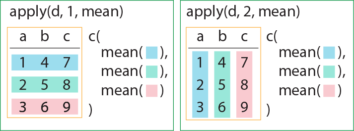
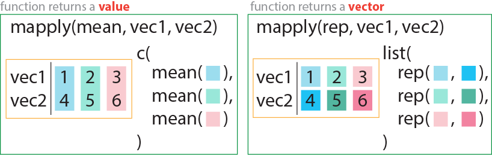
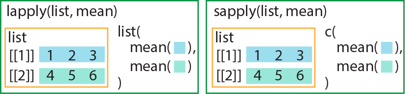
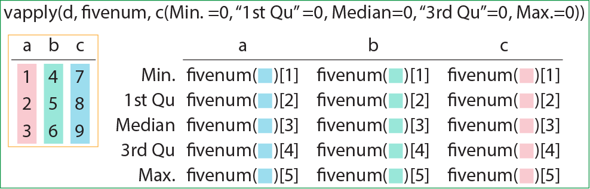
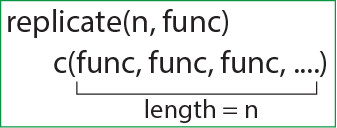
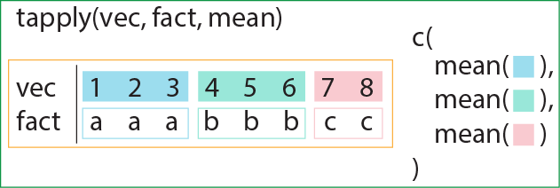
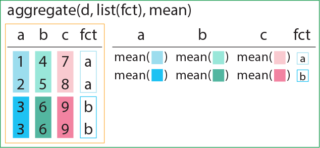

# 19  apply関数群

Code

Rを代表する便利な関数やパッケージは何か？、と聞かれた時、2010年ごろまでは**`apply`関数群**を挙げるのが一般的でした。`apply`関数群を用いれば、他の言語では繰り返し計算で数行プログラムを書かないといけないような状況でも、たった1つの関数で高速に計算ができます。Rでは繰り返し計算をなるべく使わず、`apply`関数群を使うのが標準的な方法でした。現在では、2010年以降に開発された`dplyr` ([Wickham, François, et al. 2023](#ref-dplyr_bib))・`tidyr`パッケージ ([Wickham, Vaughan, et al. 2023](#ref-tidyr_bib))を用いて計算を行うのが一般的となり、`apply`関数群は使われなくなってきてはいますが、うまく用いれば便利な関数群です。

この章では、まず以下のcallout内で繰り返し計算によるベクター・データフレームの計算について解説し（飛ばして読んでもらっても問題ありません）、次に繰り返しを用いず計算を行う`apply`関数群について説明していきます。

> **TIP:**
>
> ベクターのような、多数の要素を含むオブジェクトを用いて演算を行う場合、R以外の言語では通常**繰り返し計算**を用います。繰り返し計算とは[9章](chapter9.llms.md)で説明した通り、`for`文や`while`文、`repeat`文などを用いた計算です。プログラミング言語によって繰り返し計算の文は異なりますが、いずれのプログラミング言語においても、たくさんの要素を持つオブジェクトの演算では、繰り返し計算は有効な計算方法の一つです。
>
> では、Rでの繰り返し計算を見てみましょう。下の例では、ベクターの要素に演算を行い、結果をベクターで返す繰り返し計算を行っています。
>
> ``` downlit
> v <- 1:10 # vは1~10の整数ベクター
>
> v_new <- NULL # 計算結果を代入するNULLが入った変数
>
> for(i in 1:length(v)){ # vの長さ分計算する
>   temp <- v[i] * 3 + 5
>   v_new <- c(v_new, temp) # v_newにv[i]を演算した結果をつなげる
> }
>
> v_new # 演算結果
> ##  [1]  8 11 14 17 20 23 26 29 32 35
> ```
>
> Rで`for`文を用いてベクターの要素に演算を行う場合には、
>
> - `NULL`を代入しただけの空っぽの変数を作る
> - 繰り返し回数を演算に用いるベクターの長さで指定する
> - ベクターの要素をインデックスで取り出し、演算する
> - 空っぽの変数に、`c`関数で演算結果を付け足す
>
> といった計算を行うことがあります。
>
> 上の例では、変数`v`は1～10の連続する長さ10の整数ベクター、`v_new`は`NULL`（空）のオブジェクトです。
>
> `for`文では、`i`に`1:length(v)`の要素が繰り返し計算ごとに代入されます。つまり1回目の繰り返し計算では`i`は1、2回目では`i`は2…となり、`i`に`length(v)`、つまり10が代入された計算が終わると、繰り返し計算が終了します。
>
> さらに、`for`文中では、`v[i]`、つまり`i`をインデックスにして`v`の要素を取り出しています。1回目の繰り返し計算では`i`が1ですので、`v[i]`は`v`の1つ目の要素、2回目の繰り返し計算では`v[i]`は`v`の2つ目の要素となります。`v[i]`を3倍して5を足した結果を一時的に`temp`という変数に代入しています。
>
> `for`文の中では、**「`v_new <- c(v_new, temp)`」**という形で、空の変数である`v_new`に、計算結果を`c`関数で繋いだものを、`v_new`に代入する、という変な演算を行っています。この演算では、1週目では`c(NULL, temp)`を`v_new`に代入することで、`v_new`は`temp`を1つだけ持つベクターに変化しています。2週目以降は、`v_new`のベクターの要素の後に新しく計算した`temp`が付け加えられます。これを繰り返すことで、`v_new`には`temp`の計算結果がベクターとして記録されていきます。
>
> 最終的に、`v_new`は`v`の各要素を3倍して5を足したベクターとして演算が終了します。
>
> 上記のような`for`文の演算は、Rでは非常によろしくない、典型的なバッドノウハウであるとされています。そもそもRでのベクターの演算に繰り返し文を使う必要がないので、上記の`for`文は下のように書き換えることができます。**ベクターの演算の方が、`for`文を用いた演算よりずっと速い**ため、Rでベクターの要素を演算に用いる場合には、繰り返し計算ではなく、ベクターの演算を用いることが推奨されています。
>
> ``` downlit
> v * 3 + 5
> ##  [1]  8 11 14 17 20 23 26 29 32 35
> ```
>
> 上の`for`文にはもう一点問題があります。`v_new`というベクターに対して、数値を付け足すという演算を繰り返しています。このような場合、`v_new`の長さが伸びていくため、Rの内部では、**要素が付け加えられる度に`v_new`というベクターを新しく作り直し、古いものは削除する**という演算が行われることになります。この**「作り直して」「削除する」**という演算に時間がかかるため、上記のような書き方では演算速度に問題が生じます。
>
> このような「作り直して」「削除する」プロセスを省くためには、インデックスに代入する方法を用いるとよいでしょう。あらかじめ結果と同じ長さのベクターを準備しておき、このベクターの要素に演算結果を代入します。このような形にすると、`v_new`自体を作り直すプロセスがなくなり、演算速度が速くなるとされています。
>
> この、結果と同じ長さのベクターを準備するときには、`numeric`関数を用います。`numeric`関数は数値を1つ引数に取り、数値に応じた長さの、要素が0だけのベクターを作成する関数です。この`numeric`関数を用いて演算結果と同じ長さのベクターを作成しておくことで、そのベクターにインデックスを指定して演算結果を代入していくことができます。
>
> ``` downlit
> numeric(5) # 0が5つ入ったベクター
> ## [1] 0 0 0 0 0
>
> v_new <- numeric(length(v)) # v_newは0がvと同じ長さだけ並んだベクター
>
> for(i in 1:length(v)){ # vの長さ分計算する
>   v_new[i] <- v[i] * 3 + 5 # v_new[i]にv[i]を演算した結果を代入
> }
>
> v_new # 演算結果
> ##  [1]  8 11 14 17 20 23 26 29 32 35
> ```

> **TIP:**
>
> データフレームの要素に対して繰り返し計算をする場合にも、上のベクターでの繰り返し計算と同様の手法が使えます。下の計算では、`iris_edited`という変数に`NULL`を代入し、この空の`iris_edited`にベクターを`rbind`関数で結合したものを`iris_edited`に代入するという計算をしています。`rbind`関数は行を追加する関数ですので、計算結果を含むベクターは`iris_edited`の一番下の行に追加されます。
>
> このような繰り返し計算を行うと、`iris_edited`は**自動的に`NULL`から行列（matrix）に変換**されます。また、計算途中で`iris$Species`（因子）を文字列に変換し、文字列と数値の計算結果をベクターにまとめているため、数値計算結果は自動的に文字列に変換されています。その結果、繰り返し計算後に得られる`iris_edited`は**文字列の行列**になっています。
>
> 行列は、`as.data.frame`関数でデータフレームに変換できます。ただし、文字列の行列の要素は文字列型のまま変換されるため、結果が数値に見えても文字列になっている場合があります。
>
> このように、データフレームを直接繰り返し計算に用いると、データ型の変換が頻繁に起こり、計算結果を予測するのが難しくなります。繰り返し計算時には、取り扱っている変数の型がどのように変化しているのか、常に注意が必要です。
>
> ``` downlit
> head(iris)
> ##   Sepal.Length Sepal.Width Petal.Length Petal.Width Species
> ## 1          5.1         3.5          1.4         0.2  setosa
> ## 2          4.9         3.0          1.4         0.2  setosa
> ## 3          4.7         3.2          1.3         0.2  setosa
> ## 4          4.6         3.1          1.5         0.2  setosa
> ## 5          5.0         3.6          1.4         0.2  setosa
> ## 6          5.4         3.9          1.7         0.4  setosa
>
> iris_edited <- NULL
>
> for(i in 1:nrow(iris)){
>   # iris$Speciesは因子で、そのままだと数値に変換されるため、文字列に変換しておく
>   species <- as.character(iris$Species[i]) 
>   
>   # Sepal.LengthとSepal.Widthの積を計算
>   Sepal_multiple <- iris$Sepal.Length[i] * iris$Sepal.Width[i]
>   
>   # species（文字列）と計算結果をベクターにまとめる（文字列のベクターに変換）
>   temp_vec <- c(species, Sepal_multiple)
>   
>   # ベクターをiris_editedの行として追加（iris_editedは行列になる）
>   iris_edited <- rbind(iris_edited, temp_vec)
> }
>
> dim(iris_edited) # iris_editedは150行2列
> ## [1] 150   2
>
> class(iris_edited) # iris_editedは行列（matrix）
> ## [1] "matrix" "array"
>
> head(iris_edited) # 文字列の行列になっている
> ##          [,1]     [,2]   
> ## temp_vec "setosa" "17.85"
> ## temp_vec "setosa" "14.7" 
> ## temp_vec "setosa" "15.04"
> ## temp_vec "setosa" "14.26"
> ## temp_vec "setosa" "18"   
> ## temp_vec "setosa" "21.06"
> ```
>
> ベクターの繰り返し計算で述べたように、変数に要素を追加して、サイズが変化すると、変数を「作り直して」「削除する」プロセスが繰り返され、計算のコストが大きくなります。計算のコストが大きくなると演算に時間がかかるため、上の例のようにNULLに要素を追加するのは避けた方がよいとされています。ですので、上のような計算では、あらかじめ結果と同じサイズの行列を準備し、その行列の要素に計算結果を追加していくのが良いとされています。
>
> ``` downlit
> head(iris)
> ##   Sepal.Length Sepal.Width Petal.Length Petal.Width Species
> ## 1          5.1         3.5          1.4         0.2  setosa
> ## 2          4.9         3.0          1.4         0.2  setosa
> ## 3          4.7         3.2          1.3         0.2  setosa
> ## 4          4.6         3.1          1.5         0.2  setosa
> ## 5          5.0         3.6          1.4         0.2  setosa
> ## 6          5.4         3.9          1.7         0.4  setosa
>
> # あらかじめ0が埋まっている行列を準備しておく
> iris_edited <- matrix(0, nrow=150, ncol=2)
>
> for(i in 1:nrow(iris)){
>   species <- as.character(iris$Species[i])
>   Sepal_multiple <- iris$Sepal.Length[i] * iris$Sepal.Width[i]
>   temp_vec <- c(species, Sepal_multiple)
>   iris_edited[i, ] <- temp_vec # 行列のインデックスに行の計算結果を追加する
> }
>
> dim(iris_edited) # iris_editedは150行2列
> ## [1] 150   2
>
> class(iris_edited) # iris_editedは行列（matrix）
> ## [1] "matrix" "array"
>
> head(iris_edited) # 文字列の行列になっている
> ##      [,1]     [,2]   
> ## [1,] "setosa" "17.85"
> ## [2,] "setosa" "14.7" 
> ## [3,] "setosa" "15.04"
> ## [4,] "setosa" "14.26"
> ## [5,] "setosa" "18"   
> ## [6,] "setosa" "21.06"
> ```
>
> 上記のように、Rでは繰り返し計算で変数の「作り直し」が起きたり、データ型がころころ変わったりするため、繰り返し計算でベクターやデータフレームの要素を取り扱うのは推奨されません。ただし、繰り返し計算は演算の過程を捉えやすく、後から読んで理解しやすい構造をしています。`NULL`オブジェクトにデータを追加していくと、結果として得られるオブジェクトのサイズがわかっていなくても演算できるという利点があります。
>
> 2000年頃のPCは性能が低く、計算コストに気を払う必要がありましたが、現在では繰り返し計算を回しても大して時間がかからなくなりました。よほど大きいデータフレーム（数万～数十万行）を取り扱う場合を除けば、繰り返し計算が問題となることは少なくなったと感じます。データの取り扱いが一度きり（ad hoc）の場合には以下の`apply`関数群を使っても、繰り返し計算を使っても大差ないため、好みの、わかりやすい方法を用いればよいでしょう。

## 19.1 apply関数群

Rでのデータフレーム演算の「お作法」では、繰り返し計算ではなく、`apply`関数群を用いるのが望ましいとされています。`apply`関数群には`apply`, `mapply`, `lapply`, `sapply`, `tapply`, `aggregate`, `by`など、かなりたくさんの関数があり、それぞれ少し癖のある使い方が求められます。以下の表1に`apply`関数群についてまとめます。

| 関数名                     | 計算の内容                                   |
|:---------------------------|:---------------------------------------------|
| apply(x, margin, fun)      | marginの方向に関数を適用する                 |
| mapply(fun, 引数1, 引数2…) | 引数に指定した複数の値を関数に代入する       |
| lapply(list, fun)          | listの要素に関数を適用する                   |
| sapply(list, fun)          | listの要素に関数を適用する                   |
| vapply(x, fun, fun.value)  | xに関数を適用し、fun.valueに指定した形で返す |
| replicate(n, calc)         | calcで指定した演算をn回繰り返す              |
| tapply(x, fact, fun)       | xを因子で切り分け、関数を適用する            |
| sweep(x, margin, y)        | marginの方向にyの要素を引く                  |
| aggregate(x, by, fun)      | byで指定した要素ごとに関数を適用する         |
| aggregate(formula, data)   | formulaに従い、要素ごとに関数を適用する      |
| by(x, by, fun)             | byで指定した要素ごとに関数を適用する         |

表1 apply関数群（funは関数、factは因子、marginは方向を指す） {.caption-top .table .table-sm .table-striped .small}

### 19.1.1 apply関数

`apply`関数群の中で最も基本的なものが、`apply`関数です。`apply`関数は第一引数にデータフレーム（もしくは行列）を取り、**第二引数に`MARGIN`**、**第三引数に関数**を取ります。第二引数の`MARGIN`は1か2を取り、**1を取ると行（横）方向、2を取ると列（縦）方向**のベクターを計算対象とします。`apply`関数はデータフレームの要素に、`MARGIN`で指定した方向に、第三引数で指定した関数を適用します。第三引数に指定する関数には、Rに備わっている関数、自作した関数の両方を用いることができます。

`apply`関数の演算では、（特に行方向、`MARGIN = 1`の時には）データ型が指定した関数の引数の型と一致していることが必要となります。`apply`関数の使い方を以下の図1に示します。

[](./image/chapter15_apply.png "図1：apply関数の使い方")

図1：apply関数の使い方

``` downlit
apply(iris[, 1:4], 1, sum) # 行方向に和を求める
##   [1] 10.2  9.5  9.4  9.4 10.2 11.4  9.7 10.1  8.9  9.6 10.8 10.0  9.3  8.5 11.2
##  [16] 12.0 11.0 10.3 11.5 10.7 10.7 10.7  9.4 10.6 10.3  9.8 10.4 10.4 10.2  9.7
##  [31]  9.7 10.7 10.9 11.3  9.7  9.6 10.5 10.0  8.9 10.2 10.1  8.4  9.1 10.7 11.2
##  [46]  9.5 10.7  9.4 10.7  9.9 16.3 15.6 16.4 13.1 15.4 14.3 15.9 11.6 15.4 13.2
##  [61] 11.5 14.6 13.2 15.1 13.4 15.6 14.6 13.6 14.4 13.1 15.7 14.2 15.2 14.8 14.9
##  [76] 15.4 15.8 16.4 14.9 12.8 12.8 12.6 13.6 15.4 14.4 15.5 16.0 14.3 14.0 13.3
##  [91] 13.7 15.1 13.6 11.6 13.8 14.1 14.1 14.7 11.7 13.9 18.1 15.5 18.1 16.6 17.5
## [106] 19.3 13.6 18.3 16.8 19.4 16.8 16.3 17.4 15.2 16.1 17.2 16.8 20.4 19.5 14.7
## [121] 18.1 15.3 19.2 15.7 17.8 18.2 15.6 15.8 16.9 17.6 18.2 20.1 17.0 15.7 15.7
## [136] 19.1 17.7 16.8 15.6 17.5 17.8 17.4 15.5 18.2 18.2 17.2 15.7 16.7 17.3 15.8

apply(iris[, 1:4], 2, sum) # 列方向に和を求める
## Sepal.Length  Sepal.Width Petal.Length  Petal.Width 
##        876.5        458.6        563.7        179.9

# 自作の関数
func1 <- function(x){sum(sqrt(x) * log(x))}

apply(iris[, 1:4], 2, func1)
## Sepal.Length  Sepal.Width Petal.Length  Petal.Width 
##    638.50578    292.37383    373.96812     32.26917

apply(iris[1:5, 1:4], 2, \(x){sum(sqrt(x) * log(x))}) # 無名関数も利用できる
## Sepal.Length  Sepal.Width Petal.Length  Petal.Width 
##    17.424140    10.749705     1.990091    -3.598813
```

#### 19.1.1.1 3次元以上のarrayにapplyを適用する

`apply`関数は3次元以上の`array`を引数に取ることもできます。3次元以上の`array`を引数に取る場合には、`MARGIN`の設定がやや複雑になります。`MARGIN`に1つの値を設定した場合には、その次元を残す形で関数を適用します。`MARGIN`に2つの値を設定した場合には、その2つの次元を残して関数を適用します。`MARGIN`に2つ以上の値を指定する場合には、ベクターを用います。

``` downlit
UCBAdmissions # 3次元アレイ
## , , Dept = A
## 
##           Gender
## Admit      Male Female
##   Admitted  512     89
##   Rejected  313     19
## 
## , , Dept = B
## 
##           Gender
## Admit      Male Female
##   Admitted  353     17
##   Rejected  207      8
## 
## , , Dept = C
## 
##           Gender
## Admit      Male Female
##   Admitted  120    202
##   Rejected  205    391
## 
## , , Dept = D
## 
##           Gender
## Admit      Male Female
##   Admitted  138    131
##   Rejected  279    244
## 
## , , Dept = E
## 
##           Gender
## Admit      Male Female
##   Admitted   53     94
##   Rejected  138    299
## 
## , , Dept = F
## 
##           Gender
## Admit      Male Female
##   Admitted   22     24
##   Rejected  351    317

dimnames(UCBAdmissions) # 次元の順番はAdmit, Gender, Deptの順
## $Admit
## [1] "Admitted" "Rejected"
## 
## $Gender
## [1] "Male"   "Female"
## 
## $Dept
## [1] "A" "B" "C" "D" "E" "F"

apply(UCBAdmissions, 1, mean) # 1次元目（Admit）の平均を求める
## Admitted Rejected 
## 146.2500 230.9167

apply(UCBAdmissions, 2, mean) # 2次元目（Gender）の平均を求める
##     Male   Female 
## 224.2500 152.9167

apply(UCBAdmissions, 3, mean) # 3次元目（Dept）の平均を求める
##      A      B      C      D      E      F 
## 233.25 146.25 229.50 198.00 146.00 178.50


apply(UCBAdmissions, 1:2, mean) # 3次元目（Dept）方向に平均を求める
##           Gender
## Admit          Male    Female
##   Admitted 199.6667  92.83333
##   Rejected 248.8333 213.00000

apply(UCBAdmissions, c(1, 3), mean) # 2次元目（Gender）方向に平均を求める
##           Dept
## Admit          A     B   C     D     E   F
##   Admitted 300.5 185.0 161 134.5  73.5  23
##   Rejected 166.0 107.5 298 261.5 218.5 334

apply(UCBAdmissions, 2:3, mean) # 1次元目（Admit）方向に平均を求める
##         Dept
## Gender       A     B     C     D     E     F
##   Male   412.5 280.0 162.5 208.5  95.5 186.5
##   Female  54.0  12.5 296.5 187.5 196.5 170.5
```

### 19.1.2 mapply関数

`mapply`関数は、関数が2種類以上の引数を取る場合に用います。`mapply`関数は`apply`関数とは引数の順番が異なり、適用する関数が第一引数になります。続いて適用する関数の引数をベクターで取ります。`mapply`関数の返り値は適用する関数により異なり、関数の返り値が1つなら`mapply`関数の返り値はベクター、返り値が2つ以上なら`mapply`関数の返り値はリストになります。

[](./image/chapter15_mapply.png "図2：mapply関数の使い方")

図2：mapply関数の使い方

``` downlit
# 足し算をする関数
sum2 <- function(x, y){x + y}

# 1:4 + 2:5と同じ計算
mapply(sum2, 1:4, 2:5)
## [1] 3 5 7 9

lst <- mapply(rep, times = 1:4, x = 4:1) # 関数の引数を指定して、ベクターで与える 複数の引数を取れる
lst
## [[1]]
## [1] 4
## 
## [[2]]
## [1] 3 3
## 
## [[3]]
## [1] 2 2 2
## 
## [[4]]
## [1] 1 1 1 1

# 無名関数も使える
mapply(\(x, y){x / y}, x = 1:5, y = 5:1)
## [1] 0.2 0.5 1.0 2.0 5.0
```

### 19.1.3 lapply関数/sapply関数

`lapply`関数はリストを引数に取る関数です。`lapply`関数は第一引数にリスト、第二引数に関数を取り、リストの各要素に関数を適用します。`lapply`関数は返り値にリストを取ります。データフレームはリストですので、データフレームを引数に取った場合、`lapply`関数は`apply(x, 2, FUN)`、つまり列方向に関数を適用するのと同じ演算で、返り値がリストになります。

`sapply`関数は返り値がベクターになった`lapply`関数です。関数の返り値が2つ以上の値であれば、`sapply`関数は行列を返します。

[](./image/chapter15_lapply.png "図3：lapply/sapply関数の使い方")

図3：lapply/sapply関数の使い方

``` downlit
lapply(lst, sum) # リストの各要素に関数を適用する（返り値はリスト）
## [[1]]
## [1] 4
## 
## [[2]]
## [1] 6
## 
## [[3]]
## [1] 6
## 
## [[4]]
## [1] 4

lapply(iris[, 1:4], sum) # データフレームは列方向のリストなので、適用可能
## $Sepal.Length
## [1] 876.5
## 
## $Sepal.Width
## [1] 458.6
## 
## $Petal.Length
## [1] 563.7
## 
## $Petal.Width
## [1] 179.9

lapply(lst, summary)
## [[1]]
##    Min. 1st Qu.  Median    Mean 3rd Qu.    Max. 
##       4       4       4       4       4       4 
## 
## [[2]]
##    Min. 1st Qu.  Median    Mean 3rd Qu.    Max. 
##       3       3       3       3       3       3 
## 
## [[3]]
##    Min. 1st Qu.  Median    Mean 3rd Qu.    Max. 
##       2       2       2       2       2       2 
## 
## [[4]]
##    Min. 1st Qu.  Median    Mean 3rd Qu.    Max. 
##       1       1       1       1       1       1


sapply(lst, sum) # 返り値がベクターのlapply
## [1] 4 6 6 4

sapply(iris[, 1:4], sum)
## Sepal.Length  Sepal.Width Petal.Length  Petal.Width 
##        876.5        458.6        563.7        179.9
```

### 19.1.4 with・within関数

[16章](chapter16.llms.md#データフレームの列の演算)で紹介した通り、データフレームの列同士の演算には`with`・`within`関数を用いることができます。`with`・`within`関数はデータフレームと列の演算を引数に取ります。`with`関数がベクターを返すのに対し、`within`関数は列が追加されたデータフレームを返します。`within`関数を`apply`関数群と同時に使うことで、より複雑なデータフレームの演算を行うことができます。

``` downlit
iris6 <- head(iris) # 始めの6行を選択

# Sepal.Lengthの列とSepal.Widthの列の値を掛ける
with(iris6, Sepal.Length * Sepal.Width) 
## [1] 17.85 14.70 15.04 14.26 18.00 21.06

# Sepal.Lengthの列とSepal.Widthの列の値を掛けて、値を列として登録する
within(iris6, Sepal_multiple <- Sepal.Length * Sepal.Width) #代入は<-、=だとエラー
##   Sepal.Length Sepal.Width Petal.Length Petal.Width Species Sepal_multiple
## 1          5.1         3.5          1.4         0.2  setosa          17.85
## 2          4.9         3.0          1.4         0.2  setosa          14.70
## 3          4.7         3.2          1.3         0.2  setosa          15.04
## 4          4.6         3.1          1.5         0.2  setosa          14.26
## 5          5.0         3.6          1.4         0.2  setosa          18.00
## 6          5.4         3.9          1.7         0.4  setosa          21.06
```

### 19.1.5 vapply関数

`vapply`関数は関数が複数の返り値を持つときに用いる関数です。`vapply`関数の第一引数はベクターやリスト、第二引数は複数の返り値を取る関数です。`vapply`関数はこの返り値を行列に変換するのですが、この変換時の行名を`FUN.VALUE`という第三引数で設定します。`FUN.VALUE`の設定は名前付きベクターで、値は0とします。かなり癖が強いので、使われているところをほとんど見たことがない関数です。

[](./image/chapter15_vapply.png "図3：vapply関数の使い方")

図3：vapply関数の使い方

``` downlit
fivenum(1:10) # データを5つに集約する関数（最小値、第一四分位、中央値、第三四分位、最大値）
## [1]  1.0  3.0  5.5  8.0 10.0

vapply(iris[, 1:4], fivenum, c(Min. = 0, "1st Qu" = 0, Median = 0, "3rd Qu" = 0, Max. = 0)) # 集約値をそれぞれ表示
##        Sepal.Length Sepal.Width Petal.Length Petal.Width
## Min.            4.3         2.0         1.00         0.1
## 1st Qu          5.1         2.8         1.60         0.3
## Median          5.8         3.0         4.35         1.3
## 3rd Qu          6.4         3.3         5.10         1.8
## Max.            7.9         4.4         6.90         2.5
```

### 19.1.6 replicate関数

`replicate`関数は、第一引数に繰り返し計算の回数、第二引数に関数を取ります。`replicate`関数は関数の計算を繰り返し計算の回数だけ繰り返し、結果をベクターで返します。指定する関数の引数を変えることはできないので、一見あまり意味がなさそうに見えます。しかし、Rでは乱数（ランダムな数値）を用いた計算を行うことが多く、乱数計算を繰り返すと同じ関数の返り値でも変化することがあります。したがって、`replicate`関数は乱数を使った計算で利用すると生きる関数となっています。

[](./image/chapter15_replicate.png "図5：replicate関数の使い方")

図5：replicate関数の使い方

``` downlit
sample(1:6, 10, replace=T) # サイコロを10回ふる
##  [1] 6 1 4 1 2 5 3 6 2 3

sum(sample(1:6, 10, replace=T)) # サイコロを10回ふり、合計値を求める
## [1] 36

replicate(20, sum(sample(1:6, 10, replace=T))) # 上の試行を20回繰り返す
##  [1] 34 36 31 44 36 41 34 30 35 36 41 33 28 26 30 34 37 34 32 49
```

### 19.1.7 tapply関数

`tapply`関数はベクターと因子を引数に取り、因子のレベルごとに関数をベクターに適用します。ベクターに測定値、因子にカテゴリ（たとえば男性・女性など）を取っておけば、カテゴリごとの集計値を計算するのに使えます。

[](./image/chapter15_tapply.png "図6：tapply関数の使い方")

図6：tapply関数の使い方

``` downlit
v <- 1:10
cutv <- factor(c(1, 1, 1, 1, 2, 2, 2, 3, 3, 4))
tapply(v, cutv, sum) # ベクターを因子で切り分け、関数を適用する
##  1  2  3  4 
## 10 18 17 10
```

### 19.1.8 sweep関数

`sweep`関数は、`apply`関数に似ていますが、第三引数が関数ではなく、ベクターであるところが異なります。`MARGIN`は1が行方向、2が列方向であるのは`apply`関数と同じですが、第三引数が引き算に使われるのが特徴です。

``` downlit
matrix(1:15, nrow=3)
##      [,1] [,2] [,3] [,4] [,5]
## [1,]    1    4    7   10   13
## [2,]    2    5    8   11   14
## [3,]    3    6    9   12   15

sweep(matrix(1:15, nrow=3), 1, 1:3) # 列方向に1, 2, 3を引く
##      [,1] [,2] [,3] [,4] [,5]
## [1,]    0    3    6    9   12
## [2,]    0    3    6    9   12
## [3,]    0    3    6    9   12

sweep(matrix(1:15, nrow=3), 2, 1:5) # 行方向に1, 2, 3, 4, 5を引く
##      [,1] [,2] [,3] [,4] [,5]
## [1,]    0    2    4    6    8
## [2,]    1    3    5    7    9
## [3,]    2    4    6    8   10
```

### 19.1.9 aggregate関数

`aggregate`関数は、`dplyr`が出てくるまではデータフレームの結果を集計するのによく用いられていた関数です。`aggregate`関数の第一引数はデータフレーム、第二引数には`by`（因子のリスト）、第三引数に関数を取ります。`aggregate`関数は`by`に指定した因子に従い、各列に関数を適用します。因子にカテゴリ（下の例では`iris`の種、`Species`）を指定することで、因子ごとにデータを集計するのに用いることができます。

`aggregate`関数は引数にデータフレームだけでなく、**formula（式）**というものを取ることもできます。このformulaはRでは統計でよく用いられる表現で、`~`（チルダ）を演算子として用いるものです。**`~`の左側には目的変数、右側には説明変数を足し算・掛け算で記入する**形をとるのが最も一般的です。`aggregate`関数では、左側に関数を適用する列名、右側に`by`にあたる因子を指定します。また、formulaでは、`~`の左側または右側に`.`（ピリオド）を置くことがあります。このピリオドは、「従属変数または独立変数に使用しなかったすべての列」を表す表現です。このformulaについては、[29章](chapter29.llms.md#formulaを用いたt検定)で詳しく説明します。

`by`関数も`aggregate`関数と類似した関数ですが、`by`は関数の引数に各列のベクターではなく、因子で区切ったデータフレームを指定します。ですので、データフレームを処理できない関数を用いると、計算ができない場合があります。

[](./image/chapter15_aggregate.png "図7：aggregate関数の使い方")

図7：aggregate関数の使い方

``` downlit
aggregate(iris[,1:4], by=list(iris$Species), FUN = "mean") # byはリスト、Speciesごとの平均値
##      Group.1 Sepal.Length Sepal.Width Petal.Length Petal.Width
## 1     setosa        5.006       3.428        1.462       0.246
## 2 versicolor        5.936       2.770        4.260       1.326
## 3  virginica        6.588       2.974        5.552       2.026

aggregate(iris[,1:4], by=list(iris$Species), FUN = "min") # Speciesごとの最小値
##      Group.1 Sepal.Length Sepal.Width Petal.Length Petal.Width
## 1     setosa          4.3         2.3          1.0         0.1
## 2 versicolor          4.9         2.0          3.0         1.0
## 3  virginica          4.9         2.2          4.5         1.4

# formulaでも演算ができる（.はirisのSpecies以外の列）
aggregate(.~Species, data = iris, max) 
##      Species Sepal.Length Sepal.Width Petal.Length Petal.Width
## 1     setosa          5.8         4.4          1.9         0.6
## 2 versicolor          7.0         3.4          5.1         1.8
## 3  virginica          7.9         3.8          6.9         2.5

head(ToothGrowth) # ラットの歯の成長のデータ
##    len supp dose
## 1  4.2   VC  0.5
## 2 11.5   VC  0.5
## 3  7.3   VC  0.5
## 4  5.8   VC  0.5
## 5  6.4   VC  0.5
## 6 10.0   VC  0.5

# 与えるサプリの種類と量ごとの歯の長さの平均値
aggregate(len~., data = ToothGrowth, mean) 
##   supp dose   len
## 1   OJ  0.5 13.23
## 2   VC  0.5  7.98
## 3   OJ  1.0 22.70
## 4   VC  1.0 16.77
## 5   OJ  2.0 26.06
## 6   VC  2.0 26.14

by(iris[, 1], list(iris$Species), mean) # 1列目のSpeciesごとの平均値
## : setosa
## [1] 5.006
## ------------------------------------------------------------ 
## : versicolor
## [1] 5.936
## ------------------------------------------------------------ 
## : virginica
## [1] 6.588

by(iris[, 1:2], list(iris$Species), mean) # meanは2列のデータを処理できない
## : setosa
## [1] NA
## ------------------------------------------------------------ 
## : versicolor
## [1] NA
## ------------------------------------------------------------ 
## : virginica
## [1] NA

by(iris[, 1:4], list(iris$Species), summary) # summaryはデータフレームを引数にできるので、計算できる
## : setosa
##   Sepal.Length    Sepal.Width     Petal.Length    Petal.Width   
##  Min.   :4.300   Min.   :2.300   Min.   :1.000   Min.   :0.100  
##  1st Qu.:4.800   1st Qu.:3.200   1st Qu.:1.400   1st Qu.:0.200  
##  Median :5.000   Median :3.400   Median :1.500   Median :0.200  
##  Mean   :5.006   Mean   :3.428   Mean   :1.462   Mean   :0.246  
##  3rd Qu.:5.200   3rd Qu.:3.675   3rd Qu.:1.575   3rd Qu.:0.300  
##  Max.   :5.800   Max.   :4.400   Max.   :1.900   Max.   :0.600  
## ------------------------------------------------------------ 
## : versicolor
##   Sepal.Length    Sepal.Width     Petal.Length   Petal.Width   
##  Min.   :4.900   Min.   :2.000   Min.   :3.00   Min.   :1.000  
##  1st Qu.:5.600   1st Qu.:2.525   1st Qu.:4.00   1st Qu.:1.200  
##  Median :5.900   Median :2.800   Median :4.35   Median :1.300  
##  Mean   :5.936   Mean   :2.770   Mean   :4.26   Mean   :1.326  
##  3rd Qu.:6.300   3rd Qu.:3.000   3rd Qu.:4.60   3rd Qu.:1.500  
##  Max.   :7.000   Max.   :3.400   Max.   :5.10   Max.   :1.800  
## ------------------------------------------------------------ 
## : virginica
##   Sepal.Length    Sepal.Width     Petal.Length    Petal.Width   
##  Min.   :4.900   Min.   :2.200   Min.   :4.500   Min.   :1.400  
##  1st Qu.:6.225   1st Qu.:2.800   1st Qu.:5.100   1st Qu.:1.800  
##  Median :6.500   Median :3.000   Median :5.550   Median :2.000  
##  Mean   :6.588   Mean   :2.974   Mean   :5.552   Mean   :2.026  
##  3rd Qu.:6.900   3rd Qu.:3.175   3rd Qu.:5.875   3rd Qu.:2.300  
##  Max.   :7.900   Max.   :3.800   Max.   :6.900   Max.   :2.500
```

Wickham, Hadley, Romain François, Lionel Henry, Kirill Müller, and Davis Vaughan. 2023. *Dplyr: A Grammar of Data Manipulation*. <https://CRAN.R-project.org/package=dplyr>.

Wickham, Hadley, Davis Vaughan, and Maximilian Girlich. 2023. *Tidyr: Tidy Messy Data*. <https://CRAN.R-project.org/package=tidyr>.

Back to top
