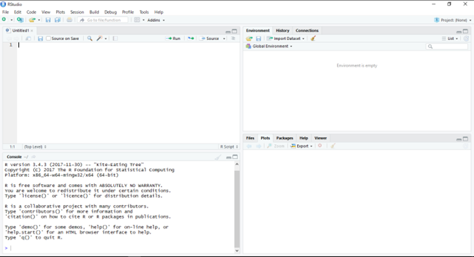
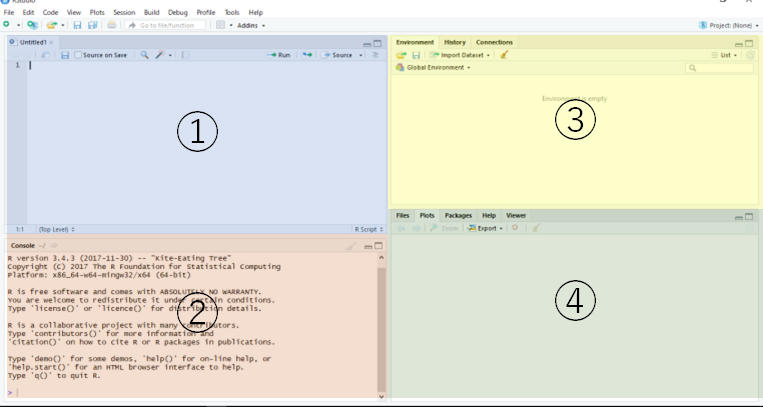
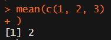
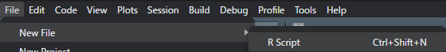

# 2  Rを使ってみよう

Code

RとRstudioをインストールしたら、さっそくRstudioを起動してみましょう。

## 2.1 Rstudioのパネル

Rstudioを開くと以下のような画面が表示されます。Rstudioでは、1つのウインドウの中に、4つのパネルが配置されます。ただし、インストールしてすぐに開くと、左側は1つのパネルになっているかもしれません。

[](./image/Rstudio1.png "図1：Rstudioを開いたところ")

図1：Rstudioを開いたところ

Rstudioのそれぞれのパネルについて説明していきます。図2の左上のパネル①は**テキストエディタ**と呼ばれるものです。テキストエディタは、「File → New file → R script」を選択し、新しいR script を作成すると表示されます。テキストエディタにはプログラムを書き込んでいきます。書き込んだプログラムは、①の右上にある、**「run」**という部分を押すと実行されます。少し長めのプログラムを書く場合には、このテキストエディタを使用します。

左下のパネル②は**コンソール**と呼ばれる部分です。このコンソールには実行されたプログラムが表示されます。プログラムから何かを表示するよう指示した場合には、結果がこのコンソールに表示されます。Rでは、このコンソールに直接プログラムを書き込んで実行することもできます。1行程度のプログラムの挙動を調べたり、今取り扱っているデータを確認するときには、このコンソールにプログラムを直接書き込みます。

右上パネル③には現在Rが取り扱っている**オブジェクト**についての情報が表示されます。オブジェクトについては[次の章](chapter3.llms.md)で詳しく説明します。右下のパネル④には、Rで描写したグラフや、ヘルプ、フォルダの情報などが表示されます。

[](./image/Rstudio2.png "図2：Rstudioを開いたところ")

図2：Rstudioを開いたところ

> **TIP:**
>
> プログラムを直接書き込み、すぐに実行し、結果を得るような仕組みのことを**対話的プログラミング**と呼びます。Rでは今書いているプログラムに干渉する形で対話的プログラミングを行うことができます。プログラミングでは、プログラムが思ったように動かない、バグが常に生じます。Rでは対話的プログラミングを通じてバグを修正し、プログラムが思った通りに動くよう修正していくことができます。

## 2.2 コンソールに入力

では、まずコンソール、左下のパネル②に直接プログラムを書き込んでみましょう。とは言っても、書き込むプログラムは以下の通り、非常に簡単なものです。以下のプログラムをコピーペーストでコンソールに張り付け、エンターキーを押しましょう。コードブロックの右のコピーボタンをクリックすることでもプログラムをコピーすることができます。

``` downlit
1 + 1
## [1] 2

"Hello World"
## [1] "Hello World"
```

プログラムの結果（出力）として、上に示したように「`[1] 2`」と、「`[1] "Hello world"`」が表示されたと思います。このように、簡単な計算や文字の表示程度であれば、エディタ（パネル①）に書き込まなくても実行することができます。また、スペースはプログラムでは無視されて実行されます。ですので、`1 + 1`のようにスペースを入れても、`1+1`のようにスペースを入れなくても同じように計算を行ってくれます。

コンソールには、`>`が表示されている場合と、`+`が表示される場合があります。`>`が表示されている場合には、コンソールは入力を待っている、待機中であることを意味しています。`+`が表示される場合には、入力を行った際のプログラムが不完全であることを意味しています。上の行に不完全なプログラムが記載されているので、確認して追加の文字を入力しましょう。

下の例では、`>`が記載されている行の`)`が一つ足りておらず、カッコが閉じていないため、次の行で`+`が表示されています。`+`の後に`)`を入力し、エンターキーを押せば、プログラムが完成し、演算が実行されます。

[](./image/console_image.png "図3：コンソールの>と+")

図3：コンソールの\>と+

## 2.3 エディタを使う

次に、エディタ（パネル①）を使ってみましょう。まず、左上の「File」の項目から、「New file → R script」を選択し、新しいエディタのウインドウを開きます。Ctrl、Shift、Nを同時に押す（Ctrl+Shift+NCtrl+Shift+N）ことでも、新しいエディタのウインドウを開くことができます。

[](./image/file_Rscript.png "図4：エディタに新しいウインドウを追加する")

図4：エディタに新しいウインドウを追加する

次に、下のプログラムをコピーペーストでエディタに張り付けます。

``` downlit
1 + 1 * 5
"Hello R world"
```

エディタに張り付けて、エンターキーを押しても、プログラムは実行されません。エディタ上のプログラムを実行する方法はいくつかあります。

- 実行したいプログラムの行を選択して、CtrlとEnterを同時に押す（**Ctrl+EnterCtrl+Enter**）
- 実行したいプログラムの行を選択して、パネルの上の「**Run**」を押す
- エディタを選択して、Alt、Ctrl、Rを同時に押す（**Alt+Ctrl+RAlt+Ctrl+R**）

上の2つは一行ごとに実行する方法です。複数行を選択してCtrl+EnterCtrl+Enterで実行すると、複数行を一度に実行することができます。最後のAlt+Ctrl+RAlt+Ctrl+Rはエディタに書き込んだプログラムをすべて実行する方法です。いずれの方法でもプログラムを実行することができます。

また、R GUIとRStudioではコードを実行する際のショートカットが異なります。R GUIでは、Ctrl+RCtrl+Rで選択したコードを実行することができます。

エディタに書いたプログラムは保存することができます。保存するときには、CtrlとSを同時に押します（**Ctrl+SCtrl+S**）。保存する際にはファイル名を指定します。ファイルの拡張子には、**「.R」**を用いるのが一般的です。

## 2.4 改行

Rでは、改行した行ごとにプログラムが評価されます。改行の代わりに`;`（セミコロン）の記号を用いて、プログラムの区切りを示すこともできます。

``` downlit
1 + 1 # 各行がそれぞれ評価される
## [1] 2
print("Hello world")
## [1] "Hello world"

1 + 1; print("Hello world") # ;を改行の代わりに使うこともできる
## [1] 2
## [1] "Hello world"
```

## 2.5 コメント

プログラムを書いていると、その部分のコードが何を目的として、何をしているのかよくわからなくなることが多々あります。プログラミングではそのコードの意味を記録しておくために、プログラムの途中に**コメント**を挟むのが一般的です。Rでは`#`がコメントを示す記号になっています。`#`以降に記載したテキストはプログラムの一部であるとは認識されず、プログラムとして実行されません。

この性質を生かして、プログラムの一部を一時的に実行しないようにすることを**コメントアウト**と呼びます。プログラムを書いた後で、実行したくない行の頭に`#`をつけることでコメントアウトを行うことができます。

``` downlit
# ココはコメントなので実行されない
# 1 + 1 

1 + 1 # シャープの前は実行されるが、シャープの後はコメントとなる
## [1] 2
```

## 2.6 Rを終了する

Rを終了する場合には、`q`関数というものを用います。[`q()`](https://rdrr.io/r/base/quit.html)と入力するとRが終了します。RStudioを使っている場合には、単にウインドウを閉じてもRを終了させることができます。

``` downlit
q()
```

Back to top
