# 20  tidyr・dplyr

Code

データを取得し、そのデータをそのまま統計に用いることは稀です。データ解析では、**データの整理整頓（data wrangling、data cleaning）**に多くの時間が割かれています。データの整理整頓には様々なツールが用いられます。前述の`apply`関数群もデータの要約等の整理整頓に用いることができます。

ただし、[前章](chapter19.llms.md)で説明した通り、`apply`関数群は関数ごとに引数の順序や引数に与えるデータ型、返り値のデータ型などが異なっており、使い勝手がよいとは言えません。同様の機能を持つ[`plyr`パッケージ](https://cran.r-project.org/web/packages/plyr/index.html) ([Wickham 2011](#ref-plyr_bib))というパッケージもありますが、やはり使い勝手が良くなかったため、それほど用いられていません。

現在では、これらの関数・パッケージに代わり、データの整理整頓には[`tidyr`](https://tidyr.tidyverse.org/) ([Wickham, Vaughan, et al. 2023](#ref-tidyr_bib))・[`dplyr`](https://dplyr.tidyverse.org/) ([Wickham, François, et al. 2023](#ref-dplyr_bib))を用いるのがRでは事実上のデフォルトとなっています。`tidyr`・`dplyr`の特徴は以下の通りです。

- **パイプ演算子**を用いることを前提として関数が設計されている
- 第一引数にはデータフレームを取り、データフレームを加工する
- 出力もデータフレーム（正確には`tibble`）で統一されている

`tidyr`・`dplyr`を用いることで、パイプ演算子を活用し、余計な変数を作ることなく、データフレームを自由自在に取り扱うことができます。`tidyr`・`dplyr`は共に`tidyverse` ([Wickham et al. 2019](#ref-tidyverse_bib))に含まれるパッケージですので、`tidyverse`をロードすることで使用できます。

``` downlit
pacman::p_load(tidyverse)
```

## 20.1 メソッドチェーン

`tidyr`・`dplyr`について説明する前に、R以外の言語で用いられている、**メソッドチェーン**について簡単に説明します。

R以外の言語では、オブジェクトに対して演算を行う時、関数以外に**メソッド**を利用することがあります。メソッドは、オブジェクトの後にピリオドで繋いで、オブジェクトに何らかの演算を行うものです。例えばRubyでは文字列に対して、「`.upcase`」というメソッドが設定されています。`.upcase`は文字列を大文字にするメソッドです。例えば「`"Hello world".upcase`」とすると、`"Hello world"`の小文字が大文字に変換され、`"HELLO WORLD"`が返ってきます。

メソッドは2つ以上繋げて用いることができます。例えば、`.reverse`は文字列を逆順にするメソッドですが、「`"Hello world".reverse.upcase`」とすると、`"Hello world"`を逆順にし、続いて大文字に変換することができます。このように、メソッドを繋いで使用することをメソッドチェーンと呼びます。

以下に、Rubyとjavascriptでのメソッドチェーンの例を示します。

``` downlit
string = "dlrow olleH"
string.reverse.upcase # 文字列を逆順にし、大文字に変換する
#>  "HELLO WORLD"
```

``` javascript
var firstName = " Xjorv "; // firstNameは " Xjorv "
console.log(firstName); 
#> " Xjorv "

var modifiedName = 
  firstName 
    .toUpperCase() // 大文字にして
        .trim(); // 前後のスペースを削除する

console.log(modifiedName)
#> "XJORV"
```

メソッドチェーンのよいところは、**演算の過程を左から右へ、文章を読むように追いかけることができる**ことです。上記のメソッドチェーンと同じような演算をRで行うと、以下のようになります。

``` downlit
pacman::p_load(tidyverse) # stringrを使うためtidyverseをロードする
firstname <- " Xjorv "

# 例1
str_to_upper(str_trim(firstname)) # スペースを取り除いて大文字にする
## [1] "XJORV"

# 例2
firstname1 <- str_trim(firstname) # スペースを取り除く
str_to_upper(firstname1) # 大文字にする
## [1] "XJORV"
```

Rではメソッドチェーンは使えないので、複数の演算を行うときには、上の例1のように関数の中に関数を入れる（ネストする）か、例2のように一時的に計算結果を変数に入れておき、その一時的な変数を利用して再度演算（逐次的な演算）をする必要があります。

どちらも実用上大きな問題はないのですが、プログラムとしては理解しにくく、メソッドチェーンのように簡単に複数の処理を行えるものではありません。

このような問題を解決する演算子が、**パイプ演算子**です。

## 20.2 パイプ演算子（pipe operator）

パイプ演算子とは、**「演算子の前のオブジェクトを、演算子の後ろの関数の引数にする」**演算子です。Rのパイプ演算子には以下の2種類があります。

- `|>`：Rのデフォルトのパイプ演算子
- `%>%`：`magrittr`パッケージ ([Bache and Wickham 2022](#ref-magrittr_bib))に登録されているパイプ演算子

パイプ演算子を用いると、以下の演算は同じ意味を持ちます。

``` downlit
vec <- c(1, 2, 3)
mean(vec) # 通常の演算
## [1] 2

vec |> mean() # パイプ演算子
## [1] 2
```

これだけ見てもパイプ演算子を用いる利点はよくわかりませんが、パイプ演算子を用いることで、上記のメソッドチェーンのような機能をRに与えることができます。

上のjavascriptでのメソッドチェーンと同じ演算をパイプ演算子を用いて行うと、以下のようになります。パイプ演算子を用いることで、「文字列からスペースを取り除き、大文字にする」という、文章と同じ順序でデータを処理することができます。このように順序が変わることで、一度にたくさんの演算を行っても、理解しやすいプログラムを書くことができます。

``` downlit
firstname <- " Xjorv "
firstname |> str_trim() |> str_to_upper() # スペースを取り除き、大文字にする
## [1] "XJORV"
```

### 20.2.1 デフォルトとmagrittrパッケージのパイプ演算子

では、まず2種類のパイプ演算子について見ていきましょう。Rで先に実装されたのは[`magrittr`](https://magrittr.tidyverse.org/)で、2014年にパッケージが公開されています。Rのデフォルトのパイプ演算子はずっと後になって、2021年にR version 4.1.0で実装されました。

Rstudioでは、パイプ演算子を「**Ctrl+Shift+MCtrl+Shift+M**」のショートカットで入力することができます。RStudioはRのデフォルトのパイプ演算子が実装される前から存在するため、デフォルトのパイプ演算子は`magrittr`の「`%>%`」になっています。デフォルトのパイプ演算子をRのデフォルトのもの（`|>`）に変更する場合には、「Tools→Global Options」から「Code」を選択し、下の図1の赤線で囲った部分にチェックを入れます。

[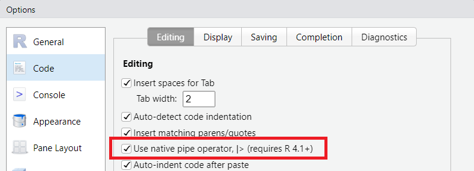](./image/chapter16_pipe_shortcut.png "図2：ショートカットで入力するパイプ演算子を変更する")

図2：ショートカットで入力するパイプ演算子を変更する

2種類のパイプ演算子は、記号が異なるだけでなく、使い方も少し異なっています。

- 関数の後の`()`の必要性（`|>`は必要、`%>%`は不要）
- 引数の位置を指定する文字の違い（`|>`は「`_`」（アンダースコア）、`%>%`は「`.`」（ピリオド））
- 関数の`return`に使えるかどうか（`|>`は使えず、`%>%`は使える）

また、`%>%`を用いるには`magrittr`パッケージ（`tidyverse`に含まれている）をロードする必要があるのに対し、`|>`はパッケージのロードを必要としません。

### 20.2.2 関数のカッコの有無

`|>`では関数名の後にカッコをつけるのが必須で、カッコが無いとエラーが出ます。

``` downlit
pacman::p_load(tidyverse) # magrittrはtidyverseに含まれる

func1 <- function(x, y = 1){x + y} # xに1を足す関数

func1(1) # 2が帰ってくる
## [1] 2

1 |> func1() # |>ではカッコが必須
## [1] 2
```

``` r
1 |> func1 # カッコが無いとエラー
## Error in func1: The pipe operator requires a function call as RHS (<input>:1:6)
```

`%>%`では、カッコがあってもなくても計算をしてくれます。

``` downlit
1 %>% func1() # %>%はカッコがあってもなくても計算できる
## [1] 2

1 %>% func1
## [1] 2
```

`|>`では、パイプ演算子の前の値を代入する位置をアンダースコア（`_`）で指定できます。`%>%`では、ピリオド（`.`）で指定します。指定しない場合には、パイプ演算子の左辺の値が第一引数となります。

``` downlit
func1(1, 2) # 引数を2個取り、足し算する関数
## [1] 3

1 |> func1(y = 2) # 第一引数に1が入る（第2引数が2）
## [1] 3

2 |> func1(x = 1, y = _) # 引数を入る位置を「_」で指定
## [1] 3

1 %>% func1(y = 2) # 第一引数に1が入る
## [1] 3

2 %>% func1(x = 1, y = .) # 引数を入る位置を「.」で指定
## [1] 3
```

`|>`・`%>%`のどちらでも、ピリオドやアンダースコアにインデックス・列名を付け加えることで、要素を呼び出すことができます。

``` downlit
4:6 |> _[2] # インデックスで呼び出せる
## [1] 5

4:6 %>% .[2]
## [1] 5

iris |> _$Species |> head() # 列名で呼び出せる
## [1] setosa setosa setosa setosa setosa setosa
## Levels: setosa versicolor virginica

iris %>% .$Species %>% head
## [1] setosa setosa setosa setosa setosa setosa
## Levels: setosa versicolor virginica
```

`|>`・`%>%`共に、演算子の後に改行を入れることができます。パイプ演算子を用いるときには、以下のように、パイプ演算子ごとに改行を入れる書き方をするのが一般的です。

``` downlit
"Hello world" |> # 文字列の
  str_replace(pattern = "world", replacement = "R") |> # 一部を置き換え、
  str_to_upper() # 大文字にする
## [1] "HELLO R"
```

## 20.3 tidy data

`tidyr`・`dplyr`の説明の前に、データフレームを取り扱う上で重要な概念である、**「tidy data（整然としたデータ）」**について簡単に説明します。

「[tidy data](https://r4ds.hadley.nz/data-tidy.html)」は`ggplot2`や`tidyr`、`dplyr`を開発しているPOSIT SoftwareのチーフサイエンティストであるHadley Wickhamが2014年に示したデータ構造についての考え方です([Wickham 2014](#ref-tidy_data_bib))。データフレームのような表形式のデータを対象としたもので、**「データの行は各観察結果、データの列は各列が一つの種類のデータであるように整理し、データの各要素には一つの値しか入力しない」**というルールに従い、データは準備されるべきであるとしています。`tidyr`、`dplyr`はこの概念を念頭に設計されています。

[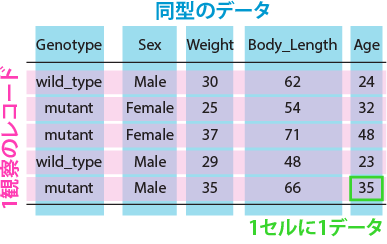](./image/chapter16_tidy_table.png)

tidyではないデータは世の中にゴロゴロ転がっています。以下の表1はファイザーの[COVID-19ワクチン（コミナティ筋注）の第3相試験に関するNew England Journal of Medicineの論文](https://www.nejm.org/doi/pdf/10.1056/NEJMoa2034577?articleTools=true)の表1の一部を加工したものです([Polack et al. 2020](#ref-doi_10_1056_NEJMoa2034577))。

[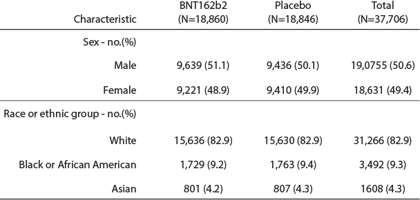](./image/chapter16_nontidy.png "Fernando et al. (2020)の表1の一部")

Fernando et al. (2020)の表1の一部

論文の表は人が見やすいように作成されています。ですので、この表を見て、意味が全くわからない、ということはあまりないでしょう。しかし、この表はtidyではありません。

まず、1つのセル（要素）に人数とその割合（%）の2つのデータが記載されています。また、投薬された治験薬（BNT162b2とPlacebo）は処置（Treatment）という同じカテゴリのデータですので、列名として2つに分けていることで、同じカテゴリのデータを2列に表示していることになっています。

上の2行は性別に関するデータ、下の3行は人種に関するデータですので、2つの別のデータが同じ表に乗っています。したがって、この表は人にとってはわかりやすくても、tidyなデータではありません。

上の表をtidyなデータにしたものが、以下の表2です。人数のデータ、割合のデータは各1列に、治験薬はTreatmentとして1列に表記しています。性別と人種ではデータのカテゴリが異なりますので、表を2つに分けています。Ratioはそのまま変換すると足し合わせて200%となるため、2で割って調整しています。

これが完全にtidyなデータであるかと言われるとやや難しいところもありますが、少なくとも上の表1よりはRで取り扱いしやすいデータとなっています。

[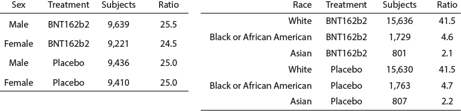](./image/chapter16_tidy.png "Fernando et al. (2020)の表1の一部をtidyに変換")

Fernando et al. (2020)の表1の一部をtidyに変換

Rでは、グラフ作成・統計共に、元の表より下のtidyなデータの方が取り扱いやすいです。多くのデータは人が見やすいように収集・準備されており、tidyではありません。R上でデータをtidyに加工・整形するためのツールが、`tidyr`と`dplyr`です。

## 20.4 tidyr

`tidyr`はデータを**縦持ち・横持ち**に変換するためのパッケージです。この縦持ち・横持ちというのは、以下の図のように、縦長・横長のデータのことを指します。

[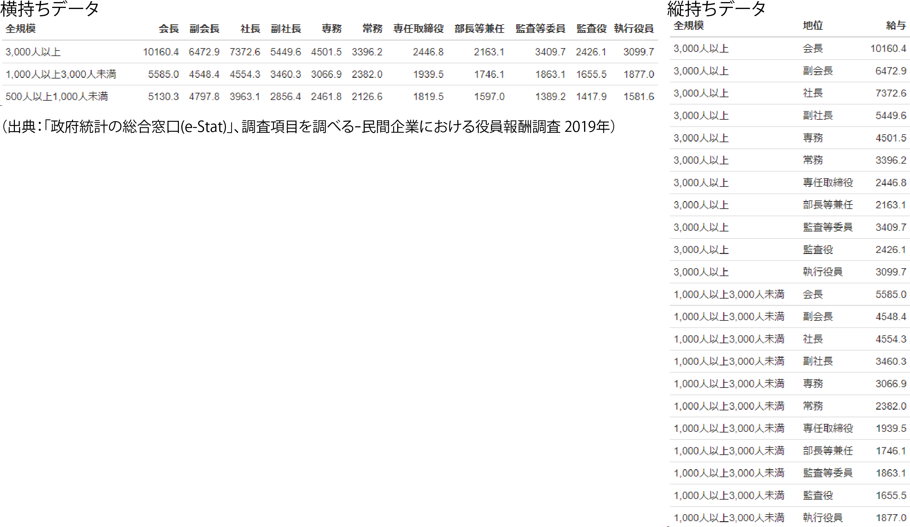](./image/long_wide_data.png "縦持ちと横持ちの図")

縦持ちと横持ちの図

人が見る分には、横持ちのデータはわかりやすいと思います。しかし、Rで取り扱う場合には、圧倒的に縦持ちのデータの方が取り扱いが簡単です。ですので、人が作ったデータをRで取り扱うために縦持ちに変換する、Rで生成したデータを人が理解しやすいように横持ちに変換する時に、`tidyr`の関数を用いることになります。以下の表3に`tidyr`の関数の一覧を示します。

| 関数名       | 適用する演算                               |
|:-------------|:-------------------------------------------|
| pivot_longer | データフレームを縦持ちデータにする         |
| gather       | データフレームを縦持ちデータにする（旧版） |
| pivot_wider  | データフレームを横持ちデータにする         |
| spread       | データフレームを横持ちデータにする（旧版） |
| group_by     | データを列でグループ化する                 |
| nest         | データをネストする                         |
| unnest       | ネストを解除する                           |
| drop_na      | NAを含む行を取り除く（na.omitと同じ）      |
| expand       | 各列の組み合わせを作成する                 |
| fill         | NAに上の要素を埋める                       |
| replace_na   | NAに引数で指定した要素を埋める             |

表1：tidyrの関数群 {.caption-top .table .table-sm .table-striped .small}

### 20.4.1 pivot_longerとpivot_wider

データフレームを縦持ちに変換する関数が`pivot_longer`関数、横持ちに変換する関数が`pivot_wider`関数です。共に第一引数がデータフレームで、パイプ演算子を用いて演算を行います。

`pivot_longer`関数も`pivot_wider`関数も、Rでのデータ解析ではとても重要となりますが、共に変換がやや複雑で、挙動がわかりにくい関数でもあります。下の例を参考に、どのようにデータが変換されるのか、よく理解した上で用いるのがよいでしょう。

### 20.4.2 縦持ちへの変換：pivot_longer

`pivot_longer`関数はデータフレームと列番号を引数に取り、列番号で指定した列の名前を`name`という列の要素に変換し、列番号で指定した列の要素を`value`という名前の列として、1列のデータに変換します。このような変換により、データは縦長の構造を取ります。

変換後の列名は引数で指定でき、列の名前に関する列名は「`names_to`」、列の要素に関する列名は「`values_to`」引数に指定します。この`pivot_longer`関数は特に統計・グラフ作成の際によく用います。

`tidyr`が開発されるまでは、`reshape` ([Wickham 2007a](#ref-rephape_bib))や`reshape2` ([Wickham 2007b](#ref-rephape2_bib))という関数で縦持ち変換を行うのが一般的でした。また、`pivot_longer`関数は`tidyr`開発初期には`gather`という名前で、引数の順番も少し異なっていました。今でも`reshape`や`reshape2`、`gather`を用いて縦持ちへの変換を行うことはできます。

``` downlit
head(iris)
##   Sepal.Length Sepal.Width Petal.Length Petal.Width Species
## 1          5.1         3.5          1.4         0.2  setosa
## 2          4.9         3.0          1.4         0.2  setosa
## 3          4.7         3.2          1.3         0.2  setosa
## 4          4.6         3.1          1.5         0.2  setosa
## 5          5.0         3.6          1.4         0.2  setosa
## 6          5.4         3.9          1.7         0.4  setosa

# pivot_longer 縦持ちデータへの変換（返り値はtibble）
iris |> pivot_longer(cols = 1:4) 
## # A tibble: 600 × 3
##    Species name         value
##    <fct>   <chr>        <dbl>
##  1 setosa  Sepal.Length   5.1
##  2 setosa  Sepal.Width    3.5
##  3 setosa  Petal.Length   1.4
##  4 setosa  Petal.Width    0.2
##  5 setosa  Sepal.Length   4.9
##  6 setosa  Sepal.Width    3  
##  7 setosa  Petal.Length   1.4
##  8 setosa  Petal.Width    0.2
##  9 setosa  Sepal.Length   4.7
## 10 setosa  Sepal.Width    3.2
## # ℹ 590 more rows

# 上と同じ（列名を設定）
iris |> pivot_longer(cols = 1:4, names_to = "category", values_to = "value") 
## # A tibble: 600 × 3
##    Species category     value
##    <fct>   <chr>        <dbl>
##  1 setosa  Sepal.Length   5.1
##  2 setosa  Sepal.Width    3.5
##  3 setosa  Petal.Length   1.4
##  4 setosa  Petal.Width    0.2
##  5 setosa  Sepal.Length   4.9
##  6 setosa  Sepal.Width    3  
##  7 setosa  Petal.Length   1.4
##  8 setosa  Petal.Width    0.2
##  9 setosa  Sepal.Length   4.7
## 10 setosa  Sepal.Width    3.2
## # ℹ 590 more rows

# gather（返り値はデータフレーム）
iris |> gather(category, value, 1:4) |> head()
##   Species     category value
## 1  setosa Sepal.Length   5.1
## 2  setosa Sepal.Length   4.9
## 3  setosa Sepal.Length   4.7
## 4  setosa Sepal.Length   4.6
## 5  setosa Sepal.Length   5.0
## 6  setosa Sepal.Length   5.4

# 上と同じ
iris |> gather(category, value, -Species) |> head() 
##   Species     category value
## 1  setosa Sepal.Length   5.1
## 2  setosa Sepal.Length   4.9
## 3  setosa Sepal.Length   4.7
## 4  setosa Sepal.Length   4.6
## 5  setosa Sepal.Length   5.0
## 6  setosa Sepal.Length   5.4
```

### 20.4.3 横持ちへの変換：pivot_wider

`pivot_wider`関数は、データを横持ちに変換する関数です。`pivot_wider`関数は列名となる列を`names_from`引数に、要素となる列を`values_from`引数に指定します。指定しなかった列はそのまま維持されます。`names_from`で指定した列の要素は各列名となり、`values_from`で指定した列の要素が`names_from`で新しく作られた列の値となります。この変換により、データは横長の、幅の広い構造を取ることになります。

横持ちへの変換も`reshape`を用いて行うことができます。また、`pivot_wider`は以前は`spread`という名前であったため、この`spread`関数を用いて横持ちデータへの変換を行うこともできます。

``` downlit
# pivot_wider 横持ちデータへの変換
us_rent_income
## # A tibble: 104 × 5
##    GEOID NAME       variable estimate   moe
##    <chr> <chr>      <chr>       <dbl> <dbl>
##  1 01    Alabama    income      24476   136
##  2 01    Alabama    rent          747     3
##  3 02    Alaska     income      32940   508
##  4 02    Alaska     rent         1200    13
##  5 04    Arizona    income      27517   148
##  6 04    Arizona    rent          972     4
##  7 05    Arkansas   income      23789   165
##  8 05    Arkansas   rent          709     5
##  9 06    California income      29454   109
## 10 06    California rent         1358     3
## # ℹ 94 more rows

us_rent_income |> pivot_wider(names_from = variable, values_from = c(estimate, moe)) 
## # A tibble: 52 × 6
##    GEOID NAME                 estimate_income estimate_rent moe_income moe_rent
##    <chr> <chr>                          <dbl>         <dbl>      <dbl>    <dbl>
##  1 01    Alabama                        24476           747        136        3
##  2 02    Alaska                         32940          1200        508       13
##  3 04    Arizona                        27517           972        148        4
##  4 05    Arkansas                       23789           709        165        5
##  5 06    California                     29454          1358        109        3
##  6 08    Colorado                       32401          1125        109        5
##  7 09    Connecticut                    35326          1123        195        5
##  8 10    Delaware                       31560          1076        247       10
##  9 11    District of Columbia           43198          1424        681       17
## 10 12    Florida                        25952          1077         70        3
## # ℹ 42 more rows

# spread（valueは1つしか値を取れない）
us_rent_income |> spread(variable, estimate)
## # A tibble: 104 × 5
##    GEOID NAME         moe income  rent
##    <chr> <chr>      <dbl>  <dbl> <dbl>
##  1 01    Alabama        3     NA   747
##  2 01    Alabama      136  24476    NA
##  3 02    Alaska        13     NA  1200
##  4 02    Alaska       508  32940    NA
##  5 04    Arizona        4     NA   972
##  6 04    Arizona      148  27517    NA
##  7 05    Arkansas       5     NA   709
##  8 05    Arkansas     165  23789    NA
##  9 06    California     3     NA  1358
## 10 06    California   109  29454    NA
## # ℹ 94 more rows
```

### 20.4.4 tidyrのその他の関数

`tidyr`には、`pivot_longer`、`pivot_wider`以外にも、データの全組み合わせを作成したり、データフレーム上の`NA`を置き換えるような関数が備わっています。`pivot_longer`/`pivot_wider`ほどには使用頻度は高くありませんが、覚えておくと役に立つ場面もあるかもしれません。

``` downlit
d <- data.frame(x = c(1, 2, NA, 4), y = c(NA, "b", "c", "d"))
d
##    x    y
## 1  1 <NA>
## 2  2    b
## 3 NA    c
## 4  4    d
# d |> expand.grid()と同じく、総当たりのデータフレームを作成（tibbleが返ってくる）
d |> expand(x, y) 
## # A tibble: 16 × 2
##        x y    
##    <dbl> <chr>
##  1     1 b    
##  2     1 c    
##  3     1 d    
##  4     1 <NA> 
##  5     2 b    
##  6     2 c    
##  7     2 d    
##  8     2 <NA> 
##  9     4 b    
## 10     4 c    
## 11     4 d    
## 12     4 <NA> 
## 13    NA b    
## 14    NA c    
## 15    NA d    
## 16    NA <NA>

d |> replace_na(list(x = 1, y = "nodata")) # NAの置き換え
##   x      y
## 1 1 nodata
## 2 2      b
## 3 1      c
## 4 4      d

d |> fill(x, y) # 一つ上の値でNAを埋める（1番上はNAのまま）
##   x    y
## 1 1 <NA>
## 2 2    b
## 3 2    c
## 4 4    d
```

データのグループ化（`group_by`）、ネスト（`nest`）については後ほど説明します。

## 20.5 dplyr

`tidyr`によって縦持ちに変換したデータフレームを加工し、データの抽出・演算・集計等を行うためのパッケージが、`dplyr`です。`dplyr`の関数群も、基本的にパイプ演算子を用いて使用することが想定されています。`dplyr`と同様の加工ができる関数や方法はたくさんあるのですが、**パイプ演算子で繋いだ演算の中で加工がすべて完了する**のが`dplyr`の特徴になっています。

`dplyr`には非常に沢山の関数が設定されていますが、特に使用頻度が高く、重要な関数は、**`filter`、`select`、`arrange`、`mutate`、`summarise`**の5つです。

以下の表に`dplyr`の関数の一覧を示します。

| 関数名     | 適用する演算                                 |
|:-----------|:---------------------------------------------|
| filter     | 条件で行を選択する（subsetと類似）           |
| select     | 列を選択する                                 |
| arrange    | 列で並べ替える                               |
| desc       | 並べ替えを降順にする                         |
| mutate     | 新しい列を追加する                           |
| group_by   | データを列でグループ化する                   |
| rowwise    | 行ごとに演算できるようにする                 |
| summarise  | 列ごとに関数を適用する                       |
| distinct   | 重複した行を削除                             |
| slice      | 一部の行を取り出す                           |
| rename     | 列名を変更する                               |
| inner_join | データフレームを結合する（NAのある行を削除） |
| full_join  | データフレームを結合する（すべての行を残す） |
| left_join  | データフレームを左から結合する               |
| right_join | データフレームを右から結合する               |
| case_when  | switch文と類似した条件分岐                   |
| case_match | switch文と類似した条件分岐                   |
| if_else    | ifelse文の取り扱いを良くした関数             |

表2：dplyrの関数群 {.caption-top .table .table-sm .table-striped .small}

### 20.5.1 filter関数

`filter`関数は、データフレームから条件に従い行を選択するための関数です。Rにはよく似た`subset`という関数がありますが、他の`tidyverse`の関数と共に用いる場合は`filter`関数を用いたほうが良いでしょう。

[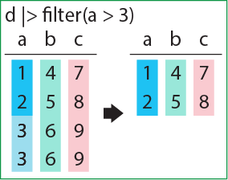](./image/dplyr_filter.png "dplyr::filter")

dplyr::filter

`filter`関数はデータフレームを第一引数、条件式を第二引数に取る関数です。第二引数に指定した条件に合致した行のみを選択することができます。下の例では、`Species`の列の要素が`setosa`である行を選択しています。

``` downlit
iris |> tibble() |> filter(Species == "setosa")
## # A tibble: 50 × 5
##    Sepal.Length Sepal.Width Petal.Length Petal.Width Species
##           <dbl>       <dbl>        <dbl>       <dbl> <fct>  
##  1          5.1         3.5          1.4         0.2 setosa 
##  2          4.9         3            1.4         0.2 setosa 
##  3          4.7         3.2          1.3         0.2 setosa 
##  4          4.6         3.1          1.5         0.2 setosa 
##  5          5           3.6          1.4         0.2 setosa 
##  6          5.4         3.9          1.7         0.4 setosa 
##  7          4.6         3.4          1.4         0.3 setosa 
##  8          5           3.4          1.5         0.2 setosa 
##  9          4.4         2.9          1.4         0.2 setosa 
## 10          4.9         3.1          1.5         0.1 setosa 
## # ℹ 40 more rows
```

### 20.5.2 select関数

`select`関数は、データフレームから列を選択するための関数です。`select`関数もデータフレームを第一引数にとり、それ以降に列名を引数に取ります。`select`関数を用いると、引数で指定した列のみを含むデータフレームが返ってきます。また、マイナスで列名を指定すると、その列を取り除いたデータフレームが返ってきます。

[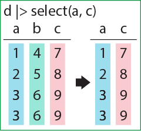](./image/dplyr_select.png "dplyr::select")

dplyr::select

``` downlit
iris |> tibble() |> select(Sepal.Length, Sepal.Width, Species)
## # A tibble: 150 × 3
##    Sepal.Length Sepal.Width Species
##           <dbl>       <dbl> <fct>  
##  1          5.1         3.5 setosa 
##  2          4.9         3   setosa 
##  3          4.7         3.2 setosa 
##  4          4.6         3.1 setosa 
##  5          5           3.6 setosa 
##  6          5.4         3.9 setosa 
##  7          4.6         3.4 setosa 
##  8          5           3.4 setosa 
##  9          4.4         2.9 setosa 
## 10          4.9         3.1 setosa 
## # ℹ 140 more rows

iris |> tibble() |> select(-Sepal.Length, -Sepal.Width, -Species)
## # A tibble: 150 × 2
##    Petal.Length Petal.Width
##           <dbl>       <dbl>
##  1          1.4         0.2
##  2          1.4         0.2
##  3          1.3         0.2
##  4          1.5         0.2
##  5          1.4         0.2
##  6          1.7         0.4
##  7          1.4         0.3
##  8          1.5         0.2
##  9          1.4         0.2
## 10          1.5         0.1
## # ℹ 140 more rows
```

`select`関数では、列を選択するための関数を引数に取ることもできます。

| 関数名                   | 適用する演算                                 |
|:-------------------------|:---------------------------------------------|
| everything()             | すべての列を選択する                         |
| last_col(n)              | 後ろからn番目の列を選択する                  |
| group_cols()             | グループ化に用いた列を選択する               |
| starts_with(“文字列”)    | 指定した文字列から始まる列名を選択する       |
| ends_with(“文字列”)      | 指定した文字列で終わる列名を選択する         |
| contains(“文字列”)       | 指定した文字列を含む列名を選択する           |
| matches(“正規表現”)      | 正規表現に従い列名を選択する                 |
| num_range(“文字列”, n:m) | 文字列で始まる列名のn～m番目を選択する       |
| all_of(“文字列”)         | 列名を文字列で選択する（列名がないとエラー） |
| any_of(“文字列”)         | 列名を文字列で選択する                       |
| where(関数)              | 論理型を返す関数に従い選択する               |

表3：selectに用いる列選択の関数 {.caption-top .table .table-sm .table-striped .small}

### 20.5.3 arrange関数

`arrange`関数は、データフレームを指定した列に従い、昇順（小さいものが上）に並べ替える関数です。`order`関数を用いてもデータフレームの並べ替えはできますが、`arrange`関数を用いるとより簡単に並べ替えを行うことができます。

[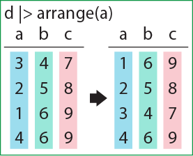](./image/dplyr_arrange.png "dplyr::arrange")

dplyr::arrange

`arrange`関数のヘルパーとして、`desc`関数が設定されています。`desc`関数はデータフレームを降順（大きいものが上）に並べ替える場合に用います。

``` downlit
iris |> tibble() |> arrange(Sepal.Length) # 昇順に並べ替え
## # A tibble: 150 × 5
##    Sepal.Length Sepal.Width Petal.Length Petal.Width Species
##           <dbl>       <dbl>        <dbl>       <dbl> <fct>  
##  1          4.3         3            1.1         0.1 setosa 
##  2          4.4         2.9          1.4         0.2 setosa 
##  3          4.4         3            1.3         0.2 setosa 
##  4          4.4         3.2          1.3         0.2 setosa 
##  5          4.5         2.3          1.3         0.3 setosa 
##  6          4.6         3.1          1.5         0.2 setosa 
##  7          4.6         3.4          1.4         0.3 setosa 
##  8          4.6         3.6          1           0.2 setosa 
##  9          4.6         3.2          1.4         0.2 setosa 
## 10          4.7         3.2          1.3         0.2 setosa 
## # ℹ 140 more rows

iris |> tibble() |> arrange(desc(Sepal.Length)) # 降順に並べ替え
## # A tibble: 150 × 5
##    Sepal.Length Sepal.Width Petal.Length Petal.Width Species  
##           <dbl>       <dbl>        <dbl>       <dbl> <fct>    
##  1          7.9         3.8          6.4         2   virginica
##  2          7.7         3.8          6.7         2.2 virginica
##  3          7.7         2.6          6.9         2.3 virginica
##  4          7.7         2.8          6.7         2   virginica
##  5          7.7         3            6.1         2.3 virginica
##  6          7.6         3            6.6         2.1 virginica
##  7          7.4         2.8          6.1         1.9 virginica
##  8          7.3         2.9          6.3         1.8 virginica
##  9          7.2         3.6          6.1         2.5 virginica
## 10          7.2         3.2          6           1.8 virginica
## # ℹ 140 more rows
```

### 20.5.4 mutate関数

`mutate`関数は、データフレームに新しい列を追加する関数です。`mutate`は[16章](chapter16.llms.md#データフレームの列の演算)で説明した`within`関数に似た働きを持ち、第一引数にデータフレーム、第二引数に「新しい列の名前 = 値」という形で、追加したい列の名前と値を指定します。値の計算には、すでにデータフレームに存在する列名を用いることができます。したがって、「列のデータを加工・演算して新しい列を作る」場合に`mutate`関数を用いることになります。

[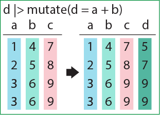](./image/dplyr_mutate.png "dplyr::mutate")

dplyr::mutate

データフレームの列のインデックスに値を代入しても同様の列の追加を行うことができますが、パイプ演算子の途中で代入を行うことはできません。`mutate`関数を用いれば、パイプ演算子中で列を追加し、以降の演算に用いることができます。

``` downlit
iris |> tibble() |> mutate(Sepal.ratio = Sepal.Length / Sepal.Width) # Sepal.ratioを列として追加
## # A tibble: 150 × 6
##    Sepal.Length Sepal.Width Petal.Length Petal.Width Species Sepal.ratio
##           <dbl>       <dbl>        <dbl>       <dbl> <fct>         <dbl>
##  1          5.1         3.5          1.4         0.2 setosa         1.46
##  2          4.9         3            1.4         0.2 setosa         1.63
##  3          4.7         3.2          1.3         0.2 setosa         1.47
##  4          4.6         3.1          1.5         0.2 setosa         1.48
##  5          5           3.6          1.4         0.2 setosa         1.39
##  6          5.4         3.9          1.7         0.4 setosa         1.38
##  7          4.6         3.4          1.4         0.3 setosa         1.35
##  8          5           3.4          1.5         0.2 setosa         1.47
##  9          4.4         2.9          1.4         0.2 setosa         1.52
## 10          4.9         3.1          1.5         0.1 setosa         1.58
## # ℹ 140 more rows
```

### 20.5.5 summarise関数

`summarise`関数（`summarize`でも可）は、データフレームの列に演算を適用し、結果をデータフレームとして返す関数です。`summarise`関数も第一引数にはデータフレームを取り、以降の引数に「計算結果の列名 = 演算」という形で、適用したい演算を記載します。下の例では、`Sepal.Length`の平均値と標準偏差を返しています。

``` downlit
iris |> summarise(m = mean(Sepal.Length), s=sd(Sepal.Length))
##          m         s
## 1 5.843333 0.8280661
```

これだけでは`apply`関数より不便ですし、意味が無いように見えます。`summarise`関数が本領を発揮するのは、`group_by`関数により、データをグループ化した後になります。

### 20.5.6 group_by関数

`group_by`関数は、文字列か因子の列に従い、データフレームの行をグループ化するための関数です。

[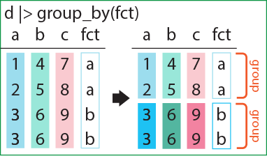](./image/dplyr_group_by.png "dplyr::group_by")

dplyr::group_by

`tidyr`・`dplyr`でデータフレームを取り扱うと、データフレームは自動的に**`tibble`に変換**されます。`group_by`関数でデータフレームをグループ化すると、`tibble`に`group`というものが追加され、クラスに「`grouped_df`」というものが追加されます。`group_by`関数の機能はこれだけです。

グループ化した`tibble`は、`ungroup`関数でグループ解除できます。

``` downlit
iris |> group_by(Species) # tibbleの左上にGroups: Species[3]と表示される
## # A tibble: 150 × 5
## # Groups:   Species [3]
##    Sepal.Length Sepal.Width Petal.Length Petal.Width Species
##           <dbl>       <dbl>        <dbl>       <dbl> <fct>  
##  1          5.1         3.5          1.4         0.2 setosa 
##  2          4.9         3            1.4         0.2 setosa 
##  3          4.7         3.2          1.3         0.2 setosa 
##  4          4.6         3.1          1.5         0.2 setosa 
##  5          5           3.6          1.4         0.2 setosa 
##  6          5.4         3.9          1.7         0.4 setosa 
##  7          4.6         3.4          1.4         0.3 setosa 
##  8          5           3.4          1.5         0.2 setosa 
##  9          4.4         2.9          1.4         0.2 setosa 
## 10          4.9         3.1          1.5         0.1 setosa 
## # ℹ 140 more rows

iris |> group_by(Species) |> class() # クラスにgrouped_dfが追加
## [1] "grouped_df" "tbl_df"     "tbl"        "data.frame"

d <- iris |> group_by(Species)
ungroup(d) # グループの解除
## # A tibble: 150 × 5
##    Sepal.Length Sepal.Width Petal.Length Petal.Width Species
##           <dbl>       <dbl>        <dbl>       <dbl> <fct>  
##  1          5.1         3.5          1.4         0.2 setosa 
##  2          4.9         3            1.4         0.2 setosa 
##  3          4.7         3.2          1.3         0.2 setosa 
##  4          4.6         3.1          1.5         0.2 setosa 
##  5          5           3.6          1.4         0.2 setosa 
##  6          5.4         3.9          1.7         0.4 setosa 
##  7          4.6         3.4          1.4         0.3 setosa 
##  8          5           3.4          1.5         0.2 setosa 
##  9          4.4         2.9          1.4         0.2 setosa 
## 10          4.9         3.1          1.5         0.1 setosa 
## # ℹ 140 more rows
```

### 20.5.7 group_by関数とsummarise関数を同時に用いる

上記のように、`summarise`関数も`group_by`関数も、どちらも単独ではいまいちよく分からない関数ですが、組み合わせて使用することで、[19章](chapter19.llms.md#aggregate関数)で解説した`aggregate`関数と同じように、**カテゴリごとの集計計算**を行うことができます。

まずはデータフレームを`group_by`関数でグループ化します。このグループ化したデータフレームに`summarise`関数で計算を適用すると、計算をグループごとに実行してくれます。下の例では、`Species`でグループ化した後に、`Sepal.Length`の平均を`summarise`関数で計算しています。結果として、`Species`ごとに`Sepal.Length`の平均値を計算したデータフレームが返ってきます。グループ化した場合は、グループ化に用いた列を結果のデータフレームに残してくれます。

[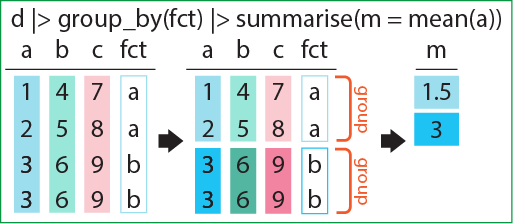](./image/dplyr_summarise.png "dplyr::summarise")

dplyr::summarise

この`group_by`と`summarise`を用いると、カテゴリごとに平均値や標準偏差などを求め、その結果をデータフレームとしたものを返り値として得ることができます。

`summarise`には`.by`という引数を指定することができ、この`.by`にグループ化するための列を設定することもできます。ただし、`dplyr`では、`group_by`で明示的にグループ化した後に`summarise`を用いることを推奨しているようです。

`tidyr`の`pivot_longer`関数と組み合わせて用いれば、複数列の要約データを一度に計算することもできます。

``` downlit
iris |> group_by(Species) |> summarise(m = mean(Sepal.Length))
## # A tibble: 3 × 2
##   Species        m
##   <fct>      <dbl>
## 1 setosa      5.01
## 2 versicolor  5.94
## 3 virginica   6.59

iris |> summarise(m = mean(Sepal.Length), .by = Species) # 上と同じ
##      Species     m
## 1     setosa 5.006
## 2 versicolor 5.936
## 3  virginica 6.588

# 複数列の結果に対して、一度に平均値と標準偏差を求める
iris |> 
  pivot_longer(1:4) |> 
  group_by(Species, name) |> 
  summarise(m=mean(value), s=sd(value))
## `summarise()` has regrouped the output.
## ℹ Summaries were computed grouped by Species and name.
## ℹ Output is grouped by Species.
## ℹ Use `summarise(.groups = "drop_last")` to silence this message.
## ℹ Use `summarise(.by = c(Species, name))` for per-operation grouping
##   (`?dplyr::dplyr_by`) instead.
## # A tibble: 12 × 4
## # Groups:   Species [3]
##    Species    name             m     s
##    <fct>      <chr>        <dbl> <dbl>
##  1 setosa     Petal.Length 1.46  0.174
##  2 setosa     Petal.Width  0.246 0.105
##  3 setosa     Sepal.Length 5.01  0.352
##  4 setosa     Sepal.Width  3.43  0.379
##  5 versicolor Petal.Length 4.26  0.470
##  6 versicolor Petal.Width  1.33  0.198
##  7 versicolor Sepal.Length 5.94  0.516
##  8 versicolor Sepal.Width  2.77  0.314
##  9 virginica  Petal.Length 5.55  0.552
## 10 virginica  Petal.Width  2.03  0.275
## 11 virginica  Sepal.Length 6.59  0.636
## 12 virginica  Sepal.Width  2.97  0.322
```

### 20.5.8 rowwise関数

`rowwise`関数は、`mutate`や`summarise`での演算を行方向に変更してくれる関数で、`apply`関数を`MARGIN = 1`と設定した場合とよく似た計算を行うことができる関数です。`group_by`関数の行方向版と言えるかもしれません。`rowwise`関数をデータフレームに適用すると、`tibble`に「`Rowwise:`」の印がつき、クラスに「`rowwise_df`」が追加されます。`rowwise`関数も`group_by`関数と同じく、`ungroup`関数で解除することができます。

`rowwise`関数を用いることで、例えば`min`や`max`のような関数を、列方向ではなく行方向に対して適用することができます。

``` downlit
iris |> rowwise() # Rowwiseのラベルが付く
## # A tibble: 150 × 5
## # Rowwise: 
##    Sepal.Length Sepal.Width Petal.Length Petal.Width Species
##           <dbl>       <dbl>        <dbl>       <dbl> <fct>  
##  1          5.1         3.5          1.4         0.2 setosa 
##  2          4.9         3            1.4         0.2 setosa 
##  3          4.7         3.2          1.3         0.2 setosa 
##  4          4.6         3.1          1.5         0.2 setosa 
##  5          5           3.6          1.4         0.2 setosa 
##  6          5.4         3.9          1.7         0.4 setosa 
##  7          4.6         3.4          1.4         0.3 setosa 
##  8          5           3.4          1.5         0.2 setosa 
##  9          4.4         2.9          1.4         0.2 setosa 
## 10          4.9         3.1          1.5         0.1 setosa 
## # ℹ 140 more rows

iris |> rowwise() |> ungroup() # ungroupでRowwiseが消える
## # A tibble: 150 × 5
##    Sepal.Length Sepal.Width Petal.Length Petal.Width Species
##           <dbl>       <dbl>        <dbl>       <dbl> <fct>  
##  1          5.1         3.5          1.4         0.2 setosa 
##  2          4.9         3            1.4         0.2 setosa 
##  3          4.7         3.2          1.3         0.2 setosa 
##  4          4.6         3.1          1.5         0.2 setosa 
##  5          5           3.6          1.4         0.2 setosa 
##  6          5.4         3.9          1.7         0.4 setosa 
##  7          4.6         3.4          1.4         0.3 setosa 
##  8          5           3.4          1.5         0.2 setosa 
##  9          4.4         2.9          1.4         0.2 setosa 
## 10          4.9         3.1          1.5         0.1 setosa 
## # ℹ 140 more rows

iris |> rowwise() |> mutate(minr = min(c(Sepal.Length, Sepal.Width))) # 横（行）方向への演算
## # A tibble: 150 × 6
## # Rowwise: 
##    Sepal.Length Sepal.Width Petal.Length Petal.Width Species  minr
##           <dbl>       <dbl>        <dbl>       <dbl> <fct>   <dbl>
##  1          5.1         3.5          1.4         0.2 setosa    3.5
##  2          4.9         3            1.4         0.2 setosa    3  
##  3          4.7         3.2          1.3         0.2 setosa    3.2
##  4          4.6         3.1          1.5         0.2 setosa    3.1
##  5          5           3.6          1.4         0.2 setosa    3.6
##  6          5.4         3.9          1.7         0.4 setosa    3.9
##  7          4.6         3.4          1.4         0.3 setosa    3.4
##  8          5           3.4          1.5         0.2 setosa    3.4
##  9          4.4         2.9          1.4         0.2 setosa    2.9
## 10          4.9         3.1          1.5         0.1 setosa    3.1
## # ℹ 140 more rows

iris |> tibble() |> mutate(minr = min(c(Sepal.Length, Sepal.Width))) # 縦の最小値が出てくる
## # A tibble: 150 × 6
##    Sepal.Length Sepal.Width Petal.Length Petal.Width Species  minr
##           <dbl>       <dbl>        <dbl>       <dbl> <fct>   <dbl>
##  1          5.1         3.5          1.4         0.2 setosa      2
##  2          4.9         3            1.4         0.2 setosa      2
##  3          4.7         3.2          1.3         0.2 setosa      2
##  4          4.6         3.1          1.5         0.2 setosa      2
##  5          5           3.6          1.4         0.2 setosa      2
##  6          5.4         3.9          1.7         0.4 setosa      2
##  7          4.6         3.4          1.4         0.3 setosa      2
##  8          5           3.4          1.5         0.2 setosa      2
##  9          4.4         2.9          1.4         0.2 setosa      2
## 10          4.9         3.1          1.5         0.1 setosa      2
## # ℹ 140 more rows
```

### 20.5.9 データフレームの結合

2つのデータフレームを横に結合する時に用いる関数が、`_join`関数です。`_join`関数には複数の種類があり、それぞれ結合の仕方が少しずつ異なります。

結合する際には、基本的には以下のルールに従います。

- 列名が同じ要素があれば、1つの列とする
- 列名が異なる要素は、新しく付け加える
- 行（レコード）に列の要素がなければ、NAで埋める

結合する際に、`NA`の要素を含む行を取り除くのが`inner_join`関数、`NA`の要素を含む行を全て残すのが`full_join`関数です。

`left_join`関数と`right_join`関数は引数の順番により残す行が変わる関数で、`left_join`関数はパイプ演算子の左のデータフレームの行は全て残し、付け加えたデータフレームの行のうち`NA`を含むものを取り除く関数です。`right_join`関数は逆に、付け加えたデータフレームの行をすべて残し、パイプ演算子の左のデータフレームの行のうち`NA`を含むものを削除します。

この他に、2つのデータフレームの要素のすべての組み合わせにデータフレームを作成する`cross_join`、列を指定して両方のデータフレームにその列の要素があるものを残す`semi_join`、逆に片方にのみ存在する要素を残す`anti_join`、後に説明する`nest`されたデータフレームを作成する`nest_join`などがあります。

``` downlit
band_members
## # A tibble: 3 × 2
##   name  band   
##   <chr> <chr>  
## 1 Mick  Stones 
## 2 John  Beatles
## 3 Paul  Beatles

band_instruments
## # A tibble: 3 × 2
##   name  plays 
##   <chr> <chr> 
## 1 John  guitar
## 2 Paul  bass  
## 3 Keith guitar

band_members |> inner_join(band_instruments) # NAのデータがあると取り除かれる
## Joining with `by = join_by(name)`
## # A tibble: 2 × 3
##   name  band    plays 
##   <chr> <chr>   <chr> 
## 1 John  Beatles guitar
## 2 Paul  Beatles bass

band_members |> full_join(band_instruments) # すべてのレコードを残す
## Joining with `by = join_by(name)`
## # A tibble: 4 × 3
##   name  band    plays 
##   <chr> <chr>   <chr> 
## 1 Mick  Stones  <NA>  
## 2 John  Beatles guitar
## 3 Paul  Beatles bass  
## 4 Keith <NA>    guitar

band_members |> left_join(band_instruments) # 左の要素を元に、右の要素を付け加える
## Joining with `by = join_by(name)`
## # A tibble: 3 × 3
##   name  band    plays 
##   <chr> <chr>   <chr> 
## 1 Mick  Stones  <NA>  
## 2 John  Beatles guitar
## 3 Paul  Beatles bass

band_members |> right_join(band_instruments) # 右の要素を元に、左の要素を付け加える
## Joining with `by = join_by(name)`
## # A tibble: 3 × 3
##   name  band    plays 
##   <chr> <chr>   <chr> 
## 1 John  Beatles guitar
## 2 Paul  Beatles bass  
## 3 Keith <NA>    guitar
```

### 20.5.10 その他のdplyrの関数

`dplyr`には`filter`、`select`、`arrange`、`mutate`、`summarise`以外にも、たくさんの関数が登録されています。`slice`関数は行を一部分選択する関数です。`slice`関数以外にも、「slice\_」という名前を持つ複数の関数が`dplyr`には登録されています。

``` downlit
iris |> slice(5:10)
##   Sepal.Length Sepal.Width Petal.Length Petal.Width Species
## 1          5.0         3.6          1.4         0.2  setosa
## 2          5.4         3.9          1.7         0.4  setosa
## 3          4.6         3.4          1.4         0.3  setosa
## 4          5.0         3.4          1.5         0.2  setosa
## 5          4.4         2.9          1.4         0.2  setosa
## 6          4.9         3.1          1.5         0.1  setosa

iris |> _[5:10, ] # 上と同じ
##    Sepal.Length Sepal.Width Petal.Length Petal.Width Species
## 5           5.0         3.6          1.4         0.2  setosa
## 6           5.4         3.9          1.7         0.4  setosa
## 7           4.6         3.4          1.4         0.3  setosa
## 8           5.0         3.4          1.5         0.2  setosa
## 9           4.4         2.9          1.4         0.2  setosa
## 10          4.9         3.1          1.5         0.1  setosa

iris %>% .[5:10, ] # 上と同じ
##    Sepal.Length Sepal.Width Petal.Length Petal.Width Species
## 5           5.0         3.6          1.4         0.2  setosa
## 6           5.4         3.9          1.7         0.4  setosa
## 7           4.6         3.4          1.4         0.3  setosa
## 8           5.0         3.4          1.5         0.2  setosa
## 9           4.4         2.9          1.4         0.2  setosa
## 10          4.9         3.1          1.5         0.1  setosa

iris |> slice_head(n = 5) # head(iris, 5)と同じ
##   Sepal.Length Sepal.Width Petal.Length Petal.Width Species
## 1          5.1         3.5          1.4         0.2  setosa
## 2          4.9         3.0          1.4         0.2  setosa
## 3          4.7         3.2          1.3         0.2  setosa
## 4          4.6         3.1          1.5         0.2  setosa
## 5          5.0         3.6          1.4         0.2  setosa

iris |> slice_tail(n = 5) # tail(iris, 5)と同じ
##   Sepal.Length Sepal.Width Petal.Length Petal.Width   Species
## 1          6.7         3.0          5.2         2.3 virginica
## 2          6.3         2.5          5.0         1.9 virginica
## 3          6.5         3.0          5.2         2.0 virginica
## 4          6.2         3.4          5.4         2.3 virginica
## 5          5.9         3.0          5.1         1.8 virginica

iris |> slice_min(Sepal.Length, n = 5) # Sepal.Lengthが小さいものから5行
##   Sepal.Length Sepal.Width Petal.Length Petal.Width Species
## 1          4.3         3.0          1.1         0.1  setosa
## 2          4.4         2.9          1.4         0.2  setosa
## 3          4.4         3.0          1.3         0.2  setosa
## 4          4.4         3.2          1.3         0.2  setosa
## 5          4.5         2.3          1.3         0.3  setosa

iris |> slice_max(Sepal.Length, n = 5) # Sepal.Lengthが大きいものから5行
##   Sepal.Length Sepal.Width Petal.Length Petal.Width   Species
## 1          7.9         3.8          6.4         2.0 virginica
## 2          7.7         3.8          6.7         2.2 virginica
## 3          7.7         2.6          6.9         2.3 virginica
## 4          7.7         2.8          6.7         2.0 virginica
## 5          7.7         3.0          6.1         2.3 virginica
 
iris |> slice_sample(n = 5) # ランダムに5行抽出
##   Sepal.Length Sepal.Width Petal.Length Petal.Width    Species
## 1          5.8         2.8          5.1         2.4  virginica
## 2          4.9         3.6          1.4         0.1     setosa
## 3          6.2         2.8          4.8         1.8  virginica
## 4          5.0         3.4          1.6         0.4     setosa
## 5          6.7         3.1          4.7         1.5 versicolor
```

`glimpse`関数は`str`関数とよく似た機能を持ち、データフレームの構造を表示してくれます。`pull`関数は列をベクターとして返す関数です。`relocate`関数は列の順番を並べ替えて返してくれます。`rename`関数は列名を付け直す関数です。`count`関数と`tally`関数はそれぞれ要素の数と行数を返す関数です。

`relocate`関数や`rename`関数はパイプ演算子に特化した関数で、用いることでパイプ演算の途中で列の順番や名前を変えることができます。

``` downlit
iris |> tibble() |> glimpse()
## Rows: 150
## Columns: 5
## $ Sepal.Length <dbl> 5.1, 4.9, 4.7, 4.6, 5.0, 5.4, 4.6, 5.0, 4.4, 4.9, 5.4, 4.…
## $ Sepal.Width  <dbl> 3.5, 3.0, 3.2, 3.1, 3.6, 3.9, 3.4, 3.4, 2.9, 3.1, 3.7, 3.…
## $ Petal.Length <dbl> 1.4, 1.4, 1.3, 1.5, 1.4, 1.7, 1.4, 1.5, 1.4, 1.5, 1.5, 1.…
## $ Petal.Width  <dbl> 0.2, 0.2, 0.2, 0.2, 0.2, 0.4, 0.3, 0.2, 0.2, 0.1, 0.2, 0.…
## $ Species      <fct> setosa, setosa, setosa, setosa, setosa, setosa, setosa, s…

iris |> head() |> tibble() |> pull(Species) # iris$Speciesと同じ
## [1] setosa setosa setosa setosa setosa setosa
## Levels: setosa versicolor virginica

# 列の並べ替え
iris |> tibble() |> relocate(Species, Petal.Width, Petal.Length, Sepal.Width, Sepal.Length)
## # A tibble: 150 × 5
##    Species Petal.Width Petal.Length Sepal.Width Sepal.Length
##    <fct>         <dbl>        <dbl>       <dbl>        <dbl>
##  1 setosa          0.2          1.4         3.5          5.1
##  2 setosa          0.2          1.4         3            4.9
##  3 setosa          0.2          1.3         3.2          4.7
##  4 setosa          0.2          1.5         3.1          4.6
##  5 setosa          0.2          1.4         3.6          5  
##  6 setosa          0.4          1.7         3.9          5.4
##  7 setosa          0.3          1.4         3.4          4.6
##  8 setosa          0.2          1.5         3.4          5  
##  9 setosa          0.2          1.4         2.9          4.4
## 10 setosa          0.1          1.5         3.1          4.9
## # ℹ 140 more rows

iris |> tibble() |> rename(S = Species) # 列名SpeciesをSに変更
## # A tibble: 150 × 5
##    Sepal.Length Sepal.Width Petal.Length Petal.Width S     
##           <dbl>       <dbl>        <dbl>       <dbl> <fct> 
##  1          5.1         3.5          1.4         0.2 setosa
##  2          4.9         3            1.4         0.2 setosa
##  3          4.7         3.2          1.3         0.2 setosa
##  4          4.6         3.1          1.5         0.2 setosa
##  5          5           3.6          1.4         0.2 setosa
##  6          5.4         3.9          1.7         0.4 setosa
##  7          4.6         3.4          1.4         0.3 setosa
##  8          5           3.4          1.5         0.2 setosa
##  9          4.4         2.9          1.4         0.2 setosa
## 10          4.9         3.1          1.5         0.1 setosa
## # ℹ 140 more rows


iris |> count(Species) # 因子や文字列の数を数える関数
##      Species  n
## 1     setosa 50
## 2 versicolor 50
## 3  virginica 50

iris |> tally() # 行数を数える関数
##     n
## 1 150

iris |> group_by(Species) |> tally() # グループごとに行数を数える関数
## # A tibble: 3 × 2
##   Species        n
##   <fct>      <int>
## 1 setosa        50
## 2 versicolor    50
## 3 virginica     50
```

`mutate`関数にはよく似た機能を持つ類似した関数がいくつかあります。`mutate_if`は第2引数にデータの型やクラスを確認し、論理型を返す関数（`is.numeric`や`is.character`など）を取り、`TRUE`を返す列にのみ第3引数の関数を適用する関数です。`mutate_if(data.frame, is.numeric, round)`とすると、`data.frame`のうち、数値の列のみを四捨五入し、結果を返します。

``` downlit
# 数値の列を四捨五入する
iris |> mutate_if(is.numeric, round) |> head()
##   Sepal.Length Sepal.Width Petal.Length Petal.Width Species
## 1            5           4            1           0  setosa
## 2            5           3            1           0  setosa
## 3            5           3            1           0  setosa
## 4            5           3            2           0  setosa
## 5            5           4            1           0  setosa
## 6            5           4            2           0  setosa
```

`mutate_at`関数は指定した列に指定した関数を適用する関数、`mutate_all`はすべての列に指定した関数を適用する関数です。この2つは`mutate_if`よりは使用する場面が限られるかもしれません。

``` downlit
# Sepal.Lengthの列だけ四捨五入する 
iris |> mutate_at("Sepal.Length", round) |> head()
##   Sepal.Length Sepal.Width Petal.Length Petal.Width Species
## 1            5         3.5          1.4         0.2  setosa
## 2            5         3.0          1.4         0.2  setosa
## 3            5         3.2          1.3         0.2  setosa
## 4            5         3.1          1.5         0.2  setosa
## 5            5         3.6          1.4         0.2  setosa
## 6            5         3.9          1.7         0.4  setosa

# すべての列を四捨五入する
iris[, 1:4] |> mutate_all(round) |> head()
##   Sepal.Length Sepal.Width Petal.Length Petal.Width
## 1            5           4            1           0
## 2            5           3            1           0
## 3            5           3            1           0
## 4            5           3            2           0
## 5            5           4            1           0
## 6            5           4            2           0
```

## 20.6 tibble

[データのI/Oの章](chapter17.llms.md#tibble)で説明した通り、`tidyverse`で取り扱う関数は、データフレームを**tibble**というクラスに変換して返り値を返します。tibbleには以下の特徴があります。

- 表示の際に、データフレームの列・行数、各列のデータ型を表示し、上から10行だけ示す
- クラスにdata.frame、tbl_df、tblを設定する
- `group_by`や`rowwise`により、グループ化ができる（グループ化したクラスが付け加わる）
- ネスト（`nest`）したデータを取り扱える
- 行名（row names）は設定できない

tibbleはデータフレームの作成と同じように、`tibble`関数を用いて作成できます。また、`as_tibble`関数を用いることで、データフレームをtibbleに変換することができます。

``` downlit
pacman::p_load(tidyverse)
d <- tibble(x = 1:3, y = c("a", "b", "c"), z = c(T, F, T)) # tibbleを作成
d
## # A tibble: 3 × 3
##       x y     z    
##   <int> <chr> <lgl>
## 1     1 a     TRUE 
## 2     2 b     FALSE
## 3     3 c     TRUE

class(d) # クラスはtbl_df、tbl、data.frame
## [1] "tbl_df"     "tbl"        "data.frame"

iris_tibble <- as_tibble(iris) # データフレームをtibbleに変換
iris_tibble
## # A tibble: 150 × 5
##    Sepal.Length Sepal.Width Petal.Length Petal.Width Species
##           <dbl>       <dbl>        <dbl>       <dbl> <fct>  
##  1          5.1         3.5          1.4         0.2 setosa 
##  2          4.9         3            1.4         0.2 setosa 
##  3          4.7         3.2          1.3         0.2 setosa 
##  4          4.6         3.1          1.5         0.2 setosa 
##  5          5           3.6          1.4         0.2 setosa 
##  6          5.4         3.9          1.7         0.4 setosa 
##  7          4.6         3.4          1.4         0.3 setosa 
##  8          5           3.4          1.5         0.2 setosa 
##  9          4.4         2.9          1.4         0.2 setosa 
## 10          4.9         3.1          1.5         0.1 setosa 
## # ℹ 140 more rows
```

tibbleはインデックスの指定に関してもややdata.frameと異なります。data.frameでは、インデックスで1つの値を指定すると、その列に従った型のデータが返ってきますが、tibbleではtibbleが返ってくるようになっています。1つの値をtibbleではなく、ベクターの1つの値として取得するには、`unlist`関数を用いたり、二十カッコ（`[[]]`）を用いる必要があります。

``` downlit
# 列を選択するとベクターが返ってくるのはdata.frameと同じ
iris_tibble$Sepal.Length |> head()
## [1] 5.1 4.9 4.7 4.6 5.0 5.4

# 1つの値を選択すると、tibbleが返ってくる
iris_tibble[1, 1]
## # A tibble: 1 × 1
##   Sepal.Length
##          <dbl>
## 1          5.1

# 1つの値を取得するには、二十カッコを用いるか、unlist関数を用いる
iris_tibble[[1, 1]]
## [1] 5.1

iris_tibble[1, 1] |> unlist()
## Sepal.Length 
##          5.1
```

`data.frame`関数でデータフレームを作成する場合、列の要素が他の列より短い場合、recycling（繰り返して採用）されてデータフレームが作成されます。tibbleでは、列の要素が1つだけのときのみrecyclingされ、2つ以上であればエラーとなります。不自然なrecyclingは抑制される仕組みになっています。

``` downlit
# サイズが2個以上だとrecycleしない。data.frame関数はrecyclingする
d <- tibble(x = rep(1:3, 5), y = rep(c("a", "b", "c"), rep(5, 3)), z = c(T, F, T)) 
## Error in `tibble()`:
## ! Tibble columns must have compatible sizes.
## • Size 15: Existing data.
## • Size 3: Column `z`.
## ℹ Only values of size one are recycled.
```

## 20.7 ネスト（nest）したデータ

tibbleは、**複数のデータを含むもの**を列の要素とする（`nest`、ネストする）ことができます。要は、データフレームやリスト、統計結果のオブジェクトなどを、1つのセルに登録できるということです。「ネストしてしまうとtidyじゃないのでは？」と思わなくは無いのですが、データフレームをコンパクトにして見やすくすることはできます。

この、「複数のデータを含むもの」を作成する場合には、`nest`関数を用います。グループ化したtibbleに`nest`関数を適用すると、グループごとのデータフレームを1つのセルに詰め込むことができます。`nest`したデータを元に戻すときには、`unnest`関数を用います。

``` downlit
iris |> group_by(Species) # データのグループ化（tibbleに変換される）
## # A tibble: 150 × 5
## # Groups:   Species [3]
##    Sepal.Length Sepal.Width Petal.Length Petal.Width Species
##           <dbl>       <dbl>        <dbl>       <dbl> <fct>  
##  1          5.1         3.5          1.4         0.2 setosa 
##  2          4.9         3            1.4         0.2 setosa 
##  3          4.7         3.2          1.3         0.2 setosa 
##  4          4.6         3.1          1.5         0.2 setosa 
##  5          5           3.6          1.4         0.2 setosa 
##  6          5.4         3.9          1.7         0.4 setosa 
##  7          4.6         3.4          1.4         0.3 setosa 
##  8          5           3.4          1.5         0.2 setosa 
##  9          4.4         2.9          1.4         0.2 setosa 
## 10          4.9         3.1          1.5         0.1 setosa 
## # ℹ 140 more rows

iris_nested <- iris |> as_tibble() |> group_by(Species) |> nest() # ネストしたデータ

iris_nested
## # A tibble: 3 × 2
## # Groups:   Species [3]
##   Species    data             
##   <fct>      <list>           
## 1 setosa     <tibble [50 × 4]>
## 2 versicolor <tibble [50 × 4]>
## 3 virginica  <tibble [50 × 4]>

iris_nested[1, 2] |> unnest() # ネストを解除
## Warning: `cols` is now required when using `unnest()`.
## ℹ Please use `cols = c(data)`.
## # A tibble: 50 × 4
##    Sepal.Length Sepal.Width Petal.Length Petal.Width
##           <dbl>       <dbl>        <dbl>       <dbl>
##  1          5.1         3.5          1.4         0.2
##  2          4.9         3            1.4         0.2
##  3          4.7         3.2          1.3         0.2
##  4          4.6         3.1          1.5         0.2
##  5          5           3.6          1.4         0.2
##  6          5.4         3.9          1.7         0.4
##  7          4.6         3.4          1.4         0.3
##  8          5           3.4          1.5         0.2
##  9          4.4         2.9          1.4         0.2
## 10          4.9         3.1          1.5         0.1
## # ℹ 40 more rows
```

これだけでは`nest`する意味があまりわかりませんが、この`nest`と共に、リストに関数を適用するためのパッケージである、`purrr`パッケージ ([Wickham and Henry 2023](#ref-purrr_bib))を用いると、統計計算の効率を高めることができます。`purrr`パッケージの`map`関数は、リスト（データフレームはリスト）の要素に対して、関数を適用する関数です。これだけだと`apply`関数群で説明した`lapply`・`sapply`関数と同じなのですが、`map`関数はパイプ演算子の中で、`mutate`関数の引数として用いることができます。

グループ化したtibbleに対して`mutate`関数内でネストした要素に対して`map`関数を用いると、**統計結果をネストしたtibble**が返ってきます。

下の例では、`iris`を種別にあらかじめグループ化・ネストしておき、`iris`の`Sepal.Length`と`Sepal.Width`について線形回帰を行った結果を、`mutate`関数でtibbleに追加しています。このような計算を行うと、追加された列には`<lm>`という要素が登録されます。`<lm>`は線形回帰の結果のオブジェクトですので、グループごと、つまり種ごとに`Sepal.Length`と`Sepal.Width`の線形回帰を行った結果が記録され、保存されていることを示しています。このような形でプログラムを書くことで、3回線形回帰を繰り返すことなく、1行のパイプ演算子の演算により3回の線形回帰結果を得ることができます。

``` downlit
iris |> group_by(Species) |> nest() # nestするとdataの行が追加される
## # A tibble: 3 × 2
## # Groups:   Species [3]
##   Species    data             
##   <fct>      <list>           
## 1 setosa     <tibble [50 × 4]>
## 2 versicolor <tibble [50 × 4]>
## 3 virginica  <tibble [50 × 4]>

# tibbleは統計結果もnestできる
(d <- 
    iris |> 
    group_by(Species) |> 
    nest() |> 
    mutate(lmcalc = map(data, ~lm(Sepal.Length ~ Sepal.Width, data = .))))
## # A tibble: 3 × 3
## # Groups:   Species [3]
##   Species    data              lmcalc
##   <fct>      <list>            <list>
## 1 setosa     <tibble [50 × 4]> <lm>  
## 2 versicolor <tibble [50 × 4]> <lm>  
## 3 virginica  <tibble [50 × 4]> <lm>

d$lmcalc[1] # 線形回帰の結果
## [[1]]
## 
## Call:
## lm(formula = Sepal.Length ~ Sepal.Width, data = .)
## 
## Coefficients:
## (Intercept)  Sepal.Width  
##      2.6390       0.6905
```

## 20.8 dplyrの条件分岐

### 20.8.1 if_else関数

`dplyr`には、データフレームを取り扱う関数の他に、条件分岐に関する機能を提供しています。

`ifelse`関数はデフォルトのRで利用できる関数ですが、`dplyr`には、`if_else`関数という、ほとんど同じ機能を持つ関数が設定されています。`ifelse`と`if_else`の違いは、

- 条件式に`NA`が含まれた時に`missing`引数に設定した値を返す
- 返り値のデータ型を維持する
- `TRUE`と`FALSE`の返り値の型が違うとエラー

の3点です。通常の`ifelse`関数では型変換等のトラブルが起こりやすいため、なるべく`if_else`関数を利用したほうがよいでしょう。

``` downlit
v <- c(1, 2, NA, 3)
ifelse(v > 2, "large", "small")
## [1] "small" "small" NA      "large"

if_else(v > 2, "large", "small") # ifelseと同じ
## [1] "small" "small" NA      "large"

if_else(v > 2, "large", "small", missing = "missing") # NAだと"missing"が返ってくる
## [1] "small"   "small"   "missing" "large"


ifelse(TRUE, as.Date("2023-10-10"), as.Date("2023-10-11")) # 数値が返ってくる
## [1] 19640

ifelse(TRUE, as.Date("2023-10-10"), FALSE) # 型が違っても数値が返ってくる
## [1] 19640

if_else(TRUE, as.Date("2023-10-10"), as.Date("2023-10-11")) # 日時が返ってくる
## [1] "2023-10-10"

if_else(TRUE, as.Date("2023-10-10"), FALSE) # 型が違うとエラーが返ってくる
## Error in `if_else()`:
## ! Can't combine `true` <date> and `false` <logical>.
```

### 20.8.2 case_matchとcase_when

`dplyr`には、条件分岐を取り扱う文（関数）として、`case_match`と`case_when`が設定されています。どちらもチルダ（`~`）を返り値の設定に用いるもので、`else if`文や`switch`文を用いなくても、比較的簡単に3つ以上の条件分岐を行うことができます。

`case_match`は第一引数にベクター、それ以降に「`評価する値 ~ 返り値`」という形で引数を取り、ベクターの要素が「評価する値」と一致する場合に、対応する返り値を返す関数です。「評価する値」はベクターで設定することもできます。

``` downlit
c(1, 2, 1, 2) |> 
  case_match( # ベクターの要素が1ならone、2ならtwoを返す
    1 ~ "one",
    2 ~ "two"
  )
## Warning: `case_match()` was deprecated in dplyr 1.2.0.
## ℹ Please use `recode_values()` instead.
## [1] "one" "two" "one" "two"

1:10 |> 
  case_match( # 「評価する値」はベクターでも設定できる
    c(1, 3, 5, 7, 9) ~ "odd",
    c(2, 4, 6, 8, 10) ~ "even"
  )
##  [1] "odd"  "even" "odd"  "even" "odd"  "even" "odd"  "even" "odd"  "even"
```

`case_when`は、引数に「`条件式 ~ 返り値`」を取り、条件式が`TRUE`のときに対応する返り値を返します。`case_match`、`case_when`のいずれもパイプ演算子中で他の`dplyr`の関数と共に用いることを想定して設計されています。`if_else`、`case_match`、`case_when`を用いれば、`mutate`関数内で条件分岐を行うこともできます。また、どの条件にも合わないとき（`if`文における`else`に当たるもの）の返り値を設定する場合には、`default`引数を設定します。

``` downlit
iris_s <- iris |> slice_sample(n = 5) |> select(Species) |> unlist() |> as.character()
iris_s
## [1] "setosa"     "setosa"     "versicolor" "versicolor" "setosa"

case_when(
  iris_s == "setosa" ~ 1, # 条件がTRUEなら、~の後ろの値を返す
  iris_s == "versicolor" ~ 2,
  iris_s == "virginica" ~ 3
)
## [1] 1 1 2 2 1
```

Bache, Stefan Milton, and Hadley Wickham. 2022. *Magrittr: A Forward-Pipe Operator for r*. <https://CRAN.R-project.org/package=magrittr>.

Polack, Fernando P., Stephen J. Thomas, Nicholas Kitchin, et al. 2020. “Safety and Efficacy of the BNT162b2 mRNA Covid-19 Vaccine.” *New England Journal of Medicine* 383 (27): 2603–15. <https://doi.org/10.1056/NEJMoa2034577>.

Wickham, Hadley. 2007a. “Reshaping Data with the Reshape Package.” *Journal of Statistical Software* 21 (12). <https://www.jstatsoft.org/v21/i12/>.

Wickham, Hadley. 2007b. “Reshaping Data with the reshape Package.” *Journal of Statistical Software* 21 (12): 1–20. <http://www.jstatsoft.org/v21/i12/>.

Wickham, Hadley. 2011. “The Split-Apply-Combine Strategy for Data Analysis.” *Journal of Statistical Software* 40 (1): 1–29. <https://www.jstatsoft.org/v40/i01/>.

Wickham, Hadley. 2014. “Tidy Data.” *Journal of Statistical Software* 59 (10): 1–23. <https://doi.org/10.18637/jss.v059.i10>.

Wickham, Hadley, Mara Averick, Jennifer Bryan, et al. 2019. “Welcome to the tidyverse.” *Journal of Open Source Software* 4 (43): 1686. <https://doi.org/10.21105/joss.01686>.

Wickham, Hadley, Romain François, Lionel Henry, Kirill Müller, and Davis Vaughan. 2023. *Dplyr: A Grammar of Data Manipulation*. <https://CRAN.R-project.org/package=dplyr>.

Wickham, Hadley, and Lionel Henry. 2023. *Purrr: Functional Programming Tools*. <https://CRAN.R-project.org/package=purrr>.

Wickham, Hadley, Davis Vaughan, and Maximilian Girlich. 2023. *Tidyr: Tidy Messy Data*. <https://CRAN.R-project.org/package=tidyr>.

Back to top
