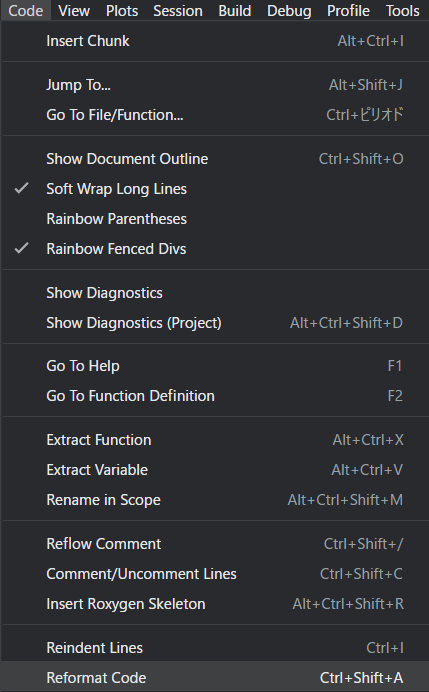

# 23  コーディング規約

Code

Rに限らず、どのようなプログラミング言語を用いる場合においても、読みやすいコードと読みにくいコードがあります。また、変数や関数の名前はわかりやすくつけておかないと、後々どのような意味の変数・関数であったかを理解しにくくなってしまいます。

このような、コードの問題、変数や関数の名前の問題をできるだけ抑えるために、企業などでプログラミングを行う場合には、その組織の**コーディング規約（coding style）**、つまりコードの書き方のルールを設けるのが一般的です。

Rは大学の研究室などで、教官や学生などが小規模なデータの分析に用いる場合も多いため、コーディング規約は必ずしも重要ではありませんが、コードの可読性を高め、解析の再現性（reproducibility）を担保するためにコーディング規約に基づいたプログラミングを心がけた方が良いでしょう。

Rのコーディング規約では、tidyverseに従ったもの（[tidyverse style guide](https://style.tidyverse.org/index.html)）が主流だと思います。

Rには、[`styler`](https://styler.r-lib.org/) ([Müller and Walthert 2023](#ref-styler_bib))や[`formatR`](https://yihui.org/formatr/) ([Xie 2023](#ref-formatR_bib))という、coding styleを修正してくれるパッケージや、Rstudioのコーディング規約修正（reformat code）のショートカット（Ctrl+Shift+A）などが備わっており、ある程度自動的にフォーマットの修正を行うことができますので、このような機能を用いるのもよいでしょう。

[](./image/chapter19_reformatting.png "図1：Rstudioでのフォーマットの修正（Reformat Code）")

図1：Rstudioでのフォーマットの修正（Reformat Code）

Rでのコーディング規約については、基本的には上記の[tidyverse style guide](https://style.tidyverse.org/index.html)に従うのが最もよいでしょう。以下にtidyverse style guideに記載のコーディング規約のうち、よく用いられる表現について記載しておきます。

## 23.1 ファイル名

ファイル名はPCにも読みやすく、ヒトにも読みやすいようにしましょう。スペースやシンボルを使うのは避け、文字の区切りには`-`（ハイフン）もしくは`_`（アンダースコア）を使うことが推奨されます。ファイル名は意味のある言葉とし、同じ種類のファイルは同じルールで名前を付けましょう。

``` r
# 良い例
## 拡張子のRは大文字、アンダースコアで単語を繋ぐ
fit_models.R  

## ファイル名は意味が理解できるものとする
report_of_iris_analysis.txt 

## 同じ種類のファイルの命名は似た形にする
fig-lm-iris-1.png 
fig-lm-iris-2.png

# 悪い例
## 拡張子のRに小文字を用いない、スペースを用いない
fit models.r 

## 意味がわからないファイル名にしない
temp.txt 

## 同じ種類のファイルを違う形で保存しない
fig lm iris1.PNG 
fig_iris.png
```

また、ファイル名にはその順番が分かるような指標（`01-`、`02-`などの番号、日付など）を加えて、ファイルの順序が分かるようにしましょう。

``` r
# 良い例
01-lm-analysis.R
02-glm-analysis.R
240401_file1.R
240501_file2.R

# 悪い例
## アルファベット順に並べるとファイル順や日付順に並ばない
lm-analysis01.R
glm-analysis02.R
file_text_240401.txt
file_image_240501.txt
```

ファイル名に「最終」などを付けないようにしましょう。大体の場合、「最終2」などができます。

``` downlit
# 悪い例
lm_analysis_final.R
lm_analysis_final2.R
lm_analysis_final_revisited.R
```

## 23.2 シンタックス

シンタックスというのは、プログラムとして書く文書、要はコードのことを指します。コードを書く時のルールを以下に記載していきます。

### 23.2.1 変数名

変数名は単語をアンダースコアでつないで記載しましょう。変数名にはその変数の意味の分かる名前を用い、あまり長くならないようにします。また、Rに定義されている変数や関数などを上書きしないよう気を付けましょう。キャメルケース（`dayOne`、`DayOne`のように単語の区切りを大文字にする）は基本的に使用しません。

``` downlit
# 良い例
day_1
mean_leaf_length

# 悪い例
the_first_day_of_1994_May
mll
pi <- "円周率" # 既存の変数に代入
```

### 23.2.2 スペースの使用

コンマの後、演算子の前後にはスペースを入れましょう。ただし、演算子の一部（`:`や`^`、`!`、`?`、`[`、`$`など）の前後にはスペースを入れません。

関数のカッコの前後にはスペースを入れず、`if`、`for`、`while`の後、`()`と[`{}`](https://rdrr.io/r/base/Paren.html)の間にはスペースを入れましょう。`function`の後にスペースは入れませんが、`()`と[`{}`](https://rdrr.io/r/base/Paren.html)の間にスペースを入れるのが推奨されています。

（私は`if`文や`){`の間にはスペースを入れない主義ですが、コーディング規約にはスペースを入れるよう記載されています）

``` downlit
# 良い例
x[1, ]
c(1, 2, 3)
y <- 4 + 1
if (z < 10) {print(x)}
function(x) {print(x)}

# 悪い例
x[1,]
c(1,2,3)
y<-4+1

## 個人的にはこちらが良いと思っています
if(z < 10){print(x)} 
function(x){print(x)}
```

改行の代わりにセミコロン（`;`）を使うのは避けましょう。また、代入は`<-`で行い、`=`は使わないようにしましょう。文字列にシングルクォーテーション（`'`）を使うのもやめましょう。

``` downlit
# 良い例
x <- 1
y <- 2
"A dog is walking."

# 悪い例
x = 1 ; y = 2
'A dog is walking.'
```

## 23.3 関数

### 23.3.1 関数名

関数名は基本的に変数と同じように、意味が分かるように、アンダースコアで単語を繋いだものとします。ただし、関数名は動詞を使うこととされています。

``` downlit
# 良い例
bind_row()
mutate()

# 悪い例
binder_of_row()
mutation()
```

### 23.3.2 無名関数

無名関数とは、関数名を定義することなく用いる関数で、`apply`関数などで利用されます（[11章](chapter11.llms.md)の最後を参照）。無名関数は`function`でも、バックスラッシュ（`\`）でも作成できます。

無名関数を用いるときは、`function`を用いても、`\`を用いても問題ありません。ただし、`\`は改行のある関数では使わない、名前付き関数（通常の関数名を使う関数のこと）では使用しないようにします。

``` downlit
# 良い例
apply(iris, 1, \(x){sum(x)/length(x)})

# 悪い例
## 改行はしない
apply(iris, 1, 
  \(x){
    sum(x)/length(x)
    }
  )

## 通常の関数には使わない（functionを使う）
mean_bs <- \(x) sum(x) / length(x)
```

### 23.3.3 return関数

関数の返り値は他の言語では通常`return`関数で明示的に示すのが一般的だと思います。Rでも`return`関数で指定することはできますが、Tidyverse style guideでは`function`の返り値は`return`関数で示すのではなく、最後に変数を宣言する形で設定するとしています。ただし、`function`の最後ではない場所で返り値を返す場合には`return`関数を使いましょう。

``` downlit
# 良い例
sum_2_value <- function(x, y){
  z <- x + y
  if(z < 2){return(0)}
  z
}

# 悪い例
sum_2_value <- function(x, y){
  z <- x + y
  if(z < 2){return(0)}
  return(z)
}
```

## 23.4 パイプ演算子

[20章](chapter20.llms.md#パイプ演算子pipe-operator)で紹介したパイプ演算子は演算の文脈を理解するために有用ですが、パイプ演算子の利用が適していない場合もあります。例えば、

- 2つのオブジェクトを同時に加工したい場合
- パイプ演算子の途中で生成する中間的なオブジェクトを維持することに意味がある場合

パイプ演算子の前にはスペースを入れ、パイプ演算子の後で改行します。改行した場合にはインデントを入れます。Rstudioではパイプ演算子をショートカット（ctrl+shift+M）で入力すると自動的にスペースが加えられ、改行するとインデントされるので、Rstudio使用している場合には特に気にする必要はないでしょう。

``` downlit
# 良い例
iris |> 
  group_by(Species) |> 
  summarise(m = mean(value))

# 悪い例
iris|>group_by(Species)|>summarise(m=mean(value))  
```

パイプ演算子の演算内で別のパイプ演算子の演算を行うとわかりにくくなるので避けましょう。また、Rのデフォルトのパイプ演算子（`|>`）が推奨されており、`magrittr`のパイプ演算子（`%>%`）は避けるようにしましょう。

``` downlit
# 良い例
x_join <- x |> select(a, b, w)
y_join <- y |> select(a, b, v)
left_join(x_join, y_join, join_by(a, b))

# あまり良くない例
x |>
  select(a, b, w) |>
  left_join(y |> select(a, b, v), join_by(a, b))
```

## 23.5 ggplot2

[26章](chapter26.llms.md)で紹介する`ggplot2`では、`+`演算子ごとに改行を入れます。また、引数がたくさんある場合には改行を入れるようにしましょう。

``` downlit
iris |> 
  ggplot(aes(x=Sepal.Length, y = Sepal.Width, color = Species, fill = Species)) +
  geom_point(size = 1) +
  geom_smooth(method = "lm") +
  labs(
    x = "Sepal Length",
    y = "Sepal Width",
    title = "linear regression of Sepal Length & Width",
    caption = "ribbon represents 95% CI"
  )
```

## 23.6 他のコーディング規約・参考文献について

Rのコーディング規約については、他の文献もたくさんあります。例えば、英語であれば[Google’s R Style Guide](https://google.github.io/styleguide/Rguide.html)、日本語であれば「[私たちのR ベストプラクティスの探求」（宋財泫先生、矢内勇生先生）](https://www.jaysong.net/RBook/)の11章や[このZennのページ](https://zenn.dev/5991/articles/b6c4ca9c6f2941)、[こちらのCoding styleのページ](https://k-metrics.github.io/cabinet/basics_coding_style.html)などがコーディング規約の参考になります。

コーディングスタイル全体については、[リーダブルコード](https://www.amazon.co.jp/%E3%83%AA%E3%83%BC%E3%83%80%E3%83%96%E3%83%AB%E3%82%B3%E3%83%BC%E3%83%89-%E2%80%95%E3%82%88%E3%82%8A%E8%89%AF%E3%81%84%E3%82%B3%E3%83%BC%E3%83%89%E3%82%92%E6%9B%B8%E3%81%8F%E3%81%9F%E3%82%81%E3%81%AE%E3%82%B7%E3%83%B3%E3%83%97%E3%83%AB%E3%81%A7%E5%AE%9F%E8%B7%B5%E7%9A%84%E3%81%AA%E3%83%86%E3%82%AF%E3%83%8B%E3%83%83%E3%82%AF-Theory-practice-Boswell/dp/4873115655) ([Boswell and Foucher 2012](#ref-Dustin_Boswell2012-06-23))を読んでみるのが良いでしょう。関数や変数の名前に悩んだ場合には、良い名前を提案してくれるサイト（[codic](https://codic.jp/)）も役に立ちます。

Boswell, Dustin, and Trevor Foucher. 2012. *リーダブルコード ーより良いコードを書くためのシンプルで実践的なテクニック (Theory in Practice)*. 単行本（ソフトカバー）. Translated by 角征典. オライリージャパン. <https://www.amazon.co.jp/dp/4873115655/>.

Müller, Kirill, and Lorenz Walthert. 2023. *Styler: Non-Invasive Pretty Printing of r Code*. <https://CRAN.R-project.org/package=styler>.

Xie, Yihui. 2023. *formatR: Format r Code Automatically*. <https://CRAN.R-project.org/package=formatR>.

Back to top
