# 24  グラフ作成：高レベルグラフィック関数

Code

Rでは、パッケージを用いることなく、論文に使用できるレベルのグラフを作成することができます。Rでのグラフ作成に用いる関数には、

- 高レベルグラフィック関数（High-level plotting functions）
- 低レベルグラフィック関数（Low-level plotting functions）
- インタラクティブグラフィック関数（Interactive plotting functions）

の3種類があります。

**高レベルグラフィック関数**は、一つの関数でグラフ全体を作成するもの、**低レベルグラフィック関数**はグラフ上に点や線、軸、ラベルなどを置く関数、インタラクティブグラフィック関数はグラフをマウスでクリックすることでその点の値を取得したりするものです。

Rでは通常、高レベルグラフィック関数で作成したグラフを重ねて表現し、低レベルグラフィック関数で修正・追記してグラフを完成させます。また、グラフ上の点を選択して統計モデルを実行するようなプログラムを組む場合には、インタラクティブグラフィック関数を用います。

> **TIP:**
>
> Rでは、パッケージを読み込むことなくグラフを作成することができますが、現在では、[`ggplot2`](https://ggplot2.tidyverse.org/index.html)をグラフ作成に用いるのが事実上のデフォルトのようになっています。`ggplot2`については[後の章](chapter26.llms.md)で詳しく説明します。
>
> `ggplot2`には、`ggplot2`に機能を追加するような[Extensions](https://exts.ggplot2.tidyverse.org/gallery/)もたくさん作成されています。
>
> `ggplot2`の他にも、この章で紹介する3Dグラフ作成パッケージである[`rgl`パッケージ](https://dmurdoch.github.io/rgl/) ([Murdoch and Adler 2023](#ref-rgl_bib))、インタラクティブなグラフを作成することができる[`plotly`](https://plotly.com/r/) ([Sievert 2020](#ref-plotly_bib))、`ggplot2`にお株を奪われたような形ではありますが、複数のグラフを簡単に並べて書くことができる[`lattice`](https://lattice.r-forge.r-project.org/) ([Sarkar 2008](#ref-lattice_bib))、`plotly`のようにインタラクティブなグラフ作成できる[`dygraphs`](https://rstudio.github.io/dygraphs/) ([Vanderkam et al. 2018](#ref-dygraphs_bib))などがあります。

## 24.1 高レベルグラフィック関数

Rの高レベルグラフィック関数の一覧を以下の表1に示します。

| 関数               | グラフの種類                         |
|:-------------------|:-------------------------------------|
| plot(x, y)         | xとyの散布図                         |
| plot(tz)           | 時系列tzの時系列グラフ               |
| plot(factor)       | 因子ごとの要素の数の棒グラフ         |
| plot(function)     | 関数に対応した線グラフ               |
| plot(data.frame)   | 相関行列の散布図（各列を要素とする） |
| coplot(x ~ y \| z) | xとyの散布図を因子zで分けて表示      |
| hist(x, breaks)    | ヒストグラム                         |
| pairs(x, y, z)     | 相関行列の散布図                     |
| boxplot(x ~ y)     | 箱ひげ図（yは因子）                  |
| dotchart(d)        | 行列dの散布図                        |
| image(x, y, z)     | カラーチャート（ヒートマップ）       |
| persp(x, y, z)     | 3Dグラフ                             |
| plot3d(d)          | 3Dグラフ（rglパッケージを使用）      |
| contour(x, y, z)   | 等高線図                             |

表1：高レベルグラフィック関数の一覧 {.caption-top .table .table-sm .table-striped .small}

## 24.2 plot関数

`plot`関数は、Rでは最も基本的で、かつ利用範囲の広いグラフ作成関数です。`plot`関数は典型的なジェネリック関数で、グラフを引数に適した形で表示してくれます。パッケージを呼び出していない場合、`plot`関数で呼び出されている関数は以下の30種類です。

``` downlit
methods("plot")
##  [1] plot.acf*           plot.data.frame*    plot.decomposed.ts*
##  [4] plot.default        plot.dendrogram*    plot.density*      
##  [7] plot.ecdf           plot.factor*        plot.formula*      
## [10] plot.free1way*      plot.function       plot.hclust*       
## [13] plot.histogram*     plot.HoltWinters*   plot.isoreg*       
## [16] plot.lm*            plot.medpolish*     plot.mlm*          
## [19] plot.ppr*           plot.prcomp*        plot.princomp*     
## [22] plot.profile*       plot.profile.nls*   plot.raster*       
## [25] plot.spec*          plot.stepfun        plot.stl*          
## [28] plot.table*         plot.ts             plot.tskernel*     
## [31] plot.TukeyHSD*     
## see '?methods' for accessing help and source code
```

パッケージには、そのパッケージで使用するオブジェクトを引数とするのに適した形の`plot`関数が設定されていることも多く、パッケージを使用した場合にはこの30種類よりも多くのグラフを`plot`関数だけで描画することができます。

### 24.2.1 散布図

`plot`関数の引数に、`x`と`y`の2つの同じ長さのベクターを数値で取った場合、`plot`関数は散布図を描画します。`x`に取った引数が横軸、`y`に取った引数が縦軸となります。

``` downlit
x <- 1:10
y <- 2 * x
plot(x = x, y = y)
```

[](chapter24_files/figure-html/unnamed-chunk-3-1.png)

`x`と`y`の関係は、チルダ（`~`）を用いてformulaの形式で書くこともできます。中学校で習った関数のグラフと同様に、チルダの前が縦軸、チルダの後ろが横軸になります。

``` downlit
plot(y ~ x)
```

[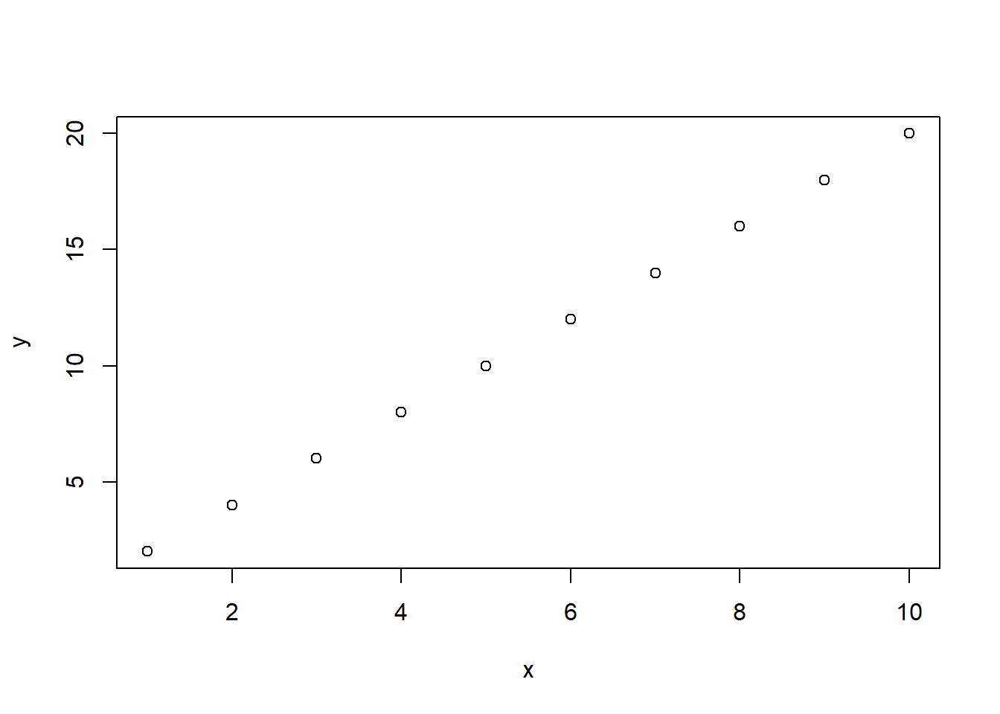](chapter24_files/figure-html/unnamed-chunk-4-1.png)

`plot`関数は引数が一つだけでも、グラフを作図してくれます。引数が一つだけの場合、`plot`関数は値を縦軸に、インデックスを横軸に取ったグラフを作成します。`stripchart`関数を用いても、同じグラフを作成することができます。

``` downlit
z <- sample(1:10, 10) # 1~10をランダムに並べ替える
z
##  [1] 10  6  5  1  8  3  2  4  9  7

plot(z) # 縦軸に値を取るグラフを表示
```

[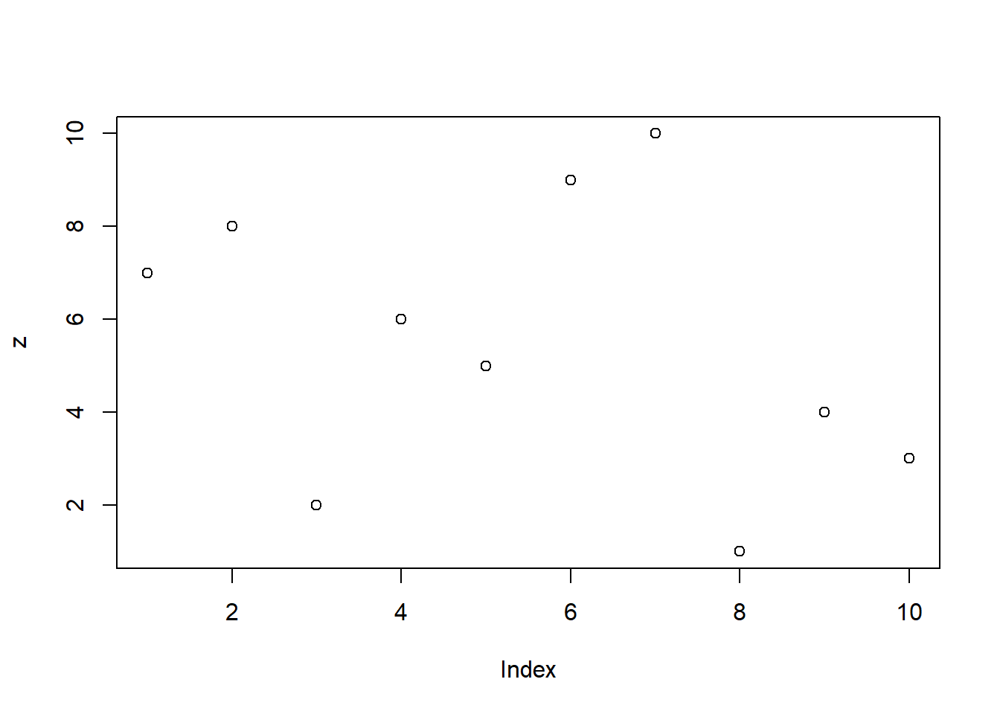](chapter24_files/figure-html/unnamed-chunk-5-1.png)

`plot`関数はデータフレーム（もしくは行列）を引数に取ることもできます。2列のデータフレームを引数に取った場合には、1列目をx軸、2列目をy軸とした散布図を描画します。

``` downlit
cars |> head() # 車の速度が1列目、停車までの距離が2列目
##   speed dist
## 1     4    2
## 2     4   10
## 3     7    4
## 4     7   22
## 5     8   16
## 6     9   10

plot(cars) # x軸に速度、y軸に停車までの距離をプロット
```

[](chapter24_files/figure-html/unnamed-chunk-6-1.png)

### 24.2.2 散布図行列

2列以上のデータフレーム（もしくは行列）を引数に取った場合には、`plot`関数は**散布図行列（matrix of scatterplots）**を表示します。因子は数値に自動的に変換されます。

``` downlit
plot(iris)
```

[](chapter24_files/figure-html/unnamed-chunk-7-1.png)

散布行列図には専用の関数である、`pairs`関数もありますが、`plot`関数で記述するものと差はありません。

``` downlit
pairs(iris)
```

[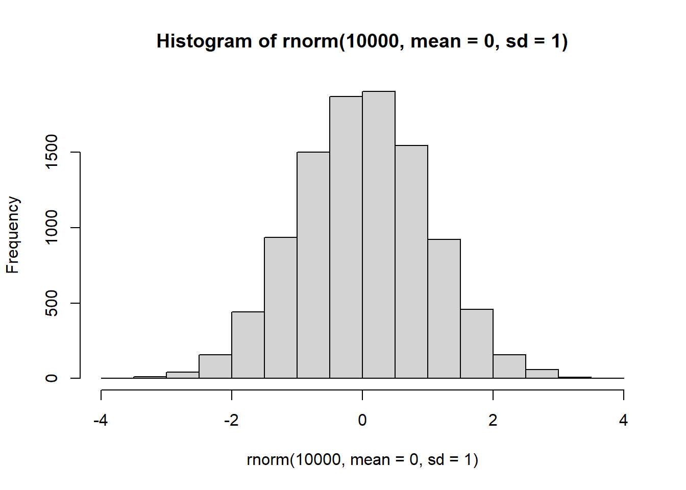](chapter24_files/figure-html/unnamed-chunk-8-1.png)

### 24.2.3 時系列プロット

時系列（ts）クラスのオブジェクトを引数にした場合、`plot`関数は横軸に時間、縦軸に値を取った線グラフを表示します。

``` downlit
plot(Nile)
```

[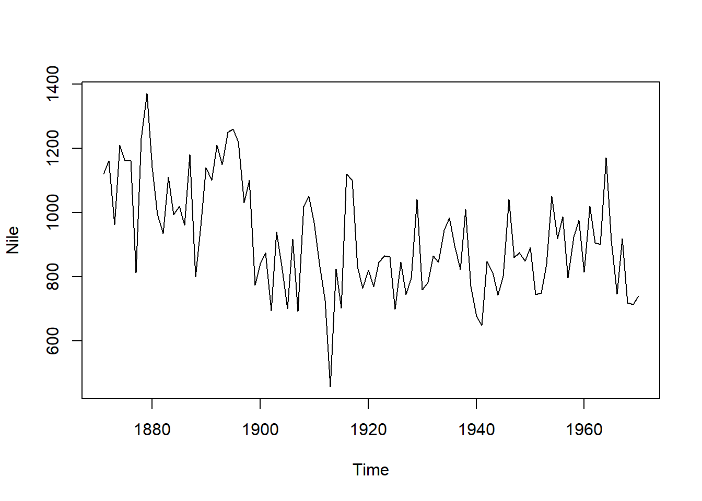](chapter24_files/figure-html/unnamed-chunk-9-1.png)

`ts`クラスに季節性（四半期や12か月）がある場合、単に`plot`関数の引数に取ると、上記の通り、単に線グラフが返ってきます。

``` downlit
plot(JohnsonJohnson) # JohnsonJohnsonの4半期ごとの株価
```

[](chapter24_files/figure-html/unnamed-chunk-10-1.png)

季節性のある時系列データを`decompose`関数の引数に指定すると、時系列データをトレンド、季節性、ランダムな要素に分離してくれます。この`decompose`関数の返り値を`plot`関数の引数に取ると、観察データ、トレンド、季節性、ランダムな要素をそれぞれ線グラフとして表示してくれます。

``` downlit
JohnsonJohnson |> decompose() |> plot() # decomposeは時系列のトレンド・季節性・ランダム要素を分ける関数
```

[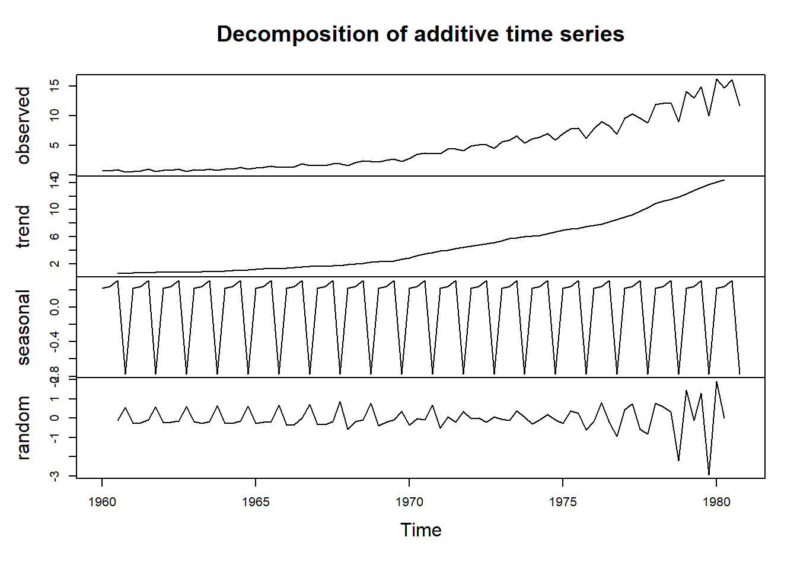](chapter24_files/figure-html/unnamed-chunk-11-1.png)

### 24.2.4 箱ひげ図

`plot`関数の`x`に因子、`y`に数値を取った場合、`plot`関数は**箱ひげ図**を表示します。箱ひげ図の図の意味は以下の通りです。

[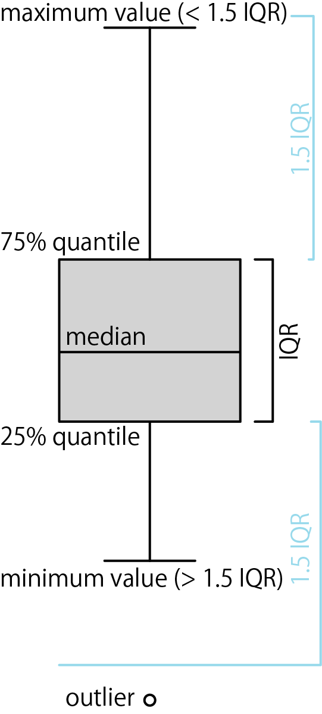](./image/boxplot.png "箱ひげ図の位置と意味")

箱ひげ図の位置と意味

- 箱の真ん中の線は中央値（median）
- 箱の上端は75%四分位値（75% quantile）
- 箱の下端は25%四分位値（25% quantile）
- 線の上端はIQR（75%四分位値-25%四分位値）の1.5倍以内の最大値
- 線の下端はIQR（75%四分位値-25%四分位値）の1.5倍以内の最小値
- 外れ値（outlier）はIQRの1.5倍より外にある値

``` downlit
# x軸が因子、y軸は数値
plot(x = iris$Species, y = iris$Sepal.Length)
```

[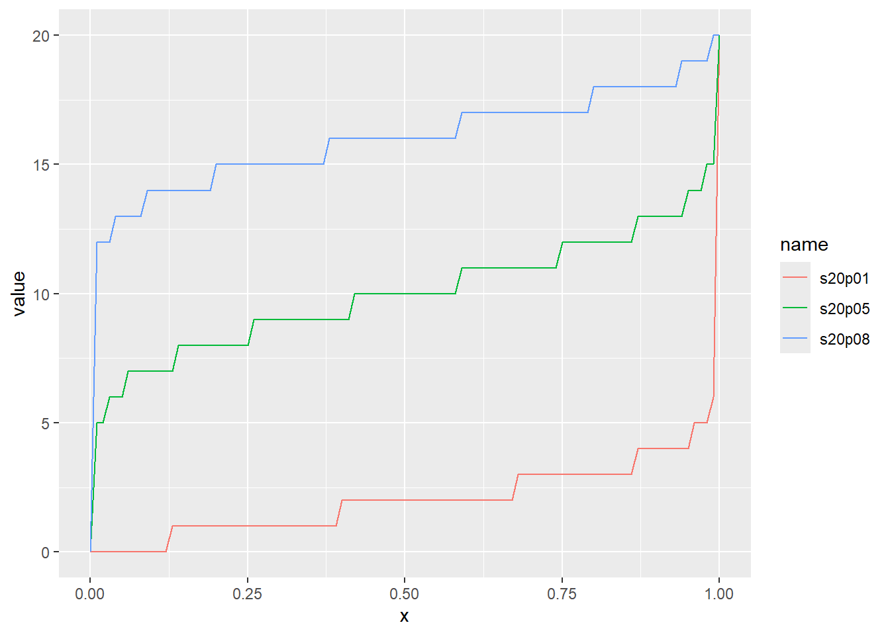](chapter24_files/figure-html/unnamed-chunk-12-1.png)

箱ひげ図の記述する専用の関数として、Rには`boxplot`関数が設定されています。`boxplot`関数を用いた場合、数値ベクターを引数に取り、その数値ベクターに対応した箱ひげ図を記述することができます。`plot`関数と同様に因子で分割した箱ひげ図を記載することもできますが、分割する場合、`boxplot`関数では引数をformulaで設定する必要があります。

``` downlit
boxplot(iris$Sepal.Length) # 数値ベクターを引数に取ることもできる
```

[](chapter24_files/figure-html/unnamed-chunk-13-1.png)

``` downlit
boxplot(iris$Sepal.Length ~ iris$Species) # plot関数とは異なり、formulaを引数に取る
```

[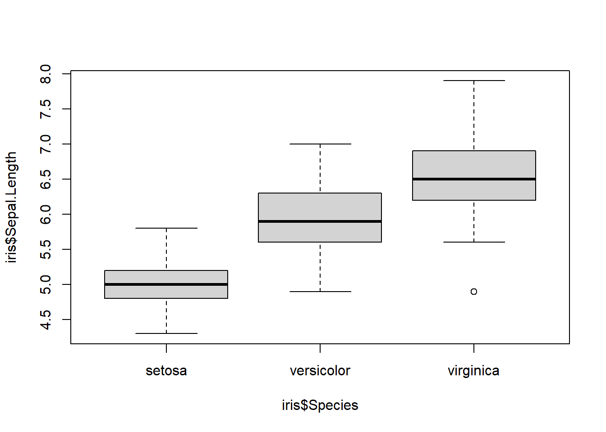](chapter24_files/figure-html/unnamed-chunk-13-2.png)

### 24.2.5 因子と棒グラフ

`plot`関数では因子ベクターを一つだけ引数に取ることもできます。因子を引数に取った場合には、各レベルの要素の数（度数）を棒グラフで表示します。

``` downlit
fct <- sample(c("dog", "cat", "pig"), 50, replace = T) |> factor()
fct |> summary()
## cat dog pig 
##  16  17  17

plot(fct)
```

[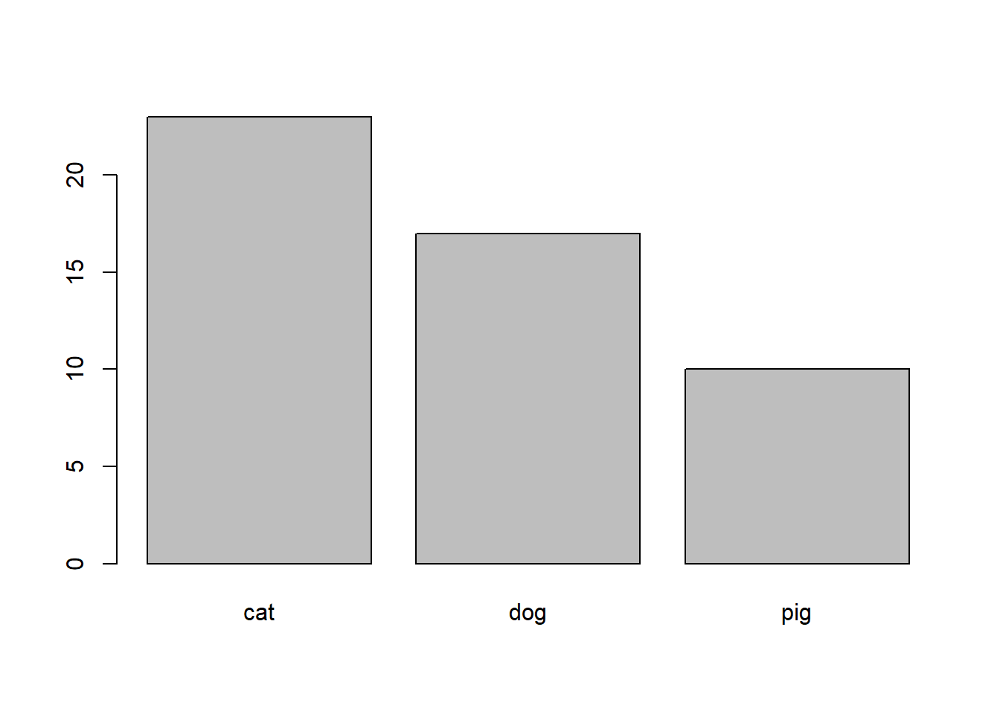](chapter24_files/figure-html/unnamed-chunk-14-1.png)

`plot`関数の引数に2つの因子を取ると、**モザイク図（mosaic plot）**が表示されます。棒グラフの横幅、縦軸ともに各レベルの要素の数を反映しています。

``` downlit
# シロイヌナズナの場所ごとの集団と発芽の方法の関係
plot(lme4::Arabidopsis$popu, lme4::Arabidopsis$status)
```

[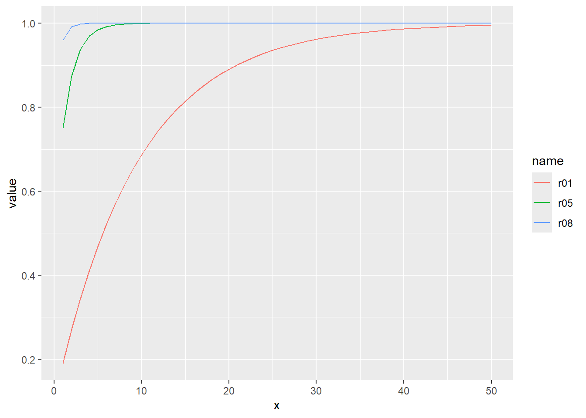](chapter24_files/figure-html/unnamed-chunk-15-1.png)

### 24.2.6 確率密度

Rでは、データの分布をカーネル密度に変換し、プロットすることもできます。`density`関数は数値データをカーネル密度に変換する関数です。`density`関数の返り値を`plot`関数の引数に取ると、カーネル密度に変換した数値データの分布が線グラフで表示されます。

``` downlit
iris$Sepal.Length |> density() |> plot()
```

[](chapter24_files/figure-html/unnamed-chunk-16-1.png)

### 24.2.7 関数の作図

`plot`関数を用いれば、定義した関数をそのままグラフにすることもできます。`function`で関数を作成し、この関数を`plot`関数の引数に取ると、`plot`関数は作成した関数の引数をx軸に、関数の返り値をy軸に取った線グラフを作成します。

``` downlit
fun1 <- function(x){sin(x)}
plot(fun1, xlim = c(-pi, pi)) # xlimはx軸の範囲を指定する引数
```

[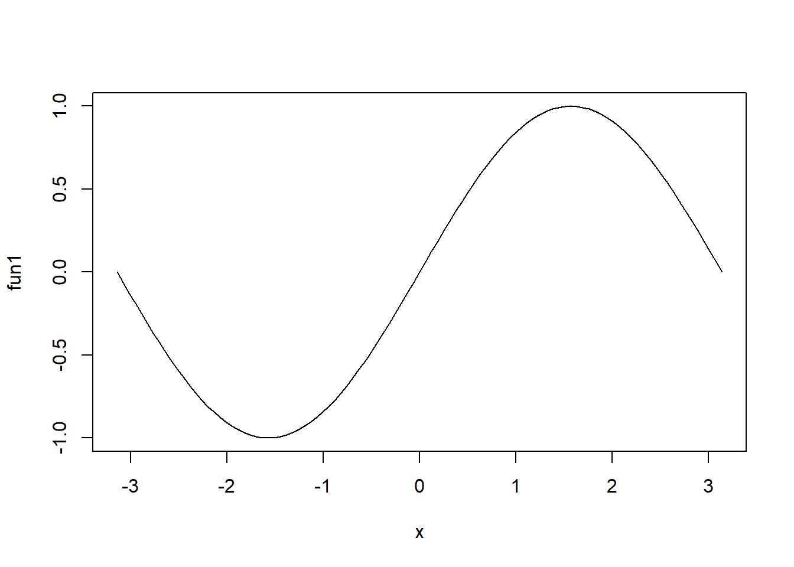](chapter24_files/figure-html/unnamed-chunk-17-1.png)

``` downlit
plot(\(x){cos(x)}, xlim = c(-pi, pi)) # \で作成した無名関数も使える
```

[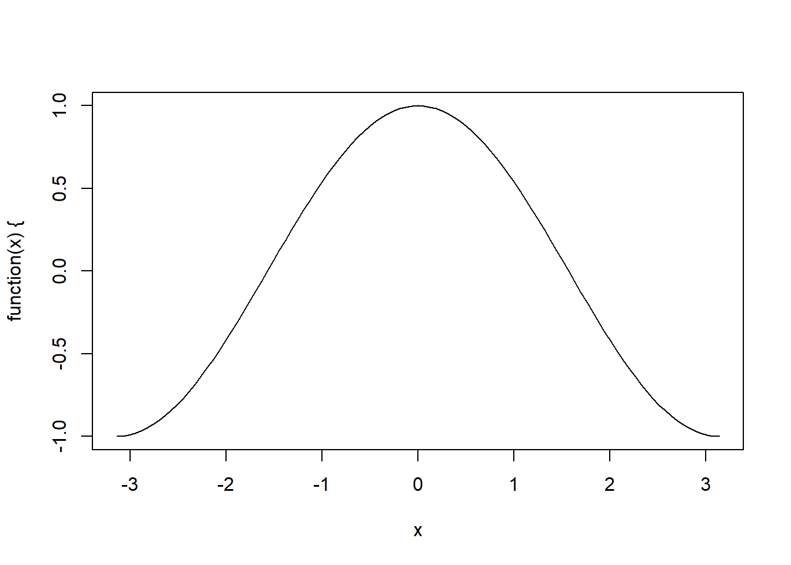](chapter24_files/figure-html/unnamed-chunk-17-2.png)

同様の関数の作図は、`curve`関数を用いても記述することができます。

``` downlit
curve(sin, -pi, pi) # sin関数を-piからpiまで記述
```

[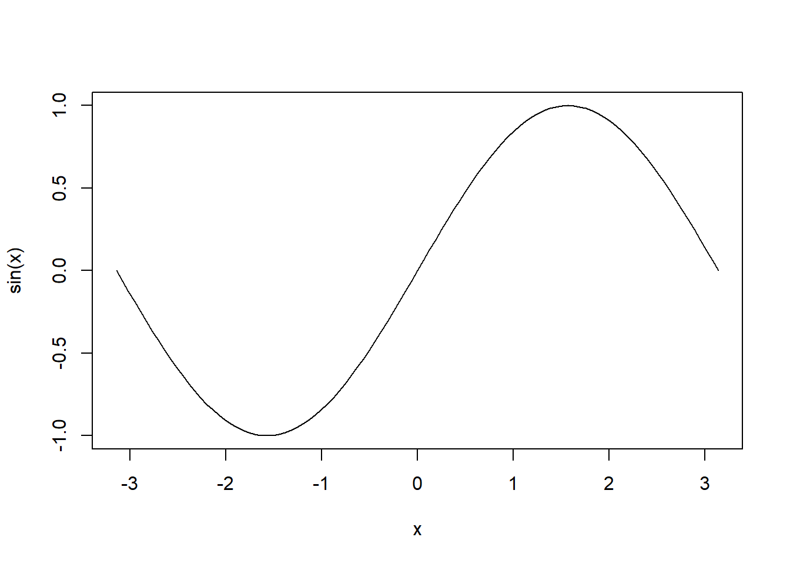](chapter24_files/figure-html/unnamed-chunk-18-1.png)

### 24.2.8 ステップ関数（step functions）

`stepfun`関数は2つの数値ベクターからステップ関数という、階段状になった値の列を返す関数です。引数`x`がx軸上の位置、引数`y`はy軸上の値を示します。この`stepfun`関数の返り値を`plot`関数の引数に取ると、ステップ関数が表示されます。

``` downlit
x <- 1:10
y <- sample(c(1:3), 11, replace = T)
stepfun(x, y) # stepfunクラスのオブジェクトを作成
## Step function
## Call: stepfun(x, y)
##  x[1:10] =      1,      2,      3,  ...,      9,     10
## 11 plateau levels =      1,      2,      2,  ...,      1,      2

stepfun(x, y) |> plot()
```

[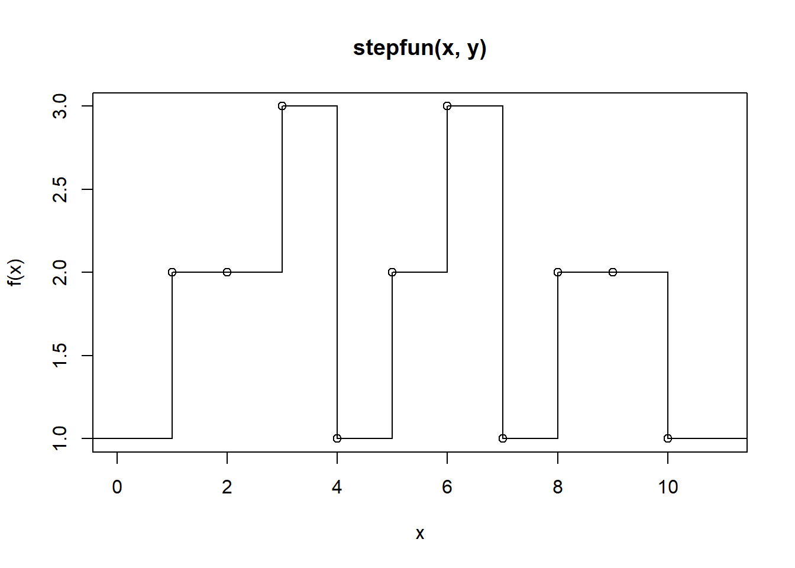](chapter24_files/figure-html/unnamed-chunk-19-1.png)

### 24.2.9 plot関数の引数一覧

`plot`関数では、x軸・y軸を示す引数以外にも、軸ラベルやグラフの主題、散布図の点の形やグラフの表記のタイプなど、様々なグラフの要素を調整するための引数を指定することができます。引数の一覧を以下の表2に示します。

| 引数 | 引数のデータ型 | 引数の意味 | 指定の例 |
|:---|:---|:---|:---|
| type | 文字列 | プロットの形式 | type =“l” や type=“p”など |
| col | 文字列 | プロットの色 | col=“red”やcol=“#111111”など |
| bg | 文字列 | 背景色 | bg=“red” |
| pch | 数値 | プロットの形 | pch=2 |
| cex | 数値 | プロットの大きさ | cex=2 |
| lty | 数値 | 線の種類（実線、点線など） | lty = 1 |
| lwd | 数値 | 線の太さ | lwd=2 |
| xlim | 数値ベクター | x軸の範囲指定 | xlim=c(0, 10) |
| ylim | 数値ベクター | y軸の範囲指定 | ylim=c(0, 10) |
| log | 文字列 | 軸の対数変換 | “x”, “y”, “xy” |
| main | 文字列 | グラフの主題 | main=“irisのグラフ” |
| sub | 文字列 | グラフの副題 | sub=“Petal.Lengthのグラフ” |
| xlab | 文字列 | x軸の軸ラベル | xlab=“Petal.Length” |
| ylab | 文字列 | y軸の軸ラベル | ylab=“Petal.Width” |
| ann | 論理型 | ラベルを表記するか | ann = FALSE |
| axes | 論理型 | 軸を表記するか | axis = FALSE |
| frame.plot | 論理型 | グラフの枠を表記するか | frame.plot = FALSE |
| panel.first | expression | グリッド表示を下から重ねる | panel.first=grid() |
| panel.last | expression | グリッド表示を上から重ねる | panel.last=grid() |
| asp | 数値 | xとyのアスペクト比 | asp=5 |
| xgap.axis | 数値 | x軸ラベルの記載間隔 | xgap.axis=10 |
| ygap.axis | 数値 | y軸ラベルの記載間隔 | ygap.axis=10 |

表2：plot.default関数の引数一覧 {.caption-top .table .table-sm .table-striped .small}

`plot`関数の`type`引数には、以下の文字列を設定できます。設定する文字列の一覧を以下の表3に示します。

| type引数の指定 | 意味                       |
|:---------------|:---------------------------|
| “p”            | 点（points）               |
| “l”            | 線（lines）                |
| “b”            | 点と線                     |
| “c”            | 線（点の部分は空白になる） |
| “o”            | 点と線（点に線が重なる）   |
| “s”            | ステップ関数               |
| “h”            | ヒストグラム風の棒グラフ   |
| “n”            | 何も表示しない             |

表3：type引数の一覧 {.caption-top .table .table-sm .table-striped .small}

`plot`関数の`pch`引数には、数値（または文字列）を設定します。数値によって、プロットされる点の形が変化します。指定できる点の形は以下の通りです。

[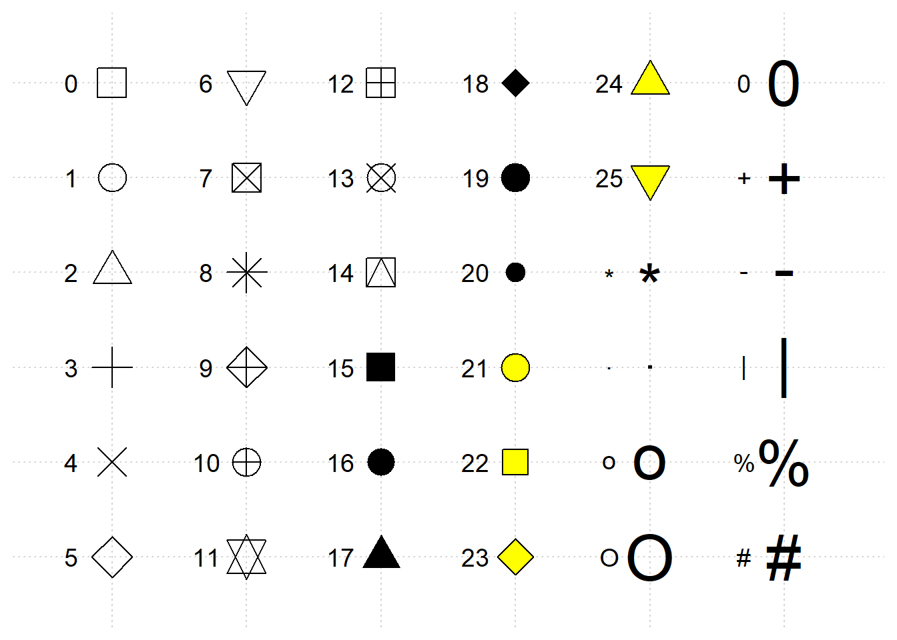](chapter24_files/figure-html/unnamed-chunk-22-1.png)

### 24.2.10 plot関数：ifelse関数での色や形の設定

plot関数の引数には、`ifelse`関数を用いて、ある条件の時のプロットの色や形、大きさなどを設定することもできます。以下の例では、種が`versicolor`なら赤、それ以外なら青、種が`setosa`なら〇、それ以外なら△、`Sepal.Width > (Sepal.Length - 2.5)`が`TRUE`ならプロットのサイズは`1.5`、`FALSE`なら`1`となるように設定しています。

``` downlit
plot(
  x = iris$Sepal.Length, 
  y = iris$Sepal.Width, 
  # versicolorは赤、それ以外は青
  col = ifelse(iris$Species == "versicolor", "red", "blue"),
  # setosaなら〇、それ以外は△
  pch = ifelse(iris$Species == "setosa", 1, 2),
  # iris$Sepal.Width > (iris$Sepal.Length - 2.5)がTRUEならサイズを1.5にする
  cex = ifelse(iris$Sepal.Width > (iris$Sepal.Length - 2.5), 1.5, 1)
)
```

[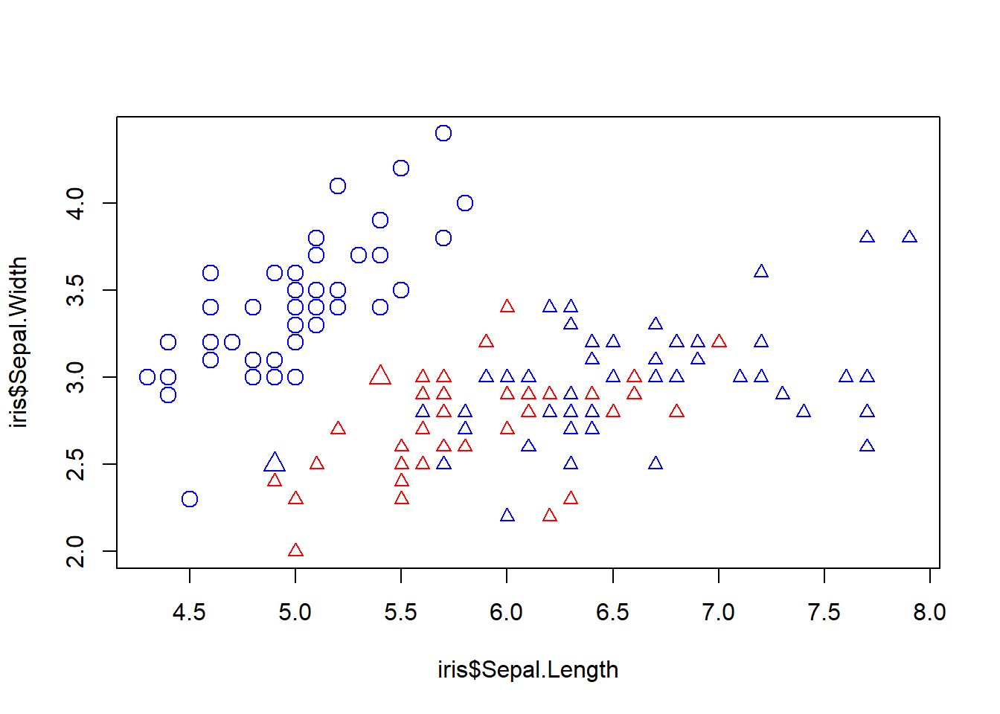](chapter24_files/figure-html/unnamed-chunk-23-1.png)

また、一部の引数は数値で設定することができます。例えば`cex`（プロットのサイズ）は数値で指定し、値に従ったプロットのサイズでグラフを表示することもできます。

``` downlit
plot(
  x = iris$Sepal.Length, 
  y = iris$Sepal.Width,
  # Petal.Length/3でプロットのサイズを描画する
  cex = iris$Petal.Length/3 
)
```

[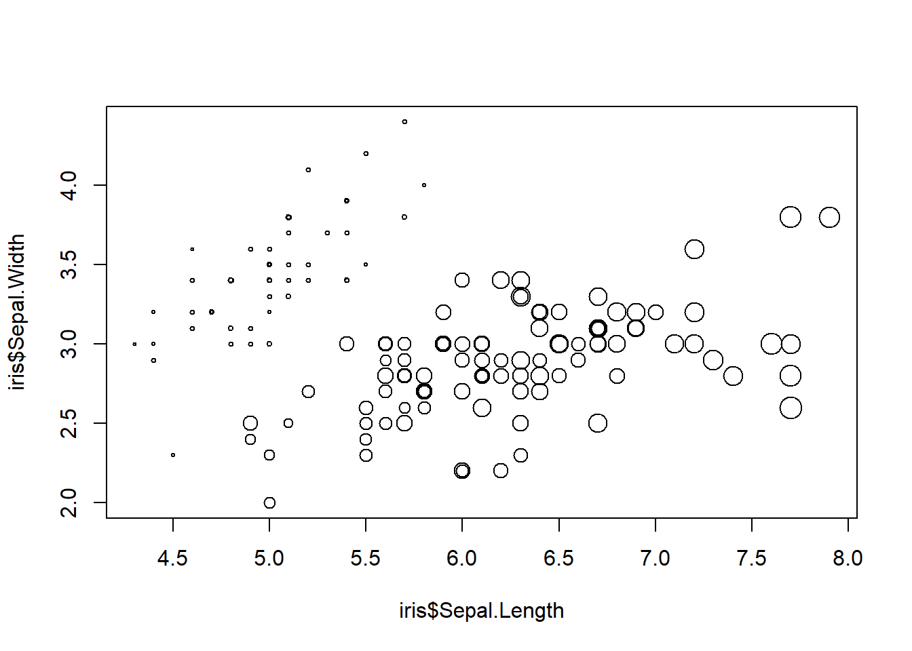](chapter24_files/figure-html/unnamed-chunk-24-1.png)

## 24.3 hist関数：ヒストグラム

データの分布を棒グラフで示す**ヒストグラム**を表示する場合には、`hist`関数を用います。`hist`関数は数値のベクターを引数に取り、数値ごとの度数を棒グラフにした形で表示します。このとき、度数は数値の等間隔の範囲ごとに数えます。この等間隔の範囲（棒）の数のことを、binsやbreaksと呼びます。`hist`関数では、`breaks`引数でこのbreaks、棒グラフの棒の数を指定します。また、`freq`引数を`FALSE`に指定すると、縦軸を確率密度で表示することができます。

``` downlit
hist(iris$Sepal.Length) # デフォルトではちょうどよい感じで分割してくれる
```

[](chapter24_files/figure-html/unnamed-chunk-25-1.png)

``` downlit
hist(iris$Sepal.Length, freq = FALSE, breaks = 15) # 縦軸は確率密度、15分割したヒストグラム
```

[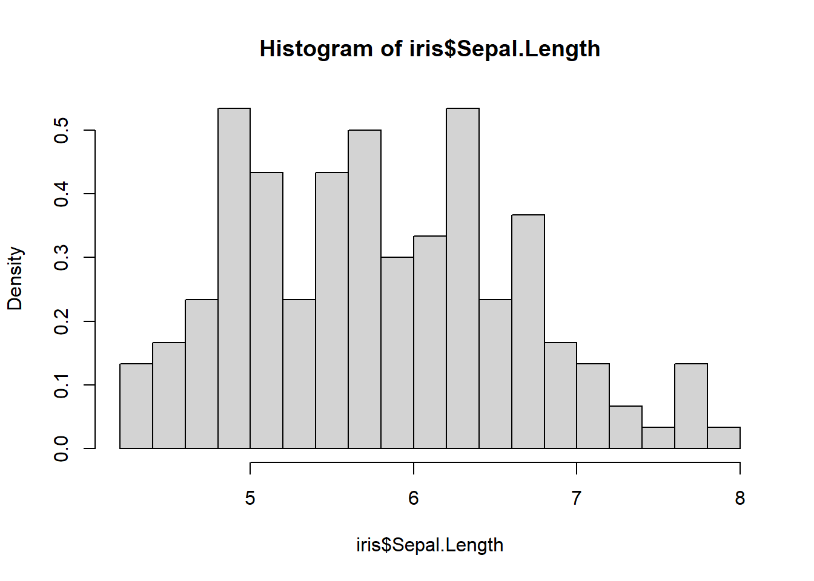](chapter24_files/figure-html/unnamed-chunk-25-2.png)

`breaks`は数値ベクターで指定することもできます。数値で指定した場合には、数値の間隔が棒グラフの幅となり、数値ベクターの長さ-1が棒の数となります。

``` downlit
hist(iris$Sepal.Length, breaks = c(4, 5, 6, 8))
```

[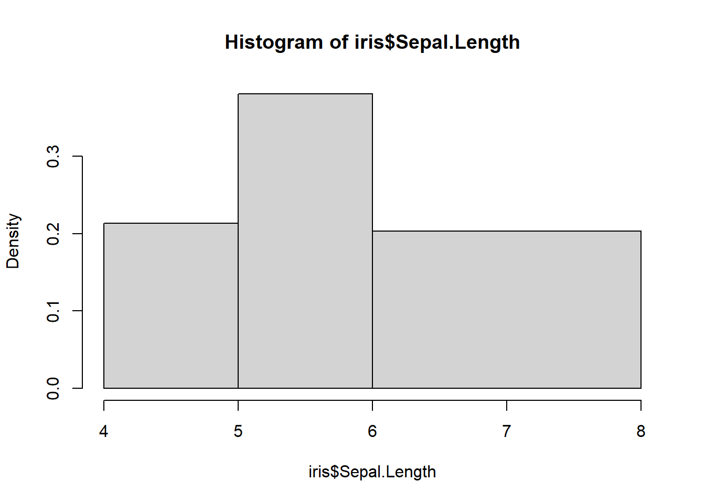](chapter24_files/figure-html/unnamed-chunk-26-1.png)

## 24.4 coplot関数

`coplot`関数は、2数の関係を示すグラフを、因子で分割して表示するための関数です。`coplot`関数ではformulaでx軸、y軸の数値を指定します（「`y軸の値 ~ x軸の値`」の形で指定）。グラフを分割するための因子は、formulaの後に、`|`を挟んで指定します。

``` downlit
coplot(iris$Sepal.Length ~ iris$Sepal.Width | iris$Species)
```

[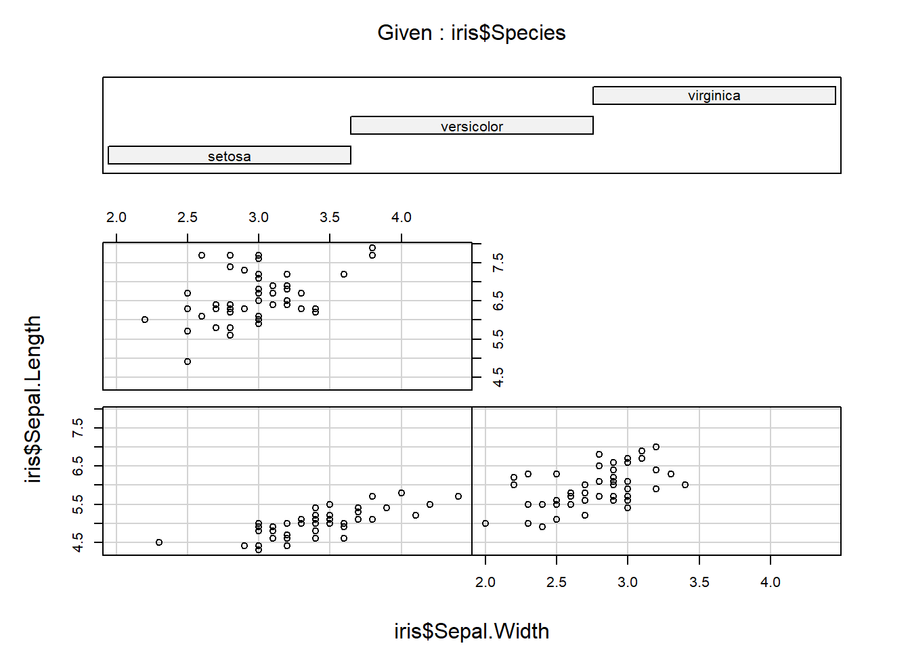](chapter24_files/figure-html/unnamed-chunk-27-1.png)

## 24.5 qqプロット

数値が正規分布しているのか確認するために、正規分布に従った分位点とデータの分位点の関係をプロットするグラフを、**qqプロット**と呼びます。qqプロットでは、データが正規分布する場合、点が概ね直線上に乗ります。

Rでqqプロットを表示するための関数が、`qqnorm`関数です。`qqnorm`関数は数値ベクターを引数に取り、縦軸にデータの分位点、横軸に正規分布を仮定したときの分位点を示します。

``` downlit
qqnorm(iris$Sepal.Length) # 概ね正規分布するときは、直線に乗る
```

[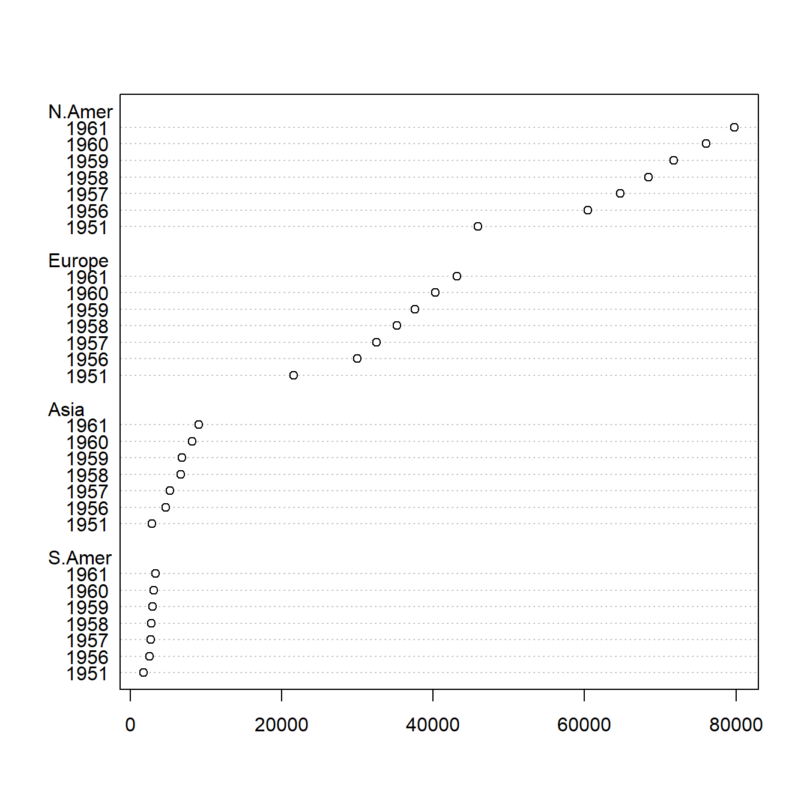](chapter24_files/figure-html/unnamed-chunk-28-1.png)

``` downlit
qqnorm(runif(1000, 0, 1)) # 一様分布すると、直線に乗らない
```

[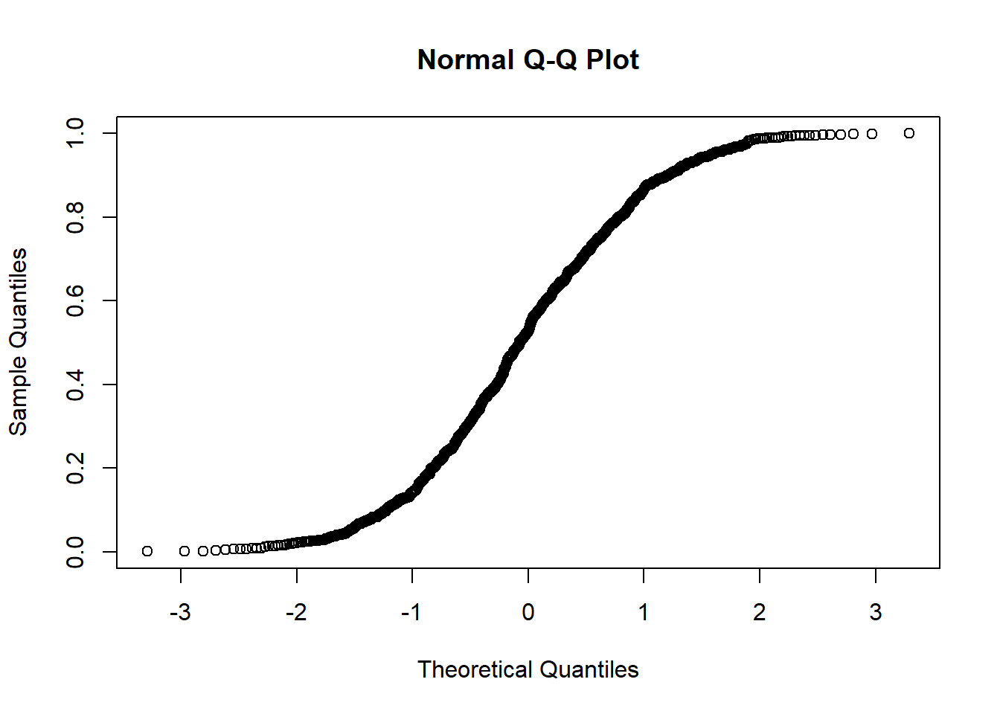](chapter24_files/figure-html/unnamed-chunk-28-2.png)

正規分布ではなく、自分で指定した分布との比較を行いたい場合や、2つの数値の間での分布が一致するかどうか確かめるために用いるのが、`qqplot`関数です。`qqplot`関数は引数として数値ベクターを2つ取ります。`qqplot`関数では、2つの数値ベクターの長さが同じである必要はありません。

``` downlit
qqplot(iris$Sepal.Length, iris$Sepal.Width) # どちらも同じ分布に近いため、直線上に乗る
```

[](chapter24_files/figure-html/unnamed-chunk-29-1.png)

``` downlit
qqplot(iris$Sepal.Length, rchisq(1000, 5)) # Sepal.Lengthはカイ二乗分布とは分布が異なるため、直線に乗らない
```

[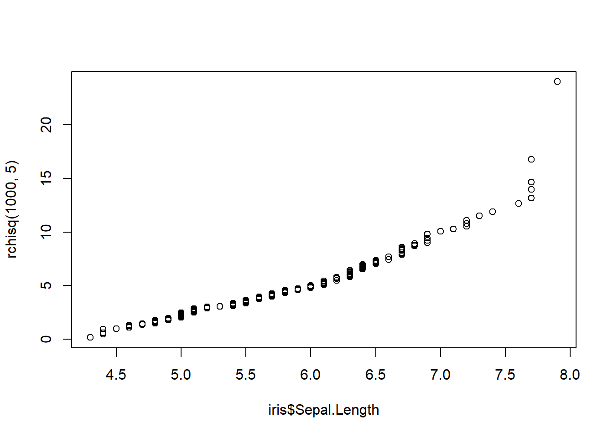](chapter24_files/figure-html/unnamed-chunk-29-2.png)

## 24.6 dotchart関数：ドットプロット

`dotchart`関数は、クリーブランドドットプロットと呼ばれるグラフを作成するための関数です。このグラフは、カテゴリごとの値を点で示したもので、カテゴリや因子間で値を比較するときに用いられるものです。

``` downlit
dotchart(WorldPhones[, 1:4])
```

[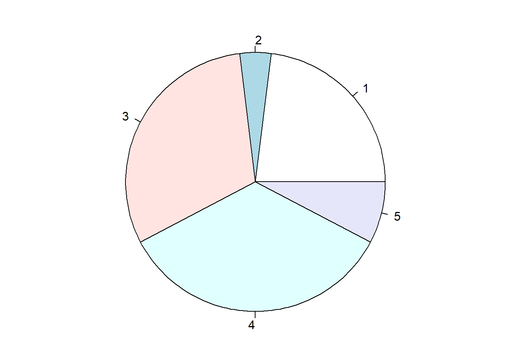](chapter24_files/figure-html/unnamed-chunk-30-1.png)

## 24.7 barplot関数：棒グラフ

`barplot`関数は棒グラフを表示するための関数です。`barplot`関数は数値ベクターを引数に取り、ベクターのそれぞれの値を棒グラフで表示します。引数を行列で与えると、積み上げ式棒グラフを作図することもできます。

``` downlit
v <- c(first = 1, second = 2, third = 3)
barplot(v)
```

[](chapter24_files/figure-html/unnamed-chunk-31-1.png)

``` downlit
v2 <- c(first = 2, second = 4, third = 6)
cbind(v, v2) # 行列
##        v v2
## first  1  2
## second 2  4
## third  3  6

barplot(cbind(v, v2)) # 積み上げ式棒グラフ
```

[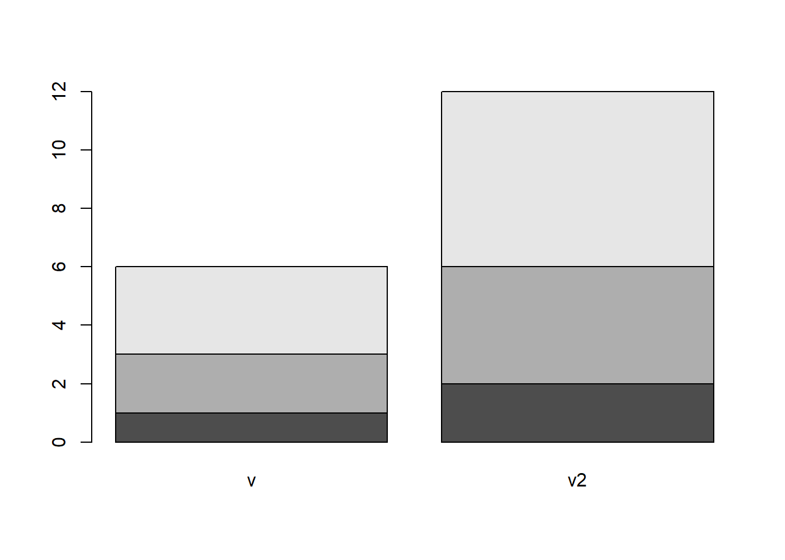](chapter24_files/figure-html/unnamed-chunk-31-2.png)

## 24.8 pie関数：円グラフ

`pie`関数は円グラフを表示するための関数です。`pie`関数も`barplot`関数と同じく、数値のベクターを引数に取り、数値を反映した円グラフを表示します。ただし、この[`pie`関数のヘルプ](https://search.r-project.org/R/refmans/graphics/html/pie.html)にも記載されている通り（「*Pie charts are a very bad way of displaying information.*」）、円グラフは理解しにくく、良いグラフであるとは考えられていません。円グラフで表示せずにドットプロット、棒グラフを用いて示した方がよいでしょう。

``` downlit
(v <- sample(1:10, 5))
## [1] 10  5  3  1  8
par(mar = c(0.5, 0.5, 0.5, 0.5))
pie(v)
```

[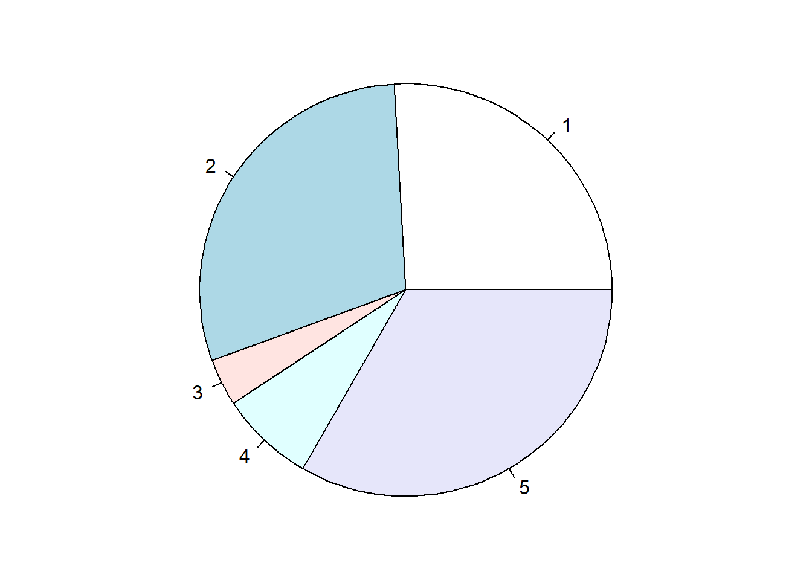](chapter24_files/figure-html/unnamed-chunk-32-1.png)

## 24.9 image関数：ヒートマップ

`image`関数は行列を引数に取り、行列の位置（行・列）とその値の関係を色で示したグラフを表示する関数です。このようなグラフは**ヒートマップ**と呼ばれます。

``` downlit
image(volcano) # 火山の緯度・軽度と標高の関係
```

[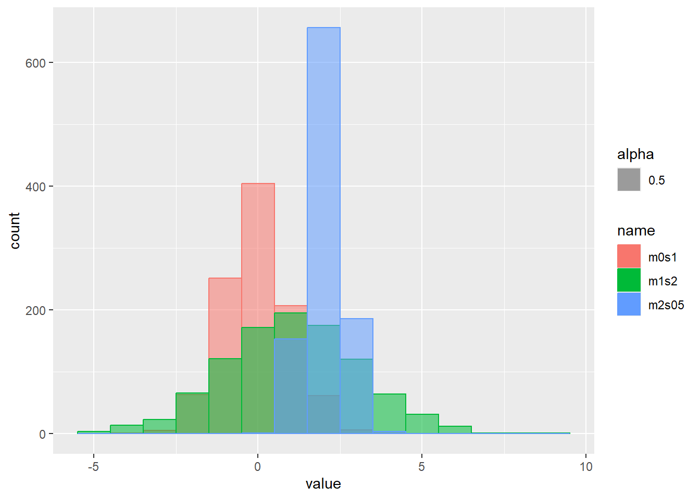](chapter24_files/figure-html/unnamed-chunk-33-1.png)

``` downlit
iris[,1:4] |> as.matrix() |> image() # 行列であればヒートマップにできる
```

[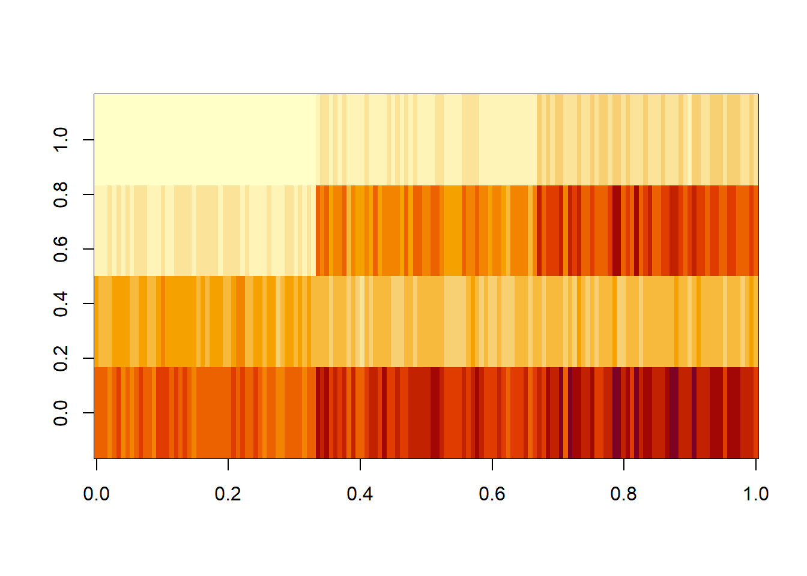](chapter24_files/figure-html/unnamed-chunk-33-2.png)

## 24.10 persp関数：3次元グラフ

`persp`関数は3次元グラフを作成するための関数です。`x`軸、`y`軸、`z`軸の値をそれぞれ数値ベクターとして引数に指定し、`theta`と`phi`の2つの引数で、3次元グラフを観察する視点を指定します。ただし、この`persp`関数では3次元グラフの視点を動かすのが難しいため、Rではかなり前から**[`rgl`パッケージ](https://dmurdoch.github.io/rgl/)** ([Murdoch and Adler 2023](#ref-rgl_bib))を用いて3次元グラフを描画するのが一般的です。

``` downlit
par(mar = c(0.5, 0.5, 0.5, 0.5))
persp(x = 1:nrow(volcano), y = 1:ncol(volcano), z = volcano, theta = 45, phi = 30, expand = 0.5)
```

[](chapter24_files/figure-html/unnamed-chunk-34-1.png)

## 24.11 rglパッケージ：3次元グラフ

`rgl`パッケージは、[OpenGL](https://www.opengl.org/) ([Woo et al. 1999](#ref-woo1999opengl))という、C言語の3Dグラフィックスライブラリを利用したRのグラフ作成パッケージです。`rgl`パッケージの関数群を用いることで、R上でマウスを使って視点をグリグリ動かすことができる3次元グラフを作成することができます。

``` downlit
pacman::p_load(rgl)
p_iris3d <- plot3d(iris$Sepal.Length, iris$Sepal.Width, iris$Petal.Length, col = as.numeric(iris$Species))

rglwidget(elementId = "plot3drgl")
```

> **TIP:**
>
> Rに限らず、3次元グラフを作成できると何か楽しいような気がします。しかし、データ解析においては3次元グラフではデータを理解しにくく、数値を直感的に比較することが困難です。「3次元グラフでなければ表現できない」などの非常に特別な場合を除けば、3次元グラフの利用は避けた方が良いでしょう。

## 24.12 ベン図

ベン図とは、以下のように集合の状態を表示するための図のことです。以下のベン図では、AとBの群の両方にある要素は3つ、Aのみにある要素は2つ、Bのみにあるものは3つであることを示しています。

[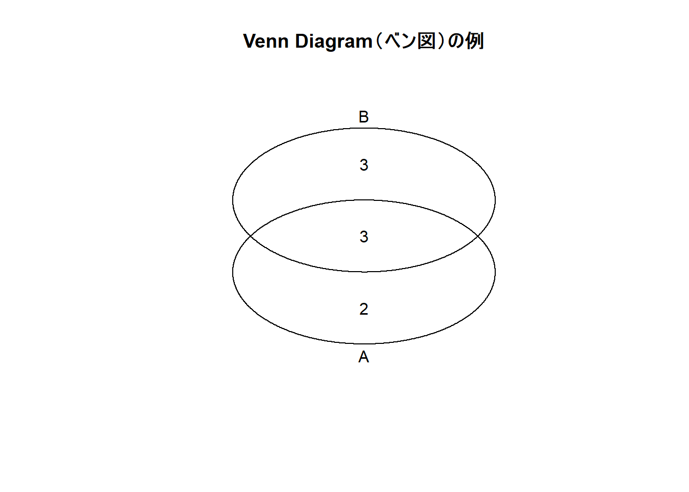](chapter24_files/figure-html/unnamed-chunk-36-1.png)

ベン図を描画する場合には、`gplots`パッケージ([Warnes et al. 2024](#ref-gplots_bib))の`venn`関数を用います。`venn`関数はリストを引数に取り、リストの各要素を集合としてベン図を描画します。

``` downlit
pacman::p_load(gplots)
venn(list(A = 1:10, B = 5:15, C = 10:20))
```

[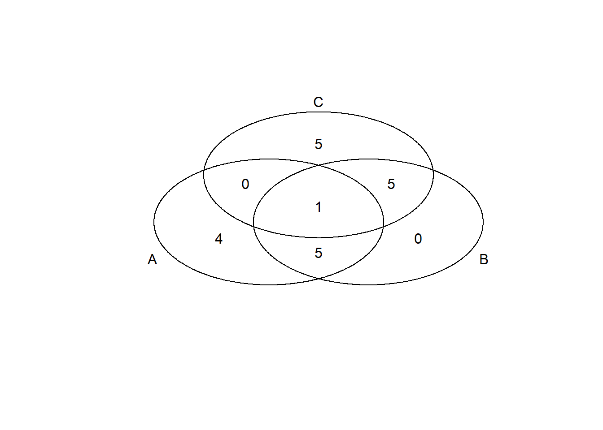](chapter24_files/figure-html/unnamed-chunk-37-1.png)

`venn`関数はリストの要素が5つまでのベン図を描画することができます。

``` downlit
venn(list(A=sample(1:10, 3), B=sample(1:10, 3), C=sample(1:10, 3), D=sample(1:10, 3), E=sample(1:10, 3)))
```

[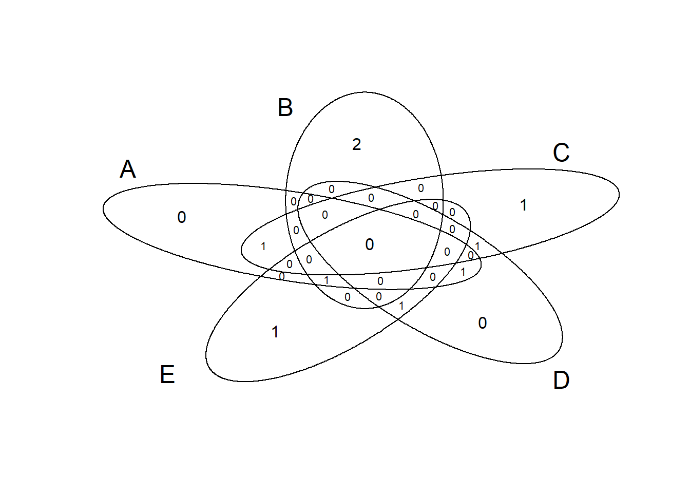](chapter24_files/figure-html/unnamed-chunk-38-1.png)

``` downlit
#要素が6つだとエラー（デバイスは表示される）
venn(list(A=sample(1:10, 3), B=sample(1:10, 3), C=sample(1:10, 3), D=sample(1:10, 3), E=sample(1:10, 3), G=sample(1:10, 3)))
```

[](chapter24_files/figure-html/unnamed-chunk-38-2.png)

    ## Error in `drawVennDiagram()`:
    ## ! Venn diagrams for  6  dimensions are not yet supported.

また、`DescTools`パッケージ([Signorell 2023](#ref-DescTools_bib))の`PlotVenn`関数でもベン図を描画することができます。`PlotVenn`関数も`venn`関数と同様にリストを引数に取ります。リストの要素の最大値が5つなのも`venn`関数と同じです。また、`col`引数に色を指定することで集合の色を変更することもできます。`col`引数には単に色をベクターで指定することもできますが、`SetAlpha`関数を用いて透明度（`alpha`）を指定することもできます。

``` downlit
pacman::p_load(DescTools)
PlotVenn(
  list(A = 1:10, B = 5:15, C = 10:20),
  col = SetAlpha(c("blue", "red", "green"), alpha = 0.3)) # 透明度を0.3に指定する
```

[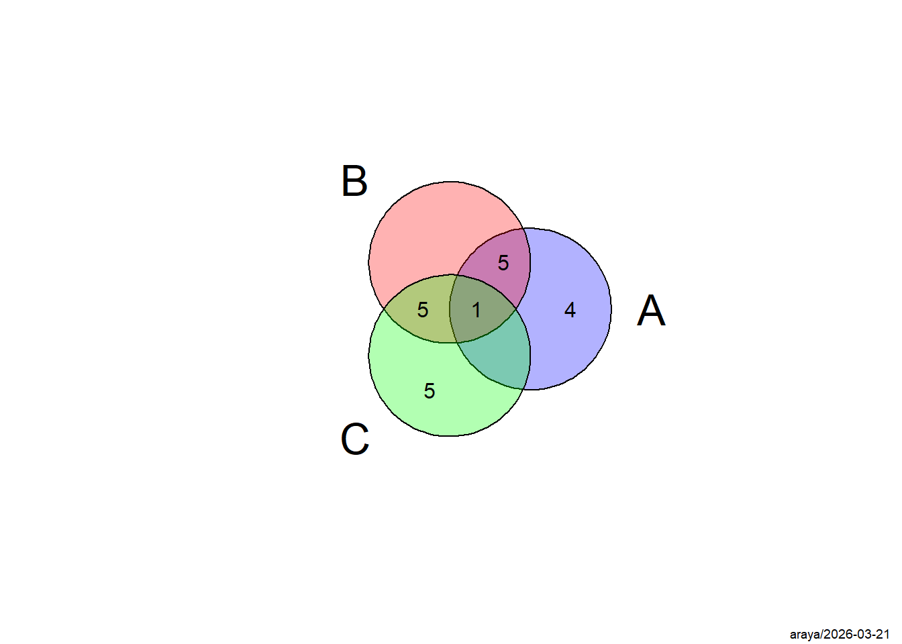](chapter24_files/figure-html/unnamed-chunk-39-1.png)

    ## [[1]]
    ##   A  AB ABC  BC   C 
    ##   4   5   1   5   5 
    ## 
    ## [[2]]
    ##       x     y set frq setx
    ## 1  3.50  0.00   A   4    A
    ## 2 -1.75  3.00   B  NA    B
    ## 3 -1.75 -3.00   C   5    C
    ## 4  1.00  1.75  AB   5   AB
    ## 5 -2.00  0.00  BC   5   BC
    ## 6  1.00 -1.75  AC  NA   AC
    ## 7  0.00  0.00 ABC   1  ABC

## 24.13 contour関数：等高線グラフ

`contour`関数は`image`関数と同様に行列を引数に取り、x軸に列、y軸に行、高さとして行列の値を用いた等高線グラフを作成するための関数です。

``` downlit
contour(volcano)
```

[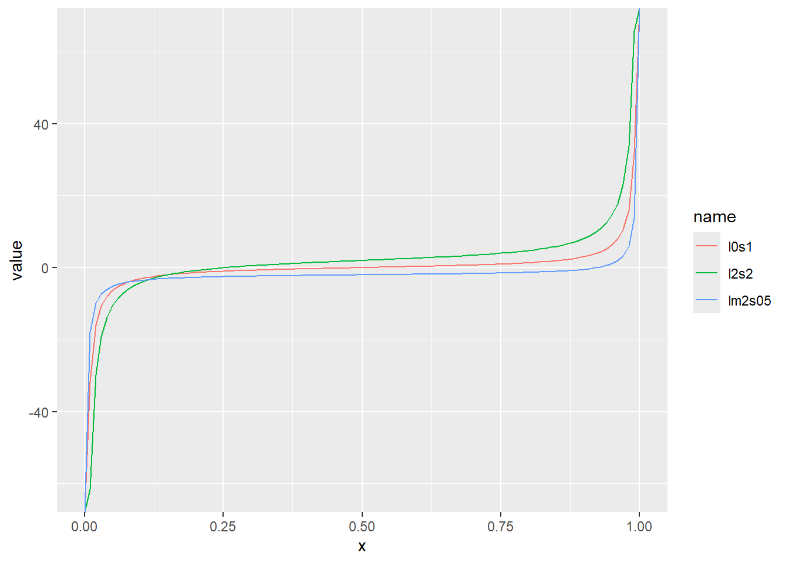](chapter24_files/figure-html/unnamed-chunk-40-1.png)

`filled.contour`関数を用いると、等高線に加えて、`image`関数と同様の色での表現を加えることができます。

``` downlit
filled.contour(volcano)
```

[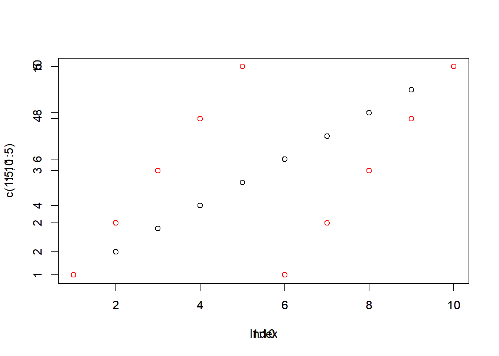](chapter24_files/figure-html/unnamed-chunk-41-1.png)

## 24.14 デバイス

RStudioを用いるときにはあまり意識する必要がない概念ですが、R GUIを用いてグラフを作成するときには、**デバイス**というものを理解することが重要となります。デバイスとは、グラフを描画するときの「キャンパス」に当たるもので、この「キャンパス」にグラフを描画して、「キャンパス」を表示したり、PDFやJEPGのようなファイル形式として出力したりすることができます。デバイスは、絵を描く時に「キャンパス」を複数準備することができるのと同じように、複数準備することができます。また、グラフを描画したデバイス上に、もう一枚グラフを重ね書きすることもできます。

上記の高レベルグラフィック関数は、呼び出した際に自動的にデバイスを作成し、そのデバイス上にグラフを描画、表示しています。

デバイスを作成する関数が、`dev.new`関数です。`dev.new`関数を引数なしで指定することで、新しいデバイスを作成することができます。この新しく作成したデバイスには何も描画されていません。`dev.new`関数を呼び出すたびに、新しいデバイスが作成されます。

``` downlit
dev.new() # device 2を作成
dev.new() # device 3を作成
dev.cur() # 現在のデバイス（3が返ってくる）
dev.list() # デバイスのリスト（2と3が返ってくる）
plot(1:10) # device 3にプロットを描画
```

作成したデバイスを閉じるための関数が、`dev.off`関数です。`dev.off`関数では、後に作成したデバイスから閉じていきます。ですので、上の例のように、2枚のデバイス（device 2 とdevice 3）を作成していた場合には、`dev.off`関数によりまずdevice 3 が閉じられて、次に`dev.off`関数を呼ぶとdevice 2 が閉じ、すべてのデバイスが閉じられることになります。

複数のデバイスが存在している時に、すべてのデバイスを閉じる関数が、`graphics.off`関数です。`dev.new`関数で複数のデバイスを開いていても、`graphics.off`関数を呼び出せばすべてのデバイスを一度に閉じることができます。

``` downlit
dev.off() # device 3を閉じる
dev.off() # device 2を閉じる
graphics.off() # デバイスをすべて閉じる
```

### 24.14.1 OSごとのデバイス

Rでは、OS（Windows、UNIX、MacOX）ごとのデバイス呼び出し関数が設定されています。Windowsでは`windows`関数、UNIXでは`X11`関数、MacOXでは`quartz`関数が新しいデバイスを作成する際に用いられます。

``` downlit
windows() # windowsでのデバイス作成
dev.off()

X11() # UNIXでのデバイス作成
dev.off()

quartz() # Macでのデバイス作成
dev.off()
```

## 24.15 グラフをファイルに保存する

デバイスには、pdfやtiffのような、画像に関するファイルを作成する機能を持つものもあります。例えば`pdf`関数は引数にファイル名を取るデバイス作成関数で、そのデバイスを引数で指定したファイル名で保存する関数です。デバイスが開いている間は、そのPDFファイルを開いている状態になっており、Windowsなどからアクセスすることはできません。したがって、PDFファイルが完成するのは、**そのデバイスを閉じた時**になります。

``` downlit
pdf(file = "filename.pdf") # PDFファイルをデバイスに設定
plot(1:10)
dev.off() # plotが保存されたpdfが作成される
```

Rには、`pdf`関数の他に、[postscriptファイル](https://www.adobe.com/jp/products/postscript.html)として保存するための`postscript`関数やtiffファイルとして保存するための`tiff`関数など、グラフをファイルとして保存するための複数の関数が設定されています。

以下の表4に、Rでのデバイス操作に関する関数の一覧を示します。

| 関数         | 関数の意味                           |
|:-------------|:-------------------------------------|
| dev.new      | デバイスを作成する                   |
| windows      | デバイスを作成する（Windows）        |
| X11          | デバイスを作成する（UNIX）           |
| quartz       | デバイスを作成する（Mac）            |
| pdf          | PDFデバイスを作成する                |
| postscript   | postscriptデバイスを作成する（.eps） |
| bitmap       | bmpデバイスを作成する                |
| tiff         | tiffデバイスを作成する               |
| dev.cur      | 現在のデバイスを返す                 |
| dev.list     | デバイスの一覧を返す                 |
| dev.off      | デバイスを閉じる                     |
| graphics.off | デバイスをすべて閉じる               |

表4：デバイス操作に関する関数の一覧 {.caption-top .table .table-sm .table-striped .small}

また、Rstudioでは、右下のタイルに表示されたグラフの上部にある、『Export』を選択して表示されているグラフを保存することができます。

[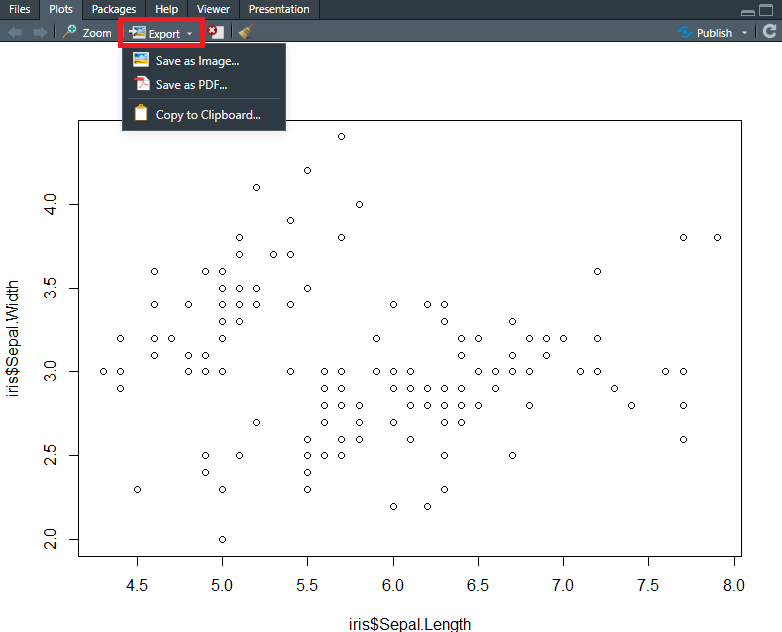](./image/save_plot_Rstudio.png "Rstudioでのグラフの保存")

Rstudioでのグラフの保存

## 24.16 グラフの重ね書き

同じデバイス上に2つのグラフを重ね書きする場合には、「`par(new = T)`」を2つの高レベルグラフィック関数の間に置きます。この「`par(new = T)`」は、デバイスは以前にグラフを描画したものと同じものを利用して、グラフを重ね書きすることを指示するための関数です。ただし、この重ね書きでは、プロットの**横軸と縦軸のレンジが同じになるよう調整はしてくれない**ので、高レベルグラフィック関数内で軸のレンジ等をあらかじめ設定する必要があります。

``` downlit
plot(1:10)
par(new = T)
plot(1:10, c(1:5, 1:5), col = "red") # 軸がずれたグラフが重ね書きされる
```

[](chapter24_files/figure-html/unnamed-chunk-47-1.png)

`xlim`や`ylim`引数で軸のサイズを揃え、`xlab`、`ylab`、`main`などの引数を用いて軸ラベルやタイトルを消せば、グラフをきれいに重ね書きすることができます。

``` downlit
plot(1:10, ylim = c(1, 10))
par(new = T)
# 軸を合わせて、ラベルを消す
plot(
  1:10, c(1:5, 1:5), 
  col = "red",
  ylim = c(1, 10),
  xlab = "",
  ylab = "",
  main = ""
  ) 
```

[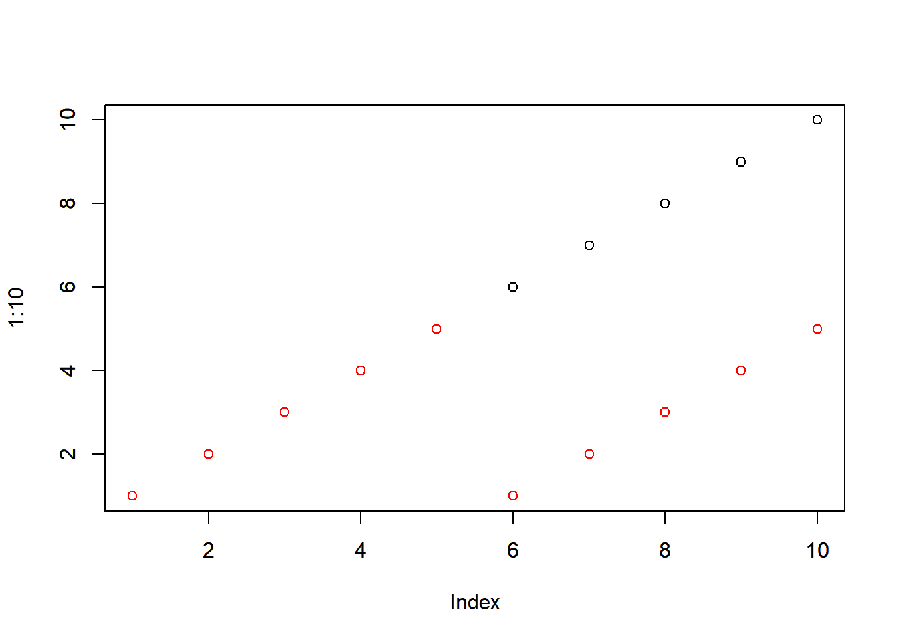](chapter24_files/figure-html/unnamed-chunk-48-1.png)

Murdoch, Duncan, and Daniel Adler. 2023. *Rgl: 3D Visualization Using OpenGL*. <https://CRAN.R-project.org/package=rgl>.

Sarkar, Deepayan. 2008. *Lattice: Multivariate Data Visualization with r*. Springer. <http://lmdvr.r-forge.r-project.org>.

Sievert, Carson. 2020. *Interactive Web-Based Data Visualization with r, Plotly, and Shiny*. Chapman; Hall/CRC. <https://plotly-r.com>.

Signorell, Andri. 2023. *DescTools: Tools for Descriptive Statistics*. <https://CRAN.R-project.org/package=DescTools>.

Vanderkam, Dan, JJ Allaire, Jonathan Owen, Daniel Gromer, and Benoit Thieurmel. 2018. *Dygraphs: Interface to ’Dygraphs’ Interactive Time Series Charting Library*. <https://CRAN.R-project.org/package=dygraphs>.

Warnes, Gregory R., Ben Bolker, Lodewijk Bonebakker, et al. 2024. *Gplots: Various r Programming Tools for Plotting Data*. <https://CRAN.R-project.org/package=gplots>.

Woo, Mason, Jackie Neider, Tom Davis, and Dave Shreiner. 1999. *OpenGL Programming Guide: The Official Guide to Learning OpenGL, Version 1.2*. Addison-Wesley Longman Publishing Co., Inc.

Back to top
