# 25  グラフ作成：低レベルグラフィック関数とグラフィックパラメータ

Code

[前章](chapter24.llms.md)で説明した高レベルグラフィック関数は、少数の引数を与えれば軸や点の位置、グラフの種類等をほぼ自動的に設定してくれる関数です。

一方で、**低レベルグラフィック関数**は、グラフ上に点や線、文字などを逐次追加していくための関数です。Rでは基本的には高レベルグラフィック関数を用いて大まかなグラフを作成し、追加で説明などを加えたいときには低レベルグラフィック関数を用います。低レベルグラフィック関数の一覧を以下の表1に示します。

| 関数名 | 関数の意味 |
|:---|:---|
| points(x, y) | x, yで指定した場所に点を追加 |
| text(x, y, label) | x, yで指定した場所にlabelで指定したテキストを追加 |
| abline(a, b) | 傾きb，切片aの線を追加 |
| abline(h) | hで指定したy軸の位置に横線を追加 |
| abline(v) | vで指定したx軸の位置に縦線を追加 |
| polygon(x, y) | x, yで指定した点をつなぐ形を追加 |
| rect(xleft, ybottom, xright, ytop) | 指定したサイズの長方形を追加 |
| symbols(x, y, circles) | x, yで指定した位置に図形（円など）を追加 |
| arrows(x0, y0, x1, y1) | x0, y0の位置からx1, y1の位置までの矢印を追加 |
| legend(x, y, legend) | 凡例を追加 |
| title(main, sub) | グラフのタイトルを追加 |
| axis(side) | sideで指定した位置に軸を追加 |
| grid() | グリッド線を追加 |

表1：低レベルグラフィック関数 {.caption-top .table .table-sm .table-striped .small}

## 25.1 points関数

`points`関数は、すでに存在するグラフに点を追加するための関数です。`points`関数は`x`と`y`の2つの引数を取り、その`x`、`y`が示す場所に点を追加します。

``` downlit
# 軸だけのプロット
plot(x = 0, y = 0, type = "n", xlab = "", ylab = "", xlim = c(-1, 2), ylim = c(-1, 2)) 
points(x = 0, y = 0) # x=0, y=0に点を追加
points(c(1, 2), c(1, 2), col = "red") # 複数の点を追加するときはベクターで指定する
```

[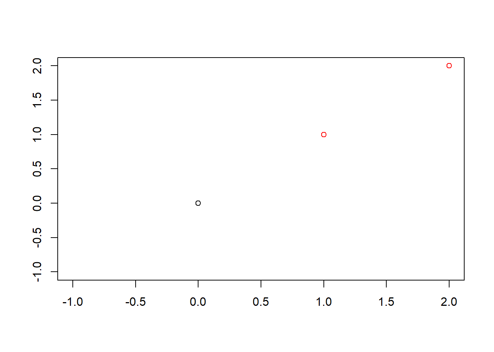](chapter25_files/figure-html/unnamed-chunk-2-1.png)

## 25.2 text関数

`text`関数は、グラフに文字を追加するための関数です。`text`関数は`x`、`y`と`label`の3つの引数を取り、その`x`、`y`が示す場所に`labels`で指定した文字列を追加します。

``` downlit
plot(x = 0, y = 0, type = "n", xlab = "", ylab = "")
text(x = 0, y = 0, labels = "added text") # x=0, y=0にテキストを追加
# 複数のテキストを表示するときはベクターで指定
text(x = c(-0.5, 0.5), y = c(-0.5, 0.5), labels = c("minus", "plus"))
```

[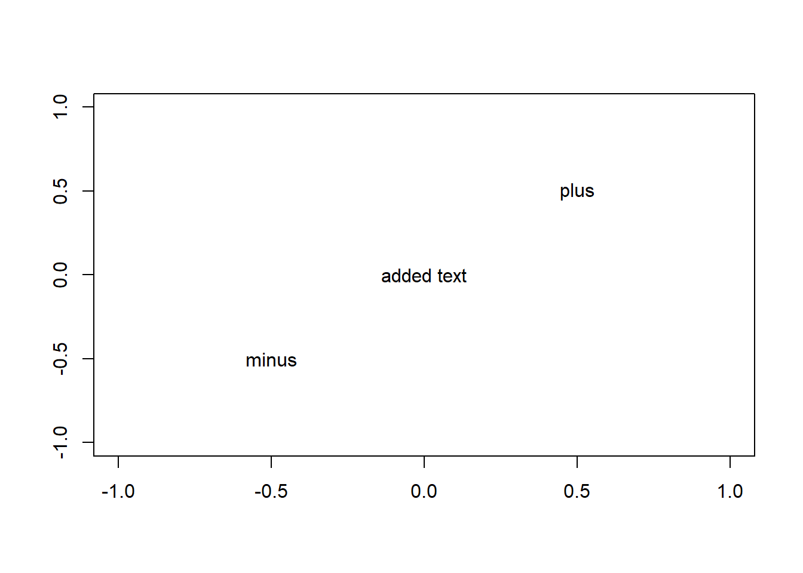](chapter25_files/figure-html/unnamed-chunk-3-1.png)

## 25.3 abline関数

`abline`関数はグラフに直線を追加するための関数です。`abline`関数の引数の指定方法には以下の4種類があります。

- 切片（引数`a`）と傾き（引数`b`）を指定する
- 横線のy軸の位置（引数`h`）を指定する
- 縦線のx軸の位置（引数`v`）を指定する
- 切片と傾きの2値のベクター（引数`coef`）を指定する

``` downlit
plot(x = 0, y = 0, type = "n", xlab = "", ylab = "")
abline(a = -0.5, b = 2, col = "red") # y = 2 x - 0.5 の線を追加
abline(h = 1, col = "blue") # y = 1 の水平線を追加
abline(v = -1, lty = 2, col = "darkgreen") # x = -1 の縦線（点線）を追加
abline(coef =c(0.5, 1), col  = "orange") # y = x + 0.5の線を追加
```

[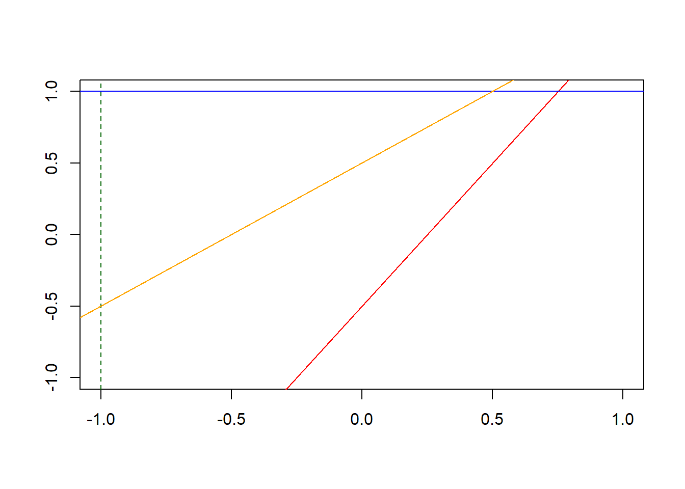](chapter25_files/figure-html/unnamed-chunk-4-1.png)

## 25.4 多角形・図形・矢印を追加

グラフ上に多角形や長方形、図形、矢印を追加する場合には、それぞれ`polygon`関数、`rect`関数、`symbols`関数、`arrows`関数を用います。

`polygon`関数は、引数`x`と`y`に数値のベクターを取り、そのベクターで指定した`x`、`y`の点を繋げた多角形を追加する関数です。始点と終点が一致していれば閉じた多角形を、一致していなければ閉じていない多角形を描画します。

`rect`関数は長方形を追加するための関数です。`rect`関数では、引数`xleft`、`xright`で長方形の左端、右端、引数`ybottom`、`ytop`で長方形の下端、上端を指定します。

`symbols`関数は引数`x`、`y`に指定した位置に図形を追加するための関数です。`symbols`関数で指定できる図形は、円（`circles`）、正方形（`squares`）、長方形（`rectangles`）、星（`stars`）、温度計（`thirmometers`）、箱ひげ図（`boxplot`）です。図形名を引数に取り、数値で図形の詳細を指定することでそれぞれの図形を描画できます。

`arrows`関数は矢印を追加するための関数です。`arrows`関数の始めの2つの引数（`x0`と`y0`）には矢印の始点の座標を、3つ目と4つ目の引数（`x1`と`y1`）には矢印の終点の座標をそれぞれ指定します。

``` downlit
par(mai = c(0.1, 0.1, 0.1, 0.1))
plot(x = 0, y = 0, type = "n", xlab = "", ylab = "", axes = FALSE)
polygon( # 多角形（星形）を追加
  x = c(0, 0.2245, 0.9511, 0.3633, 0.5878, 0, -0.5878, -0.3633, -0.9511, -0.2245, 0, 0.2245) * 0.25 - 0.5,
  y = c(1, 0.309, 0.309, -0.118, -0.809, -0.382, -0.809, -0.118, 0.309, 0.309, 1, 0.309)* 0.25 + 0.5, 
  col = "#48C9B0"
)
# 長方形を追加
rect(xleft = 0, xright = 0.5, ybottom = 0.25, ytop = 0.75, col = "#E74C3C")
# 円を追加
symbols(x = -0.5, y = -0.5, circles = 0.1, add = TRUE, inches = 0.3, col = "#5DADE2")
# 矢印を追加
arrows(x0 = 0.25, y0 = -0.75, x1 = 0.5, y1 = -0.5, col = "#A569BD")
```

[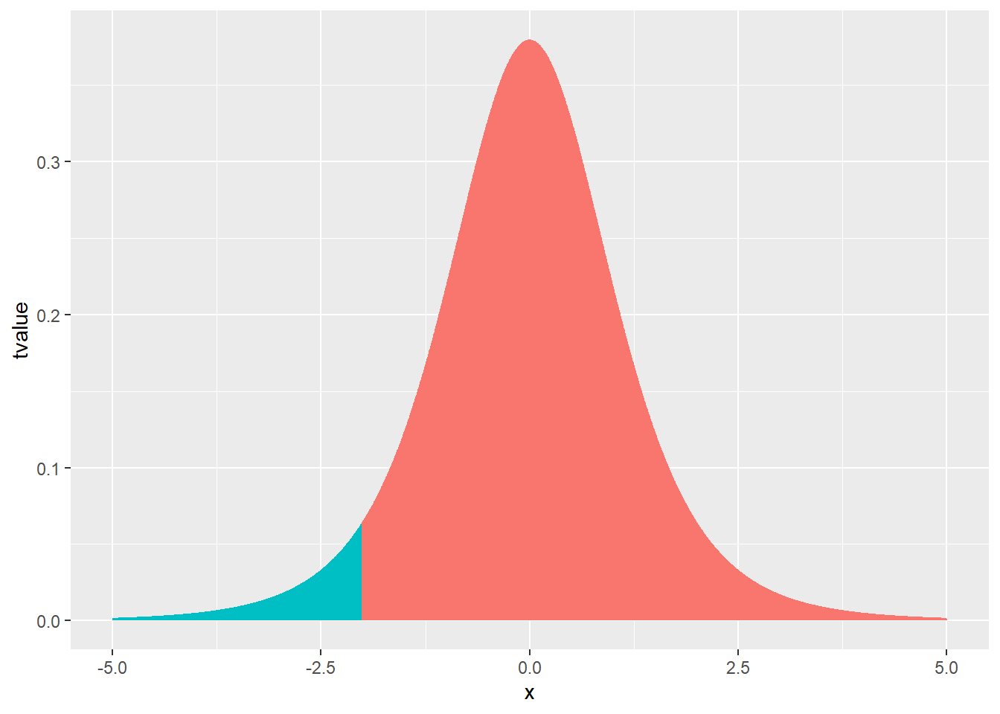](chapter25_files/figure-html/unnamed-chunk-5-1.png)

## 25.5 凡例とタイトルの追加

`legend`関数は凡例（legend）を追加するための関数です。`legend`関数は`x`、`y`、`legend`の3つの引数を取り、`x`と`y`には凡例の位置を、`legend`には凡例の説明を示す文字列をそれぞれ引数に取ります。

`title`関数はグラフのタイトルを追加するための関数です。`title`関数では、`main`と`sub`の2つの引数にそれぞれメインタイトル、サブタイトルを文字列で指定することで、それぞれのタイトルをグラフに追加することができます。

``` downlit
plot(x = 0, y = 0, type = "n", xlab = "", ylab = "")
# 凡例（legend）を追加
legend(x = 0.5, y = -0.5, legend = "point1", pch = 1)
# legendをベクターで指定すれば複数の凡例を追加できる
legend(x = -0.5, y = 0.5, legend = c("point2", "point3"), pch = c(2, 3))

# タイトルを追加
title(main = "メインタイトル", sub = "サブタイトル")
```

[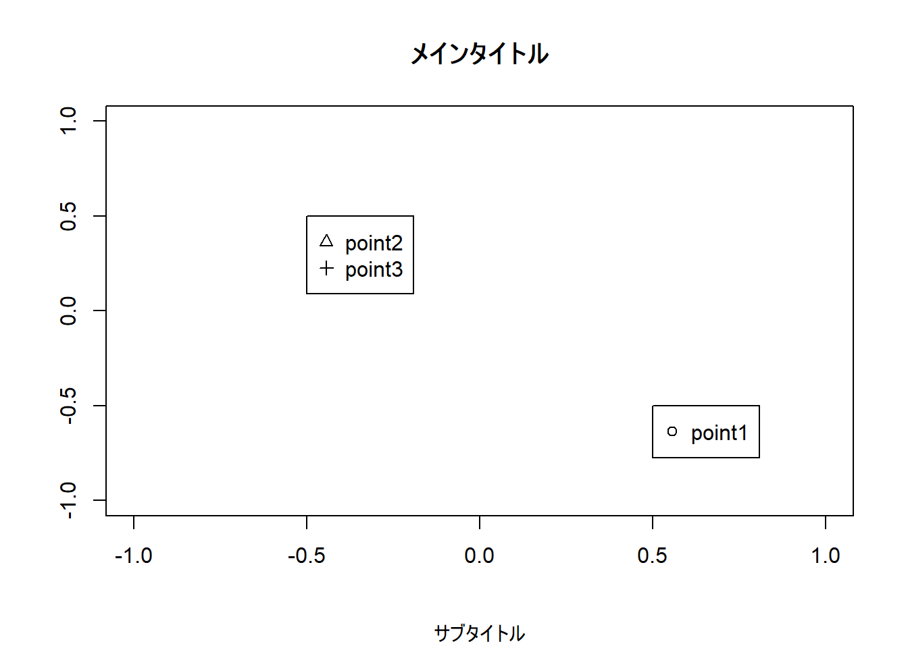](chapter25_files/figure-html/unnamed-chunk-6-1.png)

## 25.6 軸とグリッドの操作

`axis`関数はグラフの縦・横軸を追加するための関数です。`axis`関数の引数は数値の1～4で、1からそれぞれ下・左・上・右の軸の追加を意味します。

グリッド線の追加に用いるのが`grid`関数です。`grid`関数を引数無しで指定すれば、すでに記述されている軸ラベルに従いグリッド線を追加してくれます。引数でグリッドの間隔を指定することもできます。

``` downlit
# 軸のないプロットの表示
plot(x = 0, y = 0, type = "n", xlab = "", ylab = "", axes = FALSE)
axis(1) # 下に軸を追加
axis(2) # 左に軸を追加
grid() # グリッドを追加
```

[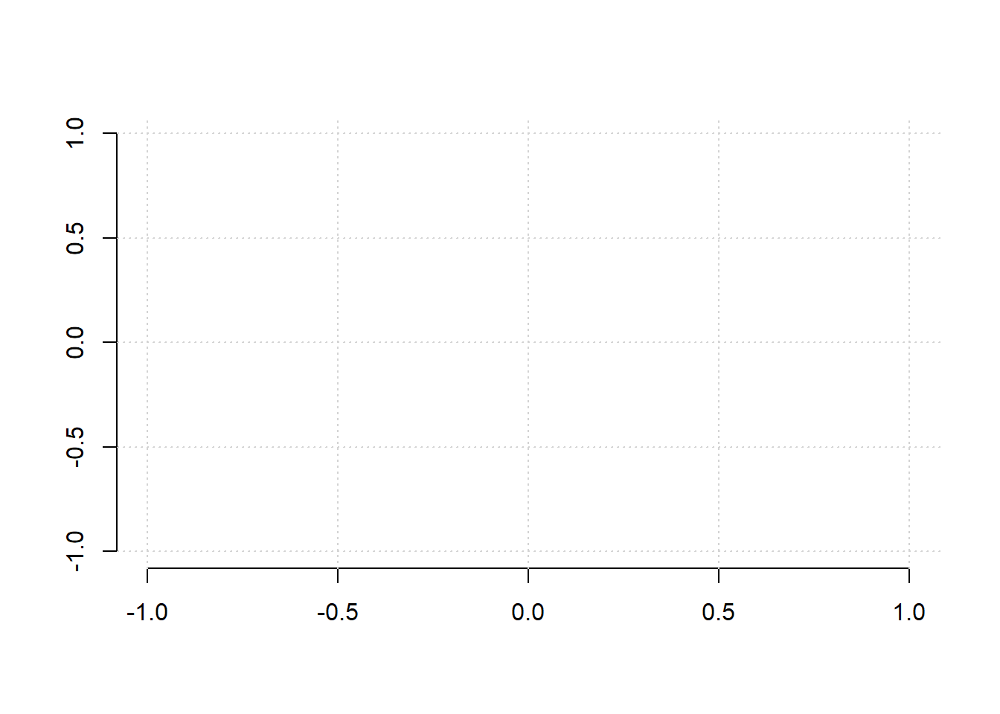](chapter25_files/figure-html/unnamed-chunk-7-1.png)

## 25.7 グラフィックパラメータ

Rのグラフ作成では、**グラフィックパラメータ**と呼ばれる引数を指定し、点や線、色や軸ラベル等を調整することができます。

グラフィックパラメータは`par`関数の引数として用います。`plot`関数などの高レベルグラフィック関数では、引数として一部のグラフィックパラメータを使用することもできます。Rのグラフィックパラメータは60以上あり、うまく利用すれば見やすく、理解しやすいグラフを作成することもできます。グラフィックパラメータの一覧を以下の表2に示します。

| グラフィックパラメータ | 引数の型 | 意味 | 指定の例 |
|:---|:---|:---|:---|
| adj | 数値 | 文字列の揃えの指定 | adj=0（左揃え）、adj=1（右揃え）など |
| ann | 論理型 | 列ラベルの表示 | ann=FALSE |
| ask | 論理型 | 表示前に入力を求める | ask=TRUE |
| bg | 文字列 | 背景色 | bg=“red” |
| bty | 文字列 | 軸表示の方法 | bty=“l”, bty=“c”など |
| cex | 数値 | 点の大きさ | cex=2 |
| cex.axis | 数値 | 軸の数値の大きさ | cex.axis=2 |
| cex.lab | 数値 | 軸ラベルの大きさ | cex.lab=2 |
| cex.main | 数値 | タイトルの大きさ | cex.main=2 |
| cex.sub | 数値 | サブタイトルの大きさ | cex.sub=2 |
| col | 文字列 | 点の色 | col=“blue” |
| col.axis | 文字列 | 軸の数値の色 | col.axis=“green” |
| col.lab | 文字列 | 軸ラベルの色 | col.lab=“orange” |
| col.main | 文字列 | タイトルの色 | col.main=“yellow” |
| col.sub | 文字列 | サブタイトルの色 | col.sub=“violet” |
| crt | 数値 | 文字の回転角度 | crt=90 |
| family | 文字列 | フォントファミリーの指定 | familty=“sans” |
| fg | 文字列 | 枠の色 | fg=“yellowgreen” |
| fig | 数値 | グラフのデバイス上での位置を指定 | fig=c(0, 0.5, 0, 0.5) |
| fin | 数値 | グラフのサイズ（幅、高さ、単位はインチ） | fin=c(4, 4) |
| font | 数値 | 使用するフォント | font=2（太字）, font=3（イタリック）など |
| font.axis | 数値 | 軸の数値に使用するフォント | font.axis=4（太字イタリック）など |
| font.lab | 数値 | 軸ラベルに使用するフォント | font.lab=2 |
| font.main | 数値 | タイトルに使用するフォント | font.main=2 |
| font.sub | 数値 | サブタイトルに使用するフォント | font.sub=2 |
| lab | 数値 | 軸の数値のおおよその数（x軸、y軸、長さ） | lab=c(4, 4, 8) |
| las | 数値 | 軸の数値の方向 | las=2など |
| lend | 数値 | 線の端の形 | lend=0（丸）, lend=2（角）など |
| ljoin | 数値 | 線の接続の形 | ljoin=0（丸）, ljoin=2（角）など |
| lmitre | 数値 | 線の接続の形（接続のしかた） | lmitre=5など |
| lty | 数値 | 線の種類（実線、点線など） | lty=2など |
| lwd | 数値 | 線の太さ | lwd=2 |
| mai | 数値 | グラフのマージンの大きさ（インチ） | mai=c(1, 1, 1, 1)など |
| mar | 数値 | グラフのマージンの大きさ（ライン） | mar=c(3, 3, 3, 1)など |
| mex | 数値 | マージンに依存したフォントサイズの大きさ | mex=2 |
| mfcol, mfrow | 数値 | デバイスにグラフを複数表示するときの指定 | mfcol=c(2,2), mfrow=c(3,2) |
| mfg | 数値 | グラフを複数表示するときの表示位置の指定 | mfg=c(1, 2) |
| mgp | 数値 | 表題や軸ラベルと軸との間隔 | mgp=c(1, 1, 2) （表題、x軸ラベル、y軸ラベル） |
| new | 論理型 | デバイスをクリアせずに描画する | new=T |
| oma | 数値 | グラフのマージンの大きさ（文字の行） | oma=c(1, 1, 1, 1) |
| omd | 数値 | グラフを複数表示するときのマージンの内側のサイズ（数値は割合） | omd=c(0.1, 0.9, 0.1, 0.9) |
| omi | 数値 | グラフを複数表示するときのマージンの大きさ（インチ） | omi=c(1, 1, 1, 1) |
| pch | 数値 | グラフの点の大きさ | pch=2 |
| pin | 数値 | グラフのサイズ（幅、高さ，単位はインチ） | pin=c(4, 4) |
| plt | 数値 | 現在の図の位置の中でのグラフのサイズ（数値は割合） | plt=c(0.3, 0.5, 0.3, 0.5) |
| ps | 数値 | テキストのサイズ（単位はポイント） | ps=16 |
| pty | 文字列 | グラフの枠の形 | pty=“s”（正方形）, pty=“m”（最大） |
| srt | 数値 | 文字列の角度の指定 | srt=90 |
| tck | 数値 | 軸ラベルを示す線の長さ（数値は割合） | tck=0.2 |
| tcl | 数値 | 軸ラベルを示す線の長さ | tcl=1 |
| usr | 数値 | 軸の境界値 | usr=c(0, 10, 0, 15) |
| xaxp | 数値 | x軸ラベルの位置 | xaxp=c(0, 10, 2)（0から10まで2間隔） |
| xaxs | 文字列 | x軸ラベルの位置（自動的ラベル付与の設定変更） | xaxs=“r”，xaxs=“I” |
| xaxt | 文字列 | x軸の表示方法 | xaxt=“n”, xaxt=“s” |
| xlog | 論理型 | x軸を対数変換する | xlog=T |
| xpd | 論理型 | グラフ・図の切り出し | xpd=TRUE, xpd=NAなど |
| yaxp | 数値 | y軸ラベルの位置 | yaxp=c(0, 10, 2)（0から10まで2間隔） |
| yaxs | 文字列 | y軸ラベルの位置（自動的ラベル付与の設定変更） | yaxs=“r”，yaxs=“I” |
| yaxt | 文字列 | y軸の表示方法 | yaxt=“n”, yaxt=“s” |
| ylbias | 数値 | 軸ラベルの文字の位置 | ylbias=0.5 |
| ylog | 論理型 | y軸を対数変換する | ylog=T |

表2：グラフィックパラメータの一覧 {.caption-top .table .table-sm .table-striped .small}

## 25.8 重ね書き：new=T

[前章](chapter24.llms.md#グラフの重ね書き)で説明した通り、Rではすでに記述しているグラフに、別のグラフを重ね書きすることができます。この重ね書きに用いるのが、`new=T`というグラフィックパラメータです。`par(new=T)`を宣言すると、宣言前に作図したグラフを消去することなく、同じデバイス上に次のグラフが追加されます。

``` downlit
plot(1:10)
par(new = T) # デバイス上のグラフを消去しない
plot(10:1, col = "red") # 赤のプロットを追加
```

[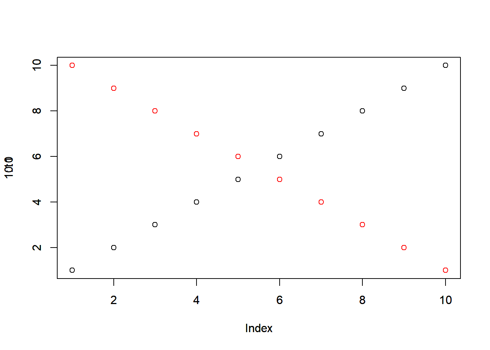](chapter25_files/figure-html/unnamed-chunk-9-1.png)

## 25.9 複数のグラフを1つのデバイスに表示

複数のグラフを1つのデバイス上に描画する場合には、グラフィックパラメータの`mfrow`引数又は`mfcol`引数を用います。いずれも引数に2つの数値からなるベクターを取ります。ベクターの1つ目の要素が行方向にデバイスを分割する数、2つ目の要素が列方向にデバイスを分割する数になります。このとき、`mfrow`と`mfcol`のいずれを用いても、結果は同じになります。

グラフィックパラメータとして`par`関数内で引数`mfrow`又は`mfcol`を宣言した後、`plot`関数などの高レベルグラフィック関数を用いてグラフを描画します。`plot`関数では、引数`mfg`を用いて、グラフを表示する位置を指定します。位置は引数`mfrow`で指定した行、列の中で設定します。例えば、`mfg=c(2, 3)`と指定すると、そのグラフはグラフィックデバイスのうち、2行3列目に描画されます。

``` downlit
# mfcolでもmfrowでも同じ。3行2列にデバイスを分割
par(mfrow = c(3, 2)) 
plot(1, mfg = c(1, 1)) # 1行1列目のグラフ
plot(1:10, 1:10, type = "l", mfg = c(1, 2)) # 1行2列目のグラフ
plot(iris$Sepal.Length, iris$Sepal.Width, mfg = c(2, 1)) # 2行1列目のグラフ
plot(Nile, mfg = c(2, 2))
hist(iris$Sepal.Length, mfg = c(3, 1))
boxplot(iris$Petal.Width~iris$Species, mfg = c(3, 2))
```

[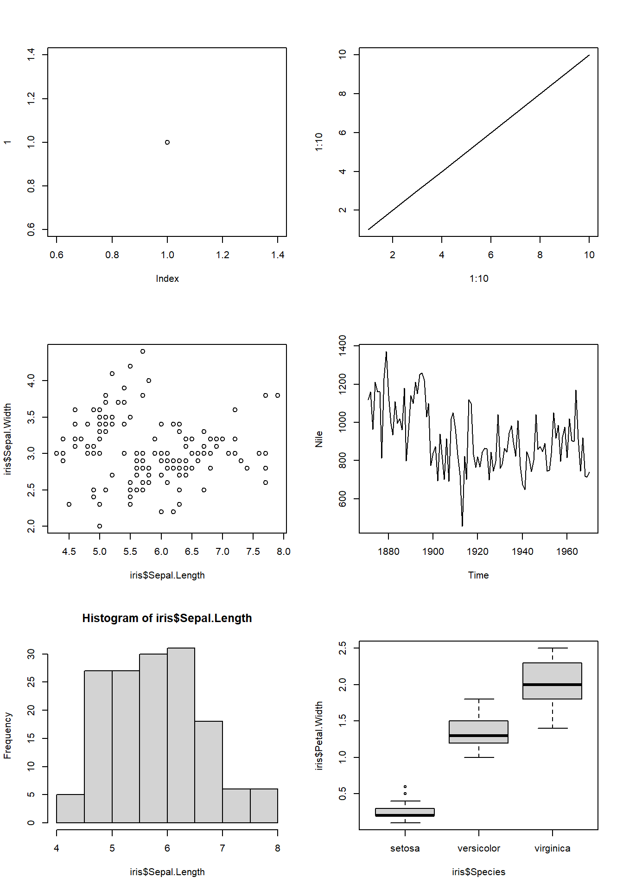](chapter25_files/figure-html/unnamed-chunk-10-1.png)

同様のデバイスの分割には、`layout`関数を用いることもできます。`layout`関数は行列を引数に取ります。行列の要素は数値で、数値の順にグラフが埋められていきます。

``` downlit
layout(matrix(c(2, 4, 1, 3), nrow=2)) # 2行2列に分割
plot(1) # 行列の数値の順番にグラフが描画される
plot(iris$Sepal.Length, iris$Sepal.Width)
hist(iris$Sepal.Length)
boxplot(iris$Sepal.Width~iris$Species)
```

[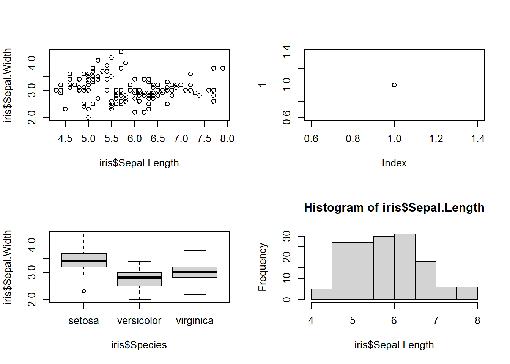](chapter25_files/figure-html/unnamed-chunk-11-1.png)

グラフの分割には、`split.screen`関数を用いることもできます。`split.screen`関数は引数に数値2つのベクターを取ります。1要素目の数値が行数、2要素目の数値が列数を示します。`split.screen`関数では、`screen`関数によって描画するグラフの位置を指定します。例えば、`screen(n=2)`を指定すると、分割したデバイスの2番目の位置に次のグラフが描画されることになります。

``` downlit
split.screen(c(1, 3)) # 1行3列にデバイスを分割
```

    [1] 1 2 3

``` downlit
plot(1) # 1つ目（一番左）に描画
screen(n = 2) # 2つ目に描画することを指定
plot(iris$Sepal.Length, iris$Sepal.Width)
screen(n = 3)
hist(iris$Sepal.Length)
```

[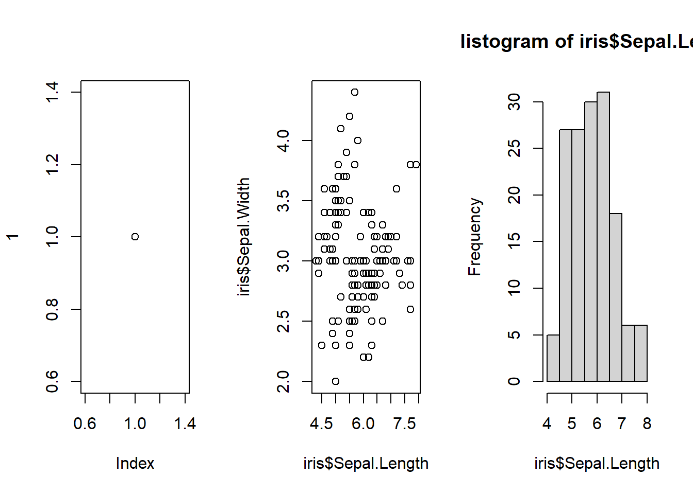](chapter25_files/figure-html/unnamed-chunk-12-1.png)

> **TIP:**
>
> Rのデフォルトの関数群を用いても、上記のように複数のグラフを1つのデバイスにまとめることはできます。ただし、上の図に見られるように、各グラフのラベルやサイズ、タイトルなどをうまく調節するためには、グラフィックパラメータを駆使する必要があります。複数のグラフを一度に表示したい場合には、[lattice](https://lattice.r-forge.r-project.org/)パッケージや[ggplot2](https://ggplot2.tidyverse.org/index.html)パッケージを用いることで、デフォルトの関数よりも簡単に複数のグラフをまとめて作成することができます。

## 25.10 マージンの設定

マージン（余白）には、個々のグラフに対するマージンと、デバイスに対するマージンの2つがあります。デバイスにグラフを1つだけ表示する場合には、この2つのマージンは同じ意味を持ちます。

一方で、上で説明した通り、Rではデバイスを分割して複数のグラフを表示することができます。デバイスを分割する場合には、デバイス全体のマージンとは別に、表示する個々のグラフに対するマージンを設定することができます。

個々のグラフに対するマージンを設定するグラフィックパラメータは`mai`、`mar`です。`mar`と`mai`の違いは、`mai`がマージンをインチ単位で設定するのに対し、`mar`は文字の行で設定する点です。いずれも要素が4つの数値ベクターでマージンを設定します。数値ベクターの要素はそれぞれ下、左、上、右のマージンを表したものとなります。

``` downlit
plot(1)
```

[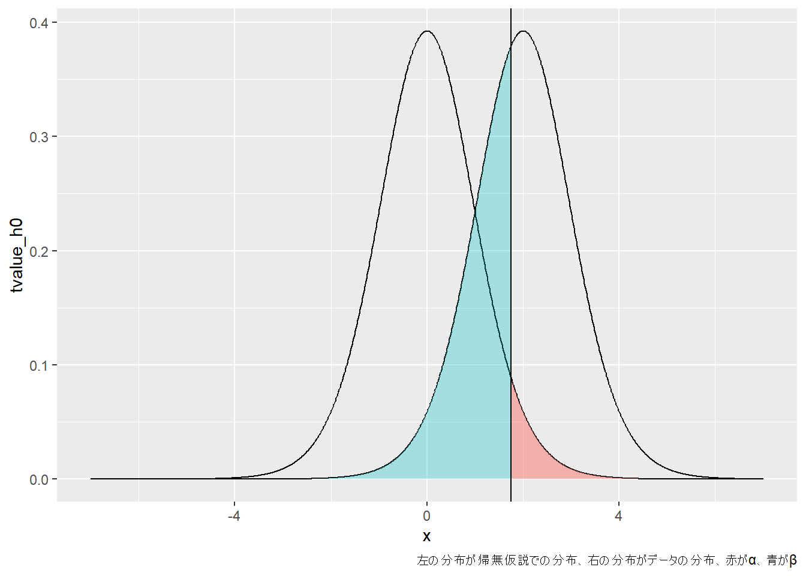](chapter25_files/figure-html/unnamed-chunk-13-1.png)

``` downlit
par(mai = c(2, 2, 2, 2))
plot(1)
```

[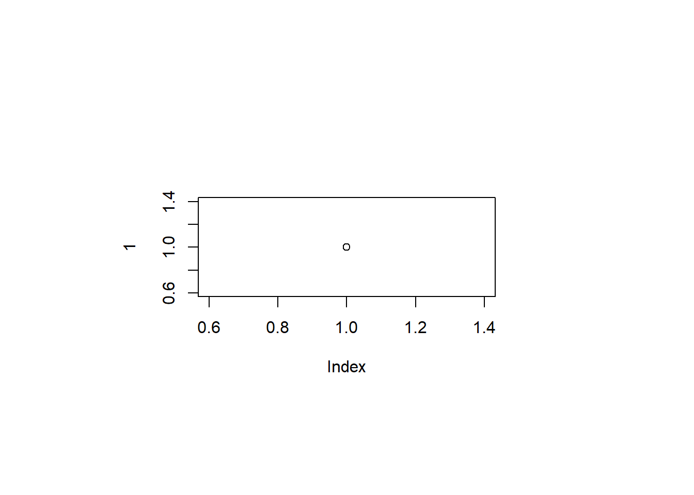](chapter25_files/figure-html/unnamed-chunk-14-1.png)

デバイス全体のマージンを設定するグラフィックパラメータが`omi`、`oma`です。`omi`と`oma`の違いは`mai`、`mar`と同じで、`omi`がインチ単位、`oma`が行単位でマージンを設定する引数です。要素が4つの数値ベクターで設定すること、要素がそれぞれ下、左、上、右のマージンを表すのも、`mai`、`mar`と同じです。

``` downlit
# デフォルトの余白
par(mfcol = c(1, 2))
plot(1)
plot(1:10)
```

[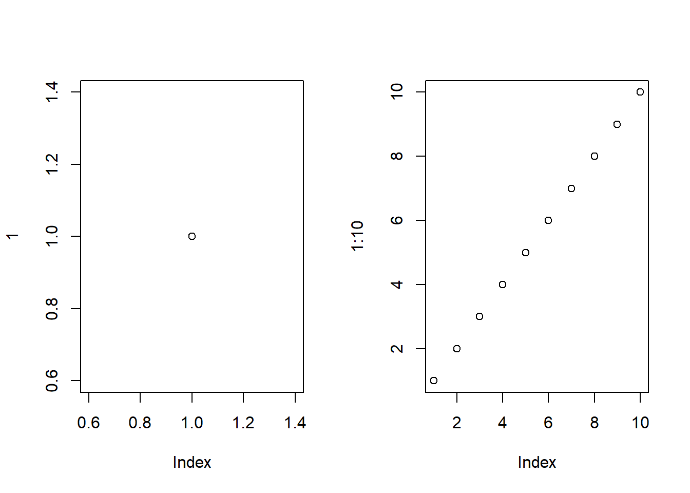](chapter25_files/figure-html/unnamed-chunk-15-1.png)

``` downlit
# omiで余白を調整
par(omi = c(1, 1, 1, 1), mfcol = c(1, 2))
plot(1)
plot(1:10)
```

[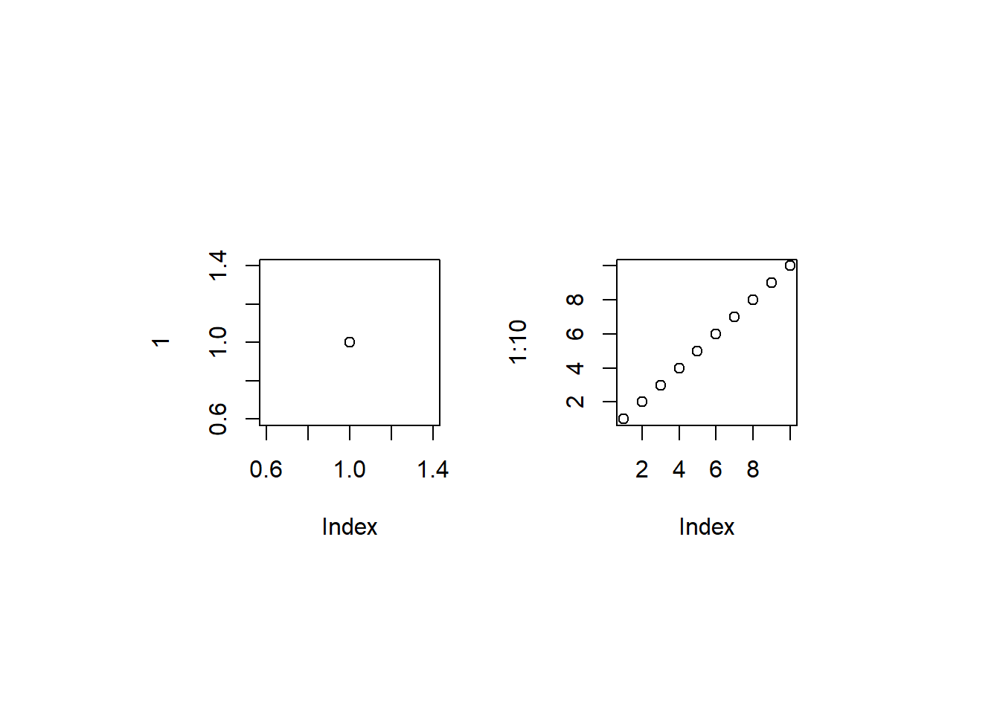](chapter25_files/figure-html/unnamed-chunk-16-1.png)

## 25.11 グラフの色の調整

グラフの色も、グラフィックパラメータを用いることで調整することができます。グラフの色に関わるグラフィックパラメータは、`bg`、`col`、`col.axis`、`col.lab`、`col.main`、`col.sub`、`fg`です。それぞれ、背景色、点の色、軸の色、軸ラベルの色、メインタイトルの色、サブタイトルの色、枠の色を示します。色の設定を用いると、下のようにグラフの要素の色を変えたグラフを作成することもできます。

``` downlit
par(bg = "lightgray") # 背景色はpar関数で呼び出し
plot(
  1:10, 
  cex=3, 
  col = "red", # 点の色は赤
  col.axis = "blue", # 軸の数値は青
  col.lab = "purple", #  軸のラベルは紫
  col.main = "pink", # メインタイトルはピンク
  col.sub = "orange", # サブタイトルはオレンジ
  fg = "violet", # 枠の色はバイオレット
  main = "メインタイトル", 
  sub = "サブタイトル"
  )
```

[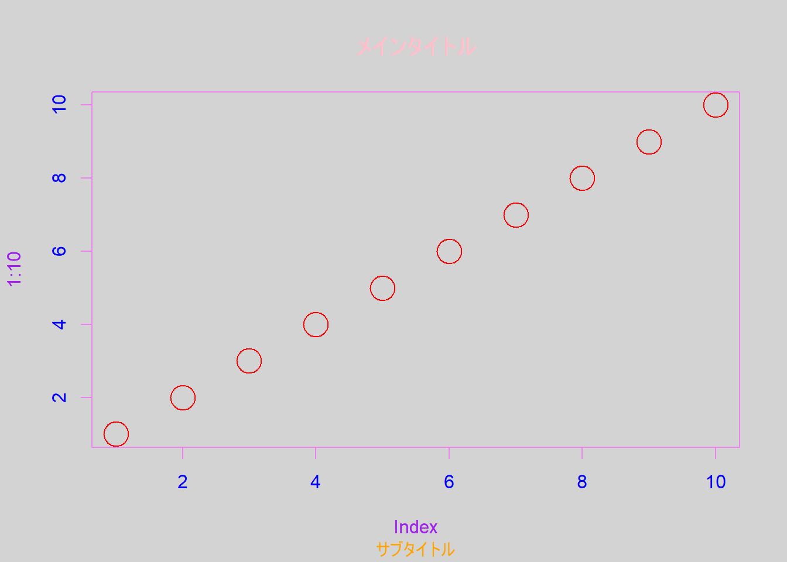](chapter25_files/figure-html/unnamed-chunk-18-1.png)

Rで用いることのできる色については、[NCEAS (National Center for Ecological Analysis and Synthesis)が公開しているチートシート](https://www.nceas.ucsb.edu/sites/default/files/2020-04/colorPaletteCheatsheet.pdf)([Zeileis et al. 2009](#ref-zeileis2009escaping))に詳しくまとめられています。

色はベクターで指定することもできます。

``` downlit
# Speciesがsetosaなら赤、それ以外は青で表示
plot(
  x = iris$Sepal.Length,
  y = iris$Sepal.Width,
  col = ifelse(iris$Species == "setosa", "red", "blue")
  )
```

[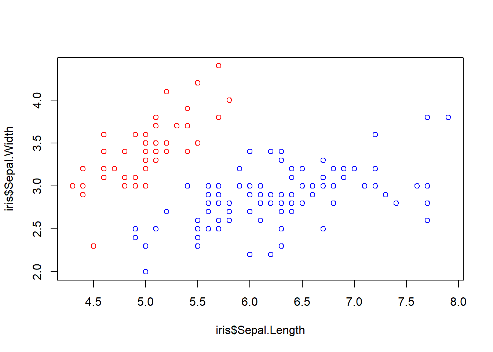](chapter25_files/figure-html/unnamed-chunk-19-1.png)

## 25.12 インタラクティブグラフィック関数

グラフを描画した後、グラフをクリックすることでその点の値を得る場合には、`locator`関数を用います。`locator`関数は引数に数値を取り、その数値の回数だけグラフをクリックし、クリックした位置の値を得ることができます。得た値はxとyのリストで返ってきます。

``` downlit
plot(1:10)
locator(1) # 1つの点を選ぶ（xとyの値がリストで返ってくる）
```

同様に描画したグラフにテキストなどでラベルを表示するための関数が、`identify`関数です。`identify`関数は、`x`、`y`、`labels`の3つの引数を取ります。`x`、`y`にはラベルを表示したい位置、`labels`にはそれぞれの点に表示するラベルを文字列で記載します。`identify`関数はRStudioでは正常に機能せず、RGUIでのみ機能します。

``` downlit
x <- 1:7
y <- 1:7
plot(x, y)
# 点をクリックすると1~7のラベルが付く（RGUI）
identify(x, y, labels = 1:7) 
```

Zeileis, Achim, Kurt Hornik, and Paul Murrell. 2009. “Escaping RGBland: Selecting Colors for Statistical Graphics.” *Computational Statistics & Data Analysis* 53 (9): 3259–70.

Back to top
