# 26  ggplot2

Code

現在のRでは、デフォルトのグラフ作成関数はデータの確認に用いられていることが多く、プレゼンテーションや論文など、人に見せるためのきれいなグラフを作成する場合には、ほとんどの場合**`ggplot2`**が用いられています。`ggplot2`を用いると、美しいグラフを統一感のある記法で簡単に描画することができます。

`ggplot2`には、その使い方についてのみ書かれた教科書が多数出ているぐらいに沢山の関数・引数が設定されています。この章での解説は`ggplot2`の紹介に留めますが、興味のある方は[リファレンス](https://ggplot2.tidyverse.org/reference/)や[チートシート](https://rstudio.github.io/cheatsheets/data-visualization.pdf)、教科書（[ggplot2: Elegant Graphics for Data Analysis](https://ggplot2-book.org/index.html)、[R graphic cookbook](https://r-graphics.org/)、[R graphic cookbook 日本語版](https://www.oreilly.co.jp/books/9784873118925/)など）を読むことをお勧めします。

`ggplot2`は`tidyverse`に含まれるパッケージの一つですので、`tidyverse`を呼び出すことで使用することができます。他の`tidyverese`の機能である、`dplyr`や`tidyr`、パイプ演算子などとも相性が良く、これらを`ggplot2`と同時に用いるのが一般的です。

``` downlit
pacman::p_load(tidyverse)
```

`ggplot2`では、まず`ggplot`関数にデータフレームを引数として与えます。`ggplot2`では、**データはほぼ常にデータフレームで与える**必要があります。`ggplot`関数はデータの設定のための関数で、データフレームを引数にして`ggplot`関数だけを実行しても、空白が表示されるだけです。`ggplot`関数は第一引数にデータフレームを取るため、パイプ演算子を用いてデータフレームを`ggplot`関数につなぐのが一般的です。

``` downlit
# ggplot関数だけでは何も表示されない
p <- iris |> ggplot()
p
```

[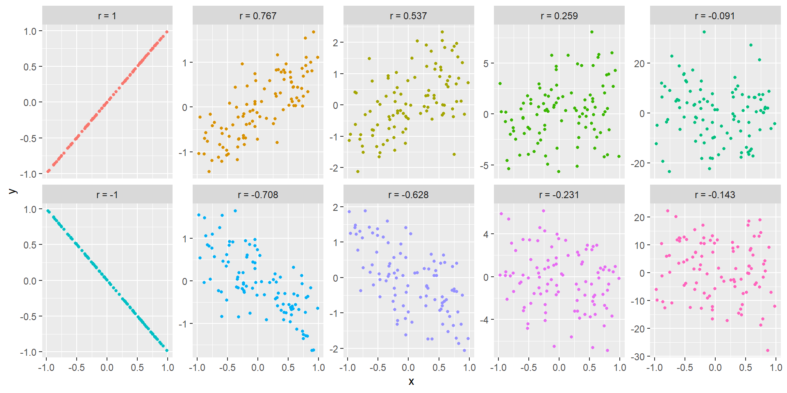](chapter26_files/figure-html/unnamed-chunk-2-1.png)

## 26.1 aesthetic mapping（aes）

`ggplot`関数は、引数に`aes`関数を取ります。この`aes`は**aesthetic（エステティック）mapping**の略です。この「エステティック」というのは、美容のエステと同じ言葉で、「美的な」という意味を持ちます。`ggplot2`では、`aes`関数内でグラフのx軸、y軸の値などの要素、色や点のサイズ等を指定します。この指定には、`ggplot`関数の引数であるデータフレームの列名を文字列ではなく、そのまま使用することができます。

下の例では、データフレームである`iris`の列から、`Sepal.Length`を`x`に、`Sepal.Width`を`y`に設定したものです。`aes`関数を引数にして`ggplot`関数を実行すると、点や線などのグラフの要素は表示されませんが、縦と横の軸だけは表示されます。

``` downlit
# 軸だけが表記される
iris |> ggplot(aes(x = Sepal.Length, y = Sepal.Width))
```

[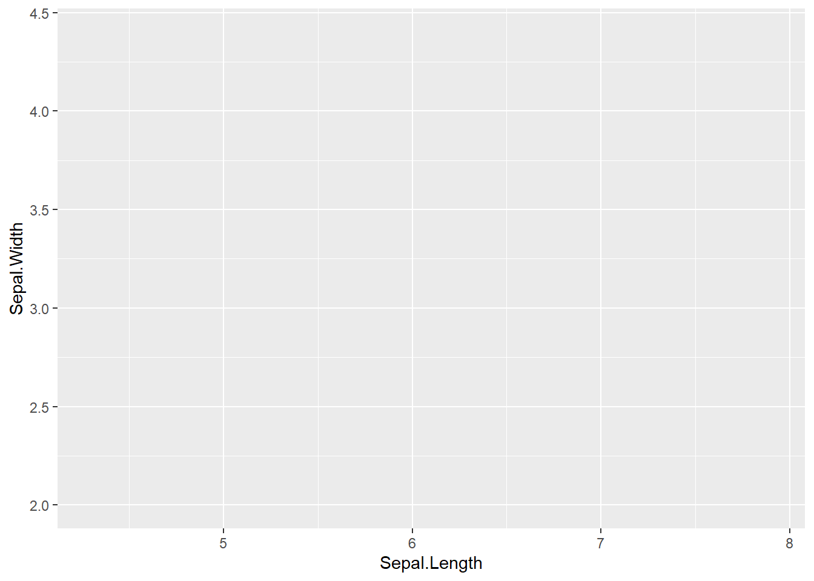](chapter26_files/figure-html/unnamed-chunk-3-1.png)

## 26.2 geom関数

`ggplot2`でグラフを表示するためには、グラフの種類を指定する関数である、**`geom`関数**を用いる必要があります。例えば、散布図を描画するための`geom`関数は、`geom_point`関数です。この`geom`関数の中でも、データフレームや`aes`を設定することができます。ただし、この`geom`関数だけでは、グラフを表示することはできません。先程説明した、`ggplot`関数と組み合わせる必要があります。

``` downlit
# geom関数だけではグラフを記述できない
geom_point(data = iris, aes(x = Sepal.Length, y = Sepal.Width))
```

    mapping: x = ~Sepal.Length, y = ~Sepal.Width 
    geom_point: na.rm = FALSE
    stat_identity: na.rm = FALSE
    position_identity 

`geom`関数は、`ggplot`関数に`+`でつなぐ必要があります。まず、データフレームを引数にした`ggplot`関数を準備し、その関数に足し算で`geom_point`関数をつなぎ、`ggplot`関数内もしくは`geom_point`関数内で`aes`を設定すると、グラフが表示されます。

``` downlit
# geom関数内でaesを設定する
iris |> 
  ggplot() + 
  geom_point(aes(x = Sepal.Length, y = Sepal.Width))
```

[](chapter26_files/figure-html/unnamed-chunk-5-1.png)

``` downlit
# ggplot関数内でaesを設定する（上と同じ）
iris |> 
  ggplot(aes(x = Sepal.Length, y = Sepal.Width)) + 
  geom_point()
```

[](chapter26_files/figure-html/unnamed-chunk-6-1.png)

> **TIP:**
>
> `ggplot2`では、`ggplot`関数と`geom`関数をつなぐために、`+`の記号を用います。この`+`はジェネリック関数として設定されており、`ggplot2`内では足し算とは異なる機能を持ちます。詳しくは[ggplot2のリファレンス](https://ggplot2.tidyverse.org/reference/gg-add.html)をご一読ください。

以下の表1に、代表的な`geom`関数の一覧を示します。

| geom関数 | グラフの種類 | aesで必須となる引数 |
|:---|:---|:---|
| geom_point | 散布図 | x, y |
| geom_text | 文字の散布図 | x, y, label |
| geom_line | 線グラフ（x軸の小さいものからつなぐ） | x, y |
| geom_ribbon | リボン | xmax, xmin, ymax, ymin（xかyのどちらか） |
| geom_path | 線グラフ（データフレームの行順につなぐ） | x, y |
| geom_step | ステップ関数 | x, y |
| geom_abline | 直線（傾きと切片で指定） | intercept, slope |
| geom_hline | 水平線（横線） | yintercept |
| geom_vline | 垂直の線（縦線） | xintercept |
| geom_bar | 棒グラフ | x, y |
| geom_dotplot | ドットプロット | x, y（片方のみ） |
| geom_function | 関数を線形で表記 | fun |
| geom_boxplot | 箱ひげ図 | x, y（片方でも可） |
| geom_histogram | ヒストグラム | x, y（片方のみ） |
| geom_density | 確率密度 | x, y（片方のみ） |
| geom_jitter | ジッタープロット | x, y（片方でも可） |
| geom_violin | バイオリンプロット | x, y（片方でも可） |
| geom_errorbar | エラーバー | xmax, xmin, ymax, ymin |
| geom_linerange | エラーバー（横棒無し） | xmax, xmin, ymax, ymin |
| geom_pointrange | フォレストプロット（点と線） | x, y, xmax, xmin, ymax, ymin |
| geom_bin_2d | ヒートマップ | x\. y |
| geom_contour | 等高線 | x, y |
| geom_map | 地図表記 | map_id |
| geom_polygon | 多角形 | x, y |

表1：代表的なgeom関数 {.caption-top .table .table-sm .table-striped .small}

## 26.3 qplot

`ggplot2`には、`qplot`という関数も準備されています。`qplot`関数は「Quick plot」の略で、`plot`関数のように1つの関数だけでグラフの作成が完了します。ただし、この`qplot`関数で凝ったグラフを作成することは難しいため、現在ではその使用は非推奨とされています。

``` downlit
# 上と同じグラフをqplotで描画
qplot(Sepal.Length, Sepal.Width, data = iris, geom="point")
```

    Warning: `qplot()` was deprecated in ggplot2 3.4.0.

[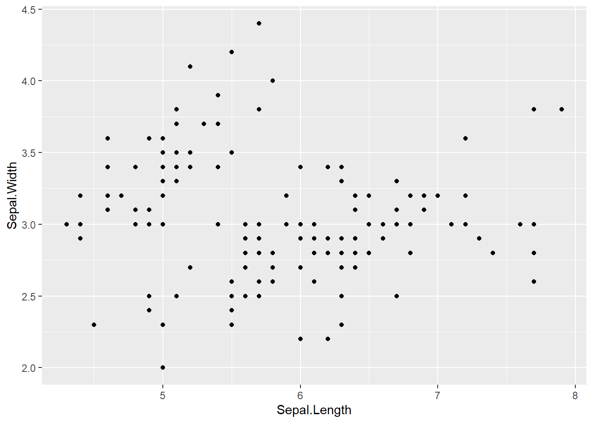](chapter26_files/figure-html/unnamed-chunk-8-1.png)

## 26.4 geom関数群

表1に示した通り、`geom`関数には`geom_point`以外にもたくさんの関数が設定されています。以下に各`geom`関数を用いて作成できるグラフを紹介します。

### 26.4.1 geom_text

`geom_text`は、テキストをグラフ上に表示するための関数です。`geom_text`は`aes`に`x`、`y`、`label`の3つの引数を設定し、その`x`、`y`の位置に`label`で指定した文字列を表示します。

``` downlit
iris |> 
  ggplot(aes(x = Sepal.Length, y = Sepal.Width, label = Species)) + 
  geom_text()
```

[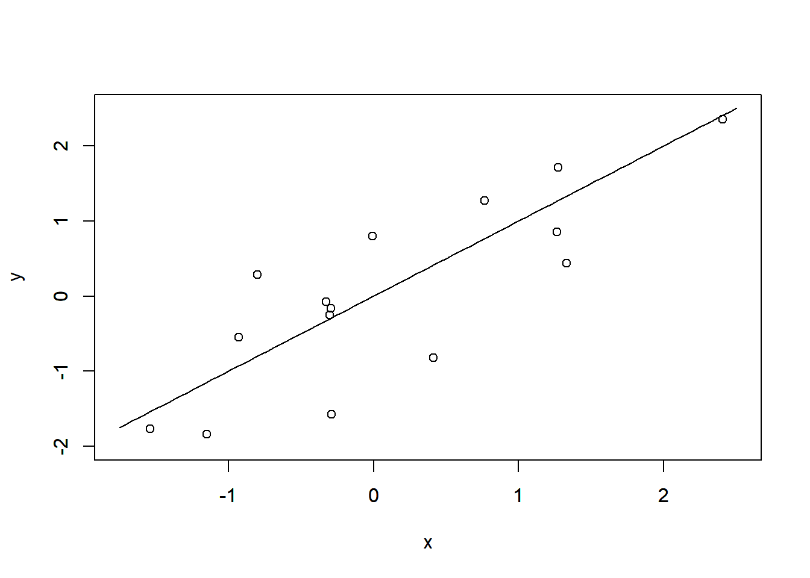](chapter26_files/figure-html/unnamed-chunk-9-1.png)

### 26.4.2 geom_line

`geom_line`は`aes`の`x`、`y`に設定した点を結ぶ線、つまり線グラフを描画するための関数です。`geom_line`では、線は必ずxの小さい値から大きい値へと点を繋いでいく形で線が描画されます。

``` downlit
economics |> 
  ggplot(aes(x = pop, y = pce)) +
  geom_line()
```

[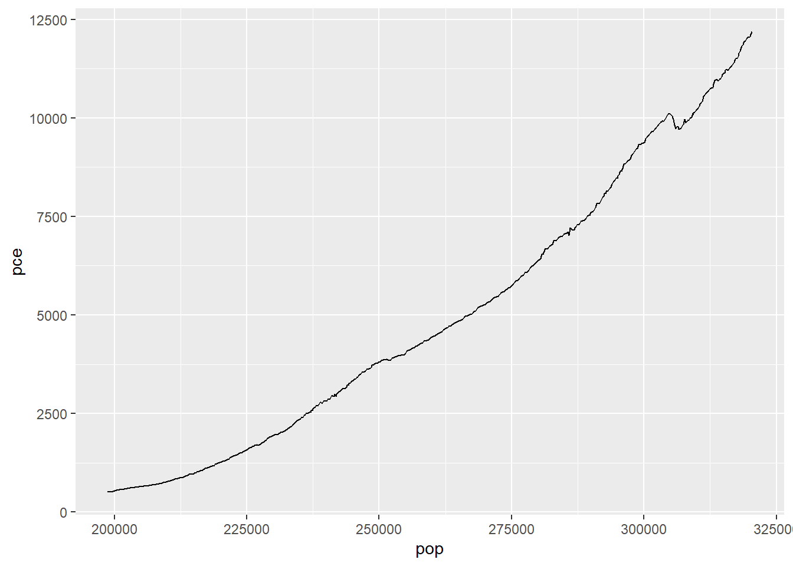](chapter26_files/figure-html/unnamed-chunk-10-1.png)

### 26.4.3 geom_ribbon

`geom_ribbon`は、幅のあるグラフ（リボン）を描画するための関数です。`geom_ribbon`は`x`、`ymin`、`ymax`の3つの引数を取り、`x`で指定した位置に`ymin`－`ymax`の間を幅とするリボンを描画します。引数として、`y`、`xmin`、`xmax`の3つを取ることもできます。`ymin`、`ymax`を指定した場合にはリボンは横向き、`xmin`、`xmax`を指定した場合にはリボンは縦向きになります。

``` downlit
d <- data.frame(
  time = time(Nile) |> as.numeric(), 
  Nile100 = Nile |> as.numeric(), 
  Nile90 = Nile |> as.numeric() * 0.9 , 
  Nile110 = Nile |> as.numeric() * 1.1)

d |> 
  ggplot(aes(x = time, ymax = Nile110, ymin = Nile90)) +
  geom_ribbon()
```

[](chapter26_files/figure-html/unnamed-chunk-11-1.png)

### 26.4.4 geom_smooth

`geom_smooth`は`geom_point`等で表示した点に対して、回帰の式をあてはめ、そのグラフを表示するための関数です。特に引数を指定していない場合、[30章](chapter30.llms.md#loesslowess平滑化)で説明するloess回帰をあてはめ、回帰を行った線を表示します。また、95%信頼区間を`geom_ribbon`と同様の表記で示します。

``` downlit
iris |> 
  ggplot(aes(x = Sepal.Length, y = Sepal.Width)) +
  geom_point(size = 2) +
  geom_smooth()
```

    `geom_smooth()` using method = 'loess' and formula = 'y ~ x'

[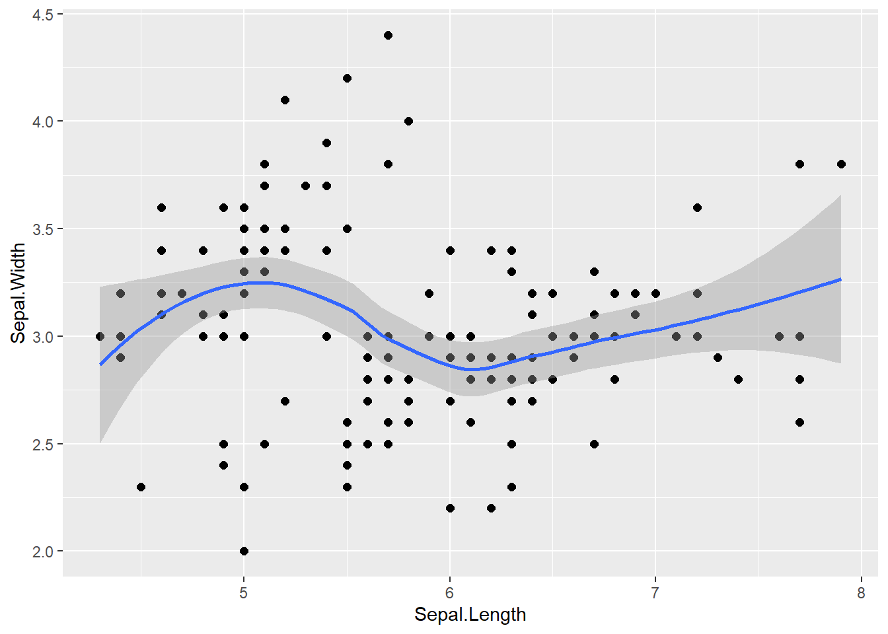](chapter26_files/figure-html/unnamed-chunk-12-1.png)

直線での回帰を行う場合には、引数に`method="lm"`を指定します。また、`se`引数を`FALSE`に指定すると、信頼区間の表示を消すことができます。

``` downlit
iris |> 
  ggplot(aes(x = Sepal.Length, y = Sepal.Width)) +
  geom_point(size = 2) +
  geom_smooth(method = "lm", se = FALSE)
```

    `geom_smooth()` using formula = 'y ~ x'

[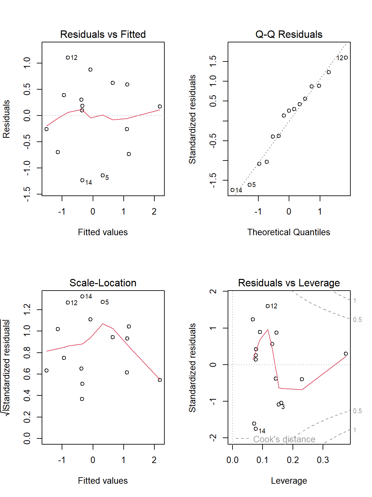](chapter26_files/figure-html/unnamed-chunk-13-1.png)

データフレームの因子の列に従ってグラフを分けて回帰したい場合には、`aes`関数内で`group`引数にその因子を設定します。以下の例では`iris`の`Species`を`group`引数に設定し、アヤメの種ごとに回帰を行っています。

``` downlit
iris |> 
  ggplot(aes(x = Sepal.Length, y = Sepal.Width, group = Species)) +
  geom_point(size = 2) +
  geom_smooth(method = "lm")
```

    `geom_smooth()` using formula = 'y ~ x'

[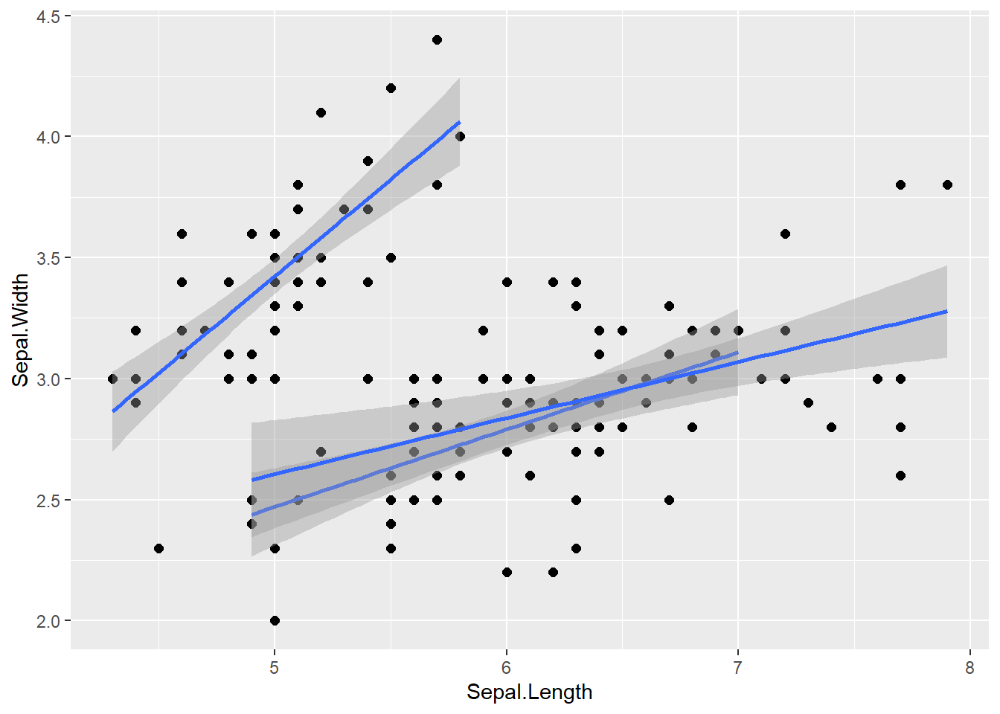](chapter26_files/figure-html/unnamed-chunk-14-1.png)

`aes`に`color`や`fill`を設定することでも因子ごとに回帰を行うことができます。

``` downlit
iris |> 
  ggplot(aes(x = Sepal.Length, y = Sepal.Width, color = Species, fill = Species)) +
  geom_point(size = 2) +
  geom_smooth(method = "lm")
```

    `geom_smooth()` using formula = 'y ~ x'

[](chapter26_files/figure-html/unnamed-chunk-15-1.png)

### 26.4.5 geom_path

`geom_path`は、xの大きさに関わらず、データフレームの上の行から線をつなぐ関数です。データフレームを時系列に並べておき、2変数の時間変化を追うような場合に利用します。

`geom_path`を用いる場合には、一色の線では線のどちらの端が上の行で、どちらが下の行かわからないため、通常は行の順番にそって線の色を変えることになります。色を指定したい場合には、`aes`の引数に`color`を設定します。`color`には、データフレームの列のうち、日時などを設定します。このように設定することで、日時と共に線の色が変わるようなグラフを作成することができます。

``` downlit
economics |> 
  ggplot(aes(x = uempmed, y = pce, color = date)) +
  geom_path()
```

[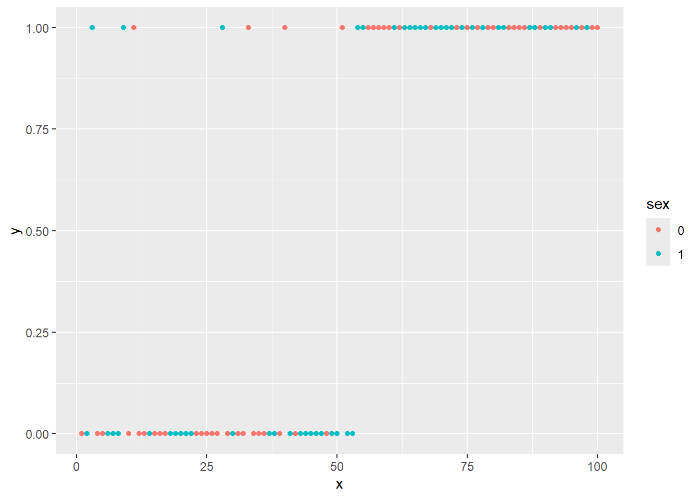](chapter26_files/figure-html/unnamed-chunk-16-1.png)

### 26.4.6 geom_step

Rの`step`関数を用いた場合と同様のグラフを記述する場合には、`geom_step`関数を用います。

``` downlit
iris |> 
  ggplot(aes(x = 1:150, y = Sepal.Length)) + 
  geom_step()
```

[](chapter26_files/figure-html/unnamed-chunk-17-1.png)

### 26.4.7 geom_abline、geom_vline、geom_hline

グラフ上に直線を描く場合には、`geom_abline`、`geom_vline`、`geom_hline`を用います。`geom_abline`は切片（`intercept`）と傾き（`slope`）を指定し、その切片・傾きを持つ直線を引くものです。`geom_vline`は垂直な線（vertical line）、`geom_hline`は水平な線（horizontal line）を描画します。`geom_vline`はx軸と交わるため、x軸の切片（`xintercept`）の設定が必要です。同様に`geom_hline`はy軸と交わるため、y軸の切片（`yintercept`）を設定します。

``` downlit
ggplot()+ 
  geom_abline(intercept = 10, slope = -1) +
  geom_vline(xintercept = 10, color = "red") +
  geom_hline(yintercept = 10, color = "blue") +
  xlim(0, 15) +
  ylim(0, 15)
```

[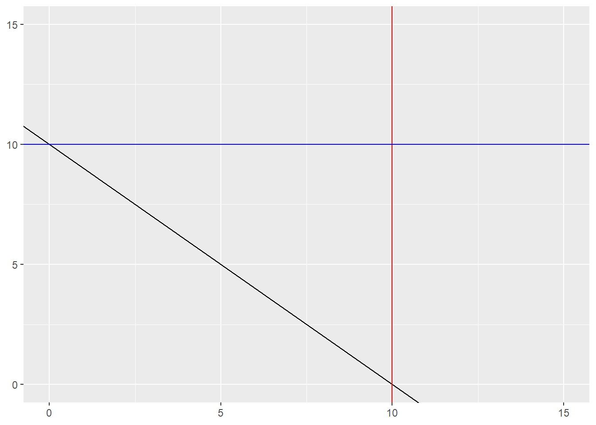](chapter26_files/figure-html/unnamed-chunk-18-1.png)

### 26.4.8 geom_bar

`geom_bar`は、棒グラフを作成するための関数です。`geom_bar`を引数なしで実行すると、ヒストグラムが描画されます。これは、`geom_bar`の引数のうち、`stat`引数が`"count"`に設定されているためです。この`stat`引数は、グラフを記述する際に実施する統計的な処理を指定するための引数です。

``` downlit
iris |> 
  ggplot(aes(x = Sepal.Length)) +
  geom_bar() # ヒストグラムを表示（stat="count"）
```

[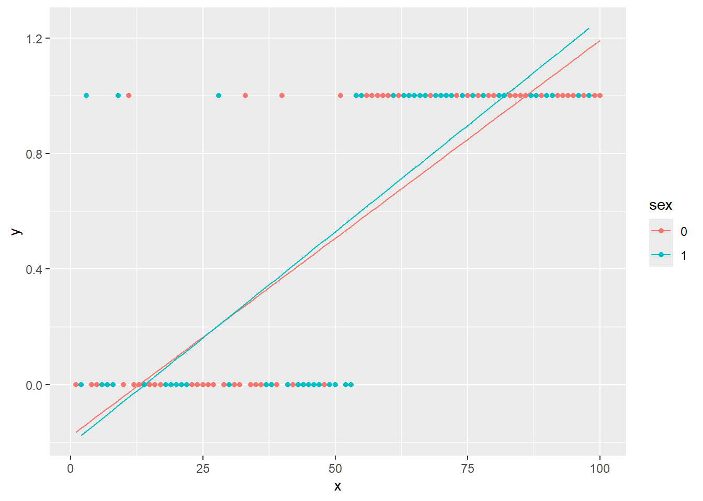](chapter26_files/figure-html/unnamed-chunk-19-1.png)

### 26.4.9 geom_histogram

`ggplot2`には、ヒストグラムを描画するための専用の関数である、`geom_histogram`もあります。ヒストグラムを描くのが目的であれば、こちらの`geom_histogram`の方が名前と目的が一致しており、使いやすいかと思います。

``` downlit
iris |> 
  ggplot(aes(x = Sepal.Length)) +
  geom_histogram()
```

    `stat_bin()` using `bins = 30`. Pick better value `binwidth`.

[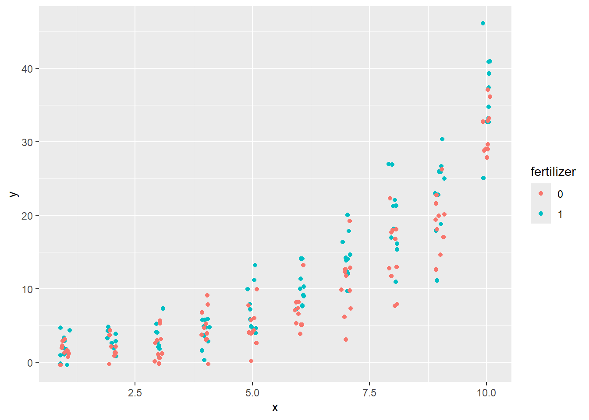](chapter26_files/figure-html/unnamed-chunk-20-1.png)

ヒストグラムの棒の幅は、`bins`もしくは`binwidth`のどちらかで指定します。`bins`で指定する場合には棒の数を、binwidthで指定する場合には棒の幅のサイズをそれぞれ数値で指定します。

``` downlit
iris |> 
  ggplot(aes(x = Sepal.Length)) +
  geom_histogram(bins = 15) # 棒を15本にする（binsのデフォルト値は30）
```

[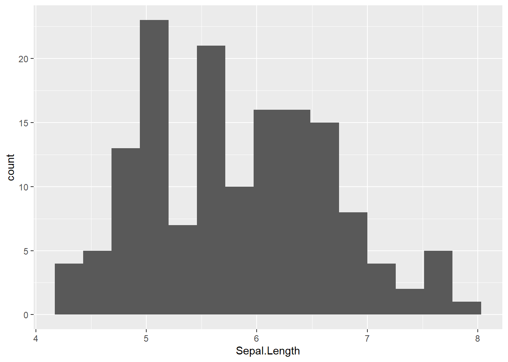](chapter26_files/figure-html/unnamed-chunk-21-1.png)

``` downlit
iris |> 
  ggplot(aes(x = Sepal.Length)) +
  geom_histogram(binwidth = 0.5) # 棒の幅を0.5にする
```

[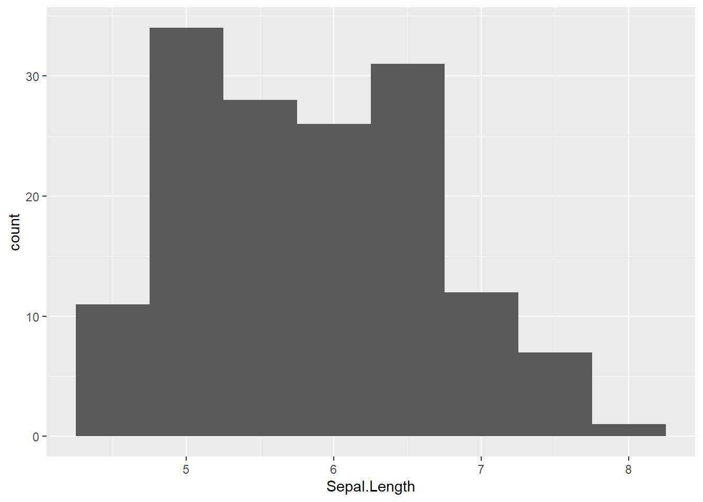](chapter26_files/figure-html/unnamed-chunk-21-2.png)

### 26.4.10 statの設定

`geom_bar`関数で1つの値に対して1つの棒グラフを描画する、要は通常の棒グラフを描画する場合には、`stat="identity"`を指定します。棒グラフを描画するときには、まずx軸とy軸の数値・ラベルを含むデータフレームを作成します。

``` downlit
d <- iris |> 
  group_by(Species) |> 
  summarise(
    mSepal.Length = mean(Sepal.Length), 
    sSepal.Length = sd(Sepal.Length))

d
```

    # A tibble: 3 × 3
      Species    mSepal.Length sSepal.Length
      <fct>              <dbl>         <dbl>
    1 setosa              5.01         0.352
    2 versicolor          5.94         0.516
    3 virginica           6.59         0.636

後は、`aes`でx軸に配置する値、y軸に配置する値を指定し、`geom_bar`関数内で`stat="identity”`を指定します。

``` downlit
d |> 
  ggplot(aes(x = Species, y = mSepal.Length)) +
  geom_bar(stat = "identity")
```

[](chapter26_files/figure-html/unnamed-chunk-23-1.png)

### 26.4.11 geom_col

`ggplot2`には、直接棒グラフ（column plot）を描画するための専用の関数である、`geom_col`もあります。名前から直感的に理解できるなら、こちらを用いてもよいでしょう。

``` downlit
d |> 
  ggplot(aes(x = Species, y = mSepal.Length)) +
  geom_col()
```

[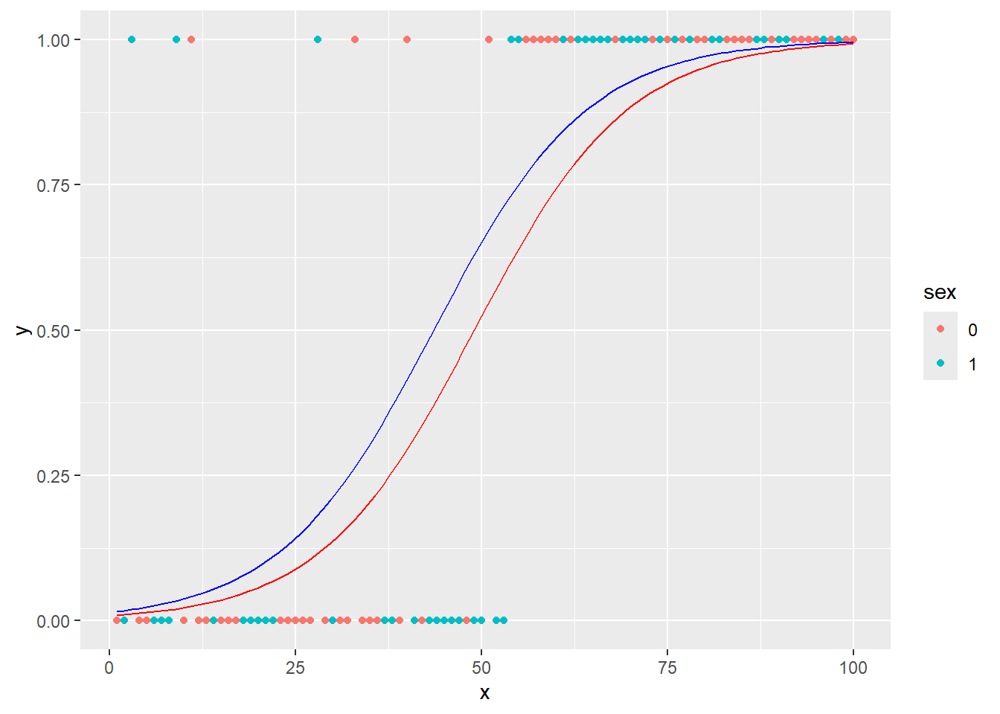](chapter26_files/figure-html/unnamed-chunk-24-1.png)

### 26.4.12 積み上げ式棒グラフ

`geom_bar`関数は積み上げ式棒グラフを作成する際にも用いることができます。積み上げ式棒グラフを描画するときには、特に引数を指定する必要はありませんが、色分けをしないと積み上げたグラフを見分けることができません。積み上げ式グラフを記述するときには、`color`とともに、棒の中身の色を設定する`fill`という引数で、色を指定するのが良いでしょう。

`geom_bar`で積み上げ式グラフが記述されるのは、`geom_bar`の`position`引数のデフォルトが`position="stack"`だからです。`position="dodge"`を指定すると、横並びにしたグラフが表示されます。

``` downlit
d |> 
  ggplot(aes(x = "1", y = mSepal.Length, color = Species, fill = Species)) +
  geom_bar(stat = "identity")
```

[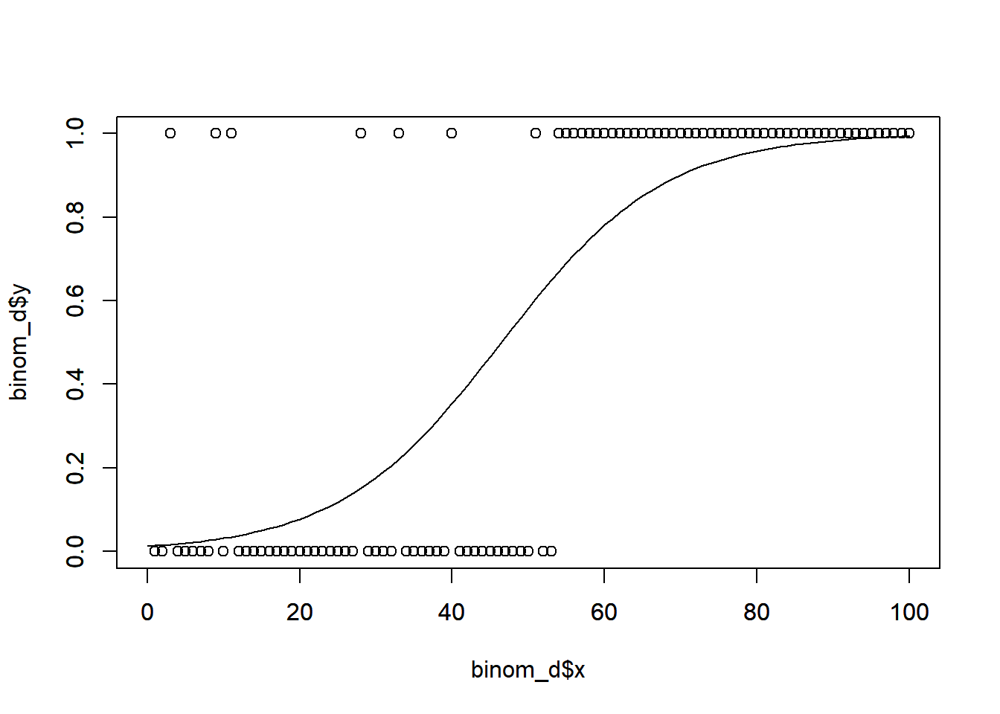](chapter26_files/figure-html/unnamed-chunk-25-1.png)

``` downlit
d |> 
  ggplot(aes(x = "1", y = mSepal.Length, color = Species, fill = Species)) +
  geom_bar(stat = "identity", position = "dodge")
```

[](chapter26_files/figure-html/unnamed-chunk-26-1.png)

### 26.4.13 geom_dotplot

`geom_dotplot`はドットプロットという、ヒストグラムを点で描いたようなグラフを作成するときに用いる関数です。ドットの数がその値の範囲に存在する値の個数を示します。縦軸の単位がよくわからないものになりますので、通常はヒストグラムの方が使い勝手が良いでしょう。

``` downlit
iris |> 
  ggplot(aes(x = Sepal.Length)) +
  geom_dotplot()
```

    Bin width defaults to 1/30 of the range of the data. Pick better value with
    `binwidth`.

[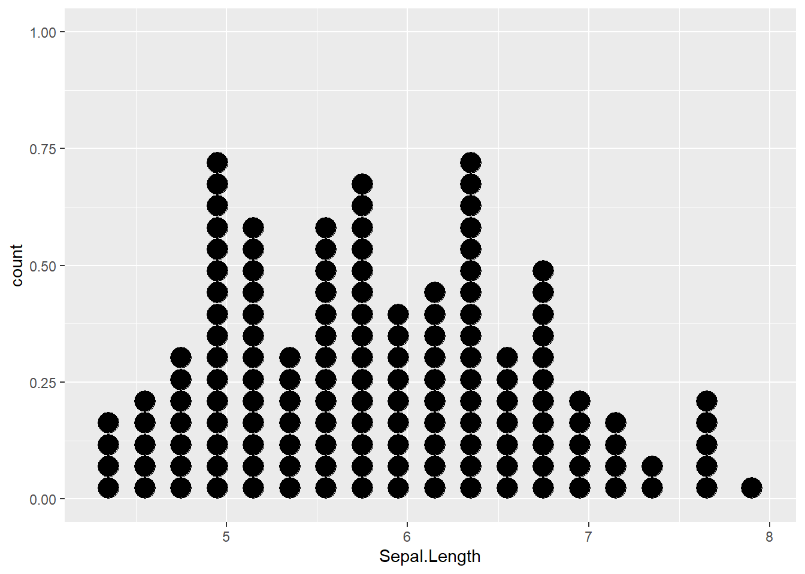](chapter26_files/figure-html/unnamed-chunk-27-1.png)

### 26.4.14 geom_density

`geom_density`はヒストグラムと類似していますが、単に度数を返すのではなく、カーネル密度に変換した度数分布を示してくれる関数です。`geom_density`では、縦軸の値は確率密度となり、実際のデータが少ない部分にも実際の頻度より高めの確率密度が与えられるため、かなりデータが多い場合以外は正確性に欠くことになります。データが少ない場合にはヒストグラムの方が使い勝手が良いでしょう。

``` downlit
iris |> 
  ggplot(aes(x = Sepal.Length)) +
  geom_density()
```

[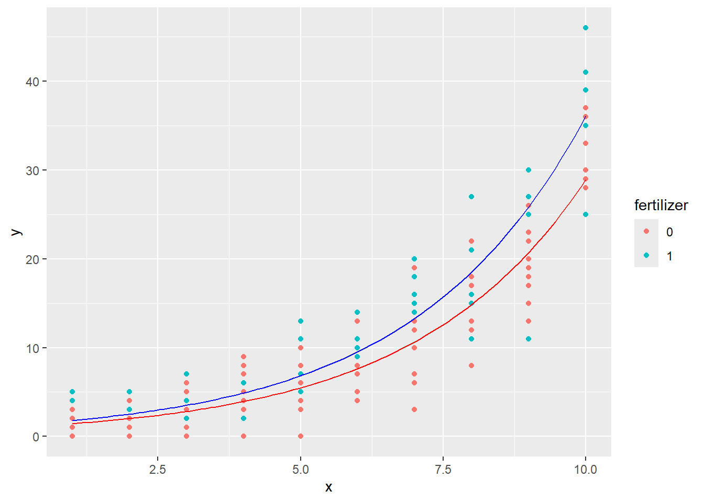](chapter26_files/figure-html/unnamed-chunk-28-1.png)

### 26.4.15 geom_freqpoly

ヒストグラムを棒グラフではなく、線で表記するのが`geom_freqpoly`です。こちらもヒストグラムほど使い勝手は良くないように思います。

``` downlit
iris |> 
  ggplot(aes(x = Sepal.Length)) +
  geom_freqpoly()
```

    `stat_bin()` using `bins = 30`. Pick better value `binwidth`.

[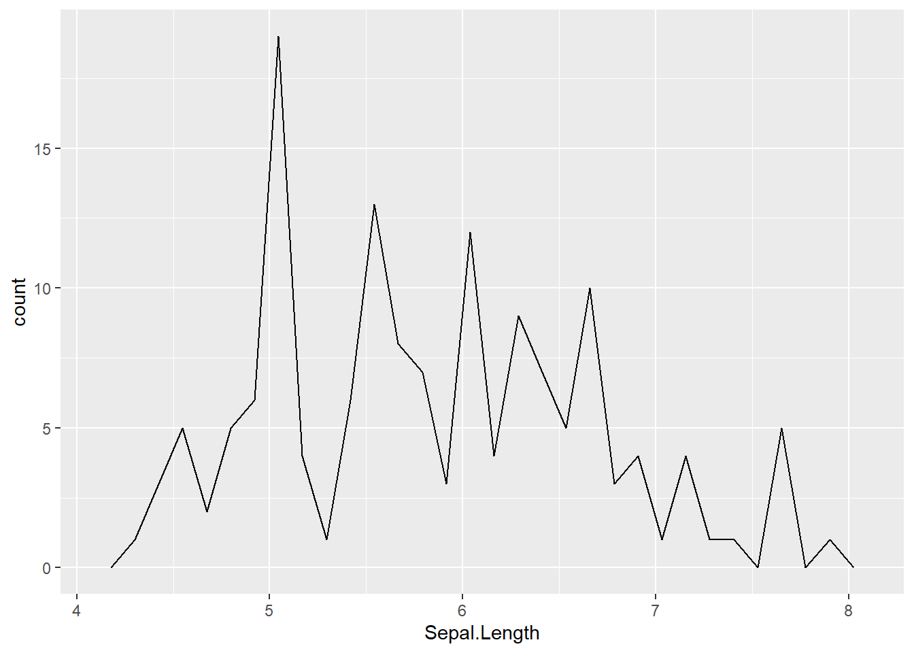](chapter26_files/figure-html/unnamed-chunk-29-1.png)

### 26.4.16 geom_jitter

データの分布は単に散布図でも表示できます。ただし、`geom_point`で単に表記すると、点が重なってしまって正しいデータ分布を示すことはできません。

``` downlit
# geom_pointでは点が重なる
iris |>
  ggplot(aes(x = Species, y = Sepal.Length, color = Species)) +
  geom_point()
```

[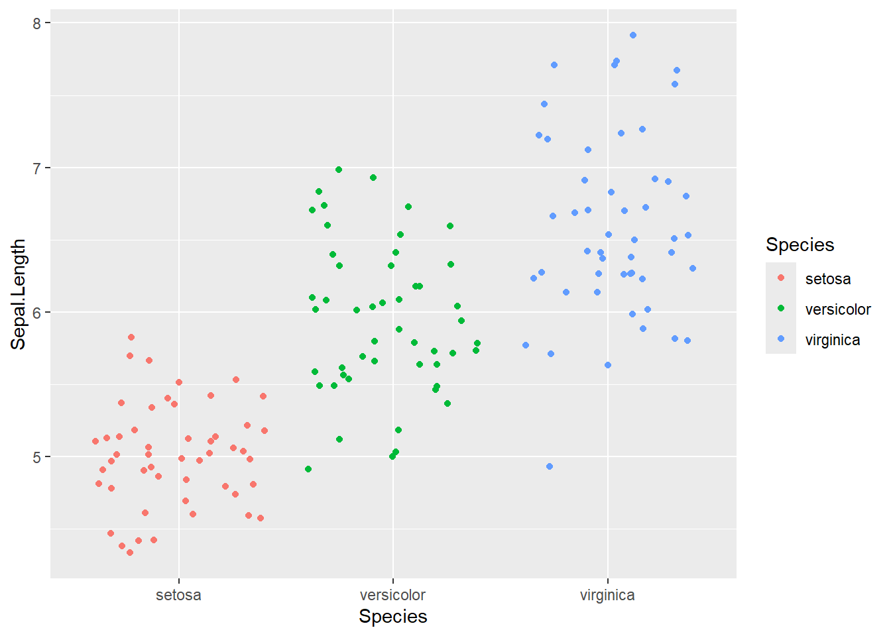](chapter26_files/figure-html/unnamed-chunk-30-1.png)

このような場合に、点の重なりを抑えるため、データの表示にランダムな幅を持たせるのが`geom_jitter`です。`x`と`y`の方向にランダムに点をばらつかせることができます。`x`と`y`の両方が数値の場合にはx軸・y軸方向に幅を持たせることになります。ですので、`x`、`y`の両方が数値の場合には、点は正確な位置には配置されません。

``` downlit
iris |> 
  ggplot(aes(x = Species, y = Sepal.Length, color = Species)) +
  geom_jitter()
```

[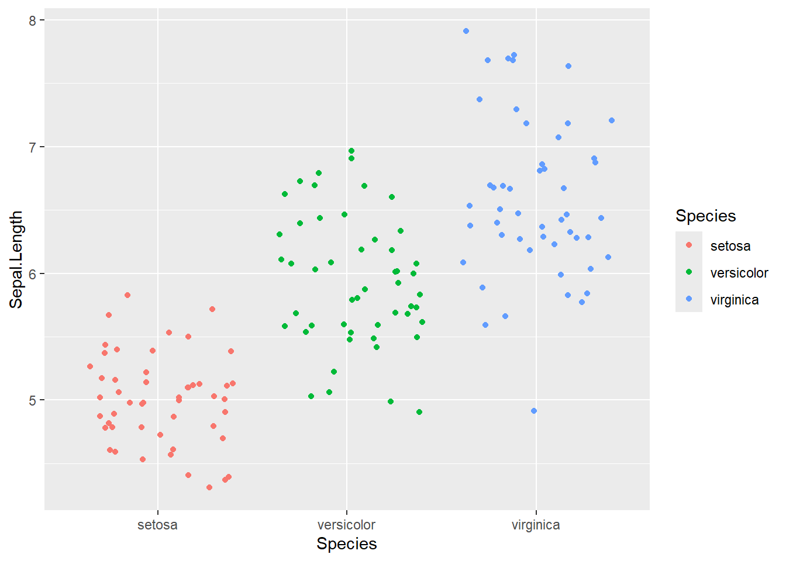](chapter26_files/figure-html/unnamed-chunk-31-1.png)

`geom_jitter`では、`width`と`height`の2つの引数でばらつかせる幅と高さを指定することができます。y方向の値に注目する場合であれば、`height=0`を指定することでy軸方向のばらつきを0にすることができるため、y軸方向には正確な値を表示させることができます。

``` downlit
iris |> 
  ggplot(aes(x = Species, y = Sepal.Length, color = Species)) +
  geom_jitter(width = 0.2, height = 0)
```

[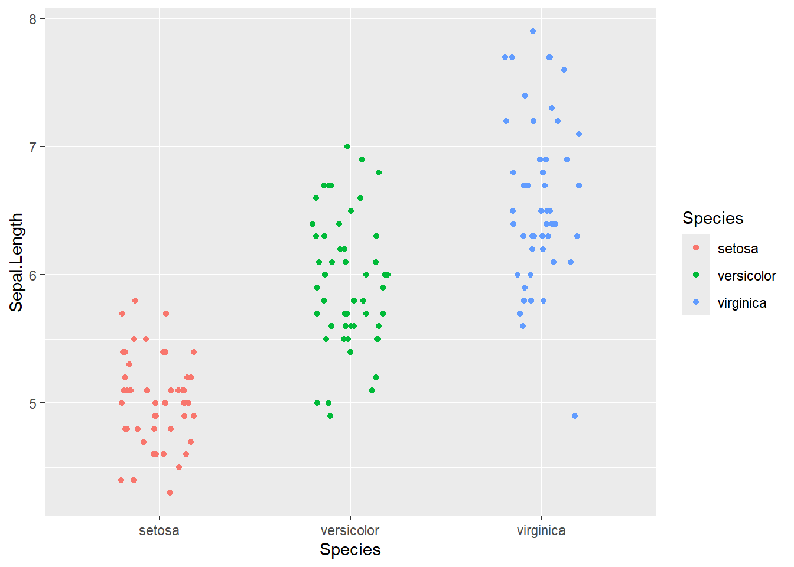](chapter26_files/figure-html/unnamed-chunk-32-1.png)

### 26.4.17 geom_boxplot

データが十分に多い場合には、箱ひげ図を用いてデータの分布を表示することもできます。`ggplot2`では、`geom_boxplot`を用いて箱ひげ図を描画することができます。`geom_boxplot`に数値ベクターを与えれば、自動的に箱ひげ図を描画してくれます。また、`lower`、`upper`、`middle`、 `min`、`max`という引数を与えると、その引数に設定した数値に従い箱ひげ図を描画することもできます。

``` downlit
iris |> 
  ggplot(aes(x = Species, y = Sepal.Length)) +
  geom_boxplot()
```

[](chapter26_files/figure-html/unnamed-chunk-33-1.png)

### 26.4.18 geom_violin

確率密度を90度回転させ、左右対称に配置した形のグラフのことを、**バイオリンプロット**と呼びます。`ggplot2`では、このバイオリンプロットを`geom_violin`で描画することができます。描画の仕組みは`geom_density`によく似ています。

``` downlit
iris |> 
  ggplot(aes(x = Species, y = Sepal.Length)) +
  geom_violin()
```

[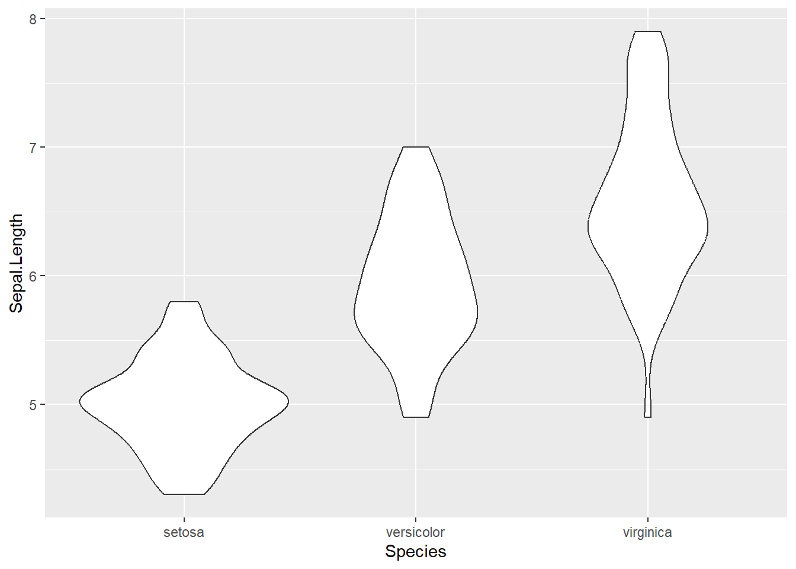](chapter26_files/figure-html/unnamed-chunk-34-1.png)

### 26.4.19 エラーバーの描画：geom_errorbar、geom_linerange、geom_pointrange

`ggplot2`で結果にエラーバーを付ける時には、`geom_errorbar`を用います。`geom_errorbar`では、`aes`の引数として、`ymin`と`ymax`、もしくは`xmin`と`xmax`を設定します。`ymin`と`ymax`はy軸方向の、`xmin`と`xmax`はx軸方向のエラーバーを設定する際に用います。また、`geom_errorbar`には`width`という引数もあり、エラーバーの横棒のサイズを設定することができます。

`geom_errorbar`は通常、`geom_point`で描画した点グラフや、`geom_bar`で描画した棒グラフに重ねて表示することで用います。重ね書きする際には、`ggplot`に`+`で`geom_point`をつないだ後に、さらに`+`で`geom_errorbar`をつなぐことになります。このように`+`でつなぐと、`ggplot2`では`geom_point`の点グラフの上に、`geom_errorbar`が重ね描きされます。

``` downlit
p <- d |> 
  ggplot(
    aes(
      x = Species, 
      y = mSepal.Length, 
      ymax = mSepal.Length + sSepal.Length,
      ymin = mSepal.Length - sSepal.Length))

p + geom_point() + geom_errorbar()
```

[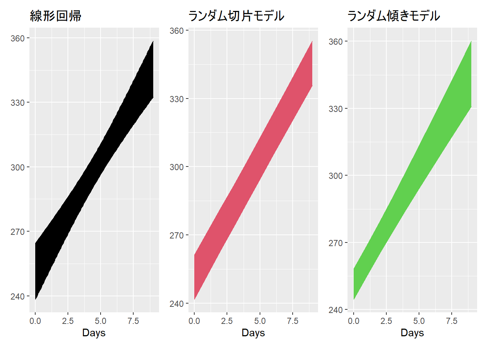](chapter26_files/figure-html/unnamed-chunk-35-1.png)

`geom_errorbar`ではエラーバーに横線が付き、よく見るエラーバーの形となります。ただし、この横線は必ずしも必要なものではありません。横線のないエラーバーを付けたいときには、`geom_linerange`を用います。

``` downlit
p + geom_point() + geom_linerange()
```

[](chapter26_files/figure-html/unnamed-chunk-36-1.png)

`geom_errorbar`や`geom_linerange`は点が備わっておらず、別途`geom_point`で点を書く必要があります。この点と線を同時に描画するのが、`geom_pointrange`です。`geom_pointrange`を用いると、`geom_point`を別途描画しなくても、点とエラーバーが付いたグラフを作成することができます。このような、点と線のみで記述するグラフのことを**フォレストプロット**と呼び、[メタ解析](https://ja.wikipedia.org/wiki/%E3%83%A1%E3%82%BF%E3%82%A2%E3%83%8A%E3%83%AA%E3%82%B7%E3%82%B9)などでよく用いられています。

``` downlit
p + geom_pointrange()
```

[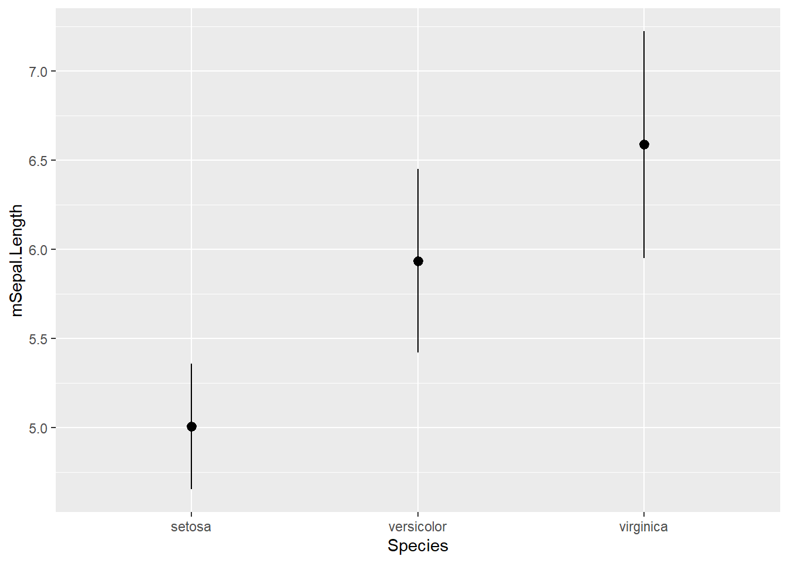](chapter26_files/figure-html/unnamed-chunk-37-1.png)

棒グラフにもエラーバーを付けることはできます。棒グラフにエラーバーを付ける時には、`stat="identity"`で指定した`geom_bar`に、`+`で`geom_errorbar`や`geom_linerange`をつなげます。

``` downlit
p +
  geom_bar(stat = "identity") +
  geom_linerange()
```

[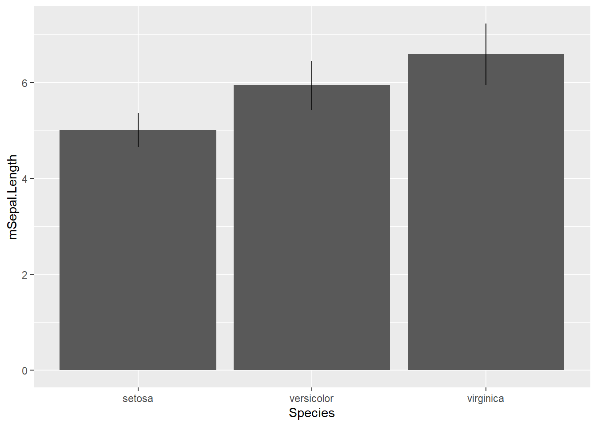](chapter26_files/figure-html/unnamed-chunk-38-1.png)

#### 26.4.19.1 position=“dodge”とエラーバーの位置

複数のタイプのデータに対して棒グラフを横に並べて描画し、その棒グラフにエラーバーを付けたい、という場合もあります。`geom_bar`のデフォルトは`position="stack"`ですので、複数のタイプのデータを表示するときには積み上げ式の棒グラフが描画されます。横に棒グラフを並べる場合には、`position="dodge"`を指定する必要があります。

では、具体的に`position="dodge"`の棒グラフにエラーバーを付与する手順を見ていきましょう。まずは、データフレームでデータを準備する必要があります。`dplyr`や`tidyr`を用いることで、データの準備を比較的簡単に行うことができます。

下の例では、`iris`の`Species`以外のデータ（`Sepal.Length`、`Sepal.Width`、`Petal.Length`、`Petal.Width`）を`pivot_longer`を用いて縦持ちに変換し、データ名と`Species`でグループ化した後、それぞれの平均値と標準偏差を求めています。棒グラフやフォレストプロットの描画の準備では、`pivot_longer`、`group_by`、`summarise`を用いることが多く、データの要約を求める際にも便利な組み合わせです。

具体的にどのように変換しているのか分かりにくければ、`pivot_longer`までと、それ以降を切り離して実行してみると良いでしょう。

``` downlit
d1 <- 
  iris |> 
  pivot_longer(1:4) |> 
  group_by(name, Species) |> 
  summarise(mvalue = mean(value), svalue = sd(value))
  
d1
```

    # A tibble: 12 × 4
    # Groups:   name [4]
       name         Species    mvalue svalue
       <chr>        <fct>       <dbl>  <dbl>
     1 Petal.Length setosa      1.46   0.174
     2 Petal.Length versicolor  4.26   0.470
     3 Petal.Length virginica   5.55   0.552
     4 Petal.Width  setosa      0.246  0.105
     5 Petal.Width  versicolor  1.33   0.198
     6 Petal.Width  virginica   2.03   0.275
     7 Sepal.Length setosa      5.01   0.352
     8 Sepal.Length versicolor  5.94   0.516
     9 Sepal.Length virginica   6.59   0.636
    10 Sepal.Width  setosa      3.43   0.379
    11 Sepal.Width  versicolor  2.77   0.314
    12 Sepal.Width  virginica   2.97   0.322

上で作成したデータフレームを用いて、`ggplot2`でグラフを描画します。まずは`ggplot`関数で`aes`を設定していきます。`x`軸に`Species`、`y`軸に平均値とエラーバーの要素に平均値±標準偏差（`ymin`、`ymax`）、棒の枠の色（`color`）と棒の中身の色（`fill`）にデータ名を設定しておきます。

``` downlit
p1 <- d1 |> 
  ggplot(
    aes(
      x = Species, 
      y  =mvalue, 
      ymax = mvalue + svalue, 
      ymin = mvalue - svalue,
      color = name,
      fill = name
      )
    )
```

この`ggplot`関数に、`geom_bar`と`geom_linerange`を`+`でつなげると、下の図のように、積み上げ式棒グラフの下の方にエラーバーが重なって表示される、変なグラフが作成されます。これは、`geom_bar`の引数の設定が`position="stack"`であるため積み上げ式棒グラフとなる一方で、`geom_linerange`などのエラーバーを指定する`geom`関数には積み上げ式の設定がないためです。

``` downlit
# positionを指定しないと、積み上げ式棒グラフになる
p1 +
  geom_bar(stat = "identity") +
  geom_linerange()
```

[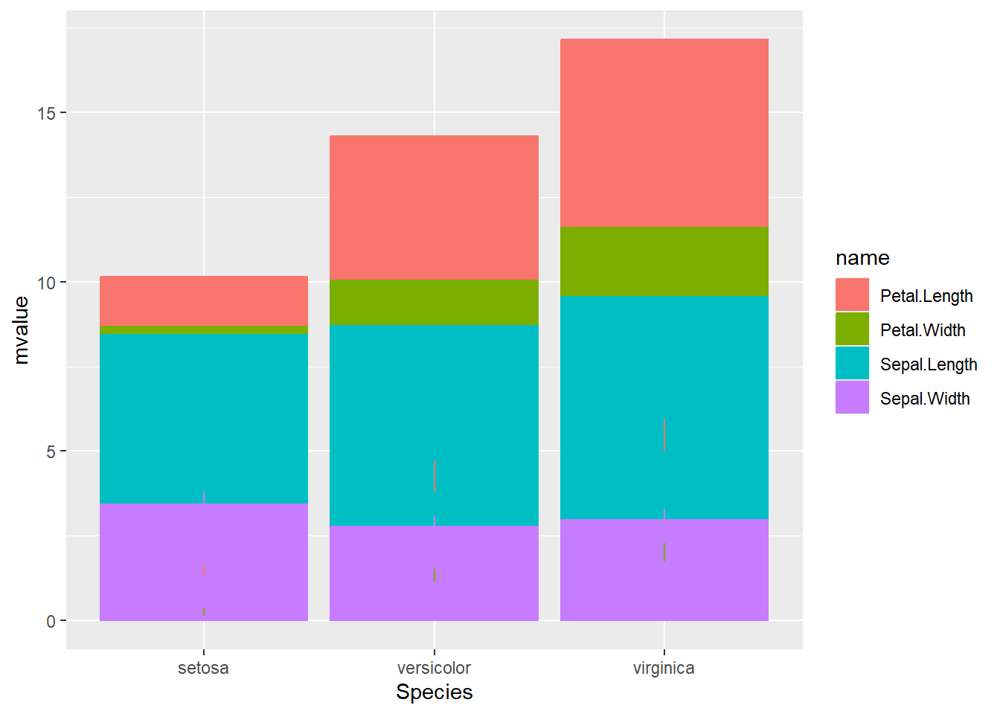](chapter26_files/figure-html/unnamed-chunk-41-1.png)

`position`に`"dodge"`を指定すると、棒グラフは積み上げ式ではなく、横に並べる形となります。このとき、エラーバーは棒グラフの真ん中に配置されてしまい、どの棒グラフのエラーバーなのかわからなくなります。これは、`geom_linerange`の`position`の設定が正しく行われていないためです。

``` downlit
p1 +
  geom_bar(stat = "identity", position="dodge") +
  geom_linerange()
```

[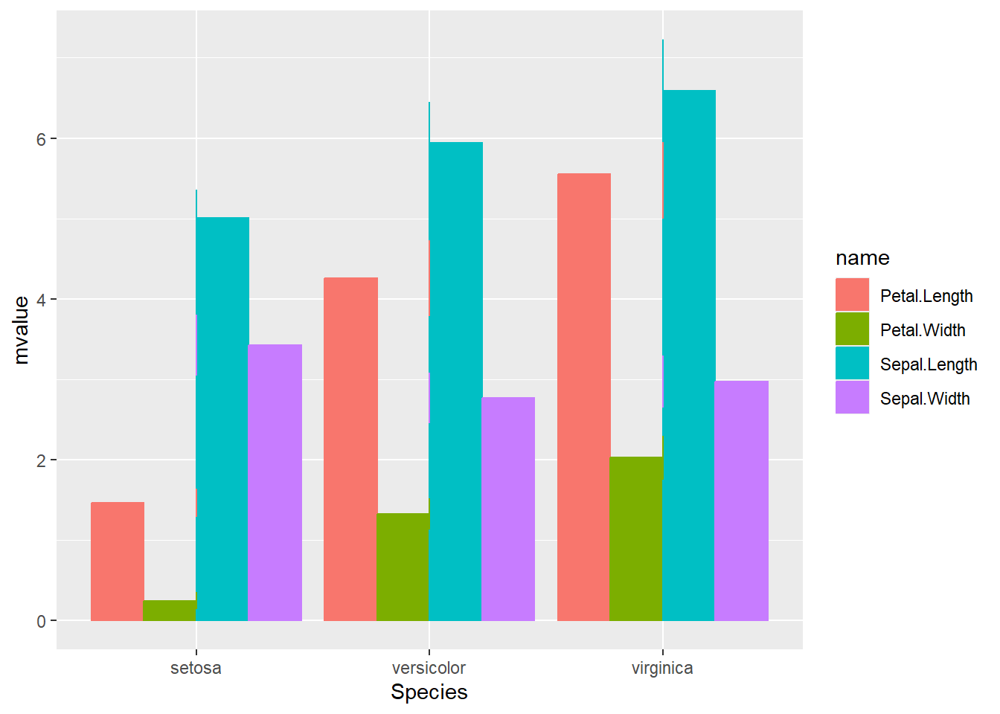](chapter26_files/figure-html/unnamed-chunk-42-1.png)

`geom_linerange`を含む、エラーバーを描画するための`geom`関数の`position`の指定には、`position_dodge`関数を用います。`position=position_dodge(width=0.9)`という形で`geom_linerange`の`position`を指定すると、エラーバーが正しい位置（棒グラフの真ん中）に配置されます。やや複雑ですし、`width=0.9`の意味はよくわからないのですが、この方法は`ggplot2`の[Reference](https://ggplot2.tidyverse.org/reference/geom_linerange.html)にも記載されています。

``` downlit
p1 +
  geom_bar(stat = "identity", position = "dodge") +
  geom_linerange(position = position_dodge(width = 0.9))
```

[](chapter26_files/figure-html/unnamed-chunk-43-1.png)

> **TIP:**
>
> 上記のように、棒グラフとエラーバーの色を同じにすると、エラーバーの下側が見えなくなります。このようなグラフ（ダイナマイトっぽい形をしているので、ダイナマイトプロットと呼ばれます）では、エラーバーで示したい範囲が不明瞭となるため、データ表示の方法としては良くないとされています。点と線で表すフォレストプロット（`geom_pointrange`）を用いたほうが、棒グラフとエラーバーを用いるより、データの表示方法としては優れています。

### 26.4.20 geom_bin2d

`geom_bin2d`は`x`軸、`y`軸に値を設定し、`x`・`y`それぞれの値のデータを度数分布に変換した上で、度数を2次元グラフ上に色で示すものです。2次元で表示するヒストグラムにあたります。ただし、下の図のようにデータが多く、分布が薄く広がっている場合には度数の差が分かりにくくなってしまいます。

``` downlit
diamonds |> 
  ggplot(aes(x=carat, y=price)) +
  geom_bin2d()
```

    `stat_bin2d()` using `bins = 30`. Pick better value `binwidth`.

[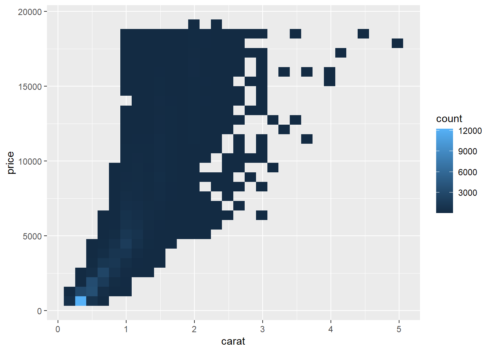](chapter26_files/figure-html/unnamed-chunk-44-1.png)

このようなデータで度数を調べる場合には、`geom_point`と透明化を指定する引数である`alpha`を用いるのが良いでしょう。`alpha`を小さい値に指定すると、度数の多いところは濃い色で、度数が小さいところは薄い色で表示されます。下のグラフは上の`geom_bin2d`と同じものを表現していますが、こちらの方がデータの分布としては理解しやすいことがわかるかと思います。

``` downlit
diamonds |> 
  ggplot(aes(x=carat, y=price)) +
  geom_point(alpha=0.004)
```

[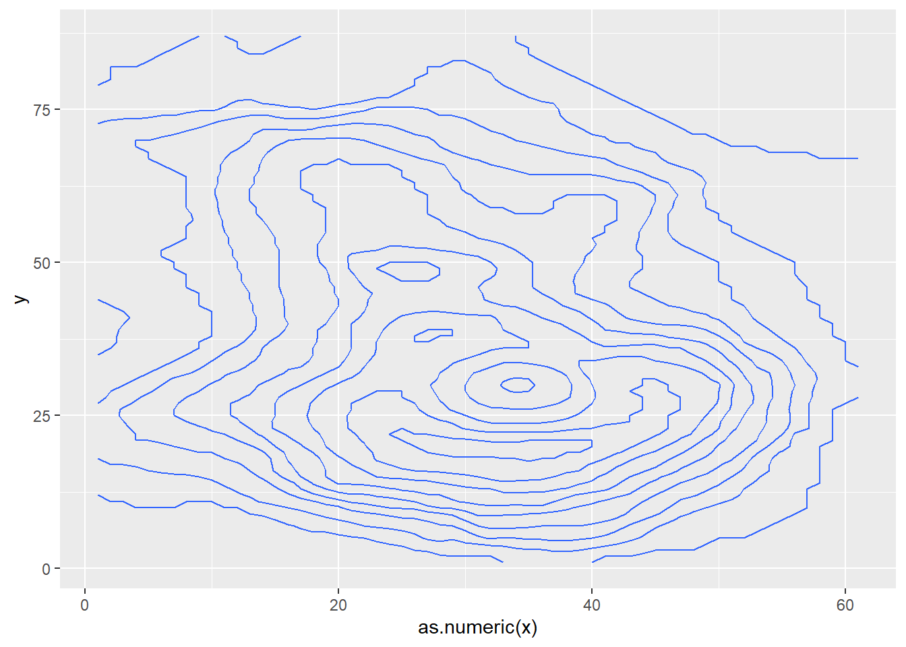](chapter26_files/figure-html/unnamed-chunk-45-1.png)

棒グラフと同様に、`geom_bin2d`も`stat="identity"`と指定することで、数値をそのまま色とするグラフを作成することができます。下の例では、`volcano`データセット（マウンガファウの南北・東西の位置と標高のデータ）を変形し、`geom_bin2d`で描画したものです。このように`stat="identity"`を用いれば、`geom_bin2d`を用いてヒートマップを作成することもできます。

``` downlit
volcano |> 
  as.data.frame() |> 
  cbind(y = 1:nrow(volcano)) |> 
  pivot_longer(1:ncol(volcano), values_to = "altitude", names_to = "x") |> 
  mutate(x = as.numeric(str_remove_all(x, "V"))) |> 
  ggplot(aes(x = as.numeric(x), y = y, color = altitude, fill = altitude)) +
    geom_bin2d(stat = "identity")
```

[](chapter26_files/figure-html/unnamed-chunk-46-1.png)

### 26.4.21 geom_contour

`geom_contour`はRの`contour`関数と同じく、標高線で示された図を表記するのに用いる関数です。`geom_bin2d`とは異なり、`aes`には3つの値（`x`、`y`、`z`）を指定する必要があります。

``` downlit
volcano |> 
  as.data.frame() |> 
  cbind(y = 1:nrow(volcano)) |> 
  pivot_longer(1:ncol(volcano), values_to = "altitude", names_to = "x") |> 
  mutate(x = as.numeric(str_remove_all(x, "V"))) |> 
  ggplot(aes(x = as.numeric(x), y = y, z = altitude)) +
    geom_contour()
```

[](chapter26_files/figure-html/unnamed-chunk-47-1.png)

Rデフォルトの`filled.contour`関数と同様に、等高線に色を合わせて表示するようなグラフを作成する場合には、`geom_contour_filled`を用います。`geom_contour_filled`を用いることで、`z`の値に従い色分けされたグラフを描画することができます。

``` downlit
volcano |> 
  as.data.frame() |> 
  cbind(y = 1:nrow(volcano)) |> 
  pivot_longer(1:ncol(volcano), values_to = "altitude", names_to = "x") |> 
  mutate(x = as.numeric(str_remove_all(x, "V"))) |> 
  ggplot(aes(x = as.numeric(x), y = y, z = altitude)) +
    geom_contour_filled()
```

[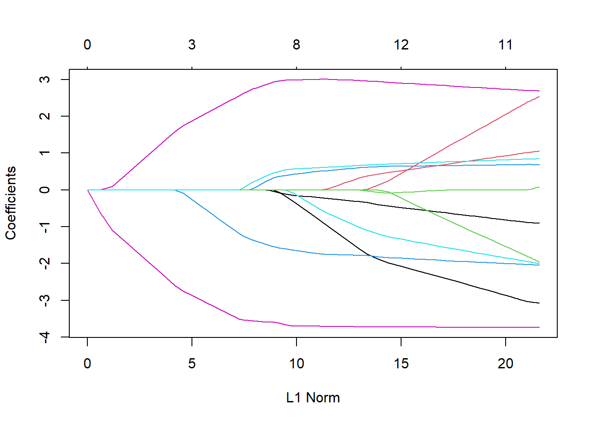](chapter26_files/figure-html/unnamed-chunk-48-1.png)

### 26.4.22 geom_map

`geom_map`は地図を表示するための関数です。地図を表記するためには、地図データ、つまり緯度、経度とその場所のIDを記録したもの、を準備する必要があります。

Rで地図データを用いる場合には、`maps`パッケージ([Richard A. Becker et al. 2023](#ref-maps_bib))を利用するのが比較的簡単です。`maps`パッケージには世界地図、アメリカの州の地図、フランスやイタリア、ニュージーランドなどの地図が登録されています。`maps`パッケージの地図を`ggplot2`で用いる場合には、`ggplot2`で使用できるデータフレームに変換してくれる`maps`パッケージの関数である、`map_data`を用います。

``` downlit
pacman::p_load(maps)
state <- map_data("state") # アメリカの州データをggplot用に変換
head(state) # 緯度（lat）、経度（long）などを含むデータフレーム
```

           long      lat group order  region subregion
    1 -87.46201 30.38968     1     1 alabama      <NA>
    2 -87.48493 30.37249     1     2 alabama      <NA>
    3 -87.52503 30.37249     1     3 alabama      <NA>
    4 -87.53076 30.33239     1     4 alabama      <NA>
    5 -87.57087 30.32665     1     5 alabama      <NA>
    6 -87.58806 30.32665     1     6 alabama      <NA>

`ggplot2`では、`map_data`で変換したデータフレームを`ggplot`関数の引数にするのではなく、`map_data`で`region`に指定されているラベル（地域）を含むデータフレームを用います。

`USArrests`はアメリカの州別の10万人あたりの犯罪件数を記録したデータフレームです。このデータフレームの行名が州名になっているので、これをデータフレームの列に追加し、`state`と表記を合わせるために小文字に変換します。

`aes`では、`map_id=state`とし、地図IDを指定します。さらに、`fill`には`USArrests`の列名である`Murder`（殺人の件数）を指定します。この形で指定することで、`Murder`の値が色で示されることになります。

`geom_map`では、さらに`map`という引数に、`map_data`の返り値（`state`）を指定する必要があります。こうすることで、`geom_map`は`state`を基準に地図を描画し、地図の色に`fill`で指定した`Murder`の値を適用します。

``` downlit
# coord_sfを用いるためにsfパッケージをロードする
pacman::p_load(sf)

USArrests |> 
  mutate(state = tolower(rownames(USArrests))) |> 
  ggplot(aes(map_id = state, fill = Murder)) +
  geom_map(map = state) +
  coord_sf(
      crs = 5070, default_crs = 4326,
      xlim = c(-125, -70), ylim = c(25, 52)
    )
```

[](chapter26_files/figure-html/unnamed-chunk-50-1.png)

### 26.4.23 geom_sf

上記のようにすれば、地図を表記することはできますが、やや煩雑です。近年のRでは、地図データを扱う際には、地図データ取り扱いの専用クラスである**`sf`（simple features）**を用いるのが一般的になっています。この`sf`を用いれば、グラフをより簡単に作成することができます。

`sf`クラスは、`sf`パッケージ([Pebesma and Bivand 2023](#ref-sf_bib1); [Pebesma 2018](#ref-sf_bib2))で定義されているクラスです。`sf`を使用する際には、まず`sf`パッケージを読み込みます。

`sf`パッケージをインストールすると、`sf`パッケージ内にある地図データにアクセスできます。下の例では、`sf`パッケージのフォルダ内にある地図データ（North Carolinaのsfデータ）を読み込んでいます。

``` downlit
# system.fileはパッケージからフルパスを読み込む関数
fname <- system.file("shape/nc.shp", package="sf")
nc <- st_read(fname) # North Carolinaのsfデータ
```

    Reading layer `nc' from data source 
      `C:\Program Files\R\R-4.6.0\library\sf\shape\nc.shp' using driver `ESRI Shapefile'
    Simple feature collection with 100 features and 14 fields
    Geometry type: MULTIPOLYGON
    Dimension:     XY
    Bounding box:  xmin: -84.32385 ymin: 33.88199 xmax: -75.45698 ymax: 36.58965
    Geodetic CRS:  NAD27

`sf`は基本的にデータフレームで、`geometry`という列を持っています。この列は、`sfc`クラスのデータです。`sfc`クラスはその行に対応する緯度・経度のセットを専用の表記法で示したものとなります。`sf`を用いる場合には、この`geometry`が地図データを表現する列になります。

``` downlit
class(nc) # sfはデータフレームの一種
```

    [1] "sf"         "data.frame"

``` downlit
nc # geometryという列に地図データが格納されている
```

    Simple feature collection with 100 features and 14 fields
    Geometry type: MULTIPOLYGON
    Dimension:     XY
    Bounding box:  xmin: -84.32385 ymin: 33.88199 xmax: -75.45698 ymax: 36.58965
    Geodetic CRS:  NAD27
    First 10 features:
        AREA PERIMETER CNTY_ CNTY_ID        NAME  FIPS FIPSNO CRESS_ID BIR74 SID74
    1  0.114     1.442  1825    1825        Ashe 37009  37009        5  1091     1
    2  0.061     1.231  1827    1827   Alleghany 37005  37005        3   487     0
    3  0.143     1.630  1828    1828       Surry 37171  37171       86  3188     5
    4  0.070     2.968  1831    1831   Currituck 37053  37053       27   508     1
    5  0.153     2.206  1832    1832 Northampton 37131  37131       66  1421     9
    6  0.097     1.670  1833    1833    Hertford 37091  37091       46  1452     7
    7  0.062     1.547  1834    1834      Camden 37029  37029       15   286     0
    8  0.091     1.284  1835    1835       Gates 37073  37073       37   420     0
    9  0.118     1.421  1836    1836      Warren 37185  37185       93   968     4
    10 0.124     1.428  1837    1837      Stokes 37169  37169       85  1612     1
       NWBIR74 BIR79 SID79 NWBIR79                       geometry
    1       10  1364     0      19 MULTIPOLYGON (((-81.47276 3...
    2       10   542     3      12 MULTIPOLYGON (((-81.23989 3...
    3      208  3616     6     260 MULTIPOLYGON (((-80.45634 3...
    4      123   830     2     145 MULTIPOLYGON (((-76.00897 3...
    5     1066  1606     3    1197 MULTIPOLYGON (((-77.21767 3...
    6      954  1838     5    1237 MULTIPOLYGON (((-76.74506 3...
    7      115   350     2     139 MULTIPOLYGON (((-76.00897 3...
    8      254   594     2     371 MULTIPOLYGON (((-76.56251 3...
    9      748  1190     2     844 MULTIPOLYGON (((-78.30876 3...
    10     160  2038     5     176 MULTIPOLYGON (((-80.02567 3...

`ggplot2`で`sf`を用いてグラフを描画する場合には、`geom_sf`関数を用います。`geom_sf`関数を用いてグラフを作成する場合には、`ggplot`関数の引数となるデータフレームに`sf`、`aes`に`sf`に含まれる列を指定します。`sf`を用いれば、このようなシンプルな表記法で`geom_map`よりも簡単に地図を表記することができます。

``` downlit
# sfを用いたグラフの表記
nc |> 
  ggplot() +
  geom_sf(aes(fill = AREA))
```

[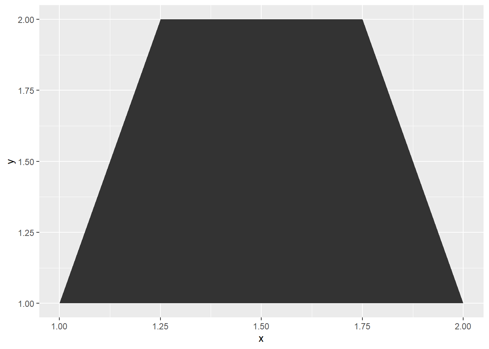](chapter26_files/figure-html/unnamed-chunk-53-1.png)

> **TIP:**
>
> `sf`は2018年に発表された、比較的新しいパッケージです。`sf`が出てくるまでは、Rで地図データを取り扱う方法は様々で、統一されているという感はありませんでしたが、今後は`sf`がデフォルトの地図データ取り扱い方法になっていくのではないかと思います。地図データの取扱いに関してはオンラインの英語の教科書（[Geocomputation with R](https://bookdown.org/robinlovelace/geocompr/)）があり、日本語訳（[Geocomputation with R (日本語版)](https://r.geocompx.org/jp/)）も公開されています。
>
> 地図表示のためのパッケージには`ggplot2`だけでなく、[Leaflet for R](https://rstudio.github.io/leaflet/)というJavascriptの地図ライブラリをRで利用できるようにしたものや、`ggplot2`風の記法で色々なデザインのグラフを描画できる[tmap](https://r-tmap.github.io/tmap/)などもあります。`sf`、`leaflet`、`tmap`については[45章](chapter45.llms.md)で説明します。

### 26.4.24 geom_polygon

`geom_polygon`は多角形を描画するための関数です。データフレームには、多角形の各頂点に当たるxとyの座標を指定します。

``` downlit
# 頂点のx、y座標を指定する
d2 <- data.frame(x = c(1, 1.25, 1.75, 2), y = c(1, 2, 2, 1))
d2
```

         x y
    1 1.00 1
    2 1.25 2
    3 1.75 2
    4 2.00 1

`aes`で頂点の`x`、`y`座標を指定すると、多角形を描画することができます。低レベルグラフィック関数である`polygon`関数と類似した描画の方法になっています。

``` downlit
d2 |> 
  ggplot(aes(x = x, y = y)) +
  geom_polygon()
```

[](chapter26_files/figure-html/unnamed-chunk-55-1.png)

## 26.5 色の設定

上で説明したように、`ggplot2`で色を指定するときには、`aes`中で`color`、`fill`の引数を指定します。`color`、`fill`は数値または因子を指定することができ、点や面を数値・因子に対応した色で表示することができます。

`geom_point`などの点を描画する場合では、`color`のみを指定します。

``` downlit
iris |> 
  ggplot(aes(x = Sepal.Length, y = Sepal.Width, color = Species)) +
  geom_point()
```

[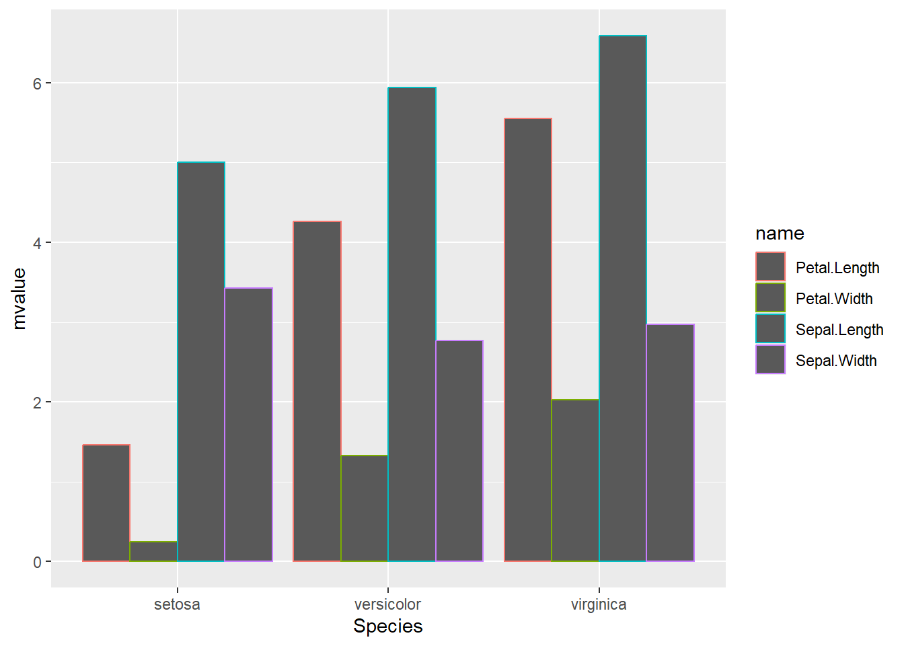](chapter26_files/figure-html/unnamed-chunk-56-1.png)

`color`引数に数値を指定すると、数値に従い色の濃度が変わります。

``` downlit
iris |> 
  ggplot(aes(x = Sepal.Length, y = Sepal.Width, color = Petal.Length)) +
  geom_point()
```

[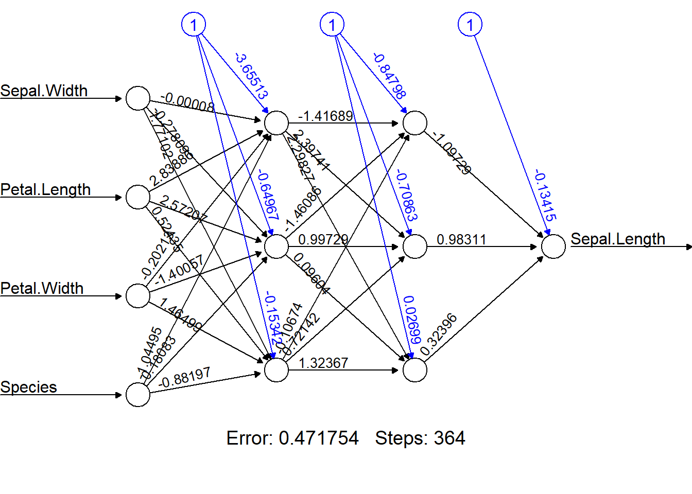](chapter26_files/figure-html/unnamed-chunk-57-1.png)

`geom_bar`では、`color`だけを指定すると、棒グラフの枠だけに色がつきます。

``` downlit
d1 |> 
  ggplot(aes(x = Species, y = mvalue, color = name)) +
  geom_bar(stat = "identity", position = "dodge")
```

[](chapter26_files/figure-html/unnamed-chunk-58-1.png)

`geom_bar`で、棒グラフの中身の色を変えたい時には、`fill`引数を指定する必要があります。

``` downlit
d1 |> 
  ggplot(aes(x = Species, y = mvalue, color = name, fill = name)) +
  geom_bar(stat = "identity", position = "dodge")
```

[](chapter26_files/figure-html/unnamed-chunk-59-1.png)

### 26.5.1 color brewer

`ggplot2`では、`color`や`fill`に引数を指定すれば、特に色の指定をしなくても、いい感じの色でグラフを作成してくれます。ただし、デフォルトの色では見にくい時や、デザイン的に別の色を用いたい場合もあります。色を別途指定したい場合には、[ColorBrewer](https://colorbrewer2.org/#type=sequential&scheme=BuGn&n=3)を用いた色の設定を行います。

`ggplot2`でColorBrewerに従った色を用いる場合には、`scale_color_brewer`を用います。通常の`geom`関数と同様に、`scale_color_brewer`も`+`で繋いで用います。同様に、`fill`に指定した色の配色を変えたい場合には、`scale_fill_brewer`を用います。

色の指定には`palette`引数を用います。`palette`引数には、カラーパレットを指定する文字列を指定します。カラーパレットの種類はヘルプ（`?scale_color_brewer`）から確認できます。

``` downlit
iris |> 
  ggplot(aes(x = Sepal.Length, y = Sepal.Width, color = Species)) +
  geom_point() +
  scale_color_brewer(palette = "Set1")
```

[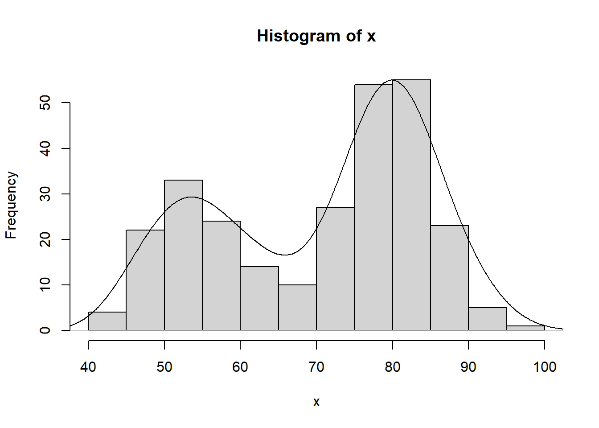](chapter26_files/figure-html/unnamed-chunk-60-1.png)

`color`に数値を指定した場合には、`scale_color_distiller`で色を指定します。`fill`に数値を指定する場合には、`scale_fill_distiller`を用います。

``` downlit
iris |> 
  ggplot(aes(x = Sepal.Length, y = Sepal.Width, color = Petal.Length)) +
  geom_point() +
  scale_color_distiller(palette = "RdYlBu")
```

[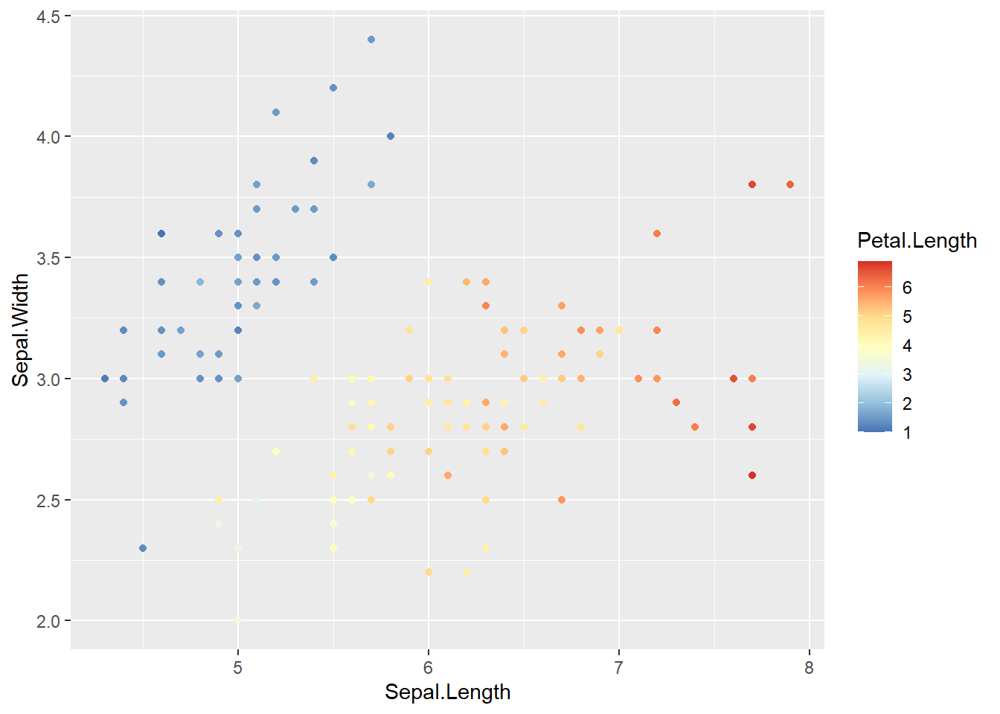](chapter26_files/figure-html/unnamed-chunk-61-1.png)

## 26.6 点のサイズ

`geom_point`などで点のサイズを変更する場合には、`size`引数を指定します。

``` downlit
iris |> 
  ggplot(aes(x = Sepal.Length, y = Sepal.Width, color = Species)) +
  geom_point(size = 10)
```

[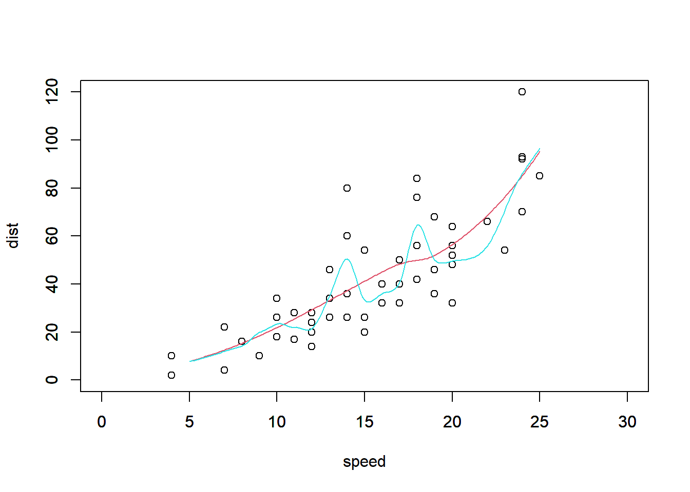](chapter26_files/figure-html/unnamed-chunk-62-1.png)

`size`引数は`aes`内で、数値の列名を取る形でも宣言できます。`aes`内で数値で指定した場合には、その数値に応じた点のサイズで表示されます。このように点のサイズを列名で指定することで、3つの要素（`x`、`y`、`size`）を3次元グラフを用いることなく表現することができます。このようなグラフのことを**バブルチャート**と呼びます。

``` downlit
iris |> 
  ggplot(aes(x = Sepal.Length, y = Sepal.Width, color = Species, size = Petal.Length)) +
  geom_point()
```

[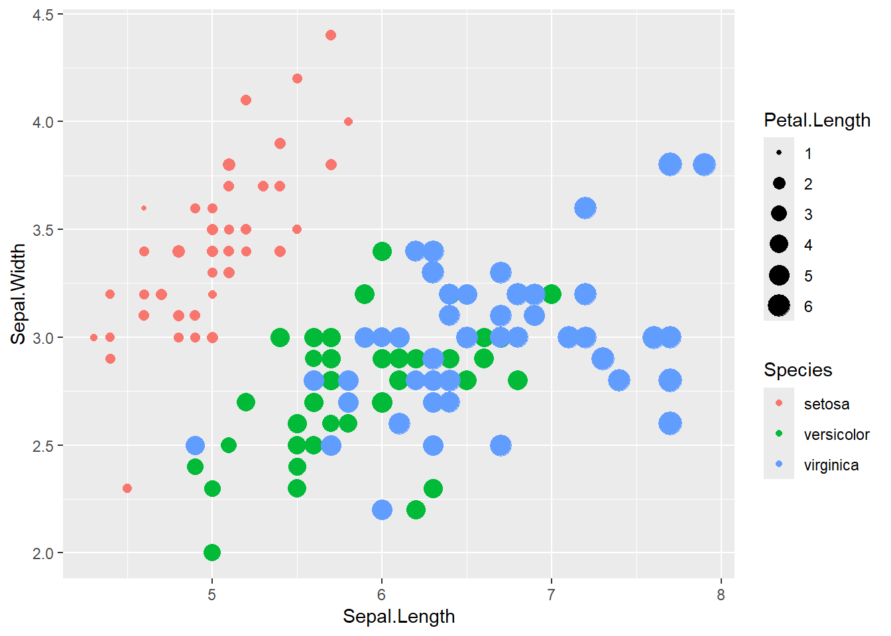](chapter26_files/figure-html/unnamed-chunk-63-1.png)

## 26.7 点の透明化

点が大きくなると、重なった点は見えなくなります。重なった点を表示する方法には、ジッタープロット（`geom_jitter`）などがありますが、x軸もy軸も数値の場合には、位置がランダムに変化することで正確な値を示さなくなります。

重なった点を適切に表示する場合、**透明化**が有効となる場合があります。上で説明した通り、透明化を指定する引数は`alpha`です。`alpha`には0～1までの値を指定することができ、0では完全に透明、1では完全に不透明の点を表示することになります。

``` downlit
iris |> 
  ggplot(aes(x = Sepal.Length, y = Sepal.Width, color = Species)) +
  geom_point(size = 10, alpha = 0.2)
```

[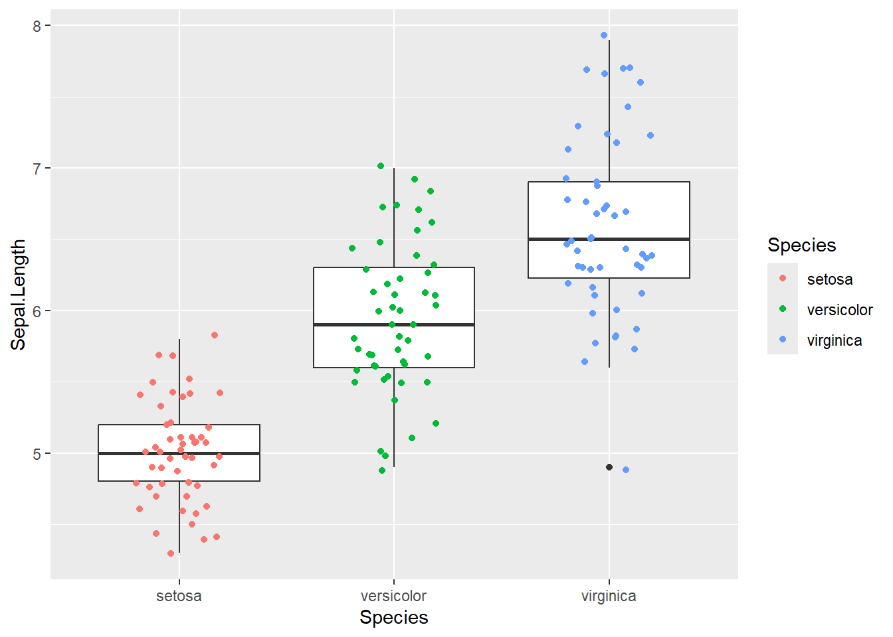](chapter26_files/figure-html/unnamed-chunk-64-1.png)

## 26.8 線の太さとタイプ

`geom_line`等の線グラフで線の太さを指定する場合には`linewidth`引数を、線のタイプを指定する場合には、`linetype`引数を用います。`linewidth`引数には太さを数値で指定します。`linetype`には、`"solid"`、`"dashed"`、`"dotted"`、`"dotdash"`、`"longdash"`、`"twodash"`の各タイプがあり、それぞれ文字列で指定します。線タイプの詳細については、`vignette("ggplot2-specs")`を実行することで確認できます。

``` downlit
iris |> 
  ggplot(aes(x = Sepal.Length, y = Sepal.Width)) +
  geom_line(linewidth = 1, linetype = "dotted")
```

[](chapter26_files/figure-html/unnamed-chunk-65-1.png)

## 26.9 グラフの重ね書き

グラフの重ね書きを行う場合には、複数の`geom`関数を`+`で繋ぎます。後に指定した`geom`関数が重ね書きの上層（上のレイヤー）に表示されることになります。重ね書きしたグラフの色が下層のグラフの色と同一だと見えなくなってしまうため、通常は色を変えて表示します。

重ね書きするグラフの間でデータが異なる場合には、`ggplot`関数でデータフレーム・`aes`を設定せず、`geom`関数内でそれぞれ`data`・`aes`を指定します。`data`にはデータフレームを指定します。`geom`関数内で別の`data`を指定することで、それぞれの`geom`関数のグラフに別のデータフレームからのデータを用いることもできます。

``` downlit
iris |> 
  ggplot(aes(x = Species, y = Sepal.Length)) +
  geom_boxplot() +
  geom_jitter(aes(color = Species), width = 0.2, height = 0)
```

[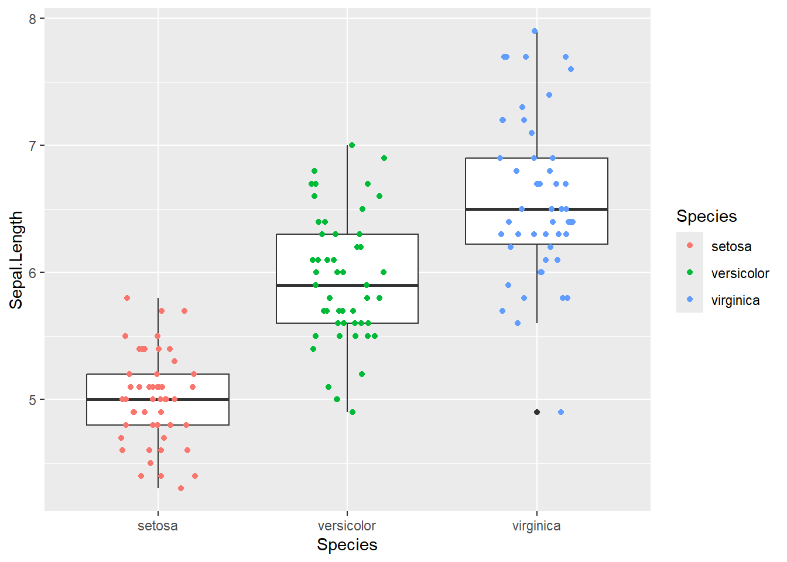](chapter26_files/figure-html/unnamed-chunk-66-1.png)

## 26.10 複数のグラフの表示：facetting

データフレームに異なる要素（因子）のデータが保存されており、要素ごとに別々にグラフにしたい場合には、facetting（facet：宝石のカットの面のこと）を用います。facettingには、`facet_wrap`と`facet_grid`の2つの関数ががあります。`facet_wrap`はデータフレームの要素で分けたグラフを単に並べたもの、`facet_grid`はx、y方向に要素がそろったグラフ群を作成する関数です。

### 26.10.1 facet_wrap

以下は`facet_wrap`の例です。グラフを分ける要素は、`facet_wrap`内でチルダ（`~`）を用いて指定します。チルダの左側、右側のどちらに要素をおいても問題ありませんが、右側の要素を入力しない場合には、ピリオド（`.`）を入力しておきます。グラフはよい感じに縦・横に並べられ、表示されます。並べる順番は要素の因子（factor）のレベル順となります。

``` downlit
d1 |> 
  ggplot(aes(x = Species, y = mvalue)) +
  geom_bar(stat = "identity") +
  facet_wrap(~ name)
```

[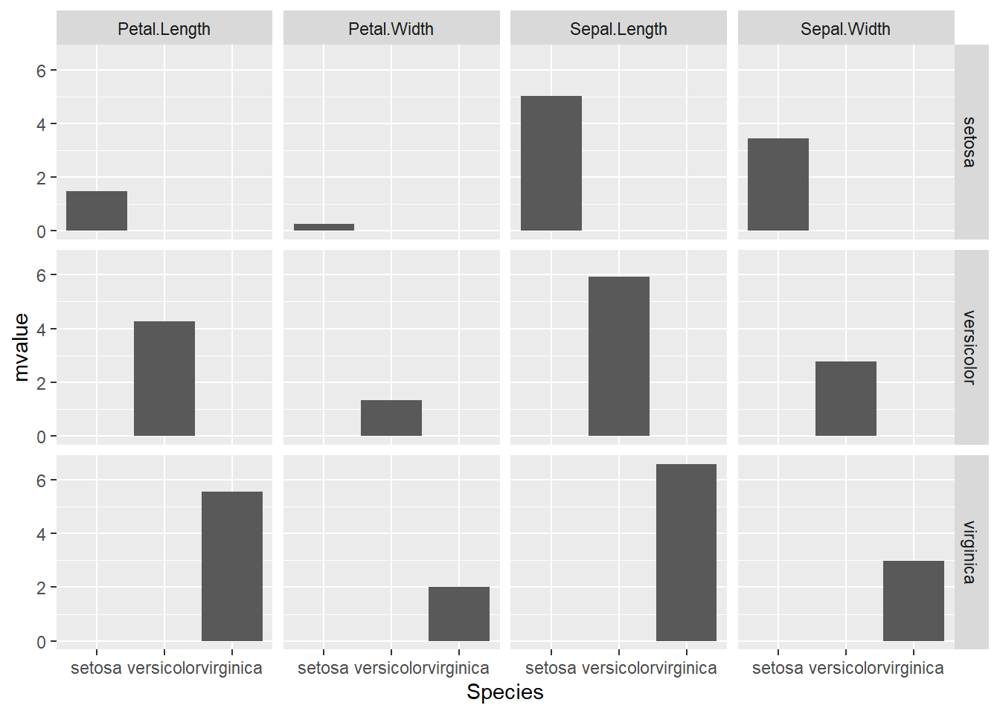](chapter26_files/figure-html/unnamed-chunk-67-1.png)

#### 26.10.1.1 scalesの指定

`facet_wrap`を用いたときに、表示するグラフごとに縦軸のスケールを調整する場合には、`scales`引数を指定します。`scales`引数は`facet_wrap`関数内で指定し、`scales="free_y"`ならy方向のスケールが、`scales="free_x"`ならx方向のスケールが、`scales="free"`ならx、y両方のスケールが自動的に調整されます。

``` downlit
# scalesを指定すると、y軸のスケールがグラフごとに自動調整される
d1 |> 
  ggplot(aes(x = Species, y = mvalue)) +
  geom_bar(stat = "identity") +
  facet_wrap(~ name, scales = "free_y")
```

[](chapter26_files/figure-html/unnamed-chunk-68-1.png)

### 26.10.2 facet_grid

`facet_grid`では、チルダの左と右の要素でそれぞれy軸方向、x軸方向を指定することになります。縦－横方向の軸の値もそろえられます。

``` downlit
d1 |> 
  ggplot(aes(x = Species, y = mvalue)) +
  geom_bar(stat = "identity") +
  facet_grid(Species ~ name)
```

[](chapter26_files/figure-html/unnamed-chunk-69-1.png)

## 26.11 軸のラベルの調整：labs

軸のラベルやタイトル等を設定する場合には、`labs`関数を用います。`labs`関数も`+`で繋いで用います。`x`、`y`、`title`、`subtitle`、`caption`引数を指定することでそれぞれx軸ラベル、y軸ラベル、メインタイトル、サブタイトル、キャプション（注釈）をグラフに追加することができます。

``` downlit
iris |> 
  ggplot(aes(x = Sepal.Length)) +
  geom_histogram(bins = 30) +
  labs(
    x = "length", 
    y = "count", 
    title = "main title", 
    subtitle = "sub title", 
    caption = "caption")
```

[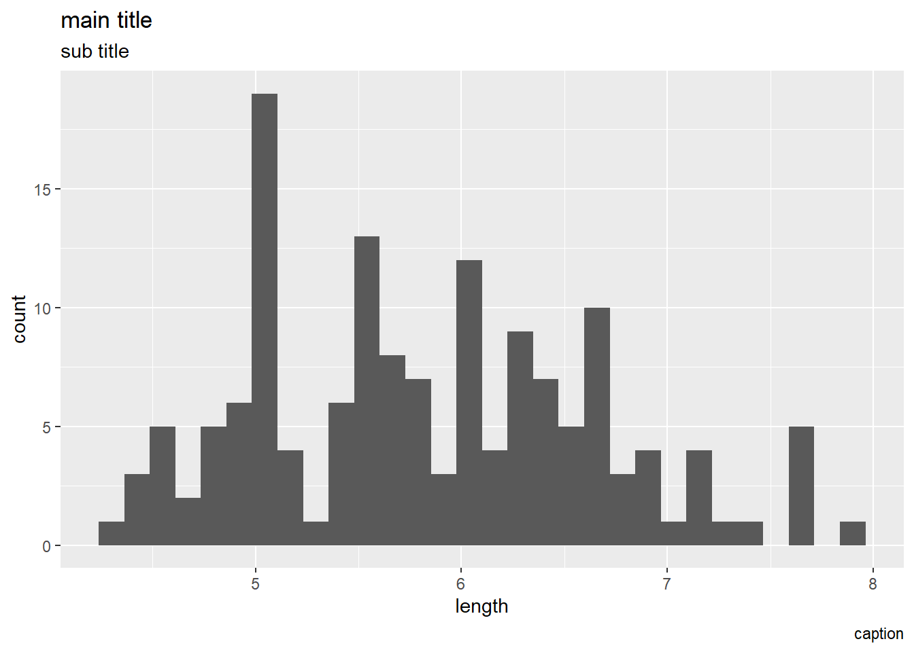](chapter26_files/figure-html/unnamed-chunk-70-1.png)

## 26.12 軸スケールの変換（対数化など）

x軸、y軸の数値を対数変換する場合には、`scale_x_log10`、`scale_y_log10`を用います。他の`ggplot2`の関数と同様に、`scale_x_log10`、`scale_y_log10`も`+`で繋ぐことで、x軸、y軸が対数変換されます。

``` downlit
diamonds |> 
  ggplot(aes(x = price)) +
  geom_histogram(bins = 50) +
  scale_x_log10()
```

[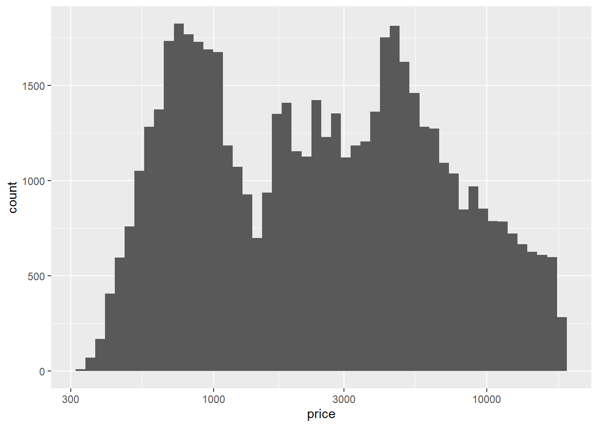](chapter26_files/figure-html/unnamed-chunk-71-1.png)

同様の軸の変換の関数には、`scale_x_reverse`、`scale_x_sqrt`などがあります。それぞれ軸を正負反転、平方根に変換するのに用います。

## 26.13 グラフの並び順の変更

x軸に因子を指定した場合の棒グラフなどの並び順は、その因子のレベルの順番で決まります。ですので、`forcat`パッケージの`fct_reorder`を用いて並べ替えることができます。

``` downlit
d |> 
  ggplot(aes(x = forcats::fct_reorder(Species, c("virginica", "setosa", "versicolor")), y = mSepal.Length)) +
  geom_bar(stat = "identity")
```

[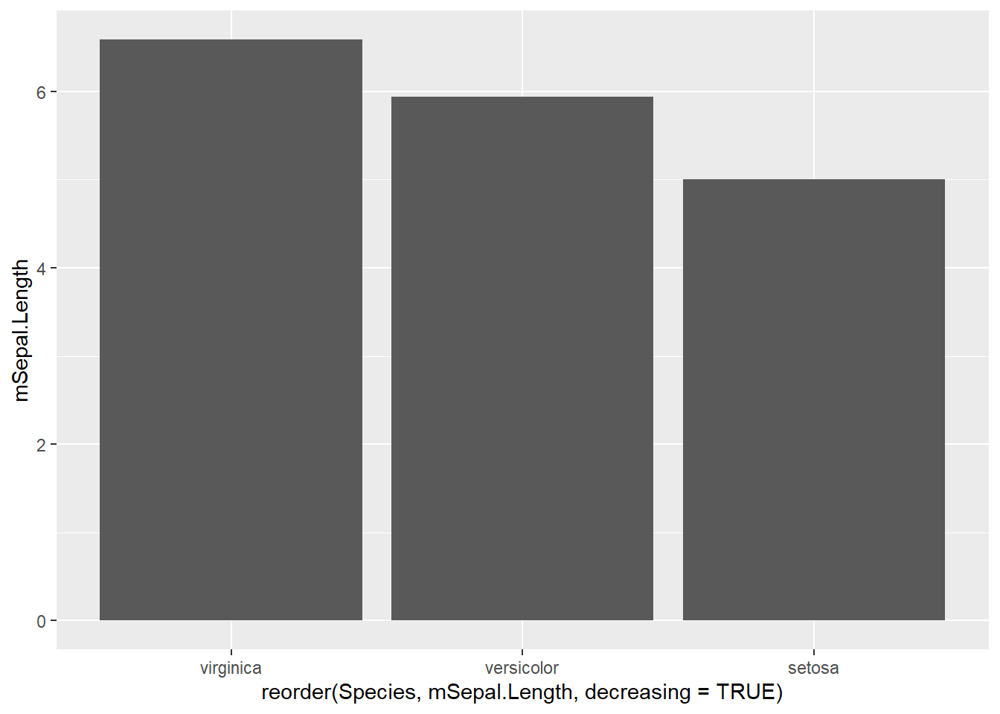](chapter26_files/figure-html/unnamed-chunk-72-1.png)

`fct_reorder`関数は他の数値を参照して、その数値の順番で並べ替えることもできます。

``` downlit
d |> 
  ggplot(aes(x = forcats::fct_reorder(Species, mSepal.Length, .desc=TRUE), y = mSepal.Length)) +
  geom_bar(stat = "identity")
```

[](chapter26_files/figure-html/unnamed-chunk-73-1.png)

同様の数値による順番の変更は、`reorder`関数を用いても行うことができます。

``` downlit
d |> 
  ggplot(aes(x = reorder(Species, mSepal.Length, decreasing = TRUE), y = mSepal.Length)) +
  geom_bar(stat = "identity")
```

[](chapter26_files/figure-html/unnamed-chunk-74-1.png)

## 26.14 円グラフの作成

`ggplot2`で円グラフを作成する場合には、`coord_polar`を用います。`coord_polar`は軸を円形に配置する関数で、棒グラフを描画し、`coord_polar`の引数に`theta="y"`を指定すると、円グラフが描画されます。

``` downlit
d |> 
  ggplot(aes(x = "1", y = mSepal.Length, color = Species, fill=Species)) +
  geom_bar(stat = "identity") +
  coord_polar(theta = "y")
```

[](chapter26_files/figure-html/unnamed-chunk-75-1.png)

棒を複数描画するような場合には、中心からいくつかの層に分かれて円グラフが描画されます。`position="fill"`を指定すると、棒グラフの高さがそろい、値は割合に変化するため、異なる要素間での比較を示すことができます。ただし、`pie`関数のhelpに記載されている通り、円グラフではデータの比較が難しくなります。基本的に円グラフを用いない方が良いでしょう。

``` downlit
p1 +
  geom_bar(stat = "identity", position="fill") +
  coord_polar(theta = "y")
```

[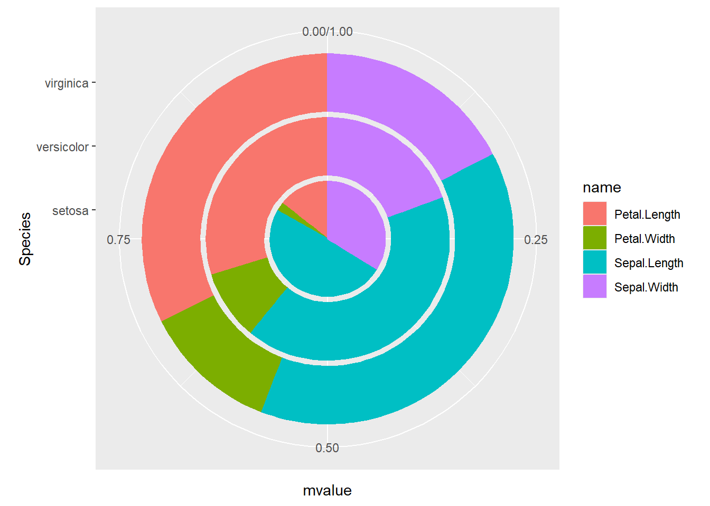](chapter26_files/figure-html/unnamed-chunk-76-1.png)

## 26.15 theme

`theme`は、グラフのもっと細かな要素を調整するための関数です。`theme`には非常に多くの引数が設定されており、`theme`を用いることで軸ラベルなどのフォントサイズや色、回転、凡例の位置等を調整することができます。代表的な例として、`theme`関数の`legend.position`引数を用いて、凡例をグラフの下に表示した場合を下に示します。凡例を消す場合には、`legend.position="none"`を指定します。`theme`の引数には関数を取るものあり、設定はやや複雑ですが、うまく指定すれば様々なグラフの要素を調整することができます。

``` downlit
iris |> 
  ggplot(aes(x = Sepal.Length, y = Sepal.Width, color = Species)) + 
  geom_point() +
  theme(legend.position = "bottom")
```

[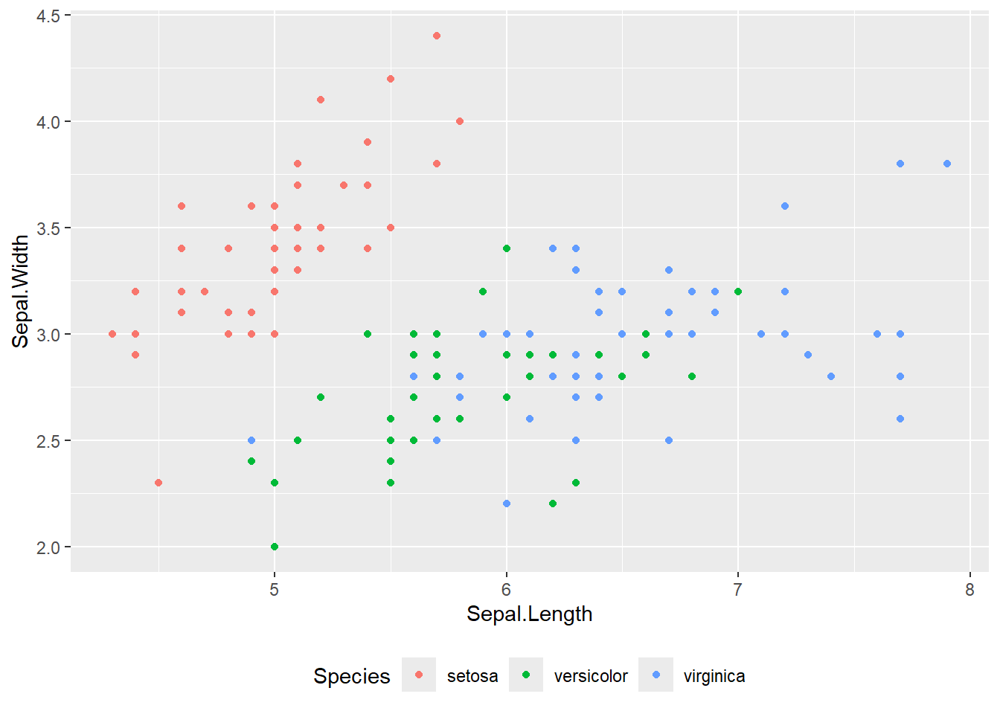](chapter26_files/figure-html/unnamed-chunk-77-1.png)

`theme`には、グラフのデザインを丸ごと変えることができる関数が別途用意されています。例えば、`theme_bw`ででは背景が白いグラフ、`theme_light`ででは明るめ、`theme_dark`では暗めの背景を用いたグラフを作成できます。

``` downlit
iris |> 
  ggplot(aes(x = Sepal.Length, y = Sepal.Width)) + 
  geom_point() +
  theme_bw()
```

[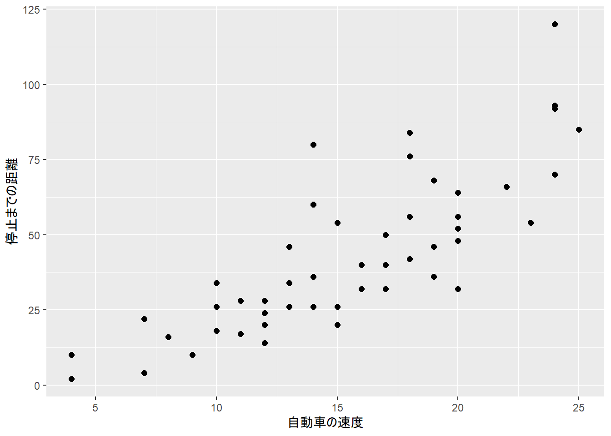](chapter26_files/figure-html/unnamed-chunk-78-1.png)

### 26.15.1 軸の最小値：expand_limits関数

上記のグラフでは、`Sepal.Width`も`Sepal.Length`も最小値が0になっておらず、いわゆる「下駄をはいている」グラフになっています。`ggplot2`でx軸、y軸の最小値を指定する場合、`expand_limits`関数を用います。`expand_limits`では、x軸の最小値、y軸の最小値をそれぞれ`x`、`y`の引数に指定します。

``` downlit
iris |> 
  ggplot(aes(x = Sepal.Length, y = Sepal.Width)) + 
  geom_point() +
  expand_limits(x = 0, y = 0)
```

[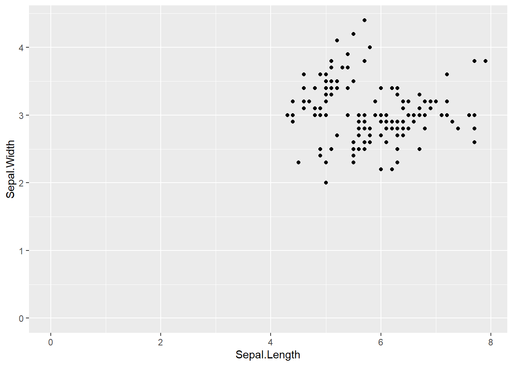](chapter26_files/figure-html/unnamed-chunk-79-1.png)

## 26.16 グラフの保存：ggsave

`ggplot2`のグラフを保存する時には、`ggsave`関数を用います。`ggsave`関数は第一引数にファイル名、第二引数に`ggplot2`のプロットのオブジェクトを取ります。ファイルの形式はファイル名の拡張子に従い決定します。例えば、ファイル名が「.pdf」で終わっていればPDF、「.jpg」で終わっていればJPEGでグラフが保存されます。

グラフのサイズは`width`、`height`引数で、解像度は`dpi`で指定します。`limitsize=FALSE`と指定することで、縦横が50インチ以上の非常に大きいグラフを保存することもできます。

``` downlit
# プロットのオブジェクトをpに代入
p <- 
  iris |> 
  ggplot(aes(x = Sepal.Length, y = Sepal.Width)) +
  geom_point()

# pをpdfで保存
ggsave("plot_iris_Sepal.pdf", p)
```

また、Rstudioでは[24章](chapter24.llms.md#グラフをファイルに保存する)で説明した通り、右下ウインドウのメニューにある『Export』からグラフをファイルに保存することもできます。

> **TIP:**
>
> `ggplot2`では、Rで実行した際には日本語も表示することができます。
>
> ``` downlit
> p <- 
>   cars |> 
>     ggplot(aes(x = speed, y = dist)) +
>     geom_point(size = 2) +
>     labs(x = "自動車の速度", y = "停止までの距離")
>
> p
> ```
>
> [](chapter26_files/figure-html/unnamed-chunk-81-1.png)
>
> ただし、このグラフを`ggsave`関数でPDFとして保存すると、文字化けします。
>
> ``` downlit
> ggsave("./image/cars.pdf", p)
> ```
>
>     Saving 7 x 5 in image
>
> [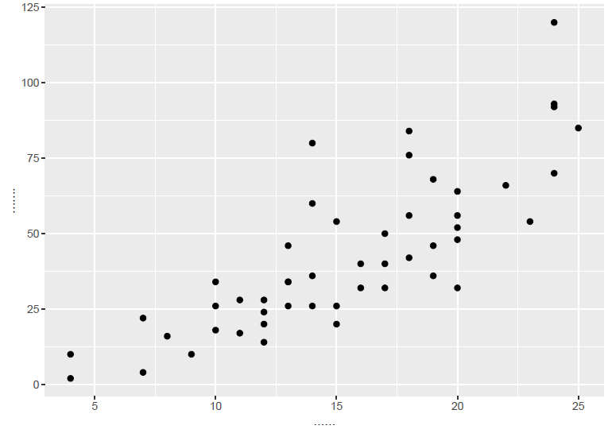](./image/cars_pdf.png)
>
> 一方で、PNGのような画像ファイルとして保存すると、日本語がそのまま表示されます。R上で日本語が文字化けせずに表示されるのは、出力がペイント系の画像になっているからです。
>
> ``` downlit
> ggsave("./image/cars.png", p)
> ```
>
>     Saving 7 x 5 in image
>
> [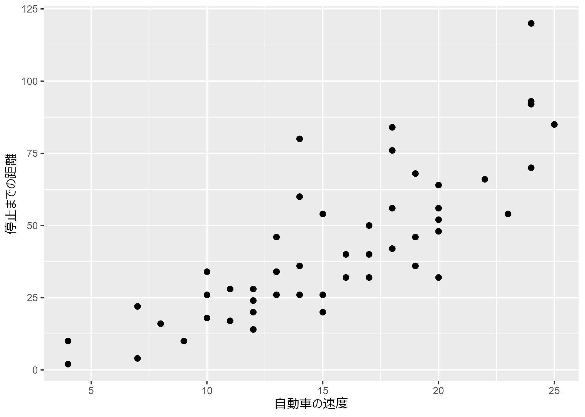](./image/cars.png)
>
> つまり、PDFや[EPS](https://www.adobe.com/jp/creativecloud/file-types/image/vector/eps-file.html)のようなドロー系のファイル形式で日本語を含む`ggplot2`のグラフを保存すると、文字化けします。このPDFにすると文字化けする問題は日本のRユーザーを長く悩ませてきました。
>
> 日本語を文字化けさせずに表示させる、様々な手法が提案されていますが、なかなか安定して日本語にすることは難しいです。比較的簡単な方法としては、以下のように引数に`device=cairo_pdf`を指定し、さらに`family`という引数にフォント名を指定する方法があります。
>
> ``` downlit
> ggsave("./image/cars_cairo_pdf.pdf", p, device=cairo_pdf, family = "Meiryo UI")
> ```
>
>     Saving 7 x 5 in image
>
> この他にも様々な日本語を文字化けさせない方法があります。ファイルの保存に関しては[こちらのページ](https://yukiyanai.github.io/stat1/intro-to-ggplot2.html)にも詳しく記載されているので、参考にされるとよいでしょう。

## 26.17 Extensions

`ggplot2`には、`ggplot2`に機能を追加する[Extensions](https://exts.ggplot2.tidyverse.org/gallery/)というパッケージがたくさん存在します。代表的なExtensionsを以下に紹介します。

### 26.17.1 patchwork

まずは、複数のグラフを1つのデバイスにまとめて表示する`patchwork`([Pedersen 2023](#ref-patchwork_bib))です。`patchwork`を用いれば、位置・幅等を簡単に調整しながら、2つ以上のグラフをまとめることができます。

`patchwork`を用いる時には、まず`ggplot2`のオブジェクトを変数に代入しておくとよいでしょう。

``` downlit
pacman::p_load(patchwork)
p1 <- iris |> ggplot(aes(x = Sepal.Length, y = Sepal.Width)) + geom_point()
p2 <- iris |> ggplot(aes(x = Species, y = Petal.Length)) + geom_boxplot()
p3 <- iris |> ggplot(aes(x = Petal.Width)) + geom_histogram()
p4 <- iris |> ggplot(aes(x = Petal.Length, color = Species, fill = Species)) + geom_histogram(binwidth = 0.5)
```

グラフを横に並べて表示するときには、`+`でオブジェクトを繋ぎます。

``` downlit
p1 + p2
```

[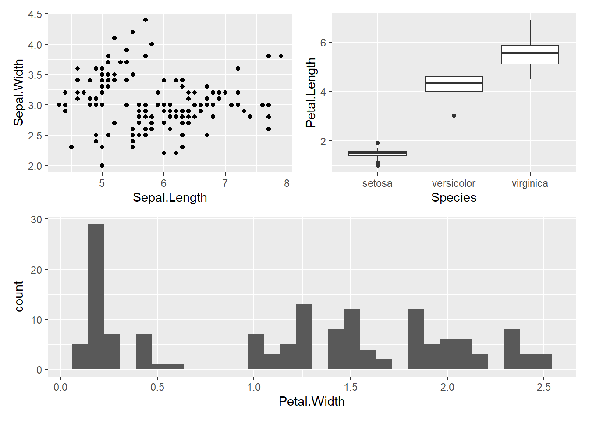](chapter26_files/figure-html/unnamed-chunk-86-1.png)

同様にカッコで囲えば表示を一部まとめておくことができます。また、`|`は横並び、`/`は縦並びにグラフを配置する場合に用います。

``` downlit
(p1 | p2) / p3
```

[](chapter26_files/figure-html/unnamed-chunk-87-1.png)

カッコ、`|`、`/`を組み合わせれば、グラフを様々な配置に並べて表示することができます。

``` downlit
(p1 | p2) / (p3 | p4)
```

[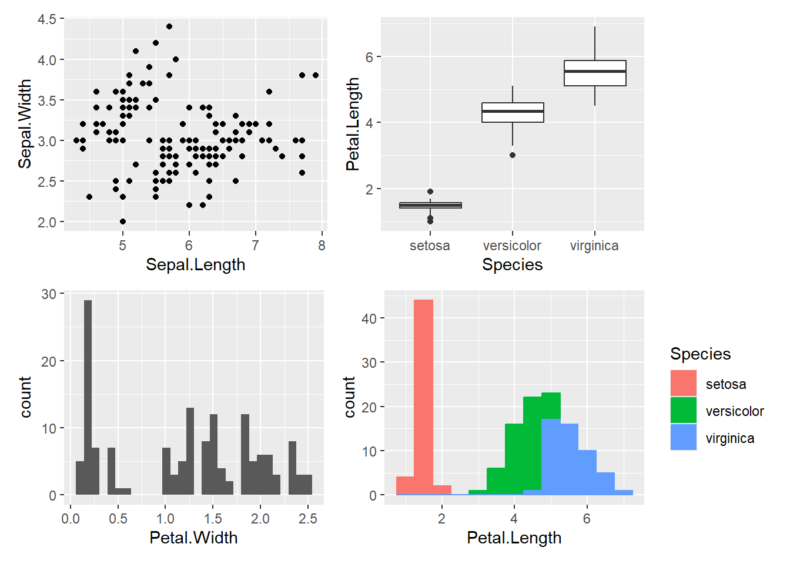](chapter26_files/figure-html/unnamed-chunk-88-1.png)

### 26.17.2 gganimate

`gganimate`([Pedersen and Robinson 2022](#ref-gganimate_bib))はアニメーションを利用したグラフを作成するためのパッケージです。下の例では、`gamminder`（各国の年別のGDPと寿命、人口のデータ）をバブルチャートとし、年毎にアニメーションとしたものです。`transition_time`という部分でアニメーションのフレームとなる変数を設定し、`ease_aes`という部分でフレームの間隔を表現します。

アニメーションをgifで保存する場合には、`anim_save`関数を用います。`anim_save`関数の引数の指定は`ggsave`と類似していますが、グラフオブジェクトを`animate`関数の引数とした上で、`renderer`という引数を設定する必要があります。`renderer`には保存するファイル形式を指定します。gifアニメーションを作成するときには`renderer=gifski_renderer()`を指定します。この`gifski_renderer`を用いるためには、`gifski`パッケージ([Ooms et al. 2023](#ref-gifski_bib))を呼び出しておく必要があります。gif以外にもmpegなどのファイルにも保存できますが、別途パッケージの呼び出しが必要です。

``` downlit
pacman::p_load(gganimate, gifski, gapminder)

p <- ggplot(gapminder, aes(gdpPercap, lifeExp, size = pop, colour = country)) +
  geom_point(alpha = 0.7, show.legend = FALSE) +
  scale_colour_manual(values = country_colors) +
  scale_size(range = c(2, 12)) +
  scale_x_log10() +
  facet_wrap(~ continent) +
  labs(title = 'Year: {frame_time}', x = 'GDP per capita', y = 'life expectancy') + # frame_timeで描画を指定
  transition_time(year) + # yearの列をフレームとする
  ease_aes('linear') # yearごとのフレーム間隔は一定

anim_save("p.gif", animate(p, renderer = gifski_renderer())) # 描画の方法を指定
```

[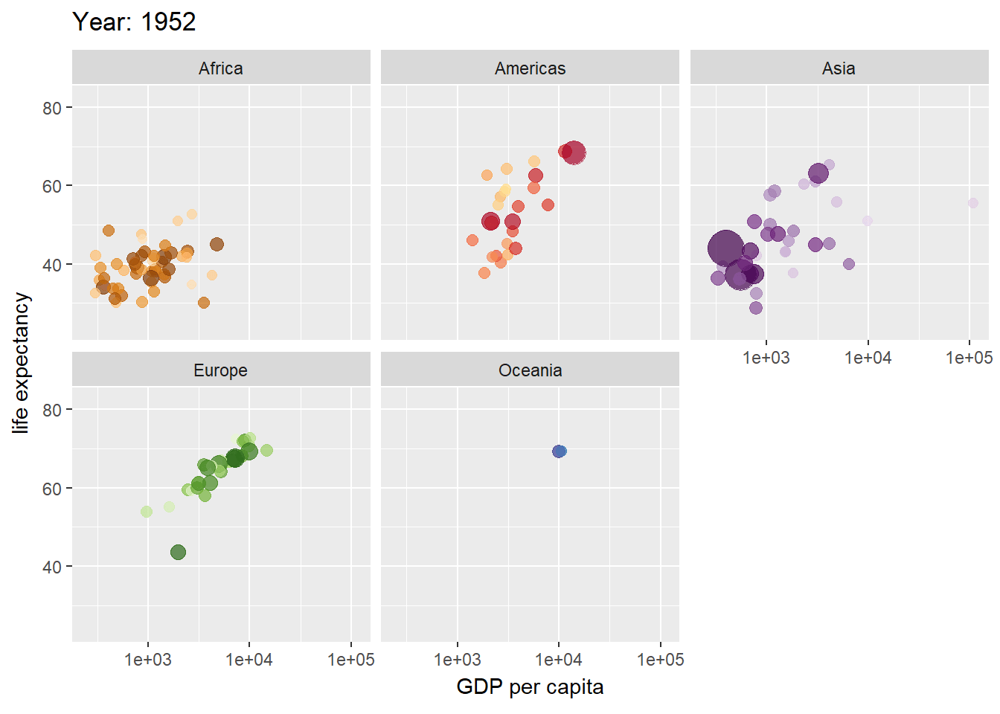](p.gif)

### 26.17.3 GGally

`GGally`([Schloerke et al. 2023](#ref-GGally_bib))は`ggplot2`を使って、相関行列を描画するためのExtensionです。各列のデータの型に従い、表示するグラフの形を変えてくれたり、相関係数を表示してくれたりします。`pairs`関数を用いてグラフを書くよりもデータの特徴をとらえやすい相関行列の図を簡単に作成することができます。

``` downlit
pacman::p_load(GGally)
ggpairs(iris, mapping=aes(color=Species))
```

[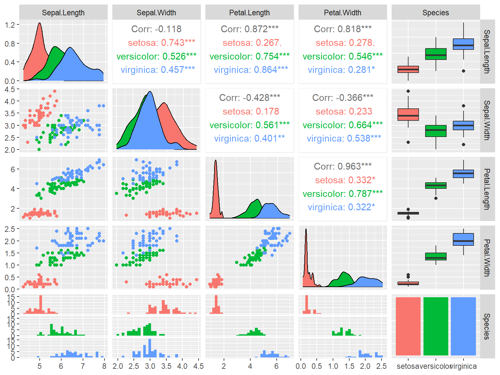](chapter26_files/figure-html/unnamed-chunk-90-1.png)

> **TIP:**
>
> R以外の言語にも、グラフ作成のライブラリが備わっています。例えばPythonでは、[matplotlib](https://matplotlib.org/stable/)や[seaborn](https://seaborn.pydata.org/index.html)、[plotly](https://plotly.com/graphing-libraries/)などがあります。Juliaでは[GR](https://docs.juliaplots.org/stable/gallery/gr/)がデフォルトのグラフ作成ライブラリです。いずれもどちらかと言えばRのデフォルトに近い関数を用いてグラフを作成するようです。
>
> `ggplot2`では、データ、aes、グラフの形をそれぞれ`ggplot`、`aes`、`geom`関数で表現し、ジェネリック関数として設定された`+`で繋ぐ点が特徴です。特徴が他のパッケージとは異なるため、記法に慣れるまでは他のパッケージよりグラフを作成するのが難しく感じるかもしれません。しかし、`ggplot2`の経験を積み、慣れてしまえば表現したいグラフを他のパッケージよりスムーズに作成することができます。

Ooms, Jeroen, Kornel Lesiński, and Authors of the dependency Rust crates. 2023. *Gifski: Highest Quality GIF Encoder*. <https://CRAN.R-project.org/package=gifski>.

Pebesma, Edzer. 2018. “Simple Features for R: Standardized Support for Spatial Vector Data.” *The R Journal* 10 (1): 439–46. <https://doi.org/10.32614/RJ-2018-009>.

Pebesma, Edzer, and Roger Bivand. 2023. *Spatial Data Science: With applications in R*. Chapman and Hall/CRC. <https://doi.org/10.1201/9780429459016>.

Pedersen, Thomas Lin. 2023. *Patchwork: The Composer of Plots*. <https://CRAN.R-project.org/package=patchwork>.

Pedersen, Thomas Lin, and David Robinson. 2022. *Gganimate: A Grammar of Animated Graphics*. <https://CRAN.R-project.org/package=gganimate>.

Richard A. Becker, Original S code by, Allan R. Wilks. R version by Ray Brownrigg. Enhancements by Thomas P Minka, and Alex Deckmyn. Fixes by the CRAN team. 2023. *Maps: Draw Geographical Maps*. <https://CRAN.R-project.org/package=maps>.

Schloerke, Barret, Di Cook, Joseph Larmarange, et al. 2023. *GGally: Extension to ’Ggplot2’*. <https://CRAN.R-project.org/package=GGally>.

Back to top
