# 28  確率分布と乱数

Code

## 28.1 乱数と種（seed）

プログラミングでは、ランダムに生成された数値、**乱数**を使った処理を行うことがあります。例えばゲームなどで偶然性を表現する場合には、整数の乱数が用いられています。

Rで整数の乱数を得る時には、`sample`関数を用います。`sample`関数は数列のベクターから引数で指定した数だけ要素をランダムに取り出し、ベクターとして返す関数です。

``` downlit
sample(1:100, 20, replace=TRUE)
##  [1] 15 72 68  7 99 43 27 84 47 20 42  4 12 28 29 37 96 88 74 10
```

乱数は完全にランダムな数値というわけではなく、ランダムに見える繰り返し計算から生成されています（**疑似乱数**）。この疑似乱数を生成するアルゴリズムにはいろいろなものがあるのですが、Rではデフォルトの乱数生成アルゴリズムとして、**[メルセンヌ・ツイスター法](http://www.math.sci.hiroshima-u.ac.jp/m-mat/TEACH/ichimura-sho-koen.pdf)（mersenne twister）** ([Matsumoto and Nishimura 1998](#ref-10.1145/272991.272995)) が用いられています。メルセンヌ・ツイスターは乱数生成アルゴリズムの中でも偏りのない乱数を得られるもので、現在ではExcelでも用いられています。

Rでの乱数生成アルゴリズムを確認、設定する場合には、`RNGkind`関数を用います。`RNGkind`関数を用いて乱数生成アルゴリズムを変更することもできますが、メルセンヌ・ツイスターから変更する必要は特にないでしょう。

``` downlit
# ?RNGkindで利用可能な乱数生成アルゴリズムの一覧を確認できる
RNGkind()
## [1] "Mersenne-Twister" "Inversion"        "Rejection"
```

乱数生成アルゴリズムは繰り返し計算で乱数を生成するため、乱数を生成するときに乱数の初期値（のようなもの）が必要となります。この乱数の初期値のことを**乱数の種（seed）**と呼びます。Rでは乱数の種を`set.seed`関数で指定することができます。乱数の種をある値に設定しておくと、乱数を何度生成しても同じ結果を得ることができます。乱数を用いた計算で統計を行う場合には、計算の再現性を保つためにseedを設定しておく方がよいでしょう。

``` downlit
set.seed(0)
sample(1:100, 20, replace=TRUE) # seedが0のときの乱数
##  [1] 14 68 39  1 34 87 43 14 82 59 51 97 85 21 54 74  7 73 79 85

set.seed(0)
sample(1:100, 20, replace=TRUE) # seedを0にしているので、値が上と同じ
##  [1] 14 68 39  1 34 87 43 14 82 59 51 97 85 21 54 74  7 73 79 85
```

## 28.2 復元抽出と非復元抽出

`sample`関数では、第1引数として設定したベクターからある値が選択された後、その値をもう一度選択することができる場合（復元抽出）と、できない場合（非復元抽出）の設定を`replace`引数で設定することができます。`replace=TRUE`の場合は復元抽出、`replace=FALSE`の場合は非復元抽出となります。非復元抽出の場合には、第1引数の長さ以上には値を呼び出すことはできません。`replace`引数のデフォルトは`FALSE`ですので、`replece`引数を指定しない場合には非復元抽出が行われます。

``` downlit
# 復元抽出
sample(1:3, 5, replace = TRUE)
## [1] 1 1 1 2 1

# 非復元抽出
sample(1:3, 3, replace = FALSE)
## [1] 1 2 3

# 非復元抽出で取り出す値の数がベクターより長いと、エラーとなる
sample(1:3, 5, replace = FALSE)
## Error in `sample.int()`:
## ! cannot take a sample larger than the population when 'replace = FALSE'
```

また、統計では乱数を使った計算（**[モンテカルロ法](https://ja.wikipedia.org/wiki/%E3%83%A2%E3%83%B3%E3%83%86%E3%82%AB%E3%83%AB%E3%83%AD%E6%B3%95)**）を用いることがあります。特に**確率分布に従った乱数**を用いた計算が統計では有用です。このような確率分布に従った乱数計算を行う場合には、`sample`関数ではなく、確率分布に関連した一連の関数を用いるのが一般的です。

**確率分布**とは、ランダムに起こる事象（例えばコイントスや身長・体重の大きさなど）がそれぞれの値を取る確率を関数の形で表現したものです。もっとも一般的に用いられている確率分布は、**正規分布（Normal distribution）**です。正規分布は平均値と標準偏差をパラメータとした確率分布で、平均値を取る確率が最も高く、平均値から離れるほど確率が低くなっていく、釣鐘型の形を取る分布です。

Rでは、この正規分布の**確率密度**、**累積分布**、**分位点での値**、**乱数**をそれぞれ**`dnorm`、`pnorm`、`qnorm`、`rnorm`**関数を用いて計算することができます。

## 28.3 確率密度

**確率密度**は上で述べた通り、ランダムに起こる事象がそれぞれの値を取る確率を示したものです。この確率密度は**確率密度関数**（離散的な分布では**確率質量関数**）という関数で表現されます。この確率密度関数を返すのが、**「`d` + 分布の名前」**で示される関数です。正規分布の確率密度関数は、`dnorm`関数で計算することができます。この`dnorm`関数は、`mean`引数で指定した平均値、`sd`引数で指定した標準編差の正規分布において、第一引数で指定した値（`x`）における確率密度を返す関数です。ただし、確率密度はその値が確率なのではなく、確率密度の積分が確率となりますので、この`dnorm`の返り値は確率ではありません（ただし、確率質量分布、つまり離散的な分布では確率質量分布の返り値が確率となります）。

確率密度には連続的なものと離散的なものがあり、確率分布ごとに値を取りうる範囲があります。例えば正規分布は\\+\infty\\から\\-\infty\\の範囲の実数すべてを取ることができる連続的な分布です。別の分布、例えばポアソン分布は正の整数のみを取ることができる、離散的な分布となります。

``` downlit
dnorm(x = 1, mean = 0, sd = 1) # 正規分布の確率密度
## [1] 0.2419707
```

> **TIP:**
>
> 確率分布f(x)はその積分が確率となる関数で表されます。確率は合計すると必ず1となるため、確率分布をその分布の範囲で積分すると1になります。また、積分すると1となることが確率分布であることの条件にもなります。
>
> \\\int\_{-\infty}^{\infty}f(x)dx=1\\
>
> 確率分布の平均値（\\E\[f(x)\]\\）と分散（\\V\[f(x)\]\\）は以下の積分で計算できます。
>
> \\E\[f(x)\]=\int\_{-\infty}^{\infty}x \cdot f(x)dx\\
>
> \\V\[f(x)\]=\int\_{-\infty}^{\infty}(x-\mu)^2 \cdot f(x)dx\\
>
> また、分散は以下の式でも表すことができます。
>
> \\V\[X\] = E\[X^2\] - (E\[X\])^2 \\

## 28.4 累積分布

確率密度をx軸方向に積分して得られる関数のことを、**累積分布関数**と呼びます。上に述べた通り、確率密度を積分したものが確率となりますので、累積分布関数を用いると、正規分布する値がある一定の範囲を取る確率を計算することができます。Rで累積分布関数を返すのが、**「`p` + 分布の名前」**で示される関数です。

正規分布の累積分布関数は、`pnorm`関数で計算することができます。正規分布の累積分布関数では、正規分布する値が\\-\infty\\からその値までの範囲を取る確率が計算されるため、正規分布する値が第一引数`q`で指定した値以下となる確率を計算することになります。平均値を`mean`引数、標準偏差を`sd`引数で指定するのはすべての`norm`関数で共通しています。

``` downlit
pnorm(q = 1, mean = 0, sd = 1) # 正規分布の累積分布関数（q（1）以下となる確率）
## [1] 0.8413447

# 平均0、標準偏差1の正規分布での標準偏差の区間（-1 ~ 1）の値が得られる確率
pnorm(1, mean = 0, sd = 1) - pnorm(-1, mean = 0, sd = 1) 
## [1] 0.6826895

# 平均0、標準偏差1の正規分布で、-1.96~1.96の値が得られる確率（95％区間）
pnorm(1.96, mean = 0, sd = 1) - pnorm(-1.96, mean = 0, sd = 1) 
## [1] 0.9500042

# 累積分布関数の形（正規分布）
plot(seq(-3, 3, by = 0.1), pnorm(seq(-3, 3, by = 0.1)), type = "l")
```

[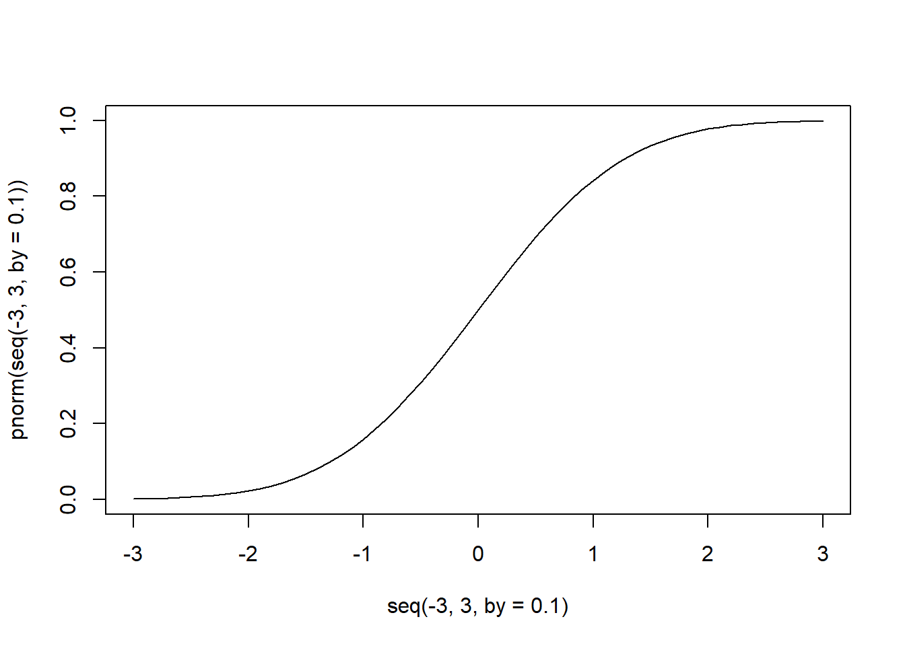](chapter28_files/figure-html/unnamed-chunk-6-1.png)

## 28.5 分位点

逆に、累積分布関数で求まる確率から、その確率となる値を求める関数が、**「`q` + 分布の名前」**で示される関数です。第一引数である`p`には確率（0～1）を指定し、その確率が得られる累積分布関数でのx軸上の値を得ることができます。正規分布では、`qnorm`関数でこの計算を行うことができます。`pnorm`関数と`qnorm`関数では、第一引数と返り値の関係がちょうど逆になります。

引数`p`に対して、`qnorm`関数で得られる値のことを、「`100*p`%分位点」と呼ぶのが一般的です。`p=0.25`なら25％分位点、`p=0.75`なら75％分位点が得られることになります。

``` downlit
qnorm(p = 0.975, mean = 0, sd = 1) # 正規分布の97.5%分位点における値
## [1] 1.959964

# qnormの形はpnorm（累積分布関数）のx、yが入れ替わったものとなる
plot(seq(0, 1, by = 0.01), qnorm(seq(0, 1, by = 0.01)), type = "l")
```

[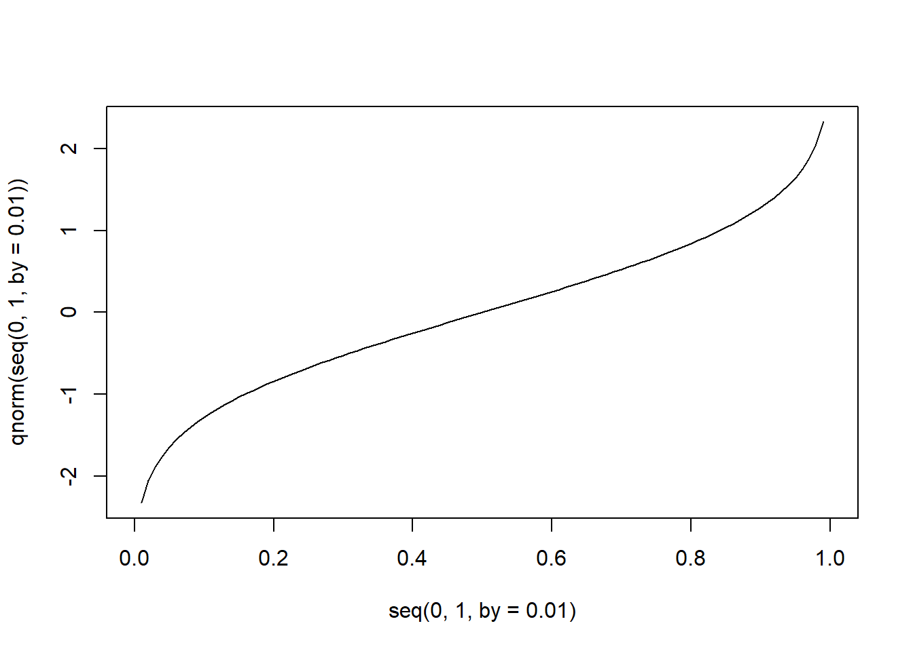](chapter28_files/figure-html/unnamed-chunk-7-1.png)

確率密度（`dnorm`）、累積分布（`pnorm`）、分位点（`qnorm`）の関係を図で示すと、以下のような関係になっています。

[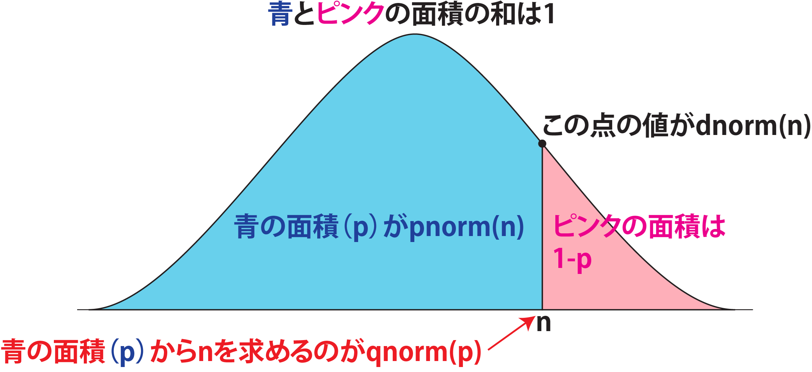](./image/dpqnorm_image.png "確率密度、累積分布、分位点の関係")

確率密度、累積分布、分位点の関係

## 28.6 確率分布に従った乱数

確率分布に従った乱数を得ることができれば、その確率分布に従う現象をシミュレートすることができます。Rで確率分布に従った乱数を求める関数が、**「`r` + 分布の名前」**で示される関数です。正規分布では、`rnorm`関数で乱数（正規乱数）を得ることができます。第一引数（`n`）で、乱数の個数を指定します。

``` downlit
rnorm(n = 10, mean = 0, sd = 1) # 正規分布の乱数
##  [1]  0.25222345 -0.89192113  0.43568330 -1.23753842 -0.22426789  0.37739565
##  [7]  0.13333636  0.80418951 -0.05710677  0.50360797

# 乱数をたくさん生成し、ヒストグラムを描画する
rnorm(10000, mean = 0, sd = 1) |> hist() 
```

[](chapter28_files/figure-html/unnamed-chunk-8-1.png)

> **TIP:**
>
> 通常、確率分布に従う形の乱数を得る場合には、累積分布関数の**[逆関数](https://ja.wikipedia.org/wiki/%E9%80%86%E9%96%A2%E6%95%B0%E6%B3%95)**というものを用います。逆関数はy=f(x)の関数をx=g(y)という形に、xについて解いたものを指します。確率密度関数の逆関数に一様乱数を入れると、確率分布に従った乱数を得ることができます。`rnorm`などの乱数生成アルゴリズムはC言語で記載されていて、逆関数を用いているのかはわかりませんが、メルセンヌ・ツイスターで生成されるのは一様乱数ですので、内部的には同様の変換が行われているのだと思います。

## 28.7 Rで用いることのできる確率分布の一覧

Rでは、norm（正規分布）の他に、以下の表1で示す確率分布に関する関数が登録されています。各確率分布の「記号」の前に`d`を付けると確率密度関数、`p`を付けると累積分布関数、`q`を付けると分位点、`r`を付けると乱数を得る関数となります。

| 記号     | 分布               | 英語での分布名    | パラメータ      |
|:---------|:-------------------|:------------------|:----------------|
| binom    | 二項分布           | binomial          | size, prob      |
| geom     | 幾何分布           | geometric         | prob            |
| hyper    | 超幾何分布         | hypergeometric    | m, n, k         |
| nbinom   | 負の二項分布       | negative binomial | size, prob      |
| pois     | ポアソン分布       | Poisson           | lambda          |
| norm     | 正規分布           | normal            | mean, sd        |
| t        | Studentのt分布     | Student’s t       | df              |
| cauchy   | コーシー分布       | Cauchy            | location, scale |
| logis    | ロジスティック分布 | logistic          | location, scale |
| lnorm    | 対数正規分布       | log-normal        | meanlog, sdlog  |
| beta     | ベータ分布         | beta              | shape1, shape2  |
| chisq    | カイ二乗分布       | chi-squared       | df              |
| f        | F分布              | F                 | df1, df2        |
| gamma    | ガンマ分布         | gamma             | shape, scale    |
| exp      | 指数分布           | exponential       | rate            |
| weibull  | ワイブル分布       | Weibull           | shape, scale    |
| unif     | 一様分布           | uniform           | min, max        |
| multinom | 多項分布           | multinomial       | size, prob      |

> **TIP:**
>
> 上記の表1に示した以外にも、Rではパッケージを用いることで様々な確率分布の関数を用いることができます。パッケージの一覧に関しては、CRAN Task Viewの[Probability Distributions](https://cran.r-project.org/web/views/Distributions.html)が参考になります。また、それぞれの確率分布の関係については、[Univariate Distribution Relationships](https://www.math.wm.edu/~leemis/chart/UDR/UDR.html)に詳しく記載されているので、興味のある方は一読するとよいでしょう。日本語では、こちらの[三中先生の解説ページ](https://www.yodosha.co.jp/smart-lab-life/statics_pitfalls/statics_pitfalls09.html)に書かれています。また、確率分布を表示する[Webアプリ](https://statdist.ksmzn.com/)を触ってみるのも良いでしょう。

以下に、各確率分布の簡単な説明と、各関数を用いたグラフを示します。

## 28.8 二項分布

**二項分布**は**ベルヌーイ試行**（コイントスのように、1と0だけが確率的に結果として得られる試行）の試行回数（`size`）と成功確率（`prob`、コイントスであれば表を成功として、表が出る確率）から、成功回数`x`が得られる確率を示したものです。二項分布の確率質量関数は以下の式で表されます。

\\Binom(x,n,p)=\_{n}C\_{x} \cdot p^{x} \cdot (1-p)^{n-x}\\

nが試行回数、pが成功確率、xが成功回数を表しています。Rでは、nを`size`引数、pを`prob`引数で指定します。コイントスですので、整数でない成功回数（4.21回成功など）が起こることはありませんし、マイナスの試行数も取りません。ですので、二項分布は成功回数`x`が正の整数のみの離散的な確率分布になります。分布の範囲は**0～試行回数**です。

## 確率質量

``` downlit
x <- 0:20
d <- tibble(
  x,
  s20p01 = dbinom(x, size = 20, prob = 0.1), # サイズ20、確率0.1
  s20p05 = dbinom(x, size = 20, prob = 0.5), # サイズ20、確率0.5
  s20p08 = dbinom(x, size = 20, prob = 0.8) # サイズ20、確率0.8
)

d |> 
  pivot_longer(2:4) |> 
  ggplot(aes(x = x, y = value, color = name)) +
  geom_line()
```

[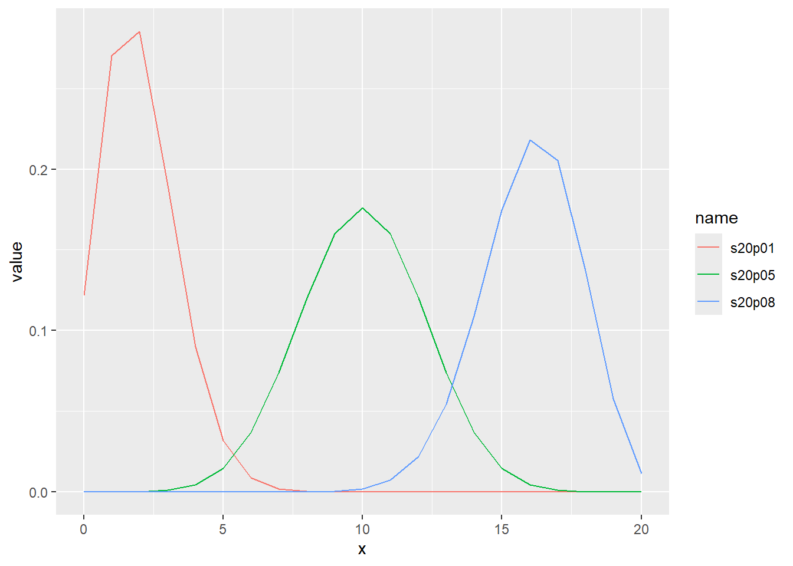](chapter28_files/figure-html/unnamed-chunk-10-1.png)

## 累積分布関数

``` downlit
d <- tibble(
  x,
  s20p01 = pbinom(x, size = 20, prob = 0.1), # サイズ20、確率0.1
  s20p05 = pbinom(x, size = 20, prob = 0.5), # サイズ20、確率0.5
  s20p08 = pbinom(x, size = 20, prob = 0.8) # サイズ20、確率0.8
)

d |> 
  pivot_longer(2:4) |> 
  ggplot(aes(x = x, y = value, color = name)) +
  geom_line()
```

[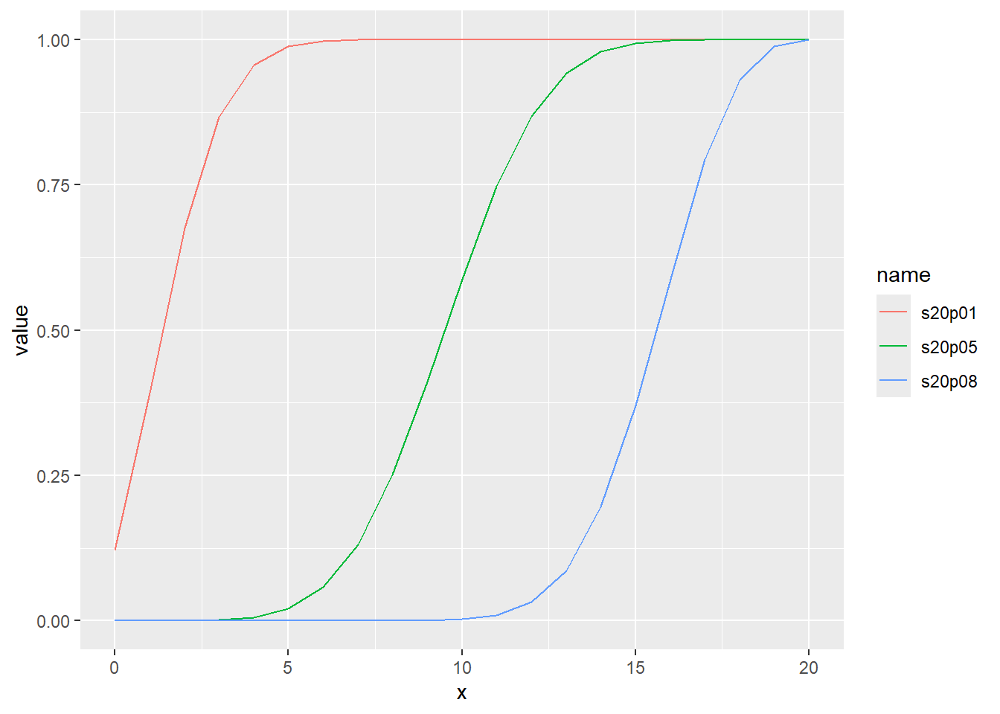](chapter28_files/figure-html/unnamed-chunk-11-1.png)

## 分位点の値

``` downlit
x <- seq(0, 1, by = 0.01)
d <- tibble(
  x,
  s20p01 = qbinom(x, size = 20, prob = 0.1), # サイズ20、確率0.1
  s20p05 = qbinom(x, size = 20, prob = 0.5), # サイズ20、確率0.5
  s20p08 = qbinom(x, size = 20, prob = 0.8) # サイズ20、確率0.8
)

d |> 
  pivot_longer(2:4) |> 
  ggplot(aes(x = x, y = value, color = name)) +
  geom_line()
```

[](chapter28_files/figure-html/unnamed-chunk-12-1.png)

## 二項乱数

``` downlit
d <- tibble(
  s20p01 = rbinom(1000, size = 20, prob = 0.1), # サイズ20、確率0.1
  s20p05 = rbinom(1000, size = 20, prob = 0.5), # サイズ20、確率0.5
  s20p08 = rbinom(1000, size = 20, prob = 0.8) # サイズ20、確率0.8
)

d |> 
  pivot_longer(1:3) |> 
  ggplot(aes(x = value, color = name, fill = name, alpha = 0.5)) +
  geom_histogram(binwidth = 1, position = "identity")
```

[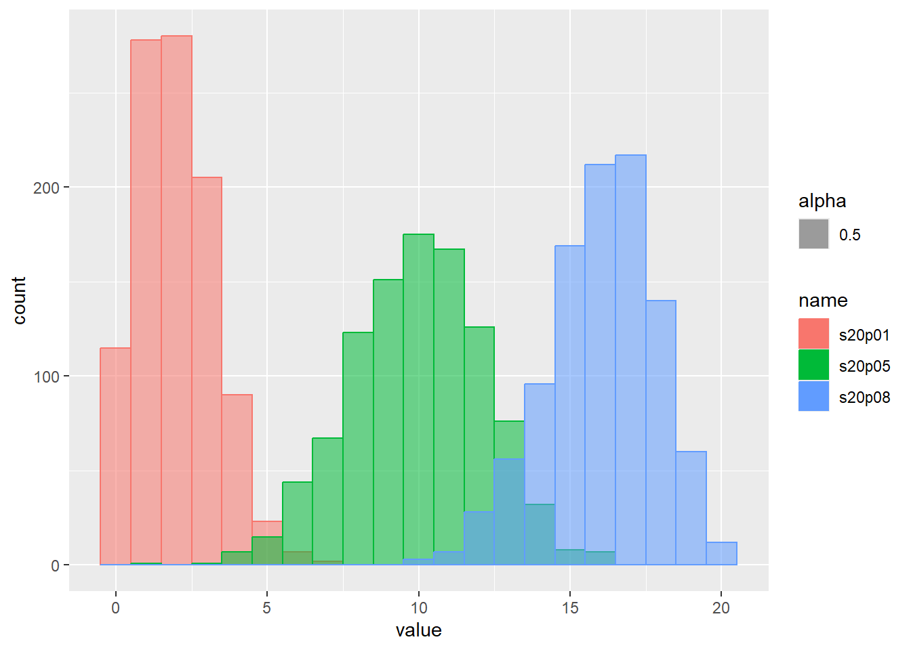](chapter28_files/figure-html/unnamed-chunk-13-1.png)

## 28.9 幾何分布

**幾何分布**は、ベルヌーイ試行を始めて成功させたときの試行数が`x`となる確率を指します。二項分布との違いは、成功回数が必ず1回であるところになります。`x`以外には、成功確率（`prob`）のみをパラメータとして設定します。分布の範囲は0～\\+\infty\\です。幾何分布の確率質量関数は以下の式で表されます。

\\Geom(x,p)=p \cdot (1-p)^{x-1}\\

Rでは、pを`prob`引数で設定します。

1回成功するまでに失敗した回数も同じく幾何分布で表現することができます。失敗した回数とする場合には、上の式のx-1をxとするだけです。Rの`geom`関数で計算されるのは上の式の結果です。

\\Geom(x,p)=p \cdot (1-p)^{x}\\

試行数`x`は必ず整数となるため、幾何分布も二項分布と同じく、離散的な分布で、`x`は正の整数を取ります。

## 確率質量

``` downlit
x <- 1:50
d <- tibble(
  x,
  r01 = dgeom(x, prob = 0.1), # 確率0.1
  r05 = dgeom(x, prob = 0.5), # 確率0.5
  r08 = dgeom(x, prob = 0.8) # 確率0.8
)

d |> 
  pivot_longer(2:4) |> 
  ggplot(aes(x = x, y = value, color = name)) +
  geom_line()
```

[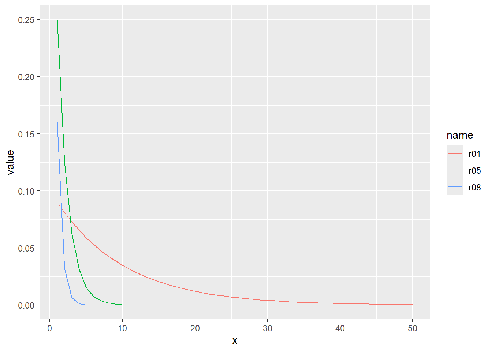](chapter28_files/figure-html/unnamed-chunk-14-1.png)

## 累積分布関数

``` downlit
d <- tibble(
  x,
  r01 = pgeom(x, prob = 0.1), # 確率0.1
  r05 = pgeom(x, prob = 0.5), # 確率0.5
  r08 = pgeom(x, prob = 0.8) # 確率0.8
)

d |> 
  pivot_longer(2:4) |> 
  ggplot(aes(x = x, y = value, color = name)) +
  geom_line()
```

[](chapter28_files/figure-html/unnamed-chunk-15-1.png)

## 分位点の値

``` downlit
x <- seq(0, 1, by = 0.01)
d <- tibble(
  x,
  r01 = qgeom(x, prob = 0.1), # 確率0.1
  r05 = qgeom(x, prob = 0.5), # 確率0.5
  r08 = qgeom(x, prob = 0.8) # 確率0.8
)

d |> 
  pivot_longer(2:4) |> 
  ggplot(aes(x = x, y = value, color = name)) +
  geom_line()
```

[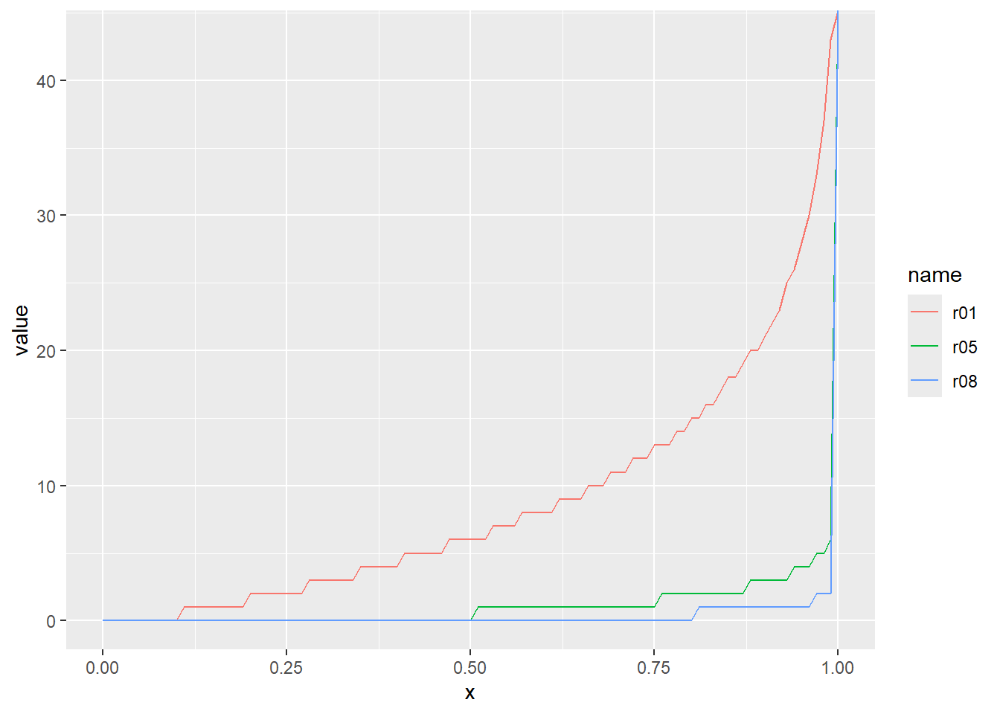](chapter28_files/figure-html/unnamed-chunk-16-1.png)

## 幾何乱数

``` downlit
d <- tibble(
  r01 = rgeom(1000, prob = 0.1), # 確率0.1
  r05 = rgeom(1000, prob = 0.5), # 確率0.5
  r08 = rgeom(1000, prob = 0.8) # 確率0.8
)

d |> 
  pivot_longer(1:3) |> 
  ggplot(aes(x = value, color = name, fill = name, alpha = 0.5)) +
  geom_histogram(binwidth = 5, position = "identity")
```

[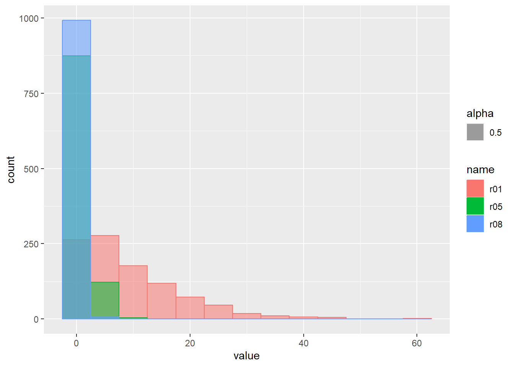](chapter28_files/figure-html/unnamed-chunk-17-1.png)

## 28.10 超幾何分布

**超幾何分布**は、ツボの中に白と黒のボールが入っていて、このツボからボールを取り出す試行（**非復元抽出**）を表現した確率分布です。超幾何分布の確率質量関数は以下の式で表されます。

\\ Hyper(x,m,n,k)= \frac{\_{m}C\_{k} \cdot \_{n}C\_{x-k}}{\_{m+n}C\_{x}}\\

Rの`hyper`関数では、白ボール`m`個、黒ボール`n`個が入ったツボから`k`個ボールを取ったとき、`x`個の白ボールが取れる確率を計算します。`dhyper`関数の引数は`m`、`n`、`k`で、`x`は整数のみを取る離散的な分布です。分布の範囲は0～kとなります。

## 確率質量

``` downlit
x <- 1:6
d <- tibble(
  x,
  m5n5k5 = dhyper(x, m = 5, n = 5, k = 5), # 白 5, 黒 5, 取るボールの数 5
  m10n5k5 = dhyper(x, m = 10, n = 5, k = 5), # 白 10, 黒 5, 取るボールの数 5
  m5n20k10 = dhyper(x, m = 5, n = 20, k = 10) # 白 5, 黒 20, 取るボールの数 10
)

d |> 
  pivot_longer(2:4) |> 
  ggplot(aes(x = x, y = value, color = name)) +
  geom_line()
```

[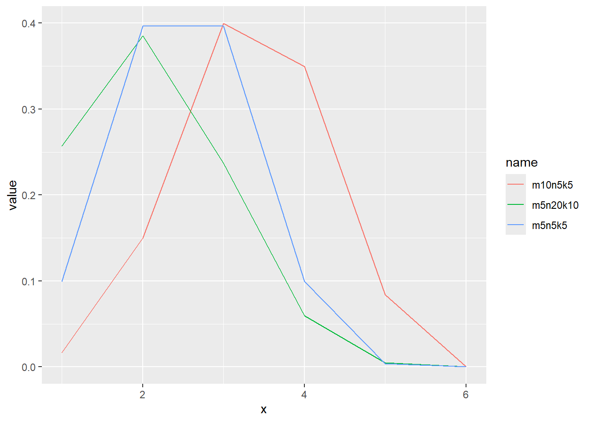](chapter28_files/figure-html/unnamed-chunk-18-1.png)

## 累積分布関数

``` downlit
d <- tibble(
  x,
  m5n5k5 = phyper(x, m = 5, n = 5, k = 5), # 白 5, 赤 5, 取るボールの数 5
  m10n5k5 = phyper(x, m = 10, n = 5, k = 5), # 白 10, 赤 5, 取るボールの数 5
  m5n20k10 = phyper(x, m = 5, n = 20, k = 10) # 白 5, 赤 20, 取るボールの数 10
)

d |> 
  pivot_longer(2:4) |> 
  ggplot(aes(x = x, y = value, color = name)) +
  geom_line()
```

[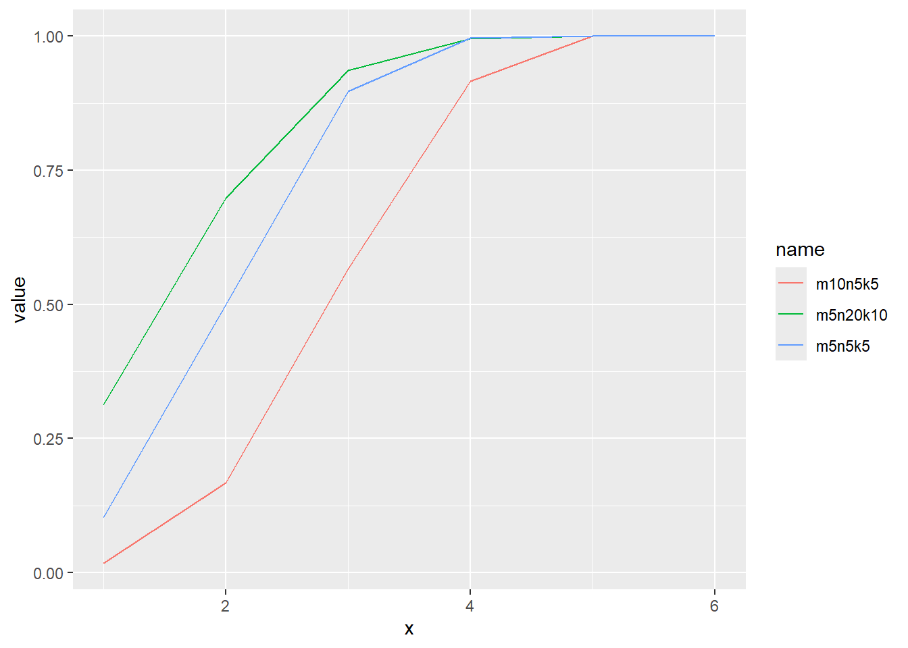](chapter28_files/figure-html/unnamed-chunk-19-1.png)

## 分位点の値

``` downlit
x <- seq(0, 1, by = 0.01)
d <- tibble(
  x,
  m5n5k5 = qhyper(x, m = 5, n = 5, k = 5), # 白 5, 赤 5, 取るボールの数 5
  m10n5k5 = qhyper(x, m = 10, n = 5, k = 5), # 白 10, 赤 5, 取るボールの数 5
  m5n20k10 = qhyper(x, m = 5, n = 20, k = 10) # 白 5, 赤 20, 取るボールの数 10
)

d |> 
  pivot_longer(2:4) |> 
  ggplot(aes(x = x, y = value, color = name)) +
  geom_line()
```

[](chapter28_files/figure-html/unnamed-chunk-20-1.png)

## 超幾何乱数

``` downlit
d <- tibble(
  m5n5k5 = rhyper(1000, m = 5, n = 5, k = 5), # 白 5, 赤 5, 取るボールの数 5
  m10n5k5 = rhyper(1000, m = 10, n = 5, k = 5), # 白 10, 赤 5, 取るボールの数 5
  m5n20k10 = rhyper(1000, m = 5, n = 20, k = 10) # 白 5, 赤 20, 取るボールの数 10
)

d |> 
  pivot_longer(1:3) |> 
  ggplot(aes(x = value, color = name, fill = name, alpha = 0.5)) +
  geom_histogram(binwidth = 0.1, position = "identity")
```

[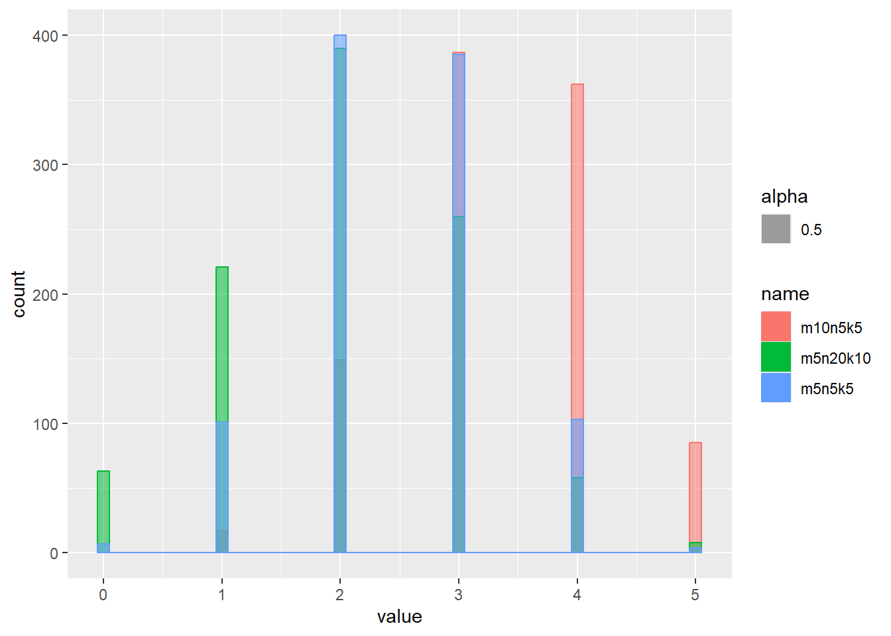](chapter28_files/figure-html/unnamed-chunk-21-1.png)

## 28.11 負の二項分布

**負の二項分布**は、ベルヌーイ試行を行ったとき、n回成功する間にx回失敗する確率を反映した確率分布です。成功の回数がn、失敗回数をx、成功確率をpとしたとき、負の二項分布の確率質量関数は以下の式で表されます。

\\Nbinom(x,n,p)=\_{x+n+1}C\_{x} \cdot p^x(1-p)^n\\

Rでの負の二項分布の確率質量関数は`dnbinom`関数で計算することができます。成功の回数nは`size`引数、成功確率pは`prob`引数で設定します。負の二項分布は正の整数のみを取る離散的な分布で、その範囲は0～\\\infty\\となります。

## 確率質量

``` downlit
x <- 0:100
d <- tibble(
  x,
  p01 = dnbinom(x, size = 5, prob = 0.1), # サイズ5、確率0.1
  p05 = dnbinom(x, size = 5, prob = 0.5), # サイズ5、確率0.5
  p08 = dnbinom(x, size = 5, prob = 0.8) # サイズ5、確率0.8
)

d |> 
  pivot_longer(2:4) |> 
  ggplot(aes(x = x, y = value, color = name)) +
  geom_line()
```

[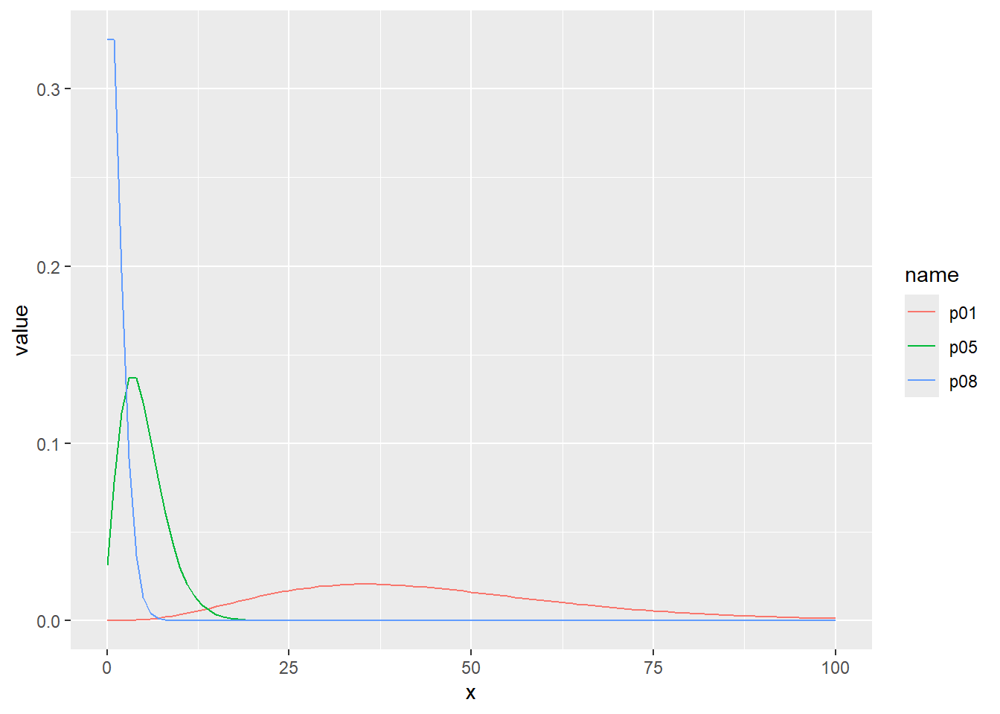](chapter28_files/figure-html/unnamed-chunk-22-1.png)

## 累積分布関数

``` downlit
d <- tibble(
  x,
  p01 = pnbinom(x, size = 5, prob = 0.1), # サイズ5、確率0.1
  p05 = pnbinom(x, size = 5, prob = 0.5), # サイズ5、確率0.5
  p08 = pnbinom(x, size = 5, prob = 0.8) # サイズ5、確率0.8
)

d |> 
  pivot_longer(2:4) |> 
  ggplot(aes(x = x, y = value, color = name)) +
  geom_line()
```

[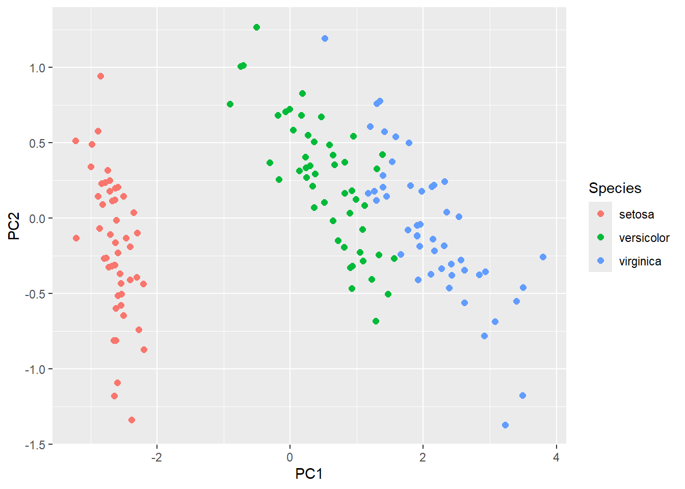](chapter28_files/figure-html/unnamed-chunk-23-1.png)

## 分位点の値

``` downlit
x <- seq(0, 1, by = 0.01)
d <- tibble(
  x,
  p01 = qnbinom(x, size = 5, prob = 0.1), # サイズ5、確率0.1
  p05 = qnbinom(x, size = 5, prob = 0.5), # サイズ5、確率0.5
  p08 = qnbinom(x, size = 5, prob = 0.8) # サイズ5、確率0.8
)

d |> 
  pivot_longer(2:4) |> 
  ggplot(aes(x = x, y = value, color = name)) +
  geom_line()
```

[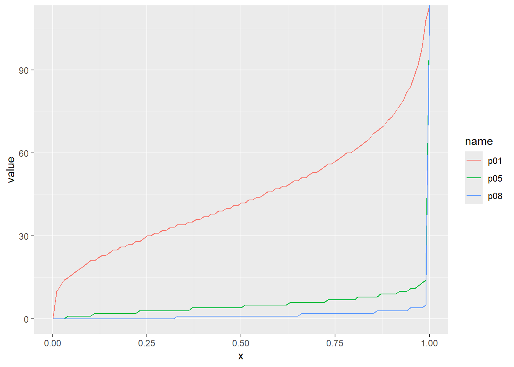](chapter28_files/figure-html/unnamed-chunk-24-1.png)

## 負の二項乱数

``` downlit
d <- tibble(
  p01 = rnbinom(1000, size = 5, prob = 0.1), # サイズ5、確率0.1
  p05 = rnbinom(1000, size = 5, prob = 0.5), # サイズ5、確率0.5
  p08 = rnbinom(1000, size = 5, prob = 0.8) # サイズ5、確率0.8
)

d |> 
  pivot_longer(1:3) |> 
  ggplot(aes(x = value, color = name, fill = name, alpha = 0.5)) +
  geom_histogram(binwidth = 10, position = "identity")
```

[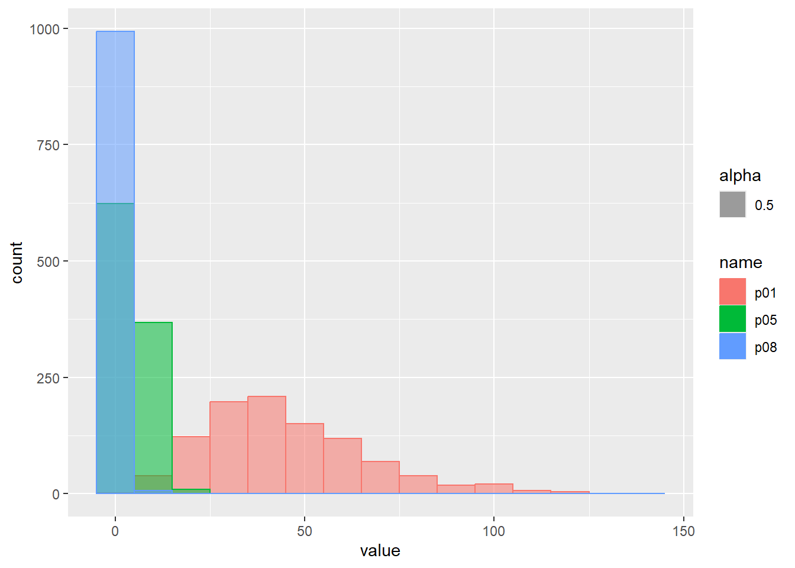](chapter28_files/figure-html/unnamed-chunk-25-1.png)

## 28.12 ポアソン分布

**ポアソン分布**は、起こる確率が非常に低い現象が、ある一定の時間に何回起こるかを確率として表した確率分布です。ポアソン分布の確率質量関数は二項分布の確率を0に、試行回数を\\\infty\\に近づけた極限として計算されます。ポアソン分布のパラメータはλのみで、ポアソン分布は平均値も標準偏差もλとなる特徴があります。ポアソン分布の確率質量関数は以下の式で表されます。分布が取りうる範囲は0～\\\infty\\となります。

\\Poisson(x, \lambda)=\frac{\lambda^x \cdot \exp(-\lambda)}{x!}\\

Rではポアソン分布の確率質量関数は`dpois`関数で計算することができます。`dpois`関数のλは引数`lambda`で設定します。

## 確率質量

``` downlit
x <- 0:25
d <- tibble(
  x,
  l3 = dpois(x, lambda = 3), # ラムダ3
  l8 = dpois(x, lambda = 8), # ラムダ8
  l11 = dpois(x, lambda = 11) # ラムダ11
)

d |> 
  pivot_longer(2:4) |> 
  ggplot(aes(x = x, y = value, color = name)) +
  geom_line()
```

[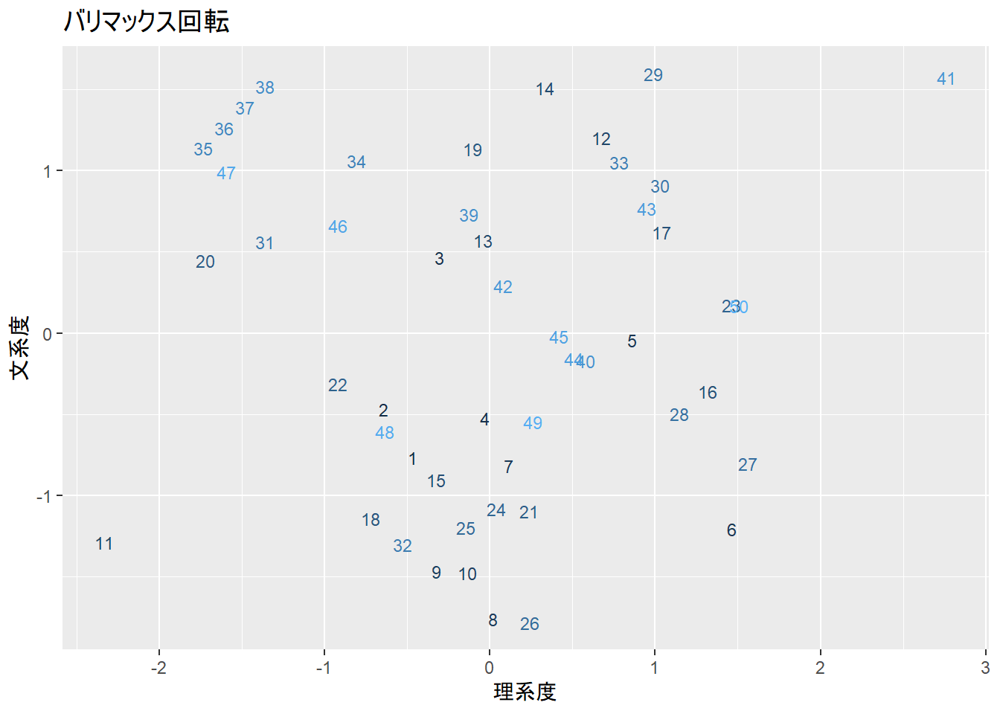](chapter28_files/figure-html/unnamed-chunk-26-1.png)

## 累積分布関数

``` downlit
d <- tibble(
  x,
  l3 = ppois(x, lambda = 3), # ラムダ3
  l8 = ppois(x, lambda = 8), # ラムダ8
  l11 = ppois(x, lambda = 11) # ラムダ11
)

d |> 
  pivot_longer(2:4) |> 
  ggplot(aes(x = x, y = value, color = name)) +
  geom_line()
```

[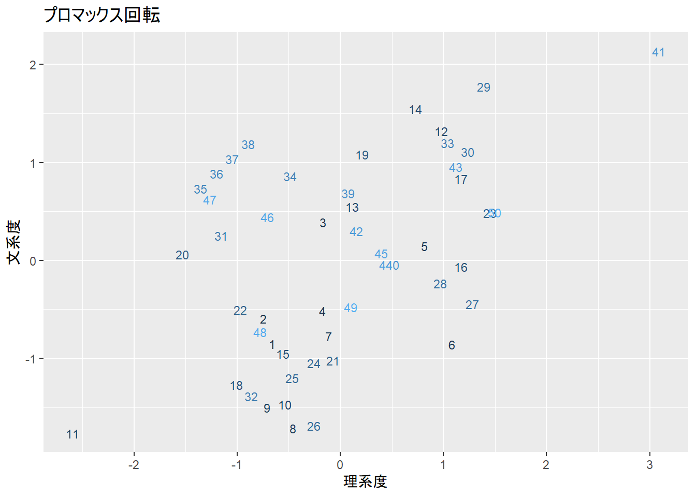](chapter28_files/figure-html/unnamed-chunk-27-1.png)

## 分位点の値

``` downlit
x <- seq(0, 1, by = 0.01)
d <- tibble(
  x,
  l3 = qpois(x, lambda = 3), # ラムダ3
  l8 = qpois(x, lambda = 8), # ラムダ8
  l11 = qpois(x, lambda = 11) # ラムダ11
)

d |> 
  pivot_longer(2:4) |> 
  ggplot(aes(x = x, y = value, color = name)) +
  geom_line()
```

[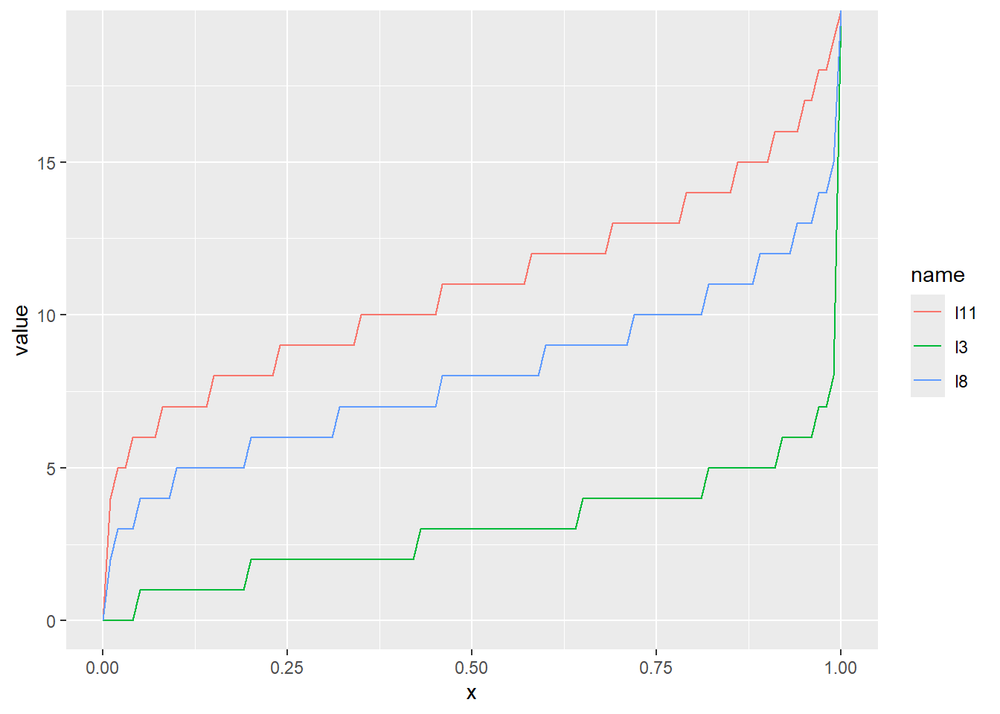](chapter28_files/figure-html/unnamed-chunk-28-1.png)

## ポアソン乱数

``` downlit
d <- tibble(
  l3 = rpois(1000, lambda = 3), # ラムダ3
  l8 = rpois(1000, lambda = 8), # ラムダ8
  l11 = rpois(1000, lambda = 11) # ラムダ11
)

d |> 
  pivot_longer(1:3) |> 
  ggplot(aes(x = value, color = name, fill = name, alpha = 0.5)) +
  geom_histogram(binwidth = 1, position = "identity")
```

[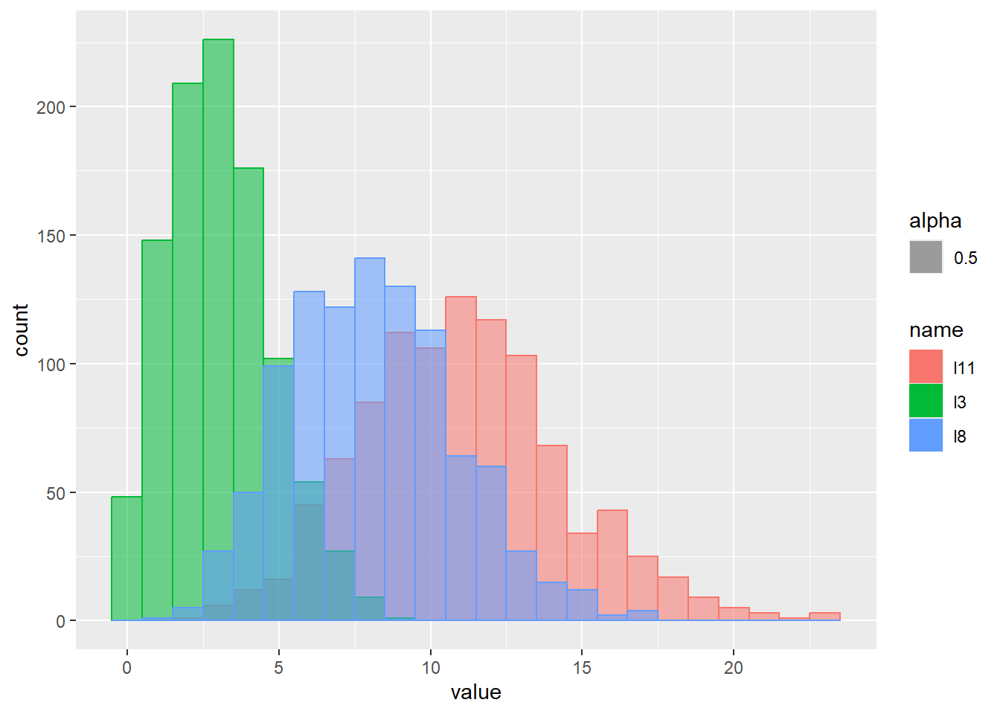](chapter28_files/figure-html/unnamed-chunk-29-1.png)

## 28.13 正規分布

**正規分布**は、様々な分布での値の平均値の分布を反映したもので（[中心極限定理](https://ja.wikipedia.org/wiki/%E4%B8%AD%E5%BF%83%E6%A5%B5%E9%99%90%E5%AE%9A%E7%90%86)）、統計では最も一般的に用いられているものです。正規分布のパラメータは平均値（μ）と標準偏差（σ）です。正規分布の確率密度関数は以下の式で表されます。

\\ Norm(x, \mu, \sigma)=\frac{1}{\sqrt{2\pi \sigma^2}} \cdot \exp \left( \frac{(x-\mu)^2}{2\sigma^2} \right) \\

Rでは、正規分布の確率密度関数は`dnorm`関数で計算することができます。`dnorm`関数では、平均値は`mean`引数、標準偏差は`sd`引数で設定します。

## 確率密度

``` downlit
x <- seq(-5, 5, by = 0.01)
d <- tibble(
  x,
  m0s1 = dnorm(x, mean = 0, sd = 1), # 平均0、標準偏差1
  m1s2 = dnorm(x, mean = 1, sd = 2), # 平均1、標準偏差2
  m2s05 = dnorm(x, mean = 2, sd = 0.5) # 平均2、標準偏差0.5
)

d |> 
  pivot_longer(2:4) |> 
  ggplot(aes(x = x, y = value, color = name)) +
  geom_line()
```

[](chapter28_files/figure-html/unnamed-chunk-30-1.png)

## 累積分布関数

``` downlit
d <- tibble(
  x,
  m0s1 = pnorm(x, mean = 0, sd = 1), # 平均0、標準偏差1
  m1s2 = pnorm(x, mean = 1, sd = 2), # 平均1、標準偏差2
  m2s05 = pnorm(x, mean = 2, sd = 0.5) # 平均2、標準偏差0.5
)

d |> 
  pivot_longer(2:4) |> 
  ggplot(aes(x = x, y = value, color = name)) +
  geom_line()
```

[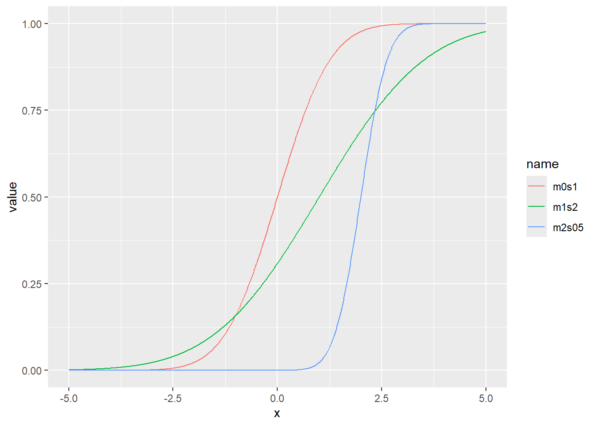](chapter28_files/figure-html/unnamed-chunk-31-1.png)

## 分位点の値

``` downlit
x <- seq(0, 1, by = 0.01)
d <- tibble(
  x,
  m0s1 = qnorm(x, mean = 0, sd = 1), # 平均0、標準偏差1
  m1s2 = qnorm(x, mean = 1, sd = 2), # 平均1、標準偏差2
  m2s05 = qnorm(x, mean = 2, sd = 0.5) # 平均2、標準偏差0.5
)

d |> 
  pivot_longer(2:4) |> 
  ggplot(aes(x = x, y = value, color = name)) +
  geom_line()
```

[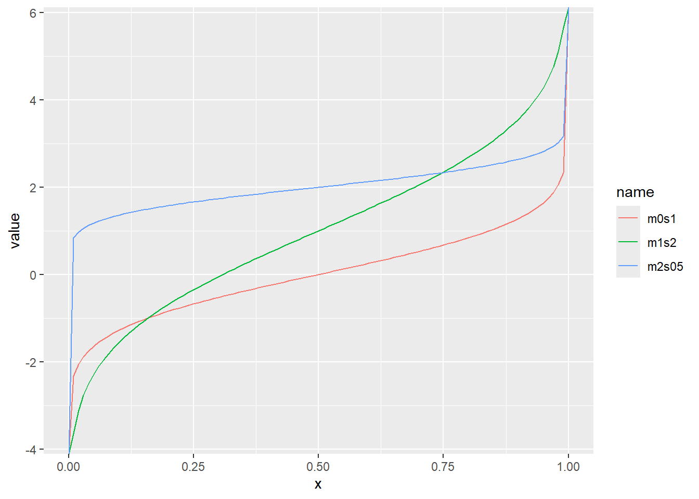](chapter28_files/figure-html/unnamed-chunk-32-1.png)

## 正規乱数

``` downlit
d <- tibble(
  m0s1 = rnorm(1000, mean = 0, sd = 1), # 平均0、標準偏差1
  m1s2 = rnorm(1000, mean = 1, sd = 2), # 平均1、標準偏差2
  m2s05 = rnorm(1000, mean = 2, sd = 0.5) # 平均2、標準偏差0.5
)

d |> 
  pivot_longer(1:3) |> 
  ggplot(aes(x = value, color = name, fill = name, alpha = 0.5)) +
  geom_histogram(binwidth = 1, position = "identity")
```

[](chapter28_files/figure-html/unnamed-chunk-33-1.png)

## 28.14 t分布

**t分布**は標本サイズが小さいときの母平均と標本平均の差の分布を反映した確率分布です。t分布は**t統計量**と呼ばれるものの分布を示します。t統計量は以下の式で計算できます。

\\t=\frac{x-\mu}{s/ \sqrt n}\\

この式で、xはサンプルの平均値、μは母平均値、sは標準偏差、nはサンプルの数を指します。t分布は主にt検定（平均値の差の検定）に用いられます。t分布の確率密度関数は以下の式で表されます。

\\t(x, \nu)=\frac{\Gamma(\nu+1)/2}{\sqrt{\nu \pi} \cdot \Gamma(\nu/2)} \cdot (1+x^2/\nu)^{-(\nu+1)/2}\\

上の式のνは自由度で、サンプル数から1を引いたものとなります。Rでは、`dt`関数でt分布の確率密度関数を計算することができます。`dt`関数の引数には、自由度`df`を設定します。t分布は\\-\infty\\～\\\infty\\の範囲を持つ連続値を取り、平均値は0です。t分布は正規分布とよく似た釣鐘型の分布ですが、正規分布と比較して裾が重い、0から遠い値の確率が大きくなる性質を持ちます。自由度`df`が\\-\infty\\に近づくと、t分布の形は正規分布と一致します。

また、t分布には検出力の計算等に用いられる非心パラメータと呼ばれるものがあり、`ncp`という引数で非心パラメータを指定することもできます。非心パラメータを0よりも大きく設定すると、t分布は左にゆがみ、平均値が0よりも大きくなります。

## 確率密度

``` downlit
x <- seq(-5, 15, by = 0.01)
d <- tibble(
  x,
  d3n0 = dt(x, df = 3, ncp = 0), # 自由度3、非心パラメータ0
  d8n0 = dt(x, df = 8, ncp = 0), # 自由度8、非心パラメータ0
  d3n3 = dt(x, df = 3, ncp = 3) # 自由度3、非心パラメータ3
)

d |> 
  pivot_longer(2:4) |> 
  ggplot(aes(x = x, y = value, color = name)) +
  geom_line()
```

[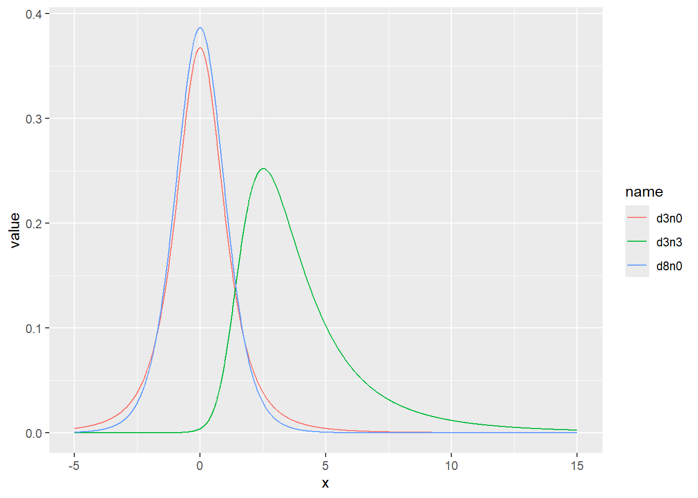](chapter28_files/figure-html/unnamed-chunk-34-1.png)

## 累積分布関数

``` downlit
d <- tibble(
  x,
  d3n0 = pt(x, df = 3, ncp = 0), # 自由度3、非心パラメータ0
  d8n0 = pt(x, df = 8, ncp = 0), # 自由度8、非心パラメータ0
  d3n3 = pt(x, df = 3, ncp = 3) # 自由度3、非心パラメータ3
)

d |> 
  pivot_longer(2:4) |> 
  ggplot(aes(x = x, y = value, color = name)) +
  geom_line()
```

[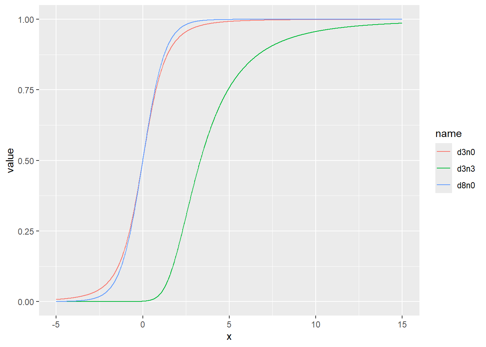](chapter28_files/figure-html/unnamed-chunk-35-1.png)

## 分位点の値

``` downlit
x <- seq(0, 1, by = 0.01)
d <- tibble(
  x,
  d3n0 = qt(x, df = 3, ncp = 0), # 自由度3、非心パラメータ0
  d8n0 = qt(x, df = 8, ncp = 0), # 自由度8、非心パラメータ0
  d3n3 = qt(x, df = 3, ncp = 3) # 自由度3、非心パラメータ3
)

d |> 
  pivot_longer(2:4) |> 
  ggplot(aes(x = x, y = value, color = name)) +
  geom_line()
```

[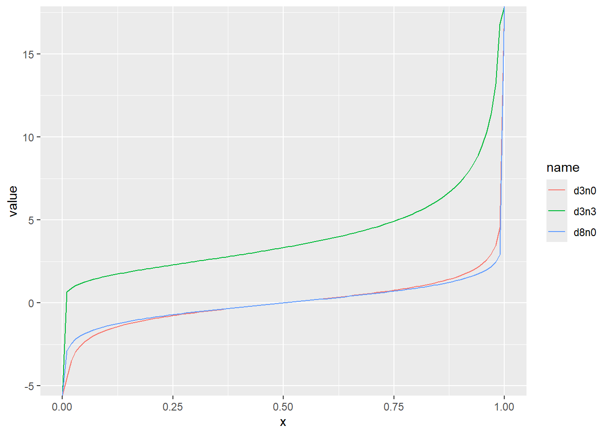](chapter28_files/figure-html/unnamed-chunk-36-1.png)

## t分布の乱数

``` downlit
d <- tibble(
  d3n0 = rt(1000, df = 3, ncp = 0), # 自由度3、非心パラメータ0
  d8n0 = rt(1000, df = 8, ncp = 0), # 自由度8、非心パラメータ0
  d3n3 = rt(1000, df = 3, ncp = 3) # 自由度3、非心パラメータ3
)

d |> 
  pivot_longer(1:3) |> 
  ggplot(aes(x = value, color = name, fill = name, alpha = 0.5)) +
  geom_histogram(binwidth = 1, position = "identity")
```

[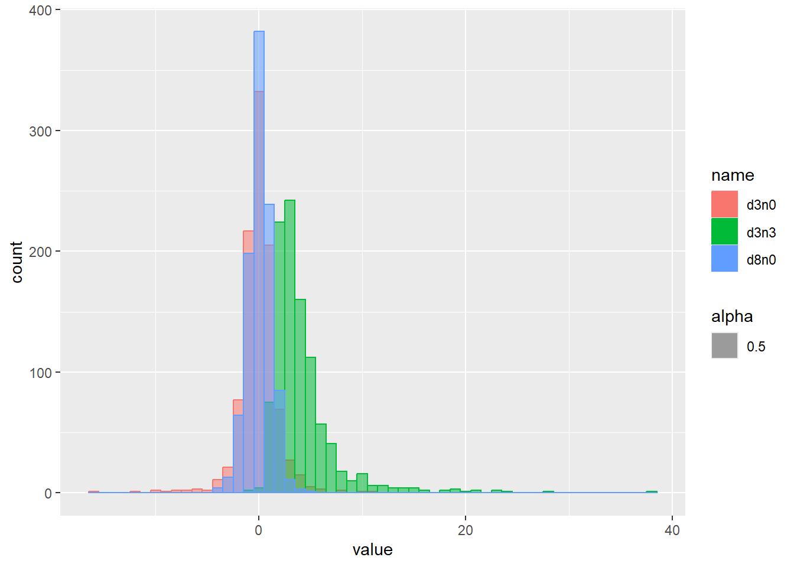](chapter28_files/figure-html/unnamed-chunk-37-1.png)

## 28.15 コーシー分布

**コーシー分布**はt分布で自由度が1のときの分布です。コーシー分布はt分布よりもさらに裾が重く、平均値も標準偏差も定義できない分布です。コーシー分布のパラメータは中央値であるtとスケールパラメータであるsの2つです。コーシー分布の確率密度関数は以下の式で表されます。

\\Cauchy(x, t, s)=\frac{1}{s \cdot \pi (1+((x-t)/s)^2)} \\

Rでは、コーシー分布の確率密度関数は`dcauchy`関数で計算することができます。`dcauchy`関数の引数は中央値tである`location`とスケールパラメータsである`scale`の2つです。コーシー分布も正規分布やt分布と同じく、\\-\infty\\～\\\infty\\の範囲を持つ連続値を取ります。

## 確率密度

``` downlit
x <- seq(-5, 5, by = 0.01)
d <- tibble(
  x,
  l0s1 = dcauchy(x, location = 0, scale = 1), # 中央値0、スケール1
  lm2s05 = dcauchy(x, location = -2, scale = 0.5), # 中央値-2、スケール0.5
  l2s2 = dcauchy(x, location = 2, scale = 2) # 中央値2、スケール2
)

d |> 
  pivot_longer(2:4) |> 
  ggplot(aes(x = x, y = value, color = name)) +
  geom_line()
```

[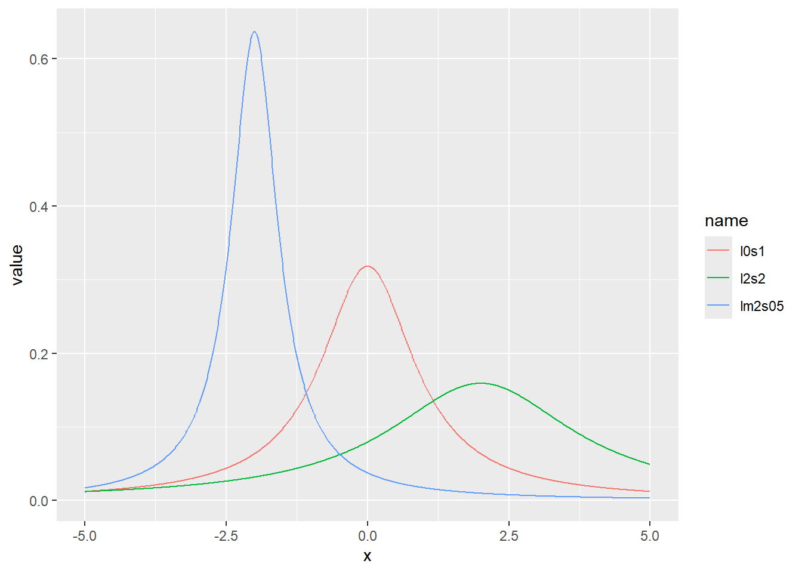](chapter28_files/figure-html/unnamed-chunk-38-1.png)

## 累積分布関数

``` downlit
d <- tibble(
  x,
  l0s1 = pcauchy(x, location = 0, scale = 1), # 中央値20、スケール0.1
  lm2s05 = pcauchy(x, location = -2, scale = 0.5), # 中央値20、スケール0.5
  l2s2 = pcauchy(x, location = 2, scale = 2) # 中央値20、スケール0.8
)

d |> 
  pivot_longer(2:4) |> 
  ggplot(aes(x = x, y = value, color = name)) +
  geom_line()+
  expand_limits(y=0)
```

[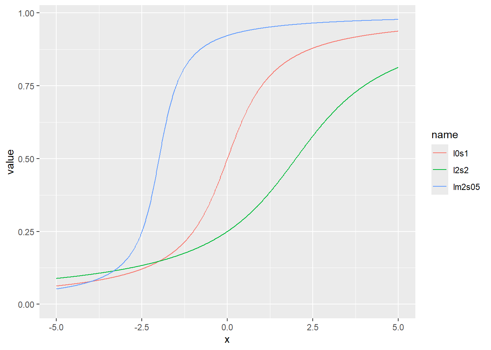](chapter28_files/figure-html/unnamed-chunk-39-1.png)

## 分位点の値

``` downlit
x <- seq(0, 1, by = 0.01)
d <- tibble(
  x,
  l0s1 = qcauchy(x, location = 0, scale = 1), # 中央値20、スケール0.1
  lm2s05 = qcauchy(x, location = -2, scale = 0.5), # 中央値20、スケール0.5
  l2s2 = qcauchy(x, location = 2, scale = 2) # 中央値20、スケール0.8
)

d |> 
  pivot_longer(2:4) |> 
  ggplot(aes(x = x, y = value, color = name)) +
  geom_line()
```

[](chapter28_files/figure-html/unnamed-chunk-40-1.png)

## コーシー乱数

``` downlit
set.seed(0)
d <- tibble(
  l0s1 = rcauchy(1000, location = 0, scale = 1), # 中央値20、スケール0.1
  lm2s05 = rcauchy(1000, location = -2, scale = 0.5), # 中央値20、スケール0.5
  l2s2 = rcauchy(1000, location = 2, scale = 2) # 中央値20、スケール0.8
)

d |> 
  pivot_longer(1:3) |> 
  ggplot(aes(x = value, color = name, fill = name, alpha = 0.2)) +
  geom_histogram(binwidth = 50, position = "identity")
```

[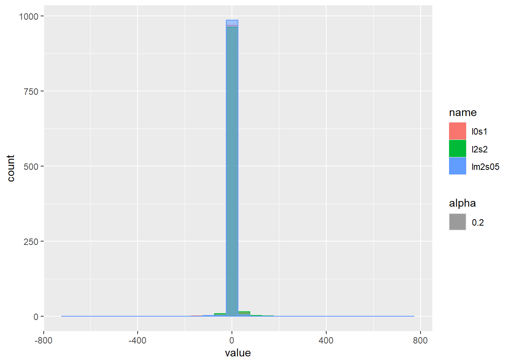](chapter28_files/figure-html/unnamed-chunk-41-1.png)

## 28.16 ロジスティック分布

**ロジスティック分布**は**ロジスティック関数**を微分したものを分布としたもの、つまり、ロジスティック分布の積分である累積分布関数がロジスティック関数を取る分布のことを指します。ロジスティック関数は線形回帰で用いられる関数で、以下の式で表されます。

\\logis(x)=\frac{1}{(1+\exp(-(ax+b))}\\

ロジスティック関数は[個体群モデル](https://ja.wikipedia.org/wiki/%E5%80%8B%E4%BD%93%E7%BE%A4%E5%8B%95%E6%85%8B%E8%AB%96)の数式化と関連のある関数です。統計では、逆関数である**ロジット関数**から導出されます。ロジット関数は以下の式で表されます。

\\log(\frac{p}{1-p})=ax+b\\

ロジット関数のpはベルヌーイ試行の成功確率p、ax+bは線形回帰の式です。\\p/1-p\\は**オッズ比**と呼ばれるもので、成功確率と失敗確率の比を指します。

ロジスティック分布は以下の式で表されます。

\\Logistic(x, \mu, s)=\frac{\exp(-x)}{s(1+\exp(-(x-\mu)/s)^2)}\\

上の式のμは中央値、sはスケールパラメータです。Rでは、ロジスティック分布の確率密度関数は`dlogis`関数で計算することができます。`dlogis`関数の引数には、中央値μである`location`とスケールパラメータsである`scale`を指定します。ロジスティック分布は\\-\infty\\～\\\infty\\の範囲を持つ連続値を取ります。

## 確率密度

``` downlit
x <- seq(-5, 5, by = 0.01)
d <- tibble(
  x,
  l0s1 = dlogis(x, location = 0, scale = 1), # location 0、scale1
  l1s2 = dlogis(x, location = 1, scale = 2), # location 1、scale2
  l2s05 = dlogis(x, location = 2, scale = 0.5) # location 2、scale0.5
)

d |> 
  pivot_longer(2:4) |> 
  ggplot(aes(x = x, y = value, color = name)) +
  geom_line()
```

[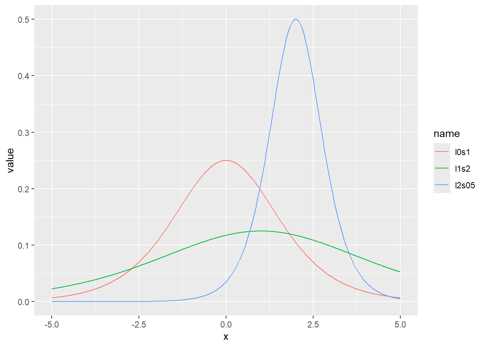](chapter28_files/figure-html/unnamed-chunk-42-1.png)

## 累積分布関数

``` downlit
d <- tibble(
  x,
  l0s1 = plogis(x, location = 0, scale = 1), # location 0、scale1
  l1s2 = plogis(x, location = 1, scale = 2), # location 1、scale2
  l2s05 = plogis(x, location = 2, scale = 0.5) # location 2、scale0.5
)

d |> 
  pivot_longer(2:4) |> 
  ggplot(aes(x = x, y = value, color = name)) +
  geom_line()
```

[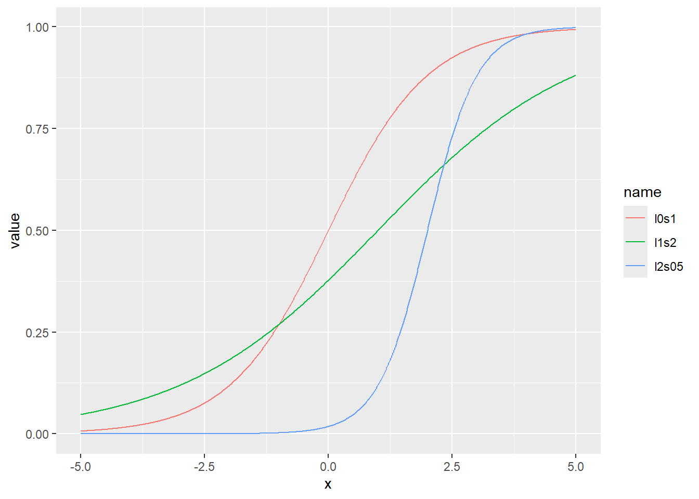](chapter28_files/figure-html/unnamed-chunk-43-1.png)

## 分位点の値

``` downlit
x <- seq(0, 1, by = 0.01)
d <- tibble(
  x,
  l0s1 = qlogis(x, location = 0, scale = 1), # location 0、scale1
  l1s2 = qlogis(x, location = 1, scale = 2), # location 1、scale2
  l2s05 = qlogis(x, location = 2, scale = 0.5) # location 2、scale0.5
)

d |> 
  pivot_longer(2:4) |> 
  ggplot(aes(x = x, y = value, color = name)) +
  geom_line()
```

[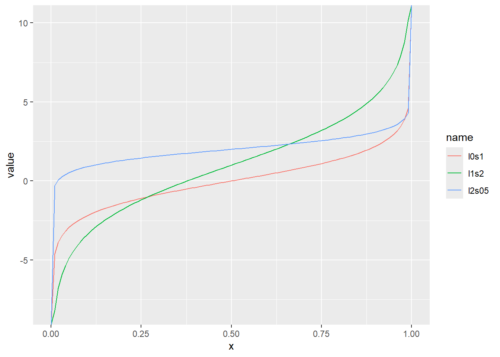](chapter28_files/figure-html/unnamed-chunk-44-1.png)

## ロジスティック乱数

``` downlit
d <- tibble(
  l0s1 = rlogis(1000, location = 0, scale = 1), # location 0、scale1
  l1s2 = rlogis(1000, location = 1, scale = 2), # location 1、scale2
  l2s05 = rlogis(1000, location = 2, scale = 0.5) # location 2、scale0.5
)

d |> 
  pivot_longer(1:3) |> 
  ggplot(aes(x = value, color = name, fill = name, alpha = 0.5)) +
  geom_histogram(binwidth = 1, position = "identity")
```

[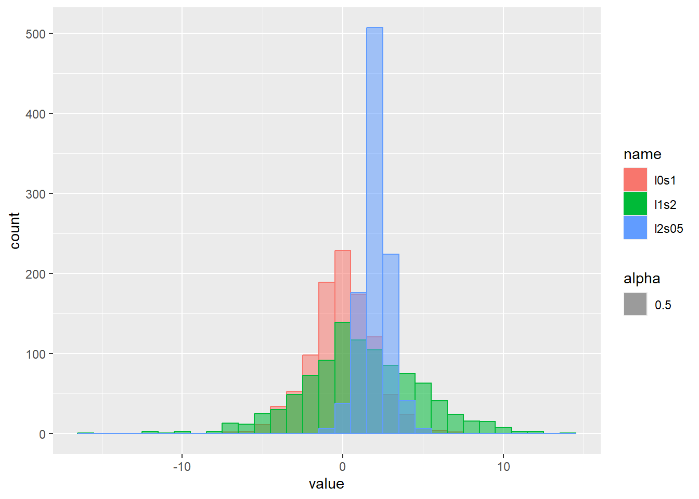](chapter28_files/figure-html/unnamed-chunk-45-1.png)

## 28.17 対数正規分布

**対数正規分布**は正規分布を指数変換した分布です。年収がこの分布に従うことで有名です。パラメータは正規分布と同じくμとσですが、μとσは分布の平均値・標準偏差ではありません。対数正規分布の確率密度関数は以下の式で表されます。

\\Lognorm(x, \mu, \sigma)=\frac{1}{x\sigma\sqrt{2\pi}} \cdot \exp(-\frac{(\ln x-\mu)^2}{2\sigma^2})\\

Rで対数正規分布の確率密度関数を計算するには、`dlnorm`関数を用います。`dlnorm`関数の引数には、μとして`meanlog`、σとして`sdlog`を指定します。対数正規分布は左に歪み、右側の裾が長い分布を示し、0～\\\infty\\の範囲を持つ連続値を取ります。

## 確率密度

``` downlit
x <- seq(0, 5, by = 0.01)
d <- tibble(
  x,
  m0s1 = dlnorm(x, meanlog = 0, sdlog = 1), # 平均（対数）0、標準偏差（対数）1
  m2s2 = dlnorm(x, meanlog = 2, sdlog = 2), # 平均（対数）2、標準偏差（対数）2
  mm2s05 = dlnorm(x, meanlog = -2, sdlog = 0.5) # 平均（対数）-2、標準偏差（対数）0.5
)

d |> 
  pivot_longer(2:4) |> 
  ggplot(aes(x = x, y = value, color = name)) +
  geom_line()
```

[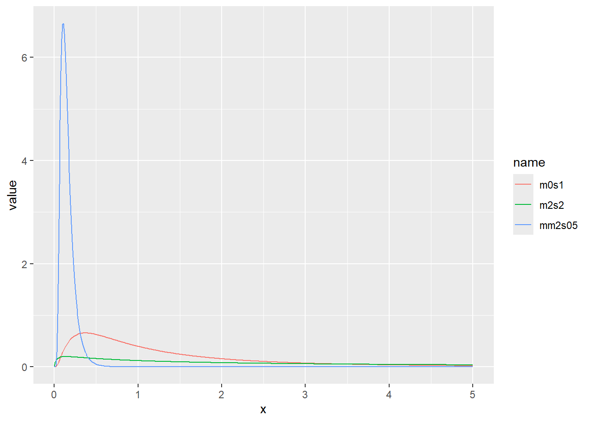](chapter28_files/figure-html/unnamed-chunk-46-1.png)

## 累積分布関数

``` downlit
d <- tibble(
  x,
  m0s1 = plnorm(x, meanlog = 0, sdlog = 1), # 平均（対数）0、標準偏差（対数）1
  m2s2 = plnorm(x, meanlog = 2, sdlog = 2), # 平均（対数）2、標準偏差（対数）2
  mm2s05 = plnorm(x, meanlog = -2, sdlog = 0.5) # 平均（対数）-2、標準偏差（対数）0.5
)

d |> 
  pivot_longer(2:4) |> 
  ggplot(aes(x = x, y = value, color = name)) +
  geom_line()
```

[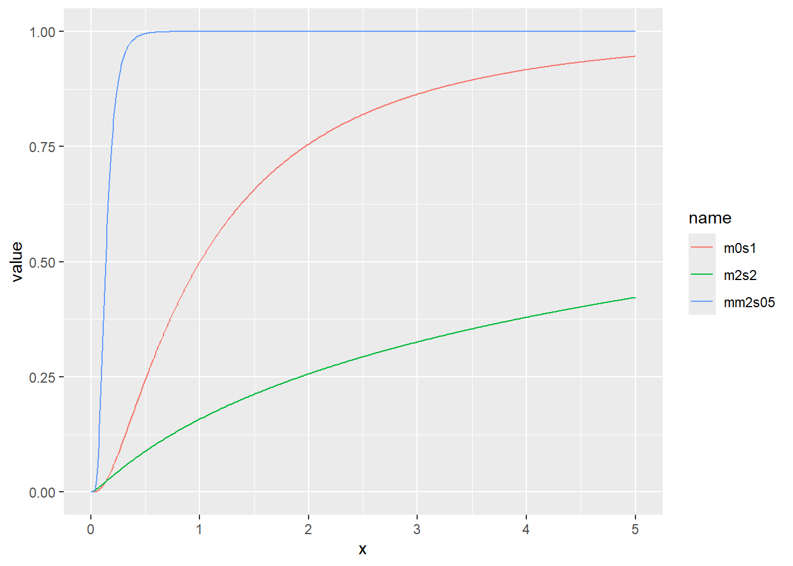](chapter28_files/figure-html/unnamed-chunk-47-1.png)

## 分位点の値

``` downlit
x <- seq(0, 1, by = 0.01)
d <- tibble(
  x,
  m0s1 = qlnorm(x, meanlog = 0, sdlog = 1), # 平均（対数）0、標準偏差（対数）1
  m2s2 = qlnorm(x, meanlog = 2, sdlog = 2), # 平均（対数）2、標準偏差（対数）2
  mm2s05 = qlnorm(x, meanlog = -2, sdlog = 0.5) # 平均（対数）-2、標準偏差（対数）0.5
)

d |> 
  pivot_longer(2:4) |> 
  ggplot(aes(x = x, y = value, color = name)) +
  geom_line()
```

[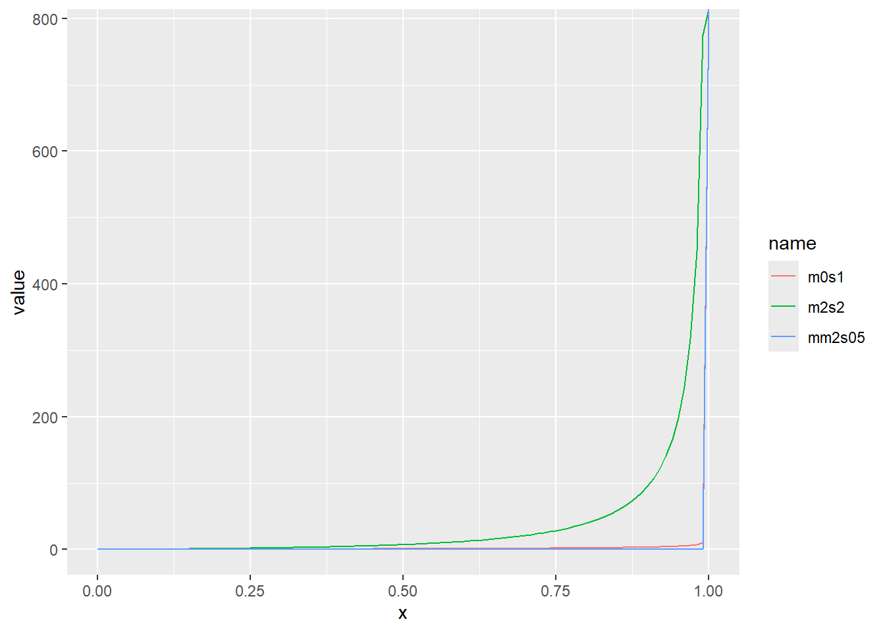](chapter28_files/figure-html/unnamed-chunk-48-1.png)

## 対数正規乱数

``` downlit
d <- tibble(
  m0s1 = rlnorm(1000, meanlog = 0, sdlog = 1), # 平均（対数）0、標準偏差（対数）1
  m2s2 = rlnorm(1000, meanlog = 2, sdlog = 2), # 平均（対数）2、標準偏差（対数）2
  mm2s05 = rlnorm(1000, meanlog = -2, sdlog = 0.5) # 平均（対数）-2、標準偏差（対数）0.5
)

d |> 
  pivot_longer(1:3) |> 
  ggplot(aes(x = value, color = name, fill = name, alpha = 0.5)) +
  geom_histogram(binwidth = 100, position = "identity")
```

[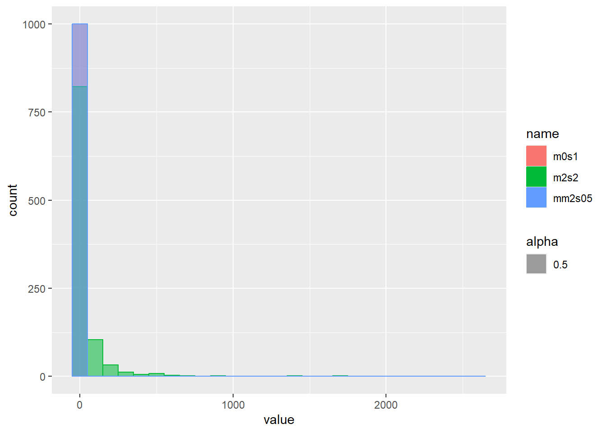](chapter28_files/figure-html/unnamed-chunk-49-1.png)

## 28.18 ベータ分布

**ベータ分布**は、ベルヌーイ試行などの成功確率をモデル化する際に用いられる分布です。ベータ分布の確率密度関数には2つのパラメータがあり、それぞれα、βと呼ばれます。どちらも形状パラメータを意味しています。ベータ分布の確率密度関数は以下の式で表されます。

\\Beta(x, \alpha, \beta)=\frac{\Gamma(\alpha + \beta)}{\Gamma(\alpha)\Gamma(\beta)} \cdot x^{\alpha-1} \cdot (1-x)^{\beta-1}\\

Rでは、ベータ分布の確率密度関数は`dbeta`関数で計算することができます。`dbeta`分布の引数として、αを`shape1`、βを`shape2`として指定します。ベータ分布は0～1までの連続値を取ります。

## 確率密度

``` downlit
x <- seq(0, 1, by = 0.01)
d <- tibble(
  x,
  s05s075 = dbeta(x, shape1 = 0.5, shape2 = 0.75), # shape1が0.5、shape2が0.75
  s1s1  = dbeta(x, shape1 = 1, shape2 = 1), # shape1が1、shape2が1
  s3s2 = dbeta(x, shape1 = 3, shape2 = 2) # shape1が3、shape2が2
)

d |> 
  pivot_longer(2:4) |> 
  ggplot(aes(x = x, y = value, color = name)) +
  geom_line()
```

[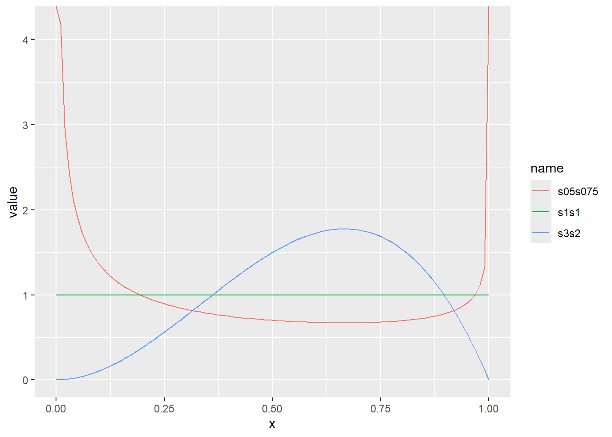](chapter28_files/figure-html/unnamed-chunk-50-1.png)

## 累積分布関数

``` downlit
x <- seq(0, 1, by = 0.01)
d <- tibble(
  x,
  s05s075 = pbeta(x, shape1 = 0.5, shape2 = 0.75), # shape1が0.5、shape2が0.75
  s1s1  = pbeta(x, shape1 = 1, shape2 = 1), # shape1が1、shape2が1
  s3s2 = pbeta(x, shape1 = 3, shape2 = 2) # shape1が3、shape2が2
)

d |> 
  pivot_longer(2:4) |> 
  ggplot(aes(x = x, y = value, color = name)) +
  geom_line()
```

[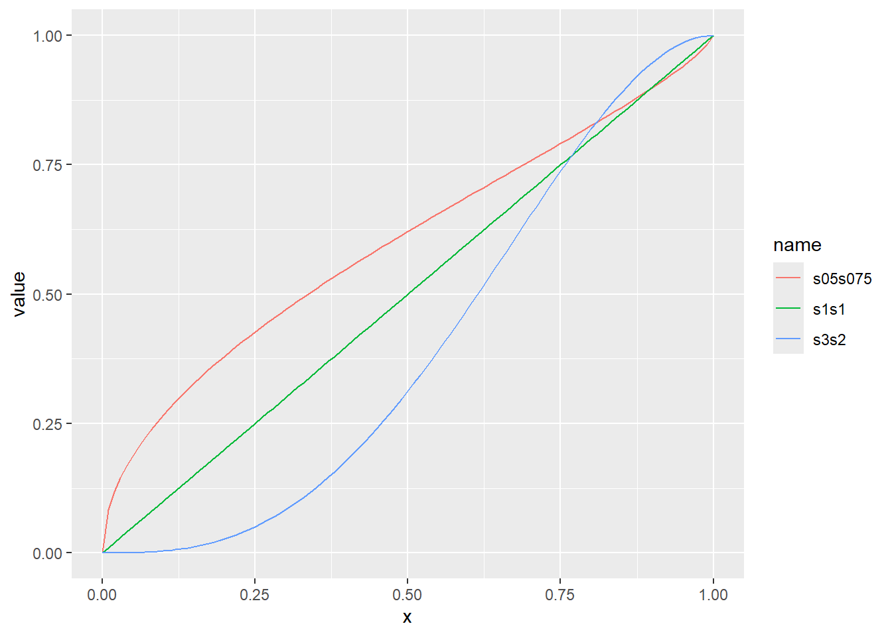](chapter28_files/figure-html/unnamed-chunk-51-1.png)

## 分位点の値

``` downlit
x <- seq(0, 1, by = 0.01)
d <- tibble(
  x,
  s05s075 = qbeta(x, shape1 = 0.5, shape2 = 0.75), # shape1が0.5、shape2が0.75
  s1s1  = qbeta(x, shape1 = 1, shape2 = 1), # shape1が1、shape2が1
  s3s2 = qbeta(x, shape1 = 3, shape2 = 2) # shape1が3、shape2が2
)

d |> 
  pivot_longer(2:4) |> 
  ggplot(aes(x = x, y = value, color = name)) +
  geom_line()
```

[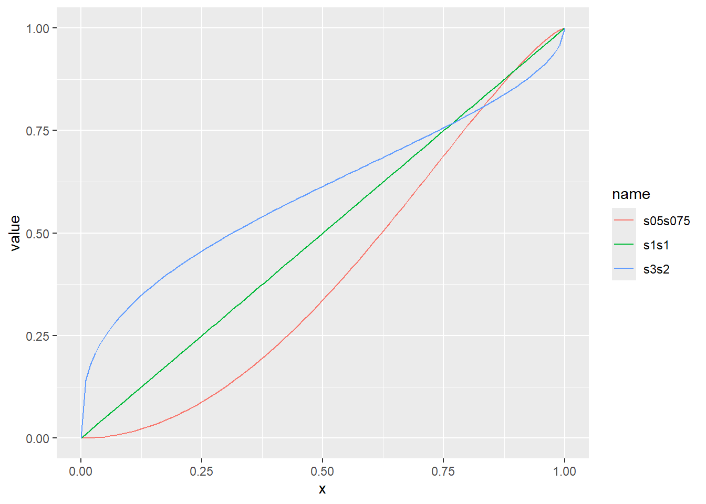](chapter28_files/figure-html/unnamed-chunk-52-1.png)

## ベータ分布乱数

``` downlit
d <- tibble(
  s05s075 = rbeta(1000, shape1 = 0.5, shape2 = 0.75), # shape1が0.5、shape2が0.75
  s1s1  = rbeta(1000, shape1 = 1, shape2 = 1), # shape1が1、shape2が1
  s3s2 = rbeta(1000, shape1 = 3, shape2 = 2) # shape1が3、shape2が2
)

d |> 
  pivot_longer(1:3) |> 
  ggplot(aes(x = value, color = name, fill = name, alpha = 0.5)) +
  geom_histogram(binwidth = 0.1, position = "identity")
```

[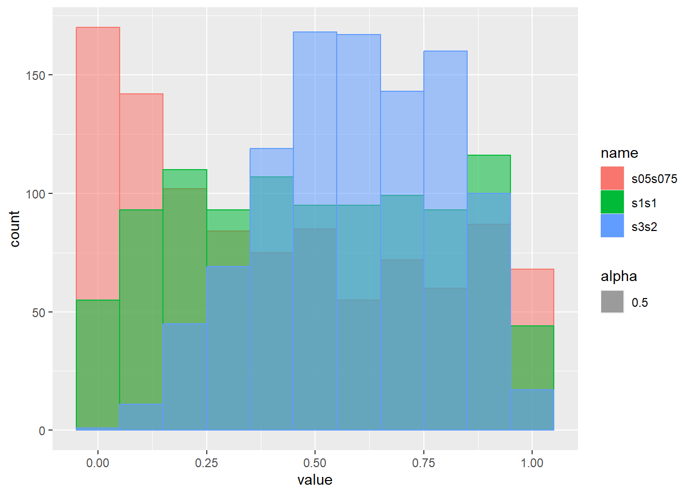](chapter28_files/figure-html/unnamed-chunk-53-1.png)

## 28.19 カイ二乗分布

**カイ二乗分布**は正規分布に従う確率変数の二乗和の確率分布です。カイ二乗分布は度数の検定に用いられる分布で、そのパラメータは自由度νのみです。カイ二乗分布の確率密度関数は以下の式で表されます。

\\Chisq(x, \nu)=\frac{\exp(-x/2) \cdot \exp(\nu/2-1)}{2^{\nu/2} \cdot \Gamma(\nu/2)}\\

Rでは、カイ二乗分布は`dchisq`関数で計算することができます。`dchisq`関数の引数として、自由度νを`df`として指定します。カイ二乗分布は右側の裾が長い分布を示し、0～\\\infty\\の範囲を持つ連続値を取ります。

また、t分布と同様に非心度を引数`ncp`として指定することもできます。

## 確率密度

``` downlit
x <- seq(0, 30, by = 0.01)
d <- tibble(
  x,
  d3n0 = dchisq(x, df = 3, ncp = 0), # 自由度3、非心パラメータ0
  d5n05 = dchisq(x, df = 5, ncp = 0.5), # 自由度5、非心パラメータ0.5
  d10n2 = dchisq(x, df = 10, ncp = 2) # 自由度10、非心パラメータ2
)

d |> 
  pivot_longer(2:4) |> 
  ggplot(aes(x = x, y = value, color = name)) +
  geom_line()
```

[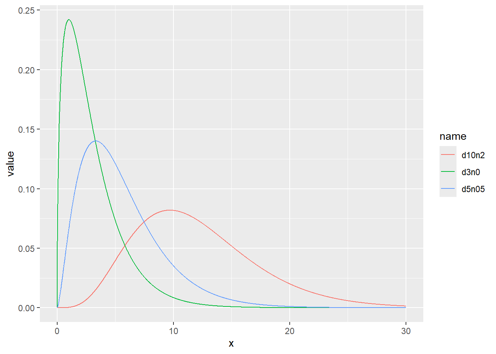](chapter28_files/figure-html/unnamed-chunk-54-1.png)

## 累積分布関数

``` downlit
d <- tibble(
  x,
  d3n0 = pchisq(x, df = 3, ncp = 0), # 自由度3、非心パラメータ0
  d5n05 = pchisq(x, df = 5, ncp = 0.5), # 自由度5、非心パラメータ0.5
  d10n2 = pchisq(x, df = 10, ncp = 2) # 自由度10、非心パラメータ2
)

d |> 
  pivot_longer(2:4) |> 
  ggplot(aes(x = x, y = value, color = name)) +
  geom_line()
```

[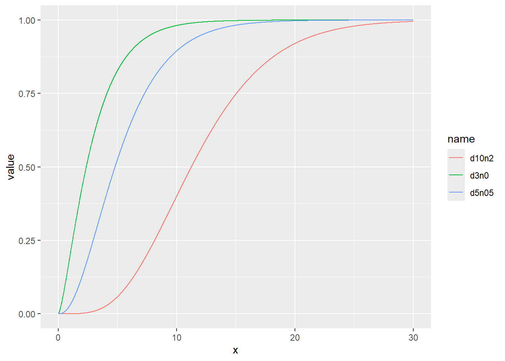](chapter28_files/figure-html/unnamed-chunk-55-1.png)

## 分位点の値

``` downlit
x <- seq(0, 1, by = 0.01)
d <- tibble(
  x,
  d3n0 = qchisq(x, df = 3, ncp = 0), # 自由度3、非心パラメータ0
  d5n05 = qchisq(x, df = 5, ncp = 0.5), # 自由度5、非心パラメータ0.5
  d10n2 = qchisq(x, df = 10, ncp = 2) # 自由度10、非心パラメータ2
)

d |> 
  pivot_longer(2:4) |> 
  ggplot(aes(x = x, y = value, color = name)) +
  geom_line()
```

[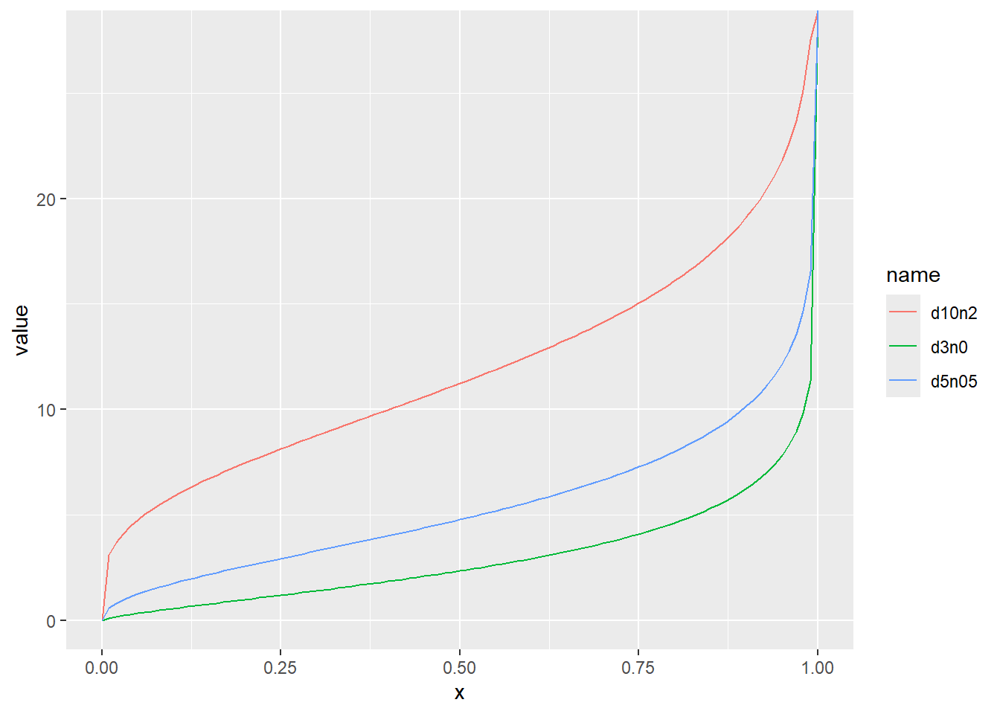](chapter28_files/figure-html/unnamed-chunk-56-1.png)

## カイ二乗乱数

``` downlit
d <- tibble(
  d3n0 = rchisq(1000, df = 3, ncp = 0), # 自由度3、非心パラメータ0
  d5n05 = rchisq(1000, df = 5, ncp = 0.5), # 自由度5、非心パラメータ0.5
  d10n2 = rchisq(1000, df = 10, ncp = 2) # 自由度10、非心パラメータ2
)

d |> 
  pivot_longer(1:3) |> 
  ggplot(aes(x = value, color = name, fill = name, alpha = 0.5)) +
  geom_histogram(binwidth = 1, position = "identity")
```

[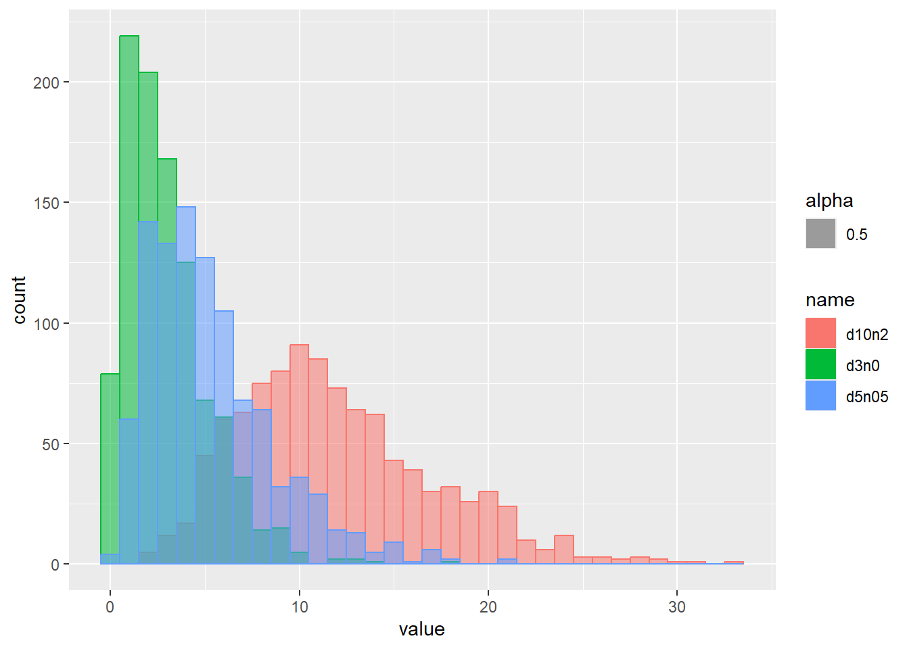](chapter28_files/figure-html/unnamed-chunk-57-1.png)

## 28.20 F分布

**F分布**はカイ二乗に従う2つの独立な変数の比の分布です。F分布は**分散分析**で用いられる分布です。F分布のパラメータは独立の2変数それぞれの自由度（ν₁とν₂）です。F分布の確率密度関数は以下の式で表されます。

\\F(x, \nu\_{1}, \nu\_{2})= \frac{\Gamma(\frac{\nu\_{1}+\nu\_{2}}{2}) \cdot (\frac{\nu\_{1}}{\nu\_{2}})^{\nu\_{1}/2 \cdot x^{\nu\_{1}/2-1}}} {\Gamma(\frac{\nu\_{1}}{2}) \cdot \Gamma(\frac{\nu\_{2}}{2}) \cdot (1+\frac{\nu\_{1}x}{\nu\_{2}})^{\frac{\nu\_{1}+\nu\_{2}}{2}}}\\

RではF分布の確率密度関数を`df`関数で計算することができます。`df`関数では自由度2つをそれぞれ`df1`、`df2`引数として指定します。F分布も右側の裾が長い分布を示し、0～\\\infty\\の範囲を持つ連続値を取ります。

## 確率密度

``` downlit
x <- seq(0, 10, by = 0.01)
d <- tibble(
  x,
  df5df5 = df(x, df1 = 5, df2 = 5), # 自由度1 5、自由度2 5
  df10df15 = df(x, df1 = 10, df2 = 15), # 自由度1 10、自由度2 15
  df15df20 = df(x, df1 = 20, df2 = 15) # 自由度1 20、自由度2 15
)

d |> 
  pivot_longer(2:4) |> 
  ggplot(aes(x = x, y = value, color = name)) +
  geom_line()
```

[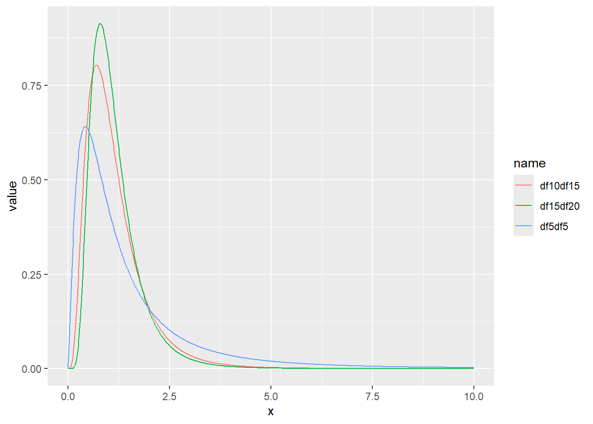](chapter28_files/figure-html/unnamed-chunk-58-1.png)

## 累積分布関数

``` downlit
d <- tibble(
  x,
  df5df5 = pf(x, df1 = 5, df2 = 5), # 自由度1 5、自由度2 5
  df10df15 = pf(x, df1 = 10, df2 = 15), # 自由度1 10、自由度2 15
  df15df20 = pf(x, df1 = 20, df2 = 15) # 自由度1 20、自由度2 15
)

d |> 
  pivot_longer(2:4) |> 
  ggplot(aes(x = x, y = value, color = name)) +
  geom_line()
```

[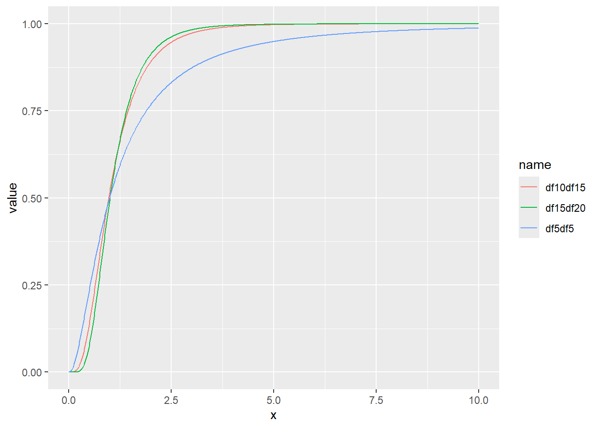](chapter28_files/figure-html/unnamed-chunk-59-1.png)

## 分位点の値

``` downlit
x <- seq(0, 1, by = 0.01)
d <- tibble(
  x,
  df5df5 = qf(x, df1 = 5, df2 = 5), # 自由度1 5、自由度2 5
  df10df15 = qf(x, df1 = 10, df2 = 15), # 自由度1 10、自由度2 15
  df15df20 = qf(x, df1 = 20, df2 = 15) # 自由度1 20、自由度2 15
)

d |> 
  pivot_longer(2:4) |> 
  ggplot(aes(x = x, y = value, color = name)) +
  geom_line()
```

[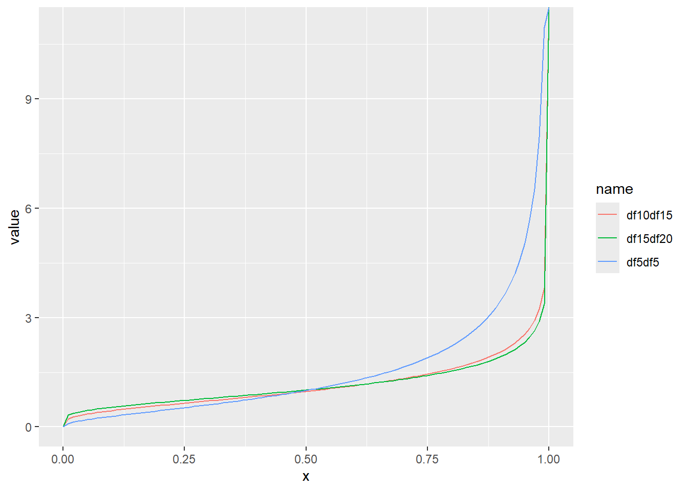](chapter28_files/figure-html/unnamed-chunk-60-1.png)

## F乱数

``` downlit
d <- tibble(
  df5df5 = rf(1000, df1 = 5, df2 = 5), # 自由度1 5、自由度2 5
  df10df15 = rf(1000, df1 = 10, df2 = 15), # 自由度1 10、自由度2 15
  df15df20 = rf(1000, df1 = 20, df2 = 15) # 自由度1 20、自由度2 15
)

d |> 
  pivot_longer(1:3) |> 
  ggplot(aes(x = value, color = name, fill = name, alpha = 0.5)) +
  geom_histogram(binwidth = 1, position = "identity")
```

[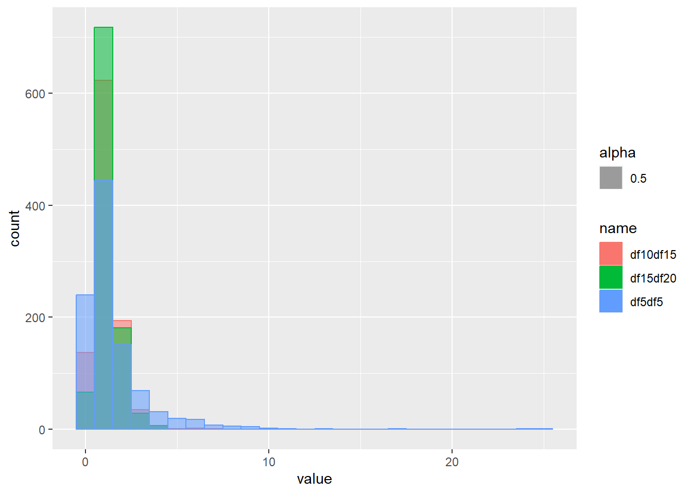](chapter28_files/figure-html/unnamed-chunk-61-1.png)

> **TIP:**
>
> Rでデータフレームを変数に代入する場合、`data.frame`から変数名を`df`とする場合があるのですが、この`df`にデータフレームを代入してしまうと、F関数の確率密度関数である`df`関数を上書きしてしまいます。正直`df`関数を使う機会はほとんどないのですが、データフレームの変数名には`d`の一文字を用いたり、きちんと意味のある名前を用いた方がよいでしょう。

## 28.21 ガンマ分布

**ガンマ分布**は機械の信頼性や降雨量などの説明に用いられる分布です。ガンマ分布のパラメータは形状パラメータγとスケールパラメータβの2つです。ガンマ分布の確率密度関数は以下の式で表されます。

\\Gamma(x, \gamma, \beta)=\frac{(\frac{x}{\beta})^{\gamma-1} \cdot \exp(-\frac{x}{\beta})}{\beta \cdot \Gamma(\gamma)}\\

Rでのガンマ分布の確率密度関数は`dgamma`関数で計算することができます。ガンマ分布のパラメータである形状パラメータは`shape`引数、スケールパラメータは`scale`引数で指定します。ガンマ分布は右側の裾が長い分布で、最頻値が0以上となる形状を示し、0～\\\infty\\の範囲を持つ連続値を取ります。

## 確率密度

``` downlit
x <- seq(0, 100, by = 0.1)
d <- tibble(
  x,
  df5df5 = dgamma(x, shape = 5, scale = 2), # shape 5 scale 2
  df10df15 = dgamma(x, shape = 10, scale = 4), # shape 10 scale 4
  df15df20 = dgamma(x, shape = 1, scale = 6) # shape 1 scale 6
)

d |> 
  pivot_longer(2:4) |> 
  ggplot(aes(x = x, y = value, color = name)) +
  geom_line()
```

[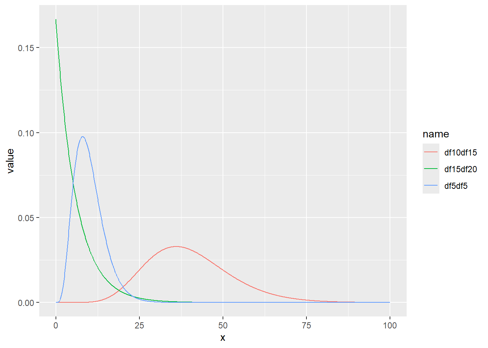](chapter28_files/figure-html/unnamed-chunk-62-1.png)

## 累積分布関数

``` downlit
d <- tibble(
  x,
  df5df5 = pgamma(x, shape = 5, scale = 2), # shape 5 scale 2
  df10df15 = pgamma(x, shape = 10, scale = 4), # shape 10 scale 4
  df15df20 = pgamma(x, shape = 1, scale = 6) # shape 1 scale 6
)

d |> 
  pivot_longer(2:4) |> 
  ggplot(aes(x = x, y = value, color = name)) +
  geom_line()
```

[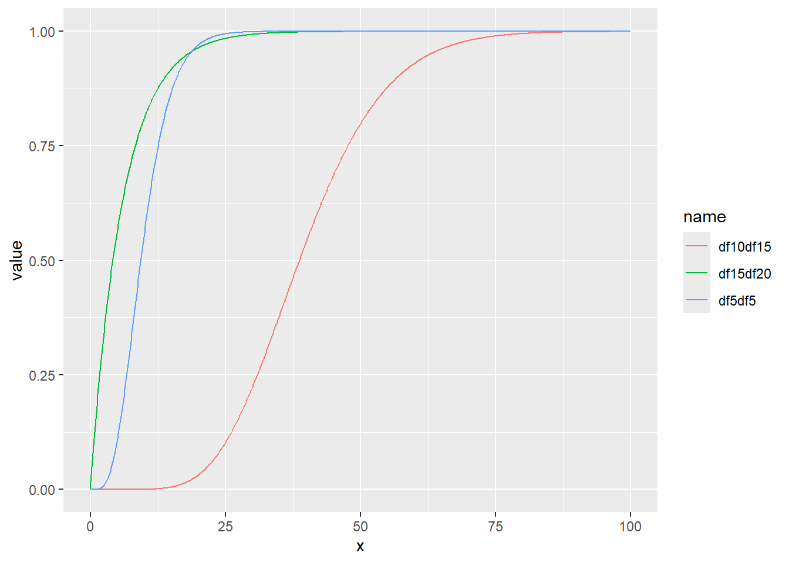](chapter28_files/figure-html/unnamed-chunk-63-1.png)

## 分位点の値

``` downlit
x <- seq(0, 1, by = 0.01)
d <- tibble(
  x,
  df5df5 = qgamma(x, shape = 5, scale = 2), # shape 5 scale 2
  df10df15 = qgamma(x, shape = 10, scale = 4), # shape 10 scale 4
  df15df20 = qgamma(x, shape = 1, scale = 6) # shape 1 scale 6
)

d |> 
  pivot_longer(2:4) |> 
  ggplot(aes(x = x, y = value, color = name)) +
  geom_line()
```

[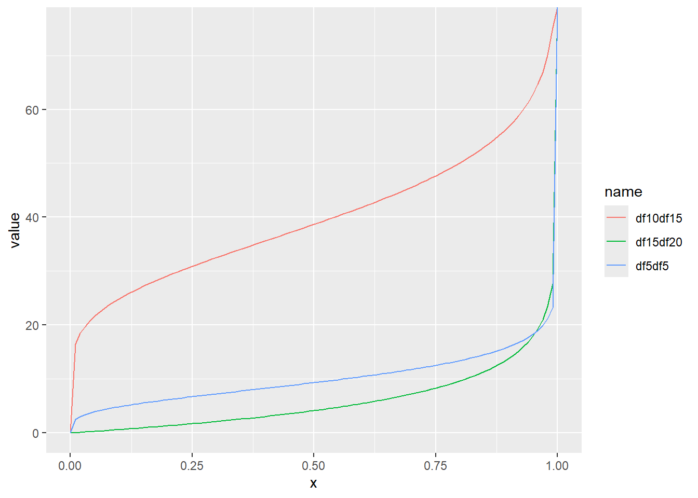](chapter28_files/figure-html/unnamed-chunk-64-1.png)

## ガンマ乱数

``` downlit
d <- tibble(
  df5df5 = rgamma(1000, shape = 5, scale = 2), # shape 5 scale 2
  df10df15 = rgamma(1000, shape = 10, scale = 4), # shape 10 scale 4
  df15df20 = rgamma(1000, shape = 1, scale = 6) # shape 1 scale 6
)

d |> 
  pivot_longer(1:3) |> 
  ggplot(aes(x = value, color = name, fill = name, alpha = 0.5)) +
  geom_histogram(binwidth = 5, position = "identity")
```

[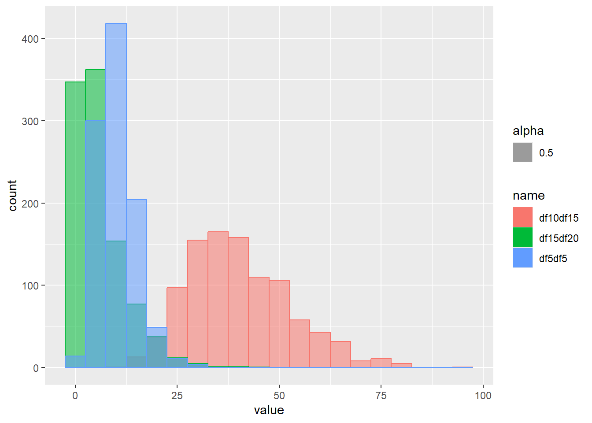](chapter28_files/figure-html/unnamed-chunk-65-1.png)

## 28.22 指数分布

**指数分布**はポアソン分布する事象（まれに起こる事象）が起こる時間間隔の分布を示す確率分布です。指数分布は**生存時間解析**などの、イベントの発生数と時間の関係を解析するのに用いられています。指数分布のパラメータはλのみで、λは正の値を取ります。指数分布の確率密度関数は以下の式で表されます。

\\Exp(x, \lambda)=\lambda \cdot \exp(-\lambda x)\\

Rでは指数分布の確率密度関数は`dexp`関数で計算することができます。`dexp`関数では、λを`rate`引数で指定します。指数分布は単調減少で、0～\\\infty\\の範囲を持つ連続値を取ります。

## 確率密度

``` downlit
x <- seq(0, 10, by = 0.01)
d <- tibble(
  x,
  r1 = dexp(x, rate = 1), # ラムダ1
  r3 = dexp(x, rate = 3), # ラムダ3
  r5 = dexp(x, rate = 5) # ラムダ5
)

d |> 
  pivot_longer(2:4) |> 
  ggplot(aes(x = x, y = value, color = name)) +
  geom_line()
```

[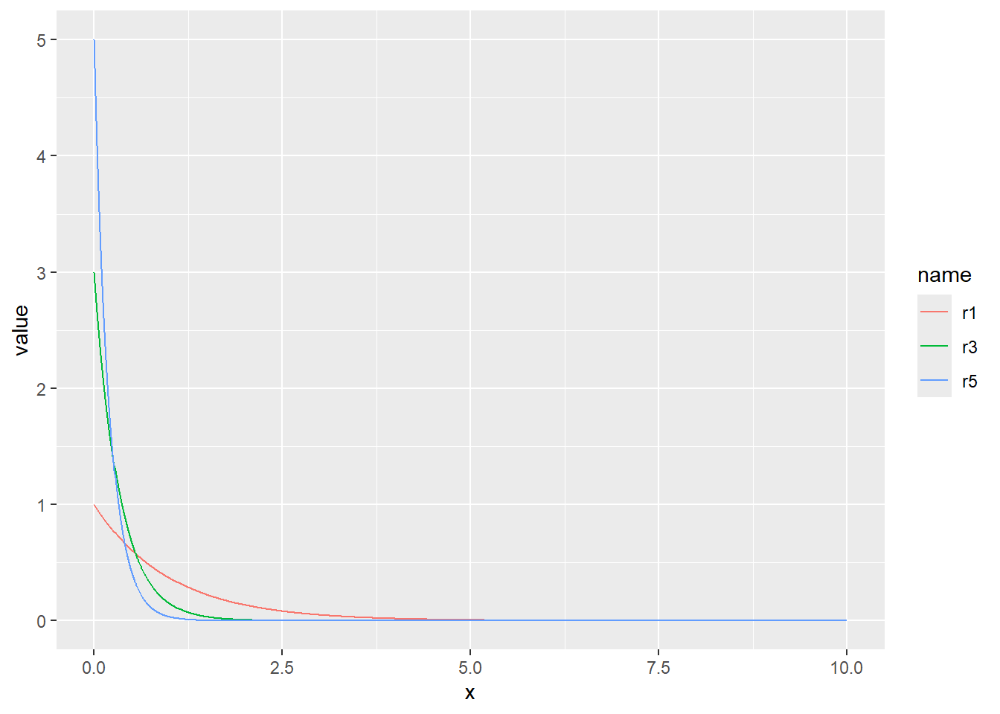](chapter28_files/figure-html/unnamed-chunk-66-1.png)

## 累積分布関数

``` downlit
d <- tibble(
  x,
  r1 = pexp(x, rate = 1), # ラムダ1
  r3 = pexp(x, rate = 3), # ラムダ3
  r5 = pexp(x, rate = 5) # ラムダ5
)

d |> 
  pivot_longer(2:4) |> 
  ggplot(aes(x = x, y = value, color = name)) +
  geom_line()
```

[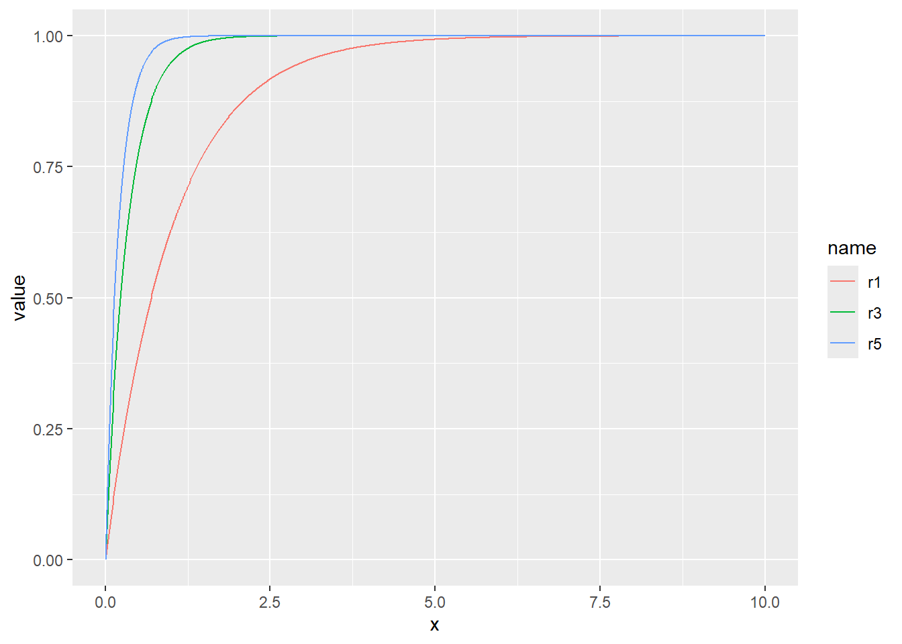](chapter28_files/figure-html/unnamed-chunk-67-1.png)

## 分位点の値

``` downlit
x <- seq(0, 1, by = 0.01)
d <- tibble(
  x,
  r1 = qexp(x, rate = 1), # ラムダ1
  r3 = qexp(x, rate = 3), # ラムダ3
  r5 = qexp(x, rate = 5) # ラムダ5
)

d |> 
  pivot_longer(2:4) |> 
  ggplot(aes(x = x, y = value, color = name)) +
  geom_line()
```

[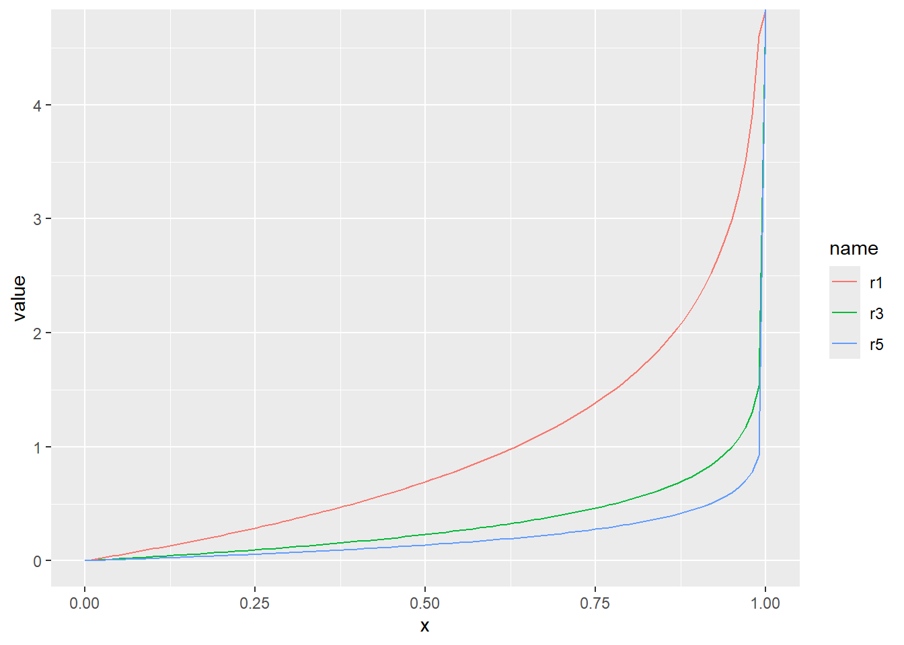](chapter28_files/figure-html/unnamed-chunk-68-1.png)

## 指数乱数

``` downlit
d <- tibble(
  r1 = rexp(1000, rate = 1), # ラムダ1
  r3 = rexp(1000, rate = 3), # ラムダ3
  r5 = rexp(1000, rate = 5) # ラムダ5
)

d |> 
  pivot_longer(1:3) |> 
  ggplot(aes(x = value, color = name, fill = name, alpha = 0.5)) +
  geom_histogram(binwidth = 0.1, position = "identity")
```

[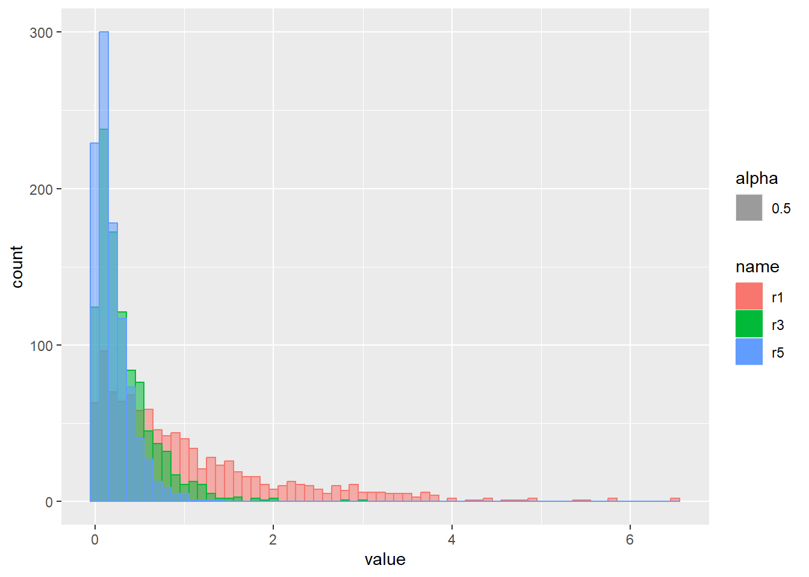](chapter28_files/figure-html/unnamed-chunk-69-1.png)

## 28.23 ワイブル分布

**ワイブル分布**は指数分布を拡張したような確率分布です。指数分布では、ポアソン分布する事象（イベント）が起きる確率は常に一定であることを仮定していますが、ワイブル分布を用いると単調増加・単調減少でイベントが起きる確率が変化する場合を表現することができます。ワイブル分布のパラメータは形状パラメータのλとスケールパラメータのkの2つです。ワイブル分布の確率密度関数は以下の式で表されます。

\\Weibull(x, \lambda, k)=\frac{k}{\lambda}(\frac{x}{\lambda})^{k-1} \cdot \exp(-\frac{x}{\lambda})^k\\

Rでは、ワイブル分布の確率密度関数を`dweibull`関数で計算することができます。`dweibull`関数の引数は形状パラメータλである`shape`と、スケールパラメータkである`scale`の2つです。ワイブル分布はガンマ分布と同じく、右側の裾が長い分布で、最頻値が0以上となる形状を示し、0～\\\infty\\の範囲を持つ連続値を取ります。

## 確率密度

``` downlit
x <- seq(0, 5, by = 0.01)
d <- tibble(
  x,
  s1s1 = dweibull(x, shape = 1, scale = 1), # shape 1、scale 1
  s2s2 = dweibull(x, shape = 2, scale = 2), # shape 2、scale 2
  s05s05 = dweibull(x, shape = 0.5, scale = 0.5) # shape 0.5、scale 0.5
)

d |> 
  pivot_longer(2:4) |> 
  ggplot(aes(x = x, y = value, color = name)) +
  geom_line()
```

[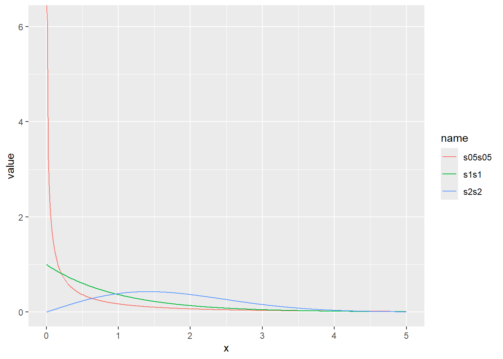](chapter28_files/figure-html/unnamed-chunk-70-1.png)

## 累積分布関数

``` downlit
d <- tibble(
  x,
  s1s1 = pweibull(x, shape = 1, scale = 1), # shape 1、scale 1
  s2s2 = pweibull(x, shape = 2, scale = 2), # shape 2、scale 2
  s05s05 = pweibull(x, shape = 0.5, scale = 0.5) # shape 0.5、scale 0.5
)

d |> 
  pivot_longer(2:4) |> 
  ggplot(aes(x = x, y = value, color = name)) +
  geom_line()
```

[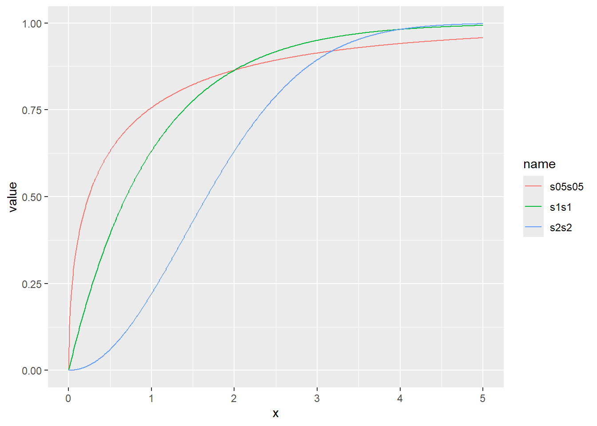](chapter28_files/figure-html/unnamed-chunk-71-1.png)

## 分位点の値

``` downlit
x <- seq(0, 1, by = 0.01)
d <- tibble(
  x,
  s1s1 = qweibull(x, shape = 1, scale = 1), # shape 1、scale 1
  s2s2 = qweibull(x, shape = 2, scale = 2), # shape 2、scale 2
  s05s05 = qweibull(x, shape = 0.5, scale = 0.5) # shape 0.5、scale 0.5
)

d |> 
  pivot_longer(2:4) |> 
  ggplot(aes(x = x, y = value, color = name)) +
  geom_line()
```

[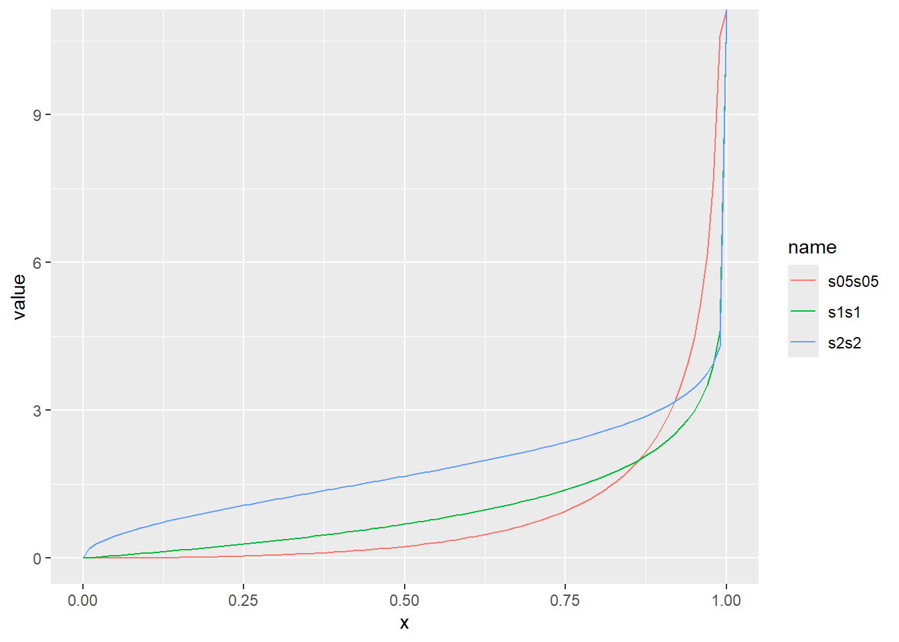](chapter28_files/figure-html/unnamed-chunk-72-1.png)

## ワイブル乱数

``` downlit
d <- tibble(
  s1s1 = rweibull(1000, shape = 1, scale = 1), # shape 1、scale 1
  s2s2 = rweibull(1000, shape = 2, scale = 2), # shape 2、scale 2
  s05s05 = rweibull(1000, shape = 0.5, scale = 0.5) # shape 0.5、scale 0.5
)

d |> 
  pivot_longer(1:3) |> 
  ggplot(aes(x = value, color = name, fill = name, alpha = 0.5)) +
  geom_histogram(binwidth = 0.2, position = "identity")
```

[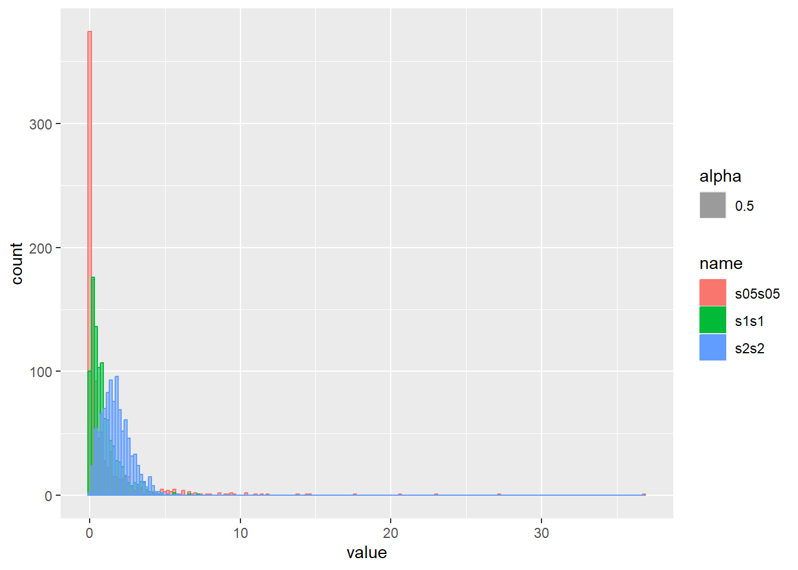](chapter28_files/figure-html/unnamed-chunk-73-1.png)

## 28.24 一様分布

**一様分布**は、最小値（a）から最大値（b）まで、一定の確率で現れる現象を示す分布です。この章の始めに示した`sample`関数の乱数やサイコロなどが一様分布の典型的な例です。一様分布のパラメータは最小値aと最大値bの2つです。一様分布の確率密度関数は以下の式で表されます。

\\Uniform(x, a, b)=\frac{1}{b-a}\\

Rでは、一様分布の確率密度関数を`dunif`関数で計算することができます。`dunif`関数では最小値aとして`min`、最大値bとして`max`の2つのパラメータを引数に指定します。一様分布はその名の通り確率密度が一定で、a～bの範囲を持つ連続値を取ります。

## 確率密度

``` downlit
x <- seq(-1.5, 4.5, by = 0.01)
d <- tibble(
  x,
  m0m1 = dunif(x, min = 0, max = 1), # 最小0、最大1
  mm1m1 = dunif(x, min = -1, max = 1), # 最小-1、最大1
  m2m4 = dunif(x, min = 2, max = 4) # 最小2、最大4
)

d |> 
  pivot_longer(2:4) |> 
  ggplot(aes(x = x, y = value, color = name)) +
  geom_line()
```

[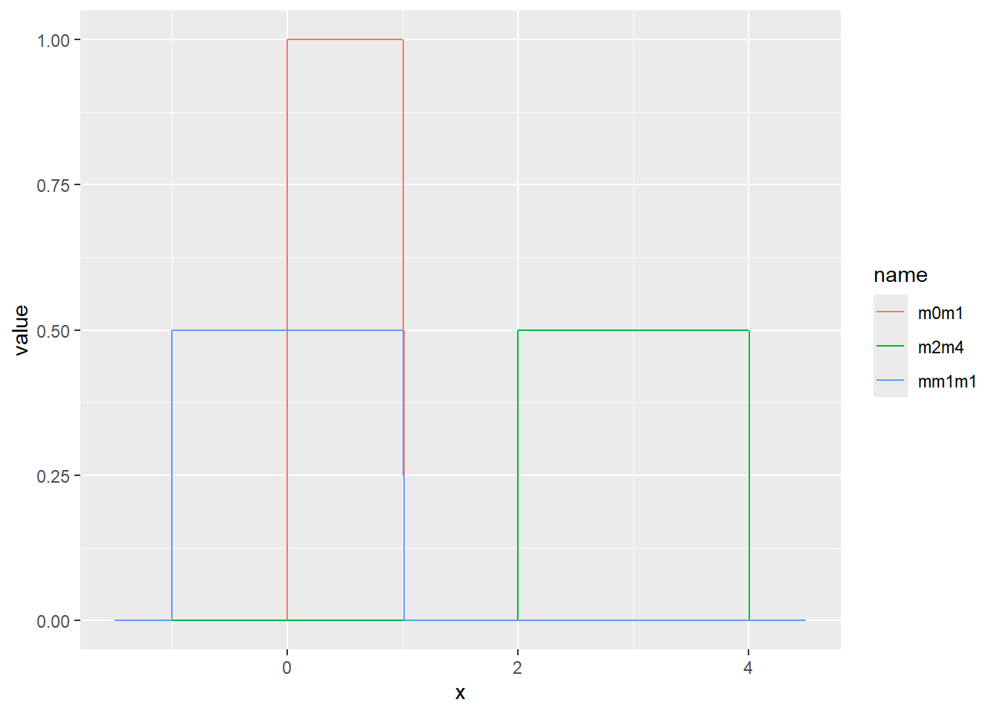](chapter28_files/figure-html/unnamed-chunk-74-1.png)

## 累積分布関数

``` downlit
d <- tibble(
  x,
  m0m1 = punif(x, min = 0, max = 1), # 最小0、最大1
  mm1m1 = punif(x, min = -1, max = 1), # 最小-1、最大1
  m2m4 = punif(x, min = 2, max = 4) # 最小2、最大4
)

d |> 
  pivot_longer(2:4) |> 
  ggplot(aes(x = x, y = value, color = name)) +
  geom_line()
```

[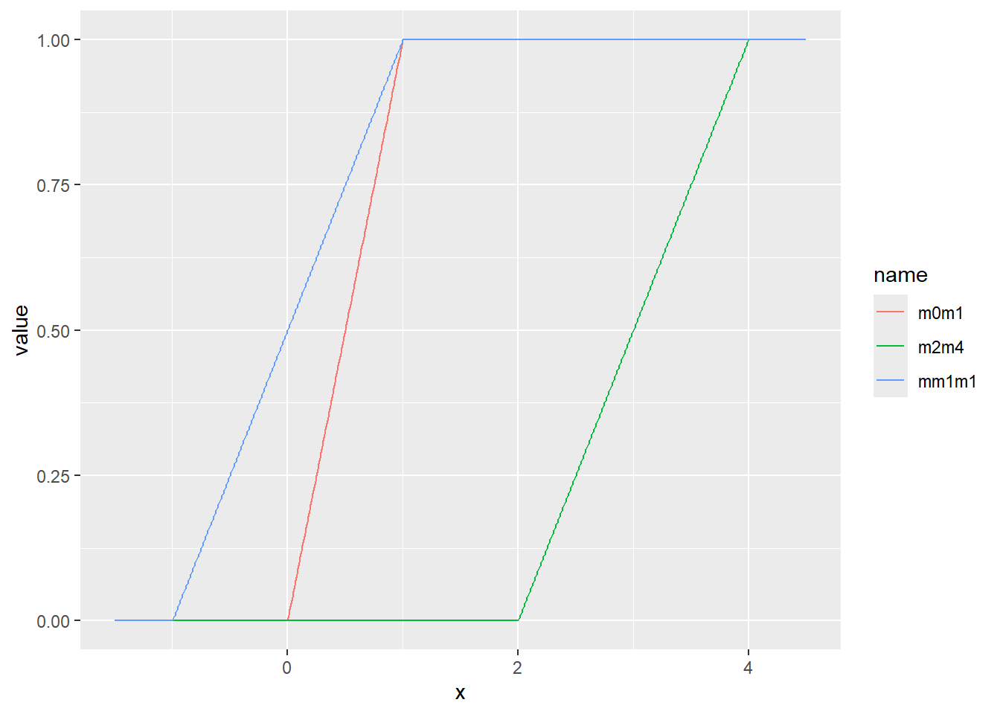](chapter28_files/figure-html/unnamed-chunk-75-1.png)

## 分位点の値

``` downlit
x <- seq(0, 1, by = 0.01)
d <- tibble(
  x,
  m0m1 = qunif(x, min = 0, max = 1), # 最小0、最大1
  mm1m1 = qunif(x, min = -1, max = 1), # 最小-1、最大1
  m2m4 = qunif(x, min = 2, max = 4) # 最小2、最大4
)

d |> 
  pivot_longer(2:4) |> 
  ggplot(aes(x = x, y = value, color = name)) +
  geom_line()
```

[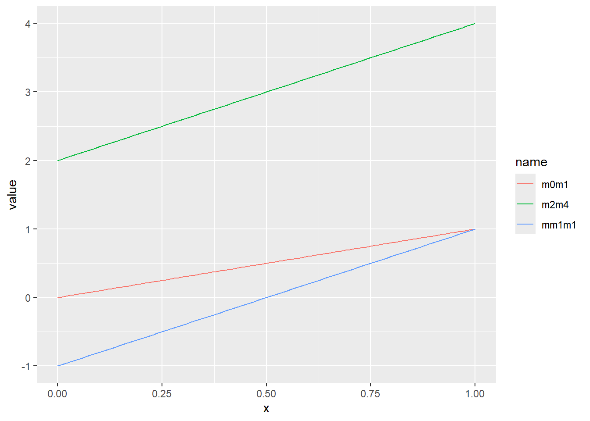](chapter28_files/figure-html/unnamed-chunk-76-1.png)

## 一様乱数

``` downlit
d <- tibble(
  m0m1 = runif(1000, min = 0, max = 1), # 最小0、最大1
  mm1m1 = runif(1000, min = -1, max = 1), # 最小-1、最大1
  m2m4 = runif(1000, min = 2, max = 4) # 最小2、最大4
)

d |> 
  pivot_longer(1:3) |> 
  ggplot(aes(x = value, color = name, fill = name, alpha = 0.5)) +
  geom_histogram(binwidth = 1, position="identity")
```

[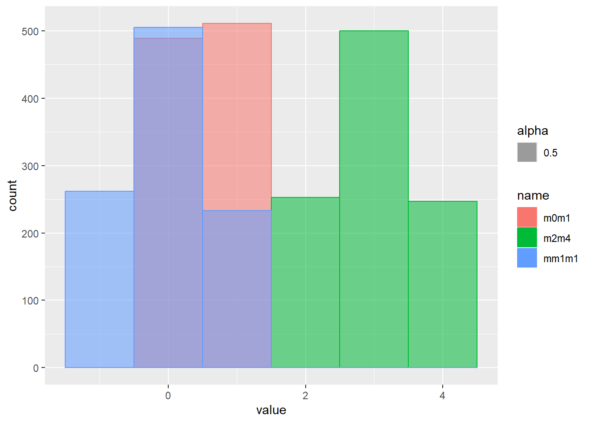](chapter28_files/figure-html/unnamed-chunk-77-1.png)

## 28.25 多項分布

多項分布はここまでに示した確率分布とは異なり、Rには累積分布関数や分位点の関数が設定されていない確率分布です。多項分布は、複数の事象、例えばツボに白・赤・黒のボールを違う数で入れておき、取り出しては戻すような試行（**復元抽出**）を行うとき、それぞれの色のボールを特定の数だけ取り出す確率を計算するときに用います。各色のボールを取り出す確率はそれぞれ異なりますが、足し合わせれば確率が1となるような状況で多項分布は用いられます。

多項分布の確率質量関数のパラメータはボールの色がk色の時、ボールを取り出す回数n、各色のボールを取り出す数x₁～x_(k)、各色のボールを取り出す確率p₁p_(k)の4種類となります。nはx₁～x_(k)の和となります。

\\Multinomial(n, x\_{1}, x\_{2}, \cdots x\_{k}, p\_{1}, p\_{2}, \cdots p\_{k})=\frac{n!}{x\_{1}! \cdot x\_{2}! \cdot \cdots \cdot x\_{k}!} \cdot p\_{1}^{x\_{1}} \cdot p\_{2}^{x\_{2}} \cdot \cdots p\_{k}^{x\_{k}}\\

Rでは、`dmultinom`関数で多項分布の確率質量関数を計算することができます。`dmultinom`関数の引数はボールを取り出す回数nを表す`size`、各色のボールを取り出す数のx₁～x_(k)をベクターで表した`x`、各色のボールを取り出す確率であるp₁p_(k)を同じくベクターで表した`prob`の3つとなります。

また、多項分布の乱数を得る関数である`rmultinom`関数も他の確率分布を示す乱数の関数とはやや使い方が異なります。`size`と`prob`の2つの引数を指定するのは上と同じですが、返り値は合計が`size`で指定した数値となるボールの数k個の乱数です。`prob`で確率を指定したそれぞれに対する値（ボールの数のようなもの）が第一引数（`n`）で示した数だけ、列として並ぶ行列が返ってきます。

``` downlit
# 0.1、0.3、0.6の確率で起こる事象がそれぞれ1、2、4回同時に起こる確率
dmultinom(x = c(1, 2, 4), size = 7, prob = c(0.1, 0.3, 0.6))
## [1] 0.122472

# 足し合わせると20になるものが10個、列として返ってくる。
# 行の上から、0.1、0.3、0.6の確率で現れている
rmultinom(10, size=20, prob = c(0.1, 0.3, 0.6))
##      [,1] [,2] [,3] [,4] [,5] [,6] [,7] [,8] [,9] [,10]
## [1,]    3    2    1    3    4    2    1    0    2     0
## [2,]    4    6    2    4    6    5    5    9    3     8
## [3,]   13   12   17   13   10   13   14   11   15    12
```

``` downlit
rmnom <- rmultinom(1000, size=20, prob = c(0.1, 0.3, 0.6))
rmnom |> 
  t() |> 
  as_tibble() |> 
  pivot_longer(1:3) |> 
  ggplot(aes(x = value, color = name, fill = name, alpha = 0.5))+
  geom_histogram(binwidth = 1, position = "identity")
```

[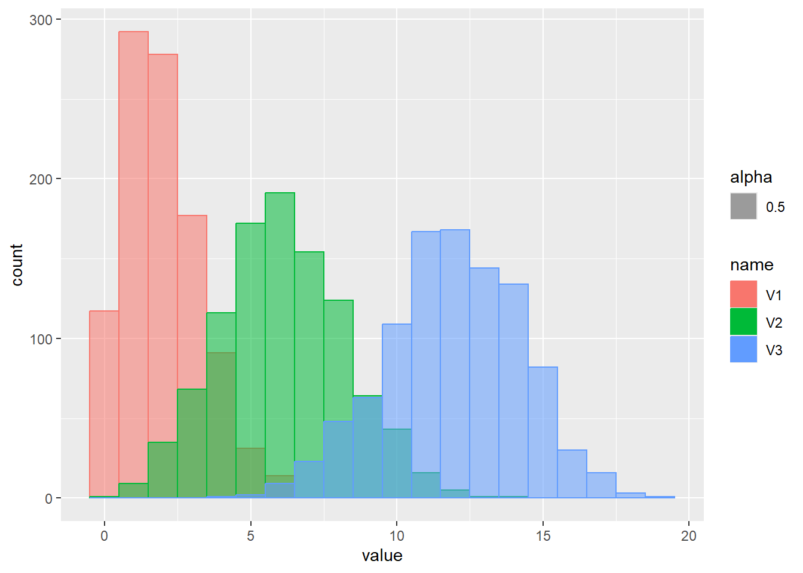](chapter28_files/figure-html/unnamed-chunk-79-1.png)

Matsumoto, Makoto, and Takuji Nishimura. 1998. “Mersenne Twister: A 623-Dimensionally Equidistributed Uniform Pseudo-Random Number Generator.” *ACM Trans. Model. Comput. Simul.* (New York, NY, USA) 8 (1): 3–30. <https://doi.org/10.1145/272991.272995>.

Back to top
