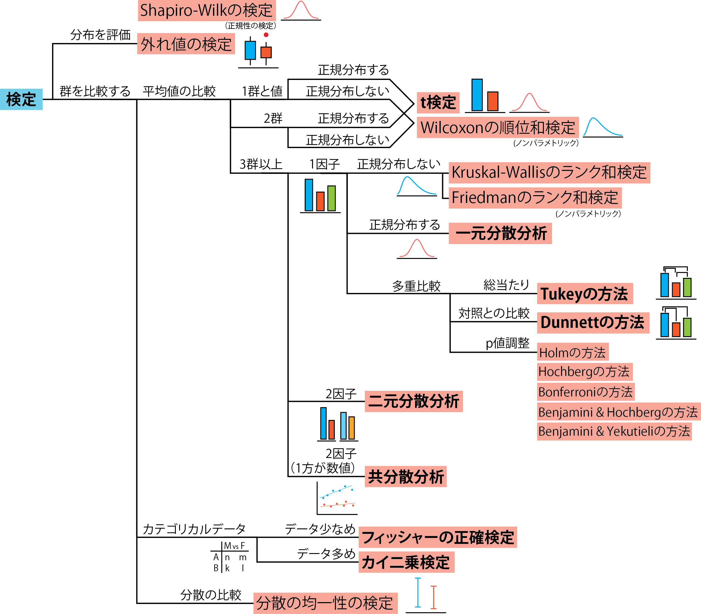
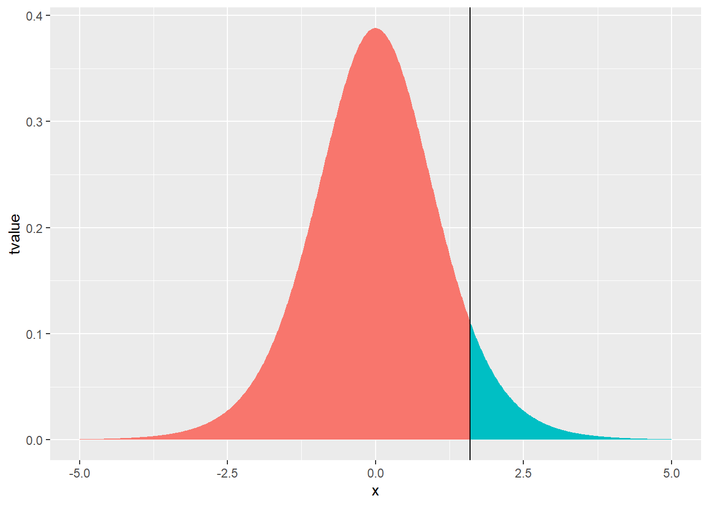
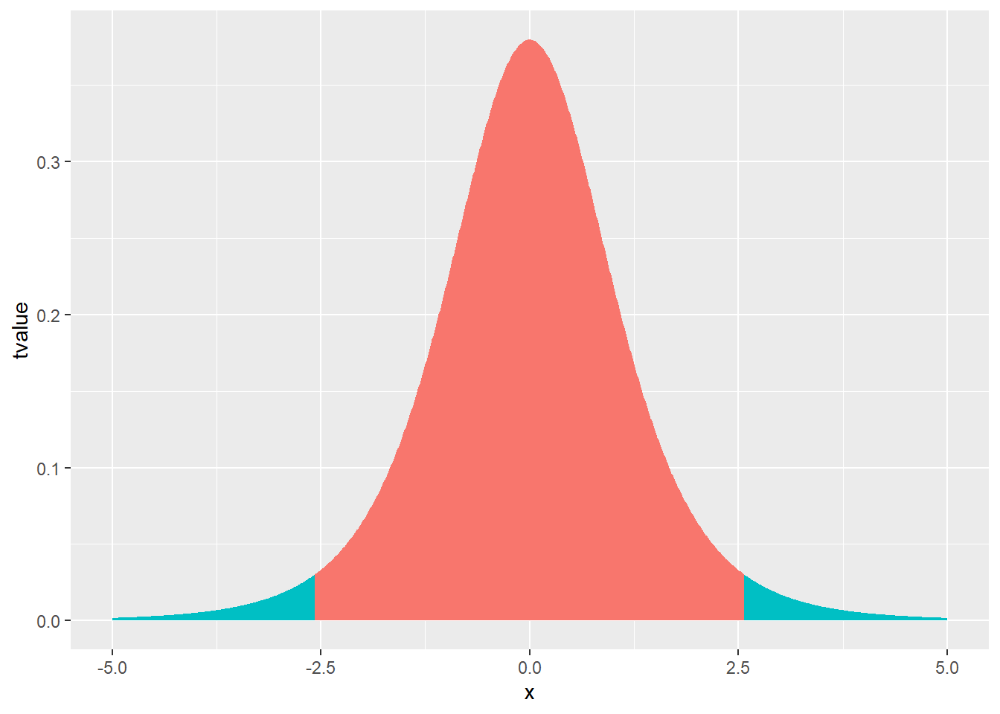
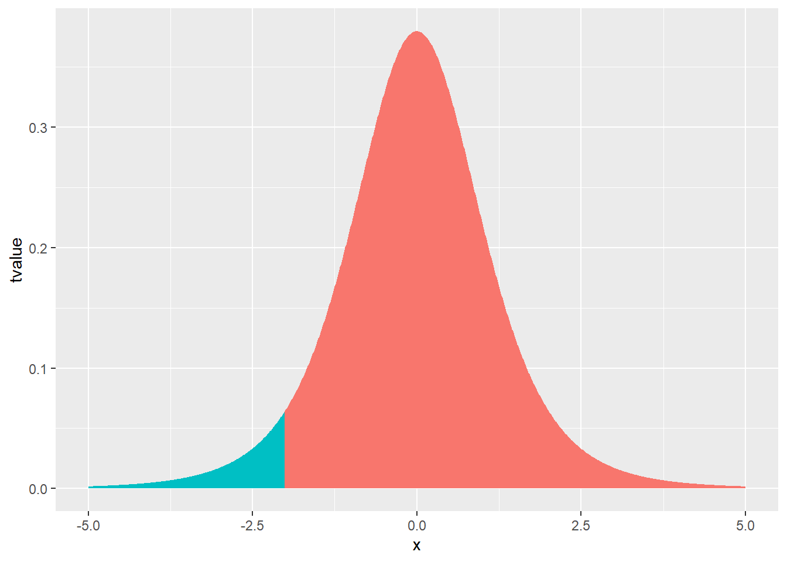
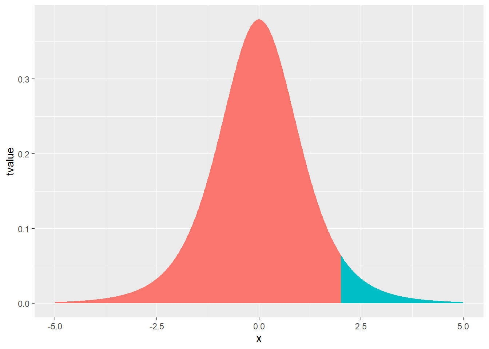
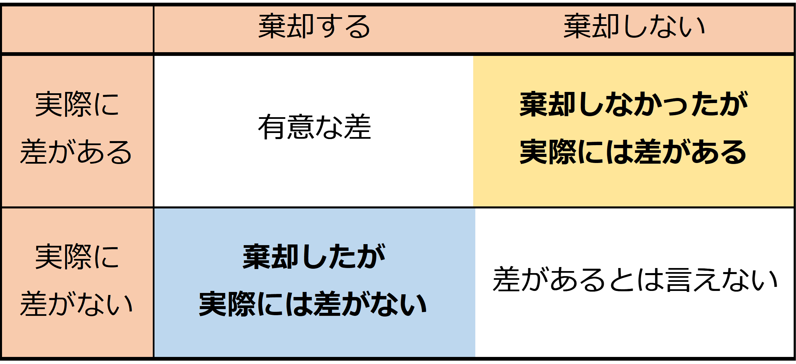
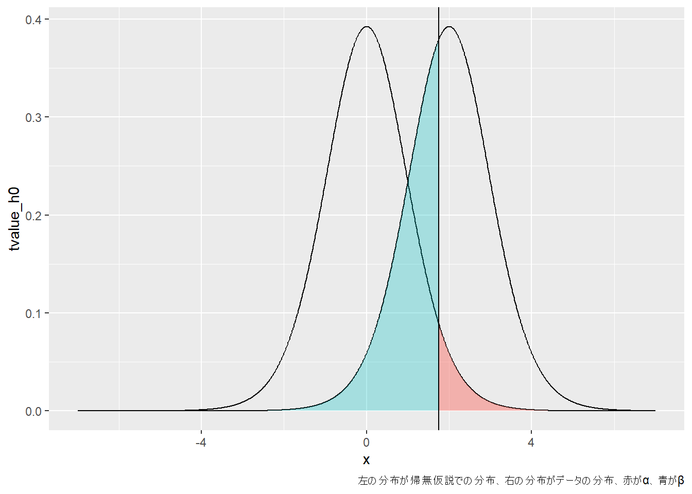
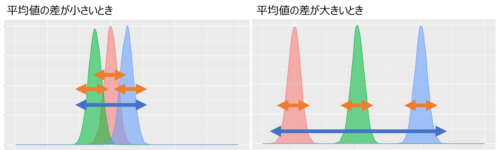
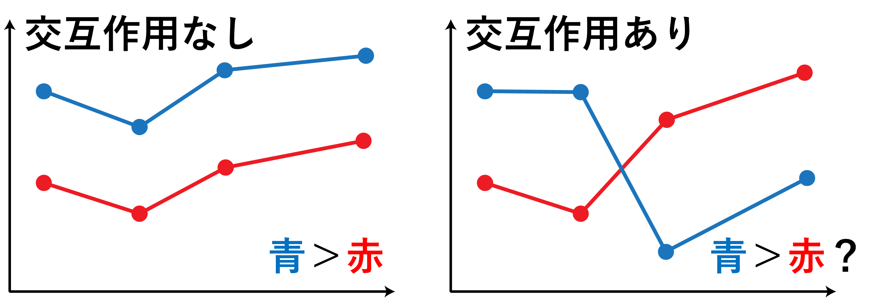
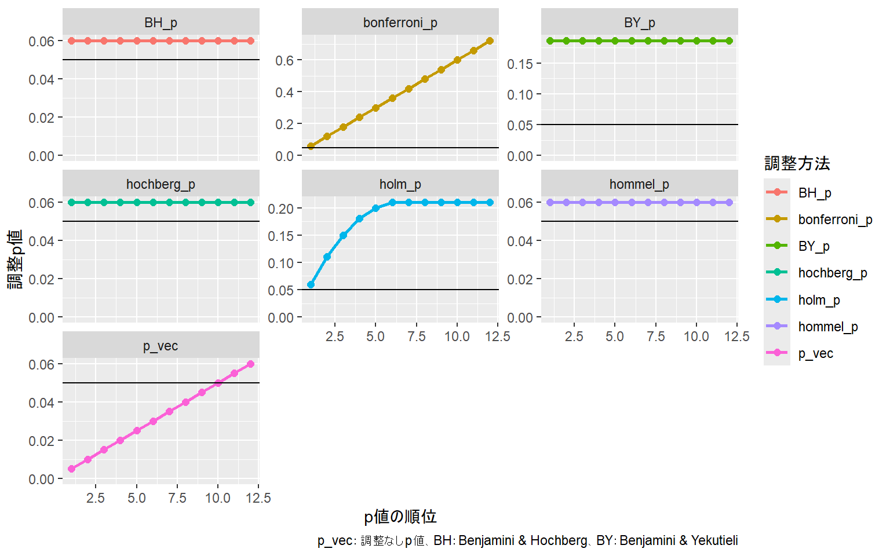

# 29  検定

Code

論文などに用いられる統計では、データの**基礎統計量**（[12章](chapter12.llms.md#ベクターの基礎演算と基礎統計量)参照）が示されるだけではなく、通常**検定**の結果として、**p値**が表示されるのが一般的です。

検定では、データに対して**検定統計量**と呼ばれる数値を計算します。次に、「ある仮説」の下で、計算した検定統計量から、「より稀な事象が起こる確率」を検定統計量が取る分布から計算します。この確率がとても低い場合には、仮説が正しいととすると非常にまれなことが起きたとするものです。

この過程で、「ある仮説」のことを**帰無仮説**（Null Hypothesis）と呼び、「より稀な事象が起こる確率」を**p値**と呼びます。p値が小さい場合は、帰無仮説が正しいとするとすると非常にまれなことが起こった、つまり帰無仮説が成り立つとすると矛盾するとして、**帰無仮説を棄却**します。帰無仮説を棄却した場合には、帰無仮説と対になる**対立仮説**を受け入れます（「統計的に有意である」と表現します）。一方で、p値が大きい場合には、**帰無仮説を採用するのではなく、結論を保留する**こととします。

検定の仕組みは複雑で、いまいちよくわからない部分があるかと思います。このテキストではRの基礎を説明することが目的ですので、あまり統計の難しい点には立ち入らず、検定を適用できる場合と計算方法について説明していきます。検定の基本的な部分に関してはたくさん良書がありますので、[参考文献](references.llms.md)で紹介することとします。

## 29.1 検定の全体図

まず、検定の対象となるデータの形と分布、対応する検定手法についての図を示します。概ねこの図に沿って説明していきます。

[](./image/stattest_category.png "図1：データと対応する検定手法")

図1：データと対応する検定手法

## 29.2 パラメトリック検定

統計で用いられる検定には、データの確率分布に仮定を置く（例えば、データが正規分布しているとして計算する）方法と、データの確率分布に仮定を置かない方法の2つがあります。これらのうち、確率分布に仮定を置く方法のことを**パラメトリック検定**、仮定を置かない方法のことを**ノンパラメトリック検定**と呼びます。

パラメトリック検定はデータの分布が仮定した確率分布に従っている場合に、正確に検定統計量を計算できる方法です。データの分布が仮定した確率分布に従わない場合には正しく検定を行うことができないとされています。データの確率分布が定まらない場合にはノンパラメトリック検定を用いたほうがよいとされていましたが、ノンパラメトリック検定は検出力（差がある時に差があるとできる確率）が低くなる性質があります。検定を行う際にはデータの分布を調べ、そのデータに適した検定を用いるのがよいでしょう。

## 29.3 t検定

**t検定**は、正規分布する1群のデータの平均値と「ある値」との差、または2群のデータの平均値の差を検定する方法です。t検定の帰無仮説は1群の場合には「平均値が「ある値」」、2群の場合には「平均値が一致する」とします。「ある値」というのが抽象的でわかりにくいですが、例えば、あるクラスの男子生徒20人の身長が170 cmより高いかどうか検定したい場合には、この170 cmというのが「ある値」となります。

1群のt検定（**Studentのt検定**）の場合には、[28章](chapter28.llms.md#t分布)で説明した以下のt検定統計量を計算し、データの数から計算した自由度でのt分布とt検定統計量からp値を計算します。μは帰無仮説の下での平均値、つまり「ある値」とします。

\\t=\frac{x-\mu}{s/ \sqrt n}\\

2群の場合には、Rではt検定の拡張であるWelchのt検定が用いられます。1群・2群のどちらにおいても、t検定統計量とp値が計算され、p値が0.05より小さければ、平均値に有意な差があると結論付けます。

Rでは、`t.test`関数でt検定の計算を行います。`t.test`関数は第一引数に数値ベクターの`x`、第二引数に数値ベクターの`y`を取ります。第一引数`x`のみを設定した場合には1群のt検定を、`x`と`y`を設定した場合には2群のt検定を計算します。

1群のt検定の場合、比較する値には`mu`を設定します。`mu`のデフォルト値は0なので、`mu`を設定しない場合には、0との差を検定することになります。

``` downlit
x <- rnorm(10, mean = 0.25, sd = 1)
y <- rnorm(10, mean = 1, sd = 0.5)

# 1群のt検定（平均値が0と有意に異なるかを検定する）
t.test(x)
## 
##  One Sample t-test
## 
## data:  x
## t = 1.5976, df = 9, p-value = 0.1446
## alternative hypothesis: true mean is not equal to 0
## 95 percent confidence interval:
##  -0.2533217  1.4711697
## sample estimates:
## mean of x 
##  0.608924

# 1群のt検定（平均値が4と有意に異なるかを検定する）
t.test(x, mu = 4)
## 
##  One Sample t-test
## 
## data:  x
## t = -8.8967, df = 9, p-value = 9.383e-06
## alternative hypothesis: true mean is not equal to 4
## 95 percent confidence interval:
##  -0.2533217  1.4711697
## sample estimates:
## mean of x 
##  0.608924

# 2群のt検定（Welchのt検定、等分散性の仮定がなくても計算できる）
t.test(x, y)
## 
##  Welch Two Sample t-test
## 
## data:  x and y
## t = -0.52991, df = 10.419, p-value = 0.6073
## alternative hypothesis: true difference in means is not equal to 0
## 95 percent confidence interval:
##  -1.0873669  0.6676961
## sample estimates:
## mean of x mean of y 
## 0.6089240 0.8187593
```

> **TIP:**
>
> 昔から論文などでは、取得したデータに対して検定を行い、p値を示すことが一般的です。ただし、このp値はデータとの関係がいまいちよくわからないパラメータですし、何よりデータ数が増えると値が小さくなるため、差があるという結論が出やすくなります。データ数が大きければ、ほんの少ししか差が無くても、検定では帰無仮説を棄却することになります。
>
> p値がよく用いられるのは、結果として「差がある」かどうか、つまり0か1かという結論が出せるからです。通常意思決定は0か1かで行うため、0か1かの結論を付けられる検定は人に説明しやすい性質を持ちます。ただし、「差がある」からといって「差に意味がある」かどうかは明確ではありません。
>
> いろいろなところに記載されている通り（例えば、[Nature human behaviourの論文](https://www.nature.com/articles/s41562-017-0189-z) ([Benjamin et al. 2018](#ref-benjamin2018redefine))や[Nature methodsの論文](https://www.nature.com/articles/nmeth.4120) ([Altman and Krzywinski 2016](#ref-e6a4d0acbb644e5b84bf4e80a435599e))など）、検定とp値のみで結論付けるのはあまりいい方法ではありません。結果の表示や有意性については、信頼区間を用いて示した方が良いとされています。
>
> 検定では、通常p値が0.05未満（p \< 0.05）であれば有意な差がある、0.01や0.001未満（p \< 0.01、p \< 0.001）ならよりはっきりとした有意差があるとします。この0.05、0.01、0.001という値には特に意味はありませんが、習慣上この3つの値を用いることが多いです。

### 29.3.1 t検定の結果

t検定の結果として、t検定統計量、自由度（df）、p値（p-value）、差の95%信頼区間（95 percent confidence interval）、平均値（estimate）が返ってきます。それぞれの要素は`$`を用いて以下のように呼び出すことができます。これらの呼び出しの名前は`names`関数を用いて調べることができます。

``` downlit
result_t <- t.test(x)
result_t # t検定の結果
## 
##  One Sample t-test
## 
## data:  x
## t = 1.5976, df = 9, p-value = 0.1446
## alternative hypothesis: true mean is not equal to 0
## 95 percent confidence interval:
##  -0.2533217  1.4711697
## sample estimates:
## mean of x 
##  0.608924

result_t$statistic # t統計量
##        t 
## 1.597551

result_t$p.value # p値
## [1] 0.1446073

result_t$estimate # 平均値
## mean of x 
##  0.608924

result_t$conf.int # 差の95%信頼区間（0との差なので、xの95%信頼区間）
## [1] -0.2533217  1.4711697
## attr(,"conf.level")
## [1] 0.95

names(result_t) # names関数で呼び出すための名前を調べることができる
##  [1] "statistic"   "parameter"   "p.value"     "conf.int"    "estimate"   
##  [6] "null.value"  "stderr"      "alternative" "method"      "data.name"
```

> **TIP:**
>
> 上の`result_t`の結果では、t統計量は1.5975513、p値は0.1446073となっています。このp値は自由度9のt分布から計算することができます。下の図は自由度9のt分布で、縦線はx=1.5975513、つまりt統計量の値です。t統計量より値が大きい確率、つまり下図の青で示した面積の2倍がp値となります。この面積はt分布の積分から計算することができ、0.0723037となります。2倍となるのは、次に説明する両側検定となっているためです。
>
> t検定では、そのデータでのt統計量が得られるよりも稀な事象が起こる確率を下図の青の面積（p値の0.5倍）として求めます。この確率が非常に小さければ、帰無仮説の下でこのデータが取れることは稀である、つまり帰無仮説が成立しているのは矛盾しているとして、帰無仮説を棄却します。
>
> ``` downlit
> # p値の計算（t分布で1.5975513となる場合の累積分布関数から計算する）
> (1 - pt(1.5975513, df = 9)) * 2
> ## [1] 0.1446073
>
> t_temp <- data.frame(x = seq(-5, 5, by=0.01), tvalue = dt(seq(-5, 5, by = 0.01), df = 9)) # 自由度9のt分布
>
> t_temp <- t_temp |> mutate(col_t = if_else(x > result_t$statistic, tvalue, NA))
> t_temp |> 
>   ggplot() +
>   geom_area(aes(x = x, y = tvalue), color = NA, fill = "#00BFC4", data = t_temp) +
>   geom_area(aes(x = x, y = tvalue), color = NA, fill = "#F8766D", data = t_temp |> filter(is.na(col_t)))+
>   geom_vline(xintercept = result_t$statistic)
> ```
>
> [](chapter29_files/figure-html/unnamed-chunk-3-1.png)

### 29.3.2 両側検定と片側検定

t検定では通常**両側検定**という、t分布の両側の確率を用いる検定を行います。例えばp\<0.05なら、t検定統計量がt分布の左側2.5%以下、右側97.5%以上にあるかどうかを検定します。両側検定は、2つのデータ群のどちらが大きく、どちらが小さいかをあらかじめ定められない場合に用います。

一方で、t分布の左側5%以下、右側95%以上の片方のみを検定に用いる場合もあります。この片側のみを用いる検定のことを**片側検定**と呼びます。片側検定には、下側のみを用いるものと上側のみを用いるものがそれぞれあります。いずれの場合においても、検定に用いる確率を片側に割り振ることになり、有意差が出やすくなる特徴があります。片側検定は基礎研究ではまず使われませんが、治験などではよく用いられています（優越性・非劣性試験）。

## 両側検定

``` downlit
t_temp <- data.frame(x=seq(-5, 5, by = 0.01), tvalue = dt(seq(-5, 5, by = 0.01), df = 5)) # 自由度5のt分布
# 両側5％（片側2.5%）
t_temp <- t_temp |> mutate(col_95 = if_else(x < qt(0.025, df = 5) | x > qt(0.975, df = 5), tvalue, NA))
t_temp |> 
  ggplot() +
  geom_area(aes(x = x, y = tvalue), color = NA, fill = "#00BFC4", data = t_temp) +
  geom_area(aes(x = x, y = tvalue), color = NA, fill = "#F8766D", data = t_temp |> filter(is.na(col_95)))
```

[](chapter29_files/figure-html/unnamed-chunk-4-1.png)

## 片側検定（下側）

``` downlit
t_temp <- data.frame(x=seq(-5, 5, by=0.01), tvalue = dt(seq(-5, 5, by=0.01), df = 5)) # 自由度5のt分布
# 下側5％
t_temp <- t_temp |> mutate(col_95 = if_else(x < qt(0.05, df = 5), tvalue, NA))
t_temp |> 
  ggplot() +
  geom_area(aes(x=x, y=tvalue), color=NA, fill="#00BFC4", data=t_temp) +
  geom_area(aes(x=x, y=tvalue), color=NA, fill="#F8766D", data=t_temp |> filter(is.na(col_95)))
```

[](chapter29_files/figure-html/unnamed-chunk-5-1.png)

## 片側検定（上側）

``` downlit
t_temp <- data.frame(x=seq(-5, 5, by=0.01), tvalue = dt(seq(-5, 5, by=0.01), df = 5)) # 自由度5のt分布
# 上側5％
t_temp <- t_temp |> mutate(col_95 = if_else(x > qt(0.95, df = 5), tvalue, NA))
t_temp |> 
  ggplot() +
  geom_area(aes(x=x, y=tvalue), color=NA, fill="#00BFC4", data=t_temp) +
  geom_area(aes(x=x, y=tvalue), color=NA, fill="#F8766D", data=t_temp |> filter(is.na(col_95)))
```

[](chapter29_files/figure-html/unnamed-chunk-6-1.png)

Rで片側検定を行う場合には、`t.test`関数に`alternative`引数を指定します。`alternative`引数のデフォルト値は`"two.sided"`、つまり両側検定です。片側検定を行う場合には、`alternative="less"`（下側検定）もしくは`alternative="greater"`（上側検定）を指定します。

``` downlit
# 下側検定
t.test(x, alternative = "less")
## 
##  One Sample t-test
## 
## data:  x
## t = 1.5976, df = 9, p-value = 0.9277
## alternative hypothesis: true mean is less than 0
## 95 percent confidence interval:
##      -Inf 1.307635
## sample estimates:
## mean of x 
##  0.608924

# 上側検定
t.test(x, alternative = "greater")
## 
##  One Sample t-test
## 
## data:  x
## t = 1.5976, df = 9, p-value = 0.0723
## alternative hypothesis: true mean is greater than 0
## 95 percent confidence interval:
##  -0.08978688         Inf
## sample estimates:
## mean of x 
##  0.608924
```

> **TIP:**
>
> 検定には非常にたくさんの種類があり、様々なデータに対してそのデータに適した検定の手法が準備されています。どの検定においても、「帰無仮説を立てる」「検定統計量を計算する」「p値を計算する」「p値が小さいときに帰無仮説を棄却する」という枠組みは同じです。以下では、t検定について、この検定の仕組みについて簡単に説明します。
>
> t検定について考えるため、「ある学校の男子学生3人の身長の平均が170cmと異なるかどうか」を検定する場合を考えます。
>
> まず、「帰無仮説を立てる」部分です。上記の身長の例では、「男子学生3人の身長の平均が170cmである」を帰無仮説とします。要は、t検定であれば比較するものと平均値に差が無い、ということを仮定します。
>
> 次に、「検定統計量を計算する」に移ります。t統計量は上記の通り、以下の式で表すことができます。
>
> \\t=\frac{x-\mu}{s/ \sqrt n}\\
>
> xが平均値（177.5cm）、\\\mu\\が帰無仮説における平均値（170cm）、sは標本の標準偏差、nは例数（3人）です。仮に、男子学生の身長の平均値が以下のように177.5cmだったとすると、t統計量は以下のように計算できます。
>
> ``` downlit
> height <- c(175, 177.5, 180)
> height |> mean()
> ## [1] 177.5
> height |> sd()
> ## [1] 2.5
> (height |> mean() - 170) / (height |> sd() / 3 ^ 0.5) # t統計量
> ## [1] 5.196152
> ```
>
> 次に、「p値を計算」します。p値は、上記の通りt統計量が計算した値以上の値を取りうる確率として計算されます。t統計量が計算した値以上の値を取りうる確率はt分布を用いて計算することができ、自由度\\n-1\\の時、t統計量が5.196152以上となる確率は以下の通り計算できます。
>
> ``` downlit
> 1 - pt(5.196152, 2)
> ## [1] 0.01754936
> ```
>
> ただし、t検定は両側検定ですので、この確率を2倍としたものがp値となります。
>
> ``` downlit
> (1 - pt(5.196152, 2)) * 2
> ## [1] 0.03509872
> ```
>
> この結果は`t.test`関数で計算した時と一致します。
>
> ``` downlit
> t.test(height, mu=170)
> ## 
> ##  One Sample t-test
> ## 
> ## data:  height
> ## t = 5.1962, df = 2, p-value = 0.0351
> ## alternative hypothesis: true mean is not equal to 170
> ## 95 percent confidence interval:
> ##  171.2897 183.7103
> ## sample estimates:
> ## mean of x 
> ##     177.5
> ```
>
> p値は0.035ですので、平均値が170cmと仮定した時、今回得た平均値177.5cm、標準偏差2.5の3つのデータよりも極端なデータが取れる確率は3.5%ぐらいある、ということになります。3.5%であれば20回同じ試行を行っても今回のようなデータは1回とれるかどうかというところですので、身長の平均値が170cmであると仮定とすると非常に稀なことが起こったことになります。検定では、この程度（20回に1回以下、p\<0.05）の稀なことが起こったときには、平均値が170cmと仮定するのはおかしい、つまり帰無仮説が成立していないと考えます。
>
> 帰無仮説が成立していない、つまり「男子学生3人の身長の平均が170cmである」は正しくないので、「男子学生3人の身長の平均が170cmではない」、つまり男子学生3人の身長の平均は170cmとは異なるとします。この「男子学生3人の身長の平均は170cmとは異なる」を帰無仮説と対になる対立仮説と呼びます。帰無仮説を捨てて（棄却して）、対立仮説を受け入れることで、差があるかどうかを評価するわけです。
>
> ただし、上記の通り男子学生の身長の平均が170cmで今回得た平均値177.5cm、標準偏差2.5の3つのデータよりも極端なデータが取れる確率は3.5%あるので、検定はこの確率で間違いを含みます。これが後ほど出てくる第一の過誤となります。

### 29.3.3 対応のあるt検定

2群のデータ、xとyに対応がある場合があります。「対応がある」というのは、xとyの同じインデックスのデータに関連性があること、例えば同じ人から取った2つの時期の結果である場合など、を指します。典型的な例としては、ある群に何か処理をして（例えば投薬をする）、処理前と処理後のデータを同じ個体から取るような場合が「対応がある」状況に当てはまります。このような場合、xとyの値は独立ではないため、**対応のあるt検定**の手法を用いる必要があります。対応があるデータに対してt検定を行う場合には、引数に`paired=TRUE`を指定します。

``` downlit
# 各行に対応があるとする
# （同じ行のxとyの値に関連がある、例えばxが投薬前、yが投薬後の同じ人の値とする）
data.frame(x, y)
##              x         y
## 1   1.51295428 1.3817967
## 2  -0.07623336 0.6004954
## 3   1.57979926 0.4261715
## 4   1.52242932 0.8552692
## 5   0.66464143 0.8503924
## 6  -1.28995004 0.7942446
## 7  -0.67856703 1.1261117
## 8  -0.04472045 0.5540394
## 9   0.24423283 1.2178416
## 10  2.65465339 0.3812308

t.test(x, y, paired = TRUE)
## 
##  Paired t-test
## 
## data:  x and y
## t = -0.4989, df = 9, p-value = 0.6298
## alternative hypothesis: true mean difference is not equal to 0
## 95 percent confidence interval:
##  -1.1612848  0.7416141
## sample estimates:
## mean difference 
##      -0.2098354
```

### 29.3.4 信頼区間

**XX%信頼区間**とは、（概ね）平均値がXX%の確率で存在する区間を指します。一般的には95%信頼区間が最もよく用いられています。`t.test`関数では、このXXに当たる値を`conf.level`引数で設定することができます。`conf.level`のデフォルト値は`0.95`で、`t.test`では通常95％信頼区間が計算されます。`t.test`関数に`x`と`y`の2群データを与えた場合には、差の信頼区間が計算されます。

``` downlit
# xの90%信頼区間を計算する
t.test(x, conf.level = 0.9) |> _$conf.int
## [1] -0.08978688  1.30763480
## attr(,"conf.level")
## [1] 0.9

# 差の90％信頼区間を計算する
t.test(x, y, conf.level = 0.9) |> _$conf.int
## [1] -0.9246307  0.5049599
## attr(,"conf.level")
## [1] 0.9
```

> **TIP:**
>
> 95％信頼区間とは、「同じ試行を無限回繰り返した場合、95％の試行でその区間に平均値が含まれる区間」という、定義上はよくわからない区間です。95％信用区間という別のものを用いると「平均値が95%の確率で存在する区間」というわかりやすい定義を利用できるのですが、この信用区間は計算方法が複雑です。信頼区間の方が計算が簡単なので、よく用いられています。
>
> この95％信頼区間が0を含んでいるかどうかが、p\<0.05で有意な差があるかどうかと概ね関連しています。

### 29.3.5 formulaを用いたt検定

`t.test`関数では、2群を指定する際に、数値ベクターと因子ベクターを用いることもできます。数値ベクターと因子ベクターを用いる場合には、群は因子ベクターで指定します。`t.test`関数で因子を用いて群を指定する場合には、**formula**を用います。formulaは`目的変数~説明変数`という形で、目的変数を~（チルダ）の左、説明変数を~の右に指定することで、統計に用いる**モデル**を表現するものです。t検定の場合には値が目的変数、群が説明変数となるので、`数値~因子`の形で目的変数と説明変数を指定します。

`t.test`を含め、統計に用いる関数では、データをデータフレームで指定することができます。データフレームを指定する場合には、`data`引数に該当するデータフレームを指定します。`data`引数でデータフレームを指定した場合、formulaに用いる変数に（文字列ではない）列名をそのまま用いることができるようになります。

``` downlit
f <- rep(c("a", "b"), c(5, 5)) |> factor() # fはaとbからなる因子
d <- data.frame(x, f)
d # 数値と因子のデータフレーム（aとbの2群）
##              x f
## 1   1.51295428 a
## 2  -0.07623336 a
## 3   1.57979926 a
## 4   1.52242932 a
## 5   0.66464143 a
## 6  -1.28995004 b
## 7  -0.67856703 b
## 8  -0.04472045 b
## 9   0.24423283 b
## 10  2.65465339 b

# データフレームdのx列を目的変数、fを説明変数としてt検定（aとbの2群を比較）
t.test(x ~ f, data = d)
## 
##  Welch Two Sample t-test
## 
## data:  x by f
## t = 1.1534, df = 5.7829, p-value = 0.2942
## alternative hypothesis: true difference in means between group a and group b is not equal to 0
## 95 percent confidence interval:
##  -0.985218  2.712395
## sample estimates:
## mean in group a mean in group b 
##       1.0407182       0.1771297
```

formulaは文字列から作成することもできます。文字列からformulaに変換する場合には、`formula`関数を用います。

``` downlit
formula("x ~ f")
## x ~ f
```

### 29.3.6 検出力と例数

t検定では、p値という確率を求めます。このp値は「帰無仮説が成り立つと仮定したとき、その検定統計量が得られるより稀なことが起こる確率」という少し分かりにくいものです。この確率が低いことを根拠に帰無仮説を棄却するのが検定の仕組みになっています。

しかし、p値が0になることはないため、p値の確率で、帰無仮説が成立する状況であってもその検定統計量より稀な事象が起こります。つまり、帰無仮説を棄却した場合においても、p値の確率で帰無仮説を棄却したことが間違いで、帰無仮説が正しいこともあり得ます。この、「差がないという帰無仮説を棄却したけど実際には差がなかった」場合のことを、統計では**「第一の過誤」**と呼びます。また、第一の過誤の確率のことをαと呼びます。p値の判定基準が0.05であるというのは、αを0.05に調整しているということになります。

同様に、p値が大きくて帰無仮説を棄却しなかった場合においても、実際には差がある場合もあります。この「帰無仮説を棄却しなかったが、実際には差があった」という場合のことを、統計では**「第二の過誤」**と呼びます。また、第二の過誤の確率のことをβと呼びます。

第一の過誤も第二の過誤も0にすることはできません。しかし、第一の過誤も第二の過誤も検定の間違いとなりますので、できれば両方をうまく調整し、あまり間違いがない検定を行えた方が望ましいです。この、あまり間違いがない検定のための方法の一つが**検出力の調整**です。

**検出力**とは、第二の過誤の確率βを1から引いたもの、つまり、「帰無仮説を棄却せず、実際に差がない」確率です。検出力が高いと、有意な差がない場合に、差がないという仮説を受容しやすくなります。要は差がある場合には差がある、無い場合にはないという結論を導きやすくなるわけです。

[](./image/type1_2_errors.png "図1：第一の過誤と第二の過誤")

図1：第一の過誤と第二の過誤

統計では、通常この**検出力を0.8に調整する**とよいとされています。この0.8がよいということには何も根拠がないのですが、通例として用いられています。

検出力（1-β）は、データの数（例数）、第一の過誤の確率（α）、群間の差、標準偏差の4つのパラメータから計算できます。また、例数は、検出力、α、群間の差、標準偏差の4つから計算できます。この5つのパラメータの関係を利用して、検出力0.8、α=0.05のときの例数を計算することを、**例数設計**と呼びます。

基礎研究の分野でガチガチに例数設計を行うことは（群間の差も標準偏差もわからないので）まずないのですが、治験では例数設計は非常に重要な概念であるとされています。

Rでt検定の例数設計や検出力の計算を行う関数が、`power.t.test`です。`power.t.test`の引数は、例数（`n`）、群間の差（`delta`）、標準偏差（`sd`）、第一の過誤の確率α（`sig.level`）、検出力（`power`）の5つです。`power.t.test`を用いる時には、これらの5つのうち、4つを設定します。4つを設定して`power.t.test`で計算を行うと、残り1つの引数に当たる値を求めることができます。

ですので、`n`、`delta`、`sd`、`sig.level`を設定すれば検出力（`power`）が、`delta`、`sd`、`sig.level`、`power`を設定すれば例数（`n`）が計算できます。

``` downlit
power.t.test(n = 10, delta = 4, sd = 5, sig.level = 0.05) # powerを計算
## 
##      Two-sample t test power calculation 
## 
##               n = 10
##           delta = 4
##              sd = 5
##       sig.level = 0.05
##           power = 0.3949428
##     alternative = two.sided
## 
## NOTE: n is number in *each* group

power.t.test(power = 0.8, delta = 4, sd = 5, sig.level = 0.05) # 例数を計算
## 
##      Two-sample t test power calculation 
## 
##               n = 25.52463
##           delta = 4
##              sd = 5
##       sig.level = 0.05
##           power = 0.8
##     alternative = two.sided
## 
## NOTE: n is number in *each* group
```

> **TIP:**
>
> αとβは、帰無仮説における分布（H₀）とデータの分布（H₁）から、以下の図のように示すことができます。この図において、左の平均値0の分布がH₀の分布、右がH₁の分布となります。縦線はα=0.05とする線で、H₀のこの線より右側がαとなります。H₁の分布におけるこの縦線より左側がβとなります。ですので、H₁の分布から青色の部分βを引いた部分（1-β）が検出力となります。
>
> ``` downlit
> t_temp <- 
>   data.frame(
>     x=seq(-7, 7, by = 0.01), 
>     tvalue_h0 = dt(seq(-7, 7, by = 0.01), df = 15),
>     tvalue_h1 = c(rep(0, 400), dt(seq(-5, 5, by = 0.01), df = 15))
>     ) 
>
> # alphaとbetaの場所を指定
> t_temp <- 
>   t_temp |> 
>   mutate(
>     alpha = if_else(x < 1.75305, tvalue_h0, NA),
>     beta = if_else(x > 1.75305, tvalue_h1, NA))
>
> t_temp |> 
>   ggplot() +
>   geom_line(aes(x = x, y = tvalue_h0), data = t_temp) +
>   geom_line(aes(x = x, y = tvalue_h1), data = t_temp) +
>   geom_area(aes(x = x, y = tvalue_h0), color = NA, fill = "#F8766D", alpha = 0.5, data = t_temp |> filter(is.na(alpha)))+
>   geom_area(aes(x = x, y = tvalue_h1), color = NA, fill = "#00BFC4", alpha = 0.3, data = t_temp |> filter(is.na(beta)))+
>   geom_vline(xintercept = 1.75305)+
>   labs(caption = "左の分布が帰無仮説での分布、右の分布がデータの分布、赤がα、青がβ")
> ```
>
> [](chapter29_files/figure-html/unnamed-chunk-17-1.png)
>
> 検出力とαの関係については、この[vignettes](https://cran.r-project.org/web/packages/pwrss/vignettes/examples.html)も参考になります。また、検出力を評価するための[Webサイト](https://powerandsamplesize.com/)もあります。

### 29.3.7 効果量（Effect size）

効果量（Effect size）とは、群間の値の差を標準化したパラメータで、差の大きさを評価する際に用いられる指標の一つです。例えば、代表的な効果量の指標には、2群間の効果量であるCohen’s dがあります。Cohen’s dは以下の式で求めることができます。

\\ d = \frac{\bar{x_1}-\bar{x_2}}{s} \\

上の式の\\\bar{x_1}\\、\\\bar{x_2}\\はそれぞれ2群の平均値で、分子の\\\bar{x_1}-\bar{x_2}\\は2群の平均値の差です。また、\\s\\は2群の標準偏差をプールしたもので、以下の式で表されます。

\\s=\sqrt{\frac{(n_1-1)s_1^2+(n_2-1)s_2^2}{n_1+n_2-2}}\\

この式の\\n_1\\、\\n_2\\はそれぞれ2群のデータ数、\\s_1\\、\\s_2\\は2群の標準偏差です。したがって、Cohen’s dは平均値の差を標準偏差で割ったような値となっています。

これだけだと意味が分かりにくいのですが、このCohen’s dにはおおよその差の大きさの指標が決められていて、dが0.2未満なら差がとても小さく、0.2～0.5なら小さく、0.5～0.8なら中程度、0.8以上だと大きいとされています([Cohen 2013](#ref-cohen2013statistical))。

この効果量の計算に用いるパッケージが[`effectsize`](https://cran.r-project.org/web/packages/effectsize/vignettes/effectsize.html)([Ben-Shachar et al. 2020](#ref-effectsize_bib))です。`effectsize`の`cohens_d`関数はformulaを引数に取り、2群間の効果量であるCohen’s dを返す関数です。引数は`t.test`関数と同じように指定します。`cohens_d`関数を実行すると、以下のようにCohen’s dと差の95%信頼区間が表示されます。

``` downlit
library(effectsize)
d # 上で作成したデータフレームを利用
##              x f
## 1   1.51295428 a
## 2  -0.07623336 a
## 3   1.57979926 a
## 4   1.52242932 a
## 5   0.66464143 a
## 6  -1.28995004 b
## 7  -0.67856703 b
## 8  -0.04472045 b
## 9   0.24423283 b
## 10  2.65465339 b

cohens_d(x ~ f, data = d)
## Cohen's d |        95% CI
## -------------------------
## 0.73      | [-0.58, 2.00]
## 
## - Estimated using pooled SD.
```

また、Cohen’s dの評価を調べる場合には`interpret_cohens_d`関数を用います。`interpret_cohens_d`関数の引数はCohen’s dの値で、Cohen’s dの値をCohen (1988)に従いVery small、Small、Medium、Largeの4段階で評価してくれます。

``` downlit
interpret_cohens_d(0.73)
## [1] "medium"
## (Rules: cohen1988)
```

Cohen’s dの他に、以下で説明する分散分析に関しても`effectsize`で効果量を計算することができます。[`effectsize`の説明に関するページ](https://cran.r-project.org/web/packages/effectsize/vignettes/effectsize.html)に詳しい説明があるので、興味のある方は一読してみるとよいでしょう。

## 29.4 カテゴリカルデータの検定

カテゴリカルデータとは、男性や女性、出身地の都道府県のような、連続値で示すことができない値のことです。統計では、例えば男性と女性の比、出身地ごとの人口など、カテゴリカルデータを取り扱うことがあります。Rではカテゴリカルデータ用のデータ型として、因子（factor）が準備されています。

カテゴリカルデータ、例えば動物園Aにいるカピバラのオス・メスの比率が1:1と異なるかどうかを検定するような場合に用いるのが、**フィッシャーの正確検定**や**カイ二乗検定**です。

### 29.4.1 フィッシャーの正確検定

**フィッシャーの正確検定（Fisher’s exact test）**は比較するカテゴリカルデータの数が小さいときに用いられる、カテゴリカルデータの比率の差の検定の方法です。フィッシャーの正確検定では、カテゴリカルデータの比率の得られる確率を直接計算してp値を計算します。確率を直接計算するため、結果は正確になるのですが、計算量が多いためデータが多いと計算に時間がかかります。

### 29.4.2 カイ二乗検定

**カイ二乗検定**もフィッシャーの正確検定と同じように、カテゴリカルデータの比率の差を検定するために用いられる方法です。フィッシャーの正確検定との違いは、データが多くなっても計算量がそれほど多くならず、計算が簡易である反面、データ数が少ないときには結果が不正確となる傾向を持ちます。カテゴリカルデータの比率の差の検定では、正確検定よりもカイ二乗検定を紹介している教科書が多いように思います。

カイ二乗検定はその名の通り、カイ二乗分布を\\\chi^2\\検定統計量の棄却域の計算に用いる方法です。\\\chi^2\\検定統計量は以下の計算式で求めます。

\\\chi^2=\sum\_{i=1}^{n} \frac{(O\_{i}-E\_{i})^2}{E\_{i}}\\

O_(i)は観察された数（observed、上のカピバラの例であればオスの数）、E_(i)は予想される数（expected、上の例であればオス＋メスの半分）です。\\\chi^2\\検定統計量をカイ二乗分布の上側（片側）と比較し、p値を計算します。上側のみを用いるため、カイ二乗検定は必ず片側検定になります。

#### 29.4.2.1 適合性の検定と独立性の検定

カイ二乗検定には適合性の検定と独立性の検定の2つがあります。適合性の検定と独立性の検定が用いられる場面は、以下のような場合です。

- 適合性：動物園Aにいるカピバラのオス・メスの比率が1:1と異なるかどうかを検定
- 独立性：動物園Aと動物園Bにいるカピバラのオス・メスの比率が異なるかどうかを検定

要は、1群を予想される比率と比較するものを適合性、2群の比率を比較する場合を独立性と呼ぶこととされています。

### 29.4.3 Rでのフィッシャーの正確検定・カイ二乗検定

Rでフィッシャーの正確検定を行う場合には、`fisher.test`関数、カイ二乗検定を行う場合には`chisq.test`を用います。データは基本的に行列で与えます。行列は、行方向にカテゴリ、列方向に観察された数（observed）、予想される数（expected）を配置します。行列の各セルには、そのカテゴリの度数を入力します。

独立性の検定として用いる場合には、予想される数（expected）に別群のデータ、例えば動物園Bにいるカピバラのオス・メスの数など、を入力します。

``` downlit
# データは行列で与える
x <- matrix(c(4, 12, 8, 8), nrow = 2)
colnames(x) <- c("observed", "expected")
rownames(x) <- c("male", "female")
x
##        observed expected
## male          4        8
## female       12        8
```

`fisher.test`も`chisq.test`も、この行列を引数に取ることで計算を行うことができます。フィッシャーの正確検定では、オッズ比（2項確率の成功確率/失敗確率、p/(1-p)）の信頼区間も同時に得られます。

``` downlit
# フィッシャーの正確検定
fisher.test(x)
## 
##  Fisher's Exact Test for Count Data
## 
## data:  x
## p-value = 0.2734
## alternative hypothesis: true odds ratio is not equal to 1
## 95 percent confidence interval:
##  0.05547062 1.83715141
## sample estimates:
## odds ratio 
##  0.3454445

# カイ二乗検定
chisq.test(x)
## 
##  Pearson's Chi-squared test with Yates' continuity correction
## 
## data:  x
## X-squared = 1.2, df = 1, p-value = 0.2733
```

`fisher.test`も`chisq.test`も、カテゴリが2つ以上の場合（例えば血液型など）でも、検定を行うことができます。

``` downlit
mat <- matrix(c(9, 6, 3, 2, 5, 5, 5, 5), nrow = 4)
colnames(mat) <- c("observed", "expected")
rownames(mat) <- c("A", "B", "O", "AB")
mat
##    observed expected
## A         9        5
## B         6        5
## O         3        5
## AB        2        5

# 2x2の行列以外の場合には、オッズ比が計算できないので信頼区間は計算されない
fisher.test(mat)
## 
##  Fisher's Exact Test for Count Data
## 
## data:  mat
## p-value = 0.4123
## alternative hypothesis: two.sided

chisq.test(mat)
## Warning in chisq.test(mat): Chi-squared approximation may be incorrect
## 
##  Pearson's Chi-squared test
## 
## data:  mat
## X-squared = 3.0195, df = 3, p-value = 0.3886
```

`fisher.test`も`chisq.test`も、度数に変換した行列だけでなく、因子のベクターを引数に取ることができます。因子のベクターは2つ必要で、2つのベクターのデータフレームを`table`関数の引数にしたものを検定の対象とするものです。

``` downlit
set.seed(0)
# 因子のデータフレームを作成
d <- data.frame(
  x = rep(c("A", "B"), c(20, 60)) |> factor() |> sample(size = 25),
  y = rep(c("C", "D"), c(40, 40)) |> factor() |> sample(size = 25)
)
head(d)
##   x y
## 1 A C
## 2 B C
## 3 B D
## 4 A D
## 5 B D
## 6 B C

table(d) # これが検定の対象となる
##    y
## x    C  D
##   A  4  3
##   B 10  8

fisher.test(x = d$x, y = d$y)
## 
##  Fisher's Exact Test for Count Data
## 
## data:  d$x and d$y
## p-value = 1
## alternative hypothesis: true odds ratio is not equal to 1
## 95 percent confidence interval:
##  0.1333234 9.4910727
## sample estimates:
## odds ratio 
##    1.06395

chisq.test(x = d$x, y = d$y)
## Warning in chisq.test(x = d$x, y = d$y): Chi-squared approximation may be
## incorrect
## 
##  Pearson's Chi-squared test with Yates' continuity correction
## 
## data:  d$x and d$y
## X-squared = 0, df = 1, p-value = 1
```

## 29.5 分散分析

正規分布する2群の平均値の差を評価する場合には、t検定を用います。t検定は2群の差を調べる際には用いることができますが、3群以上の平均値の差を検定することはできません。このような、3群以上の平均値の差を検定したい場合には、**分散分析（Analysis of variance、ANOVA）**を用います。

> **TIP:**
>
> （不偏）分散（variance）は個々の値と平均値の差の二乗和で、以下の式で表されます。x_(i)は個々の値、μは平均値、nはデータの数です。
>
> \\var=\frac{\sum\_{i=1}^{n} (x\_{i}-\mu)^2}{n-1}\\
>
> 上の式からわかる通り、分散はばらつきの指標の一つです。分散分析はその名の通り、分散を分析する検定方法ですが、検定する対象となるのは平均値の差で、直感的には少しわかりづらいかと思います。
>
> 分散を分析して平均値の差がわかるのは、群内の分散と全体の分散を分けて評価するからです。下図左のように、平均値の差が小さい場合には、群内のばらつき（オレンジの矢印）と比較して、全体のばらつき（青色の矢印）が比較的小さくなります。一方で、下図右のように、平均値の差が大きい場合には、群内のばらつきに比べて全体のばらつきが大きくなります。したがってオレンジと青色を比較することで、平均値の差の大きさを評価することができます。ただし、この群内・全体のばらつきを比較しているだけでは、どの群とどの群の間に差があるかを評価することはできません。各群の間の差を評価するには、後ほど説明する多重比較の方法を用いる必要があります。
>
> [](./image/anova_image.png)

### 29.5.1 一元分散分析

分散分析のうち最もシンプルな、3群以上の平均値の差を検定するものが**一元分散分析**です。一元分散分析では、群内の分散、全体の分散から**F検定統計量**を計算します。F検定統計量をF分布と比較し、p値を計算します。この計算では、カイ二乗検定と同様に、F分布の上側（片側）のみを比較します。ですので、カイ二乗検定と同様に、分散分析も片側検定となります。

#### 29.5.1.1 oneway.test関数

Rでの一元分散分析の計算方法は複数あります。まずは`oneway.test`関数を用いた方法を示します。`oneway.test`関数では、t検定と同様に`数値~因子`のformulaの形でデータを渡します。数値や因子にはベクターを指定します。また、`data`引数にデータフレームを指定することもできます。

``` downlit
oneway.test(iris$Sepal.Length ~ iris$Species)
## 
##  One-way analysis of means (not assuming equal variances)
## 
## data:  iris$Sepal.Length and iris$Species
## F = 138.91, num df = 2.000, denom df = 92.211, p-value < 2.2e-16
# oneway.test(Sepal.Length ~ Species, data = iris) # 上と同じ
```

`oneway.test`関数は一元分散分析以外に利用できないこと、分散分析表と呼ばれる表が表示されないことから、Rではそれほど用いられません。Rでよく用いられる分散分析の関数は、次の`aov`関数と`anova`関数です。

#### 29.5.1.2 aov関数

`aov`関数は分散分析を行う関数の一つで、この後に出てくる`anova`関数と共に、1元分散分析だけでなく、2元分散分析、共分散分析等の分散分析にも対応した関数です。`aov`関数の引数は`oneway.test`関数と同じで、`数値~因子`のformulaの形でデータを渡します。`data`引数にデータフレームを指定できるところも`oneway.test`関数と同様です。

`aov`関数の返り値は、平方和（Sum of Squares）、自由度（Deg. of Freedom）、残差の標準誤差（Residual standard error）の3つで、F検定統計量もp値も表示されません。検定統計量やp値を表示させるためには、`aov`関数の返り値を`summary`関数の引数に取る必要があります。`aov`関数の返り値を`summary`関数の引数に取って実行すると、**分散分析表**（自由度、平方和、F検定統計量、p値を示した表）が表示されます。分散分析表のうち、F valueがF検定統計量、Pr(\>F)がF分布で検定統計量が表の値以上の値を取る確率、つまりp値となります。

``` downlit
aov_iris <- aov(Sepal.Length ~ Species, data = iris)
aov_iris # 単に返り値を表示しても、p値は表示されない
## Call:
##    aov(formula = Sepal.Length ~ Species, data = iris)
## 
## Terms:
##                  Species Residuals
## Sum of Squares  63.21213  38.95620
## Deg. of Freedom        2       147
## 
## Residual standard error: 0.5147894
## Estimated effects may be unbalanced

# summary関数の引数に取ると、p値が表示される
summary(aov_iris)
##              Df Sum Sq Mean Sq F value Pr(>F)    
## Species       2  63.21  31.606   119.3 <2e-16 ***
## Residuals   147  38.96   0.265                   
## ---
## Signif. codes:  0 '***' 0.001 '**' 0.01 '*' 0.05 '.' 0.1 ' ' 1
```

#### 29.5.1.3 anova関数

Rには`anova`関数という、`oneway.test`関数や`aov`関数とは別の、分散分析のための関数が準備されています。この`anova`関数は、引数に線形回帰の結果を取るという点が`oneway.test`関数や`aov`関数とは大きく異なっているところです。

詳しくは[次の章](chapter30.llms.md)で紹介しますが、Rで線形回帰を行う場合には、`lm`関数を用います。`lm`関数も上にあげた`oneway.test`関数や`aov`関数と同じく、formulaを引数に取る関数です。`lm`関数では、`目的変数~説明変数`の形でformulaを指定することで、線形回帰を行うことができます。

`anova`関数で分散分析を行う場合には、`lm`関数の引数であるformulaにおいて、目的変数に数値ベクター、説明変数に因子のベクターを設定します。そして、この`lm`関数の返り値を`anova`の引数にします。`anova`関数を実行すると、`aov`関数とほぼ同じ、分散分析表を得ることができます。

``` downlit
lm_iris <- lm(iris$Sepal.Length ~ iris$Species) # 線形回帰の計算
anova(lm_iris) # 回帰の計算結果を引数に取る
## Analysis of Variance Table
## 
## Response: iris$Sepal.Length
##               Df Sum Sq Mean Sq F value    Pr(>F)    
## iris$Species   2 63.212  31.606  119.26 < 2.2e-16 ***
## Residuals    147 38.956   0.265                      
## ---
## Signif. codes:  0 '***' 0.001 '**' 0.01 '*' 0.05 '.' 0.1 ' ' 1
```

### 29.5.2 二元分散分析

二元分散分析は、群に当たるものが2つ以上、例えば、身長に対して性別・居住地など、が存在する場合に、その群ごとの平均値に差があるかどうかを評価するための方法です。

``` downlit
d <- data.frame(
  height = c(175, 169, 168, 153, 153, 151, 181, 180, 174, 158, 155, 169), # 身長
  sex = rep(c("M", "F", "M", "F"), c(3, 3, 3, 3)), # 性別
  residence = rep(c("Osaka", "Kobe")) # 居住地
)

d
##    height sex residence
## 1     175   M     Osaka
## 2     169   M      Kobe
## 3     168   M     Osaka
## 4     153   F      Kobe
## 5     153   F     Osaka
## 6     151   F      Kobe
## 7     181   M     Osaka
## 8     180   M      Kobe
## 9     174   M     Osaka
## 10    158   F      Kobe
## 11    155   F     Osaka
## 12    169   F      Kobe
```

二元分散分析も、基本的には一元分散分析と同じく、`aov`関数や`anova`関数を用いて計算します。二元分散分析を行う場合には、formulaの右辺に、**群を指定する要素を足し算でつなぎます**。上記のデータフレームの例であれば、`height`が目的変数なのでformulaの左辺へ、`sex`と`residence`が群（説明変数）なので、右辺に**`sex+residence`**を置くことになります。

``` downlit
aov_d <- aov(height ~ sex + residence, data = d)

summary(aov_d)
##             Df Sum Sq Mean Sq F value   Pr(>F)    
## sex          1  972.0   972.0   24.88 0.000751 ***
## residence    1    9.4     9.4    0.24 0.635956    
## Residuals    9  351.6    39.1                     
## ---
## Signif. codes:  0 '***' 0.001 '**' 0.01 '*' 0.05 '.' 0.1 ' ' 1
```

``` downlit
anova(lm(height ~ sex + residence, data = d))
## Analysis of Variance Table
## 
## Response: height
##           Df Sum Sq Mean Sq F value    Pr(>F)    
## sex        1 972.00  972.00  24.879 0.0007513 ***
## residence  1   9.37    9.37   0.240 0.6359557    
## Residuals  9 351.63   39.07                      
## ---
## Signif. codes:  0 '***' 0.001 '**' 0.01 '*' 0.05 '.' 0.1 ' ' 1
```

上の例では、sex（性別）間の差はp=0.00075で統計的に有意であり、residence（居住地）間の差ではp=0.636で差があるとは言えない、という結果になります。

> **TIP:**
>
> 分散分析の結果は分散分析表として示すことが多いですが、Rの出力はデータフレームではなく、Consoleに表示されます。データフレームとして分散分析結果を取得するには、`broom`パッケージ([Robinson et al. 2025](#ref-broom_bib))の`tidy`関数を用います。`tidy`関数は分散分析だけでなく、様々な統計解析の結果をデータフレームに変換してくれます。
>
> ``` downlit
> pacman::p_load(broom)
> anova(lm(height ~ sex + residence, data = d)) |> tidy()
> ## # A tibble: 3 × 6
> ##   term         df  sumsq meansq statistic   p.value
> ##   <chr>     <int>  <dbl>  <dbl>     <dbl>     <dbl>
> ## 1 sex           1 972.   972.      24.9    0.000751
> ## 2 residence     1   9.37   9.37     0.240  0.636   
> ## 3 Residuals     9 352.    39.1     NA     NA
>
> # tidy関数でデータフレームに変換可能な統計解析結果（オブジェクト）の一覧
> methods(tidy) |> head(10)
> ##  [1] "tidy.aareg"     "tidy.acf"       "tidy.anova"     "tidy.aov"      
> ##  [5] "tidy.aovlist"   "tidy.Arima"     "tidy.betamfx"   "tidy.betareg"  
> ##  [9] "tidy.biglm"     "tidy.binDesign"
> ```
>
> また、`broom`には`tidy`の他に`glance`、`augment`という2つの関数を備えています。`glance`は統計量に次の章で紹介するAICなどを示してくれる関数、`augment`はデータに残差などを追加してくれる関数となっています。
>
> ``` downlit
> lm(height ~ sex + residence, data = d) |> glance()
> ## # A tibble: 1 × 12
> ##   r.squared adj.r.squared sigma statistic p.value    df logLik   AIC   BIC
> ##       <dbl>         <dbl> <dbl>     <dbl>   <dbl> <dbl>  <dbl> <dbl> <dbl>
> ## 1     0.736         0.678  6.25      12.6 0.00249     2  -37.3  82.6  84.5
> ## # ℹ 3 more variables: deviance <dbl>, df.residual <int>, nobs <int>
>
> lm(height ~ sex + residence, data = d) |> augment() |> head()
> ## # A tibble: 6 × 9
> ##   height sex   residence .fitted .resid  .hat .sigma .cooksd .std.resid
> ##    <dbl> <chr> <chr>       <dbl>  <dbl> <dbl>  <dbl>   <dbl>      <dbl>
> ## 1    175 M     Osaka        174.   1.12 0.208   6.61 0.00359      0.202
> ## 2    169 M     Kobe         176.  -6.75 0.333   5.95 0.292       -1.32 
> ## 3    168 M     Osaka        174.  -5.88 0.208   6.21 0.0979      -1.06 
> ## 4    153 F     Kobe         157.  -4.12 0.208   6.42 0.0483      -0.742
> ## 5    153 F     Osaka        155.  -2.25 0.333   6.56 0.0324      -0.441
> ## 6    151 F     Kobe         157.  -6.12 0.208   6.17 0.106       -1.10
> ```

#### 29.5.2.1 交互作用

一元分散分析にはない二元分散分析の要素として、**交互作用**があります。交互作用とは、群1が変化すると、群2の効果が変化することを指します。ただ、これではよくわからないので、下の図1で交互作用について説明します。

交互作用がない場合には、群1がどのような値においても、群2における値の順番が変わらない、グラフにすると平行な関係にあるような状態にあります。一方で、交互作用がある場合には、群1の値が変わると、群2による値の結果が逆転する、グラフにするとどこかで交わるような関係にあるような状態です。交互作用があると、下の図で青の線が赤の線よりも上にある、とは必ずしも言い切れなくなります。したがって、交互作用がある場合には、群1や群2に差がある結果が得られたとしても、結論を保留する場合があります。

[](./image/interaction_image.png "図1：交互作用の有無")

図1：交互作用の有無

Rで二元分散分析の交互作用を評価するためには、群を指定する要素を掛け算でつなぎます。上の例であれば、`sex * residence`とすることで、性別と居住地の交互作用を評価する二元分散分析を行うことができます。

``` downlit
aov_d <- aov(height ~ sex * residence, data = d)

summary(aov_d)
##               Df Sum Sq Mean Sq F value  Pr(>F)   
## sex            1  972.0   972.0  22.720 0.00141 **
## residence      1    9.4     9.4   0.219 0.65219   
## sex:residence  1    9.4     9.4   0.219 0.65219   
## Residuals      8  342.3    42.8                   
## ---
## Signif. codes:  0 '***' 0.001 '**' 0.01 '*' 0.05 '.' 0.1 ' ' 1
```

上の例では、交互作用（sex:residence）のp値が0.652なので、「交互作用がないという仮説を棄却しない」という結果になります。交互作用があるとは言えないため、性別（sex）の有意差は信頼できると言えます。

### 29.5.3 共分散分析

**共分散分析**は、多元の分散分析のうち、1つの要素が数値になっているものを指します。2元の分散分析ではカテゴリカルデータを群1、群2とするところを、共分散分析では群1と数値という形で設定することになります。この形のデータは、以下のToothGrowthデータのグラフに示すように、複数の線形回帰を比較するようなものになります。

``` downlit
ToothGrowth |> 
  ggplot(aes(x = dose, y = len, color = supp)) +
  geom_point(size = 2) +
  geom_abline(intercept = 11.55, slope = 7.811, color = "red") +
  geom_abline(intercept = 3.295, slope = 11.716, color = "blue") +
  labs(
    title = "共分散分析のデータ例：ToothGrowthデータをグラフで表示", 
    x = "投与したビタミンCの量",
    y = "モルモットの歯の長さ", 
    color = "投与方法",
    caption = "OJ：オレンジジュースに加える、VC：ビタミンCそのまま")
```

[](chapter29_files/figure-html/unnamed-chunk-33-1.png)

Rでの共分散分析には、2元分散分析と同じように、`aov`関数や`anova`関数を用います。引数の指定はformulaで、`因子 * 数値`のような形で、説明変数同士を掛け算でつなぎます。formulaは交互作用ありの二元分散分析と同じ形です。

``` downlit
aov_ToothGrowth <- aov(len ~ supp * dose, data = ToothGrowth) # suppは因子、doseは数値

summary(aov_ToothGrowth)
##             Df Sum Sq Mean Sq F value   Pr(>F)    
## supp         1  205.4   205.4  12.317 0.000894 ***
## dose         1 2224.3  2224.3 133.415  < 2e-16 ***
## supp:dose    1   88.9    88.9   5.333 0.024631 *  
## Residuals   56  933.6    16.7                     
## ---
## Signif. codes:  0 '***' 0.001 '**' 0.01 '*' 0.05 '.' 0.1 ' ' 1
```

共分散分析の結果として、因子に対するp値（上の例ではsupp）、数値に対するp値（上の例ではdose）、交互作用に関するp値（上の例ではsupp:dose）が得られます。

このうち、交互作用に関するp値は、2つの直線（supp：OJとVC）の傾きの差の有無に関する検定の結果となります。この交互作用のp値が小さければ、「2つの直線の傾きが一致する」という帰無仮説を棄却する、つまり傾きに差があると結論します。この検定結果のことを、「共分散分析による**平行性の検定**」と呼ぶ場合があります。

次に、因子（supp）についてのp値は、因子間での目的変数（y軸である歯の長さ）の差に関する検定の結果を示します。このp値が小さければ、「2つの因子（OJとVC）の間で歯の長さに差がない」という仮説を棄却する、つまりOJとVCの間で歯の長さに有意な差がある、と結論します。ただし、二元分散分析における交互作用と同様に、平行性の検定で傾きに差がある場合、この因子間の差の結論は保留する場合もあります。

最後に、数値（dose）についてのp値は、**傾きの有意性の検定**の結果となります。このp値が小さければ、「doseに対する目的変数（歯の長さ）の直線関係の傾きは0である」という仮説を棄却し、doseと歯の長さの直線関係において、傾きが0ではない、と結論します。

したがって共分散分析では、因子間の傾きの差の検定（交互作用）、因子間の差の検定、数値同士の直線関係における傾きの検定の3つを同時に評価することになります。

## 29.6 多重比較

分散分析では、3群以上の平均値の差の検定を行います。ただし、分散分析でわかるのは、3群に差があるのかどうかであって、どの群の間に差があるのかはよくわかりません。

どの群とどの群の間に差があるかを知りたい場合、もっとも単純に考えると2群ずつのt検定を繰り返せばよいように思います。しかし、 検出力と例数（ [sec-power](#sec-power) ）で説明した通り、検定には第一の過誤という、「差があると結論しても実際には差がなかった」ということが起こります。この第一の過誤の確率はp値となります。ですので、例えばp=0.05のt検定を2回行えば、どちらか一方の検定が間違いである確率は、\\1-(1-0.05)^2=0.0975\\となり、0.05より大きい確率で間違いを含んでしまいます。

この検定を繰り返すと検定に間違いが含まれる確率が0.05より大きくなる問題のことを**多重性の問題**と呼びます。この多重性の問題を解決するために、第一の過誤の確率を調整するのが**多重比較の方法**です。多重比較の方法には様々なものがあります。Rで利用可能な多重比較の方法を以下に示していきます。

### 29.6.1 Scheffeの方法

Scheffeの方法は、昔は教科書等にも書かれていた多重比較の方法なのですが、最近はあまり紹介されているところを見ないものです。RでScheffeの方法を用いるためには、[DescTools](https://cran.r-project.org/web/packages/DescTools/index.html)パッケージ ([Signorell 2023](#ref-DescTools_bib))の`ScheffeTest`関数を利用する必要があります。`ScheffeTest`関数は`aov`関数の返り値を引数に取り、多重比較による各群の総当たりの調整済みp値を計算してくれます。

``` downlit
pacman::p_load(DescTools)
ScheffeTest(aov(iris$Sepal.Length ~ iris$Species))
## 
##   Posthoc multiple comparisons of means: Scheffe Test 
##     95% family-wise confidence level
## 
## $`iris$Species`
##                       diff    lwr.ci    upr.ci    pval    
## versicolor-setosa    0.930 0.6753953 1.1846047 8.1e-15 ***
## virginica-setosa     1.582 1.3273953 1.8366047 < 2e-16 ***
## virginica-versicolor 0.652 0.3973953 0.9066047 2.0e-08 ***
## 
## ---
## Signif. codes:  0 '***' 0.001 '**' 0.01 '*' 0.05 '.' 0.1 ' ' 1
```

### 29.6.2 Tukeyの方法

上で示したScheffeの方法と同様に、総当たりの多重比較を行うのが**Tukeyの方法**です。多重比較の方法として最もよく紹介されているのはこのTukeyの方法だと思います。RでTukeyの方法を利用する場合には、`TukeyHSD`関数を用います。`TukeyHSD`関数も`aov`関数の返り値を引数に取り、多重比較による各群の総当たりの調整済みp値を計算してくれます。

``` downlit
TukeyHSD(aov(iris$Sepal.Length ~ iris$Species))
##   Tukey multiple comparisons of means
##     95% family-wise confidence level
## 
## Fit: aov(formula = iris$Sepal.Length ~ iris$Species)
## 
## $`iris$Species`
##                       diff       lwr       upr p adj
## versicolor-setosa    0.930 0.6862273 1.1737727     0
## virginica-setosa     1.582 1.3382273 1.8257727     0
## virginica-versicolor 0.652 0.4082273 0.8957727     0
```

### 29.6.3 Dunnettの方法

**Dunnettの方法**は、Tukeyの方法のような総当たりの比較手法ではなく、1つの対照群（control）に対して、その他の群との差を評価するための多重比較の方法です。Dunnettの方法は対照群との差を評価することを目的としているため、対照群以外の群間の差は評価しません。この、対照群以外の群間の差を評価しないことで、第一の過誤が起こる可能性を減らし、第一の過誤の確率の調整量を小さめにする、要は差を出やすくすることができます。

RでDunnettの方法を行う場合には、`DescTools`パッケージの`DunnettTest`関数を用います。`DunnettTest`関数は引数にformulaを取ります。また、`control`引数に因子のレベルを指定すると、そのレベルを対照群として計算を行うこともできます。

``` downlit
pacman::p_load(DescTools)

# Speciesの一番初めのレベル（Setosa）を対照群とする
DunnettTest(Sepal.Length ~ Species, data = iris)
## 
##   Dunnett's test for comparing several treatments with a control :  
##     95% family-wise confidence level
## 
## $setosa
##                    diff   lwr.ci   upr.ci    pval    
## versicolor-setosa 0.930 0.700032 1.159968 2.0e-15 ***
## virginica-setosa  1.582 1.352032 1.811968 4.4e-16 ***
## 
## ---
## Signif. codes:  0 '***' 0.001 '**' 0.01 '*' 0.05 '.' 0.1 ' ' 1

# virginicaを対照群とする
DunnettTest(Sepal.Length ~ Species, data = iris, control = "virginica")
## 
##   Dunnett's test for comparing several treatments with a control :  
##     95% family-wise confidence level
## 
## $virginica
##                        diff    lwr.ci    upr.ci    pval    
## setosa-virginica     -1.582 -1.811968 -1.352032 4.4e-16 ***
## versicolor-virginica -0.652 -0.881968 -0.422032 5.5e-09 ***
## 
## ---
## Signif. codes:  0 '***' 0.001 '**' 0.01 '*' 0.05 '.' 0.1 ' ' 1
```

### 29.6.4 p値を調整する方法

多重比較の方法には、上で示した3つ以外に、t検定などで計算したp値自体を用いてp値を直接調整するタイプの方法がたくさんあります。

多重比較のp値の調整はRの`p.adjust`関数を用いて計算することができます。`p.adjust`関数の第一引数にはp値のベクターを指定し、`method`引数に多重比較の方法の指定します。`method`には、Holmの方法（`"holm"`）、Hochbergの方法（`"hochberg"`）、Hommelの方法（`"hommel"`）、Bonferroniの方法（`"bonferroni"`）、Benjamini & Hochbergの方法（`"BH"`）、Benjamini & Yekutieli（`"BY"`）の方法のいずれかを指定します。

``` downlit
# p値をベクターで準備
p_vec <- seq(0.005, 0.06, by = 0.005)
p_vec
##  [1] 0.005 0.010 0.015 0.020 0.025 0.030 0.035 0.040 0.045 0.050 0.055 0.060

# holmの方法でp値を調整
p.adjust(p_vec, method = "holm")
##  [1] 0.06 0.11 0.15 0.18 0.20 0.21 0.21 0.21 0.21 0.21 0.21 0.21
```

また、総当たりのt検定を行い、p値を上記の手法で補正する関数として、`pairwise.t.test`関数が設定されています。`pairwise.t.test`関数は数値ベクターと因子ベクターを引数に取り、`p.adjust.method`引数にp値の調整方法を指定して用います。

``` downlit
# formulaは使えない
pairwise.t.test(iris$Sepal.Length, iris$Species, p.adjust.method = "holm")
## 
##  Pairwise comparisons using t tests with pooled SD 
## 
## data:  iris$Sepal.Length and iris$Species 
## 
##            setosa  versicolor
## versicolor 1.8e-15 -         
## virginica  < 2e-16 2.8e-09   
## 
## P value adjustment method: holm
```

p値調整の手法ごとのp値の値を比較したグラフを以下に示します。

[](chapter29_files/figure-html/unnamed-chunk-40-1.png)

> **TIP:**
>
> 多重比較の方法には、この他にGatekeeping法と呼ばれるものもあります。Gatekeeping法は研究デザインとの関連性が高い手法で、基礎研究ではまずお目にかからないものです。近年の第III相治験のような、ガチガチに研究デザインを固めてから行う大規模研究以外ではまず使うことはないでしょう。RにはこのGatekeeping法の計算に関連したパッケージとして[Mediana](https://gpaux.github.io/Mediana/)パッケージ ([Paux and Dmitrienko. 2019](#ref-Mediana_bib))や [gMCP](https://gsrmtp.r-forge.r-project.org/)パッケージ ([Bretz et al. 2011](#ref-gMCP_bib))があります。

## 29.7 ノンパラメトリック検定

パラメトリック検定は、検定手法の前提として、データの分布があらかじめわかっていることを仮定しています。例えばt検定や分散分析は目的変数が正規分布することを仮定していますし、フィッシャーの正確検定やカイ二乗検定では、目的変数が二項分布や超幾何分布することを仮定しています。しかし、データによってはこの仮定に当てはまらない、つまり正規分布も二項分布も取らないものもあります。このように、正規分布や二項分布せず、t検定や分散分析、カイ二乗検定の対象とならないデータを用いて検定を行いたい場合には、以前は**ノンパラメトリック検定**を用いるのが良いとされていました。

ノンパラメトリック検定のいいところは、計算が簡単で、手計算でも例数が少なければ計算可能なことです。ただし、この計算の過程で、データの損失が起きるため、検出力が低めになるのが特徴です。最近では、データの分布がある程度特定できれば、データの分布を仮定したパラメトリックな統計手法（一般化線形モデル）を利用することができます。データの分布によってはあらかじめ対数変換し、正規分布を仮定する等の対応方法もあります。

以下にノンパラメトリック検定の手法を説明しますが、特に理由があってノンパラメトリック検定を用いる場合以外には、データの分布を調べて、[次の章](chapter30.llms.md#一般化線形モデル)で説明する一般化線形モデルなどを用いる方がよいでしょう。

### 29.7.1 Wilcoxonの順位和検定

**Wilcoxonの順位和検定**は、正規分布しないデータを取得した場合に、データを大きいものから小さいものまで、データの順序に並べ替え、このデータの順序を利用して順序の差を検定するものです。この「順序に変換する」という過程において、データの損失が生じます。Wilcoxonの順位和検定では、t検定と同様に、2群のデータの比較を行います。

Rでは、`wilcox.test`関数でWilcoxonの順位和検定を行うことができます。`wilcox.test`関数は数値ベクター2つ、もしくはformulaを引数に取ります。引数は`t.test`関数とほぼ同じです。

``` downlit
x <- rlnorm(10, meanlog = 0, sdlog = 1)
y <- rlnorm(10, meanlog = 1, sdlog = 0.5)
f <- rep(c("a", "b"), c(5, 5)) |> factor()

# 2つのベクターを引数に取る
wilcox.test(x, y)
## 
##  Wilcoxon rank sum exact test
## 
## data:  x and y
## W = 23, p-value = 0.04326
## alternative hypothesis: true location shift is not equal to 0

# ベクターと因子を引数に取る
wilcox.test(x ~ f)
## 
##  Wilcoxon rank sum exact test
## 
## data:  x by f
## W = 22, p-value = 0.05556
## alternative hypothesis: true location shift is not equal to 0
```

### 29.7.2 Friedmanのランク和検定

**Friedmanのランク和検定**は、3群以上のデータでの差を検定する、ノンパラメトリック検定版の分散分析のような検定です。

RではFriedmanのランク和検定を`friedman.test`関数で計算することができます。`friedman.test`の引数は行列で、各列が群となります。下の例では、3列の行列を`iris`から作成し、`friedman.test`の引数にしています。

``` downlit
iris_temp <- iris[1:10, 1:3] |> as.matrix()
iris_temp # 3列の行列
##    Sepal.Length Sepal.Width Petal.Length
## 1           5.1         3.5          1.4
## 2           4.9         3.0          1.4
## 3           4.7         3.2          1.3
## 4           4.6         3.1          1.5
## 5           5.0         3.6          1.4
## 6           5.4         3.9          1.7
## 7           4.6         3.4          1.4
## 8           5.0         3.4          1.5
## 9           4.4         2.9          1.4
## 10          4.9         3.1          1.5

friedman.test(iris_temp)
## 
##  Friedman rank sum test
## 
## data:  iris_temp
## Friedman chi-squared = 20, df = 2, p-value = 4.54e-05
```

同様に、`friedman.test`関数は繰り返しのない、同じ群のデータが1つしかないような場合の2因子ブロックデザインにも対応しています。この場合、群分けに当たる変数が2つ必要です。引数にはformulaを用いるのですが、formulaの設定方法が他の検定の関数とはやや異なります。formulaでは、群間差を検討する因子を`~`の後に置き、検討しない方のもう一因子を`|`を挟んで右側に置きます。ですので、formulaの形は`目的変数 ~ 因子1 | 因子2`という形で設定します。

``` downlit
wb <- warpbreaks |> group_by(wool, tension) |> summarise(breaks = mean(breaks))
## `summarise()` has regrouped the output.
## ℹ Summaries were computed grouped by wool and tension.
## ℹ Output is grouped by wool.
## ℹ Use `summarise(.groups = "drop_last")` to silence this message.
## ℹ Use `summarise(.by = c(wool, tension))` for per-operation grouping
##   (`?dplyr::dplyr_by`) instead.

wb # 因子が2つあるデータフレーム
## # A tibble: 6 × 3
## # Groups:   wool [2]
##   wool  tension breaks
##   <fct> <fct>    <dbl>
## 1 A     L         44.6
## 2 A     M         24  
## 3 A     H         24.6
## 4 B     L         28.2
## 5 B     M         28.8
## 6 B     H         18.8

wb |> pivot_wider(names_from = wool, values_from = "breaks") # 2因子のブロックデザインデータ
## # A tibble: 3 × 3
##   tension     A     B
##   <fct>   <dbl> <dbl>
## 1 L        44.6  28.2
## 2 M        24    28.8
## 3 H        24.6  18.8

friedman.test(breaks ~ wool | tension, data = wb) # woolの群間差
## 
##  Friedman rank sum test
## 
## data:  breaks and wool and tension
## Friedman chi-squared = 0.33333, df = 1, p-value = 0.5637

friedman.test(breaks ~ tension | wool, data = wb) # tensionの群間差
## 
##  Friedman rank sum test
## 
## data:  breaks and tension and wool
## Friedman chi-squared = 1, df = 2, p-value = 0.6065
```

### 29.7.3 Kruskal-Wallisのランク和検定

**Kruskal-Wallisのランク和検定**も、ノンパラメトリック版の一元分散分析のようなものになります。RでKruskal-Wallisのランク和検定を計算する場合には、`kruskal.test`関数を用います。`kruskal.test`関数は`oneway.test`関数と同様に、`目的変数~説明変数`というformulaを引数とします。

``` downlit
kruskal.test(iris$Sepal.Length ~ iris$Species)
## 
##  Kruskal-Wallis rank sum test
## 
## data:  iris$Sepal.Length by iris$Species
## Kruskal-Wallis chi-squared = 96.937, df = 2, p-value < 2.2e-16
```

### 29.7.4 正規性の検定：Shapiro-Wilk検定

正規性の検定（Shapiro-Wilk検定）は、データが正規分布しているかどうかを検定で判別するための検定手法です。「データが正規分布している」が帰無仮説ですので、正規分布していないデータが与えられたときにp値が小さくなり、帰無仮説が棄却されます。Shapiro-Wilk検定は`shapiro.test`関数を用いて計算することができます。

また、`DescTools`パッケージ([Signorell 2023](#ref-DescTools_bib))の`LillieTest`関数も正規性の検定の手法（Kolmogorov-Smirnov検定）を提供しています。Kolmogorov-Smirnov検定もShapiro-Wilk検定と同じく、帰無仮説は「データが正規分布している」です。

ただし、この検定よりは、qqプロットのような正規性を図から調べるような方法や、ヒストグラムでの左右対称性の確認、データが連続的であるかどうかなどを指標にして判別する方がよいように思います。

``` downlit
rn <- rnorm(100)
rn |> shapiro.test() # 正規乱数は正規分布しているので棄却されない
## 
##  Shapiro-Wilk normality test
## 
## data:  rn
## W = 0.97824, p-value = 0.09687
DescTools::LillieTest(rn) # Kolmogorov-Smirnov検定
## 
##  Lilliefors (Kolmogorov-Smirnov) normality test
## 
## data:  rn
## D = 0.10213, p-value = 0.01198

ru <- runif(100)
ru |> shapiro.test() # 一様乱数は正規分布していないので棄却される
## 
##  Shapiro-Wilk normality test
## 
## data:  ru
## W = 0.94017, p-value = 0.0001973
DescTools::LillieTest(ru) # Kolmogorov-Smirnov検定
## 
##  Lilliefors (Kolmogorov-Smirnov) normality test
## 
## data:  ru
## D = 0.096454, p-value = 0.02274
```

### 29.7.5 分散の均一性の検定

分散の均一性の検定は、2つの群で分散が同じであるかどうかを検定するための検定手法です。分散の均一性の検定は`var.test`関数で計算することができます。帰無仮説は「2つの分散が同じ」ですので、p\<0.05であれば帰無仮説を棄却し、2つの群で分散が異なると結論します。

``` downlit
# 正規分布同士の分散の均一性の検定（異なっていれば帰無仮説を棄却）
var.test(rnorm(10), rnorm(10))
## 
##  F test to compare two variances
## 
## data:  rnorm(10) and rnorm(10)
## F = 0.69878, num df = 9, denom df = 9, p-value = 0.602
## alternative hypothesis: true ratio of variances is not equal to 1
## 95 percent confidence interval:
##  0.1735671 2.8132844
## sample estimates:
## ratio of variances 
##            0.69878

# 正規分布と一様分布の分散の均一性の検定
var.test(rnorm(10), runif(10, min = -1, max = 1))
## 
##  F test to compare two variances
## 
## data:  rnorm(10) and runif(10, min = -1, max = 1)
## F = 4.9289, num df = 9, denom df = 9, p-value = 0.02628
## alternative hypothesis: true ratio of variances is not equal to 1
## 95 percent confidence interval:
##   1.224275 19.843813
## sample estimates:
## ratio of variances 
##           4.928922
```

### 29.7.6 外れ値の検定

データが外れ値（outlier）かどうかを判別する場合には、外れ値の検定というものを用いる場合もあります。この検定では、代表値（平均など）から一番外れたデータが外れ値かどうかを検定し、外れ値であれば帰無仮説を棄却するものとなっています。Rでは[outlier](https://cran.r-project.org/web/packages/outliers/outliers.pdf)パッケージ ([Komsta 2022](#ref-outliers_bib))の関数である`chisq.out.test`、`grubbs.test`、`dixon.test`で検定を行うことができます。

ただし、この検定で**外れ値であると判断されても、データは取り除いてはいけません**。これらの検定はデータが正規分布していることを仮定しており、正規分布していないデータでは外れ値とはならない場合があります。検定は外れ値を取り除くためのものではなく、外れ値である可能性を把握し、データの取得に問題がなかったか検討したり、分布が正規性を持つかどうかを評価しなおしたりするためのものです。

基礎研究などで極端な外れ値が取れた場合には何か理由を付けてデータを取り除きたくなるものですが、この検定を用いてもデータを取り除くことはできません。このような検定を用いずに、データと向き合う方が良いように思います。

``` downlit
pacman::p_load(outliers)

# 正規乱数
x <- c(rnorm(10), 10)

chisq.out.test(x)
## 
##  chi-squared test for outlier
## 
## data:  x
## X-squared = 7.9438, p-value = 0.004825
## alternative hypothesis: highest value 10 is an outlier

grubbs.test(x)
## 
##  Grubbs test for one outlier
## 
## data:  x
## G = 2.81847, U = 0.12618, p-value = 0.0001353
## alternative hypothesis: highest value 10 is an outlier

dixon.test(x)
## 
##  Dixon test for outliers
## 
## data:  x
## Q = 0.81998, p-value < 2.2e-16
## alternative hypothesis: highest value 10 is an outlier
```

## 29.8 その他の検定

上記の検定が群間の平均値の差を調べる場合に用いられる主な検定となります。これらの他にも非常にたくさんの検定手法があり、Rで演算することができます。

### 29.8.1 2項検定

ベルヌーイ試行（例えばコイントス）の試行回数と成功回数（例えばコインの表が出た回数）から、その成功率を評価する場合に用いるのが2項検定です。Rでは`binom.test`関数で2項検定を計算することができます。

以下の演算の通り、`binom.test`関数は引数に`x`（成功回数）、`n`（試行回数）、`p`（比較する成功確率）を取り、試行回数と成功回数から推定される成功確率が`p`と有意に異なるかを評価します。以下の例では、成功回数2、試行回数10の場合、成功確率は0.5と有意な差はない（p \> 0.05）、という結果になっています。

``` downlit
# xは成功回数、nは試行回数、pは成功確率（pのデフォルト値は0.5）
binom.test(x = 2, n = 10, p = 0.5) 
## 
##  Exact binomial test
## 
## data:  2 and 10
## number of successes = 2, number of trials = 10, p-value = 0.1094
## alternative hypothesis: true probability of success is not equal to 0.5
## 95 percent confidence interval:
##  0.02521073 0.55609546
## sample estimates:
## probability of success 
##                    0.2
```

また、上記の演算結果には、成功確率の95%信頼区間が記載されています（0.0252 ~ 0.5561）。この95%信頼区間が`p`引数で指定した成功確率を含まない場合、有意差がある、という結論となります。信頼区間の幅は`t.test`関数と同じく、`conf.level`引数で指定することができます。

``` downlit
binom.test(x = 4, n = 20, p = 0.5, conf.level = 0.9) |> _$conf.int
## [1] 0.07135388 0.40102812
## attr(,"conf.level")
## [1] 0.9
```

`binom.test`関数は`t.test`関数と同様に片側、両側検定とすることもできます。

``` downlit
# 下側検定
binom.test(x = 5, n = 20, p = 0.5, alternative = c("less")) 
## 
##  Exact binomial test
## 
## data:  5 and 20
## number of successes = 5, number of trials = 20, p-value = 0.02069
## alternative hypothesis: true probability of success is less than 0.5
## 95 percent confidence interval:
##  0.0000000 0.4555824
## sample estimates:
## probability of success 
##                   0.25

# 上側検定
binom.test(x = 15, n = 20, p = 0.5, alternative = c("greater")) 
## 
##  Exact binomial test
## 
## data:  15 and 20
## number of successes = 15, number of trials = 20, p-value = 0.02069
## alternative hypothesis: true probability of success is greater than 0.5
## 95 percent confidence interval:
##  0.5444176 1.0000000
## sample estimates:
## probability of success 
##                   0.75
```

### 29.8.2 2項確率の比較：prop.test関数

2項確率（ベルヌーイ試行、コイントスのような試行のこと）を2つ以上比較する場合に用いる関数が`prop.test`関数です。例えば、コインが5枚あり、5枚を100回ずつ投げた時、表が出る回数が分かったとします。このとき、5枚のコインの表が出る確率が同じかどうかを検定するのが、`prop.test`です。

以下の例では、コイン5枚について100回ずつ投げ、それぞれ28、73、48、60、59回表が出たとき、すべてのコインで表が出る確率が同じかどうかを検定しています。結果として、p \< 0.05、つまり表が出る確率は等しくない、という結論となっています。

``` downlit
hd <- c(28, 73, 48, 60, 59) # 表が出た回数
th <- rep(100, 5) # 試行回数
prop.test(hd, th)
## 
##  5-sample test for equality of proportions without continuity correction
## 
## data:  hd out of th
## X-squared = 45.564, df = 4, p-value = 3.035e-09
## alternative hypothesis: two.sided
## sample estimates:
## prop 1 prop 2 prop 3 prop 4 prop 5 
##   0.28   0.73   0.48   0.60   0.59
```

### 29.8.3 ポアソン分布の確率を演算：poisson.test関数

ポアソン分布の発生確率に関する検定（ポアソン検定）を提供しているのが`poisson.test`関数です。`poisson.test(x, T, r)`という形で、`x`回のイベントが時間単位`T`の間に起こったときの発生率（`T`/`x`）が発生率`r`と一致しているのかを評価します。`T`のデフォルト値は`1`、`r`のデフォルト値も`1`です。ですので、引数なしで用いると、時間単位1の間に1回起こるイベントとの差を検定することになります。`binom.test`と同様にイベントが起こる確率の95%信頼区間も表示されます。

同様に`x`、`T`に数値2つのベクターをそれぞれ取り、2つのポアソン分布するイベントの発生率を比較することもできます。数値2つを取った場合には、イベントの発生率の比と、その95%信頼区間が表示されます。

``` downlit
# 時間単位100で120回起こるイベントの確率を時間単位1あたり1回起こるイベントと異なるかを評価
poisson.test(120, T = 100, r = 1) 
## 
##  Exact Poisson test
## 
## data:  120 time base: 100
## number of events = 120, time base = 100, p-value = 0.05088
## alternative hypothesis: true event rate is not equal to 1
## 95 percent confidence interval:
##  0.9949193 1.4349059
## sample estimates:
## event rate 
##        1.2

# 時間単位100で120回起こるイベントと時間200で230回起こるイベントを評価
poisson.test(c(120, 230), c(100, 200))
## 
##  Comparison of Poisson rates
## 
## data:  c(120, 230) time base: c(100, 200)
## count1 = 120, expected count1 = 116.67, p-value = 0.7338
## alternative hypothesis: true rate ratio is not equal to 1
## 95 percent confidence interval:
##  0.829721 1.306785
## sample estimates:
## rate ratio 
##   1.043478
```

### 29.8.4 多元の分散分析：manova関数

多変量分散分析（MANOVA）は複数の目的変数を用いて統計的な有意差を検定するための関数です。目的変数はすべて数値、説明変数には因子や数値を取ります。複数の目的変数の平均値に説明変数間で差があるかを調べる際に用いるようです（が、あまり用いられているのを見たことがありません）。下の例では、がく片の長さと幅（`Sepal.Length`と`Sepal.Width`）に種（`Species`）による差があるかどうかを検定しています。

``` downlit
# 目的変数はcbind関数で行列として渡す
manova(cbind(Sepal.Length, Sepal.Width) ~ Species, data = iris) |> summary()
##            Df  Pillai approx F num Df den Df    Pr(>F)    
## Species     2 0.94531   65.878      4    294 < 2.2e-16 ***
## Residuals 147                                             
## ---
## Signif. codes:  0 '***' 0.001 '**' 0.01 '*' 0.05 '.' 0.1 ' ' 1
```

Altman, Naomi, and Martin Krzywinski. 2016. “Points of Significance: P Values and the Search for Significance.” *Nature Methods* 14 (1): 3–4. <https://doi.org/10.1038/nmeth.4120>.

Benjamin, Daniel J, James O Berger, Magnus Johannesson, et al. 2018. “Redefine Statistical Significance.” *Nature Human Behaviour* 2 (1): 6–10.

Ben-Shachar, Mattan S., Daniel Lüdecke, and Dominique Makowski. 2020. “effectsize: Estimation of Effect Size Indices and Standardized Parameters.” *Journal of Open Source Software* 5 (56): 2815. <https://doi.org/10.21105/joss.02815>.

Bretz, Frank, Martin Posch, Ekkehard Glimm, Florian Klinglmueller, Willi Maurer, and Kornelius Rohmeyer. 2011. “Graphical Approaches for Multiple Comparison Procedures Using Weighted Bonferroni, Simes or Parametric Tests.” *Biometrical Journal* 53 (6): 894–913. <https://doi.org/10.1002/bimj.201000239>.

Cohen, Jacob. 2013. *Statistical Power Analysis for the Behavioral Sciences*. Routledge.

Komsta, Lukasz. 2022. *Outliers: Tests for Outliers*. <https://CRAN.R-project.org/package=outliers>.

Paux, Gautier, and Alex Dmitrienko. 2019. *Mediana: Clinical Trial Simulations*. <https://CRAN.R-project.org/package=Mediana>.

Robinson, David, Alex Hayes, Simon Couch, and Emil Hvitfeldt. 2025. *Broom: Convert Statistical Objects into Tidy Tibbles*. <https://doi.org/10.32614/CRAN.package.broom>.

Signorell, Andri. 2023. *DescTools: Tools for Descriptive Statistics*. <https://CRAN.R-project.org/package=DescTools>.

Back to top
