# 30  相関と回帰

Code

**相関と回帰**は、共に数値である2変数の関係を表現するための方法で、統計では最も一般的な分析手法の一つです。

2変数の関係では、どちらかが原因、もう一方が結果となっている場合と、どちらが原因でどちらが結果かわからない場合があります。例えば、ガソリンエンジンの排気量とガソリン消費量の関係を考えると、排気量が増えるからガソリン消費量が増えることはあっても、ガソリン消費量が多いから排気量が大きくなることはありません。つまり、排気量は原因で、ガソリン消費量は結果となります。一方、学生の数学の成績と国語の成績の関係の場合では、どちらが原因でどちらが結果ということはありません。

原因と結果がはっきりしている場合には、2変量の関係を**回帰**することになります。回帰では、原因となる変数を**説明変数**（独立変数）、結果となる変数を**目的変数**（従属変数）と呼びます。上記の例では、エンジンの排気量は説明変数、ガソリンの消費量は目的変数となります。

一方で原因と結果がはっきりしていない場合には、2数の関係を回帰せず、通常は**相関**を評価することとなります。

回帰には、直線的な関係があるもの、直線的でないもの、データを繰り返し取得しているものなど、様々な場合に対応した手法が存在します。様々な回帰の手法について、以下の図にまとめています。自分が取り扱いたいデータに対応した手法を選択することが正確な回帰の結果を得るために重要となります。

[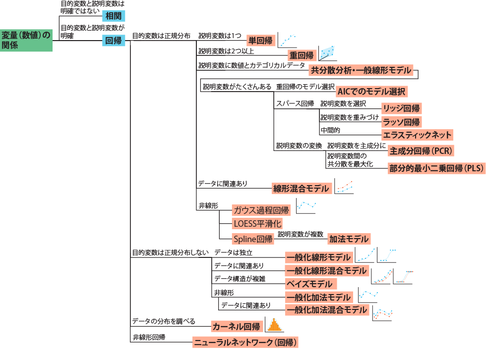](./image/reg_category.png)

## 30.1 相関

**相関**は、どちらが原因でどちらが結果かはっきりしない2変量（共に数値）の関係を示すときに用いられる分析の方法です。通常は**相関係数（correlation coefficient）**を用いて評価します。相関係数は2変量の直線的な関係を評価するための数値で、絶対値が1に近いほど2変量の関係は直線的、0に近いほどランダム（2変量は**独立**）であることを示します。また、相関係数がプラスの場合には片方が増えるともう片方も増える（正の相関）、マイナスの場合には片方が増えるともう片方は減る（負の相関）関係にあることを示します。

Rで相関係数を計算する場合には、`cor`関数を用います。`cor`関数は同じ長さのベクター2つを引数に取り、その2つのベクター間の相関係数を計算する関数です。`cor`関数の引数にデータフレームを与えると、各行の値の総当りの相関係数（相関行列）を返します。

`cor`関数は通常ピアソンの相関係数を計算する関数ですが、`method="kendall"`や`method="spearman"`を指定するとケンドールの相関係数やスピアマンの相関係数（いずれもノンパラメトリックな相関係数計算の手法）を計算することができます。2つの変数が正規分布しない場合や、直線的な関係にない時（例えば反比例するような場合）にはノンパラメトリックな方法を用いる方がよいときもあります。

また、相関係数が0ではないこと、つまり相関があることを検定するための関数が`cor.test`関数です。ただし、データ数が多ければ相関係数が0に近くても`cor.test`では統計的に有意となりやすくなります。

また、`GGally`パッケージ([Schloerke et al. 2023](#ref-GGally_bib))の`ggpairs`関数を用いれば、相関係数、`cor.test`の結果、散布図を一度に確認することができます。

``` downlit
# 2変量の相関（ピアソンの相関係数）
cor(iris$Sepal.Length, iris$Sepal.Width)
## [1] -0.1175698

# ケンドールの相関係数
cor(iris$Sepal.Length, iris$Sepal.Width, method="kendall")
## [1] -0.07699679

# スピアマンの相関係数
cor(iris$Sepal.Length, iris$Sepal.Width, method="spearman")
## [1] -0.1667777

# データフレームを引数にした場合の相関行列の計算
cor(iris[, 1:4])
##              Sepal.Length Sepal.Width Petal.Length Petal.Width
## Sepal.Length    1.0000000  -0.1175698    0.8717538   0.8179411
## Sepal.Width    -0.1175698   1.0000000   -0.4284401  -0.3661259
## Petal.Length    0.8717538  -0.4284401    1.0000000   0.9628654
## Petal.Width     0.8179411  -0.3661259    0.9628654   1.0000000

# 相関係数が0ではないことに関する検定
cor.test(iris$Sepal.Length, iris$Sepal.Width)
## 
##  Pearson's product-moment correlation
## 
## data:  iris$Sepal.Length and iris$Sepal.Width
## t = -1.4403, df = 148, p-value = 0.1519
## alternative hypothesis: true correlation is not equal to 0
## 95 percent confidence interval:
##  -0.27269325  0.04351158
## sample estimates:
##        cor 
## -0.1175698

# GGally::ggpairsで相関係数等を一度に表示する
GGally::ggpairs(iris[, 1:4])
```

[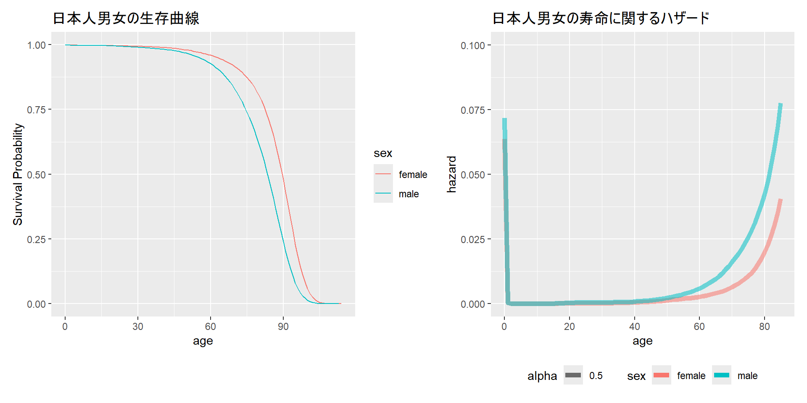](chapter30_files/figure-html/unnamed-chunk-1-1.png)

> **TIP:**
>
> 相関係数の絶対値が1に近ければ相関は強くなるのですが、どの程度の数値であれば相関があると言えるのか、という点についてははっきりしていません。教科書や資料を読むと、0.5ぐらいだと相関があるとしているものもありますし、0.3でも相関として意味があると書いている場合もあります。以下に例として、相関係数が異なるデータのグラフを示します。グラフから、相関係数がどれぐらいならどの程度相関があるのか、イメージして頂ければと思います。
>
> [](chapter30_files/figure-html/unnamed-chunk-2-1.png)
>
> また、2変量の関係が直線的でない場合には、何らかの関係が2変量間にあったとしても相関係数は小さくなります。
>
> 相関係数が等しくなるデータの例として有名なものが、Anscombeのデータです([Anscombe 1973](#ref-anscombe1973graphs))。Rでは`anscombe`のデータセットとして利用できます。このデータセットでは、`x1`と`y1`、`x2`と`y2`、`x3`と`y3`、`x4`と`y4`のそれぞれの列間の相関が一致します。
>
> ``` downlit
> anscombe
> ##    x1 x2 x3 x4    y1   y2    y3    y4
> ## 1  10 10 10  8  8.04 9.14  7.46  6.58
> ## 2   8  8  8  8  6.95 8.14  6.77  5.76
> ## 3  13 13 13  8  7.58 8.74 12.74  7.71
> ## 4   9  9  9  8  8.81 8.77  7.11  8.84
> ## 5  11 11 11  8  8.33 9.26  7.81  8.47
> ## 6  14 14 14  8  9.96 8.10  8.84  7.04
> ## 7   6  6  6  8  7.24 6.13  6.08  5.25
> ## 8   4  4  4 19  4.26 3.10  5.39 12.50
> ## 9  12 12 12  8 10.84 9.13  8.15  5.56
> ## 10  7  7  7  8  4.82 7.26  6.42  7.91
> ## 11  5  5  5  8  5.68 4.74  5.73  6.89
> ```
>
> Anscombeの各セットの相関係数は以下の通りとなります。すべて0.816前後になります。
>
> ``` downlit
> d_anscombe <- 
>   data.frame(
>     cor_set = rep(c("x1", "x2", "x3", "x4"), rep(11, 4)),
>     x = anscombe[,1:4] |> unlist(),
>     y = anscombe[,5:8] |> unlist()
>   )
>
> d_anscombe |> group_by(cor_set) |> summarise(corcoef = cor(x, y))
> ## # A tibble: 4 × 2
> ##   cor_set corcoef
> ##   <chr>     <dbl>
> ## 1 x1        0.816
> ## 2 x2        0.816
> ## 3 x3        0.816
> ## 4 x4        0.817
> ```
>
> このAnscombeのデータをグラフにすると、以下のようになります。x1はデータが直線上に近い形で位置していることが分かりますが、その他は直線上にデータが並んでいないことがわかります。また、ピアソンの相関係数は特に外れ値に弱い性質を持ち、大きな外れ値があると大きめの相関係数が得られやすいです。したがって、データを取得したら、解析する前にまずはデータをグラフにしてみて確認するのがよいでしょう。
>
> ``` downlit
> d_anscombe |> 
>   ggplot(aes(x = x, y = y, color =cor_set)) +
>   geom_point(size = 2) +
>   geom_smooth(method = "lm", se = FALSE) +
>   facet_wrap(~cor_set)
> ## `geom_smooth()` using formula = 'y ~ x'
> ```
>
> [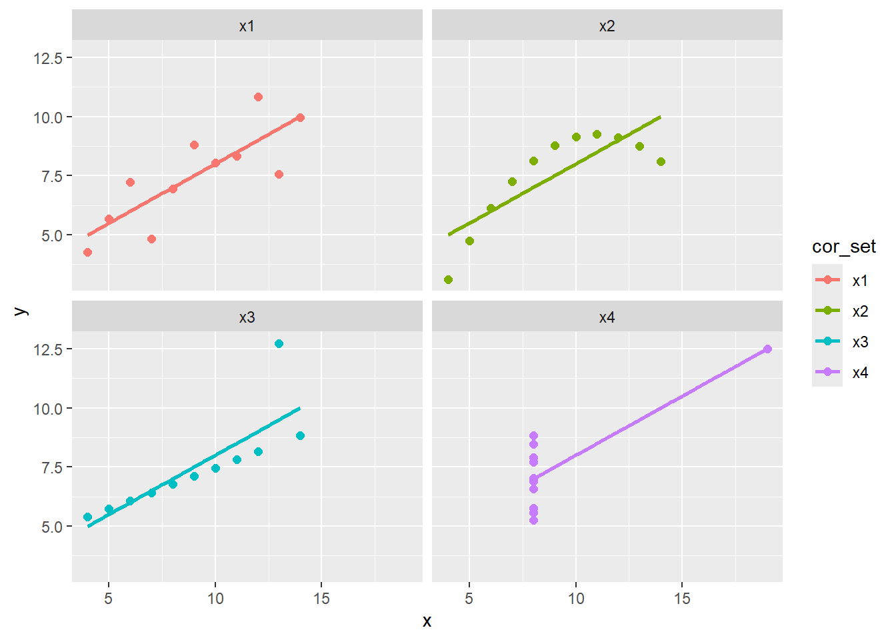](chapter30_files/figure-html/unnamed-chunk-5-1.png)

## 30.2 回帰

**回帰**は目的変数も説明変数も数値である場合に、目的変数と説明変数の関係を線形で示す統計解析です。回帰は、**目的変数と説明変数の関係を説明**するために用いられるものですが、回帰式を用いて**説明変数を得た時に目的変数を予測**する、予測的なモデルとしても用いることができます。

前者、説明的な回帰の例としては、作物に与える窒素肥料の量が作物の収率にどの程度影響を及ぼすのか調べるような場合が当てはまります。後者、予測的な回帰の例としては、検量線を引いておいて、吸光度から物質の濃度を計算するような場合が当てはまります。回帰の種類によっては、予測的なモデルが**機械学習**として取り扱われることもあります。

## 30.3 線形回帰：単回帰

説明変数が一つである場合、**単回帰**と呼ばれる線形回帰を行うことになります。**目的変数が正規分布する場合、回帰の結果は直線**となります。

単回帰では、**最小二乗法**と呼ばれる手法を用いて回帰を行います。最小二乗法は、直線と各データの点までのy軸方向の距離の2乗の和（2乗誤差）を最小にする直線を求める方法です。図で表すと、以下のグラフの赤線の長さを2乗して合計し、この合計を最小にする線の数式を求めるが最小二乗法です。この最小二乗法は微分を使えば比較的簡単に解けるため、昔からよく用いられてきた方法です。y軸方向（目的変数）の誤差のみを考慮して結果を求めるため、説明変数と目的変数を逆にしてしまうと計算結果が変わります。

> **TIP:**
>
> ``` downlit
> set.seed(0)
> x <- rnorm(50, mean = 10, sd = 2)
> y <- 0.5 * x + 3 + rnorm(50)
>
> lmresult <- lm(y ~ x)
> pred <- predict(lmresult)
>
> new_d <- data.frame(x, y, pred)
>
> new_d |> 
>   ggplot(aes(x = x, y = y, ymax = pred, ymin = y))+
>   geom_linerange(linewidth = 1, color = "#F8766D")+
>   geom_point(size = 3, color = "#00BFC4")+
>   geom_abline(intercept = lmresult$coefficients[1], slope = lmresult$coefficients[2], color = "black", linewidth = 0.25)+
>   labs(title = "最小二乗法のイメージ", caption = "青点：データの点、黒線：線形回帰の線、赤線：最小二乗法で最小とする長さ")
> ```

[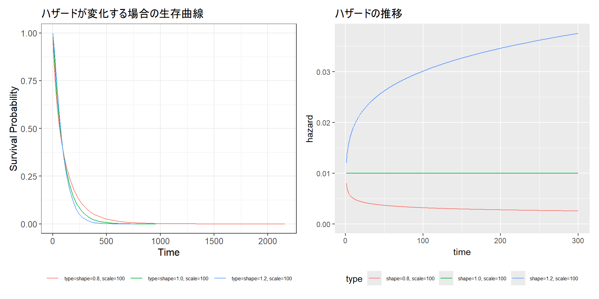](chapter30_files/figure-html/unnamed-chunk-7-1.png)

Rで線形回帰を行う場合には、`lm`関数を用います。`lm`関数の引数はformulaで、`目的変数~説明変数`という形で、チルダ（`~`）の前に結果（目的変数）のデータ、チルダの後に原因（説明変数）のデータをつないで用います。

目的変数と説明変数の関係は各データについて1対となるため（例えば、身長と体重であれば1人のデータは1対になります）、目的変数と説明変数に指定する変数の長さは同じである必要があります。`lm`関数の結果として、coefficients（係数、パラメータ）が2つ求まります。1つはIntercept、つまり切片で、もう一つは説明変数に対する傾きです。下の例では、\\Sepal.Length = 6.5262 - 0.2234 \cdot Sepal.Width\\という線形で回帰の式が表されることを示しています。

``` downlit
iris_se <- iris |> filter(Species == "setosa")
lm(iris_se$Sepal.Length ~ iris_se$Sepal.Width)
## 
## Call:
## lm(formula = iris_se$Sepal.Length ~ iris_se$Sepal.Width)
## 
## Coefficients:
##         (Intercept)  iris_se$Sepal.Width  
##              2.6390               0.6905
```

`lm`関数では、`t.test`関数（[29章](chapter29.llms.md#t検定)参照）と同様に`data`引数にデータフレームを取り、formulaにはデータフレームの列名を用いることができます。

``` downlit
head(cars)
##   speed dist
## 1     4    2
## 2     4   10
## 3     7    4
## 4     7   22
## 5     8   16
## 6     9   10

lm(dist ~ speed, data = cars)
## 
## Call:
## lm(formula = dist ~ speed, data = cars)
## 
## Coefficients:
## (Intercept)        speed  
##     -17.579        3.932
```

また、`lm`関数で切片を0、つまり原点を通る線で回帰したい場合には、formulaに`+0`や`-1`を加えます。

``` downlit
lm(dist ~ speed + 0, data = cars)
## 
## Call:
## lm(formula = dist ~ speed + 0, data = cars)
## 
## Coefficients:
## speed  
## 2.909
lm(dist ~ speed - 1, data = cars) # 上と同じ
## 
## Call:
## lm(formula = dist ~ speed - 1, data = cars)
## 
## Coefficients:
## speed  
## 2.909
```

### 30.3.1 lmクラスのオブジェクトの取り扱い

線形回帰の結果を変数に代入すると、lmクラスの変数となります。lmクラスのオブジェクトからは、`$coefficients`で切片と傾きを取り出すことができます。また、`summary`関数の引数とすると、回帰の詳細が表示されます。

`summary`関数で示される回帰の詳細には、coefficientsとして、分散分析表のようなものが表示されます。この表のうち、Estimateは切片と傾きの推定値、Std. Errorは切片と傾きの標準誤差、t valueとPr(\>\|t\|)はt検定の結果を示しています。このt検定の結果は、coefficients（切片と傾き）が0と有意に異なっているかを示しています。以下の例では、Intercept、iris_se\$Sepal.Widthは0と有意に異なります。つまり、`Sepal.Width`は目的変数である`Sepal.Length`に影響を与えていることを表しています。

Multiple R squaredは**決定係数**と呼ばれるもので、線形性の高さを示します。決定係数（R²）は相関係数（R）の2乗として計算されるもので、0~1の値を取ります。1に近いほど線形性が高く、0に近いほどあまり線形性がみられないという結果となります。Adjusted R squaredは調整済み決定係数で、説明変数の数でペナルティを付けて計算した決定係数です。

``` downlit
lmresult <- lm(iris_se$Sepal.Length ~ iris_se$Sepal.Width) # 変数にlmの結果を代入
class(lmresult) # lmクラスのオブジェクト
## [1] "lm"

lmresult$coefficients # 切片と傾きを取り出す
##         (Intercept) iris_se$Sepal.Width 
##           2.6390012           0.6904897

summary(lmresult) # 線形回帰の詳細（内容の詳細は?summary.lmで調べることができる）
## 
## Call:
## lm(formula = iris_se$Sepal.Length ~ iris_se$Sepal.Width)
## 
## Residuals:
##      Min       1Q   Median       3Q      Max 
## -0.52476 -0.16286  0.02166  0.13833  0.44428 
## 
## Coefficients:
##                     Estimate Std. Error t value Pr(>|t|)    
## (Intercept)           2.6390     0.3100   8.513 3.74e-11 ***
## iris_se$Sepal.Width   0.6905     0.0899   7.681 6.71e-10 ***
## ---
## Signif. codes:  0 '***' 0.001 '**' 0.01 '*' 0.05 '.' 0.1 ' ' 1
## 
## Residual standard error: 0.2385 on 48 degrees of freedom
## Multiple R-squared:  0.5514, Adjusted R-squared:  0.542 
## F-statistic: 58.99 on 1 and 48 DF,  p-value: 6.71e-10
```

### 30.3.2 predict関数

`predict`関数は、lmクラスのオブジェクトを引数に取り、xの値を与えた時のyの値や、yの信頼区間を計算する関数です。

`predict`関数の第一引数はlmクラスのオブジェクトで、第二引数（`newdata`）に、予測したいx軸上の値をデータフレームで設定します。`interval`という引数には、`"none"`、`"confidence"`、`"prediction"`の3つのうちどれかを設定します。`"none"`の場合には`newdata`で与えたxを与えた場合の直線上のyの値のみを返します。`"confidence"`の場合は信頼区間、`"prediction"`の場合は個々の値に関する予測区間が表示されます。区間の幅は`levels`引数で指定することができます。`levels`引数のデフォルト値は0.95なので、`levels`を設定しない場合には信頼区間などの区間は95％区間として求まります。

``` downlit
set.seed(0)
x <- rnorm(15) # xは平均0、標準偏差1の正規乱数
y <- x + rnorm(15) # yはxに正規乱数を足したもの
plot(x, y, xlim = c(-1.75, 2.5), ylim = c(-2, 2.5))
par(new = T)
plot(\(x){x}, xlim = c(-1.75, 2.5), ylim = c(-2, 2.5), xlab = "", ylab = "")
```

[](chapter30_files/figure-html/unnamed-chunk-12-1.png)

``` downlit
lmr <- lm(y ~ x)
new <- data.frame(x = 1:5) # x=1～5のときの予測値を求める

# fitが直線上の値、lwr、uprがそれぞれ信頼区間の2.5％、97.5％分位値
predict(lmr, newdata = new, interval = "confidence", levels = 0.95)
##         fit       lwr      upr
## 1 0.8640845 0.3320906 1.396078
## 2 1.7973471 0.9638927 2.630801
## 3 2.7306096 1.5453633 3.915856
## 4 3.6638722 2.1103261 5.217418
## 5 4.5971348 2.6682138 6.526056
```

``` downlit
# predict関数を用いて表示する方法。geom_smooth関数でも同じことができる。
ggplot()+
  geom_point(data = data.frame(x, y), aes(x = x, y = y, size = 2)) +
  geom_ribbon(
    data = 
      data.frame(
        x = seq(-2, 2.5, by = 0.1), 
        predict(lmr, newdata = data.frame(x = seq(-2, 2.5, by = 0.1)), interval = "confidence", levels = 0.95)),
    aes(x = x, y = fit, ymax = upr, ymin = lwr, color = factor(1), fill = factor(1), alpha = 0.2)
    )
```

[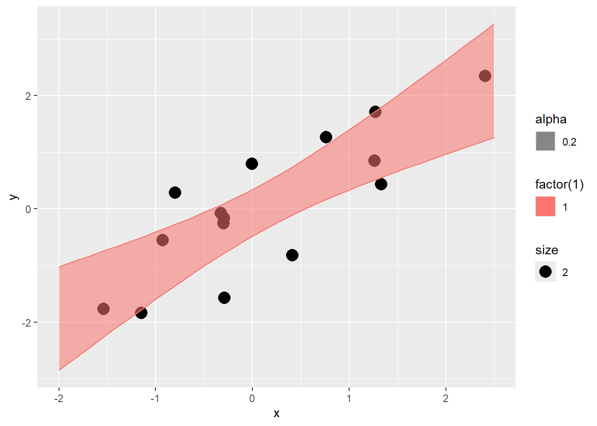](chapter30_files/figure-html/unnamed-chunk-14-1.png)

> **TIP:**
>
> 上に述べた`predict`関数、`summary`関数以外にも、`lm`関数の結果（lmクラスのオブジェクト）にはいろいろな取り扱いの方法があります。まずは、`names`関数の引数にすると、パラメータの取り出しに用いる名前を呼び出すことができます。
>
> ``` downlit
> names(lmr)
> ##  [1] "coefficients"  "residuals"     "effects"       "rank"         
> ##  [5] "fitted.values" "assign"        "qr"            "df.residual"  
> ##  [9] "xlevels"       "call"          "terms"         "model"
> ```
>
> また、`plot`関数の引数に取ると、残差（residuals）の分析に関する図を表示することができます。
>
> ``` downlit
> # 上の2つは分散の正規性、左下は分散の一様性、
> # 右下はCook's distance (https://en.wikipedia.org/wiki/Cook%27s_distance)と呼ばれる
> # パラメータを示す図で、0.5の点線を超える点は回帰に大きな影響を与えることを示す
> par(mfrow = c(2, 2))
> plot(lmr)
> ```
>
> [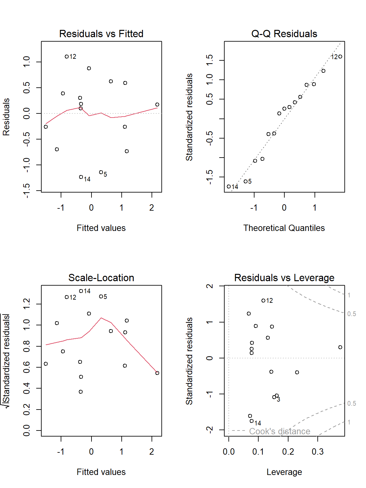](chapter30_files/figure-html/unnamed-chunk-16-1.png)
>
> 他にも`coef`関数でcoefficients（切片と傾き）、`confint`関数で切片と傾きの信頼区間、`residuals`関数で残差を求めることができます。詳しくは[`?lm`](https://rdrr.io/r/stats/lm.html)のヘルプを参照してください。
>
> ``` downlit
> coef(lmr) # 切片と傾きの推定値
> ## (Intercept)           x 
> ## -0.06917813  0.93326259
> confint(lmr) # 切片と傾きの95％信頼区間
> ##                  2.5 %    97.5 %
> ## (Intercept) -0.4813949 0.3430386
> ## x            0.5469117 1.3196134
> residuals(lmr) # 残差
> ##           1           2           3           4           5           6 
> ## -0.25804641  0.29962960 -0.73399564  0.58978006 -1.14068820 -0.25786204 
> ##           7           8           9          10          11          12 
> ##  0.38460361  0.18284561  0.87298275  0.17255169  0.62374635  1.10162368 
> ##          13          14          15 
> ## -0.69836737 -1.23473915  0.09593545
> ```

## 30.4 重回帰

**重回帰**とは、1つの目的変数に対して、2つ以上の説明変数がある場合の回帰のことです。Rでは重回帰も単回帰と同じく`lm`関数で計算することができます。重回帰は[二元分散分析](chapter29.llms.md#二元分散分析)と同様に、説明変数を`+`または`*`でつないでformulaを設定します。`+`でつないだ場合には交互作用なし、`*`でつないだ場合には交互作用ありの重回帰となります。ただし、重回帰の交互作用はその意味の理解が難しいため、意味をよく考えた上で交互作用の項を追加するかどうか決める方がよいでしょう。

``` downlit
# 交互作用なしモデル
# Sepal.Length = 2.3037 + 0.6674 * Sepal.Width + 0.2834 * Petal.Length が結果となる
lm(iris_se$Sepal.Length ~ iris_se$Sepal.Width + iris_se$Petal.Length)
## 
## Call:
## lm(formula = iris_se$Sepal.Length ~ iris_se$Sepal.Width + iris_se$Petal.Length)
## 
## Coefficients:
##          (Intercept)   iris_se$Sepal.Width  iris_se$Petal.Length  
##               2.3037                0.6674                0.2834

# 交互作用ありモデル
# Sepal.Length = -1.3686 + 1.7230 * Sepal.Width + 
# 2.8759 * Petal.Length - 0.7438 * Sepal.Width * Petal.Length
lm(iris_se$Sepal.Length ~ iris_se$Sepal.Width * iris_se$Petal.Length)
## 
## Call:
## lm(formula = iris_se$Sepal.Length ~ iris_se$Sepal.Width * iris_se$Petal.Length)
## 
## Coefficients:
##                              (Intercept)  
##                                  -1.3686  
##                      iris_se$Sepal.Width  
##                                   1.7230  
##                     iris_se$Petal.Length  
##                                   2.8759  
## iris_se$Sepal.Width:iris_se$Petal.Length  
##                                  -0.7438

# 交互作用はコロン（:）を用いて以下のように書くこともできる
lm(
  iris_se$Sepal.Length ~ 
    iris_se$Sepal.Width + iris_se$Petal.Length + iris_se$Sepal.Width:iris_se$Petal.Length
  )
## 
## Call:
## lm(formula = iris_se$Sepal.Length ~ iris_se$Sepal.Width + iris_se$Petal.Length + 
##     iris_se$Sepal.Width:iris_se$Petal.Length)
## 
## Coefficients:
##                              (Intercept)  
##                                  -1.3686  
##                      iris_se$Sepal.Width  
##                                   1.7230  
##                     iris_se$Petal.Length  
##                                   2.8759  
## iris_se$Sepal.Width:iris_se$Petal.Length  
##                                  -0.7438
```

## 30.5 一般線形モデル

**一般線形モデル**は、1つの目的変数に対して、数値や因子からなる複数の説明変数がある場合の回帰のことです。重回帰や[共分散分析](chapter29.llms.md#共分散分析)の拡張だと考えるとよいかと思います。Rでは一般線形モデルの計算も`lm`関数を用いて行います。一般線形モデルも重回帰とほぼ同じで、説明変数同士を`+`か`*`でつなぐだけです。

一般線形モデルでは説明変数として非常にたくさんの数値や因子を登録できますが、すべての説明変数に対して交互作用ありにしてしまうと交互作用項が非常に多くなり、理解が難しくなるので、本当に必要がある部分にだけ交互作用を入れる方がよいでしょう。個別に交互作用を加えたい場合には、上の重回帰で示したように`:`（コロン）を用いるとよいでしょう。

``` downlit
# 一般線形モデル
# 結果は Sepal.Length = 2.39039 + 0.43222 * Sepal.Width + 0.77563 * Petal.Length で、
# 種がsetosaなら上記の線形式のまま、versicolorなら-0.95581、virginicaなら-1.39410を線形式に足す形となる。
lm(iris$Sepal.Length ~ iris$Sepal.Width + iris$Petal.Length + iris$Species) |> summary()
## 
## Call:
## lm(formula = iris$Sepal.Length ~ iris$Sepal.Width + iris$Petal.Length + 
##     iris$Species)
## 
## Residuals:
##      Min       1Q   Median       3Q      Max 
## -0.82156 -0.20530  0.00638  0.22645  0.74999 
## 
## Coefficients:
##                        Estimate Std. Error t value Pr(>|t|)    
## (Intercept)             2.39039    0.26227   9.114 5.94e-16 ***
## iris$Sepal.Width        0.43222    0.08139   5.310 4.03e-07 ***
## iris$Petal.Length       0.77563    0.06425  12.073  < 2e-16 ***
## iris$Speciesversicolor -0.95581    0.21520  -4.442 1.76e-05 ***
## iris$Speciesvirginica  -1.39410    0.28566  -4.880 2.76e-06 ***
## ---
## Signif. codes:  0 '***' 0.001 '**' 0.01 '*' 0.05 '.' 0.1 ' ' 1
## 
## Residual standard error: 0.3103 on 145 degrees of freedom
## Multiple R-squared:  0.8633, Adjusted R-squared:  0.8595 
## F-statistic: 228.9 on 4 and 145 DF,  p-value: < 2.2e-16
```

``` downlit
# 一般線形モデル（交互作用あり）：たくさんの交互作用項が出てくる
lm(iris$Sepal.Length ~ iris$Sepal.Width * iris$Petal.Length * iris$Species) |> summary()
## 
## Call:
## lm(formula = iris$Sepal.Length ~ iris$Sepal.Width * iris$Petal.Length * 
##     iris$Species)
## 
## Residuals:
##      Min       1Q   Median       3Q      Max 
## -0.78535 -0.20750 -0.00579  0.19960  0.66728 
## 
## Coefficients:
##                                                           Estimate Std. Error
## (Intercept)                                                -1.3686     3.9089
## iris$Sepal.Width                                            1.7230     1.1206
## iris$Petal.Length                                           2.8759     2.7490
## iris$Speciesversicolor                                      3.1746     5.4972
## iris$Speciesvirginica                                      -0.9949     5.2725
## iris$Sepal.Width:iris$Petal.Length                         -0.7438     0.7854
## iris$Sepal.Width:iris$Speciesversicolor                    -1.3564     1.8565
## iris$Sepal.Width:iris$Speciesvirginica                     -0.4274     1.6585
## iris$Petal.Length:iris$Speciesversicolor                   -2.0675     2.8951
## iris$Petal.Length:iris$Speciesvirginica                    -1.4233     2.8165
## iris$Sepal.Width:iris$Petal.Length:iris$Speciesversicolor   0.7161     0.8569
## iris$Sepal.Width:iris$Petal.Length:iris$Speciesvirginica    0.5649     0.8129
##                                                           t value Pr(>|t|)
## (Intercept)                                                -0.350    0.727
## iris$Sepal.Width                                            1.538    0.126
## iris$Petal.Length                                           1.046    0.297
## iris$Speciesversicolor                                      0.577    0.565
## iris$Speciesvirginica                                      -0.189    0.851
## iris$Sepal.Width:iris$Petal.Length                         -0.947    0.345
## iris$Sepal.Width:iris$Speciesversicolor                    -0.731    0.466
## iris$Sepal.Width:iris$Speciesvirginica                     -0.258    0.797
## iris$Petal.Length:iris$Speciesversicolor                   -0.714    0.476
## iris$Petal.Length:iris$Speciesvirginica                    -0.505    0.614
## iris$Sepal.Width:iris$Petal.Length:iris$Speciesversicolor   0.836    0.405
## iris$Sepal.Width:iris$Petal.Length:iris$Speciesvirginica    0.695    0.488
## 
## Residual standard error: 0.3024 on 138 degrees of freedom
## Multiple R-squared:  0.8765, Adjusted R-squared:  0.8666 
## F-statistic:    89 on 11 and 138 DF,  p-value: < 2.2e-16
```

> **TIP:**
>
> [29章](chapter29.llms.md#formulaを用いたt検定)で簡単に説明した通り、formulaは`formula`関数を用いて文字列から作成することができます。交互作用のある場合も同様です。
>
> ``` downlit
> formula("x ~ f")
> ## x ~ f
> ```
>
> データフレームを用いている場合、目的変数以外のすべての列を説明変数とするには、以下のように.を用います。
>
> ``` downlit
> # Sepal.Width、Petal.Length、Speciesが説明変数となる
> lm(Sepal.Length ~ ., data = iris) |> coef()
> ##       (Intercept)       Sepal.Width      Petal.Length       Petal.Width 
> ##         2.1712663         0.4958889         0.8292439        -0.3151552 
> ## Speciesversicolor  Speciesvirginica 
> ##        -0.7235620        -1.0234978
> ```
>
> すべての交互作用を評価する場合には、以下のように`(.)^2`という形で書くこともできます。
>
> ``` downlit
> lm(Sepal.Length ~ (.)^2, data = iris) |> coef()
> ##                    (Intercept)                    Sepal.Width 
> ##                      1.6997802                      0.8300898 
> ##                   Petal.Length                    Petal.Width 
> ##                      0.3178192                      2.5827178 
> ##              Speciesversicolor               Speciesvirginica 
> ##                     -2.7193358                     -6.1704174 
> ##       Sepal.Width:Petal.Length        Sepal.Width:Petal.Width 
> ##                     -0.0148670                     -0.6111773 
> ##  Sepal.Width:Speciesversicolor   Sepal.Width:Speciesvirginica 
> ##                      0.4300016                      0.8287899 
> ##       Petal.Length:Petal.Width Petal.Length:Speciesversicolor 
> ##                     -0.1194774                      0.7397631 
> ##  Petal.Length:Speciesvirginica  Petal.Width:Speciesversicolor 
> ##                      0.9033624                     -1.0069681 
> ##   Petal.Width:Speciesvirginica 
> ##                     -0.2863915
> ```
>
> 交互作用の一部だけを評価したい場合には、以下のように交互作用を評価したい要素をカッコで区切り、`(x1 + x2)^2`のように設定することもできます。
>
> ``` downlit
> # Sepal.WidthとPetal.Lengthの交互作用のみ評価する
> lm(Sepal.Length ~ (Sepal.Width + Petal.Length)^2 + Petal.Width, data = iris) |> coef()
> ##              (Intercept)              Sepal.Width             Petal.Length 
> ##               1.29826456               0.82148679               0.86672913 
> ##              Petal.Width Sepal.Width:Petal.Length 
> ##              -0.53296801              -0.05236086
> ```
>
> また、多項式回帰（例えばSepal.Widthの2乗を含むモデル）を行う場合には、以下のように`I`関数を用いたformulaを設定します。`I`関数を用いないと正しい結果が返ってきません。
>
> ``` downlit
> # Sepal.Widthの2乗のパラメータを評価する
> lm(Sepal.Length ~ Sepal.Width + I(Sepal.Width^2), data = iris) |> coef()
> ##      (Intercept)      Sepal.Width I(Sepal.Width^2) 
> ##        2.4593802        2.4311973       -0.4246044
> ```
>
> 詳しく知りたい方は[`?formula`](https://rdrr.io/r/stats/formula.html)を実行し、`formula`関数のヘルプを確認してみるとよいでしょう。

## 30.6 一般化線形モデル

目的変数が正規分布しない場合、例えばポアソン分布や二項分布するときには、分布が上下非対称になります。ですので、上記の、データが正規分布すると仮定した場合における最小二乗法を用いた直線での回帰は適していません。

以下に目的変数が二項分布とポアソン分布するデータの例を示します。いずれも直線で回帰してしまうと、データの特徴を捉えていないことがわかると思います。

## 二項分布

二項分布を回帰する場合の典型的な例としては、医薬品の投与量（説明変数）に対して病気が治る確率（目的変数、回復:1と未回復:0の2値）を回帰する場合などが挙げられます。

``` downlit
set.seed(5)
logistic <- \(x, sex){1 / (1 + exp(-3 * x + 150 + 10 * sex)) + rbeta(length(x), 0.5, 1.5)}
x <- 1:100 ; sex <- rbinom(100, 1, 0.5)
binom_d <- data.frame(x, y = if_else(logistic(x, sex) > 0.5, 1, 0), sex = factor(sex))
binom_d |> ggplot(aes(x = x, y = y, color = sex)) + geom_point()
```

[](chapter30_files/figure-html/unnamed-chunk-26-1.png)

## 2項分布を直線で回帰

``` downlit
(binom_d |> 
  ggplot(aes(x = x, y = y, color = sex)) + 
  geom_point() + geom_quantile(quantiles = 0.5)) |> 
  print() |> 
  suppressWarnings()
```

[](chapter30_files/figure-html/unnamed-chunk-27-1.png)

## ポアソン分布

ポアソン分布を回帰する典型的な例としては、植物の生育サイズ（説明変数）と種子の数（目的変数、正の整数のみを取る）の関係などが挙げられます。

``` downlit
x <- 1:10
y <- c(replicate(10, rpois(10, exp(x / 3 + 0.25))), replicate(10, rpois(10, exp(x / 3))))
pois_d <- data.frame(x, y = as.vector(y), fertilizer = factor(rep(c(1, 0), c(100, 100))))
pois_d |> ggplot(aes(x = x, y = y, color = fertilizer)) + geom_jitter(width = 0.1)
```

[](chapter30_files/figure-html/unnamed-chunk-28-1.png)

## ポアソン分布を直線回帰

``` downlit
pois_d |> 
  ggplot(aes(x = x, y = y, color = fertilizer)) + 
  geom_jitter(width = 0.1) + 
  geom_quantile(quantiles = 0.5)
```

[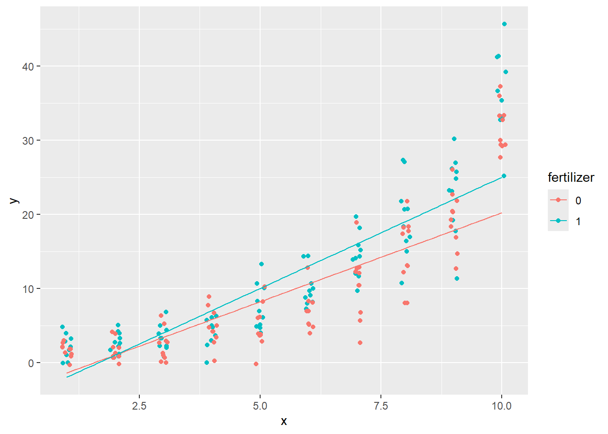](chapter30_files/figure-html/unnamed-chunk-29-1.png)

直線での回帰ができない場合には、最小二乗法を用いることができないため、別の方法を用いて回帰を行います。この回帰の際に用いるのが**最尤法（さいゆうほう）**と呼ばれる方法で、**尤度（ゆうど）**というものを最大にするような傾きや切片を選択する方法です。

尤度は尤（もっと）もらしさの指標で、傾きや切片がある数値の時に、どの程度その傾きや切片の値が尤もらしいかを評価するためのものです。最も尤度が高い、つまり最も尤もらしい傾きや切片の値（**最尤推定値**）を、回帰における傾きや切片に当たるもの（パラメータ）として求めます。

> **TIP:**
>
> 尤度についてもう少し詳しく説明します。尤度の説明の例として正規分布を挙げます。以下は[28章](chapter28.llms.md)で示した正規分布の確率密度関数です。
>
> \\ Norm(x, \mu, \sigma)=\frac{1}{\sqrt{2\pi \sigma^2}} \cdot \exp \left( \frac{(x-\mu)^2}{2\sigma^2} \right) \\
>
> この数式は間違ってはいないのですが、以下のように書く方が正しい表現です。
>
> \\ Norm(x \| \mu, \sigma)=\frac{1}{\sqrt{2\pi \sigma^2}} \cdot \exp \left( \frac{(x-\mu)^2}{2\sigma^2} \right) \\
>
> 変わっているところは、始めの関数のxとμの間がコンマではなく、縦線（\|）になっているところです。この縦線の左は自由な値を取ることができる変数（未知の値、上の式ではx）、縦線の右はあらかじめわかっている数値（既知の値、上の式ではμとσ）を表します。ですので、上の式の意味は、平均値（μ）と標準偏差（σ）がわかっているときの、xという値が得られる確率（密度）を計算している、ということを意味しています。
>
> しかし、データが取れた時に、あらかじめ平均値や標準偏差がわかっていることはありません。ですので、普通はデータxが取れた時には、xから平均値μや標準偏差σを求める方に興味があるわけです。つまり、上の式では既知のパラメータ（x）と未知のパラメータ（μとσ）の関係が逆になっています。
>
> ですので、既知と未知のパラメータを逆にしてしまえば、上の式はデータが取れた時に平均値や標準偏差が得られる確率にできるはずです。
>
> \\ L(\mu, \sigma\| x)=\frac{1}{\sqrt{2\pi \sigma^2}} \cdot \exp \left( \frac{(x-\mu)^2}{2\sigma^2} \right) \\
>
> この、xというデータが取れた時に、特定の平均値μや標準偏差σが得られる確率（\\L(\mu, \sigma\| x)\\）のことを尤度と呼びます。確率密度関数との差は\|の左右が逆になっているだけです。ただし、通常データは複数取れる（x₁～x_(n)）ので、μとσが得られる確率は以下のように、データの数だけ尤度を掛け算することで計算できます。
>
> \\L(\mu, \sigma\| x\_{1}, x\_{2}, \cdots x\_{n})=L(\mu, \sigma\| x\_{1}) \cdot L(\mu, \sigma\| x\_{2}) \cdots L(\mu, \sigma\| x\_{n})=\prod\_{i=1}^{n}L(\mu, \sigma\| x\_{i})\\
>
> 最後のΠは総乗の記号で、i=1からnまで掛け算するという意味の式です。掛け算のままでは値が非常に小さくなり、取り扱いが難しくなるので、対数変換し、対数尤度というものを取り扱うのが一般的です。対数を取ることで、データごとの対数尤度の足し算として尤度を取り扱えるようになり、計算しやすくなります。
>
> \\logL(\mu, \sigma\| x\_{1}, x\_{2}, \cdots x\_{n})=\sum\_{i=1}^{n}logL(\mu, \sigma\| x\_{i})\\
>
> この対数尤度を最大とするμとσ（パラメータ）を求める手法のことを最尤法と呼びます。データが正規分布しているときにはこの最尤法の計算は微分を用いて計算でき、μとσの最尤推定値はそれぞれ平均値と標準偏差になります。

最尤法を用いて、目的変数の分布に従った回帰を行う手法のことを、**一般化線形モデル（generalized linear model、GLM）**と呼びます。一般化線形モデルでは、目的変数の分布（Rではfamilyと呼ばれる）によって異なる、**リンク関数**というものを用いて回帰を計算します。正規分布のリンク関数は直線（identity）で、通常の線形回帰と一致します。

> **TIP:**
>
> 上に示した通り、目的変数が2項分布やポアソン分布する場合には、データを直線で回帰してしまうと実際の結果を正しく反映しない回帰となってしまいます。例えば、二項分布するデータでは0か1かしか取らない結果なのに、直線はその範囲を平気で超えていきます。ポアソン分布はマイナスの値を取れないのに、直線で回帰すると直線はマイナスの値を取ってしまいます。
>
> このように、目的変数が正規分布しない場合、直線で回帰すると誤った結果を導いてしまいます。このような問題を解決するためのものが、**リンク関数**です。リンク関数は、目的変数の変換に関わる関数で、その変換結果を直線で回帰することで目的変数を適切に表現することができる関数です。目的変数が正規分布する場合には、目的変数をそのまま直線で回帰するため、リンク関数は**identity**、つまりそのままになります。
>
> 二項分布では、**オッズ比**（\\\frac{p}{1-p}\\、ベルヌーイ試行の成功確率pと失敗確率1-pの比、pが目的変数）の対数を以下のように線形で回帰します。
>
> \\log(\frac{p}{1-p})=ax+b\\
>
> 上の式のオッズ比の対数のことを**ロジット**（logit）と呼びます。この時、pは確率ですので、0～1の値を取ります。上の式をpについて解くと、以下の式になります。
>
> \\p=\frac{1}{1+\exp(-(ax+b))}\\
>
> このpの式を**ロジスティック式**と呼びます。ロジスティック式はpが0～1の値を取り、xは-∞～+∞の値を取ります。この関数は個体群密度のモデル化にも用いられる関数で、二項分布する結果を回帰するのに適しています。目的変数が二項分布の場合はこのロジスティック式で回帰し、二項分布の場合のリンク関数はロジットになります。
>
> 目的変数がポアソン分布の場合には、値の対数を以下のように線形で回帰します。
>
> \\log(y)=ax+b\\
>
> ですので、目的変数yは以下のように指数関数で回帰することになります。
>
> \\y=\exp(ax+b)\\
>
> ですので、目的変数がポアソン分布する場合には指数関数で回帰し、リンク関数は対数（log）になります。
>
> この他にも、目的変数の代表値と分散が一致しないカウントデータ（疑似ポアソン分布）や過分散の二項分布（疑似二項分布）などにもそれぞれ分布とリンク関数が設定されています。Rではこの目的変数の分布とリンク関数のセットのことをfamilyと呼びます。familyで指定されている目的変数の分布、Rのデフォルトのリンク関数、回帰する関数の種類を以下の表に示します。
>
> | 目的変数の分布   | リンク関数 | 回帰する関数   |
> |:-----------------|:-----------|:---------------|
> | 二項分布         | logit      | ロジスティック |
> | 正規分布         | identity   | 直線           |
> | ガンマ分布       | inverse    | 反比例         |
> | 逆ガウス分布     | 1/mu^{2}   | (1/(ax+b))^0.5 |
> | ポアソン分布     | log        | 指数           |
> | 疑似二項分布     | logit      | ロジスティック |
> | 疑似ポアソン分布 | log        | 指数           |
>
> リンク関数にはデフォルトのものではなく、自分で選択した関数を別途設定することもできます。

### 30.6.1 目的変数が正規分布の場合

Rでは、一般化線形モデルの計算を`glm`関数で行います。`glm`関数の使い方は`lm`関数とほぼ同じで、第一引数に`目的変数~説明変数`の形のformulaを取ります。データフレームのデータを利用する場合には、`data`引数にデータフレームを指定します。また、`glm`では、目的変数の分布を`family`引数に指定します。目的変数が正規分布する場合には、以下のように`family="gaussian"`と指定します。`family="gaussian"`の場合、`glm`での回帰の結果は`lm`での回帰の結果と同一になります。

``` downlit
## 一般化線形モデル
# 正規分布（identityをリンク関数とする）
# lmと同じなので、結果は Sepal.Length = 6.5262 - 0.2234 * Sepal.Width となる
glm(Sepal.Length ~ Sepal.Width, data = iris, family = "gaussian")
## 
## Call:  glm(formula = Sepal.Length ~ Sepal.Width, family = "gaussian", 
##     data = iris)
## 
## Coefficients:
## (Intercept)  Sepal.Width  
##      6.5262      -0.2234  
## 
## Degrees of Freedom: 149 Total (i.e. Null);  148 Residual
## Null Deviance:       102.2 
## Residual Deviance: 100.8     AIC: 372
```

`glm`関数の返り値を`summary`関数の引数とすることで、`lm`関数と同様に詳細な計算結果を得ることができます。Estimateが係数であることは`lm`関数と同じです。

``` downlit
glm(Sepal.Length ~ Sepal.Width, data = iris, family = "gaussian") |> summary()
## 
## Call:
## glm(formula = Sepal.Length ~ Sepal.Width, family = "gaussian", 
##     data = iris)
## 
## Coefficients:
##             Estimate Std. Error t value Pr(>|t|)    
## (Intercept)   6.5262     0.4789   13.63   <2e-16 ***
## Sepal.Width  -0.2234     0.1551   -1.44    0.152    
## ---
## Signif. codes:  0 '***' 0.001 '**' 0.01 '*' 0.05 '.' 0.1 ' ' 1
## 
## (Dispersion parameter for gaussian family taken to be 0.6807844)
## 
##     Null deviance: 102.17  on 149  degrees of freedom
## Residual deviance: 100.76  on 148  degrees of freedom
## AIC: 371.99
## 
## Number of Fisher Scoring iterations: 2
```

### 30.6.2 目的変数が二項分布の場合

目的変数が二項分布の場合には、`glm`の引数に`family="binomial"`（二項分布）を指定します。`family`に二項分布を指定すると、リンク関数はロジットとなり、ロジスティック式でデータを回帰することになります。ロジスティック式が表しているのは確率になるため、説明変数に応じてベルヌーイ試行の確率がどのように変化していくのかを示すような回帰を行うことになります。

以下の例では、回帰の結果はcoefficientsで示されている通り、以下の数式となります。

\\ log(\frac{p}{1-p}) = -4.34896+0.09368x \\

上式を変換し、ロジスティック関数にしたものが以下の式です。

\\ p = \frac{1}{1+exp(-(-4.34896+0.09368x))} \\

``` downlit
# 回帰するデータ
plot(binom_d$x, binom_d$y, xlim = c(0, 100), ylim = c(0, 1))

# 二項分布（logitをリンク関数とする）
glm(y ~ x, data = binom_d, family = "binomial")
## 
## Call:  glm(formula = y ~ x, family = "binomial", data = binom_d)
## 
## Coefficients:
## (Intercept)            x  
##    -4.34896      0.09368  
## 
## Degrees of Freedom: 99 Total (i.e. Null);  98 Residual
## Null Deviance:       138 
## Residual Deviance: 67.48     AIC: 71.48

# 回帰の結果をプロットする
par(new = T)
plot(\(x)(1/(1 + exp(-(-4.34896 + 0.09368 * x)))), xlim = c(0, 100), ylim = c(0, 1), xlab = "", ylab = "")
```

[](chapter30_files/figure-html/unnamed-chunk-33-1.png)

2項分布の成功、失敗回数がわかっている時には、成功回数の列と失敗回数の列を行列で目的変数として指定することもできます。行列を目的変数として指定する場合には、formulaのチルダ（`~`）の左側に、`cbind(成功回数, 失敗回数)`の形で行列として指定します。

``` downlit
# yはベルヌーイ試行の成功数、zは失敗数
head(dbn)
##   x y  z
## 1 1 0 10
## 2 2 0 10
## 3 3 2  8
## 4 4 7  3
## 5 5 3  7
## 6 6 8  2

# 成功・失敗をmatrixで指定する
glm(cbind(y, z) ~ x, family = "binomial")
## 
## Call:  glm(formula = cbind(y, z) ~ x, family = "binomial")
## 
## Coefficients:
## (Intercept)            x  
##      -5.025        1.119  
## 
## Degrees of Freedom: 9 Total (i.e. Null);  8 Residual
## Null Deviance:       90.15 
## Residual Deviance: 12.9  AIC: 26.97

# 回帰をグラフで表示
dbn |> 
  ggplot(aes(x = x, y = y / 10))+
  geom_point()+
  geom_function(fun=\(x){1 / (1 + exp(-(-5.025 + 1.119 * x)))})
```

[](chapter30_files/figure-html/unnamed-chunk-35-1.png)

#### 30.6.2.1 説明変数を増やす

`lm`関数と同様に、`formula`の右辺に`+`で説明変数を繋ぐことで、重回帰・一般線形モデルのように説明変数を増やすこともできます。

``` downlit
head(binom_d)
##   x y sex
## 1 1 0   0
## 2 2 0   1
## 3 3 1   1
## 4 4 0   0
## 5 5 0   0
## 6 6 0   1

# 二項分布（logitをリンク関数とする）
glm(y ~ x + sex, data = binom_d, family = "binomial")
## 
## Call:  glm(formula = y ~ x + sex, family = "binomial", data = binom_d)
## 
## Coefficients:
## (Intercept)            x         sex1  
##    -4.20991      0.09672     -0.52864  
## 
## Degrees of Freedom: 99 Total (i.e. Null);  97 Residual
## Null Deviance:       138 
## Residual Deviance: 66.79     AIC: 72.79

# 回帰の結果をプロットする
binom_d |> 
  ggplot(aes(x = x, y = y, color = sex))+
  geom_point()+
  geom_function(fun = \(x){1 / (1 + exp(-(-4.20991 + 0.09672 * x)))}, color = "blue") +
  geom_function(fun = \(x){1 / (1 + exp(-(-4.20991  - 0.52864 + 0.09672 * x)))}, color = "red")
```

[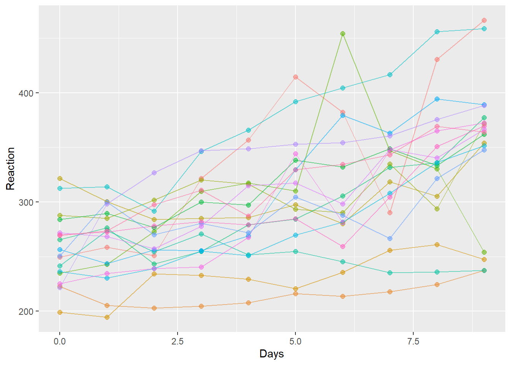](chapter30_files/figure-html/unnamed-chunk-36-1.png)

上の例では、計算結果はcoefficientsから、以下の式となります。sexは0か1ですので、0の時は-0.52864×sexの部分が0に、1の時は-0.52864となります。

\\ y = \frac{1}{1+exp(-(-4.20991 + 0.09672x - 0.52864 \cdot sex))} \\

### 30.6.3 目的変数がポアソン分布の場合

目的変数がポアソン分布する場合には、`glm`関数の`family`引数を、`family = "poisson"`の形で指定します。

下の例では、coefficientsの計算結果から、回帰の式は以下となります。

\\ log(y) = 0.1510 + 0.3331x \\

指数関数に変換すると、以下の式となります。

\\ y = exp(0.1510 + 0.3331x) \\

``` downlit
head(pois_d)
##   x y fertilizer
## 1 1 3          1
## 2 2 1          1
## 3 3 2          1
## 4 4 2          1
## 5 5 7          1
## 6 6 9          1

glm(y ~ x, data = pois_d, family = "poisson")
## 
## Call:  glm(formula = y ~ x, family = "poisson", data = pois_d)
## 
## Coefficients:
## (Intercept)            x  
##      0.1510       0.3331  
## 
## Degrees of Freedom: 199 Total (i.e. Null);  198 Residual
## Null Deviance:       1847 
## Residual Deviance: 259.6     AIC: 1003

plot(pois_d$x, pois_d$y, xlim = c(0, 10), ylim = c(0, 50))
par(new = T)
plot(\(x){exp(0.1510 + 0.3331 * x)}, xlim = c(0, 10), ylim = c(0, 50), xlab = "", ylab = "")
```

[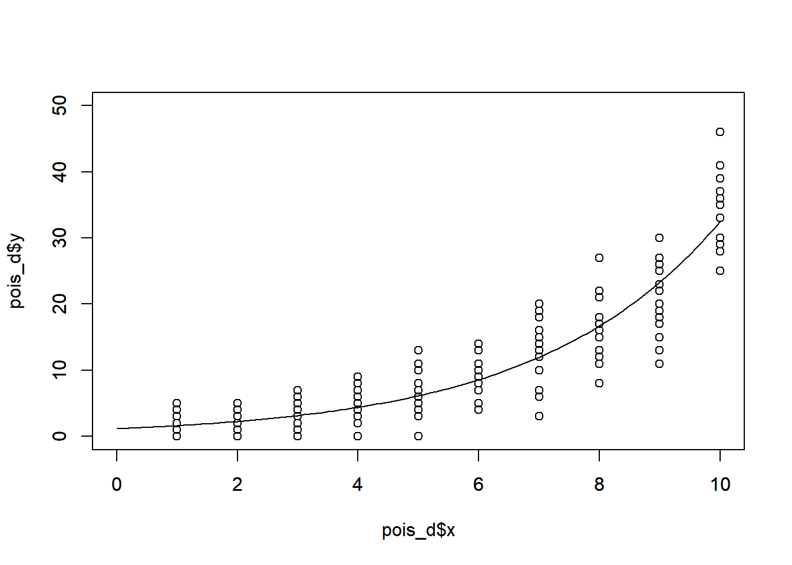](chapter30_files/figure-html/unnamed-chunk-37-1.png)

目的変数がポアソン分布の場合にも、説明変数を`+`でつなぐことで、重回帰のように説明変数を増やすことができます。

``` downlit
glm(y ~ x + fertilizer, data = pois_d, family = "poisson")
## 
## Call:  glm(formula = y ~ x + fertilizer, family = "poisson", data = pois_d)
## 
## Coefficients:
## (Intercept)            x  fertilizer1  
##     0.03425      0.33310      0.22131  
## 
## Degrees of Freedom: 199 Total (i.e. Null);  197 Residual
## Null Deviance:       1847 
## Residual Deviance: 232.7     AIC: 977.8

pois_d |> 
  ggplot(aes(x = x, y = y, color = fertilizer))+
  geom_point()+
  geom_function(fun = \(x){exp(0.03425 + 0.33310 * x)}, color = "red")+
  geom_function(fun = \(x){exp(0.03425 + 0.22131 + 0.33310 * x)}, color = "blue")
```

[](chapter30_files/figure-html/unnamed-chunk-38-1.png)

上の例では、計算結果はcoefficientsから、以下の式となります。fertilizerは0か1ですので、0の時は0.22131×fertilizerの部分が0に、1の時は0.22131となります。

\\ y = exp(0.03425 + 0.33310x + 0.22131 \cdot fertilizer)\\

## 30.7 線形混合モデル

データに繰り返しの測定がある場合、例えば、実験で同じ個体を数日間おきに調べ、データを取るような場合には、個体間のばらつきが大きくて正しい線形回帰を得るのが難しい場合があります。また、線形回帰ではデータの各点は独立の（関連性のない）事象として扱われますが、繰り返しの測定がある場合、例えば同じ個体から繰り返し得られたデータは明確に独立ではありません。

このように、繰り返しがある場合、個体間に正規分布に従うばらつきがあると仮定して回帰を行う方法が、**線形混合モデル（Linear Mixed Model（LMM）またはMixed Model for Repeated Measures（MMRM））**です。線形混合モデルは、切片のみにばらつきがある場合（ランダム切片、下図1参照）と、切片にも傾きにもばらつきがある場合（ランダム傾き）の2つに対応し、それぞれ直線で回帰を計算します。線形混合モデルを用いることで、ランダム切片やランダム傾き（合わせて**ランダム効果**）を回帰の結果（**固定効果**）と分けて評価することで、各個体ごとの回帰結果をうまく評価することができます。

[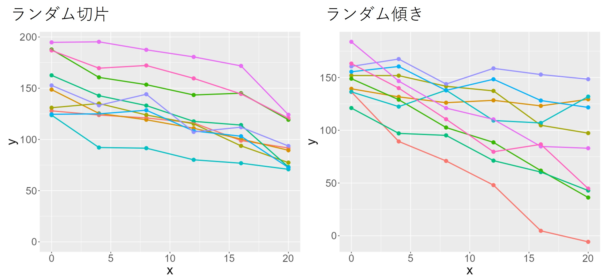](./image/randomeffects.jpg "図1：ランダム切片とランダム傾き")

図1：ランダム切片とランダム傾き

Rで線形混合モデルを計算する場合には、[`nlme`パッケージ](https://cran.r-project.org/web/packages/nlme/index.html) ([Pinheiro et al. 2023](#ref-nlme_bib); [Pinheiro and Bates 2000](#ref-nlme_book))、[`lme4`パッケージ](https://cran.r-project.org/web/packages/lme4/index.html) ([Bates et al. 2015](#ref-lme4_bib))、[`lmerTest`パッケージ](https://cran.r-project.org/web/packages/lmerTest/index.html) ([Kuznetsova et al. 2017](#ref-lmerTest_bib))のいずれかを使うのが一般的です。`lme4`は`nlme`の改良版、`lmerTest`は`lme4`に分散分析の計算方法を追加したパッケージです。どれを用いても大きな差はありませんが、`lme4`と`lmerTest`が使われているのをよく見る印象があります。

以下に線形混合モデルで解析するデータとして、`lme4`パッケージに登録されている`sleepstudy`を用います。この`sleepstudy`は睡眠をとっていない被験者の反応時間を毎日取得したデータです。睡眠をとらない期間が延びると、反応時間が延びていく様子が記録されていますが、被験者ごとに傾きも切片も異なる、ランダム切片＋ランダム傾きを持つように見えるデータとなっています。

``` downlit
# 線形混合モデルのデータ
pacman::p_load(lmerTest)
data("sleepstudy", package = "lme4")
head(sleepstudy)
##   Reaction Days Subject
## 1 249.5600    0     308
## 2 258.7047    1     308
## 3 250.8006    2     308
## 4 321.4398    3     308
## 5 356.8519    4     308
## 6 414.6901    5     308

# DaysとReactionの関係を調べる
ggplot(sleepstudy, aes(x = Days, y = Reaction, color = Subject, alpha = 0.5)) +
  geom_point(size = 2) + 
  theme(legend.position = "none") +
  geom_line()
```

[](chapter30_files/figure-html/unnamed-chunk-39-1.png)

### 30.7.1 ランダム切片モデル

Rで線形混合モデルの計算を行う場合には、`lmerTest`パッケージ（もしくは`lme4`パッケージ）の`lmer`関数を用います。`lmer`関数の使い方は`lm`関数とほぼ同じですが、ランダム切片とランダム傾きの項をformulaで表す必要があります。formulaは`目的変数+説明変数+(ランダム傾き|ランダム切片)`という形で設定し、縦線（`|`）の左にランダム傾き、右にランダム切片の項を入力します。ランダム切片のみの場合には`目的変数+説明変数+(1|ランダム切片)`という形で、ランダム傾きの部分に1を入れます。

``` downlit
lmer_sleepstudy <- lmer(Reaction ~ Days + (1 | Subject), data = sleepstudy)
lmer_sleepstudy %>% summary()
## Linear mixed model fit by REML. t-tests use Satterthwaite's method [
## lmerModLmerTest]
## Formula: Reaction ~ Days + (1 | Subject)
##    Data: sleepstudy
## 
## REML criterion at convergence: 1786.5
## 
## Scaled residuals: 
##     Min      1Q  Median      3Q     Max 
## -3.2257 -0.5529  0.0109  0.5188  4.2506 
## 
## Random effects:
##  Groups   Name        Variance Std.Dev.
##  Subject  (Intercept) 1378.2   37.12   
##  Residual              960.5   30.99   
## Number of obs: 180, groups:  Subject, 18
## 
## Fixed effects:
##             Estimate Std. Error       df t value Pr(>|t|)    
## (Intercept) 251.4051     9.7467  22.8102   25.79   <2e-16 ***
## Days         10.4673     0.8042 161.0000   13.02   <2e-16 ***
## ---
## Signif. codes:  0 '***' 0.001 '**' 0.01 '*' 0.05 '.' 0.1 ' ' 1
## 
## Correlation of Fixed Effects:
##      (Intr)
## Days -0.371
```

### 30.7.2 ランダム傾きモデル

ランダム傾きの項には、傾きを生じる軸（x軸）の値を入力します。上の`sleepstudy`の場合では、`Days`の方向にランダムな傾きが生じるため、ランダム傾きの項に`Days`を指定して計算します。

``` downlit
lmer(Reaction ~ Days + (Days | Subject), sleepstudy) %>% summary()
## Linear mixed model fit by REML. t-tests use Satterthwaite's method [
## lmerModLmerTest]
## Formula: Reaction ~ Days + (Days | Subject)
##    Data: sleepstudy
## 
## REML criterion at convergence: 1743.6
## 
## Scaled residuals: 
##     Min      1Q  Median      3Q     Max 
## -3.9536 -0.4634  0.0231  0.4634  5.1793 
## 
## Random effects:
##  Groups   Name        Variance Std.Dev. Corr 
##  Subject  (Intercept) 612.10   24.741        
##           Days         35.07    5.922   0.07 
##  Residual             654.94   25.592        
## Number of obs: 180, groups:  Subject, 18
## 
## Fixed effects:
##             Estimate Std. Error      df t value Pr(>|t|)    
## (Intercept)  251.405      6.825  17.000  36.838  < 2e-16 ***
## Days          10.467      1.546  17.000   6.771 3.26e-06 ***
## ---
## Signif. codes:  0 '***' 0.001 '**' 0.01 '*' 0.05 '.' 0.1 ' ' 1
## 
## Correlation of Fixed Effects:
##      (Intr)
## Days -0.138
```

### 30.7.3 線形回帰と線形混合モデルの比較

以上のように、線形混合モデルではランダム切片モデルやランダム傾きモデルを用いて回帰を行います。結果のうち、Fixed Effects（固定効果）を線形回帰と比較すると、以下のようになります。

``` downlit
lm_sleepstudy <- lm(Reaction ~ Days, data = sleepstudy) # 線形モデル
llm_ri_sleepstudy <- lmer(Reaction ~ Days + (1 | Subject), data = sleepstudy) # ランダム切片モデル
llm_rs_sleepstudy <- lmer(Reaction ~ Days + (Days | Subject), sleepstudy) # ランダム傾きモデル

# 固定効果はすべて同じ
lm_sleepstudy$coefficients
## (Intercept)        Days 
##   251.40510    10.46729
llm_ri_sleepstudy@beta
## [1] 251.40510  10.46729
llm_rs_sleepstudy@beta
## [1] 251.40510  10.46729
```

見ての通り、線形回帰の結果と線形混合モデル（固定効果）の結果は一致します。また、固定効果の信頼区間は以下の通りとなります。少し信頼区間の形が違いますが、線形回帰も線形混合モデルの固定効果も同じような信頼区間に収まります。要は、線形混合モデルの固定効果の代表値は線形回帰と変わらないことを示しています。

``` downlit
d <- data.frame(Days = seq(0, 9, by = 0.1), Subject = 308)

lm_ci <- 
  data.frame(
    d,
    predict(lm_sleepstudy, d, interval = "confidence"))

llm_ri_ci <- 
  data.frame(
    Days = sleepstudy$Days,
    predict(llm_ri_sleepstudy, re.form = NA, se.fit = TRUE, allow.new.levels = TRUE))

llm_rs_ci <- 
  data.frame(
    Days = sleepstudy$Days,
    predict(llm_rs_sleepstudy, re.form = NA, se.fit = TRUE, allow.new.levels = TRUE))

p1 <- ggplot() +
  geom_ribbon(aes(x = Days, ymax = upr, ymin = lwr), data = lm_ci, color = 1, fill = 1) +
  labs(title = "線形回帰")
p2 <- ggplot() + 
  geom_ribbon(aes(x = Days, ymax = fit + se.fit, ymin = fit - se.fit), data = llm_ri_ci[1:10, ], color = 2, fill = 2) +
  labs(title = "ランダム切片モデル")
p3 <- ggplot() + 
  geom_ribbon(aes(x = Days, ymax = fit + se.fit, ymin = fit - se.fit), data = llm_rs_ci[1:10, ], color = 3, fill = 3) +
  labs(title = "ランダム傾きモデル")

library(patchwork)
p1 + p2 + p3
```

[](chapter30_files/figure-html/unnamed-chunk-43-1.png)

ただし、線形回帰ではデータの間のつながりを仮定していないため、統計としては線形混合モデルを利用したほうがより正しい回帰の結果を得ることができます。

### 30.7.4 coef関数で個別の傾き・切片を求める

線形混合モデルから、`coef`関数を用いて個別の被験者の傾き・切片を求めることができます。線形混合モデルでは、この個別の被験者の傾き・切片を演算するときに、固定効果、つまり他の被験者のデータを「借りて」傾き・切片を計算することで、より正確に個別被験者の傾き・切片を求めることができます。

ランダム切片モデルとランダム傾きモデルでの個別被験者の傾き・切片を求めると、ランダム切片モデルでは傾きが一定、ランダム傾きモデルでは傾きが被験者ごとに変化していることがわかります。始めに述べたランダム切片モデルとランダム傾きモデルの図の通り、ランダム切片モデルでは被験者間の傾きは一定、ランダム傾きモデルでは被験者間の切片も傾きも変化するとしていることが、`coef`関数の返り値に表れています。

``` downlit
# ランダム切片モデル
coef(llm_ri_sleepstudy)$Subject |> head() # Days（傾き）が一定
##     (Intercept)     Days
## 308    292.1888 10.46729
## 309    173.5556 10.46729
## 310    188.2965 10.46729
## 330    255.8115 10.46729
## 331    261.6213 10.46729
## 332    259.6263 10.46729

# ランダム傾きモデル
coef(llm_rs_sleepstudy)$Subject |> head() # Days（傾き）が個々に異なる
##     (Intercept)      Days
## 308    253.6637 19.666262
## 309    211.0064  1.847605
## 310    212.4447  5.018429
## 330    275.0957  5.652936
## 331    273.6654  7.397374
## 332    260.4447 10.195109
```

> **TIP:**
>
> [`lmerTest::lmer`](https://rdrr.io/pkg/lmerTest/man/lmer.html)関数の返り値はS4オブジェクトなので、`@`や`$`を用いて計算結果にアクセスすることができます。また、`coef`関数のような関数（アクセサ）を用いて計算結果にアクセスすることもできます。
>
> ``` downlit
> result_lmer <- lmer(Reaction ~ Days + (Days | Subject), sleepstudy)
> result_lmer@sigma # 残差の標準偏差
> ## [1] 25.5918
>
> anova(result_lmer, type = "I") # type Iの分散分析結果
> ## Type I Analysis of Variance Table with Satterthwaite's method
> ##      Sum Sq Mean Sq NumDF DenDF F value    Pr(>F)    
> ## Days  30031   30031     1    17  45.853 3.264e-06 ***
> ## ---
> ## Signif. codes:  0 '***' 0.001 '**' 0.01 '*' 0.05 '.' 0.1 ' ' 1
> ```

## 30.8 一般化線形混合モデル

線形混合モデルを目的変数が正規分布しない場合に拡張したものが、**一般化線形混合モデル（Generalized Linear Mixed Model、GLMM）**です。Rでは、GLMMを`lme4`パッケージの`glmer`関数で計算することができます。`glmer`関数は`lmer`関数と同じく`lme4`パッケージの関数ですので、`glmer`関数の使い方は基本的に`lmer`関数と同じです。

GLMMの例として、`lme4`パッケージに含まれる`cbpp`（[牛肺疫](https://ja.wikipedia.org/wiki/%E7%89%9B%E8%82%BA%E7%96%AB)にかかった牛のデータ）での計算例を以下に示します。

``` downlit
# cbpp（contagious bovine pleuropneumonia、牛肺疫）に関するデータ
data(cbpp, package = "lme4") 

# herdは牛の群、incidenceは牛肺疫への罹患数、sizeは群内の牛の数、periodは観察時期
head(cbpp) 
##   herd incidence size period
## 1    1         2   14      1
## 2    1         3   12      2
## 3    1         4    9      3
## 4    1         0    5      4
## 5    2         3   22      1
## 6    2         1   18      2

cbpp |> 
  ggplot(aes(x = period |> as.character() |> as.numeric(), y = incidence / size, color = herd)) +
  geom_point() +
  geom_line()
```

[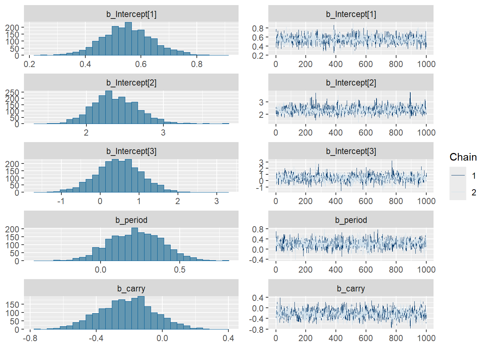](chapter30_files/figure-html/unnamed-chunk-46-1.png)

`glmer`の引数の指定は、`glm`と`lmer`を合わせたような形になります。ですので、`family`引数に目的変数の分布を指定し、ランダム切片、ランダム傾きは、formulaに`(ランダム傾き|ランダム切片)`の形で指定します。演算結果はFixed effectsに示された通り、以下の式となります。

\\ incidance = \frac{1}{1 + exp(-(-0.9323 - 0.5592 \cdot period))}\\

``` downlit
cbind(cbpp$incidence, cbpp$size - cbpp$incidence) |> head() # 左が牛肺疫に罹患した牛、右は罹患していない牛
##      [,1] [,2]
## [1,]    2   12
## [2,]    3    9
## [3,]    4    5
## [4,]    0    5
## [5,]    3   19
## [6,]    1   17

# 一般化線形混合モデル（ランダム切片）
glmer(cbind(incidence, size - incidence) ~ period |> as.numeric() + (1 | herd), family = "binomial", data = cbpp)
## Generalized linear mixed model fit by maximum likelihood (Laplace
##   Approximation) [glmerMod]
##  Family: binomial  ( logit )
## Formula: cbind(incidence, size - incidence) ~ as.numeric(period) + (1 |  
##     herd)
##    Data: cbpp
##       AIC       BIC    logLik -2*log(L)  df.resid 
##  192.5699  198.6459  -93.2849  186.5699        53 
## Random effects:
##  Groups Name        Std.Dev.
##  herd   (Intercept) 0.6635  
## Number of obs: 56, groups:  herd, 15
## Fixed Effects:
##        (Intercept)  as.numeric(period)  
##            -0.9323             -0.5592
```

`lme4`パッケージの他に、RではGLMMの計算に関わるパッケージとして、[`glmm`](https://cran.r-project.org/web/packages/glmm/index.html) ([Knudson 2022](#ref-glmm_bib))や[`MCMCglmm`](https://cran.r-project.org/web/packages/MCMCglmm/index.html) ([Hadfield 2010](#ref-MCMCglmm_bib))などがあります。一般化線形モデル・一般化線形混合モデルについて詳しく知りたい方は[データ解析のための統計モデリング入門](https://www.amazon.co.jp/dp/400006973X)をご一読されるのが良いでしょう。

## 30.9 ベイズモデル

GLMMよりも更に複雑な回帰を行いたい場合には、**ベイズ統計モデリング**というものを用いることになります。ベイズ統計とは、ベイズの法則を用いた統計手法で、複雑な回帰や時系列解析、地理空間情報の解析等に用いられている手法です。

> **TIP:**
>
> ベイズの定理は条件付き確率に関する法則で、以下の式で表されるものです。
>
> \\p(A\|B)=\frac{p(A \cap B)}{p(B)}\\
>
> 上式について、下のベン図（venn plot）を利用して考えることにします。全体で50、Aに20、Bに20、AとBの重なっている部分（これが\\A \cap B\\、AかつB）が15とすると、\\p(A\|B)\\、つまりBの条件のもとでAである確率は、Bである確率\\p(B)=20/50\\、AかつBである確率\\p(A \cap B)=15/50\\から、以下の式で求まります。
>
> \\p(A\|B)=\frac{p(A \cap B)}{p(B)}=\frac{15}{50}/\frac{20}{50}=15/20\\
>
> [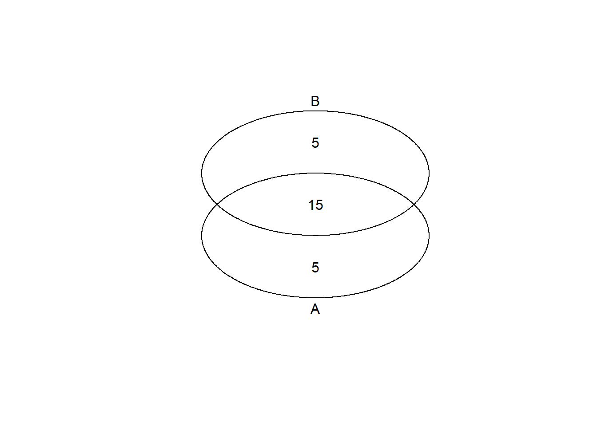](chapter30_files/figure-html/unnamed-chunk-48-1.png)
>
> ベイズの定理は、AとBを入れ替えても当然成り立ちます。
>
> \\p(B\|A)=\frac{p(A \cap B)}{p(A)}\\
>
> 上式の\\p(A\|B)\\と\\p(B\|A)\\では、\\p(A \cap B)\\の部分が共通しています。この\\p(A \cap B)\\で両方の式を解くと、
>
> \\p(A \cap B) = p(A\|B) \cdot p(B) = p(B\|A) \cdot p(A)\\
>
> となります。\\p(A \cap B)\\は無視して、この式を\\p(A\|B)\\について解くと、
>
> \\p(A\|B) = \frac{p(B\|A) \cdot p(A)}{p(B)}\\
>
> という形に変形することができます。ベイズ統計で用いられるのはこちらの式で、この式もベイズの定理と呼ばれます。分母の\\p(B)\\は一旦無視すると、
>
> \\p(A\|B) \propto p(B\|A) \cdot p(A)\\
>
> という形に変形できます。この式を見ると、\\p(A)\\は既知のAの確率、\\p(B\|A)\\はAとBが入れ替わっている、つまり尤度で、尤度と既知の確率の掛け算に条件付き確率\\p(A\|B)\\が比例する、という式になっています。この式のうち、\\p(A)\\を**事前分布**、\\p(B\|A)\\をデータから得られる**尤度**、\\p(A\|B)\\を**事後分布**とします。この式は既知の事前分布とデータから計算できる尤度が分かれば、データが得られた後に更新された事後分布がわかるという、データが取れたときの確率の更新の式として用いられています。
>
> このベイズの法則を用いて、事前分布を仮に置き（無情報事前分布というものを用います）、データの尤度から事後分布を推定するのがベイズ統計モデリングと呼ばれる手法です。ただし、事前分布と尤度から事後分布を数理的に計算するのが難しいため、数理的に計算ができる事前分布である共役事前分布というものを用いたり、乱数計算（Malkov Chain Monte Carlo法：MCMC）を用いて計算します。詳しく学びたい方は[RとStanではじめる ベイズ統計モデリングによるデータ分析入門](https://www.amazon.co.jp/dp/4065165369)や[StanとRでベイズ統計モデリング](https://www.amazon.co.jp/dp/4320112423)を読むのがよいでしょう。

非常に複雑な回帰を行うときや、時系列・空間地理情報の統計において[状態空間モデル](https://logics-of-blue.com/%E7%8A%B6%E6%85%8B%E7%A9%BA%E9%96%93%E3%83%A2%E3%83%87%E3%83%AB%E3%81%A8%E3%81%AF/)というものを利用する場合以外ではベイズモデルを使用することはあまりないと思いますが、ベイズモデルを使って簡単な線形回帰を行うこともできます。

とりあえずベイズ統計を試してみたいのであれば、[`brms`パッケージ](https://paulbuerkner.com/brms/) ([Bürkner 2017](#ref-brms_bib1), [2018](#ref-brms_bib2), [2021](#ref-brms_bib3))を利用するのが良いでしょう。[`brms::brm`](https://paulbuerkner.com/brms/reference/brm.html)関数を用いると、`glm`などと同じように関数を設定し、回帰を行うことができます。

ベイズ統計では、パラメータ（傾きや切片）は事後分布として、幅をもって推定されます。この事後分布の最頻値を**MAP（maximum a posteriori）推定値**と呼び、95%区間などの区間推定値を**ベイズ信用区間**と呼びます。また、`brm`では`prior`引数に事前分布を設定する必要があります。事前分布の設定がおかしいと計算できない場合もありますので、データを見て慎重に事前分布を定める必要があります。

以下の計算の例では、Regression CoefficientsのEstimateが各パラメータのMAP推定値、95% CIがベイズ信用区間となります。

``` downlit
# ベイズモデルでの回帰
pacman::p_load(brms)
fit1 <- brm(rating ~ period + carry + cs(treat),
            data = inhaler, family = sratio("logit"),
            prior = set_prior("normal(0,5)"), chains = 2)
## Compiling Stan program...
## Start sampling
## 
## SAMPLING FOR MODEL 'anon_model' NOW (CHAIN 1).
## Chain 1: 
## Chain 1: Gradient evaluation took 0.000367 seconds
## Chain 1: 1000 transitions using 10 leapfrog steps per transition would take 3.67 seconds.
## Chain 1: Adjust your expectations accordingly!
## Chain 1: 
## Chain 1: 
## Chain 1: Iteration:    1 / 2000 [  0%]  (Warmup)
## Chain 1: Iteration:  200 / 2000 [ 10%]  (Warmup)
## Chain 1: Iteration:  400 / 2000 [ 20%]  (Warmup)
## Chain 1: Iteration:  600 / 2000 [ 30%]  (Warmup)
## Chain 1: Iteration:  800 / 2000 [ 40%]  (Warmup)
## Chain 1: Iteration: 1000 / 2000 [ 50%]  (Warmup)
## Chain 1: Iteration: 1001 / 2000 [ 50%]  (Sampling)
## Chain 1: Iteration: 1200 / 2000 [ 60%]  (Sampling)
## Chain 1: Iteration: 1400 / 2000 [ 70%]  (Sampling)
## Chain 1: Iteration: 1600 / 2000 [ 80%]  (Sampling)
## Chain 1: Iteration: 1800 / 2000 [ 90%]  (Sampling)
## Chain 1: Iteration: 2000 / 2000 [100%]  (Sampling)
## Chain 1: 
## Chain 1:  Elapsed Time: 3.549 seconds (Warm-up)
## Chain 1:                3.157 seconds (Sampling)
## Chain 1:                6.706 seconds (Total)
## Chain 1: 
## 
## SAMPLING FOR MODEL 'anon_model' NOW (CHAIN 2).
## Chain 2: 
## Chain 2: Gradient evaluation took 0.000292 seconds
## Chain 2: 1000 transitions using 10 leapfrog steps per transition would take 2.92 seconds.
## Chain 2: Adjust your expectations accordingly!
## Chain 2: 
## Chain 2: 
## Chain 2: Iteration:    1 / 2000 [  0%]  (Warmup)
## Chain 2: Iteration:  200 / 2000 [ 10%]  (Warmup)
## Chain 2: Iteration:  400 / 2000 [ 20%]  (Warmup)
## Chain 2: Iteration:  600 / 2000 [ 30%]  (Warmup)
## Chain 2: Iteration:  800 / 2000 [ 40%]  (Warmup)
## Chain 2: Iteration: 1000 / 2000 [ 50%]  (Warmup)
## Chain 2: Iteration: 1001 / 2000 [ 50%]  (Sampling)
## Chain 2: Iteration: 1200 / 2000 [ 60%]  (Sampling)
## Chain 2: Iteration: 1400 / 2000 [ 70%]  (Sampling)
## Chain 2: Iteration: 1600 / 2000 [ 80%]  (Sampling)
## Chain 2: Iteration: 1800 / 2000 [ 90%]  (Sampling)
## Chain 2: Iteration: 2000 / 2000 [100%]  (Sampling)
## Chain 2: 
## Chain 2:  Elapsed Time: 3.386 seconds (Warm-up)
## Chain 2:                3.049 seconds (Sampling)
## Chain 2:                6.435 seconds (Total)
## Chain 2:
summary(fit1)
##  Family: sratio 
##   Links: mu = logit 
## Formula: rating ~ period + carry + cs(treat) 
##    Data: inhaler (Number of observations: 572) 
##   Draws: 2 chains, each with iter = 2000; warmup = 1000; thin = 1;
##          total post-warmup draws = 2000
## 
## Regression Coefficients:
##              Estimate Est.Error l-95% CI u-95% CI Rhat Bulk_ESS Tail_ESS
## Intercept[1]     0.55      0.09     0.37     0.74 1.00     2923     1661
## Intercept[2]     2.38      0.30     1.83     2.98 1.01     1631     1235
## Intercept[3]     0.48      0.58    -0.69     1.60 1.00     1687     1330
## period           0.22      0.17    -0.09     0.54 1.00     2571     1548
## carry           -0.22      0.17    -0.55     0.12 1.00     1476     1225
## treat[1]        -0.78      0.24    -1.24    -0.30 1.00     1703     1291
## treat[2]        -1.05      0.61    -2.31     0.07 1.00     1785     1381
## treat[3]         1.16      1.18    -1.17     3.56 1.00     1684     1522
## 
## Further Distributional Parameters:
##      Estimate Est.Error l-95% CI u-95% CI Rhat Bulk_ESS Tail_ESS
## disc     1.00      0.00     1.00     1.00   NA       NA       NA
## 
## Draws were sampled using sampling(NUTS). For each parameter, Bulk_ESS
## and Tail_ESS are effective sample size measures, and Rhat is the potential
## scale reduction factor on split chains (at convergence, Rhat = 1).

# 計算結果をグラフとして表示（ヒストグラムがパラメータの事後分布）
plot(fit1, ask = FALSE)
```

[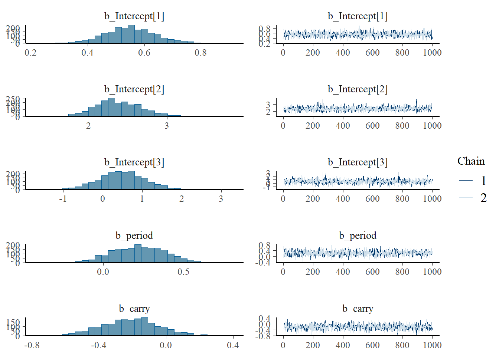](chapter30_files/figure-html/unnamed-chunk-49-1.png)

[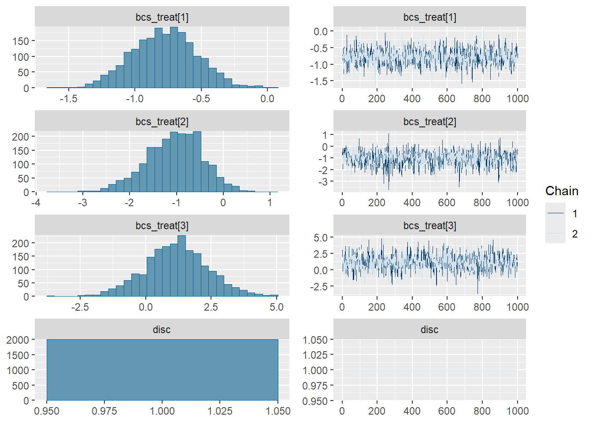](chapter30_files/figure-html/unnamed-chunk-49-2.png)

`brm`関数は[Stan](https://mc-stan.org/) ([Team 2023](#ref-stan_bib))という乱数計算プログラムに依存しています。さらに複雑なベイズ統計を用いる場合には、[rstan](https://cran.r-project.org/web/packages/rstan/index.html) ([Stan Development Team 2023](#ref-rstan_bib))や[CmdStanR](https://github.com/stan-dev/cmdstanr/tree/master)といったパッケージを利用し、Stanの言語で統計モデルを直接記述し、計算する必要があります。興味がある方には教科書（[データ解析のための統計モデリング入門](https://www.amazon.co.jp/dp/400006973X)、[RとStanではじめる ベイズ統計モデリングによるデータ分析入門](https://www.amazon.co.jp/dp/B07WFD5RFS/)や[StanとRでベイズ統計モデリング](https://www.amazon.co.jp/dp/4320112423/)）を読むことをおススメします。

## 30.10 ガウス過程回帰

ガウス過程回帰はベイズの法則を用いて、説明変数xと目的変数yの非線形な関係を回帰する方法です。[ベイズ推定する回帰の方法](https://www.jstage.jst.go.jp/article/isciesci/62/10/62_390/_pdf)ですので、結果は幅を持った形で推定されます([赤穂昭太郎 2018](#ref-akaho2018))。この手法は回帰ではありますが、上記のようなパラメータを求めて数式が得られるような手法ではなく、主に予測的に用いる方法です。`predict`関数を用いて、ある説明変数に対する目的変数の値の予測を行う形で用います。

Rでは、`kernlab`パッケージ([Karatzoglou et al. 2023](#ref-kernlab_bib1), [2004](#ref-kernlab_bib2))の`gausspr`関数を用いて、ガウス過程回帰を計算できます。`gausspr`関数では説明変数、目的変数に当たる変数をそれぞれ`x`、`y`引数に設定して計算します。計算結果は`gausspr`クラスのオブジェクトで、回帰線上の点の位置や標準偏差を求める場合には、`predict`関数を用いることになります。

``` downlit
pacman::p_load(kernlab)
x <- seq(-20, 20, 0.1)
d1 <- data.frame(x = x, y = sin(x) / x + rnorm(401, sd = 0.03))
plot(d1) # 回帰するデータ
```

[](chapter30_files/figure-html/unnamed-chunk-50-1.png)

``` downlit

# これがガウス過程回帰の計算
fit <- gausspr(x = d1$x, y = d1$y, variance.model = T)
## Using automatic sigma estimation (sigest) for RBF or laplace kernel

# 回帰の結果を見てもよくわからない
fit
## Gaussian Processes object of class "gausspr" 
## Problem type: regression 
## 
## Gaussian Radial Basis kernel function. 
##  Hyperparameter : sigma =  15.3468004083976 
## 
## Number of training instances learned : 400 
## Train error : 0.015701622

# xに対する代表値・SDを予測する
d <-data.frame(x, pred = predict(fit, x))
d$sd <- predict(fit, x, type = "sdeviation") 

# 結果をプロット
ggplot()+
  geom_point(data = d1, aes(x = x, y = y, color = 1), size = 1) +
  geom_ribbon(data = d, aes(x = x, ymax = pred + sd, ymin = pred - sd, color = 2, fill = 2), alpha = 0.5)+
  geom_line(data = d, aes(x = x, y = pred, color = 2, alpha = 0.5), linewidth = 1)
## Warning: Removed 1 row containing missing values or values outside the scale range
## (`geom_point()`).
```

[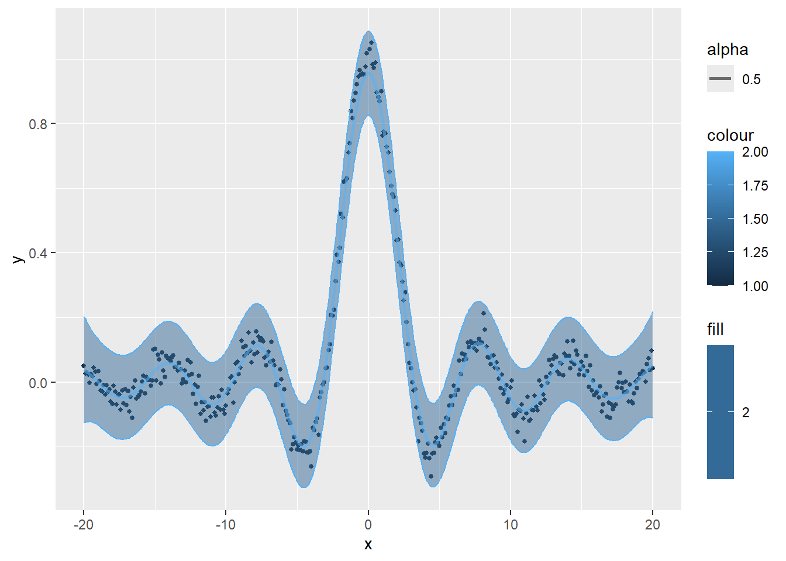](chapter30_files/figure-html/unnamed-chunk-50-2.png)

## 30.11 説明変数がたくさんある場合の回帰

一つの目的変数に対して説明変数が数多く存在する場合には、回帰を行う際に問題が生じることがあります。主に注意が必要となるものは、**過学習**と**多重共線性**の2つです。この2つの問題に対応するため、数多く存在する説明変数から、特に目的変数への影響が大きく、意味がありそうなものを選択する手法がいくつか存在します。以下に、この説明変数の選択（**モデル選択**）を行う手法をいくつか紹介します。

> **TIP:**
>
> 一般線形モデル（重回帰、分散分析）、一般化線形モデル、線形混合モデルのいずれにおいても、説明変数はデータのある限り、いくらでも追加することができます。しかし、説明変数をデータの数と同じだけ設定すると、決定係数は1、つまり、必ずすべての点を通る線となります。例えば、下図のようにExcelで6次の多項式回帰（説明変数が6つに増えている）を行えば、グネグネした曲線ですべての点を通る線を引けることがわかるでしょう。
>
> [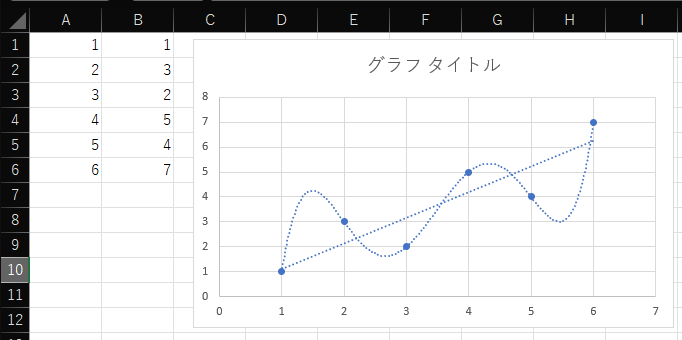](./image/excel_polynomial.png "図：Excelで6次の多項式回帰で線を引く")
>
> 図：Excelで6次の多項式回帰で線を引く
>
> しかし、データの特徴を捉えるという意味では、このグネグネした曲線はあまり役に立ちません。例えば、上の多項式近似ではx=1とx=2の間にピークが一つありますが、このピークが現実的に起こりうるかというと、そういうことはなさそうです。したがって、xの値からyの値を予測する場合、多項式近似の曲線より、すべての点を通らない直線の方が、回帰としては意味がありそうです。
>
> このように、説明変数が多くなると、回帰はデータを示す点を通りやすくなりますが、予測性は失われていきます。このような回帰の特徴のことを**過学習**と呼びます。この過学習を避けるために、説明変数の数はできるだけ多くし過ぎず、かつ必要な説明変数を十分に含めた回帰を行うことが望ましいとされています。

> **TIP:**
>
> 説明変数が多くなると、説明変数の間に相関が生じることがあります。説明変数間に相関があると、説明変数の傾きがうまく求まらなくなる問題、**多重共線性**の問題、というものが生じます。
>
> 多重共線性について直感的に捉えるには、目的変数yの説明変数x₁とx₂に直線的な関係がある場合（相関係数が1の場合）を考えてみると良いでしょう。
>
> 目的変数yとx₁とx₂の2つの説明変数の間に直線的な関係がある場合、以下の式でyを表すことができます。
>
> \\y = ax\_{1} + bx\_{2}\\
>
> aとbは係数（傾き）です。x₁とx₂が独立、つまりx₁とx₂に相関がなければ、y、x₁、x₂の数値の組が2つあれば、aとbを連立方程式で求めることができます。
>
> 一方、x₁とx₂に直線的な関係がある場合には、x₁とx₂の関係は以下の式で表すことができます。
>
> \\x\_{1} = cx\_{2}\\
>
> cは係数です。この時、aとbを求めることを考えて式を変形すると、
>
> \\ y= ax\_{1} + bx\_{2} = ax\_{1} + bcx\_{1} = (a+bc)x\_{1}\\ \\ y= ax\_{1} + bx\_{2} = acx\_{2} + bx\_{2} = (ac+b)x\_{2}\\
>
> となります。この式においてxやyの値が分かれば、a+bcやac+bの値を求めることができます。しかし、この値からわかるのはaとbの関係だけで、aとbを一意に決める、つまりa=◯、b=●といった解を求めることはできません。
>
> この例では説明変数間の関係を非常に単純化していますが、説明変数間に相関があると傾きが求まらなくなる、ということはイメージできるかと思います。
>
> 多重共線性は正確には統計における行列計算に問題が生じることで計算結果が不安定になることを指します。
>
> 多重共線性を避けるためにも説明変数の数を多くしすぎず、互いに相関の無い説明変数だけを選ぶことは重要となります。

## 30.12 AICによるモデル選択

「目的変数を説明するのに必要十分な説明変数」を適切に選ぶことが、説明変数が多い回帰では重要となります。例えば、学生の数学の成績を目的変数として回帰を行うときに、くじ引きで決めた学生の座席の位置を説明変数としても普通は何の意味も無いはずです。したがって、座席の位置は説明変数に入れない方がいいということは直感的にわかるかと思います。

とは言っても、説明変数の組み合わせは説明変数の数が増えると増大していきますし、実際に目的変数に影響を与えうるのかよくわからない説明変数も増えていきます。

説明変数の組み合わせのことを、回帰の**「モデル」**と呼びます。説明変数の組み合わせ、つまり数多くあるモデルから、適切なモデルを選び出すことを、**モデル選択**と呼びます。モデル選択の手法には様々なものがあります。最もよく知られているモデル選択の方法は、**AIC（赤池情報量基準、Akaike’s Information Criterion）**によるモデル選択([Akaike 1998](#ref-akaike1998information))です。

AICは、最尤推定の際に用いる尤度（likelyhood）に、説明変数の数をペナルティとして与えた数値です。AICは以下の計算式で求めることができます。

\\ AIC = -\ln(Likelyhood) + 2 \cdot K \\

上式で、\\\ln(Likelyhood)\\は対数尤度、Kは説明変数の数を示します。AICによるモデル選択では、**AICが小さいモデルほど、目的変数をうまく説明できている**として、AICを最小にするモデルを選択します。説明変数の数の2倍を足し算していることで、説明変数がたくさん含まれるモデルにはAICが大きくなるペナルティが付く、つまり選ばれにくくなります。

一般化線形モデルを計算する`glm`関数を用いると、AICの計算結果を得ることができます。例えば、以下の例では`iris`の`Sepal.Length`を回帰する7つのモデル、説明変数の組み合わせ、のAICを計算しています。AICの結果から、最後のモデル、3つ説明変数があるモデルでAICが最小となる、つまりこの3つ説明変数があるモデルを選択するということになります。

``` downlit
c(
  glm(Sepal.Length ~ Sepal.Width, data = iris, family = "gaussian") |> _$aic,
  glm(Sepal.Length ~ Petal.Length, data = iris, family = "gaussian") |> _$aic,
  glm(Sepal.Length ~ Petal.Width, data = iris, family = "gaussian") |> _$aic,
  glm(Sepal.Length ~ Sepal.Width + Petal.Length, data = iris, family = "gaussian") |> _$aic,
  glm(Sepal.Length ~ Petal.Length + Petal.Width, data = iris, family = "gaussian") |> _$aic,
  glm(Sepal.Length ~ Sepal.Width + Petal.Width, data = iris, family = "gaussian") |> _$aic,
  glm(Sepal.Length ~ Sepal.Width + Petal.Length + Petal.Width, data = iris, family = "gaussian") |> _$aic
)
## [1] 371.99167 160.04042 208.22145 101.02550 158.04682 191.82071  84.64272
```

説明変数が3つぐらいなら\\\_{3}C\_{1} +\_{3}C\_{2}+\_{3}C\_{3}\\、つまり7通りのモデルについてAICを調べればモデル選択を行うことができますが、例えば説明変数が20個あれば、1048575通りと膨大なモデルを比較する必要があります。モデルに交互作用を加えると、更に多くの比較が必要となります。

このような煩雑なAICの計算のために、RにはAICによるモデル選択を自動的に行ってくれる関数である、`step`関数が備わっています。`lm`や`glm`に説明変数をすべて含むformula（**フルモデル**）を設定し、その返り値を`step`関数の引数とすることで、各モデルのAICを自動的に比較し、AIC最小モデルを選択してくれます。

``` downlit
# 回帰の返り値をlm_irisに代入
lm_iris <- 
  lm(iris$Sepal.Length ~ 
       iris$Sepal.Width + 
       iris$Petal.Length + 
       iris$Petal.Width + 
       iris$Species)

# 下の例ではフルモデル（説明変数をすべて含むモデル）が選択されている
# trace = 1とすると、AIC選択の過程が表示される
step(lm_iris, trace = 0) 
## 
## Call:
## lm(formula = iris$Sepal.Length ~ iris$Sepal.Width + iris$Petal.Length + 
##     iris$Petal.Width + iris$Species)
## 
## Coefficients:
##            (Intercept)        iris$Sepal.Width       iris$Petal.Length  
##                 2.1713                  0.4959                  0.8292  
##       iris$Petal.Width  iris$Speciesversicolor   iris$Speciesvirginica  
##                -0.3152                 -0.7236                 -1.0235
```

> **TIP:**
>
> AIC以外にも、モデル選択の指標となる情報量規準にはBIC（Baysian information criterion）などがあります。step関数ではk=log(n)を指定するとBICでのモデル選択を行うこともできます。他の情報量規準については[WikipediaのModel Selectionのページ](https://en.wikipedia.org/wiki/Model_selection#Criteria)に記載があります。

## 30.13 スパース回帰

AICによるモデル選択はわかりやすく単純ですが、説明変数が多くなると、上記のようにどうしても繰り返し計算回数が多くなり、計算コストがかかるようになります。説明変数が10個ぐらいならまだ何とかなりますが、現代のデータでは説明変数の数が非常に多い場合もあります。あまりに説明変数が多いと、AICによるモデル選択ではモデルを最適化するのに時間がかかってしまいます。

このような場合に、ある程度自動的にモデル選択を行うような回帰のことを**スパース回帰**と呼びます。スパース回帰は、二乗誤差を計算する際に、正則化項というものを加えることで、各説明変数の傾きを調整する回帰の方法です[^1]。正則化項の入れ方によって、スパース回帰は**リッジ回帰**、**ラッソ回帰**と、**エラスティックネット**と呼ばれる手法の3つに分かれます。

Rでスパース回帰を行う場合には、[glmnetパッケージ](https://cran.r-project.org/web/packages/glmnet/index.html) ([Friedman et al. 2010](#ref-glmnet_bib1); [Simon et al. 2011](#ref-glmnet_bib2); [Tay et al. 2023](#ref-glmnet_bib3))を用います。

``` downlit
## スパース回帰のパッケージ（mlbenchはデータセットを読み込むためにロード）
pacman::p_load(glmnet, mlbench)
```

`BostonHousing`は[18章](chapter18.llms.md#bostonhousing)で説明した通り、1970年国勢調査（センサス）におけるボストンの各地域の住宅価格と、その地域の犯罪率、非小売業の面積の割合、築年数の古い建物の割合、高速道路までのアクセス、税金等を表にしたものです。重回帰の例として、住宅価格をその他のデータで説明する、つまり住宅価格を目的変数、その他のデータを説明変数として用いられることの多いデータです。

この`BousonHousing`を用いて、AICによるモデル選択とスパース回帰を比較していきます。

``` downlit
data("BostonHousing")
head(BostonHousing) # データにmlbenchパッケージのBostonHousingを用いる
##      crim zn indus chas   nox    rm  age    dis rad tax ptratio      b lstat
## 1 0.00632 18  2.31    0 0.538 6.575 65.2 4.0900   1 296    15.3 396.90  4.98
## 2 0.02731  0  7.07    0 0.469 6.421 78.9 4.9671   2 242    17.8 396.90  9.14
## 3 0.02729  0  7.07    0 0.469 7.185 61.1 4.9671   2 242    17.8 392.83  4.03
## 4 0.03237  0  2.18    0 0.458 6.998 45.8 6.0622   3 222    18.7 394.63  2.94
## 5 0.06905  0  2.18    0 0.458 7.147 54.2 6.0622   3 222    18.7 396.90  5.33
## 6 0.02985  0  2.18    0 0.458 6.430 58.7 6.0622   3 222    18.7 394.12  5.21
##   medv
## 1 24.0
## 2 21.6
## 3 34.7
## 4 33.4
## 5 36.2
## 6 28.7

# 前処理
tempBoston <- BostonHousing
tempBoston$chas <- as.numeric(tempBoston$chas)
```

### 30.13.1 データの正規化

説明変数である地域の犯罪率、非小売業の面積の割合、築年数の古い建物の割合、高速道路までのアクセス、税金等は単位も値もまちまちで、データによって1000倍以上も値が異なります。このような大きく値が異なる説明変数を用いて回帰を行うと、傾き（係数）の単位が大きく異なることとなり、どの説明変数が目的変数に影響を与えているのか、分かりにくくなります。

このように、説明変数の桁や平均値等が大きく異なる場合には、まずデータを**正規化（normalization）**します。**正規化とは、データの平均値が0、標準偏差が1となるように、データを変換すること**を指します。このようなデータの変換を行うことで、説明変数間の桁や平均値を統一し、傾きの意味を理解しやすくすることができます。上記の重回帰や一般化線形モデルなどでも同様に、データをあらかじめ正規化しておくことは重要となります。

Rでデータの正規化を行う場合には、`scale`関数を用います。`scale`関数はベクターもしくはデータフレームを引数に取り、ベクターの場合はそのベクターの平均と標準偏差を、データフレームの場合には列ごとの平均と標準偏差をそれぞれ0、1に変換します。

``` downlit
# 説明変数になるデータをscale関数で正規化
tempBoston[1:13] <- tempBoston[1:13] |>  scale()

# 平均が0、標準偏差が1になる
tempBoston[1:13] |> apply(2, mean) |> round(digits = 3)
##    crim      zn   indus    chas     nox      rm     age     dis     rad     tax 
##       0       0       0       0       0       0       0       0       0       0 
## ptratio       b   lstat 
##       0       0       0
tempBoston[1:13] |> apply(2, sd)
##    crim      zn   indus    chas     nox      rm     age     dis     rad     tax 
##       1       1       1       1       1       1       1       1       1       1 
## ptratio       b   lstat 
##       1       1       1
```

### 30.13.2 AICでモデルを選択する

まずは、`step`関数でAICを最小とするモデルの選択を行います。`step`関数の引数は`lm`関数や`glm`関数の返り値ですので、まずは説明変数をすべて使ったフルモデルの`lm`関数の返り値が必要となります。

ただし、あまりに説明変数が多いと、一つづつ`+`でつなぐのは大変です。Rでは、formulaの右辺、説明変数の欄に`.`（ピリオド）を入力すると、データフレームのうち、目的変数以外のすべての列を説明変数とすることができます。以下の例では、`BousonHousing`の`medv`（家の価格のデータ）を目的変数、その他の列のデータをすべて説明変数とした`lm`関数の返り値を`lm_model`に代入しています。

この`lm_model`を用いて`step`関数でモデル選択をすると、下記のように切片（intercept）を除いて11個の説明変数の傾きが計算されます。この`step`関数の計算過程で、`indus`と`age`、非小売業の面積の割合と築年数の古い建物の割合の項が抜けていることがわかります。

``` downlit
colnames(tempBoston) # medvを除くと13列のデータになっている
##  [1] "crim"    "zn"      "indus"   "chas"    "nox"     "rm"      "age"    
##  [8] "dis"     "rad"     "tax"     "ptratio" "b"       "lstat"   "medv"

# とりあえずlmとStepでやってみる
# 説明変数を.で指定すると、目的変数以外のすべてのデータを説明変数に設定する
lm_model <- lm(medv ~ ., data = tempBoston)
step(lm_model, trace = 0)
## 
## Call:
## lm(formula = medv ~ crim + zn + chas + nox + rm + dis + rad + 
##     tax + ptratio + b + lstat, data = tempBoston)
## 
## Coefficients:
## (Intercept)         crim           zn         chas          nox           rm  
##     22.5328      -0.9325       1.0692       0.6905      -2.0135       2.6711  
##         dis          rad          tax      ptratio            b        lstat  
##     -3.1432       2.6088      -1.9850      -2.0492       0.8482      -3.7316
```

### 30.13.3 ラッソ回帰

同様の回帰をスパース回帰の一つである**ラッソ（lasso）回帰**を用いて行います。

スパース回帰では、まず正規化項の係数（λ、ラムダ）というものを求める必要があります。このλを求めるための関数が、`glmnet`パッケージの`cv.glmnet`関数です。

`cv.glmnet`関数はformulaを引数に取らず、引数`x`に各列が説明変数である行列、引数`y`に目的変数であるベクターを指定します。さらに、`glm`関数と同様に目的変数の分布として`family`引数、ラッソ回帰を指定するための引数である`alpha=1`をそれぞれ指定します。

この`cv.glmnet`関数の返り値（下の例では`cvlasso_m`）を`plot`関数の引数に取ると、Mean-squared error（平均2乗誤差）とラムダの関係を示したグラフが表示されます。このグラフのうち、縦線が引いてある2本のうちラムダの小さい方の値を、正規化項の係数λとして採用します。ですので、下の`BousonHousing`の例では、log(λ)=-3.7付近の値をλとして採用し、ラッソ回帰を行うこととなります。

この-3.7の点線の上側には、11と記載されています。この11は選択された説明変数の数を示しています。つまり、λを点線の値に指定すると、ラッソ回帰で11個の説明変数が選択され、2つが落とされるということになります。

``` downlit
# ラッソ回帰：正規化項の係数を求める
# 乱数計算を含むため、seedを設定しないと計算値は変化する
cvlasso_m <- 
  cv.glmnet(
    x = tempBoston[,1:13] |> as.matrix(), 
    y = tempBoston$medv, 
    family = "gaussian", 
    alpha = 1)

# 左側の点線のラムダを採用する
plot(cvlasso_m)
```

[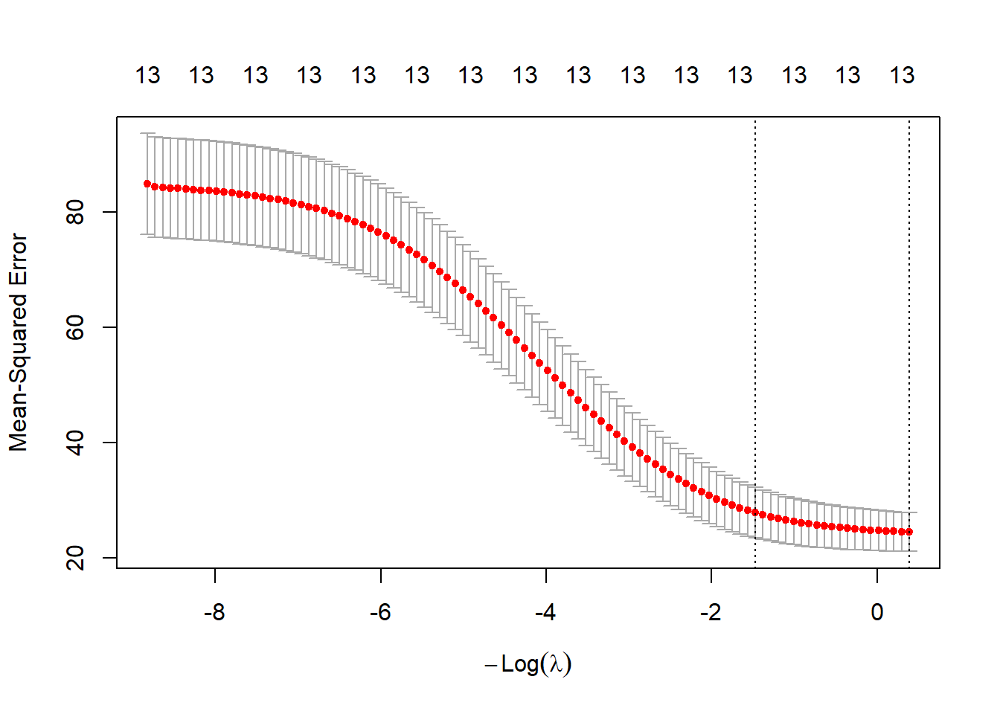](chapter30_files/figure-html/unnamed-chunk-57-1.png)

``` downlit

# 大きい方のlog(λ)の点線の値
cvlasso_m$lambda.1se |> log() 
## [1] -0.7843475

# 小さい方のlog(λ)の点線の値（こちらを採用する）
cvlasso_m$lambda.min |> log() 
## [1] -3.761427
```

ラッソ回帰の計算は`glmnet`関数で行います。`glmnet`関数の引数はほぼ`cv.glmnet`関数と同じです。ラムダを指定せずに`glmnet`関数での計算を行うと、正規化項の大きさ（L1 norm）やラムダと傾きの関係を求めることができます。この関係を求めるときには、`glmnet`関数の返り値を`plot`関数の引数とします。ラムダとの関係を知りたい場合には`plot`関数の引数に`xvar="lambda"`を追加します。グラフの上に表示される数値は選択される説明変数の数を示しています。lambdaが大きく、L1 normが小さくなるとグラフは0に収束していきますが、これはlambdaとL1 normに従い、傾きが0、つまり説明変数から脱落するものが多くなっていくことを示しています。

``` downlit
# ラッソ回帰：正規化項の係数を入力せずに計算
lasso_m <- 
  glmnet(x = tempBoston[,1:13], 
         y = tempBoston$medv, 
         family = "gaussian", 
         alpha = 1)

# 正則化項（L1）の大きさと傾き
plot(lasso_m)
```

[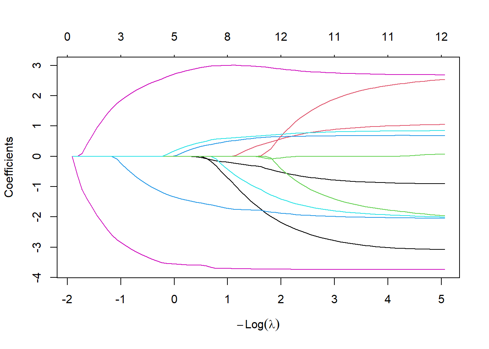](chapter30_files/figure-html/unnamed-chunk-58-1.png)

`cv.glmnet`関数でλを計算した値がある場合、`glmnet`関数の`lambda`引数に`cv.glmnet`関数で計算したλの値を指定します。

この`glmnet`関数の結果をそのまま見てもよくわかりませんが、返り値はS4オブジェクトとなっており、`$`を用いて情報を取り出すことができます。傾きは`$beta`で呼び出すことができます。

``` downlit
# ラッソ回帰：正規化項の係数を入力して計算
lasso_m2 <- 
  glmnet(x = tempBoston[,1:13], 
         y = tempBoston$medv, 
         family = "gaussian", 
         lambda = cvlasso_m$lambda.min, 
         alpha = 1)

# モデルと自由度、ラムダ等が帰ってくる
lasso_m2
## 
## Call:  glmnet(x = tempBoston[, 1:13], y = tempBoston$medv, family = "gaussian",      alpha = 1, lambda = cvlasso_m$lambda.min) 
## 
##   Df  %Dev  Lambda
## 1 11 74.03 0.02325

# 傾きの項（.は傾き0になっている）
lasso_m2$beta
## 13 x 1 sparse Matrix of class "dgCMatrix"
##                 s0
## crim    -0.8613197
## zn       0.9868506
## indus    .        
## chas     0.6831620
## nox     -1.9105597
## rm       2.7080499
## age      .        
## dis     -2.9772626
## rad      2.2733465
## tax     -1.7162450
## ptratio -2.0187590
## b        0.8280071
## lstat   -3.7318761
```

上記の結果を見ると、`indus`と`age`の結果（s0）が`.`（ピリオド）になっています。この`.`は傾きが0、つまりモデルに組み込まないことを示しています。`step`関数で落とされた`indus`と`age`がラッソ回帰でも落とされていることがわかります。また、`rm`の傾きが大きく、`lstat`の傾きが小さいことがわかります。`rm`は1住居あたりの部屋数、`lstat`は地位の低い住民の割合ですので、住宅価格は部屋数が増えると高くなり、地位の低い住民の割合が増えると下がる傾向にあることがわかります。

### 30.13.4 リッジ回帰

**リッジ（ridge）回帰**は正規化項の種類（L2正規化項）がラッソ回帰（L1正規化項）とは異なる、スパース回帰の一つです。リッジ回帰では、AICによるモデル選択やラッソ回帰とは異なり、説明変数の選択は行われません。リッジ回帰は多重共線性がある、説明変数同士に相関がある場合に、妥当な傾きを計算するのに有用な方法です。

リッジ回帰の場合にもラッソ回帰と同様に、`cv.glmnet`関数でλを計算した上で、`glmnet`関数で傾きを求めます。ただし、リッジ回帰を行うときには引数`alpha`に`0`を指定します。

``` downlit
cvridge_m <- 
  cv.glmnet(
    x = tempBoston[,1:13] |> as.matrix(), 
    y = tempBoston$medv, 
    family = "gaussian", 
    alpha = 0)

plot(cvridge_m)
```

[](chapter30_files/figure-html/unnamed-chunk-60-1.png)

``` downlit

cvridge_m$lambda.min %>% log
## [1] -0.3889541
```

ラッソ回帰ではグラフの上の数値が左に行くほど減っていきますが、リッジ回帰では減っていかない、つまり説明変数が落とされることはないことがわかります。

``` downlit
ridge_m <- 
  glmnet(
    x=tempBoston[,1:13], 
    y=tempBoston$medv, 
    family="gaussian", 
    lambda=cvridge_m$lambda.min, 
    alpha=0)

ridge_m$beta
## 13 x 1 sparse Matrix of class "dgCMatrix"
##                 s0
## crim    -0.7561128
## zn       0.7604566
## indus   -0.2629449
## chas     0.7373398
## nox     -1.3911543
## rm       2.8204203
## age     -0.1087290
## dis     -2.3602985
## rad      1.3423202
## tax     -0.9656940
## ptratio -1.8528966
## b        0.8278717
## lstat   -3.3676987
```

`cv.glmnet`関数で計算したラムダを代入して実際に係数を確認すると、ラッソ回帰では.で表示されていた`indus`と`age`も0にはなっておらず、説明変数から外されていないことがわかります。

### 30.13.5 エラスティックネット

エラスティックネットは、ラッソ回帰とリッジ回帰を混ぜ合わせたような、中間的なスパース回帰です。エラスティックネットはラッソ寄り、リッジ寄りのスパース回帰として設定することができます。このラッソ寄り、リッジ寄りの設定は、`alpha`引数の値で指定し、`alpha`が1に近いとラッソ寄り、0に近いとリッジ寄りの回帰となります。下の例では`alpha`を0.5としていますが、実際にデータに用いる場合には`alpha`の値を最適化して用います。このように、計算においてある程度自分で最適化が必要となるパラメータのことを機械学習の分野では**ハイパーパラメータ**と呼びます。

``` downlit
# 実際にはアルファを最適化して利用する
cven_m <- 
  cv.glmnet(
    x = tempBoston[,1:13] |> as.matrix(), 
    y = tempBoston$medv, 
    family = "gaussian", 
    alpha = 0.5)

plot(cven_m)
```

[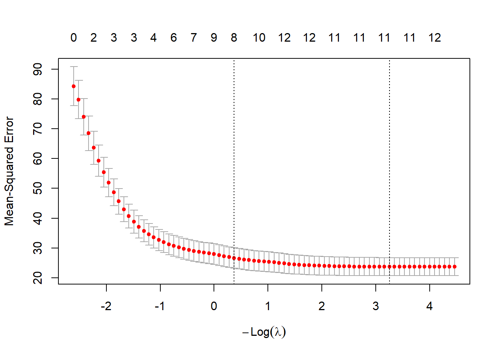](chapter30_files/figure-html/unnamed-chunk-62-1.png)

``` downlit

# ラムダを計算する
cven_m$lambda.min %>% log
## [1] -3.254348

# 計算したラムダを用いて回帰の計算を行う
en_m <- 
  glmnet(
    x = tempBoston[,1:13], 
    y = tempBoston$medv, family="gaussian", 
    lambda = cven_m$lambda.min, 
    alpha = 0.5)

en_m$beta
## 13 x 1 sparse Matrix of class "dgCMatrix"
##                 s0
## crim    -0.8651428
## zn       0.9889952
## indus    .        
## chas     0.6861788
## nox     -1.9085252
## rm       2.7102035
## age      .        
## dis     -2.9719136
## rad      2.2740296
## tax     -1.7165457
## ptratio -2.0179396
## b        0.8311844
## lstat   -3.7217537
```

## 30.14 主成分回帰

説明変数間に相関があると多重共線性の問題が起こります。ですので、説明変数をうまく変換して説明変数間の相関をなくしてやれば、多重共線性の問題なく回帰を行うことができます。

データ変換のうち、**主成分分析（Primary Component Analysis、PCA）**は多次元のデータの特徴を捉えるために用いられる手法の一つです（[32章](chapter32.llms.md#主成分分析)を参照）。詳細は省きますが、主成分分析で変換すると、変換後のデータ（第一主成分、第二主成分…）の間の相関係数が0、つまり相関のない状態になります。この性質を用いて、説明変数を主成分分析でデータ変換したものを回帰の説明変数に用いることで多重共線性を避けて回帰を行う方法のことを**主成分回帰（Primary Component Regression、PCR）**と呼びます。

主成分回帰では、まず説明変数を主成分分析を用いて、主成分に変換します。この変換した主成分を用いて目的変数を説明する回帰を行います。主成分への変換に伴い、元の説明変数と目的変数の関係が不明瞭になりますので、回帰をデータの説明に使うのには適していませんが、この回帰の結果を目的変数の予測に用いることができます。

Rでは、主成分分析は`prcomp`関数で行います。`prcomp`の返り値は主成分への変換を行うための`prcomp`クラスのオブジェクトで、主成分は`$x`で取り出します。後は`lm`関数で説明変数に主成分を指定して回帰を行うだけです。

`$rotation`でデータを主成分に変換する際の係数が求まります。また、説明変数を主成分に変換する際には`predict`関数を用います。`predict`関数の第一引数に`prcomp`オブジェクトを、第二引数に変換したいデータをデータフレームで指定します。計算した主成分を、`lm`オブジェクトを用いた`predict`関数に与えて予測すれば、主成分回帰による予測値を得ることができます。

``` downlit
# 主成分への変換
pc <- iris[,2:4] |> prcomp(scale = T)

pc$x |> head() # 変換後の主成分（PC1～PC3）
##            PC1        PC2          PC3
## [1,] -2.124839 -0.1397433  0.008370721
## [2,] -1.645199  0.9004078 -0.054584971
## [3,] -1.873778  0.4988220 -0.070033694
## [4,] -1.704404  0.6779030 -0.001362832
## [5,] -2.220767 -0.3477735  0.020961859
## [6,] -2.231416 -1.1033118 -0.001635822

pc$rotation # 主成分への変換の係数
##                     PC1        PC2         PC3
## Sepal.Width  -0.4181177 -0.9067335  0.05488053
## Petal.Length  0.6482670 -0.2555198  0.71725833
## Petal.Width   0.6363391 -0.3354757 -0.69464280

# 目的変数をデータフレームに付け加える
pc1 <- pc$x |>  as.data.frame()
pc1$Sepal.Length <- iris$Sepal.Length

# 主成分で回帰（主成分4つをすべて用いる）
pcr_lm <- lm(Sepal.Length ~., data = pc1)

# 予測の例
example_iris <- data.frame(Sepal.Width = 5, Petal.Length = 6, Petal.Width = 3)

# 予測に用いる説明変数を主成分に変換
pc_example <- predict(pc, example_iris)
pc_example
##            PC1       PC2        PC3
## [1,] 0.4630155 -5.158362 -0.4854335

# 主成分を用いて予測値を計算
predict(pcr_lm, pc_example |> as.data.frame())
##        1 
## 7.695527
```

主成分回帰は[`pls`パッケージ](https://cran.r-project.org/web/packages/pls/index.html) ([Liland et al. 2023](#ref-pls_bib))の`pcr`関数を用いても行うことができます。

``` downlit
pacman::p_load(pls)
data(yarn)

# PCRの計算（ncompは回帰に用いる主成分の数）
yarn.pcr <- pcr(density ~ NIR, ncomp = 6, data = yarn, validation = "CV") 
yarn.pcr |> summary() # 回帰結果の表示
## Data:    X dimension: 28 268 
##  Y dimension: 28 1
## Fit method: svdpc
## Number of components considered: 6
## 
## VALIDATION: RMSEP
## Cross-validated using 10 random segments.
##        (Intercept)  1 comps  2 comps  3 comps  4 comps  5 comps  6 comps
## CV           27.46    26.84    3.947    2.598    2.594    1.623   0.4685
## adjCV        27.46    28.72    3.930    2.565    2.618    1.527   0.4578
## 
## TRAINING: % variance explained
##          1 comps  2 comps  3 comps  4 comps  5 comps  6 comps
## X          52.17    98.60    99.47    99.70    99.88    99.97
## density     5.50    98.15    99.40    99.58    99.95    99.99
```

## 30.15 部分的最小二乗回帰

**部分的最小二乗回帰（Partial Least Squares regression、PLS回帰）**は主成分回帰（PCR）と同じく説明変数を変換して回帰を行う方法ですが、変換を行う際に、目的変数と変換後の説明変数の間の共分散が大きくなるよう調整することで、多重共線性の問題をより小さくすることができます。

PLS回帰は分析化学の分野で、吸光度などのデータから目的変数、例えば物質の濃度など、を予測するために開発され、用いられています。吸光度のデータでは、一般的に1検体につき波長ごとの吸光度として1000以上の値が求まりますので、目的変数（1検体に1濃度）に対して非常に多くの説明変数（1検体につき、1000以上の吸光度の数値）がある、つまり多重共線性が非常に起こりやすいデータとなっています。説明変数をPCRよりもうまく変換することで、この多重共線性の問題を起こりにくくした手法がこのPLSです。

### 30.15.1 PLS：データの準備とクロスバリデーション

RのPLS回帰の計算では、機械学習でよく用いられる**クロスバリデーション**という方法が用いられます。クロスバリデーションとは、手持ちのデータを**訓練データ**と**検証データ（テストデータ）**の2つに分割し、訓練データを用いて回帰を行い、テストデータで回帰の精度を評価する方法のことです。クロスバリデーションを行うことで、訓練データに用いていない、新規データでの予測精度を評価することができます。

PLS回帰に用いる、以下の`yarn`のデータセットは、PET yarn（ポリエステル糸）の近赤外吸光分光データ（Near Infra Red、[NIR](https://ja.wikipedia.org/wiki/%E8%BF%91%E8%B5%A4%E5%A4%96%E7%B7%9A%E5%88%86%E5%85%89%E6%B3%95)）と糸の密度（`density`）の関係を示したデータです。このデータセットでは、予めクロスバリデーション用に`train`という列が追加されており、21行が`TRUE`、つまり訓練データで、残りの7行が`FALSE`、つまりテストデータとなっています。

``` downlit
# yarnはplsパッケージのデータセット
pacman::p_load(pls)
data(yarn) # ポリエステル繊維のNIR（近赤外吸収）データ
colnames(yarn) # NIRにはNIR.1～NIR.268の列が登録
## [1] "NIR"     "density" "train"

dim(yarn)
## [1] 28  3

summary(yarn$train) # 21データが訓練、7データがテストデータ
##    Mode   FALSE    TRUE 
## logical       7      21
```

Rでは、[`pls`](https://cran.r-project.org/web/packages/pls/index.html)パッケージの`plsr`関数を用いてPLS回帰を行うことができます。`plsr`関数の第一引数はformulaです。`ncomp`引数は回帰に用いる説明変数変換後のパラメータの数で、増やすとデータへの適合度は高くなりますが、過学習のリスクも大きくなります。

`validation`には用いるバリデーションの方法を指定します。`validation="CV"`では、`train`の列の論理型を用いてクロスバリデーションを行います。leave-one-outと呼ばれる、データの一つだけをテストデータとして、その他のデータを訓練データとする場合には、`validation="LOO"`と指定します。

``` downlit
yarn.pls <- 
  plsr(
    density ~ NIR, 
    ncomp = 6, 
    data = yarn, 
    validation = "CV")
yarn.pls |> summary()
## Data:    X dimension: 28 268 
##  Y dimension: 28 1
## Fit method: kernelpls
## Number of components considered: 6
## 
## VALIDATION: RMSEP
## Cross-validated using 10 random segments.
##        (Intercept)  1 comps  2 comps  3 comps  4 comps  5 comps  6 comps
## CV           27.46    5.054    4.139    2.125   0.9281   0.4785   0.4443
## adjCV        27.46    4.603    4.228    2.103   0.8741   0.4706   0.4366
## 
## TRAINING: % variance explained
##          1 comps  2 comps  3 comps  4 comps  5 comps  6 comps
## X          46.83    98.38    99.46    99.67    99.85    99.97
## density    98.12    98.25    99.64    99.97    99.99    99.99
```

PLS結果を用いた予測には、`predict`関数を用います。`predict`関数の第一引数に`plsr`関数の返り値、`comps`引数には上の`yarn.pls|>summary()`の結果として示されている`comps`のうち、回帰に用いるものを指定します。通常は`plsr`関数の`ncomp`に指定した数値までのベクターで指定することになります。`newdata`には予測したいデータのデータフレームを指定します。

``` downlit
# モデルにデータを与えてpredictすることで用いる
result_prediction <- predict(
  yarn.pls, 
  comps = 1:6, 
  newdata = yarn[!yarn$train,])

# 左がテストデータ、右が予測値
data.frame(test_data = yarn[!yarn$train,]$density, result_prediction) |> 
  knitr::kable()
```

|     | test_data |  density |
|:----|----------:|---------:|
| 110 |     51.04 | 51.10466 |
| 22  |     50.32 | 50.34328 |
| 31  |     32.14 | 32.29764 |
| 41  |     34.69 | 34.55275 |
| 51  |     30.30 | 30.04395 |
| 61  |     20.45 | 20.54823 |
| 71  |     20.06 | 19.86822 |

回帰からの予測の結果が上の表となります。左の列がテストデータの測定値、右のデータがPLSからの予測値です。概ねどのサンプルでも`density`が正しく予測されているのがわかるかと思います。

## 30.16 ニューラルネットワーク（回帰）

より機械学習的に、予測的な回帰を行う方法が、**ニューラルネットワーク（Neural Network）**です。ニューラルネットワークはその名の通り、神経細胞の構造を真似たような形でデータを学習し、予測を行うことができる手法です。ニューラルネットワークには回帰の他に、分類も行うことができます。分類に関するニューラルネットワークについては、[次の章](chapter31.llms.md#ニューラルネットワーク)で説明します。

ニューラルネットワークは今（2023年）をときめくChatGPTなどの生成AIの根幹技術の一つで、ニューラルネットワークを発展させたディープニューラルネットワーク（DNN）が生成AIの一部に用いられています。

> **TIP:**
>
> ニューラルネットワークの基本単位は、**単純パーセプトロン**と呼ばれるものです。単純パーセプトロンとは以下の図で示すように、a₁、a₂、a₃のデータが与えられたとき、それぞれのデータに**重み（w）**を掛け、**バイアス（b）**を足したものです。
>
> [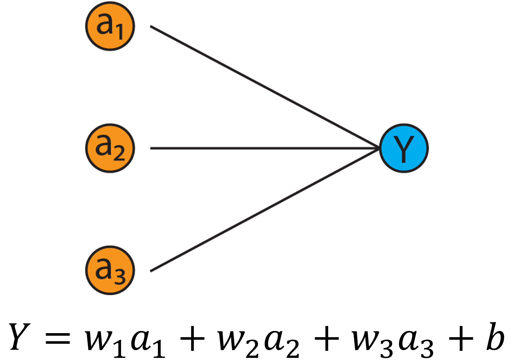](./image/perceptron.png)
>
> ただし、このYを求めるときにデータの変換を行います。この変換を行うための関数のことを**活性化関数**と呼びます。活性化関数にはソフトマックス変換やロジスティック変換、Relu（Yが0以下なら0、Yが0より大きければYをそのままとする式）を用いるのが一般的です。
>
> ソフトマックス変換 \\\sigma(z_k)=\frac{exp(z_k)}{\sum^{n}\_{i=1}exp(z_i)}\\
>
> ロジスティック変換
>
> \\Y=\frac{1}{1+exp(-(w\_{1}a\_{1}+w\_{2}a\_{2}+w\_{3}a\_{3}+b))}\\
>
> Reluでの変換
>
> \\\left\\\begin{align\*}Y = 0 \quad (Y \leqq 0) \\ Y = w\_{1}a\_{1}+w\_{2}a\_{2}+w\_{3}a\_{3}+b \quad (Y \> 0)\end{align\*}\right.\\
>
> この単純パーセプトロンで回帰も分類もできるのですが、複雑な問題には対応できません。単純パーセプトロンを組み合わせ、積み重ねたものがニューラルネットワークです。
>
> [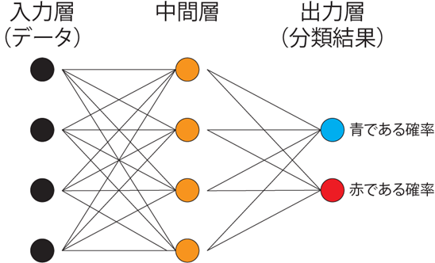](./image/neuralnetwork.png)
>
> ニューラルネットワークは単純パーセプトロンを組み合わせ、入力層、中間層、出力層の各層としたものです。このニューラルネットワークを用いることで、複雑な回帰や分類にも対応することができます。学習の過程で重みやバイアスが計算されますが、この計算にはバックプロパゲーションと呼ばれる方法が用いられています。このバックプロパゲーションやパーセプトロンによる計算にはたくさんの行列演算が含まれるため、多層のニューラルネットワークでは行列演算をたくさん行うことが得意なGPUが学習に用いられています。
>
> このニューラルネットワークの中間層を更に積み重ね、途中で畳み込みやプーリングと呼ばれるデータの変換を用いたもののことをディープニューラルネットワーク（DNN）と呼びます。DNNでは入力層が数万～数十億、中間層が数十層となる場合もあり、非常に複雑な分類問題を予測することが可能です。現在AIと呼ばれているものは、このDNNに強化学習を組み合わせた大規模言語モデル（LLM）と呼ばれるもので、入出力をヒトに見やすい形にしたものだと思います。
>
> ニューラルネットワークについて詳しく知りたい方は、[ゼロから作るDeep Learning](https://www.amazon.co.jp/dp/4873117585?tag=le2am-22&language=ja_JP)([斎藤 2016](#ref-%E6%96%8E%E8%97%A4%E5%BA%B7%E6%AF%852016-09-24))を読んでみるのがよいでしょう。

Rでニューラルネットワークを用いる場合には、[neuralnet](https://cran.r-project.org/web/packages/neuralnet/index.html)パッケージ([Fritsch et al. 2019](#ref-neuralnet_bib))の`neuralnet`関数を用います。`neuralnet`関数はformulaを引数に取る関数ですので、まず`iris`のデータを用いてformulaを準備します。formulaの形は`lm`関数などと同じで、`目的変数~説明変数`の形で準備します。

``` downlit
pacman::p_load(neuralnet)
formula_iris <- 
  as.formula(
    "Sepal.Length ~
      Sepal.Width +
      Petal.Length +
      Petal.Width +
      Species"
  )
```

`neuralnet`関数は、この`formula`の他に、`data`、隠れ層（`hidden`）、活性化関数（`act.fct`）を引数に取ります。隠れ層とは、ニューラルネットワークの中間層のことを指します。以下の式では、隠れ層としてパーセプトロン3つ、3つの2層をベクター（`c(3,3)`）で設定しています。

`neuralnet`関数の返り値を`plot`すると、各入力に対する重みとバイアスを図で表示してくれます。黒の数値が重みで、青の数値はバイアスを示します。

``` downlit
# 2層（nodeが3、3）
set.seed(0)

# 説明変数はスケーリングする
iris_scale <- scale(iris[, 2:4]) |> as.data.frame()

# 種は―1～1にスケーリング
iris_scale$Species <- iris$Species |> as.numeric() - 2 

# 目的変数は0～1にスケーリング
iris_scale$Sepal.Length <-
  (iris$Sepal.Length - min(iris$Sepal.Length)) / (max(iris$Sepal.Length) - min(iris$Sepal.Length))


nn_iris <- neuralnet(
  formula = formula_iris,
  data = iris_scale,
  hidden = c(3, 3),
  act.fct = "logistic", # ソフトマックス（この他に"tanh"を選べる）
  linear.output = T # 出力層に活性化関数を適用するかどうか
)
plot(nn_iris, rep = "best")
```

[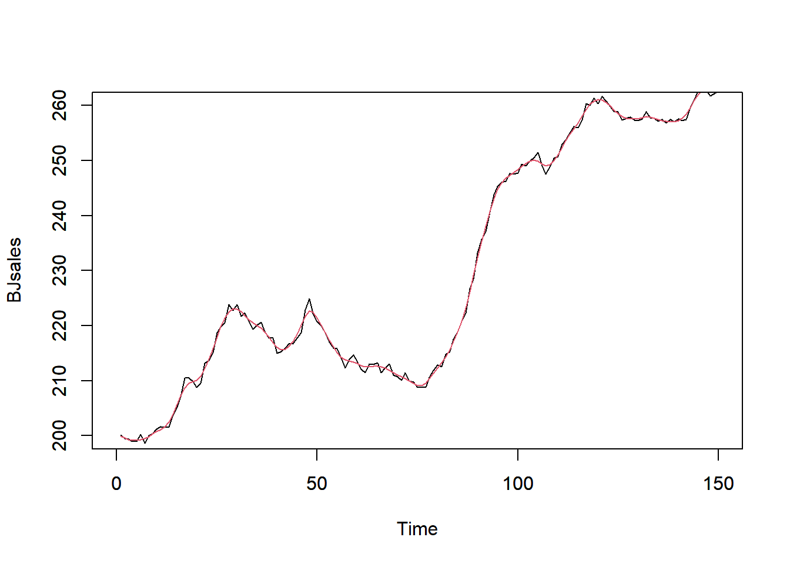](chapter30_files/figure-html/unnamed-chunk-69-1.png)

同様に、パーセプトロンが2個、3個、2個のニューラルネットワークを計算する場合には、`hidden=c(2,3,2)`と隠れ層を設定します。

``` downlit
# 3層（nodeが2、3、2）
set.seed(0)
nn_iris2 <- neuralnet(
  formula = formula_iris,
  data = iris_scale,
  hidden = c(2, 3, 2),
  act.fct = "logistic", 
  linear.output = T
)
plot(nn_iris2, rep = "best")
```

[](chapter30_files/figure-html/unnamed-chunk-70-1.png)

`neuralnet`関数の返り値を`predict`関数の引数にすることで、予測を行うことができます。ただし、データをあらかじめスケーリングしていること、活性化関数がソフトマックスであることから、計算結果は0～1までの値として得られます。この予測値をうまく変換してやれば、元の値を評価することができます。ただし、下のニューラルネットワークの構造では正確には予測できていないことがわかります。このような場合には、データ変換の方法、隠れ層や活性化関数、その他の引数を最適化する必要があります。

``` downlit
nn_iris3 <- neuralnet(
  formula = formula_iris,
  data = iris_scale,
  hidden = c(4, 4),
  act.fct = "logistic", 
  linear.output = T 
)

# 上のニューラルネットワークで予測する
predict(nn_iris3, iris_scale[1:5,])
##        [,1]
## 1 0.2003094
## 2 0.1113907
## 3 0.1341587
## 4 0.1423868
## 5 0.2179850

# 予測値と実際の値の比較
pred_real <- data.frame(
  # 予測値を変換
  prediction = predict(nn_iris3, iris_scale[1:50,]) * (max(iris$Sepal.Length) - min(iris$Sepal.Length)) + min(iris$Sepal.Length),
  real_value = iris$Sepal.Length[1:50] # 実際の値
)

plot(pred_real)
```

[](chapter30_files/figure-html/unnamed-chunk-71-1.png)

ニューラルネットワークに関する他のパッケージには、[nnet](https://cran.r-project.org/web/packages/nnet/index.html)パッケージ ([Venables and Ripley 2002](#ref-nnet_bib))があります。

> **TIP:**
>
> 現代の機械学習やディープニューラルネットワークのほとんどはPythonのライブラリとして提供されています。Rでは、これらのPythonのライブラリを用いたRのパッケージを用いることで、Pythonでできるようなディープニューラルネットワークの手法を用いることができるようになっています。
>
> Pythonの機械学習プラットフォームである[Tensorflow](https://www.tensorflow.org/?hl=ja)をRから利用する[`tensorflow`](https://tensorflow.rstudio.com/)パッケージ、Tensorflowのニューラルネットワークライブラリである[Keras](https://keras.io/)をRから利用する[`keras`](https://cran.r-project.org/web/packages/keras/index.html)パッケージ、RからPythonのニューラルネットワークライブラリである[Pytorch](https://pytorch.org/)を利用するためのライブラリである[`torch`](https://torch.mlverse.org/)などを用いることで、Rでもディープニューラルネットワークを試すことができます。

## 30.17 カーネル密度推定

カーネル密度推定は、データの分布をカーネル密度という、滑らかな曲線に変換する手法です。Rにはこのカーネル密度を表示するための手法がたくさん存在します。その一つが[24章](chapter24.llms.md)で説明した`density`関数です。`density`関数の引数にベクターを与えるとカーネル密度を計算してくれます。この`density`関数の返り値を`plot`関数の引数にすると、カーネル密度をグラフにしてくれます。

同様のグラフは[ggplot2](chapter21.llms.md#geom_density)の`geom_density`関数を用いても描画できます。カーネル密度の計算は[KernSmooth](https://cran.r-project.org/web/packages/KernSmooth/index.html)パッケージ ([Wand 2023](#ref-KernSmooth_bib))の`bkde`関数を用いても計算することができます。

``` downlit
# カーネル回帰
head(faithful)
##   eruptions waiting
## 1     3.600      79
## 2     1.800      54
## 3     3.333      74
## 4     2.283      62
## 5     4.533      85
## 6     2.883      55
x <- faithful$waiting

hist(x, xlim = c(40, 100))
par(new  =T)
density(x) |> plot(xlim = c(40, 100), main = "", xlab = "", ylab = "", axes = FALSE)
```

[](chapter30_files/figure-html/unnamed-chunk-72-1.png)

``` downlit

# KernSmooth::bkde関数を用いる方法
pacman::p_load(KernSmooth)
est <- bkde(faithful$waiting, bandwidth = 3) %>% as.data.frame
ggplot()+
  geom_line(data = est, aes(x = x, y = y*950))+
  geom_histogram(data = faithful, aes(x = waiting, fill = 1), alpha = 0.5)+
  theme(legend.position = "none")
## `stat_bin()` using `bins = 30`. Pick better value `binwidth`.
```

[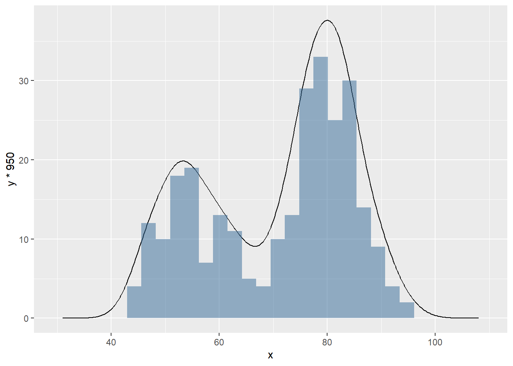](chapter30_files/figure-html/unnamed-chunk-72-2.png)

## 30.18 非線形最小二乗法：nls関数

上記のガウス回帰過程やニューラルネットワーク、カーネル密度推定とは異なる非線形の回帰の方法として、**非線形最小二乗法**というものがあります。この非線形最小二乗法は、線形回帰と同様に2乗誤差を最小とすることで回帰を行う方法ですが、求めるパラメータは切片や傾きのような直線性を示すものではなく、自分で設定した関数のものとなる点が異なります。線形回帰と同様に、データが正規分布することを仮定しているため、正規分布しないデータでは適切に回帰を行うことができません。

また、2乗誤差を最小化する問題（最適化問題）を解く方法として、[ガウス-ニュートン法](https://ja.wikipedia.org/wiki/%E3%82%AC%E3%82%A6%E3%82%B9%E3%83%BB%E3%83%8B%E3%83%A5%E3%83%BC%E3%83%88%E3%83%B3%E6%B3%95)を用いており、[局所最適化](https://jp.mathworks.com/help/optim/ug/local-vs-global-optima.html)と呼ばれる解にしか到達しない問題が起こることもあります。

Rで非線形最小二乗法を行うための関数が`nls`関数です。`nls`関数は引数に回帰したい関数の数式と各パラメータの初期値、データフレームを取ります。`nls`関数の使い方は`lm`関数とよく似ていて、`summary`関数を用いれば計算結果の詳細を、`predict`関数を用いれば回帰からの予測を得ることができます。

``` downlit
DNase1 <- subset(DNase, Run == 1)
plot(density ~ conc, data = DNase1)
```

[](chapter30_files/figure-html/unnamed-chunk-73-1.png)

``` downlit

# SSlogis関数は初期値を自動設定してくれる（self start）nlsのロジスティック回帰用の関数
fm1DNase1 <- nls(density ~ SSlogis(log(conc), Asym, xmid, scal), DNase1) 
# Asymは漸近線を示すパラメータ、xmidは変曲点のx軸の値を示すパラメータ、
# scalはスケールパラメータ
summary(fm1DNase1)
## 
## Formula: density ~ SSlogis(log(conc), Asym, xmid, scal)
## 
## Parameters:
##      Estimate Std. Error t value           Pr(>|t|)    
## Asym  2.34518    0.07815   30.01 0.0000000000002166 ***
## xmid  1.48309    0.08135   18.23 0.0000000001218541 ***
## scal  1.04146    0.03227   32.27 0.0000000000000851 ***
## ---
## Signif. codes:  0 '***' 0.001 '**' 0.01 '*' 0.05 '.' 0.1 ' ' 1
## 
## Residual standard error: 0.01919 on 13 degrees of freedom
## 
## Number of iterations to convergence: 0 
## Achieved convergence tolerance: 0.000008273

# predict関数で予測することができる
predict(fm1DNase1, data.frame(conc = seq(0, 12, by=0.1))) |> head()
## [1] 0.00000000 0.06028535 0.11450622 0.16517079 0.21294860 0.25822909

# 回帰結果のグラフ
d <- data.frame(conc = seq(0, 12, by=0.1), pred = predict(fm1DNase1, data.frame(conc = seq(0, 12, by = 0.1))))
ggplot()+
  geom_point(data = DNase1, aes(x = conc, y = density, color = "#F8766D"))+
  geom_line(data = d, aes(x = conc, y = pred), color = "#00BFC4")+
  theme(legend.position = "none")
```

[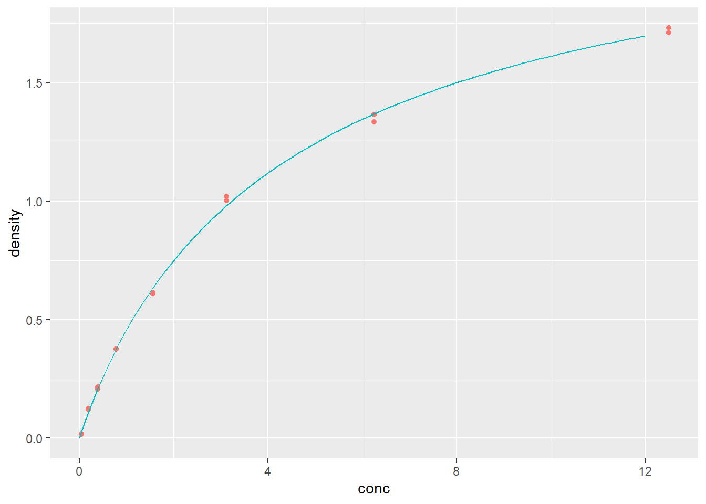](chapter30_files/figure-html/unnamed-chunk-73-2.png)

## 30.19 LOESS・LOWESS平滑化

LOESS平滑化（locally estimated scatterplot smoothing）とLOWESS平滑化（Locally Weighted Scatterplot Smoothing）はどちらも局所回帰と呼ばれる手法を指しており、部分的な回帰をつなぎ合わせて全体として1つの回帰を行う手法です。部分的な回帰には多項式回帰を用いるのが一般的です。多項式回帰と多項式回帰をつなぎ合わせることで、全体として滑らかな曲線でデータを表現することができます。

Rでは、`loess`関数でLOESS平滑化、`lowess`関数を用いてLOWESS平滑化の計算を行います。どちらも同じ計算を行う関数ですが、関数の使い方が少し異なります。`loess`関数は`loess`オブジェクトを返す関数で、`predict`関数を用いて予測値を計算する形になっています。また、平滑化の幅を指定する`span`引数を設定することで、より細かな値の変動に対応した平滑化を行うこともできます。

``` downlit
loess_cars <- loess(dist ~ speed, data = cars) # spanのデフォルト値は0.75
summary(loess_cars)
## Call:
## loess(formula = dist ~ speed, data = cars)
## 
## Number of Observations: 50 
## Equivalent Number of Parameters: 4.78 
## Residual Standard Error: 15.29 
## Trace of smoother matrix: 5.24  (exact)
## 
## Control settings:
##   span     :  0.75 
##   degree   :  2 
##   family   :  gaussian
##   surface  :  interpolate      cell = 0.2
##   normalize:  TRUE
##  parametric:  FALSE
## drop.square:  FALSE

loess_cars2 <- loess(dist ~ speed, cars, span = 0.3) # spanを短く設定

# 赤がspan=0.75、青がspan=0.3
plot(cars, xlim = c(0, 30), ylim = c(0, 120))
par(new = T)
plot(
  seq(5, 30, by = 0.1), 
  predict(loess_cars, data.frame(speed = seq(5, 30, by = 0.1))), 
  type = "l", 
  xlim = c(0, 30), 
  ylim = c(0, 120),
  xlab = "",
  ylab = "",
  col = 2)
par(new = T)
plot(
  seq(5, 30, by = 0.1), 
  predict(loess_cars2, data.frame(speed = seq(5, 30, by = 0.1))), 
  type = "l", 
  xlim = c(0, 30), 
  ylim = c(0, 120),
  xlab = "",
  ylab = "",
  col = 5)
```

[](chapter30_files/figure-html/unnamed-chunk-74-1.png)

`lowess`関数は平滑化後の`x`と`y`のセットをリストとして返す関数で、`plot`関数や`lines`関数の引数に取ることで平滑化した線を描画することができます。平滑化計算における説明変数側の値の幅は`delta`引数で指定します。デフォルトでは横軸を100分割して平滑化することになっています。部分最適化の幅を指定する引数が`f`で、`f`に小さい値を指定することで、より細かな値の変動を捉えることができます。

`loess`、`lowess`のどちらを使っても結果自体には大差はありませんが、`loess`関数の方が予測値の融通が利きやすい仕様になっています。

``` downlit
lowess(cars) # 返り値は同じ長さのxとyのリストになる
## $x
##  [1]  4  4  7  7  8  9 10 10 10 11 11 12 12 12 12 13 13 13 13 14 14 14 14 15 15
## [26] 15 16 16 17 17 17 18 18 18 18 19 19 19 20 20 20 20 20 22 23 24 24 24 24 25
## 
## $y
##  [1]  4.965459  4.965459 13.124495 13.124495 15.858633 18.579691 21.280313
##  [8] 21.280313 21.280313 24.129277 24.129277 27.119549 27.119549 27.119549
## [15] 27.119549 30.027276 30.027276 30.027276 30.027276 32.962506 32.962506
## [22] 32.962506 32.962506 36.757728 36.757728 36.757728 40.435075 40.435075
## [29] 43.463492 43.463492 43.463492 46.885479 46.885479 46.885479 46.885479
## [36] 50.793152 50.793152 50.793152 56.491224 56.491224 56.491224 56.491224
## [43] 56.491224 67.585824 73.079695 78.643164 78.643164 78.643164 78.643164
## [50] 84.328698
## 
## $call
## lowess.default(x = cars)
## 
## attr(,"class")
## [1] "lowess"

plot(cars, main = "lowess(cars)")
lines(lowess(cars), col = 2) # 赤色の線
lines(lowess(cars, f = 0.1), col = 5) # 部分最適化の幅を狭くする（青色）
```

[](chapter30_files/figure-html/unnamed-chunk-75-1.png)

## 30.20 spline回帰

**spline回帰**は、loessと似ていますが、多項式の関数（2次関数や3次関数など）でデータを各部分ごとに回帰し、その多項式の微分値が一致する部分で滑らかにつなぐことで、全体として平滑な曲線で回帰する、非線形の回帰の方法です。spline回帰はLOESS平滑化とは計算のアルゴリズムが異なります。

spline回帰のイメージを以下の図に示します。点で示されているデータを赤と青の2つの2次関数で回帰し、微分値が同じになる点（赤と青の境目）でつなぎ合わせて滑らかな1つの線にしています。このつなぎ目のことをknot（結び目）と呼びます。

[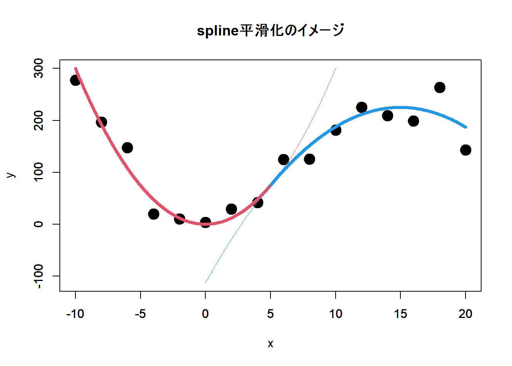](chapter30_files/figure-html/unnamed-chunk-76-1.png)

Rでspline回帰を行う際には、`smooth.spline`関数を用います。`smooth.spline`関数は`x`（説明変数）、`y`（目的変数）をそれぞれ引数に取り、`smooth.spline`クラスのオブジェクトを返す関数です。

`smooth.spline`関数ではcubic smoothing spline（3次スプライン）という、3次関数を滑らかにつなぎ合わせたspline回帰を行います。このcubic smoothing splineでは、knotとknotの間ごとに3次関数への回帰が最小二乗法で計算されます。ただし、この回帰においては、曲線の曲がり具合（wiggliness）が大きいとペナルティがつくような最小二乗法の計算が行われます。ペナルティの大きさはGCV（Generalized Cross Varidation）という手法で自動的に設定されます。別途`penalty`変数に数値を設定すると、ペナルティの大きさを調整することができます。大きめの`penalty`を設定すればより滑らかな、小さめの`penalty`を設定すればより曲がりくねった形の回帰となります。

また、cubic smoothing splineでは、knotの位置をあらかじめ設定しておく必要があります。`smooth.spline`関数ではknotの数は自動的に設定される仕組みになっています。

``` downlit
BJsales_d <- as.data.frame(BJsales) |> mutate(time = 1:150)

# スプライン曲線の計算（ペナルティを1.4に設定）、結果にはGCVの結果などが表示される
smooth.spline(BJsales_d$time, BJsales_d$x, penalty = 1.4)
## Call:
## smooth.spline(x = BJsales_d$time, y = BJsales_d$x, penalty = 1.4)
## 
## Smoothing Parameter  spar= 0.334997  lambda= 0.0000006884175 (10 iterations)
## Equivalent Degrees of Freedom (Df): 42.13433
## Penalized Criterion (RSS): 65.69251
## GCV: 1.189626

# 黒線が生データ、赤線がスプライン曲線
plot(BJsales, col = 1, xlim = c(0, 150), ylim = c(200, 260))
par(new = T)
smooth.spline(BJsales_d$time, BJsales_d$x, penalty = 1.4) |> 
  plot(type = "l", col = 2, xlim = c(0, 150), ylim = c(200, 260), xlab = "", ylab = "")
```

[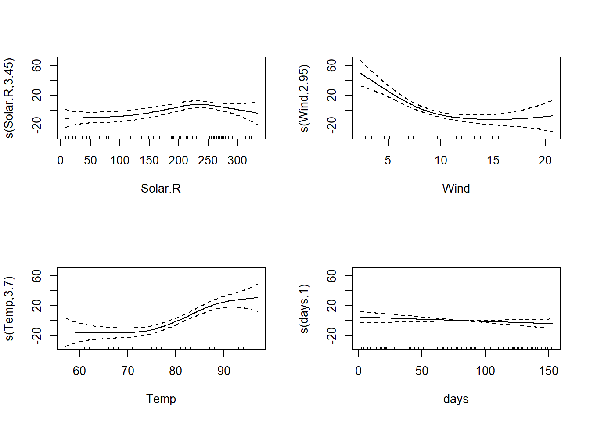](chapter30_files/figure-html/unnamed-chunk-77-1.png)

## 30.21 加法モデル（additive model）

上記のように、説明変数が1つ、目的変数が1つの場合には、`smooth.spline`関数を用いた回帰により、滑らかな非線形回帰を行うことができます。このspline回帰を説明変数が複数の場合、つまり重回帰のような場合に拡張したものが**加法モデル**（additive model）です。

加法モデルのいいところは、説明変数に対して目的変数が直線的な関係でなくても回帰が行えるということです。上述の線形モデルでは、単調増加・単調減少の現象を取り扱い、回帰する線は直線・指数関数・ロジスティック関数の主に3つとなります。しかし、実際の現象では説明変数に最適値があったり、目的変数が飽和するようなパターンも多くみられます。このような現象に対しては線形モデルではなく、非線形である加法モデルを用いた方がうまく説明できる可能性があります。ただし、説明変数に対する傾きを数値で示すことはできないため、結果の解釈は難しくなります。

Rでは、加法モデルの計算に[`mgcv`](https://cran.r-project.org/web/packages/mgcv/)パッケージ([Wood 2011](#ref-mgcv1_bib), [2004](#ref-mgcv3_bib), [2003](#ref-mgcv5_bib); [Wood et al. 2016](#ref-mgcv2_bib); [Wood 2017](#ref-mgcv4_bib))を用います。`mgcv`では、主に3種類のspline回帰を用いて複雑な非線形回帰を行います。

- cubic regression spline：上記の`smooth.spline`で用いられているものと同じものです。knotの間隔はデフォルトでは説明変数の幅を10分割する形で設定されます。knotの位置を最適化すれば、非常に滑らかな非線形回帰を行うことができます。
- thin plate regression spline：cubic regression splineと同じく3次関数で非線形回帰を行うspline回帰ですが、knotの位置が自動的に最適化される点が異なります。計算が重く、データ数が多いと時間がかかります。
- tensor product spline：複数の説明変数に対して、多次元的なspline回帰を行うための手法です。thin plate regression splineよりも計算が軽いため、データが多い場合に適しています。

`mgcv`のデフォルトのspline回帰の手法はthin plate regression splineです。thin plate regression splineはthin plate splineと呼ばれる手法の計算量を小さくしたものです。thin plate spline自体は計算量が大きすぎて使いにくいため、`mgcv`では対応していません。この他にB-splineやP-splineなどの、別のsplineの手法を用いることもできますが、特に理由がない限り使用する必要はないでしょう。thin plate splineに関しては[こちらの小林景先生（慶應義塾理工学部）のページ](https://www.math.keio.ac.jp/~kei/GDS/2nd/spline.html)に詳しく記載されています。

回帰の計算をペナルティ付き最小二乗法で計算する点も`smooth.spline`関数と同じです。ペナルティ付き最小二乗法はP-IRLS（Iteratively Reweighted Least Squares）と呼ばれる繰り返し計算手法で計算します。

ペナルティ付き最小二乗法のペナルティの大きさは`smooth.spline`と同じくGCVか、UBRE（Un-biased Risk Estimator）と呼ばれる手法のどちらかで計算されます。特に手法を指定しない場合にはGCVによりGCV-scoreが計算され、GCV-scoreを最小化するペナルティの大きさが決定されます。

### 30.21.1 一般化加法モデル（Generalized Additive Model、GAM）

線形モデル（LM）に対して一般化線形モデル（GLM）があるのと同様に、加法モデル（AM）に対しては**一般化加法モデル（Generalized Additive Model、GAM）**があります。

加法モデルでは、目的変数が正規分布すると仮定してspline曲線による非線形重回帰を行います。この目的変数の分布を正規分布以外に拡張したものが、一般化加法モデル（GAM）です。目的変数が正規分布することを仮定する加法モデルではペナルティ付き最小二乗法でsplineを求めますが、一般化加法モデルではペナルティ付き最尤法でsplineを求めます。

一般化加法モデルでは、一般化線形モデルのように目的変数の分布（family）とリンク関数（link）を指定します。GLMと同様に目的変数の分布とリンク関数はセットになっているため、familyを設定すれば、リンク関数を別途設定する必要はありません。

### 30.21.2 mgcvでGAMを計算する

`mgcv`パッケージでは、`gam`関数を用いてGAMを計算することができます。`gam`関数の使い方は`glm`関数によく似ていますが、説明変数の設定方法が異なります。

`mgcv`パッケージでspline回帰を行う場合には、説明変数を`s`関数の引数に取ります。

以下の例では、31本のブラックチェリー（Purnus serotina）のデータ（`trees`）において高さ（`Height`）と直径（`Girth`）から幹の体積（`Volume`）を求める演算をGAMで行っています。説明変数である`Height`と`Girth`は`s`関数の引数に指定しています。`glm`関数と同じく、データはデータフレームとして、`data`引数に指定します。このように指定することで、目的変数-説明変数の関係をsplineによる非線形として設定することができます。`s`関数内で特に引数を指定しない場合には、thin plate regression splineによる計算が行われます。

`gam`関数の返り値を`plot`関数の引数に指定することで、各説明変数と目的変数の関係をグラフで示すことができます。グラフの実線は推定値で、点線は信頼区間を示します。x軸に示されている短い縦線はデータの位置を示しています。

``` downlit
pacman::p_load(mgcv)

# s関数に囲まれている説明変数はSpline回帰で演算される
gam_trees <- gam(Volume ~ s(Girth) + s(Height), data = trees)

summary(gam_trees)
## 
## Family: gaussian 
## Link function: identity 
## 
## Formula:
## Volume ~ s(Girth) + s(Height)
## 
## Parametric coefficients:
##             Estimate Std. Error t value            Pr(>|t|)    
## (Intercept)  30.1710     0.4816   62.65 <0.0000000000000002 ***
## ---
## Signif. codes:  0 '***' 0.001 '**' 0.01 '*' 0.05 '.' 0.1 ' ' 1
## 
## Approximate significance of smooth terms:
##             edf Ref.df   F              p-value    
## s(Girth)  2.693  3.368 207 < 0.0000000000000002 ***
## s(Height) 1.000  1.000  16             0.000468 ***
## ---
## Signif. codes:  0 '***' 0.001 '**' 0.01 '*' 0.05 '.' 0.1 ' ' 1
## 
## R-sq.(adj) =  0.973   Deviance explained = 97.7%
## GCV = 8.4734  Scale est. = 7.1905    n = 31

par(mfrow = c(1, 2))
plot(gam_trees)
```

[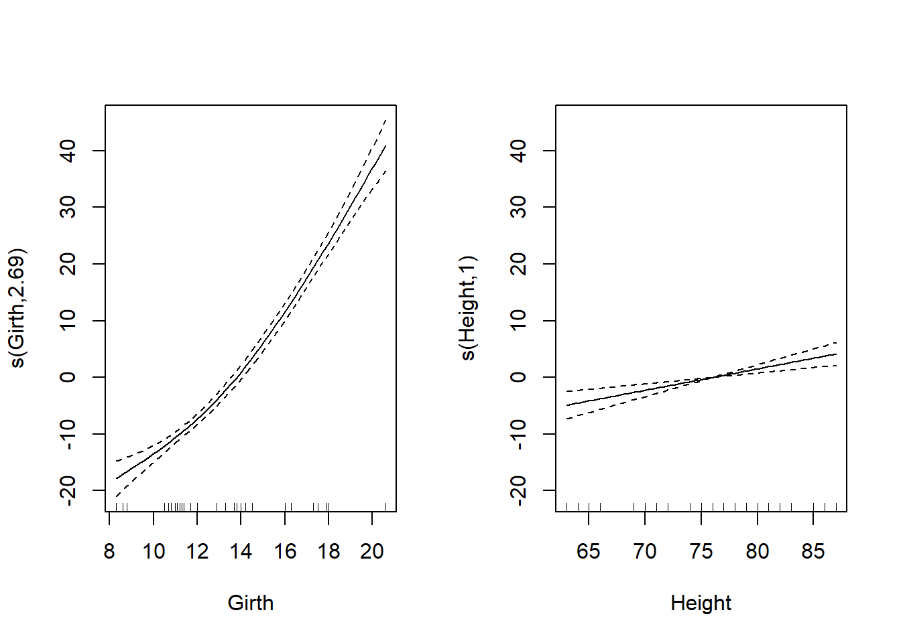](chapter30_files/figure-html/unnamed-chunk-78-1.png)

グラフの縦軸ラベルに記載されている数値（2.69と1）はsplineの自由度です。GAMでは自由度が非常に重要な要素の一つで、spline曲線で用いられている係数などの数を反映しいます。自由度が大きすぎると過学習である可能性があります。一方で、周期性のある時系列データなどでは、自由度が小さいと結果を十分に説明できなくなるため、自由度がある程度大きい必要があります。`s`関数ではデフォルトの自由度の最大値として10が設定されています。自由度の最大値は`s`関数内で`k`引数を指定することで変更することができます。

また、説明変数と目的変数の関係が線形であることが分かっている場合には、`s`関数の引数とせずにつなぐことで、その説明変数のみsplineではなく、線形の関係としてモデルに組み込むことができます。

上記の例では、`Height`の自由度は1、要は傾きしかない線形であるため、`s`関数で囲う意味はあまりありません。このような場合には`s`関数を外して演算すると、説明変数と目的変数の関係がSplineではなく線形として計算されます。

``` downlit
gam_trees1 <- gam(Volume ~ s(Girth) + Height, data = trees)

# 線形の成分はplot関数では表示されない
plot(gam_trees1)
```

[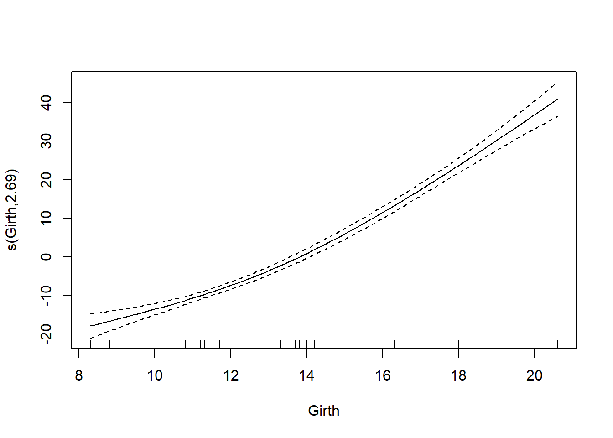](chapter30_files/figure-html/unnamed-chunk-79-1.png)

### 30.21.3 bs引数でsplineの種類を指定する

以下の例では、1973年のNYの大気汚染データ（`airquality`）のうち、オゾン量（`Ozone`）を目的変数、日照（`Solar.R`）、風量（`Wind`）、気温（`Temp`）、5月1日からの日数（`days`）を説明変数とするGAMの計算を行っています。

``` downlit
aq <- airquality |> mutate(days = 1:nrow(airquality)) # 前準備

# GAMの演算
result_gam <- gam(Ozone ~ s(Solar.R) + s(Wind) + s(Temp) + s(days), data = aq)

# s(days)はp値が有意ではない
summary(result_gam)
## 
## Family: gaussian 
## Link function: identity 
## 
## Formula:
## Ozone ~ s(Solar.R) + s(Wind) + s(Temp) + s(days)
## 
## Parametric coefficients:
##             Estimate Std. Error t value            Pr(>|t|)    
## (Intercept)   42.099      1.652   25.48 <0.0000000000000002 ***
## ---
## Signif. codes:  0 '***' 0.001 '**' 0.01 '*' 0.05 '.' 0.1 ' ' 1
## 
## Approximate significance of smooth terms:
##              edf Ref.df      F             p-value    
## s(Solar.R) 3.448  4.280  3.408              0.0112 *  
## s(Wind)    2.945  3.697 13.258 <0.0000000000000002 ***
## s(Temp)    3.696  4.600 12.450 <0.0000000000000002 ***
## s(days)    1.000  1.000  1.614              0.2069    
## ---
## Signif. codes:  0 '***' 0.001 '**' 0.01 '*' 0.05 '.' 0.1 ' ' 1
## 
## R-sq.(adj) =  0.726   Deviance explained = 75.4%
## GCV = 339.95  Scale est. = 302.92    n = 111

par(mfrow = c(2,2))
plot(result_gam, select = 1);plot(result_gam, select = 2)
plot(result_gam, select = 3);plot(result_gam, select = 4)
```

[](chapter30_files/figure-html/unnamed-chunk-80-1.png)

上の結果では、`days`の回帰結果がほぼ一定に見えます。つまり、`days`は`Ozone`にほとんど影響を与えていないように見えます。このような説明変数は、GLMのモデル選択やスパース回帰では取り除かれる可能性があります。

GAMの結果に`step`関数によるモデル選択を適用することはできません。`gam`では、`step`関数の代わりに、`s`関数内で引数を指定することにより、モデル選択ができるようにしています。

`s`関数の`bs`引数は通常splineの手法を指定するための引数です。`bs="cr"`でcubic regression spline、`bs="tp"`でthin plate regression splineを指定することができます（tensor product splineには`s`とは別の関数が準備されています。後ほど説明します）。`bs`引数に指定可能な手法は`?smooth.terms`（もしくは[こちらのページ](https://stat.ethz.ch/R-manual/R-patched/RHOME/library/mgcv/html/smooth.terms.html)）にまとめられています。また、cubic regression splineを選択した場合には、knotの位置を`knot`引数で設定することもできます（thin plate regression splineを用いる場合には原理的に`knot`を設定する必要がありません）。

この`bs`引数に指定できる手法のうちには、「shrinkageが可能な手法」、というものが含まれています。このshrinkageというのは、`s`関数の結果をほぼ0とする、つまりスパース回帰のように説明変数を取り除くことができるようにすることを意味します。shrinkageが可能な手法は`"cs"`（cubic regression splineでshrinkage可能な手法）と`"ts"`（thin plate regression splineでshrinkage可能な手法）の2つです。`s`関数内で`bs="cs"`もしくは`bs="ts"`を指定することで、その説明変数が目的変数に影響を与えていない場合には説明変数からある程度取り除くことができます。

ただし、`step`関数やスパース回帰のようには説明変数をうまく取り除けないので、AICなどを用いたモデル選択も行うことになります。`lm`や`glm`と同じく、`AIC`関数の引数に`gam`の返り値を取ることでAICを計算することができます。

同様に、`bs`引数にはcyclicな、始めと終わりの値が同じとなるsplineを指定することもできます。代表的なcyclicな方法は`"cc"`（cubic regression splineのcyclic版）です。時系列などで、ある一定の時期ごとに同じ値に戻るような場合には、`bs="cc"`と指定することでより単純で分かりやすいモデルを選択することができます。

``` downlit
result_gam2 <- 
  gam(
    Ozone ~ 
      s(Solar.R, bs = "ts") + 
      s(Wind, bs = "ts") + 
      s(Temp, bs = "ts") + 
      s(days, bs = "ts"), 
    data = aq)

plot(result_gam, select = 4) # daysは残っているが、0付近に集まる
```

[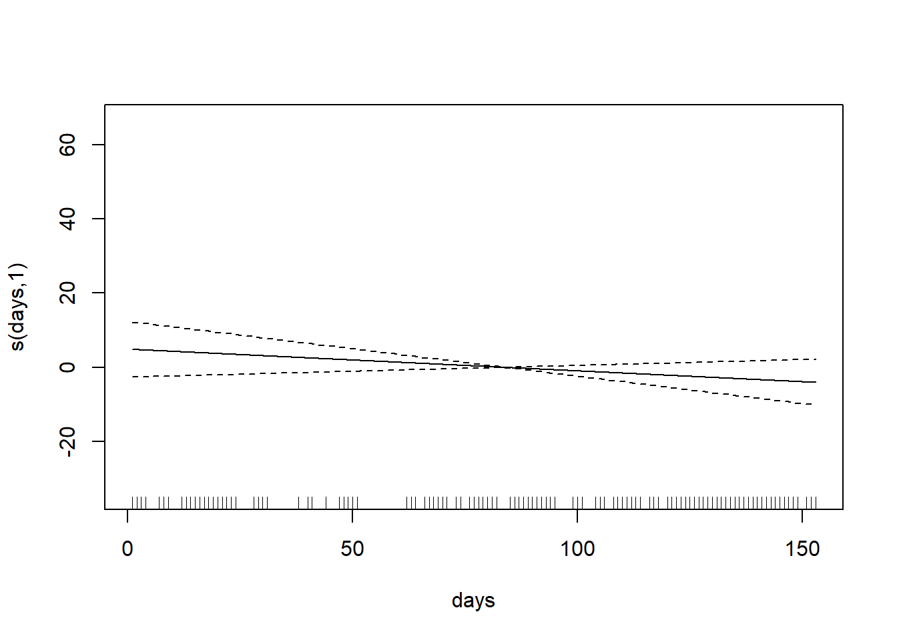](chapter30_files/figure-html/unnamed-chunk-81-1.png)

``` downlit

# tsのモデルの方がわずかにAICが小さい
AIC(result_gam)
## [1] 962.579
AIC(result_gam2)
## [1] 962.2856
```

### 30.21.4 s関数に2つの説明変数を含める

上記の例では、`s`関数それぞれに説明変数を設定していましたが、`s`関数には2つ以上の説明変数を同時に設定することもできます。下の例では、3つの説明変数を`s`関数の引数に指定しています。このように指定することで、多次元のスプラインを用いてGAMの計算を行うことができます。

また、このように複数の説明変数を一度にスプライン回帰する場合には、tensor product splineを用いることで計算コストを小さくすることができます。tensor product splineを用いる場合には、`s`関数の代わりに、`te`関数を用います。

ただし、`summary`関数の結果を見るとわかる通り、複数の説明変数を用いたスプラインを作成すると、結果の解釈はより難しくなる傾向があります。

``` downlit
# thin plate regression splineで複数の説明変数を加える
gam_trees2 <- gam(Volume ~ s(Girth, Height, k = 4), data = trees)

# tensor product splineで複数の説明変数のsplineを作成
gam_trees3 <- gam(Volume ~ te(Girth, Height), data = trees)

summary(gam_trees2)
## 
## Family: gaussian 
## Link function: identity 
## 
## Formula:
## Volume ~ s(Girth, Height, k = 4)
## 
## Parametric coefficients:
##             Estimate Std. Error t value            Pr(>|t|)    
## (Intercept)   30.171      0.636   47.44 <0.0000000000000002 ***
## ---
## Signif. codes:  0 '***' 0.001 '**' 0.01 '*' 0.05 '.' 0.1 ' ' 1
## 
## Approximate significance of smooth terms:
##                  edf Ref.df     F             p-value    
## s(Girth,Height) 2.85  2.977 203.5 <0.0000000000000002 ***
## ---
## Signif. codes:  0 '***' 0.001 '**' 0.01 '*' 0.05 '.' 0.1 ' ' 1
## 
## R-sq.(adj) =  0.954   Deviance explained = 95.8%
## GCV = 14.316  Scale est. = 12.538    n = 31
summary(gam_trees3)
## 
## Family: gaussian 
## Link function: identity 
## 
## Formula:
## Volume ~ te(Girth, Height)
## 
## Parametric coefficients:
##             Estimate Std. Error t value            Pr(>|t|)    
## (Intercept)  30.1710     0.4865   62.02 <0.0000000000000002 ***
## ---
## Signif. codes:  0 '***' 0.001 '**' 0.01 '*' 0.05 '.' 0.1 ' ' 1
## 
## Approximate significance of smooth terms:
##                  edf Ref.df     F             p-value    
## te(Girth,Height)   3      3 359.3 <0.0000000000000002 ***
## ---
## Signif. codes:  0 '***' 0.001 '**' 0.01 '*' 0.05 '.' 0.1 ' ' 1
## 
## R-sq.(adj) =  0.973   Deviance explained = 97.6%
## GCV = 8.4231  Scale est. = 7.3362    n = 31

# thin plate regression splineでAICが最も小さい
AIC(gam_trees) # thin plate regression spline
## [1] 155.4276
AIC(gam_trees2) # thin plate regression spline（複数の説明変数をs関数に含める）
## [1] 171.9544
AIC(gam_trees3) # tensor product spline
## [1] 155.4692
```

### 30.21.5 ペナルティの調整

ペナルティを調整する場合には、`gamma`引数を指定します。`gamma`引数のデフォルトは1で、大きくするとより滑らかな、小さくするとより曲がりくねった結果が得られます。[教科書](https://www.amazon.co.jp/-/en/Simon-N-Wood/dp/1498728332)([Wood 2017](#ref-mgcv4_bib))では、この`gamma`を`1.4`に指定するのがよいとされていますので、デフォルトの`gam`関数ではやや曲がりくねった結果を得られやすいことになります。

``` downlit
# gammaを1.4に指定する
result_gam3 <- 
  gam(
    Ozone ~ 
      s(Solar.R) + s(Wind) + s(Temp), 
    data = aq,
    gamma = 1.4)

# gammaを0.1に指定する
result_gam4 <- 
  gam(
    Ozone ~ 
      s(Solar.R) + s(Wind) + s(Temp), 
    data = aq,
    gamma = 0.1)

# 左（gamma = 1.4）は滑らか、右（gamma = 0.1）は曲がりくねった結果になる
par(mfrow = c(1, 2))
plot(result_gam3, select = 1)
plot(result_gam4, select = 1)
```

[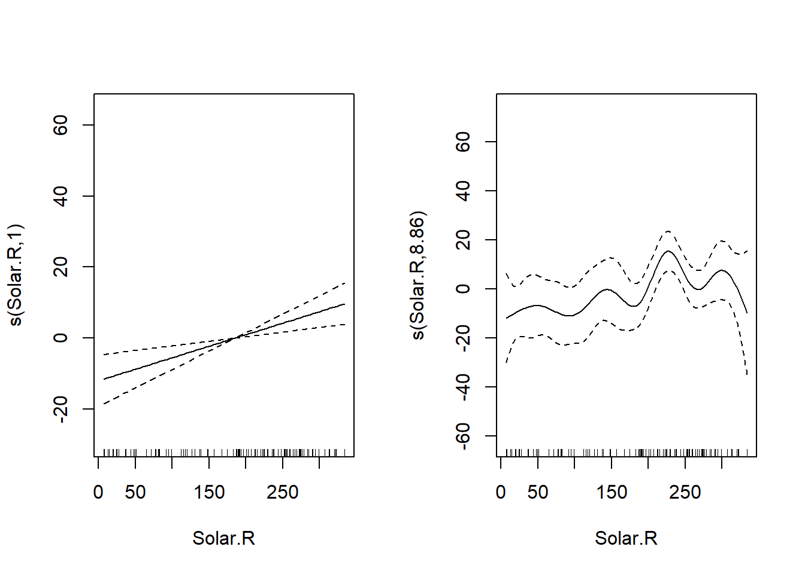](chapter30_files/figure-html/unnamed-chunk-83-1.png)

### 30.21.6 by引数

`s`関数内では`by`引数に説明変数を設定することができます。例えばAが目的変数、BとCが説明変数の場合に、`gam(A~s(B, by=C))`と設定すると、数式モデルとしては以下のように、Bによるスプライン回帰にCを掛けた形での回帰を行うことになります。

\\A=f(B) \cdot C + \epsilon\\

f(x)はスプライン回帰の式を示します。この`by`引数の使い方はわかりにくいのですが、例えば地域ごとの経済状況を非線形回帰する場合に、国によって施策が異なり、国境線を境に大きく経済状況が異なる場合、その施策の有り・無しを1と0の説明変数として`by`引数に設定すれば、施策の効果を評価した上での回帰を行うことができます。

``` downlit
result_gam7 <- 
  gam(
    Ozone ~ 
      s(Solar.R, by = days), 
    data = aq)
```

### 30.21.7 predict関数で予測する

`lm`や`glm`と同様に、`gam`でも`predict`関数により結果の予測値を出力することができます。`predict`関数の使い方も`lm`や`glm`と類似していて、回帰のオブジェクト（`gam`オブジェクト）と予測したいデータを含むデータフレームを引数に取ります。また、標準誤差は引数に`se.fit=TRUE`と設定することで計算することができます。

``` downlit
result_gam2d <- 
  gam(
    Ozone ~ 
      s(Solar.R) + s(Wind), 
    data = aq)

d <- 
  expand.grid(
    Solar.R = seq(7, 334, by = 1),
    Wind = seq(1.7, 20.7, by = 0.1)
  )

predict(result_gam2d, d) |> head(5) # ベクターが返ってくる
##        1        2        3        4        5 
## 99.11914 99.27418 99.42922 99.58426 99.73930

d.pred <- cbind(d, pred = predict(result_gam2d, d))

# 回帰結果は曲面として得られる（下の図は点の集合になっている）
d.pred |> 
  plotly::plot_ly(
    x = ~Solar.R, y=~Wind, z=~pred, size=0.1, color=~pred
  )
```

加法モデルについては、こちらの[東京大学の資料](https://ibis.t.u-tokyo.ac.jp/suzuki/lecture/2015/dataanalysis/L12.pdf)も参考になりますので、一読されるとよいでしょう。

### 30.21.8 一般化加法混合モデル（GAMM）

線形モデルに対して線形混合モデル、一般化線形モデルに対して一般化線形混合モデルがあるように、一般化加法モデルに対しては**一般化加法混合モデル**（Generalized Additive Mixed Model、GAMM）があります。

一般化線形混合モデルでは`lme4`や`lmerTest`などのパッケージが必要でしたが、GAMMは`mgcv`パッケージの`gam`関数を用いて計算することができます。

`gam`関数内では、ランダム効果となる説明変数を`s`関数内で宣言し、`bs="re"`を引数として設定します。`lmerTest`のように`|`を使ってランダム効果を設定する必要はありません。

GAMMについては[論文](https://www.ncbi.nlm.nih.gov/pmc/articles/PMC6542350/pdf/peerj-07-6876.pdf)([Pedersen et al. 2019](#ref-pedersen2019hierarchical))に詳しく記載されていますので、一読されることをおすすめいたします。

``` downlit
# Pedersen et al. (2019)に記載の例 https://peerj.com/articles/6876/#supplemental-information
CO2 |> head(5)
## Grouped Data: uptake ~ conc | Plant
##   Plant   Type  Treatment conc uptake
## 1   Qn1 Quebec nonchilled   95   16.0
## 2   Qn1 Quebec nonchilled  175   30.4
## 3   Qn1 Quebec nonchilled  250   34.8
## 4   Qn1 Quebec nonchilled  350   37.2
## 5   Qn1 Quebec nonchilled  500   35.3

plot(CO2)
```

[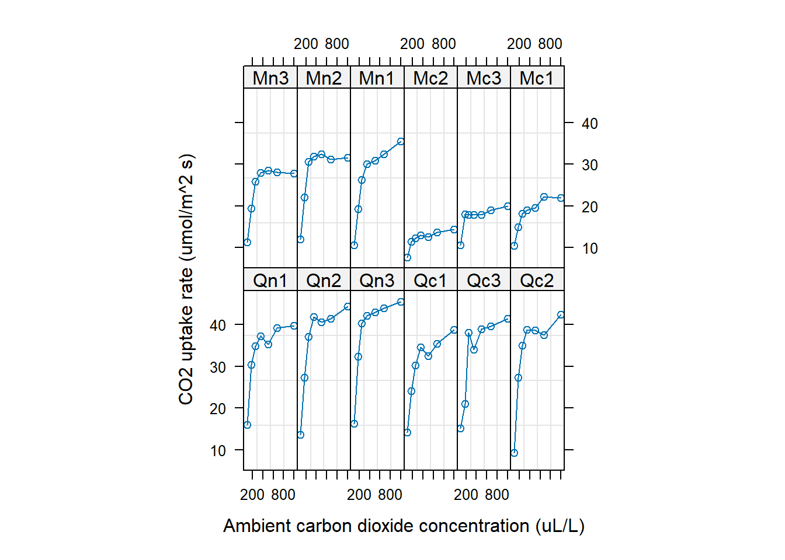](chapter30_files/figure-html/unnamed-chunk-86-1.png)

``` downlit

CO2 <- transform(CO2, Plant_uo = factor(Plant, ordered = FALSE))

CO2_modG <- 
  gam(
    log(uptake) ~ 
      s(log(conc), k = 5, bs = "tp") + 
      s(Plant_uo, k = 12, bs = "re"), # reはランダム効果
    data = CO2, 
    method = "REML", 
    family = "gaussian")
```

結果の表示には`gratia`パッケージ([Simpson 2024](#ref-gratia_bib))を用いてみます。`gratia`は`gam`の結果を`ggplot2`ベースのグラフにしてくれるパッケージです。

``` downlit
pacman::p_load(gratia) # グラフをggplot2準拠にするパッケージ
draw(CO2_modG) # concの効果をプロット
```

[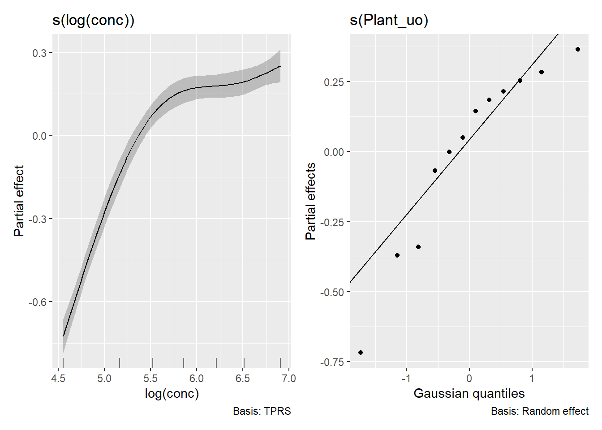](chapter30_files/figure-html/unnamed-chunk-87-1.png)

Akaike, Hirotogu. 1998. “Information Theory and an Extension of the Maximum Likelihood Principle.” In *Selected Papers of Hirotugu Akaike*. Springer.

Anscombe, Francis J. 1973. “Graphs in Statistical Analysis.” *The American Statistician* 27 (1): 17–21.

Bates, Douglas, Martin Mächler, Ben Bolker, and Steve Walker. 2015. “Fitting Linear Mixed-Effects Models Using lme4.” *Journal of Statistical Software* 67 (1): 1–48. <https://doi.org/10.18637/jss.v067.i01>.

Bürkner, Paul-Christian. 2017. “brms: An R Package for Bayesian Multilevel Models Using Stan.” *Journal of Statistical Software* 80 (1): 1–28. <https://doi.org/10.18637/jss.v080.i01>.

Bürkner, Paul-Christian. 2018. “Advanced Bayesian Multilevel Modeling with the R Package brms.” *The R Journal* 10 (1): 395–411. <https://doi.org/10.32614/RJ-2018-017>.

Bürkner, Paul-Christian. 2021. “Bayesian Item Response Modeling in R with brms and Stan.” *Journal of Statistical Software* 100 (5): 1–54. <https://doi.org/10.18637/jss.v100.i05>.

Friedman, Jerome, Robert Tibshirani, and Trevor Hastie. 2010. “Regularization Paths for Generalized Linear Models via Coordinate Descent.” *Journal of Statistical Software* 33 (1): 1–22. <https://doi.org/10.18637/jss.v033.i01>.

Fritsch, Stefan, Frauke Guenther, and Marvin N. Wright. 2019. *Neuralnet: Training of Neural Networks*. <https://CRAN.R-project.org/package=neuralnet>.

Hadfield, Jarrod D. 2010. “MCMC Methods for Multi-Response Generalized Linear Mixed Models: The MCMCglmm R Package.” *Journal of Statistical Software* 33 (2): 1–22. <https://www.jstatsoft.org/v33/i02/>.

Karatzoglou, Alexandros, Alex Smola, and Kurt Hornik. 2023. *Kernlab: Kernel-Based Machine Learning Lab*. <https://CRAN.R-project.org/package=kernlab>.

Karatzoglou, Alexandros, Alex Smola, Kurt Hornik, and Achim Zeileis. 2004. “Kernlab – an S4 Package for Kernel Methods in R.” *Journal of Statistical Software* 11 (9): 1–20. <https://doi.org/10.18637/jss.v011.i09>.

Knudson, Christina. 2022. *Glmm: Generalized Linear Mixed Models via Monte Carlo Likelihood Approximation*. <https://CRAN.R-project.org/package=glmm>.

Kuznetsova, Alexandra, Per B. Brockhoff, and Rune H. B. Christensen. 2017. “lmerTest Package: Tests in Linear Mixed Effects Models.” *Journal of Statistical Software* 82 (13): 1–26. <https://doi.org/10.18637/jss.v082.i13>.

Liland, Kristian Hovde, Bjørn-Helge Mevik, and Ron Wehrens. 2023. *Pls: Partial Least Squares and Principal Component Regression*. <https://CRAN.R-project.org/package=pls>.

Pedersen, Eric J, David L Miller, Gavin L Simpson, and Noam Ross. 2019. “Hierarchical Generalized Additive Models in Ecology: An Introduction with Mgcv.” *PeerJ* 7: e6876.

Pinheiro, José C., and Douglas M. Bates. 2000. *Mixed-Effects Models in s and s-PLUS*. Springer. <https://doi.org/10.1007/b98882>.

Pinheiro, José, Douglas Bates, and R Core Team. 2023. *Nlme: Linear and Nonlinear Mixed Effects Models*. <https://CRAN.R-project.org/package=nlme>.

Schloerke, Barret, Di Cook, Joseph Larmarange, et al. 2023. *GGally: Extension to ’Ggplot2’*. <https://CRAN.R-project.org/package=GGally>.

Simon, Noah, Jerome Friedman, Robert Tibshirani, and Trevor Hastie. 2011. “Regularization Paths for Cox’s Proportional Hazards Model via Coordinate Descent.” *Journal of Statistical Software* 39 (5): 1–13. <https://doi.org/10.18637/jss.v039.i05>.

Simpson, Gavin L. 2024. *gratia: Graceful ggplot-Based Graphics and Other Functions for GAMs Fitted Using mgcv*. <https://gavinsimpson.github.io/gratia/>.

Stan Development Team. 2023. *RStan: The R Interface to Stan*. <https://mc-stan.org/>.

Tay, J. Kenneth, Balasubramanian Narasimhan, and Trevor Hastie. 2023. “Elastic Net Regularization Paths for All Generalized Linear Models.” *Journal of Statistical Software* 106 (1): 1–31. <https://doi.org/10.18637/jss.v106.i01>.

Team, Stan Development. 2023. *Stan Modeling Language Users Guide and Reference Manual*. Version 2.33. <https://mc-stan.org>.

Venables, W. N., and B. D. Ripley. 2002. *Modern Applied Statistics with s*. Fourth. Springer. <https://www.stats.ox.ac.uk/pub/MASS4/>.

Wand, Matt. 2023. *KernSmooth: Functions for Kernel Smoothing Supporting Wand & Jones (1995)*. <https://CRAN.R-project.org/package=KernSmooth>.

Wood, S. N. 2017. *Generalized Additive Models: An Introduction with r*. 2nd ed. Chapman; Hall/CRC.

Wood, S. N. 2003. “Thin-Plate Regression Splines.” *Journal of the Royal Statistical Society (B)* 65 (1): 95–114.

Wood, S. N. 2004. “Stable and Efficient Multiple Smoothing Parameter Estimation for Generalized Additive Models.” *Journal of the American Statistical Association* 99 (467): 673–86.

Wood, S. N. 2011. “Fast Stable Restricted Maximum Likelihood and Marginal Likelihood Estimation of Semiparametric Generalized Linear Models.” *Journal of the Royal Statistical Society (B)* 73 (1): 3–36.

Wood, S. N., N., Pya, and B. S"afken. 2016. “Smoothing Parameter and Model Selection for General Smooth Models (with Discussion).” *Journal of the American Statistical Association* 111: 1548–75.

大森敏明. 2015. “使える!統計検定・機械学習-v : 回帰問題への機械学習的アプローチ : スパース性に基づく回帰モデリング.” *システム／制御／情報* 59 (4): 151–56. <https://doi.org/10.11509/isciesci.59.4_151>.

川野秀一. 2017. “スパース正則化に基づく回帰モデリングとその計算アルゴリズム.” *計算機統計学* 30 (2): 173–86. <https://doi.org/10.20551/jscswabun.30.2_173>.

斎藤康毅. 2016. *ゼロから作るDeep Learning ーPythonで学ぶディープラーニングの理論と実装*. 単行本（ソフトカバー）. オライリージャパン. <https://www.amazon.co.jp/dp/4873117585/>.

赤穂昭太郎. 2018. “ガウス過程回帰の基礎.” *システム/制御/情報* 62 (10): 390–95.

Back to top

[^1]: かなり端折って説明しています。スパース回帰については、文献([大森敏明 2015](#ref-%E5%A4%A7%E6%A3%AE%E6%95%8F%E6%98%8E2015KJ00009904410); [川野秀一 2017](#ref-%E5%B7%9D%E9%87%8E%E7%A7%80%E4%B8%802017))をご参考下さい
