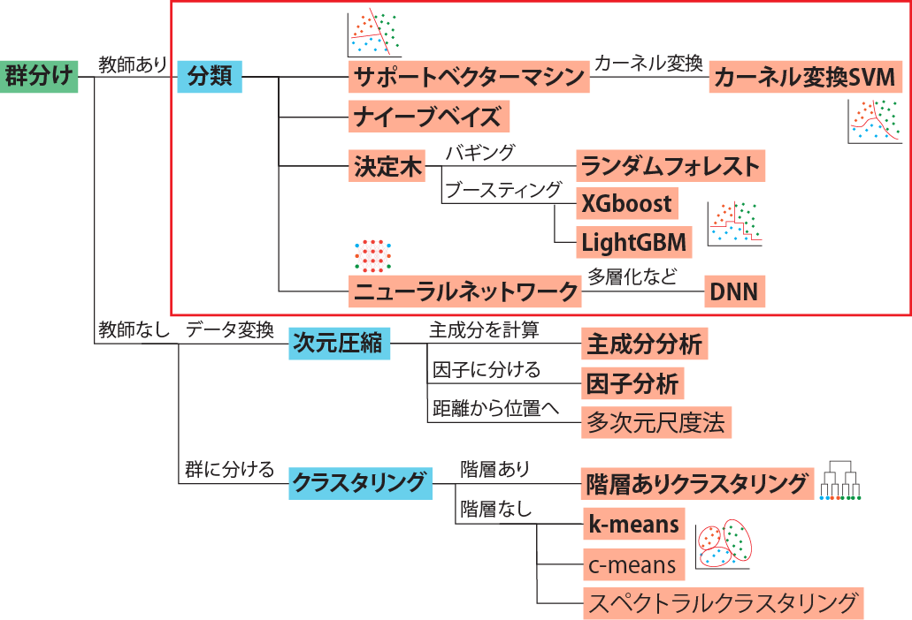
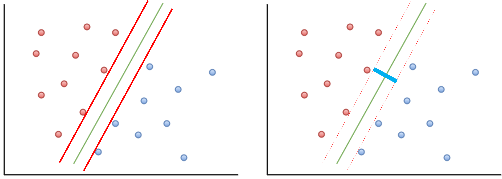
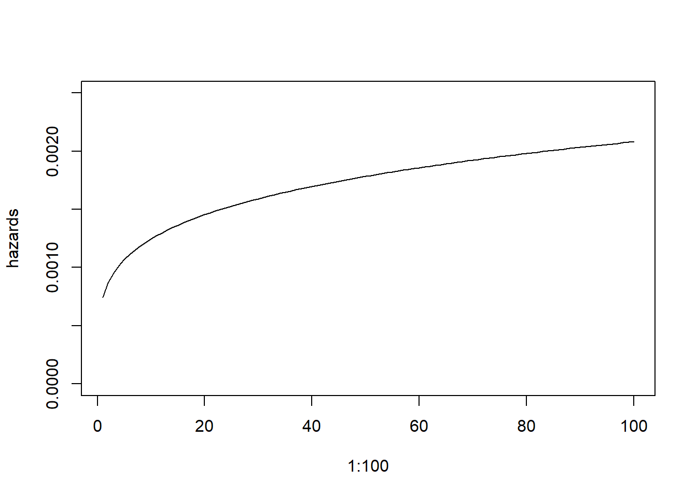
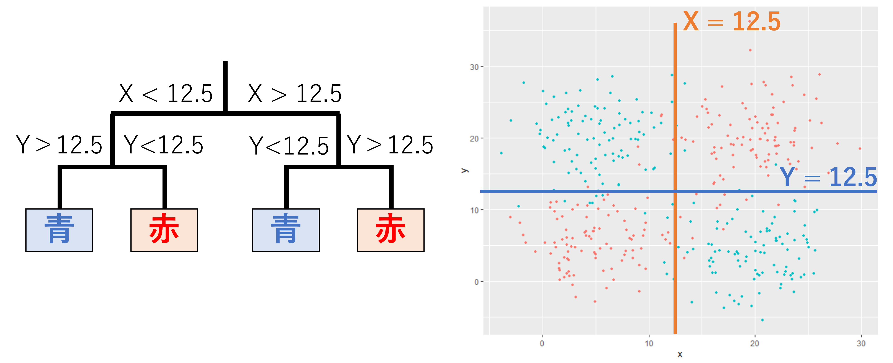
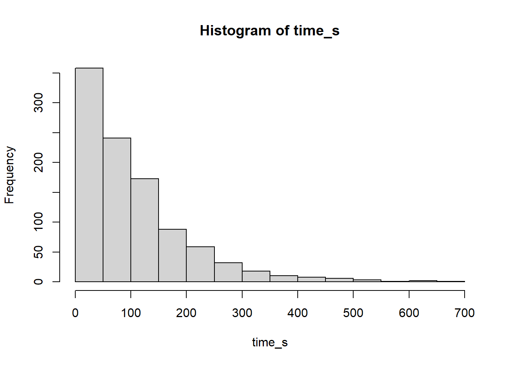
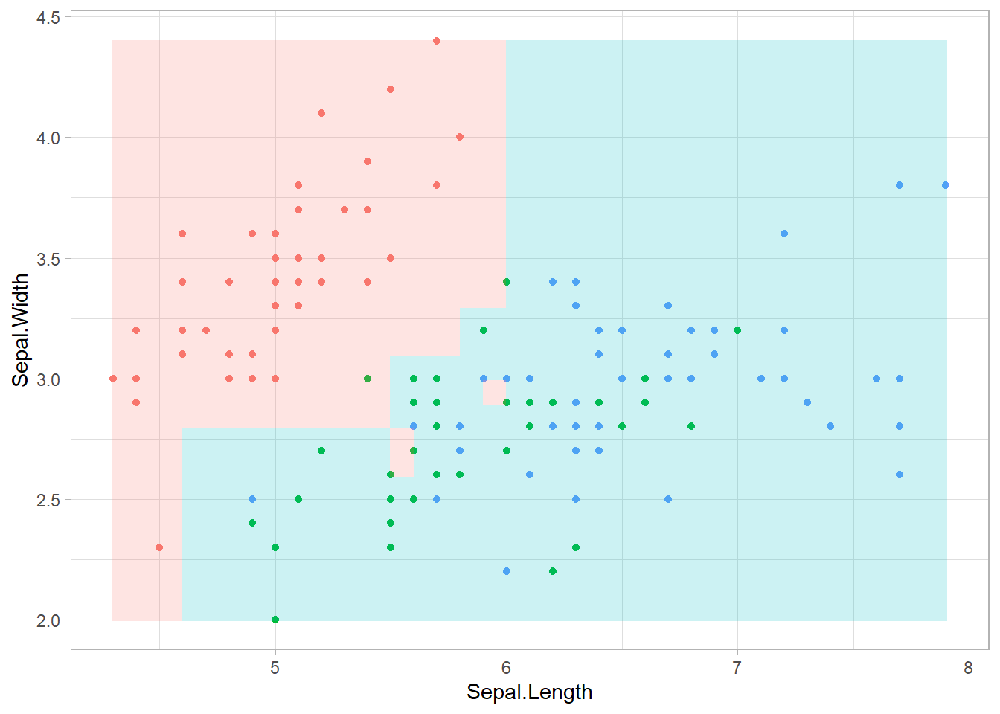
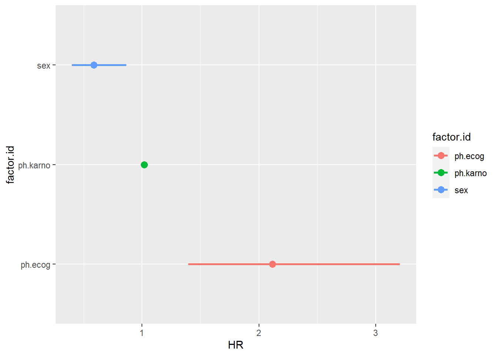
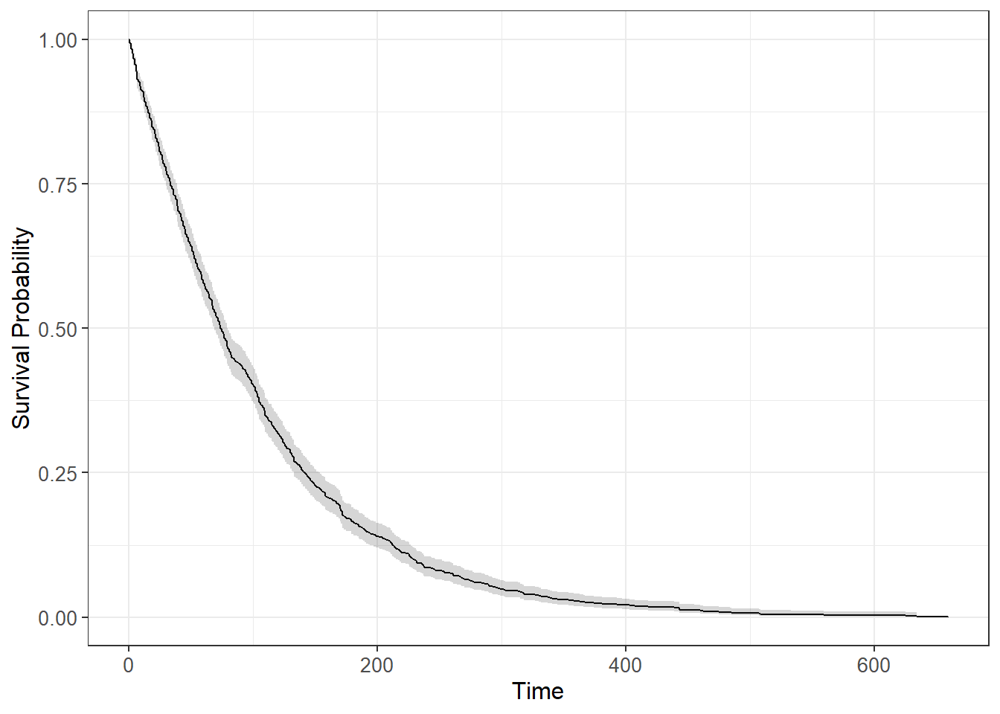

# 31  分類

Code

データがどのような群に分類されるのか評価・予測する**分類**は、検定・回帰と並ぶ統計・機械学習の重要な手法の一つです。分類は**教師あり学習**、**教師なし学習**に大きく二分することができます。

**教師あり学習**とは、今までに取得されたデータ（**訓練データ**）を用いて分類を行うアルゴリズム（**分類器（classifier）**）を作成し、このアルゴリズムを利用して新たに取得されたデータの分類を行う方法を指します。回帰によるデータ予測も、訓練データの回帰による予測を行うことから、教師あり学習に該当します。一般的に機械学習において分類とされるのは、この教師あり学習の分類です。この章ではこの教師あり学習の分類について説明していきます。

**教師なし学習**とは、取れたデータをすべて用いて、似ているデータごとに群として分けるような手法です。教師なし学習では、訓練データと予測を行うデータを明確に分けることはありません。教師なし学習による群分けには、**次元圧縮**と**クラスタリング**があります。教師なし学習については[次の章](chapter32.llms.md)で詳しく解説します。

[](./image/classification_category1.png)

## 31.1 サポートベクターマシン

**サポートベクターマシン（support vector machine、SVM）**はデータの境界線をうまく回帰し、その線を分類に用いる手法です。SVMでは、データの境界線に平行で、かつ2つの群のデータに接する平行線を引き（下図左の赤線）、この平行線の幅（下図右の青線の長さ）が最大となるような境界線を求めます。

ただし、実際のデータでは群のデータが混じっていて、線形で分離できないようなこともあるため、ペナルティ等をもう少し複雑な形で与えて境界線を計算することになります。

[](./image/image_svm.png "図2：SVMのイメージ（左：点と接する平行線（赤線）、右：平行線の幅（青線））")

図2：SVMのイメージ（左：点と接する平行線（赤線）、右：平行線の幅（青線））

Rでは、サポートベクターマシンを含めた色々な機械学習の手法が[e1071](https://cran.r-project.org/web/packages/e1071/index.html)パッケージ ([Meyer et al. 2023](#ref-e1071_bib))により提供されています。

``` downlit
pacman::p_load(e1071)
```

### 31.1.1 訓練データとテストデータ

教師あり学習の機械学習を用いる場合には、まずデータを**訓練データ**と**検証データ（テストデータ）**に分けるのが一般的です。これは[前章](chapter30.llms.md#部分的最小二乗回帰)の部分的最小二乗回帰（PLS）の項で説明したものと同じです。

訓練データとテストデータを分ける場合には、`sample`関数を利用してランダムにデータの行を選ぶのが一般的です。

``` downlit
set.seed(0)
test_v <- sample(nrow(iris), 25, replace=F) # ランダムに行を選ぶ 
test_v <- test_v[order(test_v)]
test_v # テストデータにする行
##  [1]   7  14  21  33  34  35  37  43  51  68  70  73  74  79  84  85  89 105 106
## [20] 110 126 129 141 142 150

train.iris <- iris[-test_v, -3:-4] # 訓練データ（125行）
test.iris <- iris[test_v, -3:-4] # テストデータ（25行）
```

> **TIP:**
>
> 機械学習のデータを取り扱いやすくするためのパッケージである[tidymodels](https://www.tidymodels.org/) ([Kuhn and Wickham 2020](#ref-tidymodels_bib))には、データを訓練データとテストデータに分ける専用の関数が準備されています。`tidymodels`の使い方にはやや癖があり、学習コストが高めですが、覚えれば様々な機械学習をより簡単に実装できるようになります。
>
> ``` downlit
> pacman::p_load(tidymodels)
>
> iris_split <- initial_split(iris, prop = 125/150) # 分け方を指定
> train.iris2 <- training(iris_split) # 訓練データ（125行）
> test.iris2 <- testing(iris_split) # テストデータ（25行）
>
> dim(train.iris2) # 125行のデータフレーム
> ## [1] 125   5
>
> dim(test.iris2) # 25行のデータフレーム
> ## [1] 25  5
> ```

Rでサボートベクターマシンを用いる場合には、`e1071`パッケージの`svm`関数を用います。`svm`関数の使い方は`lm`とよく似ていて、目的とする分類（因子）を目的変数とした`formula`と、データフレーム（`data`）の2つを引数に取ります。以下の例では、`iris`データを用いて、アヤメの種（`Species`）を予測する分類モデルを訓練データを用いてサポートベクターマシンで作成しています。

``` downlit
# 訓練データでサポートベクターマシンを計算（.は目的変数以外の変数すべてを指す）
model.g <- svm(Species ~ ., data = train.iris) # デフォルトはガウスカーネル
```

サポートベクターマシンは予測を行うための分類器ですので、計算結果をそのまま用いてもあまり意味がありません。`svm`関数の返り値を用いて、テストデータの分類を予測する場合には、`predict`関数を用います。

以下のように、テストデータと、テストデータから`predict`関数で予測した値を比較すると、少し間違いはありますが、概ね正しい`Species`が予測されていることがわかります。予測には`iris`の1行目と2行目しか用いていないため精度が低めですが、もっと多くの説明変数を用いれば分類の精度をもう少し上げることもできます。

``` downlit
# predict関数で予測結果を求める
pred_svm <- predict(model.g, test.iris)

# 実際の種と予測した種を比較する（上が実際のデータ、下が予測）
data.frame(test.iris$Species, pred_svm) |> t()
##                   7        14       21       33       34       35      
## test.iris.Species "setosa" "setosa" "setosa" "setosa" "setosa" "setosa"
## pred_svm          "setosa" "setosa" "setosa" "setosa" "setosa" "setosa"
##                   37       43       51           68           70          
## test.iris.Species "setosa" "setosa" "versicolor" "versicolor" "versicolor"
## pred_svm          "setosa" "setosa" "virginica"  "versicolor" "versicolor"
##                   73           74           79           84          
## test.iris.Species "versicolor" "versicolor" "versicolor" "versicolor"
## pred_svm          "virginica"  "versicolor" "versicolor" "versicolor"
##                   85           89           105         106         110        
## test.iris.Species "versicolor" "versicolor" "virginica" "virginica" "virginica"
## pred_svm          "versicolor" "versicolor" "virginica" "virginica" "virginica"
##                   126         129         141         142         150         
## test.iris.Species "virginica" "virginica" "virginica" "virginica" "virginica" 
## pred_svm          "virginica" "virginica" "virginica" "virginica" "versicolor"
```

### 31.1.2 カーネル変換サポートベクターマシン

サポートベクターマシンの基本は図2に示したように、直線で群を分ける方法です。しかし、データによっては群を直線では分けられない場合もあります。このような場合に、SVMでは**カーネル変換**というものを利用して、群を曲線的に分けることができるようにしています。

Rの`svm`関数では、このカーネル変換の手法として、ガウスカーネル（`kernel="radial"`、デフォルトのカーネル）、直線（`kernel="linear"`）、多項式カーネル（`kernel="polynomial"`）、シグモイドカーネル（`kernel="sigmoid"`）の4種類を用いることができます。カーネルの種類は`kernel`引数で指定します。

カーネルの選び方によってSVMの予測精度が変化します。`train.iris`を用いた下記の例では直線カーネルでの精度が高くなっていることがわかります。

``` downlit
# カーネルごとの違いを調べる
model.l <- svm(Species ~ ., data = train.iris, kernel = "linear") # 直線
model.p <- svm(Species ~ ., data = train.iris, kernel = "polynomial") # 多項式
model.s <- svm(Species ~ ., data = train.iris, kernel = "sigmoid") # シグモイド

# 正答率
d.test <- data.frame(
  type = c("ガウス", "直線", "多項式", "シグモイド"),
  accuracy = c(
    sum(predict(model.g, test.iris) == test.iris$Species) / 25,
    sum(predict(model.l, test.iris) == test.iris$Species) / 25,
    sum(predict(model.p, test.iris) == test.iris$Species) / 25,
    sum(predict(model.s, test.iris) == test.iris$Species) / 25
  )
)

knitr::kable(d.test)
```

| type       | accuracy |
|:-----------|---------:|
| ガウス     |     0.88 |
| 直線       |     0.92 |
| 多項式     |     0.76 |
| シグモイド |     0.88 |

各カーネルでの分類の境界線を示したものが、以下のグラフとなります。直線カーネルのみ分類の境界が直線で、その他のカーネル（ガウス、多項式、シグモイド）では分類の境界が曲線となっていることがわかります。

> **TIP:**
>
> ``` downlit
> # 分類の境界線を表示
> d.mat <- expand.grid(
>   Sepal.Length = seq(min(iris$Sepal.Length), max(iris$Sepal.Length), by = 0.01), 
>   Sepal.Width = seq(min(iris$Sepal.Width), max(iris$Sepal.Width), by = 0.01))
>
> d.mat.g <- cbind(d.mat, Species = predict(model.g, d.mat))
> d.mat.l <- cbind(d.mat, Species = predict(model.l, d.mat))
> d.mat.p <- cbind(d.mat, Species = predict(model.p, d.mat))
> d.mat.s <- cbind(d.mat, Species = predict(model.s, d.mat))
>
> pg <- ggplot() +
>   geom_point(data = iris, aes(x = Sepal.Length, y = Sepal.Width, color = Species)) +
>   geom_raster(
>     data = d.mat.g,
>     aes(x = Sepal.Length, y = Sepal.Width, fill = Species),
>     alpha = 0.2
>   ) +
>   theme_light() + theme(legend.position = "none") + labs(title = "ガウスカーネル")
> pl <- ggplot() +
>   geom_point(data = iris, aes(x = Sepal.Length, y = Sepal.Width, color = Species)) +
>   geom_raster(
>     data = d.mat.l,
>     aes(x = Sepal.Length, y = Sepal.Width, fill = Species),
>     alpha = 0.2
>   ) +
>   theme_light() + theme(legend.position = "none") + labs(title = "直線カーネル")
> pp <- ggplot() +
>   geom_point(data = iris, aes(x = Sepal.Length, y = Sepal.Width, color = Species)) +
>   geom_raster(
>     data = d.mat.p,
>     aes(x = Sepal.Length, y = Sepal.Width, fill = Species),
>     alpha = 0.2
>   ) +
>   theme_light() + theme(legend.position = "none") + labs(title = "多項式カーネル")
> ps <- ggplot() +
>   geom_point(data = iris, aes(x = Sepal.Length, y = Sepal.Width, color = Species)) +
>   geom_raster(
>     data = d.mat.s,
>     aes(x = Sepal.Length, y = Sepal.Width, fill = Species),
>     alpha = 0.2
>   ) +
>   theme_light() + theme(legend.position = "none") + labs(title = "シグモイドカーネル")
>
> grid.arrange(pg, pl, pp, ps)
> ```

[](chapter31_files/figure-html/unnamed-chunk-8-1.png)

> **TIP:**
>
> カーネル変換とは、データの写像というものを利用し、元来直線的には分類できないようなデータを写像上で直線的に分類できるようにする手法のことです。写像のイメージとしては、2次元のデータに1次元足して3次元にしているようなものだと思って頂ければよいかと思います。2次元で分離できないものも、1次元追加することで直線（面）で分類できるようになります。この写像の計算の仕方を`kernel`引数で指定しています。

## 31.2 ナイーブベイズ

**ナイーブベイズ**は、古くからMicrosoftのメーラーであるOutlookなどで迷惑メール（Spam）を通常のメール（Ham）と分類するのに用いられてきた分類器です。ナイーブベイズでは、メール文に含まれる文字列（単語など）に対して、学習から得られた各単語がSpamに含まれる確率とHamに含まれる確率を掛け算して、そのメール文がSpamである確率とHamである確率を計算します。Spamである確率がHamである確率より高ければSpam、そうでなければHamと判断します。

ナイーブベイズでは上記の通り、単語がSpamに含まれる確率とHamに含まれる確率をあらかじめ学習する必要があります。ですので、Ham/Spamであることが判別しているメール文が学習データとして必要となります。

Rでナイーブベイズを用いる場合には、`e1071`パッケージの`naiveBayes`関数を用います。

以下にRでSpamとHamを見分ける場合のナイーブベイズのスクリプトを記載します。メールのデータには、[Githubで提供されているHam/Spamメールのデータセット](https://github.com/stedy/Machine-Learning-with-R-datasets/blob/master/sms_spam.csv)を用いています。

> **TIP:**
>
> ナイーブベイズに限らず、文字列を訓練データとした機械学習は増えています。ChatGPTなどのAIも、入力した文書を分類器などのアルゴリズムに代入し、予測値として回答を返す形となっていると思われます。ただし、文字列には余計な文字（例えばスペースや記号、日本語のような粘着語では助詞など）がたくさん含まれており、そのまま分類器に与えることはできません。
>
> ですので、文字列を用いた機械学習を行う際には、文字列を取り扱うための専用のパッケージやソフトウェアを用いて文字列の前処理を行う必要があります。
>
> 今回の例のように英語であれば、Rのパッケージ（以下に示す[tm](https://cran.r-project.org/web/packages/tm/index.html) ([Feinerer et al. 2008](#ref-tm_bib))や[SnowballC](https://cran.r-project.org/web/packages/SnowballC/index.html) ([Bouchet-Valat 2023](#ref-SnowballC_bib))など）を用いて文字列をコーパス（単語のまとまり）にまとめたり、そのコーパスの数を数えたりすることができます。日本語であれば、[MeCab](https://taku910.github.io/mecab/)（形態素分析という、単語で区切って品詞のラベルをつけるためのツール、Rからは[RMeCab](http://rmecab.jp/wiki/index.php?RMeCab)パッケージ([Ishida and Kudo 2023](#ref-RMeCab_bib))を用いて使用できる）などを用いた前処理を必要とします。
>
> 前処理を行った文字列のデータと、Ham/Spamのラベルを組み合わせて分類器の学習を行います。新規のメールの分類では、やはり文字列を同様に前処理した上で分類器に与え、Ham/Spamの判定を行うことになります。
>
> 以下に、前処理のコードを示します。かなり複雑ですが、この流れでナイーブベイズの訓練データ・テストデータを作成することができます。
>
> ``` downlit
> # 文字列の操作を行うためのパッケージ
> pacman::p_load(tm, SnowballC)
>
> # SMS Spam Collection Datasetをロード（kaggleから拾ってくる）
> sns <- read.csv("./data/spam.csv", stringsAsFactors = F, encoding = 'UTF-8')
> sns <- sns[,1:2]
> colnames(sns) <- c("type", "text")
>
> # 文字列をコーパスに変換
> data_corpus <- VCorpus(VectorSource(sns$text))
>
> # データのクリーニング
> clean_corpus <- tm_map(data_corpus, removeWords,stopwords(kind = "english")) # 英語以外の文字を取り除く
> clean_corpus <- tm_map(clean_corpus, stripWhitespace) # 複数のスペースを1つに変換
> clean_corpus <- tm_map(clean_corpus, content_transformer(tolower)) # 大文字を小文字に変換
> clean_corpus <- tm_map(clean_corpus, removePunctuation) # 句読点を取り除く
> clean_corpus <- tm_map(clean_corpus, removeNumbers) # 数字を取り除く
> clean_corpus <- tm_map(clean_corpus, stemDocument) # stem化をする（pay, paid, payingなどをpayに統一）
>
> dados_dtm <- DocumentTermMatrix(clean_corpus) # termと文章を行列にする
> # dados_dtmの中身、行はsnsのテキスト、列は単語、数字が入っていると単語が含まれる
> inspect(dados_dtm[1:5, 1:8]) 
> ## <<DocumentTermMatrix (documents: 5, terms: 8)>>
> ## Non-/sparse entries: 0/40
> ## Sparsity           : 100%
> ## Maximal term length: 11
> ## Weighting          : term frequency (tf)
> ## Sample             :
> ##     Terms
> ## Docs ��� aah aaniy aaooooright aathi aathilov abbey abdomen
> ##    1   0   0     0           0     0        0     0       0
> ##    2   0   0     0           0     0        0     0       0
> ##    3   0   0     0           0     0        0     0       0
> ##    4   0   0     0           0     0        0     0       0
> ##    5   0   0     0           0     0        0     0       0
>
> # 訓練データとテストデータに分ける
> data_dtm_train <- dados_dtm[1:4169, ]
> data_dtm_test <- dados_dtm[4170:5559, ]
>
> # ラベルは別途分ける
> data_train_labels <- sns[1:4169, ]$type
> data_test_labels <- sns[4170:5559, ]$type
>
> # スパム/ハムの割合を表示（大体87%ハムで同じ）
> prop.table(table(data_train_labels))
> ## data_train_labels
> ##       ham      spam 
> ## 0.8644759 0.1355241
> prop.table(table(data_test_labels))
> ## data_test_labels
> ##       ham      spam 
> ## 0.8705036 0.1294964
>
> # 5回以上見つかったWordのみ拾う
> sms_freq_words <- findFreqTerms(data_dtm_train, 5)
>
> # 5文字以上見つかったWordだけを学習・テストデータに使う
> sms_dtm_freq_train <- data_dtm_train[ , sms_freq_words]
> sms_dtm_freq_test <- data_dtm_test[ , sms_freq_words]
>
> # 文字があるかないかの2値に変換する関数
> convert_counts <- function(x){
>   x <- ifelse(x > 0, "Yes", "No")
> }
>
> # 数値データをYes/Noのデータに変換
> sms_train <- apply(sms_dtm_freq_train, MARGIN = 2, convert_counts)
> sms_test <- apply(sms_dtm_freq_test, MARGIN = 2, convert_counts)
> ```

ナイーブベイズの分類器を作成するための関数である`naiveBayes`は、訓練データとラベルのベクターを引数に取ります（`formula`で訓練データとラベルを与えることもできます）。分類器からの予測には、`predict`関数を用います。十分な学習データがあれば、かなり高い精度でHam/Spamを分類することができます。

``` downlit
# ナイーブベイズで学習
nb_classifier <- naiveBayes(sms_train, data_train_labels)

# テストデータで予測
sms_test_pred <- predict(nb_classifier, sms_test)

# 検証したデータで、スパム/ハムが見分けられている
data_test_labels[21:30]
##  [1] "ham"  "ham"  "ham"  "ham"  "ham"  "spam" "ham"  "spam" "spam" "spam"
sms_test_pred[21:30] %>% as.character()
##  [1] "ham"  "ham"  "ham"  "ham"  "ham"  "spam" "ham"  "spam" "spam" "spam"

# 正答率は97.8%ぐらい
sum(sms_test_pred == data_test_labels)/1390
## [1] 0.9776978
```

## 31.3 決定木

**決定木（decision tree）**は弱分類器と呼ばれる、非常に単純な線形分類器（例えば、x＞0のときはA、x\<=0のときはBなど）を組み合わせて、複雑な分類を行う手法（アンサンブル学習）です。

[](./image/decision_tree.png "図3：決定木のイメージ")

図3：決定木のイメージ

決定木は、弱分類器の組み合わせの選び方のアルゴリズムによって、**バギング**と**ブースティング**と呼ばれる2つの手法に大別されています。これらのうち、バギングと呼ばれるものの一種が**ランダムフォレスト（Random Forest）**と呼ばれる手法です。ランダムフォレストは21世紀初頭から用いられており、優秀な分類器として長く使われています。もう一つのブースティングについては2015年頃から良いアルゴリズムがいくつか開発されており、分類性能の非常に高い分類器として用いられています。

### 31.3.1 ランダムフォレスト

**ランダムフォレスト**は、ランダムに決定木による分類器をたくさん生成し、その平均や多数決の結果を最終的な分類器とする方法です。Rでランダムフォレストを利用する場合には、[randomForest](https://cran.r-project.org/web/packages/randomForest/index.html)パッケージ([Liaw and Wiener 2002](#ref-randomForest_bib))の`randomForest`関数を用います。`randomForest`関数の使い方は`lm`関数や`svm`関数とほぼ同じで、第一引数に`formula`を取ります。予測に`predict`関数を用いるところも`svm`と同じです。

ランダムフォレストによる分類では、分類の境界は基本的に縦横に配置されます。これは、上記のようにランダムフォレストが決定木の組み合わせからなる分類器であるためです。

``` downlit
## ランダムフォレスト
pacman::p_load(randomForest)
rf.iris <- randomForest(Species ~ ., data = train.iris)
predict(rf.iris, test.iris)
##          7         14         21         33         34         35         37 
##     setosa     setosa     setosa     setosa     setosa     setosa     setosa 
##         43         51         68         70         73         74         79 
##     setosa  virginica  virginica versicolor  virginica versicolor versicolor 
##         84         85         89        105        106        110        126 
##  virginica     setosa versicolor  virginica  virginica  virginica  virginica 
##        129        141        142        150 
##  virginica versicolor versicolor versicolor 
## Levels: setosa versicolor virginica

# 正答率
sum(predict(rf.iris, test.iris) == test.iris$Species) / 25
## [1] 0.68

# 分類の境界線を記述
d.mat.rf <- cbind(d.mat, Species = predict(rf.iris, d.mat))
ggplot()+
  geom_point(data = iris, aes(x = Sepal.Length, y = Sepal.Width, color = Species)) +
  geom_raster(data = d.mat.rf, aes(x = Sepal.Length, y = Sepal.Width, fill = Species), alpha = 0.2) +
  theme_light() + theme(legend.position = "none")
```

[](chapter31_files/figure-html/unnamed-chunk-11-1.png)

### 31.3.2 ブースティング

**ブースティング**も決定木の一種ですが、分類器をランダムに生成するのではなく、決定木を少しずつ変化させ最適化するような手法です。ブースティングは以前はそれほど用いられてはいませんでしたが、勾配ブースティングと呼ばれる改良化されたアルゴリズムが開発されてから非常に分類精度の高い手法としてよく用いられています。

ブースティングのアルゴリズムには、昔からある[Adaboost](https://www.sciencedirect.com/science/article/pii/S002200009791504X)や、2015年以降に開発された[XGBoost](https://xgboost.readthedocs.io/en/stable/#)、[LightGBM](https://lightgbm.readthedocs.io/en/stable/)、[CatBoost](https://catboost.ai/)等があります。特に2015年以降に開発された後者の分類性能は高いとされています。

RではAdaboostは[JOUSBoost](https://cran.r-project.org/web/packages/JOUSBoost/index.html)パッケージ ([Olson 2017](#ref-JOUSBoost_bib))、XGBoostは[xgboost](https://cran.r-project.org/web/packages/xgboost/index.html)パッケージ ([Chen et al. 2023](#ref-xgboost_bib))、LightGBMは[lightgbm](https://cran.r-project.org/web/packages/lightgbm/index.html)パッケージ ([Shi et al. 2024](#ref-lightgbm_bib))、CatBoostは[catboost](https://catboost.ai/en/docs/installation/r-installation-github-installation)パッケージ ([Prokhorenkova et al. 2017](#ref-catboost_bib))を用いることで利用できます。ただし、`catboost`にはPythonのライブラリが必要となるので、Rでは利用の難易度が高めです。

以下に、XGBoostを利用した分類の例を示します。説明変数となるデータが少なく、モデルの最適化も行っていないため、上記のランダムフォレストと同程度の精度（0.64）となっています。

``` downlit
## ブースティング（XGboost）
pacman::p_load(xgboost)

# xgboostパッケージでは、テストデータをdgCMatrixというクラスに変換する必要がある
xg.train.iris <- Matrix::sparse.model.matrix(Species ~ . + 0, data = train.iris)
xg.test.iris <- Matrix::sparse.model.matrix(Species ~ . + 0, data = test.iris)

# ラベルは数値しか受け付けない
label <- train.iris$Species %>% as.numeric - 1

# 全然最適化されていない訓練
xg.iris <- xgboost(
  x = xg.train.iris, 
  y = label,
  nthreads = 1,
  nround = 5 # 計算の繰り返し回数
  )
```

``` downlit
# 予測結果と正答率
sp <- c("setosa", "versicolor", "virginica")
sum(sp[predict(xg.iris, xg.test.iris) + 1] == test.iris$Species)/25
## [1] 0.64
```

``` downlit
# 分類の境界線を記述
xg.d.mat <- Matrix::sparse.model.matrix(Species ~ . + 0, data = cbind(Species = 0, d.mat))
d.mat.xg <- cbind(d.mat, Species = sp[predict(xg.iris, xg.d.mat) + 1])
ggplot()+
  geom_point(data = iris, aes(x = Sepal.Length, y = Sepal.Width, color = Species)) +
  geom_raster(data = d.mat.xg, aes(x = Sepal.Length, y = Sepal.Width, fill = Species), alpha = 0.2) +
  theme_light() + theme(legend.position = "none")
```

[](chapter31_files/figure-html/unnamed-chunk-14-1.png)

## 31.4 ニューラルネットワーク

[前の章](chapter30.llms.md#ニューラルネットワーク回帰)でも紹介した**ニューラルネットワーク**は、分類でも用いられる機械学習の手法です。目的変数にカテゴリカルデータを用いる点が回帰とは異なります。

Rでは、回帰と同様に`neuralnet`パッケージの`neuralnet`関数を用いてニューラルネットワークでの分類器を作成することができます。`neuralnet`関数で分類を行う際にはformulaの目的変数の設定が特殊で、`(列名=='ラベル')`の形で分類するカテゴリを示し、各カテゴリを`+`でつなぎます。具体的には以下の`formula`のように指定します。

``` downlit
formula_iris <- 
  as.formula(
    # 上の行がラベル、下の行が説明変数
    "(Species == 'setosa') + (Species == 'versicolor') +  (Species == 'virginica') ~ 
      Sepal.Length + Sepal.Width"
  )
```

`neuralnet`関数の使い方は回帰の際と同じです。引数として、`formula`、`data`、`hidden`（隠れ層、中間層）、`act.fct`（活性化関数）を指定します。

`hidden`の指定では、3個のパーセプトロンを2層の場合には`hidden=c(3,3)`、2個のパーセプトロンを3層の場合には`hidden=c(2,2,2)`とベクターを用いて示します。活性化関数には`"logistic"`（ソフトマックス関数）か`"tanh"`（Hyperbolic tangent）のどちらかを指定します。

計算した分類器を`plot`関数の引数に取ることで、重みとバイアスをグラフで表示することができます。

``` downlit
pacman::p_load(neuralnet)

set.seed(2)

nn.iris <- neuralnet(
  formula = formula_iris,
  data = train.iris,
  hidden = c(3, 2),
  act.fct = "logistic"
)
plot(nn.iris, rep = "best")
```

[](chapter31_files/figure-html/unnamed-chunk-16-1.png)

`neuralnet`での予測にも、`predict`関数を用います。引数が`neuralnet`関数の返り値とテストデータのデータフレームである点も、回帰と同じです。ただし、分類の予測は確率として表示されます。各行のうち最も値が高い、つまり確率が高いものが分類結果となります。以下の例では、1列目がsetosa、2列目がversicolor、3列目がvirginicaである確率となります。

``` downlit
# 予測は確率で出てくる
pred.test <- predict(nn.iris, test.iris)
pred.test |> head()
##         [,1]          [,2]          [,3]
## 7  1.0007861 -0.0001940386 -0.0005022254
## 14 1.0007861 -0.0001940386 -0.0005022254
## 21 0.9880775 -0.0067728564  0.0187861514
## 33 1.0007861 -0.0001940386 -0.0005022254
## 34 1.0007861 -0.0001940386 -0.0005022254
## 35 1.0007861 -0.0001940386 -0.0005022254
```

結果を種名に変更し、正答率を計算したのが以下のスクリプトです。88%とそこそこの正答率となっています。また、分類の境界線はやや不自然ですが、基本的に直線的な部分が多い曲線で構成されています。ただしニューラルネットワークの境界部分での確率はなだらかに変化しています。例えば、青と緑の境界では、青の確率50％ぐらい、緑の確率50％ぐらいとなっています。

``` downlit
pred.sp <- numeric(nrow(pred.test))
for(i in 1:nrow(pred.test)){
  pred.sp[i] <- (pred.test[i,] %>% max == pred.test[i,]) %>% sp[.]
}
sum(pred.sp == test.iris$Species)/25
## [1] 0.88
```

``` downlit
pred.mat <- predict(nn.iris, d.mat)
pred.mat2 <- numeric(nrow(pred.mat))
for(i in 1:nrow(pred.mat)){
  pred.mat2[i] <- (pred.mat[i,] %>% max == pred.mat[i,]) %>% sp[.]
}

d.mat.nn <- cbind(d.mat, Species = pred.mat2)
ggplot()+
  geom_point(data = iris, aes(x = Sepal.Length, y = Sepal.Width, color = Species))+
  geom_raster(data = d.mat.nn, aes(x = Sepal.Length, y = Sepal.Width, fill = Species), alpha = 0.2)+
  theme_light() + theme(legend.position = "none") 
```

[](chapter31_files/figure-html/unnamed-chunk-19-1.png)

``` downlit
pred.mat <- predict(nn.iris, d.mat) |> scale()
colnames(pred.mat) <- c("setosa", "versicolor", "virginica")

d.mat.nn <- cbind(d.mat, pred.mat)

pacman::p_load(patchwork)

p1 <- ggplot()+
  geom_raster(data = d.mat.nn, aes(x = Sepal.Length, y = Sepal.Width, fill = -setosa), alpha = 0.5)+ 
  scale_fill_distiller(palette = "Reds")+
  geom_point(data = iris, aes(x = Sepal.Length, y = Sepal.Width, color = Species))+
  theme_light()+
  theme(legend.position = "none") + 
  labs(title = "setosa")

p2 <- ggplot()+
  geom_raster(data = d.mat.nn, aes(x = Sepal.Length, y = Sepal.Width, fill = -versicolor), alpha = 0.5)+
  scale_fill_distiller(palette = "Greens")+
  geom_point(data = iris, aes(x = Sepal.Length, y = Sepal.Width, color = Species))+
  theme_light() + theme(legend.position = "none") + labs(title = "versicolor")
  
p3 <- ggplot()+
  geom_raster(data = d.mat.nn, aes(x = Sepal.Length, y = Sepal.Width, fill = -virginica), alpha = 0.5)+
  scale_fill_distiller(palette = "Blues")+
  geom_point(data = iris, aes(x = Sepal.Length, y = Sepal.Width, color = Species))+
  theme_light() + theme(legend.position = "none") + labs(title = "virginica")

p1 + p2 + p3
```

[](chapter31_files/figure-html/unnamed-chunk-20-1.png)

Bouchet-Valat, Milan. 2023. *SnowballC: Snowball Stemmers Based on the c ’Libstemmer’ UTF-8 Library*. <https://CRAN.R-project.org/package=SnowballC>.

Chen, Tianqi, Tong He, Michael Benesty, et al. 2023. *Xgboost: Extreme Gradient Boosting*. <https://CRAN.R-project.org/package=xgboost>.

Feinerer, Ingo, Kurt Hornik, and David Meyer. 2008. “Text Mining Infrastructure in r.” *Journal of Statistical Software* 25 (5): 1–54. <https://doi.org/10.18637/jss.v025.i05>.

Ishida, Motohiro, and Taku Kudo. 2023. *RMeCab: Interface to MeCab*.

Kuhn, Max, and Hadley Wickham. 2020. *Tidymodels: A Collection of Packages for Modeling and Machine Learning Using Tidyverse Principles.* <https://www.tidymodels.org>.

Liaw, Andy, and Matthew Wiener. 2002. “Classification and Regression by randomForest.” *R News* 2 (3): 18–22. <https://CRAN.R-project.org/doc/Rnews/>.

Meyer, David, Evgenia Dimitriadou, Kurt Hornik, Andreas Weingessel, and Friedrich Leisch. 2023. *E1071: Misc Functions of the Department of Statistics, Probability Theory Group (Formerly: E1071), TU Wien*. <https://CRAN.R-project.org/package=e1071>.

Olson, Matthew. 2017. *JOUSBoost: Implements Under/Oversampling for Probability Estimation*. <https://CRAN.R-project.org/package=JOUSBoost>.

Prokhorenkova, Liudmila, Gleb Gusev, Aleksandr Vorobev, Anna Veronika Dorogush, and Andrey Gulin. 2017. *CatBoost: Unbiased Boosting with Categorical Features*. <https://arxiv.org/abs/1706.09516>.

Shi, Yu, Guolin Ke, Damien Soukhavong, et al. 2024. *Lightgbm: Light Gradient Boosting Machine*. <https://CRAN.R-project.org/package=lightgbm>.

Back to top
