# 32  教師なし学習

Code

- [Show All Code](javascript:void(0))

- [Hide All Code](javascript:void(0))

- 

  ------------------------------------------------------------------------

- [View Source](javascript:void(0))

**教師なし学習**は、データの特徴を捉えるためにデータを変換したり、群に分ける方法の総称です。教師なし学習の特徴は、以前に取ったデータと新しく取得したデータを分けて用いる教師あり学習とは異なり、すべてのデータを一度に用いて学習を行うことです。教師なし学習には、以下の図1のように、データをグループに分ける**クラスタリング**と、多次元のデータを理解しやすいように変換する**次元圧縮**の2つが含まれます。

[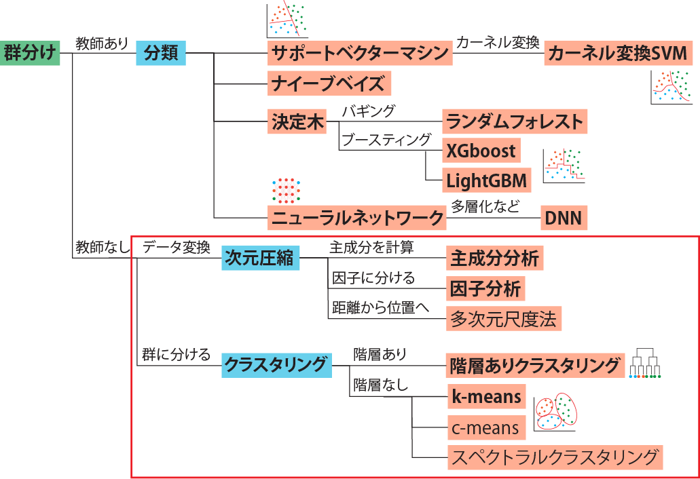](./image/classification_category2.png)

## 32.1 クラスタリング

**クラスタリング**とは、1つの要素にたくさんのデータが付随している、多次元データを用いて、要素間が互いに似ているかどうかを判断し、互いに似ているもの同士を一つのグループにまとめる方法です。類似した要素のまとまりを見つけるときに用いられます。

「1つの要素にたくさんのデータ」というのはイメージしにくいかもしれませんが、例えば、ある個人について付随しているデータを考えると、年齢、性別、身長、体重、職業、趣味など、1人にたくさんのデータがくっついてきます。ある個人Aさんと別の個人Bさんでは、異なるデータがくっついていることになります。AさんとBさんの属性が似ているかどうかは、そのデータがどれぐらい似ているかを調べればわかります。このように1人あたりのデータがたくさんある状態のことを**多次元データ**であると考えることができます。

多次元データがどの程度似ているのかを表現できれば、個々人が似ている・似ていないを判断することができ、似ている人をグループとして分けることができます。この似ている人同士をグループにすることがクラスタリングに当たります。

クラスタリングするときに、似ているものから順番に線でつないでいく方法のことを**階層ありクラスタリング**、似ているものを大まかにグループ分けする方法を**階層なしクラスタリング**と呼びます。

## 32.2 階層ありクラスタリング

### 32.2.1 距離行列

階層ありクラスタリングとは、多次元データ間の**距離**を計算することで、個々のデータについて似ている度合いを評価し、評価に従って似ているものから**クラスター**に分けていく手法のことです。まずは、データを**距離行列**に変換する必要があります。

距離行列とは、たくさんあるデータとデータの距離を行列としてまとめたものです。最も単純な距離行列は2つのデータの直線距離（ユークリッド距離）です。

距離行列についてイメージしやすいように、まずは、都道府県の県庁所在地の緯度・経度のデータを用いて距離行列を計算します。都道府県の緯度経度情報は[Github Gistのページ（ctsaran/gist:42728dad3c7d8bd91f1d）](https://gist.github.com/ctsaran/42728dad3c7d8bd91f1d)からダウンロードしています。

簡便化のために、関西の都道府県のみを用います。緯度・経度から、関西の都道府県は下のグラフに示すように位置していることがわかります。この時、各県から別の県までの直線距離をそれぞれ求めることができます。これを行列にまとめたのが距離行列です。Rでは、`dist`関数というものを用いて、緯度・経度のデータからユークリッド距離の距離行列を求めることができます。

``` downlit
kansai <- read.csv("./data/pref_lat_lon.csv", header = T, fileEncoding = "CP932")

# 関西の都道府県データのみ取得する
kansai <- kansai[24:30, ]
kansai # 各県の緯度と経度
##    pref_name      lat      lon
## 24    三重県 34.73055 136.5086
## 25    滋賀県 35.00453 135.8686
## 26    京都県 35.02100 135.7531
## 27    大阪府 34.68649 135.5190
## 28    兵庫県 34.69128 135.1831
## 29    奈良県 34.68530 135.8327
## 30  和歌山県 34.22481 135.1679

ggplot(
  kansai, 
  aes(x = lon, y = lat, color = pref_name, label = pref_name)) + 
  geom_text() # 県庁所在地の位置
```

[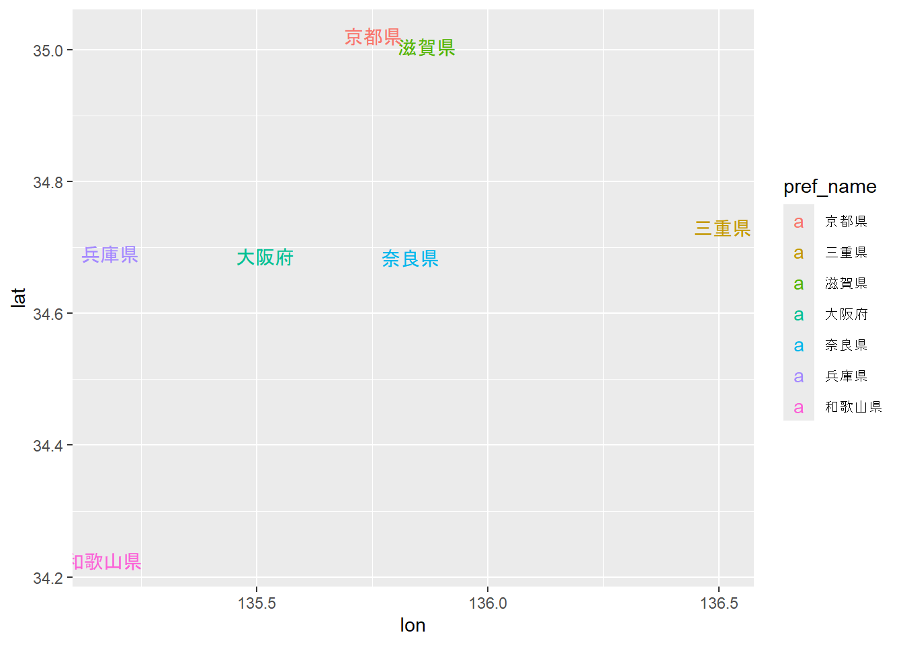](chapter32_files/figure-html/unnamed-chunk-1-1.png)

``` downlit
# ユークリッド距離（数値は24から順に三重、滋賀、京都、大阪、兵庫、奈良、和歌山）
dist(kansai[, 2:3], method="euclidean") 
##           24        25        26        27        28        29
## 25 0.6962011                                                  
## 26 0.8094045 0.1166423                                        
## 27 0.9905981 0.4726170 0.4082964                              
## 28 1.3261045 0.7536832 0.6585157 0.3359391                    
## 29 0.6773781 0.3212419 0.3450157 0.3137553 0.6496856          
## 30 1.4328793 1.0482682 0.9880967 0.5799866 0.4667195 0.8087048
```

上の例では緯度・経度の2つのデータから距離行列を計算していますが、もっとたくさんの列があるデータにおいても同様に距離行列を計算することができます。また、距離行列には、距離の計算の仕方によってさまざまな種類のものがあります。距離としてよく用いられるものは、**ユークリッド距離**（2点間の直線の距離）と**マンハッタン距離**（2点間を移動するときの横と縦の移動距離を足したもの）の2つです。

この距離行列を用いて、距離が近いもの同士をクラスターにまとめていくものが、**階層ありクラスタリング（hierarchical clustering）**です。

## ユークリッド距離

``` downlit
# ユークリッド距離
#（軸の数値は24から順に三重、滋賀、京都、大阪、兵庫、奈良、和歌山）
dist(kansai[, 2:3], method = "euclidean") 
##           24        25        26        27        28        29
## 25 0.6962011                                                  
## 26 0.8094045 0.1166423                                        
## 27 0.9905981 0.4726170 0.4082964                              
## 28 1.3261045 0.7536832 0.6585157 0.3359391                    
## 29 0.6773781 0.3212419 0.3450157 0.3137553 0.6496856          
## 30 1.4328793 1.0482682 0.9880967 0.5799866 0.4667195 0.8087048
```

## 最大距離

``` downlit
# 縦と横の距離の最大値を取る
dist(kansai[, 2:3], method = "maximum") 
##           24        25        26        27        28        29
## 25 0.6400220                                                  
## 26 0.7554965 0.1154745                                        
## 27 0.9896180 0.3495960 0.3345042                              
## 28 1.3255230 0.6855010 0.5700265 0.3359050                    
## 29 0.6758650 0.3192360 0.3357002 0.3137530 0.6496580          
## 30 1.3406600 0.7797260 0.7961902 0.4616860 0.4664740 0.6647950
```

## マンハッタン距離

``` downlit
# マンハッタン距離
dist(kansai[, 2:3], method = "manhattan") 
##           24        25        26        27        28        29
## 25 0.9140070                                                  
## 26 1.0459457 0.1319387                                        
## 27 1.0336730 0.6676360 0.5686257                              
## 28 1.3647900 0.9987530 0.8997427 0.3406930                    
## 29 0.7211160 0.3550790 0.4153317 0.3149490 0.6556420          
## 30 1.8464010 1.4803640 1.3813537 0.8127280 0.4816110 1.1252850
```

## キャンベラ距離

``` downlit
# キャンベラ距離
#（原点近くの距離を大きく見積もる、2点の距離を原点からの距離の絶対値の和で割る）
dist(kansai[, 2:3], method = "canberra")
##             24          25          26          27          28          29
## 25 0.006278704                                                            
## 26 0.006938945 0.000660247                                                
## 27 0.004272575 0.005851752 0.005661734                                    
## 28 0.005444405 0.007023602 0.006833586 0.001309879                        
## 29 0.003133566 0.004712733 0.005109133 0.001173500 0.002483376            
## 30 0.012269091 0.013847973 0.013657932 0.007996570 0.006824715 0.009135586
```

## バイナリ距離

``` downlit
# バイナリ距離（距離が0なら1、0でなければ0を返す）
dist(kansai[, 2:3], method = "binary") 
##    24 25 26 27 28 29
## 25  0               
## 26  0  0            
## 27  0  0  0         
## 28  0  0  0  0      
## 29  0  0  0  0  0   
## 30  0  0  0  0  0  0
```

## ミンコフスキー距離

``` downlit
# ミンコフスキー距離
#（ユークリッドとマンハッタンの中間的なもの、pという引数を別途取る。pのデフォルトは2）
dist(kansai[, 2:3], method = "minkowski") 
##           24        25        26        27        28        29
## 25 0.6962011                                                  
## 26 0.8094045 0.1166423                                        
## 27 0.9905981 0.4726170 0.4082964                              
## 28 1.3261045 0.7536832 0.6585157 0.3359391                    
## 29 0.6773781 0.3212419 0.3450157 0.3137553 0.6496856          
## 30 1.4328793 1.0482682 0.9880967 0.5799866 0.4667195 0.8087048
```

### 32.2.2 Rでの階層ありクラスタリング

Rでは、階層ありクラスタリングを`hclust`関数を用いて行います。`hclust`関数の第一引数は距離行列で、上に述べた通り`dist`関数を用いて計算します。`method`引数には、クラスタリングの方法を指定します。クラスタリングの方法は、`"complete"`（デフォルト）、`"ward.D"`、`"ward.D2"`、`"single"`、`"average"`、`"mcquitty"`、`"median"`、`"centroid"`の8つから選択します。

この、`hclust`関数の返り値を`plot`することで、クラスタリングの結果を確認することができます。`hclust`関数の返り値自体を確認することはあまりないため、基本的には`plot`して使うものだと考えてもらうとよいと思います。`plot`関数において、`hang`引数を`-1`に指定すると、クラスタリングする要素の下端をそろえることができます。

`plot`関数で表示されるのは、より近いもの同士も線でつないだ樹形上の図です。線でつながった距離が近いほど、データがよく似ていることを示しています。上記の都道府県の緯度・経度でクラスタリングを行うと、距離の近さとクラスタリングの図上の近さが対応しているのがわかるかと思います。

## 下揃えなし

``` downlit
JPll <- read.csv("./data/pref_lat_lon.csv", header = T, row.names = 1, fileEncoding = "CP932")
hc <- hclust(dist(JPll), method = "complete") # 引数は距離行列
plot(hc) # 樹形図の作図
```

[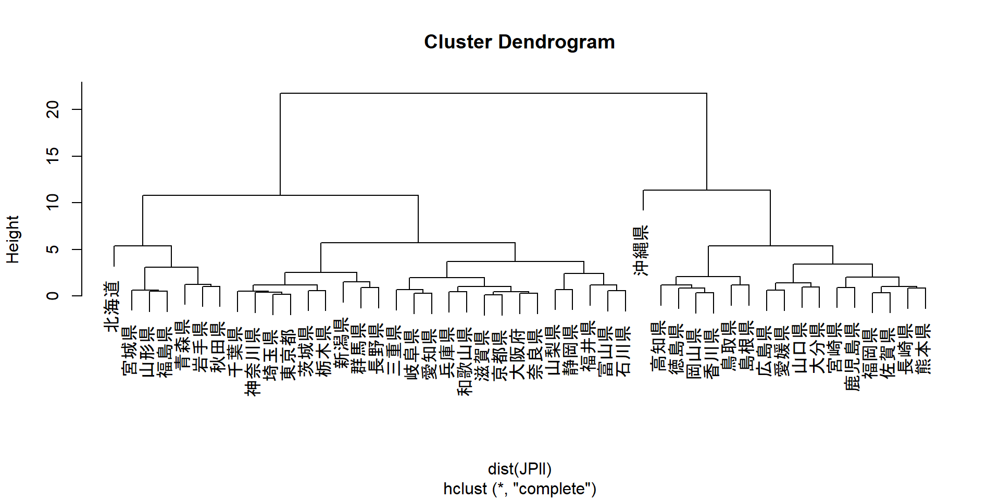](chapter32_files/figure-html/unnamed-chunk-9-1.png)

## 下揃えあり

``` downlit
plot(hc, hang = -1)
```

[](chapter32_files/figure-html/unnamed-chunk-10-1.png)

## 32.3 階層なしクラスタリング

階層ありクラスタリングでは、距離の近いデータ同士をつなぐため、各データのクラスタの近さは厳密に計算されています。一方で、この方法では距離行列を必ず計算する必要があり、データが増えると計算回数がどんどん増えていきます。

データ同士の距離ではなく、「クラスターの中心」を定め、この中心からの距離が近いものを同じクラスターであるとしてグループ分けする方法のことを**階層なしクラスタリング**と呼びます。こちらの方法であれば、計算回数はクラスター数に依存するため、データが増えても大きくは計算回数が増えず、比較的単純な計算でグループ分けを行うことができます。一方で、厳密にデータ間の距離を計算しているわけではないので、階層ありクラスタリングのように細かなデータの類似性を評価することはできません。

この階層なしクラスタリングの最も代表的なものが、**k-mean法**です。

## 32.4 k-means

**k-means法**では、あらかじめ乱数に従い「クラスターの中心」を設定します。このクラスターの中心の数は解析する人が設定する必要があります。次に、このクラスターの中心からの距離が近いデータを、そのクラスターのデータであるとします。この仮のクラスターができたら、次にクラスター内のデータの重心を求めます。重心が定まったら、この重心を新しい「クラスターの中心」として、クラスターの中心の位置を更新します。

このクラスターの中心を重心に更新する試行を、重心が移動しなくなるまで繰り返した時のクラスター内のデータをクラスターのメンバーとします。言葉ではわかりにくいので、以下にk-meansによるクラスタリングの図を示します。また、[こちらのリンク](http://tech.nitoyon.com/ja/blog/2013/11/07/k-means/)、もしくは[このWebアプリケーション](https://xjorv.shinyapps.io/kmeans_animate/)を見ていただくと、k-meansをよりイメージしやすいかと思います。WebアプリケーションはRで、

`if(!require(shiny)){install.packages("shiny")};runGitHub("kmeans_animated", "sb8001at-oss")`

を実行することでも利用することができます。

> **TIP:**
>
> ``` downlit
> set.seed(0)
>
> # データにはirisのがく片データを使用
> data <- iris[, 1:2]
> colnames(data) <- c("x", "y")
>
> # クラスターの中心の初期値
> center_means <- 
>   data.frame(
>     x = rnorm(3, mean(data[ ,1]), sd(data[ ,1])), 
>     y = rnorm(3, mean(data[ ,2]), sd(data[ ,2])),
>     clus = 1:3)
>
> # アウトプットを保存する変数
> data_for_gganimate <- NULL
>
> for(i in 1:20){ # おそらくi=16ぐらいで収束している
>   
>   # 各中心からの距離の計算
>   dist_d <- data.frame(
>     dist_1 = (data$x - center_means[1, 1]) ^ 2 + (data$y - center_means[1, 2]) ^ 2,
>     dist_2 = (data$x - center_means[2, 1]) ^ 2 + (data$y - center_means[2, 2]) ^ 2,
>     dist_3 = (data$x - center_means[3, 1]) ^ 2 + (data$y - center_means[3, 2]) ^ 2
>   )
>   
>   # 最も近いクラスターを探す
>   min_dist <- apply(dist_d, 1, min)
>   
>   clus <- 
>     case_when(
>       dist_d$dist_1 == min_dist ~ 1,
>       dist_d$dist_2 == min_dist ~ 2,
>       dist_d$dist_3 == min_dist ~ 3,
>     )
>   
>   # グラフ用データを準備
>   data_temp <- data.frame(data, clus, xcenter = center_means[clus,]$x, ycenter = center_means[clus,]$y, timestate = 2 * i - 1)
>   
>   data_for_gganimate <- rbind(data_for_gganimate, data_temp)
>   
>   # 重心でクラスターの中心を更新する
>   center_means2 <- data_temp |> group_by(factor(clus)) |> summarise(x = mean(x), y = mean(y))
>   center_means$x <- center_means2$x
>   center_means$y <- center_means2$y
>     
>   # グラフ用データを準備
>   data_temp <- data.frame(data, clus, xcenter = center_means[clus,]$x, ycenter = center_means[clus,]$y, timestate = 2 * i)
>   
>   data_for_gganimate <- rbind(data_for_gganimate, data_temp)
> }
>
> pacman::p_load(gganimate)
>
> # gganimateでグラフ化
> p <- ggplot()+
>   geom_point(data = data_for_gganimate, aes(x = x, y = y, color = factor(clus), size = 2), alpha = 0.5) +
>   geom_point(data = data_for_gganimate, aes(x = xcenter, y = ycenter, color = factor(clus), size = 3), alpha = 0.7)+
>   geom_segment(data = data_for_gganimate, aes(x = x, y = y, xend = xcenter, yend = ycenter, color = factor(clus)), alpha = 0.5)+
>   theme(legend.position = "none")+
>   transition_states(timestate, transition_length = 1, state_length = 1, wrap = TRUE)+
>   ease_aes('linear')
>
> anim_save("./image/p_kmeans.gif", animate(p, renderer = gifski_renderer()))
> ```

[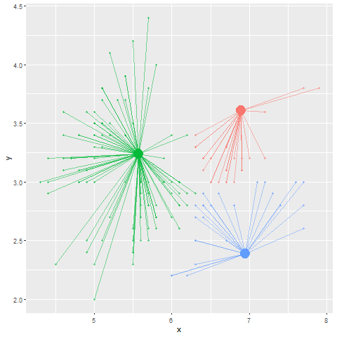](./image/p_kmeans.gif)

Rではk-meansでのクラスタリングを`kmeans`関数を用いて行うことができます。`kmeans`関数の引数はデータフレームとクラスターの数（`centers`）です。以下の例では、`iris`のデータを3つのクラスターに分けています。k-meansのクラスター中心の初期値は乱数で決められますので、クラスターの結果は計算のたびに少しずつ変化します。また、初期値を特定の値として`centers`引数に行列で与えることもできます。

``` downlit
## k-means
set.seed(0) # k-meansは乱数計算なので、シードを設定
k.cent3 <- kmeans(iris[ ,1:4], centers = 3) # 3つのクラスタに分ける
k.cent3$cluster # 計算結果
##   [1] 2 2 2 2 2 2 2 2 2 2 2 2 2 2 2 2 2 2 2 2 2 2 2 2 2 2 2 2 2 2 2 2 2 2 2 2 2
##  [38] 2 2 2 2 2 2 2 2 2 2 2 2 2 3 3 1 3 3 3 3 3 3 3 3 3 3 3 3 3 3 3 3 3 3 3 3 3
##  [75] 3 3 3 1 3 3 3 3 3 3 3 3 3 3 3 3 3 3 3 3 3 3 3 3 3 3 1 3 1 1 1 1 3 1 1 1 1
## [112] 1 1 3 3 1 1 1 1 3 1 3 1 3 1 1 3 3 1 1 1 1 1 3 1 1 1 1 3 1 1 1 3 1 1 1 3 1
## [149] 1 3
```

``` downlit
k.cents <- kmeans(iris[ ,1:4], centers = iris[c(1, 51, 101), 1:4]) # 初期値を各種の始めの値に設定
k.cents$cluster
##   [1] 1 1 1 1 1 1 1 1 1 1 1 1 1 1 1 1 1 1 1 1 1 1 1 1 1 1 1 1 1 1 1 1 1 1 1 1 1
##  [38] 1 1 1 1 1 1 1 1 1 1 1 1 1 2 2 3 2 2 2 2 2 2 2 2 2 2 2 2 2 2 2 2 2 2 2 2 2
##  [75] 2 2 2 3 2 2 2 2 2 2 2 2 2 2 2 2 2 2 2 2 2 2 2 2 2 2 3 2 3 3 3 3 2 3 3 3 3
## [112] 3 3 2 2 3 3 3 3 2 3 2 3 2 3 3 2 2 3 3 3 3 3 2 3 3 3 3 2 3 3 3 2 3 3 3 2 3
## [149] 3 2
```

以下では、k-meansでクラスター分けしたデータと、`iris`の`Species`の関係を示しています。k-meansでクラスター分けした結果が`Species`とほぼ重なることを確認できます。

``` downlit
spvec <- iris$Species |> levels()

k.cent3$cluster <- k.cent3$cluster - 1
k.cent3$cluster <- if_else(k.cent3$cluster == 0, 3, k.cent3$cluster)

cbind(iris, cluster = spvec[k.cent3$cluster]) |> 
  gather(tag, value, 5:6) |> 
  ggplot(aes(x = Sepal.Length, y = Sepal.Width, color = value))+
    geom_point(size = 3)+
    facet_wrap(~ tag)
```

[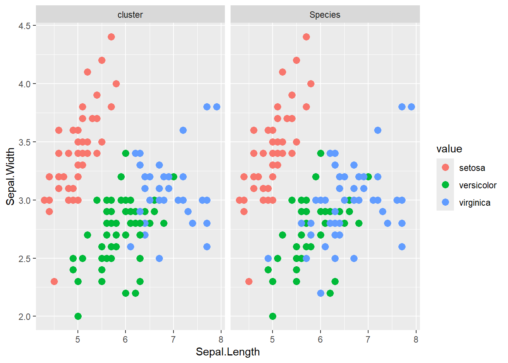](chapter32_files/figure-html/unnamed-chunk-14-1.png)

## 32.5 c-means

**c-means法**はfuzzy c-means法とも呼ばれる、クラスターへの所属を確率で求める手法です。c-means法もk-means法と同じく、データとクラスターの距離をもとにクラスタリングを行う手法の一つです。Rでは、c-means法の計算を[`e1071`](https://cran.r-project.org/web/packages/e1071/index.html)パッケージ ([Meyer et al. 2023](#ref-e1071_bib))の`cmeans`関数で行うことができます。`cmeans`関数も`kmeans`関数と同様に、データフレームと中心の数（`centers`）を引数に取ります。クラスターの中心の初期値は行列で与えることもできます。

``` downlit
pacman::p_load(e1071)
# クラスタリングの計算（中心を指定）
iris.c <- cmeans(iris[,1:4], centers = iris[c(1, 51, 101), 1:4])

# クラスターとirisの種の比較
cbind(iris, cluster = spvec[iris.c$cluster]) |>  
  gather(tag, value, 5:6) |> 
  ggplot(aes(x = Sepal.Length, y = Sepal.Width, color = value))+
  geom_point(size = 3)+
  facet_wrap(~ tag)
## Warning: attributes are not identical across measure variables; they will be
## dropped
```

[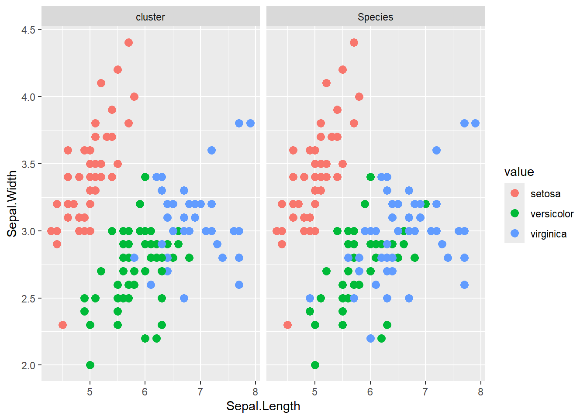](chapter32_files/figure-html/unnamed-chunk-15-1.png)

## 32.6 スペクトラルクラスタリング

スペクトラルクラスタリングは、上記のk-meansやc-meansのように、中心からの距離だけでは分離するのが難しいようなクラスタリングを行うときに有効な手法です。スペクトラルクラスタリングでは、近くにあるデータは同じクラスターに分類されやすくするようにアルゴリズムが組まれていて、k-meansやc-meansでは分離不能なクラスタをきれいに分けることができます。

Rではスペクトラルクラスタリングを[`kernlab`](https://cran.r-project.org/web/packages/kernlab/index.html)パッケージ ([Karatzoglou et al. 2023](#ref-kernlab_bib1), [2004](#ref-kernlab_bib2))の`specc`関数を用いて行うことができます。`specc`関数の使い方は`kmeans`関数や`cmeans`関数とほぼ同じで、データフレームと`centers`を引数に取ります。また、返り値を`plot`関数の引数にすることで、簡単にクラスターをグラフにすることもできます。

``` downlit
pacman::p_load(kernlab)

# データにはkernlabのspiralsを用いる
data(spirals)
head(spirals)
##            [,1]        [,2]
## [1,]  0.8123568 -0.98712687
## [2,] -0.2675890 -0.32552004
## [3,]  0.3739746 -0.01293652
## [4,]  0.2576481  0.04130805
## [5,] -0.8472613  0.32939461
## [6,]  0.4097649  0.03205686

sc <- specc(spirals, centers = 2) # スペクトラルクラスタリング
plot(spirals, col = sc) # 結果の表示（色がクラスターを示す）
```

[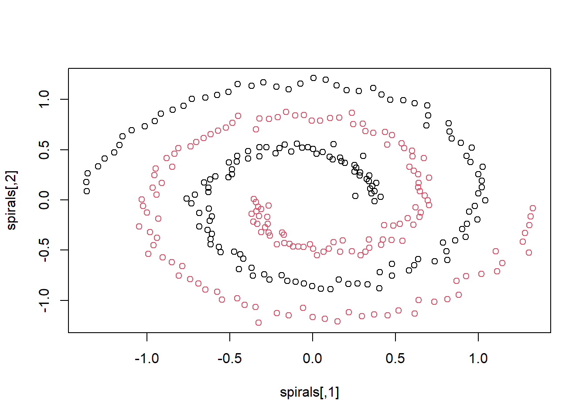](chapter32_files/figure-html/unnamed-chunk-16-1.png)

ただし、このスペクトラルクラスタリングは必ずしも良いクラスタリングの方法ではなく、例えば`iris`のクラスタリングに用いると、3クラスターを指定しても、ほとんど2クラスターしか出てこなくなってしまいます。クラスター同士の距離が近く、接していると正しくクラスタリングできないようです。スペクトラルクラスタリングを用いる時にはデータの構造をよく確認する必要があります。

``` downlit
# 3クラスタとなるよう設定
sc.iris <- specc(iris[,1:4] |> as.matrix(), centers = 3)

# 結果に1がほとんどなく、ほぼ2クラスターになっている
sc.iris@.Data 
##   [1] 2 2 2 2 2 2 2 2 2 2 2 2 2 2 2 2 2 2 2 2 2 2 2 2 2 2 2 2 2 2 2 2 2 2 2 2 2
##  [38] 2 2 2 2 2 2 2 2 2 2 2 2 2 3 3 3 3 3 3 3 3 3 3 3 3 3 3 3 3 3 3 3 3 3 3 3 3
##  [75] 3 3 3 3 3 3 3 3 3 3 3 3 3 3 3 3 3 3 3 3 3 3 3 3 3 3 3 3 3 3 3 3 3 3 3 3 3
## [112] 3 3 3 3 3 3 1 3 3 3 3 3 3 3 3 3 3 3 3 3 1 3 3 3 3 3 3 3 3 3 3 3 3 3 3 3 3
## [149] 3 3
```

## 32.7 主成分分析

**主成分分析**は、多次元のデータを第一主成分・第二主成分…という主成分にデータ変換する手法です。この**第一主成分**というのは、データを空間に配置したときに、ばらつきが最も大きくなる軸に沿った値を指します。このようにばらつきが最も大きくなる軸を選んで主成分とすることで、多次元のデータからデータの損失を抑えつつ、そのデータの特徴を残したようなパラメータに変換することができます。要は、多次元のデータだと特徴を捉えにくい場合においても、主成分に変換することでデータの特徴を捉えやすくすることができます。

第二主成分は、第一主成分を定めた軸に垂直な面において、最もばらつきが多い軸に沿った値となります。第一主成分の軸と第二主成分の軸は互いに直行している、90度に交わっているので、**第一主成分と第二主成分の相関はほぼゼロ**になります。この特徴のため、[30章](chapter30.llms.md#主成分回帰)で説明した主成分回帰では説明変数同士が相関しているときに起こる問題、多重共線性を避けることができます。

ばらつきを残すのは、ばらつきには多くの情報が含まれるからです。クラスの全員が100点を取れるテストでは、学生の学力を比べることはできません。一方で点数がばらつくテストであれば、学生の学力をテストの成績で評価することができる、つまり学力の情報が含まれていることになります。主成分分析では、データのばらつきを残しつつデータの次元を減らすことで、データの持っている情報を残したままデータを要約することができます。

以下に、主成分分析の軸のイメージを示します。軸は互いに垂直に交わっているのがわかると思います。PC1を横に、PC2を縦になるように回転させたのが、下の第一主成分と第二主成分でのプロットのイメージとなります。

#### 主成分分析の軸のイメージ

Code

``` downlit
## 主成分分析における主成分の軸のイメージのスクリプト
iris_temp <- iris |> filter(Species != "setosa") |> _[ ,1:3]
iris.pc2 <- prcomp(iris_temp)

pc1 <- iris.pc2$x[ ,1]
pc2 <- iris.pc2$x[ ,2]
pc3 <- iris.pc2$x[ ,2]
center1 <- iris.pc2$center[1]
center2 <- iris.pc2$center[2]
center3 <- iris.pc2$center[3]

iris_temp$pc1_Sepal.Length <- pc1 * iris.pc2$rotation[1, 1] + center1
iris_temp$pc1_Sepal.Width <- pc1 * iris.pc2$rotation[2, 1] + center2
iris_temp$pc1_Petal.Length <- pc1 * iris.pc2$rotation[3, 1] + center3
iris_temp$pc2_Sepal.Length <- pc2 * iris.pc2$rotation[1, 2] + center1
iris_temp$pc2_Sepal.Width <- pc2 * iris.pc2$rotation[2, 2] + center2
iris_temp$pc2_Petal.Length <- pc2 * iris.pc2$rotation[3, 2] + center3
iris_temp$pc3_Sepal.Length <- pc3 * iris.pc2$rotation[1, 3] + center1
iris_temp$pc3_Sepal.Width <- pc3 * iris.pc2$rotation[2, 3] + center2
iris_temp$pc3_Petal.Length <- pc3 * iris.pc2$rotation[3, 3] + center3

pacman::p_load(plotly)

fig <- 
  plot_ly(
    iris_temp, 
    x =~ Sepal.Length, 
    y =~ Sepal.Width, 
    z =~ Petal.Length, 
    type = "scatter3d",
    mode = "markers",
    name = 'data',  
    marker = list(size = 2)) |> 
  add_trace(
    x =~ pc1_Sepal.Length, 
    y =~ pc1_Sepal.Width, 
    z =~ pc1_Petal.Length, 
    type = "scatter3d", 
    mode = "markers+lines",
    name = 'PC1', 
    marker = list(color = "red", size = 0.1),
    line = list(color = "red", width = 5)) |> 
  add_trace(
    x =~ pc2_Sepal.Length, 
    y =~ pc2_Sepal.Width, 
    z =~ pc2_Petal.Length, 
    type = "scatter3d",
    mode = "markers+lines",
    name = 'PC2',
    marker = list(color = "red", size = 0.1),
    line = list(color = "blue", width = 5)) |> 
  add_trace(
    x =~ pc3_Sepal.Length, 
    y =~ pc3_Sepal.Width, 
    z =~ pc3_Petal.Length, 
    type = "scatter3d", 
    mode = "markers+lines",
    name = 'PC3',
    marker = list(color="red", size=0.1),
    line = list(color="green", width=5))

fig
```

------------------------------------------------------------------------

[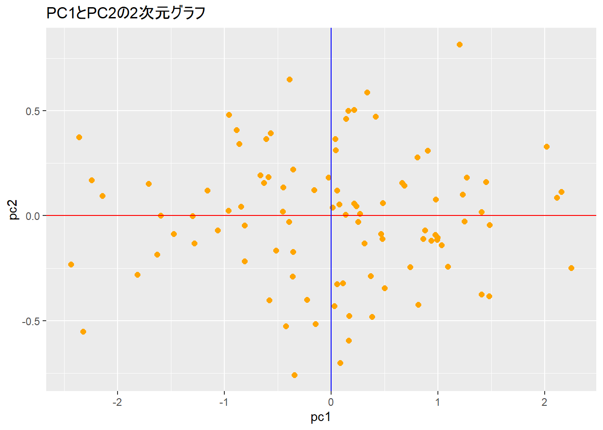](chapter32_files/figure-html/unnamed-chunk-19-1.png)

主成分分析は、主成分回帰のようなデータの前処理の他に、次元を圧縮することでデータの類似性や違いを分かりやすく示す場合に用いられています。

主成分分析では、多次元のデータを第一主成分、第二主成分といった、データのばらつきの大きさに従った少数のパラメータに変換することで、データ全体の特徴を捉えやすくすることができます。ただし、この第一主成分や第二主成分などの主成分が何を意味しているのかは、その時々によって異なりますし、理解が難しいことも多いです。「主成分が近いものは類似している」ぐらいの意味しかわからない場合もあると考えるとよいでしょう。

> **TIP:**
>
> ヒトのDNAには無数のSNP（Single Nucleotide polymorphism、一塩基多型）があります。このSNPというのは、DNAの塩基が置き換わっているもの（例えば、AがCに代わっている）を指し、置き換わりが各個々人によって異なることを意味しています。私のDNAのある位置の塩基がAで、別の方ではCになっている、というように、多型を示すことがSNPです。ヒトのDNAの長さは大体3×10⁹塩基あります。この長いDNAには、SNPが6000万個ぐらいあります。
>
> ヒトを含め、分子系統樹と呼ばれる祖先からの遺伝子変化の流れを調べる場合には、近年ではこのSNPを指標に系統樹を書きます（以前はミトコンドリアDNAやリボソーム蛋白のDNAのSNPや反復配列の長さが使われていたような気がします）。もちろんこの6000万個のすべてのSNPを用いるわけではありませんが、通常取り扱うSNPは非常に多くなります。
>
> このたくさんあるSNPを用いて、例えば日本人と韓国人の違いを示すことを考えると、ひとつづつSNPを見て特徴を捉えていては、いつまでたっても違いはわかりません。このように、膨大なデータ（の次元）がある場合に、主成分分析は力を発揮します。膨大なデータを第一主成分と第二主成分に変換してしまえば、2次元のプロットを利用して日本人と韓国人の違いを表すことができます。ヒトの歴史的な移動に関して、このSNPと主成分分析を用いて[論文](https://www.nature.com/articles/jhg2012114)が発表されています([Consortium 2012](#ref-1523106605673180672))。この論文を見ていただければわかる通り、主成分分析を用いれば膨大なSNPのデータを2次元に集約し、わかりやすい表現で説明することができます。

### 32.7.1 Rで主成分分析

Rでは、`prcomp`関数で主成分分析の計算を行うことができます。`prcomp`関数は引数に行列やデータフレームを取ります。`prcomp`関数の返り値は各主成分方向の標準偏差（standard deviations）と、回転（Rotation）です。回転は、データを主成分に変換するときの係数を示します。

``` downlit
iris.pc <- prcomp(iris[ ,1:4])

iris.pc
## Standard deviations (1, .., p=4):
## [1] 2.0562689 0.4926162 0.2796596 0.1543862
## 
## Rotation (n x k) = (4 x 4):
##                      PC1         PC2         PC3        PC4
## Sepal.Length  0.36138659 -0.65658877  0.58202985  0.3154872
## Sepal.Width  -0.08452251 -0.73016143 -0.59791083 -0.3197231
## Petal.Length  0.85667061  0.17337266 -0.07623608 -0.4798390
## Petal.Width   0.35828920  0.07548102 -0.54583143  0.7536574
```

`prcomp`関数の返り値を`summary`関数の引数に取ると、標準偏差、分散の配分（Proportion of Variance）、積算の分配の配分（Cumulative Proportion）が示されます。このうち、分散の配分はその主成分によってばらつきをどれだけ説明できているか、つまり主成分に対する各要素の寄与率を示すものです。下の例では、PC1で92.5%程度のばらつきを示すことができている、つまり、PC1でデータの差を十分説明できていることがわかります。

``` downlit
iris.pc |> summary()
## Importance of components:
##                           PC1     PC2    PC3     PC4
## Standard deviation     2.0563 0.49262 0.2797 0.15439
## Proportion of Variance 0.9246 0.05307 0.0171 0.00521
## Cumulative Proportion  0.9246 0.97769 0.9948 1.00000
```

主成分分析では、Cumulative Proportionにもよりますが、第一主成分（PC1）と第二主成分（PC2）に変換したデータをプロットして、データの類似性などを示すことが一般的です。変換後の主成分は、`$x`で呼び出すことができます。以下のように、`iris`の種が同じ、つまりよく似たデータであれば、比較的近い位置に変換後のデータが集まるのがわかります。

``` downlit
iris.pc <- prcomp(iris[ ,1:4])
irispcd <- iris.pc$x |> as.data.frame()
irispcd$Species <- iris$Species
ggplot(irispcd, aes(x = PC1, y = PC2, color = Species)) + geom_point(size = 2)
```

[](chapter32_files/figure-html/unnamed-chunk-22-1.png)

### 32.7.2 主成分分析の結果をグラフで表示：factoextraパッケージ

主成分分析の結果をまとめ、グラフにする方法には上に示した第一主成分、第二主成分を軸としたプロットの他にも様々な手法があります。主成分分析の結果を簡単にグラフにできるライブラリとして、`factoextra`パッケージ([Kassambara and Mundt 2026](#ref-factoextra_bib))があります。`factoextra`パッケージで提供される関数を用いることで、上記の`procomp`関数で計算した結果を簡単にきれいなグラフとして表示することができます。

`fviz_screeplot`関数は上記のProportion of Variance、寄与率をグラフとして表示するための関数です。

``` downlit
pacman::p_load(factoextra) # factoextraパッケージの読み込み

fviz_screeplot(iris.pc, addlabels = TRUE)
```

[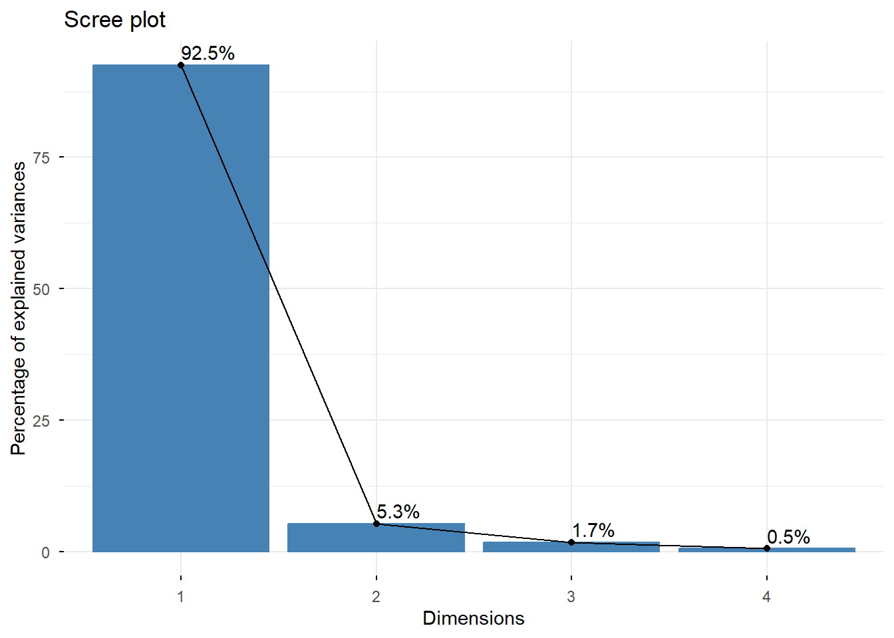](chapter32_files/figure-html/unnamed-chunk-23-1.png)

`fviz_pca_ind`関数は第一主成分、第二主成分をそれぞれx、y軸に配置した散布図を表示するための関数です。`habillage`引数に行のラベルを指定すると、ラベルに従いプロットの形と色を指定してくれます。また、`repel=TRUE`を指定すると軸ラベルを被らないように表示してくれます。

``` downlit
fviz_pca_ind(iris.pc, habillage = iris$Species, repel = TRUE)
```

[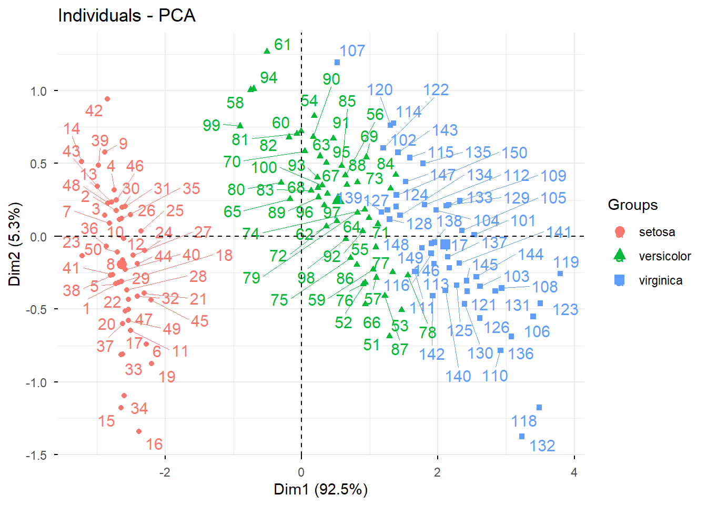](chapter32_files/figure-html/unnamed-chunk-24-1.png)

ただし、このままではやや数値とプロットが被ってうるさいグラフになってしまいますので、`geom`引数を`"point"`や`"text"`のみで指定して表示したほうが見やすく、理解しやすいでしょう。

## geom = “text”

``` downlit
fviz_pca_ind(iris.pc, habillage = iris$Species, geom = "text", title = "geom = \"text\"")
```

[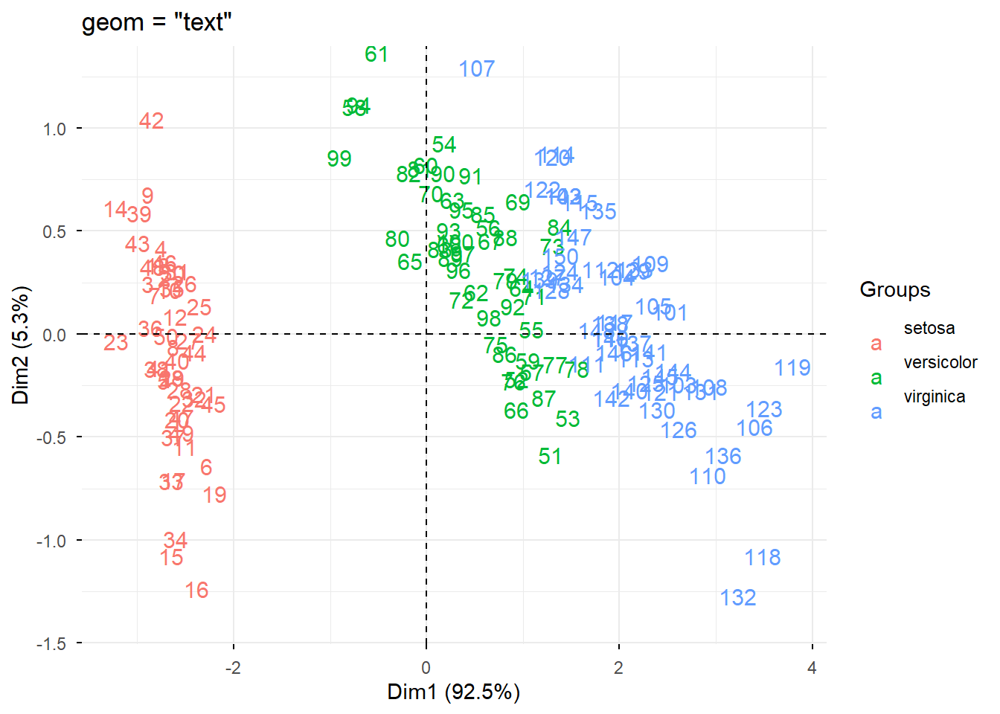](chapter32_files/figure-html/unnamed-chunk-25-1.png)

## geom = “point”

``` downlit
fviz_pca_ind(iris.pc, habillage = iris$Species, geom = "point", title = "geom = \"point\"")
```

[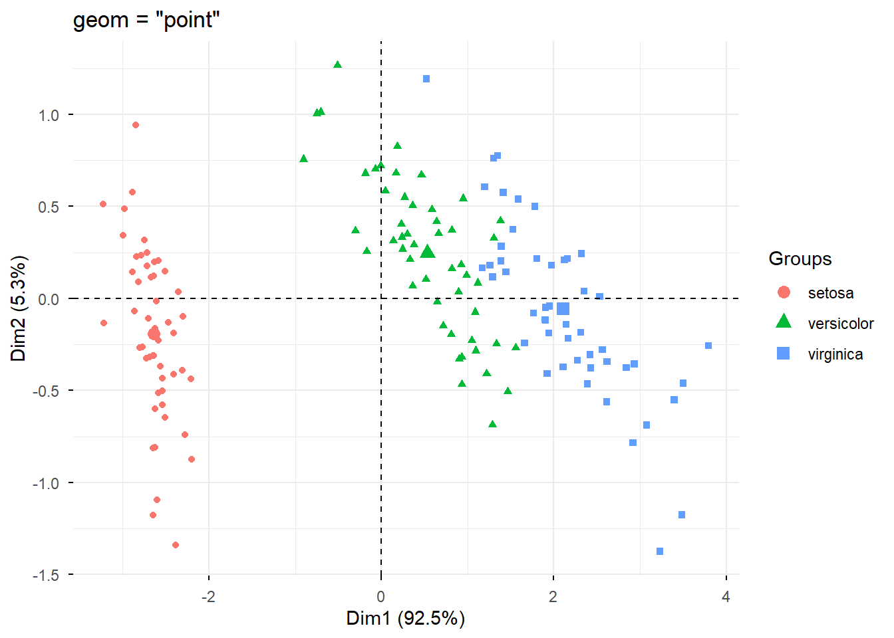](chapter32_files/figure-html/unnamed-chunk-26-1.png)

また、`addEllipses=TRUE`を指定すると、`habillage`引数で指定した群ごとに範囲を楕円で囲ってくれます。

``` downlit
fviz_pca_ind(
  iris.pc, 
  geom = "point",
  habillage = iris$Species,
  addEllipses = TRUE,
  repel = TRUE)
```

[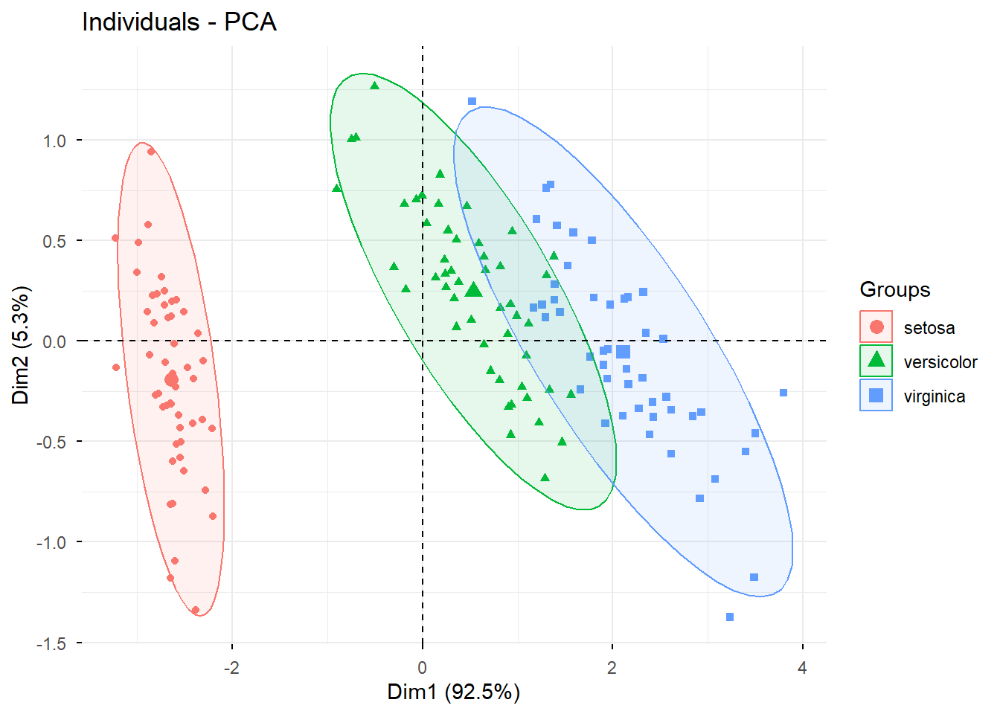](chapter32_files/figure-html/unnamed-chunk-27-1.png)

`fviz_contrib`関数は各主成分に対する要素の寄与率をグラフにするための関数です。`choice="var"`で寄与率の表示を指定し、`axes`が主成分の指定（`1`だと第一主成分、`2`だと第二主成分）のための引数です。`top`引数を指定すると各要素のうち寄与率の大きいものから`top`引数の数値の数だけを選んで表示させることができます。

## 第一主成分

``` downlit
fviz_contrib(iris.pc, choice = "var", axes = 1, top = 4)
```

[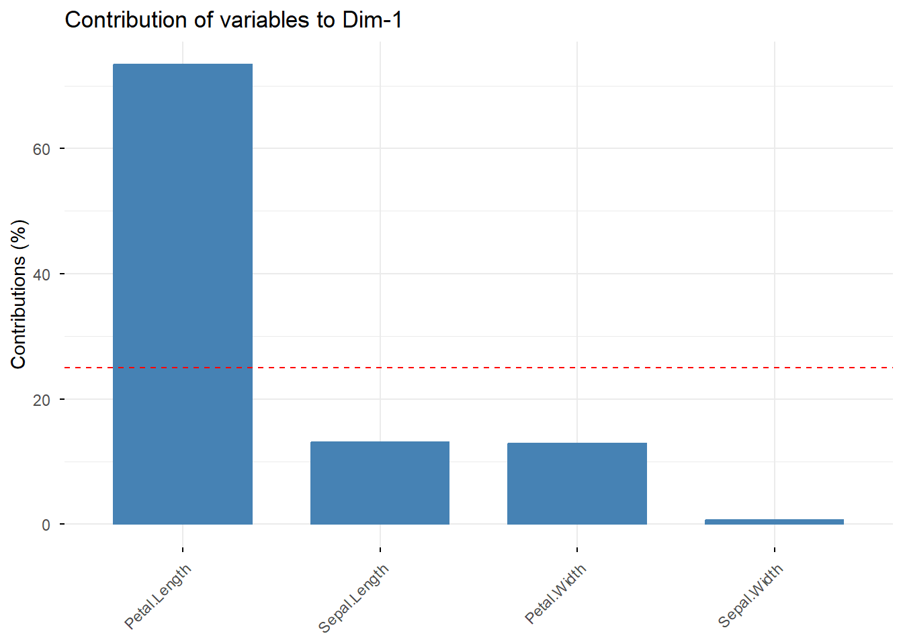](chapter32_files/figure-html/unnamed-chunk-28-1.png)

## 第二主成分

``` downlit
fviz_contrib(iris.pc, choice = "var", axes = 2, top = 4)
```

[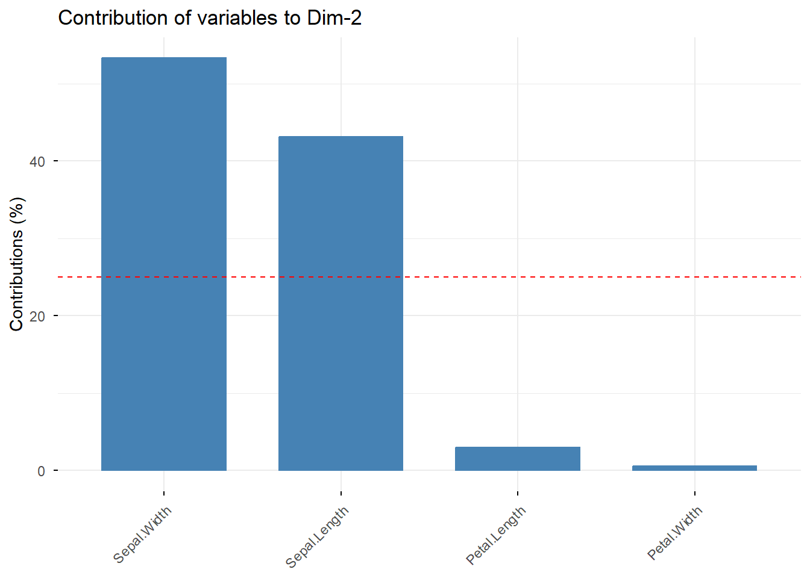](chapter32_files/figure-html/unnamed-chunk-29-1.png)

同様に第一主成分、第二主成分への寄与率をグラフで表示するための関数が`fviz_pca_var`関数です。c`fviz_pca_var`関数では寄与率の大きさが矢印で示されます。`col.var`関数は数値に依存した色指定の方法で、`gradient.cols`は色のグラデーションを指定する引数です。

``` downlit
fviz_pca_var(
  iris.pc, 
  col.var="contrib",
  gradient.cols = c("#F8766D", "#00BA38", "#00BFC4"),
  repel = TRUE
)
```

[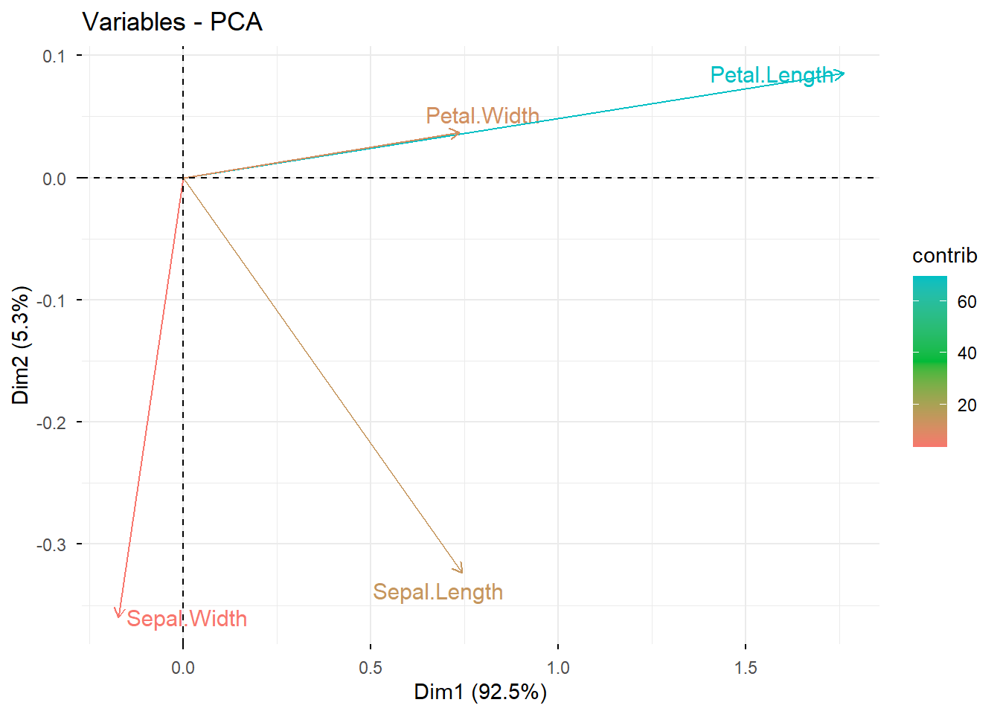](chapter32_files/figure-html/unnamed-chunk-30-1.png)

`fviz_pca_biplot`関数を用いると、`fviz_pca_ind`関数の散布図と`fviz_pca_var`関数の寄与率を同時に表示することもできます。

``` downlit
fviz_pca_biplot(
  iris.pc,
  geom = "point",
  habillage = iris$Species,
  repel = TRUE)
```

[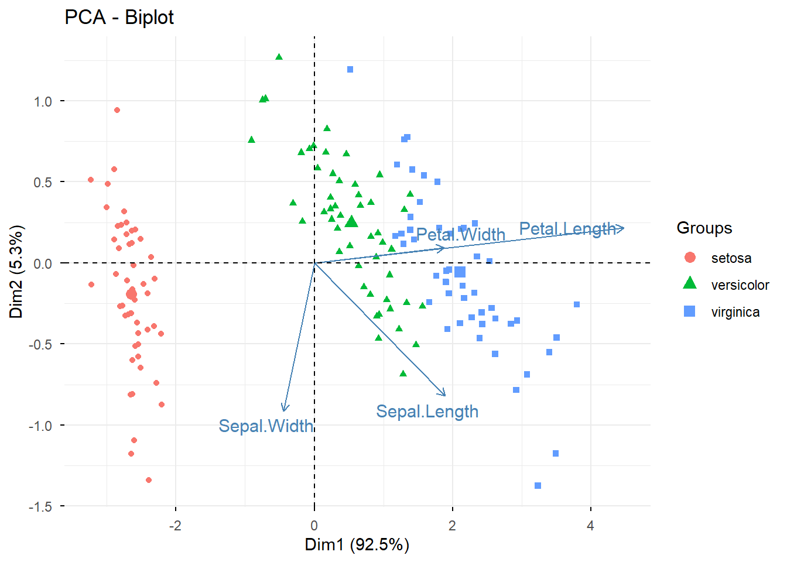](chapter32_files/figure-html/unnamed-chunk-31-1.png)

## 32.8 因子分析

**因子分析**も主成分分析と同じく、多次元のデータをいくつかの因子に変換することで、データの性質を簡単に理解できるようにするための手法です。主成分分析との違いは、主成分分析では主成分の意味を理解するのが難しいのに対して、因子分析では因子の意味付けが比較的容易であること、因子間の相関は必ずしも0とはならないこと、主成分分析が射影の計算であるのにたいして、因子分析は回転の計算を行うことなどです。

Rでは、因子分析を`factanal`関数を用いて行うことができます。以下の例では、鹿児島大学が[成績サンプルデータ（サーバートラブルで見れなくなっています）](https://estat.sci.kagoshima-u.ac.jp/data/cgi-bin/data/whats_data/data/img/932722923_9821.xls)として提供しているデータを用いて因子分析を行っています。

`factanal`関数はデータフレームまたは行列を第一引数に取り、因子の数（`factors`）、回転の方法（`rotation`）、算出するスコアのタイプ（`scores`）を引数として設定して用います。

`factors`には、出力として得たい因子の数を指定します。以下の例では、理系・文系科目の得意・不得意を評価する因子を作成するため、因子数を`2`としています。

`rotation`には`"varimax"`か`"promax"`のどちらかを選択するのが一般的です。`varimax`回転はデータをそのまま回転させる方法（直交回転）、`promax`回転はデータの軸の角度を変換させて回転させる方法（斜交回転）です。`promax`回転では因子間に相関が生じるのが特徴です。

`scores`には計算して得られる数値（因子スコア）の計算方法を指定します。方法には`"none"`、`"Bartlett"`、`"regression"`のいずれかを選択します。`"none"`を指定するとスコアが算出されないので、`"Bartlett"`か`"regression"`のいずれかを選択します。

`factanal`関数の返り値のうち、Loadingが各データの寄与率を示す値となります。以下のvarimax変換の例では、Factor1（因子1）では数学、物理、化学、Factor2では国語、英語の値が高いため、Factor1は理系科目の、Factor2は文系科目の評価を反映していることがわかります。

``` downlit
m1 <- read.csv("./data/testresult.csv", fileEncoding = "CP932")
m1v <- factanal(m1[ ,2:6], factors = 2, scores = "Bartlett") # varimax変換
m1v
## 
## Call:
## factanal(x = m1[, 2:6], factors = 2, scores = "Bartlett")
## 
## Uniquenesses:
##  国語  英語  数学  物理  化学 
## 0.005 0.436 0.171 0.191 0.279 
## 
## Loadings:
##      Factor1 Factor2
## 国語         0.994  
## 英語 0.362   0.658  
## 数学 0.882   0.226  
## 物理 0.893   0.109  
## 化学 0.793   0.302  
## 
##                Factor1 Factor2
## SS loadings      2.343   1.575
## Proportion Var   0.469   0.315
## Cumulative Var   0.469   0.784
## 
## Test of the hypothesis that 2 factors are sufficient.
## The chi square statistic is 1.47 on 1 degree of freedom.
## The p-value is 0.225
```

同様にpromax回転での因子分析でも、Factor1が理系科目、Factor2が文系科目の成績を反映していることがわかります。ただし、寄与率はバリマックスとは異なり、Factor1での理系科目の寄与率もFactor2での文系科目の寄与率もvarimax回転より高いため、こちらの方がより理系度・文系度を反映していることがわかります。

``` downlit
m1p <- factanal(m1[,2:6], factors = 2, rotation = "promax", scores = "Bartlett") # promax変換
m1p
## 
## Call:
## factanal(x = m1[, 2:6], factors = 2, scores = "Bartlett", rotation = "promax")
## 
## Uniquenesses:
##  国語  英語  数学  物理  化学 
## 0.005 0.436 0.171 0.191 0.279 
## 
## Loadings:
##      Factor1 Factor2
## 国語 -0.149   1.060 
## 英語  0.239   0.607 
## 数学  0.923         
## 物理  0.964  -0.158 
## 化学  0.806         
## 
##                Factor1 Factor2
## SS loadings      2.509   1.524
## Proportion Var   0.502   0.305
## Cumulative Var   0.502   0.807
## 
## Factor Correlations:
##         Factor1 Factor2
## Factor1   1.000   0.475
## Factor2   0.475   1.000
## 
## Test of the hypothesis that 2 factors are sufficient.
## The chi square statistic is 1.47 on 1 degree of freedom.
## The p-value is 0.225
```

以下に、varimax回転、promax回転それぞれでの因子のスコアをプロットした結果を示します。スコアは`$scores`で呼び出すことができます。varimax回転でもpromax回転でも、概ね理系・文系科目の得意さを因子で評価できています。

## varimax回転

``` downlit
m1vs <- m1v$scores |> as.data.frame() # 計算したスコアをデータフレームに変換
m1vs$student <- 1:nrow(m1vs) # 生徒のIDを追加

ggplot(m1vs, aes(x = Factor1, y = Factor2, color = student, label = student))+
  geom_text(size = 3)+
  theme(legend.position = "none")+
  labs(title = "バリマックス回転", x = "理系度", y = "文系度")
```

[](chapter32_files/figure-html/unnamed-chunk-34-1.png)

## promax回転

``` downlit
m1ps <- m1p$scores |> as.data.frame()
m1ps$student <- 1:nrow(m1ps)

ggplot(m1ps, aes(x = Factor1, y = Factor2, color = student, label = student))+
  geom_text(size = 3)+
  theme(legend.position = "none")+
  labs(title = "プロマックス回転", x = "理系度", y = "文系度")
```

[](chapter32_files/figure-html/unnamed-chunk-35-1.png)

## 32.9 多次元尺度法

多次元尺度法は主成分分析や因子分析とは少し異なる次元圧縮の方法です。多次元尺度法は、距離行列から互いの点の位置を求める、距離行列演算の逆のような変換を行う手法です。

以下の例では、都道府県の県庁所在地の緯度・経度を`dist`関数で距離行列に変換し、距離行列を多次元尺度法で位置の情報に変換しています。

``` downlit
JPD <- read.csv("./data/pref_lat_lon.csv", header = T, fileEncoding = "CP932")

prefecture <- JPD[,1] %>% unlist()
JPD <- JPD[,-1] %>% dist() # 距離行列を計算
```

Rでは多次元尺度法の計算を`MASS`パッケージの`sammon`関数を用いて行うことができます。`sammon`関数の引数は距離行列です。距離行列を`sammon`関数で変換すると、`x`と`y`という、位置を示す2つの変数が求まります。

``` downlit
pacman::p_load(MASS)
JPpos <- JPD |> sammon() |> _$points
## Initial stress        : 0.00000
## stress after   9 iters: 0.00000
head(JPpos)
##           [,1]         [,2]
## [1,] -8.669485 -3.467358210
## [2,] -6.924994 -1.936485347
## [3,] -6.649247 -0.774450379
## [4,] -5.622341  0.266109548
## [5,] -5.782950 -1.366731569
## [6,] -5.181832  0.008206893
```

以下に、`sammon`関数の返り値をプロットしたものを示します。`x`と`y`の単位はありませんが、都道府県の位置関係を正確に反映していることが見て取れると思います。ただし、距離行列には方角のデータが含まれていないため、東西南北の方向は回転したり反転したりすることになります。

``` downlit
JPpos <- as.data.frame(JPpos)
colnames(JPpos) <- c("x", "y")
JPpos$prefecture <- prefecture

ggplot(JPpos, aes(x = -x, y = -y, label = prefecture, color = prefecture))+
  geom_text(size = 3)+
  theme(legend.position = "none")
```

[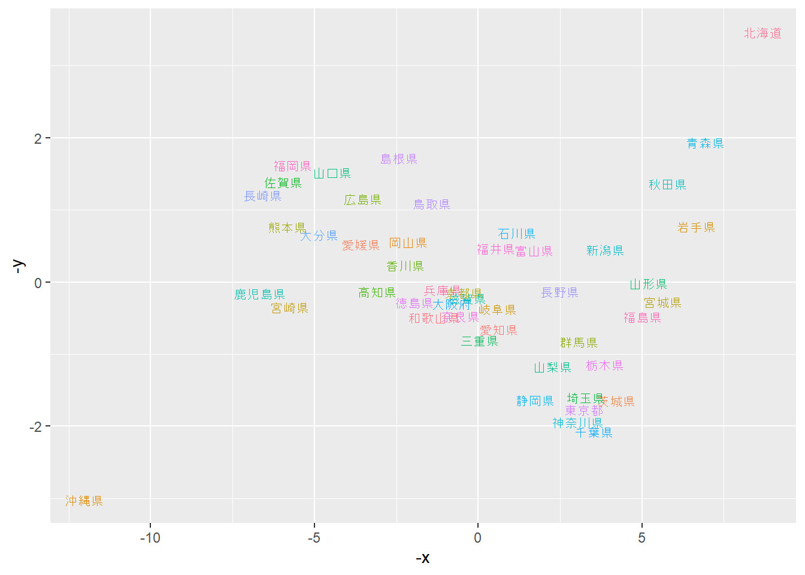](chapter32_files/figure-html/unnamed-chunk-38-1.png)

`cmdscale`関数を用いても多次元尺度法の計算を行うことができます。

``` downlit
JPpos2 <- JPD %>% cmdscale %>% as.data.frame
colnames(JPpos2) <-  c("x", "y")
JPpos2$prefecture <- prefecture

ggplot(JPpos2, aes(x = x, y = y, label = prefecture, color = prefecture))+
  geom_text(size = 3)+
  theme(legend.position = "none")
```

[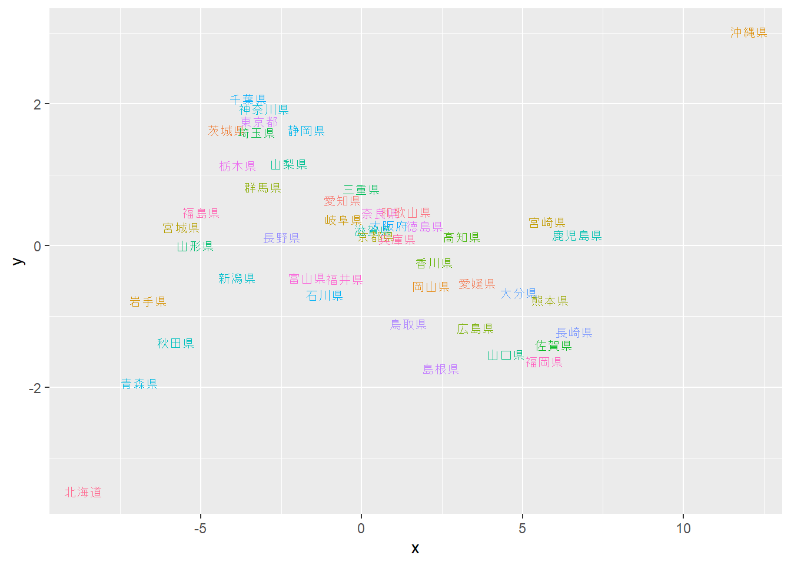](chapter32_files/figure-html/unnamed-chunk-39-1.png)

Consortium, Japanese Archipelago Human Population Genetics. 2012. “The History of Human Populations in the Japanese Archipelago Inferred from Genome-Wide SNP Data with a Special Reference to the Ainu and the Ryukyuan Populations.” *Journal of Human Genetics* 57 (12): 787–95. <https://cir.nii.ac.jp/crid/1523106605673180672>.

Karatzoglou, Alexandros, Alex Smola, and Kurt Hornik. 2023. *Kernlab: Kernel-Based Machine Learning Lab*. <https://CRAN.R-project.org/package=kernlab>.

Karatzoglou, Alexandros, Alex Smola, Kurt Hornik, and Achim Zeileis. 2004. “Kernlab – an S4 Package for Kernel Methods in R.” *Journal of Statistical Software* 11 (9): 1–20. <https://doi.org/10.18637/jss.v011.i09>.

Kassambara, Alboukadel, and Fabian Mundt. 2026. *Factoextra: Extract and Visualize the Results of Multivariate Data Analyses*. <https://CRAN.R-project.org/package=factoextra>.

Meyer, David, Evgenia Dimitriadou, Kurt Hornik, Andreas Weingessel, and Friedrich Leisch. 2023. *E1071: Misc Functions of the Department of Statistics, Probability Theory Group (Formerly: E1071), TU Wien*. <https://CRAN.R-project.org/package=e1071>.

Back to top
