# 33  時系列分析

Code

**時系列**とは、[21章](chapter21.llms.md)で少し説明した通り、時間と共に変化する量を繰り返し測定したデータのことです。例えば、日経平均株価の推移は典型的な時系列の例です。Rでは、以下に示す`Nile`データセットが時系列の例としてよく用いられています。

``` downlit
Nile |> plot()
```

[](chapter33_files/figure-html/unnamed-chunk-1-1.png)

`Nile`はナイル川の水量を1871～1970年にかけて測定したデータです。各時点（各年）には、その時点の数値が登録されています。`Nile`では時間間隔は1年おきと一定で、取得されたデータは1種類（ナイル川の水量）です。

時系列データは`Nile`のように時間間隔が一定で1種類のデータとなる場合が多いです。ただし、時間間隔が一定ではない場合や、データの抜けがある場合（休業時間帯や休日などでデータが取れなかったりする場合）、目的とするデータ（目的変数）だけでなく、目的変数を説明するためのデータ（説明変数）を含んでいる場合もあります。このような違いがあっても、いずれも時系列データとして取り扱われます。

このような時系列データを取り扱い、分析する統計方法のことを、**時系列分析**と呼びます。時系列分析には時系列分析のみを取り扱う教科書がたくさん出ており、ココですべてを説明することはできません。説明は基礎の要点のみとし、Rでの統計手法の利用方法の説明にとどめます。また、このテキストに記載の内容は[「時系列分析と状態空間モデルの基礎-RとStanで学ぶ理論と実装」](https://www.amazon.co.jp/dp/4903814874/)([馬場真哉 2018](#ref-%E9%A6%AC%E5%A0%B4%E7%9C%9F%E5%93%892018-02-14))により詳しく説明されています。興味がある方は手に取ってみるとよいでしょう。

まずは、典型的な時系列データの例として、**ホワイトノイズ**と**ランダムウォーク**について説明します。

## 33.1 ホワイトノイズ

測定したすべての期間の平均値が一定で、一定の分散（標準偏差、ばらつき）を持つ時系列データのことを、**ホワイトノイズ**と呼びます。典型的なホワイトノイズの例はラジオやテレビのノイズです。ホワイトノイズを数式で表すと以下のようになります。

\\y\_{t}=c+\epsilon\_{t}\\

y_(t)は時点tにおける値、cは切片、ε_(t)は下に示すように、平均0、標準偏差σの正規分布に従う誤差項です。cが0であれば、y_(t)は平均0、標準偏差σの正規分布に従うランダムな値となります。

\\\epsilon\_{t} \sim Normal(0, \sigma) \\

ホワイトノイズをグラフで示したものが以下の図です。時間`t`に伴い`y`の値は上下に揺れますが、平均すると概ね一定で、ばらつきの幅も一定となります。

``` downlit
t <- seq(1:200)
y <- rnorm(200, 0, 0.5)

ggplot(
  data.frame(t, y),
  aes(x = t, y = y)
)+
  geom_point(size = 2, alpha = 0.5)+
  geom_line(linewidth = 0.5, alpha = 0.5)
```

[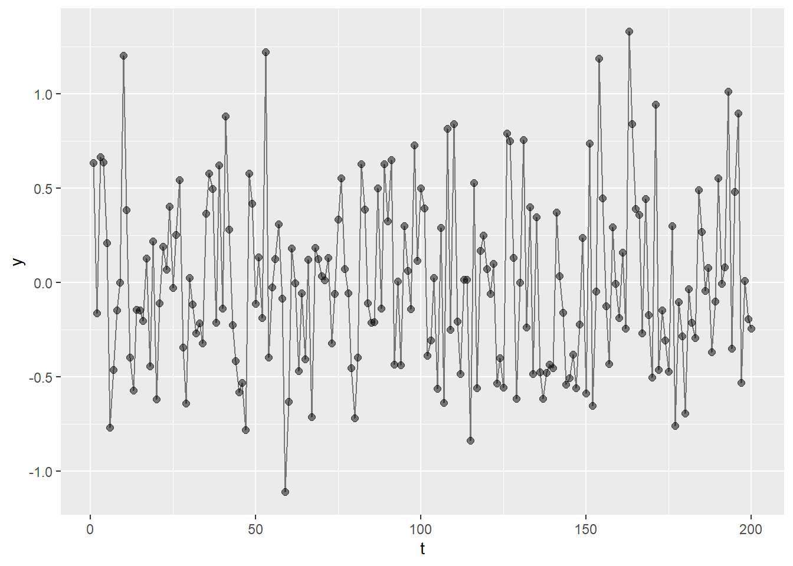](chapter33_files/figure-html/unnamed-chunk-2-1.png)

## 33.2 ランダムウォーク

上に示したε_(t)を時間tまで合計し、切片項cを足したものを**ランダムウォーク**と呼びます。ランダムウォークはその名の通り、上にふらふら、下にふらふら移動する、予想のつきにくい変動をする時系列データです。ランダムウォークの時系列は以下の式で表すことができます。

\\y\_{t}=c+\sum\_{i=1}^{t} \epsilon\_{i}\\

ランダムウォークは時点tと時点t-1の値の**差分系列**（1階差分、\\y\_{t}-y\_{t-1}\\）を取ると、ε_(t)、つまりホワイトノイズになるという性質を持ちます。

\\y\_{t} - y\_{t-1}=\epsilon\_{t}\\

ランダムウォークをグラフで示したものが以下の図です。値が上下にギザギザと動くだけでなく、時に大きく値が変動します。ランダムウォークでは平均値が一定とならず、分散も一定とはなりません。株価や為替変動などが典型的なランダムウォークの時系列データの例です。

``` downlit
y1 <- NULL
temp <- 0
for(i in 1:200){
  temp <- temp + y[i]
  y1 <- c(y1, temp)
}

ggplot(
  data.frame(t, y1),
  aes(x = t, y = y1)
)+
  geom_point(size = 2, alpha = 0.5)+
  geom_line(linewidth = 0.5, alpha = 0.5)
```

[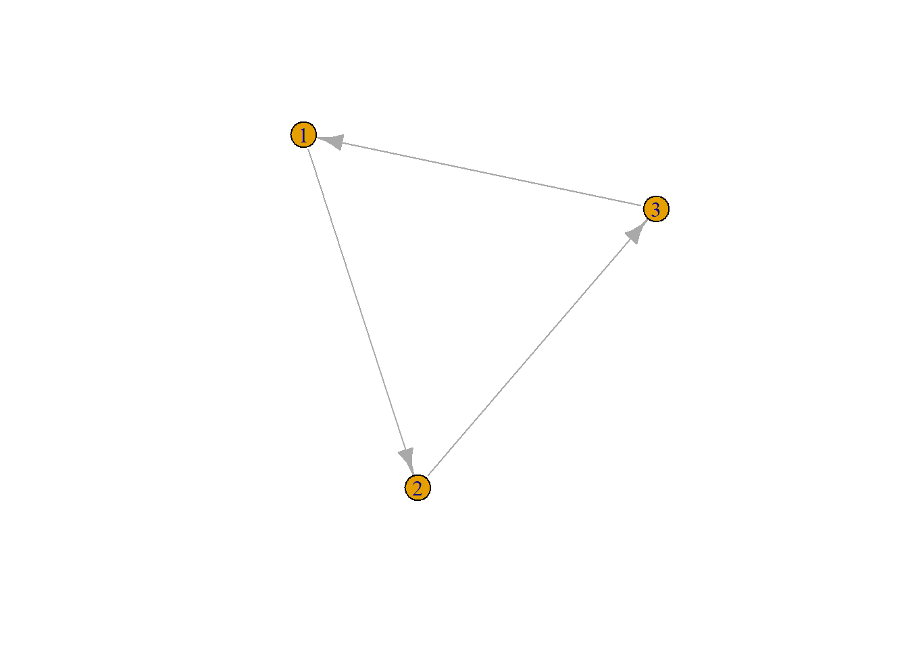](chapter33_files/figure-html/unnamed-chunk-3-1.png)

## 33.3 季節性

時系列には、一定の周期ごとに値が似ている場合があります。例えば、アイスクリームの売上には夏に高く、冬に低いような周期があります。このような周期性のことを、**季節性**と呼びます。季節性には色々な形のものがあり、年次の周期（4半期周期や12ヶ月周期）、週の周期（曜日ごとの周期）などがあります。季節性のあるデータは、ランダムなばらつきを持ちつつ、ある周期で上下する、以下の図のような変動を持ちます。

``` downlit
# 季節性ありのデータ
ys <- y + rep(c(0, 0.5, 1.5, 2.5, 3, 2.5, 1.5, 0.5, 0, 0, 0, 0), 10)
ggplot(
  data.frame(t, ys),
  aes(x = t, y = ys)
)+
  geom_point(size = 2, alpha = 0.5)+
  geom_line(linewidth = 0.5, alpha = 0.5)
```

[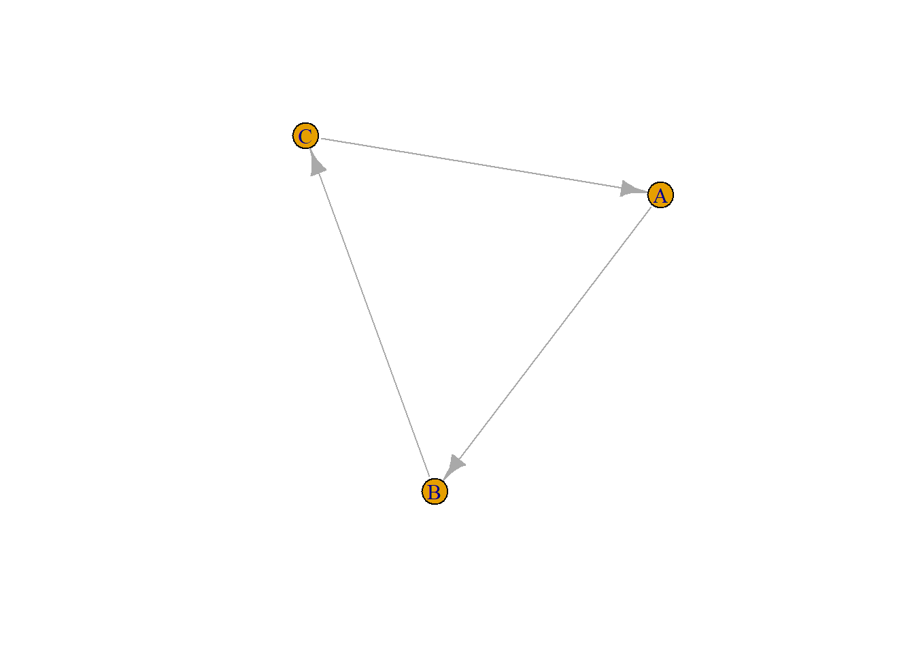](chapter33_files/figure-html/unnamed-chunk-4-1.png)

## 33.4 トレンド

時系列データには、時間とともに徐々に値が大きくなったり小さくなったりするものがあります。例えば、[ダウ平均株価](https://www.kaggle.com/datasets/mnassrib/dow-jones-industrial-average)を2000年ぐらいから調べると、下の図のようにその値が徐々に大きくなっていることがわかるかと思います。このような、時間とともに徐々に上昇・下降していくような傾向のことを**トレンド**と呼びます。

``` downlit
# kaggleよりデータを取得
#（https://www.kaggle.com/datasets/mnassrib/dow-jones-industrial-average）
djm <- read_csv("./data/Dow Jones Industrial Average Historical Data.csv")
## Rows: 2766 Columns: 7
## ── Column specification ────────────────────────────────────────────────────────
## Delimiter: ","
## chr (3): Date, Vol., Change %
## num (4): Price, Open, High, Low
## 
## ℹ Use `spec()` to retrieve the full column specification for this data.
## ℹ Specify the column types or set `show_col_types = FALSE` to quiet this message.
djm$Date <- lubridate::mdy(djm$Date)
djm$Price <- djm$Price |> str_remove_all(",") |> as.numeric()
ggplot(djm, aes(x = Date, y = Price))+
  geom_line(linewidth = 0.5)
```

[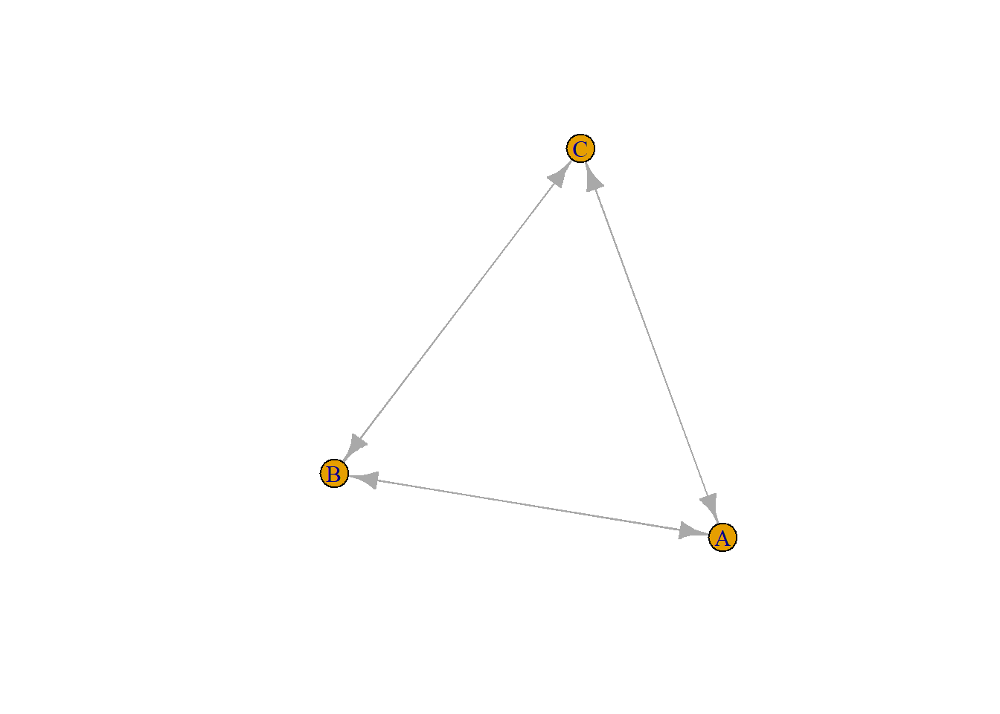](chapter33_files/figure-html/unnamed-chunk-5-1.png)

トレンドを持つデータは、季節性やホワイトノイズに時間とともに変化するような関数を足し合わせたような形を持つ、以下のようなデータとなります。

``` downlit
yt <- ys + t * 0.1
ggplot(
  data.frame(t, yt),
  aes(x = t, y = yt)
)+
  geom_point(size = 2, alpha = 0.5)+
  geom_line(linewidth = 0.5, alpha = 0.5)
```

[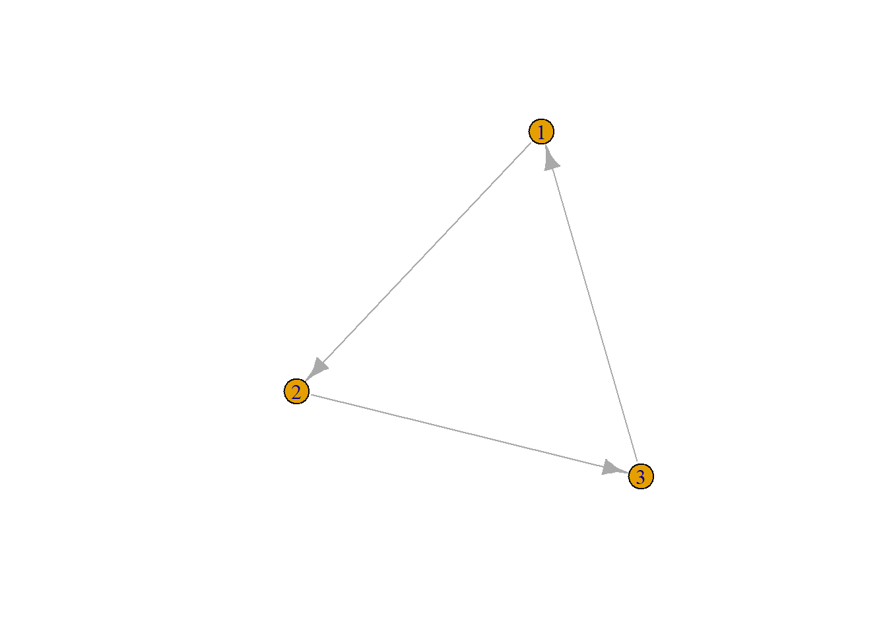](chapter33_files/figure-html/unnamed-chunk-6-1.png)

### 33.4.1 TSstudioパッケージで季節性・トレンドを図示

季節性とトレンドを持つデータの例としては、大気中二酸化炭素（CO₂）濃度の変化があります。

1950年頃からマウナロア（ハワイの活火山）で大気中CO₂濃度が[データとして取得](https://gml.noaa.gov/ccgg/trends/weekly.html)されており、Rでは`co2`データセットとして登録されています。`co2`は1959～1997年の毎月のCO₂濃度を記録したデータセットで、単位はppm（μmol/mol）です。

大気中のCO₂濃度は、北半球の夏に合わせて減少し、冬に合わせて増加する傾向があります（実際には少し遅れて、10月頃に最小、5月頃に最大となります）。これは、北半球の針葉樹林（タイガ）のCO₂吸収量が夏季に大きく、冬季に小さくなるためです。また、CO₂濃度は化石燃料の消費と共に増加しており、20世紀末で360ppm、2023年時点では420ppm程度になっています。1960～2000年の伸びが50ppm程度ですので、CO₂の増加が倍程度に加速していることがわかります。この「夏季に低く冬季に高い」傾向が季節性、「化石燃料の消費と共に増加」の部分がトレンドに当たります。

[`TSstudio`](https://ramikrispin.github.io/TSstudio/)パッケージ([Krispin 2023](#ref-TSstudio_bib))は時系列データを`plotly`を用いてグラフにする関数を備えたパッケージです。`ts_plot`関数は時系列をそのままプロットする、`ts_seasonal`関数は季節ごとの値を、`ts_heatmap`は年と月の季節性をそれぞれヒートマップとして表示する関数です。いずれも季節性やトレンドを持つデータをグラフにする、データの傾向を捉える場合に便利な関数です。いずれも[21章](chapter21.llms.md#時系列データtsクラス)で紹介した`ts`クラスの時系列データを引数に取ります。

``` downlit
co2 |> class() # tsクラスのオブジェクト
## [1] "ts"

pacman::p_load(TSstudio)

co2 |> ts_plot() # 時系列をplotlyでプロット
```

``` downlit

co2 |> ts_seasonal() # 時系列を季節で分離してグラフ化
```

``` downlit

co2 |> ts_heatmap() # 時系列をヒートマップで表示
```

## 33.5 定常性

ここまでにホワイトノイズ、ランダムウォーク、季節性、トレンドと4つの時系列の要素について説明しました。多くの時系列データは、この4つが様々なバランスで合わさったような形をしています。

\\時系列データ=ノイズ+季節性+トレンド+(ランダムウォーク)\\

このような時系列データを統計的に適切に取り扱えればいいのですが、時系列を解析する最も基本的な統計の枠組み（ARIMAモデル）では、基本的には**定常性**という特徴を持つデータを取り扱うこととなっており、この定常性を持たないデータは統計的に取り扱いにくいとされています。

定常性とは、時系列データをある時間間隔で切り取ったとき、**どの時期を切り取っても値の平均値と分散（ばらつき）がおおむね一定**であることを指します。

ホワイトノイズは乱数の系列ですので、どの時間でも平均値は一定で、分散も一定となります。したがって、ホワイトノイズは定常過程となります。一方で、ランダムウォークやトレンドを持つデータは、平均値が移動するため定常では無い時系列データ、つまり非定常過程となります。季節性に関しては、ある程度長めの系列では平均値と分散は一定ですが、短い期間で切ると平均値と分散が上下する、非定常過程となります。

## 33.6 自己回帰（AR）モデル

**自己回帰（Auto regression、AR）**とは、簡単に説明すると、**時点tの値がそれ以前の値（時点t-1や時点t-2）によく似ている**、という性質を持つ時系列データのことを指します。数式で書くと、AR(p)モデルは以下のような形で書くことができます。

\\y\_{t}=\alpha\_{1} \cdot y\_{t-1}+\alpha\_{2} \cdot y\_{t-2}+ \cdots \alpha\_{p} \cdot y\_{t-p}+\epsilon\_{t}\\

AR(p)のpを**次数（order）**と呼びます。AR(1)モデルであれば、\\\alpha\_{1} \cdot y\_{t-1}\\のみ、AR(2)モデルでは\\\alpha\_{1} \cdot y\_{t-1}+\alpha\_{2} \cdot y\_{t-2}\\となります。αは係数です。AR(1)モデルで、かつα₁が1である場合には、以下のようにランダムウォークとなります。

\\y\_{t} =1 \cdot y\_{t-1}+\epsilon\_{t}\\

> **TIP:**
>
> `arima.sim`関数は、後に説明するARモデル、MAモデル、和分（I）を用いてシミュレーションした時系列データを生成する関数です。AR、I、MAの次数を`order`、AR、MAの係数を`ar`、`ma`として、以下のようにリストで引数`model`に与えることで、時系列データを生成することができます。また、時系列の長さは引数`n`に指定します。以下の例では、AR(2)、I(0)、MA(0)のモデルで、ARの係数が`0.5`、`0.5`の場合の時系列データ200時点分を生成しています。
>
> ``` downlit
> arima.sim(model = list(order = c(2, 0, 0), ar = c(0.5, 0.5)), n = 200)
> ```
>
> ただし、この関数では定常過程となるARの係数を指定する必要があります（定常過程とならない係数を指定した場合にはエラーが出ます）。MAは常に定常過程なので、様々な係数を設定することができます。定常過程となる条件は以下の計算式（特性方程式の解が1以上であることの判定式）が`TRUE`となることです。
>
> ``` downlit
> ar <- c(0.2, 0.2, 0.5) # ARの係数のベクター
>
> # ARの係数が定常過程となるかどうかの判定（FALSEなら非定常）
> min(Mod(polyroot(c(1, -ar)))) > 1
> ## [1] TRUE
> ```
>
> 以下のAR、MAの例では、この`arima.sim`関数を用いてAR、MAの時系列を生成しています。

ARモデルの例として、AR(1)モデル、AR(2)モデル、AR(3)モデルの時系列をそれぞれ以下に図示します。

## AR(1)モデル

\\y\_{t}=\alpha\_{1} \cdot y\_{t-1}+\epsilon\_{t}\\

``` downlit
y1a <- arima.sim(model = list(order = c(1, 0, 0), ar = 0.6), 200)

plot(y1a)
```

[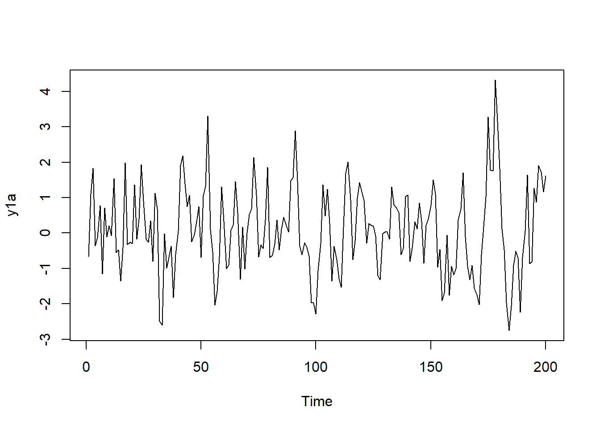](chapter33_files/figure-html/unnamed-chunk-10-1.png)

## AR(2)モデル

\\y\_{t}=\alpha\_{2} \cdot y\_{t-2} + \alpha\_{1} \cdot y\_{t-1} + \epsilon\_{t}\\

``` downlit
y2 <- arima.sim(model = list(order = c(2, 0, 0), ar = c(0.1, 0.6)), 200)

plot(y2)
```

[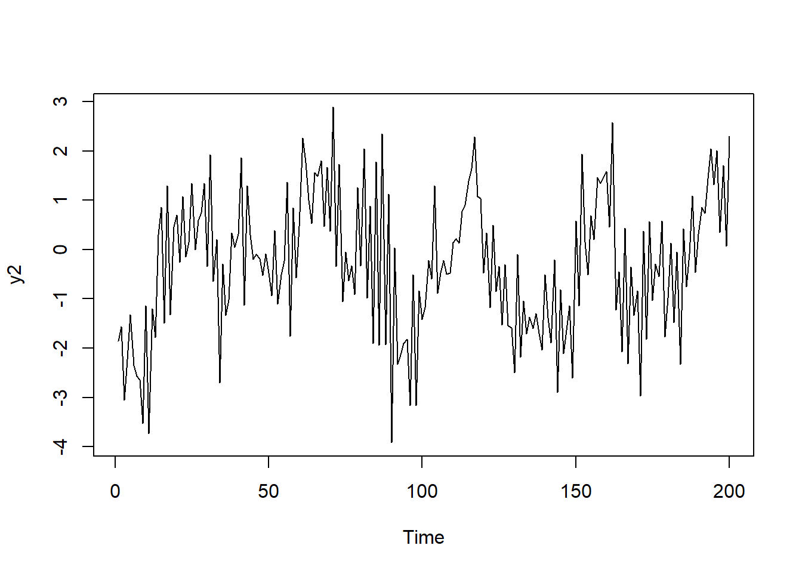](chapter33_files/figure-html/unnamed-chunk-11-1.png)

## AR(3)モデル

\\y\_{t}=\alpha\_{3} \cdot y\_{t-3} + \alpha\_{2} \cdot y\_{t-2} + \alpha\_{1} \cdot y\_{t-1} + \epsilon\_{t}\\

``` downlit
y3 <- arima.sim(model = list(order = c(3, 0, 0), ar = c(0.1, 0.1, 0.6)), 200)

plot(y3)
```

[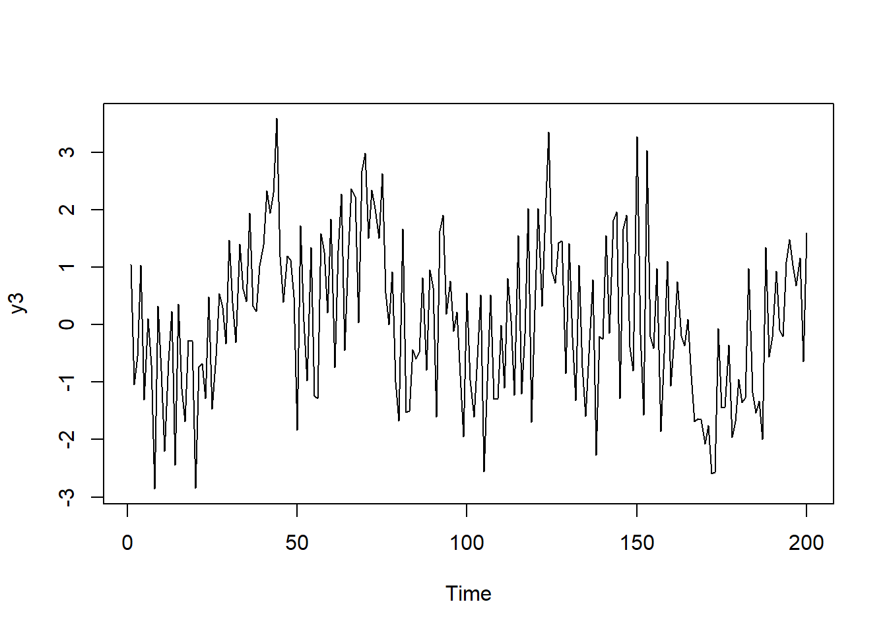](chapter33_files/figure-html/unnamed-chunk-12-1.png)

## 33.7 自己相関と偏自己相関

ARモデルは、時間tの値とそれ以前の値がよく似ている時系列です。この「よく似ている」度合いを評価するためのものが、**自己相関**と**偏自己相関**です。

**自己相関**とは、時系列の値y_(t)とp時点前の値y_(t-p)の値の相関のことを指します。pには整数が入り、pのことをラグ（log）と呼びます。

[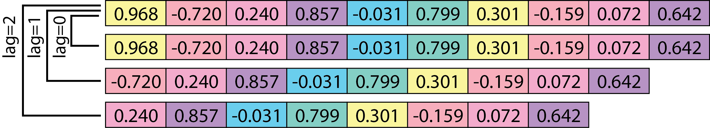](./image/autocorrelation.png "図1：自己相関のイメージ")

図1：自己相関のイメージ

自己相関は、Rでは以下のように計算することができます。

``` downlit
# y1はランダムウォークのデータ
head(y1)
## [1] 0.6314771 0.4683605 1.1332601 1.7694748 1.9767955 1.2068205

# p = 1のとき
cor(y1[1:199], y1[2:200])
## [1] 0.947694

# p = 2のとき
cor(y1[1:198], y1[3:200])
## [1] 0.8920951

# p = 3のとき
cor(y1[1:197], y1[4:200])
## [1] 0.8312737
```

上のスクリプトで用いている時系列はランダムウォークですが、ランダムウォークではpが大きくなると少しずつ自己相関が小さくなっていく傾向があります。これは、以下の式のように、時点tの値は時点t-1の値で、時点t-1の値は時点t-2の値で説明できることから、時点tの値は時点t-2の値にも依存するためです。

\\y\_{t} =1 \cdot y\_{t-1}+\epsilon\_{t}\\ \\y\_{t-1} =1 \cdot y\_{t-2}+\epsilon\_{t-1}\\ \\y\_{t} =1 \cdot y\_{t-2}+\epsilon\_{t}+\epsilon\_{t-1}\\

ただし、ランダムウォークでは1段階差の相関が最も重要です。このような、1段階差が似ているために2段階差以降にも自己相関が出てしまうような効果を取り除いたものを**偏自己相関**と呼びます。偏自己相関は自己相関ほどには簡単に求まりませんが、時系列が以前のどの時点とよく似ているのかを調べるのに有用です。

### 33.7.1 acf、pacf関数

上記のように`cor`関数を用いれば自己相関は求まりますが、各時点の自己相関・偏自己相関をいちいち`cor`関数で計算するのは大変です。

Rには、自己相関・偏自己相関を計算する関数として、`acf`関数と`pacf`関数が備わっています。いずれも時系列データを引数に取り、自己相関・偏自己相関の値を返す関数です。ただし、デフォルトでは`plot`引数が`TRUE`に設定されているため、`acf`関数は**自己相関プロット**・`pacf`関数は**偏自己相関プロット**を自動的に表示します。数値として自己相関・偏自己相関を得る場合には、引数に`plot=FALSE`を指定します。

グラフの横軸は階差（ラグ、Lag）で、Lag=0は時点tの値と時点tの値の相関、つまり同じもの同士の相関ですので、必ず1になります。Lag=1が1段階差の（偏）自己相関、Lag=2だと2段階差の（偏）自己相関ということになります。

``` downlit
acf(y1) # 自己相関（グラフが表示される、plot=FALSEとすると数値が返ってくる）
```

[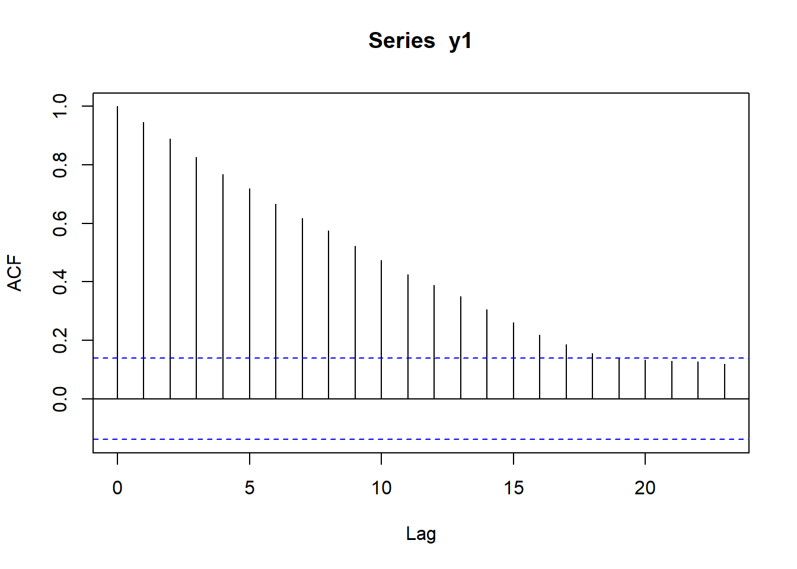](chapter33_files/figure-html/unnamed-chunk-14-1.png)

``` downlit
pacf(y1) # 偏自己相関
```

[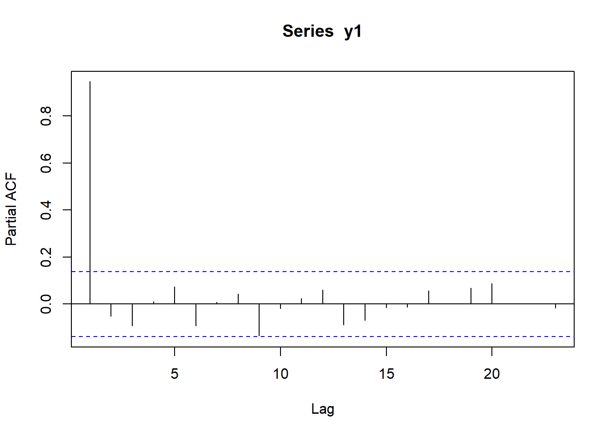](chapter33_files/figure-html/unnamed-chunk-14-2.png)

`TSstudio`パッケージの`ts_cor`関数を用いれば、自己相関と偏自己相関のグラフを一度に表示することができます。また、`ts_lags`関数を用いると、引数`lag`に指定したラグでの相関について、散布図を表示することもできます。

``` downlit
ts_cor(y1 |> as.ts()) # 自己相関と偏自己相関プロット
```

``` downlit
ts_lags(y1 |> as.ts(), lag = 1:3) # lagで指定した系列との散布図
```

以下に、ホワイトノイズ、ランダムウォーク、AR(1)、AR(2)、AR(3)モデル、季節性、トレンドの自己相関と偏自己相関を示します。

## ホワイトノイズ

ホワイトノイズでは、自己相関はLag=0だけ1となり、自己相関も偏自己相関も0に近い値となります。

``` downlit
ts_cor(y |> as.ts())
```

## ランダムウォーク

ランダムウォークでは、自己相関はLagが大きくなるほど減っていきます。偏自己相関はLag=1だけが高い値となります。

``` downlit
ts_cor(y1 |> as.ts())
```

## AR(1)モデル

AR(1)モデルはランダムウォークとよく似た自己相関・偏自己相関を示します。

``` downlit
ts_cor(y1a |> as.ts())
```

## AR(2)モデル

AR(2)モデルでは、（係数によりますが）自己相関はlag2つ置きに高い値を示し、偏自己相関はlag=2で高くなります。

``` downlit
ts_cor(y2 |> as.ts())
```

## AR(3)モデル

AR(3)モデルでは、（係数によりますが）自己相関はlag3つ置きに高い値を示し、偏自己相関はlag=3で高くなります。

``` downlit
ts_cor(y3 |> as.ts())
```

## 季節性あり

季節性がある場合には、自己相関に季節周期の波が生じます。偏自己相関には際立った特徴はありません。

``` downlit
ts_cor(ys |> as.ts())
```

## トレンドあり

トレンドの傾向にもよりますが、直線的なトレンドがある場合には、AR(1)とよく似た自己相関・偏自己相関を示します。

``` downlit
ts_cor(yt |> as.ts())
```

### 33.7.2 ar関数でモデルを推定

上記のように、「前の値とよく似ている」のがARモデルです。ただし、時系列データがARモデルを取っているということがあらかじめわかっているという場合は稀です。ですので、時系列データが取れたときに、その時系列がAR(1)モデルなのかAR(2)モデルなのか、ARの係数αがいくつなのか、といったことが求まる方が、その時系列の理解が深まります。

時系列データが得られた時に、ARのモデルと係数をそれぞれ求めるための関数が`ar`関数です。`ar`関数は時系列データ（ベクター）を引数に取り、ARの次数と係数を返します。`ar`関数はAICによるモデル選択でARの次数を求めています。以下に様々な時系列における`ar`関数の計算結果を示します。必ずしも正しい次数・係数が求まるわけではありませんが、データが増えれば`ar`関数でより正確にARモデルを求めることができます。

## ホワイトノイズ

ホワイトノイズはARモデルで示せないため、次数（order）は0、係数は示されません。

``` downlit
ar(y)
## 
## Call:
## ar(x = y)
## 
## 
## Order selected 0  sigma^2 estimated as  0.2131
```

## ランダムウォーク

ランダムウォークはAR(1)の特別な場合（\\\alpha=1\\）なので、Orderは1（AR(1)モデル）で、係数（Coefficients）はほぼ1となります。

``` downlit
ar(y1)
## 
## Call:
## ar(x = y1)
## 
## Coefficients:
##      1  
## 0.9458  
## 
## Order selected 1  sigma^2 estimated as  0.2145
```

## AR(1)モデル

AR(1)モデルのorderは1になるはずですが、lag=8の自己相関が大きめに出るためにAR(8)が選ばれています。1次の係数は設定した0.6に近い値を示します。

``` downlit
ar(y1a)
## 
## Call:
## ar(x = y1a)
## 
## Coefficients:
##       1        2        3        4        5        6        7        8  
##  0.5407  -0.0620  -0.0189  -0.0634  -0.0018   0.0673  -0.1407  -0.1459  
## 
## Order selected 8  sigma^2 estimated as  0.9814
```

## AR(2)モデル

AR(2)モデルのorderは2で、Coefficientsとして1次は0.08で設定値0.1に近い値、2次は0.68で設定値0.6に近い値となっています。

``` downlit
ar(y2)
## 
## Call:
## ar(x = y2)
## 
## Coefficients:
##      1       2  
## 0.0842  0.6803  
## 
## Order selected 2  sigma^2 estimated as  0.9906
```

## AR(3)モデル

AR(3)モデルのorderは3で、Coeffientsは0.08、0.07、0.62と、設定値の0.1、0.1、0.6に近い値が得られています。

``` downlit
ar(y3)
## 
## Call:
## ar(x = y3)
## 
## Coefficients:
##      1       2       3  
## 0.0846  0.0714  0.6225  
## 
## Order selected 3  sigma^2 estimated as  1.057
```

## 季節性あり

12ごとの周期性のある季節性データでは、AR(12)が選ばれています。

``` downlit
ar(ys)
## 
## Call:
## ar(x = ys)
## 
## Coefficients:
##       1        2        3        4        5        6        7        8  
##  0.3344   0.0616  -0.2348  -0.2019   0.1221  -0.0921  -0.1720  -0.0091  
##       9       10       11       12  
## -0.1220   0.0198   0.1262   0.2771  
## 
## Order selected 12  sigma^2 estimated as  0.3312
```

## トレンドあり

季節性とトレンドを含むデータでは、AR(14)が選ばれ、1次の係数が1に近い値（0.9908）になっています。

``` downlit
ar(yt)
## 
## Call:
## ar(x = yt)
## 
## Coefficients:
##       1        2        3        4        5        6        7        8  
##  0.9908  -0.0001  -0.1176   0.0442   0.0554  -0.0791   0.0767  -0.0475  
##       9       10       11       12       13       14  
## -0.0666   0.1996   0.0148   0.0866  -0.0260  -0.1554  
## 
## Order selected 14  sigma^2 estimated as  1.658
```

## 33.8 移動平均

時系列データでは、通常ホワイトノイズに準じたばらつきが生じます。このばらつきが大きい場合には、全体としての時系列のトレンドがはっきりとしなくなる場合があります。ばらつきの大きい時系列データでは、このようなばらつきを**平滑化**して、時系列のトレンドが明確になるようにすることがあります。

平滑化の方法には様々なものがありますが、最も簡単な平滑化の手法が**移動平均（rolling mean）**です。移動平均では、y₁、y₂、y₃、… y_(t)の時系列データがあった時、例えばy₁、y₂、y₃の平均、y₂、y₃、y₄の平均、y₃、y₄、y₅の平均…といった風に、一定の時間間隔のデータを平均していきます。このとき、3つの平均を取るときには3 rolling windowの移動平均を取る、といったように、英語では平均を取る個数のことを「窓（window）」で表現するのが一般的です。ただし、移動平均を取ると窓の幅に応じて時系列の長さが短くなるという特徴があります。

Rでは、[`zoo`](https://cran.r-project.org/web/packages/zoo/index.html)パッケージ([Zeileis and Grothendieck 2005](#ref-zoo_bib))の`rollmean`関数で移動平均を計算することができます。`rollmean`関数は第一引数に時系列、第二引数にwindow（引数名は`k`）を取り、移動平均計算の結果を返します。以下に移動平均を5、10、20のwindowの設定で計算した結果を示します。windowを大きく設定するほど時系列は短くなり、よりギザギザのない、平滑な線になっていくのがわかります。

## もとのデータ

``` downlit
y2.1 <- y2

ggplot(data.frame(t, y2.1), aes(x = t, y = y2.1))+
  geom_point(size = 2, alpha = 0.5)+
  geom_line(linewidth = 0.5, alpha = 0.5)+
  expand_limits(x = 0)
```

[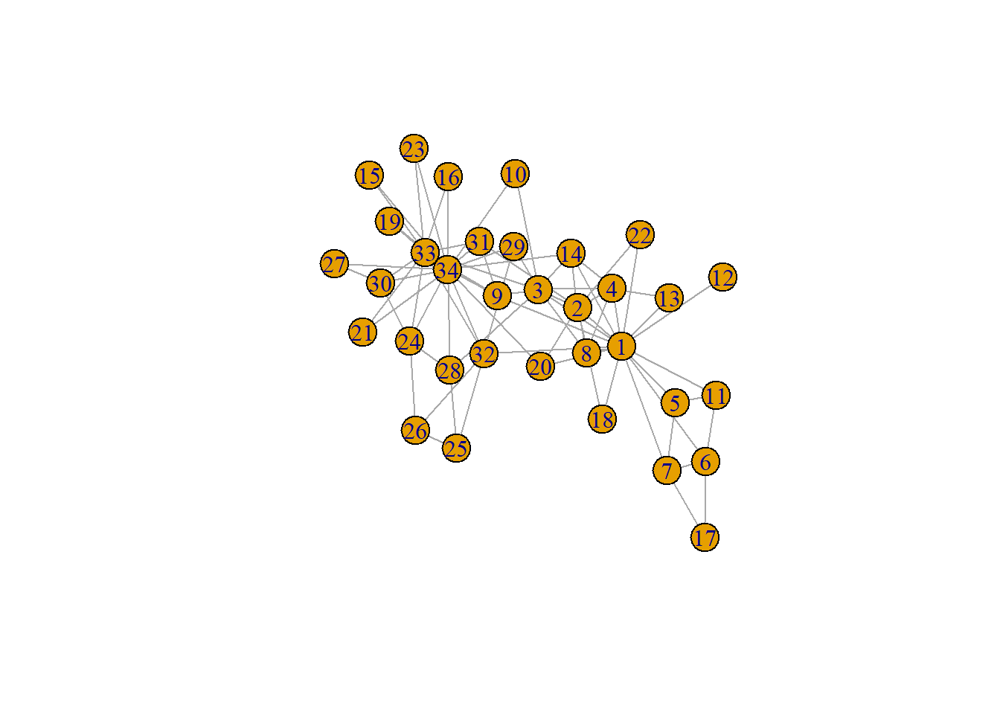](chapter33_files/figure-html/unnamed-chunk-30-1.png)

## 5時点の移動平均

``` downlit
y2.5 <- zoo::rollmean(y2, 5)

ggplot(data.frame(t = t[5:200], y2.5), aes(x = t, y = y2.5))+
  geom_point(size = 2, alpha = 0.5)+
  geom_line(linewidth = 0.5, alpha = 0.5)+
  expand_limits(x = 0)
```

[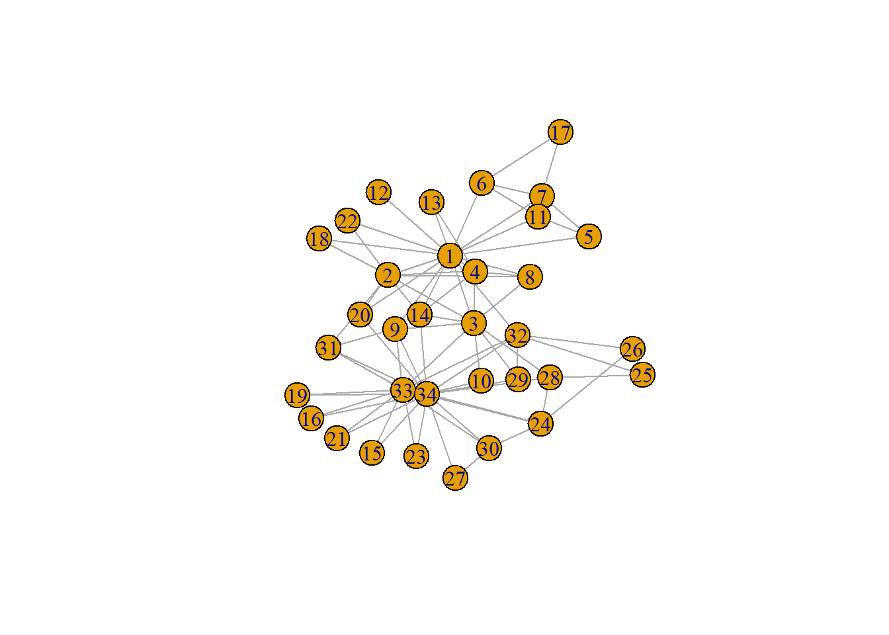](chapter33_files/figure-html/unnamed-chunk-31-1.png)

## 10時点の移動平均

``` downlit
y2.10 <- zoo::rollmean(y2, 10)

ggplot(data.frame(t = t[10:200], y2.10), aes(x = t, y = y2.10))+
  geom_point(size = 2, alpha = 0.5)+
  geom_line(linewidth = 0.5, alpha = 0.5)+
  expand_limits(x = 0)
```

[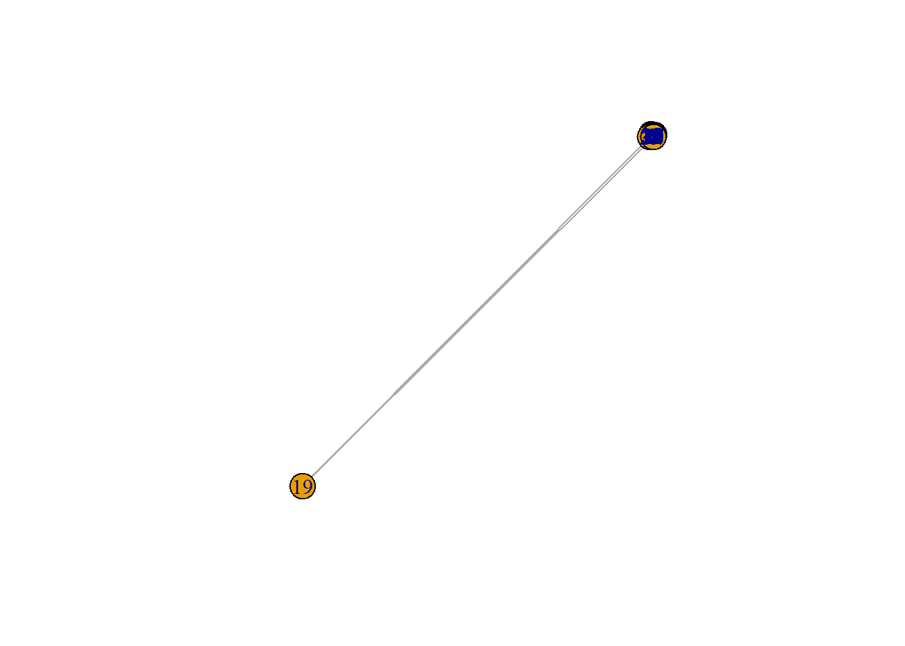](chapter33_files/figure-html/unnamed-chunk-32-1.png)

## 20時点の移動平均

``` downlit
y2.20 <- zoo::rollmean(y2, 20)

ggplot(data.frame(t = t[20:200], y2.20), aes(x = t, y = y2.20))+
  geom_point(size = 2, alpha = 0.5)+
  geom_line(linewidth = 0.5, alpha = 0.5)+
  expand_limits(x = 0)
```

[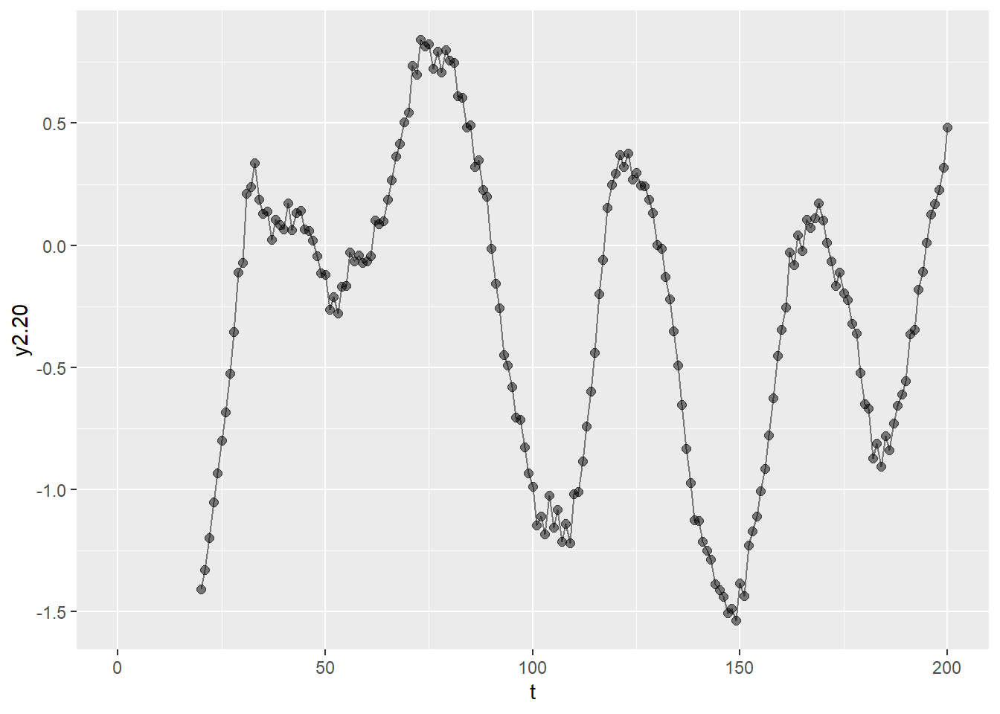](chapter33_files/figure-html/unnamed-chunk-33-1.png)

## 33.9 MAモデル

移動平均と日本語では同じ名前の時系列モデルとして、**MA（Moving average）モデル**というものがあります。MAモデルは上で説明したrolling meanとは少し異なり、時間tにおける値y_(t)が正規分布に従う乱数εと係数の積を足した値に従うようなモデルとなります。以下の数式では、**MA(q)モデル**として、係数とεの積をq個足しあわせた式を示します。

\\y\_{t}=\epsilon\_{t} + \theta\_{1} \cdot \epsilon\_{t-1} + \cdots \theta\_{q} \cdot \epsilon\_{t-q}\\ \\\epsilon\_{t} \sim Normal(0, \sigma)\\

以下に、MA(1)～MA(3)モデルの式とグラフ、自己相関・偏自己相関を示します。MAモデルは定常過程で、平均値や分散が時間とともに大きく変化しないような過程となります。MAモデルでは、自己相関にはあまり特徴がなく、偏自己相関には比較的大きい値が維持されるような傾向をもちます。

## MA(1)モデル

\\y\_{t}=\epsilon\_{t} + \theta\_{1} \cdot \epsilon\_{t-1} \\

``` downlit
ym1 <- arima.sim(model = list(order = c(0, 0, 1), ma = 0.8), 200)

plot(ym1)
```

[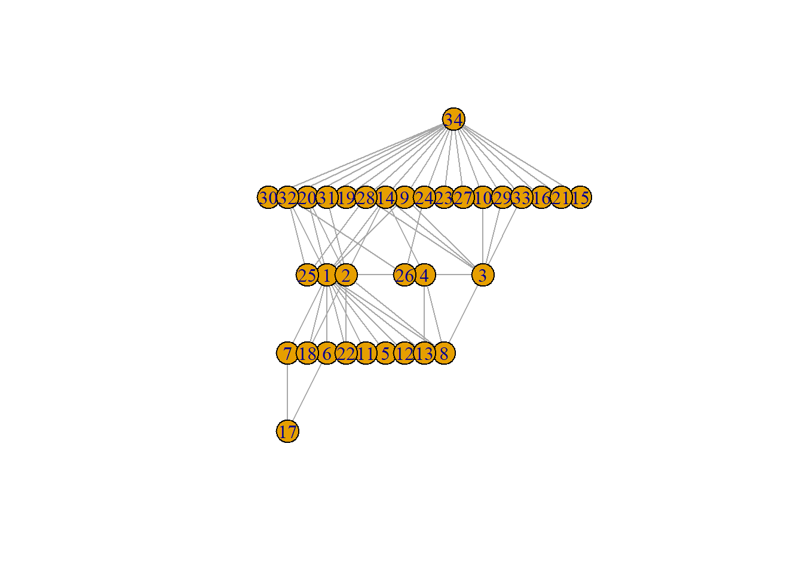](chapter33_files/figure-html/unnamed-chunk-34-1.png)

``` downlit
ts_cor(ym1 |> as.ts())
```

## MA(2)モデル

\\y\_{t}=\epsilon\_{t} + \theta\_{1} \cdot \epsilon\_{t-1} + \theta\_{2} \cdot \epsilon\_{t-2}\\

``` downlit
ym2 <- arima.sim(model = list(order = c(0, 0, 2), ma = c(0.3, 0.7)), 200)

plot(ym2)
```

[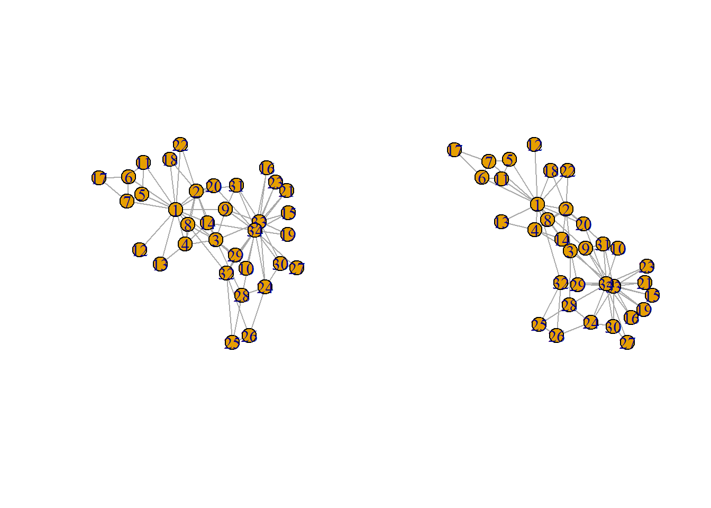](chapter33_files/figure-html/unnamed-chunk-36-1.png)

``` downlit
ts_cor(ym2 |> as.ts())
```

## MA(3)モデル

\\y\_{t}=\epsilon\_{t} + \theta\_{1} \cdot \epsilon\_{t-1} + \theta\_{2} \cdot \epsilon\_{t-2} + \theta\_{3} \cdot \epsilon\_{t-3}\\

``` downlit
ym3 <- arima.sim(model = list(order = c(0, 0, 3), ma = c(0.2, 0.2, 0.4)), 200)

plot(ym3)
```

[](chapter33_files/figure-html/unnamed-chunk-38-1.png)

``` downlit
ts_cor(ym3 |> as.ts())
```

## 33.10 単位根過程と反転可能性

### 33.10.1 単位根過程

**単位根過程（unit root）**とは、特性方程式というものの解が1を含むような過程のことを指します。特性方程式とは以下のような式で、Φについて解くことで解を求めます。

\\1-\alpha\_{1}\phi - \alpha\_{2}\phi^2 -\alpha\_{3}\phi^3 \cdots -\alpha\_{p}\phi^p=0\\

上の`arima.sim`関数の説明で、以下のようにARの係数から定常過程の判定を行うRのスクリプトを記載していますが、この下の式の一部が特性方程式の解を求めるスクリプトになっています。特性方程式の解の最小値が1以上なら定常過程、解に1を含むなら単位根過程となります。

``` downlit
ar <- c(0.2, 0.2, 0.5) # ARの係数のベクター

# これが特性方程式の解の最小値を求める計算式
# （正確には解の原点からの距離の最小値）
min(Mod(polyroot(c(1, -ar))))
## [1] 1.045891
```

…定義上はこのように単位根過程であるかどうかを判定するのですが、正直よくわからないと思います。我々が最低限知っておくべきこととしては、**ランダムウォークが単位根過程**であることです。以下の2つの式から分かる通り、ランダムウォークはAR(1)でかつα₁=1なので、特性方程式Φの解が1になります。

\\y\_{t}=y\_{t-1}+\epsilon\_{t}\\ \\1 - 1 \cdot \phi = 0\\

### 33.10.2 独立な単位根過程同士で相関を取る

単位根過程である時系列データには、**「2つの独立な単位根過程では、その2つの相関を取ると有意な相関が得られる」**、という特殊な性質があります。この相関には全く意味は無いので、時系列データ同士の相関を取る場合には注意が必要です。

``` downlit
# y1とy1_2は乱数から作った2つの独立な単位根過程
y1_2 <- NULL
temp <- 0
for(i in 1:200){
  temp <- temp+rnorm(1, 0, 1)
  y1_2 <- c(y1_2, temp)
}

# 相関係数が-0.6
cor(y1, y1_2) 
## [1] -0.5992427

# 相関の有意性を検定すると有意になる
cor.test(y1, y1_2)
## 
##  Pearson's product-moment correlation
## 
## data:  y1 and y1_2
## t = -10.533, df = 198, p-value < 2.2e-16
## alternative hypothesis: true correlation is not equal to 0
## 95 percent confidence interval:
##  -0.6813376 -0.5022593
## sample estimates:
##        cor 
## -0.5992427

# バラバラしているけど相関がある
plot(y1, y1_2)
```

[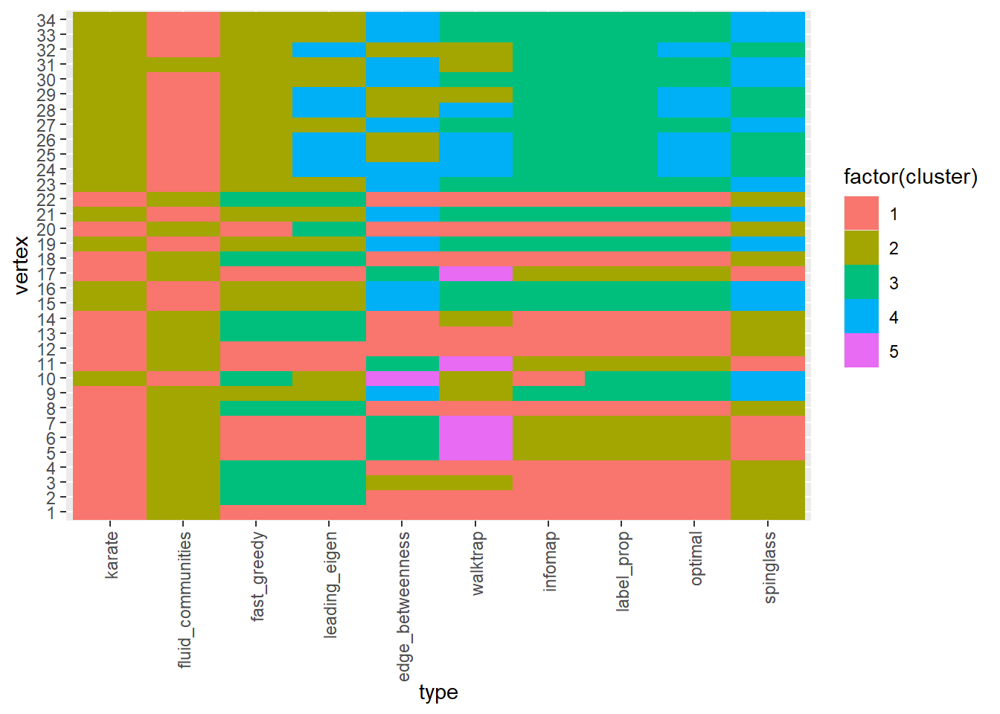](chapter33_files/figure-html/unnamed-chunk-41-1.png)

例えば、トルコリラの為替変動と日経平均株価は共にランダムウォークの過程ですが、相関を取ると有意な相関がある、という結果が得られます。だからといって、トルコリラが上がった（又は下がった）から日経平均株価も上がるだろうと想定して株を買い込むと痛い目にあいます。

### 33.10.3 単位根検定

とは言っても、時系列データが単位根過程であるか判定するための特性方程式はα_(p)、つまりARモデルの係数がわからないと解くことができませんし、時系列データが得られればα_(p)が求まるというものでもありません。得られた時系列データが単位根過程であるかどうかを判定する場合には、特性方程式を解くのではなく、通常は**単位根検定**という検定手法を用いることになります。

時系列データが単位根過程であるかどうかは、**ADF検定**というものを用いて検定します。ADF検定は「単位根過程である」場合を帰無仮説とし、棄却された場合、つまりp値が十分に小さい場合には「単位根過程である」という帰無仮説を棄却して、「単位根過程ではない」という対立仮説を採用する検定手法です。要は**p値が小さい場合には単位根過程では無い**と判断します。

Rでは[`CADFtest`](https://cran.r-project.org/web/packages/CADFtest/index.html)パッケージ([Lupi 2009](#ref-CADFtest_bib))の`CADFtest`関数を用いてADF検定を行います。

``` downlit
pacman::p_load(CADFtest)
CADFtest(y1)
## 
##  ADF test
## 
## data:  y1
## ADF(1) = -3.2007, p-value = 0.08728
## alternative hypothesis: true delta is less than 0
## sample estimates:
##       delta 
## -0.09773805
```

以下に、CADFtest関数を用いた各種時系列データの検定結果を示します。

## ホワイトノイズ

ホワイトノイズは単位根過程ではないので、帰無仮説は棄却されます。

``` downlit
CADFtest(y)
## 
##  ADF test
## 
## data:  y
## ADF(1) = -9.1384, p-value = 3.329e-13
## alternative hypothesis: true delta is less than 0
## sample estimates:
##      delta 
## -0.9116643
```

## ランダムウォーク

ランダムウォークは単位根過程なので、帰無仮説は棄却されません。

``` downlit
CADFtest(y1)
## 
##  ADF test
## 
## data:  y1
## ADF(1) = -3.2007, p-value = 0.08728
## alternative hypothesis: true delta is less than 0
## sample estimates:
##       delta 
## -0.09773805
```

## ランダムウォークの差分

ランダムウォークの差分系列を取ると、ホワイトノイズとなるため、単位根過程ではなくなります。

``` downlit
CADFtest(y1 |>  diff())
## 
##  ADF test
## 
## data:  diff(y1)
## ADF(1) = -9.2234, p-value = 2.166e-13
## alternative hypothesis: true delta is less than 0
## sample estimates:
##      delta 
## -0.9191055
```

## AR(1)モデル

AR(1)モデルでかつαが1でない場合には、単位根過程ではありません。

``` downlit
CADFtest(y1a)
## 
##  ADF test
## 
## data:  y1a
## ADF(1) = -7.243, p-value = 8.453e-09
## alternative hypothesis: true delta is less than 0
## sample estimates:
##      delta 
## -0.4944694
```

## AR(2)モデル

AR(2)モデル以降は係数によって単位根過程かどうかが変わります。以下の例は単位根過程ではない場合です。

``` downlit
CADFtest(y2)
## 
##  ADF test
## 
## data:  y2
## ADF(1) = -3.5976, p-value = 0.03252
## alternative hypothesis: true delta is less than 0
## sample estimates:
##      delta 
## -0.2281931
```

## AR(3)モデル

AR(3)モデルも係数によって単位根過程かどうかが変わります。以下の例は単位根過程ではない場合です。

``` downlit
CADFtest(y3)
## 
##  ADF test
## 
## data:  y3
## ADF(1) = -6.921, p-value = 4.41e-08
## alternative hypothesis: true delta is less than 0
## sample estimates:
##     delta 
## -0.593555
```

単位根検定には他に**KPSS検定**と呼ばれる、帰無仮説が「単位根過程ではない」、つまり**棄却された場合に単位根過程である**とされる検定もあります。Rでは、[`tseries`](https://cran.r-project.org/web/packages/tseries/index.html)パッケージ([Trapletti and Hornik 2023](#ref-tseries_bib))の`kpss.test`関数を用いてKPSS検定を行うことができます。

``` downlit
pacman::p_load(tseries)
kpss.test(y1)
## Warning in kpss.test(y1): p-value smaller than printed p-value
## 
##  KPSS Test for Level Stationarity
## 
## data:  y1
## KPSS Level = 1.9409, Truncation lag parameter = 4, p-value = 0.01
```

### 33.10.4 反転可能性

MAモデルの一部は、AR(∞)モデルの形に書き換えることができます。このAR(∞)モデルに書き換えることができることを**反転可能性**と呼びます。反転可能なMAモデルは反転不可能なモデルよりも統計的には取り扱いやすいとされています。

反転可能性の条件は以下の特性方程式の解がすべて1以上となることです。

\\1+\theta\_{1}\phi + \theta\_{2}\phi^2 +\theta\_{3}\phi^3 \cdots +\theta\_{q}\phi^q=0\\

ARモデルの特性方程式と同じように、MAモデルの特性方程式も以下のスクリプトで計算することができ、下の式が`TRUE`になる場合は反転可能、`FALSE`になる場合は反転不可能となります。

``` downlit
ma <- c(0.2, 0.2, 0.5) # MAの係数のベクター

# 特性方程式の解の最小値が1以上なら反転可能
min(Mod(polyroot(c(1, ma)))) > 1
## [1] TRUE
```

## 33.11 ARMAモデル

以上のように、ARモデルやMAモデルで時系列データを説明することはできるのですが、では時系列データが得られた時にARの次数（order）がいくつで、MAの次数がいくつで、それぞれの係数はいくつになるのか、というのはよくわからないままです。このAR・MAの次数や係数を定めるときに用いられるのが**ARMAモデル**です。

ARMAモデルは、その名の通りARモデルとMAモデルを含んだ時系列モデルです。平均値一定で分散が時間とともに大きく変化しない、定常性を持つ時系列データはこのARMAモデルで記述することができます。ARMAモデルは、ARの次数pとMAの次数qを用いて、**ARMA(p,q)**という形で示します。例えば、ARMA(1,2)であれば、AR(1)モデルでかつMA(2)モデルであることを示しています。

上に示した`ar`関数では、ARモデルの次数と係数を求めることができましたが、MAモデルが混じっているARMAモデルの次数と係数を求めることはできません。

RでARMAモデルの次数と係数を求めるときには、`tseries`パッケージの`arma`関数を用います。`arma`関数は時系列データ（ベクターや`ts`オブジェクト）と次数を引数に取り、AR、MAの係数、切片項（intercept）をそれぞれ計算してくれます。ただし、`arma`関数は次数を与えずに計算させるとARMA(1,1)であるとして計算してしまうので、可能であれば次数を`order`引数に与える必要があります。以下に、各種時系列データを`arma`関数で分析したときの結果を示します。

## ホワイトノイズ

``` downlit
arma(y, order=c(0, 0)) # 切片項だけが得られる
## Warning in optim(coef, err, gr = NULL, hessian = TRUE, ...): one-dimensional optimization by Nelder-Mead is unreliable:
## use "Brent" or optimize() directly
## 
## Call:
## arma(x = y, order = c(0, 0))
## 
## Coefficient(s):
## intercept  
## -0.005762
```

## ランダムウォーク

``` downlit
arma(y1, order=c(1, 0)) # ランダムウォークはARMA(1,0)
## 
## Call:
## arma(x = y1, order = c(1, 0))
## 
## Coefficient(s):
##       ar1  intercept  
##   0.94703   -0.03081
```

## AR(1)モデル

``` downlit
arma(y1a, order=c(1, 0)) # AR(1)モデルはARMA(1,0)
## 
## Call:
## arma(x = y1a, order = c(1, 0))
## 
## Coefficient(s):
##       ar1  intercept  
##   0.54624    0.04701
```

## AR(2)モデル

``` downlit
arma(y2, order=c(2, 0)) # AR(2)モデルはARMA(2,0)
## 
## Call:
## arma(x = y2, order = c(2, 0))
## 
## Coefficient(s):
##       ar1        ar2  intercept  
##   0.07898    0.69440   -0.04239
```

## AR(3)モデル

``` downlit
arma(y3, order=c(3, 0)) # AR(3)モデルはARMA(3,0)
## 
## Call:
## arma(x = y3, order = c(3, 0))
## 
## Coefficient(s):
##       ar1        ar2        ar3  intercept  
##   0.08845    0.06730    0.62943    0.02617
```

## MA(1)モデル

``` downlit
arma(ym1, order=c(0, 1)) # MA(1)モデルはARMA(0,1)
## 
## Call:
## arma(x = ym1, order = c(0, 1))
## 
## Coefficient(s):
##       ma1  intercept  
##    0.7059    -0.3002
```

## MA(2)モデル

``` downlit
arma(ym2, order=c(0, 2)) # MA(2)モデルはARMA(0,2)
## 
## Call:
## arma(x = ym2, order = c(0, 2))
## 
## Coefficient(s):
##       ma1        ma2  intercept  
##   0.31962    0.59392    0.08629
```

## MA(3)モデル

``` downlit
arma(ym3, order=c(0, 3)) # MA(3)モデルはARMA(0,3)
## 
## Call:
## arma(x = ym3, order = c(0, 3))
## 
## Coefficient(s):
##       ma1        ma2        ma3  intercept  
##    0.1585     0.1494     0.3318    -0.1404
```

## 33.12 ARIMAモデル

ARMAは基本的に定常過程を対象とするモデルです。しかし、単位根過程となる時系列は定常過程ではなく、ARMAでは取り扱いにくい場合があります。このような単位根過程となる時系列にも対応したモデルが**ARIMA（auto-regression integrated moving average）モデル**です。ARIMAモデルは、ARモデルとMAモデルに**和分(I)**を付け加えたモデルとなります。

典型的な単位根過程であるランダムウォークの差分を取るとホワイトノイズとなるように、**単位根過程の何段階かの差分を取ると、定常過程**を得ることができます。このことから、単位根過程である時系列は、定常過程を足し合わせたもの、つまり**和分**であるとすることができます。

単位根過程の時系列データで、d階差分を取ると定常過程となる場合、そのデータは**I(d)**、つまり**d次の和分**であるとします。この和分I(d)をARMAモデルに加えたものがARIMAモデルで、AR(p)、I(d)、MA(q)のぞれぞれの次数を合わせて**ARIMA(p,d,q)**という形でモデルを表現します。

ARIMAモデルの計算では、まず時系列が単位根過程であるかを判定し、その後I(d)のdの次数を決定します。その後差分系列のAR、MAの次数と係数を決定するという過程で、ARIMA(p,d,q)のp、d、qの部分を求めます。Rでは、`arima`関数でARIMAモデルの係数を求めることができます。ただし、`arima`関数ではあらかじめ(p,d,q)の次数を引数に与える必要があります。

``` downlit
arima(y1, c(1, 0, 0)) # ARIMA(1, 0, 0)として係数を求める
## 
## Call:
## arima(x = y1, order = c(1, 0, 0))
## 
## Coefficients:
##          ar1  intercept
##       0.9451    -0.3930
## s.e.  0.0217     0.5385
## 
## sigma^2 estimated as 0.205:  log likelihood = -126.45,  aic = 258.91
```

しかし、時系列データを得た時に、そのデータがARIMA(1,1,0)である、といった風に、次数をあらかじめ決めることは普通はできません。Rには次数を含めてARIMAモデルを計算してくれる、`auto.arima`関数が備わっています。実際に時系列分析を行う際には、`arima`関数を用いることはほぼなく、`auto.arima`関数を用いることになります。`auto.arima`関数はAICに従いモデル選択を行う関数で、[30章](chapter30.llms.md#aicによるモデル選択)で説明したAICによるモデル選択における`step`関数のARIMA版のようなものになります。

`auto.arima`関数には、モデルを総当り計算するかステップワイズな計算をするかを決定する`stepwise`引数を設定できます。`stepwise=T`とするとステップワイズ計算を行い、計算が速くなります。一方で`stepwise=F`とすると、総当り計算を行うため計算は正確になりますが、モデルが複雑な場合には計算に時間がかかります。また、`trace`引数を`TRUE`に設定すると、繰り返し計算をすべて表示してくれます。

以下に、`auto.arima`関数を用いて各種の時系列データを分析した例を示します。

## ホワイトノイズ

ホワイトノイズはARIMA(0,0,0)モデルですので、正しくモデルが求まっています。

``` downlit
auto.arima(ts(y), stepwise = T, trace = F) |> summary()
## Series: ts(y) 
## ARIMA(0,0,0) with zero mean 
## 
## sigma^2 = 0.2121:  log likelihood = -128.71
## AIC=259.43   AICc=259.45   BIC=262.72
## 
## Training set error measures:
##                        ME      RMSE       MAE MPE MAPE      MASE       ACF1
## Training set -0.005720777 0.4605318 0.3724083 100  100 0.7227597 0.02846469
```

## ランダムウォーク

ランダムウォークは単位根ありの和分過程ですので、ARIMA(0,1,0)となります。

``` downlit
auto.arima(ts(y1), stepwise = T, trace = F) |> summary()
## Series: ts(y1) 
## ARIMA(0,1,0) 
## 
## sigma^2 = 0.2112:  log likelihood = -127.63
## AIC=257.26   AICc=257.28   BIC=260.55
## 
## Training set error measures:
##                        ME     RMSE       MAE      MPE     MAPE      MASE
## Training set -0.008875005 0.458362 0.3692541 25.84799 116.8924 0.9950085
##                    ACF1
## Training set 0.03107499
```

## AR(1)モデル

単位根の無いAR(1)モデルはARIMA(1,0,0)ですが、ARIMA(2,0,1)と推定されています。

``` downlit
auto.arima(ts(y1a), stepwise = T, trace = F) |> summary()
## Series: ts(y1a) 
## ARIMA(2,0,1) with zero mean 
## 
## Coefficients:
##          ar1      ar2      ma1
##       1.4858  -0.5857  -0.9430
## s.e.  0.0600   0.0574   0.0284
## 
## sigma^2 = 0.9733:  log likelihood = -280.02
## AIC=568.05   AICc=568.25   BIC=581.24
## 
## Training set error measures:
##                     ME      RMSE       MAE      MPE     MAPE      MASE
## Training set 0.1115677 0.9791473 0.7685823 32.28064 229.3899 0.8382321
##                     ACF1
## Training set -0.01643774
```

## AR(2)モデル

AR(2)モデルはARIMA(2,0,0)モデルですが、ARIMA(3,0,0)と推定されています。

``` downlit
auto.arima(ts(y2), stepwise = T, trace = F) |> summary()
## Series: ts(y2) 
## ARIMA(3,0,0) with non-zero mean 
## 
## Coefficients:
##          ar1     ar2     ar3     mean
##       0.0185  0.6854  0.0985  -0.2964
## s.e.  0.0702  0.0510  0.0712   0.3328
## 
## sigma^2 = 0.9577:  log likelihood = -278.16
## AIC=566.31   AICc=566.62   BIC=582.81
## 
## Training set error measures:
##                      ME      RMSE       MAE      MPE     MAPE      MASE
## Training set 0.01878576 0.9687765 0.7920465 66.62805 144.2256 0.5901585
##                    ACF1
## Training set 0.00562248
```

## AR(3)モデル

AR(3)モデルはARIMA(3,0,0)モデルですが、ARIMA(0,0,3)と推定されています。

``` downlit
auto.arima(ts(y3), stepwise = T, trace = F) |> summary()
## Series: ts(y3) 
## ARIMA(0,0,3) with zero mean 
## 
## Coefficients:
##          ma1     ma2     ma3
##       0.1581  0.1368  0.5761
## s.e.  0.0601  0.0687  0.0556
## 
## sigma^2 = 1.211:  log likelihood = -302.02
## AIC=612.04   AICc=612.25   BIC=625.24
## 
## Training set error measures:
##                      ME     RMSE       MAE      MPE     MAPE      MASE
## Training set 0.03989579 1.092088 0.8902643 207.5248 257.3231 0.6549154
##                    ACF1
## Training set 0.01566343
```

## MR(1)モデル

MA(1)モデルはARIMA(0,0,1)モデルなので、正しく推定されています。

``` downlit
auto.arima(ts(ym1), stepwise = T, trace = F) |> summary()
## Series: ts(ym1) 
## ARIMA(0,0,1) with non-zero mean 
## 
## Coefficients:
##          ma1     mean
##       0.7085  -0.2820
## s.e.  0.0577   0.1275
## 
## sigma^2 = 1.129:  log likelihood = -295.28
## AIC=596.56   AICc=596.68   BIC=606.46
## 
## Training set error measures:
##                        ME     RMSE       MAE      MPE     MAPE      MASE
## Training set -0.002073118 1.057302 0.8466552 58.08614 210.9915 0.7558314
##                     ACF1
## Training set -0.06563672
```

## MR(2)モデル

MA(2)モデルはARIMA(0,0,2)モデルなので、正しく推定されています。

``` downlit
auto.arima(ts(ym2), stepwise = T, trace = F) |> summary()
## Series: ts(ym2) 
## ARIMA(0,0,2) with zero mean 
## 
## Coefficients:
##          ma1     ma2
##       0.3216  0.5933
## s.e.  0.0571  0.0627
## 
## sigma^2 = 0.9629:  log likelihood = -279.46
## AIC=564.92   AICc=565.04   BIC=574.82
## 
## Training set error measures:
##                      ME      RMSE       MAE      MPE     MAPE      MASE
## Training set 0.04296999 0.9763719 0.7801817 57.34941 177.9415 0.7341903
##                     ACF1
## Training set -0.02243839
```

## MR(3)モデル

MA(3)モデルはARIMA(0,0,3)モデルですが、ARIMA(3,0,1)モデルと推定されています。

``` downlit
auto.arima(ts(ym3), stepwise = T, trace = F) |> summary()
## Series: ts(ym3) 
## ARIMA(3,0,1) with zero mean 
## 
## Coefficients:
##           ar1     ar2     ar3     ma1
##       -0.3327  0.2490  0.3377  0.5132
## s.e.   0.1998  0.0814  0.0678  0.2110
## 
## sigma^2 = 1.009:  log likelihood = -282.83
## AIC=575.66   AICc=575.97   BIC=592.16
## 
## Training set error measures:
##                       ME      RMSE       MAE      MPE     MAPE      MASE
## Training set -0.07330069 0.9942121 0.7860151 54.59213 167.2121 0.7073544
##                    ACF1
## Training set -0.0121561
```

上記のように`auto.arima`関数を用いれば必ず正しいモデルが計算できる、というわけではありませんし、MAモデルが反転可能な場合にはARとMAの次数が逆転することもありますが、時系列のデータ数が十分に多ければ、ある程度信頼できる結果を返してくれます。

> **TIP:**
>
> `auto.arima`関数の結果と次数、データ数の関係をより調べたい方は、以下のリンクにあるシミュレーションを触ってみて下さい。また、下のスクリプトをRで実行することでもシミュレーションを動かすことができます。
>
> [ARIMAシミュレーター](https://xjorv.shinyapps.io/ARIMA_simulator/)
>
> ``` downlit
> if(!require(shiny)){install.packages("shiny")};runGitHub("ARIMAsim", "sb8001at-oss")
> ```
>
> このシミュレーターでは、`arima.sim`関数で生成した時系列に対して`auto.arima`関数や単位根検定を行った結果を確認することができます。

### 33.12.1 ARIMAモデルを用いた予測

上記のように、`auto.arima`関数を用いれば、ARIMAモデルの次数と係数を求めることができます。とは言っても、次数と係数が求まったら何かわかるのかと言われると、イマイチよくわかりません。ARIMA(3,2,1)モデルがどんな形をしていて、どういう意味があるのか、パッと分かる人はなかなかいないでしょう。

ARIMAモデルの意味がわからなくても、この計算したARIMAモデルがあれば、その**時系列の将来の変化を予測**することはできます。

Rでは`forecast`パッケージの`forecast`関数を用いることで、ARIMAモデルでの予測を行うことができます。`forecast`関数は第一引数に`auto.arima`関数の返り値を、第二引数に予測する期間の長さ（`h`）を取ります。`forecast`関数の返り値はデータフレームで、予測値とその推定区間を返してくれます。予測区間を見るとわかりますが、明確なトレンドや季節性が無いデータでは、予測する時期が遠い未来になると点推定値も範囲推定値もほぼ一定になります。

``` downlit
pacman::p_load("forecast")
# auto.arimaの返り値を変数に代入
y1a_arima <- auto.arima(ts(y1a), ic = "aic", stepwise = F, trace = F) 
fc <- forecast(y1a_arima, h = 5, level = 95) # 5時点先まで予測する
# 左から点推定値、95％下限推定値、95％上限推定値
fc
##     Point Forecast     Lo 95    Hi 95
## 201     0.61331914 -1.320332 2.546970
## 202    -0.03486291 -2.235006 2.165280
## 203    -0.41103196 -2.652208 1.830144
## 204    -0.59029108 -2.831552 1.650970
## 205    -0.63630478 -2.888439 1.615829
```

> **TIP:**
>
> ``` downlit
> fc <- forecast(y1a_arima, h = 100) |> as.data.frame()
> fc$t <- 201:300
> ggplot()+
>   geom_line(data = data.frame(t = 1:200, y1a), aes(x = t, y = y1a))+
>   geom_line(data = fc, aes(x = t, y = `Point Forecast`, color = "red", linewidth=3))+
>   geom_ribbon(data = fc, aes(x = t, y = `Point Forecast`, ymax = `Hi 95`, ymin = `Lo 95`, color = "red", fill = "red", alpha = 0.2))+
>   labs(caption = "赤の太線が点推定値、リボンが95%推定区間")
> ```

[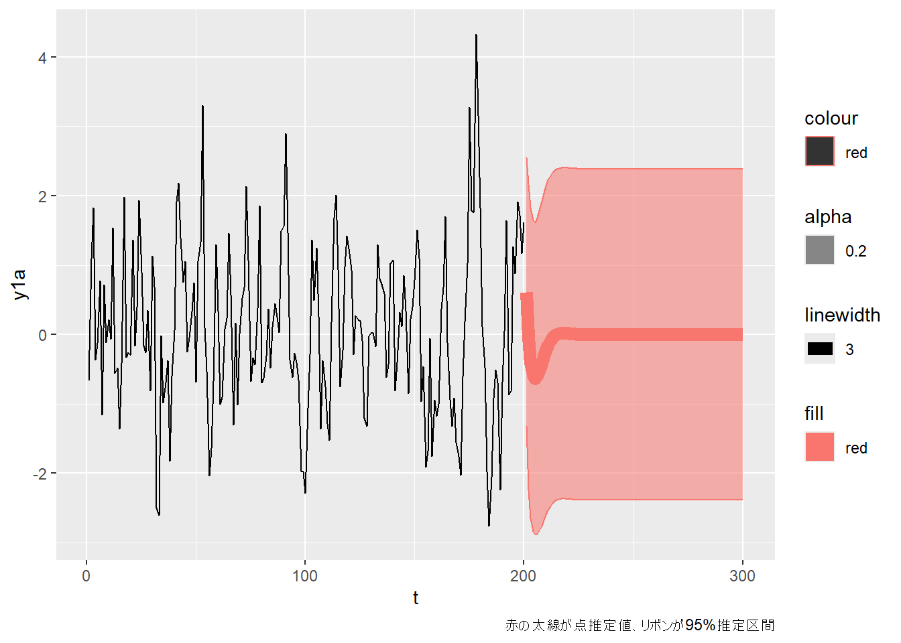](chapter33_files/figure-html/unnamed-chunk-71-1.png)

## 33.13 ARIMA以外の時系列分析手法

上記のARIMAモデルが時系列分析手法では最も有名な手法の一つですが、時系列分析にはARIMAの他に、以下のような手法があります。

- SARIMA：季節性を含めたARIMAモデルの拡張
- ARIMAX：共変量（例えば、Nileの例であればアスワンハイダムの建造など）を含めたARIMAモデルの拡張
- VAR：複数の関連する時系列を一度に取り扱う、多変量時系列解析の手法
- ARCH・GARCH：分散の変動（ボラティリティ、volatility）に注目した統計手法

Rではそれぞれ以下のパッケージ・関数を用いて計算することができます。

- SARIMA：`auto.arima`関数の`seasonal`引数をTRUEに設定
- ARIMAX：`auto.arima`関数の`xreg`引数に共変量をベクターで設定
- VAR：[vars](https://cran.r-project.org/web/packages/vars/index.html)パッケージ([Bernhard Pfaff 2008](#ref-vars_bib1); [B. Pfaff 2008](#ref-vars_bib2))の`VAR`関数
- ARCH・GARCH：[fGarch](https://cran.r-project.org/web/packages/fGarch/index.html)パッケージ([Wuertz et al. 2023](#ref-fGarch_bib))の`garchFit`関数

## 33.14 時系列の要素を分離する

上に述べたARIMAやその他の分析が時系列分析手法の主なものになりますが、もうちょっと手軽に季節性やトレンドを評価する方法もあります。最も単純なものは、[24章](chapter24.llms.md#時系列プロット)で説明した`decompose`関数を用いる方法です。`decompose`関数は時系列データをトレンド、季節性、ランダム要素の3つに分離してくれる関数です。`decompose`関数の返り値をそのまま`plot`関数に与えると、時系列データを分離してグラフにしてくれます。

``` downlit
ts(co2, frequency = 12) |> decompose() |> plot()
```

[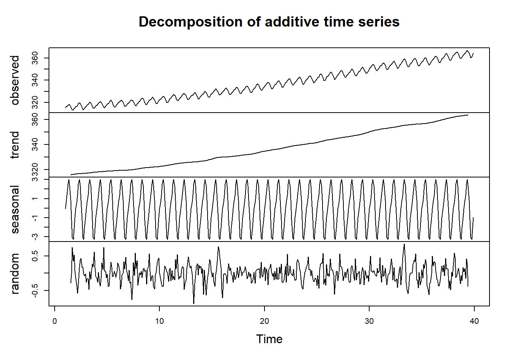](chapter33_files/figure-html/unnamed-chunk-72-1.png)

同様の関数に、`TSstudio`パッケージの`ts_decompose`関数があります。こちらは`decompose`関数で分離したものを`plotly`でグラフにしてくれる関数です。

``` downlit
ts_decompose(ts(co2, frequency = 12))
```

季節性・トレンドの成分をさらに詳しく評価したい場合には、facebook（Meta）の技術者が開発した[`prophet`](https://facebook.github.io/prophet/)パッケージを用いるとよいでしょう。`prophet`は[`rstan`](https://cran.r-project.org/web/packages/rstan/index.html)パッケージ([Stan Development Team 2023](#ref-rstan_bib))（もしくは[`cmdstanr`](https://github.com/stan-dev/cmdstanr)パッケージ([Gabry et al. 2023](#ref-cmdstanr_bib))）を用いて時系列を解析するアルゴリズムを使用しています。このアルゴリズムでは、下に説明する状態空間モデルとは少し異なるアプローチ（[論文](https://peerj.com/preprints/3190/#)に記載の通り、一般化加法モデル（[30章参照](chapter30.llms.md#加法モデルadditive-model)）で分析）を取っています。`prophet`を用いれば、季節性やトレンドの分離、予測、休日の影響やデータの欠測の処理などを比較的簡単に取り扱うことができます。

``` downlit
pacman::p_load(rstan, prophet)

df <- read.csv('https://raw.githubusercontent.com/facebook/prophet/main/examples/example_wp_log_peyton_manning.csv')

# 状態空間モデルの推定（rstanパッケージが必要）
m <- prophet(df) 

# 未来の365日分のデータフレームを作成
future <- make_future_dataframe(m, periods = 365) 
tail(future)

# predictで将来予測
forecast <- predict(m, future)
tail(forecast[c('ds', 'yhat', 'yhat_lower', 'yhat_upper')])

# 推定値をプロット
plot(m, forecast)

# 季節性、トレンドを分けて表示
prophet_plot_components(m, forecast)
```

## 33.15 状態空間モデル

**状態空間モデル（state space model）**は時系列データや地理空間データの統計に用いられる統計モデルの一つです。状態空間モデルでは、時系列データを以下の図のように、真の値の系列である**状態モデル**と、その真の値を我々が観測したときのばらつきを含む**観測モデル**からなるものであるとします。

[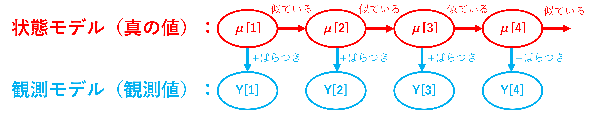](./image/state_space.png "状態空間モデルのイメージ")

状態空間モデルのイメージ

真の値を示す状態モデルでは、時点tの値は時点t-1の値によく似ているとする、AR(1)モデルに似たような構造を持つとします。

\\\mu\_{t}=f(\mu\_{t-1})+\epsilon\_{t}\\ \\\epsilon\_{t} \sim Normal(0, \sigma\_{\mu})\\

観測モデルは、状態モデルに観測時に起こるばらつきが含まれるものであるとします。

\\Y\_{t}=g(\mu\_{t})+\eta\_{t}\\ \\\eta\_{t} \sim Normal(0, \sigma\_{\eta})\\

我々が観測したデータ、つまり時系列データは、この観測モデルの左辺、Y_(t)となります。Y_(t)からμ_(t)を求めることで観測等のばらつきを取り除いた真の状態の変化を調べようとするのが状態空間モデルの概略です。

この状態空間モデルのいいところは、モデルをある程度自由に決められることです。状態モデルをAR(1)モデルっぽくしてもAR(2)モデルっぽくしても良いですし、切片項や係数を設定しても良いですし、季節性や説明変数の項を追加することもできます。ただし、`auto.arima`関数のように、「自動的にモデルを選択してくれる」ような手法ではないため、データをよく見て適したモデルを自分で選択する必要があります。また、上に説明したような分析手法よりはるかに計算が複雑で、計算に時間がかかります。

### 33.15.1 カルマンフィルタ

この状態空間モデルを用いた分析手法の一つが**カルマンフィルタ**です。カルマンフィルタは、GPSのような、時系列データに大きなノイズが乗っているようなデータを取り扱う時に、ノイズの成分を減らして真のシグナル（GPSなら真の位置や方角）を求めるために利用されています。カルマンフィルタは、ノイズを減らす**フィルタリング**、長期的な変動を滑らかな曲線として示すための**平滑化**、将来の変動を予測する**予測**の3つの目的で用いられます。フィルタリング・平滑化・予測ではそれぞれ以下のような変換を行います。

- フィルタリング：\\E(y\_{t}\|Y\_{t})\\ 今の値から今の値の代表値を推定
- 平滑化：\\E(y\_{t}\|Y\_{T})\\ 測定済みのすべての値から、ある時点の代表値を推定
- 予測：\\E(y\_{t}\|Y\_{t-1})\\ 今までの値から次の値を予測

E(y_(t))というのが変換後の値、Y_(t)はその時点での測定値、Y_(T)はその時点までのすべての測定値を指します。したがって、フィルタリング・平滑化・予測を図で示すと以下のようになります。

[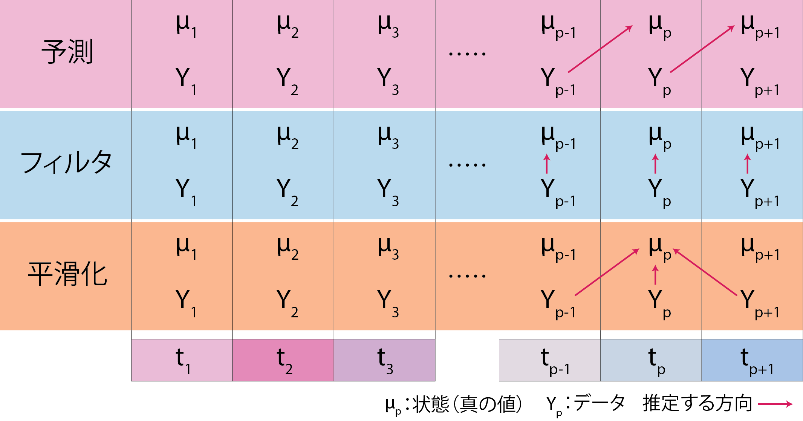](./image/karmanfilter.png "図2：カルマルフィルタのイメージ")

図2：カルマルフィルタのイメージ

Rでは、[`dlm`](https://cran.r-project.org/web/packages/dlm/index.html)パッケージ([Petris 2010](#ref-dlm_bib1); [Petris et al. 2009](#ref-dlm_bib2))や[`KFAS`](https://cran.r-project.org/web/packages/KFAS/index.html)パッケージ([Helske 2017](#ref-KFAS_bib))を用いることでカルマンフィルタの計算を行うことができます。以下に`dlm`パッケージでのカルマンフィルタの例を示します。

``` downlit
# ?dlm::dlmFilter（dlmFilterのヘルプ）に記載されている使用例
pacman::p_load(dlm)

nileBuild <- function(par){
dlmModPoly(1, dV = exp(par[1]), dW = exp(par[2]))
}

nileMLE <- dlmMLE(Nile, rep(0, 2), nileBuild)
nileMod <- nileBuild(nileMLE$par)

nileFilt <- dlmFilter(Nile, nileMod) # フィルタリング
nileSmooth <- dlmSmooth(nileFilt) # 平滑化
plot(cbind(Nile, nileFilt$m[-1], nileSmooth$s[-1]), plot.type = 's',
col = c("black", "red", "blue"), ylab = "Level", main = "Nile river", lwd = c(1, 2, 2))
```

[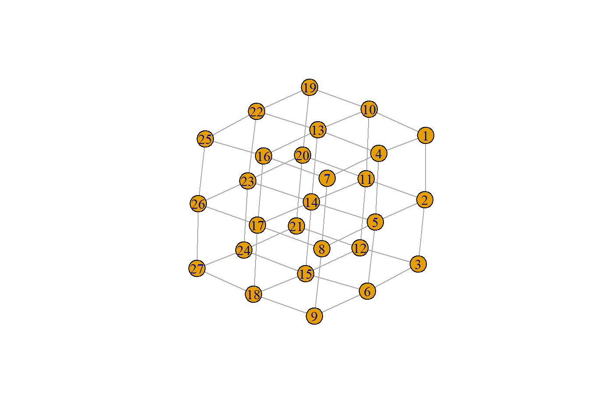](chapter33_files/figure-html/unnamed-chunk-75-1.png)

カルマンフィルタについては詳しい教科書がたくさんあるので（例えばRでは[この教科書など](https://www.amazon.co.jp/%E3%82%AB%E3%83%AB%E3%83%9E%E3%83%B3%E3%83%95%E3%82%A3%E3%83%AB%E3%82%BF-%E2%80%95R%E3%82%92%E4%BD%BF%E3%81%A3%E3%81%9F%E6%99%82%E7%B3%BB%E5%88%97%E4%BA%88%E6%B8%AC%E3%81%A8%E7%8A%B6%E6%85%8B%E7%A9%BA%E9%96%93%E3%83%A2%E3%83%87%E3%83%AB%E2%80%95-%E7%B5%B1%E8%A8%88%E5%AD%A6One-Point-2/dp/4320112539/ref=sr_1_4?crid=233OUDUP4SFDE&dib=eyJ2IjoiMSJ9.7-FBe3-RRCTGU8ggjWIe4tvBgUWVWh18GMV2Kl_vI7aYbSmT9ej3GDICdlLMVNb4zvIyc3KzQtSbCb0ZgDIJdak8cG-Pg_OeVY9ma6W_C18ZW2YGZKoSpspId8PqPG1EDkEod9rNwwiStNAKL6WS9vmmXobUFa-YIV-aY97KD_8wHHmS7HMiZGtK0KNqL2MA6JiGwemrlKYX8p3GEF5QeQxLuwowak1BFYzf-jPfm3mpx7ctone_Bn_r47mduTlz9OiLCXHtuFEp1cvrYZ_cMdESsAGAC324M3rRSpHxhA1ZgH5n0-URMBH8iwHQSmLZCZ-zU9cl6_OJKamTHjdhTLVk9Kf2EMNicw9jet-kD1FVZbC7XqDwiJWO_La8iZey0ofUzli1sxNbgQH1liWIiD_8Md78wk0H_FpM7C36N2gs0JUHc0LEOxjpRzaJP8_Y.dln_u6oLODP_bFkzqLIBrFfc_FQuosGBZh3v8_jvOvc&dib_tag=se&keywords=%E3%82%AB%E3%83%AB%E3%83%9E%E3%83%B3%E3%83%95%E3%82%A3%E3%83%AB%E3%82%BF&qid=1742085164&sprefix=%E3%82%AB%E3%83%AB%E3%83%9E%E3%83%B3%2Caps%2C181&sr=8-4) ([野村 2016](#ref-%E9%87%8E%E6%9D%91%E4%BF%8A%E4%B8%802016-09-08))）、詳しく学びたい方は教科書を一読されることをおススメいたします。

### 33.15.2 Stan

もっと複雑で自由度の高い状態空間モデルを用いる場合には、[Stan](https://mc-stan.org/)という統計モデリングの言語を用いることになります。Rでは上記の`prophet`の部分で少し紹介した`rstan`または`cmdstanr`パッケージを用いて、Stan言語の統計モデルを書き、計算することになります。Stanについては入門として紹介するには複雑すぎるためココには記載しませんが、興味のある方は[Stanについてのホームページ](https://statmodeling.hatenablog.com/archive)や[RとStanで始める ベイズ統計モデリングによるデータ分析入門](https://www.amazon.co.jp/dp/B07WFD5RFS/)([馬場真哉 2019](#ref-%E9%A6%AC%E5%A0%B4%E7%9C%9F%E5%93%892019-07-10))、[StanとRでベイズ統計モデリング](https://www.kyoritsu-pub.co.jp/book/b10003786.html)([松浦 and 石田 2016](#ref-%E6%9D%BE%E6%B5%A6%E5%81%A5%E5%A4%AA%E9%83%8E2016-10-25))を読むことをおすすめします。

Gabry, Jonah, Rok Cesnovar, and Andrew Johnson. 2023. *Cmdstanr: R Interface to ’CmdStan’*. <https://mc-stan.org/cmdstanr/>.

Helske, Jouni. 2017. “KFAS: Exponential Family State Space Models in R.” *Journal of Statistical Software* 78 (10): 1–39. <https://doi.org/10.18637/jss.v078.i10>.

Krispin, Rami. 2023. *TSstudio: Functions for Time Series Analysis and Forecasting*. <https://CRAN.R-project.org/package=TSstudio>.

Lupi, Claudio. 2009. “Unit Root CADF Testing with R.” *Journal of Statistical Software* 32 (2): 20.

Petris, Giovanni. 2010. “An R Package for Dynamic Linear Models.” *Journal of Statistical Software* 36 (12): 1–16. <https://www.jstatsoft.org/v36/i12/>.

Petris, Giovanni, Sonia Petrone, and Patrizia Campagnoli. 2009. *Dynamic Linear Models with r*. useR! Springer-Verlag, New York.

Pfaff, B. 2008. *Analysis of Integrated and Cointegrated Time Series with r*. Second. Springer. <https://www.pfaffikus.de>.

Pfaff, Bernhard. 2008. “VAR, SVAR and SVEC Models: Implementation Within R Package vars.” *Journal of Statistical Software* 27 (4). <https://www.jstatsoft.org/v27/i04/>.

Stan Development Team. 2023. *RStan: The R Interface to Stan*. <https://mc-stan.org/>.

Trapletti, Adrian, and Kurt Hornik. 2023. *Tseries: Time Series Analysis and Computational Finance*. <https://CRAN.R-project.org/package=tseries>.

Wuertz, Diethelm, Yohan Chalabi, Tobias Setz, Martin Maechler, and Georgi N. Boshnakov. 2023. *fGarch: Rmetrics - Autoregressive Conditional Heteroskedastic Modelling*. <https://CRAN.R-project.org/package=fGarch>.

Zeileis, Achim, and Gabor Grothendieck. 2005. “Zoo: S3 Infrastructure for Regular and Irregular Time Series.” *Journal of Statistical Software* 14 (6): 1–27. <https://doi.org/10.18637/jss.v014.i06>.

松浦健太郎, and 石田基広. 2016. *StanとRでベイズ統計モデリング (Wonderful r 2)*. 単行本. Edited by 市川太祐, 高橋康介, 高柳慎一, and 福島真太朗. 共立出版. <https://www.amazon.co.jp/dp/4320112423/>.

野村俊一. 2016. *カルマンフィルタ ーrを使った時系列予測と状態空間モデルー (統計学One Point 2)*. 単行本. 共立出版. <https://lead.to/amazon/jp/?op=bt&la=ja&key=4320112539>.

馬場真哉. 2018. *時系列分析と状態空間モデルの基礎: RとStanで学ぶ理論と実装*. 単行本. プレアデス出版. <https://www.amazon.co.jp/dp/4903814874/>.

馬場真哉. 2019. *実践Ｄａｔａ　Ｓｃｉｅｎｃｅシリーズ　ＲとＳｔａｎではじめる　ベイズ統計モデリングによるデータ分析入門 (Ｋｓ情報科学専門書)*. Kindle版. 講談社. <https://www.amazon.co.jp/dp/B07WFD5RFS/>.

Back to top
