# 34  生存時間解析

Code

**生存時間解析**とは、ある集団について、**イベントが起きた回数とイベントが起きた時間**について解析する手法のことです。生存時間解析は、部品の故障や、医薬品の効果などの分析に用いられています。

生存時間解析におけるイベントとは、部品における故障や、医薬品における治療の成功・失敗（特に失敗）を指します。

例えば、同じ大きな力をかけた100個のボルトがあった時に、時間とともにボルトが破断していく様子を測定すると、ある経過時間では5個、さらに時間が経つと合計10個という風に、破断していく数（イベント）が時間と共に増えていきます。

医薬品の例では、がん患者100名に抗がん剤を処方した時に、投与後1ヶ月では5名が亡くなり、更に1ヶ月経つと合計10名が亡くなるというふうに、死亡していく数（イベント）が時間と共に増えていきます。このような、イベントと時間の関係を取り扱うのが生存時間解析です。

生存時間解析では、ある瞬間にイベントが起こる確率である**ハザード（hazard）**、その時間までにイベントが起こる確率である**累積ハザード（cumulative hazard）**、その集団でイベントが起こらなかったものの割合である**生存時間（survival time）**の3つを主に取り扱います。

## 34.1 ハザードと累積ハザード

**ハザード**とは、ある時間にイベントが起きる確率を指します。ある時間tにおけるハザードは以下の式で表されるものです。

\\h(t)=\lim\_{\delta \to 0} \frac{P(t \< T \< t + \delta \| T \> t)}{\delta}\\

この式で、h(t)はある時間tにおけるハザード、δは微小な時間、P(t\<T\<t+δ\|T\>t)はある微小時間t～t+δにイベントが起きる確率です。このハザードを積分したものが**累積ハザード**と呼ばれます。

\\H(t)=\int^{t}\_{0} h(t)dt\\

H(t)は累積ハザードで、累積ハザードはハザードh(t)を時間0からtまで積分したものとなります。H(t)はその時間までにイベントが起きる確率を示すものとなります。

## 34.2 生存時間

**生存時間**とは、ある集団のうち、イベントが起きなかった集団の割合のことです。生存時間は累積ハザードを用いて、以下の式で表されます。

\\S(t)=\exp(-H(t))\\

ですので、ハザードを積分し、マイナスの符号を付けて指数変換したものが生存時間です。生存時間解析で取り扱うものは、ほぼすべてこのハザード、累積ハザード、生存時間の3つに関わっています。

## 34.3 確率分布と生存時間

生存時間を取り扱うときに、生存時間をうまく表現できる分布がある方が便利です。生存時間は**指数分布**で取り扱うことができるとされています。

指数分布は以下の式で表される分布です。

\\Exp(x, \lambda)=\lambda \cdot \exp(-\lambda x)\\

指数分布に関しては[28章](chapter28.llms.md#指数分布)でごく簡単に取り扱っています。指数分布は平均値1/λ、標準偏差も1/λとなる分布です。ただし、この指数分布では、**ハザードが時間に対して一定**である場合のみ生存時間をうまく表現することができます。

ハザードが一定とならない場合には、生存時間は**ワイブル分布**や**ガンマ分布**で表現されます。ワイブル分布やガンマ分布を用いると、ハザードが単調増加したり、単調減少したりするような現象を表現することができます。

> **TIP:**
>
> 分布を用いたハザードの表現では、ハザード一定か、単調増加・単調減少する現象を説明することができます。一方で、実際のハザードは必ずしも一定や単調増加になるわけではありません。例えば、日本人の寿命と死亡率からハザードを求めたものが[e-stat](https://www.e-stat.go.jp/stat-search/files?page=1&layout=datalist&toukei=00450012&bunya_l=02&tstat=000001031336&cycle=7&tclass1=000001060864&tclass2=000001163166&tclass3val=0)で公開されています（出典：「政府統計の総合窓口(e-Stat)」、調査項目を調べる－厚生労働省 人口動態・保健社会統計室 基幹統計「生命表」）。ハザードを図示すると、0歳児のハザードが80歳半ばの人と同じぐらいの値となっており、全体としては両側が高く、真ん中が極端に低いような推移を示し、一定でも単調変化でもない変化を取ります。
>
> [](chapter34_files/figure-html/unnamed-chunk-1-1.png)

ここで、f(t)を分布関数、F(t)を累積分布関数とすると、F(t)はf(t)の積分ですので、f(t)とF(t)の関係は以下の式で表されます。

\\F(t)=\int\_{0}^{t}f(t)dt\\

要は、F(t)を微分するとf(t)に、f(t)を積分するとF(t)となるわけです。時間tはマイナスの値を取らないため、積分の下限は0です。F(t)は時間tまでにイベントが起きる割合として、以下の式で表されます。

\\F(t)=P(T \< t)\\

生存時間S(t)は時間tまでにイベントが起こらない割合となりますので、全体の割合1からイベントが起きる割合F(t)を引いた値となります。

\\S(t)=1-F(t)\\

ですので、f(t)は生存時間S(t)を微分した値にマイナスを付けたものとなります。

\\f(t)=\frac{d}{dt}F(t)dt=\frac{d}{dt}(1-S(t))dt=-\frac{d}{dt}S(t)dt\\

また、ハザードh(t)と分布f(t)、生存時間S(t)の関係は以下の式で表されます。

\\h(t)= \frac{f(t)}{S(t)}\\

以上のように、確率分布f(t)、累積確率分布F(t)、生存時間S(t)、ハザードh(t)は互いに関連しており、生存時間S(t)が分かればハザードや確率分布が分かりますし、確率分布から生存時間やハザードを決めることもできます。

## 34.4 確率分布と生存時間のシミュレーション

Rでは、乱数を用いることで比較的簡単に生存時間をシミュレートすることができます。

``` downlit
rexp(10, rate=0.01) |> round()
##  [1]  18  15  14  44 289 123  54  96  15 139
```

以下に、指数分布、ワイブル分布、ガンマ分布を仮定した場合の生存時間、ハザードの形状を示します。f(t)には、この他に対数正規分布や対数ロジスティック分布などを仮定する場合もあるようです([武冨 and 山本 2023](#ref-%E6%AD%A6%E5%86%A8%E5%A5%88%E8%8F%9C%E7%BE%8E2023))。

> **TIP:**
>
> 以下のコードを実行することで生存時間と分布のシミュレーションを実行することができます。
>
> ``` downlit
> if(!require(shiny)){install.packages("shiny")};runGitHub("surv_sim", "sb8001at-oss")
> ```

## 指数分布

確率分布の式

\\Exp(x, \lambda)=\lambda \cdot \exp(-\lambda x)\\

``` downlit
rexp(10, rate = 0.01) |> round() 
##  [1]  76 124 442 105 104 188  65  34  59 236
```

[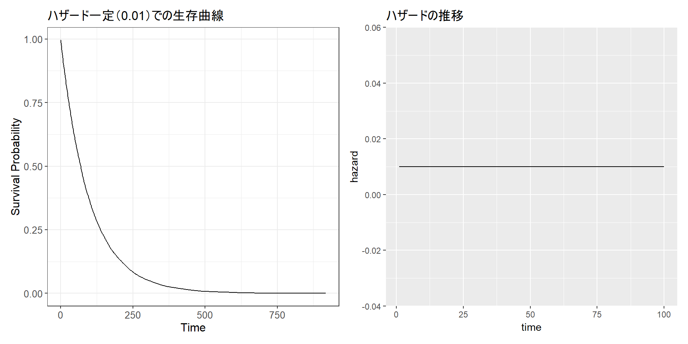](chapter34_files/figure-html/unnamed-chunk-5-1.png)

## ワイブル分布

確率分布の式

\\Weibull(x, \lambda, k)=\frac{k}{\lambda}(\frac{x}{\lambda})^{k-1} \cdot \exp(-\frac{x}{\lambda})^k\\

``` downlit
rweibull(10, shape = 0.8, scale = 100) |> round()
##  [1]   8  94  32   8  17  27 434  74 169  17
```

[](chapter34_files/figure-html/unnamed-chunk-7-1.png)

## ガンマ分布

確率分布の式

\\Gamma(x, \gamma, \beta)=\frac{(\frac{x}{\beta})^{\gamma-1} \cdot \exp(-\frac{x}{\beta})}{\beta \cdot \Gamma(\gamma)}\\

``` downlit
rgamma(10, shape = 0.8, scale = 100) |> round()
##  [1]  11 157 104  68  10  27 234 121  20  65
```

[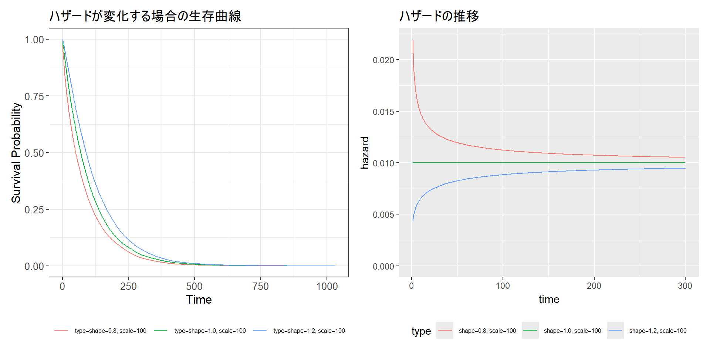](chapter34_files/figure-html/unnamed-chunk-9-1.png)

## 34.5 survivalパッケージ

Rでの生存時間解析は、主に[`survival`](https://cran.r-project.org/web/packages/survival/index.html)パッケージ ([Therneau 2023](#ref-survival-package); [Terry M. Therneau and Patricia M. Grambsch 2000](#ref-survival-book))を用いて行います。

``` downlit
pacman::p_load(survival)
```

### 34.5.1 生存時間解析のデータ

`survival`パッケージには、生存時間解析に用いることができる数多くのデータセットが登録されています。`survival`に含まれているデータセットは生物的（あるいは医学的）なものと工学的な故障に関するもので、以降に紹介する概念や手法を理解するのに便利なものがそろっています。以下にデータセットの一覧を示します。

| データセット | データの内容 |
|:---|:---|
| aml | 急性骨髄性白血病患者のデータ |
| bladder | 膀胱がんの再発に関するデータ（85名分） |
| bladder1 | 膀胱がんの再発に関するデータ（118名分） |
| bladder2 | 膀胱がんの再発に関するデータ（左側打ち切りあり） |
| cancer | NCCTG（臨床研究グループ）の肺がん患者のデータ |
| capacitor | ガラスのコンデンサの寿命に関するデータ |
| cgd | 慢性肉芽腫に対するγインターフェロンの効果に関するプラセボ対照研究 |
| colon | 結腸がんに対する化学療法に関するデータ |
| cracks | タービンに生じたクラックに関するデータ |
| diabetic | 糖尿病網膜症のレーザー治療に関するデータ |
| flchain | 血清免疫グロブリン遊離軽鎖と死亡率に関するデータ |
| gbsg | ドイツで実施された乳がん患者に関する調査のデータ |
| genfan | ディーゼルエンジンのファンに生じた故障のデータ |
| heart | スタンフォードで実施された心臓移植のデータ |
| hoel | オスマウスにガンが生じるまでの日数のデータ |
| ifluid | 絶縁流体の電気的な破損に関するデータ |
| imotor | モーターの絶縁破壊と温度の関係に関するデータ |
| kidney | 透析患者にカテーテルを挿入し、感染が起こるまでの時間 |
| logan | 職業カテゴリの移動に関するデータ |
| mgus | 免疫グロブリン異常症患者のデータ |
| myeloid | 急性骨髄性白血病のシミュレーションデータ |
| myeloma | 多発性骨髄腫患者のデータ |
| nafld1 | 非アルコール性脂肪肝疾患（NAFLD）のデータ |
| nwtco | 腫瘍の組織学的判定と生存率の関係のデータ |
| ovarian | 卵巣ガンに対し2治療を行ったランダム化比較試験のデータ |
| pbc | 原発性硬化性胆管炎に関するランダム化比較試験の結果 |
| rats | ラットでの発がんを評価したデータ |
| rats2 | ラットに発がん性物質を注射し、治療処理したデータ |
| rhDNase | 嚢胞性線維症へのrhDNaseの効果を評価したデータ |
| rotterdam | ロッテルダム腫瘍バンクに登録されている原発性乳がん患者のデータ |
| solder | 電子部品を基板につける際のはんだ付けの不良のデータ |
| survexp.us | 1940～2012年のアメリカの年齢と性別のデータ |
| tobin | トービット・モデルの論文で用いられたデータ |
| transplant | 肝移植を待つ患者のデータ |
| turbine | タービンのホイールに生じたクラックに関するデータ |
| udca | 原発性胆汁性肝硬変に対するウルソデオキシコール酸投与試験のデータ |
| valveSeat | ディーゼルエンジンのバルブシートの交換時期に関するデータ |
| veteran | 退官軍人の肺がんのデータ |

## 34.6 打ち切り

**打ち切り（censoring）**とは、イベントとは別の理由で治験に参加している患者や耐久性を検査しているボルトの試験が中止してしまうような場合を指します。

治験であれば、副作用によって治験に参加し続けるのをあきらめる場合や、対象となるイベント（ガンの治験であれば死亡など）以外の理由（例えば交通事故など）で患者が亡くなるのが典型的な打ち切りです。ボルトの耐久性試験でも、破断の前にボルトが緩んで抜けてしまったり、繋ぎとめている部材が先に破断してしまうような場合には、打ち切りとして取り扱うことになります。特に治験では打ち切りはほぼ必ず起こります。

[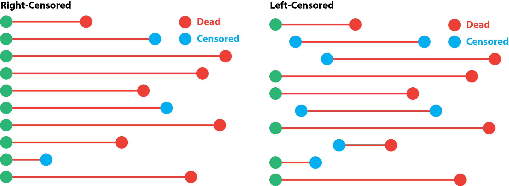](./image/censored.png "図1：打ち切り（censoring）")

図1：打ち切り（censoring）

### 34.6.1 Surv関数

Rでのデータセットを見ると、特にガン関連のデータセットではほぼ必ず打ち切りに関する列が登録されています。以下は`cancer`データセットの始めの6行です。各行はそれぞれ一人の患者のデータであり、`time`が観察期間、`status`が打ち切り（`status=1`）または死亡（`status=2`）です。この`status`が打ち切りを表すラベルとなります。

``` downlit
cancer |> head()
##   inst time status age sex ph.ecog ph.karno pat.karno meal.cal wt.loss
## 1    3  306      2  74   1       1       90       100     1175      NA
## 2    3  455      2  68   1       0       90        90     1225      15
## 3    3 1010      1  56   1       0       90        90       NA      15
## 4    5  210      2  57   1       1       90        60     1150      11
## 5    1  883      2  60   1       0      100        90       NA       0
## 6   12 1022      1  74   1       1       50        80      513       0
```

Rで打ち切りを取り扱う場合には、まず`Surv`関数を用いて時間と打ち切りデータを`Surv`クラスのオブジェクトに変換する必要があります。`Surv`関数は時間（上の例の`time`）と打ち切りのデータ（上の例の`status`）を引数にする関数で、返り値では打ち切りのデータに`+`が付くことになります。`survival`パッケージでは、この`+`が付いたデータを打ち切りとして、解析で取り扱います。打ち切りデータは、打ち切り/死亡をそれぞれ`0`/`1`、`FALSE`/`TRUE`、`1`/`2`のいずれかで取り扱うことになります。

``` downlit
# 生存時間と打ち切りデータを引数にする
Surv(cancer$time, cancer$status) |> 
  head(20)
##  [1]  306   455  1010+  210   883  1022+  310   361   218   166   170   654 
## [13]  728    71   567   144   613   707    61    88
```

### 34.6.2 左側打ち切りのデータ

打ち切りは通常開始後に起こるのですが、開始時に打ち切りが起こることもあります。時間の軸が左から右に進むと考えて、通常の打ち切りのことを**右側打ち切り（right-censoring）**、開始時の打ち切りを**左側打ち切り（left-censoring）**と呼びます。

左側打ち切りは、例えば病気の進行を調べる際に、診断から時間が空いてから投薬や観察を始める場合などがあります。この場合、診断から観察開始までに亡くなる方は観察できないため、左側打ち切りとして取り扱う必要が生じます。

`Surv`関数で左側打ち切りを取り扱う場合には、`Surv`関数は3つ引数を取ることになります。第一引数に観察開始時間、第二引数に観察終了時間、第三引数は打ち切りデータとなります。左側打ち切りのあるデータの場合、`Surv`関数の返り値は開始時間、終了時間と打ち切りを示す`+`の3つで示される形となります。

``` downlit
# startが組み入れ時間、stopが死亡または打ち切り時間、
# eventが打ち切り（0が打ち切り例）
head(survival::heart)
##   start stop event        age      year surgery transplant id
## 1     0   50     1 -17.155373 0.1232033       0          0  1
## 2     0    6     1   3.835729 0.2546201       0          0  2
## 3     0    1     0   6.297057 0.2655715       0          0  3
## 4     1   16     1   6.297057 0.2655715       0          1  3
## 5     0   36     0  -7.737166 0.4900753       0          0  4
## 6    36   39     1  -7.737166 0.4900753       0          1  4

Surv(heart$start, heart$stop, heart$event) |> head(10)
##  [1] ( 0, 50]  ( 0,  6]  ( 0,  1+] ( 1, 16]  ( 0, 36+] (36, 39]  ( 0, 18] 
##  [8] ( 0,  3]  ( 0, 51+] (51,675]
```

## 34.7 カプランマイヤー曲線

生存時間分析で用いられる統計手法のうち、最もよく用いられているものは、**カプランマイヤー曲線（Kaplan-Meier）**、**ログランク検定（log-rank test）**、**Cox回帰**の3つです。このうち、**カプランマイヤー曲線**は一般的に生存時間曲線として、治験や耐久性試験の結果で示されています。

カプランマイヤー曲線は上記の生存時間S(t)をデータから計算する方法です。q_(t)をその時間tにイベントが起きた割合としたとき、カプランマイヤー曲線は以下の式で表されます。要は、イベントが起きる度に、その時間における生存者の割合を計算し、その時点までの生存者の割合をすべて掛け算することで、生存時間を計算します。

\\S(t)=\prod\_{i=1}^{t}1-q\_{t}\\

この表現では分かりにくいため、例を挙げて説明します。以下のようなデータがあり、イベントは`day`に起こり、打ち切りが起こった場合には`censored=0`であるとします。

| subject | day | censored |
|--------:|----:|---------:|
|       1 |   1 |        1 |
|       2 |   1 |        1 |
|       3 |   2 |        1 |
|       4 |   2 |        0 |
|       5 |   3 |        1 |
|       6 |   3 |        1 |
|       7 |   4 |        1 |
|       8 |   4 |        1 |

打ち切りを考慮した場合・しない場合のそれぞれについて、以下の表のようにカプランマイヤーの計算を行います。生存時間は、その時間までの生存割合の積となっています。

打ち切りありとなしで異なるのは、day2、つまり打ち切りがある場合には、打ち切りされた例は生存していると換算して計算し、day3ではリスク集団（その時点の事前まで生存しており、イベントが起きる可能性がある集団）が打ち切り+死亡により2人減って4名になる、という変化を取ることです。下に示した通り、表の計算式で計算した左のカプランマイヤー曲線は、右の`survival`パッケージで計算した結果と一致します。

## 打ち切りを考慮しない場合

| day | リスク集団 | 生存者数 | 時点の生存割合 | カプランマイヤーの計算式 | 生存時間 |
|----:|-----------:|---------:|---------------:|-------------------------:|---------:|
|   0 |          8 |        8 |            8/8 |                      8/8 |     1.00 |
|   1 |          8 |        6 |            6/8 |                  8/8×6/8 |     0.75 |
|   2 |          6 |        4 |            4/6 |              8/8×6/8×4/6 |     0.50 |
|   3 |          4 |        2 |            2/4 |          8/8×6/8×4/6×2/4 |     0.25 |
|   4 |          2 |        0 |            0/2 |      8/8×6/8×4/6×2/4×0/2 |     0.00 |

[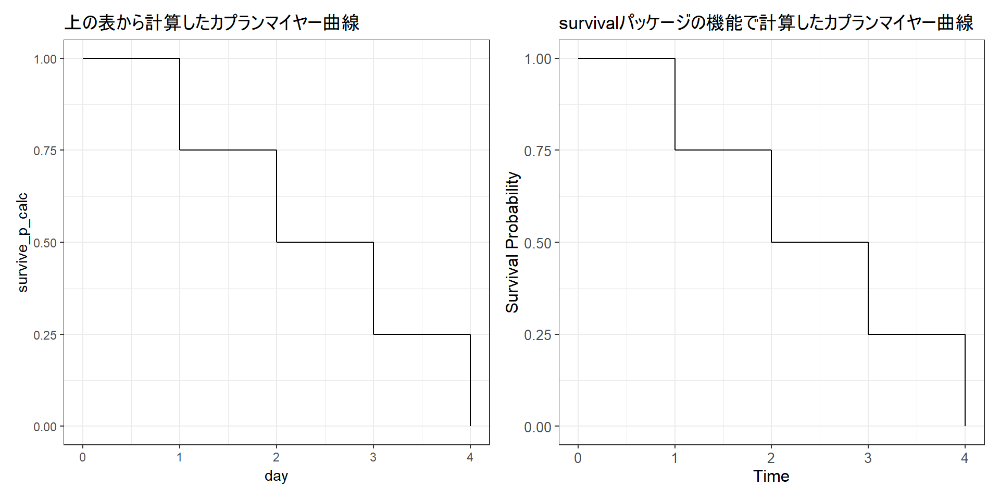](chapter34_files/figure-html/unnamed-chunk-17-1.png)

## 打ち切りを考慮した場合

| day | リスク集団 | 生存者数 | 時点の生存割合 | カプランマイヤーの計算式 | 生存時間 |
|----:|-----------:|---------:|---------------:|-------------------------:|---------:|
|   0 |          8 |        8 |            8/8 |                      8/8 |   1.0000 |
|   1 |          8 |        6 |            6/8 |                  8/8×6/8 |   0.7500 |
|   2 |          6 |        5 |            5/6 |              8/8×6/8×5/6 |   0.6250 |
|   3 |          4 |        2 |            2/4 |          8/8×6/8×5/6×2/4 |   0.3125 |
|   4 |          2 |        0 |            0/2 |      8/8×6/8×5/6×2/4×0/2 |   0.0000 |

[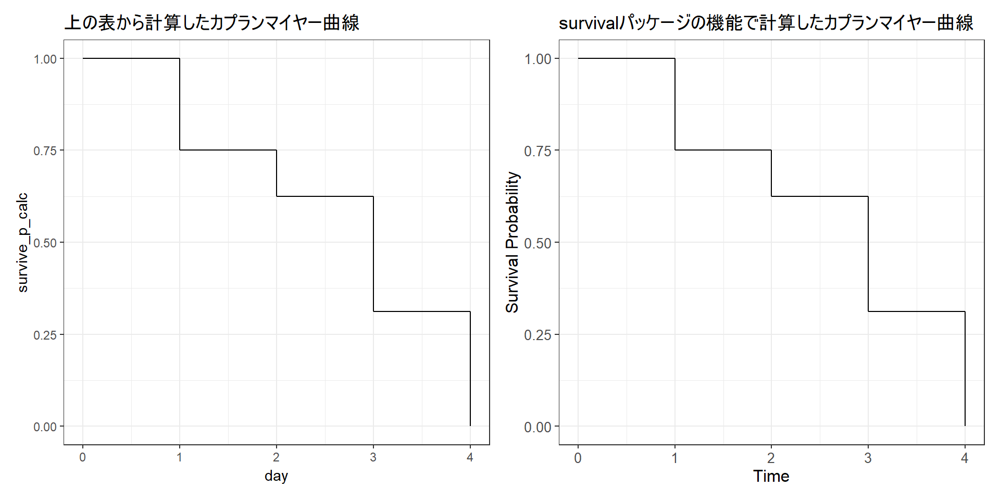](chapter34_files/figure-html/unnamed-chunk-19-1.png)

### 34.7.1 survfit関数

このように、カプランマイヤー曲線は打ち切りを考慮したリスク集団と生存者数が分かれば計算できます。Rでは、この計算を`survfit`関数で行うことができます。

`survfit`関数は`formula`を引数に取りますが、この`formula`の左辺は上で紹介した`Surv`関数の返り値となります。通常はこの左辺に直接`Surv`関数を書き込んで用います。生存時間に対する説明変数がない場合には、`formula`の右辺は`1`とします。`data`引数にデータフレームを指定するのは線形回帰の`lm`関数と同じです。

`survfit`関数の返り値として、カプランマイヤー曲線で示されているリスク集団の数（`n`）、イベントの起こった回数（`events`）、生存割合が50％となる日数（`median`）、生存割合が50％となる日数の95％信頼区間（`0.95 LCL`、`0.95 UCL`）が表示されます。

``` downlit
result_km <- survfit(Surv(time, status) ~ 1, data = cancer)

result_km
## Call: survfit(formula = Surv(time, status) ~ 1, data = cancer)
## 
##        n events median 0.95LCL 0.95UCL
## [1,] 228    165    310     285     363
```

また、`survfit`関数の返り値を`plot`関数の引数とすると、カプランマイヤー曲線がグラフとして表示されます。点線は生存時間の95％信頼区間を示します。

``` downlit
plot(result_km)
```

[](chapter34_files/figure-html/unnamed-chunk-21-1.png)

### 34.7.2 ggsurvfitパッケージ

[`survminer`](https://rpkgs.datanovia.com/survminer/index.html)パッケージ([Kassambara et al. 2021](#ref-survminer_bib))と[`ggsurvfit`](https://www.danieldsjoberg.com/ggsurvfit/)パッケージ ([Sjoberg et al. 2023](#ref-ggsurvfit_bib))はいずれもカプランマイヤー曲線を表示する`ggplot2`のExtensionです。前者の方が機能が多く、後者はカプランマイヤー曲線の描画に特化したパッケージです。カプランマイヤー曲線をグラフにするためだけであれば後者の`ggsurvfit`を用いるとよいでしょう。

`ggsurvfit`パッケージの`ggsurvfit`関数は、`survfit`関数の返り値を引数に取り、`ggplot2`でグラフを描画する関数です。

``` downlit
pacman::p_load(ggsurvfit)
result_km |> ggsurvfit()
```

[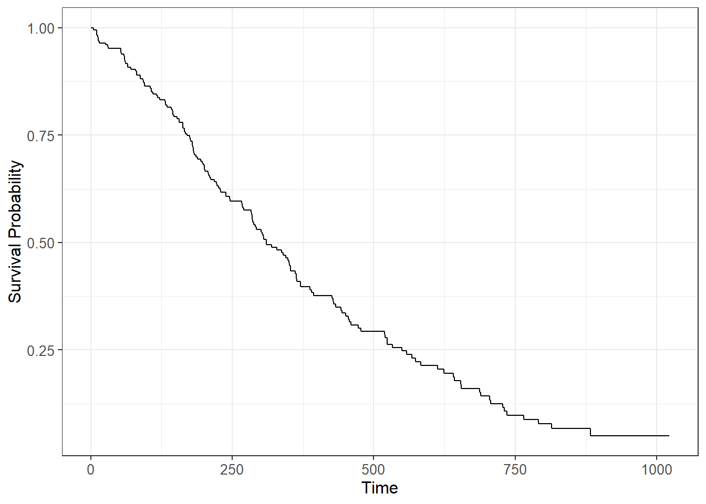](chapter34_files/figure-html/unnamed-chunk-22-1.png)

`ggplot2`のように、`+`で関数を繋ぐと表示する内容を変更することができます。`add_confidence_interval`を用いれば信頼区間、`add_risktable`を用いればリスクテーブル（リスク集団とイベント数の表）、`add_censor_mark`を用いれば打ち切りが起きた点を表示してくれます。

``` downlit
pacman::p_load(ggsurvfit)
result_km |> 
  ggsurvfit() +
  add_confidence_interval() + # 信頼区間の表示
  add_risktable() + # リスクテーブル（下の表）の表示
  add_censor_mark() # 打ち切り点（グラフ上のプラス）の表示
```

[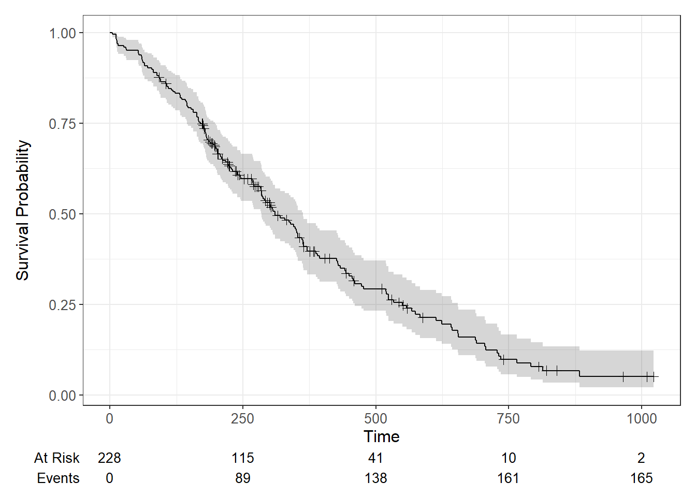](chapter34_files/figure-html/unnamed-chunk-23-1.png)

### 34.7.3 説明変数がある場合のカプランマイヤー曲線

`survfit`関数を始めとした`survival`パッケージの関数では、`formula`の右辺に説明変数を追加することで、説明変数による生存時間への影響を解析できるようになっています。`survfit`関数では、説明変数で分けて評価した場合のカプランマイヤー曲線の計算が行われます。

``` downlit
result_km2 <- survfit(Surv(time, status) ~ sex, data = cancer)
result_km2
## Call: survfit(formula = Surv(time, status) ~ sex, data = cancer)
## 
##         n events median 0.95LCL 0.95UCL
## sex=1 138    112    270     212     310
## sex=2  90     53    426     348     550
```

``` downlit
result_km2 |> 
  ggsurvfit() +
  add_confidence_interval() 
```

[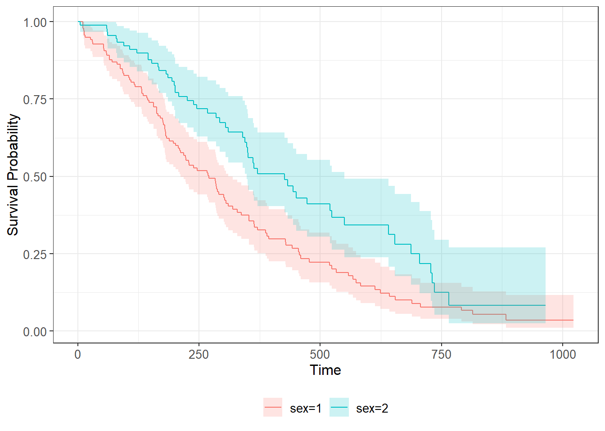](chapter34_files/figure-html/unnamed-chunk-25-1.png)

## 34.8 log-rank検定

**log-rank検定**は生存時間が説明変数によって異なるかどうかを検定する、ノンパラメトリックな検定手法です。治験の生存時間解析において、p値の計算は主にこのlog-rank検定を用いて行われています。

Rでは、`survdiff`関数を用いてlog-rank検定の計算を行うことができます。`survdiff`関数は`survfit`関数と同様に、左辺に`Surv`関数の返り値、右辺に説明変数を取る`formula`を引数に取ります。`data`引数にデータフレームを設定できるのも`survfit`関数と同様です。

``` downlit
survdiff(Surv(time, status) ~ sex, data = cancer)
## Call:
## survdiff(formula = Surv(time, status) ~ sex, data = cancer)
## 
##         N Observed Expected (O-E)^2/E (O-E)^2/V
## sex=1 138      112     91.6      4.55      10.3
## sex=2  90       53     73.4      5.68      10.3
## 
##  Chisq= 10.3  on 1 degrees of freedom, p= 0.001
```

### 34.8.1 survfit2関数でlog-rank検定

`ggsurvfit`パッケージには、`survfit2`関数という、`survfit`と似た関数が設定されています。この`survfit2`関数は`survfit`と`survdiff`を同時に行うような関数となっており、計算結果にlog-rank検定のp値を含んでいます。この`survfit2`関数の返り値を用いると、`ggsurvfit`関数によるカプランマイヤー曲線の表示に`add_pvalue`関数でlog-rank検定のp値を付け加えることができます。

``` downlit
# log-rankのp値を含める場合は、survfit2が必要（survfit2はggsurvfitの関数）
result_km2 <- survfit2(Surv(time, status) ~ sex, data = cancer)

result_km2 |> survfit2_p() # log-rankのp値を表示
## [1] "p=0.001"

# survfit関数と同じようにplotでカプランマイヤーを表示できる
result_km2 |> plot() 
```

[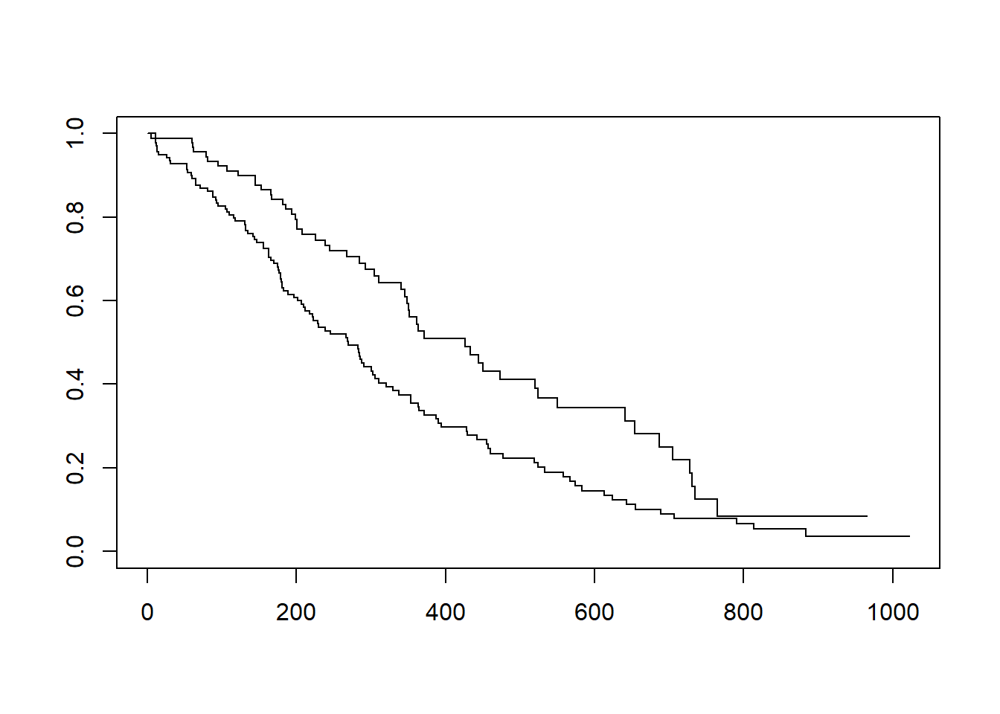](chapter34_files/figure-html/unnamed-chunk-27-1.png)

``` downlit

result_km2 |> 
  ggsurvfit() +
  add_confidence_interval() +
  add_pvalue() # p値を表記
```

[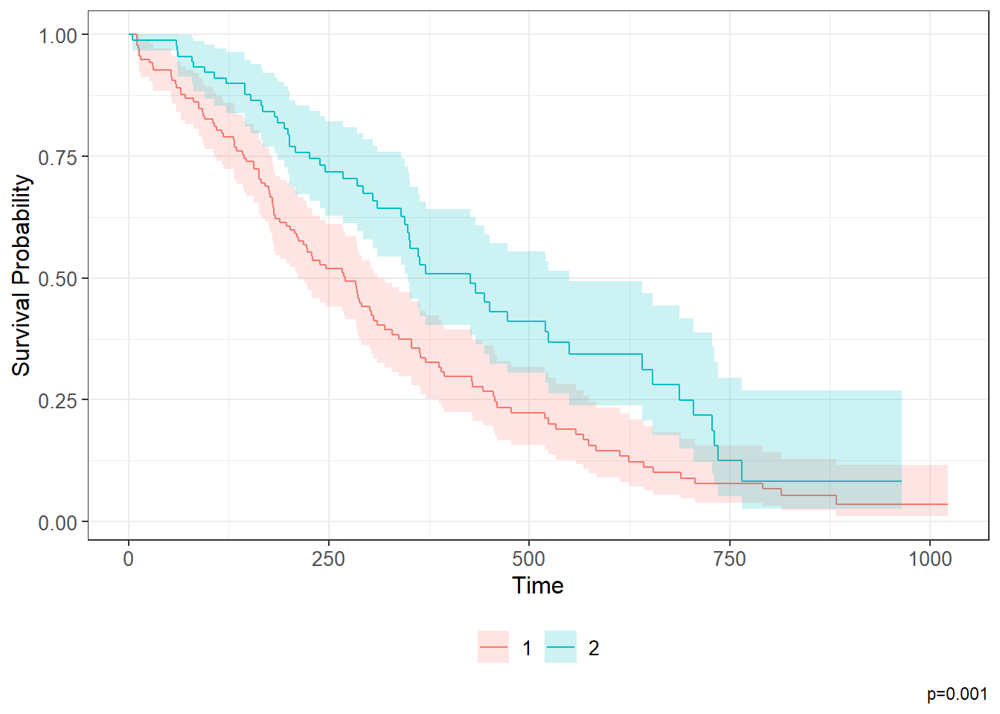](chapter34_files/figure-html/unnamed-chunk-27-2.png)

### 34.8.2 一般化Wilcoxon検定

生存時間の検定のうち、初期の生存率の差に重みをつけて評価する手法が一般化Wilcoxon検定（Gehan-Wilcoxon test）です。Rでの一般化Wilcoxon検定の計算にはlog-rank検定と同様に`survdiff`関数を用います。一般化Wilcoxon検定の場合にも、`survdiff`関数の引数はほぼlog-rank検定と同じですが、引数に`rho=1`を指定する部分が異なります。`rho`のデフォルト値は0で、`rho=0`の時にはlog-rank検定となります。

``` downlit
survdiff(Surv(time, status) ~ sex, data = cancer, rho=1) 
## Call:
## survdiff(formula = Surv(time, status) ~ sex, data = cancer, rho = 1)
## 
##         N Observed Expected (O-E)^2/E (O-E)^2/V
## sex=1 138     70.4     55.6      3.95      12.7
## sex=2  90     28.7     43.5      5.04      12.7
## 
##  Chisq= 12.7  on 1 degrees of freedom, p= 4e-04
```

log-rankと一般化Wilcoxonを比較すると、log-rank検定ではより後期の生存時間の差が大きいと有意になりやすく、一般化Wilcoxon検定ではより初期の生存時間の差が大きいと有意になりやすい特徴があります。

以下の例では、後期の生存時間に差がある場合を示しています。log-rankの方が一般化Wilcoxonよりもp値が小さめになっています。

``` downlit
survfit(Surv(sv, status) ~ sex, data = sv_temp) |> 
  ggsurvfit() +
  add_confidence_interval()+
  add_censor_mark()
```

[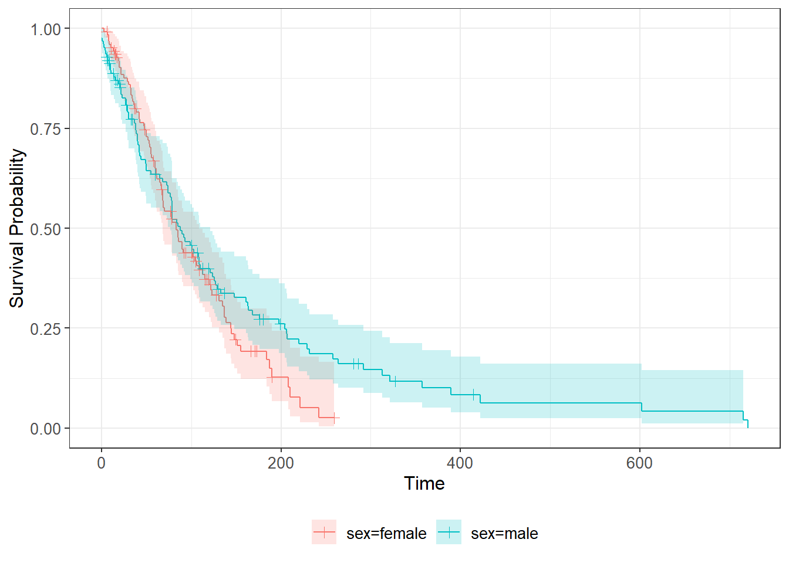](chapter34_files/figure-html/unnamed-chunk-30-1.png)

``` downlit

# log-rank
survdiff(Surv(sv) ~ sex, data = sv_temp, rho=0) 
## Call:
## survdiff(formula = Surv(sv) ~ sex, data = sv_temp, rho = 0)
## 
##              N Observed Expected (O-E)^2/E (O-E)^2/V
## sex=female 125      125      108      2.55      4.98
## sex=male   125      125      142      1.95      4.98
## 
##  Chisq= 5  on 1 degrees of freedom, p= 0.03

# 一般化Wilcoxon
survdiff(Surv(sv) ~ sex, data = sv_temp, rho=1) 
## Call:
## survdiff(formula = Surv(sv) ~ sex, data = sv_temp, rho = 1)
## 
##              N Observed Expected (O-E)^2/E (O-E)^2/V
## sex=female 125     63.2     62.9   0.00159   0.00479
## sex=male   125     62.9     63.2   0.00158   0.00479
## 
##  Chisq= 0  on 1 degrees of freedom, p= 0.9
```

次の例では初期の生存時間に差がある場合を示しています。先ほどとは逆にlog-rankの方が一般化Wilcoxonよりもp値が大きくなっています。

``` downlit
survfit(Surv(sv, status) ~ sex, data = sv_temp) |> 
  ggsurvfit() +
  add_confidence_interval()+
  add_censor_mark()
```

[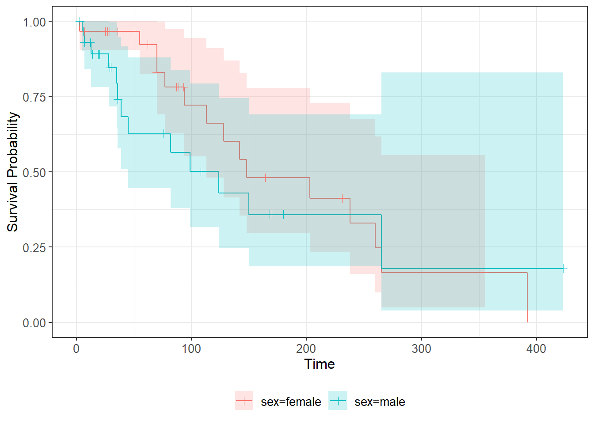](chapter34_files/figure-html/unnamed-chunk-32-1.png)

``` downlit

# log-rank
survdiff(Surv(sv) ~ sex, data = sv_temp, rho=0) 
## Call:
## survdiff(formula = Surv(sv) ~ sex, data = sv_temp, rho = 0)
## 
##             N Observed Expected (O-E)^2/E (O-E)^2/V
## sex=female 30       30     35.6     0.893      2.34
## sex=male   30       30     24.4     1.307      2.34
## 
##  Chisq= 2.3  on 1 degrees of freedom, p= 0.1

# 一般化Wilcoxon
survdiff(Surv(sv) ~ sex, data = sv_temp, rho=1) 
## Call:
## survdiff(formula = Surv(sv) ~ sex, data = sv_temp, rho = 1)
## 
##             N Observed Expected (O-E)^2/E (O-E)^2/V
## sex=female 30     12.8     17.9      1.46      5.27
## sex=male   30     17.9     12.8      2.04      5.27
## 
##  Chisq= 5.3  on 1 degrees of freedom, p= 0.02
```

## 34.9 Cox回帰

**Cox回帰**は、説明変数間でハザードの比（**ハザード比**）がどの時間でも一定であるとして、生存時間を回帰する手法です。

Cox回帰では、ある条件でのハザードh₁(t)と対照条件でのハザードh₀(t)に以下のような関係があるとします。

\\h\_{1}(t)=\psi h\_{0}(t)\\

この関係が成り立つ、つまりハザード比が一定であることを、**比例ハザード性**と呼びます。このψを以下の式で置き換えることで、生存時間を回帰的に分析することができます。

\\\psi=\exp(ax)\\

ここで、xは説明変数、aは係数となります。例えば性別間での差を知りたい場合には、男性：x=0、女性：x=1として、\\h\_{F}(t)=\exp(a) \cdot h\_{M}(t)\\という形で、男性のハザードに対して女性のハザードが\\\exp(a)\\倍となるとします。

Cox回帰では、このψの説明変数を重回帰のように増やすこともできます。

\\\psi=\exp(a\_{1}x\_{1}+a\_{2}x\_{2}+ \cdots +a\_{p}x\_{p})\\

Cox回帰では比例ハザード性を仮定しているため、比例ハザード性が成立しない、つまりハザード比が時間とともに変化するような場合には結果が不正確になります。

Rでは、Cox回帰の計算を`coxph`関数で行います。引数はカプランマイヤーの`survfit`関数やlog-rank検定の`survdiff`関数と同じく、`formula`と`data`になります。

説明変数が1つである場合には、検定の結果としてLikelihood ratio test（尤度比検定）、Wald test（Wald検定）、Score (logrank) test（スコア検定）の結果が表示されます。一般的にはWald検定の結果を用いることが多いようです。

``` downlit
result_km2_cox <- coxph(Surv(time, status) ~ sex, data = cancer)
summary(result_km2_cox)
## Call:
## coxph(formula = Surv(time, status) ~ sex, data = cancer)
## 
##   n= 228, number of events= 165 
## 
##        coef exp(coef) se(coef)      z Pr(>|z|)   
## sex -0.5310    0.5880   0.1672 -3.176  0.00149 **
## ---
## Signif. codes:  0 '***' 0.001 '**' 0.01 '*' 0.05 '.' 0.1 ' ' 1
## 
##     exp(coef) exp(-coef) lower .95 upper .95
## sex     0.588      1.701    0.4237     0.816
## 
## Concordance= 0.579  (se = 0.021 )
## Likelihood ratio test= 10.63  on 1 df,   p=0.001
## Wald test            = 10.09  on 1 df,   p=0.001
## Score (logrank) test = 10.33  on 1 df,   p=0.001
```

### 34.9.1 Cox回帰のモデル選択

Cox回帰では、[30章](chapter30.llms.md#aicによるモデル選択)で説明した**AICによるモデル選択**で、説明変数を選択することができます。Rでモデル選択を行う場合には、まず`coxph`関数の`formula`に説明変数をすべて足した式（フルモデル）を設定します。この式を`step`関数の引数に取ることで、AICによるモデル選択の計算が行われます。

以下の例では、`cancer`データセットのCox回帰に関するモデル選択を行っています。モデル選択の結果、`age`がモデルから外されている、つまり年齢は生存時間に大きな影響がないとして説明変数から取り除かれていることがわかります。

``` downlit
model_All_coxph <- 
  coxph(Surv(time, status) ~ sex + age + ph.ecog + ph.karno, data = cancer |> na.omit())

result_step <- step(model_All_coxph, trace = 0)

result_step
## Call:
## coxph(formula = Surv(time, status) ~ sex + ph.ecog + ph.karno, 
##     data = na.omit(cancer))
## 
##              coef exp(coef) se(coef)      z        p
## sex      -0.53142   0.58777  0.19735 -2.693 0.007085
## ph.ecog   0.74917   2.11524  0.21182  3.537 0.000405
## ph.karno  0.01778   1.01794  0.01112  1.598 0.110009
## 
## Likelihood ratio test=22.16  on 3 df, p=6.038e-05
## n= 167, number of events= 120
```

## 34.10 Cox回帰のモデル評価

Cox回帰での計算が正しく行われていることを確認する場合には、残差を調べます。Cox回帰でチェックされる残差は主にマルチンゲール残差（Martingale residuals）とシェーンフェルド残差（Schoenfeld residuals）の2つです。

計算は簡単で、`coxph`関数の返り値を`residuals`関数の引数に取るだけです。マルチンゲール残差を計算する場合には引数に`type="martingale"`を、シェーンフェルド残差を計算する場合には`type="schoenfeld"`を設定します。

``` downlit
# マルチンゲール残差
result_km2_cox |> residuals(type="martingale") |> head()
##          1          2          3          4          5          6 
##  0.1719970 -0.3880051 -3.5060567  0.4814561 -2.5060567 -3.5060567

# シェーンフェルド残差
result_km2_cox |> residuals(type="schoenfeld") |> head()
##          5         11         11         11         12         13 
##  0.7228149 -0.2764095 -0.2764095 -0.2764095 -0.2793553 -0.2816122
```

マルチンゲール残差やシェーンフェルド残差を確認する場合には、`survminer`パッケージの`ggcoxdiagnostics`関数を用いるのが簡単でよいでしょう。`ggcoxdiagnostics`関数は引数に`coxph`関数の返り値と残差の`type`を取ります。計算結果はグラフで表示され、青の線が概ね一定であれば比例ハザード性が成立しているとします。

``` downlit
pacman::p_load(survminer)

result_step |> ggcoxdiagnostics(type="martingale")
```

[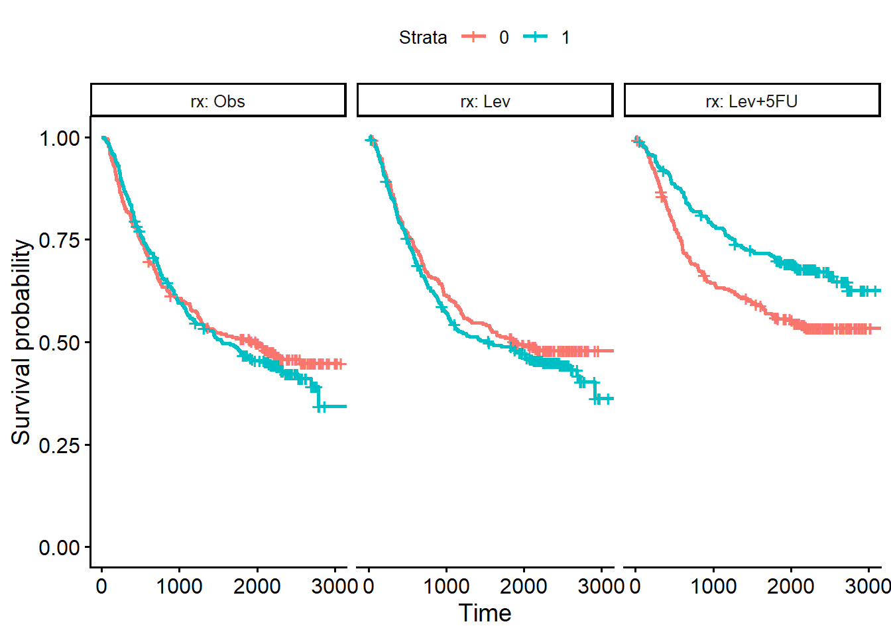](chapter34_files/figure-html/unnamed-chunk-36-1.png)

``` downlit

result_step |> ggcoxdiagnostics(type="schoenfeld")
```

[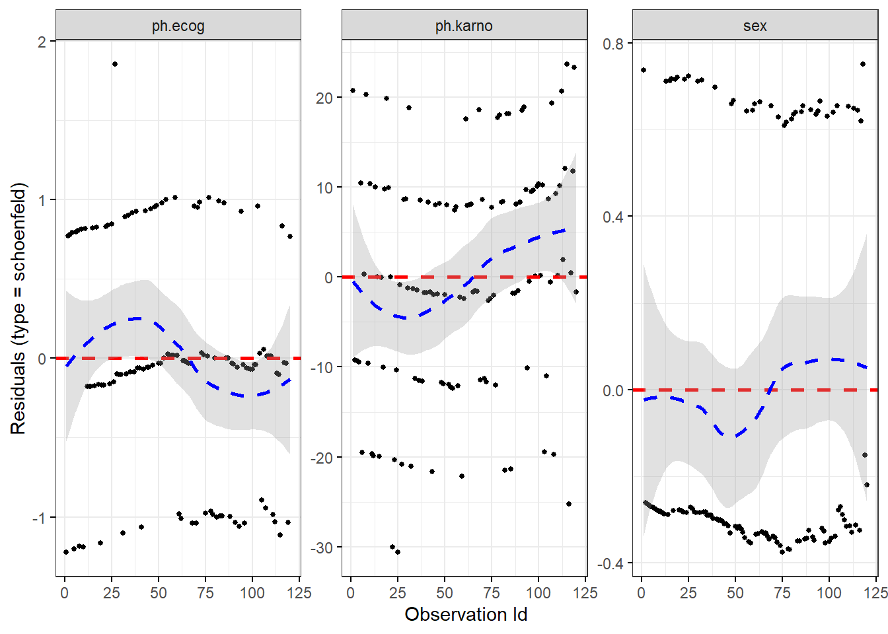](chapter34_files/figure-html/unnamed-chunk-36-2.png)

## 34.11 ハザード比

治験などでは、**ハザード比**の計算にCox回帰が用いられています。このハザード比は上の式で示したψで、ある条件におけるハザードh₁(t)と対照のハザードh₀(t)の比になります。

\\\psi=\frac{h\_{1}(t)}{h\_{0}(t)}\\

ハザード比は一般的に**フォレストプロット**と呼ばれる、代表値を点、信頼区間を線で表した図で表記されます。フォレストプロットについては[ggplot2の章](chapter26.llms.md#エラーバーの描画geom_errorbargeom_linerangegeom_pointrange)で簡単に紹介しています。

ハザード比の計算では、`coxph`関数の返り値（以下の例では`result_step`）を`summary`関数の引数とします。結果が3つのテーブルに表示されますが、真ん中の表に`exp(coef)`と`lower .95`、`upper .95`の3つが表示されています。この3つがそれぞれハザード比、ハザード比の下側95%信頼区間、上側95%信頼区間に当たります。

この`summary`関数の返り値のうち、リストの名前である`$conf.int`で呼び出すことができる表が、上記のハザード比と信頼区間の表になります。この表をもとにハザード比をフォレストプロットにしていきます。

``` downlit
# summary関数の引数にするとハザード比と信頼区間が表示される
result_step |> summary()
## Call:
## coxph(formula = Surv(time, status) ~ sex + ph.ecog + ph.karno, 
##     data = na.omit(cancer))
## 
##   n= 167, number of events= 120 
## 
##              coef exp(coef) se(coef)      z Pr(>|z|)    
## sex      -0.53142   0.58777  0.19735 -2.693 0.007085 ** 
## ph.ecog   0.74917   2.11524  0.21182  3.537 0.000405 ***
## ph.karno  0.01778   1.01794  0.01112  1.598 0.110009    
## ---
## Signif. codes:  0 '***' 0.001 '**' 0.01 '*' 0.05 '.' 0.1 ' ' 1
## 
##          exp(coef) exp(-coef) lower .95 upper .95
## sex         0.5878     1.7013    0.3992    0.8653
## ph.ecog     2.1152     0.4728    1.3965    3.2038
## ph.karno    1.0179     0.9824    0.9960    1.0404
## 
## Concordance= 0.637  (se = 0.031 )
## Likelihood ratio test= 22.16  on 3 df,   p=6e-05
## Wald test            = 21.94  on 3 df,   p=7e-05
## Score (logrank) test = 22.28  on 3 df,   p=6e-05

# summaryの$conf.intの要素を呼び出して変数に代入する
df_step <- result_step |> summary() |> _$conf.int
df_step
##          exp(coef) exp(-coef) lower .95 upper .95
## sex      0.5877701  1.7013455 0.3992326 0.8653444
## ph.ecog  2.1152378  0.4727601 1.3965408 3.2037956
## ph.karno 1.0179354  0.9823806 0.9959836 1.0403710
```

フォレストプロットは点と線のグラフですので、[26章](chapter26.llms.md#エラーバーの描画geom_errorbargeom_linerangegeom_pointrange)で説明した`geom_pointrange`を使えば簡単に作成できます。

以下のグラフでは、`sex`と`ph.ecog`のハザード比の信頼区間が1に被っていない形になっています。この図から、`sex`、`ph.ecog`のハザード比は1ではなく、いずれも生存時間に統計的に有意な影響を与えていることがわかります。

``` downlit
# 列名にカッコがあると演算に使いにくいので列名を変更（HRinvはHRの逆数）
colnames(df_step) <- c("HR", "HRinv", "lower95", "upper95")
df_step <- as.data.frame(df_step)
df_step$val <- rownames(df_step)

df_step |> 
  ggplot(aes(x = HR, xmax = upper95, xmin = lower95, y = val, color = val)) +
  geom_pointrange(linewidth = 1, size = 1) +
  geom_vline(xintercept = 1)
```

[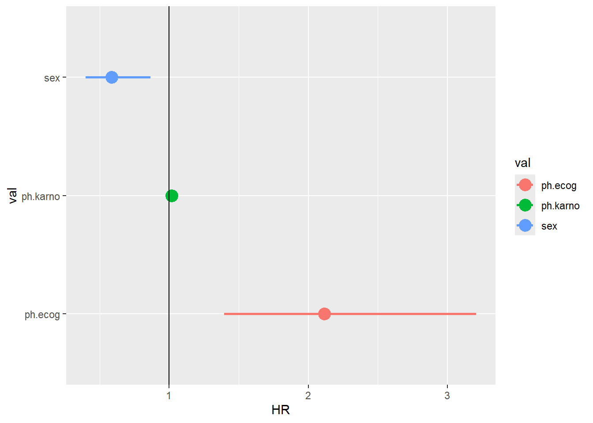](chapter34_files/figure-html/unnamed-chunk-38-1.png)

### 34.11.1 survminerパッケージ：ggforest関数でフォレストプロットを作成する

`survminer`パッケージが提供している`ggforest`関数を用いても、フォレストプロットを作成することができます。上記のように`ggplot2`を用いるよりも、`ggforest`関数を用いた方がはるかに簡単にフォレストプロットを作成することができます。

``` downlit
pacman::p_load("survminer")

result_step |> 
  ggforest(data = cancer |> na.omit())
```

[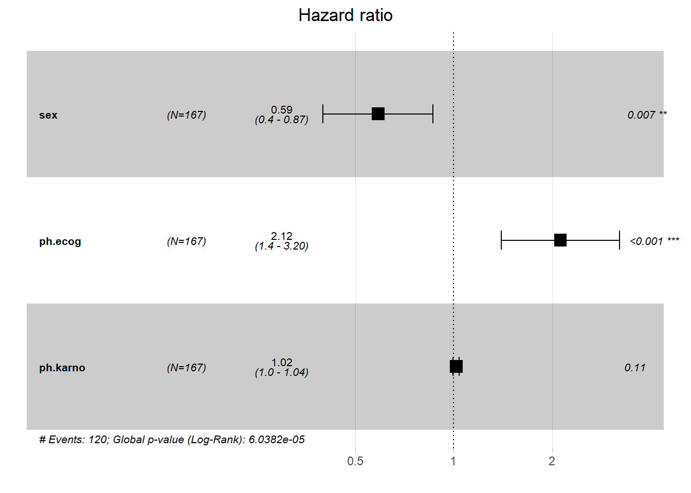](chapter34_files/figure-html/unnamed-chunk-40-1.png)

> **TIP:**
>
> `survminer`パッケージには、上記の`ggforest`関数だけでなく、以下に示すようにカプランマイヤー曲線に`ggplot2`のfacetを用いる関数である、`ggsurvplot_facet`などの便利な関数がたくさん備わっています。`ggsurvfit`と比較してみて、使いやすい方を用いるとよいでしょう。
>
> ``` downlit
> # ggsurvplot_facet関数のexampleに示されている例
> survfit( Surv(time, status) ~ sex, data = colon) |> 
>   ggsurvplot_facet(colon, facet.by = "rx")
> ```
>
> [](chapter34_files/figure-html/unnamed-chunk-41-1.png)

## 34.12 パラメトリックな手法

カプランマイヤー曲線、log-rank検定はノンパラメトリックな手法、Cox回帰はセミパラメトリックな手法であるとされています。これは、いずれも明確な確率分布に基づいて計算する統計手法では無いからです。

一方で、明確な確率分布に基づいたパラメトリックな手法、つまり指数分布やワイブル分布を仮定して生存曲線やハザードを直接計算する方法もあります。

Rでパラメトリックな手法を用いる場合には、`survreg`関数を用います。`survreg`関数はカプランマイヤーの`survfit`、log-rank検定の`survdiff`、Cox回帰の`coxph`関数と同様に、`Surv`関数を含む`formula`と確率分布（`dist`）を引数に取る関数です。確率分布には、ハザード一定であれば`dist="exponential"`を、ハザードが変化する場合には`dist="weibull"`を指定します。

以下の例では、ハザード一定モデルを用いて`survreg`の計算した結果と、ハザードのグラフを示します。

``` downlit
# ハザード一定モデル
set.seed(0)
time_s <- rexp(1000, rate = 0.01) |> round() + 1

# survreg関数でハザード一定モデルを計算する
ts_survreg <- survreg(Surv(time_s, rep(1, 1000)) ~ 1, dist = "exponential")
ts_survreg
## Call:
## survreg(formula = Surv(time_s, rep(1, 1000)) ~ 1, dist = "exponential")
## 
## Coefficients:
## (Intercept) 
##    4.644025 
## 
## Scale fixed at 1 
## 
## Loglik(model)= -5644   Loglik(intercept only)= -5644
## n= 1000

# survregから計算したrate
-ts_survreg$coefficients |> exp() # rate（=1/scale）
## (Intercept) 
## 0.009618899
1 / ts_survreg$scale # shape
## [1] 1

# ハザード（=rate）の計算
plot(1:100, rep((-ts_survreg$coefficients) |> exp(), 100), type = "l")
```

[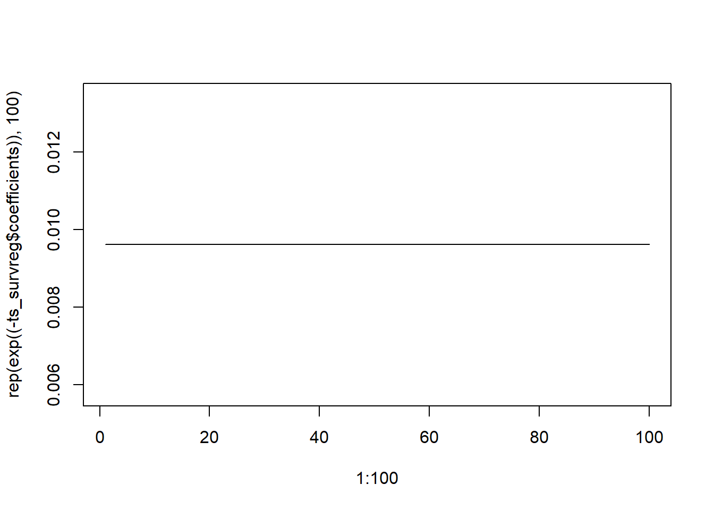](chapter34_files/figure-html/unnamed-chunk-42-1.png)

ハザード一定モデルを`dist="weibull"`で解析した場合の結果は以下の通りです。ハザードが一定とは少し異なる値を示します。

``` downlit
# ハザード一定モデル（Weibullとしてsurvregで計算）
ts_survreg <- survreg(Surv(time_s, rep(1, 1000)) ~ 1, dist = "weibull")
ts_survreg
## Call:
## survreg(formula = Surv(time_s, rep(1, 1000)) ~ 1, dist = "weibull")
## 
## Coefficients:
## (Intercept) 
##    4.668915 
## 
## Scale= 0.9388375 
## 
## Loglik(model)= -5640.8   Loglik(intercept only)= -5640.8
## n= 1000

ts_survreg$coefficients |> exp() # scale（=1/rate）
## (Intercept) 
##     106.582
1 / ts_survreg$scale # shape
## [1] 1.065147

# ハザードを計算する関数
hazard_f <- function(time, intercept, slope){
  slope * intercept * time ^ (slope - 1)
}

hazards <- hazard_f(1:100, (-ts_survreg$coefficients |> exp()), 1 / ts_survreg$scale)
plot(1:100, hazards, type = "l", ylim=c(0, 0.014))
```

[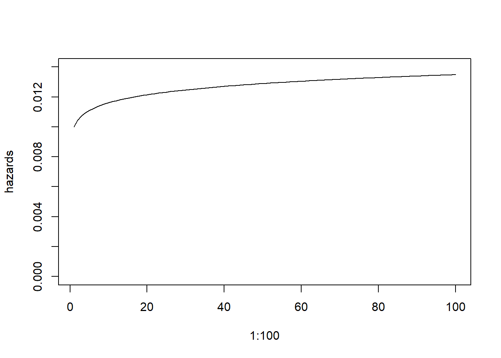](chapter34_files/figure-html/unnamed-chunk-43-1.png)

### 34.12.1 ワイブル分布でのハザードの計算

以下は、ワイブル分布から生成した生存時間を`survreg`関数で解析したものです。`survreg`関数から計算したハザードと、生存時間生成に用いたワイブル分布のパラメータからの計算結果がほぼ一致することがわかります。

``` downlit
# ワイブル分布での生存時間解析（scaleは1/rateに当たるもの、shapeは形状パラメータ）
sv <- rweibull(1000, shape = 0.85, scale = 100) |> round() + 1

# survregで計算する
ts_survreg <- survreg(Surv(sv, rep(1, 1000)) ~ 1, dist = "weibull")
ts_survreg
## Call:
## survreg(formula = Surv(sv, rep(1, 1000)) ~ 1, dist = "weibull")
## 
## Coefficients:
## (Intercept) 
##     4.66072 
## 
## Scale= 1.149131 
## 
## Loglik(model)= -5714.7   Loglik(intercept only)= -5714.7
## n= 1000

# 上がscale、下がshape
ts_survreg$coefficients |> exp() # scale（105.7でほぼ合っている）
## (Intercept) 
##    105.7122
1 / ts_survreg$scale # shape （0.870でほぼ合っている）
## [1] 0.8702231

hazards <- hazard_f(1:100, (-ts_survreg$coefficients |> exp()), 1 / ts_survreg$scale)
plot(1:100, hazards, type = "l", ylim = c(0, 0.014))
par(new = T)
hazards <- hazard_f(1:100, 1/100, 0.85)
plot(1:100, hazards, type = "l", ylim = c(0, 0.014), col = "red")
```

[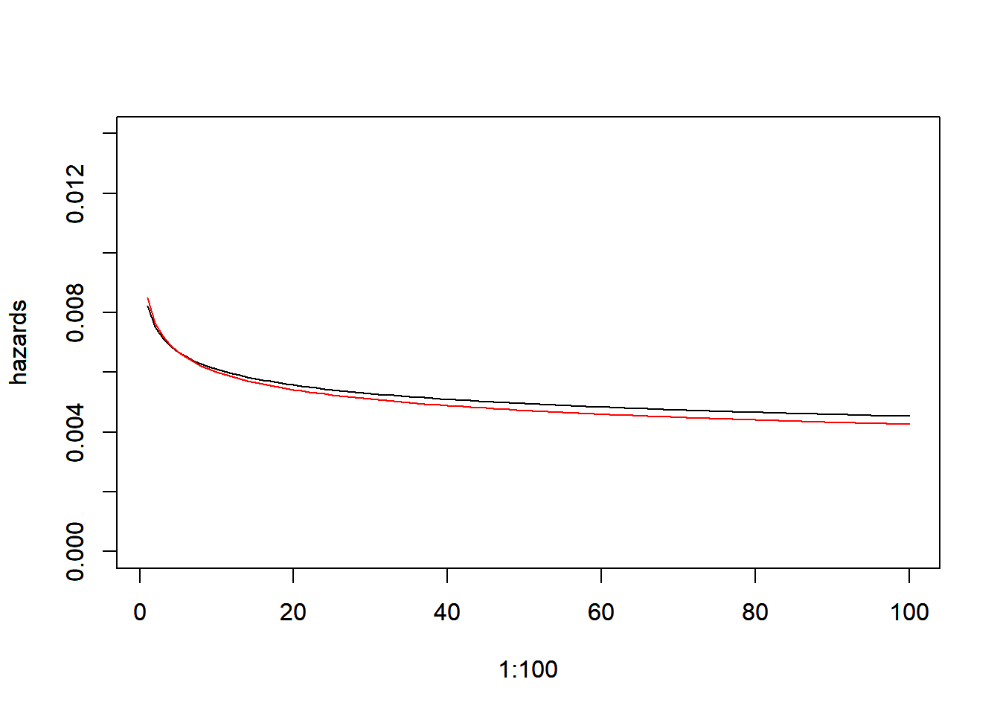](chapter34_files/figure-html/unnamed-chunk-44-1.png)

Kassambara, Alboukadel, Marcin Kosinski, and Przemyslaw Biecek. 2021. *Survminer: Drawing Survival Curves Using ’Ggplot2’*. <https://CRAN.R-project.org/package=survminer>.

Sjoberg, Daniel D., Mark Baillie, Charlotta Fruechtenicht, Steven Haesendonckx, and Tim Treis. 2023. *Ggsurvfit: Flexible Time-to-Event Figures*. <https://CRAN.R-project.org/package=ggsurvfit>.

Terry M. Therneau, and Patricia M. Grambsch. 2000. *Modeling Survival Data: Extending the Cox Model*. Springer.

Therneau, Terry M. 2023. *A Package for Survival Analysis in r*. <https://CRAN.R-project.org/package=survival>.

武冨奈菜美, and 山本和嬉. 2023. “生存時間解析・信頼性解析のための統計モデル.” *日本統計学会誌* 52 (2): 69–112. <https://doi.org/10.11329/jjssj.52.69>.

Back to top
