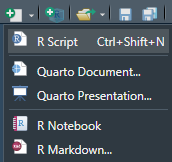
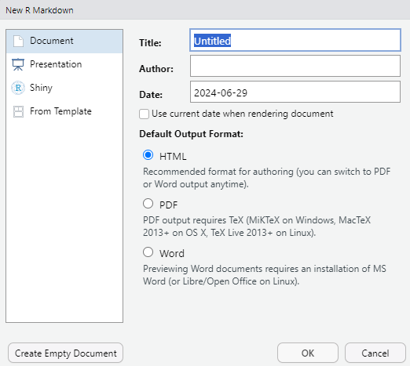
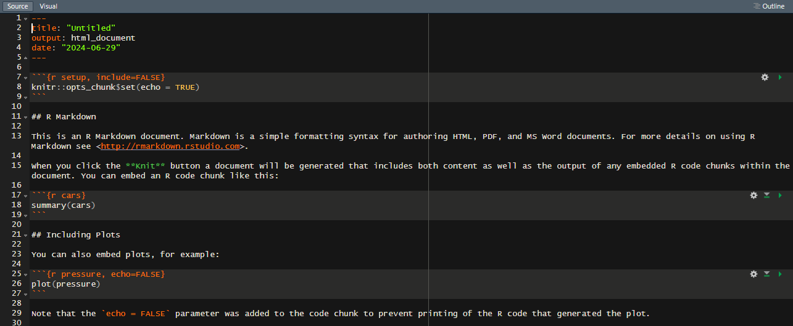
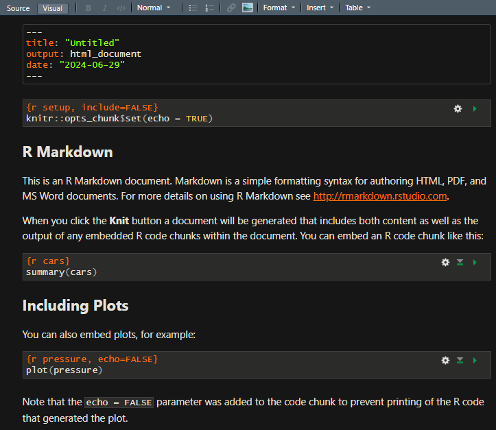
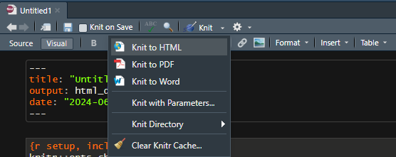

# 35  R markdown

Code

Rでスクリプトを書いている時には、コードを書き、コードを説明するコメントを挿入し、コードを逐次実行するのが一般的です。小さな規模のスクリプトを書いている場合にはこのような方法でも大きな問題はありません。

しかし、1つのRファイルにあれもこれも分析を加えていくと、どこで何を計算しているのか、把握することが難しくなっていきます。また、たくさんの分析を一度に行うと、少しスクリプトを修正しただけでプログラムが走らなくなる、結果が大きく変わってしまう、ということも珍しくありません。

このような、スクリプトを書いているときに発生する問題のことを、**再現性の問題**と呼ぶことがあります。Rでは主に統計の計算を行うため、誰が、いつ、どのような場所で計算を行っても、同じ結果が得られる、つまり再現性があることが重要となります。単にスクリプトを書いているだけでは、再現性を維持するのが難しい場合もあります。

また、Rでの計算結果を他の人に説明する場合には、グラフや表を別途保存し、PowerpointやWordなどに張り付ける必要があります。わざわざファイルを保存し、別のファイルに張り付ける作業は無意味ですし、時間を取ります。

このような再現性の確保、計算結果の共有のためのパッケージが[**R markdown**](https://rmarkdown.rstudio.com/)([Allaire et al. 2023](#ref-rmarkdown_bib1); [Xie et al. 2018](#ref-rmarkdown_bib2), [2020](#ref-rmarkdown_bib3))です。R markdownでは、マークアップ言語である**Markdown**を用いて、Rのコードとその説明文を同時に文書として作成することができます。

## 35.1 マークアップ言語とMarkdown

マークアップ言語とは、主に[組版](https://ja.wikipedia.org/wiki/%E7%B5%84%E7%89%88)と呼ばれる、文書や画像を出版・印刷できる形式で出力するために用いられる言語です。組版自体はマークアップ言語が無くても行うことができます（代表的な組版ソフトウェアは[Adobe InDesign](https://ja.wikipedia.org/wiki/Adobe_InDesign)や[QuarkXPress](https://ja.wikipedia.org/wiki/QuarkXPress)）。これらの有料の組版ソフトはGUIを用いて組版を行うソフトウェアです。同様の機能をCUI、つまりテキストファイルで対応できるようにしたものがマークアップ言語です。マークアップ言語は通常無料で使用することができ、機能的には有料の組版ソフトと大きな差はありません。ただし、学習コストが比較的高めです。

代表的なマークアップ言語には、[Tex](https://ja.wikipedia.org/wiki/TeX)や[Markdown](https://ja.wikipedia.org/wiki/Markdown)があります。Texは昔から論文を書く際に用いられてきた言語で、専用のソフトウェアを用いることでTexファイルをPDF等に変換することができます。

一方でMarkdown は主にhtmlへの変換を目的として作られたマークアップ言語です。Markdownとhtmlの表記は対応しており、変換ツールを用いることでMarkdown のファイルからhtmlを簡単に作成することができます。Markdownの記法について以下の表1に示します。[Rmarkdownのcheatsheet](https://rstudio.github.io/cheatsheets/html/rmarkdown.html?_gl=1*yrxqrc*_ga*MzM5MDIyMTc2LjE3MjkzMjE1MTU.*_ga_2C0WZ1JHG0*MTcyOTMyMTUxNS4xLjAuMTcyOTMyMTUxNS4wLjAuMA..)や[Qiitaのチートシート](https://qiita.com/Qiita/items/c686397e4a0f4f11683d)も参考になります。

| Markdownの記法 | 意味 |
|:---|:---|
| \_text\_ | イタリック |
| \*text\* | イタリック |
| \*\*text\*\* | 太字 |
| ~text~ | 下付き |
| ^text^ | 上付き |
| \`code\` | スクリプト表記（インライン） |
| \`\`\`code\`\`\` | スクリプト表記 |
| \`r code\` | Rのスクリプトを実行（インライン） |
| \`\`\`\` \`\`\`code\`\`\` \`\`\`\` | \`\`\`を表示（\`\`\`code\`\`\`） |
| \<html/address\> | リンク（アドレスを表示） |
| \[text\](address) | リンク（textを表示） |
| \ | 図の挿入 |
| ^\[text\] | 脚注（foot note）：別途内容の記載が必要 |
| \[@bibtex\] | 文献の参照 |
| \# header1 | ヘッダー（h1） |
| \## header2 | ヘッダー（h2） |
| \### header3 | ヘッダー（h3） |
| \#### header4 | ヘッダー（h4） |
| \##### header5 | ヘッダー（h5） |
| \###### header6 | ヘッダー（h6） |
| \- item | 箇条書き |
| \+ item | 箇条書き |
| \* item | 箇条書き |
| 1\. item | 箇条書き（数字） |
| \> blockquotes | 文の引用 |
| \$\$ math \$\$ | LaTeXの数式 |
| \$ math \$ | LaTeXの数式（インライン） |

表1：Markdownの記法 {.caption-top .table .table-sm .table-striped .small}

> **TIP:**
>
> Rは統計に用いる言語ですので、Texを用いた論文にRの統計結果を加えることは昔から重要とされていました。Rが用いられ始めてすぐに、RのスクリプトとTexを合わせることができるRの機能として、[Sweave](https://stat.ethz.ch/R-manual/R-devel/library/utils/doc/Sweave.pdf)がR Core Teamにより開発されました（[2002年頃](https://cran.r-project.org/doc/Rnews/Rnews_2002-3.pdf#page=28&zoom=100,73,74)のようです）。
>
> また、このようなRでの流れとは独立に、HTMLを簡単な表記で作成するためのテキスト形式である[Markdown](https://daringfireball.net/projects/markdown/)（2004年）、MarkdownをHTMLやPDFに変換できるファイルコンバータとして[Pandoc](https://pandoc.org/)（2006年）が開発されました。
>
> Rでの開発とは別に、PythonではRと同じような対話的実行システムである[IPython](https://ipython.readthedocs.io/en/stable/)（2001年）が開発され、更にPython、Rなどを対話的に実行・結果を表示しつつ、Markdownでの文書と同時に記載できるWebアプリケーションである[Jupyter notebook](https://jupyter.org/)（2014年頃）が開発されました。
>
> 上記のような流れの中で、RでLaTex、HTML、Markdownなどの文書とコードを作成し、それをRコードを実行した形でLatexやHTMLとして出力するためのパッケージである[knitr](https://yihui.org/knitr/)が開発されました（2012年頃）。このknitrをさらにPandocと統合し、Rコードから直接PDFやHTML、Microsoft Wordなどのフォーマットの文書を作成できるようにしたものが[R markdown](https://rmarkdown.rstudio.com/)（2016年頃）です。R markdownはすぐにRstudio（[2011年頃](https://posit.co/blog/rstudio-new-open-source-ide-for-r/)に開発）と統合され、RstudioからR markdown方式の文書を作成し、それをPDFやHTMLに変換できるようになりました。R markdownのExtensionsも整備され、例えば[Bookdown](https://bookdown.org/)（R Markdownで本を書くためのツール）が開発されたことでRでHTML形式の本を比較的簡単に作成することができるようになりました。また、[Revealjs](https://revealjs.com/)を 出力することでHTMLベースのプレゼンテーションを作成することもできるようになっています。RstudioにはR markdownのVisual mode（Jupyter notebookと見た目が似た形式）も整備され、R markdownを利用することでJupyter notebook風にRを利用することもできます。
>
> 上記のようにRstudioとR markdownは共に発展してきましたが、2010年代には機械学習のライブラリがほとんどPythonで開発されるようになり、RよりもPythonの方がはるかに流行の言語となりました。このPythonユーザーを取り込むためだと思いますが、Rstudio（今は[Posit.io](https://posit.co/)という企業）はR markdownをPythonやJuliaなどの統計学・機械学習で用いられる言語でも使える形とし、Rstudioだけでなく、JupyterやテキストエディタであるVisual Studio Codeでも使えるものとした、[Quarto](https://quarto.org/)を開発し始めました（おそらく2022年頃）。QuartoがRユーザー以外に注目されているかはかなり疑問ですが、RユーザーとしてはR markdownの機能が単にアップグレードされただけですので、用いない理由はほとんどありません。
>
> このテキストもR markdown、BookdownおよびQuartoを利用して作成しています。
>
> 以下ではR markdownについて説明していきますが、RstudioではQuartoもR markdownと同じように用いることができます。

## 35.2 ファイルの作成

R markdownで作成するファイルの拡張子は`.rmd`、Quartoで作成するファイルの拡張子は`.qmd`です。Rstudioで.rmd、.qmdファイルを作成する場合、Rstudioの左上のアイコンから、「R markdown…」や「Quarto Document…」を選択します。

[](./image/Rmarkdown_newfile.png "R markdownのファイルを作成する")

R markdownのファイルを作成する

R markdownを選択すると、まず「New R Markdown」というウインドウが表示されます。ここでタイトル、著者、作成日、出力する形式（HTML、PDF、Word）を選択できます。このウインドウで設定していなくても後ほど設定することもできるため、すべてを入力しないといけない、ということはありません。

[](./image/new_Rmarkdown.png "R markdownの初期設定")

R markdownの初期設定

R markdownファイルを作成すると、以下のようなR markdownの例が表示されます。この表記法はSourceと呼ばれる、すべてテキストで記載された形です。

[](./image/initial_Rmarkdown_source.png "R markdownファイル：Sourceモード")

R markdownファイル：Sourceモード

また、上の「Visual」を選択すると、Jupyter notebook風のVisualモードを利用することもできます。やや表示に時間がかかり、レスポンスが悪いため、通常はSourceモードを用いる方が使いやすいでしょう。

[](./image/initial_Rmarkdown_visual.png "R Markdownファイル：Visualモード")

R Markdownファイル：Visualモード

最終的には上のアイコンに含まれている「Knit」（毛糸を編む、ニット）の下矢印をクリックし、選択肢から出力したいファイル形式（HTML、PDF、Word）を選ぶことでRを実行した結果を表示した出力ファイルを得ることができます。

[](./image/knit_Rmarkdown.png "R markdownをknitする")

R markdownをknitする

## 35.3 yamlとchunk

### 35.3.1 yaml

上記の「New R Markdown」ウインドウで設定した内容は、文書の一番始め、`---`に挟まれた領域に記載されています。

``` yaml
---
title: "Untitled"
author: "xjorv"
date: "2024-06-29"
output: html_document
---
```

この`---`に挟まれた領域には、[YAML](https://ja.wikipedia.org/wiki/YAML)と呼ばれるものが記載されています。YAML自体は名前とデータをコロン（`:`）でつないだだけのデータ形式です。R markdownではこの文頭のYAMLを読み込むことで、最終的な出力データに表記する情報・データの出力形式などを設定することができます。YAMLで設定できる主な要素は以下の表2の通りです。

| オプション名   | 取りうる値              | 意味                         |
|:---------------|:------------------------|:-----------------------------|
| title          | 文字列                  | 文書のタイトル               |
| author         | 文字列                  | 著者                         |
| date           | 日付                    | 作成日                       |
| output         | html_documentなど       | 出力の形式                   |
| code_folding   | 論理型                  | スクリプトを折りたたむ       |
| css            | “style.css”             | CSSの指定                    |
| dev            | “png”、“pdf”            | グラフィックデバイスの指定   |
| df_print       | “kable”、“tibble”など   | データフレームの表示方法     |
| fig_caption    | 論理型                  | 図のキャプションの有無       |
| highlight      | “tango”、“pygments”など | コードハイライトの方法       |
| latex_engine   | “lualatex”など          | PDF作成時のLaTeXエンジン     |
| reference_docx | “file.docx”など         | Wordのテンプレート指定       |
| theme          | Bootswatchのテーマ名    | Bootswatchのテーマ選択       |
| toc            | 論理型                  | 目次の表示                   |
| toc_depth      | 数値                    | 目次表示するレベルの指定     |
| toc_float      | 論理型                  | 目次をスクロールで移動するか |

表2：YAMLの指定 {.caption-top .table .table-sm .table-striped .small}

YAMLの指定では、論理型として`true`/`false`という形で、小文字を用います。

### 35.3.2 chunk

R markdownでは、Rのスクリプトは以下のように \` 3つで囲まれた領域に書くことになります。このコードのかたまりのことを**chunk**と呼びます。

```` markdown
```{r}
plot(cars)
```
````

[](chapter35_files/figure-html/unnamed-chunk-3-1.png)

.rmd（.qmd）ファイル中にchunkを書くと、knitするときにchunk内のスクリプトは実行され、上のように評価結果が出力ファイル上に表示されます。chunkに書かれている`{r}`はRのコードであるということを示しています。Rstudioではchunkを**Ctrl+Alt+ICtrl+Alt+I**で挿入することができます。

この`{r}`の部分には、chunkオプションというものを追加し、評価や表示の方法を指定することができます。chunkオプションのリストを以下の表に示します。

| オプション名 | 意味                     |
|:-------------|:-------------------------|
| echo         | コードを表示するかどうか |
| error        | エラーで停止するかどうか |
| eval         | コードを評価するか       |
| messagee     | メッセージを表示するか   |
| warning      | warningを表示するか      |
| results      | 結果の表示方法の指定     |
| fig.align    | 図の位置（“center”など） |
| fig.width    | 図の幅                   |
| fig.height   | 図の高さ                 |
| out.width    | 図の出力時の幅調整       |
| collapse     | コードと結果の折り畳み   |
| filename     | チャンク名の設定         |

表3：chunk optionの一覧 {.caption-top .table .table-sm .table-striped .small}

チャンクオプションは以下のように記載して用います。

```` markdown
```{r, echo = FALSE, eval = FALSE}
plot(cars) # チャンクオプションはコンマで区切って記述する
```
````

Allaire, JJ, Yihui Xie, Christophe Dervieux, et al. 2023. *Rmarkdown: Dynamic Documents for r*. <https://github.com/rstudio/rmarkdown>.

Xie, Yihui, J. J. Allaire, and Garrett Grolemund. 2018. *R Markdown: The Definitive Guide*. Chapman; Hall/CRC. <https://bookdown.org/yihui/rmarkdown>.

Xie, Yihui, Christophe Dervieux, and Emily Riederer. 2020. *R Markdown Cookbook*. Chapman; Hall/CRC. <https://bookdown.org/yihui/rmarkdown-cookbook>.

Back to top
