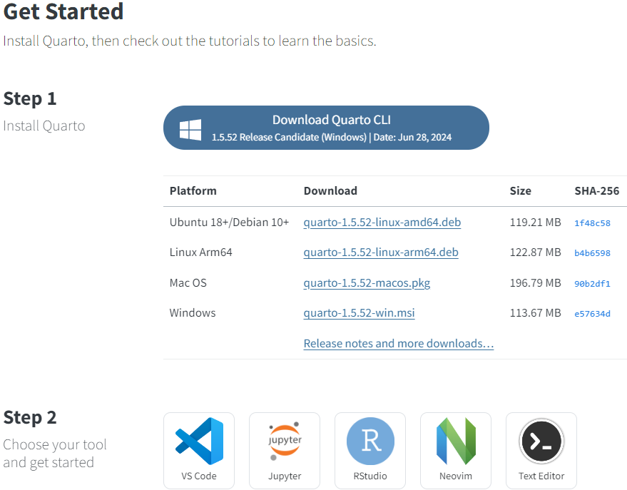
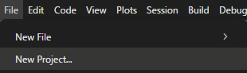
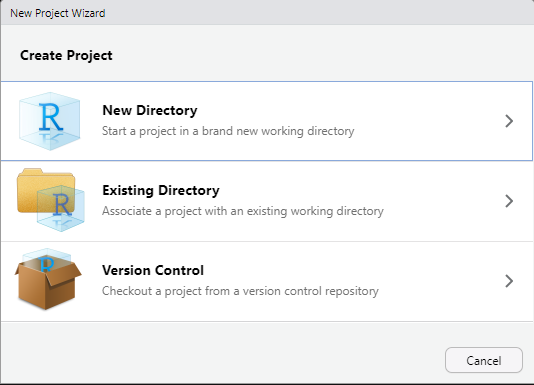
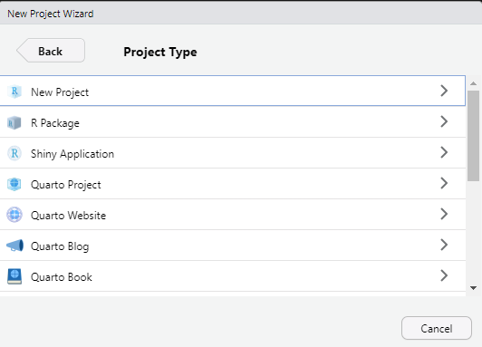
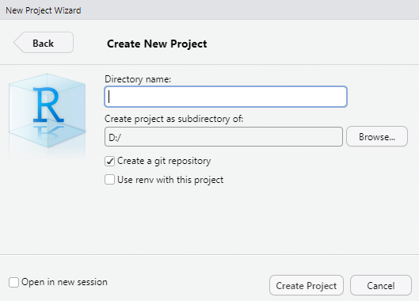
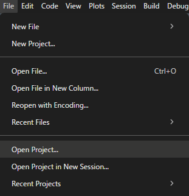
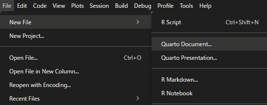
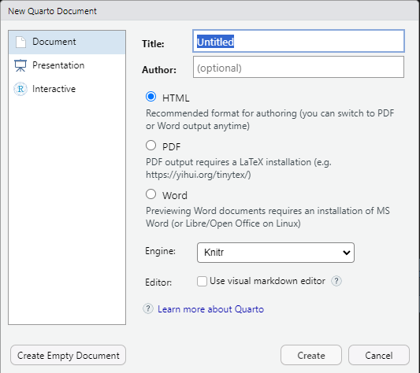

# 36  Quarto：Quartoの始め方

Code

[Quarto](https://quarto.org/)は[35章](chapter35.llms.md)で説明したR markdownの拡張であり、R markdownと同じような機能をPython、[Julia](https://julialang.org/)、[Observable](https://observablehq.com/)などの他の言語でも利用できるようにした上で、静的なウェブサイト制作で用いられている新しい追加機能、他のオンラインサービスなどとの連携機能を追加し、Rstudio以外のIDE（Jupyter Notebook、Visual Studio Code）や通常のテキストエディタでも利用可能にしたものです。ただし、Rを使うのであればR markdownと大差ないものです。

> **TIP:**
>
> R markdownとQuartoではファイルの拡張子が異なりますが（R markdownは.rmd、Quartoは.qmd）、どちらも`knitr`でHTMLやPDFに変換されますので、Rではほぼ同じものと考えてよいでしょう。ただし、R markdownではPythonやJulia、Observableを演算に利用することはできず、Quartoでは利用可能です。PythonやJuliaでは`knitr`ではなく、Jupiterの仕組みを利用して変換されます。
>
> ただし、`knitr`でPythonのコードを実行することはできます。このPythonのコードの実行には`reticulate`([Ushey et al. 2025](#ref-reticulate_bib))というRのパッケージが用いられます。詳しくは[38章](chapter38.llms.md)で説明します。

Quartoを用いると、以下のようなウェブサイトを簡単に作成することができます。

1.  [源氏物語（若紫）](https://xjorv.quarto.pub/genzi_wakamurasaki/)：Quarto Bookという機能で作成し、[Quarto Pub](https://quartopub.com/)で公開。
2.  [奈良の個人的な観光マップ](https://sb8001at-oss.github.io/Nara_map/)：Quartoで10行未満のコードを書いて作成し、[Github Pages](https://docs.github.com/ja/pages/getting-started-with-github-pages/what-is-github-pages)で公開。
3.  [日本の人口統計](https://xjorv.quarto.pub/pop_japanese_dashboard_with_ojs/)：ObservableというJavascriptベースのデータ描画ライブラリを用いたダッシュボード。Quarto Pubで公開。

いずれも以下のページ（レポジトリ）でソースコードを公開しています。

1.  ：[sb8001at-oss/wakamurasaki](https://github.com/sb8001at-oss/wakamurasaki)
2.  ：[sb8001at-oss/Nara_map](https://github.com/sb8001at-oss/Nara_map)
3.  ：[sb8001at-oss/Rnyuumon](https://github.com/sb8001at-oss/Rnyuumon/blob/master/sample_observable/index.qmd)

このテキストでは、QuartoでHTMLを作成する方法を中心に説明します。

> **TIP:**
>
> Quartoを用いることで、HTML以外にもPDF、Word、ePub、Powerpointなどの文書を作成することが出来ます。これらのうち、PDFを用いる場合には[26章](chapter26.llms.md#グラフの保存ggsave)で説明したように、`ggplot2`などのグラフで文字化けが起こる可能性があります。また、wordやPowerpointを作成する場合、好みのテンプレートをあらかじめ準備しておく必要があります。PDFやWordの文書では、Quartoで利用できる機能の一部しか利用できず、表現の幅がやや狭まります。
>
> HTMLはWebで用いられるファイル形式であり、そのままではやや取り扱いにくいファイルではあります。ただし、Quartoで作成した（静的な）HTMLは、Github PagesやQuarto Pubと呼ばれるサービスを用いることで比較的簡単にデプロイ（Web上で閲覧できるようにする）できます。HTMLに画像等を埋め込むこと（[self-contained HTML](https://mine-cetinkaya-rundel.github.io/quarto-tip-a-day/posts/09-self-contained/)）も可能となっていますので、Quartoでの表現方法をすべて用いるにはHTMLを作成するのが最もよいと思います。

## 36.1 Quarto CLIのインストール

Quartoを使用する場合、まずは[**Quarto CLI**をインストール](https://quarto.org/docs/get-started/)するとよいでしょう。

[](./image/quarto_CLI_install.png "Quarto CLIのインストール")

Quarto CLIのインストール

CLIをインストールしているとRstudioからのみではなく、Terminal（WindowsではコマンドプロンプトやPowerShell）からQuartoのファイルを**Render**（R markdownのknitに当たるもの）できるようになります。この章ではまず、Quartoでのドキュメントの作成の基礎について説明していきます。

> **TIP:**
>
> CLIとはCommand Line Interfaceのことで、ターミナル（WindowsではコマンドプロンプトやPowershell、MacやLinuxではTerminal）からソフトウェアの機能を用いるためのツールのことです。Rstudioでは、Consoleのタブの隣に『Terminal』というタブがあり、これを用いることでターミナルを利用して.qmdファイルをknit（QuartoではRender）することができます。Quarto CLIをインストールすると、以下の文を利用して、現在のディレクトリ内に保存した.qmdファイルをRenderすることができます。
>
> ``` terminal
> quarto render ファイル名
> ```

## 36.2 Projectの設定

これまで説明してこなかったRstudioの機能の一つに、**Project**というものがあります。このProjectはRstudioで作成可能な様々なツール・文書の作成（ShinyやRのパッケージ、R markdownなど）・一連の解析を行う際のファイルの管理等を便利にするためのものです。

小規模のRファイル、解析データなどではProjectは必ずしも必要ではありませんが、この章で説明するQuartoでのHTMLファイル作成や、[47章](chapter47.llms.md)で説明するShinyアプリを作成する際、また大規模なデータをいろいろな角度から解析するような場合には、たくさんのコード、画像、表、データソースなどのファイルを用います。このようなたくさんのファイルを管理し、利用する際にはProjectが有用です。Projectをあらかじめ作成しておくことで、後々ファイルの取り扱いが簡単になります。

### 36.2.1 Projectを作成する

Projectを作成する場合には、まずRstudioのウインドウの左上、Fileから「New Project…」を選択します。

[](./image/new_project1.png "New Project…の選択")

New Project…の選択

「New Project…」を選択すると、以下のようにProjectの作成方法を選択するウインドウが表示されます。

[](./image/new_project2.png "Create Projectのウインドウ")

Create Projectのウインドウ

このウインドウでは、新しいフォルダを作成してProjectを作成するか（New Directory）、今あるフォルダを選択してProjectを作成するか（Existing Directory）を選択できます。

> **TIP:**
>
> 3つ目のVersion Controlは、レポジトリ（ファイルの置き場所のこと）からProjectを拾ってきて、自分のPCで編集する際に用いるものです。このレポジトリとは、このテキストにも数回出てきた[Git](https://git-scm.com/)などで管理されている一連のファイルを指します。Rの初心者が選択することはまれだと思います。

このウインドウで「New Directory」を選択すると、以下のようなウインドウがさらに表示されます。

[](./image/new_project3.png "Projectのタイプを選択")

Projectのタイプを選択

このウインドウでは、Projectの種類を選択します。例えば、Quartoで文を作成したい場合には「Quarto Project」を、Shinyでアプリケーションを作成したい場合には「Shiny Application」を、Rのパッケージを作成したい場合には「R Package」を選択します。このようなタイプのProjectを選択した場合、ProjectのフォルダにはそのProjectに関連するテンプレートのファイルが自動的に作成されます。

QuartoやShinyを利用しない場合、つまり解析などのためにProjectを作成する場合には「New Project」を選択しましょう。また、「New Project」を選択した場合でも、後からQuartoやShinyアプリケーションのファイルをProjectのフォルダ内に作成することはできます。

「New Project」を選択すると、以下のウインドウがさらに表示されます。

[](./image/new_project4.png "Projectの情報を入力する")

Projectの情報を入力する

このウインドウでは、Directory name（新しく作成されるフォルダ名、Projectをこのフォルダで管理します）、Projectのフォルダを作成するディレクトリ（フォルダ）を選択することができます。オプションとして、git repositoryを同時に作成することや、[`renv`](https://rstudio.github.io/renv/articles/renv.html)([Ushey and Wickham 2024](#ref-renv_bib))を用いる設定とすることもできます。`renv`はRのパッケージ管理に関するツールで、演算の再現性を保ちたいときには用いることを検討してもよいでしょう。

Projectを作成すると、作成したフォルダ内に、Directory nameと同じ名前の、「.Rproj」というファイルが作成されます。この.Rprojファイルを開くと、Rstudio上でそのProjectが開きます。また、「File -\> Open Project」から.Rprojファイルを選択してProjectを開くこともできます。

[](./image/Open_project.png "Projectを開く")

Projectを開く

### 36.2.2 Projectを用いる利点

Projectを開くと、以下のような設定が自動的に行われます。

- 新規のRセッションが起動する（分析が初期化される）
- RstudioのウインドウにProject名が表示される
- ProjectのフォルダがWorking Directoryに設定される（Working Directoryについては[17章](chapter17.llms.md#ディレクトリの操作)参照）
- .RprofileをProjectのフォルダに作成している場合、読み込みが行われる
- .RDataが読み込まれる（.RDataについては[17章](chapter17.llms.md#ワークスペースイメージ.rdataの保存)参照）
- .Rhistoryというファイルが読み込まれる（.RhistoryはRstudioの右上、Historyの内容を保存したもの）
- 前回開いていたファイルが自動的に開く
- 前回利用した際のRstudioのセッティング（パネルのサイズなど）が再現される

逆にProjectを閉じると、以下のように現在のProjectの状態が保存されます。

- .RDataと.Rhistoryが上書きされる
- 開いていたファイルが保存される
- Rstudioのセッティングが保存される
- Rのセッションが閉じ、分析が初期化される

> **TIP:**
>
> Rstudioのセッティングなどの情報は、projectを作成した際に自動的に生成される隠しフォルダ内のファイルに保存されています。

したがって、解析を一度中断しても、Projectを開くことで同じ状態から解析を続けることができるようになります。特に複雑なQuartoの文書を作成したいとき（後に述べるQuarto WebsiteやQuarto Bookなど）、Shinyアプリを作成する際などにはあらかじめProjectを作成しておくことをおススメします。

## 36.3 qmdファイルの作成

Quartoでは、**qmdファイルをRender**することで、HTMLやPDF、Wordファイルを生成する仕組みとなっています。Rstudioでは、このqmdファイルを上のメニューのFileから、「New file -\> Quarto Document…」を選択することで作成することができます。

[](./image/chapter39_qmdfile.png "Quarto DocumentをRstudioで作成する")

Quarto DocumentをRstudioで作成する

Quarto Document…を選択すると以下のようなウインドウが開きます。必要に応じてTitleやAuthorを入力し、出力したいファイル形式（HTML、PDF、Word）とRenderに用いるエンジン（Rの場合は通常knitrで、Pythonの場合はJupyter）、エディタのモード（SourceかVisualか）を選択し、Createを押すとqmdファイルが作成されます。このウインドウで入力・選択した要素はすべて、後から変更することができます。

[](./image/chapter39_qmdfile2.png "Quarto Documentの作成ウインドウ")

Quarto Documentの作成ウインドウ

R markdownのファイルを作成した場合、RstudioはR markdownの例を記載したファイルを作成しますが、qmdファイルではyamlだけのシンプルなファイルが生成されます。

また、他のRのファイルと同じですが、テキストエディタなどで単に拡張子を「`.qmd`」にするだけでもqmdファイルを作成することができます。

> **TIP:**
>
> [Quarto](https://en.wikipedia.org/wiki/Quarto)とは、昔のパンフレットのようなものを指す言葉で、1枚の紙を4分割し、表裏で8ページの内容を記載できるようにしたもののことです。真ん中で切断し、4ぺージの紙を2枚重ねて8ページとし、さらに積み重ねて本にしていたようです。小学校の遠足のしおりみたいなものを想像してもらえればよいかと思います。

Ushey, Kevin, JJ Allaire, and Yuan Tang. 2025. *Reticulate: Interface to ’Python’*. <https://CRAN.R-project.org/package=reticulate>.

Ushey, Kevin, and Hadley Wickham. 2024. *Renv: Project Environments*. <https://CRAN.R-project.org/package=renv>.

Back to top
