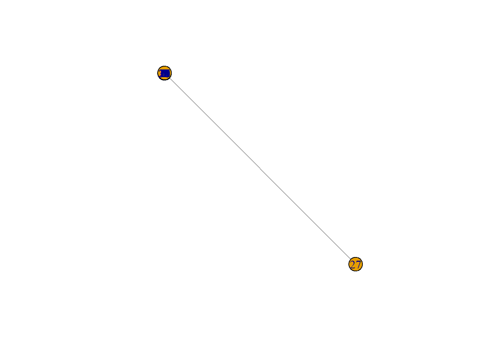
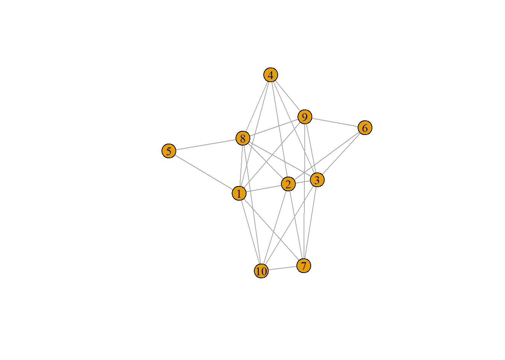

# 37  Quarto：Markdownとレイアウト

Code

## 37.1 Markdown記法の一覧

Quartoでも、文章の設定は**YAML**として、文章の中身は**Markdown**で、コードは**chunk**に記載するのはR markdownと全く同じです。QuartoのMarkdownは基本的にはR markdownのものとほぼ同じです。ただし、[R markdownの教科書](https://bookdown.org/yihui/rmarkdown/)に書かれているMarkdownのリストよりも、[QuartoのMarkdownガイド](https://quarto.org/docs/authoring/markdown-basics.html)にはたくさんの記法についての記載があります。以下にQuartoでのMarkdown記法についての一覧を示します。

[TABLE]

QuartoのMarkdown記法一覧 {.caption-top .table}

また、上記の他に、以下のようにキーボードショートカットを指定するための表記法もあります。

``` markdown

```

Ctrl+CCtrl+C

> **TIP:**
>
> 上記の表の2列目のように、Markdown記法で記述した要素はMarkdown記法に従ってHTMLに変換されます。ただし、一部変換がうまくいかない場合があります。変換できない場合は、HTMLの記法で書くとHTML表記に従い変換されます。ですので、上の表のソースコードでは、一部HTMLで記載されており、一列目とは記法が異なります。
>
> インラインの数式は表中ではうまく変換できず、数式と同じ表記（`$$ $$`の表記）で表示していますが、通常の文中ではきちんと数式に変換されます。

## 37.2 箇条書き

Quartoでの箇条書きの記載方法は以下の通りです。記号（`*`や`-`）と文章の間にはスペースが1つ必要で、スペースがないとうまく箇条書きにならないことがあります。

[TABLE]

Quartoでの箇条書き一覧 {.caption-top .table}

## 37.3 表（グリッドテーブル）

表は、以下のように+と-、=、\|の記号を用いて表します。また、キャプションを入れたいときには、表の上か下に:（コロン）を記載し、その後に文章を追加します。

``` markdown
+-----+-----+-----+
| pet | age | sex |
+=====+=====+=====+
| dog | 5   | F   |
+-----+-----+-----+
| cat | 3   | M   |
+-----+-----+-----+

: caption
```

| pet | age | sex |
|-----|-----|-----|
| dog | 5   | F   |
| cat | 3   | M   |

caption {.caption-top .table}

表内を左揃えにするときは:===、右揃えにするときは===:、中央揃えにするときには:===:を用いて、列名との境を設定します。

``` markdown
+-----+-----+-----+
| pet | age | sex |
+:====+====:+:===:+
| dog | 5   | F   |
+-----+-----+-----+
| cat | 3   | M   |
+-----+-----+-----+

: caption（わかりにくいが、petは左、ageは右、sexは中央揃えになっている）
```

| pet | age | sex |
|:----|----:|:---:|
| dog |   5 |  F  |
| cat |   3 |  M  |

caption（わかりにくいが、petは左、ageは右、sexは中央揃えになっている） {.caption-top .table}

また、表の幅は以下のような形で設定することができます。

``` markdown
+-----+-----+-----+
| pet | age | sex |
+=====+=====+=====+
| dog | 5   | F   |
+-----+-----+-----+
| cat | 3   | M   |
+-----+-----+-----+

: 幅は10、10、80で調整 {tbl-colwidths="[10,10,80]"}
```

| pet | age | sex |
|-----|-----|-----|
| dog | 5   | F   |
| cat | 3   | M   |

幅は10、10、80で調整 {.caption-top .table}

表は以下のように、横に並べることもできます。

``` markdown
:::{layout-ncol=2}

: dog-cat table

+-----+-----+-----+
| pet | age | sex |
+=====+=====+=====+
| dog | 5   | F   |
+-----+-----+-----+
| cat | 3   | M   |
+-----+-----+-----+

: cow-pig table

+-----+-----+-----+
| pet | age | sex |
+=====+=====+=====+
| cow | 4   | M   |
+-----+-----+-----+
| pig | 7   | M   |
+-----+-----+-----+

Caption：表を横に並べる
:::
```

| pet | age | sex |
|:----|:----|:----|
| dog | 5   | F   |
| cat | 3   | M   |

dog-cat table {.caption-top .table}

| pet | age | sex |
|:----|:----|:----|
| cow | 4   | M   |
| pig | 7   | M   |

cow-pig table {.caption-top .table}

Caption：表を横に並べる

このMarkdown形式のテーブルをテキストエディタで作成するのはとても面倒ですので、[Markdownテーブルジェネレーター](https://www.google.com/search?q=Markdown%E3%83%86%E3%83%BC%E3%83%96%E3%83%AB%E3%82%B8%E3%82%A7%E3%83%8D%E3%83%AC%E3%83%BC%E3%82%BF%E3%83%BC&rlz=1C1OLVV_jaJP1021JP1021&oq=Markdown%E3%83%86%E3%83%BC%E3%83%96%E3%83%AB%E3%82%B8%E3%82%A7%E3%83%8D%E3%83%AC%E3%83%BC%E3%82%BF%E3%83%BC&gs_lcrp=EgZjaHJvbWUyBggAEEUYOTIHCAEQABjvBTIKCAIQABiABBiiBDIKCAMQABiABBiiBDIKCAQQABiiBBiJBTIHCAUQABjvBdIBBzc0MWowajeoAgCwAgA&sourceid=chrome&ie=UTF-8)がたくさん作られています。[QuartoのTableに関するGuide](https://quarto.org/docs/authoring/tables.html)にもジェネレーターの記載があるので、 使い勝手の良いものを探して用いてみるとよいでしょう。

### 37.3.1 データフレームを表として表示する

表はMarkdownで書く方法だけでなく、Rの関数を使ってデータフレームから表示することもできます。単にデータフレームを表示した場合、以下のようにconsoleに表示されるのと同じような表が挿入されます。

``` downlit
head(iris, 3)
```

      Sepal.Length Sepal.Width Petal.Length Petal.Width Species
    1          5.1         3.5          1.4         0.2  setosa
    2          4.9         3.0          1.4         0.2  setosa
    3          4.7         3.2          1.3         0.2  setosa

Quartoでは、データフレームの表示方法として、[`knitr::kable`](https://rdrr.io/pkg/knitr/man/kable.html)や[`DT::datatable`](https://rdrr.io/pkg/DT/man/datatable.html)([Xie et al. 2024](#ref-DT_bib))などの、表をきれいに表示するための関数を用いることができます。Rの演算で得られたデータフレームをQuartoで表として表示したい場合には、このどちらかの関数を用いるとよいでしょう。

``` downlit
knitr::kable(head(iris, 3))
```

| Sepal.Length | Sepal.Width | Petal.Length | Petal.Width | Species |
|-------------:|------------:|-------------:|------------:|:--------|
|          5.1 |         3.5 |          1.4 |         0.2 | setosa  |
|          4.9 |         3.0 |          1.4 |         0.2 | setosa  |
|          4.7 |         3.2 |          1.3 |         0.2 | setosa  |

------------------------------------------------------------------------

``` downlit
DT::datatable(head(iris, 3))
```

## 37.4 図の表示

図は、上に示した通り、``という形で表示することができます。図は以下のように横に並べて描画することもできます。

``` markdown
::: {layout-ncol=2}


図を横に並べる（layout-ncol）
:::
```

[](./image/takeo.jpg "武雄の大楠")

武雄の大楠

[](./image/kagamihara.jpg "かがみはら宇宙航空博物館")

かがみはら宇宙航空博物館

caption: 図を横に並べる（layout-ncol）

------------------------------------------------------------------------

同様に、`layout-nrow`で指定すると縦に図を並べることもできます。

また、図のサイズは`{width = 50%}`といった形で、Markdown記法の後ろに幅を指定することで変更できます。また、以下のような記法でも、図のサイズや表示位置などを調整することができます。

``` markdown
{width = 50%} # 幅を半分にする
{width = 400} # 幅を400ピクセルにする
{height = 4in} # 高さを4インチにする
{fig-align="right"} # 右揃えにする
```

逆に以下のような方法で大きく図を表示することもできます。

``` markdown
:::{.column-page}

:::
```

[](./image/zenkoji.jpg "善光寺")

善光寺

### 37.4.1 lightbox

[lightbox](https://ja.wikipedia.org/wiki/Lightbox)はWeb上に表示された図をクリックすることで拡大して表示することができるようにする、JavaScriptで作成された機能の一つです。図をクリックすることで、イメージが拡大され、ブラウザ全面に図が表示されるようになります。以下のような形で`{.lightbox}`を加えることで、lightboxを図に適用することができます。

``` markdown
{.lightbox}
```

[](./image/hashidate.jpg "天橋立")

天橋立

また、YAMLを用いてもlightboxの設定を行うことが出来ます（このテキストではYAMLですべての図にlightboxを適用しています）。YAMLでのlightboxの設定については[39章](chapter39#lightbox)で説明します。

図のサイズなど、複数の設定を1つの図に加えたい場合には、[`{}`](https://rdrr.io/r/base/Paren.html)の中に複数の設定項目をスペースを空けて記載します。

``` markdown
{width = 50% .lightbox}
```

## 37.5 ビデオの埋め込み

ビデオを埋め込んだHTMLを作成することもできます。ビデオの埋め込みには以下のような記法を用います。

``` markdown

```

# エラーが発生しました。

JavaScript を実行できませんでした。

## 37.6 地図などの埋め込み

Google mapsなどの地図を埋め込みたい場合には、Markdownの記法ではなく、HTMLの記法に従い`iframe`を用います。地図の埋め込みを利用する場合には、Google Mapで特定の地点を選び、『共有→地図の埋め込み』から、`iframe`の記載のあるhtmlをコピーして用います。

[](./image/google_map_iframe.png "Google Mapの地図の埋め込み")

Google Mapの地図の埋め込み

``` markdown
<iframe src="https://www.google.com/maps/embed?pb=!1m18!1m12!1m3!1d3104.070237624984!2d135.82681530122332!3d34.466649586096636!2m3!1f0!2f0!3f0!3m2!1i1024!2i768!4f13.1!3m3!1m2!1s0x6006cc7787ee33d1%3A0xf4590df74f4fb763!2z55-z6Iie5Y-w5Y-k5aKz!5e0!3m2!1sja!2sjp!4v1748949910999!5m2!1sja!2sjp" width="600" height="450" style="border:0;" allowfullscreen="" loading="lazy" referrerpolicy="no-referrer-when-downgrade"></iframe>
```

## 37.7 フローチャートなど

フローチャートなどを表示したい場合、[Mermaid](https://mermaid.js.org/)と[Graphviz](https://graphviz.org/)というツールを用いることができます。いずれもかなり複雑なフローチャートなどを作成することができるツールで、非常に機能が豊富です。このテキストでMermaid、Graphvizの使い方のすべてを説明することはできないため、利用したい場合には[Mermaidのドキュメント](https://mermaid.js.org/intro/)、[Graphvizのドキュメント](https://graphviz.org/documentation/)を参考にして下さい。

## Mermaid

```` markdown
```{mermaid}
flowchart LR
    始め --> 終わり
```
````


## Graphviz

```` markdown
```{dot}
graph G {始め -- 終わり}
```
````

![](data:image/svg+xml;base64,PHN2ZyB3aWR0aD0iNjcyIiBoZWlnaHQ9IjE5MiIgdmlld2JveD0iMC4wMCAwLjAwIDczLjUzIDExNi4wMCIgeG1sbnM9Imh0dHA6Ly93d3cudzMub3JnLzIwMDAvc3ZnIiB4bGluaz0iaHR0cDovL3d3dy53My5vcmcvMTk5OS94bGluayIgc3R5bGU9IjsgbWF4LXdpZHRoOiBub25lOyBtYXgtaGVpZ2h0OiBub25lIj48ZyBpZD0iZ3JhcGgwIiBjbGFzcz0iZ3JhcGgiIHRyYW5zZm9ybT0ic2NhbGUoMSAxKSByb3RhdGUoMCkgdHJhbnNsYXRlKDQgMTEyKSI+PHRpdGxlPkc8L3RpdGxlPgo8cG9seWdvbiBmaWxsPSJ3aGl0ZSIgc3Ryb2tlPSJ0cmFuc3BhcmVudCIgcG9pbnRzPSItNCw0IC00LC0xMTIgNjkuNTMsLTExMiA2OS41Myw0IC00LDQiPjwvcG9seWdvbj48IS0tIOWni+OCgSAtLT48ZyBpZD0ibm9kZTEiIGNsYXNzPSJub2RlIj48dGl0bGU+5aeL44KBPC90aXRsZT4KPGVsbGlwc2UgZmlsbD0ibm9uZSIgc3Ryb2tlPSJibGFjayIgY3g9IjMyLjc2IiBjeT0iLTkwIiByeD0iMjciIHJ5PSIxOCI+PC9lbGxpcHNlPjx0ZXh0IHRleHQtYW5jaG9yPSJtaWRkbGUiIHg9IjMyLjc2IiB5PSItODUuOCIgZm9udC1mYW1pbHk9IlRpbWVzLHNlcmlmIiBmb250LXNpemU9IjE0LjAwIj7lp4vjgoE8L3RleHQ+PC9nPjwhLS0g57WC44KP44KKIC0tPjxnIGlkPSJub2RlMiIgY2xhc3M9Im5vZGUiPjx0aXRsZT7ntYLjgo/jgoo8L3RpdGxlPgo8ZWxsaXBzZSBmaWxsPSJub25lIiBzdHJva2U9ImJsYWNrIiBjeD0iMzIuNzYiIGN5PSItMTgiIHJ4PSIzMi41MyIgcnk9IjE4Ij48L2VsbGlwc2U+PHRleHQgdGV4dC1hbmNob3I9Im1pZGRsZSIgeD0iMzIuNzYiIHk9Ii0xMy44IiBmb250LWZhbWlseT0iVGltZXMsc2VyaWYiIGZvbnQtc2l6ZT0iMTQuMDAiPue1guOCj+OCijwvdGV4dD48L2c+PCEtLSDlp4vjgoEmIzQ1OyYjNDU757WC44KP44KKIC0tPjxnIGlkPSJlZGdlMSIgY2xhc3M9ImVkZ2UiPjx0aXRsZT7lp4vjgoEtLee1guOCj+OCijwvdGl0bGU+CjxwYXRoIGZpbGw9Im5vbmUiIHN0cm9rZT0iYmxhY2siIGQ9Ik0zMi43NiwtNzEuN0MzMi43NiwtNjAuODUgMzIuNzYsLTQ2LjkyIDMyLjc2LC0zNi4xIiAvPjwvZz48L2c+PC9zdmc+)

## 37.8 文献の引用

文献の引用は、上記の通り、`[@bibtex]`という形で引用することになります。ただし、この`[@bibtex]`だけでは引用文を作成することはできません。

文献を引用する場合、まず、このbibtexと呼ばれる形式のテキストを含むファイル（仮にreferences.bibとします）を準備する必要があります。bibtexは以下のような記載のテキストのことです。references.bibファイルには、このbibtexをテキストで保存しておきます。

``` bibtex
@Manual{pacman_bib,
  title = {{pacman}: {P}ackage Management for {R}},
  author = {Tyler W. Rinker and Dason Kurkiewicz},
  address = {Buffalo, New York},
  note = {version 0.5.0},
  year = {2018},
  url = {http://github.com/trinker/pacman},
}
```

上記のbibtexの`@Manual{`の次には、`pacman_bib`と記載されています。この`pacman_bib`がこの文献の情報を引用するときに利用するためのタグになっています。

次に、YAMLで引用文献が記載されたbibtexを含むファイル（`references.bib`）を指定する必要があります。[35章](chapter35.llms.md#yaml)で説明した通り、YAMLはR markdownやQuartoでファイルの設定を行うためのテキスト形式であり、通常ファイルの一番初めの、`---`で挟まれた部分や`_quarto.yml`に記載します。

``` markdown
---
bibliography: references.bib # references.bibにbibtexを記載し、保存する
---
```

上記のように、`bibliography: references.bib`をYAMLに設定すると、Quartoは`references.bib`にbibtexの情報を読みに行き、引用文をタグと結び付けられるようにしてくれます。このようにbibtexの設定を行った後、以下のような記載を行うことで、文献を引用できます。

``` markdown
pacman：libraryを簡単に取り扱うためのパッケージ。[@pacman_bibtex]

ロジスティック回帰とロジットリンク関数[see @久保拓弥2012-05-19, p119-127]

glmnet：スパース回帰に関するパッケージ。[@glmnet_bib1; @glmnet_bib2]

ある日の暮方の事である。一人の下人が、羅生門の下で雨やみを待っていた。[-@akutagawa_bib]

@akutagawa_bib 『ある日の暮方の事である。一人の下人が、羅生門の下で雨やみを待っていた。』

@久保拓弥2012-05-19[p39]『\「ばらつきは何でもかんでも正規分布」と考えるのはおかしいだろう---ということで、一般化線形モデルが登場します。』
```

`pacman`：libraryを簡単に取り扱うためのパッケージ。([Rinker and Kurkiewicz 2018](#ref-pacman_bib))

ロジスティック回帰とロジットリンク関数(see [久保 2012, p119–127](#ref-%E4%B9%85%E4%BF%9D%E6%8B%93%E5%BC%A52012-05-19))

`glmnet`：スパース回帰に関するパッケージ。([Friedman et al. 2010](#ref-glmnet_bib1); [Simon et al. 2011](#ref-glmnet_bib2))

ある日の暮方の事である。一人の下人が、羅生門の下で雨やみを待っていた。([2002](#ref-akutagawa_bib))

久保 ([2012, p39](#ref-%E4%B9%85%E4%BF%9D%E6%8B%93%E5%BC%A52012-05-19)) 『 「ばらつきは何でもかんでも正規分布」と考えるのはおかしいだろう—ということで、一般化線形モデルが登場します。』

### 37.8.1 bibtexを作成する

[bibtex](https://ja.wikipedia.org/wiki/BibTeX)はただのテキストですので、自分で作成することができます。しかし、論文や教科書についての情報を入力したbibtexを自分で作成するのは面倒です。また、パッケージの引用文をbibtexで準備するのも大変です。

Rでは、パッケージの引用に関しては、`citation`関数を用いて表示することができます。

``` downlit
citation("pacman")
```

    To cite pacman in publications, please use:

      Rinker, T. W. & Kurkiewicz, D. (2017). pacman: Package Management for
      R. version 0.5.0. Buffalo, New York. http://github.com/trinker/pacman

    A BibTeX entry for LaTeX users is

      @Manual{,
        title = {{pacman}: {P}ackage Management for {R}},
        author = {Tyler W. Rinker and Dason Kurkiewicz},
        address = {Buffalo, New York},
        note = {version 0.5.0},
        year = {2018},
        url = {http://github.com/trinker/pacman},
      }

このcitationで表示されるbibtexを用いてもよいですし、`toBibtex`関数を用いて、bibtexだけを取り出すこともできます。いずれにしても引用に用いるタグがないため、自分でタグをつける必要はあります。

``` downlit
toBibtex(citation("pacman"))
```

    @Manual{,
      title = {{pacman}: {P}ackage Management for {R}},
      author = {Tyler W. Rinker and Dason Kurkiewicz},
      address = {Buffalo, New York},
      note = {version 0.5.0},
      year = {2018},
      url = {http://github.com/trinker/pacman},
    }

論文であれば、[Google scholar](https://scholar.google.co.jp/schhp?hl=ja)で検索し、引用をbibtexに変換することができます。

[](./image/google_scholar_bibtex.png "Google scholarの引用からbibtexを調べる")

Google scholarの引用からbibtexを調べる

教科書であれば、上のGoogle scholarを用いてもよいですし、Amazonで販売されている日本語の教科書であれば、[Lead2Amazon](https://lead.to/amazon/jp/)というサイトを用いて教科書を検索し、bibtexに変換してもよいでしょう。

## 37.9 文字のサイズを調整する

Quartoでは、文字のサイズを調整するMarkdownは設定されていません。しかし、HTMLにRenderすると数式などが小さく見にくい場合がありますので、文字を大きくしたい場合があります。HTMLにRenderする場合には、HTMLの記法である`style`を用いてフォントサイズを大きく表示することができます。

``` markdown
[$$P(y) /cdot P(x|y)$$]{style="font-size: 50%;"} # サイズを半分にする
$$P(y) /cdot P(x|y)$$ # 元のサイズ
[$$P(y) /cdot P(x|y)$$]{style="font-size: 200%;"} # サイズを倍にする
```

サイズを半分にする

\\P(y) /cdot P(x\|y)\\

元のサイズ

\\P(y) /cdot P(x\|y)\\

サイズを倍にする

\\P(y) /cdot P(x\|y)\\

## 37.10 レイアウト

上のMarkdown一覧表や善光寺の図では、PCで閲覧した場合、画像や図が左右のナビゲーションの部分にはみ出しています。また、このテキストでは、calloutブロック、タブ表示を使用しています。これらの表示をコントロールするための要素がレイアウトです。各レイアウトの表示方法について以下で説明します。

レイアウトの設定では、セミコロン3つ（`:::`）の後に[`{}`](https://rdrr.io/r/base/Paren.html)の中にレイアウトを指定し、レイアウト内の文や図を記載した後、セミコロン3つ（`:::`）で閉じます。このセミコロン3つの間に記載されている部分が、指定したレイアウトで表示されます。

> **TIP:**
>
> このような表示のことをcalloutと呼びます。

## タブ1

タブの中身1

## タブ2

タブの中身2

## タブ3

タブの中身3

``` markdown
{.column-page}で横幅を広げて表示
```

### 37.10.1 calloutブロック

calloutブロックは、以下のように`{.callout-tip}`という形で記載します。calloutブロックのタイトルは、この記法の初めの行に`##`のヘッダーとして記載することで設定できます。

``` markdown
:::{.callout-tip}
## calloutブロック

このように記載することでcalloutを表示させることができます。
:::
```

> **TIP:**
>
> このように記載することでcalloutを表示させることができます。

calloutブロックには、note、tip、warning、important、cautionの5つの種類があります。利用する際の目的によって使い分けるとよいでしょう。

> **NOTE:**
>
> callout-note

> **TIP:**
>
> callout-tip

> **WARNING:**
>
> callout-warning

> **IMPORTANT:**
>
> callout-important

> **CAUTION:**
>
> callout-caution

#### 37.10.1.1 calloutブロックの折り畳み

また、このテキストで多用しているように、calloutブロックは折りたたむことができます。折りたたむ場合には以下のように`collapse="true"`を加えてcalloutブロックを設定します。`icon="false"`を追加するとアイコンを消すこともできます。この時、設定の間をコンマにするとcalloutとして認識してくれなくなります。設定の間はスペースを1つ挟みましょう。

``` markdown
:::{.callout-tip collapse="true" icon="false"}
## calloutの折り畳み

このように記載することでアイコン（calloutの左にあるもの）を消し、calloutを折りたたむことができます。
:::
```

> **TIP:**
>
> このように記載することでアイコン（calloutの左にあるもの）を消し、calloutを折りたたむことができます。

#### 37.10.1.2 calloutブロックのデザイン

calloutには3つのデザイン（`default`、`simple`、`minimal`）があります。特に指定しない場合にはdefaultが選ばれます。デザインを指定する場合には`appearance="simple"`のような形で指定します。`simple`と`minimal`の差はアイコンの有無だけです。

``` markdown
:::{.callout-tip appearance="simple"}
## callout: simple
`appearance="simple"`を指定しています。
:::
```

> **TIP:**
>
> `appearance="simple"`を指定しています。

> **TIP:**
>
> `appearance="minimal"`を指定しています。

## 37.11 タブ表示

図や表、Rの演算結果などは、タブを利用して表示することが出来ます。タブの設定には`{.panel-tabset}`を用い、以下のように設定します。`##`の後に記載したタイトルがタブに表示されます。

``` markdown
:::{.panel-tabset}
## タブ1
\```{r, fig.height=2, echo=FALSE} # バックスラッシュは不要
plot(cars)
\```

## タブ2

{height=200}

## タブ3

+-----+-----+-----+
| pet | age | sex |
+=====+=====+=====+
| dog | 5   | F   |
+-----+-----+-----+
| cat | 3   | M   |
+-----+-----+-----+
| pig | 4   | M   |
+-----+-----+-----+

:::
```

## タブ1

[](chapter37_files/figure-html/unnamed-chunk-32-1.png)

## タブ2

[](./image/todaiji_butterfly.jpg)

## タブ3

| pet | age | sex |
|-----|-----|-----|
| dog | 5   | F   |
| cat | 3   | M   |
| pig | 4   | M   |

### 37.11.1 描画の幅の設定

このテキストで示している通り、Quartoの出力したHTMLでは、PCで閲覧した時には左側・右側にナビゲーションの表示を置くことができます。このナビゲーションの表示に従い、文や図の表示されるサイズは以下のように中央に制限されています。

```` markdown
:::{.column-body}
```{markdown}
デフォルトの場合の表示幅
```
:::
````

``` markdown
デフォルトの場合の表示幅
```

この表示幅を調整する場合に用いるのが、`{.column-XXX}`というレイアウトです。`XXX`の部分にレイアウトの幅を指定します。指定するレイアウトの例を以下に示します。すべてを使うことはまずないかと思いますが、いくつか覚えておくと表現の幅が広がるでしょう。ただし、このテキストのように、左に章立てなどを表示している場合には、幅を広げる表現とは相性が悪いです。

``` markdown
{.column-body} # 通常の幅
```

``` markdown
{.column-body-offset}
```

``` markdown
{.column-body-inset-right}
```

``` markdown
{.column-body-outset-right}
```

``` markdown
{.column-page-right}
```

``` markdown
{.column-screen-inset-right}
```

``` markdown
{.column-screen-right}
```

``` markdown
{.column-body-outset-left}
```

``` markdown
{.column-page-inset-left}
```

``` markdown
{.column-page-left}
```

``` markdown
{.column-screen-inset-left}
```

``` markdown
{.column-screen-left}
```

``` markdown
{.column-page}
```

``` markdown
{.column-screen-inset}
```

``` markdown
{.column-screen}
```

### 37.11.2 右の欄に図や文字を表示する：.column-margin

文章や図、表などは、右側のスペースに表示させることもできます（ただし、スマホ等で見ると右側ではなく、文中に挿入される形になります）。この右側に表示させるために用いるレイアウトが`{.column-margin}`です。

``` markdown
:::{.column-margin}

:::
```

[](./image/koumon.jpg "船頭平閘門")

船頭平閘門

``` markdown
:::{.column-margin}
+-----+-----+-----+
| pet | age | sex |
+=====+=====+=====+
| dog | 5   | F   |
+-----+-----+-----+
| cat | 3   | M   |
+-----+-----+-----+

: caption
:::
```

| pet | age | sex |
|-----|-----|-----|
| dog | 5   | F   |
| cat | 3   | M   |

caption {.caption-top .table}

``` markdown
:::{.column-margin}
Lorem ipsum dolor sit amet, consectetur adipiscing elit, sed do eiusmod tempor incididunt ut labore et dolore magna aliqua. Ut enim ad minim veniam, quis nostrud exercitation ...
:::
```

Lorem ipsum[^1] dolor sit amet, consectetur adipiscing elit, sed do eiusmod tempor incididunt ut labore et dolore magna aliqua. Ut enim ad minim veniam, quis nostrud exercitation …

Rのコードを実行し、出力を右のスペースに表示させることもできます。

```` markdown
:::{.column-margin}
```{r}
plot(cars)
```
:::
````

``` downlit
plot(cars)
```

[](chapter37_files/figure-html/unnamed-chunk-54-1.png)

また、注釈に関しては、Markdownの表に記載した方法の他に、右に表示する方法もあります。

``` markdown
[Lorem ipsum dolor sit amet...]{.aside}
```

Lorem ipsum dolor sit amet…

この方法で記載した場合には、注釈が文の一番下に表示されることはありません。

## 37.12 リストテーブル

リストテーブルは複雑な内容を含むテーブルを作成するためのレイアウトです。このページの一番初めの大きな表（グリッドテーブル）のように、テーブル内にコードを書こうとするとかなり複雑な方法で表を作成しないといけないのですが、このリストテーブルを用いると比較的簡単に複雑なテーブルをQuartoで表現することができます。

テーブルの要素は、`:::{.list-table}`から始まり、`:::`で終わるブロック内に記載します。基本的には2列の表に適用し、`- -`の後の記載が1列目、`-`の後の記載が2列目となります。

`- -`と`-`のセットの後に1行のスペースを入れて、再び`- -`と`-`を続けて書くことで表の2行目を記載することができます。1行目の要素は自動的にヘッダーとして取り扱われます。また、同じ行の要素はインデントを揃えて記載する必要があります。

``` markdown
::: {.list-table}
- - 果物
  - 価格（円）

- - リンゴ
  - 280

- - みかん
  - 90
:::
```

| 果物   | 価格（円） |
|:-------|:-----------|
| リンゴ | 280        |
| みかん | 90         |

### 37.12.1 関数やコード、chunkを追加する

関数やRのコード、chunkを追加する場合、通常のchunkを記載するとechoの部分が表の外に追い出されてしまうので、以下の例のように実行しないchunkとワンラインコードを合わせて書くとよいでしょう。

```` markdown
::: {.list-table}
- - 関数名
  - 意味

- - `sum`
  - 合計を演算する
    
    ```markdown
    sum(1:3)
    ```
    
    r sum(1:3) # `で囲う

- - `mean`
  - 平均値を演算する
  
    ```markdown
    mean(1:3)
    ```
    
    r mean(1:3) # `で囲う
    
:::
````

[TABLE]

### 37.12.2 図を追加する

リストテーブルには図を追加することもできます。[39章で説明するlightbox](chapter39.llms.md#lightbox)は表に記載した図には適用されません。

``` markdown
::: {.list-table}
- - イメージ
  - 場所

- - 
  - [三段壁](https://sandanbeki.com/)（和歌山県白浜市）

- - 
  - [阿蘇火山博物館](https://asomuse.jp/)（熊本県阿蘇市）
:::
```

| イメージ | 場所 |
|:---|:---|
|  | [三段壁](https://sandanbeki.com/)（和歌山県白浜市） |
|  | [阿蘇火山博物館](https://asomuse.jp/)（熊本県阿蘇市） |

### 37.12.3 列の位置・幅・ヘッダー・表のキャプション

#### 37.12.3.1 列の位置

`{.list-table}`には、追加でオプションを記載することができます。

`{.list-table aligns="l"}`のように、`aligns`を指定すると列の位置を指定することができます。指定する文字列は以下の通りです。

- d：デフォルト
- l：右寄せ
- c：中央揃え
- r：左寄せ

また、列の数に合わせて複数の文字を指定すると（例えば`aligns="l, r"`）、列ごとに記載する位置を指定することができます。

#### 37.12.3.2 列の幅

同様に、列の幅は`tbl-colwidths`で指定することができます。例えば、`tbl-colwidths="[25, 75]"`と指定すると、左の列の幅が25%、右の列の幅が75%で表示されます。

#### 37.12.3.3 ヘッダー

ヘッダー（1列目）の設定もオプションで追加できます。`header-rows=0`を指定すればヘッダーの表示を行わなくすることができます。

#### 37.12.3.4 表のcaption

表のcaptionは1行目の記載の前に記載することで設定できます。

``` markdown
::: {.list-table}
キャプション：果物の価格

- - 果物
  - 価格（円）

- - リンゴ
  - 280

- - みかん
  - 90
:::
```

| 果物   | 価格（円） |
|:-------|:-----------|
| リンゴ | 280        |
| みかん | 90         |

キャプション：果物の価格 {.caption-top .table}

### 37.12.4 より複雑な表の記載

列を更に追加したり、複数行に渡るセルを設定する場合には、`[]{colspan=2}`や`[]{rowspan=2}`といったオプションを各列の記載に追加していきます。インデントがずれるとうまく表示されないため、表の記載が複雑になる傾向があります。別の方法（[`knitr::kable`](https://rdrr.io/pkg/knitr/man/kable.html)など）を用いることを検討してもよいでしょう。

``` markdown
::: {.list-table}
- - []{colspan=2} 食品
  - 価格（円）

- - []{rowspan=2} 果物
  - リンゴ
  - 280

- - みかん
  - 90
    
- - []{rowspan=2} 野菜
  - 白菜
  - 350

- - ブロッコリー
  - 240
:::
```

| 食品 |              | 価格（円） |
|:-----|:-------------|:-----------|
| 果物 | リンゴ       | 280        |
|      | みかん       | 90         |
| 野菜 | 白菜         | 350        |
|      | ブロッコリー | 240        |

Friedman, Jerome, Robert Tibshirani, and Trevor Hastie. 2010. “Regularization Paths for Generalized Linear Models via Coordinate Descent.” *Journal of Statistical Software* 33 (1): 1–22. <https://doi.org/10.18637/jss.v033.i01>.

Rinker, Tyler W., and Dason Kurkiewicz. 2018. *pacman: Package Management for R*. Buffalo, New York. <http://github.com/trinker/pacman>.

Simon, Noah, Jerome Friedman, Robert Tibshirani, and Trevor Hastie. 2011. “Regularization Paths for Cox’s Proportional Hazards Model via Coordinate Descent.” *Journal of Statistical Software* 39 (5): 1–13. <https://doi.org/10.18637/jss.v039.i05>.

Xie, Yihui, Joe Cheng, and Xianying Tan. 2024. *DT: A Wrapper of the JavaScript Library ’DataTables’*. <https://CRAN.R-project.org/package=DT>.

久保拓弥. 2012. *データ解析のための統計モデリング入門 一般化線形モデル・階層ベイズモデル・MCMC (確率と情報の科学)*. 単行本. 岩波書店. <https://www.amazon.co.jp/dp/400006973X/>.

芥川龍之介. 2002. *羅生門/鼻/芋粥/偸盗*. 岩波文庫. <https://www.amazon.co.jp/dp/4003107012>.

Back to top

[^1]: [Lorem ipsum](https://ja.wikipedia.org/wiki/Lorem_ipsum)は出版等で用いられる意味のない文字列です。
