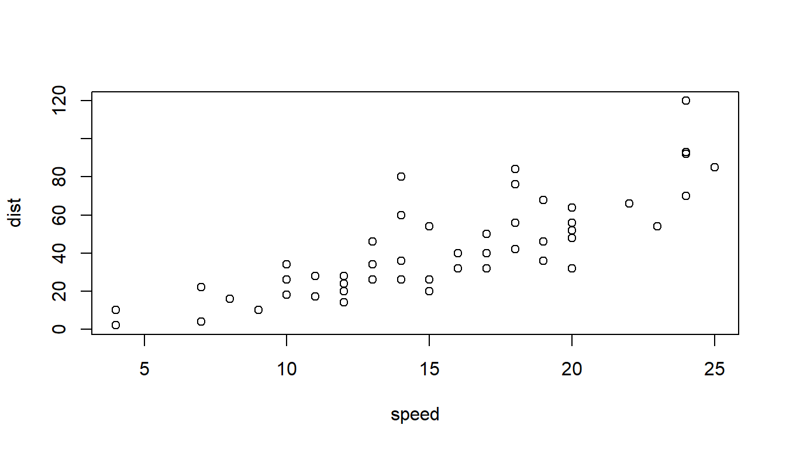
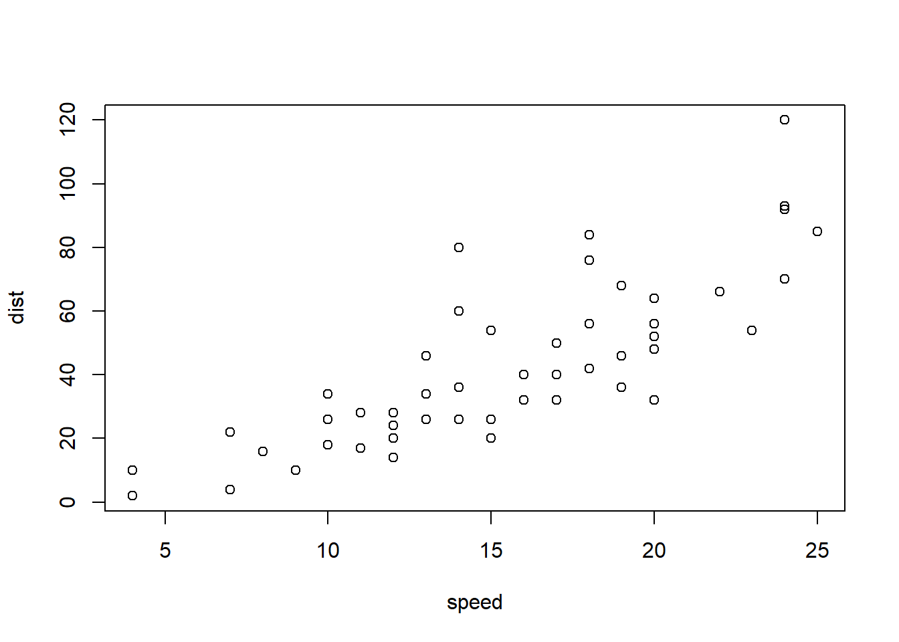
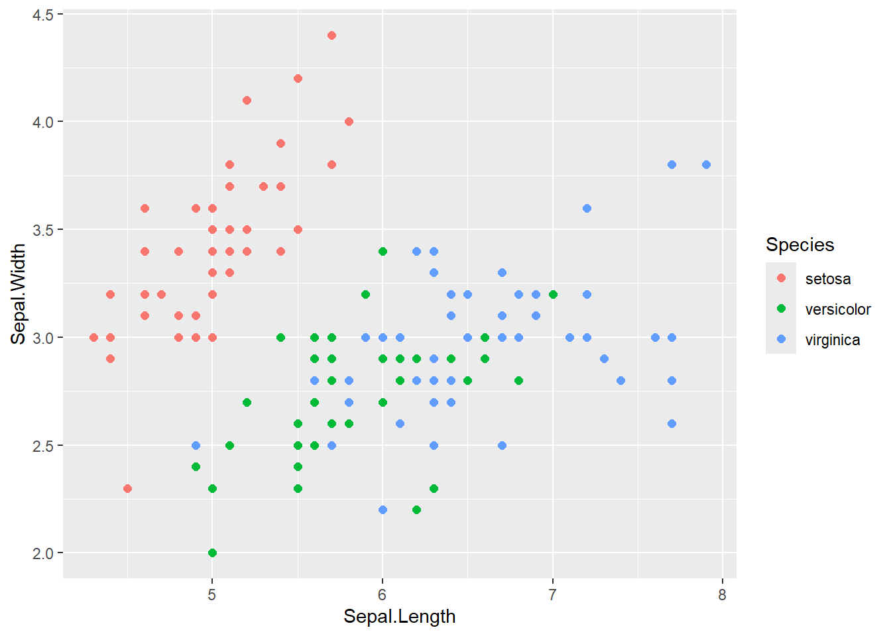

# 38  Quarto：chunkとchunk option

Code

- [Show All Code](javascript:void(0))

- [Hide All Code](javascript:void(0))

- 

  ------------------------------------------------------------------------

- [View Source](javascript:void(0))

## 38.1 chunk

R markdownでRのコードを書くときには、**chunk**というものを用います。QuartoでもR markdownと同じく、chunkを用いてコードを書きます。chunkではbacktick3つ（```` ``` ````）の後にプログラミング言語の名前（Rの場合は`r`）を中括弧の中（`{}`）に記載します。次の行以降にRのスクリプトを書き、最後にbacktick3つ（```` ``` ````）を記載します。backtickの間のコードはQuartoをRenderする際に実行されます。

```` markdown
```{r}
# この間にコードを記載する
a <- c(1, 2, 3, 4, 5)
a
```
````

``` r
# この間にコードを記載する
a <- c(1, 2, 3, 4, 5)
a
## [1] 1 2 3 4 5
```

chunkはRだけではなく、Pythonのコード、Markdownを書き下すとき、[37章](chapter37.llms.md#フローチャートなど)で説明した[Mermaid](https://mermaid.js.org/)や[Graphviz](https://graphviz.org/)などを用いる場合にも使用します。

```` markdown
```{python}
a = [1, 2, 3, 4, 5] # リスト（Rにはない記法）
print(a)
```
````

```` markdown
```{markdown}
 # 変換されず、そのまま表示される
```
````

Rstudioでは、**Ctrl+ALT+ICtrl+ALT+I**のショートカットで文章にチャンクを挿入することができます。

> **TIP:**
>
> 上記のように、PythonのchunkがRのQuartoに含まれている場合には、[`reticulate`](https://rstudio.github.io/reticulate/)パッケージ([Ushey et al. 2025](#ref-reticulate_bib))（reticulated python、*Malayopython reticulatus*、和名：[アミメニシキヘビ](https://en.wikipedia.org/wiki/Reticulated_python)より）により、Pythonのコードが実行されます。`reticulate::repl_python`関数を実行すると、コンソールの記号が`>>>`に変化します。この記号が出ているときには、コンソールはPythonを実行するモードになっています。`exit`と入力することでPython実行モードからRの実行モードに戻すことができます。
>
> Pythonのみを利用したQuartoでは、knitrではなくpython3というエンジン（Jupyterと同じものだと思います）が利用されるため、reticulateは呼び出されません。

## 38.2 chunk option

chunkには**chunk option**と呼ばれる、chunk実行時の設定を変更する機能があります。chunk optionは**chunkの`{}`の中**に以下のように記載し、用います。

```` markdown
```{r, eval = FALSE}
# eval = FALSEはコードを実行しない際のchunk option
knitr::kable(iris[1:2, ])
```
````

[35章](chapter35.llms.md)に示した通り、主なchunk optionには以下のようなものがあります。

| オプション名 | 意味                     |
|:-------------|:-------------------------|
| echo         | コードを表示するかどうか |
| error        | エラーで停止するかどうか |
| eval         | コードを評価するか       |
| messagee     | メッセージを表示するか   |
| warning      | warningを表示するか      |
| results      | 結果の表示方法の指定     |
| fig.align    | 図の位置（“center”など） |
| fig.width    | 図の幅                   |
| fig.height   | 図の高さ                 |
| out.width    | 図の出力時の幅調整       |
| collapse     | コードと結果の折り畳み   |
| filename     | チャンク名の設定         |

例えば、パッケージの読み込み時にメッセージが出る場合には`message=FALSE`を設定することで、メッセージが表示されないようにすることができます。エラーが出る処理を出力したいのであれば`error=TRUE`を、Rでの演算を実行したくない場合は`eval=FALSE`を、Rのスクリプトを表示したくない場合には`echo=FALSE`を設定するとよいでしょう。

:::{callout-tip collapse=“true”} \## chunk optionとYAMLの設定：echoとcode-fold

YAML・chunk optionのどちらでも、`echo`や`code-fold`を指定することはできますが、YAMLで`code-fold: false`、chunkで`echo=FALSE`と、矛盾する指定を行うとエラーが出てRenderできなくなります。 :::

### 38.2.1 chunk optionの記載位置について

このchunk optionについては、QuartoではR markdownより大幅に拡張されています。例えば[前章で説明したレイアウト](chapter37.llms.md#描画の幅の設定)に関しては、chunk optionに記載することでも設定することができます。

chunk optionがたくさんあるため、`{}`の中にchunk optionを記載すると読みにくく、管理しにくくなります。Quartoでは以下のように、chunkの中に`#|`に続けて記載することで、chunk optionを設定できます。この場合、`=`を用いて指定していた値は、YAMLのように`:`を用いて記載します。

```` markdown
```{r}
#| message: false
#| column: margin

plot(cars)
```
````

``` r
plot(cars)
```

[](chapter38_files/figure-html/unnamed-chunk-9-1.png)

`column`に設定する幅には、`margin`の他に`body`、`page`、`screen`の3つに加えて、`-outset`、`-inset`の2種、`-right`、`-left`の2つを後につけることで、表示する幅をコントロールすることもできます。

### 38.2.2 図のキャプションやコード表示の指定：fig-cap/echo

chunk optionには、出力される図（グラフなど）のキャプション（`fig-cap`）、図を読み出すことが出来ないときに表示されるテキスト（`fig-alt`）などを設定することもできます。

また、以下のように`echo: fenced`を設定すると、表示されるコードにchunkが付いた形で表示されます。

```` markdown
```{r}
#| filename: "様々なchunk optionの設定"
#| fig-cap: "figure caption：出力した図にキャプションが付く（cap-location: marginなので右に表示）"
#| fig-alt: "図が読みだせません"
#| fig.height: 4
#| cap-location: margin

plot(cars)
```
````

[](chapter38_files/figure-html/unnamed-chunk-10-1.png "figure caption：出力した図にキャプションが付く（cap-location: marginなので右に表示）")

figure caption：出力した図にキャプションが付く（cap-location: marginなので右に表示）

また、`echo:fenced`の代わりに、括弧を2重（`{{}}`）にすることでもchunkを表示させることができます。ただし、この方法では他のオプションを指定しにくいため、`echo:fenced`を用いた方がよいでしょう。

### 38.2.3 出力の表示方法の変更：results: asis

以下の例のように、`cat`関数の返り値は通常文字列の返り値として、以下のように表示されます。

```` markdown
```{r, filename = "通常の出力", echo="fenced"}
cat("[マークダウン](https://daringfireball.net/projects/markdown/)を**そのまま**表示する\n")
```
````

    [マークダウン](https://daringfireball.net/projects/markdown/)を**そのまま**表示する

`results: asis`はchunkの演算結果を通常の結果の表示方法ではなく、Markdownとしてそのまま出力するためのオプションです。`results: asis`を設定すると返り値が通常のMarkdownとして取り扱われ、リンクや太字の表示がMarkdownに従い変換されます。使いどころは難しいのですが、Rの出力の表示を変えたいときには使うことがあるかもしれません。

```` markdown
```{r, echo="fenced", filename = "results: asis"}
#| results: asis

cat("[マークダウン](https://daringfireball.net/projects/markdown/)を**変換して**表示する\n")
```
````

[マークダウン](https://daringfireball.net/projects/markdown/)を**変換して**表示する

### 38.2.4 図を複数列に並べて表示する：layout-ncol

`layout-ncol`を用いることでRの出力するグラフを2列に並べることができます。

```` markdown
```{r, echo = FALSE}
#| layout-ncol: 2

plot(cars)
ggplot(iris, aes(x = Sepal.Length, y = Sepal.Width, color = Species)) + geom_point(size=2)
```
````

[](chapter38_files/figure-html/unnamed-chunk-14-1.png)

[](chapter38_files/figure-html/unnamed-chunk-14-2.png)

### 38.2.5 コードの表示を折りたたむ：code-fold/code-overflow

また、コードを折りたたむ場合には`code-fold: true`、長いコードを折り返し表示したい場合には`code-overflow: wrap`を指定します。

```` markdown
```{r}
#| echo: fenced
#| code-overflow: wrap
#| code-fold: true
#| eval: false

print("Lorem ipsum dolor sit amet, consectetur adipiscing elit, sed do eiusmod tempor incididunt ut labore et dolore magna aliqua. Ut enim ad minim veniam, quis nostrud exercitation ullamco laboris nisi ut aliquip ex ea commodo consequat.")
```
````

Code

```` markdown
```{r}
#| code-overflow: wrap
#| code-fold: true
#| eval: false

print("Lorem ipsum dolor sit amet, consectetur adipiscing elit, sed do eiusmod tempor incididunt ut labore et dolore magna aliqua. Ut enim ad minim veniam, quis nostrud exercitation ullamco laboris nisi ut aliquip ex ea commodo consequat.")
```
````

### 38.2.6 コードの行に番号を付ける：code-line-numbers

`code-line-numbers`はコードの行に番号をつけるためのオプションです。`true`に指定することで、コードの行の頭に数字が付きます。後で説明するcode annotationという機能よりは簡潔に行数を表示し、説明しやすくすることができます。

```` markdown
```{r, filename = "code-line-numbersを指定する"}
#| code-line-numbers: true
#| eval: false

a <- 1
b <- 2
a + b
```
````

``` numberSource
a <- 1
b <- 2
a + b
```

### 38.2.7 実行結果をキャッシュする：cache

[cache](https://ja.wikipedia.org/wiki/%E3%82%AD%E3%83%A3%E3%83%83%E3%82%B7%E3%83%A5_(%E3%82%B3%E3%83%B3%E3%83%94%E3%83%A5%E3%83%BC%E3%82%BF%E3%82%B7%E3%82%B9%E3%83%86%E3%83%A0))（キャッシュ）とは、演算結果を保存しておくことで、コードを書き換えない時には以前に保存した結果を、コードを書き換えた時には新たな演算を実行するための、chunkの機能のことです。計算が重いchunkでは`cache:true`と設定しておくと、Renderするときの演算の時間を省略できます。

```` markdown
```{r}
#| cache: true

replicate(1000000, rnorm(1)) |> head()
```
````

## 38.3 code annotation

code annotationとは、実行するRコードの行に番号を付け、その番号を引用して説明文を加えることができる、chunkの機能のことです。コードの内容を説明するときに使用すると、わかりやすいコードの説明を作成することができます。

code annotationを用いる場合には、コードの行に`# <1>`などの数値を加え、chunkの下に箇条書き（`1. XXX`など）を記載します。箇条書きの数値の記載と、`# <1>`の数値が対応し、コードと箇条書きの両方に同じ形の番号が示されます。

```` markdown
```{r}
library(palmerpenguins)
penguins$species |> levels() # <1>
penguins |> 
  group_by(species) |> 
  summarise(mean_bm = mean(na.omit(body_mass_g))) # <2>
```

1. penguinsには3種のペンギンのデータが含まれる
2. ジェンツーペンギンは一回り大きい
````

``` r
library(palmerpenguins)
penguins$species |> levels() # <1>
penguins |> 
  group_by(species) |> 
  summarise(mean_bm = mean(na.omit(body_mass_g))) # <2>
```

1.  penguinsには3種のペンギンのデータが含まれる
2.  ジェンツーペンギンは一回り大きい

    [1] "Adelie"    "Chinstrap" "Gentoo"   
    # A tibble: 3 × 2
      species   mean_bm
      <fct>       <dbl>
    1 Adelie      3701.
    2 Chinstrap   3733.
    3 Gentoo      5076.

## 38.4 インラインのコード

Quartoでは、chunkを書かずに、Markdownの文中でRを実行することもできます。例えば、chunkを用いて演算結果を変数に代入します。

``` r
temp <- rnorm(1)
```

次に、以下のように、`{r}`で囲い、Markdownの文中に記載することで、その文中のRのコードを実行することが出来ます。

``` markdown
変数`temp`には`{\r} temp`が代入されている。 # バックスラッシュは不要
```

変数`temp`には0.665197が代入されている。

------------------------------------------------------------------------

ただし、このインラインコードに長いスクリプトを書いてしまうと理解しにくいため、上記のように変数を呼びだす程度の利用にとどめる方がよいでしょう。

Ushey, Kevin, JJ Allaire, and Yuan Tang. 2025. *Reticulate: Interface to ’Python’*. <https://CRAN.R-project.org/package=reticulate>.

Back to top
