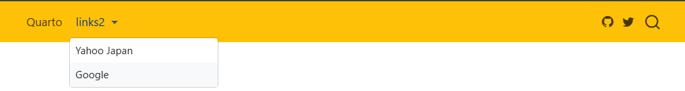
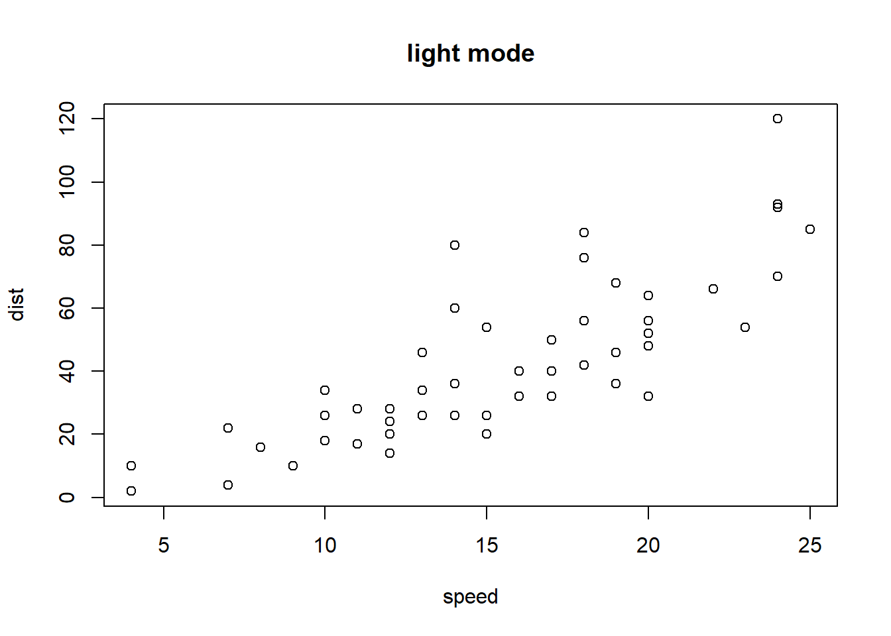
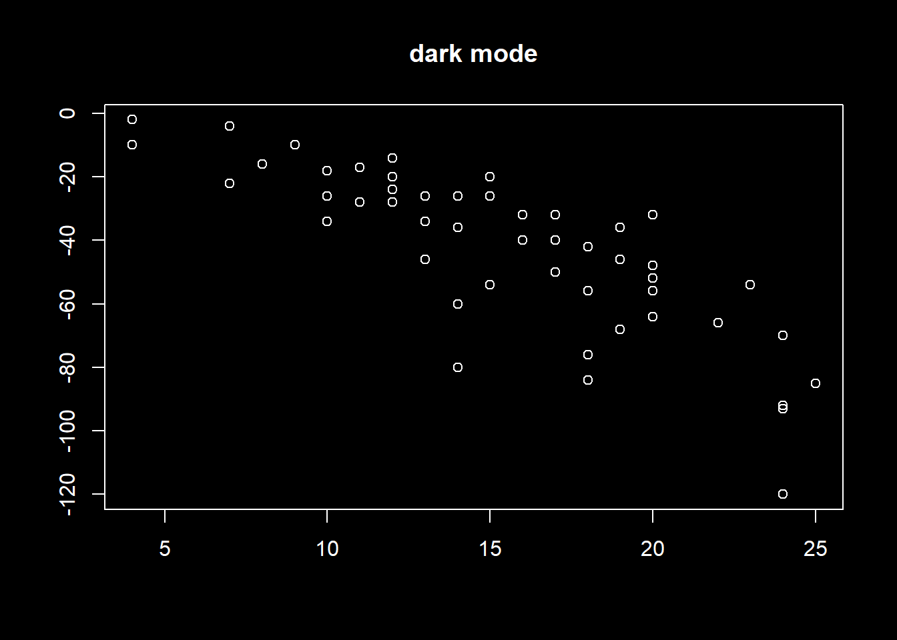
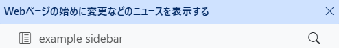
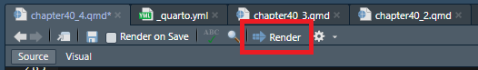
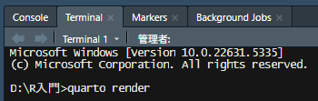
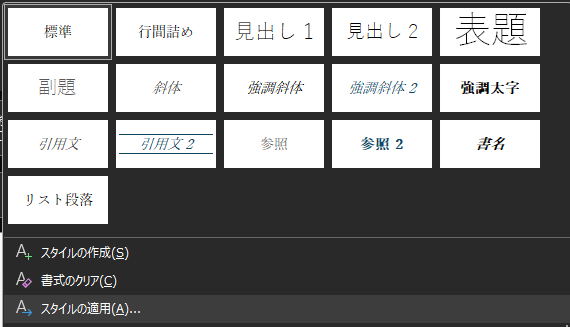

# 39  Quarto：YAMLの基礎

Code

## 39.1 YAMLとは？

[35章](chapter35.llms.md#yaml)でも少し説明しましたが、R markdown・Quartoでは、文章全体に関する設定を、文頭の**YAML**という部分に記載します。YAMLは以下のように、`---`で囲まれた領域に記載し、その文章の`title`（題名）や`author`（著者）、`date`（作成日）や`output`（出力するファイル形式）などの設定を`:`（コロン）でつないで記載する形式のテキストです。

``` yaml
---
title: "Untitled"
author: "xjorv"
date: "2024-06-29"
output: html_document
---
```

Quartoでは、このYAMLが非常に拡張されており、YAMLを文頭に書くと文章がいつまでたっても始まらない、という場合があるほどに設定できる項目がたくさんあります。

R markdownを利用し始めた初期の頃はYAMLを文頭に書いて問題はありませんでしたし、シンプルな文章を作成するだけであれば今でもQuartoの文頭にYAMLを記載しても問題ありません。

ただし、複雑な文章、例えばこのテキストのような**Quarto Book**を作成したいときや、ブログを作成するような場合、Reveal.jsなどを用いたプレゼンテーションを作成する場合や、インタラクティブなダッシュボードを作成するような場合には、YAMLを文頭に書くと非常に煩雑になり、読みにくくなってしまいます。

従って、Quartoを用いる場合には、YAMLは基本的に別ファイルとして作成する方がよいでしょう。QuartoのYAMLは**`_quarto.yml`**というファイルにまとめて書くことが出来ます。`_quarto.yml`には、`---`を書く必要はなく、YAMLを直接書くことができます。`_quarto.yml`を.qmdファイルと同じフォルダに保存しておけば、.qmdファイルをRenderする際に勝手に`_quarto.yml`を読み込み、文章の形式をYAMLで指定した通りに整えてくれます。

[このテキストの`_quarto.yml`](https://github.com/sb8001at-oss/Rnyuumon/blob/master/_quarto.yml)を見ていただければ、どのようにYAMLを`_quarto.yml`に書くのか、イメージしやすいかと思います。

以下では、まず基礎となるYAMLの項目とその機能について説明し、その後別章でHTMLとWebsite、Quarto Books（HTMLを出力）、Reveal.js（HTMLによるプレゼンテーションを出力）、[Dashboards](https://ja.wikipedia.org/wiki/%E3%83%87%E3%82%B8%E3%82%BF%E3%83%AB%E3%83%80%E3%83%83%E3%82%B7%E3%83%A5%E3%83%9C%E3%83%BC%E3%83%89)を作成する場合のYAMLについて順に説明していきます。

## 39.2 YAMLの構造

YAMLは以下のように階層構造を取ります。各階層のYAMLにそれぞれ値を設定します。

``` yaml
book:
  title: "R入門"
  author: "xjorv"
  page-footer:
    right: |
      <a href="https://quarto.org/">Quarto</a>を用いてこの本を作成しました
    left:
      - © xjorv, 2025

  sidebar:
    style: docked
    background: light
    tools: 
      - icon: github
        menu: 
          - text: ソースコード
            href: https://github.com/sb8001at-oss/Rnyuumon
```

[](./image/YAML_str.png "YAMLの構造")

YAMLの構造

YAMLでは、`要素: 値`の形で、その要素の値を設定します。`:`と`値`の間にはスペースが必要です。

また、`要素:`の次の行にインデント（前のスペース）を入れると、その要素の小項目を設定できます。例えば、上記のYAMLのうち、以下の`book`のYAMLでは、`title`、`author`を小項目として設定しています。

小項目の前には`-`を入れる場合と入れない場合がありますが、小項目を箇条書きとする場合に`-`を入れるのが元々の[YAMLのルール](https://yaml.org/spec/1.2.2/)となっています（Quartoでは直下の項目とセットで評価するときなどに追加します）。`|`はlinebreakを明示するときに用います。

``` yaml
book:
  title: "R入門"
  author: "xjorv"
```

## 39.3 文章のフォーマット

QuartoをRenderすることで作成できるファイルには、以下のようなものがあります。

- HTML（Books、Websitesを含む）：Webブラウザで表示するファイル形式
- PDF：Adobeが管理している文章ファイル形式
- MS word：MicrosoftのWordファイル
- [Typst](https://typst.app/)：Latex的な組版ファイル形式
- [Open Document](https://ja.libreoffice.org/discover/what-is-opendocument/)：Open officeのWord的なファイル形式
- [ePub](https://ja.wikipedia.org/wiki/EPUB)：Web上で論文を表示する際に用いられるファイル形式
- [Reveal.js](https://revealjs.com/)：HTMLで作成するプレゼンテーションファイル形式
- PowerPoint：MicrosoftのPowerPointファイル
- [Beamer](https://ja.overleaf.com/learn/latex/Beamer)：Latexでプレゼンテーションを作成するファイル形式
- Dashboards：HTML上でデータを表示するための形式

これらのファイル形式（`format`）は、YAMLで以下のように設定します。

``` yaml
---
format: html
---
```

`format`で設定できるパラメータとファイル形式の関係は以下の通りです。

| YAMLでのformat設定 | 出力されるファイル形式 |
|:-------------------|:-----------------------|
| html               | HTML                   |
| pdf                | PDF                    |
| docx               | MS word                |
| typst              | Typst                  |
| odt                | Open Document          |
| epub               | ePub                   |
| revealjs           | Reveal.js              |
| pptx               | Powerpoint             |
| beamer             | Beamer                 |
| dashboard          | Dashboards             |

また、やや複雑なのですが、HTMLのうちQuarto BookとWebsite、Manuscriptなどに関しては`format`ではなく、`project`の下のカテゴリとして、`type`に設定する形となっています。

``` yaml
---
project: 
  type: book
---
```

この`project: type:`以下に設定するパラメータは以下の5つです。projectとtypeに関しては[42章](chapter42.llms.md)で詳しく説明します。

| YAMLでのproject設定 | 出力されるファイル形式           |
|:--------------------|:---------------------------------|
| book                | Quarto Books（HTML）             |
| website             | Website（HTML）                  |
| manuscript          | 論文（HTML）                     |
| confluence          | confluence（Wiki的な文書、HTML） |
| default             | デフォルト（HTML）               |

QuartoをRenderする際には、Rendering Engine（Rの場合はknitr）が`format`、`project`を読み込み、設定したファイル形式で出力してくれます。

## 39.4 文書のタイトルと著者

Quartoは論文を執筆する際に用いることも想定しているため、文書の情報（タイトル、著者など）を設定するためのYAMLがたくさん設定されています。以下に設定できるYAMLの要素と意味を示します。

| YAMLでの設定項目 | 設定項目のデータ型 | 設定項目の意味 |
|:---|:---|:---|
| title | 文字列 | 文章のタイトル |
| subtitle | 文字列 | 文章のサブタイトル |
| date | 文字列 | 作成日 |
| date-modified | 文字列 | 改定日 |
| author | 文字列 | 著者 |
| author: name | 文字列 | 著者名 |
| author: email | 文字列 | 著者のe-mail |
| author: phone | 文字列 | 著者の電話番号 |
| author: degrees | 文字列 | 著者の学位 |
| author: affiliation | 文字列 | 著者の所属 |
| author: roles | 文字列 | 著者の役割 |
| abstract | 文字列 | 文章の要約 |
| abstract-title | 文字列 | 要約のタイトル |
| doi | 文字列 | [DOI](https://ja.wikipedia.org/wiki/%E3%83%87%E3%82%B8%E3%82%BF%E3%83%AB%E3%82%AA%E3%83%96%E3%82%B8%E3%82%A7%E3%82%AF%E3%83%88%E8%AD%98%E5%88%A5%E5%AD%90) |
| license | “CC BY”などの文字列 | [Creative Commons](https://creativecommons.org/)のライセンス表示 |
| copyright | 文字列 | Creative Commons以外の版権の記載 |
| version | 数値または文字列 | 文章のバージョン |

`author`などの項目は上記の`book`などの小項目として設定することもできますし、より上位の項目として設定しても特に問題ありません。`author`、`title`等を設定すると、文頭にタイトル、著者、要約等が記載されます。

[](./image/author_title.png "タイトルや著者の表示")

タイトルや著者の表示

[QuartoのFront Matter](https://quarto.org/docs/authoring/front-matter.html#authors-and-affiliations)のページに著者に関する設定方法が記載されていますので、より詳細な設定を行う場合には参考にして下さい。

## 39.5 Table of contents (TOC)

Table of contents（TOC）とは、このページの右に表示されている、そのページの章立てを示すためのものです。項目をクリックすることでその項目の部分に移動することができます。このTOCについては、TOCを表示するかどうか、TOCの深さ（ヘッダーのうち、Header2（`## Header2`）までをTOCに表示するのか、Header 3（`### header 3`）まで表示するのか）、TOCを表示する位置、TOCのタイトル、TOCの折りたたみ（このテキストではHeader 3以降を折りたたんでいます）などをYAMLで設定します。

[](./image/toc.png "Table of contents")

Table of contents

``` yaml
format:
  html:
    toc: true # TOCを表示する
    toc-location: right # TOCを右に表示
    toc-title: "Quarto" # TOCのタイトルは"Quarto"に
    toc-depth: 4 # TOCはHeader 4まで表示
    toc-expand: 2 # Header 2以降は折りたたむ
```

TOCに関するYAMLの設定項目を以下に示します。

| YAMLでの設定項目 | 設定項目のデータ型          | 設定項目の意味              |
|:-----------------|:----------------------------|:----------------------------|
| toc              | true / false                | TOCの表示/非表示            |
| toc-depth        | 数値                        | TOCに表示するヘッダーの深さ |
| toc-location     | “body”, “left”, “right”など | TOCの表示場所               |
| toc-title        | 文字列                      | TOCに表示するタイトル       |
| toc-expand       | 数値                        | TOCの折りたたみの深さ       |

### 39.5.1 セクションに番号をつける

TOCに加えて、TOCで表示される章の項目（セクション）に番号をつけるためのYAMLが、`number-sections`です。YAMLで`number-sections: true`を設定すると、表題に番号が自動的に付けられます。番号をつけたくないセクションには、ヘッダー表記の後に`{.unnumbered}`をつけます。この`{.unnumbered}`を付けたセクションには番号がつかず、そのセクションを飛ばして番号が付与されます。

``` yaml
---
format: 
  html: 
    toc: true
    number-sections: true
---
```

``` markdown
## 番号をつけたくないセクション {.unnumbered}
```

## 39.6 文章の言語（lang）

Quartoで作成している文章の言語はデフォルトでは英語です。ですので、例えばTOCの題名はデフォルトでは「Table of contents」と英語で表示されます。このような表示を他の言語に変更する場合には、YAMLで`lang`を設定します。`lang`のデフォルトは`lang: en`です。`lang: ja`と設定することで表示を日本語に変更することが出来ます。

``` yaml
---
lang: ja # 日本語表示を用いる
---
```

> **TIP:**
>
> `lang`に関する設定ファイルについてはgithubで確認することができます。
>
> [\_language-ja.yml](https://github.com/quarto-dev/quarto-cli/blob/main/src/resources/language/_language-ja.yml)
>
> このファイルを見ていただくとわかる通り、`lang`で設定できるのは、表題などの一部の要素で、pdfの言語設定などを変更できるものではありません。`lang`を設定しても、pdfを出力した際の`ggplot2`の文字化けなどは特に修正されません。

## 39.7 ナビゲーション

ナビゲーションとは、このテキストでは左側に表示されている、そのHTMLの構造や章立てを示す部分のことです。QuartoからHTMLを出力する場合、このナビゲーションをページの上（`navbar`）と左側（`sidebar`）に表示させることができます。このテキストでは`navbar`を用いず、`sidebar`のみ用いていますが、逆に`navbar`だけを用いることもできます。`navbar`や`sidebar`は、以下の例のようにformatやprojectの小項目として設定し、さらに`navbar`や`sidebar`の小項目として、そのナビゲーションの設定項目を指定していきます。

``` yaml
book:
  navbar:
    search: true
  sidebar:
    style: "docked"
```

> **TIP:**
>
> QuartoのYAMLでは、設定項目の上位・下位要素をどこに記載したらよいのかよくわからない場合が割とあります。YAMLの設定項目を指定しても思い通りの出力が得られない場合には、[QuartoのGuide](https://quarto.org/docs/guide/)に記載されているYAMLの例を真似てみたり、[Quartoのgithubレポジトリ内の`_quarto.yml`](https://github.com/quarto-dev/quarto-web/blob/main/_quarto.yml)を見てみたり、Quarto bookなどのgithubのレポジトリに保存されている`_quarto.yml`を確認し、真似てみるのが良いでしょう。

### 39.7.1 navbar

`navbar`で設定できる主な項目は以下の通りです。`navbar`の設定を.qmd内に`---`で囲まれたブロックに記載すると表示されないので、`_quarto.yml`に記載するようにしましょう。

| YAMLでの設定項目 | 設定項目のデータ型 | 設定項目の意味 |
|:---|:---|:---|
| title | 文字列 | navbarに表示するタイトル |
| logo | 画像までのパス（文字列） | navbarに表示する画像（ロゴ） |
| search | true / false | 検索欄を設ける |
| background | “primary”, “secondary”, “light”など | navbarの色 |
| left: | 設定なし（下位項目を設定） | 左に下位項目の要素を配置 |
| right: | 設定なし（下位項目を設定） | 右に下位項目の要素を配置 |
| left: -text: href: | text: 文字列 href: リンクアドレス | 左にリンクを設定 |
| right: -text: href: | text: 文字列 href: リンクアドレス | 右にリンクを設定 |
| left: icon | “github”, ”twitter”, “share”など | 左にgithubなどのアイコンを表示 |
| tools: menu: | 設定なし（下位項目にリンクを設定） | リンクを▼の項目として表示 |
| pinned | true / false | navbarを固定する |
| collapse | true / false | navbarを▼の項目として短く表示 |

以下に`navbar`の設定の例を示します。`search: true`で右端の検索マーク、`tools`でgithubやtwitter（x）のリンク、`left: menu`で▼のリンクにYahooとGoogleを設定しています。リンクでは同じフォルダ内の`.qmd`ファイルを指定することもできます。

``` yaml
project: 
  type: website
  
title: "文章のタイトル"
    
website:
  navbar: 
    search: true
    background: "warning"
    title: false
    pinned: true
    tools:
      - icon: "github"
        href: "https://github.com/"
      - icon: "twitter"
        href: "https://x.com/"
        
    left:
      - text: "Quarto"
        href: "https://quarto.org/"
      - text: "links2"
        menu: 
          - text: "Yahoo Japan"
            href: "https://www.yahoo.co.jp/"
          - text: "Google"
            href: "https://www.google.co.jp/"
```

[](./image/Quarto_navbar.png "上記のYAMLで表示されるnavbar")

上記のYAMLで表示されるnavbar

> **TIP:**
>
> `search`は、RenderしたHTMLが保存されるフォルダ内に`search.json`というファイルを作成し、`search.json`から単語を検索するような形で機能します。検索はHTMLをRenderしただけでは使えず、Github Pagesなどにデプロイした際に機能するようになります。また、[Algolia](https://www.algolia.com/)という検索サービスを利用することもできます。`search`の設定の詳細については[Quartoのsearchのページ](https://quarto.org/docs/websites/website-search.html)を参考にして下さい。

### 39.7.2 sidebar

`sidebar`は左側に表示されているナビゲーションで、`navbar`と同じようにリンク等を配置することができます。`sidebar`で指定できる設定項目は以下の表の通りです。

| YAMLでの設定項目 | 設定項目のデータ型 | 設定項目の意味 |
|:---|:---|:---|
| logo | 画像へのパス（文字列） | sidebarに表示するロゴ |
| search | true / false | 検索欄を設ける |
| tools | 設定なし（下位項目にリンクを設定） | githubなどのリンクを設定 |
| contents | .qmdファイル名（文字列） | .qmdへのリンク |
| style | “docked” / “floating” | スクロールに対する反応の設定 |
| background | カラーコード（文字列） | 背景色の設定 |
| foreground | カラーコード（文字列） | 文字などの色の設定 |
| border | true / false | 境界線の表示 |
| alignment | “left”, “right”, “center” | 表示を揃える方法 |
| collapse-level | true / false | contentsの表示を折りたたむ |
| pinned | true / false | sidebarの折りたたみの表示設定 |
| header | 文字列, パス | ヘッダーの要素 |
| footer | 文字列, パス | フッターの要素 |

以下に`sidebar`の設定の例を示します。このテキストの[`_quarto.yml`](https://github.com/sb8001at-oss/Rnyuumon/blob/master/_quarto.yml)を見ていただければ設定の参考になると思います。

``` yaml
project: 
  type: website
    
website:
  sidebar: 
    search: true
    style: docked
    background: light
    tools: 
      - icon: github
        menu: 
          - text: ソースコード
            href: https://github.com/
    contents:
      - example_navbar.qmd # titleはこの.qmd内でYAMLとして設定する
      - example_sidebar.qmd
```

[](./image/Quarto_sidebar.png "上記のYAMLで表示されるsidebar")

上記のYAMLで表示されるsidebar

### 39.7.3 フッター（footer）

フッターは文書の最後に表示されるテキストやリンクのことです。コピーライトや利用しているツール名、ソースコードへのリンクや、企業であれば企業ページへのリンク、規約に関するリンクなどを置く部分です。フッターは以下のような形で`page-footer`の項目に設定します。

``` yaml
website:
  page-footer:
    right: |
      <a href="https://quarto.org/">Quarto</a>を用いてこの本を作成しました
    left:
      - © xjorv, 2025
```

[](./image/Quarto_page_footer.png "フッターの表示")

フッターの表示

この他のナビゲーション等については、[QuartoのGuide](https://quarto.org/docs/reference/projects/websites.html)を参考にして下さい。

## 39.8 chunk optionをYAMLで設定する

[38章](chapter38.llms.md)で説明したchunk optionは，各chunkに設定するだけでなく，YAMLとして設定することもできます．YAMLとしてchunk optionを設定すると，その文章のすべてのchunkに指定したchunk optionが適用されます．

``` yaml
---
execute:
  eval: false # すべてのchunkでコードを実行しない
  warning: false # すべてのchunkでwarningを表示しない
  cache: true # すべてのchunkでcacheを適用する

format:
  html: # formatはpdfやwordでも可
    code-fold: true # すべてのchunkコードを折りたたむ（HTMLは対応）
    fig-width: 8 # グラフ等の幅の指定
    fig-height: 6 # グラフ等の高さの指定
---
```

詳細については，Quartoの[Excecution Options](https://quarto.org/docs/computations/execution-options.html)を参照してください．

## 39.9 HTML固有のYAMLの設定

### 39.9.1 HTMLの要素をすべてHTMLに含める（Self contained）

QuartoでHTMLをRenderすると、HTMLだけでなく、別途フォルダが出力されます。このフォルダには、HTML内の画像や、JavaScriptなどのHTMLの要素が含まれています。HTMLはこのフォルダ内のファイルを読み込んで表示する仕組みになっているため、HTMLだけではうまく開くことができません。

このようなHTMLの要素を、HTMLにすべて埋め込んでしまうための設定がSelf contained HTMLというものです。このSelf contained HTMLでは、Renderで出力されるファイルがHTMLのみになり、画像やその他の要素はHTMLにすべて埋め込まれます。この形のHTMLであれば、HTMLだけでもブラウザで表示することができます。

Self contained HTMLを出力する場合、以下のようにYAMLに`embed-resources: true`を設定します。

``` yaml
format:
  html:
    embed-resources: true
```

### 39.9.2 theme

QuartoでHTMLをRenderする場合、ウェブサイト全体のデザイン・色調（theme）は[Bootswatch](https://bootswatch.com/)のthemeに従います。特に指定しない場合、themeは[default](https://bootswatch.com/default/)に設定されます。

themeを別のものに変更する場合、以下のようにYAMLを設定します。

``` yaml
format:
  html:
    theme: united
```

上記のように設定すると、HTMLは[united](https://bootswatch.com/united/)のデザインに従います。

また、以下のようにYAMLを設定すると、明るいモード（light mode）と暗いモード（dark mode）をそれぞれ設定し、[トグルボタン](https://en.wikipedia.org/wiki/Toggle_switch_(widget))でデザインを変更できるようにもできます。

``` yaml
format:
  html:
    theme: 
      light: united
      dark: cyborg
```

上記のように`light`と`dark`のthemeをそれぞれ設定すると、sidebarの上にトグルボタンが表示されるようになります。上のYAMLの例では、light modeは[united](https://bootswatch.com/united/)、dark modeは[cyborg](https://bootswatch.com/cyborg/)で表示されます。トグルボタンを操作することで、light modeとdark modeを切り替えることができます。

HTMLのデザインに関しては、Bootswatchのデザインをカスタマイズしたり、自分で[scss](https://sass-lang.com/)を準備してデザインを変更することもできます。詳しくは[QuartoのHTML Theming](https://quarto.org/docs/output-formats/html-themes.html)を参考にしてください。

#### 39.9.2.1 themeにより図の色を変える

上記の通り、`theme`を用いるとlight modeとdark modeを切り替えることが出来ます。ただし、chunkを実行し、表示した図（`ggplot2`のグラフなど）はlight modeでもdark modeでも同じ明るさ、つまりデフォルトの白バックのグラフとして表示されます。このグラフの表示を明るさのモードによって変更したい場合には、以下のようにchunk optionとして`renderings: [light, dark]`を設定します。下記のグラフのように、`renderings: [light, dark]`を用いると明るさのモードによって表示する図自体を変えることもできます。

```` markdown
```{r, filename="明るさのモードに従い図の色を変える"}
#| renderings: [light, dark]
par(bg = "#FFFFFF", fg = "#000000")
plot(cars, main = "light mode") # light modeで表示

par(bg = "#000000", fg = "#FFFFFF", col.axis = "#FFFFFF", col.main = "#FFFFFF")
plot(cars$speed, -cars$dist, main = "dark mode") # dark modeで表示
```
````

[](chapter39_files/figure-html/unnamed-chunk-26-1.png)

[](chapter39_files/figure-html/unnamed-chunk-26-2.png)

### 39.9.3 favicon

[favicon](https://ja.wikipedia.org/wiki/Favicon)とは、ウェブサイトをブラウザで表示した際にタブの横に表示される小さな画像のことです。

[](./image/favicon_image.png "faviconのイメージ")

faviconのイメージ

Quartoでは、YAMLに`favicon:`を設定することでfaviconを設定し、タブの横に画像を置くことができます。この`favicon:`は、`.ico`というファイル形式で設定します。`.ico`はアイコンを指定するためのファイル形式です。ネット上には[faviconのジェネレータ](https://favicon-generator.mintsu-dev.com/)がたくさんありますので、ジェネレーターを利用すれば画像ファイルから`.ico`ファイルを作成することができます。faviconの画像は16×16pxが一般的ですが、もっと大きなファイルとして作成しても特に問題はありません。正方形の画像ファイルを作成し、faviconジェネレータで変換して用いるとよいでしょう。

``` yaml
---
format:
  html:
    favicon: favicon.ico
---
```

### 39.9.4 アナウンス

WebsiteやQuarto Booksにおいて、特別に表示して注意喚起したい場合には、アナウンスの設定を行うことができます。アナウンスは`website: announcement:`に文字列を記載する形で設定します。

``` yaml
---
website:
  announcement: 
    content: "**Webページの始めに変更などのニュースを表示する**" 
---
```

[](./image/Quarto_announcement.png "アナウンスの表示")

アナウンスの表示

> **TIP:**
>
> QuartoのRenderは、Rstudioではテキストエディタの上の「Render」ボタンを用いて実行できます。
>
> [](./image/Quarto_render_from_Rstudio.png "Renderボタン")
>
> Renderボタン
>
> ただし、一部のYAMLの機能（例えば上記のアナウンス）は、このボタンを押す方法では表示されません（`knitr` ver. 1.50）。このボタンを用いてうまく出力が表示されない場合には、[Quarto CLI](https://quarto.org/docs/get-started/)を用いたレンダリングを試すとよいでしょう。
>
> Rstudioでは、左下の「Console」のタブの横に、「Terminal」のタブがあります。この「Terminal」はProjectを開いた状態であれば、Projectのフォルダ（ディレクトリ）が指定された状態で表示されます。
>
> [](./image/quarto_render_from_terminal.png "TerminalでRenderを実行する")
>
> TerminalでRenderを実行する
>
> この「Terminal」に上の図のように、`quarto render`と入力してエンターキーを押すと、Rstudioのボタンを用いなくてもRenderを実行できます。
>
> ``` markdown
> quarto render
> ```
>
> この方法がQuarto CLIを用いたRenderとなります。CLIを用いるため、[Quartoのページ](https://quarto.org/docs/get-started/)からあらかじめCLIをダウンロードし、インストールしておく必要があります。
>
> Renderの方法によって出力が変わる場合があるため、困ったときは上記のCLIを用いてみるとよいでしょう。

### 39.9.5 コメントの入力欄の設定

QuartoでWebsite、Quarto bookを利用する場合には、読者のコメント欄を準備することもできます。

[](./image/Quarto_giscus.png "Giscusでのコメントの例")

Giscusでのコメントの例

YAMLでのコメント欄の追加には、3つのサービスを利用することができます。

- [Hypothesis](https://web.hypothes.is/): 文章の一部を選択し、その文章に関するコメントを残すことができるWebサービス
- [Utterances](https://utteranc.es/): githubのissuesを利用したコメント入力システム
- [Giscus](https://giscus.app/ja): githubのDiscussionsを利用したコメント入力システム

コメント欄を追加する場合、以下のように`comments:`の項目をYAMLに追加します。

``` yaml
website:
  comments: 
    hypothesis:
      theme: clean
      openSidebar: false
```

``` yaml
website:
  comments: 
    utterances:
      repo: sb8001at-oss/Rnyuumon.io
```

``` yaml
website:
  comments:
    giscus:
      repo: sb8001at-oss/Rnyuumon.io
```

いずれもあらかじめGithubでの設定が必要であったり（Utterances、Giscus）、コメントを入力するためにはログインが必要だったり（3つすべて、Hypothesisは独自のログインシステム、UtterancesやGiscusはGithubのアカウント）するため、簡単に利用できるものとは言い難いですが、これらのサービスを用いることで、静的なWebページでデータベースの管理を必要とせずコメントを残すことができます。

### 39.9.6 lightbox

[lightbox](https://ja.wikipedia.org/wiki/Lightbox)は[37章](chapter37.llms.md#lightbox)で説明した通り、Web上に表示された図をクリックすることで拡大して表示することができるようにする、JavaScriptで作成された機能の一つです。図をクリックすることで、イメージが拡大され、ブラウザ全面に図が表示されるようになります。

Quartoでは図・画像ごとにlightboxを設定することができますが、YAMLでlightboxを設定すると、文章内のすべての図・画像に適用することができます。`lightbox`の設定には、`true`、`false`、`auto`の3つがあり、`true`か`auto`に設定することで図が拡大されるようになります。`true`と`auto`の違いは、図のすべてに適用するか（`true`）、一部の図には適用しないようにできるか（`auto`）です。

``` yaml
lightbox: auto
```

### 39.9.7 コードの表示・コードツール

YAMLでは、Rのchunkを実行したときの表示方法の設定、コードツールの設定を行うことができます。コードツールとは、ソースコードの表示など、コードに関する機能を指します。

#### 39.9.7.1 chunkの表示に関するYAML

chunkの機能に関連するYAMLの項目には、chunk optionと一部機能が重複しているものもありますが、YAMLで設定すればひとつづつのchunkにoptionを設定することなく、すべてのchunkに機能を適用することができます。chunkの機能に関連するツールには、以下のようなものがあります。

| YAMLでの設定項目 | 設定項目のデータ型 | 設定項目の意味 |
|:---|:---|:---|
| code-fold | true / false / show | コードの折りたたみ |
| code-summary | 文字列 | 折り畳み時に表示される文字列 |
| code-overflow | scroll / wrap | 横幅を越えるコードの取り扱い |
| code-line-numbers | true / false | コードの行数の表示 |
| code-copy | true / false /hover | コピーボタンの表示 |
| code-link | true / false | コード内の関数にリンクを付ける |
| code-annotations | true / false | コードハイライトを適用するか |
| code-block-border-left | カラーコード（文字列） | 左の境界線の色 |
| code-block-bg | カラーコード（文字列） | 背景色 |
| highlight-style | スタイル名（文字列） | コードハイライトのスタイルの設定 |

これらのコードツールに関するいずれのYAMLの要素も、`format: html:`の下に設定します。

``` yaml
format:
  html:
    code-tools: true
    code-link: true
    code-block-bg: true
    code-block-border-left: "#31BAE9"
```

例えば、`code-link: true`を設定すると、コード内の関数にリンクをつけてくれます。このリンクは[rdrr.io](https://rdrr.io/)の関数のヘルプに繋がっており、関数をクリックすることで関数の意味を確認することができます。

ただし、この`code-link`には`downlit`([Wickham 2024](#ref-downlit_bib))と`xml2`([Wickham et al. 2025](#ref-xml2_bib))の2つのパッケージが必要な上、base Rの関数ぐらいにしかリンクがつきません。また、`knitr`以外のレンダリングエンジン（`jupyter`など）を用いる場合、つまりR以外の言語を用いる場合には利用できません。おまけぐらいに考えておくとよいでしょう。

``` downlit
class(iris) # classにリンクがついている
```

#### 39.9.7.2 コードツール

コードツールとは、ページのタイトルの右上にある、『\</\> Code』という部分のことを指します。この部分をクリックすると、そのページのソース（.qmdに記載されたコード・文）を表示することができます。

[](./image/Quarto_codetool.png "コードツール")

コードツール

``` yaml
format:
  html: 
    code-tools: true
```

また、`code-fold: true`を設定すると、コードツールからソースコードを全部折りたたむ・展開することができるようになります。

## 39.10 PDFを出力する

QuartoをPDFとして出力する場合、上記の通り`format: pdf`を設定します。PDFの出力では、Quartoは一度LaTeXに変換された後、そのLaTeXをPDFに変換することになります。このLaTeXからPDFへの変換には、LaTeXのエンジンを用います。LaTeXのエンジンにはLuaLaTexやpdfLaTexなど、様々なものがあるのですが、Quartoでは[tinytex](https://yihui.org/tinytex/)というLaTeXエンジンが推奨されています。tinytexはTerminalを用いて、Quarto CLIからインストールすることができます。LaTeXエンジンの詳細については、[QuartoのPDF Engines](https://quarto.org/docs/output-formats/pdf-engine.html)のページをご参照ください。

``` markdown
Quarto install tinytex
```

### 39.10.1 Document Class

Quartoでは、PDFの表示形式として、Document Classというものを設定できます。Document Classには`article`、`report`、`book`の3つがあります。

``` yaml
---
format:
  pdf:
    documentclass: article
---
```

### 39.10.2 マージンとフォントの種類

PDFを出力する際の、ページの外枠のスペース（マージン）は`margin-xxx`というYAMLで設定できます。`xxx`の部分には`left`、`right`、`top`、`bottom`のいずれかを記載し、mm単位で設定値を記載します。また、`geometry`というYAMLを利用することもできます。

``` yaml
---
format:
  pdf:
    - margin-top: 30mm
    - margin-left: 20mm
---
  
# こちらを用いてもよい（geometryを使うと、margin-は無視される）
---
format:
  pdf:
    geometry:
      - top=30mm
      - left=20mm
---  
```

PDFの表示フォントは、`sansfont`、`mainfont`、`monofont`、`mathfont`の各YAMLで設定することが出来ます。

``` yaml
---
format: 
  pdf:
    mainfont: "Times New Roman"
---
```

また、日本語フォントを用いる場合には、英語でのフォント名を指定することになります。

``` yaml
---
title: Unicode test
format: pdf
mainfont: "Meiryo UI"
---
```

### 39.10.3 グラフでの日本語：画像でグラフを表示する

[26章](chapter26.llms.md#グラフの保存ggsave)に記載した通り、`ggplot2`で作成するグラフに日本語を用いて、PDFとして保存すると、日本語が文字化けします。日本語をきちんと表示させる方法はいろいろ提案されていますが（例えばQiitaの[この記事](https://qiita.com/yetanothersu/items/a5ad93574adb9208fb68)など）、Quartoではシンプルにグラフを画像（`png`や`jpg`）で出力してしまうのが簡単です。

グラフを画像で出力する場合には、YAMLに`fig-format`を設定します。`fig-format: "png"`では画像は`png`、`fig-format: "jpg"`では画像は`jpg`としてPDFに張り付けられます。画像を拡大する可能性があったり、大きなサイズで保存する場合には`fig-dpi`を大きい値に設定するとよいでしょう。

``` yaml
---
format:
  pdf:
    fig-format: "png"
    fig-dpi: 300
    fig-align: center # 図を中央に表示する
---
```

## 39.11 wordを出力する

Wordを出力する場合には、YAMLで`format: docx`を指定します。Wordを出力するときには、グラフは画像として保存されることから、PDFで起こるような文字化けの問題は起こりません。

``` yaml
---
format: docx
---
```

### 39.11.1 ページの区切り

HTMLではページを明確に分断する必要はありませんが、PDFやWordではページの区切りを明確に示したい場合が生じます。このようにページの区切りを入れる場合には、YAMLではなく、以下のようなMarkdownの記法を用います。

``` markdown
 # 前と後ろの文章のページが区切られる
```

### 39.11.2 Wordのテンプレートを準備する

Wordを出力するときには、コード部分を除くフォントの種類やページの構成などをQuartoから指定することはできません。フォントや色を指定するためには、あらかじめWordでスタイルを設定したテンプレートファイルを作成しておく必要があります。

[](./image/word_style.png "Wordのスタイル")

Wordのスタイル

このスタイルを編集したWordファイルを保存し、そのWordファイルをテンプレートとしてYAMLで指定することで、そのスタイルに沿ったWordファイルを出力することができます。

``` yaml
format:
  docx:
    reference-doc: template.docx
```

## 39.12 YAMLに定数を設定する

YAMLでは、定数を設定しておき、Quartoのchunk内で呼び出すことができます。Rでは基本的に定数を定義することはできませんが、QuartoのYAMLを利用すると定数の設定が可能です。定数は`params: 定数名: value`という形で設定し、呼び出すときには`params$定数名`という形でリストのように呼び出します。

``` yaml
---
params:
  alpha: 0.5
---
```

`params`で設定する値は定数ですので、Rのスクリプトの中で書き換えることはできません。

``` downlit
params$alpha
```

    [1] 0.5

``` downlit
# params$alpha <- 1 代入するとエラーが出て、Renderできない
```

Wickham, Hadley. 2024. *Downlit: Syntax Highlighting and Automatic Linking*. <https://doi.org/10.32614/CRAN.package.downlit>.

Wickham, Hadley, Jim Hester, and Jeroen Ooms. 2025. *Xml2: Parse XML*. <https://doi.org/10.32614/CRAN.package.xml2>.

Back to top
