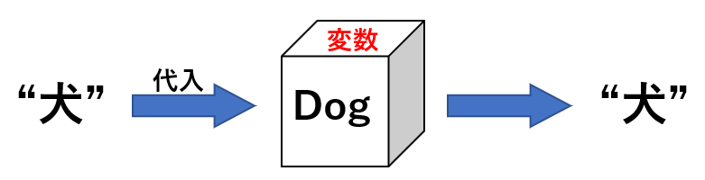

# 4  変数

Code

ココまでは、数値や文字列などの、単純なオブジェクトについて説明してきました。単純なオブジェクトはプログラミングの要素として重要です。しかし、オブジェクトを毎回作成し直すのは面倒です。オブジェクトを作ったら、それを一時的に保管しておいて、後から演算に使える方が便利です。

電卓では、このような「一時的に結果を記録する」方法として、メモリー機能があります。Excelなどでは、計算結果をセルに記録しておくこともあるでしょう。プログラミング言語にも、計算結果を一時的に保管しておくものが準備されています。この「計算結果を一時的に保管しておくもの」のことを、プログラミング言語では**変数**と呼びます。

変数には名前がついています。名前付きの箱の中にオブジェクトを入れているようなものが変数です。下の図では、変数「`dog`」にオブジェクト「`"犬"`」を入れています。「`"犬"`」を取り出して使いたいときには、変数である「`dog`」を持ってくればよい、ということになります。

[](./image/variable_image.png "図2：変数のイメージ")

図2：変数のイメージ

Rで変数を作成する場合には、変数名に「`<-`」の記号でオブジェクトを**代入**します。

``` downlit
dog <- "inu" # dogという変数に"inu"という文字列を代入する
number <- 1 # numberという変数に、1という数値を代入する
dog # 変数dogには"inu"が入っている
## [1] "inu"

number # 変数numberには1が入っている
## [1] 1
```

変数には型・クラスがあり、代入したオブジェクトと同じ型・クラスを持つことになります。また、変数はそのまま演算に用いることができます。

``` downlit
mode(dog) # dogの中身は文字列
## [1] "character"

mode(number) # numberの中身は数値
## [1] "numeric"

paste(dog, "walk") # dogの中身と"walk"をつなぐ
## [1] "inu walk"

number + 5 # numberの中身に5を足す
## [1] 6

dog + 1 # dogの中身は文字列なので、足し算はできない
## Error in `dog + 1`:
## ! non-numeric argument to binary operator
```

変数への代入は、「`=`」や「`->`」の演算子によっても行うことができます。ただし、これらを代入に用いると、プログラムを読み解くのが難しくなるため、Rでは「`<-`」を用いることが推奨されています。

``` downlit
dog = "犬" # イコールも代入に使うことができる
2 -> number # ->も代入に使える（方向は<-と逆になる）

dog
## [1] "犬"

number
## [1] 2
```

演算結果を変数に代入すると、どのようなものが変数に代入されるのかよくわからないときがあります。このような場合には、変数の代入に関する式をすべてカッコで囲うとよいでしょう。カッコで囲うことで、代入される値を表示させることができます。

``` downlit
(calc <- log(2) + log(3))
## [1] 1.791759
```

定義されている変数の一覧を確認するには、`ls`関数を用います。

``` downlit
ls()
## [1] "calc"   "dog"    "number"
```

変数を削除する場合には、`rm`関数を用います。

``` downlit
rat <- "ネズミ"
rat
## [1] "ネズミ"

rm(rat)

# 変数を呼び出すとエラーになる
rat
## Error:
## ! object 'rat' not found
```

## 4.1 変数と定数

変数のうち、一度代入したら中身を変えられないもののことを**定数**と呼びます。他のプログラミング言語では定数を設定できるものが多いのですが、Rには定数を設定する方法はありません。変数の中身はいつでも置き換えできます。変数を置き換えると、置き換えに用いたオブジェクトの型・クラスに従い、変数の型・クラスも置き換わります。

``` downlit
dog <- "inu" # 変数に文字列を代入
mode(dog) # 型は文字列になる
## [1] "character"

dog <- 1 # 変数に数値を入れ直す
mode(dog) # 変数の型は数値になる
## [1] "numeric"
```

> **TIP:**
>
> 多くのプログラミング言語では、上記のように変数の型が変化するのを抑える仕組み（型宣言）を持っています。型宣言が必要な言語では、変数は厳密に型のチェックを受けます（静的型付け）。Rにはこのような仕組みがなく、代入されたオブジェクトに従って型が決まり、型チェックされることなくプログラムが実行されます。このような言語のことを動的型付けと呼びます。
>
> プログラム中で変数の型が変わると、バグの原因となります。Rでは、プログラムを書いているうちに変数の型が変化していて、正しい計算結果が得られない、ということがたびたび起きます。変数の型を常に確認しながらプログラミングした方がよいでしょう。

定数とは少し異なりますが、Rでは代入なしに使える変数もあります。例えば、円周率のπは「`pi`」という変数名ではじめから登録されています。このような変数にも別のオブジェクトを代入することはできますが、後々混乱する原因となるため避けたほうがよいでしょう。

また、統計手法を試すためのデータが代入されている変数（データセット）もたくさん設定されています。データセットについては、[18章](chapter18.llms.md)で詳しく説明します。

``` downlit
pi # 円周率
## [1] 3.141593

letters # アルファベット（小文字）
##  [1] "a" "b" "c" "d" "e" "f" "g" "h" "i" "j" "k" "l" "m" "n" "o" "p" "q" "r" "s"
## [20] "t" "u" "v" "w" "x" "y" "z"

LETTERS # アルファベット（大文字）
##  [1] "A" "B" "C" "D" "E" "F" "G" "H" "I" "J" "K" "L" "M" "N" "O" "P" "Q" "R" "S"
## [20] "T" "U" "V" "W" "X" "Y" "Z"

month.abb # 月（短縮表記）
##  [1] "Jan" "Feb" "Mar" "Apr" "May" "Jun" "Jul" "Aug" "Sep" "Oct" "Nov" "Dec"

month.name # 月
##  [1] "January"   "February"  "March"     "April"     "May"       "June"     
##  [7] "July"      "August"    "September" "October"   "November"  "December"

pi <- 3 # piに3を代入する
pi # piは3になってしまう
## [1] 3
```

誤って代入してしまった場合には、`rm`関数で変数を削除しましょう。`pi`のようにRで設定されている変数では、`rm`で削除することで元に戻すことができます。

``` downlit
rm(pi)
pi # 正しい値に戻る
## [1] 3.141593
```

## 4.2 値渡しと参照渡し

Rでは、変数への代入が行われるたびに、その変数に対するメモリのアドレスを新規に作成し直す、という特徴があるため、他の言語で理解が必要となる値渡しと参照渡しの問題がほとんど起きません。

``` downlit
x <- 1 # xに1を代入
y <- x # yにxを代入（yとxはメモリを共有）
x <- 2 # xに2を代入（xのメモリのアドレスが変わる）
x # xは新しいアドレスを参照（2が返ってくる）
## [1] 2
y # yは古いアドレスを参照（1が返ってくる）
## [1] 1
```

> **TIP:**
>
> 上のコードでは、参照渡しであれば、xの値が2になった場合、xとメモリを共有しているyも2になります。Rでは、代入時にメモリのアドレスが別に準備されるため（値渡し）、参照渡しが起こることは基本的にありません。この特徴はプログラミング初心者には優しいのですが、変数の変更のたびにメモリ上にオブジェクトを新規作成するため、Rの実行速度が遅い原因になります。

Back to top
