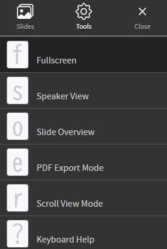

# 40  Quarto：プレゼンテーション

Code

## 40.1 プレゼンテーションを作成する

Quartoでは、文書だけでなく、プレゼンテーションを作成することもできます。Quartoで作成できるプレゼンテーションは、Powerpoint、[Reveal.js](https://revealjs.com/)（HTMLのプレゼンテーションを作成するツール）、[Beamer](https://ctan.org/pkg/beamer)（LaTeXを利用し、PDFのプレゼンテーションを作成するツール）の3種類です。それぞれ[前章](chapter39.llms.md#文章のフォーマット)で説明した`format: docx`、`format: html`、`format: pdf`とほぼ対応していると考えてよいでしょう。

### 40.1.1 プレゼンテーションのフォーマットを指定する

YAMLに`format`を指定することで、上記の3つ（Powerpoint、Reveal.js、Beamer）のうちから出力するフォーマットを選択することができます。

``` yaml
format: pptx
format: revealjs
format: beamer
```

上記の`format`以下には、それぞれ`format: docx`、`format: html`、`format: pdf`で出力する場合と同様のYAMLを指定できるようになっていますが、プレゼンテーション特有のYAMLも（特にReveal.jsにはたくさん）準備されています。以下では、主にReveal.jsのプレゼンテーションを作成する手順を説明します。Powerpoint、Beamerについても、以下に説明するスライドの構造についてはほぼReveal.jsと同じように作成することができます。

## 40.2 スライドの中身を作成する

スライドを作成するときのルールはおおむね以下のようになります。

- タイトルのスライドはYAMLの`title`と`author`から作成されます。
- header1（`# header1`）を設定すると、タイトルのスライドを別途設定することもできます。
- header2（`## header2`）を設定すると、新しいスライドが作成されます。header2以下にそのスライドの内容を記載します。
- header2を用いずに新しいスライドを作成する場合には、ハイフン3つ（`---`）をスライドの区切りに用いることができます。
- chunkは実行されますが、コードは表示されません（デフォルトでは`echo=FALSE`になっています）。

上記のルールはReveal.js、Powerpoint、Beamerのいずれにも適用されます。以下に[QuartoのGuide](https://quarto.org/docs/presentations/#creating-slides)に記載されているMarkdownの例と、出力されるプレゼンテーション（Reveal.js）を示します。

``` markdown
---
title: "Habits"
author: John Doe
format: 
  revealjs:
    controls: true # 左右の矢印を表示する
---
  
## Getting up
  
- Turn off alarm
- Get out of bed

## Breakfast

- Eat eggs
- Drink coffee

---

### Lunch 
  
- Eat sandwich
```

> **TIP:**
>
> 上記のようにReveal.jsをQuartoに埋め込む場合には、[37章](chapter37.llms.md#地図などの埋め込み)でGoogle mapの埋め込みの際に説明した`iframe`を用います。
>
> ``` markdown
> <iframe class="slide-deck" src="./sample_revealjs/sample.html" width="100%" height="250"></iframe>
> ```
>
> このとき、Reveal.jsを作成する際には、YAMLで以下のようにスライドの高さを指定するとよいでしょう。
>
> ``` yaml
> ---
> format: 
>   revealjs:
>     height: 250
> ---
> ```
>
> スライドの高さと`iframe`で指定する高さを揃え、`width`には100%のような形で%表記で指定すると画面の幅に合わせて横幅を調整してくれます。

### 40.2.1 箇条書きをひとつづつ表示する

プレゼンテーションでは、箇条書きにした項目をひとつづつ順番に表示したい場合があります。箇条書きをひとつづつ表示する場合には、以下のように`:::{.incremental}`と`:::`で箇条書きを囲います。

``` markdown
:::{.incremental}
- Turn off alarm
- Get out of bed
:::
```

### 40.2.2 箇条書き以外をひとつづつ表示する

また、Reveal.jsでは箇条書きではない項目もひとつづつ表示することができます。この場合には`{.incremental}`ではなく、コンマをスペースで区切って3つ連ねたもの（`. . .`）を用います。

``` markdown
Turn off alarm

. . .

Get out of bed
```

### 40.2.3 複数の列に表示する

スライドに複数列の項目を記載したい場合には、`{.columns}`と`{.column}`をネスト（入れ子）にして用います。また、各列の幅は`{.column width=40%}`と[`{}`](https://rdrr.io/r/base/Paren.html)の中で指定することで調整することができます。

``` markdown
## Getting up

:::{.columns} 
  :::{.column}
    Turn off alarm
  :::

  :::{.column}
    Get out of bed
  :::
:::
```

### 40.2.4 図の表示

図の表示は、[37章](chapter37.llms.md#図の表示)で説明した通り、``という形で表示させることができます。上の項目で説明した通り、図は`{.columns}`を用いれば横に並べることができます。また、別途画像を重ねて表示したい場合には、以下のように`{.r-stack}`を用います。

``` markdown
:::{.r-stack}
{width=300px height=200px}

{.fragment width=200px height=150px}

{.fragment width=100px height=75px}
:::
```

また、図の位置をスライドの上や左からの距離を数値で指定し、表示する位置やサイズを調整することもできます。図の位置、サイズを設定する場合には、``の後ろに`{.absolute}`で上からの距離（`top`）、左からの距離（`left`）、図の幅（`width`）、図の高さ（`height`）を以下のように指定します。

``` markdown
{.absolute top=0px left=0px width=200px height=150px}

{.absolute top=10px left=250px width=200px height=150px}

{.absolute top=20px left=500px width=200px height=150px}
```

### 40.2.5 テーマ（Theme）

Quartoのテーマ（`theme`、[Bootswitch](https://bootswatch.com/)に従います）とは別に、Reveal.jsには[専用のTheme](https://revealjs.com/themes/)が12種準備されています。Themeを設定する場合、YAMLで以下のように`theme`を指定します。

``` yaml
format:
  revealjs: 
    theme: dracula
```

テーマはプレゼンテーションのファイルではReveal.jsにのみ適用できるYAMLです。Powerpointの場合はWordを出力する場合と同様にテンプレートを準備してプレゼンテーションのデザインを指定します。QuartoではBeamerを凝ったデザインのプレゼンテーションとして出力することは難しいようです。

### 40.2.6 aside（余談）、注釈（footnote）とフッター（footer）

asideは、記載した内容について付与的に説明を加えるときに用いる表記です。スライドの最も下に、重要ではないちょっとした情報を加えることは、通常のプレゼンでよく用いられる方法だと思います。このようなものをasideと呼びます。

``` markdown
::: aside
このスライドは[QuartoのGuide](https://quarto.org/docs/presentations/revealjs)に従い作成しています
:::
```

また、注釈（footnote）は[37章](chapter37.llms.md#markdown記法の一覧)で説明したのと同じように、`[^1]`という形のタグを用いることで追加することができます。

フッター（footer）は上記のasideよりさらに下に記載される要素です。組織名などをフッターに加えるのが一般的だと思います。フッターは[39章](chapter39.llms.md#フッターfooter)で説明した通り、YAMLで`footer`として設定します。また、YAMLに`logo`を設定し、画像を指定するとロゴを右下に表示することもできます。

``` yaml
format:
  revealjs: 
    footer: フッターの表示
    logo: ./image/favicon_small.png
```

### 40.2.7 項目の多いスライドの表示：smallerとscrollable

1枚のスライドにたくさんの要素を載せたいときの対応方法には2つあります。1つは要素を小さく表示する方法です。要素を小さく表示したい場合、YAMLに`smaller: true`を設定します。ただし、小さくしても表示できる要素の数には限りがあります。

``` yaml
format:
  revealjs:
    smaller: true
```

別の方法としては、画面をスクロールできるようにする方法があります。画面をスクロールできるようにしたい場合、YAMLに`scrollable: true`を設定します。上記の`smaller`も`scrollable`と同時に設定することが出来ます。

ただし、`smaller`も`scrollable`も、わかりやすいプレゼンテーションのデザインとは言い難いので、極力頼らないようスライドをデザインしたほうがよいでしょう。

``` yaml
format:
  revealjs:
    scrollable: true
```

### 40.2.8 スライドを縦に配置する

Reveal.jsでは、スライドを横だけでなく、縦に並べることもできます。縦に並べる場合、YAMLに`navigation-mode: vertical`を設定します。`navigation-mode: vertical`を設定すると、表紙に当たるheader1（`# header1`）が横に並び、その下にheader2（`## header2`）として記載したスライドが縦に並ぶことになります。

``` markdown
---
format: 
  revealjs:
    navigation-mode: vertical
---
  
# Getting up
  
## Turn off alarm

# Breakfast

## Eat eggs

# Lunch

## Eat sandwich

# Dinner

## Eat spaghetti

# Going to sleep

## Get in bed
```

### 40.2.9 スライドを表示しない・隠しスライド

特定のスライドを全く表示させない場合には、header2の後ろに`{visibility="hidden"}`を指定します。同様に`{visibility="uncounted"}`を指定すると、スライド番号を表示させた場合にカウントを増やさずにスライドを作成することができます。

``` markdown
## Breakfast

- Eat eggs

## Lunch {visibility="hidden"}

- Eat sandwich

## Dinner {visibility="uncounted"}

- Eat spaghetti
```

### 40.2.10 スライドに背景を設置する

Reveal.jsでは、スライドの背景を設定することもできます。背景の設定には、YAMLで設定するタイトルスライドの背景と、個々のスライドに背景を設定する方法の2つがあります。

#### 40.2.10.1 タイトルスライドの背景

タイトルスライドの背景はYAMLで設定します。YAMLに`title-slide-attributes`を設定し、`title-slide-attributes`以下の項目として`data-background-image`、`data-backgroud-size`、`data-background-opacity`を指定します。

`data-background-image`には画像ファイルまでのパスを記載します。`data-backgroud-size`には、`contain`や`cover`などを指定します（[CSSの画像の設定](https://developer.mozilla.org/ja/docs/Web/CSS/background-size)に従うようです）。`data-background-opacity`には画像の透明度を指定します。

``` yaml
title: budda
title-slide-attributes:
  data-background-image: "../image/budda.jpg" # 背景の画像
  data-background-size: cover # 背景サイズの指定
  data-background-opacity: "0.8" # 背景の透明度の指定
```

#### 40.2.10.2 スライドの背景色

各スライドにはそれぞれ背景色を指定することができます。背景色を指定する場合、header2の後ろに`{background-color}`を指定します。また、`{background-gradient}`を用いると、背景色にグラデーションを指定することもできます。

色の指定は色の名前、または6桁のカラーコード（`#000000`など）のいずれかで指定します。色の見本は[こちらのサイト](https://www.colordic.org/)などを参考にするとよいでしょう。

``` markdown
## Getting up {background-color="lightblue"}
  
- Turn off alarm
```

``` markdown
## Breakfast {background-gradient="linear-gradient(to bottom, black, mistyrose)"}

- Eat eggs
```

### 40.2.11 スライドの切り替え

スライドの切り替え時、特に設定をしない場合には瞬時に次のスライドへと移行しますが、この切り替えにアニメーションの表現を加えることもできます。スライドの切り替えを設定する場合には、header2の後ろに`{transition}`を加えます。このtransitionには、`fade`、`slide`、`convex`、`concave`、`zoom`の5種類を設定することができます。また、`transition-speed`を`fast`、`slow`にそれぞれ設定すると切り替えのスピードを調整することもできます。

同様に、YAMLに`transition: slide`や`transition-speed: slow`のように設定すると、プレゼンテーション全体でのスライドの切り替え表示の方法を指定することもできます。

また、スライドが表示される時とスライドから離れる時の切り替えアニメーションを別のものにすることもできます。スライドの表示・離脱時のアニメーションはそれぞれ`{transition="fade-in slide-out"}`といった形で、`-in`と`-out`をつけて設定します。

``` markdown
## Getting up (fade) {transition="fade" transition-speed="slow"}
  
- Turn off alarm

## Breakfast (slide) {transition="slide" transition-speed="slow"}

- Eat eggs

## Lunch (convex) {transition="convex" transition-speed="slow"}

- Eat sandwich

## Dinner (concave) {transition="concave" transition-speed="slow"}

- Eat spaghetti

## Going to sleep (zoom) {transition="zoom" transition-speed="slow"}

- Get in bed
```

### 40.2.12 スライドの要素のアニメーション

スライド内の要素それぞれにアニメーションを設定することもできます。要素のアニメーションには、`{.fragment}`を用います。`{.fragment}`で指定するとスライド切り替え時には表示されず、次のタイミングで瞬時に表示される形となります。

また、アニメーションの種類は`{.fragment}`内に、`.fade-in`のような形で指定します。設定可能な項目については、[QuartoのGuide](https://quarto.org/docs/presentations/revealjs/advanced.html#fragment-classes)を参照してください。

``` markdown
::: {.fragment}
- Turn off alarm
:::
  
::: {.fragment .fade-out}
- Eat eggs
:::
  
::: {.fragment .highlight-red}
- Eat sandwich
:::

::: {.fragment .fade-in-then-out}
- Eat spaghetti
:::
  
::: {.fragment .fade-up}
- Get in bed
:::
```

### 40.2.13 スライド内のアニメーション

#### 40.2.13.1 auto-animate

`.fragment`とは別に、表示させる文字列や図をスムーズにアニメーションさせることもできます。このアニメーションの設定には`{auto-animation}`を用います。header2、つまりスライドごとに`{auto-animation=true}`を指定し、指定したスライドの両方に同じような文字列を表示させると、スムーズにアニメーションさせることができます。

``` markdown
## {auto-animate=true}

::: {style="color: blue;"}
Turn off alarm
:::

## {auto-animate=true}

::: {style="font-size: 3em; color: red;"}
**Turn off alarm**
:::
```

#### 40.2.13.2 auto-animate：コードをアニメーション表示する

同様に、`{auto-animation}`を用いると以下のようにコードの追記をアニメーションで表示させることもできます。

```` markdown
## {auto-animate=true}

```r
iris |> 
  ggplot(aes(x="Sepal.Length", y="Sepal.Width))
```

## {auto-animate=true}

```r
iris |> 
  ggplot(aes(x="Sepal.Length", y="Sepal.Width)) +
  geom_point(size=2)
```

## {auto-animate=true}

```r
iris |> 
  ggplot(aes(x="Sepal.Length", y="Sepal.Width)) +
  geom_point(size=2) +
  labs(x="がく片の長さ", y="がく片の幅")
```
````

#### 40.2.13.3 auto-animate：要素を上に追加する

コードの追加に似ていますが、`{auto-animation}`を用いると文字列を上に追加する表現をアニメーションで行うこともできます。

``` markdown
## {auto-animate=true}

- Eat eggs

## {auto-animate=true}

- Turn off alarm
- Eat eggs
```

#### 40.2.13.4 auto-animate：図形の変形アニメーション

図形もアニメーションで変形させることができます。ただし、これはやや使いどころが難しいように思います。

``` markdown
## {auto-animate=true auto-animate-easing="ease-in-out"}

::: {.r-hstack}
::: {data-id="box1" auto-animate-delay="0" style="background: #2780e3; width: 200px; height: 150px; margin: 10px;"}
:::

::: {data-id="box2" auto-animate-delay="0.1" style="background: #3fb618; width: 200px; height: 150px; margin: 10px;"}
:::

::: {data-id="box3" auto-animate-delay="0.2" style="background: #e83e8c; width: 200px; height: 150px; margin: 10px;"}
:::
:::

## {auto-animate=true auto-animate-easing="ease-in-out"}

::: {.r-stack}
::: {data-id="box1" style="background: #2780e3; width: 250px; height: 250px; border-radius: 200px;"}
:::

::: {data-id="box2" style="background: #3fb618; width: 150px; height: 150px; border-radius: 200px;"}
:::

::: {data-id="box3" style="background: #e83e8c; width: 50px; height: 50px; border-radius: 200px;"}
:::
:::
```

### 40.2.14 parallax

スライド移行時に、背景の画像が少し移動するアニメーションを追加する、parallaxもReveal.jsでは指定可能です。parallaxについては、[このReveal.jsのデモ](https://revealjs.com/demo/?parallaxBackgroundImage=https%3A%2F%2Fs3.amazonaws.com%2Fhakim-static%2Freveal-js%2Freveal-parallax-1.jpg&parallaxBackgroundSize=2100px%20900px)を確認していただけるとイメージしやすいかと思います。

parallaxを利用したいときには、YAMLのrevealjs以下に`parallax-background-image`と`parallax-background-horizontal`、`parallax-background-vertical`を設定します。`parallax-background-image`には背景に表示する画像、`parallax-background-horizontal`と`parallax-background-vertical`にはスライドの切り替え時の背景画像の移動距離を指定します。

ただし、このparallaxは設定がやや難しい上、現状（`knitr` ver.1.50）ではRstudio上のRenderボタンでは表示させることができません。Terminalから`quarto render`を用いてRenderしましょう。また、なぜか`iframe`ではparallaxをうまく表示させることができないようです。

``` yaml
format: 
  revealjs:
    parallax-background-image: "../image/sasebo.jpg"
    parallax-background-size: "450px 300px"
    parallax-background-horizontal: 200
```

## 40.3 Reveal.jsのプレゼンテーションのコントロール

Reveal.jsのプレゼンテーションはHTMLですので、ファイルはHTMLとして保存されます。HTMLをウェブブラウザで開くことでプレゼンテーションを表示させることができます。

このReveal.jsの使い方については、スライドの左下に表示されるメニューから、上の『Tools』を選択した時に表示されるショートカットを見ればわかるようになっています。例えば、フルスクリーン表示したい場合は『F』を押す、スピーカービューを表示したいときには『S』を押す、といった形で用いることができます。

また、Reveal.jsには左右に矢印が付いていますが、この矢印は以下のように`controls: true`を設定することで表示されます。

``` yaml
format: 
  revealjs:
    controls: true
```

[](./image/revaeljs_tools.png "Reveal.jsのToolsに表示されるショートカット")

Reveal.jsのToolsに表示されるショートカット

### 40.3.1 タッチナビゲーション

Reveal.jsでは、ケータイやタブレットのようなタッチディスプレイを持つ端末で、スワイプやタッチなどでスライドを移動することができます。このスワイプやタッチによる移動はタッチナビゲーションと呼ばれる機能によるものです。QuartoでReveal.jsのタッチナビゲーションの設定を行う場合、YAMLに`touch`を設定します。おそらく`touch`のデフォルトは`true`だと思いますので、特に設定する必要はありませんが、明示的に示したいときには`true`、タッチナビゲーションを利用したくない場合には`false`に設定するとよいでしょう。

``` yaml
format: 
  revealjs:
    touch: true
```

### 40.3.2 scroll-view

Reveal.jsでは、上に示した通り、スライドの左右に矢印が表示され、この矢印を押すことでスライドを移動することが出来ます。また、キーボードの矢印でも移動可能です。ただし、Powerpointのようにスクロールホイールでスライドを移動することはできません。

スクロールホイールで移動ができるようにするためのYAMLが`scroll-view`です。`scroll-view: true`を設定すると、以下の例のようにスクロールバーが右に表示されるようになり、スクロールホイールでスライドを移動することが出来るようになります。

また、このYAMLを設定していないプレゼンテーションにおいても、キーボードの『R』を押すことでスクロールホイールで操作できます。

``` yaml
format: 
  revealjs:
    scroll-view: true
```

### 40.3.3 スピーカービューにテキストを表示する

Powerpointでプレゼンテーションを行うときに発表者の画面だけに表示される、スピーカービューもReveal.jsで表示させることができます。スピーカービューを用いる場合には、上記の通りキーボードの『S』を押します。

この際に、プレゼンテーションで話す内容をメモしたもの、スピーカーノートを表示させることもできます。スピーカーノートを表示させる場合、そのスライドの要素として、`{.notes}`を以下のように設定します。

``` markdown
## スライド

::: {.notes}
このスライドではスピーカーノートについてお話しします。
:::
```

> **TIP:**
>
> [Quartoのreveal.jsのGuide](https://quarto.org/docs/presentations/revealjs/#line-highlighting)には`code-line-numbers`に関する記載がありますが、この`code-line-numbers`に関してはPythonのコードをRenderするときにしか有効ではなく、RのコードをRenderする場合（`knitr` ver.1.50）には有効ではないようです。以下のコードはエラーとなります。また、Rのコードを含まない`.qmd`ファイルに関しては、RstudioでRenderボタンを用いるのではなく、TerminalからQuarto CLIを用い、`quarto render`でRenderを行った方がよいでしょう。
>
> ```` markdown
> ```{r, code-line-numbers="1-3"} # 1～3をハイライト、はできない
> x <- matrix(c(4, 12, 8, 8), nrow = 2)
> colnames(x) <- c("observed", "expected")
> rownames(x) <- c("male", "female")
> fisher.test(x)
> ```
>
> ---
>
> ```{r, code-line-numbers="2|4"} # 2と4を順にハイライト、はできない
> x <- matrix(c(4, 12, 8, 8), nrow = 2)
> colnames(x) <- c("observed", "expected")
> rownames(x) <- c("male", "female")
> fisher.test(x)
> ```
> ````
>
> Quartoは現状（2025年）開発中であり、Rだけ対応していること、Pythonだけ対応していること、Observableではできないことなどがあります。

Back to top
