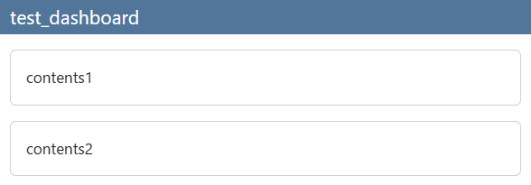
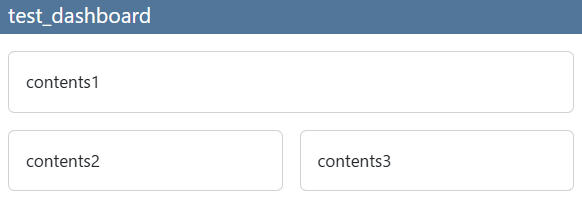
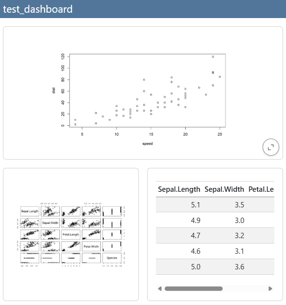
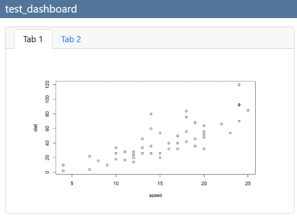
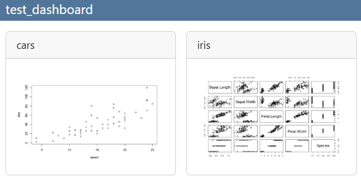
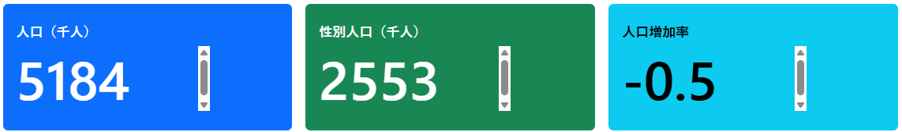
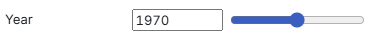
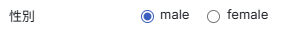
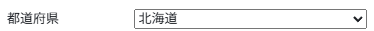

# 41  Quarto：ダッシュボード

Code

## 41.1 ダッシュボードとは？

Quartoでは、文書、プレゼンテーションに加えて、**ダッシュボード**を作成することができます。ダッシュボードとは、数値や統計の結果などを一覧として表示するためのHTMLを指す言葉で、通常は動的なデータ（例えば特定の株式会社の株価や毎日のプロ野球の試合の結果など）を表示するのに用いられます。ダッシュボードの例として、以下のようなものが[QuartoのGallary](https://quarto.org/docs/gallery/)に示されています。

- [Palmer Penguins](https://jjallaire.shinyapps.io/penguins-dashboard/)
- [NFL Injuries](https://jjallaire.github.io/nfl-injuries-dashboard/)
- [日本の人口](https://xjorv.quarto.pub/pop_japanese_dashboard_with_ojs/)：これはGallaryに示されているものではなく、私が作成したものです。[ココ](https://github.com/sb8001at-oss/Rnyuumon/blob/master/sample_observable/index.qmd)にqmdファイルを保存しています。Observableを利用して作成しており、スマホで表示するとグラフが際限なく縦長になります。

ダッシュボードには数値やグラフが表示されます。この数値やグラフの値がいつも同じなら（例えば、いつ見ても同じ日の株価が表示されていれば）、誰もそのダッシュボードに興味を抱かないでしょう。したがって、何らかの方法で表示される値やグラフが変化する、動的な仕組みが必要です。

Quartoに動的な仕組みを持ち込む方法には、以下のようなものがあります。

- Shiny（Webアプリケーション）を利用する
- `leaflet`や`plotly`、`htmlwidgets`などの動的なパッケージを利用する
- [Observable](https://observablehq.com/)を用いる

Shinyについては[47章](chapter47.llms.md)で説明しています。また、`plotly`に関しては[27章](chapter27.llms.md)、`leaflet`に関しては[45章](chapter45.llms.md#leafletパッケージ)で説明しています。この章では主にダッシュボードの構造とObservableについて説明します。

## 41.2 ダッシュボードの構造

ダッシュボードの構造は基本的にはHTMLの構造に準じますが、ページのレイアウトについては通常のHTMLとはかなり異なります。

### 41.2.1 フォーマットの指定

ダッシュボードを作成する場合には、YAMLに`format: dashboard`を指定します。

``` yaml
---
format: dashboard
---
```

### 41.2.2 ダッシュボードのレイアウト

ダッシュボードのレイアウトは、2種類のヘッダー（`## Row`と`## Column`）で指定します。`## Row`は横方向に長く、縦に並べた構造、`## Column`は縦方向に長く、横に並べた構造を取るのに用います。

まずは`## Row`について説明します。`## Row`では、それぞれの行に示したい内容をヘッダー以下に示します。

``` markdown
## Row

contents1

## Row

contents2
```

[](./image/dashboard_row.png)

また、`## Row`以下に`## Column`を指定することで、以下のように1つの行に横並びにレイアウトを行うこともできます。

``` markdown
## Row

contents1

## Row

## Column

contents2

## Column

contents3
```

[](./image/dashboard_column.png)

また、ヘッダーの後ろに`{width=XX%}`、`{height=XX%}`を付け加えることで、RowやColumnの幅や高さを指定することができます。

上記のようにMarkdownを書くだけの場合には、要素（**カード（cards）**と呼びます）ごとの区切りとしてヘッダー（`## Row`、`## Column`）を明確に示す必要がありますが、コードブロックや後で説明する**Value box**は1つのカードとして評価され、ヘッダーを間に置かなくてもカードとして評価されます。

```` markdown
## Row

```{r}
plot(cars)
```

## Column

```{r}
plot(iris)
```

```{r}
knitr::kable(iris |> head(5))
```
````

[](./image/dashboard_codeblock.png)

### 41.2.3 タブの表示

タブで複数の要素を表示する場合には、ヘッダーの後ろに`{.tabset}`を追加します。通常のQuartoのように`:::`は必要ありません。

```` markdown
## Row {.tabset}

```{r}
plot(cars)
```

```{r}
plot(iris)
```
````

[](./image/dashboard_tabset.png)

また、メニューバー（navbar）にタブを設定することもできます。メニューバーには、`# header1`で記載した要素がタブとして示されます。

```` markdown
# Cars

```{r}
plot(cars)
```

# Iris

```{r}
plot(iris)
```
````

[](./image/dashboard_titletab.png)

### 41.2.4 カードのタイトルを表示する

カードのタイトルは、chunk optionとして`title`に設定します。

```` markdown
```{r}
#| title: cars
plot(cars)
```

```{r}
#| title: iris
plot(iris)
```
````

[](./image/dashboard_title.png)

また、以下のように`{.card}`を用いてカードを設定することもできます。この`{.card}`を用いる場合、`title`をブランケット（[`{}`](https://rdrr.io/r/base/Paren.html)）の中に書くことで指定できます。

``` markdown
:::{.card title="独立したカード"}
カードの中身
:::
```

### 41.2.5 value box

**value box**とは、特定の値などを大きく表示する場合に用いるもので、以下の図のようなものです。

[](./image/dashboard_valuebox.png "value box")

value box

value boxを表示する場合、以下のようにchunkに`content: valuebox`を設定します。value boxの値はリストで設定し、名前を`value`とします。value boxには`icon`を表示させることができます。`icon`は[bootstrap icons](https://icons.getbootstrap.com/)から選択して指定します。value boxの色は`color`を指定することもでき、[primary、secondaryなど](https://quarto.org/docs/dashboards/data-display.html#icon-and-color)から選択、もしくはカラーコードを指定します。

```` markdown
```{r}
#| content: valuebox
#| title: "人口（千人）"
list(
  icon = "buildings",
  color = "primary",
  value = pop
)
```
````

## 41.3 Observable

動的なウェブサイトを作成する場合、上に記載した通りShinyなどの**Webアプリケーション**を用いるのが一般的です。Webアプリケーションとは、ウェブサイトで入力した内容に従い、サーバーと呼ばれるコンピュータで演算を行うことで、表示させるウェブページを動的に変化させることができるようにする仕組みを指します（詳しくは[47章](chapter47.llms.md)で説明します）。

Quartoでは、Shinyを用いて動的なHTMLを作成することができます。ただし、Shinyを用いた場合、サーバーで演算を行う必要があります。Shiny専用のサーバーとして[**Shinyapps.io**](https://www.shinyapps.io/)というものを無料で用いることができますが、無料だけにサーバーの計算能力は低く、あまりレスポンスのいいものではありません。

そもそもQuartoは静的なHTML、つまりサーバーの演算能力を必要としないHTMLを作成することを前提として作成されています。ですので、できればサーバーの演算能力を用いず、動的に見えるHTMLを作成したいところです。

動的に見えるHTMLとしては、上で紹介したように[27章](chapter27.llms.md)で説明した`plotly`、[45章](chapter45.llms.md#leafletパッケージ)で説明する`leaflet`があります。これらを用いることでサーバーで演算を行うことなく動的なHTMLを作成することができます。

動的に見えるHTMLを作成する別の方法として、[**Observable**](https://observablehq.com/)があります。Observableは[D3.js](https://d3js.org/)を開発した[Dr. Mike Bostock](https://en.wikipedia.org/wiki/Mike_Bostock)が開発している一連のツールで、Jupiter notebook風の[Observable Notebooks](https://observablehq.com/platform/notebooks)、ダッシュボード風のObservable Canvasesの2つを提供しているWebサービスです。ObservableはD3.jsのグラフを比較的簡単な手順で描画できる、Javascriptベースのサービスとなっており、Rユーザーでも比較的簡単にJavascriptを使い、グラフを作成できるようになっています。

具体的には[私が作成したノート](https://observablehq.com/d/c616bc7e2c4ec298)や[チュートリアル](https://observablehq.com/collection/@observablehq/tutorial)、[グラフのギャラリー](https://observablehq.com/@observablehq/plot-gallery)を参考にしてください。

Quartoでは、このObservableのチャンクを作成し、（動的に見える）静的なダッシュボードや文書を作成することができます。Observableのチャンクは以下のような形で、`ojs`を指定して作成します。

```` markdown
```{ojs}
// ココにJavascriptのコードを書く（//はコメントアウト）
irisc = FileAttachment("iris.csv").csv({ typed: true })
```
````

> **TIP:**
>
> Observableは真の意味でのサーバーレスで動的なコンテンツを作成できる、なかなか良いサービスだと思います。ただし、このObservableを使っている人は日本にも世界にもあまりいません。他のサービス（`RxJS`）に[Observable](https://rxjs.dev/api/index/class/Observable)というのがあるようで、そちらばかりが検索に引っ掛かります。
>
> なぜQuartoの開発チームがObservableに興味を持ったのかは謎ですが、データを表示・共有する場合にはなかなか良さそうなサービスですし、うまく使えばAPIなどを利用した動的なコンテンツも作れそうです。流行りのサービスになれるかどうかは疑わしいですが、興味がある方は[Observable Notebooks](https://observablehq.com/platform/notebooks)から触り始めてみるとよいでしょう。

### 41.3.1 Observable：データの読み込み

Observableのチャンクでは、上記と同じような形（`FileAttachment`）でCSVを読み込むことができます。

```` markdown
```{ojs}
irisc = FileAttachment("iris.csv").csv({ typed: true })
```
````

また、以下のような形で`arrow`パッケージ([Richardson et al. 2025](#ref-arrow_bib))の`write_feather`関数を用いて、RからObservableにデータを渡すこともできます。

```` markdown
```{r}
arrow::write_feather(
  data.frame(time = Nile |> time(), flow = Nile |> as.vector()), 
  "data.nile", 
  compression = "uncompressed"
)
```
````

Observableでは以下のようにしてRのオブジェクトを受け取ります。ただし、この形で受け取ったオブジェクトの構造は複雑なので、取り扱いはやや難しめです。

```` markdown
```{ojs}
nile = FileAttachment("data.nile").arrow()
```
````

### 41.3.2 Observable：グラフを作成する

Observableでグラフを作成する場合には、以下のように`Plot.plot`関数を用います。この関数の利用方法はObservableのReferenceに記載されていますが、[Plot Gallery](https://observablehq.com/@observablehq/plot-gallery)を参考にした方がわかりやすいかもしれません。また、事前にObservable Notebooksでコードを書き、動作を確かめておくと作成しやすいでしょう。

```` markdown
```{ojs}
Plot.plot({
  marks:[
    Plot.lineY(nile, {x: "time", y: "flow"})
  ]
})
```
````

### 41.3.3 Observable：インプットを作成する

Observableでは、チェックボックスやラジオボタン、選択ボックスやスライダーなどの、様々なインプットのアイテムを表示させることができます。このインプットの結果を変数に代入し、その変数を利用して動的なコンテンツを作成することができます。以下の例では、`year`、`sex`、`select_pref`の各変数にそれぞれ選択した値が代入されます。

```` markdown
```{ojs}
viewof year = Inputs.range([1920, 2020], {label: "Year", step: 1})
```
````

[](./image/dashboard_slider.png)

```` markdown
```{ojs}
viewof sex = Inputs.radio(["male", "female"], {label: "性別", value: "male"})
```
````

[](./image/dashboard_radio.png)

```` markdown
```{ojs}
viewof select_pref = Inputs.select(["北海道","青森県","岩手県","宮城県","秋田県","山形県","福島県","茨城県"], {label: "都道府県"})
```
````

[](./image/dashboard_selectbox.png)

### 41.3.4 データのフィルタリング

データを取り込み、入力からオブジェクトを作成したら、入力オブジェクトに従いデータを選択する必要があります。データの選択には、`dplyr`と同じように`filter`メソッドを用います。Rを使っていると以下の表現はやや迂遠な感じを受けるかもしれませんが、特に難しいことなくデータを選択することができます。

ただし、この`filter`メソッドは`arquero`というJavascriptのライブラリに設定されている関数ですので、Rのパッケージと同様に読み込む必要があります。

```` markdown
```{ojs}
import { aq, op } from "@uwdata/arquero" // ライブラリの読み込み

d_pop_year = d_pop
  .filter((d) => d.year == year)
```
````

### 41.3.5 データ処理の順序

Quartoでは、通常コードは上から下に、順に実行されます。下で定義したオブジェクトは上のコードでは利用できません。

ただし、このObservableを用いる場合、`.qmd`上でのコードの順序は全く意味がなくなり、下で定義した値を上で用いることができます。Observableでは、変更があった値を観察（Observe）しており、変更があった値を含むコードをすべて即時に実行するという仕組みになっています。ですので、上記のようにデータのフィルタリングをしたとき、フィルタリングを実行したコードより上の行にそのデータを利用したグラフ描画のコードがあれば、そのコードが実行され、新しいデータに従いグラフが再描画されます。

この仕組みはShinyにも似ており、ダッシュボードを作成する際には利点がある仕組みとなっています。ただし、コードの順序と実行の順序が一致しないため、コードの可読性は低めです。

より詳しいObservableの使い方については、[Observableのチュートリアル](https://observablehq.com/collection/@observablehq/tutorial)をご参照ください。

また、RstudioではObservableのコードをRstudio上で実行することはできず、Renderしないと結果を確認できません。また、作成されたHTMLはデプロイしないと中身を確認できません（Terminalで`quarto preview`を実行すると動くので、サーバー環境でのみ使えるようになっているようです）。Observable Notebooksでは即時にコードが実行されるため、あらかじめObservable Notebooksでコードを書いておくと、Quartoに持ち込む際に役に立つでしょう。

``` terminal
quarto preview ojs.qmd # ojs.qmdがRenderされ、プレビューが表示される
```

Richardson, Neal, Ian Cook, Nic Crane, et al. 2025. *Arrow: Integration to ’Apache’ ’Arrow’*. <https://doi.org/10.32614/CRAN.package.arrow>.

Back to top
