# 42  Quarto：WebsiteとBook

Code

ここまでに、QuartoでHTML、PDF、Wordなどの文書、Reveal.jsなどのプレゼンテーション、インタラクティブなダッシュボードを作成する手法を説明してきました。Quartoでは、HTMLの拡張として、ブログなどを含む**Website**や教科書などの本のHTMLとして表現する、**Book**を作成することもできます。以下にWebsiteやBookを作成する手順について、簡単に説明していきます。

## 42.1 Quarto project

Quartoでは、**QuartoのProject**というものを設定することができます。Rstudioを用いる場合、Quarto Projectは[36章](chapter36.llms.md#projectの設定)で説明したRstudioのProjectとほぼ同じです。RstudioではProjectを作成するとき、Projectのタイプを選択することができます。

[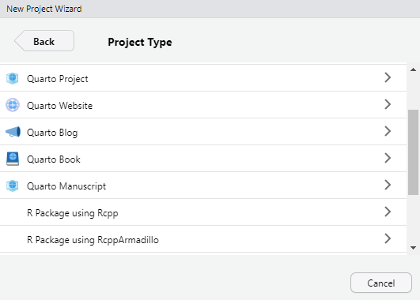](./image/Rstudio_quarto_project.png "RStudioでProject typeを選択する")

RStudioでProject typeを選択する

このリストから、「Quarto Project」や「Quarto Website」、「Quarto Book」などを選択すると、そのタイプに従ったプロジェクトと共に、いくつかの.qmdファイルがProjectのフォルダに作成されます。

[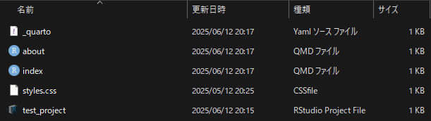](./image/quarto_project_files.png "Quarto Projectで作成されるファイル（Website）")

Quarto Projectで作成されるファイル（Website）

Rstudioを用いている場合には、このフォルダ内の`.Rproj`ファイルを開くとRstudioでプロジェクトが展開されます。

一方で、VSCodeなどのテキストエディタやJupyter Notebookなどを用いている場合には、RstudioのようにProjectを作成することはできません。そこで、Quarto CLIでは、TerminalからProjectを作成できるようになっています。

``` markdown
quarto create project
```

TerminalからQuarto Projectを作成すると、まずはプロジェクトのタイプを入力する画面が表示されます。タイプには、default、website、blog、manuscript、book、[confluence](https://quarto.org/docs/publishing/confluence.html)（Wikiみたいなもの）の6つがあるので、作成する文書に対応したタイプを選択します。

次に、Directory（フォルダ名）を入力します。Directoryを入力すると、そのDirectory内にProjectが作成されます。このProjectのフォルダには、上で示した作成されるファイルから、`.Rproj`ファイルが除かれたものが作成されます。このフォルダに移動し、`quarto render`を行うと、テンプレートの文書（Websiteの場合はHTML）を作成することができます。

RstudioではProjectを作成することでいろいろな設定が行われるため、複雑な文書を作成する場合にはProjectを作成しておいた方がよいですが、VSCodeなどを用いる場合には特に必須ではなく、`_quarto.yml`にYAMLの設定を書けばWebsiteやBookを特に問題なく作成することができます。ただし、Projectを作成するとテンプレートとなるファイル・フォルダを生成してくれるため、Quartoで文書の作成を始める場合には有用でしょう。

以下に、各タイプのProjectで作成されるファイル・フォルダの構造、`_quarto.yml`の設定、Renderで出力されるHTMLの見ためを示します。

## default

``` markdown
test_website
│- about.qmd
│- index.qmd
│- styles.css
└─ _quarto.yml
```

``` yaml
project:
  title: "test_default"
```

[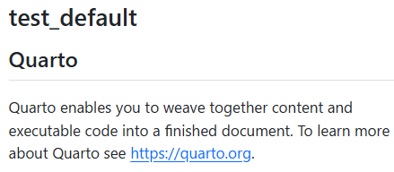](./image/project_default.png "HTMLの見た目")

HTMLの見た目

## website

``` markdown
test_website
│- about.qmd
│- index.qmd
│- styles.css
└─ _quarto.yml
```

``` yaml
project:
  type: website

website:
  title: "test_website"
  navbar:
    left:
      - href: index.qmd
        text: Home
      - about.qmd

format:
  html:
    theme:
      - cosmo
      - brand
    css: styles.css
    toc: true
```

[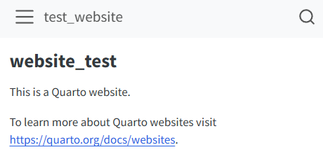](./image/project_website.png "HTMLの見た目")

HTMLの見た目

## manuscript

``` markdown
test_manuscript
│- references_bib
│- index.qmd
└─ _quarto.yml
```

``` yaml
project:
  type: manuscript

manuscript:
  article: index.qmd

format:
  html:
    comments:
      hypothesis: true
  docx: default
  jats: default

  # (other formats)
  # pdf: default

execute:
  freeze: true
```

[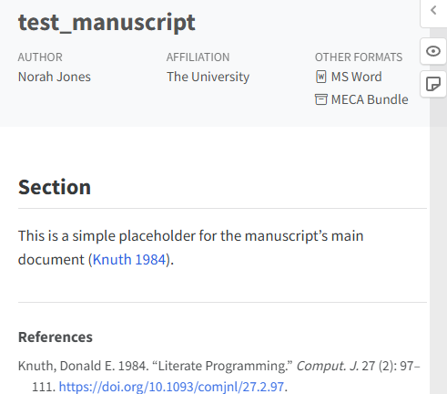](./image/project_manuscript.png "HTMLの見た目")

HTMLの見た目

## book

``` markdown
test_book
│- cover.png
│- index.qmd
│- intro.qmd
│- references.bib
│- references.qmd
│- summary.qmd
└─ _quarto.yml
```

``` yaml
project:
  type: book

book:
  title: "test_book"
  author: "Norah Jones"
  date: "2025/6/13"
  chapters:
    - index.qmd
    - intro.qmd
    - summary.qmd
    - references.qmd

bibliography: references.bib

format:
  html:
    theme:
      - cosmo
      - brand
  pdf:
    documentclass: scrreprt
```

[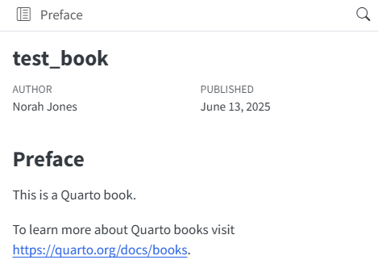](./image/project_book.png "HTMLの見た目")

HTMLの見た目

## confluence

``` markdown
test_confluence
│- index.qmd
│- project-roadmap.qmd
│- _quarto.yml
│
└─ reports
    │- 2022-01.qmd
    └- 2022-03.qmd    
```

``` yaml
project:
  type: confluence
  title: "test_confluence"
```

[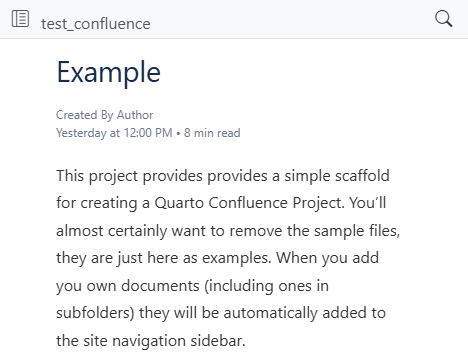](./image/project_confluence.png "HTMLの見た目")

HTMLの見た目

## blog

``` markdown
test_confluence
│- about.qmd
│- index.qmd
│- profile.jpg
│- styles.css
│- _quarto.yml
│
└─ posts
    │- _metadata.yml
    │
    ├- post-with-code
    │  ├- image.jpg
    │  └- index.qmd
    │
    └- welcome
       ├- index.qmd
       └- thumbnail.jpg
```

``` yaml
project:
  type: website

website:
  title: "test_blog"
  navbar:
    right:
      - about.qmd
      - icon: github
        href: https://github.com/
      - icon: twitter
        href: https://twitter.com
format:
  html:
    theme:
      - cosmo
      - brand
    css: styles.css
```

[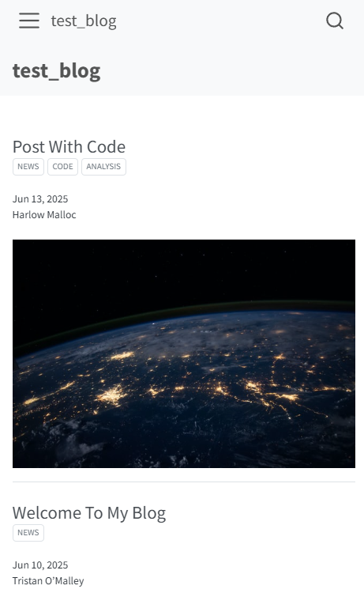](./image/project_blog.png "HTMLの見た目")

HTMLの見た目

## 42.2 HTMLとWebsite、Quarto Bookの違い

Quartoでは、YAMLに出力ファイルを指定せずにRenderを行うと、HTMLが出力されます。ですので、Markdown、YAMLを用いれば、ある程度自由にHTMLを用いたウェブページを作成することができます。

QuartoでWebsiteやBookを指定してWebsite・Bookを作成する利点は、ある程度出力するHTMLのデザインを固定することができる点にあります。Websiteではある程度自由に、複数の.qmdを一つのウェブページに仕立てることができます。また、Bookであれば、.qmdを各章とし、本のように一本道のウェブページを作成できます。

### 42.2.1 website・bookの設定

Website、Bookを作成する場合、`_quarto.yml`に`project: type: website`または`project: type: book`を設定します。この`project`は上記のようにQuarto Projectを作成していなくても設定可能です。

また、.qmdファイル内で`project`を設定しても、`project`に応じた設定は利用できません。`project`は`_quarto.yml`内に設定して用います。

``` yaml
project: 
  type: website

project: 
  type: book
```

> **TIP:**
>
> `type`には、`default`、`website`、`book`、`manuscript`の[4つが設定できる](https://quarto.org/docs/reference/projects/options.html)とされていますが、上記のように`confluence`も設定可能です。blogは`website`の一形態となるため、`type`は`website`となります。

### 42.2.2 index.qmd

`website`のトップページとなるのは、`index.qmd`という.qmdファイルです。`index.qmd`は`book`や`blog`でもトップページとなります。

### 42.2.3 Renderする.qmdを指定する

Projectを設定した`_quarto.yml`と同じフォルダ・サブフォルダ内に保存されている.qmdファイルは、そのProjectのファイルであると認識されます。このフォルダ内の.qmdファイルをRenderすると、基本的にはそのフォルダおよびサブフォルダ内のすべての.qmdファイルがRenderされます。

Projectのフォルダ内のうち、Renderしたい.qmdファイルを指定する場合には、`project: render:`に.qmdファイルを設定します。

``` yaml
project:
  render:
    - section1.qmd
    - section2.qmd
```

また、ファイル名の前に`!`を置くと、そのファイルのみを除いてRenderすることもできます。ただし、この場合には`*.qmd`という形で、すべての.qmdファイルを指定しておく必要があります。

``` yaml
project:
  render:
    - "*.qmd" # すべての.qmdファイルをRenderする
    - "!ignored.qmd" # 選択した.qmdファイルをRenderしない
    - "!ignored-dir/" # 指定したディレクトリ内の.qmdファイルをRenderしない
```

### 42.2.4 ブログを作成する

blogはwebsiteの特殊な形の一つで、基本的なWebsiteの構造に投稿（posts）を追加して用います。blogのフォルダ構造は上に示した通り、以下のようになります。`posts`ディレクトリ内にpostsに当たる.qmdファイルを追加していきます。

また、`posts`ディレクトリ内にサブフォルダを作成し、その中に.qmdファイルを作成することで、各postごとのファイルをそれぞれ別に保存することもできます。

``` markdown
test_confluence
│- about.qmd
│- index.qmd
│- profile.jpg
│- styles.css
│- _quarto.yml
└─ posts
    │- _metadata.yml
    ├- post-with-code
    │  ├- image.jpg
    │  └- index.qmd
    └- welcome
       ├- index.qmd
       └- thumbnail.jpg
```

#### 42.2.4.1 \_metadata.yml

上記のpostsディレクトリ内には、`_metadata.yml`というファイルがあります。これは、`_quarto.yml`に設定したYAMLに加えて、postsのみに適用するYAMLを指定するためのファイルです。`blog`に限らず、websiteでも同様にサブフォルダ内に`_metadata.yml`を設定することで、そのサブフォルダ内の.qmdのデザインやchunkの設定などをpost以外とは別の形で設定することができます。

ただし、サブフォルダ内の.qmdに適用されるYAMLは`_quarto.yml`と`_metadata.yml`を統合したものになり、`_metadata.yml`の設定のみだけではなく、`_quarto.yml`の内容も同様に適用されます。

#### 42.2.4.2 postsの設定

各postにはタイトルや著者、登校日、ブログのカテゴリ、トップ画像を設定することができます。タイトルや著者には、[39章](chapter39.llms.md#文章のタイトルと著者)に記載した通り、`title`や`author`、`date`をそのpostのYAMLに設定します。ブログのカテゴリは`categories`に、ブログのトップ画像として用いる画像は`image`にそれぞれ設定します。

``` yaml
---
title: "Post With Code"
author: "Harlow Malloc"
date: "2025-06-13"
categories: [news, code, analysis]
image: "image.jpg"
---
```

`categories`は`_quarto.yml`に以下のような形で設定することもできます。

``` yaml
categories:
  - news
  - code
  - analysis
```

#### 42.2.4.3 Listing

Listingとはブログのpostの一覧を表示することです。Listingはindex.qmdのページに表示されます。このListingについては、YAMLで`listing`を設定することで表示を変更することができます。

``` yaml
---
title: "myblog"
listing:
  contents: posts
  sort: "date desc"
  type: default
  categories: true
---
```

設定可能なYAMLの一部を以下に示します。その他の設定項目については[QuartoのReference](https://quarto.org/docs/reference/projects/websites.html)をご参照ください。

| YAMLでの設定項目 | 設定項目のデータ型 | 設定項目の意味 |
|:---|:---|:---|
| type | `default`、`table`、`grid`、`custom` | Listingの表示のタイプ |
| contents | サブフォルダ名 | Listingに表示する記事を保存したサブフォルダ |
| categories | true/false | カテゴリを表示するかどうか |
| sort | `date asc`、`date desc` | Listingの表示順 |
| max-items | 数値 | Listingに表示する記事の最大数 |
| page-size | 数値 | 1ページに表示する記事の数 |
| feed | true/false | RSSフィードを有効にする |
| grid-columns | 数値 | 表示する列の数 |
| table-hover | true/false | Postをマウスで選択するとハイライトされる |

Listingに関するYAML {.caption-top .table .table-sm .table-striped .small}

#### 42.2.4.4 Aboutページの作成

Quartoでは、著者の名前や所属、website、blogの内容などを表示するAboutのページを、[`postcards`](https://cran.r-project.org/web/packages/postcards/readme/README.html)パッケージ([Kross 2022](#ref-postcards_bib))のデザインに従い設定することができます。`postcards`のデザインを採用する場合、about.qmdに`about: template:`のYAMLを設定します。templateには、`jolla`、`trestles`、`solana`、`marquee`、`broadside`のいずれかを設定することができます。

``` markdown
---
title: "xjorv"
image: profile.jpg
about:
  template: jolla
---

xjorvはしがない平社員のサラリーマンです。趣味としてRを触り、気まぐれに教科書を書いています。

## Education

University of bakada, Tokyo | Tokyo, Japan
Ph.D in Tunnel Science | Sept 20XX - June 20XX
```

## jolla

[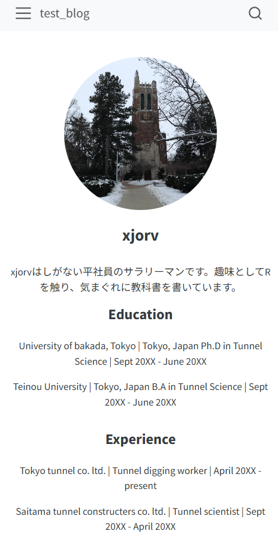](./image/about_jolla.png)

## trestles

[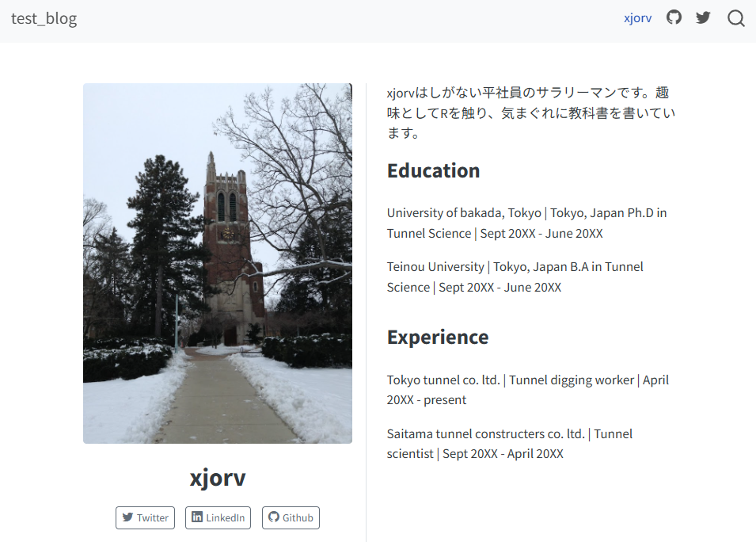](./image/about_trestles.png)

## solana

[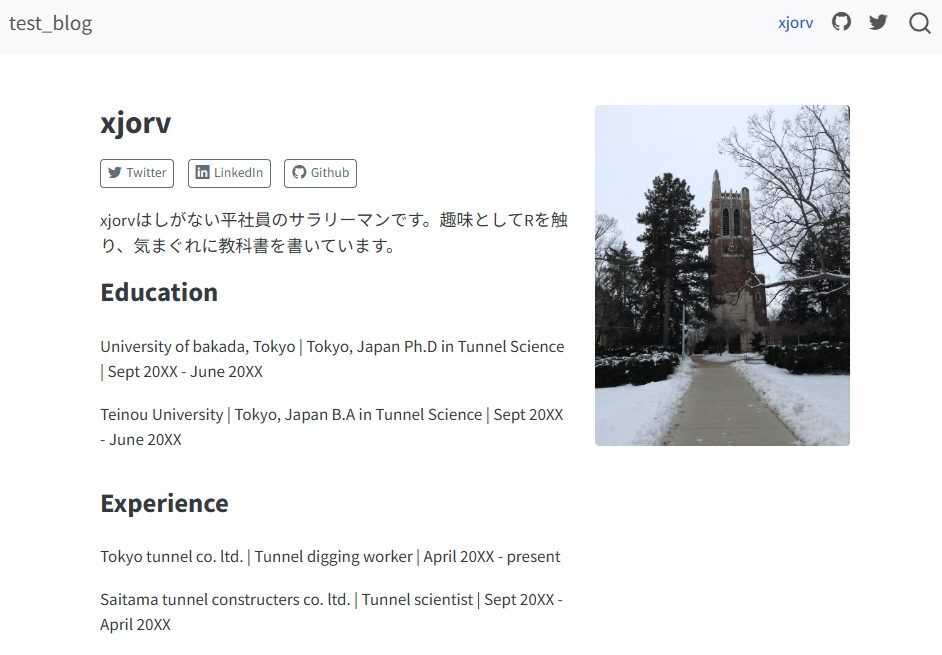](./image/about_solana.png)

## marquee

[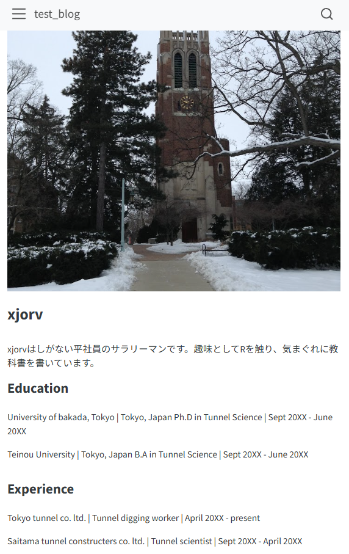](./image/about_marquee.png)

## broadside

[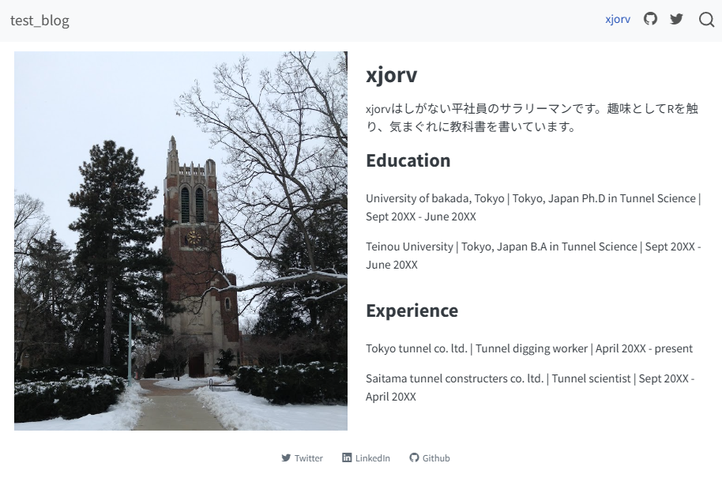](./image/about_broadside.png)

#### 42.2.4.5 RSS

Listingの説明に記載した通り、YAMLに`feed: true`を設定すると、[RSSフィード](https://ja.wikipedia.org/wiki/RSS)を設定することができます。

``` yaml
---
title: "a post"
listing:
  contents: posts
  feed: true
---
```

ただし、個別の.qmdファイルで`feed: true`と設定しただけでは、RSSを設定することはできず、`_quarto.yml`で以下のようにRSSの設定を別途記載する必要があります。

``` yaml
website:
  title: "xjorv's blog"
  site-url: https://www.myblogexample.io
  description: "A cheap sample blog"
```

## 42.3 Quarto Book

Quartoで教科書などの本を書くときに用いる`project`の`type`が`type: book`です。`book`はR markdownの拡張である、[bookdown](https://bookdown.org/)([Xie 2024](#ref-bookdown_bib))を基とした`type`で、YAMLでは以下のように記載することで`book`のスタイルを適用することができます。

``` yaml
project:
  type: book
```

### 42.3.1 Quarto Bookの構造

Quarto Bookの構造は`website`と比較して単純で一本道となります。Bookの基本的な要素は`index.qmd`、各章に当たる`.qmd`ファイル、`summary.qmd`、`reference.qmd`の4つです。Quarto Bookでは`index.qmd`は表紙とまえがき、`summary.qmd`があとがき、`reference.qmd`は参考文献に当たります。この3種類はQuarto Projectを用いる場合にも作成されます。

各章の`.qmd`ファイルにはどのような名前を付けても問題ありませんが、各文書がどの章を構成するのかをYAMLで指定する必要があります。

``` yaml
book: 
  chapters:
    - index.qmd
    - part: "part 1"
      chapters: 
      - chapter1.qmd
      - chapter2.qmd
    - part: "part 2"
      chapters: 
      - chapter3.qmd
      - chapter4.qmd
    - summary.qmd
    - references.qmd
```

上記のように設定すると、本の章立てとしては、まず始めのページが`index.qmd`、次に`chapter1.qmd`と`chapter2.qmd`が「part 1」という話題の1章、2章、次の`chapter3.qmd`と`chapter4.qmd`が「part 2」の3章、4章、最後に`summary.qmd`と`references.qmd`が続く形になります。要は、この`chapters`のYAMLに設定した順に章が進むということになります。

ただし、章番号は上記の`chapter1.qmd`が1章にはならず、`index.qmd`が1章とされます。`index.qmd`を1章とせず、`chapter1.qmd`を1章とする場合には、`index.qmd`のheaderに`{.unnumbered}`を設定する必要があります。また、`summary.qmd`や`references.qmd`にも`index.qmd`と同様に章番号が振られるので、番号を振りたくない場合には`{.unnumbered}`を設定するとよいでしょう。

``` markdown
## はじめに {.unnumbered}
```

### 42.3.2 参照（Cross references）

Quarto Bookでは、その章内の図やchunkだけでなく、他の章の記載内容を参照すること（Cross references）ができます。たとえば、以下のようにリンクを記載すると、特定の章の.qmdに対応したページへのリンクを作成できます。

``` markdown
[第1章](chapter1.qmd)

[第1章](./chapter1.html) # このような形でも章へのリンクを作成できる
```

[第1章](chapter1.llms.md)

------------------------------------------------------------------------

また、以下のようなリンクを作成することで、その章の各header（小項目）までのリンクを作成することもできます。

``` markdown
[第1章](chapter1.qmd#rstudioのインストール)
```

[第1章 Rstudioのインストール](chapter1.llms.md#rstudioのインストール)

------------------------------------------------------------------------

文中のHeaderに`#sec-XXX`（`XXX`は任意の文字）というタグをつけておくと、`@sec-XXX`という形でそのHeaderへの参照を作成することもできます。

``` markdown
##### Header5 [#sec-XXX]

@sec-XXXを参照
```

##### 42.3.2.0.1 Header5

[sec-XXX](#sec-XXX) を参照

------------------------------------------------------------------------

### 42.3.3 図・画像・表への参照

chunk optionとして`label`を設定しておくと、その`label`を参照し、リンクを作成することができます。また、画像や表に対しても参照を行うことができます。

ただし、参照のための`label`の付け方にはルールがあり、図や画像のラベルは`fig-`から、表のラベルは`tbl-`から始める必要があります。また、`label`にはアンダースコア（`_`）を用いることはできません。

```` markdown
```{r}
#| label: fig-cars-plot
#| filename: chunk：ラベルを設定する

plot(cars)
```
````

[](chapter42_files/figure-html/fig-cars-plot-1.png "Figure 42.1: ")

Figure 42.1

``` markdown
`cars`は自動車のスピードと停止するまでの距離の関係を表したデータです @fig-cars-plot 。
```

`cars`は自動車のスピードと停止するまでの距離の関係を表したデータです [Figure fig-cars-plot](#fig-cars-plot) 。

------------------------------------------------------------------------

``` markdown
{#fig-bud}
  
奈良の大仏 @fig_bud
```

[](./image/bud.jpg "Figure 42.2: 大仏")

Figure 42.2: 大仏

奈良の大仏 [Figure fig-bud](#fig-bud)

------------------------------------------------------------------------

``` markdown
+-----+-----+-----+
| pet | age | sex |
+=====+=====+=====+
| dog | 5   | F   |
+-----+-----+-----+
| cat | 3   | M   |
+-----+-----+-----+
  
: 表のラベル {#tbl-dog-cat}
  
  
表を参照する @tbl-dog-cat 。
```

| pet | age | sex |
|-----|-----|-----|
| dog | 5   | F   |
| cat | 3   | M   |

Table 42.1: 表のラベル

表を参照する [Table tbl-dog-cat](#tbl-dog-cat) 。

## 42.4 Website・BookのRender

WebsiteやBookの.qmdを作成したら、HTMLをRenderします。Website・Bookのいずれの場合も、RStudioでは上に表示されているRenderボタンを押すことでRenderすることができます。

[](./image/Quarto_render_from_Rstudio.png "Renderボタン")

Renderボタン

また、TerminalでProjectのフォルダに移動し、`quarto render`のコマンドを実行することでもWebsite・BookをRenderすることができます。

``` bash
quarto render
```

Renderを実行すると、Websiteではそのフォルダとサブフォルダに含まれている`.qmd`ファイルがHTMLに変換されます。一方でBookでは、そのフォルダ内の.qmdファイルのうち、`chapters`で章に設定した.qmdファイルだけがHTMLに変換されます。

### 42.4.1 freeze

WebsiteやBookでは、.qmdファイルを指定せずにRenderすると、変換する.qmdファイルに含まれるRのスクリプトがすべて再計算され、Renderされます。すでにHTMLを作成し、.qmdに変更がない場合にもこの再計算は実行されます。したがって、WebsiteやBookのサイズが大きくなると、再計算に時間がかかるようになります。

一度HTMLを作成した.qmdについて、ファイルに変更がない場合にRenderを実施しないようにするには、`freeze: auto`を設定します。また、`freeze: true`を設定すると、.qmdのRenderが行われなくなります。

大きなWebsiteを作成する場合には、作成中には`freeze: auto`を用い、以下に述べるデプロイの前には`freeze: false`として全体をRenderするような運用を行うとよいかと思います。

``` yaml
execute:
  freeze: auto # true/auto/falseのいずれかを選択する
```

> **TIP:**
>
> 大きなWebsiteやBookを作成する場合、`freeze: auto`はRenderにかかる時間を短縮できる便利な設定です。ただし、.qmdファイルに変更がないのに内容が変わるような場合、例えば.qmdファイル中で読み込むデータを修正した場合などには、この変更が適用されずにRenderが終了してしまいます。HTMLを共有・公開する前などには、`freeze: false`に設定を変更し、Renderしたほうがよいでしょう。

Kross, Sean. 2022. *Postcards: Create Beautiful, Simple Personal Websites*. <https://doi.org/10.32614/CRAN.package.postcards>.

Xie, Yihui. 2024. *Bookdown: Authoring Books and Technical Documents with r Markdown*. <https://github.com/rstudio/bookdown>.

Back to top
