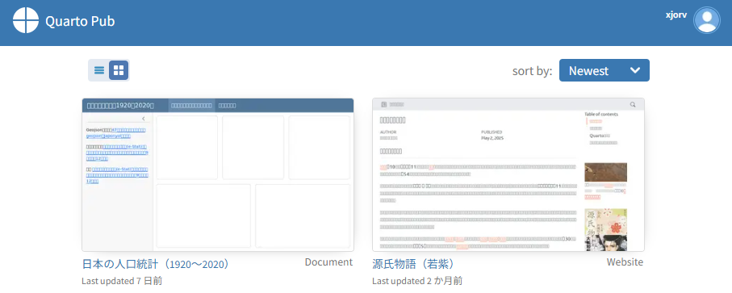
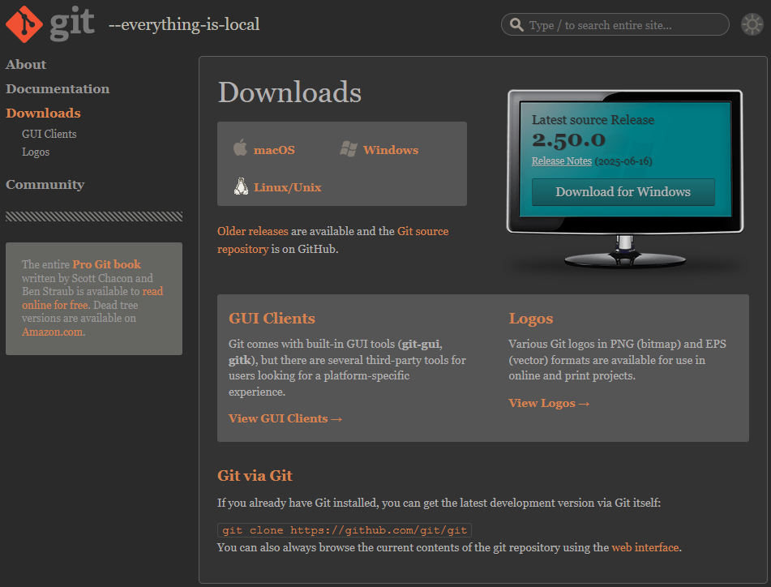
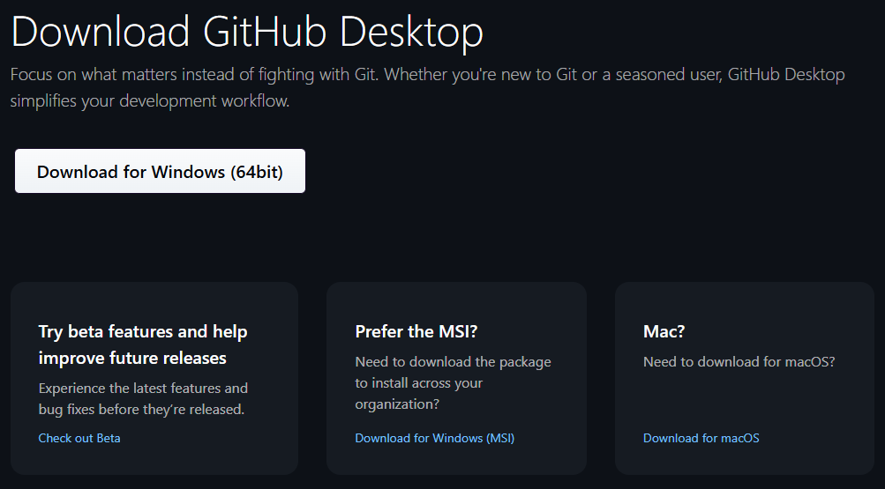
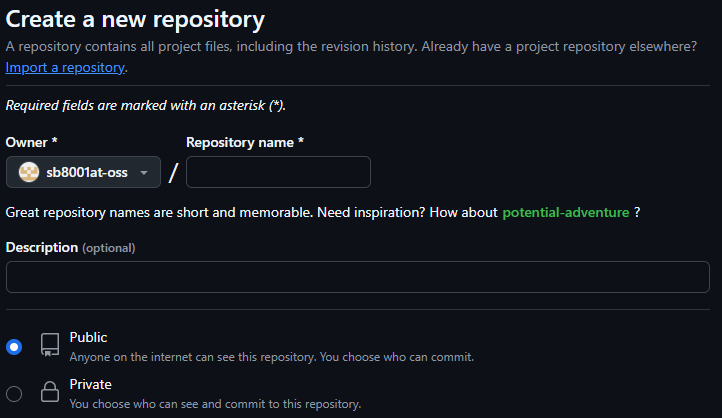
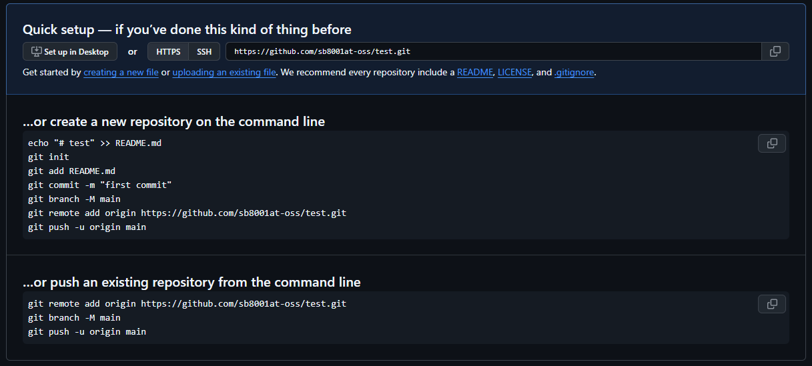
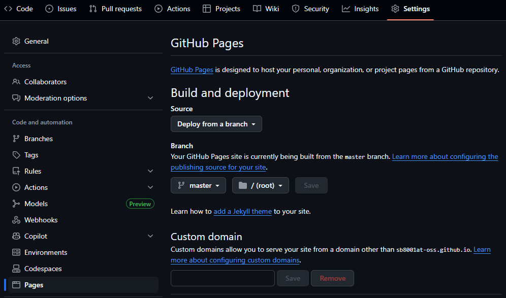

# 43  Quarto：デプロイ

Code

WebsiteやBookをRenderし、HTMLを作成した後、そのHTMLをWeb上で公開すれば、世界中の人達がそのWebsiteやBookを読むことができます。HTMLをWeb上で公開するというのは、Webに繋がったコンピュータ（Webサーバー）にHTMLファイルを置き、Web上でこのHTMLファイルにアクセスができるようにすることです。このHTMLの公開のことを**`デプロイ`**と呼びます。

デプロイをするためには、Webサーバーが必要となります。自前でWebサーバーを準備することもできますが、通常はWebサーバーを運用しているサービスを利用することになります。

Webサーバーを運用しているサービスには、[Amazon web servise](https://aws.amazon.com/jp)や[Microsoft Azure](https://azure.microsoft.com/ja-jp)などがありますが、いずれも有料です。Quartoで作成したHTML（Webサーバーで演算を行わないので、静的なHTMLと呼ばれます）をデプロイするのであれば、これらの有料サービスではなく、無料のサービスを利用することができます。

無料のサービスには、Positが運営しているQuarto専用のサービスである[**Quarto Pub**](https://quartopub.com/)や、もっと汎用的にHTMLの公開に用いることができる[**Github Pages**](https://docs.github.com/ja/pages/getting-started-with-github-pages/creating-a-github-pages-site)などがあります。

これらの無料のサービスでは公開したHTMLは基本的にはWeb上に完全に公開されます。企業内など、特定のユーザーのみがアクセスできる設定にはできません。また、アクセス数に制限があり、高頻度でアクセスされると表示が遅くなったり、表示できなくなったりします。また、HTMLのサイズにも制限があります。

とは言え、個人で作成するようなWebsiteやBookではアクセス制限に到達したり、HTMLのサイズが大きくなりすぎることはあまりないと思います。Quartoで作成したHTMLを公開する場合、とりあえずはQuarto pubかGithub Pagesでデプロイすることを検討するとよいでしょう。

## 43.1 Quarto Pub

Quarto Pubは上記の通り、Positが運営しているサービスで、Rstudioを用いていれば簡単にHTMLをデプロイすることができます。

Quarto Pubにデプロイする場合、まずはQuarto Pubにアカウントを作成する必要があります。まずはQuarto Pubのホームページにアクセスし、「Sign Up」を選択しましょう。Quarto PubのログインにはGoogleやGithubのアカウントを用いることもできます。

[](./image/quarto_pub.png "Quarto Pubのページからアカウントを作成する")

Quarto Pubのページからアカウントを作成する

Quarto Pubにアカウントを作成した後、TerminalでWebsiteやBookのProjectのディレクトリに移動した後、`quarto publish`コマンドを用いることでそのProject内の.qmdファイルがHTMLにRenderされ、そのHTMLがQuarto Pubにデプロイされます。

``` terminal
quarto publish quarto-pub.qmd
```

`quarto publish`コマンドを入力すると、Terminal上でQuarto Pubへの認証が行われます。必要な情報を入力すると、作成したQuarto PubのアカウントにProjectの.qmdもしくは指定した.qmdファイルがHTMLにRenderされた後、デプロイされます。

### 43.1.1 アクセストークン（Access Token）

上記のQuarto Pubの認証では、アクセストークン（Access Token）というものが要求されます。アクセストークンは上記のQuarto Pubのアカウントにログインし、アカウント内のページから取得することができます。認証の途中で入力を求められるため、コピーしておいてテキストとしてTerminalで貼り付けるとよいでしょう。詳細については[QuartoのGuide](https://quarto.org/docs/publishing/quarto-pub.html#access-tokens)のページをご参照ください。

### 43.1.2 Quarto Pubでのページの管理

Quarto Pubにログインすると、デプロイしたProjectの一覧が表示されます。このページから、デプロイしたページに移動したり、デプロイしたProjectを削除することができます。

[](./image/quarto_pub_loggedin.png "Quarto Pub：ページの管理")

Quarto Pub：ページの管理

## 43.2 Github Pages

Github Pagesは、リモートリポジトリサービスであるGithubが運用している、静的なHTMLをデプロイするためのサービスです。Github PagesではGithubのリモートリポジトリに保存したHTMLを公開することができます。

Githubの使い方についてはこのテキストの範囲を越えるため詳細については説明しませんが、Github Pagesを用いるために最低限必要なことのみ以下のcalloutブロックで説明します。

> **TIP:**
>
> GitやGithubについてはWeb上にたくさん資料があります。以下のページなどを参考にGitに入門するとよいでしょう。
>
> - [Gitの教科書（Git Ready）](https://git-ready.easegis.jp/)
> - [サル先生のGit入門](https://backlog.com/ja/git-tutorial/)
>
> ここでは、QuartoをGithub Pagesで公開するのに必要な部分だけ簡単に説明します。
>
> ### Gitのインストール
>
> Githubを使い始める前に、まずはGitをインストールしましょう。[Gitの公式ページ](https://git-scm.com/downloads)からインストーラーをダウンロードし、インストールします。
>
> [](./image/git_download.png "Gitのダウンロード")
>
> Gitのダウンロード
>
> Githubが提供している[Github Desktop](https://desktop.github.com/download/)にもGitが含まれています。Githubを使う前提であれば、Github Desktopをダウンロードし、インストールしてもよいでしょう。
>
> [](./image/github_desktop_downloads.png "Github Desktopのダウンロード")
>
> Github Desktopのダウンロード
>
> ### Git：ユーザー名とメールアドレスの登録
>
> Gitをインストールすると、TerminalからGitのコマンドを利用できるようになります。Gitのコマンドを利用して、Terminalからユーザー名とメールアドレスを登録します。
>
> ユーザー名は、以下のように`user.name`として文字列で指定して登録します。以下の例ではユーザー名は「XXXXX」となります。
>
> ``` terminal
> git config --global user.name "XXXXX"
> ```
>
> 同様に、メールアドレスは`user.email`として文字列で指定して登録します。以下の例ではメールアドレスは「XXXXX.@xjorv.com」となります。
>
> ``` terminal
> git config --global user.email "XXXXX.@xjorv.com"
> ```
>
> ### Githubのアカウントの取得
>
> 次に、[Githubのアカウント](https://github.com/)を作成します。
>
> [](./image/github_signup.png "Githubアカウントの作成")
>
> Githubアカウントの作成
>
> ### Githubにリモートリポジトリを作成する
>
> 作成したアカウントでGithubにログインし、リモートリポジトリを作成します。リモートリポジトリとは、開発しているプログラムを保存するWeb上のフォルダのようなものです。
>
> Githubのアカウントのページで「repositories」のタブに移動すると、「new」というボタンがあります。このボタンを押すことでレポジトリ作成のページに移行します。
>
> [](./image/github_new_repo.png "新しいリモートレポジトリを作成する")
>
> 新しいリモートレポジトリを作成する
>
> この「Create a new repository」のページ上で、Repository nameをつけます。Repository nameは英語名で、スペースを入れないものとします。仮に「test」というリポジトリを作成します。
>
> また、Github Pagesで広くネットにWebsiteを公開する場合、レポジトリはPublic、つまり誰でも閲覧できる形で作成する必要があります。
>
> ### gitの設定とcommit
>
> TerminalでProjectのディレクトリに移動し、`git init`と入力します。このコマンドを用いることで、Gitに必要なファイルがそのディレクトリに作成されます。
>
> ``` terminal
> git init
> ```
>
> 次に、ディレクトリ内に保存されているファイルを**commit**します。commitは、現在作成しているファイルの内容を記録することを指します。後ほどファイルを変更した時には、commitした点と変更した点を比較したり、commitした時点のファイルを復活させたりすることができます。
>
> commitの詳細については[gitのtutorial](https://git-scm.com/docs/gittutorial)や[サル先生のGit入門](https://backlog.com/ja/git-tutorial/)をご参照下さい。
>
> ディレクトリ内のすべてのファイルをcommitするためには、まず`git add`コマンドを実行し、その後、`git commit`コマンドを実行します。
>
> 引き続き、TerminalでProjectのディレクトリに移動して、以下のように入力します。`-A`はすべてのファイルをcommitできるように準備するためのコマンドです。
>
> ``` terminal
> git add -A
> ```
>
> 次に、commitを行います。commitでは**commitメッセージ**の入力が必要です。以下のように入力し、commitメッセージを追加します。
>
> ``` terminal
> git commit -m "commit message"
> ```
>
> ### GithubのリモートリポジトリとGitを関連付ける
>
> Web上のリモートリポジトリであるGithubと自分のPC（ローカル）で機能するローカルレポジトリであるGitを関連付けることで、Terminalから簡単にGithubへとファイルを転送することができるようになります。
>
> Github上に作成したリモートリポジトリに移動すると以下のように関連付けの方法が表示されます。
>
> [](./image/github_remote_add.png "Githubのリモートリポジトリに表示されるコマンド")
>
> Githubのリモートリポジトリに表示されるコマンド
>
> 上記のコマンドに従い、`git remote`コマンドを実行します。
>
> ``` terminal
> git remote add origin https://github.com/sb8001at-oss/test.git
> ```
>
> これでcommitしたレポジトリをリモートリポジトリにアップロードする準備が整いました。
>
> ### 43.2.1 Githubのリモートリポジトリにフォルダの内容をアップロードする
>
> リモートリポジトリとの関連付けが終わったら、ファイルをリモートリポジトリに**push**（アップロード）します。`git push`コマンドを用いて、先ほどのリモートリポジトリにファイルをアップロードします。
>
> ``` terminal
> git push origin main
> ```
>
> pushを行うと、Githubのリモートリポジトリのページからファイルが見えるようになります。

### 43.2.2 Github Pagesを設定する

GithubのリモートリポジトリにファイルをPushしたら、次にリモートリポジトリのページからGithub Pagesの設定を行います。

Githubにログインし、ファイルをPushしたリモートリポジトリに移動します。次に、上のタブから「Setting」を選択し、左のカラムから「Pages」を選択します。選択すると以下のようなページに移動します。

[](./image/github_pages_setting.png "Github Pagesの設定")

Github Pagesの設定

このページでBranchを`main`（上の図では`master`になっています）、`/(root)`もしくは`/docs`から選択します。rootの場合はProjectのディレクトリにあるHTMLを、/docsの場合はProjectのディレクトリに作成した/docsのディレクトリ内のHTMLをそれぞれデプロイすることになります。

QuartoではRenderで出力するHTMLは`_site`や`_book`のフォルダ内に保存されるため、以下のようにYAMLで`docs`フォルダに保存するようにしておくとよいでしょう。

``` yaml
project:
  type: book
  output-dir: docs
```

フォルダを選択し、「Save」を選択すると、HTMLがデプロイされます。少し待って、表示されるページのリンクを選択すれば、作成したHTMLにWeb上でアクセスできます。

## 43.3 その他のサービスについて

[QuartoのGuide](https://quarto.org/docs/publishing/)では、HTMLをデプロイするためのサービスの例として、[Neltify](https://www.netlify.com/)、[Posit Connect](https://posit.co/products/enterprise/connect/)、[Posit Cloud](https://posit.cloud/)、[Confluence](https://www.atlassian.com/software/confluence)、[hugging face](https://huggingface.co/)、[Firebase](https://firebase.google.com/)、[Site44](https://www.site44.com/)、[Amazon S3](https://aws.amazon.com/jp/s3)などが挙げられています。いずれもそれぞれ使い方が異なり、有料のものも含まれています。作成するページのトラフィックが非常に大きいようならこれらのサービスを用いることを検討してみてもよいでしょう。また、日本では[さくらインターネット](https://www.sakura.ad.jp/)などのクラウドサービスを用いてもデプロイすることができます。

## 43.4 Google Analytics

作成したページのアクセスを解析するサービスが[Google Analytics](https://developers.google.com/analytics?hl=ja)です。Google Analyticsを利用するには、まずGoogleのアカウントでGoogle Analyticsにログインします。次に、設定の画面からアカウントとプロパティを作成します。このプロパティがページへのアクセスを測定する機能に相当します。

プロパティには、[tracking ID](https://support.google.com/analytics/answer/9539598?hl=ja)か[tag measurement ID](https://support.google.com/analytics/answer/9539598?hl=en)があります。このIDのいずれかを以下のようにYAMLを設定することで、Google Analyticsのページからアクセスを解析することができます。

``` yaml
book:
  google-analytics: "G-XXXXXXXXXX"
```

## 43.5 Google Search Console

Quarto PubやGithub Pagesに登録したウェブページはそのままではGoogleの検索にはかかりません。この検索の設定を行うためのツールが[Google Search Console](https://search.google.com/search-console/about?hl=ja)です。Google Search Consoleにページを登録し、sitemapというものを作成すると、Googleの検索にページが登録されるようになります。詳しくは、こちらの[noteの記事](https://note.com/mahiro001/n/nbcbd001b630f)や、[Qiitaの記事](https://qiita.com/NightOwl/items/a7f972ba70f1ad037d65)をご参照下さい。

Back to top
