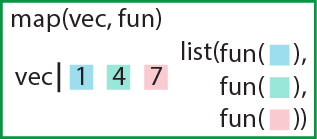
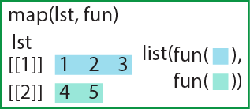
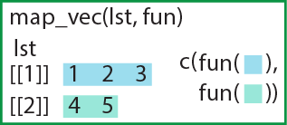
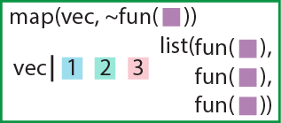
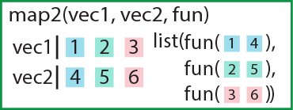
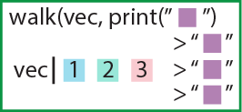

# 44  purrr

Code

[`purrr`](https://purrr.tidyverse.org/)パッケージ([Wickham and Henry 2023](#ref-purrr_bib))はリストや行列に関数を適用する関数、[apply関数群](chapter15.llms.md)に似たものを提供するパッケージです。`purrr`で提供される関数は、`map`関数と呼ばれる一連の関数になります。

`purrr`は`tidyverse`に含まれるパッケージですので、`tidyverse`をロードすると同時に呼び出されます。

``` downlit
pacman::p_load(tidyverse)
```

## 44.1 map関数

`map`関数はベクターもしくはリストと関数を引数に取り、ベクター/リストの要素を関数の引数とした返り値のリストを返す関数です。`map`関数は`apply`関数の`mapply`関数が最もよく似た機能を持つ関数ですが、mapplyのように返り値がベクターになったりリストになったりとすることはなく、常にリストを返します。

[](./image/map.png "ベクターを引数にしたときのmap関数")

ベクターを引数にしたときのmap関数

下の例では、`c(1, 2, 3)`のベクターを引数とし、関数`f`（引数に3を足す関数）を各要素に適用します。返り値はそれぞれの計算結果のリストとなっています。

``` downlit
f <- \(x){x + 3} # xに3を足す関数
vec <- 1:3
map(vec, f) # ベクターの要素を関数の引数とし、結果をリストで返す
## [[1]]
## [1] 4
## 
## [[2]]
## [1] 5
## 
## [[3]]
## [1] 6
```

リストを引数に取った時にも同様に、`map`関数はリストの要素を関数の引数としたリストを返します。こちらの計算はほぼ`lapply`と同じです。

[](./image/map_arg_list.png "リストを引数とするときのmap関数")

リストを引数とするときのmap関数

``` downlit
lst <- list(1, c(1, 3), c(1, 3, 4))
map(lst, f)
## [[1]]
## [1] 4
## 
## [[2]]
## [1] 4 6
## 
## [[3]]
## [1] 4 6 7

lapply(lst, f) # 結果はlapplyと同じ
## [[1]]
## [1] 4
## 
## [[2]]
## [1] 4 6
## 
## [[3]]
## [1] 4 6 7
```

### 44.1.1 返り値がベクターのmap関数

上記の`map`関数は返り値がリストですが、`map`関数の後ろに型名がついた関数群（`map_chr`、`map_lgl`、`map_int`、`map_dbl`、`map_vec`）は返り値がベクターになる関数です。

使い方は`map`関数とほぼ同じで、ベクター/リストと関数を引数に取り、型名に従った型のベクターを返します。`map_chr`は文字列ベクター、`map_lgl`は論理型ベクター、`map_int`は整数型ベクター、`map_dbl`は数値型ベクターをそれぞれ返します。この設定された返り値の型を返さない関数を適用した場合には、これらの`map`関数はエラーを返します。ただし、`map_vec`関数では返り値の型が引数に用いる関数の設定に従います。

[](./image/map_vec.png "map_vec：ベクターを返す")

map_vec：ベクターを返す

また、関数の返り値が2つ以上の要素からなる場合にもエラーが返ってきます。

``` downlit
map_chr(1:3, class) # ベクターを引数に取る場合
## [1] "integer" "integer" "integer"

map_chr(lst, mode) # リストを引数に取る場合
## [1] "numeric" "numeric" "numeric"

map_lgl(lst, is.atomic) # 論理型（TRUEとFALSE）が返ってくる
## [1] TRUE TRUE TRUE

map_int(lst, mean) # integerが返ってくる（エラーが出る）
## Error in `map_int()`:
## ℹ In index: 3.
## Caused by error:
## ! Can't coerce from a number to an integer.

map_dbl(lst, mean) # doubleが返ってくる
## [1] 1.000000 2.000000 2.666667

map_dbl(lst, f) # 関数の返り値が1つでない場合はエラー
## Error in `map_dbl()`:
## ℹ In index: 2.
## Caused by error:
## ! Result must be length 1, not 2.

map_vec(lst, class) # 返り値の型を特定しない場合
## [1] "numeric" "numeric" "numeric"
```

> **TIP:**
>
> Rでは、演算の過程で型が変化してうまく演算が行われない、というエラーがしばしば起こります。変数等にデータ型を定義する過程がないために、変数の型が変わってもエラーを出す仕組みがないためです。型名付きの`map`関数を用いることで、計算結果の型を縛ることができ、型の問題を起こりにくくすることができます。

### 44.1.2 第一引数を計算に用いない場合のmap関数

`map`関数の第二引数にすでに引数ありの関数を用いる場合、関数名の前にチルダ（`~`）を用います。このように引数を指定して関数を用いる場合には、第一引数に指定したベクターは用いられません。このような場合には、第一引数の長さ分だけ単に第二引数で設定した計算を繰り返すことになります。この演算では`replicate`関数と同じような計算を行うことになります。ただし`map`関数の返り値はリストで、`replicate`関数の返り値は行列となります。

[](./image/map_tilde.png "map：チルダで関数を指定する")

map：チルダで関数を指定する

``` downlit
set.seed(0)
# 1~10から15回サンプリングする試行を4回繰り返す（返り値はリスト）
map(1:4, ~ sample(1:10, 15, replace = T)) 
## [[1]]
##  [1]  9  4  7  1  2  7  2  3  1  5  5 10  6 10  7
## 
## [[2]]
##  [1]  9  5  5  9  9  5  5  2 10  9  1  4  3  6 10
## 
## [[3]]
##  [1] 10  6  4  4 10  9  7  6  9  8  9  7  8  6 10
## 
## [[4]]
##  [1]  7  3 10  6  8  2  2  6  6  1  3  3  8  6  7

set.seed(0)
# 同じ計算をreplicateで行う（返り値は行列）
replicate(4, sample(1:10, 15, replace = T))
##       [,1] [,2] [,3] [,4]
##  [1,]    9    9   10    7
##  [2,]    4    5    6    3
##  [3,]    7    5    4   10
##  [4,]    1    9    4    6
##  [5,]    2    9   10    8
##  [6,]    7    5    9    2
##  [7,]    2    5    7    2
##  [8,]    3    2    6    6
##  [9,]    1   10    9    6
## [10,]    5    9    8    1
## [11,]    5    1    9    3
## [12,]   10    4    7    3
## [13,]    6    3    8    8
## [14,]   10    6    6    6
## [15,]    7   10   10    7
```

## 44.2 applyとmap

データフレームは基本的にリストですので、`map`関数の引数に取ることができます。この時の計算は`apply`関数で列方向（`MARGIN=2`）での計算とほぼ同じになります。ただし、`apply`関数の返り値はベクターで、`map`関数の返り値はリストです。`apply`関数と一致した結果を返す関数は`map_vec`（返り値が数値の場合は`map_dbl`）になります。

``` downlit
apply(iris[, 1:4], 2, mean)
## Sepal.Length  Sepal.Width Petal.Length  Petal.Width 
##     5.843333     3.057333     3.758000     1.199333

map(iris[, 1:4], mean)
## $Sepal.Length
## [1] 5.843333
## 
## $Sepal.Width
## [1] 3.057333
## 
## $Petal.Length
## [1] 3.758
## 
## $Petal.Width
## [1] 1.199333

map_dbl(iris[, 1:4], mean)
## Sepal.Length  Sepal.Width Petal.Length  Petal.Width 
##     5.843333     3.057333     3.758000     1.199333
```

### 44.2.1 map関数とmap_dbl関数の違い

上で少し述べた通り、関数の返り値の要素が2つ以上の場合、ベクターを返す`map_vec`関数（`map_dbl`など）はエラーを返します。一方で通常の`map`関数の返り値はリストですので、複数の返り値をリストの要素として返すことができます。

``` downlit
f2 <- \(x){cumprod(x)}

map(lst, f2) # mapは複数要素の結果を返す
## [[1]]
## [1] 1
## 
## [[2]]
## [1] 1 3
## 
## [[3]]
## [1]  1  3 12

# map_dblはベクターを返すので、複数要素の結果を受け付けない（エラー）
map_dbl(lst, f2) 
## Error in `map_dbl()`:
## ℹ In index: 2.
## Caused by error:
## ! Result must be length 1, not 2.
```

### 44.2.2 関数内で引数の位置を指定する

`map`関数の第2引数に指定する関数には無名関数を用いることができます。また、関数内で引数の位置を指定する場合には、関数の前にチルダ（`~`）を置いたうえで、`.x`の形で引数が代入される位置を指定します（パイプ演算子における`.`や`_`と同じです）。この時、`.`がない`x`を引数として指定すると、関数外で定義された`x`を拾ってきて計算する形となります。定義されていなければ当然エラーとなります。

``` downlit
2:4 |> cumprod() # 累積積のベクターを返すcumprod関数
## [1]  2  6 24

map(lst, \(x){cumprod(x)}) # xを関数内で定義
## [[1]]
## [1] 1
## 
## [[2]]
## [1] 1 3
## 
## [[3]]
## [1]  1  3 12

map(lst, ~cumprod(.x)) # 第一引数が代入される位置を指定（上と同じ）
## [[1]]
## [1] 1
## 
## [[2]]
## [1] 1 3
## 
## [[3]]
## [1]  1  3 12

# .がないと関数外のxを拾ってくる
x <- c(2, 3, 4)
map(lst, ~cumprod(x))
## [[1]]
## [1]  2  6 24
## 
## [[2]]
## [1]  2  6 24
## 
## [[3]]
## [1]  2  6 24

# 定義していない変数yを用いるとエラーとなる
map(lst, ~cumprod(y))
## Error in `map()`:
## ℹ In index: 1.
## Caused by error in `.f()`:
## ! object 'y' not found
```

> **TIP:**
>
> プログラム中で宣言した変数が有効に定義されている範囲のことを**スコープ**と呼びます。Rではスコープの問題で困ることはほとんどないのですが、関数を定義するときや、[47章](chapter47.llms.md)で説明する`Shiny`というWebアプリを作成するパッケージを用いるときには注意が必要となる概念です。
>
> Rでは、ほとんどの変数はグローバルスコープと呼ばれる、どこでも大体呼び出せるスコープで定義されます。ただし、関数の定義の中で宣言した変数は関数外から呼び出すことはできません。これは関数の中での変数宣言がローカルスコープ（その場だけで呼び出せるスコープ）になっているからです。
>
> `map`関数では、`.x`はローカルスコープの変数を呼び出し、`x`はグローバルスコープの変数を呼び出している形となります。
>
> ``` downlit
> # 関数内はローカルスコープなので、yはグローバルスコープには存在しない
> f <- function(x){y <- 1; x}
> y
> ## Error:
> ## ! object 'y' not found
>
> # 関数内（ローカルスコープ）でyに代入しても、グローバルスコープのyには影響しない
> y <- 2
> f <- function(x){y <- 1; x}
> y
> ## [1] 2
>
> # for文の中はグローバルスコープ
> for(i in 1:5){
>   y <- 5
> }
> y
> ## [1] 5
> ```

### 44.2.3 チルダの有無での結果の違い

第一引数が関数の引数として用いられないときには、チルダ（`~`）の有無によって結果が変わります。チルダがない場合には、関数の結果が返ってこず、単に第一引数をリストにしたものが返ってきます。一方でチルダがある場合には、関数の演算が3回評価されて、結果がリストで返ってきます。

``` downlit
map(1:3, runif(2)) # runif(2)は返ってこない
## [[1]]
## [1] 1
## 
## [[2]]
## [1] 2
## 
## [[3]]
## [1] 3

map(1:3, ~runif(2)) # runif(2)が返ってくる
## [[1]]
## [1] 0.4346595 0.7125147
## 
## [[2]]
## [1] 0.3999944 0.3253522
## 
## [[3]]
## [1] 0.7570871 0.2026923
```

### 44.2.4 関数の位置に数値を入れる

関数の位置に数値を入れると、インデックスとして取り扱われます。`lst`の各要素のインデックス`[1]`はすべて`1`になっているため、`map_dbl(lst, 1)`は`1`が3つのベクターが返ってきます。`map_dbl(lst, 2)`の場合、lstの1つ目の要素のインデックス`[2]`は定義されていないため、演算ができずエラーが返ってきます。

``` downlit
lst # lstの各要素の始めのインデックスは1
## [[1]]
## [1] 1
## 
## [[2]]
## [1] 1 3
## 
## [[3]]
## [1] 1 3 4

map_dbl(lst, 1) # c(1, 1, 1)が返ってくる
## [1] 1 1 1

# lst[1]には2個目の要素がないのでエラー
map_dbl(lst, 2) 
## Error in `map_dbl()`:
## ℹ In index: 1.
## Caused by error:
## ! Result must be length 1, not 0.
```

### 44.2.5 複数の引数を指定する

関数に複数の引数を指定する場合には、後に説明する`map2`や`pmap`というものを用いる方法もありますが、`map`関数でも複数の引数を指定することはできます。

`map`関数で2つの引数を指定する場合、1つ目の引数は`map`関数の始めの引数として指定し、2つ目の引数は関数（第2引数）の後、`map`関数の第3引数として指定します。

ただし、2つ目の引数を指定する場合には、後に説明する`map2`や`pmap`を用いるほうがわかりやすくて良いでしょう。

``` downlit
f3 <- \(x, y){c(x, y)} # 単にベクターをつなぐ関数
vec
## [1] 1 2 3

map(vec, f3, runif(1)) # xにvec、yにrunif(1)が設定される
## [[1]]
## [1] 1.0000000 0.7111212
## 
## [[2]]
## [1] 2.0000000 0.7111212
## 
## [[3]]
## [1] 3.0000000 0.7111212

map(vec, f3, runif(2)) # yにrunif(2)（一様乱数2つ）が設定される
## [[1]]
## [1] 1.0000000 0.1216919 0.2454885
## 
## [[2]]
## [1] 2.0000000 0.1216919 0.2454885
## 
## [[3]]
## [1] 3.0000000 0.1216919 0.2454885
```

### 44.2.6 パイプ演算子とmap関数

`purrr`は`tidyverse`に含まれるパッケージの一つです。他の`tidyverse`のパッケージ、`dplyr`や`tidyr`、`stringr`、`forcat`と同様に、`purrr`も基本的にはパイプ演算子（`%>%`もしくは`|>`、[20章](chapter20.llms.md)を参照）を使用しやすいように設計されています。パイプ演算子を用いることで、`map`関数を2つ実行し、2回演算後のベクターを取得するなどの演算を簡単に行うことができます。

``` downlit
lst
## [[1]]
## [1] 1
## 
## [[2]]
## [1] 1 3
## 
## [[3]]
## [1] 1 3 4

lst |> map(cumprod) # 累積積を計算したリスト
## [[1]]
## [1] 1
## 
## [[2]]
## [1] 1 3
## 
## [[3]]
## [1]  1  3 12

lst |> map(cumprod) |> map_dbl(sum) # 累積積の和をベクターで返す
## [1]  1  4 16
```

### 44.2.7 統計でのmap関数の使用

線形回帰などを一度にたくさん行う際に、`map`関数は活躍します。`split`関数はデータフレームを因子の列で分割し、データフレームのリストとする関数です。この関数の返り値を引数として`map`関数を計算することで線形回帰などの統計の計算を一度に行うことができます。

下の例では、`iris`を種（`Species`）ごとに分割したリスト（`irisPL`）を`split`関数で作成しています。この`irisPL`は`setosa`、`versicolor`、`virginica`と名前のついた3つのデータフレームのリストです。

このリストの要素である3つのデータフレームに対してそれぞれ線形回帰を行います。`map`関数では、チルダを用いて`lm`関数を呼び出し、リストの要素は`data=.x`の形で`data`引数として呼び出しています。dataには`irisPL$setosa`、`irisPL$versicolor`、`irisPL$virginica`のそれぞれのデータフレームが代入されますので、列名を用いて線形回帰を行うことができます。この形で計算した結果は線形回帰の結果オブジェクト（`lm`クラスのオブジェクト）のリストとなります。

この`lm`オブジェクトのリストから係数を取り出す場合には、上記の回帰結果に`map(coef)`をパイプで繋ぎます。この`coef`関数は`lm`オブジェクトを引数に取り、切片と傾き（coefficients）を返す関数です。さらに`map_dbl(2)`をパイプで繋ぐことで、`coef`関数の返り値の2番目の要素、つまり傾きだけを取り出したベクターを求めることができます。

``` downlit
irisPL <- split(iris, iris$Species) # speciesで3つのデータフレームのリストにする

# irisPLはデータフレーム3つのリスト
irisPL$setosa[1:3,]; irisPL$versicolor[1:3,]; irisPL$virginica[1:3,]
##   Sepal.Length Sepal.Width Petal.Length Petal.Width Species
## 1          5.1         3.5          1.4         0.2  setosa
## 2          4.9         3.0          1.4         0.2  setosa
## 3          4.7         3.2          1.3         0.2  setosa
##    Sepal.Length Sepal.Width Petal.Length Petal.Width    Species
## 51          7.0         3.2          4.7         1.4 versicolor
## 52          6.4         3.2          4.5         1.5 versicolor
## 53          6.9         3.1          4.9         1.5 versicolor
##     Sepal.Length Sepal.Width Petal.Length Petal.Width   Species
## 101          6.3         3.3          6.0         2.5 virginica
## 102          5.8         2.7          5.1         1.9 virginica
## 103          7.1         3.0          5.9         2.1 virginica

# 線形回帰を3つ同時に行う。.xにirisPLの各要素が代入される
irisPL |> map(~lm(Sepal.Length ~ Sepal.Width, data = .x)) 
## $setosa
## 
## Call:
## lm(formula = Sepal.Length ~ Sepal.Width, data = .x)
## 
## Coefficients:
## (Intercept)  Sepal.Width  
##      2.6390       0.6905  
## 
## 
## $versicolor
## 
## Call:
## lm(formula = Sepal.Length ~ Sepal.Width, data = .x)
## 
## Coefficients:
## (Intercept)  Sepal.Width  
##      3.5397       0.8651  
## 
## 
## $virginica
## 
## Call:
## lm(formula = Sepal.Length ~ Sepal.Width, data = .x)
## 
## Coefficients:
## (Intercept)  Sepal.Width  
##      3.9068       0.9015

# 各線形回帰の係数をリストで返す
irisPL |> map(~lm(Sepal.Length ~ Sepal.Width, data = .x)) |> map(coef) 
## $setosa
## (Intercept) Sepal.Width 
##   2.6390012   0.6904897 
## 
## $versicolor
## (Intercept) Sepal.Width 
##   3.5397347   0.8650777 
## 
## $virginica
## (Intercept) Sepal.Width 
##   3.9068365   0.9015345

# 線形回帰の係数のうち、傾き（2つ目の要素）だけをベクターで取り出す
irisPL |> map(~lm(Sepal.Length ~ Sepal.Width, data = .x)) |> map(coef) |> map_dbl(2)
##     setosa versicolor  virginica 
##  0.6904897  0.8650777  0.9015345
```

[20章](chapter20.llms.md#ネストnestしたデータ)で紹介したように、この`map`による計算は`dplyr`の`group_by`関数・`nest`関数と合わせて用いることができます。かなり使い方が複雑ですが、うまく用いることでデータフレームの列として線形回帰の結果や係数などを出力することができます。

``` downlit
# ネストしたデータフレームでのmap
d <- 
  iris |> 
  group_by(Species) |> 
  nest() |> 
  mutate(
    lmcalc = 
      map(data, ~lm(Sepal.Length ~ Sepal.Width, data = .)) |> 
      map(coef)
  )

d # dの要素はネストされたデータフレームやlmオブジェクト
## # A tibble: 3 × 3
## # Groups:   Species [3]
##   Species    data              lmcalc   
##   <fct>      <list>            <list>   
## 1 setosa     <tibble [50 × 4]> <dbl [2]>
## 2 versicolor <tibble [50 × 4]> <dbl [2]>
## 3 virginica  <tibble [50 × 4]> <dbl [2]>

d[1, 3] |> _[[1]] # setosaでの線形回帰の係数（切片・傾き）を呼び出し
## [[1]]
## (Intercept) Sepal.Width 
##   2.6390012   0.6904897
```

> **TIP:**
>
> `purrr`の関数はかなり複雑な計算を1関数で行うことができるものばかりです。`purrr`の関数による計算を`for`文などで行うと、数行～数十行のプログラムが必要となります。`purrr`は、複雑なプログラムを関数というブラックボックスに入れてしまうことで、演算を抽象化し、単純に見えるようにしています。
>
> プログラミングでは、プログラミング言語の複雑さとプログラムの複雑さの和がおおよそ一定になるとされています。以下のリンクでは、Rubyの開発者であるまつもとゆきひろさんの記事を載せています。プログラミング言語と複雑さ、抽象化の重要性が説明されています。
>
> [単純すぎて流行らなかった「FORTH」、複雑すぎてうまくいかなかった「PL/I」](https://logmi.jp/tech/articles/329932)
>
> [抽象データと継承](https://xtech.nikkei.com/it/article/COLUMN/20050913/221049/)
>
> 抽象化のいいところは、演算したいことを単純な表現で、後から読んでわかりやすく実装することができる点です。抽象化される演算をきちんと理解さえしていれば、メンテナンス性のよい、わかりやすいコードを記述することができます。
>
> 一方で、この`purrr`や`apply`関数群、`dplyr`・`tidyr`の関数など、高度に抽象化された関数は、その挙動を理解するのが難しく、演算を理解するまでは何をやっているのかよくわからない、ということがよく起こります。tidyverseではデータを大幅にいじる関数を用いるため、この理解にかかる時間が長めです。ですので、学習コストが高くなり、学習を乗り越えた人同士でしかコードを理解できなくなります。
>
> 特に`purrr`は他の関数と比べても抽象化の度合いが高いため、学習コストがかなり高めです。いろいろ試して挙動を理解するのがよいでしょう。

## 44.3 map関数群

`map`関数の一覧を以下に示します。列名には返り値の型、横軸には引数の数を示します。

| 引数 | 返り値がリスト | 返り値がベクター | 返り値が入力と同じ型 | 返り値なし |
|:---|:---|:---|:---|:---|
| 引数が1個 | map | map_vec | modify | walk |
| 引数が2個 | map2 | map2_vec | modify2 | walk2 |
| 引数が1個＋インデックス | imap | imap_vec | imodify | iwalk |
| 引数がN個 | pmap | pmap_vec | ー | pwalk |

表1：purrrの関数群 {.caption-top .table .table-sm .table-striped .small}

## 44.4 引数と返り値の型が同じ：modify関数

上記の通り、`map`関数の返り値はリスト、`map_dbl`の返り値は数値のベクターですが、引数と返り値の型を同じにしたい場合もあります。典型的な例はデータフレームです。データフレームを引数としてデータフレームが返ってくれば、`dplyr`や`tidyr`と合わせて用いやすくなります。このように、引数の型と返り値の型が同一となる関数が`modify`関数です。使い方は`map`関数と同じで、引数にリスト（データフレーム）と関数を取ります。

``` downlit
# 引数にデータフレームを準備する
d <- data.frame(
  x = 1:3,
  y = 2:4
)

map(d, cumsum) # 返り値がリスト
## $x
## [1] 1 3 6
## 
## $y
## [1] 2 5 9

map_dbl(d, sum) # 返り値はベクター
## x y 
## 6 9

modify(d, cumsum) # 返り値はデータフレーム
##   x y
## 1 1 2
## 2 3 5
## 3 6 9
```

## 44.5 map2関数

引数に2つのリスト・ベクターを取ることができるのが、`map2`関数です。`map2`関数は2つ引数を取る関数を用いて、第一、第二引数に設定したリスト・ベクターを用いた演算を行います。`apply`関数群のうちの`mapply`に似た働きをする関数ですが、引数の順番が異なること（`mapply`は関数を第一引数とする）、返り値の型が一定（リスト）であることが異なります。`map`関数でも同じようなことはできますが、引数の順番・名称から`map2`関数を用いるほうが理解しやすいでしょう。

[](./image/purrr_map2.png "map2関数")

map2関数

`map2`関数にも`map`関数と同様に、ベクターを返す関数（`map2_vec`関数など）、与えた引数と同じ型を返す`modify2`関数が設定されています。

`map2`関数で引数を数値とすると、この数値がリサイクルされ、第一引数の要素の数と揃えたうえで計算が行われることになります。また、第4引数を設定すると、この第4引数も関数の引数に適用することができます。

``` downlit
lst
## [[1]]
## [1] 1
## 
## [[2]]
## [1] 1 3
## 
## [[3]]
## [1] 1 3 4

vec
## [1] 1 2 3

map2(lst, vec, sum) # lstの要素とvecの要素をすべて足し合わせたリスト
## [[1]]
## [1] 2
## 
## [[2]]
## [1] 6
## 
## [[3]]
## [1] 11

map2_dbl(lst, vec, sum) # 返り値がベクターになる
## [1]  2  6 11

mapply(sum, lst, vec) # mapplyと同じ（引数の順番が異なる）
## [1]  2  6 11

map2_dbl(lst, 100, sum) # 引数はリサイクルされる
## [1] 101 104 108

map2_dbl(lst, vec, sum, 100) # 100もsumの引数に含まれる
## [1] 102 106 111
```

## 44.6 walk関数

関数の中には、返り値を得ることを目的としないものもあります。返り値を得ることを目的としない代表的な関数は`write.table`関数や`print`関数などです。これらの関数では、ファイルを保存したり文字列を表示したりすることが目的であり、返り値を得ることを特に求めません。

このような、返り値を求めない関数と相性が良い関数が`walk`関数です。`walk`関数は`map`関数と同じく、第一引数で指定した引数を第二引数に指定した関数の引数として演算を行う関数ですが、返り値がありません。`map`関数で`print`関数を用いると、`print`関数での表示と同時に返り値として文字列のリストが返ってきます。`walk`関数では、この文字列のリストを得ることなく、文字列の表示だけを行うことができます。

[](./image/purrr_walk.png "walk関数")

walk関数

``` downlit
f <- function(x){print(paste(x, "the first"))}

month.name # 月の名前の文字列
##  [1] "January"   "February"  "March"     "April"     "May"       "June"     
##  [7] "July"      "August"    "September" "October"   "November"  "December"

map(month.name, f) # print（文字列表示）とリストが両方返ってくる
## [1] "January the first"
## [1] "February the first"
## [1] "March the first"
## [1] "April the first"
## [1] "May the first"
## [1] "June the first"
## [1] "July the first"
## [1] "August the first"
## [1] "September the first"
## [1] "October the first"
## [1] "November the first"
## [1] "December the first"
## [[1]]
## [1] "January the first"
## 
## [[2]]
## [1] "February the first"
## 
## [[3]]
## [1] "March the first"
## 
## [[4]]
## [1] "April the first"
## 
## [[5]]
## [1] "May the first"
## 
## [[6]]
## [1] "June the first"
## 
## [[7]]
## [1] "July the first"
## 
## [[8]]
## [1] "August the first"
## 
## [[9]]
## [1] "September the first"
## 
## [[10]]
## [1] "October the first"
## 
## [[11]]
## [1] "November the first"
## 
## [[12]]
## [1] "December the first"

walk(month.name, f) # print（文字列表示）だけが返ってくる
## [1] "January the first"
## [1] "February the first"
## [1] "March the first"
## [1] "April the first"
## [1] "May the first"
## [1] "June the first"
## [1] "July the first"
## [1] "August the first"
## [1] "September the first"
## [1] "October the first"
## [1] "November the first"
## [1] "December the first"

f2 <- function(x, y){print(paste(x, "the first", y))}
walk2(month.name, "was a sunny day.", f2) # 引数を2つ取る場合
## [1] "January the first was a sunny day."
## [1] "February the first was a sunny day."
## [1] "March the first was a sunny day."
## [1] "April the first was a sunny day."
## [1] "May the first was a sunny day."
## [1] "June the first was a sunny day."
## [1] "July the first was a sunny day."
## [1] "August the first was a sunny day."
## [1] "September the first was a sunny day."
## [1] "October the first was a sunny day."
## [1] "November the first was a sunny day."
## [1] "December the first was a sunny day."
```

## 44.7 imap関数

`imap`関数は第一引数に指定したリスト・ベクターのインデックスを利用した計算を行うための関数です。`imap`関数では、チルダを用いた関数表現において、引数が入る位置`.x`の他に、リストのインデックス・名前を`.y`で呼び出すことができます。リストの要素に名前がついているときには`.y`は文字列の名前、名前がついていないときにはインデックスの数値が`.y`に代入され、計算が行われます。

``` downlit
imap(iris, ~paste(.y, "is", .x[[1]])) # .yにcolnames（要素の名前）が入っている
## $Sepal.Length
## [1] "Sepal.Length is 5.1"
## 
## $Sepal.Width
## [1] "Sepal.Width is 3.5"
## 
## $Petal.Length
## [1] "Petal.Length is 1.4"
## 
## $Petal.Width
## [1] "Petal.Width is 0.2"
## 
## $Species
## [1] "Species is setosa"

imap(lst, ~paste(.y, sum(.x), sep=" / ")) # .yに要素の番号が入っている
## [[1]]
## [1] "1 / 1"
## 
## [[2]]
## [1] "2 / 4"
## 
## [[3]]
## [1] "3 / 8"
```

## 44.8 pmap関数

`pmap`関数はデータフレームでの`apply(x, 1, FUN)`のような、行方向の計算に近いものを返す関数です。リストでは含まれるベクターの要素の数がそろっていない場合があるため、長さの異なる要素からなるリストを引数に取った時には、短いベクターをリサイクルして計算することになります。リサイクルが起きると予期せぬ計算が行われる場合があるため、やや使い方が難しい関数です。

``` downlit
d <- data.frame(
  x = 1:4,
  y = 4:1,
  z = rep(100, 4)
)

d
##   x y   z
## 1 1 4 100
## 2 2 3 100
## 3 3 2 100
## 4 4 1 100

# 各列の1項目、2項目、3項目、4項目のそれぞれの和
pmap_dbl(d, sum) 
## [1] 105 105 105 105

# apply(iris[1:5, 1:4], 1, sum)と同じで、横方向に合計を計算している
iris[1:5, 1:4] |> pmap_dbl(sum)
## [1] 10.2  9.5  9.4  9.4 10.2
```

## 44.9 reduce・accumulate関数

`reduce`関数はリストやベクターを引数に取り、前から順番に関数を適用し、返り値として長さ1のベクターを返す関数です。`accumulate`関数は計算としては`reduce`関数とほぼ同じことを行う関数ですが、計算の過程をすべてベクターの要素として返す関数です。

``` downlit
reduce(1:4, `-`) # ((1-2)-3)-4の計算
## [1] -8

reduce(1:4, sum) # ((1+2)+3)+4の計算
## [1] 10

accumulate(1:4, sum) # 上の演算を順々にベクターとして返す
## [1]  1  3  6 10
```

`reduce`関数や`accumulate`関数を用いると、`for`文での繰り返し計算を行うことなく、簡単に複雑な計算を行うことができます。下の例では、3つのベクターからなるリストを用いて、各ベクターのすべてに含まれる要素を`reduce`関数を用いて計算しています。また、`accumulate`関数を用いると`reduce`関数での計算過程を追うことができるため、計算をトレースすることができます。

``` downlit
set.seed(0)
temp <- map(1:3, ~sample(1:10, 5, replace = TRUE))
temp # 1:10から5つサンプリングしたベクター3つのリスト
## [[1]]
## [1] 9 4 7 1 2
## 
## [[2]]
## [1] 7 2 3 1 5
## 
## [[3]]
## [1]  5 10  6 10  7

# [[1]]と[[2]]に共に存在する要素で、[[3]]に含まれるものを計算
temp[[1]] |> intersect(temp[[2]]) |> intersect(temp[[3]])
## [1] 7

# 上と同じ演算
temp |> reduce(intersect) 
## [1] 7

# 上の演算を順々に計算する
temp |> accumulate(intersect)
## [[1]]
## [1] 9 4 7 1 2
## 
## [[2]]
## [1] 7 1 2
## 
## [[3]]
## [1] 7
```

## 44.10 map_ifとmap_at関数

`map_if`関数は第二引数に条件式を取り、条件式が`TRUE`となる場合のみ第三引数に取った関数を適用する関数です。`iris`のように、数値と因子（`Species`）が混じっているような場合に、数値の列のみを計算の対象としたい場合などに利用できます。また、`map_at`関数は第二引数にインデックスを取り、インデックスで指定したリストの位置のみを計算の対象とする関数です。

``` downlit
# 数値だけ平均に変換する
iris |> map_if(is.numeric, mean) |> str()
## List of 5
##  $ Sepal.Length: num 5.84
##  $ Sepal.Width : num 3.06
##  $ Petal.Length: num 3.76
##  $ Petal.Width : num 1.2
##  $ Species     : Factor w/ 3 levels "setosa","versicolor",..: 1 1 1 1 1 1 1 1 1 1 ...

# 4列目と5列目だけ関数で評価する
iris |> map_at(c(4, 5), is.character) |> str()
## List of 5
##  $ Sepal.Length: num [1:150] 5.1 4.9 4.7 4.6 5 5.4 4.6 5 4.4 4.9 ...
##  $ Sepal.Width : num [1:150] 3.5 3 3.2 3.1 3.6 3.9 3.4 3.4 2.9 3.1 ...
##  $ Petal.Length: num [1:150] 1.4 1.4 1.3 1.5 1.4 1.7 1.4 1.5 1.4 1.5 ...
##  $ Petal.Width : logi FALSE
##  $ Species     : logi FALSE
```

Wickham, Hadley, and Lionel Henry. 2023. *Purrr: Functional Programming Tools*. <https://CRAN.R-project.org/package=purrr>.

Back to top
