# 45  地理空間情報

Code

**地理空間情報**は、マップ、つまり地図情報とそれに紐づけられた特性や値（人口や面積など）からなるデータです。Rには、この地理空間情報を取り扱うためのパッケージが一通り備わっており、地理空間情報を地図上に表示したり、緯度・経度の位置情報から地理空間情報に変換し取り扱うことができます。

## 45.1 ベクタとラスタ

地理空間情報は**ベクタ**と**ラスタ**の2つに大きく分けることができます。

**ベクタ**とは、座標上で始点と終点が定まっており、その間を直線などで結ぶ形で構成される地理情報です。始点と終点の座標だけが定められているため、拡大・縮小しても線が滑らかなままであるという特徴があります。

**ラスタ**とは、格子状に空間を分け、その格子ごとに値が設定されているようなデータを指します。空間を格子状に分けているため、拡大するとその格子のサイズによっては荒く見えることになります。デジタル写真などが典型的なラスタデータです。

時と場合によりますが、地理空間上で区域がはっきり決まっているもの、例えば国や県、市町村などはベクタで、区域が決まっていないもの、例えば降雨量や人口密度などはラスタで取り扱うとよいかと思います。

ベクタは画像ソフトでの「ドロー系」（Adobe Illustratorなど）、ラスタは「ペイント系」（Adobe PhotoshopやWindows標準のペイントなど）に相当します。

Rで地理空間情報を取り扱う場合、ベクタもラスタも利用可能ですが、用いるパッケージは異なります。ベクタを取り扱う最も代表的なパッケージは[`sf`](https://r-spatial.github.io/sf/)パッケージ([Pebesma and Bivand 2023a](#ref-sf_bib1); [Pebesma 2018](#ref-sf_bib2))です。ラスタを取り扱うパッケージはいくつかありますが、2023年現在では[`stars`](https://r-spatial.github.io/stars/)パッケージ([Pebesma and Bivand 2023b](#ref-stars_bib))か、[`terra`](https://rspatial.github.io/terra/)パッケージ([Hijmans 2024](#ref-terra_bib))を用いるのが一般的になっています。

## 45.2 sfパッケージ

`sf`は「simple feature」の略で、地理空間をベクタで表記するISOの規格（[ISO 19125](http://www.iso.org/iso/catalogue_detail.htm?csnumber=40114)）を指します。このISO規格に従い地理空間情報を表現し、データフレームと同じような形で地理空間情報を取り扱えるようにしたパッケージが`sf`です。

``` downlit
pacman::p_load(sf)
```

`sf`でのデータの例を以下に示します。`world`は[`spData`](https://cran.r-project.org/web/packages/spData/index.html)パッケージ([Bivand et al. 2023](#ref-spData_bib))によって提供されている`sf`クラスのデータで、各国家の面積、人口、平均寿命、一人当たりGDPと地理空間情報を結び付けたデータとなっています。

`world`の中身を見ると、ほぼデータフレームと同じような表が表示されますが、追加で様々な情報が表示されています。データは177行11列のデータで、各行が各国の情報、列がその国のデータを表します。また、11列目は`geom`（geometryの略）という列になっており、MULTIPOLYGONという型である、という形で表示されています。この地理情報の列についての説明は後ほど行います。

``` downlit
pacman::p_load(spData)

world
## Simple feature collection with 177 features and 10 fields
## Geometry type: MULTIPOLYGON
## Dimension:     XY
## Bounding box:  xmin: -180 ymin: -89.9 xmax: 180 ymax: 83.64513
## Geodetic CRS:  WGS 84
## # A tibble: 177 × 11
##    iso_a2 name_long continent region_un subregion type  area_km2     pop lifeExp
##  * <chr>  <chr>     <chr>     <chr>     <chr>     <chr>    <dbl>   <dbl>   <dbl>
##  1 FJ     Fiji      Oceania   Oceania   Melanesia Sove…   1.93e4  8.86e5    70.0
##  2 TZ     Tanzania  Africa    Africa    Eastern … Sove…   9.33e5  5.22e7    64.2
##  3 EH     Western … Africa    Africa    Northern… Inde…   9.63e4 NA         NA  
##  4 CA     Canada    North Am… Americas  Northern… Sove…   1.00e7  3.55e7    82.0
##  5 US     United S… North Am… Americas  Northern… Coun…   9.51e6  3.19e8    78.8
##  6 KZ     Kazakhst… Asia      Asia      Central … Sove…   2.73e6  1.73e7    71.6
##  7 UZ     Uzbekist… Asia      Asia      Central … Sove…   4.61e5  3.08e7    71.0
##  8 PG     Papua Ne… Oceania   Oceania   Melanesia Sove…   4.65e5  7.76e6    65.2
##  9 ID     Indonesia Asia      Asia      South-Ea… Sove…   1.82e6  2.55e8    68.9
## 10 AR     Argentina South Am… Americas  South Am… Sove…   2.78e6  4.30e7    76.3
## # ℹ 167 more rows
## # ℹ 2 more variables: gdpPercap <dbl>, geom <MULTIPOLYGON [°]>
```

`world`のクラスは`sf`及びデータフレーム（正確には`tibble`）で、各列には国名や短縮した国の記号などが記載されています。`sf`クラスはデータフレームでもあるため、おおむね通常のデータフレームと同じように取り扱うことができます。最後の列にある`geom`が地理空間情報で、`summary`関数の結果を見ると`epsg:4326`と記載されています。`epsg:4326`というのは**世界測地系（WGS84）**と呼ばれるものです。測地系については後ほど説明します。

``` downlit
class(world)
## [1] "sf"         "tbl_df"     "tbl"        "data.frame"

summary(world)
##        iso_a2        name_long       continent       region_un  
##  Length   :177   Length   :177   Length   :177   Length   :177  
##  N.unique :175   N.unique :177   N.unique :  8   N.unique :  7  
##  N.blank  :  0   N.blank  :  0   N.blank  :  0   N.blank  :  0  
##  Min.nchar:  2   Min.nchar:  4   Min.nchar:  4   Min.nchar:  4  
##  Max.nchar:  2   Max.nchar: 35   Max.nchar: 23   Max.nchar: 23  
##  NAs      :  2                                                  
##                                                                 
##      subregion          type        area_km2             pop           
##  Length   :177   Length   :177   Min.   :    2417   Min.   :5.630e+04  
##  N.unique : 22   N.unique :  5   1st Qu.:   46185   1st Qu.:3.755e+06  
##  N.blank  :  0   N.blank  :  0   Median :  185004   Median :1.040e+07  
##  Min.nchar:  9   Min.nchar:  7   Mean   :  832558   Mean   :4.282e+07  
##  Max.nchar: 25   Max.nchar: 17   3rd Qu.:  621860   3rd Qu.:3.075e+07  
##                                  Max.   :17018507   Max.   :1.364e+09  
##                                                     NAs    :10         
##     lifeExp        gdpPercap                   geom    
##  Min.   :50.62   Min.   :   597.1   MULTIPOLYGON :177  
##  1st Qu.:64.96   1st Qu.:  3752.4   epsg:4326    :  0  
##  Median :72.87   Median : 10734.1   +proj=long...:  0  
##  Mean   :70.85   Mean   : 17106.0                      
##  3rd Qu.:76.78   3rd Qu.: 24232.7                      
##  Max.   :83.59   Max.   :120860.1                      
##  NAs    :10      NAs    :17
```

`sf`クラスのデータは`plot`関数（`plot.sf`）や`ggplot2`の`geom_sf`関数を用いることで地図として表示することができます。以下の例では、世界地図に一人当たりGDPの対数を色で示した地図（**コロプレス図、choropleth map**）を表示しています。

``` downlit
world |> 
  ggplot() +
  geom_sf(aes(fill = log(gdpPercap)))
```

[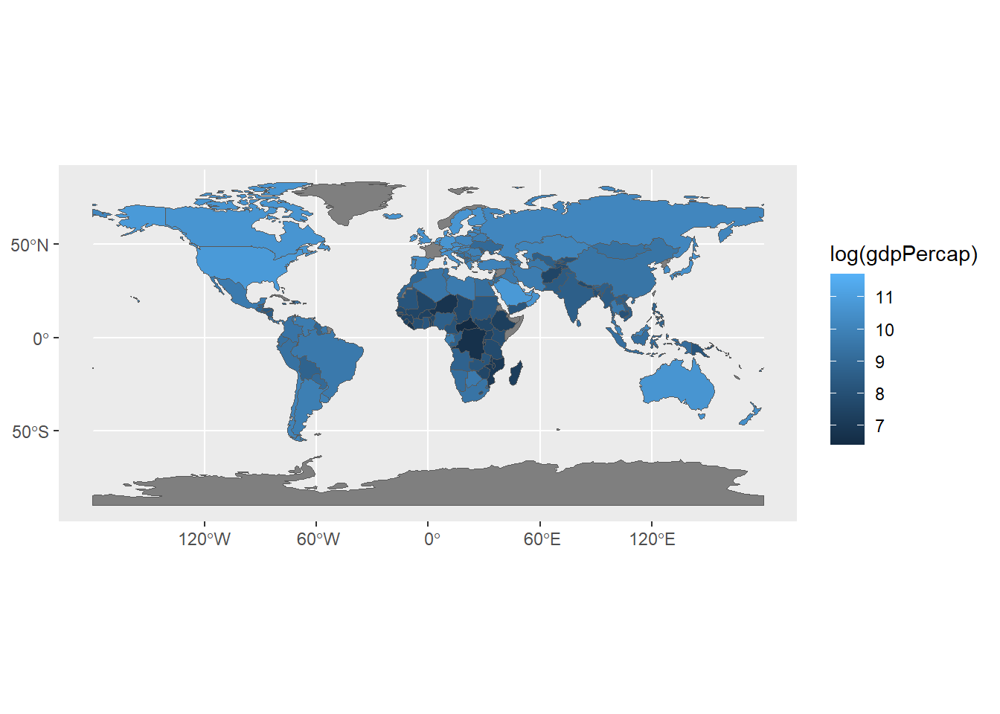](chapter45_files/figure-html/unnamed-chunk-4-1.png)

### 45.2.1 GeoJSONを取り扱う

地理データの一部はインターネットで公開されており、ダウンロードして用いることができます。例えば[smartnews-smri/japan-topography](https://github.com/smartnews-smri/japan-topography)や、[国土数値情報ダウンロードサイト](https://nlftp.mlit.go.jp/)では、日本の地理情報を**[GeoJSON](https://ja.wikipedia.org/wiki/GeoJSON)**と呼ばれる形式で公開しています。GeoJSONとは、他言語ではよく用いられているデータの形式である**javascript object notation（json）**を使って地理空間情報を表現したものです。`sf`では、このGeoJSONを読み込み、`sf`オブジェクトに変換することができます。読み込みには`st_read`関数を用います。

``` downlit
# 上記のsmartnewsのgithubからGeoJSONをダウンロードする
url <- "https://raw.githubusercontent.com/smartnews-smri/japan-topography/main/data/municipality/geojson/s0010/N03-21_210101.json"

# GeoJSONを読み込み、sfオブジェクトとする
sfobj <- st_read(url)
## Reading layer `N03-21_210101' from data source 
##   `https://raw.githubusercontent.com/smartnews-smri/japan-topography/main/data/municipality/geojson/s0010/N03-21_210101.json' 
##   using driver `GeoJSON'
## Simple feature collection with 1906 features and 5 fields
## Geometry type: MULTIPOLYGON
## Dimension:     XY
## Bounding box:  xmin: 122.9393 ymin: 24.04587 xmax: 153.9866 ymax: 45.55563
## Geodetic CRS:  WGS 84

summary(sfobj)
##       N03_001          N03_002          N03_003          N03_004    
##  Length   :1906   Length   :1906   Length   :1906   Length   :1906  
##  N.unique :  47   N.unique :  14   N.unique : 390   N.unique :1804  
##  N.blank  :   0   N.blank  :   0   N.blank  :   0   N.blank  :   0  
##  Min.nchar:   3   Min.nchar:   5   Min.nchar:   2   Min.nchar:   2  
##  Max.nchar:   4   Max.nchar:  10   Max.nchar:   5   Max.nchar:   7  
##                   NAs      :1712   NAs      : 799                   
##       N03_007              geometry   
##  Length   :1906   MULTIPOLYGON :1906  
##  N.unique :1902   epsg:4326    :   0  
##  N.blank  :   0   +proj=long...:   0  
##  Min.nchar:   5                       
##  Max.nchar:   5                       
##  NAs      :   4
```

### 45.2.2 日本のGeoJSONデータの取得

日本のGeoJSONデータを取り扱う場合には、[国土数値情報ダウンロードサイト（国土交通省）](https://nlftp.mlit.go.jp/ksj/gml/datalist/KsjTmplt-N03-v3_1.html)からGeoJSONをダウンロードするのが最も正確でよいでしょう。このGeoJSONデータは日本測地系2011（JGD2011）と呼ばれる、日本の測地系での値が指定されています（JGD2011は世界測地系WGS84とほぼ同一です）。国土数値情報ダウンロードサイトからダウンロードした地理情報を用いた解析結果を公表する場合には、以下のような形で[出典を記載](https://nlftp.mlit.go.jp/ksj/other/agreement_01.html)する必要があります。

出典：[「国土数値情報（行政区域データ）」（国土交通省）](https://nlftp.mlit.go.jp/ksj/gml/datalist/KsjTmplt-N03-v3_1.html)を加工して作成

``` downlit
# あらかじめダウンロードしたGeoJSONファイルをst_read関数で読み込む
Nara_sfobj <- st_read("./data/N03-23_29_230101.geojson")
## Reading layer `N03-23_29_230101' from data source 
##   `D:\R入門\data\N03-23_29_230101.geojson' using driver `GeoJSON'
## Simple feature collection with 40 features and 5 fields
## Geometry type: POLYGON
## Dimension:     XY
## Bounding box:  xmin: 135.5397 ymin: 33.85896 xmax: 136.2299 ymax: 34.78136
## Geodetic CRS:  JGD2011
Nara_sfobj
## Simple feature collection with 40 features and 5 fields
## Geometry type: POLYGON
## Dimension:     XY
## Bounding box:  xmin: 135.5397 ymin: 33.85896 xmax: 136.2299 ymax: 34.78136
## Geodetic CRS:  JGD2011
## First 10 features:
##    N03_001 N03_002 N03_003    N03_004 N03_007                       geometry
## 1   奈良県    <NA>    <NA>     奈良市   29201 POLYGON ((135.9271 34.75692...
## 2   奈良県    <NA>    <NA> 大和高田市   29202 POLYGON ((135.7597 34.5323,...
## 3   奈良県    <NA>    <NA> 大和郡山市   29203 POLYGON ((135.7327 34.66603...
## 4   奈良県    <NA>    <NA>     天理市   29204 POLYGON ((135.9307 34.6418,...
## 5   奈良県    <NA>    <NA>     橿原市   29205 POLYGON ((135.8042 34.53756...
## 6   奈良県    <NA>    <NA>     桜井市   29206 POLYGON ((135.9206 34.59121...
## 7   奈良県    <NA>    <NA>     五條市   29207 POLYGON ((135.6879 34.40235...
## 8   奈良県    <NA>    <NA>     御所市   29208 POLYGON ((135.7519 34.48149...
## 9   奈良県    <NA>    <NA>     生駒市   29209 POLYGON ((135.7125 34.78074...
## 10  奈良県    <NA>    <NA>     香芝市   29210 POLYGON ((135.6564 34.54167...

plot(Nara_sfobj)
```

[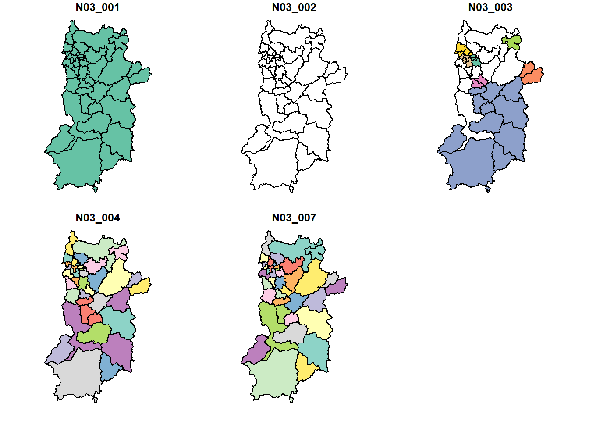](chapter45_files/figure-html/unnamed-chunk-6-1.png)

### 45.2.3 sfオブジェクトの保存と読み込み

上記のように、GeoJSONファイルは`st_read`関数で読み込み、`sf`オブジェクトに変換することができます。逆に、この`sf`オブジェクトをファイルとして保存する際には`st_write`関数を用います。`st_write`関数はファイル名の拡張子によりファイル形式を判別して保存してくれる、`ggplot2`における`ggsave`関数のような働きを持ちます。`sf`オブジェクトは通常`.shp`ファイルとして保存します。また、`st_write`関数はGeoJSONへの書き出しにも対応しています。Rや`sf`だけでなく、他の原語やパッケージを利用する際には、GeoJSONの方が取り扱いやすいでしょう。

``` downlit
# .shp（シェープファイル）で保存
st_write(sfobj, "./data/smartnews-smri_japan-topography.shp",  layer_options = "ENCODING=UTF-8", append = FALSE)　

# geojsonで保存
st_write(sfobj, "./data/smartnews-smri_japan-topography.geojson",  layer_options = "ENCODING=UTF-8", append = FALSE)　

# shpファイルの読み込み
jpsf <- st_read("./data/smartnews-smri_japan-topography.shp")
jpsf

# geojsonも読み込める
jpsf <- st_read("./data/smartnews-smri_japan-topography.geojson")

# urlからjsonを読み込むこともできる
sfobj <- st_read(url)
```

### 45.2.4 他の地理情報データとの統合

`sf`オブジェクトはデータフレームでもあるため、地理情報と関連付けられたデータがあれば、`sf`オブジェクトの列として登録し、データとして利用することができます。地理情報と関連したデータを自分で集めるのは難しいですが、政府統計であれば[e-stat](https://www.e-stat.go.jp/)から簡単にダウンロードできます。

以下の例では、2020年の国勢調査のデータをダウンロードし、上記の国土数値情報から作成した`sf`オブジェクトに国勢調査データの2020年人口を登録しています。e-statのデータを用いた解析結果を公表する場合には下のような[出典の記載](https://www.e-stat.go.jp/help/surveyitems/search-3-5)が必要です。

出典：「政府統計の総合窓口(e-Stat)」、調査項目を調べる－国勢調査（総務省）「令和２年国勢調査 / 人口等基本集計」

e-statのデータはそのデータの種類ごとにファイル形式や列名の記載方法が異なるため、Rではやや読み込みにくいです。

まずはe-statのデータを整理して読み込みます。読み込んだデータフレームと`sf`オブジェクトを結合させるためには、両方のオブジェクトに共通する列が必要となります。下の例では、`sf`オブジェクトに含まれる`N03_004`（市町村名）の列をデータフレーム側にも準備することで、市町村名を用いてデータを結合できるようにしています。

データフレームと`sf`オブジェクトの結合には、[20章](chapter20.llms.md#データフレームの結合)で説明した`dplyr`の`join`関数を用いるのが良いでしょう。この際に、`join`で結合する先を`sf`オブジェクトとすること、共通する列を`by=join_by(列名)`で指定することが重要となります。`sf`オブジェクト側ではなく、データフレーム側を結合先にしてしまうと`geometry`の列がなくなります。

下の例では、`sf`オブジェクト（`Nara_sfobj`）を第一引数、データフレームを第二引数とし、`left_join`関数で結合することで、データフレームのデータを左側の`sf`オブジェクトに結合しています。

``` downlit
d <- read.csv("./data/FEH_00200521_240321113104.csv", header = T, skip = 12) # 人口データを読み込み

# 文字列となっている列を数値に変換
d$`総数` <- d$`総数` |> str_remove_all(",") |> as.numeric()
d$`男` <- d$`男` |> str_remove_all(",") |> as.numeric()
d$`女` <- d$`女` |> str_remove_all(",") |> as.numeric()
d <- d[, c(4, 6:8)]

# 共通の列として、市町村名を設定（N03_004）
colnames(d) <- c("N03_004", "total_pop", "male_pop", "female_pop") 

# left_join関数でデータをsfに結合
Nara_sfobj <- left_join(Nara_sfobj, d, by = join_by(N03_004)) # sfが前、結合するデータフレームが後
Nara_sfobj <- Nara_sfobj |> select(N03_001, N03_004, total_pop, male_pop, female_pop)

# データ登録されたsfオブジェクト
Nara_sfobj
## Simple feature collection with 42 features and 5 fields
## Geometry type: POLYGON
## Dimension:     XY
## Bounding box:  xmin: 135.5397 ymin: 33.85896 xmax: 136.2299 ymax: 34.78136
## Geodetic CRS:  JGD2011
## First 10 features:
##    N03_001    N03_004 total_pop male_pop female_pop
## 1   奈良県     奈良市    354630   164846     189784
## 2   奈良県 大和高田市     61744    28981      32763
## 3   奈良県 大和郡山市     83285    39249      44036
## 4   奈良県     天理市     63889    31275      32614
## 5   奈良県     橿原市    120922    57336      63586
## 6   奈良県     桜井市     54857    25909      28948
## 7   奈良県     五條市     27927    13180      14747
## 8   奈良県     御所市     24096    11122      12974
## 9   奈良県     生駒市    116675    55107      61568
## 10  奈良県     香芝市     78113    36925      41188
##                          geometry
## 1  POLYGON ((135.9271 34.75692...
## 2  POLYGON ((135.7597 34.5323,...
## 3  POLYGON ((135.7327 34.66603...
## 4  POLYGON ((135.9307 34.6418,...
## 5  POLYGON ((135.8042 34.53756...
## 6  POLYGON ((135.9206 34.59121...
## 7  POLYGON ((135.6879 34.40235...
## 8  POLYGON ((135.7519 34.48149...
## 9  POLYGON ((135.7125 34.78074...
## 10 POLYGON ((135.6564 34.54167...
```

### 45.2.5 geometryの種類と変換の方法

`sf`における最も基本的なgeometryは以下の3種類です。

- **POINT**：地図上の点
- **LINESTRING**：地図上の線
- **POLYGON**：地図上の平面

それぞれのgeometryにおいて、地図上の位置はX（経度（longitude））、Y（緯度（latitude））の2次元（XY）、Z（高度）を加えた3次元（XYZ）、M（データの精度や時間）を加えた3次元（XYM）、ZとMを加えた4次元のデータ（XYZM）のいずれかで指定されます。

また、複数のPOINT、LINESTRING、POLYGONをまとめたgeometryとして以下の3種類があります。

- **MULTIPOINT**：地図上の複数の点
- **MULTILINESTRING**：地図上の複数の線
- **MULTIPOLYGON**：地図上の複数の平面

また、1つのgeometryではなく、別々のgeometry（POINTとPOLYGONなど）をまとめたものがGEOMETRYCOLLECTIONです。

この他にもCITCULARSTRINGやCOMPOUNDCURVE、CURVEPOLYGONなどの曲線を示すgeometryもありますが、とりあえず上の7つを理解しておけば`sf`の取り扱いには困らないでしょう。

最も単純な3つのgeometryは`st_point`、`st_linestring`、`st_polygon`関数で作成することができます。`st_point`はX（経度）とY（緯度）のベクター、`st_linestring`、`st_polygon`は1列目にX（経度）、2列目にY（緯度）を設定した行列を引数とすることで作成することができます。

``` downlit
# st_pointの引数はベクター
st_point(c(135, 35), dim = "XY") 
## POINT (135 35)

# st_linestringの引数は行列
st_linestring(rbind(c(135, 35), c(130, 30))) 
## LINESTRING (135 35, 130 30)

# st_polygonの引数は行列のリスト（平面が閉じていないとエラーになる）
st_polygon(list(rbind(c(135, 35), c(135, 30), c(130, 30), c(130, 35), c(135, 35))))
## POLYGON ((135 35, 135 30, 130 30, 130 35, 135 35))

## 左からPOINT、LINESTRING、POLYGONをplotする
par(mfrow = c(1, 3))
st_point(c(135, 35), dim = "XY") |> plot()
st_linestring(rbind(c(135, 35), c(130, 30))) |> plot()
st_polygon(list(rbind(c(135, 35), c(135, 30), c(130, 30), c(130, 35), c(135, 35)))) |> plot()
```

[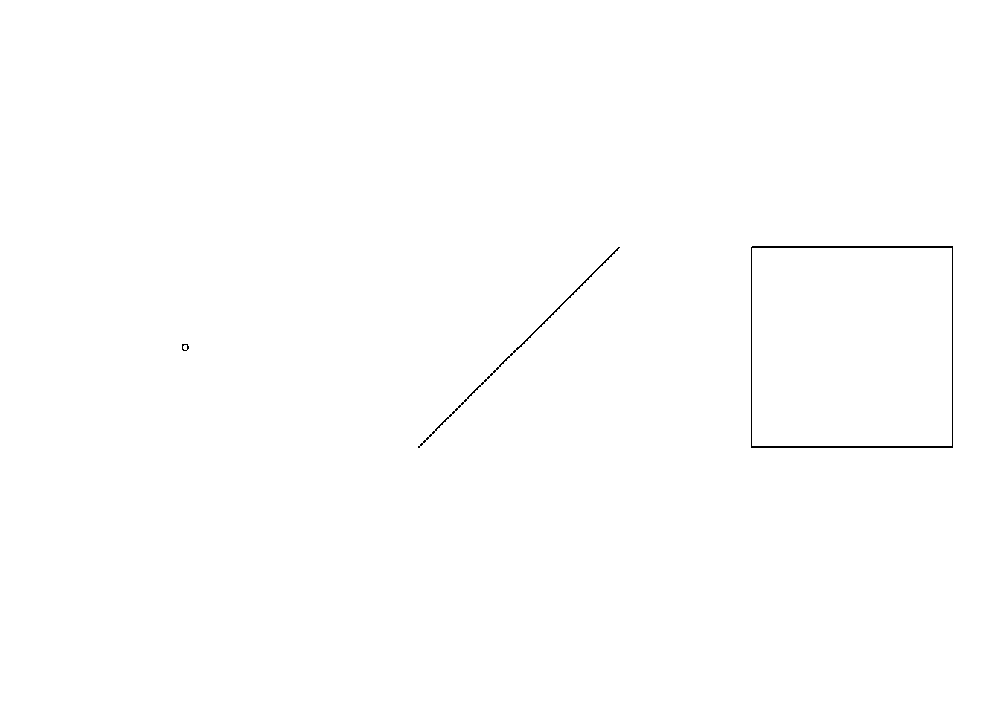](chapter45_files/figure-html/unnamed-chunk-9-1.png)

MULTIPOINT、MULTILINESTRING、MULTIPOLYGONはそれぞれ`st_multipoint`、`st_multilinestring`、`st_multipolygon`関数で作成することができます。

``` downlit
# st_multipointの引数は行列
st_multipoint(rbind(c(135, 35), c(130, 30))) 
## MULTIPOINT ((135 35), (130 30))

# c関数でPOINTを結合してもMULTIPOINTを作成できる
c(st_point(c(135, 35), dim = "XY"), st_point(c(130, 30), dim = "XY"))
## MULTIPOINT ((135 35), (130 30))

# st_multilinestringの引数は行列のリスト
st_multilinestring(list(rbind(c(135, 35), c(130, 30)), rbind(c(130, 30), c(125, 20)))) 
## MULTILINESTRING ((135 35, 130 30), (130 30, 125 20))

# st_multipolygonの引数は行列のリストのリスト（平面が閉じていないとエラーとなる）
st_multipolygon(
  list(
    list(rbind(c(135, 35), c(135, 30), c(130, 30), c(130, 35), c(135, 35))),
    list(rbind(c(100, 50), c(100, 40), c(120, 40), c(120, 50), c(100, 50)))
    )
  )
## MULTIPOLYGON (((135 35, 135 30, 130 30, 130 35, 135 35)), ((100 50, 100 40, 120 40, 120 50, 100 50)))

# MULTIPOINT、MULTISTRING、MULTIPOLYGONをプロットする
par(mfrow = c(1, 3))
st_multipoint(rbind(c(135, 35), c(130, 30))) |> plot()
st_multilinestring(list(rbind(c(135, 35), c(130, 30)), rbind(c(130, 30), c(125, 20)))) |> plot()
st_multipolygon(
  list(
    list(rbind(c(135, 35), c(135, 30), c(130, 30), c(130, 35), c(135, 35))),
    list(rbind(c(100, 50), c(100, 40), c(120, 40), c(120, 50), c(100, 50)))
    )
  ) |> plot()
```

[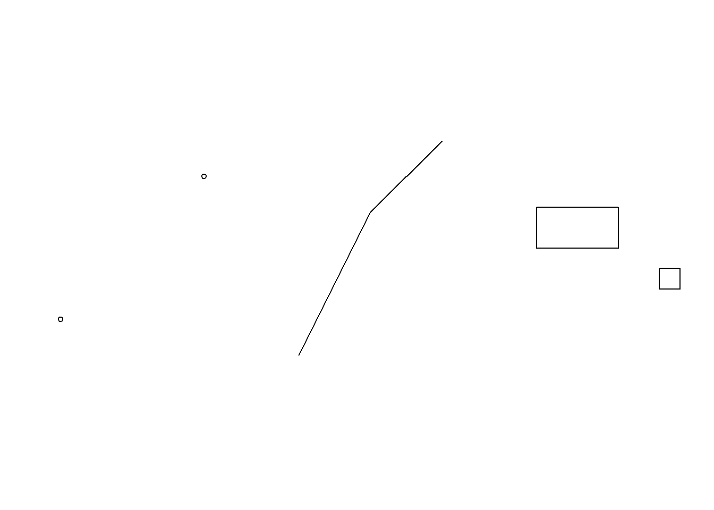](chapter45_files/figure-html/unnamed-chunk-10-1.png)

### 45.2.6 geometryの編集

`st_point`の返り値に足し算を行うことで、その点の位置を変更することができます。単に数値を足した場合にはXとYの両方に、要素が2つのベクターで足した場合にはインデックス`[1]`の要素がXに、インデックス`[2]`の要素がYに足されて位置を更新することになります。

``` downlit
st_point(c(1, 1)) + 1 # 数値を足すことができる
## POINT (2 2)

st_point(c(1, 1)) + c(1, 4) # ベクターで足すと要素ごとの足し算になる
## POINT (2 5)
```

また、`sf`クラスのうち、`geometry`の列に関しては、掛け算することで拡大・縮小を行うこともできます。

``` downlit
# わかりにくいが、地域の中心を基準に0.85倍に縮小している
((Nara_sfobj |> st_geometry() - st_centroid(Nara_sfobj |> st_geometry())) * 0.85 + st_centroid(Nara_sfobj |> st_geometry())) |> plot()
```

[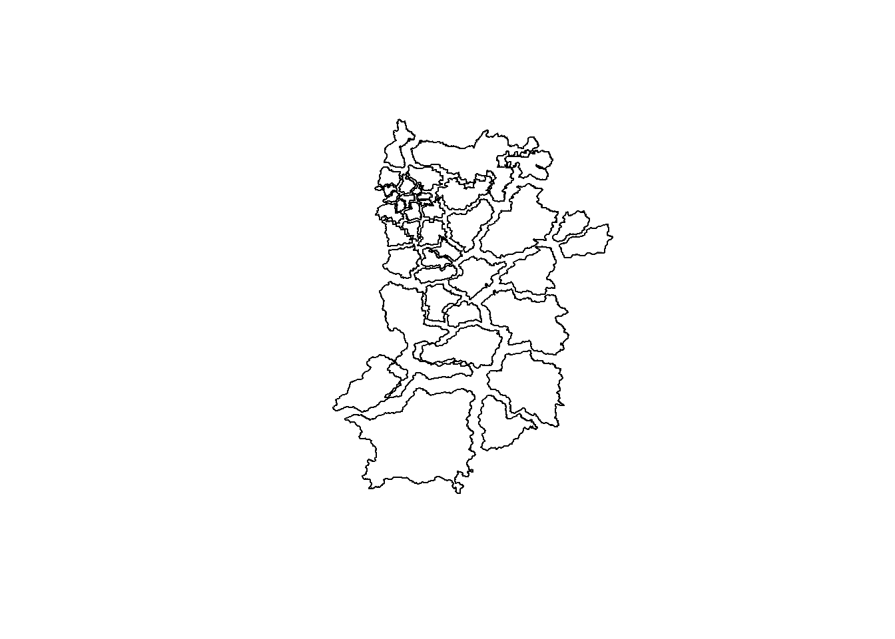](chapter45_files/figure-html/unnamed-chunk-12-1.png)

### 45.2.7 geometryのクラス：sfg

`st_point`や`st_polygon`で作成したgeometryは`sfg`クラスのオブジェクトとなります。`sfg`は`sf`パッケージで定義されているクラスで、`plot`関数の引数とすることで描画することができます。

``` downlit
st_point(c(1, 1)) |> class() # sfgクラスのオブジェクト
## [1] "XY"    "POINT" "sfg"

st_point(c(1, 1)) |> plot() # sfgクラスはplot関数で描画できる
```

[](chapter45_files/figure-html/unnamed-chunk-13-1.png)

### 45.2.8 geometryのクラス：sfc

`sfg`をいくつか合わせてひとまとまりのgeometryとしたものが`sfc`クラスのオブジェクトです。`sfc`は`st_sfc`関数に1個～複数の`sfg`クラスのオブジェクトを引数とすることで作成することができます。`sf`クラスのgeometryの列がこの`sfc`クラスです。

``` downlit
st_point(c(1, 1)) |> st_sfc() |> class() # sfcクラスに変換
## [1] "sfc_POINT" "sfc"

st_point(c(1, 1)) |> st_sfc() |> st_sf() |> class() # sfクラスに変換
## [1] "sf"         "data.frame"
```

### 45.2.9 sfオブジェクトの構造

`sfc`クラスは`sfg`クラスのリストとして実装されており、`sfg`もリストですので、`sfc`は「リストのリスト」になっています。この`sfc`をさらに`st_sf`関数の引数とすると、`sf`クラスのオブジェクトとなります。`sf`クラスはデータフレーム、つまりリストですので、`sf`クラスは「リストのリストのリスト」になっています。`sf`、`sfc`、`sfg`オブジェクトは基本的にはすべてリストですので、二重カッコ（`[[]]`）で下位の要素（`sf`から`sfc`、`sfc`から`sfg`）を取り出すことができます。

また、`sf`オブジェクトから`geometry`だけを取り出す場合には、`st_geometry`関数を用います。`st_geometry`関数の返り値は`sfc`クラスのオブジェクトとなります。

``` downlit
# geometryを選択
sfobj[[6]]
## Geometry set for 1906 features 
## Geometry type: MULTIPOLYGON
## Dimension:     XY
## Bounding box:  xmin: 122.9393 ymin: 24.04587 xmax: 153.9866 ymax: 45.55563
## Geodetic CRS:  WGS 84
## First 5 geometries:
## MULTIPOLYGON (((141.3552 43.06859, 141.3433 43....
## MULTIPOLYGON (((141.3552 43.06859, 141.3527 43....
## MULTIPOLYGON (((141.3896 43.0686, 141.3965 43.0...
## MULTIPOLYGON (((141.3664 43.05797, 141.3848 43....
## MULTIPOLYGON (((141.3524 43.02288, 141.3527 43....

# 2重リストは個別のgeometry
sfobj[[6]][[1]] |> head()
## MULTIPOLYGON (((141.3552 43.06859, 141.3433 43.06682, 141.335 43.06914, 141.3364 43.07113, 141.3324 43.07601, 141.3283 43.08612, 141.3266 43.08228, 141.3223 43.08022, 141.3224 43.07733, 141.3143 43.06464, 141.3063 43.06878, 141.2927 43.05801, 141.2841 43.05441, 141.2844 43.04716, 141.2856 43.04371, 141.2848 43.03798, 141.2799 43.03634, 141.2711 43.03945, 141.2657 43.03944, 141.2638 43.04216, 141.2582 43.04203, 141.2496 43.0372, 141.2483 43.03159, 141.2449 43.02679, 141.2297 43.0152, 141.2248 43.01587, 141.2127 43.0156, 141.2024 43.01925, 141.2019 43.01673, 141.2116 43.01254, 141.2146 43.01027, 141.2205 43.00882, 141.2374 43.00678, 141.245 43.0038, 141.2514 43.00347, 141.2542 42.99783, 141.2599 42.99766, 141.2667 43.00442, 141.2722 43.00431, 141.2829 43.00935, 141.2859 43.01337, 141.2904 43.01389, 141.2934 43.02012, 141.3041 43.02643, 141.3108 43.02808, 141.3068 43.03198, 141.3103 43.03576, 141.3144 43.03393, 141.3193 43.03551, 141.3237 43.02969, 141.3282 43.02846, 141.3363 43.0281, 141.3407 43.02424, 141.346 43.0171, 141.3524 43.02288, 141.356 43.03531, 141.3599 43.04286, 141.3631 43.05453, 141.3664 43.05797, 141.369 43.06146, 141.3896 43.0686, 141.3863 43.06953, 141.3732 43.06841, 141.3552 43.06859)))

# 4重リストに緯度・経度の行列が保存されている
sfobj[[6]][[1]][[1]][[1]] |> head() 
##          [,1]     [,2]
## [1,] 141.3552 43.06859
## [2,] 141.3433 43.06682
## [3,] 141.3350 43.06914
## [4,] 141.3364 43.07113
## [5,] 141.3324 43.07601
## [6,] 141.3283 43.08612

sfobj |> st_geometry() # geometryだけ取り出す（クラスはsfc）
## Geometry set for 1906 features 
## Geometry type: MULTIPOLYGON
## Dimension:     XY
## Bounding box:  xmin: 122.9393 ymin: 24.04587 xmax: 153.9866 ymax: 45.55563
## Geodetic CRS:  WGS 84
## First 5 geometries:
## MULTIPOLYGON (((141.3552 43.06859, 141.3433 43....
## MULTIPOLYGON (((141.3552 43.06859, 141.3527 43....
## MULTIPOLYGON (((141.3896 43.0686, 141.3965 43.0...
## MULTIPOLYGON (((141.3664 43.05797, 141.3848 43....
## MULTIPOLYGON (((141.3524 43.02288, 141.3527 43....
```

``` downlit
sfobj[[6]] |> class() # sfcクラスのオブジェクト
## [1] "sfc_MULTIPOLYGON" "sfc"

sfobj[[6]][[1]] |> class() # sfgクラスのオブジェクト
## [1] "XY"           "MULTIPOLYGON" "sfg"
```

### 45.2.10 sfオブジェクトを作成する

緯度・経度のデータから`sf`オブジェクトを作成する場合には、上記の`st_point`、`st_linestring`、`st_polygon`を使うことになります。下の例では、都道府県の県庁所在地のデータを`sfc`オブジェクトに変換しています。

データフレームをMULTIPOINTの`sfg`に変換する場合には、まずデータフレームの列を経度・緯度の順に並べ替え、次に`as.matrix`関数で行列に変換します。この行列を`st_multipoint`関数の引数とすれば、MULTIPOINTの`sfg`を作成することができます。

また、この`sfg`を`st_sfc`関数の引数に取ることでMULTIPOINTの`sfc`オブジェクトを作成することができます。

MULTIPOINTからPOINTの`sfg`を作成する場合には、`st_cast`関数を用います。`st_cast`関数はgeometryの変換を行うための関数です。`st_cast`の第二引数に`"POINT"`を指定することで、MULTIPOINTからPOINTへの変換を行うことができます。ただし、`st_cast`で変換すると、MULTIPOINTの一番初めの点のみがPOINTに変換され、残りのPOINTは削除されてしまいます。

``` downlit
# 県庁所在地の緯度・経度
d <- read.csv("./data/pref_lat_lon.csv", header=T, fileEncoding = "CP932")
head(d) # latが緯度、lonが経度
##   pref_name      lat      lon
## 1    北海道 43.06436 141.3474
## 2    青森県 40.82429 140.7401
## 3    岩手県 39.70353 141.1527
## 4    宮城県 38.26874 140.8722
## 5    秋田県 39.71818 140.1034
## 6    山形県 38.24013 140.3625

# sfgクラス（経度、緯度の順に並べ替えている）
d[,c(3, 2)] |> 
  as.matrix() |> 
  st_multipoint() 
## MULTIPOINT ((141.3474 43.06436), (140.7401 40.82429), (141.1527 39.70353), (140.8722 38.26874), (140.1034 39.71818), (140.3625 38.24013), (140.4668 37.75015), (140.4468 36.34182), (139.8835 36.56575), (139.0609 36.3912), (139.6478 35.85777), (140.1232 35.60456), (139.6916 35.68919), (139.6423 35.4475), (139.0227 37.9017), (137.2113 36.69527), (136.6256 36.59473), (136.2216 36.06522), (138.569 35.6651), (138.181 36.65128), (136.7222 35.39116), (138.3831 34.97699), (136.9067 35.18025), (136.5086 34.73055), (135.8686 35.00453), (135.7531 35.021), (135.519 34.68649), (135.1831 34.69128), (135.8327 34.6853), (135.1679 34.22481), (134.2383 35.50346), (133.0508 35.47225), (133.9344 34.66132), (132.4596 34.39603), (131.4708 34.18565), (134.5593 34.06573), (134.043 34.34014), (132.7659 33.84165), (133.5309 33.55969), (130.4182 33.60677), (130.2988 33.24937), (129.873 32.74454), (130.7423 32.79039), (131.6127 33.2382), (131.4239 31.91109), (130.5579 31.56022), (127.6811 26.21154))

# sfcクラス（1つのMULTIPOINTとなる）
d[,c(3, 2)] |> 
  as.matrix() |> 
  st_multipoint() |> 
  st_sfc() 
## Geometry set for 1 feature 
## Geometry type: MULTIPOINT
## Dimension:     XY
## Bounding box:  xmin: 127.6811 ymin: 26.21154 xmax: 141.3474 ymax: 43.06436
## CRS:           NA
## MULTIPOINT ((141.3474 43.06436), (140.7401 40.8...

# sfcクラス（始めの1点だけになる
d[,c(3, 2)] |> 
  as.matrix() |> 
  st_multipoint() |> 
  st_cast("POINT") |> 
  st_sfc()
## Warning in st_cast.MULTIPOINT(st_multipoint(as.matrix(d[, c(3, 2)])), "POINT"):
## point from first coordinate only
## Geometry set for 1 feature 
## Geometry type: POINT
## Dimension:     XY
## Bounding box:  xmin: 141.3474 ymin: 43.06436 xmax: 141.3474 ymax: 43.06436
## CRS:           NA
## POINT (141.3474 43.06436)
```

そもそも上の例では、各都道府県の県庁所在地の位置ですので、MULTIPOINTではなく、POINTの集合となっている`sfc`オブジェクトを作成したいところです。

このような変換には、`lapply`関数や[`purrr::pmap`](https://purrr.tidyverse.org/reference/pmap.html)関数を用います。`lapply`の場合にはデータフレーム（リスト）を引数にして`st_point`関数を適用する形で、[`purrr::pmap`](https://purrr.tidyverse.org/reference/pmap.html)関数では`st_point`の引数の位置を`.x`、`.y`で指定する形で設定します。

``` downlit
# applyではうまく計算できない（返り値がベクターだから）
apply(d[,c(3, 2)], 1, st_point) |> st_sfc() 
## Error:
## ! object(s) should be of class 'sfg'

# lapplyを使うと複数のPOINTをsfcに変換できる
d[,c(3, 2)] |> t() |> data.frame() |> lapply(st_point) |> st_sfc() 
## Geometry set for 47 features 
## Geometry type: POINT
## Dimension:     XY
## Bounding box:  xmin: 127.6811 ymin: 26.21154 xmax: 141.3474 ymax: 43.06436
## CRS:           NA
## First 5 geometries:
## POINT (141.3474 43.06436)
## POINT (140.7401 40.82429)
## POINT (141.1527 39.70353)
## POINT (140.8722 38.26874)
## POINT (140.1034 39.71818)

# pmapを使うと複数のPOINTをsfcに変換できる
purrr::pmap(d[,c(3, 2)], ~st_point(c(.x, .y))) |> st_sfc()
## Geometry set for 47 features 
## Geometry type: POINT
## Dimension:     XY
## Bounding box:  xmin: 127.6811 ymin: 26.21154 xmax: 141.3474 ymax: 43.06436
## CRS:           NA
## First 5 geometries:
## POINT (141.3474 43.06436)
## POINT (140.7401 40.82429)
## POINT (141.1527 39.70353)
## POINT (140.8722 38.26874)
## POINT (140.1034 39.71818)
```

`sfc`を`lapply`関数や[`purrr::pmap`](https://purrr.tidyverse.org/reference/pmap.html)関数を用いて作成した後、この作成した`sfc`を`st_sf`関数の引数とすることで、`sf`オブジェクトを作成することができます。`sf`オブジェクトはデータフレームと同じように取り扱うことができるので、この`sf`オブジェクトに情報を追加していく形でデータを整理することができます。

``` downlit
# sfcをsfに変換
d1 <- pmap(d[,c(3, 2)], ~st_point(c(.x, .y))) |> st_sfc() |> st_sf()

# sfにはデータフレームと同様に情報を追加することができる
d1$pref <- d$pref_name
d1$flag <- rep(c(0, 1), c(25, 22))

d1 |>  ggplot() + geom_sf(aes(color = factor(flag)))
```

[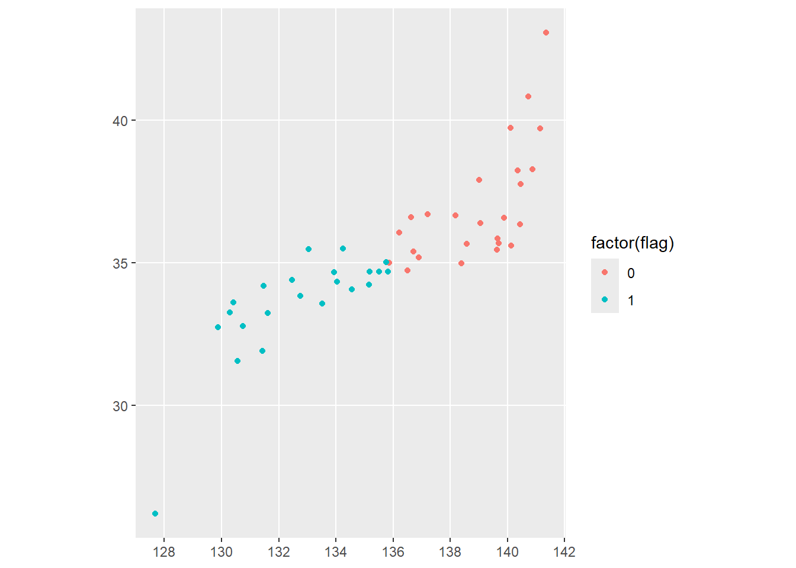](chapter45_files/figure-html/unnamed-chunk-19-1.png)

### 45.2.11 WKT、WKB

[well-known-text](https://ja.wikipedia.org/wiki/Well-known_text)（WKT）とwell-known-binary (WKB)は、`sf`で示されているgeometryをテキストやバイナリ（16進法の数値）で表す方法です。`sf`パッケージにはgeometryをWKT・WKBの形に変換する方法と、逆にWKTやWKBを`sf`オブジェクトとする方法を備えています。

`sfg`をWKTに変換するための関数が`st_as_text`関数、`sfg`をWKBに変換するための関数が`st_as_binary`関数です。WKT、WKBのいずれも`st_as_sfc`関数の引数とすることで、`sfc`オブジェクトに変換することができます。

``` downlit
# sfgをテキストに変換
st_point(c(135, 35), dim="XY") |> st_as_text() 
## [1] "POINT (135 35)"

# テキストからsfcを作成
st_point(c(135, 35), dim="XY") |> st_as_text() |> st_as_sfc()
## Geometry set for 1 feature 
## Geometry type: POINT
## Dimension:     XY
## Bounding box:  xmin: 135 ymin: 35 xmax: 135 ymax: 35
## CRS:           NA
## POINT (135 35)

# sfgをバイナリに変換
st_point(c(135, 35), dim="XY") |> st_as_binary() 
##  [1] 01 01 00 00 00 00 00 00 00 00 e0 60 40 00 00 00 00 00 80 41 40

# バイナリからsfcを作成
st_point(c(135, 35), dim="XY") |> st_as_binary() |> st_as_sfc()
## Geometry set for 1 feature 
## Geometry type: POINT
## Dimension:     XY
## Bounding box:  xmin: 135 ymin: 35 xmax: 135 ymax: 35
## CRS:           NA
## POINT (135 35)
```

### 45.2.12 sfcオブジェクトの演算

`sfc`オブジェクトを用いると、その地形データから面積、重心、周辺の長さ、各点の距離などを計算することができます。

POLYGONの面積を計算する関数が`st_area`関数です。`st_area`関数はPOLYGONからなる`sfc`オブジェクトを引数に取り、そのPOLYGONで示される面積を返します。

`st_area`関数の返り値は`units`クラスのオブジェクトになります。この`units`クラスは[`units`](https://r-quantities.github.io/units/)パッケージ([Pebesma et al. 2016](#ref-units_bib))で設定されているクラスです。`units`パッケージは数値に単位を付けた`units`クラスと、その単位の変換に関する演算の方法を提供しています。

``` downlit
st_area(Nara_sfobj$geometry) # 面積の計算（classはunits）
## Units: [m^2]
##  [1] 276977005.00  16487502.70  42692980.17  86433581.81  39571913.33
##  [6]  98925013.63 292085799.38  60590616.91  53160356.49  24267341.43
## [11]  33727305.87 247544023.89  66532128.15  23901170.56   8796113.79
## [16]  14272062.29   4311321.59   5934339.36   5934339.36   4064488.78
## [21]  21097189.12  47769513.82  79591272.16  25792308.87  24104619.91
## [26]   6144410.59   7011660.23  16307488.75     71151.84   8156116.81
## [31]  95664612.10  38109367.32  62002635.34  47715340.25 175700899.55
## [36] 154941450.15 672577543.72 133425918.54 274291762.07 269321938.62
## [41] 269321938.62 131680340.60

# sfはデータフレームと同じように取り扱うことができる
# sfの列に計算した面積を設定している
Nara_sfobj$area <- st_area(Nara_sfobj$geometry) |> as.numeric()

Nara_sfobj |> 
  ggplot()+
  geom_sf(aes(fill = log(area)))
```

[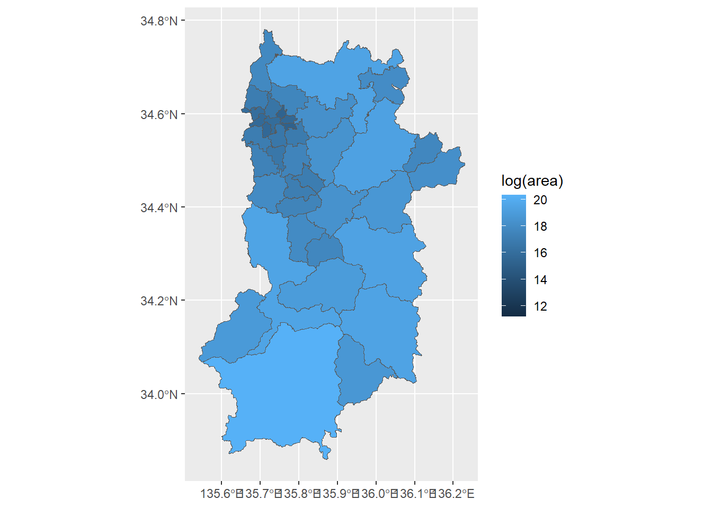](chapter45_files/figure-html/unnamed-chunk-21-1.png)

geometryがPOINTである場合には、`st_distance`で各POINT間の距離行列を求めることができます（距離行列については[32章](chapter32.llms.md#距離行列)を参照）。また、geometryがLINESTRINGである場合には、`st_length`でそのLINESTRINGの長さを計算することができます。POLIGON間の距離や、POINTの長さ、LINESTRINGの面積は求めることができない、つまりgeometryが関数の設定と異なると計算はできません。

``` downlit
# 距離行列（地理空間上の距離）、POINTのみ計算できる
d1 |> st_distance() |> _[1:4, 1:4]
##          1        2        3        4
## 1 0.000000 2.320952 3.366469 4.819115
## 2 2.320952 0.000000 1.194304 2.558970
## 3 3.366469 1.194304 0.000000 1.461952
## 4 4.819115 2.558970 1.461952 0.000000

d1[[1]] |> st_distance() |> _[1:4, 1:4] # sfcでも計算できる
##          1        2        3        4
## 1 0.000000 2.320952 3.366469 4.819115
## 2 2.320952 0.000000 1.194304 2.558970
## 3 3.366469 1.194304 0.000000 1.461952
## 4 4.819115 2.558970 1.461952 0.000000

# 地理空間上の距離、LINESTRINGのみ計算できる
st_linestring(rbind(c(135, 35), c(130, 30))) |> st_length()
## [1] 7.071068

# 地理空間上の面積、POLYGONのみ計算できる
st_area(Nara_sfobj$geometry) |> head()
## Units: [m^2]
## [1] 276977005  16487503  42692980  86433582  39571913  98925014
```

`st_centroid`はgeometryの重心を求める関数です。また、`st_point_on_surface`は重心ではなく、[POLYGON内にある中心に近い点](https://gis.stackexchange.com/questions/76498/how-is-st-pointonsurface-calculated)を求める関数です。コロプレス図のPOLYGON内にバブルチャートでデータを表示する場合には、`st_centroid`より`st_point_on_surface`の方が使いやすいでしょう。

また、同様の演算を`ggplot2`中で行うこともできます。`geom`関数内で`stat="st_coordinates"`を引数に取ることで、`st_point_on_surface`に相当する演算を行うことができます。

``` downlit
# 重心を求める
st_centroid(Nara_sfobj |> st_geometry())
## Geometry set for 42 features 
## Geometry type: POINT
## Dimension:     XY
## Bounding box:  xmin: 135.6445 ymin: 34.01064 xmax: 136.1594 ymax: 34.70791
## Geodetic CRS:  JGD2011
## First 5 geometries:
## POINT (135.891 34.67449)
## POINT (135.7437 34.51008)
## POINT (135.7747 34.63392)
## POINT (135.8643 34.59562)
## POINT (135.7899 34.50139)

# 重心に近いPOLYGON中の点を求める
st_point_on_surface(Nara_sfobj |> st_geometry())
## Geometry set for 42 features 
## Geometry type: POINT
## Dimension:     XY
## Bounding box:  xmin: 135.6577 ymin: 34.00617 xmax: 136.1604 ymax: 34.71393
## Geodetic CRS:  JGD2011
## First 5 geometries:
## POINT (135.8778 34.65789)
## POINT (135.7442 34.50449)
## POINT (135.78 34.63122)
## POINT (135.8641 34.59657)
## POINT (135.7933 34.50031)

# ggplot2ではstat="sf_coordinates"で計算できる（st_point_on_surfaceを利用）
Nara_sfobj |> 
  ggplot()+
  geom_sf()+
  geom_point(
    aes(geometry = geometry, color = total_pop, size = total_pop), 
    stat="sf_coordinates")
```

[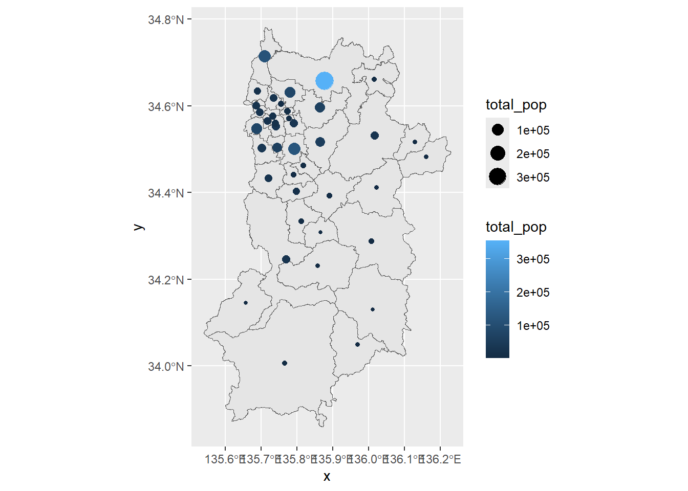](chapter45_files/figure-html/unnamed-chunk-23-1.png)

### 45.2.13 境界線の演算

あるPOINTやLINESTRING、POLYGONから一定の距離にある、境界を演算するための関数が`st_buffer`関数です。`st_buffer`関数はそのPOINTやPOLYGONからの距離である`dist`を引数に取ります。`st_buffer`の返り値はPOLYGONになります。

``` downlit
# 135, 35からの距離が5の境界線（POLYGONが返ってくる）
st_point(c(135, 35), dim="XY") |> st_buffer(dist = 5) |> st_simplify(dTolerance = 0.5)
## POLYGON ((140 35, 138.5355 31.46447, 135 30, 131.4645 31.46447, 130 35, 131.4645 38.53553, 135 40, 138.5355 38.53553, 140 35))

# 点からの距離が5の円
st_point(c(135, 35), dim="XY") |> st_buffer(dist = 5) |> plot()
```

[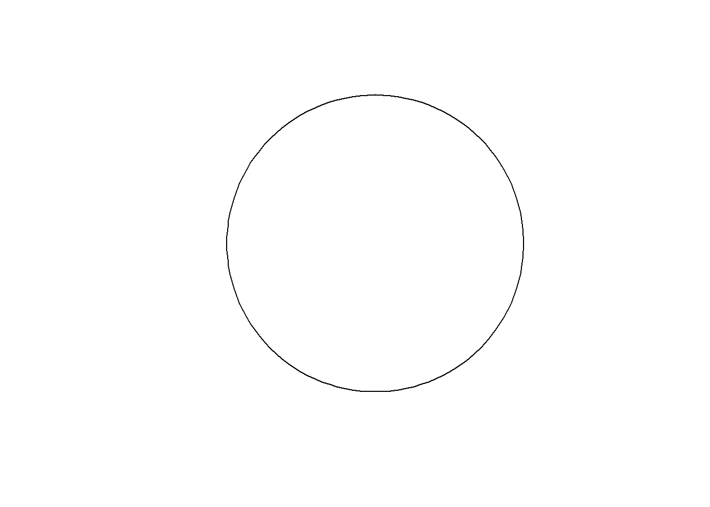](chapter45_files/figure-html/unnamed-chunk-24-1.png)

### 45.2.14 geometryの単純化

日本全体の市町村のPOLYGONを取り扱う場合、高解像度のPOLYGONを用いるとデータサイズがとても大きくなることがあります。例えば、上で紹介した[国土数値情報ダウンロードサイト（国土交通省）](https://nlftp.mlit.go.jp/ksj/gml/datalist/KsjTmplt-N03-v3_1.html)からダウンロードできる日本全国のGeoJSONデータは427MBもあり、コロプレス図などにそのまま用いると演算に時間がかかります。このようなgeometryデータを簡素化し、データサイズを減らす関数が`st_simplify`関数です。簡素化の程度は`dTolerance`引数で指定します。

``` downlit
# st_simplifyでPOLYGONの解像度を下げる
st_point(c(135, 35), dim="XY") |> st_buffer(dist = 5) |> st_simplify(dTolerance = 0.5) |> plot()
```

[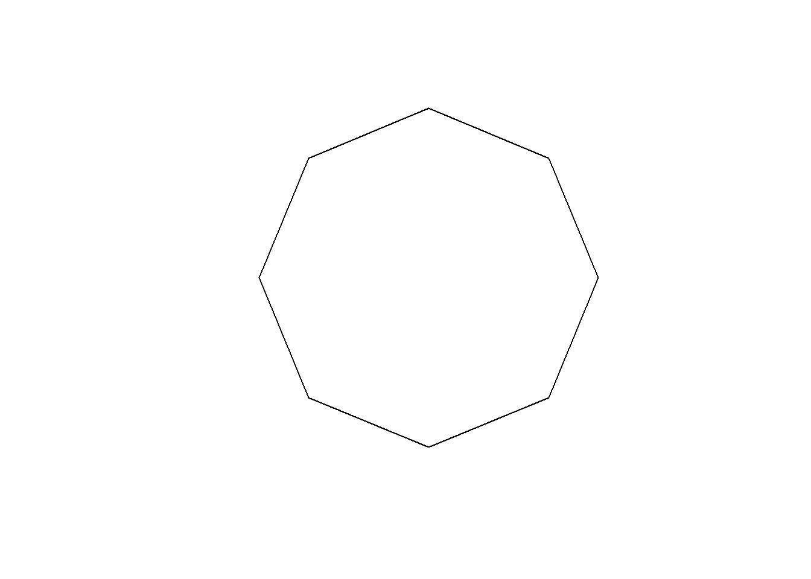](chapter45_files/figure-html/unnamed-chunk-25-1.png)

### 45.2.15 geometryの接触の判定

geometry同士が重なっている・接触しているかどうかを判別するための関数が`st_intersects`関数・`st_touches`関数です。`st_intersects`関数はgeometryが重なっている場合には`TRUE`、重なっていない場合には`FALSE`を返します。また、`st_touches`関数はgeometry同士が接触していれば`TRUE`を、接触していなければ`FALSE`を返します。

``` downlit
d1 <- st_polygon(list(rbind(c(135, 35), c(135, 25), c(130, 25), c(130, 35), c(135, 35))))
d2 <- st_polygon(list(rbind(c(137.5, 32.5), c(137.5, 30), c(125, 30), c(125, 32.5), c(137.5, 32.5))))
d3 <- st_polygon(list(rbind(c(135, 35), c(135, 25), c(140, 25), c(140, 35), c(135, 35))))

# 上の3つのPOLYGONをプロットする
par(mfrow = c(1, 2))
st_sfc(d1, d2) %>% plot()
st_sfc(d1, d3) %>% plot()
```

[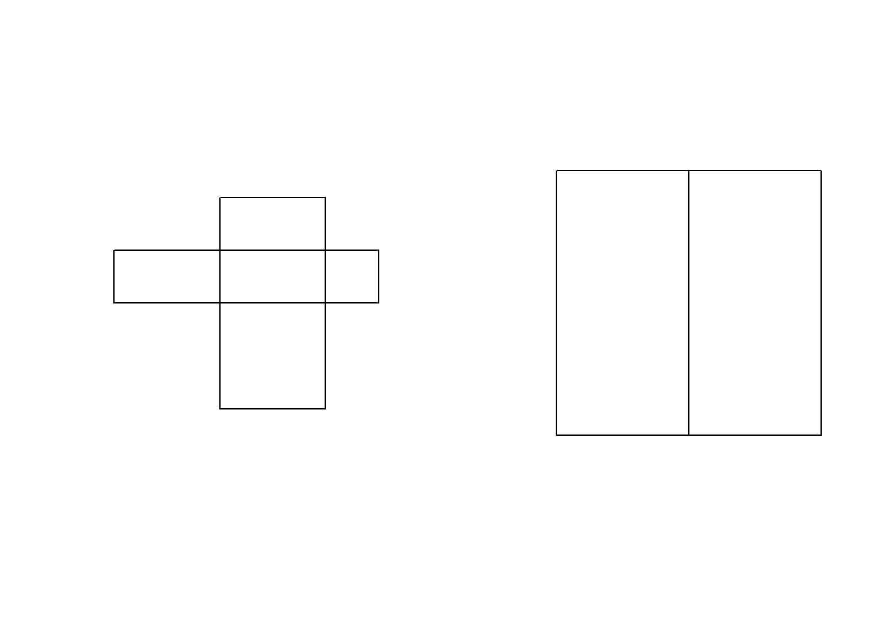](chapter45_files/figure-html/unnamed-chunk-26-1.png)

``` downlit

# sfg間に重なりがあるかどうかを評価
st_intersects(d1, d2, sparse = FALSE) 
##      [,1]
## [1,] TRUE
st_intersects(d1, d3, sparse = FALSE)
##      [,1]
## [1,] TRUE

# sfg間に接触があるかどうかを評価
st_touches(d1, d2, sparse = FALSE) 
##       [,1]
## [1,] FALSE
st_touches(d1, d3, sparse = FALSE)
##      [,1]
## [1,] TRUE
```

### 45.2.16 geometry同士の差分

geometry同士の差分を取るための関数が`st_difference`関数です。`st_difference`関数は第一引数に指定したgeometryから、第二引数に指定したgeometryの部分を取り除きます。ですので、`st_difference(d1, d2)`では`d1`から`d2`の部分を除き、`st_difference(d2, d1)`では`d2`から`d1`の部分を除く形となっています。

``` downlit
# d1は縦長、d2は横長で、d1からd2の部分を取り除く
st_difference(d1, d2) %>% plot() 
```

[](chapter45_files/figure-html/unnamed-chunk-27-1.png)

``` downlit

# d2からd1の部分を取り除く
st_difference(d2, d1) %>% plot()
```

[](chapter45_files/figure-html/unnamed-chunk-27-2.png)

### 45.2.17 CRS（測地系）

[**測地系**](https://ja.wikipedia.org/wiki/%E6%B8%AC%E5%9C%B0%E7%B3%BB)（CRS：Coordinate Reference System）は緯度・経度で地表上の座標を示すための系です。測地系が異なると同じ緯度・経度の点でも地表上の位置が異なります。現在ではWGS84（世界測地系）を用いるのが最も一般的です。日本の測地系としてはJPD2024（[測地成果2024](https://www.gsi.go.jp/sokuchikijun/datum-main.html)、最近更新された測地系。以前は東日本大震災後の地形変化を考慮した測地系である、測地成果2011が用いられていました）が用いられていますが、このJPD2024はWGS84とほぼ同じものとなっています。GeoJSONなどの地理データでは、使用した測地系が何であるか通常表記されていますので、正しい測地系が設定されているか確認し、異なっている場合には測地系を変更するとよいでしょう。

データの測地系を確認する場合には、`st_crs`関数を用います。`st_crs()<-`という形で測地系の名前を代入することにより、`sf`オブジェクトの測地系を変更することもできます。

``` downlit
st_crs(Nara_sfobj) # JGD2011のデータ（JGD2024発表前のデータ）
## Coordinate Reference System:
##   User input: JGD2011 
##   wkt:
## GEOGCRS["JGD2011",
##     DATUM["Japanese Geodetic Datum 2011",
##         ELLIPSOID["GRS 1980",6378137,298.257222101,
##             LENGTHUNIT["metre",1]]],
##     PRIMEM["Greenwich",0,
##         ANGLEUNIT["degree",0.0174532925199433]],
##     CS[ellipsoidal,2],
##         AXIS["geodetic latitude (Lat)",north,
##             ORDER[1],
##             ANGLEUNIT["degree",0.0174532925199433]],
##         AXIS["geodetic longitude (Lon)",east,
##             ORDER[2],
##             ANGLEUNIT["degree",0.0174532925199433]],
##     ID["EPSG",6668]]
st_crs(Nara_sfobj) <- 4326 # WGS84に変更する（warningが出るが、変換される）
## Warning: st_crs<- : replacing crs does not reproject data; use st_transform for
## that
```

## 45.3 ラスタデータの取り扱い：stars

現在（2023年）ではRでのベクタの取り扱いにはほぼ`sf`が用いられていると思いますが、ラスタデータの取り扱いでは、[`terra`](https://rspatial.github.io/terra/)パッケージ([Hijmans 2024](#ref-terra_bib))と[`stars`](https://r-spatial.github.io/stars/)パッケージ([Pebesma and Bivand 2023b](#ref-stars_bib))が両方用いられています。

`terra`は昔から用いられているラスタデータの取り扱いに関するパッケージである[`raster`](https://cran.r-project.org/web/packages/raster/index.html)パッケージ([Hijmans 2023](#ref-raster_bib))を更新したパッケージで、`sf`との連携が組み込まれています。

`stars`は`sf`の開発者が作成したラスタデータの取り扱いに関するパッケージです。`terra`と比べるとやや[ダウンロードされていないパッケージ](https://www.datasciencemeta.com/rpackages)ではありますが、ココでは`terra`ではなく`stars`について説明することとします。

``` downlit
pacman::p_load(stars)
```

まずは、`stars`パッケージに登録されている、[ランドサット7号](https://ja.wikipedia.org/wiki/%E3%83%A9%E3%83%B3%E3%83%89%E3%82%B5%E3%83%83%E3%83%887%E5%8F%B7)が撮影したブラジルの[Olinda](https://ja.wikipedia.org/wiki/%E3%82%AA%E3%83%AA%E3%83%B3%E3%83%80_(%E3%83%96%E3%83%A9%E3%82%B8%E3%83%AB))という都市の衛星画像を`stars`のオブジェクトとした`L7_ETMs`を示します。このデータは位置を表す`x`、`y`と、その位置における値を示す`band`からなるデータです。

``` downlit
L7_ETMs # ランドサット7号の衛星写真データ
## stars_proxy object with 1 attribute in 1 file(s):
## $L7_ETMs
## [1] "[...]/L7_ETMs.tif"
## 
## dimension(s):
##      from  to  offset delta                     refsys point x/y
## x       1 349  288776  28.5 SIRGAS 2000 / UTM zone 25S FALSE [x]
## y       1 352 9120761 -28.5 SIRGAS 2000 / UTM zone 25S FALSE [y]
## band    1   6      NA    NA                         NA    NA

L7_ETMs |> class() # クラスはstars_proxyとstars
## [1] "stars_proxy" "stars"

dim(L7_ETMs) # L7_ETMsはx、y、bandの3次元データ
##    x    y band 
##  349  352    6
```

`L7_ETMs`を呼び出すと、以下のように`x`、`y`、`band`に関する表が示されます。

`x`、`y`で示される位置は、`from`の位置から`to`の位置まで`delta`の間隔で示されています。`x`は横（東西）方向の位置、`y`は縦（南北）方向の位置を意味します。`x`と`y`の`delta`の絶対値が同じですので、このラスタデータは正方形の位置データの集まりとなっています。`stars`のルールとして、`x`の`delta`はプラス、`y`の`delta`はマイナスで示します。

`offset`は`from`に当たる位置の情報です。他のgeometryデータと共に利用する場合にはこの位置を参照して位置合わせを行うことになります。

`refsys`は参照系、上で説明した測地系の情報です。このデータでは[SIRGAS 2000（EPSG:4674）](https://epsg.io/4674)という南米地域の測地系のデータになっています。

`point`は位置情報が点であるか（`TRUE`）、面であるか（`FLASE`）を示しており、最後の`x/y`はその列が`x`（東西方向の位置）であるか、`y`（南北方向の位置）であるかを示しています。

最後の行に示されている`band`は`L7_ETMs`に含まれているラスタデータの値を示すもので、1から6、つまり各位置に値が6つずつ存在することを示しています。`L7_ETMs`の場合では、光の波長ごとに撮影した6つの衛星写真となっています（詳しくは`?L7_ETMs`で確認してみて下さい）。

`stars`の表の各列の意味を以下の表にまとめます。

| 列名   | 意味                   |
|:-------|:-----------------------|
| from   | はじめのインデックス   |
| to     | 最後のインデックス     |
| offset | インデックス1の位置    |
| delta  | ピクセルのサイズ       |
| refsys | 測地系                 |
| point  | セルが点であるかどうか |
| values | その他の値             |

`stars`オブジェクトを`plot`関数の引数にすることで、`stars`オブジェクトが示すラスタデータをプロットすることができます。上に示した通り、`L7_ETMs`には6つの`band`データが含まれるため、それぞれの`band`に対する画像がプロットされます。

``` downlit
plot(L7_ETMs)
```

[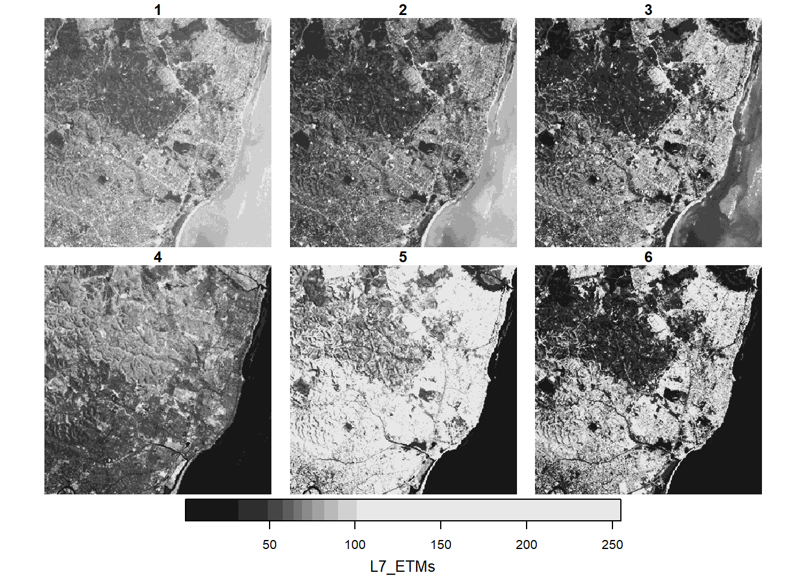](chapter45_files/figure-html/unnamed-chunk-32-1.png)

### 45.3.1 GeoTIFFデータの読み込み

ラスタデータは衛星などからの写真・画像として得られることもあります。`stars`では、[GeoTIFF](https://ja.wikipedia.org/wiki/GeoTIFF)ファイル（地理情報を含むTIFFファイル）を読み込んで`stars`ファイルとすることができます。以下の例では、パッケージのフォルダから`L7_ETMs`のGeoTIFF画像を`read_stars`関数で読み込んでいます。読み込んだデータのクラスは`stars`のみで、上で示した`stars_proxy`とは少し表示が異なります。`stars`はS3クラスで、中身はリストです。

``` downlit
# パッケージのフォルダ内のファイルへのパスを取得
tif <- system.file("tif/L7_ETMs.tif", package = "stars") 

# 読み込み
x <- read_stars(tif)
x # GeoTIFFには測地系などの情報が付随している
## stars object with 3 dimensions and 1 attribute
## attribute(s):
##              Min. 1st Qu. Median     Mean 3rd Qu. Max.
## L7_ETMs.tif     1      54     69 68.91242      86  255
## dimension(s):
##      from  to  offset delta                     refsys point x/y
## x       1 349  288776  28.5 SIRGAS 2000 / UTM zone 25S FALSE [x]
## y       1 352 9120761 -28.5 SIRGAS 2000 / UTM zone 25S FALSE [y]
## band    1   6      NA    NA                         NA    NA

class(x) # クラスはstars
## [1] "stars"

mode(x) # starsはリスト(S3オブジェクト)
## [1] "list"
```

### 45.3.2 starsのデータ構造

`stars`のリストの要素は3次元の`array`です。また、`stars`をデータフレームに変換すると、`x`と`y`、`band`の番号とその値からなる、4列のデータフレームになります。

``` downlit
class(x[[1]]) # starsの要素はarray
## [1] "array"

dim(x[[1]]) # 3次元アレイになっている
##    x    y band 
##  349  352    6

as.data.frame(x) |> head() # データフレームに変換できる
##          x       y band L7_ETMs.tif
## 1 288790.5 9120747    1          69
## 2 288819.0 9120747    1          69
## 3 288847.5 9120747    1          63
## 4 288876.0 9120747    1          60
## 5 288904.5 9120747    1          61
## 6 288933.0 9120747    1          61
```

### 45.3.3 netCDFの読み込み

[netCDF](https://ja.wikipedia.org/wiki/NetCDF)（Network Common Data Form）は、気象や海洋などのラスタデータを取り扱う際に広く用いられているバイナリ形式のファイルです。`read_stars`関数でこの`netCDF`をstarsオブジェクトとして読み込むことで、R上で取り扱うことができます。

下の例では、[北米の降雨量・気温・時間をまとめたnetCDFデータ](https://gdo-dcp.ucllnl.org/downscaled_cmip_projections/dcpInterface.html#About)をパッケージのフォルダから`read_stars`関数で読み込み、`stars`オブジェクトとしています。`bcsd_obs_1999.nc`というファイルがnetCDFファイルで、拡張子には.ncが用いられます。読み込み時には登録されているデータの名前（`pr`：降雨量、`tas`：気温）が返ってきます。

``` downlit
# pr（降水量）とtas（気温）があることが返ってくる
w <- system.file("nc/bcsd_obs_1999.nc", package = "stars") |>
    read_stars()
## pr, tas,

# prとtasはstars（S3、リスト）の要素
w |> str(max.level = 1)
## List of 2
##  $ pr : Units: [mm/m] num [1:81, 1:33, 1:12] 224 225 233 226 223 ...
##  $ tas: Units: [C] num [1:81, 1:33, 1:12] 4.73 4.53 4.81 4.71 4.33 ...
##  - attr(*, "dimensions")=List of 3
##   ..- attr(*, "raster")=List of 4
##   .. ..- attr(*, "class")= chr "stars_raster"
##   ..- attr(*, "class")= chr "dimensions"
##  - attr(*, "class")= chr "stars"

# wは12時点のデータ
dim(w)
##    x    y time 
##   81   33   12
```

### 45.3.4 ggplot2でstarsオブジェクトをプロットする

`stars`パッケージには`ggplot2`で`stars`オブジェクトをプロットするための`geom`関数である`geom_stars`関数が備わっています。`geom_stars`関数内でデータを設定することで、自動的に`aes`の内容が決定されてプロットされる仕組みになっています。`ggplot2`のその他の関数（下の例では`facet_wrap`や`scale_fill_viridis`関数）は`ggplot2`と同様に利用することができます。

``` downlit
pacman::p_load(viridis)

ggplot() +
  geom_stars(data = w[1], alpha = 0.8) +
  facet_wrap(~ time) +
  scale_fill_viridis()
```

[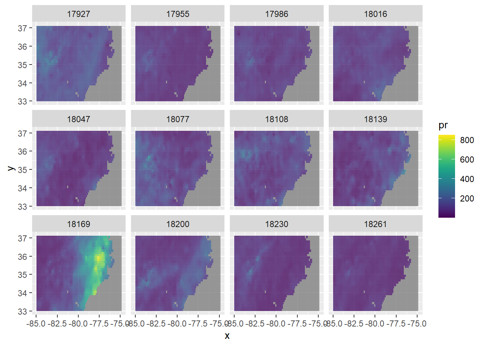](chapter45_files/figure-html/unnamed-chunk-36-1.png)

### 45.3.5 starsクラスの構造

`stars`クラスから特定の要素を抜き出す場合には、`split`関数を用います。`split`関数では、第一引数に`stars`オブジェクト、第二引数に抜き出す要素（`x`、`y`、`band`など）を文字列で指定します。`stars`オブジェクトに要素を追加する場合には`merge`関数を用います。

``` downlit
st_dimensions(x) # dimensionの情報を取り出す
##      from  to  offset delta                     refsys point x/y
## x       1 349  288776  28.5 SIRGAS 2000 / UTM zone 25S FALSE [x]
## y       1 352 9120761 -28.5 SIRGAS 2000 / UTM zone 25S FALSE [y]
## band    1   6      NA    NA                         NA    NA

split(x, "x") |> head(5) # xの要素を取り出す
## stars object with 2 dimensions and 5 attributes
## attribute(s):
##     Min. 1st Qu. Median     Mean 3rd Qu. Max.
## X1    20      52   64.5 66.79972      79  177
## X2    19      53   65.0 67.42188      79  162
## X3    16      55   66.0 68.44318      78  166
## X4    18      55   65.0 68.16525      78  180
## X5    12      54   65.0 67.37879      78  153
## dimension(s):
##      from  to  offset delta                     refsys point
## y       1 352 9120761 -28.5 SIRGAS 2000 / UTM zone 25S FALSE
## band    1   6      NA    NA                         NA    NA

split(x, "y") |> head(5)
## stars object with 2 dimensions and 5 attributes
## attribute(s):
##     Min. 1st Qu. Median     Mean 3rd Qu. Max.
## X1    14      55     70 72.22541      88  180
## X2    15      54     69 71.36199      87  163
## X3    16      53     68 70.44126      85  160
## X4    15      54     68 70.06256      84  161
## X5     9      55     70 71.06590      86  164
## dimension(s):
##      from  to offset delta                     refsys point
## x       1 349 288776  28.5 SIRGAS 2000 / UTM zone 25S FALSE
## band    1   6     NA    NA                         NA    NA

split(x, "band") |> head(5)
## stars object with 2 dimensions and 5 attributes
## attribute(s):
##     Min. 1st Qu. Median     Mean 3rd Qu. Max.
## X1    47      67     78 79.14772      89  255
## X2    32      55     66 67.57465      79  255
## X3    21      49     63 64.35886      77  255
## X4     9      52     63 59.23541      75  255
## X5     1      63     89 83.18266     112  255
## dimension(s):
##   from  to  offset delta                     refsys point x/y
## x    1 349  288776  28.5 SIRGAS 2000 / UTM zone 25S FALSE [x]
## y    1 352 9120761 -28.5 SIRGAS 2000 / UTM zone 25S FALSE [y]
```

### 45.3.6 sfでラスタデータを切り抜き（crop）する

`sf`のベクタデータを利用して、`stars`のラスタデータを切り出すこともできます。ラスタデータの位置に対応した`sf`オブジェクト（正確には`sfc`オブジェクト）を準備し、`stars`オブジェクトのインデックスに`sf`オブジェクトを与えると、その`sfc`オブジェクトで指定した範囲のラスタデータのみが抽出されます。下の例では、`circle`はPOLIGONの`sfc`オブジェクトで、`x`が`stars`オブジェクトです。`x[circle]`という形で`stars`のインデックスに`sf`を指定することで、`stars`のラスタデータをクロップ（切り抜き）することができます。

``` downlit
# circleはPOLIGONのsfcオブジェクト
circle = st_sfc(st_buffer(st_point(c(293749.5, 9115745)), 400), crs = st_crs(x))

# sfcで呼び出すと切り出し（crop）ができる
plot(x[circle][, , , 1], reset = FALSE) # x[circle]でsfでのcropを行っている
par(new = T)
plot(circle, col = NA, border = 'red', add = TRUE, lwd = 2)
```

[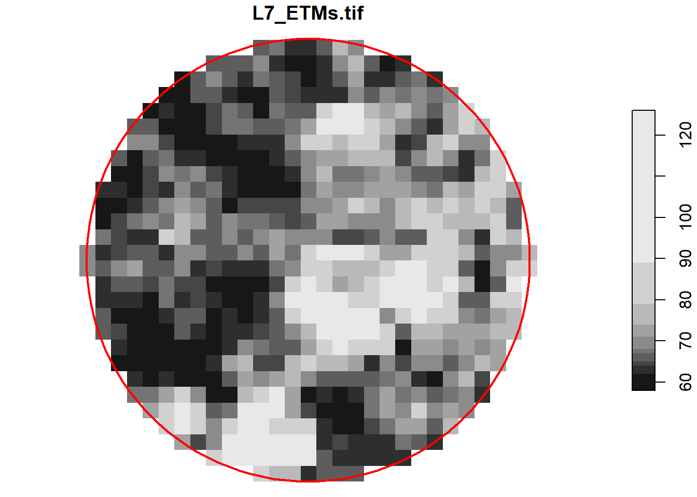](chapter45_files/figure-html/unnamed-chunk-38-1.png)

### 45.3.7 starsオブジェクトの整形

`stars`オブジェクトのデータの整形は、`dplyr`を用いて行うことができます。`stars`オブジェクトは`array`のリストであるため、`array`データの整形に関わるパッケージである[`cubelyr`](https://cran.r-project.org/web/packages/cubelyr/index.html)パッケージ([Wickham 2022](#ref-cubelyr_bib))をロードしておいた方がよい場合もあります。

``` downlit
w # 上でロードした北米の降雨量・気温のラスタデータ
## stars object with 3 dimensions and 2 attributes
## attribute(s):
##                 Min.   1st Qu.   Median      Mean   3rd Qu.      Max.  NAs
## pr [mm/m]  0.5900000 56.139999 81.88000 101.26433 121.07250 848.54999 7116
## tas [C]   -0.4209678  8.898887 15.65763  15.48932  21.77979  29.38581 7116
## dimension(s):
##      from to offset  delta  refsys
## x       1 81    -85  0.125      NA
## y       1 33  37.12 -0.125      NA
## time    1 12     NA     NA udunits
##                                                                                                 values
## x                                                                                                 NULL
## y                                                                                                 NULL
## time [17927,17955) [days since 1950-01-01 00:00:00],...,[18261,18292) [days since 1950-01-01 00:00:00]
##      x/y
## x    [x]
## y    [y]
## time

# pacman::p_load(cubelyr) # なくてもよい

# xの範囲を指定する（offset ～ offset + delta * (to - 1)の間を指定する必要がある）
w |> filter(x > -80, x < -70)
## stars object with 3 dimensions and 2 attributes
## attribute(s):
##                Min.   1st Qu.   Median      Mean   3rd Qu.      Max.  NAs
## pr [mm/m] 11.130000 54.117499 85.09000 119.11238 136.03000 848.54999 7068
## tas [C]    3.290161  9.328485 16.36981  16.30875  22.35612  28.87371 7068
## dimension(s):
##      from to offset  delta  refsys
## x       1 41    -80  0.125      NA
## y       1 33  37.12 -0.125      NA
## time    1 12     NA     NA udunits
##                                                                                                 values
## x                                                                                                 NULL
## y                                                                                                 NULL
## time [17927,17955) [days since 1950-01-01 00:00:00],...,[18261,18292) [days since 1950-01-01 00:00:00]
##      x/y
## x    [x]
## y    [y]
## time

# リストの要素を追加する
w |> mutate(pr_per_tas = pr / tas) # 降水量を気温で割った値を追加している
## stars object with 3 dimensions and 3 attributes
## attribute(s):
##                        Min.     1st Qu.       Median         Mean      3rd Qu.
## pr [mm/m]         0.5900000 56.13999939 81.879997253 1.012643e+02 1.210725e+02
## tas [C]          -0.4209678  8.89888668 15.657626152 1.548932e+01 2.177979e+01
## pr_per_tas [1/C] -3.1607183  0.00371323  0.005873292 9.045726e-03 9.713252e-03
##                        Max.  NAs
## pr [mm/m]        848.549988 7116
## tas [C]           29.385807 7116
## pr_per_tas [1/C]   7.348576 7116
## dimension(s):
##      from to offset  delta  refsys
## x       1 81    -85  0.125      NA
## y       1 33  37.12 -0.125      NA
## time    1 12     NA     NA udunits
##                                                                                                 values
## x                                                                                                 NULL
## y                                                                                                 NULL
## time [17927,17955) [days since 1950-01-01 00:00:00],...,[18261,18292) [days since 1950-01-01 00:00:00]
##      x/y
## x    [x]
## y    [y]
## time

# リストの要素を選択する
w |> select(pr)
## stars object with 3 dimensions and 1 attribute
## attribute(s):
##           Min. 1st Qu. Median     Mean  3rd Qu.   Max.  NAs
## pr [mm/m] 0.59   56.14  81.88 101.2643 121.0725 848.55 7116
## dimension(s):
##      from to offset  delta  refsys
## x       1 81    -85  0.125      NA
## y       1 33  37.12 -0.125      NA
## time    1 12     NA     NA udunits
##                                                                                                 values
## x                                                                                                 NULL
## y                                                                                                 NULL
## time [17927,17955) [days since 1950-01-01 00:00:00],...,[18261,18292) [days since 1950-01-01 00:00:00]
##      x/y
## x    [x]
## y    [y]
## time
```

### 45.3.8 starsオブジェクトを作成する

ラスタデータは`x`、`y`の位置とその位置に対応する値からなるデータです。このようなデータは行列があれば表現することができます。`stars`では行列から`st_as_stars`関数を用いて`stars`オブジェクトを作成することができます。ただし、この行列から`stars`を作成する場合には、行方向が`x`（東西）、列方向が`y`（南北）に相当するとされるため、行列が90度回転した形で`stars`に変換されます。

``` downlit
# matrixからstarsオブジェクトを作成する
ma <- matrix(1:20, nrow = 4)
dim(ma) = c(x = 4, y = 5) # 軸名をつける
ma <- st_as_stars(ma)
ma # starsオブジェクトの表示、値はattributeとなっている
## stars object with 2 dimensions and 1 attribute
## attribute(s):
##     Min. 1st Qu. Median Mean 3rd Qu. Max.
## A1     1    5.75   10.5 10.5   15.25   20
## dimension(s):
##   from to offset delta point x/y
## x    1  4      0     1 FALSE [x]
## y    1  5      0     1 FALSE [y]

# dimでは位置情報の次元が返ってくる（転置しているので、縦長になる）
ma |> dim()
## x y 
## 4 5

# リストにはmatrixが登録されている
ma |> _[[1]] 
##      [,1] [,2] [,3] [,4] [,5]
## [1,]    1    5    9   13   17
## [2,]    2    6   10   14   18
## [3,]    3    7   11   15   19
## [4,]    4    8   12   16   20

# 90度回転した結果が帰ってきている（行方向が1次元目、列方向が2次元目となるため）
ma |> image(text_values = TRUE) 
```

[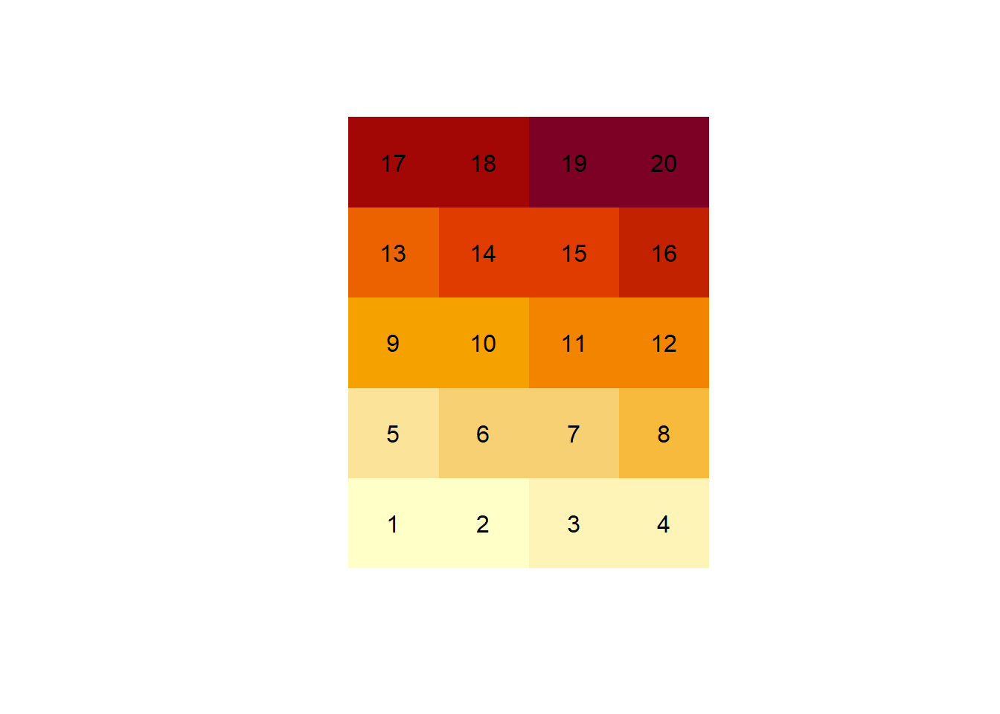](chapter45_files/figure-html/unnamed-chunk-40-1.png)

### 45.3.9 ラスタの形状の変更

上記の`L7_ETMs`では、`x`、`y`の`delta`の絶対値が同じ値（28.5）であったため、ラスタの1点の形は正方形でした。一方で、`stars`ではラスタの形状を正方形だけでなく、長方形や平行四辺形のような、ゆがめた形（シアー、shear、ずれた形）を取ったり、ラスタデータを回転させることもできます。

ラスタの形状データはアトリビュートとして設定されており、attributes中の`affine`がシアーの設定となります。この`affine`にベクターを代入することでシアーの角度を調整することができます。また、`curvilinear`は曲面座標系の設定となります。

``` downlit
# rasterの要素にグリッドの回転・シアー(shear)を設定する
# affineが回転/シアー、curvilinearは曲線座標を示す
st_dimensions(ma) |> str(list.len = 4)
## List of 2
##  $ x:List of 7
##   ..$ from  : num 1
##   ..$ to    : int 4
##   ..$ offset: num 0
##   ..$ delta : num 1
##   .. [list output truncated]
##   ..- attr(*, "class")= chr "dimension"
##  $ y:List of 7
##   ..$ from  : num 1
##   ..$ to    : int 5
##   ..$ offset: num 0
##   ..$ delta : num 1
##   .. [list output truncated]
##   ..- attr(*, "class")= chr "dimension"
##  - attr(*, "raster")=List of 4
##   ..$ affine     : num [1:2] 0 0
##   ..$ dimensions : chr [1:2] "x" "y"
##   ..$ curvilinear: logi FALSE
##   ..$ blocksizes : NULL
##   ..- attr(*, "class")= chr "stars_raster"
##  - attr(*, "class")= chr "dimensions"

ma1 <- ma

# affineを変更することで、シアーの角度を設定する
attr(attr(ma1, "dimensions"), "raster")$affine = c(0.1, 0.2)
st_dimensions(ma1) |> str(list.len = 4)
## List of 2
##  $ x:List of 7
##   ..$ from  : num 1
##   ..$ to    : int 4
##   ..$ offset: num 0
##   ..$ delta : num 1
##   .. [list output truncated]
##   ..- attr(*, "class")= chr "dimension"
##  $ y:List of 7
##   ..$ from  : num 1
##   ..$ to    : int 5
##   ..$ offset: num 0
##   ..$ delta : num 1
##   .. [list output truncated]
##   ..- attr(*, "class")= chr "dimension"
##  - attr(*, "raster")=List of 4
##   ..$ affine     : num [1:2] 0.1 0.2
##   ..$ dimensions : chr [1:2] "x" "y"
##   ..$ curvilinear: logi FALSE
##   ..$ blocksizes : NULL
##   ..- attr(*, "class")= chr "stars_raster"
##  - attr(*, "class")= chr "dimensions"

image(ma1)
```

[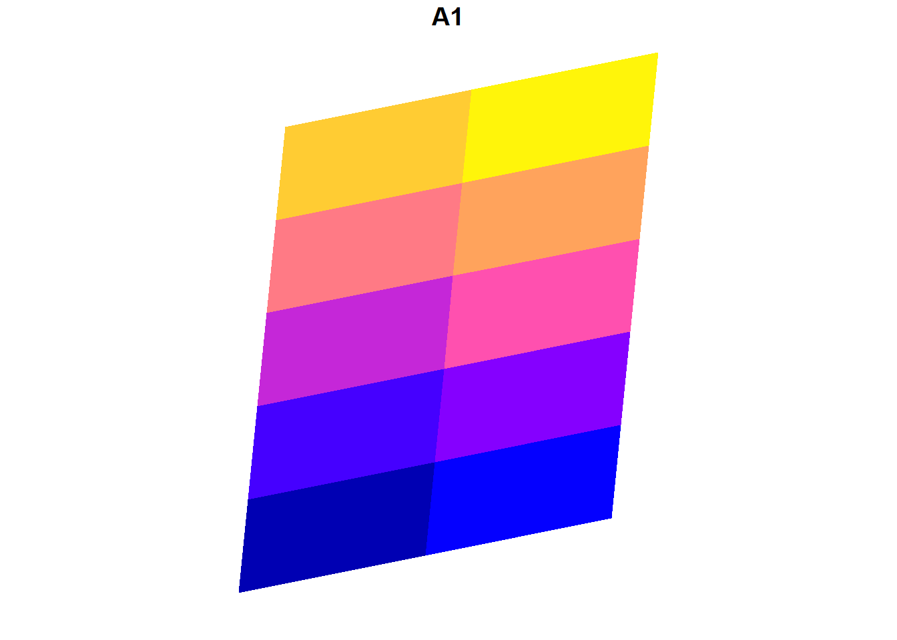](chapter45_files/figure-html/unnamed-chunk-41-1.png)

### 45.3.10 sfをラスタに変換

`sf`を`stars`に変換するのに用いる関数が、`st_rasterize`関数です。`sf`オブジェクトをそのままラスタにすると、列が自動的に選ばれてデータとして設定されます。`sf`では、インデックスに列名を指定すると、その列とgeometryだけが残った`sf`オブジェクトが得られます。この特徴を利用して、インデックス指定した`sf`を`st_rasterize`の引数とするとよいでしょう。また、`x`、`y`の`delta`はそれぞれ`dx`、`dy`引数で設定することができます。

``` downlit
# sfをラスタ化する
st_rasterize(Nara_sfobj, dx = 0.01, dy = 0.01)
## stars object with 2 dimensions and 4 attributes
## attribute(s):
##                Min.  1st Qu.    Median         Mean   3rd Qu.      Max.  NAs
## total_pop       357     1176      3061     41352.00     28121    354630 2883
## male_pop        176      567      1663     19400.84     13374    164846 2883
## female_pop      181      609      1398     21951.16     14747    189784 2883
## area        4064489 95664616 247544016 263988281.22 292085792 672577536 2883
## dimension(s):
##   from to offset delta refsys point x/y
## x    1 70  135.5  0.01 WGS 84 FALSE [x]
## y    1 93  34.78 -0.01 WGS 84 FALSE [y]

# male_popの列だけ選んでラスタ化する
st_rasterize(Nara_sfobj["male_pop"], dx = 0.01, dy = 0.01) |> plot()
```

[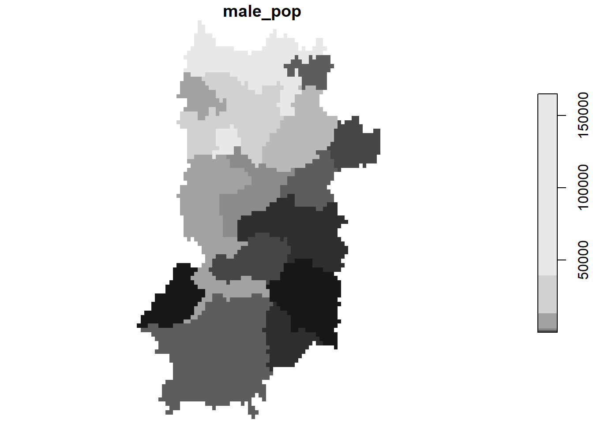](chapter45_files/figure-html/unnamed-chunk-42-1.png)

### 45.3.11 starsオブジェクトをsfに変換

#### 45.3.11.1 contour（等高線）への変換

`stars`オブジェクトを`sf`に変換する方法はいくつかあります。まず紹介するのは、`st_contour`関数を用いて、等高線を示すLINESTRINGに変換する方法です。`contour_lines`引数にはLINESTRINGを返すかどうか（`FALSE`ならPOLIGONが返ってきます）、`breaks`引数には等高線の間隔を指定します。

``` downlit
# 等高線のLINESTRINGに変換
st_contour(ma, contour_lines = TRUE, breaks = 1:20) |> plot()
```

[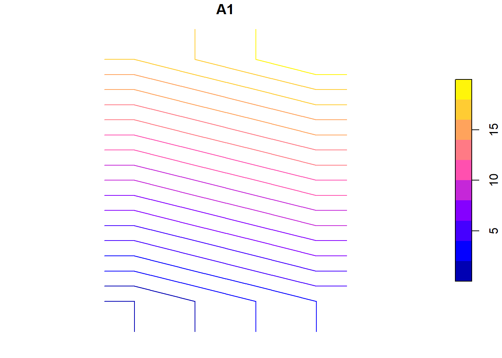](chapter45_files/figure-html/unnamed-chunk-43-1.png)

#### 45.3.11.2 POINT、POLYGONへの変換

starsオブジェクトをPOINTやPOLYGONに変換する場合には、`st_as_sf`関数を用います。`as_point`引数に`TRUE`を指定した場合にはPOINTの`sf`が、`FALSE`を指定した場合にはPOLYGONの`sf`が返ってきます。

``` downlit
st_as_sf(ma, as_points = TRUE) |> plot() # POINTSに変換
```

[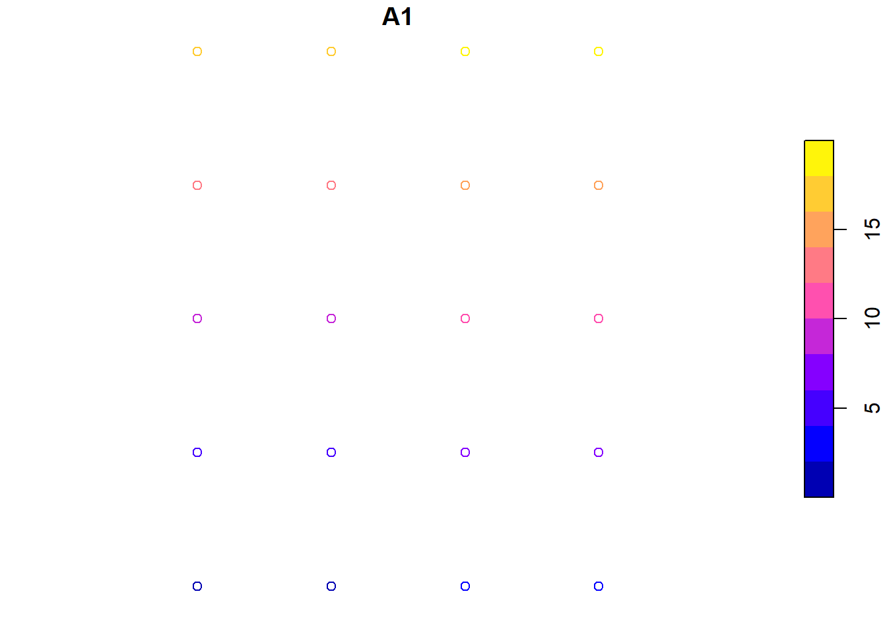](chapter45_files/figure-html/unnamed-chunk-44-1.png)

``` downlit

st_as_sf(ma, as_points = FALSE) |> plot() # POLYGONに変換
```

[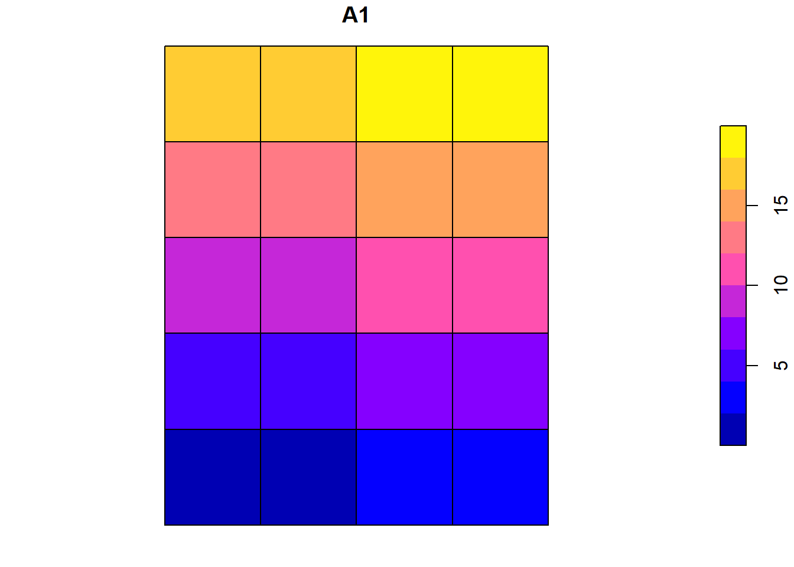](chapter45_files/figure-html/unnamed-chunk-44-2.png)

## 45.4 インタラクティブなマップの表示

上述のように、`sf`でも`stars`でも、オブジェクトを`plot`関数の引数に取ることで地図を描画することができます。また、`ggplot2`にも`sf`や`stars`オブジェクトを表示するための手法が存在します。一方で地図データでは比較的大きい面積を占める地理空間と、狭い面積を占める空間（参考：[面積が大きい・小さい市町村](https://www.gsi.go.jp/common/000077945.pdf)）があり、どうしても狭い面積を占める空間は見にくくなってしまいます。この問題は、`plot`や`ggplot2`のグラフが静的であることが原因で起こります。

地理情報を表示する場合には、静的な図ではなく、例えばgoogle mapのように、地図を拡大・縮小して確認できた方が情報を利用しやすく、理解しやすくなります。このような拡大・縮小に対応した、インタラクティブな地図を書くパッケージがRにはいくつも備わっています。インタラクティブな地図を描画するパッケージの代表的なものが、[`tmap`](https://r-tmap.github.io/tmap/)パッケージ([Tennekes 2018](#ref-tmap_bib))と[`leaflet`](https://rstudio.github.io/leaflet/)パッケージ([Cheng et al. 2023](#ref-leaflet_bib))です。

`tmap`は`ggplot2`風に用いることができる、比較的簡単に静的・インタラクティブな地図を描画するパッケージです、一方で`leaflet`はより本格的にインタラクティブな地図を描画することができるパッケージです。以下では、まず`tmap`について紹介し、その後`leaflet`について紹介します。

## 45.5 tmapパッケージ

`tmap`パッケージは、設定により静的・インタラクティブな地図の描画を切り替えることができる、ggplot2-likeな地図描画パッケージです。

`tmap`パッケージで地図を描画するときには、まず`sf`オブジェクトを`tm_shape`関数の引数に取ります。`ggplot2`での`ggplot`関数と同様に、`tm_shape`関数だけでは地図を描画することはできず、この関数に`+`で他の関数をつないでいくことで地図を描画することができます。たとえば、POLYGONの中身を埋め、境界線を表示した地図を描画する場合には、以下のように`tm_polygons`関数を`+`でつなぎます。

``` downlit
pacman::p_load(tmap)

Nara_sfobj |> 
  tm_shape() +
  tm_polygons()
```

[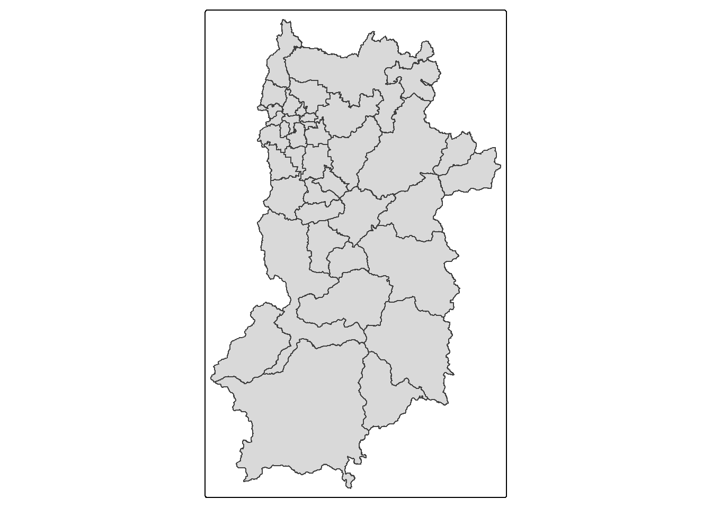](chapter45_files/figure-html/unnamed-chunk-45-1.png)

同様に、POLYGONの境界線を描画する場合には、`tm_borders`関数を`+`でつなぎます。

``` downlit
Nara_sfobj |> 
  tm_shape() +
  tm_borders()
```

[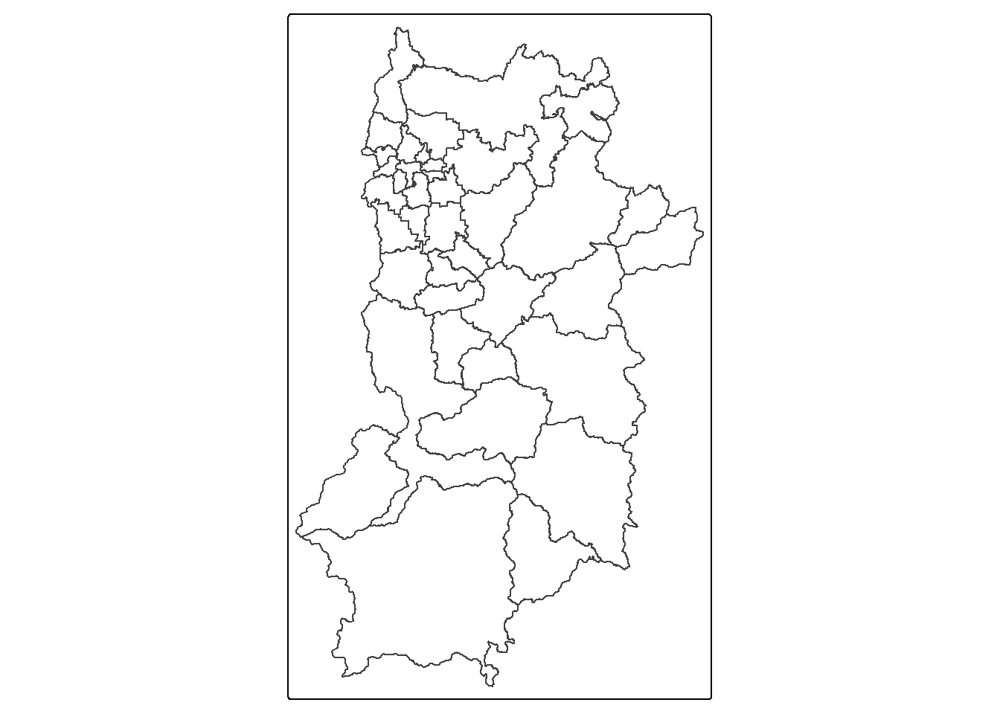](chapter45_files/figure-html/unnamed-chunk-46-1.png)

また、境界線を描画することなくPOLYGONを埋めるように描画する場合には`tm_fill`を用います。`tm_fill`と`tm_borders`を同時に描画しているのが`tm_polygons`になります。

``` downlit
Nara_sfobj |> 
  tm_shape() +
  tm_fill()
```

[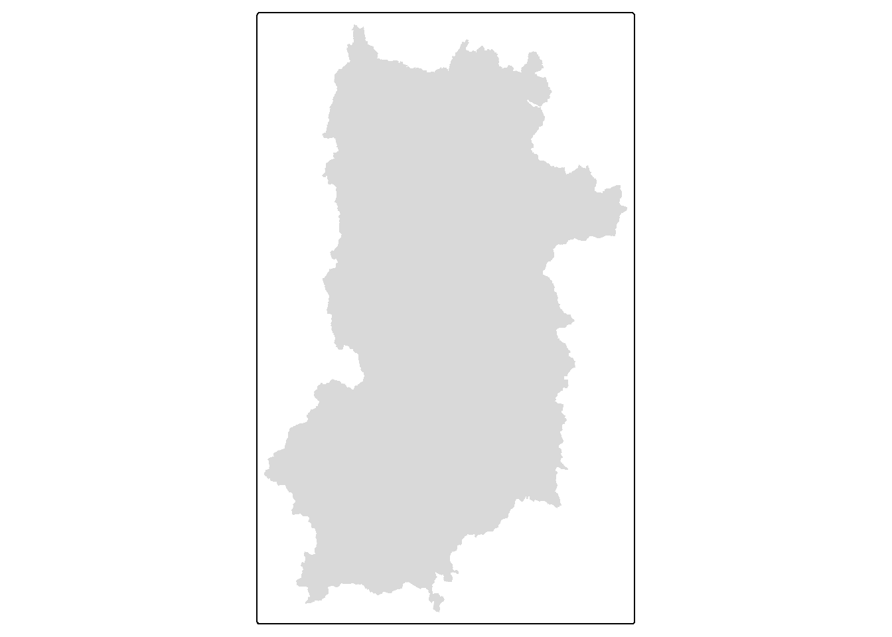](chapter45_files/figure-html/unnamed-chunk-47-1.png)

### 45.5.1 コロプレス図を描画する

コロプレス図を描画する場合には、`tm_polygons`関数の`fill`引数に、描画したい値を文字列で指定します。凡例（legend）や色は自動的に作成され、表示されます。

``` downlit
Nara_sfobj |> 
  tm_shape() +
  tm_polygons(fill = "total_pop")
```

[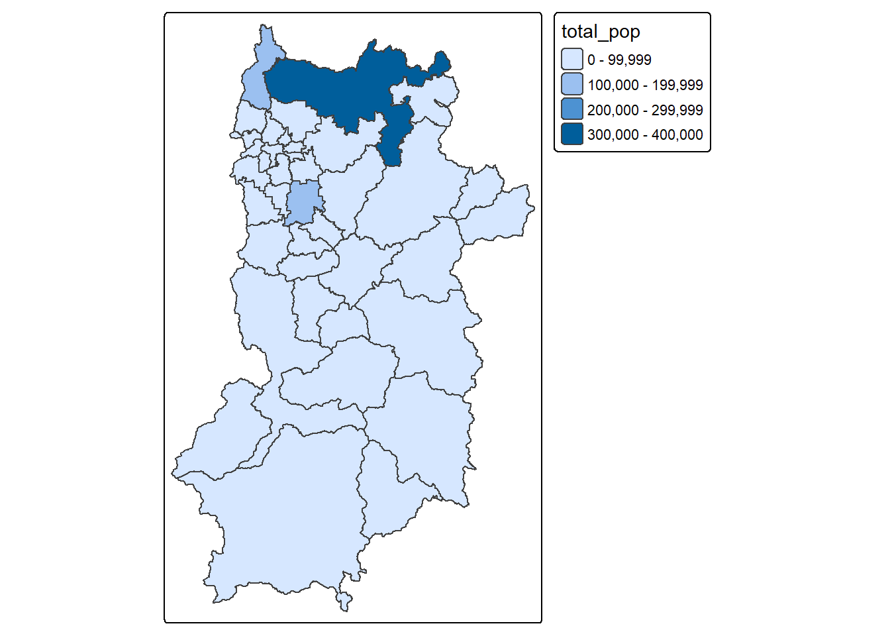](chapter45_files/figure-html/unnamed-chunk-48-1.png)

#### 45.5.1.1 静的マップとインタラクティブマップ

ここまでは`tmap`で描画されているのは静的な、拡大・縮小などができないマップでした。`tmap`では、静的なマップ・インタラクティブなマップを表示するモードを`tmap_mode`関数で変更できます。`tmap_mode("view")`と指定すると、インタラクティブなマップが、`tmap_mode("plot")`と指定すると静的なマップが表示されるようになります。モードの設定を行っていないときは静的なマップが表示されます。また、`ttm`関数で`"view"`と`"plot"`を切り替えることもできます。

インタラクティブな地図の表示には、後ほど説明する`leaflet`パッケージでも利用されている、Javascriptの地図表示パッケージである[leaflet](https://leafletjs.com/)が使用されています。

``` downlit
tmap_mode("view")
## ℹ tmap modes "plot" - "view"
## ℹ toggle with `tmap::ttm()`
Nara_sfobj |> 
  tm_shape() +
  tm_polygons(fill = "total_pop")
```

``` downlit
tmap_mode("plot")
## ℹ tmap modes "plot" - "view"
Nara_sfobj |> 
  tm_shape() +
  tm_polygons(fill = "total_pop")
```

[](chapter45_files/figure-html/unnamed-chunk-50-1.png)

### 45.5.2 legendの表示

legend（凡例）の表示方法を変える場合には、`tm_legend`関数を用います。`tm_legend`関数には凡例の表示を変えるためだけでなく、地図のタイトルや位置、色等を変更するための引数を指定することができます。legendの表示をしない場合には、引数に`show=FALSE`を指定します。

``` downlit
Nara_sfobj |> 
  tm_shape() +
  tm_polygons(fill = "total_pop") +
  tm_legend(show = FALSE) # viewモードではshow=FALSEは機能しない
## 
## ── tmap v3 code detected ───────────────────────────────────────────────────────
## [v3->v4] `tm_legend()`: use 'tm_legend()' inside a layer function, e.g.
## 'tm_polygons(..., fill.legend = tm_legend())'
## This message is displayed once every 8 hours.
```

[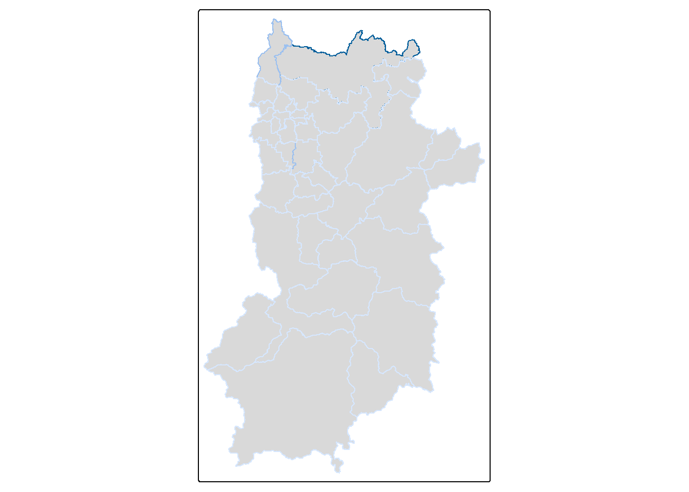](chapter45_files/figure-html/unnamed-chunk-51-1.png)

> **TIP:**
>
> メッセージに記載がある通り、上記の`tm_legend`関数はtmap ver.4（～2025/1/27）では`tm_polygon`関数内の引数として設定する形に変更となっています。`tmap`のVer.3とVer.4では関数や引数名に大幅な変更が行われています。`tmap`の後方互換性は保たれており、Ver.3のコードでも機能します。

### 45.5.3 バブルチャートの作成

地図上に値を点のサイズ・色で表現したい場合には、`tm_symbols`関数を用います。`col`引数に`sf`の列を文字列で指定すると点の色が、`size`に指定すると点のサイズがその列の値に従い変更されます。`scale`は点のサイズを調整する引数です。

``` downlit
Nara_sfobj |> 
  tm_shape() +
  tm_polygons() +
  tm_symbols(col = "total_pop", size = "total_pop", scale = 3) +
  tm_legend(show = FALSE)
## 
## ── tmap v3 code detected ───────────────────────────────────────────────────────
## [v3->v4] `symbols()`: use 'fill' for the fill color of polygons/symbols
## (instead of 'col'), and 'col' for the outlines (instead of 'border.col').
## [v3->v4] `tm_symbols()`: migrate the argument(s) related to the scale of the
## visual variable `size` namely 'scale' (rename to 'values.scale') to size.scale
## = tm_scale_continuous(<HERE>).
## ℹ For small multiples, specify a 'tm_scale_' for each multiple, and put them in
##   a list: 'size.scale = list(<scale1>, <scale2>, ...)'
## This message is displayed once every 8 hours.
```

[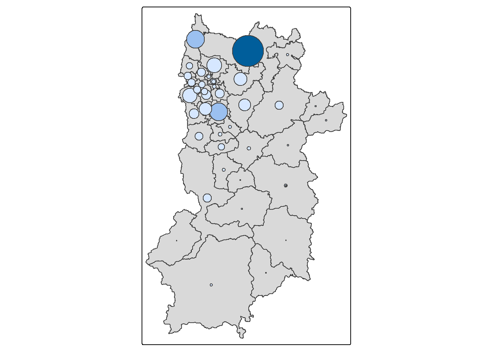](chapter45_files/figure-html/unnamed-chunk-52-1.png)

### 45.5.4 faceting

`ggplot2`と同様に、`tmap`でもfacetingにより複数のマップを簡単に並べて表示することができます。`tmap`ではfacetingの関数として`tm_facets`を用います。`tm_facets`では`by`引数に文字列で`sf`の列を取ることで、その列のラベルに従いグラフが分割されます。

``` downlit
# 奈良の市町村を北・南で2分割する
Nara_sfobj$ns <- rep(c("North", "South"), c(30, 12)) 
Nara_sfobj$ns[7] <- "South"

# tm_facetsで北部・南部を別のマップとして描画する
Nara_sfobj |> 
  tm_shape() +
  tm_polygons() +
  tm_symbols(col = "total_pop", size = "total_pop", scale = 3) +
  tm_legend(show = FALSE)+
  tm_facets(by = "ns")
## 
## ── tmap v3 code detected ───────────────────────────────────────────────────────
## [v3->v4] `tm_symbols()`: migrate the argument(s) related to the scale of the
## visual variable `size` namely 'scale' (rename to 'values.scale') to size.scale
## = tm_scale_continuous(<HERE>).
## ℹ For small multiples, specify a 'tm_scale_' for each multiple, and put them in
##   a list: 'size.scale = list(<scale1>, <scale2>, ...)'
```

[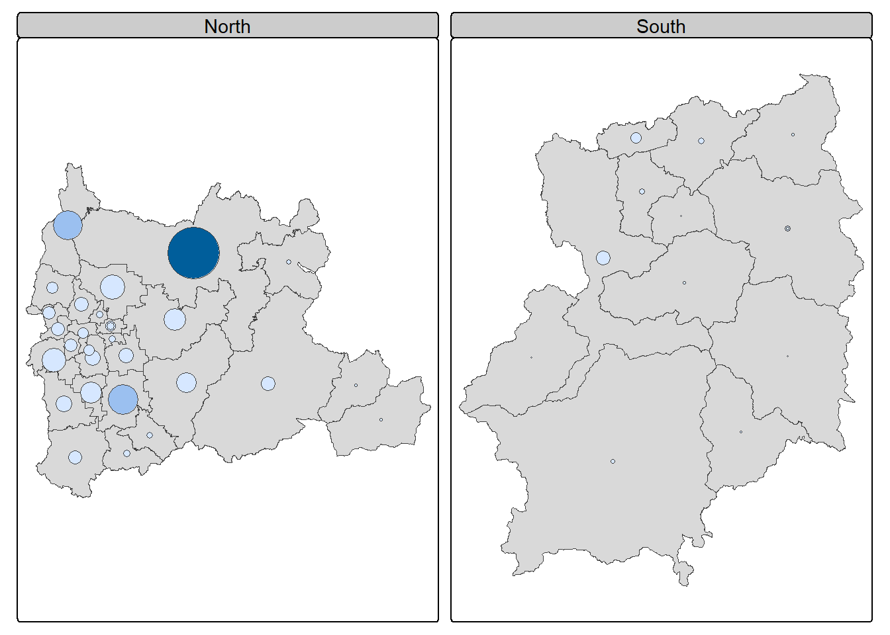](chapter45_files/figure-html/unnamed-chunk-53-1.png)

### 45.5.5 地図を並べる：tmap_arrange

facetingを用いるのではなく、複数作成した`tmap`の地図を並べて表示することもできます。地図を並べて表示する場合には、`tmap`のオブジェクトを変数に代入し、その変数を`tmap_arrange`関数の引数に取ります。並べ方は`ncol`、`nrow`などの引数で、グラフのサイズは`width`、`heights`などの引数で指定することができます。

``` downlit
# tmapのオブジェクトを準備する
map_north <- Nara_sfobj |> 
  filter(ns == "North") |> 
  tm_shape() +
  tm_polygons()

map_south <- Nara_sfobj |> 
  filter(ns == "South") |> 
  tm_shape() +
  tm_polygons()

# 北側と南側の地図を左右に並べて表示する
tmap_arrange(map_north, map_south)
```

[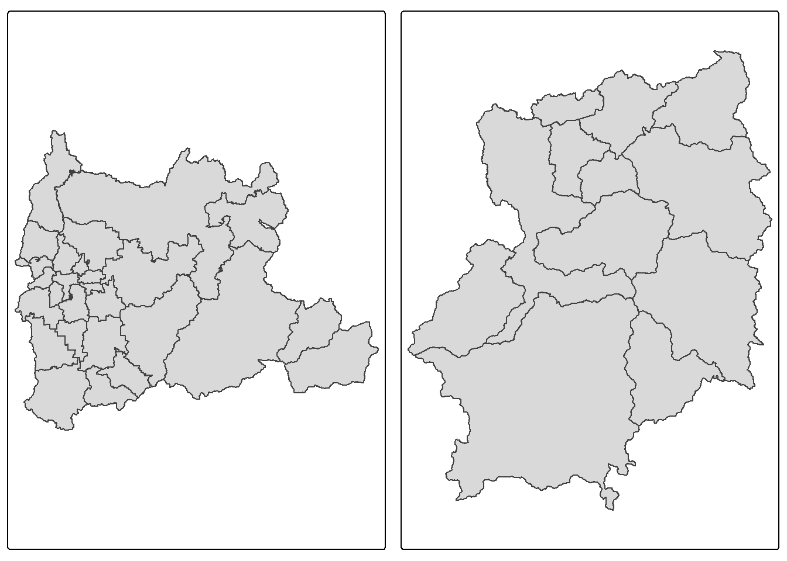](chapter45_files/figure-html/unnamed-chunk-54-1.png)

### 45.5.6 その他の設定

`tmap`にはたくさんの関数・引数が設定されており、うまく用いることで地図の表示を様々にカスタマイズすることができます。以下の例では`tm_layout`関数の`bg.color`引数に色を指定することで、背景色を青色にしています。また、`stars`のラスタデータを描画する場合には`tm_raster`関数を用います。

``` downlit
Nara_sfobj |> 
  tm_shape() +
  tm_polygons(fill = "total_pop") +
  tm_layout(bg.color = "blue") +
  tm_legend(show = FALSE)
## 
## ── tmap v3 code detected ───────────────────────────────────────────────────────
```

[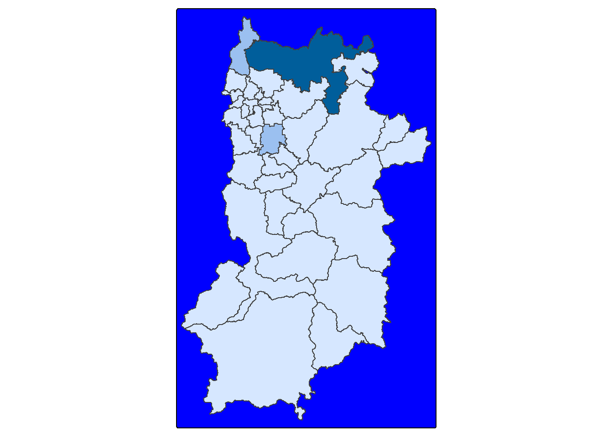](chapter45_files/figure-html/unnamed-chunk-55-1.png)

``` downlit
# sfをラスタに変換
Nara_raster <- st_rasterize(Nara_sfobj["male_pop"], dx = 0.01, dy = 0.01)

# ラスタを表示する
Nara_raster |> 
  tm_shape() +
  tm_raster() +
  tm_legend(show = FALSE)
## 
## ── tmap v3 code detected ───────────────────────────────────────────────────────
```

[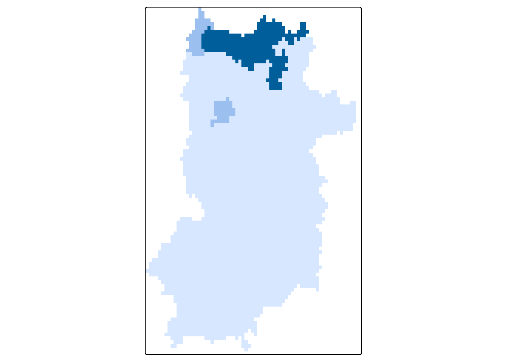](chapter45_files/figure-html/unnamed-chunk-56-1.png)

### 45.5.7 tmapオブジェクトを保存する

`ggplot2`における`ggsave`のように、`tmap`にはマップを保存するための関数である`tmap_save`関数があります。`tmap_save`関数では`tmap`のオブジェクトと`filename`を引数として指定します。`filename`の拡張子に従い保存する形式を変更することができ、`.png`や`.jpg`などを用いれば画像で、`.html`を指定すればインタラクティブなJavascriptのマップとして保存することができます。

``` downlit
tmap_save(map_north, filename = "naramap_north.png")

tmap_save(map_north, filename = "naramap_north.html")
```

## 45.6 leafletパッケージ

インタラクティブなマップを作成したい場合には、`tmap`でも紹介したJavascriptのライブラリであるleafletをRで用いることができるようにした、`leaflet`パッケージを用いるのが最もよいでしょう。`tmap`は（部分的に）`leaflet`パッケージのwrapperとなっていて、`tmap`でインタラクティブなマップを書くこともできますが、`leaflet`パッケージでは細かく引数を設定することで、より思い通りのマップを作成することができます。

``` downlit
pacman::p_load(leaflet)
```

### 45.6.1 基本のマップ

`leaflet`は`ggplot2`や`tmap`のように`+`でつなぐタイプのグラフィックパッケージではなく、`plotly`に近い、パイプ演算子で繋いでいくタイプのパッケージです。`leaflet`パッケージでのマップ作製は、まず`sf`オブジェクトを`leaflet`関数の引数とするところからスタートします。次に、パイプ演算子で`addTiles`関数を繋ぎます。この形で引数を取らずに実行すると、世界地図が示されます。

``` downlit
Nara_sfobj |> 
  leaflet() |> 
  addTiles()
```

### 45.6.2 setView関数

このままではズームが引きすぎですし、日本を中心とした形にもなっていません。デフォルトで表示する位置を表示するための関数が`setView`関数です。`setView`関数は、経度・緯度を引数に取り、その位置を中心としたマップを描画するための関数です。`zoom`引数に数値を設定することで、拡大した地図をデフォルトで表示することもできます。

``` downlit
Nara_sfobj |> 
  leaflet() |> 
  addTiles() |> 
  setView(137.5, 37.5, zoom = 4)
```

### 45.6.3 POLYGONを描画する

ここまでは`sf`オブジェクトの内容は何も表示されていません。`sf`に設定されているPOLYGONを描画するときには、`addPolygons`関数を用います。`addPolygons`関数をパイプ演算子でつなぐと、`sf`オブジェクトに設定されている`geometry`に従いマップが表示されます。しかし、今まで表示されていたマップの表示がなくなり、POLYGONだけが表示されるようになります。

``` downlit
Nara_sfobj |> 
  leaflet() |> 
  setView(136, 34.25, zoom = 8) |> 
  addPolygons()
```

### 45.6.4 背景のマップを描画する

背景のマップを表示する場合には、`addProviderTiles`関数を追加します。`addProviderTiles`では引数でどのようなマップを表示するかを選択します。マップの種類は、[leafletのプレビュー](https://leaflet-extras.github.io/leaflet-providers/preview/)を参考に選びましょう。以下の例では、`"OpenstreetMap.Mapnik"`（地名がその地域の言語に従い表示されるOpenstreetMap）を選択しています。

``` downlit
Nara_sfobj |> 
  leaflet() |> 
  addProviderTiles("OpenStreetMap.Mapnik") |> 
  setView(136, 34.25, zoom = 8) |> 
  addPolygons()
```

### 45.6.5 POLYGONの表示を整える

POLYGONと背景のマップは描画されましたが、どうもPOLYGONの周辺の線が太く、見にくいです。この線の太さや色は`addPolygons`の引数である`weight`や`color`を設定することで変更できます。`weight=1`とするとちょうどよい感じの線の太さになります。

``` downlit
Nara_sfobj |> 
  leaflet() |> 
  addProviderTiles("OpenStreetMap.Mapnik") |> 
  setView(136, 34.25, zoom = 8) |> 
  addPolygons(weight = 1, color = "blue")
```

### 45.6.6 POLYGONの中身の色を変更する

コロプレス図を作成するためには、POLYGONの中の色が値に従って変化する必要があります。コロプレス図を描画するためには、`addPolygons`関数の`fillcolor`引数を指定します。この`fillcolor`の設定がやや複雑で、まずは色を指定するルールに関する関数を設定する必要があります。

色を指定する関数には、`colorNumeric`、`colorBin`、`colorQuantile`、`colorFactor`の4つがあります。`colorNumeric`は数値をそのまま色に変換し、`colorBin`と`colorQuantile`は数値を指定した値の間隔、もしくは分位値に従って色分けし、`colorFactor`は因子に色を付ける関数です。下の例では、`colorQuantile`を用いて、`domain`に人口の対数（`log(Nara_sfobj$total_pop)`）を取ります。また、`n=5`を指定することで、人口を分位値で5カテゴリーに分けています。第一引数は色の指定で、赤（`"Reds"`）で値の変化を示すように設定しています。色指定については[Rの色見本](https://www.nceas.ucsb.edu/sites/default/files/2020-04/colorPaletteCheatsheet.pdf)を参考に指定します。

`fillcolor`引数では、チルダ（`~`）を用いて上の色指定関数（下の例では`pal`）を、コロプレス図に記載したいデータを引数として指定します。下の例では`log(total_pop)`を指定し、人口の対数をコロプレス図として示しています。

``` downlit
# 色指定のための関数
pal <- colorQuantile("Reds", domain = log(Nara_sfobj$total_pop), n = 5)

# fillcolor引数に色指定関数を設定し、コロプレス図とする
Nara_sfobj |> 
  leaflet() |> 
  addProviderTiles("OpenStreetMap.Mapnik") |> 
  setView(136, 34.25, zoom = 8) |> 
  addPolygons(weight = 1, color = "blue", fillColor = ~ pal(log(total_pop)))
```

### 45.6.7 fillcolorの調整

上の例では、全体的にコロプレス図の色が薄く、コントラストがよくありません。少し透明度が高すぎるようです。`addpolygons`関数で色の透明度を指定する場合には、`fillopacity`引数に値を指定します。`fillopacity`のデフォルト値は`0.2`でかなり小さめですので、もう少し大きな値を指定し、透明度を低めにします。透明度を低めに設定することで、コロプレス図のコントラストがはっきりし、分かりやすい図になります。

``` downlit
Nara_sfobj |> 
  leaflet() |> 
  addProviderTiles("OpenStreetMap.Mapnik") |> 
  setView(136, 34.25, zoom = 8) |> 
  addPolygons(
    weight = 1, 
    color = "blue", 
    fillColor = ~ pal(log(total_pop)),
    fillOpacity = 0.7)
```

### 45.6.8 マウスで選択した位置をハイライトする

`leaflet`では、インタラクティブなマップの表現として、拡大・縮小だけでなく、マウスで選択した位置をハイライトし、選択している位置を分かりやすくすることができます。このハイライトの設定を行う引数が`highlightOptions`です。`highlightoptions`引数には`highlightoptions`関数を指定し、この`highlightoptions`関数内でハイライトされたときの線の太さ（`weight`）、色（`color`）、透明度（`fillopacity`）、前面に表示するかどうか（`bringToFront`）等を指定します。

``` downlit
Nara_sfobj |> 
  leaflet() |> 
  addProviderTiles("OpenStreetMap.Mapnik") |> 
  setView(136, 34.25, zoom = 8) |> 
  addPolygons(
    weight = 1, 
    color = "blue", 
    fillColor = ~ pal(log(total_pop)),
    fillOpacity = 0.7,
    
    highlightOptions = highlightOptions(
      weight = 5,
      color = "red",
      fillOpacity = 0.3,
      bringToFront = TRUE))
```

### 45.6.9 マウスで選択した位置にテキストを表示する

同様に、マウスで選択した位置にテキストでその位置の情報を表示することもできます。表示するテキストの準備には`addPolygons`関数の`label`引数を用います。`label`引数には、`sf`オブジェクトの各列に対応する、表示したい文字列を設定します。

また、`addPolygons`関数の`labelOptions`引数を指定することで、表示する文字列の細かな設定を行うことができます。以下の例では、フォントのサイズやウエイト、空白スペースのサイズ、文字列が表示される位置を指定しています。

``` downlit
Nara_sfobj |> 
  leaflet() |> 
  addProviderTiles("OpenStreetMap.Mapnik") |> 
  setView(136, 34.25, zoom = 8) |> 
  addPolygons(
    weight = 1, 
    color = "blue", 
    fillColor = ~ pal(log(total_pop)),
    fillOpacity = 0.7,
    
    highlightOptions = highlightOptions(
      weight = 5,
      color = "red",
      fillOpacity = 0.3,
      bringToFront = TRUE),
      
    label = paste(Nara_sfobj$N03_004, ":", (Nara_sfobj$total_pop / 1000) |> round(1), "千人"),
    labelOptions = labelOptions(
      style = list("font-weight" = "normal", padding = "3px 8px"),
      textsize = "15px",
      direction = "auto"))
```

### 45.6.10 凡例の表示

さらに凡例を追加する場合には、`addPolygons`関数内で`addLegend`関数を指定します。`addLegend`関数には、`addPolygons`関数にも用いた色指定の関数（以下の例では`pal`）、数値（`values`）、透明度、位置等を引数に指定することで、`addPolygons`関数で指定した色に対応した凡例を追加することができます。

``` downlit
Nara_sfobj |> 
  leaflet() |> 
  addProviderTiles("OpenStreetMap.Mapnik") |> 
  setView(136, 34.25, zoom = 8) |> 
  addPolygons(
    weight = 1, 
    color = "blue", 
    fillColor = ~ pal(log(total_pop)),
    fillOpacity = 0.7,
    
    highlightOptions = highlightOptions(
      weight = 5,
      color = "red",
      fillOpacity = 0.3,
      bringToFront = TRUE),
      
    label = paste(Nara_sfobj$N03_004, ":", (Nara_sfobj$total_pop / 1000) |> round(1), "千人"),
    labelOptions = labelOptions(
      style = list("font-weight" = "normal", padding = "3px 8px"),
      textsize = "15px",
      direction = "auto")) |> 
    
    addLegend(pal = pal, values = ~log(total_pop), opacity = 0.7, title = NULL,
      position = "bottomright")
```

`leaflet`には上記の他にも無数の関数が設定されており、駆使することで色々なマップを作成することができます。`leaflet`の日本語の資料はあまりありませんが（日本語では[このページ](https://kazutan.github.io/JapanR2015/leaflet_d.html)が一番詳しいと思います）、[`leaflet`のreference](https://rstudio.github.io/leaflet/reference/index.html)を読み解きながら作図すれば、思い通りの地図を作成することができます。

Bivand, Roger, Jakub Nowosad, and Robin Lovelace. 2023. *spData: Datasets for Spatial Analysis*. <https://CRAN.R-project.org/package=spData>.

Cheng, Joe, Barret Schloerke, Bhaskar Karambelkar, and Yihui Xie. 2023. *Leaflet: Create Interactive Web Maps with the JavaScript ’Leaflet’ Library*. <https://CRAN.R-project.org/package=leaflet>.

Hijmans, Robert J. 2023. *Raster: Geographic Data Analysis and Modeling*. <https://CRAN.R-project.org/package=raster>.

Hijmans, Robert J. 2024. *Terra: Spatial Data Analysis*. <https://CRAN.R-project.org/package=terra>.

Pebesma, Edzer. 2018. “Simple Features for R: Standardized Support for Spatial Vector Data.” *The R Journal* 10 (1): 439–46. <https://doi.org/10.32614/RJ-2018-009>.

Pebesma, Edzer, and Roger Bivand. 2023a. *Spatial Data Science: With applications in R*. Chapman and Hall/CRC. <https://doi.org/10.1201/9780429459016>.

Pebesma, Edzer, and Roger Bivand. 2023b. *Spatial Data Science: With applications in R*. Chapman; Hall/CRC. <https://doi.org/10.1201/9780429459016>.

Pebesma, Edzer, Thomas Mailund, and James Hiebert. 2016. “Measurement Units in R.” *R Journal* 8 (2): 486–94. <https://doi.org/10.32614/RJ-2016-061>.

Tennekes, Martijn. 2018. “tmap: Thematic Maps in R.” *Journal of Statistical Software* 84 (6): 1–39. <https://doi.org/10.18637/jss.v084.i06>.

Wickham, Hadley. 2022. *Cubelyr: A Data Cube ’Dplyr’ Backend*. <https://CRAN.R-project.org/package=cubelyr>.

Back to top
