# 47  Shiny

Code

データを解析した後には、その結果を用いて他の人にデータや解析の意味を説明する必要があります。説明するために用いるものの一つが文書やプレゼンテーションです。文書やプレゼンテーションはR markdown・Quarto（[35章～43章](chapter35.llms.md)参照）で作成することができます。

もう一つの方法は、データを表示するためのウェブページを作成する方法です。ウェブページもR markdownで作成することはできますが、R markdownだけではインタラクティブなウェブページ、例えばデータを入力して、そのデータに応じたグラフを作成するようなもの、は作成することができません。このインタラクティブなウェブページを作成するためのRのツールが**[Shiny](https://shiny.posit.co/)**([Chang et al. 2024](#ref-shiny_bib))です。

## 47.1 Shinyとwebアプリケーション

Shinyは**webアプリケーション**と呼ばれる、webページ（HTML）の生成（ユーザーインターフェース/フロントエンド）とサーバでの演算（サーバサイド）を行うアプリケーションの一種です。

通常のwebアプリケーションでは、ユーザーがwebページにアクセスし、情報を入力（例えば検索する文字を入力）すると、情報がサーバへと送られます。サーバでは入力された情報と、サーバー内のデータベースとを比較し、必要な情報を集めてHTMLファイルを作成します。このHTMLがユーザーに送られ、検索結果が表示される、といったような仕組みになっています。

このようなタイプのwebアプリケーションを作成するためのツールはたくさんあります。典型的な例として、[Ruby on Rails](https://rubyonrails.org/)、[Django](https://www.djangoproject.com/)などがあります。これらのツールは**webアプリケーションフレームワーク**と呼ばれており、我々がよく用いているwebページ・webサービスに用いられています。

Shinyはこれらのフレームワークと比較するとかなり機能が制限されたツールです。Shinyにはユーザーインターフェースとサーバサイドを構築する機能はありますが、演算は基本的にRで行われるためレスポンスは遅めです。また、データベースは必須ではないため、データベースを用いるのであればR上で別途パッケージを用いる必要があります。データベースではなく、csvなどでデータを準備することもあります。また、セキュリティ面をサポートするツールはほとんどありません。

## 47.2 データ分析のためのwebアプリケーション開発ツール：Shiny

Shinyはデータを説明することに特化したwebアプリケーション開発ツールで、Rのツール、例えば`ggplot2`や`plotly`、`leaflet`などを用いてデータを表示し、統計結果を示すのに適したツールです。Shiny自体は2012年頃から開発され、2017年頃にver.1.0となった、古参のデータ用webアプリケーションツールです。

最近になって[Plotly Dash](https://dash.plotly.com/)や[Streamlit](https://streamlit.io/)などの、Pythonを用いる同様のツールが開発され、あっという間に[Shinyよりメジャーなツール](https://www.datarevenue.com/en-blog/data-dashboarding-streamlit-vs-dash-vs-shiny-vs-voila)になってしまいました。特にStreamlitは今（2024年）注目されているツールです。現状Shinyの方が完成度は高めですが、Streamlitはたくさんの開発者が寄ってたかって改善している最中ですので、いずれStreamlitの完成度がShinyを上回りそうです。[Pythonを使ったShiny](https://shiny.posit.co/py/)も開発されていますが、Streamlitの勢いに勝てるかどうかは疑わしいところです。

しかし、Rでウェブアプリケーションを作成するのであれば、Shinyはすぐに使えて、ある程度完成度の高いものを作るのも難しくない、良いツールです。ココではShinyでの基本的なWebアプリケーションの作成方法を簡単に説明します。

Shinyはかなり複雑なこともできる、高度なRパッケージの一つです。すべてをココで説明することはできませんので、詳しく学びたい方は教科書（[日本語のもの](https://www.amazon.co.jp/R%E3%81%A8Shiny%E3%81%A7%E4%BD%9C%E3%82%8BWeb%E3%82%A2%E3%83%97%E3%83%AA%E3%82%B1%E3%83%BC%E3%82%B7%E3%83%A7%E3%83%B3-%E6%A2%85%E6%B4%A5-%E9%9B%84%E4%B8%80/dp/4863542577/ref=sr_1_1?__mk_ja_JP=%E3%82%AB%E3%82%BF%E3%82%AB%E3%83%8A&crid=HX3OCPFCPSYO&dib=eyJ2IjoiMSJ9.BpAoqimHpmL9r5ZTaR_qcYaPnGVnTh5pu6NrlNNLBel1eBc0WGDAkLs_CHmziXL_gylxT0vLxK98ExeEUjvHe4R9JHEbh8C7Mc1xS25iFS4SFpsfMl4HEpjiV2mVu913d1p0IgGDkqNpEzB_YPI8CQCL8S0CGmkMYVygDxe7AXRlMPmddWN5DwlThSZVx_khJnN0qCb0eJzpDKXnk-1efXmXbQJWFkTwF8t0PquBNYFpPjE8Msp2zdWYdEomGdJn-dlJAULxGBDXox5_YkGRoLHRjt6lv-y58SuDFJ_B7aQ.LPu0T7M8outatlmmZU2dEH60tiv78naxBhGDxtZQQDU&dib_tag=se&keywords=Shiny+R&qid=1719730273&sprefix=shiny+r%2Caps%2C169&sr=8-1)や[英語のもの](https://www.amazon.co.jp/Mastering-Shiny-Interactive-Reports-Dashboards-ebook/dp/B093VG4C58/ref=sr_1_5?__mk_ja_JP=%E3%82%AB%E3%82%BF%E3%82%AB%E3%83%8A&crid=HX3OCPFCPSYO&dib=eyJ2IjoiMSJ9.BpAoqimHpmL9r5ZTaR_qcYaPnGVnTh5pu6NrlNNLBel1eBc0WGDAkLs_CHmziXL_gylxT0vLxK98ExeEUjvHe4R9JHEbh8C7Mc1xS25iFS4SFpsfMl4HEpjiV2mVu913d1p0IgGDkqNpEzB_YPI8CQCL8S0CGmkMYVygDxe7AXRlMPmddWN5DwlThSZVx_khJnN0qCb0eJzpDKXnk-1efXmXbQJWFkTwF8t0PquBNYFpPjE8Msp2zdWYdEomGdJn-dlJAULxGBDXox5_YkGRoLHRjt6lv-y58SuDFJ_B7aQ.LPu0T7M8outatlmmZU2dEH60tiv78naxBhGDxtZQQDU&dib_tag=se&keywords=Shiny+R&qid=1719730273&sprefix=shiny+r%2Caps%2C169&sr=8-5)）をご一読されることをオススメいたします。

この教科書でもShinyで作成したいくつかのWebアプリケーションを統計解析手法の説明に用いています。以下のコードを実行することで、この教科書で用いているWebアプリケーションを起動することができます。また、Webアプリケーションを停止するには、コンソールを選択してEscを押します。

``` downlit
if(!require(shiny)) install.packages(("shiny"))
shiny::runGitHub("surv_sim", "sb8001at-oss")
```

``` downlit
if(!require(shiny)) install.packages(("shiny"))
shiny::runGitHub("kmeans_animated", "sb8001at-oss")
```

``` downlit
if(!require(shiny)) install.packages(("shiny"))
shiny::runGitHub("ARIMAsim", "sb8001at-oss")
```

## 47.3 Shinyの基礎

ShinyのWebアプリケーションをR Studioで作成する場合、まずは左上のNew Fileアイコンから「Shiny Web App…」を選択します。

[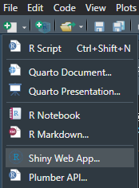](./image/newfile_shiny.png "図1：Shinyのファイルを作成する")

図1：Shinyのファイルを作成する

「Shiny Web App…」を選択すると、以下のようなウインドウが表示されます。このウインドウでは、Webアプリケーションの名前、ファイルを作成するディレクトリ（フォルダ）に加えて、Web Appを1つのファイルで作成するか（Single File）、複数のファイルで作成するか（Multiple File）を選択します。「Single File」を選択すると、**app.R**という1つのファイルが選択したディレクトリ内に作成されます。一方で「Multiple File」を選択すると、**ui.R**と**server.R**という2つのファイルが作成されます。

どちらの形式を用いてもアプリケーションを作成するための関数などは共通していますが、アプリケーション作成に慣れるまでは「Multiple File」を用いるのがおすすめです。この章では、まず「Multiple File」での作成方法を一通り説明した後で、「Single File」で作成する方法を説明します。

[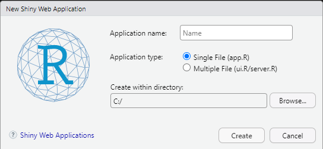](./image/newfile_shiny2.png "図2：Shinyのファイルを作成する")

図2：Shinyのファイルを作成する

上記のウインドウで「Create」をクリックすると、以下のようにディレクトリに`ui.R`と`server.R`という2つのファイルが作成されます。このファイルにはWebアプリケーションのスクリプト（サンプルアプリ）が書かれています。

作成された`ui.R`や`server.R`をRstudioで開くと、右上に「Run App」というアイコンが出てきます。これを押すとサンプルアプリを実行することができます。

[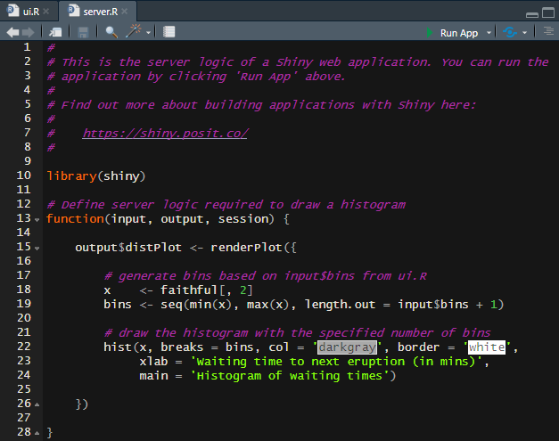](./image/shiny_template.png "図3：Shinyアプリの例とRun Appアイコン")

図3：Shinyアプリの例とRun Appアイコン

Webアプリケーション（Shinyアプリ）を実行すると、以下の図のようなページがWebブラウザに表示されます。このページのうち、左の部分（Number of bins:）はマウスで操作することができます。

[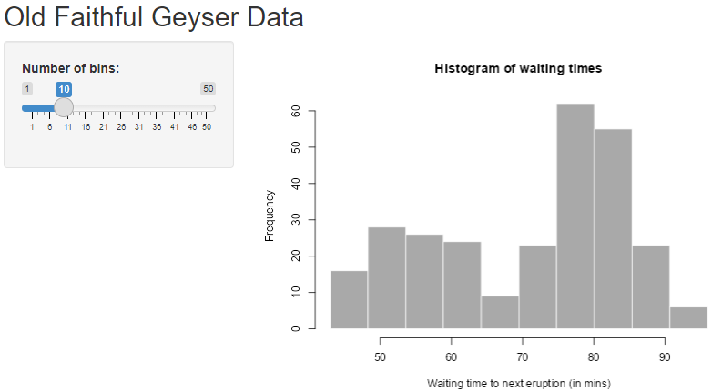](./image/shiny_gayser10.png "図4：Shinyサンプルを起動する")

図4：Shinyサンプルを起動する

実際にNumber of binsを変更し、50としたのが以下の図です。`bins`、つまりヒストグラムの棒の数の設定を変えると、右のヒストグラムの表示が変化します。

[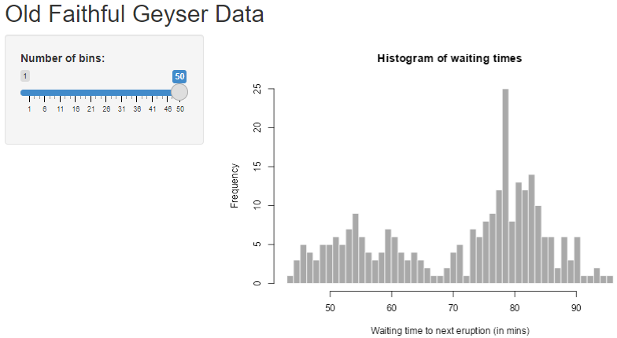](./image/shiny_gayser49.png "図5：Number of binsを変更する")

図5：Number of binsを変更する

このようなShinyアプリの動作は、以下の図のようなメカニズムで構成されています。まず、Shinyアプリのユーザーインターフェース（UI）で入力したデータは、Serverに送られます。Serverでは入力データを取り込んで`ggplot2`でグラフを作成し、グラフを含んだHTMLが作成されます。このHTMLがWebブラウザで表示されることで入力データに従ったグラフが表示されます。

[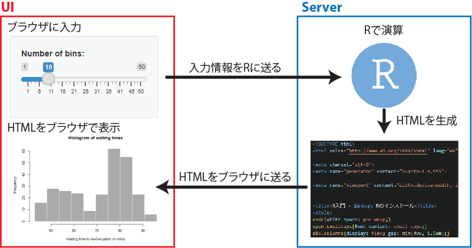](./image/web_app.png "図6：Shinyアプリのおおまかな仕組み")

図6：Shinyアプリのおおまかな仕組み

通常のWebアプリケーションフレームワークでは、Rの部分に別の言語（RubyやPythonなど）が入り、さらにデータベースと接続されているのが一般的です。Shinyではデータベースは必須ではありませんが、もちろんデータベースを用いたWebアプリケーションを作成することもできます。データベースを用いたアプリケーションを作成する場合には、データベースを取り使うためのパッケージ（[`DBI`](%22https://dbi.r-dbi.org/%22)([R Special Interest Group on Databases (R-SIG-DB) et al. 2024](#ref-DBI_bib))や[`dbplyr`](%22https://dbplyr.tidyverse.org/%22)([Wickham et al. 2024](#ref-dbplyr_bib))など）を用いることになります。

上記のUI、Serverをそれぞれ構築するためのファイルが、`ui.R`と`server.R`です。ココからはまず`ui.R`の構築について説明し、その後`server.R`について説明します。

## 47.4 ui.R（ユーザーインターフェース）

`ui.R`には以下の4点をそれぞれ準備します。

- Webページのレイアウト
- HTMLの要素（文章や画像）
- 入力
- 出力

上記の4つのうち、Webページのレイアウトについては上の図には表現されていない部分です。HTMLの要素は文章のヘッダーや本文、画像などの表示に関わる部分です。入力と出力に関しては、上記の図に示した通り、入力データをserver.Rに送る部分と、server.Rで演算された結果をWebページ上に表示させる部分になります。以下にそれぞれの要素について説明していきます。

### 47.4.1 Webページのレイアウト

まずは、Webページ全体のレイアウトをui.Rに指定する必要があります。レイアウトの指定には、以下の表に示す関数が用いられます。

| 関数 | 主な引数 | 意味 |
|:---|:---|:---|
| absolutePanel | fixed=FALSE | 絶対的な位置を指定したレイアウト（スクロールあり） |
| fixedPanel | fixed=FALSE | 絶対的な位置を指定したレイアウト（スクロールされない） |
| column | width | 列のレイアウト（widthは最大12で指定） |
| fillPage | padding | ウインドウのサイズに合わせてコンテンツを表示 |
| fixedPage | ― | 固定幅のページのレイアウト |
| fixedRow | ― | 固定幅の行のレイアウト |
| fluidPage | ― | 可変幅のページのレイアウト |
| fluidRow | ― | 可変幅の行のレイアウト |
| navbarPage | ― | ページ上にタブの表示を作成する |
| sidebarLayout | ― | 左右にサイドバー、メインパネルを配置 |
| sidebarPanel | width=4 | サイドバーのレイアウト |
| mainPanel | width=8 | メインパネルのレイアウト |
| tabsetPanel | ― | その列にタブの表示を作成する |
| tabPanel | title | タブの中身のレイアウト |

表：代表的なレイアウト指定用の関数の一覧 {.caption-top .table .table-sm .table-striped .small}

レイアウトを決める関数にはある程度上下関係があります。最も上位に配置するレイアウトは`navbarPage`関数で、全体のページに渡るタブを作成します。

[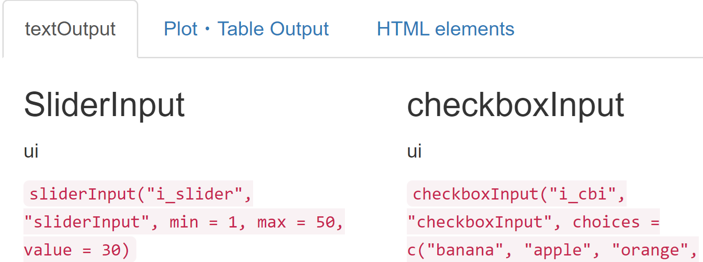](./image/navbarPage_example.png "図7：navbarPageによるタブ")

図7：navbarPageによるタブ

`navbarPage`関数では、「タブを配置すること」だけしか設定できないため、タブの中身を別途準備する必要があります。タブの中身は`tabPanel`関数を用いて記載していきます。`tabPanel`関数の第一引数にはタブの名前（`title`）を指定します。上記の図では、タブに記載された「textOutput」や「Plot・Table Output」というのが`title`に当たります。

`navbarPage`関数の下位には`fixedPage`関数・`fluidPage`関数を配置するのが一般的です。`navbarPage`関数はタブを用いない場合には使用しないため、タブなしのページの場合には`fixedPage`関数、`fluidPage`関数が最上位のレイアウトとなります。`fixedPage`関数、`fluidPage`関数の差はレイアウトの幅を固定するか（`fixedPage`関数）、ウインドウの幅に合わせて調整するか（`fluidPage`関数）の違いです。

`fixedPage`関数、`fluidPage`関数の下位には`sidebarLayout`関数や`column`関数を配置します。`sidebarLayout`関数の下位には`sidebarPanel`関数と`mainPanel`関数を配置し、それぞれ1/3の幅を持つサイドバーと2/3の幅を持つメインパネルの2つを設定します。以下の図の左側（binsの入力）がサイドバー、右側（グラフ）がメインパネルとなります。

[](./image/shiny_gayser10.png "図8：sidebarLayoutの例")

図8：sidebarLayoutの例

このサイドバーとメインパネルの幅は`width`引数で変更することができます。Shinyでは、R markdownと同様に[Bootstrap](https://getbootstrap.jp/)によるデザインが採用されています。Bootstrapでは、Webページの幅全体を12とすることとされていますので、この幅12に従い、サイドバーとメインパネルの`width`の和が12となるように調整します。デフォルトではサイドバーの`width`が4、メインパネルの`width`が8となっています。

`column`関数は上記の`sidebarPanel`関数や`mainPanel`関数とよく似たものですが、上位に`sidebarLayout`関数を必要としないものです。`column`関数も`width`引数で幅指定しますが、やはりすべての`column`の`width`の和が12となるように設定します。

`column`関数や`mainPanel`関数にタブを設定するためのレイアウトが`tabsetPanel`関数です。ちょうど`navbarPanel`-`tabPanel`の関係と同様に、`tabsetPanel`関数の下には`tabPanel`関数を配置します。

以上のように、Shinyのレイアウトに関する関数はたくさんあり、上下関係が複雑です。上記で紹介していない関数もありますので、実際にはさらに複雑なレイアウトを取ることもできます。

レイアウトの上下関係は、関数をネストすることで指定することができます。例えば、以下の例では`fluidPage`の下に`sidebarLayout`、`sidebarLayout`の下に`sidebarPanel`と`mainPanel`を配置し、`mainPanel`の下に`tabsetPanel`、`tabsetPanel`の下に`tabPanel`を2枚配置しています。

``` downlit
fluidPage(
  sidebarLayout(
    sidebarPanel(
      # サイドバーの中身を記載
    ),
    mainPanel(
      # メインパネルの中身を記載
      tabsetPanel(
        tabPanel(
          title = "パネル1"
          # タブパネル1の中身を記載
          ),
        tabPanel(
          title = "パネル2"
          # タブパネル2の中身を記載
          )
      )
    )
  )
)
```

Rは関数型言語ですので、すべてのレイアウトは関数、つまりカッコつきのスクリプトになります。また、`sidebarPanel`や1枚目の`tabPanel`のカッコの後にコンマがついています。1つのカッコの中に複数の要素がある場合にはコンマが必要です。ただし、カッコ内の最後の要素（上の例では`tabPanel(title = "パネル2")`）にはコンマは必要ありません。

Shinyのui.Rの記載では、レイアウトに関する関数が多層にネストされ、意味がわかりにくくなりやすいため、「Run App」でアプリを表示し、確認しながら作成するのがよいでしょう。

### 47.4.2 HTMLの要素

HTMLではヘッダーや改行、パラグラフは以下のように表現されます。

``` html
<h1> ヘッダー </h1>
<br> # 改行
<p> パラグラフ（文）</p>
```

Shinyも基本的にはHTMLをRから出力する仕組みとなっているため、Webアプリに文章を追加したい場合などにはHTMLを記述する必要があります。ShinyにはHTMLを直接挿入できる`HTML`関数が備わっているため、HTMLをそのまま入力することができます。

``` downlit
HTML("<p>HTML直打ち</p>")
```

しかし、`HTML`関数を用いるとHTMLのタグ（`<p>`など）を入力しないといけないため、やや煩雑です。Shinyには、HTMLを追加するための専用の関数（[`shiny::tags`](https://rstudio.github.io/htmltools/reference/builder.html)に登録されている関数）が備わっています。こちらを用いることで、簡単にヘッダーや文章を追加することができます。

``` downlit
h1("ヘッダー1")
p("パラグラフ")
br() # 改行
hr() # 水平線
```

HTMLを追加する関数の一覧は`names(shiny::tags)`で確認できます。

``` downlit
shiny::tags |> names() |> head(10) # 10個だけ表示
```

     [1] "a"                "abbr"             "address"          "animate"         
     [5] "animateMotion"    "animateTransform" "area"             "article"         
     [9] "aside"            "audio"           

### 47.4.3 入力（input）

静的なHTMLとは異なり、Webアプリケーションではブラウザ上で入力した値に対して演算が行われ、表示が値によって変化するところに特徴があります。Shinyでは、このような入力（input）に対応した各種の部品（control widgets）が備わっています。control widgetsの一覧は[Shinyのギャラリー](https://shiny.posit.co/r/gallery/widgets/widget-gallery/)に示されています。

各control widgetsは以下のような`Input`関数群を用いることで設定することができます。

``` downlit
numericInput(
  inputId = "numeric_input", 
  label = "数値の入力", 
  value = 10, 
  min = 0, 
  max = 20, 
  step = 2
)
```

すべての`Input`関数は、`inputId`を第一引数に取ります。この`inputId`には文字列で指定し、server側で入力データを受け取るときに用います。`inputId`の使い方についてはserverの解説時に詳しく説明します。第二引数に`label`を文字列として取ります。`label`はcontrol widgetsの題名としてwidgetに表示されます。3つ目以降の引数はそれぞれの`Input`関数で異なっており、`numericInput`では初期値（`value`）、最小値（`min`）、最大値（`max`）、増加の幅（`step`）を引数で設定することができます。

以下に`Input`関数の一覧を示します。

| 関数 | 主な引数 | 意味 | 返り値 |
|:---|:---|:---|:---|
| actionButton | icon | ボタンを追加 | 数値 |
| checkboxInput | choices, selected | チェックボックスを追加 | 論理型 |
| checkboxGroupInput | choices, selected | チェックボックス群を追加 | 文字列 |
| radioButtons | choices, selected | ラジオボタンを追加 | 文字列 |
| selectInput | choices, selected | 選択リストを追加する | 文字列 |
| dateInput | value, min, max | 日付の入力を追加 | 日付 |
| dateRangeInput | start, end, format | 期間を指定する入力を追加 | 日付 |
| numericInput | value, min, max | 数値を入力するボックスを追加 | 数値 |
| sliderInput | value, min, max | 数値を選択するスライダーを追加 | 数値 |
| textInput | value | 文字列を入力するボックスを追加 | 文字列 |
| passwordInput | value | パスワードを入力するボックスを追加 | 文字列 |

表：代表的なInput関数の一覧 {.caption-top .table .table-sm .table-striped .small}

`Input`関数で設定したcontrol widgetsに従い、データがserver.Rに送られます。ui.Rには出力（output）も必要となりますが、outputに関してはサーバサイドの説明の後の方が分かりやすいと思いますので、まずはサーバサイドについて説明し、後ほどoutputについて説明します。

## 47.5 server.R（サーバサイド）

次に、server.Rを作成していきます。server.Rは`function(input, output, session){}`という関数から始まります。この関数・引数はこのまま変更せずに使用し、`function`の[`{}`](https://rdrr.io/r/base/Paren.html)の中に実行したいコードを記載していきます。

### 47.5.1 outputIDの準備

inputで入力されたデータをserver.Rで受け取ったら、server.Rに従い演算を行います。演算結果をoutputとしてHTMLに出力することで、ui.R側でinputに対応したoutputを表示します。server.Rにはこのoutputを準備するためのスクリプトを書くことになります。

outputを準備するときには、`output$outputId`というオブジェクトに`render`関数を代入します。以下に例を示します。

``` downlit
output$outputId <- renderText("Hello world!")
```

この`outputId`はui側で読みだして利用します。上記のスクリプトの場合では、`outputId`には`"Hello world!"`が入っていますので、ui側で`outputId`を用いて文字列として`"Hello world!"`を出力することができます。

とは言ってもこれでは単に文字列をui側で表示するだけになり、serverを介している意味がありません。Shinyが動的に動くようにするには、`inputId`を用いて演算を行う必要があります。

### 47.5.2 inputIdを利用してoutputIdを準備する

server側で`inputId`の情報を用いる場合には、`input$inputId`と、リストに似た形の変数を指定します。

``` downlit
output$outputId <- renderText(paste("Hello world", input$inputId, "!"))
```

上記のような形で`outputId`を準備すると、`renderText`内のスクリプトが実行されることで、`input$inputId`の値（文字列や日付、数値等）に従って`output$outputId`が作成されます。この準備した`outputId`をui側で利用してやれば、inputの内容に従ったoutputを表示することができます。

ui側では`Input`関数を用いて`inputId`を、server側では`render`関数を用いて`outputId`を準備します。`inputId`や`outputId`が重複していると、どれが正しい`Id`なのかわからなくなるため、`inputId`や`outputId`が重複することは許されていません。単一の名前を`inputId`、`outputId`に指定する必要があります。また、`input$inputId`をui.R内、`output$outputId`をserver.R内で用いることはできません。

### 47.5.3 Render関数群

上記の通り、`output$outputId`を準備する際には、`render`関数群を用います。この`render`関数には、outputの種類（テキスト・グラフ・表など）によってそれぞれ専用の関数が準備されています。代表的な`render`関数の一覧を以下に示します。

| 関数            | 意味                              |
|:----------------|:----------------------------------|
| renderPlot      | グラフ（プロット）を準備する      |
| renderText      | テキスト（文字列）を準備する      |
| renderImage     | 画像を準備する                    |
| renderTable     | テーブル（表）を準備する          |
| renderPrint     | 文字列（consoleの出力）を準備する |
| renderUI        | UI（control widget）を準備する    |
| downloadHandler | ダウンロードファイルを準備する    |

表：代表的なrender関数の一覧 {.caption-top .table .table-sm .table-striped .small}

outputとして表示したいものがテキストなら`renderText`、グラフなら`renderPlot`、表なら`renderTable`関数を選択します。

server側では通常inputに従いデータを加工して、文字列やグラフ、表を準備します。ただし、このような演算は必ずしも1行のスクリプトで書けるとは限りません。`render`関数では複数の行に渡るスクリプトを書くことができるようにするため、関数のカッコの内側に中カッコ（[`{}`](https://rdrr.io/r/base/Paren.html)）を設定できるようになっています。この中カッコの中には複数行のスクリプトを書くことができます。

``` r
# 1行スクリプトの場合には中カッコが無くても問題ない
output$output_text1 <- renderText("Hello world!")

# 2行以上の時に中カッコなしだとエラー
output$output_text_error <- 
  renderText(
    temp <- paste("Hello world,", input$input_name, "!")
    temp
  )

# 2行以上の時には中カッコを加える
output$output_text2 <- 
  renderText({
    temp <- paste("Hello world,", input$input_name, "!")
    temp
  })
```

server.Rには、複数の`output$outputId`を置くことができます。通常のRスクリプトとは異なり、server.Rの演算は上から下に順番に行われるわけではなく、inputの変更に従って必要な部分が実行される形となっています。また、server.Rでは、演算の部分とテキスト・グラフ・表を準備する部分を分離して記載する方法もあります。この分けて計算する部分（`reactive`や`observe`などの関数を用いた演算）に関してはやや複雑ですので、後ほど説明します。

## 47.6 ui.R

### 47.6.1 出力（output）

上記のように、server.Rで`output$outputId`を準備します。この`outputId`を準備しただけではUIに表示されないため、ui.R側に出力を準備する必要があります。この出力の準備には、`Output`関数群を用いることになります。`Output`関数群の一覧を下の表に示します。

| 関数 | 対応するrender関数 | 意味 |
|:---|:---|:---|
| textOutput | renderText | 文字列を出力する |
| verbatimTextOutput | renderText・renderPrint | コード（文字列）を出力する |
| plotOutput | renderPlot | 文字列（consoleの出力）を出力する |
| tableOutput | renderTable | 表を出力する |
| uiOutput | renderUI | control widgetsを出力する |
| downloadButton | downloadHandler | ダウンロード出力用のボタンを準備する |

表：代表的なOutput関数の一覧 {.caption-top .table .table-sm .table-striped .small}

`Output`関数はui.Rのレイアウト関連の関数内に記載し、Webページ上に配置していくことになります。`Output`関数の使い方は単純で、引数に`outputId`を文字列として取るだけです。

``` downlit
textOutput("outputID")
```

`Input`関数→`render`関数→`Output`関数の流れができれば、入力に従う出力を返す、Shinyアプリが出来上がります。inputで`inputId`を設定し、serverでは`input$InputId`を変数として用いて`output$outputId`を作成します。`outputId`は`Output`関数の引数とすることでUIに配置します。一連の流れは以下の図のような形となります。

[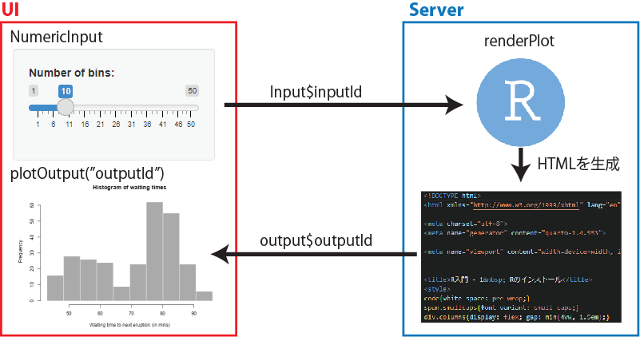](./image/input_render_output_in_Shiny.png "図9：Input→render→Outputの流れ")

図9：Input→render→Outputの流れ

## 47.7 global.Rとwwwフォルダ

Shinyでは、ui.Rやserver.R内で変数や関数を設定したり、パッケージを読み込んだりすることができます。ただし、Shinyのファイルが2つに分かれていることもあり、ui.Rやserver.R中にアプリの準備に関わるコードを書き込んでしまうと理解しにくくなります。

このような変数・関数の設定やパッケージの読み込みを分離して記載するために用いられるのが**global.R**というファイルです。これは通常のRファイルであり、ui.Rやserver.Rを作成する時のようにRStudioの操作で作成するものではありません。作成中のアプリのフォルダ、ui.Rやserver.Rが保管されている場所にglobal.Rを作成し、変数・関数の設定、パッケージの読み込み等を書き込みます。このglobal.RはShinyアプリを起動する際に実行されるため、ui.Rやserver.Rに余分なスクリプトを書き込む必要がなくなります。

また、Shinyで表示するための画像や動画、javascriptのコードなどは、ui.Rやserver.Rと同じフォルダ内にwwwという名前のフォルダを作成し、wwwフォルダ内に保存することで、Shinyで呼び出すことができます。必要に応じてglobal.Rやwwwフォルダを作成することで、コードを整理し、画像等をShinyで取り扱うことができるようになります。

## 47.8 observerとreactive

### 47.8.1 observer

Shinyでは上記の通り、inputが変更されるとserver.Rに書いたスクリプトが自動的に実行されます。Shinyでは、inputに対する変更を読み取り、自動的にそのinputが関与しているserver.R内のコードを実行するようになっています。このような仕組みは**observer**と呼ばれるものによって行われています。observerはその名の通り、inputの変更を「観察」していて、変更に応じて必要なコードをすぐに実行するShinyの内部的な機能です。

このobserverの代表的なものが、`output$outputId<-renderXX()`という表現と、`observe`関数です。`output$outputId<-renderXX()`は上に示した通り、`output$outputId`に`render`関数を代入する表現です。この表現が書かれている部分は`render`関数内の`inputId`の変更を捉えて、変更があればすぐに`render`関数内のコードが実行されます。`observe`関数はそれ自体は何もしませんが、`observe`関数内に存在する`inputId`が変更されると`inputId`に関わるコードを即実行するという機能を持ちます。

`render`関数、`observe`関数のどちらのobserverもShinyを使っているときにも作成するときにも特に意識する必要はありません。ただし、重めの計算を含むShinyではこのobserverだけを用いていると、Shinyのレスポンスが悪くなってしまいます。

簡単な例として、以下のui.R、server.RからなるShinyアプリを実行するとします。

``` r
# 実際にはuiにlayoutが必要
sliderInput("n1","N of rpois 1:",min = 1000000,max = 5000000,value = 2000000),
sliderInput("n2","N of rpois 2:",min = 1000000,max = 5000000,value = 2000000),
verbatimTextOutput("output_rpois")
```

``` downlit
#実際にはserverに`function`が必要
r1 <- input$n1 |> rpois(5)
r2 <- input$n2 |> rpois(5)

output$output_rpois({
  paste(mean(r1), mean(r2))
})
```

上記は、平均値5のポアソン分布に従う乱数を100万～500万個、2セット作成し、その平均値を文字列として返すだけのShinyアプリです。返ってくる値はほぼ5になるので何の意味もないアプリですが、このShinyを走らせた場合、1つ目の`sliderInput`（`input$n1`）を変更すると、1つ目の`sliderInput`の返り値（`mean(r1)`）だけでなく、2つ目の`sliderInput`の返り値（`mean(r2)`）も計算され、値が変化します。

だから何なのか、という感じですが、`input$n1`のみ変更しているのに、`input$n1`が含まれる`r1`の演算だけでなく、`input$n2`のみが含まれる`r2`の演算も勝手に行われている、ということになります。これがobserverが行っている演算の仕組みで、必要となるコードを自動的に検出し、すべての演算を実行します。図で示すと、以下のような流れで演算が行われていることになります。

[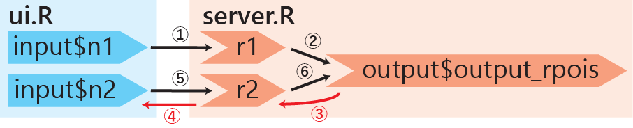](./image/shiny_observer.png)

1.  `input$n1`が変更されると、`input$n1`に依存しているserver.R側の`r1`が演算されます。
2.  次に、`r1`に依存している`output$output_rpois`が演算されるわけですが、この`output$output_rpois`の演算には`r2`が必要です。
3.  そこで、Shinyは`r2`を読みに行きますが、`r2`は`input$n2`に依存しています。
4.  ですので、次にshinyは`input$n2`を読みに行きます。
5.  `input$n2`は変更されていませんが、値はありますので、`r2`を演算します。
6.  `r1`、`r2`がそろったので、`output$output_rpois`を演算します。

`input$n2`には変更がなく、`r2`を演算する必要はなさそうに見えますが、observerは必要なコードをすべて、即時に演算するため、`input$n2`から`r2`を演算することになります。

このような演算は`r2`に当たる部分の演算が軽いうちは大きな問題にはなりませんが、`r2`の演算がとても重いとき、例えばデータベースに問い合わせて大きなデータを読み出し、時系列分析した結果が代入されている、といった場合には演算に非常に時間がかかるようになり、Shinyアプリのレスポンスが悪くなります。ですので、重めの演算はできれば演算回数を減らしたいところです。

### 47.8.2 reactive

上記のように、observerでは必要のない演算を繰り返し行うことになります。このように演算を繰り返したくない場合に用いるのが、`reactive`関数です。`reactive`関数は、

- `reactive`関数内の`input$inputId`に変更があった場合には演算を行う
- `reactive`関数内の`input$inputId`に変更がない場合は、以前に演算した値（[cache](https://ja.wikipedia.org/wiki/%E3%82%AD%E3%83%A3%E3%83%83%E3%82%B7%E3%83%A5_(%E3%82%B3%E3%83%B3%E3%83%94%E3%83%A5%E3%83%BC%E3%82%BF%E3%82%B7%E3%82%B9%E3%83%86%E3%83%A0))）を返す

という特徴を持った関数です。この`reactive`関数を用いて以下のようにserver.Rを書き直します。

``` downlit
r1 <- reactive(input$n1 |> rpois(5))
r2 <- reactive(input$n2 |> rpois(5))

output$output_rpois({
  paste(mean(r1()), mean(r2()))
})
```

上のコードでは、`reactive`関数の引数として`input$n1 |> rpois(5)`を取り、`r1`に代入しています。この`r1`は関数オブジェクトになっており、値を呼び出す場合にはカッコを付ける（`r1()`）必要があります。同様に`r2`を`reactive`関数を用いて準備しています。

このようなserver.Rを用いた場合、Shinyの初回起動時にはすべての変数（`r1`、`r2`、`output$output_rpois`）が演算されます。これは`reactive`を用いない場合と同じです。

Shinyアプリの起動後に、`input$n1`を変更した場合には、上記の`reactive`を用いない場合とは演算の経路が異なってきます。`reactive`を用いた場合の演算の経路を以下の図に示します。

[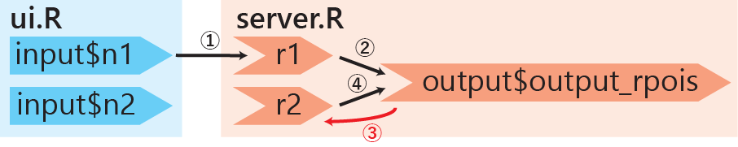](./image/shiny_reactive.png)

1、2に関してはobserverの時と同じです。`output$output_rpois`を準備する際に`r2`を読みに行きますが、この際に`r2`が`reactive`で包まれていると、前回演算した時の`r2`（cache）の値を`output$output_rpois`の準備に用いることができ、`r2`を`input$n2`から再演算しなくなります。

上記のような`r1`、`r2`の演算コストの低いShinyアプリでは`reactive`を設定する必要は必ずしもありませんが、`reactive`関数をうまく用いることでよりレスポンスのよいアプリを作成することができるでしょう。

### 47.8.3 observeEventとeventReactive

#### 47.8.3.1 observeEvent

`reactive`は比較的使い方を理解しやすいのですが、`observe`は何も返さず、使い方のわからない関数です。これは、`observe`が他の関数を準備するために作成されたprimitiveな（大元の）関数であるためです。`observe`をより分かりやすく、実用的に利用するための関数が`observeEvent`関数です。`observeEvent`関数は第一引数に`input$inputId`、第二引数にスクリプトを取ります。`observeEvent`は主に`actionButton`と共に用い、`actionButton`を押した時に後ろに記載したコードが実行されるような場合に用います。`observeEvent`自体は返り値を返さないので、この関数自体を`output$outputId`に代入することはできません。

``` downlit
observeEvent(input$inputButton1, {message("button pressed.")})
```

#### 47.8.3.2 eventReactive

一方で、ボタンを押すなどのイベントによってreactiveに応答を求める時には`eventReactive`を用います。`eventReactive`の返り値は関数オブジェクトで、`reactive`と同じようにカッコをつけることでserver.R内で呼び出すことができます。

``` downlit
buttonpressed <- eventReactive(input$inputButton1, {print("button pressed.")})
```

### 47.8.4 reactiveValとreactiveValue

`reavtive`の名前がついている関数は他にもあります（`reactiveVal`、`reactiveValue`、`reactiveTimer`）。名前が紛らわしい上にレスポンスが分かりにくい関数群ですが、それぞれに特徴があります。

まず、`reactiveVal`と`reactiveValues`です。この2つは値を記録しておくために用いる関数ですが、`reactive`の特徴（cacheなど）と、**参照渡し**の特徴を持ちます。

``` downlit
x <- y <- reactiveVal(5) # xとyにreactiveVal(5)を代入
x # xは5（Quartoでは演算されない）
y # yも5（Quartoでは演算されない）

x(10) # xの値を10に更新
x # xは10（Quartoでは演算されない）
y # yも10になる（Quartoでは演算されない）

z <- reactiveValues(a = 10, b = 15) # reactiveValuesには複数の値を設定できる
z$a # render関数などの中で呼び出さないとエラー
```

値渡し（Rの変数はほぼすべてこちら）とは異なり、上記の例であれば`x`が変更されると`y`も変更される、参照渡しが行われます。

`reactiveVal`は1つの値のみ、`reactiveValues`はリストのように複数の値を保存することができます。`reactiveVal`は通常のRのコンソールでも呼び出すことができますが、`reactiveValues`は`reactive`/observerの中でしか呼び出せません。`reactiveValues`ではリストのように、`$`を用いて値を呼び出します。

`reactiveVal`も`reactiveValues`もいまいち使い方が難しい関数ですが、数値を一時的に保存する場合には単なる`reactive`や通常の変数ではなく、こちらを使うことが想定されているのかもしれません。

### 47.8.5 reactiveTimerとinvalidatedLater

Shinyアプリの作成時には、単にinputに対して応答を求めるようなものだけではなく、一定時間ごとに演算や表示を行ってほしい場合もあります。このように、一定時間ごとに演算を行うような場合には、`reactiveTimer`関数を用います。`reactiveTimer`関数は引数に時間（`intervalMs`、ミリ秒単位）を取ります。`reactiveTimer`関数を用いることで、引数で指定した時間ごとに演算が行われるような仕組みをShinyに持ち込むことができます。

``` downlit
a <- reactiveTimer(2000)

output$outputId <- renderText({
  a() # reactiveTimerをrender関数内で呼び出す

  # 2秒ごとに表示される
  paste0("Hello world, ", input$inputId, "! ", Sys.time()) 
})
```

上記の例では、`input$inputId`の変更が`output$outputId`の更新を引き起こさず、2秒（2000ミリ秒）おきに`output$outputId`が更新されるようになります。この`reactiveTimer`と類似した関数として、`invalidateLater`関数があります。`invalidateLater`関数は`reactiveTimer`と同じく初期のShinyから実装されている関数で、より安全でシンプルな関数であるとされています。`invalidateLater`関数は直接`render`関数内に書いて用います。ですので、上のコードと同じ演算を以下のような形で実装することができます。

``` downlit
output$outputId <- renderText({
  invalidatedLater(2000)
  paste0("Hello world, ", input$inputId, "! ", Sys.time())
})
```

## 47.9 app.R

ココまではShinyアプリをui.R、server.Rの2つのファイルで開発する方法について説明してきました。複雑なShinyアプリを作成したい場合には、この2つのファイルを用いる方法が有効です。一方で、小規模のアプリを作る場合には2つのファイルを行き来するのが煩雑となる場合もあります。小規模アプリの開発では、app.Rという1つのファイルでShinyアプリを作成することもできます。

app.Rを準備する場合には、上記の図2に示したファイル作成のウインドウで、「Single file (app.R)」を選択します。

[](./image/newfile_shiny2.png "図10：Shinyのファイルを作成する")

図10：Shinyのファイルを作成する

app.Rを作成すると、以下のように1ファイル内に`ui`と`server`が記載されたファイルが表示されます。`ui`には`fluidPage`や`fixedPage`、`TabsetPanel`から始まるレイアウトを代入し、この中身にuiのレイアウト、`input`、`Output`等を記載していきます。

`server`には、server.Rと同様に`function(input, output)`を代入し、`function`の[`{}`](https://rdrr.io/r/base/Paren.html)の中に実行したいコードを記載していきます。

最後の`shinyApp(ui=ui, server=server)`はShinyアプリを実行するための関数です。ですので、app.Rでもui.R/server.Rでも、uiとserverの中身を作成していくことには違いはありません。

``` downlit
ui <- fluidPage(
  # ....コードを記載....
)

server <- function(input, output){
  # .....コードを記載....
}

shinyApp(ui = ui, server = server)
```

## 47.10 Shinyに機能を追加する（Extensions）

Shinyには、上記の`layout`、`Input`、`Output`、`render`などの基本的な関数だけでなく、追加の機能を与えるためのパッケージ（Extensions）が豊富に存在します。以下に代表的なExtensionsの例を示します。

- [shinythemes](https://rstudio.github.io/shinythemes/)([Chang 2021](#ref-shinythemes_bib))：ShinyのデザインをBootstrapに従って変更するためのパッケージです。

- [shinydashboard](https://rstudio.github.io/shinydashboard/)([Chang and Borges Ribeiro 2021](#ref-shinydashboard_bib))：Shinyで[ダッシュボード](https://www.google.com/search?sca_esv=a526368c5945871d&sxsrf=ADLYWIK4gJvNmzBBQh-pQzFeWnI_SKxx2A:1724140556539&q=%E3%83%87%E3%82%B8%E3%82%BF%E3%83%AB%E3%83%80%E3%83%83%E3%82%B7%E3%83%A5%E3%83%9C%E3%83%BC%E3%83%89&udm=2&fbs=AEQNm0BqbPbAzSj6PhNr7nv9Ltx-oFh8tVsgXi1MyFbswNtTUOS5b68chsyOj2QEdx4EPnNHj-rfVa2Eb1VCscGX2ZUj9zg7pD9WhuxXJAj12GW6oeBqw4eGvVgzQxyKznl1ExGJi168qSx2eeXjUNvCmZhFwSaQtcsiZCK7bt8rXXw1KNDgJdghBt7mcicHH5U9gHGYPNgxAD0CsYaK3uh78b4Yn_p-W815iG5byNmUmiBRo1Utr2Q&sa=X&ved=2ahUKEwjP16iLjIOIAxXSslYBHSrNMxYQtKgLegQIGRAB&biw=1912&bih=970&dpr=1)を簡単に作成するためのパッケージです。基本的にはShinyにダッシュボード用のレイアウト関数を追加するパッケージとなっています。

- [bslib](https://rstudio.github.io/bslib/)([Sievert et al. 2024](#ref-bslib_bib))：`shinythemes`と同様にShinyのデザインを変更するためのパッケージです。こちらは[前章](chapter38.llms.md)で紹介したR markdown・QuartoのHTML出力のデザインを変更することもできます。また、レイアウトの関数をいくつか備えており、これらのレイアウト関数を用いることでダッシュボードを作成することもできます。`shinythemes`と`shinydashboard`はかなり前に開発されたパッケージであるため、この`bslib`に統合されたような形となっているようです。デザイン性の高いShinyアプリを作成するのであれば、まずこのパッケージを用いることを検討するのがよいでしょう。

- [DT](https://rstudio.github.io/DT/)([Xie et al. 2024](#ref-DT_bib))：ShinyやR markdownにJavascript製の表を表示するためのパッケージです。Javascriptで開発され、用いられている[DataTables](https://datatables.net/)というライブラリをRに持ち込んだものです。Shinyで用いるための専用の`Output`、`render`関数を備えています。

- [shinycssloaders](https://daattali.com/shiny/shinycssloaders-demo/)([Sali and Attali 2020](#ref-shinycssloaders_bib))：Shinyにデータを演算中（ローディング中）であることを示すアニメーションを追加するためのパッケージです。計算が重めのShinyを作成する際に用いるとよいでしょう。

- [shinymanager](https://datastorm-open.github.io/shinymanager/)([Thieurmel and Perrier 2022](#ref-shinymanager_bib))：ShinyにIDとパスワードによるログイン機構を追加するためのパッケージです。セキュリティ的には怪しいので、あまり信用はできませんが、社内のシステムで用いるぐらいなら耐えられるかもしれません。

Shinyにはこの他にもたくさんのExtensionsが存在します。この[Githubのページ](https://github.com/nanxstats/awesome-shiny-extensions)に一覧が示されていますので、参考にされるとよいでしょう。

また、Shinyの開発を行っている企業である[appsilon](https://www.appsilon.com/)は、Shiny開発のフレームワークやデザインに関するパッケージを多数開発しています。ハイエンドなShinyアプリを開発したいのであればチャレンジする価値があるかと思います。

## 47.11 アプリをデプロイする

Shinyアプリを作成したら、他の人に使ってもらってデータを共有・説明したいはずです。Shinyアプリを自分のPCで動かすだけであれば、Rから実行するのが最も簡単ですが、Webを通じてShinyアプリを公表したい場合には、アプリを**デプロイ**する必要があります。

デプロイとは、インターネットでアクセスできるコンピュータ（Webサーバー）にWebアプリを実行する環境を整えることを指します。我々が使っている多くのWebサービス（Webアプリ）は、[Amazon Web Services（AWS）](https://aws.amazon.com/jp/)や[Google Cloud](https://cloud.google.com/)などのWebサーバーで実行されています。Shinyアプリも同様にWebサーバーにデプロイすることで、Webブラウザからアクセスし、利用することができます。

Shinyの開発元であるPositはShinyアプリを簡単にデプロイするサービスである、[shinyapps.io](https://www.shinyapps.io/)や[Posit Connect](https://posit.co/products/enterprise/connect/)を展開しています。また、同じくPositが開発した[Shiny server](https://posit.co/products/open-source/shinyserver/)を用いることで、AWSやGoogle Cloudに比較的簡単にデプロイすることができます。

Posit Connectはエンタープライズ版で、セキュリティ面などがしっかりしています。一方で価格が相当高いので（今は公開されていませんが、昔は\$5000/monthぐらいからだったと思います）、個人で安価にデプロイしたいのであればShinyapps.ioかShiny serverの2択となります。

### 47.11.1 shinyapps.io

最も簡単に、無料、もしくは安価にShinyアプリを公開したいのであれば、**Shinyapps.io**を用いるのがよいでしょう。Shinyapps.ioを用いるためには、まずShinyapps.ioのホームページ上でアカウントを作成する必要があります。[shinyapps.io](https://www.shinyapps.io/)に移動し、「sign up」からアカウントを作成しましょう。shinyapps.ioのアカウントを作らずに、Googleやfacebookのアカウントを用いてログインすることもできます。

[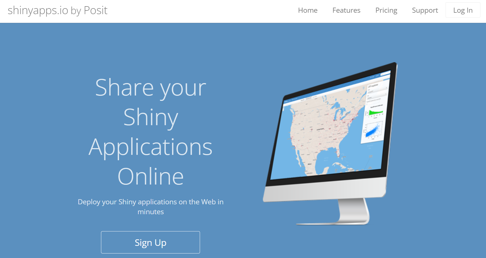](./image/shinyappsio.png)

アカウントが作成できたら、Rstudio上で、エディタの右上にある「Publish」のボタンをクリックします。

[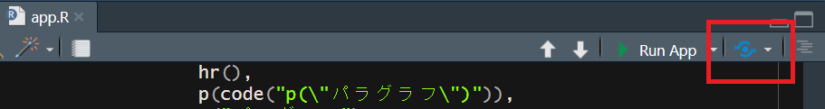](./image/publish_button.png "図：Publishボタン")

図：Publishボタン

publishボタンを押すと、初回には2つのパッケージ（`packrat`([Atkins et al. 2023](#ref-packrat_bib))と`rsconnect`([Atkins et al. 2024](#ref-rsconnect_bib))）のインストールが求められますので、RStudioの指示に従いパッケージをインストールします。

次に、接続するアカウントの種類を選択するウインドウが表示されますので、「shinyapps.io」を選択します。

[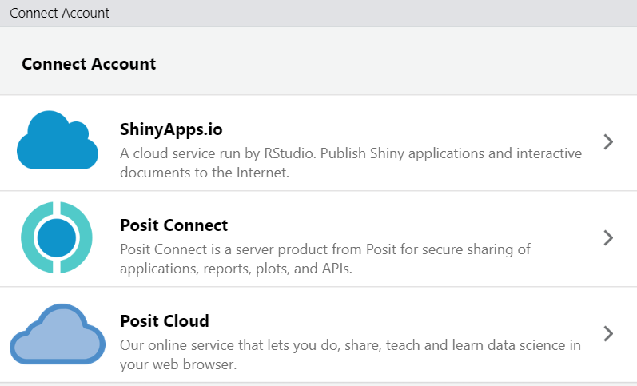](./image/select_connectAccount.png "図：サービスの選択画面")

図：サービスの選択画面

shinyapps.ioを選択すると、Tokenを入力するよう指示が出ますので、[shinyapps.io](https://www.shinyapps.io/)にログインし、アカウント名が表示されている部分からTokenを表示、コピーして貼り付けます。

[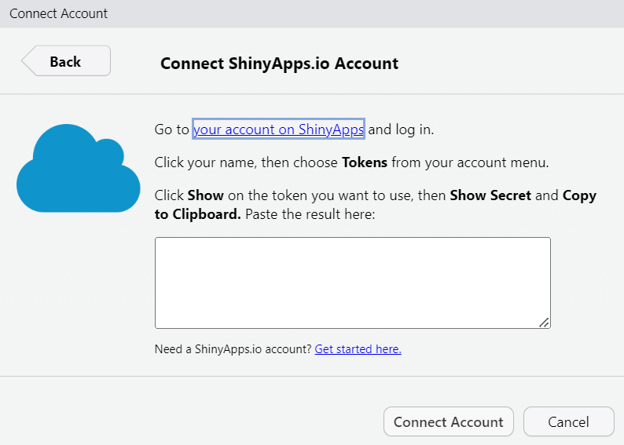](./image/connect_shinyapps_account.png "図：Tokenを貼り付ける")

図：Tokenを貼り付ける

Tokenを貼り付け、Connect Accountを選択すると、shinyapps.ioのアカウントとRStudioが繋がり、簡単にShinyアプリをデプロイできるようになります。

この状態で再び「Publish」をクリックすると、下のようなダイアログが表示されます。Publishポタンを押せばデプロイは完了です。

[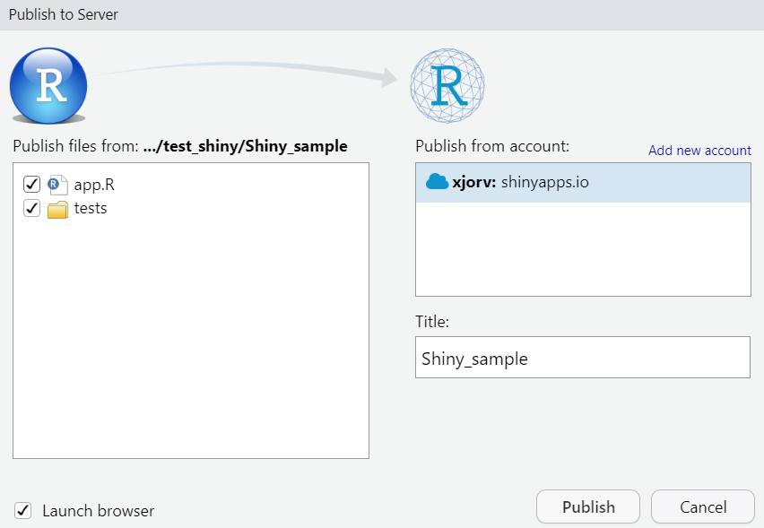](./image/publish_shinyapp.png "図：PublishでShinyapps.ioにデプロイする")

図：PublishでShinyapps.ioにデプロイする

Publishした後にWebブラウザからshinyapps.ioにログインすると、以下のようなページが表示されます。Publishしたアプリのリストが表示されていますので、以下の図の赤枠の部分をクリックするとアプリを起動することができます。

[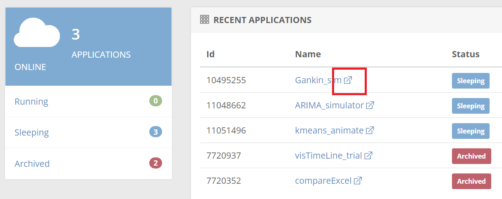](./image/shinyappsio_applist.png "図：アプリケーションの起動")

図：アプリケーションの起動

この方法で実行したShinyアプリはローカル（自分のPC）で演算するのではなく、Positが管理しているWebサーバでアプリを実行するようになっています。URLをコピーし、共有したい人にアクセスしてもらうことでShinyアプリをWeb上で実行してもらうことができます。

### 47.11.2 shiny server

上記のshinyapps.ioを用いる方法は非常に簡単で、お金もかかりませんが、一方で演算速度は遅く、たくさんの人が同時に接続することもできません。また、月あたりの使用時間が制限されています。shinyapps.ioは基本的にすべての人にShinyアプリを公開する形でデプロイするため、秘密情報を含むShinyアプリに利用するのにも向いていません。

このようなサーバーの速度・接続時間・秘密情報の問題を解決するには、自前でWebサーバーを立ち上げ、管理する必要があります。自前でサーバーを立ち上げるには、個人や会社のサーバーを利用する方法とWebサーバー（Amazon Web ServicesやGoogle Cloud）を用いる方法がありますが、いずれの方法においてもShinyアプリのデプロイには[Shiny server](https://posit.co/products/open-source/shiny-server/)を用いるのが一般的です。Shiny serverを用いたShinyアプリのデプロイには[コンテナ](https://ja.wikipedia.org/wiki/Docker)を用いることが多いかと思います。Shiny server、コンテナやコンテナを用いたデプロイの方法はこの入門書の範囲を超えてしまいますので、[こちらの記事](https://qiita.com/amori/items/425e44d6a7c1e0fbec84)や[この記事](https://qiita.com/xjorv/items/947ca01b45d6207bc4e3)などを参照下さい。

### 47.11.3 GitHubで共有する

上記の方法では、Webサーバーを用いてRでの演算をしており、自分のPC（ローカル）では演算を行いません。Webサーバーを用いる方法では、サーバーを借りる必要があり、お金がかかります。サーバーを借りず、アプリを使用する方のPCで直接Shinyアプリを実行する方法であれば、このようなサーバーを準備する必要はありません。

Shinyのコードだけを準備して、アプリを使用する方のPCでShinyアプリを実行する場合には、[GitHub](https://github.com/)を用いるのが簡単です。GitHubは[Git](https://git-scm.com/)と呼ばれるバージョン管理システムのうち、[リモートレポシトリ](https://ja.wikipedia.org/wiki/%E3%83%AA%E3%83%9D%E3%82%B8%E3%83%88%E3%83%AA)と呼ばれるものを取り扱うWebサービスです。GitHubには公開・非公開のリモートレポジトリが多数登録されており、他者とコードを共有してプログラミングを行う際の重要なツールとなっています。

GitやGitHubの詳しい説明は[他の参考資料](https://backlog.com/ja/git-tutorial/)をご参照下さい。

GitHubでは通常Gitのシステムを用いて、リモートレポジトリを作成・更新・アップロードするようにできていますが、Shinyアプリを共有する場合には、直接GitHubにコードを書き込んでも問題はありません。

GitHubにShinyアプリのコードを登録すると、`Shiny::runGitHub`関数でそのアプリを実行できるようになります。この章の一番始めに紹介した以下のコードは、この`runGitHub`関数を用いてShinyアプリを実行するものとなっています。

``` downlit
if(!require(shiny)) install.packages(("shiny")) # shinyの読み込み
shiny::runGitHub("surv_sim", "sb8001at-oss") # runGitHub関数で"surv_sim"というレポジトリのアプリを読み込み、実行
```

上記の例では、`"sb8001at-oss"`というアカウントのGitHubのレポジトリである`"surv_sim"`を読み込み、Rで実行させるためのコードです。GitHubではこのようなレポジトリを通常`sb8001at-oss/surv_sim`という形で表現します。このレポジトリは公開されているもので、[このページ](https://github.com/sb8001at-oss/surv_sim)でコードを確認することができます。

[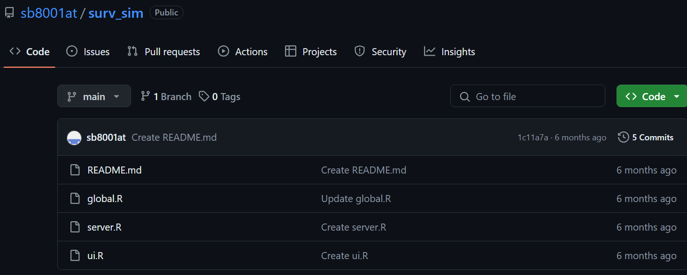](./image/github_repo.png)

上記ページの「ui.R」を選択すると、以下のようにui.Rのコードを読むことができます。

[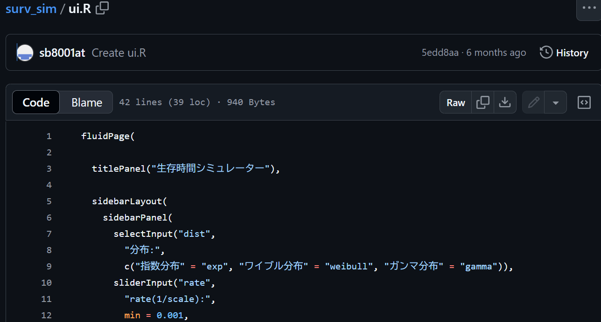](./image/github_uiR.png)

上記の`runGitHub`関数はこのページのui.R、server.R、global.Rを読み込み、Shinyアプリを実行する関数です。GitHubでのアカウント作成・レポジトリの準備やコードの入力方法に関しては、この教科書の範囲から外れるためココでは詳細を説明しませんので、[この記事](https://yoshitaku-jp.hatenablog.com/entry/2018/07/07/225642)などを参考にしていただければと思います。

最後に、Shinyアプリで用いられるUI、Serverのコードと実行時のページをイメージするためのShinyアプリを以下に示します。以下のコードをコピペしてRで実行していただければ、UIやServerのイメージがつかみやすいかと思います。

``` downlit
if(!require(shiny)) install.packages(("shiny")) # shinyの読み込み
shiny::runGitHub("shiny_sample", "sb8001at-oss")
```

Atkins, Aron, Toph Allen, Kevin Ushey, Jonathan McPherson, Joe Cheng, and JJ Allaire. 2023. *Packrat: A Dependency Management System for Projects and Their r Package Dependencies*. <https://CRAN.R-project.org/package=packrat>.

Atkins, Aron, Toph Allen, Hadley Wickham, Jonathan McPherson, and JJ Allaire. 2024. *Rsconnect: Deploy Docs, Apps, and APIs to ’Posit Connect’, ’Shinyapps.io’, and ’RPubs’*. <https://CRAN.R-project.org/package=rsconnect>.

Chang, Winston. 2021. *Shinythemes: Themes for Shiny*. <https://CRAN.R-project.org/package=shinythemes>.

Chang, Winston, and Barbara Borges Ribeiro. 2021. *Shinydashboard: Create Dashboards with ’Shiny’*. <https://CRAN.R-project.org/package=shinydashboard>.

Chang, Winston, Joe Cheng, JJ Allaire, et al. 2024. *Shiny: Web Application Framework for r*. <https://CRAN.R-project.org/package=shiny>.

R Special Interest Group on Databases (R-SIG-DB), Hadley Wickham, and Kirill Müller. 2024. *DBI: R Database Interface*. <https://CRAN.R-project.org/package=DBI>.

Sali, Andras, and Dean Attali. 2020. *Shinycssloaders: Add Loading Animations to a ’Shiny’ Output While It’s Recalculating*. <https://CRAN.R-project.org/package=shinycssloaders>.

Sievert, Carson, Joe Cheng, and Garrick Aden-Buie. 2024. *Bslib: Custom ’Bootstrap’ ’Sass’ Themes for ’Shiny’ and ’Rmarkdown’*. <https://CRAN.R-project.org/package=bslib>.

Thieurmel, Benoit, and Victor Perrier. 2022. *Shinymanager: Authentication Management for ’Shiny’ Applications*. <https://CRAN.R-project.org/package=shinymanager>.

Wickham, Hadley, Maximilian Girlich, and Edgar Ruiz. 2024. *Dbplyr: A ’Dplyr’ Back End for Databases*. <https://CRAN.R-project.org/package=dbplyr>.

Xie, Yihui, Joe Cheng, and Xianying Tan. 2024. *DT: A Wrapper of the JavaScript Library ’DataTables’*. <https://CRAN.R-project.org/package=DT>.

Back to top
