# 49  因果推論：因果推論の基礎と傾向スコア

Code

## 49.1 因果

**因果**とは、**原因と結果の関係性**のことです。原因が結果を常に引き起こすという恒常性と方向性があり、時間的に原因が先に、結果が後に起こります。また、原因と結果は距離的にも時間的にも近接して起こります。

最も単純な因果として、**「ボールを棒で突くと、ボールが転がる」**ことについて考えてみましょう。ボールを棒で突けば、どこでいつボールを突いてもボールは転がります（恒常的連結性）。また、棒で突くまでボールは転がらず、棒で突いた後にボールは転がります（時間的近接性）。また、棒でボールを直接突いたときにのみボールは転がり、ブラジルで棒を突いても日本でボールは転がりません（空間的近接性）。ですので、「棒で突く」が原因で、「ボールが転がる」が結果です。

ただし、この**「棒で突いたらボールが転がる」、というのは常に真ではありません**。棒で強くつき過ぎたらボールは砕けるかもしれませんし、床とボールの摩擦がないとボールは転がりません。棒で突く強さが弱すぎるとボールは動かないかもしれません。したがって、単純な因果関係を考えた場合でにおいても、**因果が成り立つには様々な仮定が必要**です。

では、**「作物に肥料を与えると収量が増える」**ことについて考えてみましょう。我々は知識としてこの因果関係が成立することは知っていますが、この関係も常に真ではありません。作物に与える水が少なければ肥料を与えても収量が下がることはあるでしょうし、肥料を与えたけど害虫がついて収量が下がることもあります。肥料を与えすぎたら肥料焼けで根が傷むこともあるでしょう。ですので、「作物に肥料を与えると収量が増える」という因果関係が成立するにはたくさんの仮定が必要になります。

> **TIP:**
>
> 上記の3つ（恒常的連結性、時間的近接性、空間的近接性）は因果の定義ではなく、規則性説と呼ばれる因果に関する説の一つです。因果がどのように成り立つのか、因果は存在するのか、などの、因果性自体について理解するには科学哲学の教科書を読むとよいでしょう。例えば
>
> - [現代哲学のキーコンセプト 因果性](https://www.amazon.co.jp/dp/4000613804?tag=le2am-22&language=ja_JP)([ダグラス・クタッチ 2019](#ref-ingasei2019-12-19))
> - [哲学がわかる 因果性](https://www.amazon.co.jp/%E5%93%B2%E5%AD%A6%E3%81%8C%E3%82%8F%E3%81%8B%E3%82%8B-%E5%9B%A0%E6%9E%9C%E6%80%A7-VERY-SHORT-INTRODUCTION/dp/4000612417)([スティーブン・マンフォード 2017](#ref-ingasei2017-12-15))
>
> などに目を通してみることをおすすめします。

## 49.2 実験と観察研究

### 49.2.1 実験とランダム化比較試験

上記の通り、「作物に肥料を与えると収量が増える」は必ずしも真ではありませんが、たくさんの仮定がある場合、例えば与える水の量がおなじで、おなじ場所で育てており、おなじ温度、おなじ日照量で、害虫などの影響がなく、作物の遺伝的背景がおなじであれば、因果関係として成立します。つまり、肥料以外の条件が全くおなじであれば、肥料の少ない条件で育てた作物より、肥料の多い条件で育てた作物の収量が多くなる、という因果関係が成立します。

しかし、これらの仮定をすべて成立させることは困難です。例えば、おなじ時間におなじ場所で作物を同時に複数育てることはできません。

すべての仮定を満たす実験を行うのは難しいですが、「仮定を満たす」と想定できる条件を作り出すことはできます。その方法の一つが、[48章](chapter48.llms.md)で説明したフィッシャーの3原則：**ランダム化（無作為化）**です。

複数の作物をランダムに肥料の少ない・多い条件に割り当てる（**割付**）ことで、条件の間で場所・日照量・遺伝的背景の分布を概ね一致させることができます。このように、割付をランダムに行う実験のことを**ランダム（無作為）化比較試験（Randomized Controlled Trial、RCT）**と呼びます。前章で説明した実験計画では、RCTとなるように説明変数をランダムに割り付け、実験を組みます。

### 49.2.2 観察研究

実験室で行う実験では様々な条件をコントロールすることができるため、割付をランダムに行い、RCTを組むことはそれほど難しくありません。しかし、我々が取るデータは必ずしも実験室で生み出されているわけではありません。

例えば野外の日当たりのいい場所に生えている植物と日当たりの悪い場所に生えている植物とを観察し、葉の形態を比較する場合には、厳密に光の強さを調整できないだけではなく、植物の遺伝的背景や土壌の栄養、水分などをコントロールすることはできません。

固定電話に連絡することでアンケートを取るような手法では、固定電話を持っている方、例えば高齢の方や家族のいる方からの回答は集まりやすいですが、一人暮らしの、携帯電話しか持たないような方からは回答を得ることができず、偏ったデータしか取得することができません。

また、養殖した稚魚を放流して漁獲高に与える影響を調べる場合には、稚魚を放流しなかった場合の漁獲高と厳密に比較する方法がありません。

上記に示した植物やアンケート、稚魚の放流の例は実験ではなく、**観察研究**と呼ばれるものになります。観察研究には生態学や政策による影響の評価、マーケティングによる売り上げへの影響、感染症などの病気の発生の評価（疫学）、心理学などが含まれます。観察研究では、厳密なRCTを実施することがそもそもできませんので、観察結果から因果関係を評価することは困難です。

> **TIP:**
>
> 最も代表的なRCTは医薬品開発における治験です。医薬品の治験では、二重盲検無作為化平行群間試験、と呼ばれるタイプの試験が行われ、観察者による評価の偏りや、割付による偏り（バイアス）が除かれた形で試験が行われます。また、試験前に試験と解析の計画を立案した上で試験が実施されます。
>
> ただし、治験でのRCTの実施には非常にコストがかかります。たくさんの被験者、医師、統計学の専門家が参画することでRCTの条件を満たす試験の品質が確保されています。
>
> 実験生物学では、治験より実験をコントロールしやすいため、基本的にはRCTが成立しているとして実験を行います。大腸菌や酵母、線虫、マウスやイネなどは単系統の遺伝的な差異のない個体を用い、生育環境も揃えた上で実験を行います。
>
> とは言え、実験生物学では1人〜数人で実験を行っていることが多く、解析計画を立てないことも割とあります。試験に関わる人数が少ないため、盲検はなかなか成立しません。生育環境が揃っていると仮定はしているけども割付が完全にランダム化されていない場合もあります。遺伝的背景に差がないと考えていても、厳密に遺伝的差異がない生物を準備するのは難しいです。顕微鏡写真のような定量化の難しい実験では、統計の手法を用いることが難しい場合もあります。
>
> したがって、実験だから常にRCTが成り立つと考えてよい、というわけではありません。実験はフィッシャーの3原則を守るように計画し、きちんとRCTとして成立しているか評価し、必要に応じて統計手法を見直すことは実験生物学においても重要です。

## 49.3 相関と交絡（confounding）

因果関係を推測するための方法の一つは、[30章](chapter30.llms.md#相関)で説明した**相関**があるかどうかを調べることです。例えば、日照量と作物の収量に正の相関関係があれば、日照量が収量に影響を与えているかもしれない、と推測することができます。

しかし、相関があれば因果関係がある、というわけではありません。相関では2つの量の間の関係を評価しますが、2つのうちどちらが原因で、どちらが結果かは相関からだけでは判別できません。

また、2つの量の相関が他の因子により生まれることもあります。例えば、全国の海水浴場の客数と、ある製菓企業のアイスクリームの売り上げには正の相関があるかもしれませんが、海水浴場の客がアイスクリームを買うから因果関係がある、というわけではありません。海水浴場の客数やアイスクリームの売り上げは共に気温による影響を受け、温度が上がると海水浴場の客数もアイスクリームの売り上げも増加します。つまり、海水浴場の客数とアイスクリームの売り上げの間の相関は気温を介した、意味のない、見せかけの相関であると言えます。

この例での気温のように、見せかけの相関を生み出す原因となる要素のことを**交絡（confounding）**と呼びます。

[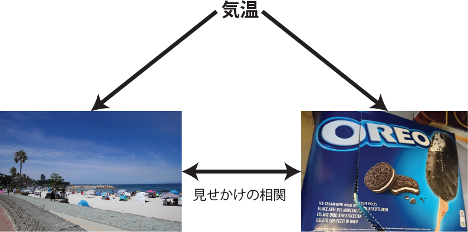](./image/confounding.png "交絡")

交絡

交絡は見せかけの相関を生み出す原因となり、回帰などの結果にも大きな影響を与えます。交絡が存在するかどうか、交絡の影響をどのようにして小さくするかが統計では重要となります。

## 49.4 統計的因果推論（Causal Inference）とは？

観察研究では、様々な因子（肥料の例であれば水や日照など）や交絡が目的変数に影響を与えます。このような、目的変数に影響を与えうる因子のことを**共変量**と呼びます。共変量には測定によって評価することができないものもあります。

割付の間で共変量に差がないことが因果関係を評価する上では重要ですので、共変量の影響が残っていたり、評価できなければ、興味のある因子（説明変数）と結果（目的変数）の関係、つまり因果関係を評価することはできません。

このように、共変量の影響が残っていたり、影響がわからない場合において、共変量の影響をなるべく小さくし、処置（割付、原因）と結果の因果関係を評価する統計の手法のことを**因果推論（Causal inference）**と呼びます。因果推論には様々な手法があります。49章・50章・51章では、因果推論の手法の簡単な説明と、Rでの演算方法を紹介していきます。紹介する手法を以下の図に示します。49章ではランダム化比較試験から傾向スコアまで、50章では差分の差分法と回帰不連続デザイン、51章ではネットワークを用いる手法（有向非巡回グラフ、ベイジアンネットワーク、構造方程式モデリング）について、例を提示して演算方法を示します。

[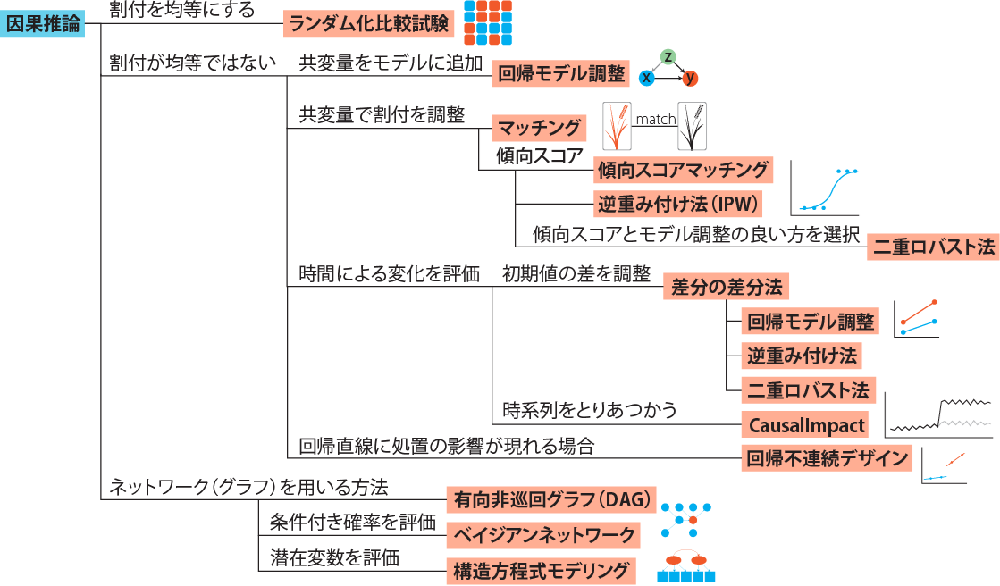](./image/CausalInference.png "統計的因果推論の手法")

統計的因果推論の手法

ただし、いずれの因果推論の手法も複雑で精緻なものであり、統計的な背景を理解せずに用いると因果関係を誤って理解してしまう恐れがあります。このテキストでは本当に入口だけを紹介しています。それぞれの手法の詳細については[参考文献](references.llms.md#因果推論)に示した教科書を参考とし、よく背景を学んだ上で手法の利点・欠点を理解し、利用することをおススメします。

> **TIP:**
>
> 観察研究のデータセットとして、Rでは`causaldata`パッケージ([Huntington-Klein and Barrett 2024](#ref-causaldata_bib))や`ForCausality`パッケージ([Valderrama 2025](#ref-ForCausality_bib))のデータを利用することができます。ただし、いずれのパッケージに含まれるデータセットのデータだけ見てもいまいち意味が分かりづらく、どのような想定で何を目的として取得したデータなのか理解しにくくなっています。また、観察研究で取られたデータセットがほとんどですので、欠測（`NA`）がたくさん含まれています。正確なデータの意味を理解するには、データセットの元となった論文や、データセットを利用した因果推論の教科書（[Causal Inference: The Mixtape](https://mixtape.scunning.com/index.html)([Cunningham 2023](#ref-causal_inference_mixtape))など）を読む必要があります。
>
> この章では、因果推論のデータセットとして、`causaldata`パッケージを利用して自作したデータを利用します。
>
> `thornton_hiv`は`causaldata`パッケージに含まれるデータで、[マラウイ](https://ja.wikipedia.org/wiki/%E3%83%9E%E3%83%A9%E3%82%A6%E3%82%A4)で実施された、金銭的な補助によりHIV感染の検査をする人が増えるかどうか、HIV検査の結果がコンドームの購買に影響を与えたのかを調べた研究に関するデータです([Thornton 2005](#ref-thornton2005demand))。この研究では、マラウイの郊外に在住する人にランダムに金銭的な補助（インセンティブ）を与えた時のHIV検査の受診について、インセンティブの大きさ（補助金の額）や検査所までの距離、年齢の影響を調べています。
>
> この論文では検査やインセンティブがコンドームの購入金額に与える影響についても評価していますが、`thornton_hiv`にはコンドームの購入金額についてのデータはありません。また、観察研究のデータですので、かなり欠測があります。このままでは例としては使いにくいので、欠測を取り除き、コンドームの購入数を自作し、以降の手法の例に用います。
>
> まず、`thornton_hiv`の結果を簡単に見ていきます。`thronton_hiv`の各列の意味は以下の通りです。
>
> | 列名    | 列の意味                       | データの型     |
> |:--------|:-------------------------------|:---------------|
> | villnum | 被験者の居住地のID             | 数値           |
> | got     | HIV検査を受診したか            | 論理値（0と1） |
> | distvct | 居住地から検査所までの距離     | 数値           |
> | tinc    | インセンティブの額             | 数値           |
> | any     | インセンティブを受けたかどうか | 論理値（0と1） |
> | age     | 年齢                           | 数値           |
> | hiv2004 | HIV検査の結果                  | 論理値（0と1） |
>
> `villnum`は居住地（市町村）のIDで、統計モデルに加えると過度に複雑になるので取り除きます。`villnum`以外のデータを[26章](chapter26.llms.md#ggally)で紹介した`GGally`パッケージ([Schloerke et al. 2023](#ref-GGally_bib))で示すと以下のようになっています。HIV検査を受けた人（`got = 1`）は全体の2/3程度で、インセンティブを受けている人（`any = 1`）が多く、HIV陽性の人（`hiv2004 = 1`）はかなり少なめであることがわかります。
>
> ``` downlit
> pacman::p_load(causaldata)
>
> hiv <- 
>   thornton_hiv |> 
>   select(!villnum) |> 
>   na.omit() |> 
>   filter(hiv2004 != -1)
>
> hiv |> summary()
> ```
>
>           got            distvct           tinc             any        
>      Min.   :0.0000   Min.   :0.000   Min.   :0.0000   Min.   :0.0000  
>      1st Qu.:0.0000   1st Qu.:1.032   1st Qu.:0.1891   1st Qu.:1.0000  
>      Median :1.0000   Median :1.686   Median :0.9456   Median :1.0000  
>      Mean   :0.6911   Mean   :2.013   Mean   :1.0065   Mean   :0.7805  
>      3rd Qu.:1.0000   3rd Qu.:2.795   3rd Qu.:1.8912   3rd Qu.:1.0000  
>      Max.   :1.0000   Max.   :5.192   Max.   :2.8368   Max.   :1.0000  
>           age           hiv2004       
>      Min.   :11.00   Min.   :0.00000  
>      1st Qu.:22.00   1st Qu.:0.00000  
>      Median :32.00   Median :0.00000  
>      Mean   :33.37   Mean   :0.06286  
>      3rd Qu.:43.00   3rd Qu.:0.00000  
>      Max.   :80.00   Max.   :1.00000  
>
> ``` downlit
> GGally::ggpairs(
>   hiv |> mutate(got = as.factor(got), any = as.factor(any)), 
>   mapping = aes(color = got))
> ```
>
> [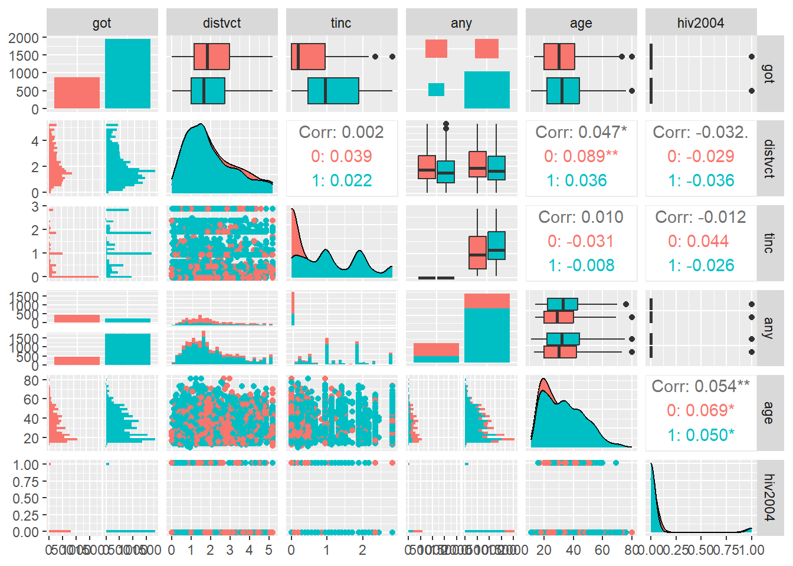](chapter49_files/figure-html/unnamed-chunk-3-1.png)
>
> ココで、元の論文([Thornton 2005](#ref-thornton2005demand))とは少し異なりますが、「HIV検査を受けることでコンドームの購入数が増えるかどうか」を評価するようデータを作っていきます。コンドームの購入数は正の整数しか取らない変数ですので、ポアソン分布に従うこととし、指数関数で表すこととします。以下でコンドームの購入数を作成しています。
>
> 「HIV検査を受けることでコンドームの購入数が増えるかどうか」が目的ですので、因果推論の手法で以下の式のHIV検査の傾き（`hiv$got`の係数、`2`）が求まればよい、ということになります。
>
> ``` downlit
> set.seed(0)
>
> cdm <- 
>   2 * hiv$got - # 検査を受けると購入数が増える
>   0.08 * hiv$age + # 年齢が高くなると購入数は減る
>   1.75 * hiv$hiv2004 - # HIV陽性だと購入数が増える
>   0.2 * hiv$tinc + # インセンティブが大きいほど購入数が増える
>   rnorm(nrow(hiv), 0, 0.3)
>
> cdm <- exp(cdm) |> round(0)
>
> hiv$cdm <- cdm
>
> ggplot(hiv, aes(x=cdm, color = got, fill = got)) + 
>   geom_histogram() + 
>   labs(x = "bought number of condom") +
>   facet_wrap(~ got)
> ```
>
> [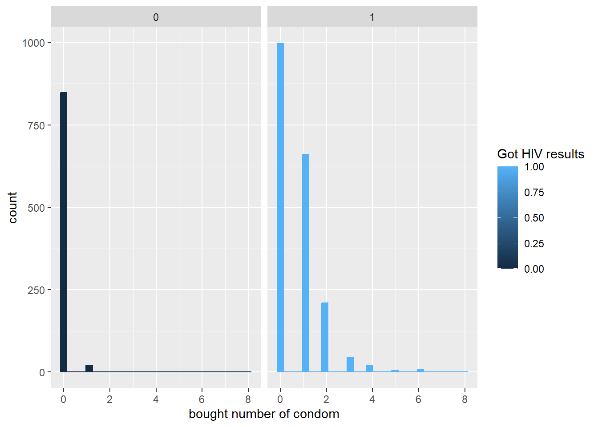](chapter49_files/figure-html/unnamed-chunk-4-1.png)
>
> ``` downlit
> ggplot(hiv, aes(x=cdm, color = any, fill = any)) + 
>   geom_histogram() + 
>   labs(x = "got any incentives") +
>   facet_wrap(~ any)
> ```
>
> [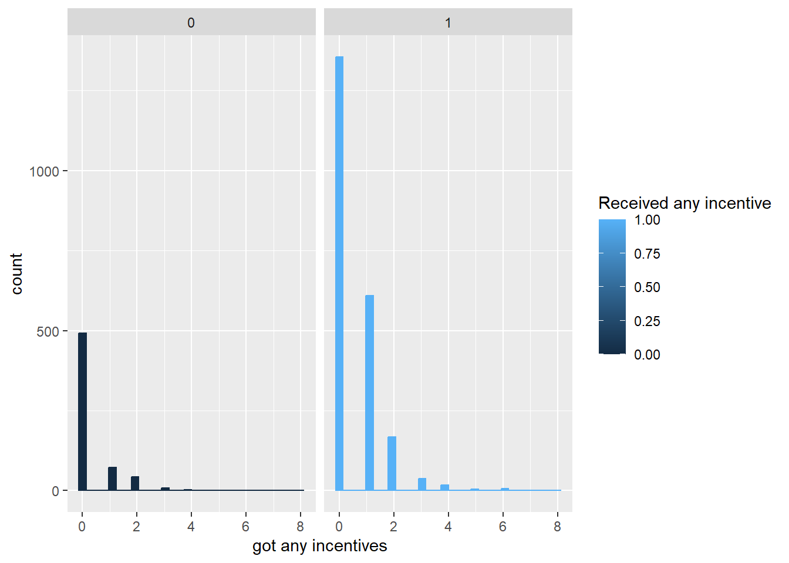](chapter49_files/figure-html/unnamed-chunk-4-2.png)
>
> 上記のデータでは、以下の図で示すような因果関係がある、と想定して作成しています。以下の図は`dagitty`パッケージ([Textor et al. 2016](#ref-dagitty_bib))で作成した、DAG（Directed Acyclic Graph）と呼ばれるタイプのネットワーク図の一種です。DAGも因果推論において重要なツールであるとされているので、後ほど[51章](chapter51.llms.md)で説明します。
>
> [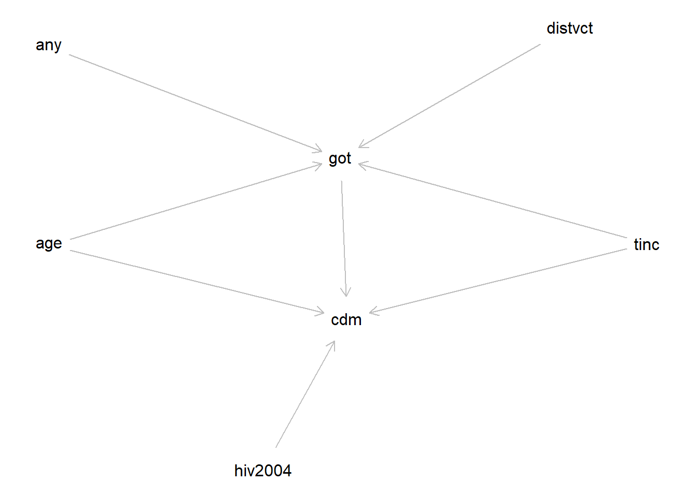](chapter49_files/figure-html/unnamed-chunk-5-1.png)

> **TIP:**
>
> 因果推論に関連するパッケージでは、`lalonde`（`nsw`）というデータセットがよく用いられています。
>
> この`lalonde`は`cobalt`パッケージ([Greifer 2025a](#ref-cobalt_bib))で提供されているデータです。`lalonde`は[Lalonde の統計解析に関する論文](https://business.baylor.edu/scott_cunningham/teaching/lalonde-1986.pdf)([LaLonde 1986](#ref-lalonde1986evaluating))で解析に用いられたデータで、1970年代に実施された社会科学的な実験（The National Supported Work Demonstration、NSW）の結果となっています。
>
> この`lalonde`のデータの元となった実験では、アメリカの10都市（アトランタ、シカゴ、ハートフォード、ジャージー・シティ、ニューアーク、ニューヨーク、オークランド、フィラデルフィア、サンフランシスコ、ウィスコンシン）の失業者（母子家庭への扶助（AFDC, Aid to Families with Dependent Children）をもらっている女性、薬物中毒経験者、犯罪歴のある者、高校中退者等）の半数にランダムに9～18ヵ月の就労体験を与え（処置群）、カウンセリングサービスを行っています。就労の種類は女性ではサービス業、男性では製造業が多く、就労体験中には少ないながらも給与が出ました。もちろん途中で就労体験を辞めてしまう方もいたようです。就労の経験を与えられなかった半数の人は対照群とされました。
>
> この就労プログラムの終了後9か月ごと、27か月と36か月にインタビューを行い、就労プログラム前と後の給与を記録したのが元々のLalonde (1986)で示されているデータです。AFDCを受けている女性が1602名（うち800名が処置群）、それ以外の男性が4276名（うち2083名が処置群）参加した大規模なサーベイの結果となっています。各個々人からは、就学年数、結婚しているか、人種（アフリカ系、ヒスパニックとそれ以外）、年齢、学位の有無等と、プログラム開始前の給与、プログラム終了後の給与を聞き取りしています。インタビューの回答は完全には得られず（36か月後で29%程度が回答）、処置群の方が対照群よりも回答率が良かったようです。
>
> ここで、`cobalt`パッケージの`lalonde`データセットを見ると、処置群が185例、対照群が429例となっています。つまり、元々のLalonde (1986)で示されているデータとは少し違うものを利用しているようです。
>
> ``` downlit
> cobalt::lalonde |> dim()
> ```
>
>     [1] 614   9
>
> ``` downlit
> cobalt::lalonde |> _$treat |> factor() |> summary() # 1が処置群
> ```
>
>       0   1 
>     429 185 
>
> ``` downlit
> cobalt::lalonde |> summary()
> ```
>
>          treat             age             educ           race        married      
>      Min.   :0.0000   Min.   :16.00   Min.   : 0.00   black :243   Min.   :0.0000  
>      1st Qu.:0.0000   1st Qu.:20.00   1st Qu.: 9.00   hispan: 72   1st Qu.:0.0000  
>      Median :0.0000   Median :25.00   Median :11.00   white :299   Median :0.0000  
>      Mean   :0.3013   Mean   :27.36   Mean   :10.27                Mean   :0.4153  
>      3rd Qu.:1.0000   3rd Qu.:32.00   3rd Qu.:12.00                3rd Qu.:1.0000  
>      Max.   :1.0000   Max.   :55.00   Max.   :18.00                Max.   :1.0000  
>         nodegree           re74            re75              re78        
>      Min.   :0.0000   Min.   :    0   Min.   :    0.0   Min.   :    0.0  
>      1st Qu.:0.0000   1st Qu.:    0   1st Qu.:    0.0   1st Qu.:  238.3  
>      Median :1.0000   Median : 1042   Median :  601.5   Median : 4759.0  
>      Mean   :0.6303   Mean   : 4558   Mean   : 2184.9   Mean   : 6792.8  
>      3rd Qu.:1.0000   3rd Qu.: 7888   3rd Qu.: 3249.0   3rd Qu.:10893.6  
>      Max.   :1.0000   Max.   :35040   Max.   :25142.2   Max.   :60307.9  
>
> おそらく元データには欠測等が多く、処置群より対照群が少ないデータは因果推論ではやや扱いにくいため、元データを加工しているのだと思います。各列の意味は以下の通りです。
>
> | 列名     | 意味                                 |
> |:---------|:-------------------------------------|
> | treat    | 就労経験の有無（1があり、0がなし）   |
> | age      | 年齢                                 |
> | educ     | 教育の年数                           |
> | race     | 人種（白人、アフリカ系、ヒスパニック |
> | married  | 婚姻の有無（1があり、0がなし）       |
> | nodegree | 高校中退（1が中退）                  |
> | re74     | 74年（就労経験前）の給与             |
> | re75     | 75年（就労経験後）の給与             |
> | re78     | 78年（就労経験3年後)の給与           |
>
> cobalt::lalondeの列の意味 {.caption-top .table .table-sm .table-striped .small}
>
> また、同様に`DRDID`パッケージ([Sant’Anna and Zhao 2020](#ref-DRDID_bib))の`nsw`データセットもLalonde (1986)を引用したデータセットになっています。この`nsw`は19204行（`nsw_long`という縦持ちのデータセットは38408行）もあるデータセットになっていて、`treated`の列に`NA`のデータが18482行含まれています。`DRDID`パッケージの関数の例では、`experimental`の列を割付群として用いています。
>
> ``` downlit
> DRDID::nsw |> dim()
> ```
>
>     [1] 19204    14
>
> ``` downlit
> DRDID::nsw |> summary()
> ```
>
>         treated            age             educ           black       
>      Min.   :0.0000   Min.   :16.00   Min.   : 0.00   Min.   :0.0000  
>      1st Qu.:0.0000   1st Qu.:24.00   1st Qu.:11.00   1st Qu.:0.0000  
>      Median :0.0000   Median :31.00   Median :12.00   Median :0.0000  
>      Mean   :0.4114   Mean   :33.11   Mean   :11.97   Mean   :0.1238  
>      3rd Qu.:1.0000   3rd Qu.:42.00   3rd Qu.:13.00   3rd Qu.:0.0000  
>      Max.   :1.0000   Max.   :55.00   Max.   :18.00   Max.   :1.0000  
>      NAs    :18482                                                    
>         married          nodegree          dwincl            re74       
>      Min.   :0.0000   Min.   :0.0000   Min.   :0.0000   Min.   :     0  
>      1st Qu.:0.0000   1st Qu.:0.0000   1st Qu.:0.0000   1st Qu.:  4232  
>      Median :1.0000   Median :0.0000   Median :1.0000   Median : 15034  
>      Mean   :0.7111   Mean   :0.3152   Mean   :0.6163   Mean   : 14328  
>      3rd Qu.:1.0000   3rd Qu.:1.0000   3rd Qu.:1.0000   3rd Qu.: 23572  
>      Max.   :1.0000   Max.   :1.0000   Max.   :1.0000   Max.   :137149  
>                                        NAs    :18482                    
>           re75             re78             hisp            early_ra     
>      Min.   :     0   Min.   :     0   Min.   :0.00000   Min.   :0.0000  
>      1st Qu.:  4166   1st Qu.:  5593   1st Qu.:0.00000   1st Qu.:0.0000  
>      Median : 14443   Median : 16357   Median :0.00000   Median :0.0000  
>      Mean   : 13954   Mean   : 15363   Mean   :0.06816   Mean   :0.3463  
>      3rd Qu.: 23054   3rd Qu.: 25565   3rd Qu.:0.00000   3rd Qu.:1.0000  
>      Max.   :156653   Max.   :121174   Max.   :1.00000   Max.   :1.0000  
>                                                          NAs    :18482   
>          sample       experimental   
>      Min.   :1.000   Min.   :0.0000  
>      1st Qu.:2.000   1st Qu.:0.0000  
>      Median :2.000   Median :0.0000  
>      Mean   :2.092   Mean   :0.0376  
>      3rd Qu.:2.000   3rd Qu.:0.0000  
>      Max.   :3.000   Max.   :1.0000  
>                                      
>
> | 列名         | 意味                                            |
> |:-------------|:------------------------------------------------|
> | treated      | 就労経験の有無（1があり、0がなし）              |
> | age          | 年齢                                            |
> | educ         | 教育の年数                                      |
> | black        | アフリカ系のフラグ                              |
> | married      | 婚姻の有無（1があり、0がなし）                  |
> | nodegree     | 高校中退（1が中退）                             |
> | dwincl       | 別の論文（Dehejia and Wahba 1999)で追加された列 |
> | re74         | 74年（就労経験前）の給与                        |
> | re75         | 75年（就労経験後）の給与                        |
> | re78         | 78年（就労経験3年後)の給与                      |
> | hisp         | ヒスパニックのフラグ                            |
> | early_ra     | 別の論文（Smith and Todd 2005）で追加された列   |
> | sample       | データの種類（1がNSW、2がCPS、3がPSID）         |
> | experimental | experimental sampleのフラグ                     |
>
> DRDID::nswの列の意味 {.caption-top .table .table-sm .table-striped .small}
>
> `lalonde`にしても`nsw`にしてもいまいちデータをどのように整理しているのかよくわからないのですが、列の意味を理解した上で利用した方が手法の意味などを理解しやすいかと思います。

## 49.5 無作為化

上に示した通り、例えば肥料が多い、肥料が少ない場合の収量への影響を評価する場合には、共変量の影響をできるだけ小さくし、説明変数が目的変数に与える影響を評価する必要があります。この共変量の影響を小さくする上では、説明変数の割付を**無作為化（ランダム化）**することが重要です。無作為化することで、割付の群の間での共変量の偏りを小さくすることができます。

以下の例では、まず無作為化をしない場合の線形回帰の結果を示しています。

まず、土壌の深さは左側が浅く、右側が深いとします。肥料に関しては2段階（少ない：-1、多い：1）に割付します。無作為化しないと仮定しますので、左に肥料が少ない群（-1）、右に肥料が多い群（1）を割付します。このように割付を行うと、肥料が少ない群は土壌の浅いところに、肥料が多い群は土壌の深い部分に植わることになります。肥料の量が説明変数、収量が目的変数、土壌の深さが共変量です。このような条件で、線型回帰から肥料が収量に与える影響を評価してみます。

Code

``` downlit
set.seed(1)

# 土壌の深さ（depth）と肥料（nutrient）が収量に与える影響に関する関数
seed_weight2 <-
 function (nutrient, depth)
 {
  5 * nutrient + 1.1 * depth + rnorm(length(nutrient), 5, 0.5)
 }

# 左が浅く、右が深い、縦5、横10の環境を想定する
depth_mat <-
 matrix(
  rep(seq(0.5, 5, length = 10), 5) + rnorm(50, 0.5, 0.5),
  nrow = 5,
  byrow = TRUE
 )

# 深さと肥料から収量を計算する
depth_nut <-
 depth_mat |>
  as.data.frame() |>
  mutate(rows = 1:5) |>
  pivot_longer(1:10) |>
  mutate(name = name |> str_remove("V") |> as.numeric()) |>
  rename(cols = name, depth = value) |>
  mutate(
   nutrient = if_else(cols > 5, 1, -1), # 左側は肥料が少なく、右は多い
   weight = seed_weight2(nutrient, depth))
```

Code

``` downlit
# 土壌の深さの分布（色が濃いほど深い）
depth_nut |>
  ggplot()+
  geom_raster(aes(x = cols, y = rows, fill = -depth)) +
  geom_text(aes(x = cols, y = rows, label = round(depth, 1))) +
  theme(legend.position = "none") +
  labs(x = "左右の位置", y = "縦横の位置", title = "土壌の深さの分布（色が濃いほど深い）")
```

[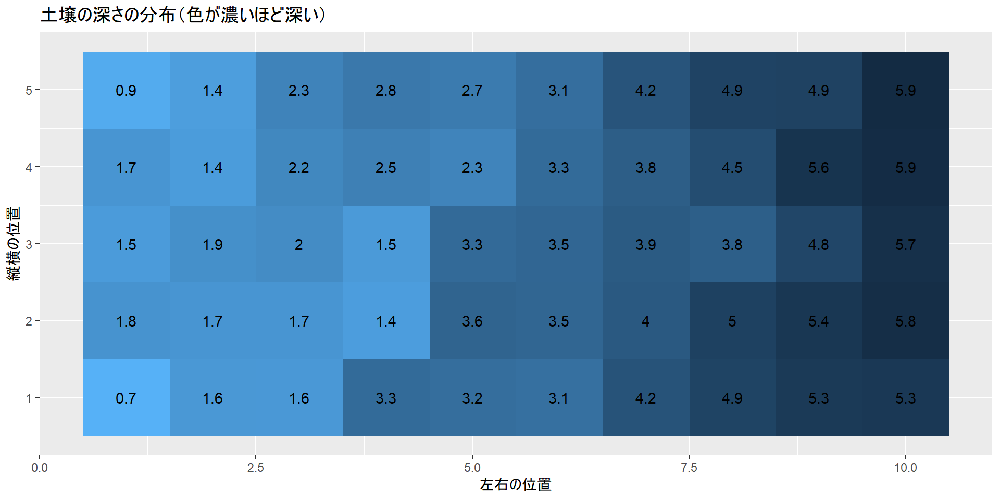](chapter49_files/figure-html/unnamed-chunk-11-1.png)

Code

``` downlit
# 肥料の割付（赤が少なく、青が多い）
depth_nut |>
  mutate(nutrient = as.factor(nutrient)) |>
  ggplot()+
  geom_raster(aes(x = cols, y = rows, fill = nutrient)) +
  geom_text(aes(x = cols, y = rows, label = nutrient)) +
  theme(legend.position = "none") +
  labs(x = "左右の位置", y = "縦横の位置", title = "肥料の割付（赤が少なく、青が多い）")
```

[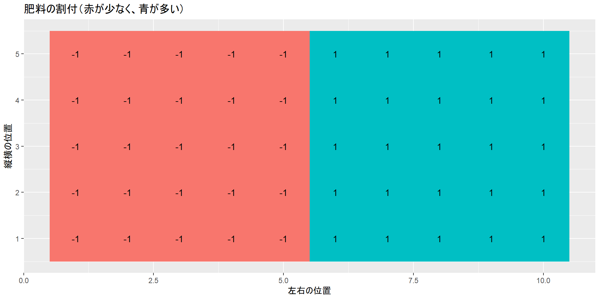](chapter49_files/figure-html/unnamed-chunk-12-1.png)

無作為化していない条件では、割付群の間で土壌の深さに差が生じてしまいます。

Code

``` downlit
depth_nut |> 
  mutate(nutrient = as.factor(nutrient)) |>
  ggplot(aes(x = depth, color = nutrient, fill = nutrient)) +
  geom_density(alpha=0.5)
```

[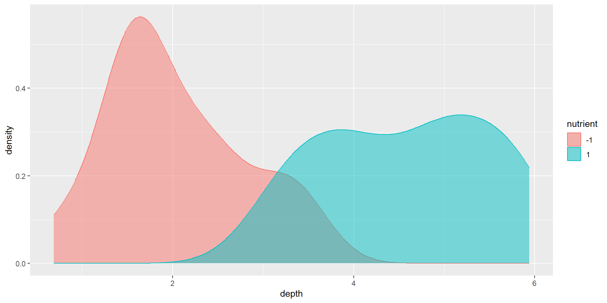](chapter49_files/figure-html/unnamed-chunk-13-1.png)

Code

``` downlit
# 収量の結果（色が濃いほど多い）
depth_nut |>
  ggplot()+
  geom_raster(aes(x = cols, y = rows, fill = -weight)) +
  geom_text(aes(x = cols, y = rows, label=round(weight, 1))) +
  theme(legend.position = "none") +
  scale_color_distiller(palette = "Greens")+
  scale_fill_distiller(palette = "Greens", direction = 1) +
  labs(x = "左右の位置", y = "縦横の位置", title = "収量の結果（色が濃いほど多い）")
```

[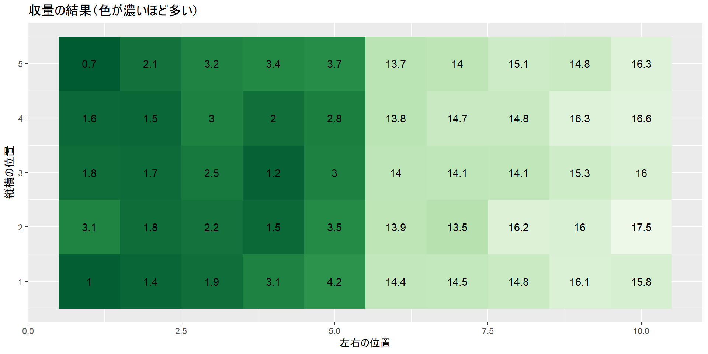](chapter49_files/figure-html/unnamed-chunk-14-1.png)

無作為化しない場合、肥料と収量で線型回帰を行うと、肥料の効果（傾き）は6.4ぐらい、という結果になります。このデータを作成したとき、肥料の真の効果は5としましたので、真の効果から20％程度結果がずれている、つまり**バイアス**が生じているということになります。

``` downlit
lm(weight ~ nutrient, data = depth_nut)
```


    Call:
    lm(formula = weight ~ nutrient, data = depth_nut)

    Coefficients:
    (Intercept)     nutrient  
          8.689        6.361  

では、無作為化を行うとどうなるでしょうか。以下のように肥料の量を無作為に割付した場合を考えてみます。

Code

``` downlit
depth_nut2 <-
 depth_nut |>
  mutate(
   nutrient = sample(rep(c(1, -1), 25), nrow(depth_nut), replace = FALSE),
   weight = seed_weight2(nutrient, depth)
  )

depth_nut2 |>
  mutate(nutrient = as.factor(nutrient)) |>
  ggplot()+
  geom_raster(aes(x = cols, y = rows, fill = nutrient)) +
  geom_text(aes(x = cols, y = rows, label = nutrient)) +
  theme(legend.position = "none") +
  labs(x = "左右の位置", y = "縦横の位置", title = "肥料の割付（赤が少なく、青が多い）")
```

[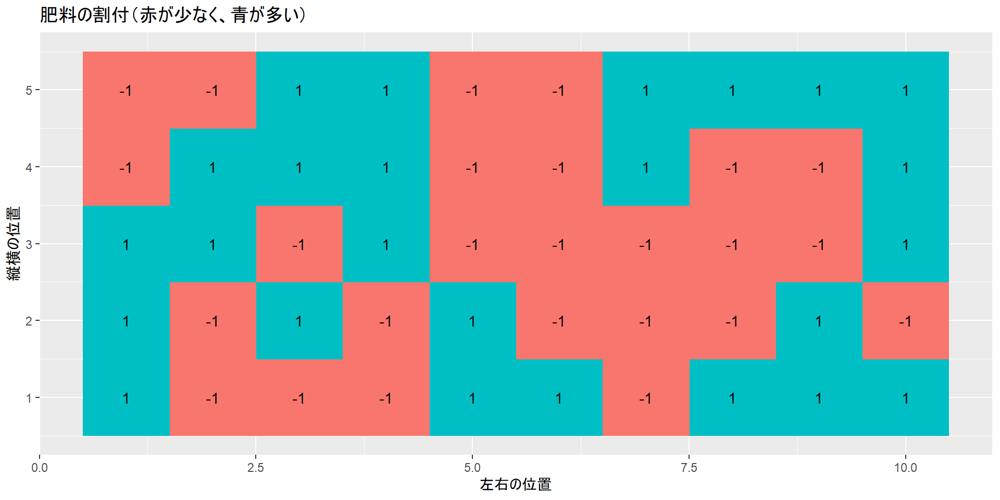](chapter49_files/figure-html/unnamed-chunk-16-1.png)

無作為化すると、肥料の割付間で土壌の深さの分布が概ね一致します。

``` downlit
depth_nut2 |> 
  mutate(nutrient = as.factor(nutrient)) |>
  ggplot(aes(x = depth, color = nutrient, fill = nutrient)) +
  geom_density(alpha=0.5)
```

[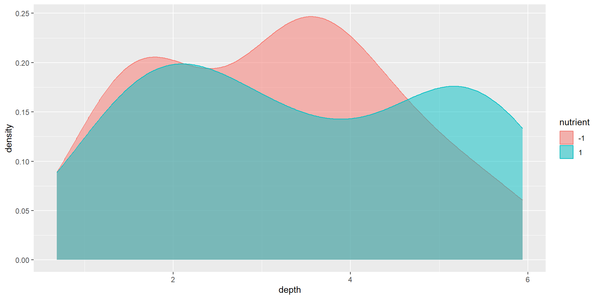](chapter49_files/figure-html/unnamed-chunk-17-1.png)

無作為に割付した場合、肥料の効果（傾き）はおおよそ5となり、真の値を推定することができています。無作為化することで、土壌の深さ（共変量）の影響を小さくし、評価したい因果関係（肥料と収量の関係）をバイアスなく評価できています。

``` downlit
lm(weight ~ nutrient, data = depth_nut2) # depthが無くても評価できている
```


    Call:
    lm(formula = weight ~ nutrient, data = depth_nut2)

    Coefficients:
    (Intercept)     nutrient  
          8.571        5.211  

土壌の深さを測定によって評価するのは大変です。無作為化を用いれば、実際に土壌の深さを測定できない場合でも、土壌の深さの影響をうまく調整して因果関係を評価することができます。

研究ではどのような共変量が結果に影響を与えるのか明確ではなく、共変量を測定できない場合も多いです。このような結果に影響を与える共変量が存在する場合において、無作為化は因果関係を推測する上で強力なツールであると言えます。

## 49.6 測定している結果とATE、ATT

上記の通り、割付が無作為化されておらず、共変量に偏りがある場合、処置群（肥料が1の部分）と対照群（肥料が-1の部分）の差の評価にはバイアスが生じます。しかし、割付を無作為化すれば、バイアスは小さくなります。

このバイアスに関しては測定結果と**平均処置効果（Average Treatment Effect、ATE）**、**処置群の平均処置効果（Average Treatment Effect in Treated、ATT）**の違いが関わっています。

実験や観察研究で我々が評価したいものは、処置群の効果の平均値\\E(r_1)\\と対象群の効果の平均値\\E(r_0)\\の差、つまり\\E(r_1)-E(r_0)\\です。これを**ATE**と呼びます（下図左）。

処置群において処置を\\Z=1\\とし、対照群については処置を\\Z=0\\と表すこととします。処置群の個体が処置を受けた場合の効果の平均値とその個体が処置を受けなかった場合の効果の平均値の差（\\E(r_1-r_0)\|Z=1\\）も処置の効果を反映しています。この\\E(r_1-r_0)\|Z=1\\のことを**ATT**と呼びます（下図中央）。

ただし、ATEやATTを評価する場合には、以下の図のように、ある植物Aについて肥料が多い（処置群）、少ない（対照群）場合、ある植物Bについて肥料が多い、少ない場合をそれぞれ評価し、肥料が多い群の平均値と肥料が少ない群の平均値をそれぞれ評価する必要があります。

しかし、植物Aに肥料を多く与えると、植物Aに肥料を少なく与えた結果は通常観察できず、植物Bに肥料を少なく与えると、植物Bに肥料を多く与えた結果は観察できません。つまり、下図左のようにすべてを観測することはできず、下図右のように一部を観測することになります。

我々が測定している処置群の結果は、「処置した（\\Z=1\\）」という条件の下での結果で、式としては\\E(r_1\|Z=1)\\と表すことができます。また、対照群については同様に、\\E(r_0\|Z=0)\\と表すことができます。我々が実験や観察研究を行うことで得られる結果はこの差である\\E(r_1\|Z=1)-E(r_0\|Z=0)\\です。ですので、通常我々が実験や観察研究で測定しているものはATEやATTとは異なります。

ただし、**割付を無作為化すると、**\\E(r_1\|Z=1)-E(r_0\|Z=0)\\**をATEとして評価することができます**。つまり、無作為化の下では\\E(r_1\|Z=1)=E(r_1)\\、\\E(r_0\|Z=0)=E(r_0)\\が成り立ちます。ですので、上の肥料の結果において、無作為化しなかった方では\\E(r_1\|Z=1)-E(r_0\|Z=0)\\を、無作為化を行った方では\\E(r_1\|Z=1)-E(r_0\|Z=0)\\=\\E(r_1)-E(r_0)\\（ATE）を評価した、ということになります。

このATEやATTを測定結果からいかにして評価するか、が因果推論の手法のテーマとなります。

[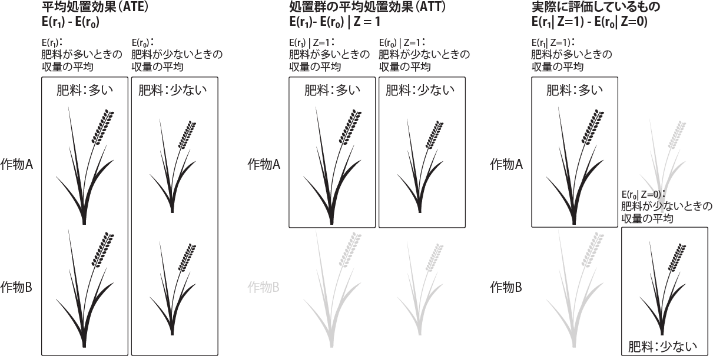](./image/ATE&ATT.png "ATEとATT")

ATEとATT

## 49.7 線形回帰による共変量の調整

無作為化をしなかった場合においても、共変量をうまく調整しATEを求める方法はあります。以下の例では、上記の肥料を無作為化しなかった場合において、線形回帰の式に土壌の深さ（`depth`）を加えた重回帰としたものです。この重回帰の結果では、`nutrient`の効果がおよそ5、つまりランダム化した場合とほぼ同様の値となっています。

つまり、目的変数に影響を与えうるすべての共変量を線形回帰に加えれば、ATEを評価することができる、ということです。このように線形回帰に共変量を加えることを**共変量の調整**と呼びます。

``` downlit
lm(weight ~ nutrient + depth, data = depth_nut)
```


    Call:
    lm(formula = weight ~ nutrient + depth, data = depth_nut)

    Coefficients:
    (Intercept)     nutrient        depth  
          5.217        5.027        1.052  

とは言え、共変量の調整でATEを評価するためには、結果に影響を与えうる共変量をすべて測定する必要があります。土壌の深さを正確に測定することは実際には難しく、したがってその効果を線形回帰に持ち込めるとは限りません。また、共変量の効果をすべて（非線形性や交互作用を含めて）モデルに加えないとうまく調整を行うことができません。

可能であれば無作為化を行い、共変量の影響が小さくなるようにした方が、測定にかかる労力は小さく、結果は解釈しやすくなるでしょう。また、割付を無作為化した上で「偏りが残った」共変量を調整したい場合には、この共変量の調整が有効です。

## 49.8 マッチング

割付の間で共変量に偏りがあると、上記の通り処置群と対照群の間の測定結果の差とATEには差（バイアス）が生じます。共変量に偏りがあるから問題となるのですから、処置群と対照群から、共変量がおなじになっているペアを探して取り出し、その取り出したデータのみを用いて解析すれば、共変量の偏りなく解析を行うことができるはずです。

このように共変量がおなじペアを探して取り出す手法のことを**マッチング**と呼びます。上記の肥料と土壌の深さの例では、土壌の深さが同じである、肥料が多い群と少ない群のペアを探し出して、そのペアとなったデータのみで肥料が収量に与える影響を評価するのがマッチングです。

[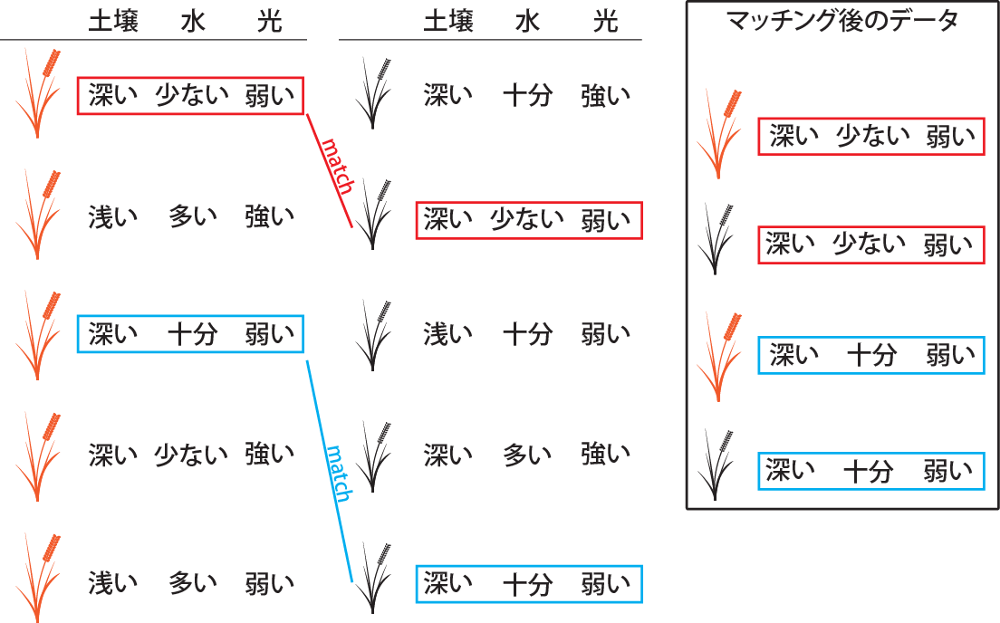](./image/matching.png "マッチング")

マッチング

ただし、割付が偏っていると共変量をマッチングできるペアの数は限られます。したがって、ペアを見つけられなかった多くのデータは解析に用いることができなくなります。また、共変量が1つだけならペアを見つけることができても、共変量がたくさんある場合には、すべての共変量がマッチングするようなペアを見つけることは難しくなります。

このようなマッチングの問題を軽減するための手法の1つが、以下に説明する**傾向スコアを用いた手法**です。

## 49.9 傾向スコア（propensity score）

**傾向スコア**とは、**割付群を目的変数、共変量を説明変数とし、回帰を行って得られるスコア**のことです。割付群は通常2群（処置群と対照群）を想定します。2群である割付群が目的変数ですので、回帰には[30章](chapter30.llms.md#目的変数が二項分布の場合)で説明した**ロジスティック回帰**が用いられます。

[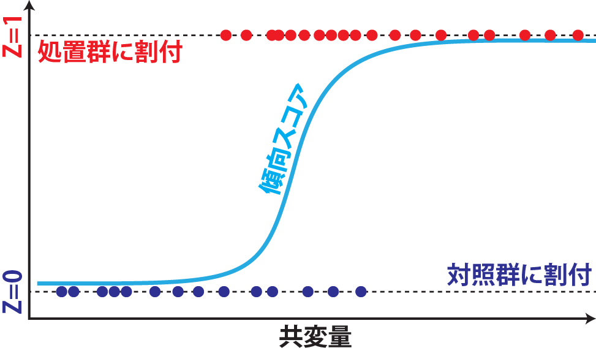](./image/propensity_score.png "傾向スコア（propensity score）")

傾向スコア（propensity score）

この回帰の結果を各データに適応すると、そのデータに対応する傾向スコアを計算することができます。この方法で計算した傾向スコアは、**「共変量から推定した、処置群に割り付けられる確率」**に相当します。この傾向スコアが同程度のデータでは、おおよそ共変量による割付への影響が同程度であると評価することができます。つまり、共変量によって割付群が影響を受けていたとしても、傾向スコアが同程度同士の群を比較すると、無作為化に近いデータを取り扱うことになり、ATEを評価することができます。

傾向スコアの演算はシンプルで、30章で説明した`glm`関数を用いて計算することができます。以下の例では、`causaldata`パッケージ([Huntington-Klein and Barrett 2024](#ref-causaldata_bib))に含まれるデータセットである、`thornton_hiv`を少し加工したものを用いて、傾向スコアの演算を行っています。

`glm`関数では、目的変数（`~`の左側）に割付群（以下の例では`got`）、説明変数（`~`の右側）に共変量を指定します。2項分布ですので、`family`には`binomial`を指定します。

``` downlit
# probit回帰を用いることもある。probit回帰の場合、family = binomial("probit")を指定する
glm(got ~ distvct + age + tinc + any, family = binomial, data = hiv)
```

以下のように`predict`関数を用いることで、`glm`関数の演算結果から簡単に傾向スコアを計算することができます。

``` downlit
# glmの結果を変数に代入
propscore_f <- glm(got ~ distvct + age + tinc + any, family = binomial, data = hiv)

# predict関数で各データごとに傾向スコアを演算
predict(propscore_f, newdata = hiv) |> head()
```

            1         2         3         4         5         6 
    1.5959907 1.4957994 0.9756462 1.3533516 0.7169753 1.1705825 

## 49.10 傾向スコアマッチング

上で説明したマッチングのうち、「共変量が似ている」度合いを傾向スコアで評価してマッチングを行う方法のことを、**傾向スコアマッチング**と呼びます。傾向スコアは割付に影響を与えうる複数の共変量を1つにまとめたようなパラメータですので、もともとの共変量同士を比較するよりも簡単にマッチングを行うことができます。傾向スコアマッチングでペアとして取り出したデータを利用することでATEを評価することができます。

また、傾向スコアが同じぐらいのデータ同士をサブクラスに分けて評価する、**Subclassification（サブクラス化）**も傾向スコアを利用した解析として用いられています。

とはいえ、データ間で傾向スコアがぴったり一致する、ということはそれほどないでしょうし、傾向スコアが同じぐらいのデータが複数あれば、どれとどれをマッチングすればよいのかわからない場合もあります。また、傾向スコアを用いてもマッチングしなかったデータは解析からは取り除かれるので、マッチング後のデータ数は元データより少なくなります。

Rでは、**`MatchIt`パッケージ**([Ho et al. 2011](#ref-MatchIt_bib))を用いて傾向スコアマッチングやSubclassificationの手法を利用することができます。`MatchIt`パッケージを利用することで、うまく傾向スコアをマッチングし、全データから処置群と対照群のペアのデータを抽出することができます。

### 49.10.1 傾向スコアマッチング：MatchItパッケージ

`MatchIt`パッケージでは、傾向スコアを評価するためのformulaを`matchit`関数の引数とすることで、傾向スコアマッチングを行うことができます。この引数のformulaでは上記のglm関数のformulaと同じく、割付を目的変数、共変量を説明変数とします。

``` downlit
pacman::p_load(MatchIt)

# replace=TRUEを指定すると、対照群をマッチングに複数回使うことを許容する
match_hiv <- 
  matchit(got ~ distvct + age + tinc + any, data = hiv, distance = "glm", replace = TRUE)
```

#### 49.10.1.1 MatchIt：マッチングの評価

`matchit`関数の返り値を調べることで、マッチングの結果を評価することができます。まず、`summary`関数の引数に取ると、マッチング前とマッチング後の共変量のバランスを評価することができます。また、マッチング後のサンプル数についても表示されます。マッチングを行うと、マッチングしなかったデータ（Unmatched）はそれ以降の解析に使えなくなります。

``` downlit
summary(match_hiv)
```


    Call:
    matchit(formula = got ~ distvct + age + tinc + any, data = hiv, 
        distance = "glm", replace = TRUE)

    Summary of Balance for All Data:
             Means Treated Means Control Std. Mean Diff. Var. Ratio eCDF Mean
    distance        0.7493        0.5608          1.1894     0.5102    0.2493
    distvct         1.9561        2.1398         -0.1458     0.9797    0.0460
    age            33.9887       31.9874          0.1456     1.0628    0.0301
    tinc            1.2134        0.5439          0.7659     1.2817    0.2473
    any             0.8916        0.5322          1.1559          .    0.3594
             eCDF Max
    distance   0.3830
    distvct    0.0854
    age        0.0806
    tinc       0.3832
    any        0.3594

    Summary of Balance for Matched Data:
             Means Treated Means Control Std. Mean Diff. Var. Ratio eCDF Mean
    distance        0.7493        0.7493          0.0000     0.9974    0.0011
    distvct         1.9561        1.9462          0.0078     1.1527    0.0159
    age            33.9887       32.8058          0.0861     1.0474    0.0183
    tinc            1.2134        1.2335         -0.0230     0.8637    0.0210
    any             0.8916        0.8916         -0.0000          .    0.0000
             eCDF Max Std. Pair Dist.
    distance   0.0103          0.0027
    distvct    0.0468          0.9014
    age        0.0719          1.0318
    tinc       0.0509          0.4003
    any        0.0000          0.0000

    Sample Sizes:
                  Control Treated
    All            870.      1946
    Matched (ESS)  268.35    1946
    Matched        530.      1946
    Unmatched      340.         0
    Discarded        0.         0

> **TIP:**
>
> 傾向スコアマッチングでは、通常対照群のデータが多く、処置群のデータが少ない、という想定でマッチングを行うことになっています。しかし、上記の`hiv`のデータでは処置群（`got = 1`）が対照群（`got = 0`）よりも多いデータになっています。`matchit`関数にこのような処置群が多いデータを用いるとwarningが出ます。
>
> 上記の`matchit`関数では、Control群を複数のTreated群とマッチさせる、`replace=TRUE`を引数に指定しています。この`replace`引数を指定するとwarningは出なくなりますが、対照群のデータを複数回利用して評価してしまうので、ATEの評価における信頼区間を実際より狭めに評価してしまうことになります。また、同じデータを複数回用いるため、結果にバイアスが生じる原因ともなります。
>
> 上記の例では関数の紹介としてデータを準備したため、warningが出ないよう`replace=TRUE`を採用していますが、実際のデータ解析では使わないほうが良いでしょう。

マッチング前とマッチング後の共変量のバランスを図示する場合には、`summary`関数の返り値を`plot`関数の引数に取ります。白丸がマッチング前、黒丸がマッチング後の共変量のバランスを示しています。マッチングした後のデータではマッチング前よりも共変量のバランスが取れていることがわかります。

``` downlit
match_hiv |> summary() |> plot(abs = FALSE)
```

[](chapter49_files/figure-html/unnamed-chunk-24-1.png)

`matchit`関数の返り値を単に`plot`関数の引数に取る場合には、`type`引数によって表示される結果が変わります。`type=jitter`を指定すると、傾向スコアの分布をjitter plotで示してくれます。

``` downlit
plot(match_hiv, type = "jitter", interactive = FALSE)
```

[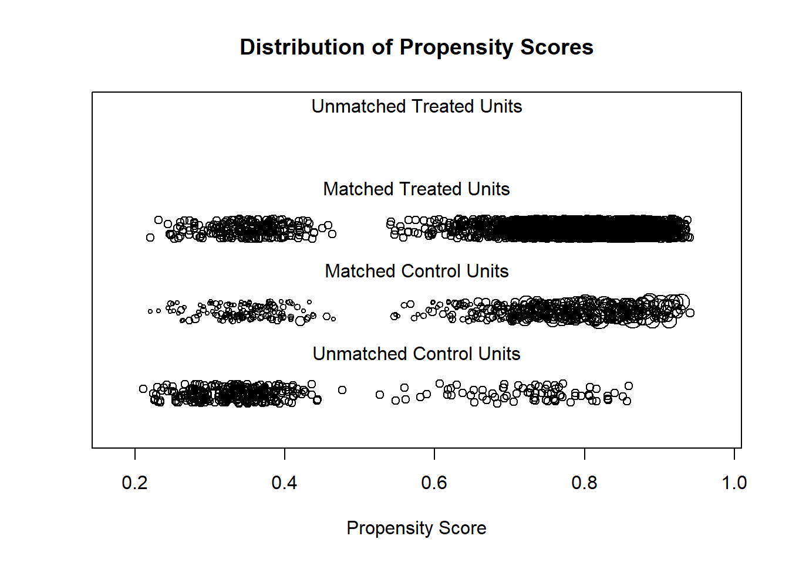](chapter49_files/figure-html/unnamed-chunk-25-1.png)

`type="density"`を指定すると、各共変量の分布を確率密度として表示してくれます。マッチングすることで、いずれの共変量も概ね同じような分布になっていることがわかります。

``` downlit
# 表示する共変量が3つ以上だとdeviceが2つになる（deviceが1つになるよう調整している）
plot(match_hiv2, type = "density", interactive = FALSE) 
```

[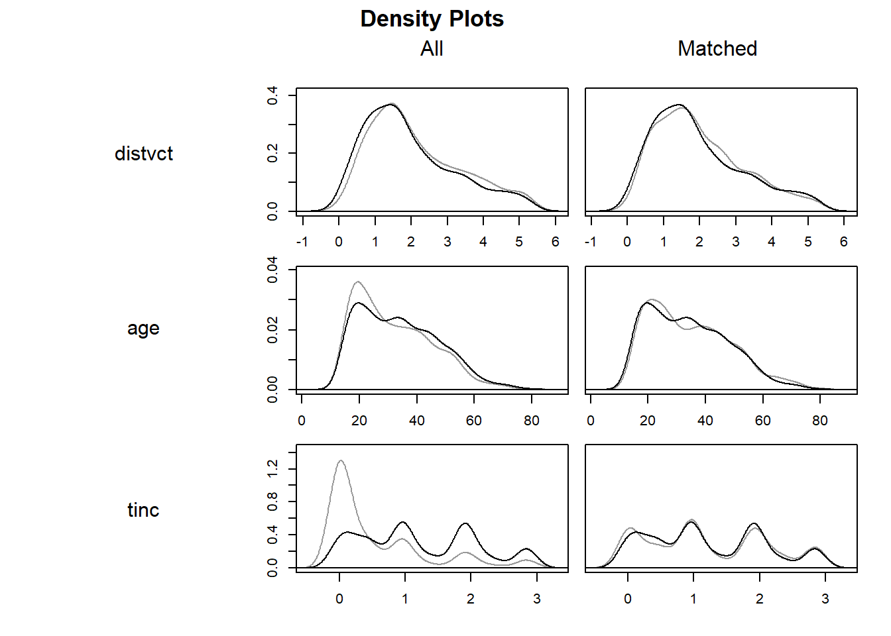](chapter49_files/figure-html/unnamed-chunk-27-1.png)

#### 49.10.1.2 MatchIt：マッチングの手法

マッチングでは、単に傾向スコアが似ているもの同士をペアにしていく、というわけにはいきません。傾向スコアが似ているデータが2つ以上ある場合もありますし、ある処置群のデータと同じ距離にある2つの対照群のうち、どちらとマッチングさせるか、ということでペアが変わることもあります。`MatchIt`では様々なマッチングの手法を準備することで最適なマッチングを選択できるようにしています。マッチングの手法は`method`引数に指定します。マッチングの手法とマッチングの結果について以下に示します。各マッチングの手法については、[`MatchIt`パッケージの解説ページ](https://kosukeimai.github.io/MatchIt/articles/matching-methods.html)に詳しく記載されています。

## Nearest Neighbor

最近傍法。`matchit`関数のデフォルトの手法。

``` downlit
match_nearest <- 
  matchit(
    got ~ distvct + age + tinc + any, 
    data = hiv, 
    method = "nearest", 
    distance = "glm",
    replace = TRUE)

match_nearest |> summary() |> _$nn
```

                   Control Treated
    All (ESS)     870.0000    1946
    All           870.0000    1946
    Matched (ESS) 268.3472    1946
    Matched       530.0000    1946
    Unmatched     340.0000       0
    Discarded       0.0000       0

``` downlit
match_nearest |> summary() |> plot(abs = FALSE)
```

[](chapter49_files/figure-html/unnamed-chunk-28-1.png)

## Optimal Pair

最近傍法と類似した方法。対照群が処置群より少ない時はあまりうまくいかない。`optmatch`パッケージ([Hansen and Klopfer 2006](#ref-optmatch_bib))をインストールする必要がある。

``` downlit
# optmatchパッケージが必要
match_optimal <- 
  matchit(
    got ~ distvct + age + tinc + any, 
    data = hiv, 
    method = "optimal", 
    distance = "glm") # replaceは使えない
```

    Warning: Fewer control units than treated units; not all treated units will get
    a match.

``` downlit
match_optimal |> summary() |> _$nn
```

                  Control Treated
    All (ESS)         870    1946
    All               870    1946
    Matched (ESS)     870     870
    Matched           870     870
    Unmatched           0    1076
    Discarded           0       0

``` downlit
match_optimal |> summary() |> plot(abs = FALSE)
```

[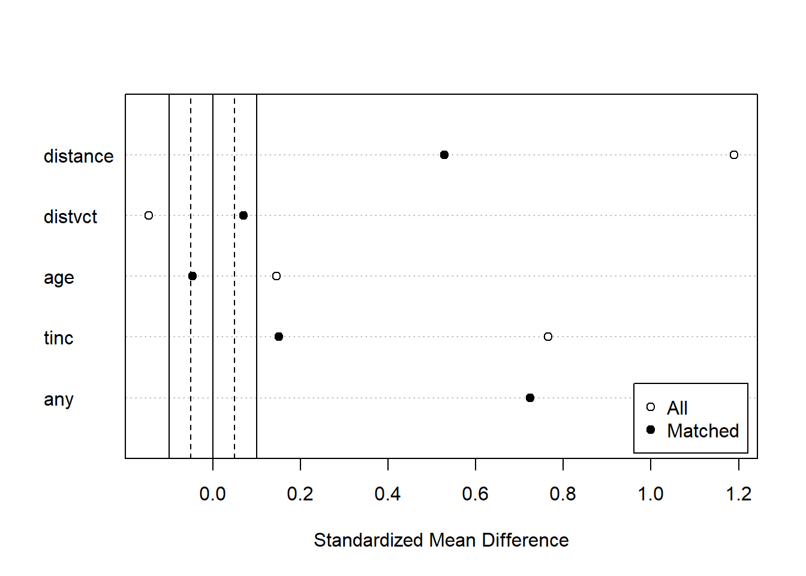](chapter49_files/figure-html/unnamed-chunk-29-1.png)

## Optimal Full Matching

対照群・処置群のそれぞれをサブクラスに分け、1つ以上の対象群・処置群を1つの処置群・対照群とマッチングさせる方法。`optmatch`パッケージ([Hansen and Klopfer 2006](#ref-optmatch_bib))、`quickmatch`パッケージ([Savje et al. 2024](#ref-quickmatch_bib))をインストールする必要がある。

``` downlit
match_full <- 
  matchit(
    got ~ distvct + age + tinc + any, 
    data = hiv, 
    method = "full", 
    distance = "glm") # replaceは使えない

match_full |> summary() |> _$nn
```

                   Control Treated
    All (ESS)     870.0000    1946
    All           870.0000    1946
    Matched (ESS) 245.1812    1946
    Matched       870.0000    1946
    Unmatched       0.0000       0
    Discarded       0.0000       0

``` downlit
match_full |> summary() |> plot(abs = FALSE)
```

[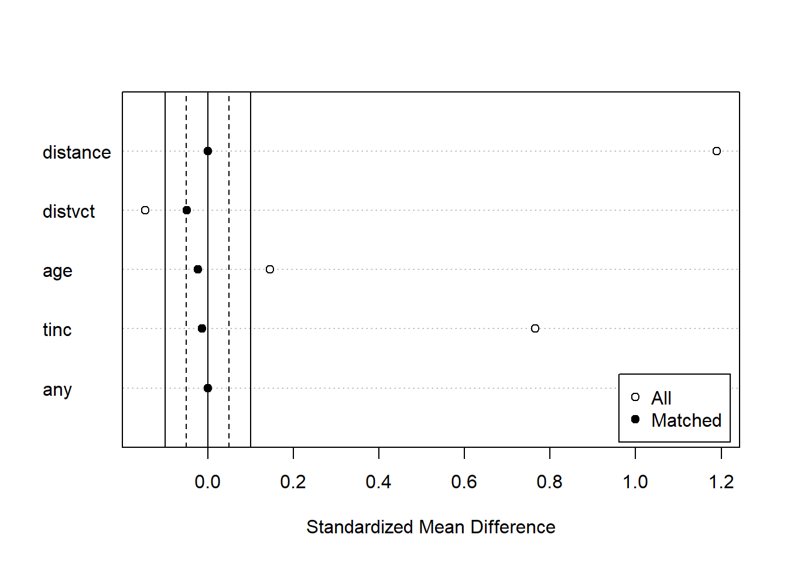](chapter49_files/figure-html/unnamed-chunk-30-1.png)

## Generalized Full Matching

Full Matchingの一種で、演算の速いアルゴリズムを用いる方法。`optmatch`パッケージ([Hansen and Klopfer 2006](#ref-optmatch_bib))、`quickmatch`パッケージ([Savje et al. 2024](#ref-quickmatch_bib))をインストールする必要がある。

``` downlit
match_quick <- 
  matchit(
    got ~ distvct + age + tinc + any, 
    data = hiv, 
    method = "quick", 
    distance = "glm") # replaceは使えない

match_quick |> summary() |> _$nn
```

                   Control Treated
    All (ESS)     870.0000    1946
    All           870.0000    1946
    Matched (ESS) 314.1711    1946
    Matched       870.0000    1946
    Unmatched       0.0000       0
    Discarded       0.0000       0

``` downlit
match_quick |> summary() |> plot(abs = FALSE)
```

[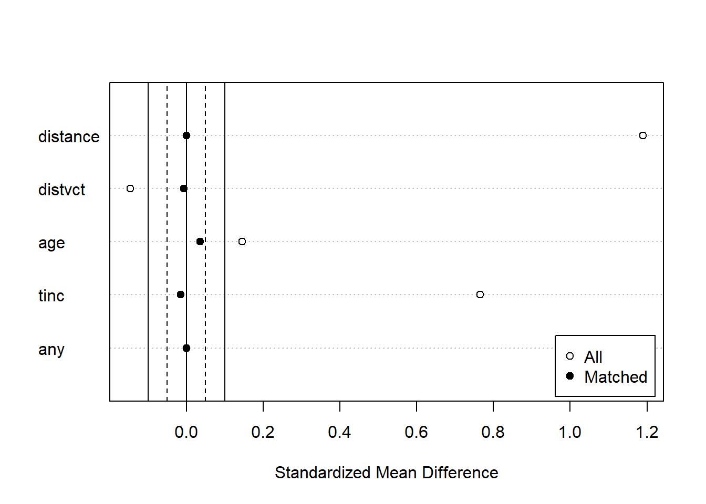](chapter49_files/figure-html/unnamed-chunk-31-1.png)

## Genetic Matching

最近傍法に遺伝的アルゴリズムを用いたような手法。`Matching`パッケージ([Diamond and Sekhon 2013](#ref-Matching_bib))、`rgenoud`パッケージ([Mebane, Jr. and Sekhon 2011](#ref-rgenoud_bib); [Sekhon and Mebane, Jr. 1998](#ref-rgenoud_bib2))を使用する。

``` downlit
# Matching、rgenoudパッケージが必要、すごく時間がかかる
match_genetic <- 
  matchit(
    got ~ distvct + age + tinc + any, 
    data = hiv, 
    method = "genetic", 
    distance = "glm",
    replace = TRUE)

match_genetic |> summary() |> _$nn
```

                   Control Treated
    All (ESS)     870.0000    1946
    All           870.0000    1946
    Matched (ESS) 293.8783    1946
    Matched       568.0000    1946
    Unmatched     302.0000       0
    Discarded       0.0000       0

``` downlit
match_genetic |> summary() |> plot(abs = FALSE)
```

[](chapter49_files/figure-html/unnamed-chunk-32-1.png)

## Exact Matching

層別マッチングの一種で、同一の共変量値を持つデータのみが同じサブクラスに割り当てられるようにする手法。一致しないとデータはUnmatchedとして取り除かれる。`Matching`パッケージ([Diamond and Sekhon 2013](#ref-Matching_bib))、`rgenoud`パッケージ([Mebane, Jr. and Sekhon 2011](#ref-rgenoud_bib); [Sekhon and Mebane, Jr. 1998](#ref-rgenoud_bib2))を使用する。

``` downlit
# Matching、rgenoudパッケージが必要
match_exact <- 
  matchit(
    got ~ distvct + age + tinc + any, 
    data = hiv, 
    method = "exact", 
    distance = "glm") # replaceは使えない

match_exact |> summary() |> _$nn # 5つしかMatchしない
```

                  Control Treated
    All (ESS)         870    1946
    All               870    1946
    Matched (ESS)       5       5
    Matched             5       5
    Unmatched         865    1941
    Discarded           0       0

``` downlit
match_exact |> summary() |> plot(abs = FALSE)
```

[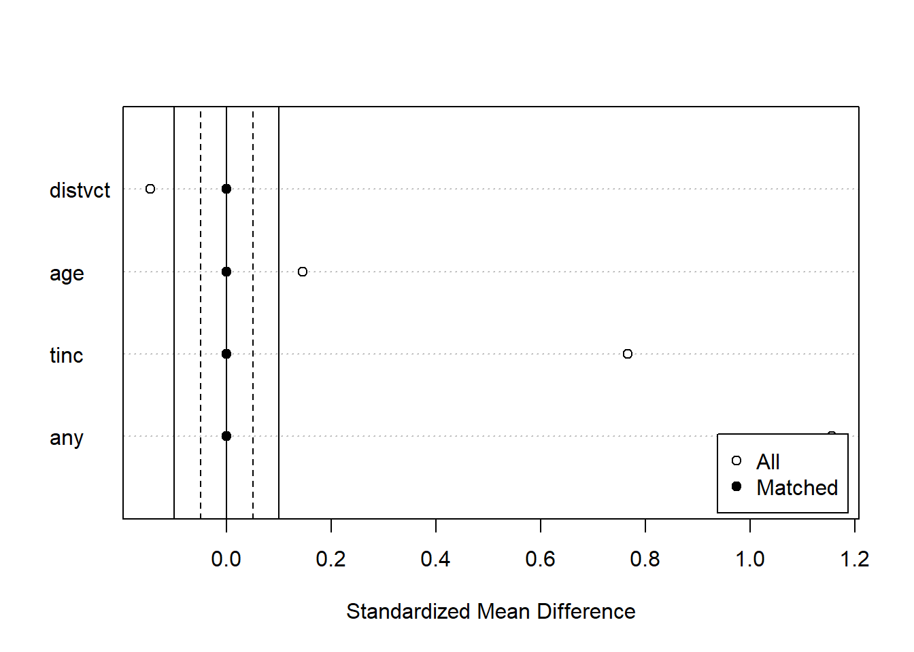](chapter49_files/figure-html/unnamed-chunk-33-1.png)

## Coarsened Exact Matching

Exact Matchingと同様の層別マッチングの一種で、Exact Matchingよりは少し「粗い」共変量をマッチングし、同じサブクラスに当てはめる方法。

``` downlit
match_cem <- 
  matchit(
    got ~ distvct + age + tinc + any, 
    data = hiv, 
    method = "cem", 
    distance = "glm",
    replace = TRUE)

match_cem |> summary() |> _$nn
```

                  Control Treated
    All (ESS)     870.000    1946
    All           870.000    1946
    Matched (ESS) 321.017     919
    Matched       687.000     919
    Unmatched     183.000    1027
    Discarded       0.000       0

``` downlit
match_cem |> summary() |> plot(abs = FALSE)
```

[](chapter49_files/figure-html/unnamed-chunk-34-1.png)

## Subclassification

傾向スコアを用いる方法ではマッチングだけではなく、Subclassification（サブクラス化）を行って評価する場合もあります。このSubclassificationでは、傾向スコアが似ているデータ同士を同じサブクラスに登録し、サブクラス内でそれ以降の解析を行うものです。MatchItパッケージでSubclassificationを用いる時には、`method="subclass"`を指定します。

Subclassificationはより粗いExact Matchingの一種で、概ね等間隔の傾向スコアの範囲でクラス分けします。デフォルトのサブクラス数は6つで、`subclass`引数でサブクラス数を、`min.n`で各サブクラスに所属する最小のデータ数を指定することができます。

``` downlit
# サブクラス化。デフォルトでは6層に分ける
match_subclass <- 
  matchit(
    got ~ distvct + age + tinc + any, 
    data = hiv, 
    method = "subclass", 
    distance = "glm"
    )

match_subclass |> summary(subclass = TRUE) |> plot(abs = FALSE)
```

[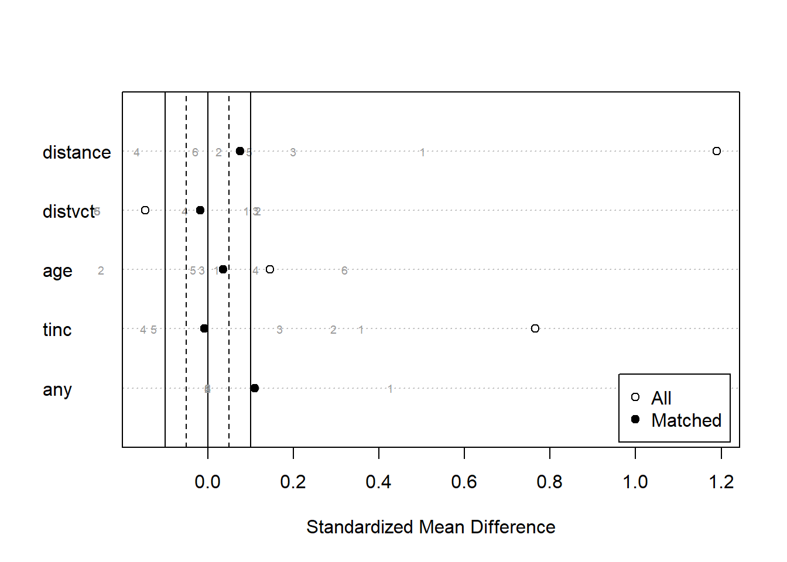](chapter49_files/figure-html/unnamed-chunk-35-1.png)

> **TIP:**
>
> サブクラス化（Subclassification）と似た言葉に**層別化（Stratification）**というのもありますが、こちらは性別や年齢のカテゴリごとに分けてデータを解析することを指し、少し意味が違います。サブクラス化では、単に傾向スコアが近いもの同士のATEを評価するのに対し、層別化は女性、男性それぞれの傾向やATEの違いを評価するのに用います。

## Cardinality and Profile Matching

Cardinality and Profile Matchingはどちらかというと重みづけに近い手法で、重みが1か0となるもの。

``` downlit
# highパッケージが必要
match_cardinality <- 
  matchit(
    got ~ distvct + age + tinc + any, 
    data = hiv, 
    method = "cardinality", 
    distance = "glm"
    )

# バランスを取るわけではない
match_cardinality |> summary(subclass = TRUE) |> plot(abs = FALSE)
```

[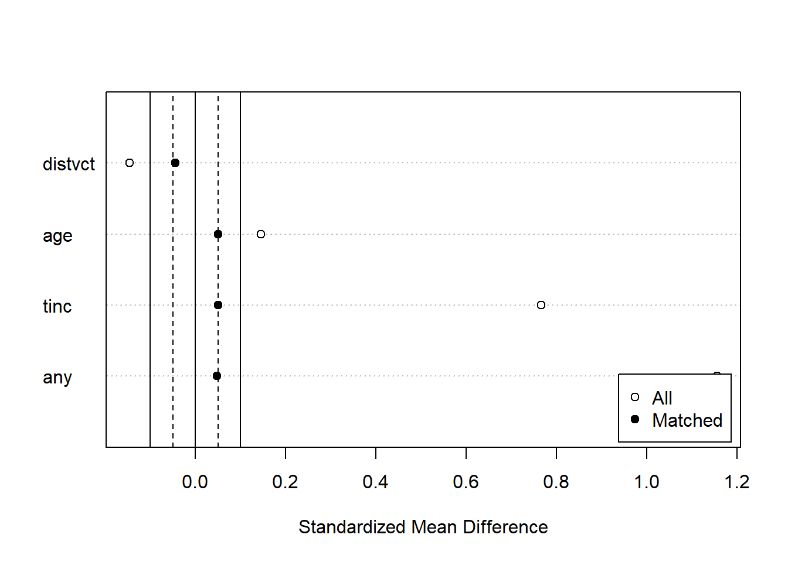](chapter49_files/figure-html/unnamed-chunk-36-1.png)

### 49.10.2 MatchIt：マッチング後の解析

マッチング後のデータからは、`match_data`関数でマッチングしたデータのみを含むデータフレームを呼び出すことができます。このデータフレームを`data`として、`lm`や`glm`などの線形回帰の手法を用いれば、通常の回帰と同様に処置の効果を評価することができます。

このマッチング後のデータはデータフレームとして取り扱うことができ、共変量をすべて含んでいます。ですので、回帰を行う場合には、傾向スコアの演算に用いた共変量を含めて回帰のモデルとすることも、取り除いて回帰のモデルとすることもできます。以下は傾向スコアの演算に用いた共変量（`age`、`tinc`）を加えた場合の回帰の結果です。

``` downlit
# matchingしたオブジェクトからマッチング後のデータを取り出す
md <- match_data(match_hiv) 

# マッチング後のデータを回帰に用いる
glm(
  cdm ~ got + age + tinc + hiv2004,
  data = md,
  family = poisson
)
```


    Call:  glm(formula = cdm ~ got + age + tinc + hiv2004, family = poisson, 
        data = md)

    Coefficients:
    (Intercept)          got          age         tinc      hiv2004  
        -0.8119       3.4456      -0.1111      -0.2153       2.0949  

    Degrees of Freedom: 2475 Total (i.e. Null);  2471 Residual
    Null Deviance:      2990 
    Residual Deviance: 618.1    AIC: 2775

次に、傾向スコアの演算に用いた共変量は取り除いて演算した場合を示します。傾向スコアを評価した際に用いた共変量に関してはすでに調整済みであるはずですので、回帰のモデルからは取り除いたほうがよいでしょう。

``` downlit
# HIV陽性であるか（hiv2004）はHIV検査（got）の前にはわからないので、傾向スコアの評価には使っていない
glm(
  cdm ~ got + hiv2004, 
  data = md,
  family = poisson
)
```


    Call:  glm(formula = cdm ~ got + hiv2004, family = poisson, data = md)

    Coefficients:
    (Intercept)          got      hiv2004  
         -3.806        3.284        1.439  

    Degrees of Freedom: 2475 Total (i.e. Null);  2473 Residual
    Null Deviance:      2990 
    Residual Deviance: 2092     AIC: 4245

> **TIP:**
>
> 傾向スコアというロジスティック回帰の結果を用いて、傾向スコアが一致するデータ同士を比較すれば、ATEを評価可能である、というのが、[RosenbaumとRubinの論文](https://www.researchgate.net/publication/243082748_The_Central_Role_of_the_Propensity_Score_in_Observational_Studies_For_Causal_Effects)([Rosenbaum and Rubin 1983](#ref-rosenbaum1983central))の結論なのですが、「なぜ傾向スコアを用いればいいのか」についてはかなりわかりにくいと思います。ですので、Rosenbaumの論文([Rosenbaum and Rubin 1983](#ref-rosenbaum1983central))について簡単に説明しておこうと思います。
>
> Rosenbaumの論文([Rosenbaum and Rubin 1983](#ref-rosenbaum1983central))に記載されている通り、傾向スコアを用いる手法の要点は以下の4つです。
>
> - 傾向スコアは**balancing score**である
> - 傾向スコアはbalancing scoreの中で最も「粗い（coarsest）」ものである
> - balancing scoreが一致するデータは、共変量\\x\\の下でバランスが取れているとみなせる
> - どのようなbalancing scoreにおいても、「**強く無視できる割付**」を仮定できるbalancing scoreの下では処置群（treatment）と対照群（control）の差はATEであるとみなせる
>
> …まあ、わかりにくいわけですが、balancing scoreの中で最も「粗い」傾向スコアが一致するデータは、共変量\\x\\の下でもバランスが取れている、つまり無作為化に近い状況にあるから、無作為化と同様に処置群と対照群の間の差はATEとみなせる、ということです。
>
> ### Large sample theory
>
> このRosenbaumの論文([Rosenbaum and Rubin 1983](#ref-rosenbaum1983central))には、Large sample theoryとSmall sample theoryの2つについて記載されているのですが、Large sample theoryがわかれば傾向スコアについて大体理解はできるかと思います。Small sample theoryに関しては論文を参照して下さい。
>
> #### ATTとATE
>
> ここで、上で説明したATEについて簡単に説明します。研究で評価したいものは、Average Treatment Effect、つまりATEです。ATEは処置群（\\r_1\\）と対照群（\\r_0\\）の結果の平均値の差ですので、以下の式で表すことができます。
>
> \\E(r_1)-E(r_0)\\
>
> ただし、通常我々が観察できるのは、割付の条件の下での結果の平均値の差です。要は処置群の結果は処置群に割り当てた群から、対照群の結果は対照群に割り当てた群から得られるということです。ATEとは異なり、測定から得られた結果は条件付きの平均値の差として表現できます。
>
> \\E(r_1\|Z=1) - E(r_0\|Z=0)\\
>
> \\Z=1\\は処置群、\\Z=0\\は対照群への割付を意味します。割付を無作為化した場合、割付や結果に影響を与えうるすべての共変量\\x\\の下で、処置の結果（\\r_1\\、\\r_2\\）は割付\\Z\\から独立になります。以下の式の\\\perp\\は独立を示す記号です。
>
> \\(r_1, r_0) \perp Z \| x\\
>
> 独立、というのは意味が分かりにくいんですが、要は\\r_1\\、\\r_0\\が\\Z\\の条件に依存していない、ということです。このため、上の式は以下の2つの式と同じ意味を持ちます。\\E(r_i\|Z=i)=E(r_i)\\が成り立つので、上で示した測定結果の差とATEは等しい、つまり無作為化すればATEを評価できるということを意味しています。
>
> \\E(r_1\|Z=1)=E(r_1)\\ \\E(r_0\|Z=0)=E(r_0)\\
>
> 一部の共変量\\\nu\\について、以下が成り立つとします。これは上の式でのすべての共変量\\x\\を\\\nu\\に置き換えただけです。
>
> \\(r_1, r_0) \perp Z \| \nu\\
>
> また、割付は0～1の間の確率を取って、0や1にはならない、とします。
>
> \\0\<Pr(Z=1\|\nu)\<1\\
>
> \\\nu\\が割付の条件においてすべての共変量\\x\\と同じであるとみなすことができれば（\\\nu=x\\）、**強く無視できる割付（treatment assignment is strongly ignorable）**であると言えます。この「強く無視できる割付」については論文のあちこちに出てきますが、要は「割付を説明するのに必要十分な共変量が\\\nu\\に含まれる」、割付に影響を与えうる共変量が\\\nu\\にすべて含まれるということを意味しているようです。詳しくは[別の文献](https://www.niph.go.jp/journal/data/55-3/200655030007.pdf)を参照するとよいでしょう([星野崇宏 and 岡田謙介 2006](#ref-hoshino2006))。
>
> この「強く無視できる割付」が成立しているような\\\nu\\のことをbalancing scoreと呼ぶようです。balancing scoreはマッチングに用いられるパラメータのことで、balancing scoreが一致するデータ同士を比較すれば、無作為化と同じく、測定結果の差とATEが同一であるとみなせるわけです。
>
> #### 傾向スコア
>
> 傾向スコア\\e(x)\\の定義は、共変量\\x\\が与えられた時、処置群(treatment、\\Z=1\\)に割りつけられる確率ですので、以下の式で表すことができ、\\e(x)\\は[30章](chapter30.llms.md#目的変数が二項分布の場合)で説明したロジスティック回帰で求めることができます。
>
> \\e(x)=Pr(Z=1\|x)\\
>
> 共変量\\x\\に「強く無視できる割付」が成立するのであれば、ある傾向スコア（\\e(x)\\）の値の下で、割付（\\Z\\）と共変量（\\x\\）は独立になります。つまり、傾向スコアが同じデータ同士であれば、処置群と対象群への割付については共変量\\x\\に依存しない、ということです。
>
> \\Z \perp x\|e(x)\\
>
> 傾向スコアを別のbalancing score（\\b(x)\\）に置き換えても上式は成立します。これが成立することがbalancing scoreの条件の一つとなるようです。
>
> \\Z \perp x\|b(x)\\
>
> 傾向スコア\\e(x)\\は1サンプルに1つの値、共変量\\x\\は1サンプルにつき複数あるのが普通ですので、\\e(x)\\はより「粗い（coarse）」、\\x\\は「最も細かい（finest）」パラメータであると言えます。\\b(x)\\は1つの値に集約できるほど粗くはない、つまり\\x\\と\\e(x)\\の中間の「粗さ」を持つと考えると、以下の式が成立します。
>
> \\e(x)=f(b(x))\\
>
> 傾向スコア\\e(x)\\は定義より以下の式で示されるので、
>
> \\e(x)=Pr(Z=1\|x)\\
>
> 以下も成立します。
>
> \\e(x)=Pr(Z=1\|b(x))=E(e(x)\|b(x))\\
>
> \\e(x)\\よりも\\b(x)\\の方が細かいとすると、以下も成立します。
>
> \\E(e(x)\|b(x))=e(x)\\
>
> 逆に\\e(x)\\よりも\\b(x)\\の方が「粗い」場合、以下のような\\x_1\\、\\x_2\\が存在します。粗い（coarse）、細かい（fine）という言葉が何を意味しているのか分かりにくいのですが、以下が粗い、細かいの定義になっているようです。
>
> \\e(x_1) \neq e(x_2)\\ \\b(x_1)=b(x_2)\\
>
> こちらが成り立つとすると、\\e(x)\\の定義より、
>
> \\Pr(Z=1\|x_1) \neq Pr(Z=1\|x_2)\\
>
> となりますが、\\b(x)\\では、
>
> \\Pr(Z=1\|b(x_1)) = Pr(Z=1\|b(x_2))\\
>
> が成立します。ただし、この場合には\\b(x)\\の下で割付群\\Z\\が\\x_1\\、\\x_2\\という共変量による影響を受けている、つまり\\Z \perp x\| b(x)\\というbalancing scoreとしての条件から外れてしまうので、\\b(x)\\はbalancing scoreではない、ということになります。よって、balancing scoreの中で傾向スコア\\e(x)\\は最も粗い（coarsest）スコアである、ということになります。
>
> また、\\Z \perp x\|e(x)\\なので、ある\\e(x)\\において、割付（\\Z\\）は共変量\\x\\とは独立である、つまり\\e(x)\\が同じなら、割付における共変量の影響を無視できる、ということになります。なので、\\e(x)\\が同じであれば、無作為化の結果と同じ条件である\\(r_1, r_0) \perp Z \| e(x)\\が成り立つ、つまり測定結果の差とATEが一致するということになります。
>
> 従って、傾向スコア\\e(x)\\は最も粗いbalancing scoreであり、\\e(x)\\でマッチングすればATEを評価できる、というのがRosenbaumの論文([Rosenbaum and Rubin 1983](#ref-rosenbaum1983central))の結論になります。論文では、\\e(x)\\によるマッチングの他に、サブクラス解析、回帰による共変量の調整についても説明されています。傾向スコアを用いる前に一度論文に目を通してみることをおススメします。

> **TIP:**
>
> 傾向スコアの手法では、一般化線形モデル（ロジスティック回帰）を用いて傾向スコアを計算します。30章で説明した通り、一般化線形モデルの重回帰では、[モデル選択](chapter30.llms.md#aicによるモデル選択)を行うことがあります。
>
> ただし、モデル選択はどちらかというと予測的な回帰で用いるものであること、傾向スコアでのマッチングでは「強く無視できる割付」が条件となっていることから、基本的に傾向スコアを求めるときにはモデル選択は行わず、割付に影響を及ぼしうる共変量はすべて回帰の説明変数とした方がよいです。
>
> 下で説明する傾向スコアによる重み付け（IPW）に関する論文には、「割付に影響を及ぼす共変量」ではなく、「結果に影響を及ぼす共変量」や「交絡因子」を傾向スコア計算のモデルに加えたほうがよいと書かれています([Austin and Stuart 2015](#ref-austin2015moving))。

## 49.11 逆確率重み付け法（Inverse Probability Weighting、IPW）

傾向スコアを用いてマッチングするのが傾向スコアマッチングですが、マッチングするとすべてのデータを利用することはできず、マッチングしなかったデータは破棄することになります。せっかく取ったデータを破棄すると、ATEを評価できるとしてもその標準誤差は大きくなりますし、検出力は小さくなります。できれば使えるデータは破棄することなく、すべて用いたいところです。また、マッチングでは必ず対照群・処置群の2つをペアにすることが必要で、3つ以上の割付群（例えば、肥料を多い・中間・少ないの3段階とする場合）がある場合には、2つずつのペアを作成して比較するしかありません。

マッチングではなく、傾向スコアを使って**重みづけ回帰**を行い、ATEを評価する手法のことを**逆確率重み付け法（Inverse Probability Weighting、IPW）**と呼びます。IPWでは重み付け回帰とすることでデータをすべて用いつつ、ATEを推定することができます。また、IPWでは3つ以上の群への割付を行った場合についても処置の効果を評価することができます。

IPWで用いる重みは以下の式で表されます。

\\w = \frac{Z}{e(x)} + \frac{1-Z}{1-e(x)}\\

\\w\\は重み、\\Z\\は割付（\\Z=1\\は処置群への割付、\\Z=0\\は対照群への割付）、\\e(x)\\は傾向スコアです。上の式はやや複雑そうに見えますが、処置群の場合には、

\\w = \frac{1}{e(x)}\\

となり、処置群に割付される確率（\\e(x)\\）の逆数で重み付けすることになります。

対照群の場合には、重みは以下の通りとなります。

\\w=\frac{1}{1-e(x)}\\

ですので、対照群では対照群に割付される確率（\\1-e(x)\\）の逆数で重み付けする形になります。要は、処置群では処置群への割付確率、対照群では対照群への割付確率で割ることで、割付が偏る効果を無視できるようにしましょう、というだけのものです。

また、重みを以下のように設定すると、ATEではなく、ATTを評価することもできます([Austin and Stuart 2015](#ref-austin2015moving))。

\\w\_{ATT}=Z+\frac{(1-Z) \cdot e(x)}{1-e(x)}\\

#### 49.11.0.1 WeightItパッケージ

RでIPWの演算を行う場合、上記のように傾向スコアを`glm`関数から計算し、各データの重みを演算した後、`lm`関数や`glm`関数の重み（`weight`引数）に指定すれは計算することができます。

しかし、やや手間がかかる上に、共変量の調整の程度などを評価するのも大変です。ですので、ここではIPWを含めた重み付け回帰のパッケージである`WeightIt`パッケージ([Greifer 2025b](#ref-WeightIt_bib))を利用したIPWについて簡単に説明します。`WeightIt`パッケージでは、共変量の調整の評価に`cobalt`パッケージ([Greifer 2025a](#ref-cobalt_bib))を用います。

`WeightIt`パッケージでは、`weightit`関数を用いて重みを演算します。`weightit`関数では、`matchit`関数と同様に割付群（以下の例では`got`）を目的変数とし、共変量を説明変数としたformulaを指定します。`method`引数には傾向スコアを演算する手法を指定し（以下の例では`glm`）、`estimand`引数には最終的に評価するもの（`"ATE"`や`"ATT"`）を指定します。

``` downlit
pacman::p_load(WeightIt, cobalt)

W <- weightit(got ~ distvct + age + tinc + any, method = "glm", data = hiv, estimand = "ATE")
```

`weightit`関数で計算した重みについて、`cobalt`パッケージの`bal.tab`関数を用いることで共変量の調整に関して評価することができます。Effective sample sizesのうち、Adjustedの数値がなるべく大きくなるような手法（`method`）を`weightit`関数で用いるとよい、とされているようです。

``` downlit
bal.tab(W)
```

    Balance Measures
                   Type Diff.Adj
    prop.score Distance  -0.0074
    distvct     Contin.  -0.0104
    age         Contin.   0.0173
    tinc        Contin.  -0.0415
    any          Binary  -0.0010

    Effective sample sizes
               Control Treated
    Unadjusted  870.   1946.  
    Adjusted    582.97 1702.48

また、`summary`関数を用いて、重み付けを評価することもできます。対照群の重みには17ぐらいとやや大きめのものがあるようです。IPWでは、傾向スコアが大きすぎる・小さすぎるものでは重みが極端になり、評価結果に影響を及ぼすことがあります。

``` downlit
summary(W)
```

                      Summary of weights

    - Weight ranges:

              Min                                  Max
    treated 1.063 |----|                         4.534
    control 1.268 |---------------------------| 16.888

    - Units with the 5 most extreme weights by group:
                                               
               2352    452    831   2359   2118
     treated  4.033  4.062  4.095  4.321  4.534
               1502    140   2529   2172    321
     control 13.053 13.146 13.821 14.249 16.888

    - Weight statistics:

            Coef of Var   MAD Entropy # Zeros
    treated       0.378 0.233   0.057       0
    control       0.702 0.532   0.205       0

    - Effective Sample Sizes:

               Control Treated
    Unweighted  870.   1946.  
    Weighted    582.97 1702.48

### 49.11.1 WeightIt：効果を評価する

`WeightIt`での重み付け回帰の演算には、`WeightIt`パッケージに準備されている専用の回帰の関数を用います。今回のように回帰（線形・一般化線形モデル）を用いる場合には、`lm_weightit`関数や`glm_weightit`関数を用いて回帰の計算を行います。

`WeightIt`パッケージでの回帰には`lm_weightit`関数や`glm_weightit`関数の他に、割付が3群以上の場合に用いる`multinom_weightit`関数や、生存解析における重み付け回帰に用いる`coxph_weightit`関数などがあります。

`lm_weightit`関数や`glm_weightit`関数の引数は`lm`や`glm`関数とほぼ同じですが、重みを指定する引数`weightit`に`weightit`関数の返り値を指定します。回帰の結果を`summary`関数の引数とすることで、結果の要約を表示することができます。

``` downlit
fit <- 
  glm_weightit(
    cdm ~ got + hiv2004, 
    data = hiv, 
    weightit = W, 
    family = poisson)

summary(fit, ci = TRUE) # ciは信頼区間の表示に関する引数
```


    Call:
    glm_weightit(formula = cdm ~ got + hiv2004, data = hiv, family = poisson, 
        weightit = W)

    Coefficients:
                Estimate Std. Error z value Pr(>|z|)   2.5 %  97.5 %    
    (Intercept)  -3.9303     0.2404  -16.35   <1e-06 -4.4014 -3.4592 ***
    got           3.4748     0.2463   14.11   <1e-06  2.9920  3.9575 ***
    hiv2004       1.4661     0.0729   20.11   <1e-06  1.3232  1.6089 ***
    Standard error: HC0 robust (adjusted for estimation of weights)

## 49.12 2重ロバスト法（Doubly Robust Methods）

IPWは傾向スコアで重み付けする方法ですが、傾向スコアが1に近い時（ほとんど処置群に割付される場合）や0に近い時（ほとんど対象群に割付される場合）には、評価するATEのばらつきが大きくなるという特徴があります。また、傾向スコア自体の信頼性が低く、傾向スコアで重み付けしても正しい結果を得られない場合もあります。

このIPWの問題に対応するための手法の一つが、**2重ロバスト法（Doubly Robust Methods）**です。2重ロバスト法にはAIPW（Argumented Inverse Probability Weighting）とTMLE（Targeted Maximum Likelihood Estimation）という2つの手法がありますが、どちらも最終的には以下で説明するAIPWと同じように、**IPW・線形回帰による調整の2つで評価した結果のうち、信頼性が高いものをATEとして採用する**形となっています。

2重ロバスト法（AIPW）では、ATEを[以下の式](https://journals.sagepub.com/doi/10.1177/0272989X211027181)で求めます([Kurz 2022](#ref-kurz2022augmented))。

\\\hat{C}\_{AIPW}(X_n)=(\frac{Z_nY_n}{e(x_n)}-\frac{Z_n-e(x_n)}{e(x_n)}f(1, x_n))-(\frac{(1-Z_n)Y_n}{1-e(x_n)}-\frac{Z_n-e(x_n)}{1-e(x_n)}f(0, x_n))\\ \\\hat{\tau}\_{ATE}^{AIPW}=\frac{1}{N}\Sigma\_{i=1}^{N}\hat{C}\_{AIPW}(X_i)\\

\\\hat{C}\_{AIPW}(X_i)\\の式の前半の項は処置群の結果（\\r_1\\）、後半の項は対照群の結果（\\r_0\\）を示しています。カッコの中の\\\frac{Z_nY_n}{e(x_n)}\\や\\\frac{(1-Z_n)Y_n}{1-e(x_n)}\\の部分はIPWと同じものになります。2重ロバスト法では、その後で引き算をしているところがIPWとは異なります。このうち、\\f(1, x_n)\\や\\f(0, x_n)\\の部分は、IPWではなく、上で説明した線形回帰による共変量の調整（重回帰に共変量を加える）による結果を表しています。

かなり式が複雑でわかりにくいのですが、傾向スコアの信頼性が高いときには前のIPWの項が、傾向スコアの信頼性が低いときには後ろの項である\\f(1, x_n)\\や\\f(0, x_n)\\がATEの推定値に大きく寄与する形となっていて、**「傾向スコア」・「線形回帰による共変量の調整」のどちらかの信頼性が高ければATEがうまく推定できる**（つまり、2重に頑健（Robust）である）ものになっています。

### 49.12.1 2重ロバスト法：AIPWパッケージ

Rで2重ロバスト法の計算を行う場合、TMLEでの演算を行う`tmle`パッケージ([Gruber and van der Laan 2012](#ref-tmle_bib))や`tmle3`パッケージ([Coyle 2025](#ref-tmle3_bib))、AIPWでの演算を行う`CausalGAM`([Glynn and Quinn 2017](#ref-CausalGAM_bib))や`npcausal`([Kennedy 2025](#ref-npcausal_bib))などのパッケージを用います。

ここでは、これらのRのパッケージのうち、`AIPW`パッケージ([Zhong et al. 2021](#ref-AIPW_bib))の使い方について簡単に説明します。`AIPW`は`SuperLearner`([Polley et al. 2024](#ref-SuperLearner_bib))という機械学習パッケージの機能を用い、クロスバリデーションを用いて2重ロバストな効果の推定値（ATE）を評価するパッケージです。

以下の例は`AIPW`パッケージの関数の例として示されているものです。この例では、`eager_sim_obs`というデータセットを用いて、AIPWの演算用のデータを準備しています。`eager_sim_obs`はEAGeR Study([Mone and McAuliffe 2015](#ref-mone2015preconception))という、アスピリンが妊娠の成功率に与える影響を評価した研究のデータで、各列の意味はそれぞれ以下の通りです。

| 列名              | 列の意味                                    |
|:------------------|:--------------------------------------------|
| sim_A             | シミュレートしたアウトカム                  |
| sim_Y             | シミュレートした割付群                      |
| eligibility       | eligibility（おそらく被験者としての適格性） |
| loss_num          | 以前の流産の回数                            |
| age               | 年齢                                        |
| time_try_pregnant | 妊活の年数                                  |
| BMI               | BMI                                         |
| meanAP            | 血圧                                        |

eager_sim_obsの各列について {.caption-top .table .table-sm .table-striped .small}

この[EAGeR Studyの結論](https://pubmed.ncbi.nlm.nih.gov/24702835/)は、「アスピリンは妊娠の成功率を良くするとは言えない」、ということだったようです。以下の例ではこの`eager_sim_obs`から、アウトカム（`sim_Y`の列）、割付（`Sim_A`の列）、共変量（`sim_Y`・`Sim_A`以外の列）をそれぞれ`outcome`、`exposure`、`covariates`の変数に代入しています。

``` downlit
pacman::p_load(AIPW, SuperLearner)

data("eager_sim_obs")
outcome <- eager_sim_obs$sim_Y # 目的変数
exposure <- eager_sim_obs$sim_A # 割付群
covariates <- as.matrix(eager_sim_obs[-1:-2]) # その他の共変量
```

次に、`AIPW`のオブジェクトを操作し、AIPWの演算を行っています。この`AIPW`パッケージは、[22章](chapter22.llms.md#rのクラスとアトリビュートattributes)でほんの少しだけ触れている`R6`オブジェクト([Chang 2021](#ref-R6_bib))を用いており、他のRの関数・パッケージと比較して演算の方法がやや特殊です。

`AIPW`では、まず`AIPW$new`メソッドを用いて、AIPWの演算に与えるデータを設定していきます。この`$new`は`R6`におけるメソッド、関数のようなもので、引数を取って指定します。引数として、`Y`に目的変数、`A`に割付、`W`に共変量を設定します。

`W`は1つの引数として指定することも、`W.Q`と`W.g`の2つの引数に分けて指定することもできます。`W.Q`はOutcome model（回帰における共変量の調整）に用いる共変量、`W.g`はExposure model（傾向スコアによる重み付け）に用いる共変量を意味しています。

同様に、`Q.SL.library`にはOutcome modelに用いる`SuperLearner`の演算の方法、`g.SL.library`にはExposure modelに用いる演算の方法を指定します。指定している`"SL.mean"`は処置群と対照群の差の平均値を求めるアルゴリズムを、`"SL.glm"`は一般化線形モデルを用いるアルゴリズムを指定しています。下記のように複数指定すると、`SuperLearner`の機能を用いて複数のモデルの重み付け回帰を行ってくれる仕組みになっています。

また、`k_split`はクロスバリデーションの手法（k-fold cross validation、[この記事（K-Fold交差検証についてのまとめ）などを参照](https://zenn.dev/yuto_mo/articles/c5b37a569d5673)）のkを指定しています。`verbose`は結果を表示するかどうかを指定する引数です。

``` downlit
AIPW_SL <- 
  AIPW$new(
    Y = outcome,
    A = exposure,
    W = covariates, 
    Q.SL.library = c("SL.mean","SL.glm"),
    g.SL.library = c("SL.mean","SL.glm"),
    k_split = 3,
    verbose = FALSE
    )
```

次に、生成したオブジェクトに`fit`メソッドを適用します。ただし、これだけでは何も起きないので、`summary`メソッドをさらに適用します。このとき、`AIPW`は2重ロバスト法の演算を行いますが、この演算の際には傾向スコアが極端な値を取るデータを取り除いて演算します。この取り除く範囲を指定する引数が`g.bound`で、下記のように`0.025`を指定すると、傾向スコアが上下2.5%のデータを取り除きます。

``` downlit
AIPW_SL$fit()

AIPW_SL$
  summary(g.bound = 0.025) # g.boundのデフォルト値は0.025
```

この`summary`メソッドも何も返さないため、結果を表示するためには、`$result`の名前で結果を呼び出す必要があります。以下の結果を見ると、Risk Difference（リスク差）が0.136で、Odds Ratioは1.79となっています。

``` downlit
AIPW_SL$result
```

                      Estimate         SE     95% LCL   95% UCL   N
    Risk of Exposure 0.4451237 0.04595855 0.355044947 0.5352025 118
    Risk of Control  0.3093048 0.05058911 0.210150148 0.4084595  82
    Risk Difference  0.1358189 0.06684521 0.004802299 0.2668355 200
    Risk Ratio       1.4391102 0.18563433 1.000181759 2.0706619 200
    Odds Ratio       1.7913660 0.28809423 1.018482508 3.1507583 200

もう少し詳しく2重ロバスト法やAIPWについて学びたい方は、[Causal Inference for The Brave and Trueの12章](https://matheusfacure.github.io/python-causality-handbook/12-Doubly-Robust-Estimation.html)([Alves 2022](#ref-causal_inference_for_brave_true))や[AIPWの論文](https://academic.oup.com/aje/article/190/12/2690/6322284)([Zhong et al. 2021](#ref-AIPW_bib))に目を通してみることをおすすめします。

Alves, Matheus Facure. 2022. *Causal Inference for the Brave and True*. <https://matheusfacure.github.io/python-causality-handbook/landing-page.html>.

Austin, Peter C, and Elizabeth A Stuart. 2015. “Moving Towards Best Practice When Using Inverse Probability of Treatment Weighting (IPTW) Using the Propensity Score to Estimate Causal Treatment Effects in Observational Studies.” *Statistics in Medicine* 34 (28): 3661–79.

Chang, Winston. 2021. *R6: Encapsulated Classes with Reference Semantics*. <https://CRAN.R-project.org/package=R6>.

Coyle, Jeremy. 2025. *tmle3: The Extensible TMLE Framework*. <https://doi.org/10.5281/zenodo.4603358>.

Cunningham, Scott. 2023. *因果推論入門 ミックステープ：基礎から現代的アプローチまで*. 単行本. <https://www.amazon.co.jp/dp/4297134179>.

Diamond, Alexis, and Jasjeet S. Sekhon. 2013. “Genetic Matching for Estimating Causal Effects: A General Multivariate Matching Method for Achieving Balance in Observational Studies.” *Review of Economics and Statistics* 95 (3): 932–45. <https://www.jsekhon.com>.

Glynn, Adam, and Kevin Quinn. 2017. *CausalGAM: Estimation of Causal Effects with Generalized Additive Models*. <https://doi.org/10.32614/CRAN.package.CausalGAM>.

Greifer, Noah. 2025a. *Cobalt: Covariate Balance Tables and Plots*. <https://doi.org/10.32614/CRAN.package.cobalt>.

Greifer, Noah. 2025b. *WeightIt: Weighting for Covariate Balance in Observational Studies*. <https://doi.org/10.32614/CRAN.package.WeightIt>.

Gruber, Susan, and Mark J. van der Laan. 2012. “tmle: An R Package for Targeted Maximum Likelihood Estimation.” *Journal of Statistical Software* 51 (13): 1–35. <https://www.jstatsoft.org/v51/i13/>.

Hansen, Ben B., and Stephanie Olsen Klopfer. 2006. “Optimal Full Matching and Related Designs via Network Flows.” *Journal of Computational and Graphical Statistics* 15 (3): 609–27.

Ho, Daniel E., Kosuke Imai, Gary King, and Elizabeth A. Stuart. 2011. “MatchIt: Nonparametric Preprocessing for Parametric Causal Inference.” *Journal of Statistical Software* 42 (8): 1–28. <https://doi.org/10.18637/jss.v042.i08>.

Huntington-Klein, Nick, and Malcolm Barrett. 2024. *Causaldata: Example Data Sets for Causal Inference Textbooks*. <https://doi.org/10.32614/CRAN.package.causaldata>.

Kennedy, Edward H. 2025. *Npcausal: Nonparametric Causal Inference Methods*. <https://github.com/ehkennedy/npcausal>.

Kurz, Christoph F. 2022. “Augmented Inverse Probability Weighting and the Double Robustness Property.” *Medical Decision Making* 42 (2): 156–67.

LaLonde, Robert J. 1986. “Evaluating the Econometric Evaluations of Training Programs with Experimental Data.” *The American Economic Review*, 604–20.

Mebane, Jr., Walter R., and Jasjeet S. Sekhon. 2011. “Genetic Optimization Using Derivatives: The rgenoud Package for R.” *Journal of Statistical Software* 42 (11): 1–26. <https://www.jstatsoft.org/v42/i11/>.

Mone, Fionnuala, and FM McAuliffe. 2015. *Preconception Low-Dose Aspirin and Pregnancy Outcomes: Results from the EAGeR Randomized Trial.*

Polley, Eric, Erin LeDell, Chris Kennedy, and Mark van der Laan. 2024. *SuperLearner: Super Learner Prediction*. <https://doi.org/10.32614/CRAN.package.SuperLearner>.

Rosenbaum, Paul R, and Donald B Rubin. 1983. “The Central Role of the Propensity Score in Observational Studies for Causal Effects.” *Biometrika* 70 (1): 41–55.

Sant’Anna, Pedro H. C., and Jun Zhao. 2020. “Doubly Robust Difference-in-Differences Estimators.” *Journal of Econometrics* 219: 101–22. <https://doi.org/10.1016/j.jeconom.2020.06.003>.

Savje, Fredrik, Jasjeet Sekhon, and Michael Higgins. 2024. *Quickmatch: Quick Generalized Full Matching*. <https://doi.org/10.32614/CRAN.package.quickmatch>.

Schloerke, Barret, Di Cook, Joseph Larmarange, et al. 2023. *GGally: Extension to ’Ggplot2’*. <https://CRAN.R-project.org/package=GGally>.

Sekhon, Jasjeet S., and Walter R. Mebane, Jr. 1998. “Genetic Optimization Using Derivatives: Theory and Application to Nonlinear Models.” *Political Analysis* 7: 189–213.

Textor, Johannes, Benito van der Zander, Mark S Gilthorpe, Maciej Liśkiewicz, and George TH Ellison. 2016. “Robust Causal Inference Using Directed Acyclic Graphs: The r Package ’Dagitty’.” *International Journal of Epidemiology* 45 (6): 1887–94. <https://doi.org/10.1093/ije/dyw341>.

Thornton, Rebecca. 2005. “The Demand for and Impact of Learning HIV Status: Evidence from a Field Experiment.” *Informal Paper, Harvard University, Cambridge, MA*.

Valderrama, Tomás. 2025. *ForCausality: A Curated Collection of Causal Inference Datasets and Tools*. <https://github.com/Toby-codigos/ForCausality>.

Zhong, Yongqi, Edward H. Kennedy, Lisa M. Bodnar, and Ashley I. Naimi. 2021. “AIPW: An r Package for Augmented Inverse Probability Weighted Estimation of Average Causal Effects.” *American Journal of Epidemiology* 190 (December): 2690–99. <https://doi.org/10.1093/aje/kwab207>.

スティーブン・マンフォードラニ・リル・アンユム. 2017. *哲学がわかる 因果性（a VERY SHORT INTRODUCTION）*. 単行本. Translated by 塩野直之谷川卓. 岩波書店. <https://www.amazon.co.jp/%E5%93%B2%E5%AD%A6%E3%81%8C%E3%82%8F%E3%81%8B%E3%82%8B-%E5%9B%A0%E6%9E%9C%E6%80%A7-VERY-SHORT-INTRODUCTION/dp/4000612417>.

ダグラス・クタッチ. 2019. *現代哲学のキーコンセプト 因果性*. 単行本. Translated by 相松慎也. 岩波書店. <https://www.amazon.co.jp/dp/4000613804/>.

星野崇宏, and 岡田謙介. 2006. “傾向スコアを用いた共変量調整による因果効果の推定と臨床医学・疫学・薬学・公衆衛生分野での応用について.” *保健医療科学* 55 (3): 230–43.

Back to top
