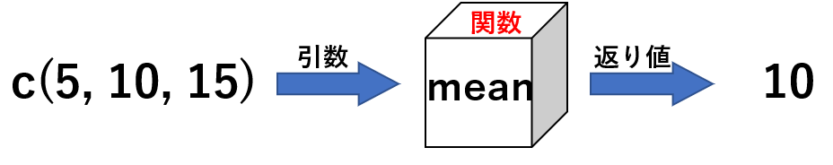

# 6  関数

Code

ここまでに、`mode`関数、`typeof`関数、`class`関数、`c`関数、`list`関数、`data.frame`関数、`matrix`関数など、様々な関数を用いて、オブジェクトの型やクラスを調べたり、ベクターやリストなどを作成してきました。R言語の**関数**とは、**オブジェクトに一定の演算を加えて、結果を表示するオブジェクト**のことを指します。関数のクラスは**function**（関数）、型も**function**です。

``` downlit
class(typeof) # 関数のクラスはfunction
## [1] "function"

mode(typeof) # 関数の型もfunction
## [1] "function"
```

Rでの関数は、**引数**と呼ばれる、カッコの中に記載されたオブジェクトに対して、一定の演算を加えるものです。Excelの関数をイメージしていただければ理解しやすいと思います。関数のイメージを図にすると、以下のようになります。

[](./image/function_image.png "図4：関数のイメージ図")

図4：関数のイメージ図

Rには`mean`関数という、数値の平均値を表示してくれる関数があります。上の図では、ベクターである、`c(5, 10, 15)`を引数として与えると、`mean`関数は引数を読み取って平均値を計算し、平均値である10を表示してくれます。この、表示される関数の計算結果のことを、**返り値**と呼びます。

``` downlit
vec <- c(5, 10, 15) # 引数とするベクター
mean(vec) # mean関数に引数vecを与えると、10が返り値として返ってくる
## [1] 10
```

Rには、上記の関数以外にも、数値や文字列、データフレームを演算するための関数を数多く備えています。

``` downlit
sd(vec) # 標準偏差を計算する関数
## [1] 5

median(vec) # 中央値を計算する関数
## [1] 10

log10(vec) # 常用対数を計算する関数
## [1] 0.698970 1.000000 1.176091

exp(vec) # ネイピア数の指数を計算する関数
## [1]     148.4132   22026.4658 3269017.3725

mode(`+`) # 演算子の+の型はfunction（関数）
## [1] "function"

`+`(2, 3) # 関数なので、引数を2つ取ると足し算になる
## [1] 5

mode(`[`) # インデックスも関数
## [1] "function"

mode(`if`) # if（条件分岐）も関数
## [1] "function"

mode(`for`) # for（繰り返し文）も関数
## [1] "function"
```

> **TIP:**
>
> Rでは、演算子やインデックス指定、条件分岐、繰り返し文も関数です。

このように、Rでは多くの演算を関数によって処理しています。この性質から、Rは**関数型言語**であるとされています。

> **TIP:**
>
> 正確には、Rは厳密な意味では関数型言語ではないように思います。関数型言語には[Haskell](https://www.haskell.org/)などがありますが、関数型言語では再帰的関数（関数内で関数を呼び出す）ような処理を用いて繰り返し計算を避ける場合が多く、Rのような逐次型処理に慣れていると読みにくいコードをよく書くイメージがあります。Rでも再帰的関数を用いることはできますが、頻繁には使用されません。
>
> Rでは関数を関数の引数に取ったり、関数で関数を作ったりすることができます。このような特徴が関数型と呼ばれる理由となっているようです。しかし、RはC言語の影響が大きい言語で、普通に使っている分には関数型というよりCのような手続き型の言語に近い感じを受けます。

## 6.1 関数を自作する

どのようなプログラミング言語にも、関数を自作する方法が備わっています。Rでは、`function`文を用いて関数を自作することができます。関数を変数に代入して用いるのが一般的な関数の作成方法です。`function`文の書き方は以下の通りです。

**関数名 \<- function(引数群){引数を使った処理}**

関数の返り値は、`return`関数を使って明示することもできますが、単に最後に記載したオブジェクトを返り値とすることもできます。

また、Rでは`function`と書く代わりに、`\`（バックスラッシュ）を`function`の代わりに用いることもできます。

作成した関数を用いて演算するときには、「関数名(引数)」という形で表記します。これは`mode`関数や`class`関数の使い方と同じです。

``` downlit
# 引数をそのまま帰す関数
return_selfx <- function(x){return(x)} # 返り値をreturn関数で表示
return_selfy <- function(y){y} # 最後に返り値を書く
return_selfz <- \(z){z} # functionの代わりにバックスラッシュを用いる

# どれも同じ演算をする関数になる
return_selfx(1)
## [1] 1

return_selfy(1)
## [1] 1

return_selfz(1)
## [1] 1
```

実際に関数を作るときには、もう少し複雑な処理を[`{ }`](https://rdrr.io/r/base/Paren.html)（中かっこ）の中に書きます。処理は一つ一つ改行しながら書き、最後に返り値を書きます。中かっこの中で改行を行っても問題ありませんが、引数のかっこ（「`)`」）の後にかっこの前側（「`{`」）が記載されている必要があります。

``` downlit
# sum2関数を作成する
sum2 <- function(x, y, z){ # 引数はx、y、zの3つ
  sum_of_xyz <- x + y + z # 引数を足し算する
  sum_of_xyz # 足し算したものを返り値にする
}

sum2(x = 1, y = 2, z = 3)
## [1] 6
```

上の例のように、引数を指定するときには、引数の種類を明示的に記載することもできます。明示的に記載する場合には、**「引数名=値」**という形で書きます。引数名を省略した場合には、記載した引数の順番に従って、引数が用いられます。

関数を作成するときには、**引数のデフォルト値**を設定しておくこともできます。デフォルト値が設定されている関数では、その引数を入力しなかったときには、自動的に引数にデフォルト値が入ります。

``` downlit
sum3 <- function(x, y = 1){ # yのデフォルト値を1とする
  return(x + y)
}

sum3(x = 1, y = 2) # 引数を明示的に記載
## [1] 3

sum3(1, 2) # xに1、yに2が入る
## [1] 3

sum3(1) # 引数yが省略されているので、デフォルト値（1）が用いられる
## [1] 2

sum3(y = 1) # xにはデフォルトが設定されていないので、省略できない
## Error in `sum3()`:
## ! argument "x" is missing, with no default
```

## 6.2 予約語

[4章](chapter4.llms.md)やこの章では関数や変数に名前をつけていますが、関数名や変数名の付け方にはルールがあります。

- 名前の始めに数値（1、2など）をつけることはできない
- 名前の始めにアンダーバー（\_）を用いることはできない
- 大文字と小文字は区別される（SUMとsumは別扱い）
- 演算子や記号（`!`や`?`、`+`、`-`、`#` など）は使えない
- **予約語**を用いることはできない

**予約語（reserved word）**とは、R言語がすでに役割を与えているために、関数名や変数名には使用できない文字列です。Rで設定されている予約語は以下の通りです。

- if
- else
- repeat
- while
- function  
- for
- in
- next
- break
- TRUE
- FALSE
- NULL
- Inf
- NaN
- NA
- NA_integer\_
- NA_real\_
- NA_complex\_
- NA_character\_
- …
- ..1
- ..2

> **TIP:**
>
> Rでは、ピリオド（.）が予約語に含まれていないため、変数名にピリオドを利用することができます。ただし、他の言語ではこのピリオドをメソッド（method）という、関数の仲間のようなものに用いることが多く、勘違いを起こしやすい表記になります。Rでも変数名にピリオドを用いないほうがよいとされています。

Back to top
