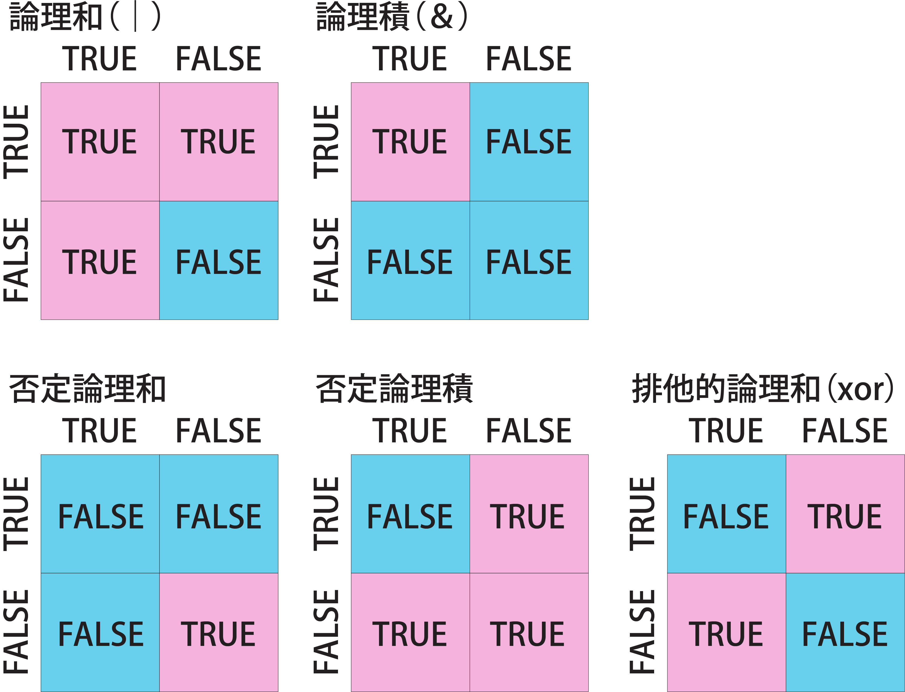

# 8  条件判断（Control structures）

Code

## 8.1 条件判断とは？

プログラミングでは、ある条件のときはこの処理、別の条件のときはこの処理…、といった具合に、条件によって行う処理を変えたいことがよくあります。例えば、じゃんけんでは出した手の条件によって勝ち・負け・引き分けという3つの処理を行うことになります。このように、条件によって処理を変えることを、**条件判断**と呼びます。

## 8.2 条件と論理型（logical）

条件として用いられるのは、**論理型（logical）**です。論理型は`TRUE`（真）と`FALSE`（偽）の2つの値を持ちます。論理型はそれそのものを用いる場合と、比較演算子の演算結果として得る場合があります。Rでは、**`TRUE`を`T`、`FALSE`を`F`**と表記することができます。

``` downlit
TRUE
## [1] TRUE

FALSE
## [1] FALSE

T
## [1] TRUE

F
## [1] FALSE

c(T, F, T, F) # logicalはベクターにもできる
## [1]  TRUE FALSE  TRUE FALSE

1 < 3 # 3は1より大きいのでTRUE
## [1] TRUE

1 > 3 # 1は3より大きくないのでFALSE
## [1] FALSE
```

## 8.3 数値としての論理型

論理型は、Rの内部では数値として取り扱われています。Rでは**`TRUE`は`1`、`FALSE`は`0`**と同一です。ですので、ベクター中の`TRUE`の数を足し算で計算することができます。また、**`0`以外が`TRUE`、`0`が`FALSE`**として扱われる場合もあります。条件判断では`0`を`FALSE`として用いる場合もあります。

``` downlit
T + T + F # 足し算すると2が返ってくる
## [1] 2

vec <- c(T, T, F, T, F, T, F)
sum(vec) # sumはベクターの要素を足し算する関数
## [1] 4
```

> **TIP:**
>
> RではTRUEが1、FALSEが0ですが、他の言語ではFALSEが-1のものもあります。言語によりTRUE/FALSEの仕様は異なります。

## 8.4 比較演算子

[3章](chapter3.llms.md#論理型logical)で説明した通り、**比較演算子**とは、演算子の右と左を比較して、その関係が正しい（`TRUE`）のか、間違っているのか（`FALSE`）を返す演算子です。Rで利用できる比較演算子は以下の表の通りです。

| 比較演算子 | 比較演算子の意味 |
|:-----------|:-----------------|
| ==         | 等しい           |
| !=         | 等しくない       |
| \<         | 小なり           |
| \<=        | 小なりイコール   |
| \>         | 大なり           |
| \>=        | 大なりイコール   |

表1：Rで使える比較演算子 {.caption-top .table .table-sm .table-striped .small}

``` downlit
1 == 1 # 等しいのでTRUE
## [1] TRUE
1 == 2 # 等しくないのでFALSE
## [1] FALSE

1 != 1 # 等しいのでFALSE
## [1] FALSE
1 != 2 # 等しくないのでTRUE
## [1] TRUE

1 < 2 # 1は2より小さいのでTRUE
## [1] TRUE
1 < 1 # 1は1より小さくないのでFALSE
## [1] FALSE

1 <= 2 # 2は1より小さいのでTRUE
## [1] TRUE
1 <= 1 # 1は1に等しいのでTURE
## [1] TRUE

3 > 2 # 3は2より大きいのでTRUE
## [1] TRUE
2 > 2 # 2は2より大きくないのでFALSE
## [1] FALSE

3 >= 2 # 3は2より大きいのでTRUE
## [1] TRUE
2 >= 2 # 2は2と等しいのでTRUE
## [1] TRUE
```

## 8.5 論理演算子

論理型は、**論理演算子**による計算に使うことができます。論理演算子とは、論理型のオブジェクト2つ以上を用いた演算（論理演算）を行うために用いるものです。

論理演算として主要なものは、論理和（AとBのどちらか片方がTRUEならTRUE、どちらもFALSEならFALSE）、論理積（AとBのどちらもTRUEならTRUE、どちらかがFALSEならFALSE）、否定論理和（AとBのどちらかがTRUEならFALSE、どちらもFALSEならTRUE）、否定論理積（AとBのどちらもTRUEならFALSE、どちらかがFALSEならTRUE）、排他的論理和（AとBのどちらかがTRUEならTRUE、両方がFALSEまたはTRUEならFALSE）などで、これらを用いることで論理型を用いた様々な表現を行うことができます。

[](./image/Logical_operators.png "論理演算子")

論理演算子

Rで最もよく用いられる論理演算子は**`&`、`|`**の2つです。`&`は論理積（`A & B`でAかB）、`|`は論理和（`A | B`でAまたはB）を示す演算子です。

この2つによく似た`&&`と`||`の演算子もありますが、これら2つはベクターの**始めの値だけ**を評価するという特徴を持っています（Rのバージョン4.3以降では`&&`や`||`でベクターを比較するとエラーが出ます）。`&&`と`||`を用いるとプログラムが予想外の挙動を取ることがあるので、できるだけ`&`と`|`だけを用いたほうがよいでしょう。

| 論理演算子 | 演算子の意味                           |
|:-----------|:---------------------------------------|
| &          | 論理積（AかつB）                       |
| &&         | 論理積（ベクターの始めの要素のみ評価） |
| \|         | 論理和（AまたはB）                     |
| \|\|       | 論理和（ベクターの始めの要素のみ評価） |
| !          | 否定演算子（真偽を反転）               |
| xor        | 排他的論理和                           |
| any        | いずれかが真の時に真を返す             |
| all        | すべてが真の時に真を返す               |

表2：Rで使える論理演算子 {.caption-top .table .table-sm .table-striped .small}

``` downlit
logic1 <- c(T, F, T, F)
logic2 <- c(T, T, F, F)
logic1 & logic2 # & は論理積（AND）
## [1]  TRUE FALSE FALSE FALSE

logic1 | logic2 # | は論理和（OR）
## [1]  TRUE  TRUE  TRUE FALSE

# 比較する要素が1つでないとエラー
#（以前はインデックス1の要素のみを比較していた）
logic1 && logic2 
## Error in `logic1 && logic2`:
## ! 'length = 4' in coercion to 'logical(1)'
logic1 || logic2
## Error in `logic1 || logic2`:
## ! 'length = 4' in coercion to 'logical(1)'
```

RにはNAND（否定論理積）、NOR（否定論理和）などを表す専用の論理演算子はありませんが、XOR（排他的論理和）を表す関数（`xor`関数）はあります。また、要素のいずれか1つが`TRUE`なら`TRUE`を返す`any`関数、すべてが`TRUE`の時だけ`TRUE`を返す`all`関数などの関数も論理演算に用いることができます。

``` downlit
xor(logic1, logic2) # 排他的論理和
## [1] FALSE  TRUE  TRUE FALSE
xor(T, T) # 両方がTRUEならFALSEを返す
## [1] FALSE

any(logic1) # いずれか1つがTRUEなのでTRUE
## [1] TRUE

all(logic1) # すべてがTRUEでは無いのでFALSE
## [1] FALSE
```

論理演算子として、**`!`（エクスクラメーションマーク、否定演算子）**も用いることができます。`!`は論理型の前に置くことで、論理型を反転（`TRUE`を`FALSE`に、`FALSE`を`TRUE`に）させます。

``` downlit
!TRUE
## [1] FALSE
!FALSE
## [1] TRUE

!(1 < 3)
## [1] FALSE
!(1 > 3)
## [1] TRUE
```

## 8.6 条件分岐の文

上記のように、比較演算子や論理演算子を用いると、論理型を得ることができます。この論理型に従い、行う処理を変えるものを、**条件分岐**と呼びます。条件分岐では、条件分岐の文（Control structures）というものが用いられます。Rでは、条件分岐の文として、**`if`文と`switch`文**の2つが設定されています。

| 条件分岐   | 条件分岐の形式                                      |
|:-----------|:----------------------------------------------------|
| if文       | if(条件式){TRUEのときの演算}else{FALSEのときの演算} |
| ifelse関数 | ifelse(条件式, TRUEのときの演算, FALSEのときの演算) |
| switch文   | switch(評価する値, 評価の既定値=既定値のときの演算) |

表2：Rで使える条件分岐 {.caption-top .table .table-sm .table-striped .small}

### 8.6.1 if文

`if`文は最もシンプルな条件分岐の文です。`if`文では、**条件式**に従い、実行する処理が変わります。Rでの`if`文は、以下の形を取ります。

**if(条件式){TRUEのときに実施する処理}**

条件式を**`if()`**のカッコの中に書きます。`if`文は1行で書くこともできますし、複数行に渡って書くこともできます。複数行に処理を書くときには、**中括弧（[`{}`](https://rdrr.io/r/base/Paren.html)）**を条件式の後に書き、中括弧の中に処理を書きます。

``` downlit
if(TRUE) "Hello R" # 1行で書く場合（"Hello R"が返ってくる）
## [1] "Hello R"

if(FALSE) "Hello FALSE" # 条件式がFALSEなので、何も返ってこない

if(TRUE){ # 複数行で書く時には中括弧（{}）を用いる
  "Hello R"
}
## [1] "Hello R"

if(FALSE){"Hello FALSE"} # 1行のif文で中括弧を使ってもよい
```

`if`文の条件が`0`のときには、`0`が`FALSE`であると判断されて、処理が実行されません。一方で条件が`0`以外である場合には、`TRUE`であると判断されて処理が実行されます。`if(0)`とするとその処理が行われないので、**Rでは`if(0)`がコメントアウトに使われる**こともあります。

``` downlit
if(0){"0はFALSEなので、これは表示されません"}

if(-1){"-1はTRUE扱いなので、表示されます"}
## [1] "-1はTRUE扱いなので、表示されます"

if(-0.005){"0以外はTRUEとして処理されます"}
## [1] "0以外はTRUEとして処理されます"
```

#### 8.6.1.1 if else文

`if`文ではさらに条件を分岐させることもできます。条件を追加する場合には、`if`文の後に、`else if()`を繋げます。`else if()`のカッコの中に2つ目の条件を書くことで、条件を分離させることができます。`else`だけを書いて、`if()`の条件式をつけない場合には、どの条件にも合わない時に実行する処理になります。ですので、`if else`文は以下の形を取ります。

**if(条件式1){**  
**式1がTRUEのときの処理**  
**}else if(条件式2){**  
**式1がFALSE、式2がTRUEのときの処理**  
**}else{**  
**式1、2がFALSEのときの処理**  
**}**

``` downlit
x <- 2 # xは2

# xは2なので、2番目の処理が返ってくる
if(x == 1){ # =が1つだと代入になるのでエラーが出る
  "first"
} else if(x == 2){
  "second"
} else {
  "others"
}
## [1] "second"
```

#### 8.6.1.2 ifelse関数

条件分岐が2つしかない場合には、`ifelse`関数を用いることもできます。`ifelse`関数は3つの引数、「(条件式)、(`TRUE`のときの処理)、(`FALSE`のときの処理)」を取ります。条件が1つだけで、簡単な処理のみを行うのであれば`ifelse`関数で十分な場合もあります。

``` downlit
# TRUEなので2番目の処理が返ってくる
ifelse(1 < 3, "One is smaller than three.", "One is not smaller than three.")
## [1] "One is smaller than three."

# FALSEなので3番目の処理が返ってくる
ifelse(1 > 3, "One is larger than three.", "One is not larger than three.") 
## [1] "One is not larger than three."
```

### 8.6.2 switch文

条件式ではなく、特定の値に対応して処理を変えたい場合には、`switch`文を用います。`switch`文では、**始めの引数が条件を指定する値、それに続く引数が条件に対応した処理**となります。条件を指定する値には、数値または文字列を用いることができます。条件が数値の場合と文字列の場合では、やや使い方が異なります。

``` downlit
# 条件が1のときは、2番目の引数の処理が返ってくる
switch(1, "first", "second", "third") 
## [1] "first"

# 条件が2のときは、3番目の引数の処理が返ってくる
switch(2, "first", "second", "third") 
## [1] "second"

# 条件が5のときは、6番目の引数の処理がないので何も返ってこない
switch(5, "first", "second", "third") 
```

``` downlit
# 条件式に対応したもの（=で繋いだもの）が返ってくる
switch("dog", dog = "犬", cat = "猫", monkey = "猿", pig = "豚")
## [1] "犬"

switch("monkey", dog = "犬", cat = "猫", monkey = "猿", pig = "豚")
## [1] "猿"

# horseは引数に登録していないので、何も返ってこない
switch("horse", dog = "犬", cat = "猫", monkey = "猿", pig = "豚")
```

> **TIP:**
>
> インストールしたばかりのRでは、上記の`if`文、`if else`文、`ifelse`関数、`switch`文しか使えませんが、**パッケージ**というものを用いると、他の条件分岐（`if_else`関数や`case_which`文、`case_when`文）を用いることもできます。詳細については[20章](chapter20.llms.md#if_else関数)で説明します。

Back to top
