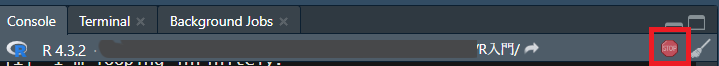

# 9  繰り返し文（Looping）

Code

コンピューターのいいところは、同じことを何度繰り返しても疲れないことです。Excelで表を作るときに、コピーアンドペーストを何百回も繰り返し、何時間も費やしたことがある方は多いかと思います。このような繰り返しがあっても、すべてをコンピューターに任せることができれば、コンピューターは疲れることなく、一瞬で繰り返し作業を終えてくれます。

ただし、コンピューターに繰り返し作業をしてもらいたければ、具体的に繰り返し作業を指示しないといけません。プログラミングでコンピューターに繰り返し作業を指示するためのものが、**繰り返し文**です。Rには繰り返し文として、**`for`**文、**`while`**文、**`repeat`**文の3つが設定されています。

| 繰り返し文 | 繰り返し文の形式                      |
|:-----------|:--------------------------------------|
| for文      | for(i in ベクター){繰り返す処理}      |
| while文    | while(条件式){TRUEの時に繰り返す処理} |
| repeat文   | repeat{breakまで繰り返す処理}         |

表1：Rで使える繰り返し文 {.caption-top .table .table-sm .table-striped .small}

## 9.1 for文

`for`文はRで、そして他の言語でもよく設定されている、最も典型的な繰り返し文の一つです。Rでは、`for`文は、

**for(繰り返しの条件){繰り返す処理}**

という形で表記します。このうち、繰り返しの条件に関しては、

**`for(i in c(1, 2, 3, 4, 5))`**

といった形で、**「変数 in ベクター」**という形で書きます。これは、ベクターの要素を前から順番に変数に入れていく、ということを意味しています。

``` downlit
for(i in c(1, 2, 3, 4, 5)){print(i)} # ベクターの要素をiに入れて、iを表示する
## [1] 1
## [1] 2
## [1] 3
## [1] 4
## [1] 5

for(i in c("dog", "cat", "pig", "horse")){print(i)} # 文字列のベクターでも同じ
## [1] "dog"
## [1] "cat"
## [1] "pig"
## [1] "horse"
```

> **TIP:**
>
> 上の`for`文で用いている`print`関数は、オブジェクトを表示させるための関数です。`for`文の処理中でオブジェクトを表示させる場合には`print`関数を明示的に用いる必要があります。また、`for`文で用いる変数名には`i`を用いるのが普通です。この`i`はイテレーター（iterator、繰り返すもの）の略だと思いますが、よくわかりません。`for`文の中で`for`文を呼び出す、つまり入れ子（ネスト）にする場合には、`i`以降の変数として、`j`、`k`…とアルファベット順に使っていくことが多いです。
>
> `for`文を入れ子にする場合には、Rでは以下のような表現を用いることができます。
>
> ``` downlit
> for(i in c(1, 2)) for(j in c(4, 5)){
>   print(paste0("i=", i, ", ", "j=", j))
> }
> ## [1] "i=1, j=4"
> ## [1] "i=1, j=5"
> ## [1] "i=2, j=4"
> ## [1] "i=2, j=5"
>
> # 以下も同じ内容のスクリプト
> for(i in c(1, 2)){
>   for(j in c(4, 5)){
>     print(paste0("i=", i, ", ", "j=", j))
>   }
> }
> ## [1] "i=1, j=4"
> ## [1] "i=1, j=5"
> ## [1] "i=2, j=4"
> ## [1] "i=2, j=5"
> ```

上の例では、`i`にベクターの要素が前から順番に代入されているのがわかると思います。`for`文では、この`in`の後のベクターとして連続した整数を用いる場合が多いのですが、整数の数が多かったり、繰り返したい回数がとても多いと、いちいち`c`関数でベクターを作るのは大変です。Rでは、連続した数値のベクターを作る場合、「`:`（コロン）」を用いることができます。コロンを用いたベクターの作り方は以下の通りです。

``` downlit
1:5
## [1] 1 2 3 4 5

10:20
##  [1] 10 11 12 13 14 15 16 17 18 19 20

0.5:5.5
## [1] 0.5 1.5 2.5 3.5 4.5 5.5
```

`for`文はコロンを使用して、以下のような形で書くことができます。

``` downlit
for(i in 1:5){
  print(i - 1)
}
## [1] 0
## [1] 1
## [1] 2
## [1] 3
## [1] 4
```

ベクターを変数としてあらかじめ準備しておけば、ベクターの要素に対して同じ処理を繰り返す事もできます。

``` downlit
vec <- c("dog", "cat", "pig", "horse")
for(i in vec){
  isanimal <- paste("A", i, "is an animal.") # iに文字列をつなぐ
  print(isanimal) # 文字列を繋いだものを表示する
}
## [1] "A dog is an animal."
## [1] "A cat is an animal."
## [1] "A pig is an animal."
## [1] "A horse is an animal."
```

`for`文を用いれば、様々な繰り返し作業をRに行ってもらうことができます。`for`文と`if`文の組み合わせで、繰り返しの中で条件判断を行い、ベクターの要素ごとに異なる処理を行うこともできます。

`for`文を途中で止める場合には[`break`](https://rdrr.io/r/base/Control.html)を、繰り返しをスキップするときには[`next`](https://rdrr.io/r/base/Control.html)を用います。

``` downlit
for(i in 1:5){
  if(i == 2){next} # iが2のときには繰り返しをスキップする
  if(i == 4){break} # iが4のときには繰り返し自体を止める
  print(i)
}
## [1] 1
## [1] 3
```

## 9.2 while文

`while`文は、条件式に定めた条件が`TRUE`（真）である場合は繰り返し、`FALSE`（偽）になったら繰り返しを中止する、繰り返し文の一つです。`while`文は以下のように記述して用います。

**while(条件式){TRUEのときに繰り返す処理}**

`while`文では、`for`文のように繰り返し処理でベクターの要素を引き出すようなことはできないので、処理の中で要素を呼び出すような形を取ることが多いです。

``` downlit
x <- 1 # xは1
while(x < 5){ # xが5以下の時、以下の処理を繰り返す
  print(x) # xを表示する
  x <- x + 1 # xに1を足す
}
## [1] 1
## [1] 2
## [1] 3
## [1] 4
```

> **TIP:**
>
> この、「`x <- x + 1`」のような表現はプログラミング初心者には変に感じるかもしれませんが、繰り返し文中で変数を1ずつ足して更新していく、プログラミング言語ではよく見る表現です。他の言語でも同じような書き方をすることが多く、変数に1を足すための演算子（インクリメント演算子）や1を引くための演算子（デクリメント演算子）を持つプログラミング言語も多いです（Rにはありません）。

`while`文では条件が`TRUE`であれば繰り返しが続くため、条件が`FALSE`にならないような場合には、永遠に繰り返し処理を行うことになります（**無限ループ**）。Rで無限ループにハマったときには、慌てず騒がず、「stopボタン」を押しましょう。また、コンソールを選択し、Escキーを押すことでも無限ループを停止することができます。

``` downlit
while(TRUE){ # 無限ループ
  print("I`m looping infinitely.")
}
```

[](./image/stop_button.png "図1：RstudioのStopボタン")

図1：RstudioのStopボタン

## 9.3 repeat文

**`repeat`**文は、同じ処理を繰り返すときに使います。`repeat`文から抜けるときには、[`break`](https://rdrr.io/r/base/Control.html)を実行します。[`break`](https://rdrr.io/r/base/Control.html)は条件判断（`if`文など）を用いて実行することになります。[`break`](https://rdrr.io/r/base/Control.html)がない場合には、無限ループすることになります。

``` downlit
x <- 1
repeat{
  x <- x + 1 # printより前にxを1増やす
  print(x)
  if(x >= 5){break} # xが5以上ならrepeatをやめる
}
## [1] 2
## [1] 3
## [1] 4
## [1] 5
```

> **TIP:**
>
> Rでは繰り返し処理を行うこと自体が割と少ないので、無限ループに陥ることは稀です。無限ループはこの`while`/`repeat`文を使った時ぐらいにしか発生しませんし、他の言語と異なり`while`文や`repeat`文自体使う機会が少なめです。どのようなプログラミング言語でも無限ループを起こすことは普通にあり、無限ループを止める方法は必ずありますので、無限ループでコンピュータが壊れるようなことはありません。

Back to top
