# 参考文献

Code

## Rについての教科書

#### R-tips([舟尾暢男 2016](#ref-Funao2016-10-12))

[](https://www.amazon.co.jp/dp/B0719QS6KG/)

まずは、R-tipsから紹介します。R-tipsは2020年ぐらいまではWeb上で見ることができていた、Rの入門にちょうどいいホームページでした。かなり昔から教科書としても販売されていました。Rのプログラミングから統計の基礎まで網羅しており、入門編として必要十分な内容を備えています。

#### Rで学ぶプログラミングの基礎の基礎([舟尾暢男 2026](#ref-Rdemanabu_bib))

[](https://www.amazon.co.jp/dp/4877835520)

R-tipsの著者によるRの教科書です。R-tipsよりは大分薄い教科書で、Rのプログラミングとして基本的な点に集中して解説されている教科書です。R-tipsを読む前に目を通しておくと、R-tipsがより理解しやすくなるでしょう。

#### Rによるデータ分析のレシピ([舟尾暢男 2020](#ref-Rniyorude-tabunnseki_bib))

[](https://www.amazon.co.jp/dp/4274226255)

R-tipsの著者による別のRの教科書です。こちらはRの教科書、というよりはデータ分析の手法に関する教科書です。高校生ぐらいでも理解しやすい文書になっていて、解析の実例をストーリーとして追加しながら解析方法を説明しています。ベイズ統計の基礎やCART（Classification and Regression Trees）などの解説も記載されています。R自体の説明はあまりないので、R-tipsを手元に置いて学ぶとわかりやすいでしょう。

#### R言語ではじめるプログラミング言語とデータ分析([馬場真哉 2019a](#ref-Rgenngodehazimeru_bib))

[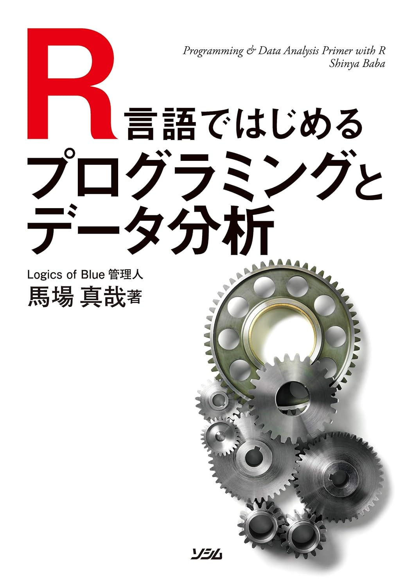](https://www.amazon.co.jp/dp/B083Q476KN)

こちらもR-tipsと同じく入門編のR言語の教科書です。R言語のプログラミングについて平易な言葉でわかりやすく書かれています。新しいR-tipsといってもいい内容の教科書です。RStudioからGitを使う方法についても詳しく記載されています。Rの初心者が手に取って後悔することのない教科書だと思います。

#### Rで楽しむ統計([奥村 and 石田 2016](#ref-%E5%A5%A5%E6%9D%91%E6%99%B4%E5%BD%A62016-09-08))

[](https://www.amazon.co.jp/dp/4320112415/)

Rで楽しむ統計は統計よりの内容になった、Rの入門の教科書です。著者の奥村先生の[ホームページ](https://okumuralab.org/~okumura/stat/)にはRのスクリプトを含む情報がたくさんあり、昔からお世話になっていたものです。

#### Rによるやさしい統計学([山田 et al. 2008](#ref-%E5%B1%B1%E7%94%B0%E5%89%9B%E5%8F%B22008-01-25))

[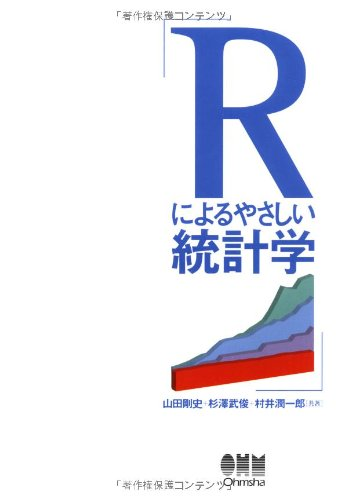](https://www.amazon.co.jp/dp/B00E06CJP4/)

こちらも統計よりに近い内容の教科書です。内容はかなり統計よりになっていますが、平易な文章で書かれており、理解しやすいと思います。

#### Rによるデータサイエンス([金 2017](#ref-%E9%87%91%E6%98%8E%E5%93%B22017-03-25))

[](https://www.amazon.co.jp/dp/462709602X/)

こちらも基礎からRを学べる教科書です。上記の教科書よりかなり最近に書かれたものです。

#### [私たちのR ベストプラクティスの探求](https://www.jaysong.net/RBook/)([宋 and 矢内 2020](#ref-%E5%AE%8B%E8%B2%A1%E6%B3%AB20200622))

[](https://www.jaysong.net/RBook/)

Web版の教科書ですが、Rのプログラミング言語としての面について詳しく説明された教科書です。Web版でタダで読めますので、まずはこれでRに触れてみるのがよいでしょう。このテキストでは説明していないWebスクレイピングなどにも触れています。

#### [生物統計学](https://biopapyrus.jp/)

こちらは昔からお世話になっている、Rに関する統計学的手法を取りまとめたホームページです。こちらを一通り読み通せば、Rや統計について一通りフォローできる内容になっています。

#### [からだにいいもの](https://www.karada-good.net/)

表題はともかく、このブログは10年ほど前からいろいろなRのライブラリを紹介し続けてくれているページとなっています。

#### [実践的データサイエンス](https://uribo.github.io/practical-ds/intro)

こちらはUryuさんという方が書かれているものです。どちらかというとRというよりはデータサイエンスの基礎を押さえたものとなっており、内容は入門としては少し難しめとなっています。

#### [R for Data Science](https://r4ds.hadley.nz/)([Wickham et al. 2023](#ref-Wickham_Hadley2023-07-18))

[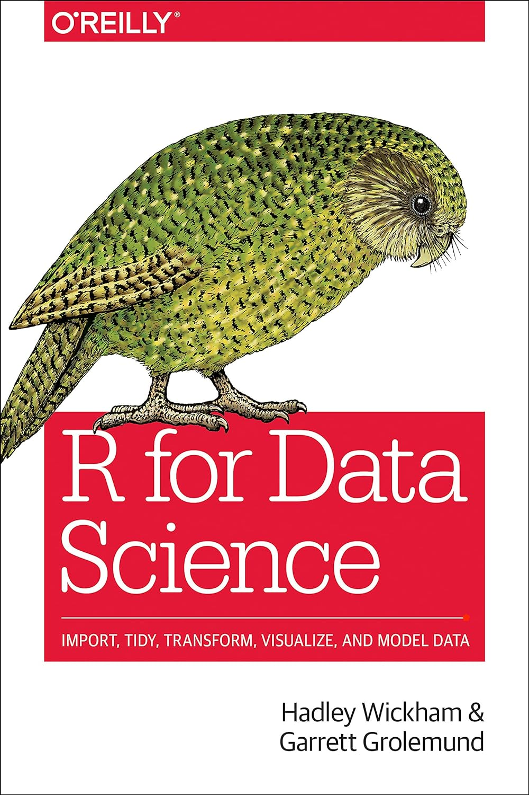](https://www.amazon.co.jp/dp/1492097403/)

英語の教科書では、まずHadley WickhamのR for Data Scienceを読んでみるのが良いでしょう。[日本語版](https://www.amazon.co.jp/dp/487311814X)([Hadley Wickham 2024](#ref-RforDataScienceJP_bib))も英語の書籍版もありますが、Webサイトから読むと無料で利用できます。Hadley Wickhamはこの他にもWebで教科書を複数公開しており、英語さえできれば教科書を買うことなくRを学ぶことができます。

#### [An Introduction to R](https://cran.r-project.org/doc/manuals/r-release/R-intro.html)

[日本語版](https://cran.r-project.org/doc/contrib/manuals-jp/R-intro-170.jp.pdf)

RのマニュアルもRを学ぶ上で参考になるでしょう。最新のRの使い方（tidyverseやQuarto、Shinyなど）についての記載はありませんが、Rの基礎については十分に説明がされています。日本語版のマニュアルもあるため、一目通しておくとよいでしょう。

#### [Welcome to ModernDive](https://moderndive.netlify.app/1-getting-started.html)

#### [Hands-On Programming with R](https://rstudio-education.github.io/hopr/)

英語のテキストは無数にあります。上に入門編のテキストから2つを紹介しておきます。日本語のテキストは少なく、どうしても落穂ひろいしてしまうことになりがちですが、英語さえできればほぼ無料で一通りRを学ぶことができます。

## ggplot2

#### Rグラフィックスクックブック([Chang 2019](#ref-Winston_Chang2019-11-21))

[](https://www.amazon.co.jp/dp/4873118921/)

ggplot2の教科書では、このRグラフィッククックブックに目を通すのがよいでしょう。ちょっと分厚いですが、ggplot2の端から端までよく記載されている教科書です。

#### [ggplot2: Elegant Graphics for Data Analysis](https://ggplot2-book.org/index.html)([Wickham 2016a](#ref-Wickham_Hadley2016-06-16))

[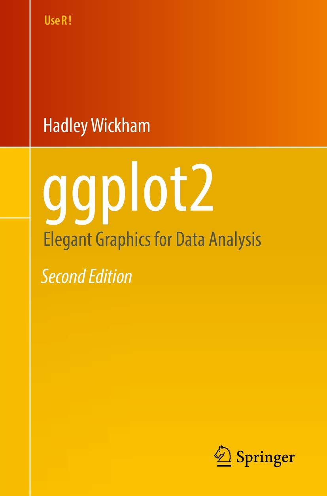](https://www.amazon.co.jp/dp/331924275X/)

英語でもよければこちらのHadley Wickham謹製の教科書を読むのがよいでしょう。無料で読めますし、紙の媒体が欲しければAmazonでペーパーバックを購入することもできます。

## plotly

#### Rによるインタラクティブなデータビジュアライゼーション: 探索的データ解析のためのplotlyとshiny([Sievert and 株式会社ホクソエム 2022](#ref-Carson_Sievert2022-05-13))

[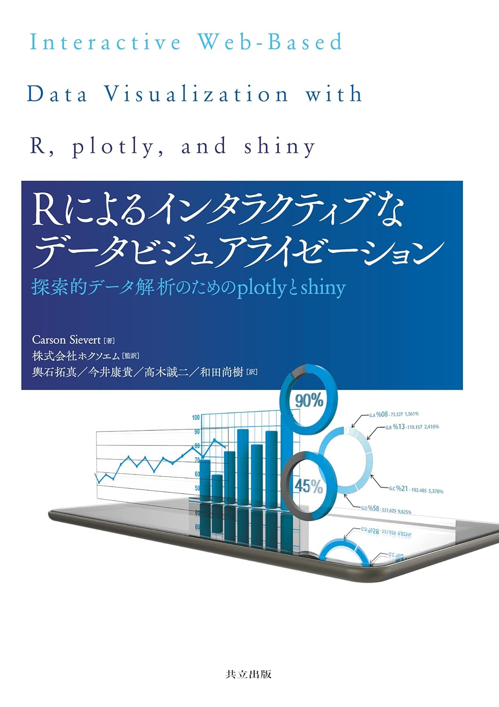](https://www.amazon.co.jp/dp/4320124863/)

plotlyに関してはほとんど日本語の資料がないのですが、こちらの教科書はかなり良く書かれていてわかりやすいものとなっています。Webアプリケーション作成ライブラリであるShinyについても少し紹介されています。

また、インタラクティブなグラフの使いかたについては、[Interactively exploring high-dimensional data and models in R](https://dicook.github.io/mulgar_book/)([Cook and Laa 2024](#ref-cook-laa))が参考になります。

## 統計

#### 統計学入門（基礎統計学Ⅰ）([東京大学教養学部統計学教室 1991](#ref-%E6%9D%B1%E4%BA%AC%E5%A4%A7%E5%AD%A6%E6%95%99%E9%A4%8A%E5%AD%A6%E9%83%A8%E7%B5%B1%E8%A8%88%E5%AD%A6%E6%95%99%E5%AE%A41991-07-09))

[](https://www.amazon.co.jp/dp/4130420658/)

統計の教科書の1冊目には、とりあえずこの教科書を選んでおくと問題ないでしょう。基礎からきちんと説明がされていて、常に手元に置いておくとよい教科書の一つです。東京大学教養学部統計学教室が出版している教科書には他にも[2冊](https://www.amazon.co.jp/stores/%E6%9D%B1%E4%BA%AC%E5%A4%A7%E5%AD%A6%E6%95%99%E9%A4%8A%E5%AD%A6%E9%83%A8%E7%B5%B1%E8%A8%88%E5%AD%A6%E6%95%99%E5%AE%A4/author/B078PPWY88?ref=sr_ntt_srch_lnk_2&qid=1707698640&sr=8-2&isDramIntegrated=true&shoppingPortalEnabled=true)ありますので、一通り目を通すだけでも勉強になると思います。

#### データ分析に必須の知識・考え方　統計学入門([阿部真人 2021](#ref-%E9%98%BF%E9%83%A8%E7%9C%9F%E4%BA%BA2021-11-26))

[](https://www.amazon.co.jp/dp/B09M81WRHT/)

統計学入門よりもう少し簡単な内容で、入門編として読みやすい教科書です。統計も何も知らない方が読んでも読みやすい内容になっています。同様のデザインの教科書が[ソシムのデータサイエンス](https://www.socym.co.jp/book_genre/%E3%83%87%E3%83%BC%E3%82%BF%E3%82%B5%E3%82%A4%E3%82%A8%E3%83%B3%E3%82%B9)というシリーズで出版されており、どれも読みやすく理解しやすい内容となっています。

#### [統計学入門](http://www.snap-tck.com/room04/c01/stat/stat.html)

こちらも昔からお世話になっているホームページで、統計の基礎的なことでわからないことがあればとりあえずココで確認することが多いです。著者は統計の教科書も[数冊書かれています](http://www.snap-tck.com/room05/room05.html)。

#### [R基本統計関数マニュアル](https://cran.r-project.org/doc/contrib/manuals-jp/Mase-Rstatman.pdf)

Rで統計を行うのであれば、とりあえずこのマニュアルに目を通すとよいでしょう。やや長いですが、基礎的な統計に関する関数の説明はほぼすべて記載されています。

#### [データ分析のための統計学入門](http://www.kunitomo-lab.sakura.ne.jp/2021-3-3Open(S).pdf)

こちらは英語の教科書（OpenIntro Statistics）を東京大学の先生が翻訳して公開しているものです。初めに手に取る教科書にしては少し難しいかもしれませんが、内容が充実しているので、通して読めば非常に勉強になるでしょう。

## 回帰

#### データ解析のための統計モデリング入門([久保 2012](#ref-%E4%B9%85%E4%BF%9D%E6%8B%93%E5%BC%A52012-05-19))

[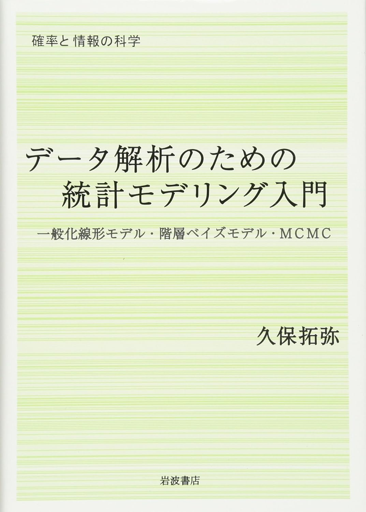](https://www.amazon.co.jp/dp/400006973X/)

回帰について基礎から理解したいなら、とりあえずこの教科書を読むとよいでしょう。MCMCに関しては[WinBugs](https://www.mrc-bsu.cam.ac.uk/software/bugs/the-bugs-project-winbugs/)という、2006年に開発が終わって、今ではあまり使われていないソフトウェアが紹介されていますが、内容をStanに読み替えれば今でも十分に役に立つ教科書です。

#### 統計モデルと推測([松井秀俊 and 小泉和之 2019](#ref-%E6%9D%BE%E4%BA%95%E7%A7%80%E4%BF%8A2019-11-28))

[](https://www.amazon.co.jp/dp/B08543S1LQ/)

こちらはもう少し最近になって出版された教科書です。統計モデルというのは統計を扱ったことがないとよくわからない概念なのですが、こちらを一通り読めばある程度把握できると思います。

#### Rによる多変量解析入門 データ分析の実践と理論([川端 et al. 2018](#ref-%E5%B7%9D%E7%AB%AF%E4%B8%80%E5%85%892018-07-19))

[](https://www.amazon.co.jp/dp/4274222365/)

こちらは重回帰、因子分析を中心に詳しく説明されている教科書です。上の2冊を読んだ後に読めば、回帰の手法についてより深く学ぶことができるでしょう。また、構造方程式モデリングについてもかなり詳しい説明がされています。

#### Generalized Additive Models: An Introduction with R([Wood 2017](#ref-mgcv4_bib))

[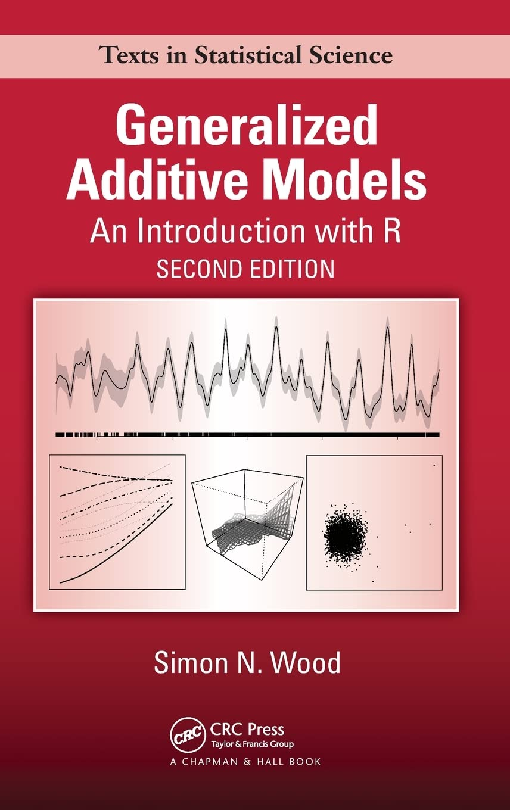](https://www.amazon.co.jp/-/en/Simon-N-Wood/dp/1498728332)

Generalized Additive Model（GAM、一般化加法モデル）はかなり複雑で、何をやっているのかよくわからない非線形回帰モデルの一つですが、この教科書では入門から計算の要点、`mgcv`の使い方まで一通り説明されています。GAMの日本語の教科書はあまりなく、この教科書ほど内容が充実しているものは無いように思います。ただし、内容はかなり難しく、行列演算がわからないと何を書いているのかわからない部分も多いです。しかし、現状この教科書より分かりやすいものも無いので、興味のある方は挑戦してみるとよいでしょう。

## 分類

#### Rによる機械学習入門([金森敬文 2017](#ref-%E9%87%91%E6%A3%AE%E6%95%AC%E6%96%872017-11-23))

[](https://www.amazon.co.jp/dp/4274221121/)

機械学習はPythonの領域、といった感じで、Rで機械学習を取り扱うことはそれほど多くないと思いますが、一通り機械学習の手法をRで試すのであればこの教科書を読むとよいでしょう。

## 時系列分析

#### 時系列分析と状態空間モデルの基礎: RとStanで学ぶ理論と実装([馬場真哉 2018](#ref-%E9%A6%AC%E5%A0%B4%E7%9C%9F%E5%93%892018-02-14))

[](https://www.amazon.co.jp/dp/4903814874/)

時系列の基礎から応用まで、一通りすべて説明されている教科書です。時系列についてとりあえず一冊買うなら、これを買って試してみるのがよいでしょう。

#### Rとstanではじめる　心理学のための時系列分析入門([小森政嗣 2022](#ref-%E5%B0%8F%E6%A3%AE%E6%94%BF%E5%97%A32022-06-23))

[](https://www.amazon.co.jp/dp/B0BLHBPTWT/)

上の教科書よりもう少しとっつきやすい感じの教科書がこちらです。ただし、たどり着くところは上の教科書よりやや難しめです。

## 生存時間解析

#### Applied Survival Analysis Using R([Moore 2016](#ref-Moore_Dirk_F_2016-05-11))

[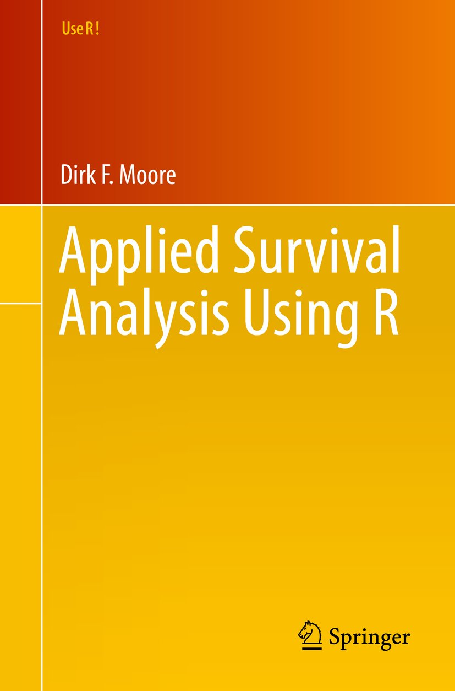](https://www.amazon.co.jp/dp/B01FKDTW3W/)

生存時間解析を行うことはほとんどないですし、耐久性試験やがんの第II、III相治験にでも関わらない限りそれほど学ぶ理由もないと思うのですが、Rに関連して一冊読むならこの教科書が一番簡単で理解しやすいと思います。もちろん英語の教科書ですが、内容はそれほど難しくなく、生存時間解析の基礎についてRのスクリプトと共によく説明されています。

#### 疫学のためのRハンドブック([Neale Batra 2021b](#ref-applied_Epi_jpn_bib))

疫学についての教科書ですが、27章に生存時間解析についての詳しい内容が記載されています。元々は[英語の教科書](https://www.epirhandbook.com/en/)([Neale Batra 2021a](#ref-applied_Epi_bib))で、日本人の有志の方が翻訳し、公開してくれています。このテキストよりもずっと正確でまともな内容が記載されていますので、生存時間解析を含む疫学に興味があれば一読されることをおすすめします。

## 地理空間情報

#### [Geocomputation with R](http://124.219.182.167/geo/intro.html)

[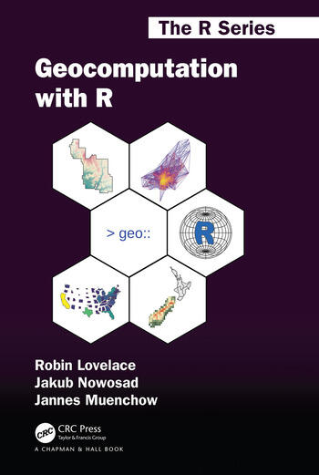](https://www.amazon.co.jp/-/en/Robin-Lovelace/dp/0367670577)

こちらも地理空間情報の取り扱いについて解説した教科書です。英語の原著版は[こちら](https://r.geocompx.org/)です。まだまだ情報が少ない`sf`パッケージの説明、`leaflet`といった地理空間を取り扱うグラフィックライブラリの説明等の内容が充実しています。

#### 実践Data Scienceシリーズ Rではじめる地理空間データの統計解析入門([村上 2022](#ref-%E6%9D%91%E4%B8%8A%E5%A4%A7%E8%BC%942022-04-06))

[](https://www.amazon.co.jp/dp/406527303X/)

こちらは地理空間情報だけではなく、地理情報を用いた統計の手法を説明した教科書です。地理空間統計には興味があるのですが、あまりにもデータに触ることがないため知識がなく、このテキストにも記載はしていません。この教科書を読むと地理空間統計についてイメージしやすくなるのではないかと思います。

## ネットワーク解析

#### ネットワーク分析 第2版 (Rで学ぶデータサイエンス 8) ([鈴木 2017](#ref-%E9%87%91%E6%98%8E%E5%93%B22017-05-24))

[](https://www.amazon.co.jp/dp/4320113152/)

Rでネットワーク解析を学ぶのであれば、とりあえずこれを1冊読むとよいでしょう。Rのネットワーク解析ライブラリである`sna`と`igraph`の両方について、ネットワーク解析の意味や手法を交えて基礎から詳しく記載されています。特に`sna`についてはネット上にも情報が落ちていないので、きちんと学ぶのであれば他に選択肢がないように思います。ただし、同じ手法を`sna`と`igraph`を用いて並行して説明されているので、やや読みにくい印象があります。

## Rmarkdown・Quarto

#### 再現可能性のすゝめ (Wonderful R 3) ([高橋 and 石田 2018](#ref-%E9%AB%98%E6%A9%8B%E5%BA%B7%E4%BB%8B2018-05-09))

[](https://www.amazon.co.jp/dp/4320112431/)

Rmarkdownについて一冊読むのであれば、この教科書が初心者でも読みやすいでしょう。RstudioとRmarkdownを用いた手法が一通り説明されています。やや独特の言い回しが多いので気になるかもしれませんが、手元に置いておけばRでのレポート制作の役に立つでしょう。

Rmarkdownについての教科書は他にも数冊出ていますので、手に取ってみて肌に合うものを読んでみるとよいと思います。

#### R Markdown: The Definitive Guide ([J. J. Allaire and Grolemund 2023](#ref-Yihui_Xie_231230))

[](https://bookdown.org/yihui/rmarkdown/)

英語でも良ければR markdownの開発者であるDr. Yihui Xie謹製のこちらの教科書を読むのが良いでしょう。また、この教科書を[日本語に翻訳したもの](https://gedevan-aleksizde.github.io/rmarkdown-cookbook/)も公開されています。こちらからR Markdownに入門するのもよいでしょう。

この教科書を含め、Posit.ioが公表している教科書はほぼすべて`bookdown`パッケージ([Xie 2024](#ref-bookdown_bib), [2016](#ref-bookdown_bib2))、もしくはこの機能を引き継いだQuartoで作成されています。このR入門もQuartoで作成している教科書です。`bookdown`で作成された教科書の[一覧](https://bookdown.org/)も公開されていますので、R markdownだけでなく他のRの教科書を探すのにも便利です。

Quartoについてはあまり良い教科書がありません。[QuartoのGuide](https://quarto.org/docs/guide/)を読むのが最も簡単に学ぶ方法だと思います。上で紹介した[日本語の教科書](https://www.jaysong.net/RBook/)([宋 and 矢内 2020](#ref-%E5%AE%8B%E8%B2%A1%E6%B3%AB20200622))にはQuartoについての詳しい記載があります。

## Shiny

#### RとShinyで作るWebアプリケーション([梅津 and 中野 2018](#ref-%E6%A2%85%E6%B4%A5%E9%9B%84%E4%B8%802018-11-07))

[](https://www.amazon.co.jp/dp/4863542577/)

RでWebアプリケーションを作成するためのライブラリであるShinyに関する教科書は、特に日本語ではほぼありません。現状これがほぼ唯一の教科書で、Shinyについて学ぶのであればとりあえずこれを読むことになります。唯一の教科書ですが、内容は非常に充実していて、一通り読めば簡単なアプリケーションであればすぐに作成することができます。Shinyを用いれば（統計に関するWebアプリケーションを作る場合）、RubyのRailsや、PythonでDjangoやFlaskなどを学ぶよりも遥かに簡単にWebアプリケーションを作成することができます。とは言ってもPythonでは[Streamlit](https://streamlit.io/)という同等のフレームワークが開発されているため、ShinyよりStreamlitの方が主流になっていくのかもしれません。

## 因果推論

#### Rによる実証分析([星野匡郎 et al. 2023](#ref-hoshino2023))

[](https://www.amazon.co.jp/dp/4274230023)

経済学の先生が書かれた教科書です。おそらくあまり統計学・数学に強くない学生が読むことを想定されているようで、統計学の手法について平素な言葉で容易に理解できるよう書かれています。基礎的な統計手法、回帰、マッチング、差分の差分法についてかなり丁寧にページを割いて説明されていて、Rでの因果推論のことはじめにはちょうどよい教科書のように思います。

#### 統計的因果推論の理論と実装 (Wonderful R)([高橋将宜 2022](#ref-takahashi2022))

[](https://www.amazon.co.jp/dp/4320112458)

因果推論の基礎から丁寧に解説されている教科書で、特に回帰と回帰不連続デザインについての情報が多い教科書です。やや内容が行ったり来たりするようなところがあり、難しい話をしていると思ったら基礎的な説明が始まったりするので、ちょっとずつ難しくなる、というタイプの教科書ではないですが、理解の難易度としてはココで紹介している教科書の中ではちょうど中間ぐらいだと思います。よりやさしい教科書の後で読むと、因果推論についての理解が進むでしょう。

#### 岩波データサイエンス vol3 因果推論([岩波データサイエンス刊行委員会 2016](#ref-datascience_vol3_bib))

[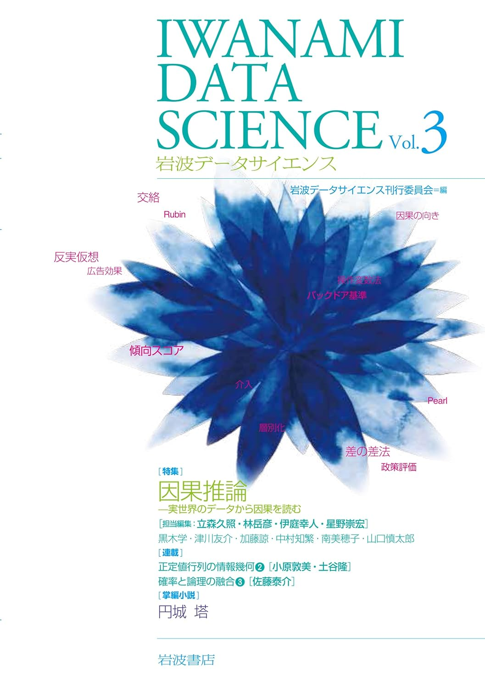](https://www.amazon.co.jp/dp/4000298534)

上で紹介した岩波データサイエンスシリーズの一冊で、因果推論について取り上げた巻です。薄い本ですが、因果推論の手法について短い文で高い密度で説明されており、因果推論の手法がどんなものであるかを短い時間でも理解しやすい教科書です。因果推論の手法がどういうものなのか知りたいときにまず手にとって、興味を深めていくのによい教科書だと思います。

#### 効果検証入門〜正しい比較のための因果推論/計量経済学の基礎([安井翔太 2020](#ref-yasui2020))

[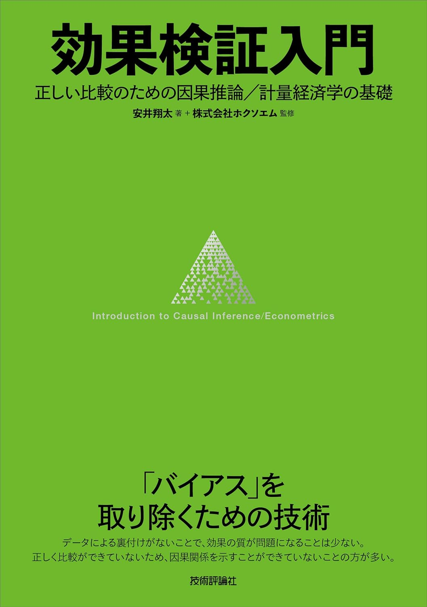](https://www.amazon.co.jp/dp/4297111179)

こちらはこのテキストの49章、50章で説明した回帰による共変量の調整、傾向スコアを用いた手法、差分の差分法、回帰不連続デザインについてより詳しく書かれた教科書になっています。特に回帰による共変量の調整についてはページを割いて詳しく解説されています。また、マーケティング分野への適用の例がたくさん書かれていて、Web広告などのマーケティング分野の方であればより理解しやすいのではないかと思います。

#### 調査観察データの統計科学：因果推論・選択バイアス・データ融合([星野崇宏 2009](#ref-hoshino2009))

[](https://www.amazon.co.jp/dp/4000069721)

因果推論の詳細について詳しく書かれた教科書です。観察研究ではたくさん発生する欠測データについての説明も加えられています。内容は駆け足で、少しついていくのが大変ですので、他の文献で予習した上で読み進めると良いでしょう。内容はかなり難しいですが、傾向スコアを用いた手法で実際に起こりうる問題や欠測、バイアスが生じる理由や生じた場合の調整の方法について詳しく説明されており、実際にデータを分析する際に手元に置いておくと参考になると思います。

この他に、日本語では[KUT 計量経済学応用](https://yukiyanai.github.io/econometrics2/)、英語では、[The Effect: An Introduction to Research Design and Causality](https://theeffectbook.net/)や[Causal Inference in R](https://www.r-causal.org/)、[Causal Inference The Mixtape](https://mixtape.scunning.com/index.html)などのWeb上の教科書もたくさんありますので、目を通してみるとよいでしょう。

### DAGとベイジアンネットワーク

#### Rと事例で学ぶベイジアンネットワーク([Scutari et al. 2022](#ref-1971993809756830770))

[](https://www.amazon.co.jp/dp/4320114655)

英語の同書籍（[Bayesian Networks: With Examples in R](https://www.amazon.com/dp/1482225581)）を翻訳したベイジアンネットワークの教科書です。カテゴリカルデータでのベイジアンネットワーク、正規分布するデータでのベイジアンネットワーク、カテゴリカルデータと正規分布するデータでのベイジアンネットワークと順に解説されており、Rでの事例も豊富に記載されている教科書です。ベイジアンネットワークの原理を基礎から理解する、という目的ではやや使いにくい教科書かもしれませんが、実際のデータ解析では役に立つ教科書だと思います。

#### [Thinking clearly about correlations and causation: Graphcal causal models for observbational data](https://pure.mpg.de/rest/items/item_3224114_7/component/file_3570047/content)

こちらは心理学の先生が書いたDAGと共変量の調整に関する論文です。少し長めの論文で、DAGと調整すべき共変量の関係について、数式ではなく言葉で説明したものとなっています。数式が苦手で言葉で説明してもらった方が分かりやすい方にはこちらで共変量の調整について学ぶのが向いているかもしれません。

### 構造方程式モデリング

#### 共分散構造分析［入門編］

[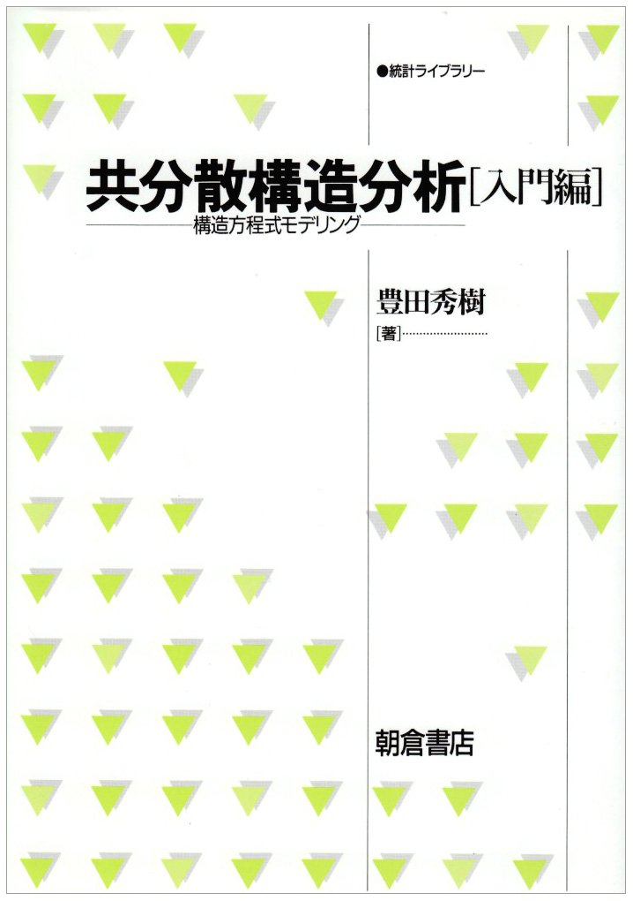](https://www.amazon.co.jp/dp/4254126581/)([豊田秀樹 1998](#ref-kyobunnsannkouzoukaiseki_kiso_bib))

共分散構造分析（構造方程式モデリング）を学ぶのであれば、これをまず読むのがよいでしょう。構造方程式モデリングがどういうものなのか、どのように演算するのか、注意すべきポイントがすべて丁寧に説明されています。

#### 共分散構造分析［R編］

[](https://www.amazon.co.jp/dp/4489021801/)([豊田秀樹 2014](#ref-kyobunnsannkouzoukaiseki_R_bib))

入門後はこれを読んでRでの実際の解析の例を学びながら用いるのがよいでしょう。著者の豊田先生はこの教科書の他にも、[Amos](https://www.ibm.com/jp-ja/products/structural-equation-modeling-sem)という共分散構造分析のためのソフトウェアを使う場合の[教科書](https://www.amazon.co.jp/dp/4489020082)、[AIを用いる手法の教科書](https://www.amazon.co.jp/dp/4489024452)、[因子分析の教科書](https://www.amazon.co.jp/dp/4489021267)なども書かれています。

#### [多変量解析](https://www2.kobe-u.ac.jp/~bunji/files/lecture/MVA/html/index.html)

[神戸大学経営学研究科の分寺先生](https://www2.kobe-u.ac.jp/~bunji/)が講義のために準備された教科書です。無料で公開されており、正直、私が準備したテキストなど読んでいる暇があるならこちらを読んだ方がよほど勉強になると思います。構造方程式モデリングについてはこの教科書があるから私は書かなくてもいいかな、と思ったのですが、この教科書の入口を準備した、という意味ぐらいはあるのかなと思います。

## その他

#### R言語徹底解説([Wickham 2016b](#ref-Hadley_Wickham2016-02-10))

[](https://www.amazon.co.jp/dp/432012393X)

Hadley Wickhamの[Advanced R](https://adv-r.hadley.nz/)([Wickham 2019](#ref-Wickham_Hadley2019-05-24))の翻訳で、Rのプログラミング言語としての側面について知っておいた方がよいことが詳しく記載されています。英語版は第2版、日本語版は第1版ですので、できればbookdownで見ることのできる[Advanced R](https://adv-r.hadley.nz/)を読んだ方がよいかもしれません。このテキストのcalloutに記載した細かなR言語の情報がより詳しく記載されており、自分でライブラリを作成したい、といった方は必読の教科書だと思います。

日本語版が発売されてすぐぐらいに一度読んだのですが、当時は何が書かれているのかあまり理解できませんでした。最近読み直したらかなりわかるようになっていました。これが分かるようになると中級R使いぐらいにはなれたような気がします。

#### RとStanで始める ベイズ統計モデリングによるデータ分析入門([馬場真哉 2019b](#ref-%E9%A6%AC%E5%A0%B4%E7%9C%9F%E5%93%892019-07-10))

[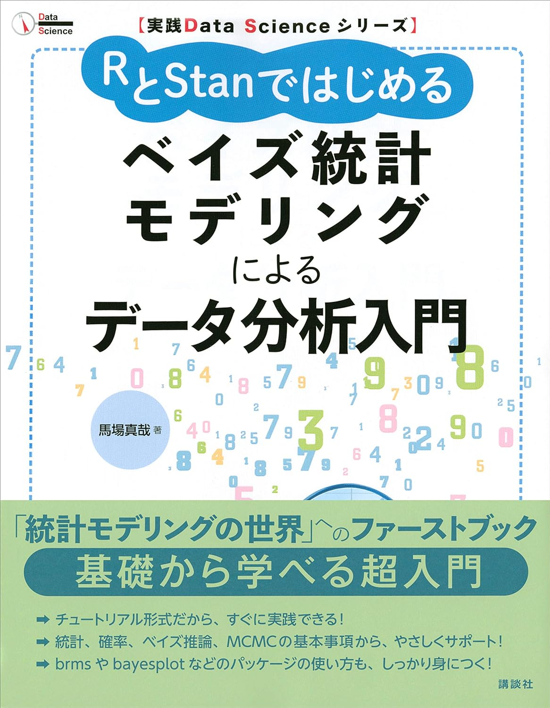](https://www.amazon.co.jp/dp/B07WFD5RFS/)

ベイズ統計入門としてはかなり読みやすい教科書になっています。上記の「データ解析のための統計モデリング入門」と共にベイズ入門編としてとても良い教科書だと思います。

#### StanとRでベイズ統計モデリング([松浦 and 石田 2016](#ref-%E6%9D%BE%E6%B5%A6%E5%81%A5%E5%A4%AA%E9%83%8E2016-10-25))

[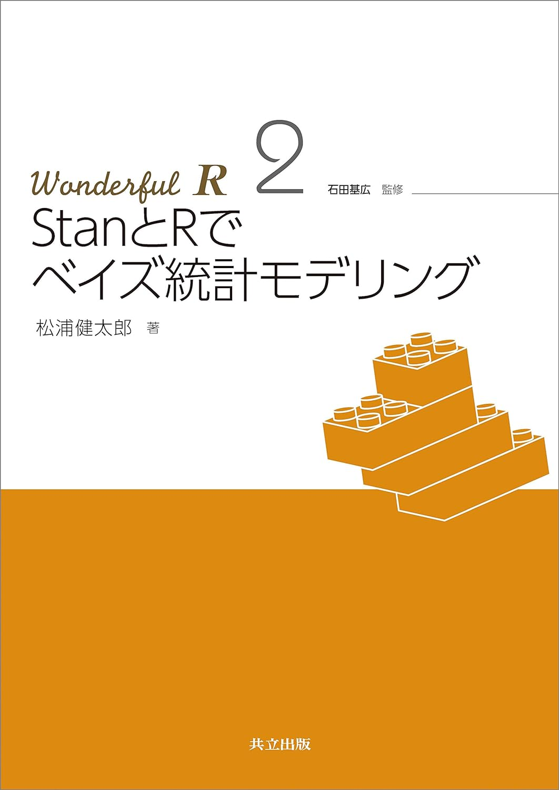](https://www.amazon.co.jp/dp/4320112423/)

ベイズ入門後はこちらを読むとよいでしょう。具体的にベイズ統計でどのようなことができるのか、イメージするのに最適です。

#### 岩波データサイエンス Vol.1~6([岩波データサイエンス刊行委員会 2015](#ref-%E5%B2%A9%E6%B3%A2%E3%83%87%E3%83%BC%E3%82%BF%E3%82%B5%E3%82%A4%E3%82%A8%E3%83%B3%E3%82%B9%E5%88%8A%E8%A1%8C%E5%A7%94%E5%93%A1%E4%BC%9A2015-10-08))

[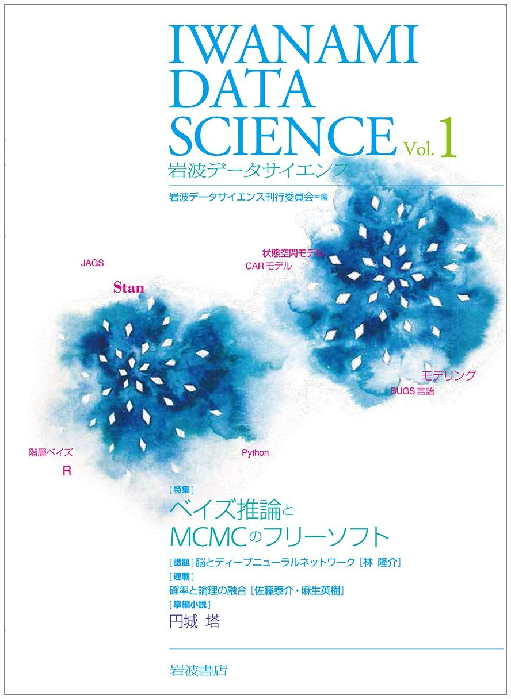](https://www.amazon.co.jp/dp/4000298518/)

岩波データサイエンスシリーズは全6冊の薄めのテキストです。6冊それぞれにテーマ（ベイズとMCMC、自然言語処理、因果推論、地理空間、スパース、時系列）があり、テーマに基づいた解説がされています。教科書と連動した[ページ](https://sites.google.com/site/iwanamidatascience/%E3%83%8B%E3%83%A5%E3%83%BC%E3%82%B9)もあります。比較的手に取りやすいので目を通しやすいテキストですが、内容は難しめです。

#### 欠測データ処理([高橋 and 渡辺 2017](#ref-%E9%AB%98%E6%A9%8B%E5%B0%86%E5%AE%9C2017-12-09))

[](https://www.amazon.co.jp/dp/4320112563/)

データの欠測とそれを補完する手法についてまとめた教科書です。欠測データを埋めるというのは通常の分析ではそれほど行われないと思うのですが、治験ではLOCFやBOCF、回帰モデルを用いた補完などの欠測データ補完が昔からよく用いられています。この教科書ではRを利用した欠測データの補完について解説されています。

#### Optimal Design of Experiments: A Case Study Approach ([Goos and Jones 2011](#ref-Goos_Peter2011-06-28))

[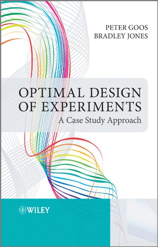](https://onlinelibrary.wiley.com/doi/book/10.1002/9781119974017)

実験計画法の手法であるOptimal Designについて解説した教科書です。各章は著者2人（PeterとBradley）が実験計画で困っている人のところにコンサルタントとして訪問し、Optimal Designを駆使して問題を解決するドラマ仕立てのパートと、そのOptimal Designの解説からなります。ドラマパートに出てくる実験計画で困っている人は、こういうことが実験で知りたい、と語ってくれるため、こういう実験ならどのOptimal Designを使うべきか、比較的容易に理解することができます。Optimal Design自体の解説は解説パートで説明してくれるため、理屈も比較的理解しやすいと思います。Optimal Designの日本語の教科書はほとんどないので、とりあえずこれを読んで入門するのがよいでしょう。

ただし、肝心の計画を作成する部分は、『Peterはおもむろにラップトップを取り出し、ソフトウェアに説明変数を打ち込み始めた。しばらくして、Peterはラップトップをひっくり返して作成された計画を示した。「この実験デザインがいいはずだ」「Oh, Great!」』とか書いてあって、どーやったら計算できるのかは（アルゴリズムが書いてある場合もありますが）具体的にはよくわからない形になっています。実験計画に強いソフトウェア（JMPなど）を使えるのであれば有用な教科書だと思います。Rでは`skpr`を含めいくつかのライブラリがOptimal Designに対応しています。[CRANのDoEのTask View](https://cran.r-project.org/web/views/ExperimentalDesign.html)を調べながらRで実験計画を作成しつつ、教科書を読み進めるのが良いかもしれません。

実験計画法については、日本語では「[はじめよう実験計画](https://www.doe-get-started.com/)」というサイトが公開されていて、このテキストより内容が充実しています。また、英語ではありますが[University Southamptonの統計学の授業のテキスト](https://statsdavew.github.io/math3014-6027-notes/)や[Southern Illinois Universityの統計学のテキストの7章](http://parker.ad.siu.edu/Olive/rch7.pdf)、[8章](http://parker.ad.siu.edu/Olive/rch8.pdf)、[9章](http://parker.ad.siu.edu/Olive/rch9.pdf)にも実験計画について詳しく書かれていて、参考になります。

#### [Lead2Amazon](https://lead.to/amazon/jp/)

上記の教科書のReferenceは大体このページを利用してbibtexに変換して登録しています。ですので、Referenceのリンクは大体Amazonの販売ページに繋がっています。このテキストを読むことで、教科書の売り上げが1冊でも増えればいいなと思います。

#### [(Rで)マイクロアレイデータ解析](https://www.iu.a.u-tokyo.ac.jp/~kadota/r.html)

Rの入門時にお世話になったページです。生物系でかつ、マイクロアレイやHiSeqを用いるような方以外にはあまり必要のないものですが、実際の多変量解析で必要となる様々な手順が記載されています。

## 実行環境

``` downlit
sessionInfo()
```

    R version 4.6.0 (2026-04-24 ucrt)
    Platform: x86_64-w64-mingw32/x64
    Running under: Windows 11 x64 (build 22631)

    Matrix products: default
      LAPACK version 3.12.1

    locale:
    [1] LC_COLLATE=Japanese_Japan.utf8  LC_CTYPE=Japanese_Japan.utf8   
    [3] LC_MONETARY=Japanese_Japan.utf8 LC_NUMERIC=C                   
    [5] LC_TIME=Japanese_Japan.utf8    

    time zone: Etc/GMT-9
    tzcode source: internal

    attached base packages:
    [1] stats     graphics  grDevices utils     datasets  methods   base     

    loaded via a namespace (and not attached):
     [1] htmlwidgets_1.6.4 compiler_4.6.0    fastmap_1.2.0     cli_3.6.6        
     [5] tools_4.6.0       htmltools_0.5.9   otel_0.2.0        rstudioapi_0.18.0
     [9] rmarkdown_2.31    knitr_1.51        jsonlite_2.0.0    xfun_0.57        
    [13] digest_0.6.39     rlang_1.2.0       evaluate_1.0.5   

## 文献

以下は文献のリストとなります。

Chang, Winston. 2019. *Rグラフィックスクックブック 第2版 ーggplot2によるグラフ作成のレシピ集*. 単行本（ソフトカバー）. Translated by 石井弓美子, 河内崇, and 瀬戸山雅人. オライリージャパン. <https://www.amazon.co.jp/dp/4873118921/>.

Cook, Dianne, and Ursula Laa. 2024. *Interactively Exploringhigh-Dimensional Data and Models in r*. <https://dicook.github.io/mulgar_book/>.

Goos, Peter, and Bradley Jones. 2011. *Optimal Design of Experiments: A Case Study Approach (English Edition)*. Wiley. <https://onlinelibrary.wiley.com/doi/book/10.1002/9781119974017>.

Hadley Wickham, Garrett Grolemund, Mine Çetinkaya-Rundel. 2024. *R言語ではじめるデータサイエンス*. 単行本. Translated by 大橋真也. <https://www.amazon.co.jp/dp/4814400772>.

J. J. Allaire, Yihui Xie ahd, and Garrett Grolemund. 2023. *R Markdown: The Definitive Guide*.

Moore, Dirk F. 2016. *Applied Survival Analysis Using r (Use r!) (English Edition)*. Kindle版. Springer. <https://www.amazon.co.jp/dp/B01FKDTW3W/>.

Neale Batra, Paula Blomquist, Alex Spina. 2021a. *The Epidemiologist r Handbook*. <https://doi.org/10.5281/zenodo.4752646.svg>.

Neale Batra, Paula Blomquist, Alex Spina. 2021b. *疫学のための r ハンドブック*. Translated by 瞳齋藤 雄介. <https://doi.org/10.5281/zenodo.4752646.svg>.

Scutari, Marco, Jean-Baptiste Denis, 財津亘, and 金明哲. 2022. *Rと事例で学ぶベイジアンネットワーク*. 共立出版. <https://cir.nii.ac.jp/crid/1971993809756830770>.

Sievert, Carson, and 株式会社ホクソエム. 2022. *Rによるインタラクティブなデータビジュアライゼーション: 探索的データ解析のためのplotlyとshiny*. 単行本. Translated by 輿石拓真, 今井康貴, 髙木誠二, 和田尚樹, and 株式会社ホクソエム. 共立出版. <https://www.amazon.co.jp/dp/4320124863/>.

Wickham, Hadley. 2016a. *Ggplot2: Elegant Graphics for Data Analysis (Use r!)*. ペーパーバック. Springer. <https://www.amazon.co.jp/dp/331924275X/>.

Wickham, Hadley. 2016b. *R言語徹底解説*. 単行本. Translated by 石田基広, 市川太祐, 高柳慎一, and 福島真太朗. 共立出版.

Wickham, Hadley. 2019. *Advanced r, Second Edition (Chapman & Hall/CRC the r Series) (English Edition)*. Kindle版. Chapman; Hall/CRC.

Wickham, Hadley, Cetinkaya-rundel Mine, and Garrett Grolemund. 2023. *R for Data Science: Import, Tidy, Transform, Visualize, and Model Data*. ペーパーバック. O’Reilly Media. <https://www.amazon.co.jp/dp/1492097403/>.

Wood, S. N. 2017. *Generalized Additive Models: An Introduction with r*. 2nd ed. Chapman; Hall/CRC.

Xie, Yihui. 2016. *Bookdown: Authoring Books and Technical Documents with R Markdown*. Chapman; Hall/CRC. <https://bookdown.org/yihui/bookdown>.

Xie, Yihui. 2024. *Bookdown: Authoring Books and Technical Documents with r Markdown*. <https://github.com/rstudio/bookdown>.

久保拓弥. 2012. *データ解析のための統計モデリング入門 一般化線形モデル・階層ベイズモデル・MCMC (確率と情報の科学)*. 単行本. 岩波書店. <https://www.amazon.co.jp/dp/400006973X/>.

奥村晴彦, and 石田基広. 2016. *Rで楽しむ統計 (Wonderful r 1)*. 単行本. Edited by 市川太祐, 高橋康介, 高柳慎一, and 福島真太朗. 共立出版. <https://www.amazon.co.jp/dp/4320112415/>.

安井翔太. 2020. *効果検証入門〜正しい比較のための因果推論/計量経済学の基礎*. 単行本. <https://www.amazon.co.jp/dp/4297111179>.

宋財泫, and 矢内勇生. 2020. *私たちのr ベストプラクティスの探求*. <https://www.jaysong.net/RBook/>.

小森政嗣. 2022. *RとStanではじめる　心理学のための時系列分析入門 (Ｋｓ専門書)*. Kindle版. 講談社. <https://www.amazon.co.jp/dp/B0BLHBPTWT/>.

山田剛史, 杉澤武俊, and 村井潤一郎. 2008. *Rによるやさしい統計学*. オーム社. <https://www.amazon.co.jp/dp/B00E06CJP4/>.

岩波データサイエンス刊行委員会, ed. 2015. *岩波データサイエンス Vol.1*. 単行本（ソフトカバー）. 岩波書店. <https://www.amazon.co.jp/dp/4000298518/>.

岩波データサイエンス刊行委員会. 2016. *岩波データサイエンス Vol.3 因果推論*. 単行本. <https://www.amazon.co.jp/dp/4000298534>.

川端一光, 岩間徳兼, and 鈴木雅之. 2018. *Rによる多変量解析入門 データ分析の実践と理論*. 単行本（ソフトカバー）. オーム社. <https://www.amazon.co.jp/dp/4274222365/>.

星野匡郎, 田中久稔, and 北川梨津. 2023. *Rによる実証分析 (第2版): 回帰分析から因果分析へ*. 単行本. <https://www.amazon.co.jp/dp/4274230023>.

星野崇宏. 2009. *調査観察データの統計科学: 因果推論・選択バイアス・データ融合 (シリーズ確率と情報の科学)*. 単行本. <https://www.amazon.co.jp/dp/4000069721>.

村上大輔. 2022. *実践Data Scienceシリーズ Rではじめる地理空間データの統計解析入門 (Ks情報科学専門書)*. 単行本（ソフトカバー）. 講談社. <https://www.amazon.co.jp/dp/406527303X/>.

東京大学教養学部統計学教室, ed. 1991. *統計学入門 (基礎統計学ⅰ)*. 単行本. 東京大学出版会. <https://www.amazon.co.jp/dp/4130420658/>.

松井秀俊, and 小泉和之. 2019. *統計モデルと推測 データサイエンス入門シリーズ*. Kindle版. Edited by 竹村彰通. 講談社. <https://www.amazon.co.jp/dp/B08543S1LQ/>.

松浦健太郎, and 石田基広. 2016. *StanとRでベイズ統計モデリング (Wonderful r 2)*. 単行本. Edited by 市川太祐, 高橋康介, 高柳慎一, and 福島真太朗. 共立出版. <https://www.amazon.co.jp/dp/4320112423/>.

梅津雄一, and 中野貴広. 2018. *RとShinyで作るWebアプリケーション*. 単行本（ソフトカバー）. シーアンドアール研究所. <https://www.amazon.co.jp/dp/4863542577/>.

舟尾暢男. 2016. *The R Tips 第3版 データ解析環境Rの基本技・グラフィックス活用集*. オーム社. <https://www.amazon.co.jp/dp/B0719QS6KG/>.

舟尾暢男. 2020. *Rによるデータ分析のレシピ*. 単行本. <https://www.amazon.co.jp/dp/4274226255>.

舟尾暢男. 2026. *Rで学ぶプログラミングの基礎の基礎*. 単行本. <https://www.amazon.co.jp/dp/4877835520>.

豊田秀樹. 1998. *共分散構造分析: 構造方程式モデリング (入門編)*. 単行本. <https://www.amazon.co.jp/dp/4254126581>.

豊田秀樹. 2014. *共分散構造分析 (R編)*. 単行本. <https://www.amazon.co.jp/dp/4489021801>.

金明哲. 2017. *Rによるデータサイエンス(第2版):データ解析の基礎から最新手法まで*. 単行本（ソフトカバー）. 森北出版. <https://www.amazon.co.jp/dp/462709602X/>.

金森敬文. 2017. *Rによる機械学習入門*. 単行本. オーム社. <https://www.amazon.co.jp/dp/4274221121/>.

鈴木努. 2017. *ネットワーク分析 第2版 (Rで学ぶデータサイエンス 8)*. 単行本. Edited by 金明哲. 共立出版.

阿部真人. 2021. *データ分析に必須の知識・考え方　統計学入門　仮説検定から統計モデリングまで重要トピックを完全網羅*. Kindle版. ソシム. <https://www.amazon.co.jp/dp/B09M81WRHT/>.

馬場真哉. 2018. *時系列分析と状態空間モデルの基礎: RとStanで学ぶ理論と実装*. 単行本. プレアデス出版. <https://www.amazon.co.jp/dp/4903814874/>.

馬場真哉. 2019a. *R言語ではじめるプログラミング言語とデータ分析*. 単行本. <https://www.amazon.co.jp/dp/B083Q476KN>.

馬場真哉. 2019b. *実践Ｄａｔａ　Ｓｃｉｅｎｃｅシリーズ　ＲとＳｔａｎではじめる　ベイズ統計モデリングによるデータ分析入門 (Ｋｓ情報科学専門書)*. Kindle版. 講談社. <https://www.amazon.co.jp/dp/B07WFD5RFS/>.

高橋将宜. 2022. *統計的因果推論の理論と実装 (Wonderful r)*. 単行本. <https://www.amazon.co.jp/dp/4320112458>.

高橋将宜, and 渡辺美智子. 2017. *欠測データ処理: Rによる単一代入法と多重代入法 (統計学One Point 5)*. 単行本. 共立出版. <https://www.amazon.co.jp/dp/4320112563/>.

高橋康介, and 石田基広. 2018. *再現可能性のすゝめ (Wonderful r 3)*. 単行本. Edited by 高橋康介, 市川太祐, 高柳慎一, 福島真太朗, and 松浦健太郎. 共立出版.

Back to top
