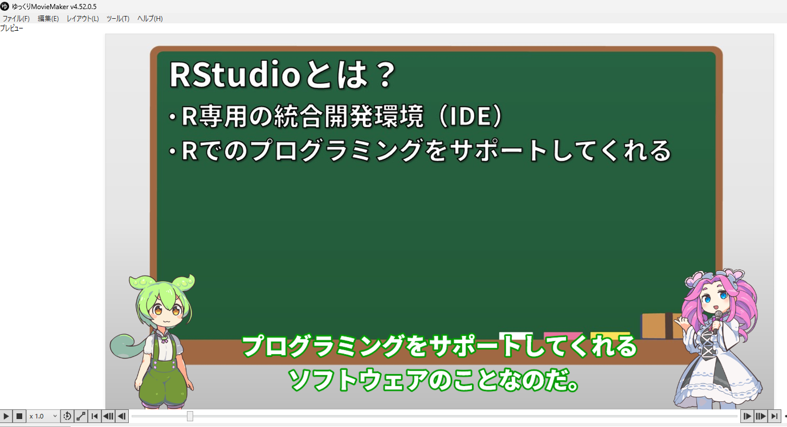

# おわりに

Code

## ver.0.4.4.3 (2026/5/17)

- TipsとしてS4クラスについて記載しました。
- Tips：並列演算に`progressr`パッケージについて追記しました。
- Tips：並列演算の`doMC`の記載が間違っていたので修正しました。
- 10章：`devtools::install_github`がパッケージから取り除かれたので、`pak::pak`で書き換えました。
- 37章：リストテーブルについての記載を追加しました。
- 48章：`mixexp`パッケージがCRANから取り除かれたので、githubのレポジトリからインストールするよう追記しました。いずれはなくなってしまうかもしれません。Mixture Experimentのライブラリはあまりないため、しばらくは`pak::pkg_install("https://cran.r-project.org/src/contrib/Archive/mixexp/mixexp_0.5-1.tar.gz")`などの方法でアーカイブからインストールして用いるのがよいのかもしれません。

S4についてまとめて記載しました。S4については長くRに備わっている割には日本語の資料がありません。というか、英語の資料も新しいものはほとんどありません。S4よりよくできたOOPのクラスであるR6や、新しいS7の方が最近はよく使われているのかもしれません。

そもそも私はノンプログラマーで、統計家でもなく、もちろんデータサイエンティストでもありません。Rユーザーには私のような方が多い（と思う）ので、S4を学ぶニーズがあまりないのでしょう。私も長くRを使っていますが、スクリプトを書いていて突然S4クラスを設計したくなることは今までありませんでした。

R6はShinyに使えるそうなので、R6とShinyへの適用についてどこかに記載したいと思います。また、Shinyを[WebAssambly](https://ja.wikipedia.org/wiki/WebAssembly)（というか[WebR](https://docs.r-wasm.org/webr/latest/)）でサーバーレスのWebブラウザ内で実行できる[shinylive](https://posit-dev.github.io/r-shinylive/)というパッケージがあるようですので、使い方を記載したいなあと思っています。

ただ、Shinyの使い方を忘れてしまったので、適当なShinyアプリを作るのが大変です。少し苦戦しそうです。

また、このテキストも随分長くなってしまって、理解が難しくなってきました。文字を読むのが苦手な方もいるので、もう少し簡単な資料が欲しい、ということで動画を作ってみています。

5分の動画を作るのに2時間ぐらいかかるうえ、ライセンスフィーも発生します。持ち出しが多くて困ったものです。とりあえず1年ぐらいで100本ほど作成してみて、良さそうならYoutubeに上げてみようかと思います。

【立ち絵素材】

[坂本アヒル様（ずんだもん）](https://seiga.nicovideo.jp/seiga/im10788496)

[坂本アヒル様（四国めたん）](https://seiga.nicovideo.jp/seiga/im10791276)

## ver.0.4.4.2 (2026/4/19)

- Tipsとしてシステム関連の関数について記載しました。
- TipsとしてS3クラスについて記載しました。
- ライブラリとパッケージの記載が曖昧だったので、修正しました。
- 文献をいくつか追加しました。
- 4章に`rm`関数の記載を追加しました。
- 16章に`attach`と`detach`の説明を追記しました。
- 34章に一般化Wilcoxon検定の演算方法を追加しました。
- `pryr`パッケージがCRANからRemoveされたので、後続の`sloop`パッケージで書き直しました。

並列演算について書いた後、何を書くか考えるために初心者用の教科書を読んだり、Advanced Rを読んだり、RのReferenceを読んでいました。まだまだRには知らないことが多いです。S3について書いたので、S4やS7についても勉強して書いてみたいところです。Webスクレイピングや欠測について書くはずだったんですが、書き始めてから3年経っても書けていません。どこかからやる気が湧いてきて、書けるといいんですが、余計なことばかりやってしまいます。

## ver.0.4.4.1 (2026/3/20)

- Tipsとして並列演算（Parallel Computing）について記載しました。
- 誤記等を修正しました。

並列演算について、`future`と`futurize`という使いやすいライブラリが開発されているので追記してみました。`futurize`を用いれば繰り返し演算を簡単に並列化でき、モンテカルロ計算やブートストラップを用いる際には役立ちそうです。

## ver.0.4.4（2026/3/14）

- 49、50、51章（因果推論）を追加しました。
- 13章の`stringr::str_c`と`stringr::str_flatten`の違いの記載を修正しました。
- 20章の`dplyr`の説明に`mutate_if`、`mutate_at`、`mutate_all`の説明を加えました。
- 26章に`expand_limits`の説明を加えました。
- 29章に`broom`について追記しました。
- 32章に`factoextra`について追記しました。
- 34章に`survminer::ggforest`と`survminer::ggsurvplot_facet`について記載しました。
- 誤記等を修正しました。

因果推論についての章を追加しました。難産、というかまだ生まれていないという感じで、書き始めてしまったことを後悔し、書くのに大変苦労しました。数年前から教科書を買ったり読んだりしていたので、考えをまとめるために書き始めたのですが、ちょっと書くととたんに手法の意味がわからなくなり、勉強したり現実逃避したりしていたらあっという間に半年以上が過ぎていました。

正直、内容はまともなものではなく、便所の落書きかチラシの裏のなぐり書きみたいなものです。「なんとなくこういう手法がある」ということが伝わればいいなと思います。

あちこちに書いているように、私には統計の知識はあまりなく、下手の横好き・素人に毛が生えたぐらいなので、間違いがたくさん含まれています。統計について書いているのは、自分の勉強であること、自分のためのメモという以外には、「R-tipsにも書いてあったから」ぐらいの理由しかありません。各手法については[参考文献](references.llms.md#%20因果推論)を参照してよく勉強し、理解した上で利用していただければと思います。

「因果推論」というのは手法としても難しいですが、言葉としても難しいものです。そもそも「因果」というのが実態としてどういうものなのかわからない。科学哲学の本を取ると「因果は存在するのか」というところから話が始まってしまいます。因果の定義というものはなく、定義のないものを推論するというのもよくわかりません。

科学で取り扱うものは大体「因果を推論している」ため、特定の手法に「因果推論」という言葉を当てはめるのもあまりピンときません。実際に教科書を読むと、あれも因果推論、これも因果推論といった形でいろんな手法が紹介されています。文中には因果推論の手法としてよく紹介されるものを記載しています。

------------------------------------------------------------------------

私は理学部出身です。理学部というのは、「実学をしない」ことがアイデンティティである学部です。実学をするなら工学部や薬学部、医学部に行けばいいわけです。したがって、理学部はすぐには役に立たない研究をすることに特化しています。

そういうわけで役に立たない研究をするわけですが、研究では何をやってもいい、というわけではありません。研究には美しい研究とそうではない研究があります。理学では、研究者個々人が美しいと思う研究をしようとしてします。

「美しい研究」の定義は人によって異なりますが、少なくとも私にとっては以下を満たすことが美しい研究です。

- 仮説が明確で論理的であること
- シンプルな実験系であること
- 結果が明確に仮説を支持していること
- 研究結果が今までの常識とは異なること

ニュートンのプリズムの実験や万有引力、アインシュタインの相対性理論などはこの条件を完全に満たしています。生物学では、ニュートンやアインシュタインと比べるのは難しいですが、個人的には以下の2つがシンプルで美しいと思います。

- F1-ATPaseが回転していることをアクチン繊維をくっつけて証明した論文([Noji et al. 1997](#ref-noji1997direct))
- 体表面の色がシグナルの拡散から説明できることを魚の縞模様の移動で説明した論文([Kondo and Asai 1995](#ref-kondo1995reaction))

これらの研究に共通しているのは、基本的に要素還元的であることです。要素還元的、つまり部分的に要素を切り取ることでシンプルな系とし、実験で評価できる形にしています。また、シンプルな系はわかりやすく、理解が難しくありません。

私も研究は要素還元的であるべきだとの考えのもとで、生物学のうちの生理学を対象として研究をしていました。しかし、生理学というのは生物というブラックボックスに処置という入力を加えて出力を評価する学問です。ブラックボックスの中に無数の要素が含まれており、要素還元的とは遠い存在です。RCTをすると因果がわかる、みたいなことを文中には書きましたが、実際にはRCTを使って結果を得てもブラックボックスの中身が不明でいまいち因果がわからない、なんてことはザラにあります。

生物学で要素還元を突き詰めるとタンパク質の立体構造研究に至ることになります。タンパク質は生物学の根源的な要素の一つであり、ブラックボックス的ではないからです。しかし、立体構造を調べるとなるとタンパク質の精製と結晶化、X線回折やNMRなどの手法を用いた、少し毛色の違う研究になります。立体構造の研究はどちらかというと予算や人手によって成果が出る分野であり、生理学のようなアイデア勝負のような研究ではなくなります。たくさんの生物種の中から1生物種を選び、1生物種に数千〜数万個あるタンパク質から1つを選んで評価することの意味も（実学的な意味を省いてしまうと）いまいちわかりません。要は、私には立体構造の研究は面白そうには見えませんでした。

生理学のブラックボックスを正しく理解するには、要素還元的アプローチだけでなく、複雑な系を複雑なまま受け入れる、複雑系的なアプローチもあり得ます。ちょうど因果推論のRubinのアプローチとPearlのアプローチがそれぞれ要素還元的アプローチと複雑系的アプローチに近いと思います。

複雑系的なアプローチではブラックボックスをそのまま受け入れるため、真のメカニズムに近づくことができるかもしれません。しかし、複雑系的アプローチを取ると結果を解釈することが難しくなります。51章で紹介したベイジアンネットワークや構造方程式モデリングは数式的には（難しいですが）理解はできるんですが、結果を全体として解釈するのは難しいです。生理学では遺伝子発現や代謝、タンパク質間の相互作用のネットワークが示されることがよくありますが、これらも大体理解し難く、「美しい研究」と判断し難くなります。要は、私は美しさの要素として「ヒトとして理解できるかどうか」を評価していたようです。

研究としては要素還元的の端であるタンパク質の構造解析と反対の端にある複雑系的アプローチしか取らなくていいはずですし、理解可能性に重点を置く必要はないはずなのに、（少なくとも私は）研究的に面白かったり美しかったりするもの、理解できるものに囚われてしまいます。このあたりはヒトが感じる美的感覚、面白い研究をしたいというエゴ、ヒトとしての理解可能性と、研究本来の目的である知識の蓄積との整合性が取れていないことが原因のように思います。

また、ヒトは収入を得て食べていく必要があります。研究者もこの仕組みから逃れることはできません。ですので、収入を得るための研究という、本来の目的からずれたことを始めてしまいます。科学者をやっていた最後の頃は、このあたりの矛盾にずっと悩んでいたように思います。

美的感覚やエゴ、理解すること、収入を得ることから開放されたAIのほうが、ヒトよりも研究に向いているのかもしれません。ヒトとしてのカルマがない、つまりAIは生まれながらの如来、ニルヴァーナに至ったものなのです（と思ったのですが、どうもAIは[ヒトからカルマも吸収してしまう](https://gigazine.net/news/20260310-afim-llm-academic-fraud/#google_vignette)ようです。ヒトの業の深さを感じます）。

ヒトが研究する時代が終わり、AIのみが研究を始めるようになった時、ヒトのカルマから解放された真のサイエンスが始まるのかもしれません。統計やAIの研究者の方にはぜひ頑張って、真のサイエンスの時代の始まりに貢献してもらいたいものです。

## ver.0.4.3.1 (2025/10/1)

- 48章（実験計画法）を追加しました。
- `plot`関数と`ifelse`関数でグラフの要素を調整する方法を24章に追加しました。
- 効果量とCohen’s dについて29章に追加しました。
- 34章に記載していた`survivalAnalysis`パッケージがCRANからRemoveされたので、`coxph`の機能でフォレストプロットを作成する方法に書き直しました。
- 誤記等を修正しました。

実験計画法には昔から長らく興味はあり、手元に数冊教科書もあったのですが、いまいち勘どころがわからず放置していました。実験計画法というと、Lにいっぱい数値がくっついていて、ラテン方格や魔法陣、直交表といった言葉がちりばめられた教科書が多く、勉強しても煙に巻かれたような気持ちになったものでした。今回自分で少しまとめてみて、ちょっとだけその意味について理解が深まったような気がします。章はAdvancedな手法に記載していますが、全然Advancedな内容ではないので、章立てを見直すかもしれません。

最近（2024年）、[Optimal Designの教科書](https://www.amazon.co.jp/Optimal-Design-Experiments-Approach-English-ebook/dp/B005DIAPC2/ref=sr_1_1?__mk_ja_JP=%E3%82%AB%E3%82%BF%E3%82%AB%E3%83%8A&crid=3SE4RU3HUQVHH&dib=eyJ2IjoiMSJ9.WwOkF23BUq-PdaJ-gslMTG3ypeDGmtgAxsjeiZx1DdTYFCEw_8-Lu69-faL4SLqBOJBlHCr6CgcqwFfk2CGKFaeyS9ZfOvxTVxyO5NAT5xZvEf7NaK7WwQ7JB0ofwrj_vN5zKQW8R1eGktBVaRemykPSZjtppKQi5c9oy8KvCneEftldVI2C2IbM_n8wpXRG.eme8Jznd7x0d6TEaiu23Qmt-9My589NtDY55TSpZtAM&dib_tag=se&keywords=Optimal+design+of+experiments&qid=1758288255&sprefix=optimal+design+of+experiments%2Caps%2C165&sr=8-1)([Goos and Jones 2011](#ref-Goos_Peter2011-06-28))を購入したので少しずつ読み進めていました。対話篇みたいになっていてやや読みにくく、全然読み進められない上に、実際のOptimal Designの作成については「ラップトップを颯爽と取り出し、計算をさせると…」といった記載になっています。Optimal Designの意味は丁寧に説明してありますが、Optimal Designの計算ができるソフトウェアがないとどうにも実感がありませんでした。実験計画法は工学と密接にかかわっていて工学的に重要であるため、企業が使うことを想定した有料のソフトウェアが多く、生かしどころが分からなかったのですが、`skpr`([Morgan-Wall and Khoury 2021](#ref-skpr_bib))を見つけて少しやる気になり、せっかくなのでfactorial designやfractional factorial designの勉強にも手を出してみました。もう少し勉強をすすめ、理解を深めたいところです。

生物学の徒であった頃、実験計画法を使っている人は周りにほとんどいませんでした。今回実験計画法を学んでみて、どうもばらつきが大きすぎると利用するのが難しい、というのがなんとなく理解できました。工学の世界で実験計画法が使われているのは、生物のようによくわからない過剰な複雑系ではなく、系がシンプルで比較的素直にばらつきなく説明変数に対して目的変数が応答するからかもしれません。生物学のような超複雑系では、どちらかというと力業でデータを取りまくるか、シンプルな実験系を用いる方がよいのでしょう。私の周りにいた優秀な生物学者たちもみなシンプルな系を生かした力業でなんとかしていたように思います。

## ver.0.4.3 (2025/6/30)

- R markdown、Quartoの章を拡充し、9章分（35～43章）に記載しました。
- 章の変更に伴い、44～47章をずらしました。
- `tibble`の記載に不足があったため追記しました。

思っていた以上にQuartoの章が長くなりました。特に小分けにしたわけではないのですが、Quartoの内容拡充に伴い中身が長くなりました。思っていたより知らないYAMLやchunkの機能があり、勉強になりましたが、内容の確認等でもう少し修正が必要です。これ以上内容のあるものを書くのであれば、1冊丸々をQuartoに捧げないとダメそうですので、より詳細を知りたい方は[QuartoのGuide](https://quarto.org/docs/guide/)や[Reference](https://quarto.org/docs/reference/index.html)を参照いただければと思います。文章も書いたばかりで読みにくいかと思いますので、少しずつ修正いたします。

## ver.0.4.2.3 (2025/5/2)

- 3章を5つ（3～8章）に分けました。
- 章の変更に伴い、各章の番号をずらしました。
- [favicon](https://ja.wikipedia.org/wiki/Favicon)を作成し、本のimageを追加しました。

章立てを変更したため、リンクの接続を大幅に見直しました。リンク先が間違っている箇所があるかもしれません。Web上でチェックし、修正していく予定です。Quartoに関する部分を38章から独立させ、39章あたりに置こうと思っています。少し長くなりそうなので、Quartoだけで2～3章ぐらいになってしまうかもしれません。Quartoの章立てに従い、Shinyの章もずれる予定です。

## ver.0.4.2 (2025/4/22)

- 25章に`binom.test`と`prop.test`を追加しました。
- 26章の`lm`関数の記載、線形混合モデルの記載を修正しました。
- githubへのリンク、twitter・facebookへのリンクを追加しました。

文書をGithub Pagesにデプロイした結果、自分で文章を見直す機会が増え、修正がはかどるようになりました。また、[Google Analyticsへの接続の方法](https://quarto.org/docs/reference/projects/websites.html)が分かりましたので、[Google Analytics](https://developers.google.com/analytics?hl=ja)でアクセスを確認できるようになりました。大体自分がアクセスしているようです。[Google search console](https://search.google.com/search-console/welcome?hl=JA)に登録はしているのですが、sitemapをGoogleが読みこんでくれず、Google検索でまだ引っかかってきません。人に見てもらえるようになるにはもう少しかかりそうです。

教科書を書くのはなかなか大変ではありますが、自分で書いた教科書ほど自分で読むものもありません。読めば読むほど理解と疑いが膨れていくため、非常に勉強になります。オンラインで見れるようにすると、いつでもどこでも自分専用の、自分が最も読みやすく感じる教科書が読めます。一連の手法についてまとめて学ぶのであれば教科書を書き、公開し、自分で何度も読むのが最もよいのではないかと思います。

その昔（2000年頃）、Googleで検索すれば何でもわかるようになりました。検索すればなんでもわかるのだから、記憶することに意味がなくなる、記憶の外部化が起こるんじゃないかと思っていました。2025年になっても未だに記憶することは重要で、記憶は外部化できていません。

2015年頃、[Tesla](https://www.tesla.com/ja_jp)が中心となって自動運転技術が進展しているように見えました。10年後には自動車はすべて自動運転になり、渋滞はなくなり、タクシーやバス、トラックの運転手はいなくなるんじゃないかと思っていました。2025年になっても自動運転は夢の技術で、未だに渋滞でブレーキペダルを踏んで時間をつぶしています。タクシーはともかくバスやトラックドライバーは人手が全く足りていません。

2025年現在、AI開発は花盛りで、AIを使いこなせなければ仕事がなくなる、AIが代替できる仕事はすべてなくなるとされています。正直、仕事などすべてAIに丸投げして、みんながベーシックインカムで生きる世の中になればハッピーなので、是非私の仕事など置き換えてもらいたいところではあります。しかし、上記の通り、思っているよりも技術をうまく使いこなすのは難しく、将来を予測するのはもっと難しいです。無意味な仕事を生み出しては消費していく社会はなかなか変わらず、記憶の外部化もなかなかできず、しばらくは今と大きく変わらない世の中のままなのでしょう。

そもそもAIに仕事を全部任せてしまうと、AIの契約を打ち切られたときに仕事が全く回らなくなります。アメリカのAIを使うにしても、中国のAIを使うにしても、AIが使えなくなるリスクがある限り、なかなか人を切ることはできないのかもしれません。

したがって、しばらくはAIに色々教えてもらいながら、ブレーキを踏み、この教科書を読み、知識を内部化し、生きていくことになりそうです。つらいので偉い人には早く何とかしてほしいところです。

## ver.0.4.1 (2025/4/7)

- 19章（コーディング規約）を追記しました。
- リンクの修正、関数の記載の間違い等を修正しました。

## ver.0.4 (2025/3/18)

- 文書を修正し、github pagesで公開しました。

この文書をどうするべきか、しばらく悩んでいました。著作権的にはちょっと怪しげな部分があり（helpで表示されるコードとほぼ同じ部分がある、文献は引用はしているはず）、収益性のあるようなものにはできず、自分が勤めている企業のために作成したものであるものの、企業のコンプライアンス的に企業名などを出すのは難しい、しかし自社には読んでくれる人がいない。間違いがあるのも気になるところで、このまま放置してもよかったのですが、せっかく作ったものですので、公開してみることにしました。

この文で収益をあげる意思は全くなく、できればこのテキストをきっかけに参考文献・教科書を購入してRコミュニティに貢献してくれる方が増えるとよいなと考えています。

PythonがRの役割をほぼこなせるようになり、Rの居場所はなくなっていくのかもしれません。しかし、過去のプログラミング言語もなんだかんだで生き残っているものが多いです。Rがしぶとく生き残るために少しでも貢献できるとうれしいです。

## ver 0.3 (2024/10/19)

- 33章（ネットワーク解析）を追加しました。
- 34章（Rmarkdown・Quarto）を追加しました。
- 35章（Shiny）を追加しました。
- 全体を読み直し、修正しました。

ネットワーク解析、Rmarkdown・Quarto、Shinyの解説を書くのに4か月、はじめから読み直して文書やコードを修正するのに2か月かかりました。特にネットワーク解析は一から勉強したのでなかなか大変でした。文章のボリュームが多すぎて、一度読み通すだけでもなかなか大変です。一から学ぶような場合を除けば、興味のある部分から読み進めてもらった方がよいかもしれません。特に地理空間情報、ネットワーク解析、Shinyあたりは使う人・使わない人が大きく分かれる分野のように思います。

この教科書は元々社内教育のために作成し始めたものです。大分ボリュームも大きくなりましたが、社内には読んでくれる人がほぼいません。せっかく作ったものですので、オンラインで公開する準備を進めたいと思います。

[2024年のノーベル化学賞・物理学賞](https://www.nobelprize.org/all-nobel-prizes-2024/)にAI関連の技術が選ばれたように、AI開発が花盛りといったところです。AIについては不勉強でよくわからないのですが、基本的には言語モデルであると理解しています。どのAIもGithubなどを学習していると思うので、RのスクリプトもAIに聞けば教えてくれる時代になっていくのだと思います。そのうちAIが機械語を直接書き出すかもしれません。そうなるとAIのやっていることが完全にブラックボックスになってしまうので、未来は面白いことになりそうです。

将来的にAIで直接統計ができるようになるのは間違いないですが、もうしばらくは統計を行うためにRのスクリプトを教えてもらうような使い方が続くんじゃないかなと思います。また、秘密情報の関係でデータをAIに教えられない場合も多々あります。大企業であれば秘密情報を投げられるAIを契約できても、中小企業や個人経営者、大学の研究者などがそのような契約に大金を支払うのは難しいでしょう。

そもそもAIはとてつもなく計算力を食います。つまり全くエコではないので、大企業がエコを歌いながらAIを使い倒す、というのも何だか矛盾しているように思います。早く仕事も研究もAIにバトンタッチしたいところではありますが、そこらへんにいるヒトはArtificialではないですが、運動機能付きのIntelligenceです。精々2000 kcal/日ぐらいで動くIntelligenceであるヒトを使う方がエコなので、まだしばらくはヒトが働く時代が続くのでしょう。まあ、エネルギー面以外ではヒトは非エコですが…。

特に大学の研究者などは、分析をAI任せにはなかなかできません。データを説明可能にすることも研究者の役割の一つです。AIが吐き出してくれた統計のためのスクリプトを理解するために、しばらくはこのような教科書も有用なのではないかと思います。

## ver 0.2（2024/4/14）

- 31章（`purrr`）を追加しました。
- 32章（地理空間情報）を追加しました。
- 26章にspline回帰と加法モデルについての内容を追記しました。

一般化加法モデル（Generalized Additive Model）については名前は知っていたものの、内容がよくわかっていなかったため以前は記載していませんでした。教科書を読んでわかったことを簡単に表記しています。ただし、スクリプト上ではOzoneが正規分布していないのに正規分布しているようなモデルになっています。いずれ修正します。また、同様によくわかっていなかった`purrr`と地理空間情報の取り扱いについても学習し、入門の内容程度のものをまとめました。正直`purrr`を活用しきれる気があまりしません。`apply`関数群ですらいまいち使えていないのに…。あと3章（ネットワーク解析、Quartoとrmarkdown、Shiny）ほど書いたらどこかにデプロイしようと思います。

## ver 0.1（2024/2/19）

とりあえずRプログラミングの基礎、統計の基礎について最低限の内容は記載したので、公開することとします。内容には（特に統計に関わる24章以降は）間違いがあると思います。できれば手元に統計の教科書（少なくとも統計学入門（基礎統計学Ⅰ）([東京大学教養学部統計学教室 1991](#ref-東京大学教養学部統計学教室1991-07-09))）を置いて、統計的な正しさを確認しながら読んでいただければ幸いです。

Rではここ10年ぐらいで様々なことができるようになりました。このテキストにはまだ記載していませんが、RmarkdownやQuartoといったライブラリを用いればhtmlやwordの文章を、Shinyというライブラリを用いればWebアプリケーションを、Plumberを用いればweb APIを作成することができ、やや「普通のプログラミング言語」に近づいた感じがあります。ただし、RStudioがPositという社名に変更になり、Pythonにも注力し始めたことから、Rが主要な統計プログラミング言語であり続けられるかどうかは微妙なところです。2010年ぐらいまではPythonは2.0から3.0への移行で躓いていたため、統計や機械学習をRで行うのはそれほど不自然ではありませんでしたが、2023年現在では機械学習はほぼPythonで行うものとなり、統計もかなりPythonでできることが増えています。Pythonは汎用言語であり、Rよりもずっと「何でもできる」言語です。RがPythonに立場を完全に奪われるのか、RはRなりに生き延びるのか微妙なところではありますが、このテキストがRを生き延びさせる一助になれば良いなあと考えております。

教科書を書いて思ったこととしては、我ながらRのことも統計のことも全くわかっていないということです。学べば学ぶほど、よくわからないことが増えるのはどの分野でも同じですが、Rと統計に関してはほとんど独学で、人に学んだ経験がほとんどないため、書けば書くほどよくわからなくなっていく感が強いです。自分の専門であった基礎生物学であれば、[細胞の分子生物学](https://www.amazon.co.jp/%E7%B4%B0%E8%83%9E%E3%81%AE%E5%88%86%E5%AD%90%E7%94%9F%E7%89%A9%E5%AD%A6-%E7%AC%AC6%E7%89%88-ALBERTS/dp/4315520624/ref=sr_1_1?__mk_ja_JP=%E3%82%AB%E3%82%BF%E3%82%AB%E3%83%8A&crid=1SKEGGW11UQ9G&keywords=%E7%B4%B0%E8%83%9E%E3%81%AE%E5%88%86%E5%AD%90%E7%94%9F%E7%89%A9%E5%AD%A6&qid=1707651654&sprefix=%E7%B4%B0%E8%83%9E%E3%81%AE%E5%88%86%E5%AD%90%E7%94%9F%E7%89%A9%E5%AD%A6%2Caps%2C181&sr=8-1)を一冊読めばある程度の基礎はわかり、もっと専門的なことは論文を読んでおけば学習はできるのですが、統計は手法ごとに教科書があり、数学的なバックグラウンドを求められるため、なかなか学びを進めるのが難しいものです。

とはいえ、私が始めに統計を学んだときよりもわかりやすい教科書が増え、勉強がしやすくなったとは感じます。このテキストも入門としては必要最低限のところは抑えているつもりですが、できれば[参考文献](references.llms.md)に記載した教科書や、[Amazon](https://www.amazon.co.jp/)等で検索し、教科書を数冊読んでみることをおススメします。このテキストを入口として、Rと統計を学ぶ人が増えればと感じます。

Goos, Peter, and Bradley Jones. 2011. *Optimal Design of Experiments: A Case Study Approach (English Edition)*. Wiley. <https://onlinelibrary.wiley.com/doi/book/10.1002/9781119974017>.

Kondo, Shigeru, and Rihito Asai. 1995. “A Reaction–Diffusion Wave on the Skin of the Marine Angelfish Pomacanthus.” *Nature* 376 (6543): 765–68.

Morgan-Wall, Tyler, and George Khoury. 2021. “Optimal Design Generation and Power Evaluation in R: The skpr Package.” *Journal of Statistical Software* 99 (1): 1–36. <https://doi.org/10.18637/jss.v099.i01>.

Noji, Hiroyuki, Ryohei Yasuda, Masasuke Yoshida, and Kazuhiko Kinosita Jr. 1997. “Direct Observation of the Rotation of F1-ATPase.” *Nature* 386 (6622): 299–302.

東京大学教養学部統計学教室, ed. 1991. *統計学入門 (基礎統計学ⅰ)*. 単行本. 東京大学出版会. <https://www.amazon.co.jp/dp/4130420658/>.

Back to top
